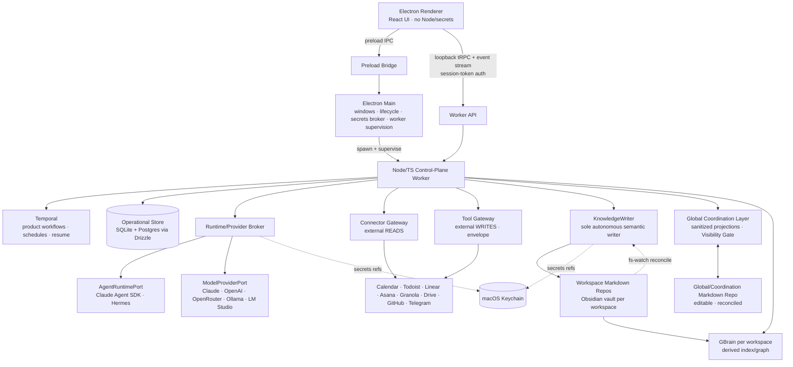
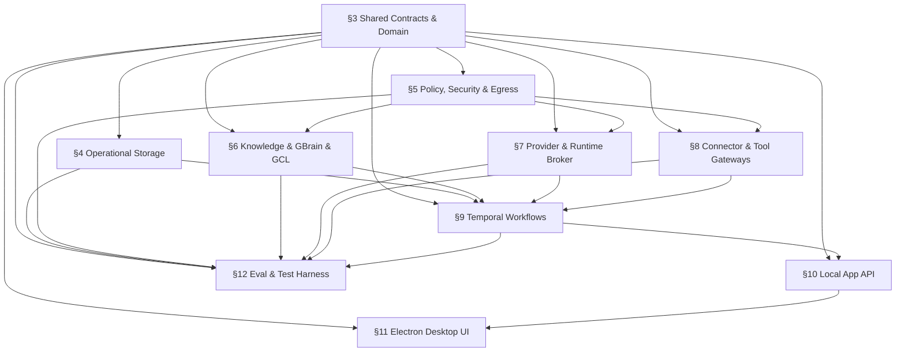

# ARCHITECTURE.md — System of Work Assistant

> **Build contract.** This is the binding architecture. Downstream skills (`/tasks-gen`, the `/tdd` engine, `/check-arch`, the cross-doc-invariants table) treat this file as the source of truth. It is loaded **on demand by `§` anchor**, not whole. Typed models in **Appendix A** are cross-doc invariants: a field change requires editing the model's `§` section and Appendix A in the same round of commits.
>
> **Build posture: production-grade.** Auth, input validation, error paths, idempotency, observability, secrets handling, and a deploy/rollback/repair path are in-scope requirements, not deferrable. Load-bearing safety/security/correctness invariants are never cut.
>
> Source PRD: `system_of_work_assistant_prd_v0_3.md`. Planning artifacts: `docs/planning/`. Finalized by `/arch-finalize` (Brain 2) from the Brain-1 draft `docs/planning/ARCHITECTURE_DRAFT.md`; gap-audit detail in `docs/gap-audits/`. Anchor remap from the draft: `docs/gap-audits/anchor-remap.md`.

## Executive summary

The System of Work Assistant is a **Mac-first, local-first, self-hosted personal operating system** for a single technical owner/operator. It coordinates employer work, personal business, and personal life across external tools while preserving **user-owned Obsidian-compatible Markdown as canonical semantic memory**. It is a *governed local control plane*, not a chatbot and not an all-powerful agent.

The desktop shell is **Electron**: an unprivileged renderer (React), a thin **main** process that owns windows, app lifecycle, secrets brokering, and supervision, and a dedicated **Node/TypeScript control-plane worker** that owns durable workflows, policy, connectors, provider routing, the GBrain adapter, the operational store, outboxes, and read models. The renderer reaches the worker two ways: **preload IPC** for privileged desktop/lifecycle actions and a **loopback tRPC API + event stream** for commands/queries/status — the latter authenticated by a **per-launch session token** (loopback binding is not authentication).

Knowledge and side effects are **gated, never direct**: model/provider outputs and agent results are *candidate data only* until they pass strict JSON-Schema validation and policy checks. Durable **semantic** changes flow only through **KnowledgeWriter** into per-workspace Markdown repos; **external** side effects flow only through the **Tool Gateway** behind an idempotent external-write envelope; **product workflows** are durable **Temporal** workflows. **GBrain is required** for retrieval/graph/health but is **per-workspace and derived from Markdown** — never an independent semantic origin. Cross-workspace global views use a **Global Coordination Layer (GCL)** of sanitized projections, never raw blended retrieval.

The system is **provider-plural**: an `AgentRuntimePort` (agentic runtimes — Claude Agent SDK, Hermes) and a `ModelProviderPort` (raw model providers — Claude, OpenAI, OpenRouter, Ollama, LM Studio) sit behind a Runtime/Provider Broker that routes per a **workspace × capability matrix**, gated by **egress policy** and conformance tests. The operational store ships **SQLite (local) and standard Postgres adapters from day one** through Drizzle.

The subsystem import-direction DAG and the parallel build tracks it yields are in **§2.5**. **Meeting closeout is the primary proof spine**; full PRD V1 stays in scope, sequenced behind shared contracts, storage, workflow durability, provider conformance, and GBrain parity.

> **One-line posture:** *governed local control plane — candidate-data-in, validated-and-policed-out; Markdown is the only canonical semantic truth and KnowledgeWriter is its only autonomous writer.*

## §1 — Goals & non-goals

**Goals**

- Preserve semantic memory in Obsidian-compatible Markdown Git repos, one per workspace, plus a sanitized Global/Coordination repo.
- Keep raw workspace data isolated by default; provide a useful global coordination surface without raw leakage.
- Close meetings into notes, decisions, tasks, calendar proposals, people/project updates, dashboard state, and audit.
- Support daily/weekly/monthly briefs, project dashboards, task routing, cross-calendar scheduling, source ingestion, ingestion-inbox triage, NotebookLM managed-doc sync, approvals (Mac + Telegram), Copilot Q&A, connector sync/health, and System Health.
- Route model work across multiple providers behind strict schema gates and a workspace × capability matrix, with a local zero-egress option.
- Be local-first in V1 with hosted-compatible operational storage (Postgres adapter day one).
- Be installable by other technical users from source.

**Non-goals (V1)**

- No SaaS multi-tenant product; no app accounts beyond the single owner/operator.
- No raw global search across all workspaces by default.
- No direct runtime/GBrain/external-MCP writes into Markdown; no direct external side effects from agents or Hermes automations.
- No NotebookLM direct-API dependency (Drive-backed managed docs only).
- No hosted/always-on control plane while the Mac sleeps (deferred to V1.1 behind the same ports/adapters).
- No final `IMPLEMENTATION_PLAN.md` from this document (that is `/tasks-gen`).

## §2 — System overview



**End-to-end invariant.** Model/provider outputs and agent results are *candidate data only*. They cannot affect Markdown or external systems until **schema validation and policy checks pass** (§3, §5, §7). Markdown commit (KnowledgeWriter) is the semantic durability point; Tool Gateway receipt is the external durability point; everything else is derived/operational.

## §2.5 — Subsystem dependency DAG & parallelization seams

**Import-direction rule:** `apps → application services → contracts/domain → infrastructure adapters`. Infrastructure implements contracts; domain/contracts import no app or adapter code. The renderer imports only UI-safe client contracts, never worker internals.



**Independent subsystems (parallelization seams), after contract freeze.** These tracks share no dependency path and fork in parallel once `§3` contracts are frozen:

- **`contracts`** — `§3`: shared types, JSON Schemas, workspace/capability/provider matrix, Drizzle schema source, test fixtures. *Freezes first; everything else waits on it.*
- **`worker`** — `§4` storage, `§9` Temporal workflows, outboxes, read models, `§10` tRPC API.
- **`knowledge`** — `§6` KnowledgeWriter, Markdown repo/vault rules + fs-watch reconciliation, GBrain adapter, GCL projections + reconcile.
- **`providers-integrations`** — `§7` AgentRuntimePort + ModelProviderPort adapters + Hermes, `§8` Connector Gateway + Tool Gateway.
- **`desktop`** — `§11` Electron shell, preload IPC, React UI; consumes `§10`.
- **`eval-security`** — `§12` EVAL-1 harness, leakage/injection suites, provider/adapter conformance, security gates; consumes contracts + all subsystem outputs.

**Shared contracts across seams (freeze before fork).** Any Appendix-A model whose `§` is crossed by a DAG edge is a cross-track contract: `Workspace`, `ProviderMatrix`, `EgressPolicy`, `ToolPolicy`, `Capability`, `ProviderRoute`, `ProviderProfile`, `AgentJob`, `KnowledgeMutationPlan`, `ProposedAction`, `ExternalWriteEnvelope`, `WriteReceipt`, `Approval`, `SourceEnvelope`, `GclProjection`, `AuditRecord`, `WorkflowRunRef`, `HealthItem`, `NotebookMapping`, and the GBrain write-through/divergence seam models `SemanticFact`, `FactProvenance`, `SignedProvenanceStamp`, `ParityReport`, `Divergence`, `QuarantineRecord`, `GBrainProposedFact`, `GbrainReadGrant`/`GbrainServePolicy`, `GbrainPin` (these cross the knowledge / eval-security / providers-integrations / worker seams). A change to any of these mid-build is a cross-track Finding.

## §3 — Shared Contracts & Domain

**Responsibilities.** Define cross-package TypeScript contracts, the JSON Schemas that gate provider/runtime outputs, the Drizzle schema source for the operational store, and canonical key/ID/idempotency builders. Pure; imports nothing app- or adapter-side.

**Packages.** `packages/contracts` (runtime-safe types, JSON Schemas, tRPC router types, event names), `packages/domain` (pure rules, state machines, validators, canonical-key builders), `packages/db` (Drizzle schema, migrations, repository interfaces, SQLite + Postgres implementations).

**Universal validation rules (enforced wherever data crosses into application services).**

- Every model/provider output validates against a JSON Schema before any downstream use (REQ-S-006).
- Every external write carries a `canonicalObjectKey` and an `idempotencyKey` (REQ-F / §8).
- Every semantic mutation carries `workspaceId` and `sourceRefs` (REQ-F-006).
- Every cross-workspace projection declares a visibility level and source workspace (REQ-F-005 / §6).
- **No-inference rule (REQ-F-017 / MTG-4):** extraction never invents task owners or due dates; unstated values are emitted as `TBD` or routed to clarification — a validator hard-reject, not a model preference.

**Contracts defined here** (full field lists in Appendix A): `Workspace`, `ProviderMatrix`, `EgressPolicy`, `ToolPolicy`, `Capability`, `ProviderRoute`, `AgentJob`, `KnowledgeMutationPlan`, `ProposedAction`, `ExternalWriteEnvelope`, `WriteReceipt`, `SourceEnvelope`, `Approval`, `GclProjection`, `AuditRecord`, `WorkflowRunRef`, `ProviderProfile`, `HealthItem`, `NotebookMapping` — plus the `SecretsPort` interface. Several were under-pinned in the draft and are load-bearing for P0 controls / cross-track seams:

- **`EgressPolicy`** (gates the Employer-Work raw-content egress control, §5/§16.5-PRD): `{ workspaceId, allowedProcessors: ProcessorId[], rawContentAllowedProcessors: ProcessorId[], employerRawEgressAcknowledged: boolean, acknowledgedAt?: string }`. A *processor* is any external recipient of content (a cloud LLM endpoint, OpenRouter, Drive/NotebookLM); local Ollama/LM Studio are non-egress.
- **`ToolPolicy`** (gates the ING-7 untrusted-content admission gate, §5/§7): `{ mode: "read_only" | "scoped_write", allowedTools: ToolId[], deniedTools: ToolId[], allowsMutating: boolean }`. The admission predicate (§5) **rejects at job admission** any untrusted-content job whose `ToolPolicy` admits a mutating tool.
- **`AgentJob` trust fields** (read by both the §5 egress-veto and the ING-7 admission gate): `trustLevel: "trusted" | "untrusted"` (set `untrusted` whenever the job's context includes imported/source content) and `carriesRawContent: boolean` (true when raw workspace content — not just sanitized metadata — is in the prompt). The §5 predicates are pure functions of these fields + `EgressPolicy`/`ToolPolicy`.
- **`HealthItem`** (the typed System Health record consumed by §10/§11/§12): `{ id, failureClass, severity, message, auditRef, openedAt, state: "open"|"acknowledged"|"resolved", resolvedAt? }` with the enumerated OBS-2 `failureClass` taxonomy (Appendix A).
- **`WriteReceipt`** (sub-shape of `ExternalWriteEnvelope.writeReceipt`): `{ externalObjectId, externalUrl?, recordedAt, rawRef? }` — the proof an external write committed exactly once.
- **`NotebookMapping`** (the §8 Drive-backed NotebookLM model): `{ projectId, notebookKey, driveFolderId, managedDocIds }` mapping the five managed-doc slots (00–04) to Drive doc IDs.
- **`SecretsPort`** (interface, V1 adapter = `KeychainSecretsAdapter`): the worker resolves Keychain-referenced provider keys / connector OAuth tokens through this port; callers receive *references*, never raw secrets, and a Keychain-locked/denied state degrades the dependent providers/connectors (§16).

## §4 — Operational Storage

**Responsibilities.** Persist app-owned operational state: event log, audit, approvals, outboxes, connector cursors, provider conformance status, GCL projections, dashboard read models, workspace config (with Keychain *references* only). SQLite local mode + standard Postgres hosted-compatible mode from day one, via Drizzle migrations and a repository contract suite that **both** adapters must pass (REQ-D-002/003). Domain depends on repository interfaces, never a concrete driver; no dialect-specific SQL in domain code.

**Boundaries (source-of-truth, REQ-D-001/004/005).** Does *not* store: semantic truth (Markdown does), Temporal workflow history (Temporal does), GBrain index (GBrain PGLite does, owned solely by GBrain), or secrets (Keychain does). Read models are rebuildable; **event log / audit / approvals / outboxes / connector cursors are operational truth and are not rebuildable** — see §16 Backup & Recovery.

**At-rest encryption.** V1 relies on **macOS FileVault** full-disk encryption as the at-rest control for the operational store and Temporal persistence; FileVault-enabled is a documented install prerequisite surfaced by the install doctor (§13). **App-level encryption (SQLCipher for the operational store + encrypted Temporal persistence) is a V1.1 hardening item** (§15).

**Failure modes (production-grade).**

- *DB unavailable:* worker enters degraded mode, surfaces a distinct System Health item, queues where possible.
- *Migration mismatch / failed mid-apply:* **back up the operational DB before applying any migration**; run migrations transactionally where the engine allows; on partial/failed apply, **restore from the pre-migration backup** and refuse to start with a typed repair message; record an app-version ↔ schema-version compatibility check and refuse to run an incompatible pairing (no silent forward-only break). Down-migration or restore-from-backup is the rollback path (Drizzle is forward-only by default).
- *Adapter divergence:* the SQLite/Postgres repository contract test fails → release blocked.

## §5 — Policy, Security & Egress

**Responsibilities.** Enforce workspace policy, the provider × capability matrix, **egress policy**, **tool policy**, approval policy, and visibility levels. The four hard denials: Employer-Work raw cloud egress unless the workspace gate is acknowledged; direct raw cross-workspace retrieval; untrusted-content agent jobs that declare mutating tools (ING-7 admission gate); and any write adapter called outside the Tool Gateway / KnowledgeWriter.

**Renderer ↔ worker authentication (production-grade — loopback is not auth).** The worker API binds loopback only **and** requires a **per-launch session token** minted by Electron main, injected into the renderer **only via preload** (never discoverable by other localhost clients), and required on every tRPC call and on the WS/SSE event-stream handshake. A strict **Origin/Host allowlist** rejects cross-origin/DNS-rebinding callers. Unauthenticated or wrong-origin callers are rejected before any handler runs. (Transport stays loopback TCP for V1; Unix-domain-socket transport is a V1.1 hardening option, §15.)

**Provider/egress composition (the veto rule — closes the "matrix can bypass egress" gap).** Egress policy is evaluated **after** provider selection and acts as a **veto**: for an Employer-Work `AgentJob` with `carriesRawContent = true` and `employerRawEgressAcknowledged = false`, the Broker may select **only a loopback local provider** (Ollama/LM Studio); if none is available/conformant the job **fails closed** — there is no cloud fallback. (The ING-7 admission gate keys off `AgentJob.trustLevel = untrusted`; both predicates are pure functions of the §3 `AgentJob` trust fields + `EgressPolicy`/`ToolPolicy`.) OpenRouter is treated as its **own** processor (not an OpenAI-compatible alias) in `EgressPolicy`. Local endpoints are allowed only through explicit local-provider config (no arbitrary provider URL for sensitive work).

**Electron security.** Renderer: `contextIsolation` on, no Node integration, no direct DB/filesystem/secrets/connector access. Preload exposes a narrow typed IPC surface for privileged desktop/lifecycle actions only.

## §6 — Knowledge: Markdown, Obsidian, GBrain & GCL

**Responsibilities.** Preserve Obsidian-compatible Markdown as canonical semantic truth; one repo/vault + one GBrain brain per workspace; a sanitized Global/Coordination Markdown repo; the GCL DB as the cross-workspace Visibility Gate.

**KnowledgeWriter (sole autonomous semantic writer, REQ-F-006).** Accepts only validated `KnowledgeMutationPlan`s. **Preserves human-owned sections** (REQ-F-016 / KN-7): assistant-generated regions are bounded by explicit start/end markers with stable IDs (KN-8); an attempted overwrite of a human-owned region is rejected and audited. Writes atomically with a **compare-revision precondition**; runs an ownership check and a **blocking secret scan** before commit (reject, do not redact); records revision, actor, source event, workflow run, idempotency key, audit summary; triggers GBrain sync/re-index **after** the Markdown commit (async, idempotent, never rolls back the commit).

**Out-of-band writers — Obsidian Sync / iCloud / git pull are a SUPPORTED V1 configuration.** Because the owner may run Obsidian Sync, iCloud, or a git remote on the vaults, KnowledgeWriter is **not** the only possible writer of the working tree. A per-vault **file watcher** detects external working-tree changes, recomputes the on-disk revision, and reconciles against the compare-revision precondition: a clean external change advances the base revision; a conflicting concurrent change (KnowledgeWriter vs external) produces a **conflict-review item** in System Health rather than a silent lost update. Pending KnowledgeWriter writes are applied before queued GBrain index jobs on wake; index jobs re-derive from current Markdown by revision id. Reconciliation uses **positive KnowledgeWriter attribution** (a `kw_writer_sig` + write-journal): any working-tree Markdown mutation that is *neither* a verified KW write *nor* a human-owned-REGION edit — **including a new assistant-domain file** — becomes a conflict-review item and **never** auto-advances the base revision (closing the out-of-band hidden-brain hole); a human-REGION edit still clean-advances. **OS-level one-writer lockdown (REQ-S-NEW-008):** the worker is the sole OS principal with write access to the vault directory (filesystem ACL) and the sole PGLite advisory-lock holder; **every** gbrain process (import/sync/extract/oracle/doctor/lint) runs against a **read-only mount / immutable revision snapshot**, so a gbrain write to canonical `.md` is physically impossible and an fs-write during an index job is a hard alarm by construction.

**GBrain (derived, per-workspace).** Capability surface required in V1 (REQ-F-019 / KN-2): search, typed graph, timelines, schema-read, health, **contained** think/synthesis — **read/query only** at the runtime MCP boundary. gbrain is **DB-first natively** (`put_page`/`dream`/`synthesize`/`patterns`/Minions write the DB, never canonical Markdown); SoW **inverts this by policy** (the only Markdown→DB direction is `import`/`sync` *after* a KnowledgeWriter commit) and enforces it with the write-through & divergence layer below. The read/analysis surface (search, graph, timeline, salience, anomalies, code-search) is used freely; gbrain's generative features are a **gated proposal source**, never an autonomous writer.

**GBrain write-through & divergence/parity layer (V1, fail-closed, REQ-K-NEW-001/002/003).** Write-through ships **ON in V1** (reversing the read-only deferral), protected by a layer that fails closed; read-only/index-only is retained as the per-workspace **default-until-enabled fallback + kill switch** (still DoD-satisfying — the index is fully rebuildable from Markdown, REQ-D-001). Seven invariants:
- **(i) Bytes-from-Markdown serving.** The GBrain DB is a **pointer/ranking index, never a byte source**; the serving gate re-hydrates every served fact's bytes from committed Markdown and hash-matches them at the current revision. A DB-only fact has no bytes to serve.
- **(ii) gbrain-independent canonical derive.** A SoW-owned, gbrain-INDEPENDENT Markdown parser (`CanonicalFactDeriver`) is the sole trusted "what should exist" set; the `gbrain import`-into-scratch rebuild oracle is a **corroborating cross-check only** (disagreement is a defect, never a calibration target). gbrain is out of its own checker's trust base.
- **(iii) Signed provenance.** KnowledgeWriter writes an **HMAC `SignedProvenanceStamp`** at commit (key via SecretsPort, unreachable by the generative / DB-write / runtime paths); serve-time content rebinding makes a copied/forged stamp fail.
- **(iv) Revision-scoped allow-set, quarantine = absence.** The allow-set is the canonical fact SET @ current revision (monotonic compare-and-set; pointer never regresses); a quarantined fact is *absent*, keyed on a content-independent `factIdentity` so it cannot resurrect via a one-byte change.
- **(v) Default-deny ServingGate + ContainedSynthesisGate.** A fact serves only if `Markdown-rehydrated AND signature-valid AND in-allow-set AND not-quarantined`; `think`/Copilot synthesis runs ONLY over the gated, rehydrated context, never the raw store.
- **(vi) Propose-only generative path.** Generative outputs reach canonical state only as a `GBrainProposedFact` → JSON-Schema + no-inference gate → `KnowledgeMutationPlan` (`provenanceOrigin='gbrain_proposal'`) → KnowledgeWriter → Markdown; evidence must cite already-canonical Markdown / an ingested `SourceEnvelope` (the proposal's own scratch origin is inadmissible). gbrain in-engine `dream`/`autopilot`/`sync --install-cron` auto-write-and-serve modes are **hard-disabled in V1**.
- **(vii) Enablement gate.** `writeThroughEnabled` (per-workspace, default **OFF**) flips ON only when the four §12 GO conditions pass LIVE against the pinned gbrain SHA; a dirty/failed `ParityReport` auto-reverts the workspace to Markdown-provenanced-only. Divergences classify into a closed lattice (`db_only`/`unstamped` HARD floor `| content_mismatch` Markdown-wins-resync `| md_only` benign `| edge_* | stale_revision`) → quarantine + `parity_defect` HealthItem → materialize-via-plan or purge-only. **(Full spec: `docs/design/gbrain-write-through-divergence.md`.)**

**GCL (Global Coordination Layer — Visibility Gate, REQ-F-005 / WS-8).** Stores identity map, busy/free, deadlines, sanitized summaries, priority metadata — **never** raw Employer-Work or raw workspace content by default. It is the **single** cross-workspace read path; agents may not issue direct cross-brain GBrain queries. The **Global/Coordination Markdown repo is human-editable and reconciles back into the GCL DB** (owner choice): the GCL DB remains the queryable master, the Markdown is an Obsidian-editable surface, and a watcher reconciles owner edits into the DB (visibility-level validation on reconcile; conflicts → review item). **Explicit cross-workspace links (REQ-F-020 / WS-5, Level-3)** are user-approved associations recorded in the GCL identity map; they are the only way raw content crosses, and only on explicit approval.

**Deletion (saga, REQ-F-013 — see §9).** The cross-store purge is a compensating saga owned by the deletion workflow.

## §7 — Provider & Runtime Broker

**Two ports, two layers (resolves the AgentRuntimePort/ModelProviderPort conflation).**

- **`AgentRuntimePort` — agentic runtimes** that carry tool-policy/MCP/structured-output/subagent semantics: `ClaudeAgentSdkRuntimeAdapter`, `HermesRuntimeAdapter` (RT-1). These run `AgentJob`s that need GBrain MCP access, tool use, and subagents.
- **`ModelProviderPort` — raw model providers** for schema-validated latent extraction/synthesis without agentic tool loops: Claude, OpenAI, OpenRouter, Ollama, LM Studio (REQ-F-015 / ADR-004). "Claude" appears in both layers intentionally — the Claude *Agent SDK* runtime vs the Claude *model* provider are distinct adapters.

**Runtime/Provider Broker.** Accepts `AgentJob`s from workflows; resolves the route via the **workspace × capability matrix** (`ProviderMatrix`), then applies, in order: **egress veto** (§5) → provider health/model availability → **budget caps** (`maxRuntimeSeconds`, `maxCostUsd`) → schema/tool policy. Normalizes outputs into capability schemas. **Strict side-effect rule:** provider/runtime output → schema gate → validator → `KnowledgeMutationPlan`/`ProposedAction` → KnowledgeWriter/Tool Gateway. No provider output calls a write adapter directly.

**Critical-path routing (owner finalization decision — supersedes PRD §20.2's fixed-runtime wording).** The provider matrix **may route the meeting-closeout critical path to any conformance-passing provider/runtime** per workspace policy; there is no single hard-wired reference runtime. **DoD consequence:** the build can certify the meeting-closeout DoD only if **at least one conformant provider/runtime is configured for the `meeting.close` capability** in the exercised workspace; the Employer-Work branch additionally requires the egress acknowledgment ON (or a conformant local provider). Claude Agent SDK and Hermes remain required, DoD-tested adapters; Hermes is not required for a baseline fresh install (REQ-I-002/003).

**Budget enforcement (REQ-S-007 / COST-1/2).** Every `AgentJob` enforces `maxRuntimeSeconds` and, when set, `maxCostUsd`: breach cancels the job, records it (§16.3-audit), surfaces a System Health item (OBS-2), and leaves no partial uncommitted side effect. The Broker applies a configurable **default** cap to LLM-calling jobs that lack one (COST-2). Aggregate per-workspace/global spend caps with auto-pause are V1.1 (§15).

**Conformance is the contract.** OpenAI-compatible endpoints are **not** assumed behaviorally identical; each provider × capability × pinned-model pair must pass conformance (§12) before it is eligible in the matrix; failing pairs are disabled. Local providers are an **optional zero-egress path, not a release gate**. **Phase-0 spikes (named here):** *Hermes Adapter Surface* (API server vs TUI gateway vs Python wrapper vs Kanban vs hybrid — OQ-007; no-go branch: Claude SDK / another agentic runtime carries the critical path, Hermes stays required+DoD-tested but not first-install gating) and *Provider conformance* (pin exact provider/model pairs; pricing/model-IDs/limits/structured-output fidelity are volatile, OQ-003). **Resolved (Phase 0):** the Hermes surface is **HYBRID** — a one-shot CLI subprocess (`hermes chat -q … -Q -t <readonly> -m … --provider …`) as the primary synchronous `HermesRuntimeAdapter` (a live meeting-close mock passed: clean JSON, schema gate, no-inference held, SIGTERM cancel = no side effect), plus Kanban for the §9 RT-7 autonomous-automation path. **⚠ Security invariant (banked, `packages/providers/LESSONS.md`):** an *empty* `-t` toolset silently falls back to the user's full (mutating) config toolset — a read-only / untrusted-content (ING-7) Hermes run MUST pass an **explicit minimal toolset**, never empty. Provider conformance resolved: default models per capability + caps recorded in `config/providers.defaults.json`; OpenRouter `deepseek/deepseek-v4-pro` + `anthropic/claude-haiku-4.5` are live-verified conformance-passing; OpenRouter is its own processor, never an OpenAI alias (§5).

## §8 — Connector & Tool Gateways

**Connector Gateway (external READS).** Owns outbound reads/syncs, connector auth scoping, cursors, retry/backoff, and health/reachability signals for Calendar, Todoist, Linear, Asana, Granola, Drive/Docs, GitHub, Telegram capture, and URL/source adapters. **Connector-unreachable behavior (REQ-I-005 / LIFE-4):** inbound syncs queue and retry with bounded exponential backoff; the connector is marked degraded in System Health (OBS-2); no silent drops; drain on reconnect (wired to LIFE-6 wake hooks). The MCP connectors (Linear/Asana/Granola) are remote vendor services, not local.

**Tool Gateway (external WRITES — the only external-write path).** Owns all external writes behind the **external-write envelope**: approval policy, `idempotencyKey`, `canonicalObjectKey`, preconditions, **pre-write existence check** (vendor create-tools lack native idempotency keys, so match-by-canonical-key-then-reuse-on-hit is mandatory before every create), payload hash, and write receipt. Replay reuses the receipt/matched object → **no duplicate external writes** (the §20.1 replay gate). Outbound writes during connector outage hold in the **write outbox** and retry on reconnect.

**NotebookLM (Drive-backed, REQ-I-004 / NLM-2).** The `notebooklm.sync` capability upserts the managed Drive docs (00 Brief / 01 Decisions / 02 Meeting Digest / 03 Research / 04 Open Questions) per `notebookMapping` through the Tool Gateway/NotebookPort; continuous auto-sync of arbitrary docs is **not** assumed (the flow surfaces a "re-add/refresh NotebookLM source" state). Direct NotebookLM API is V1.1/spike-gated (§15).

## §9 — Temporal Workflows & Automation

**Responsibilities.** Own product workflows, retries, approval waits, schedules, and resume. Durable schedules run **missed occurrences once, collapsed, on wake** within the catch-up window (LIFE-2); in-flight workflows **resume after restart/sleep** and reuse the §8 envelope so no external side effect is duplicated (LIFE-3, REQ-NF-006). State machines for Source, Meeting Closeout, Knowledge Mutation, Proposed External Action, AgentJob, and Approval are normative in `docs/planning/DOMAIN_MODEL.md` and binding here.

**Core workflows (each a `WorkflowRun`).** The draft listed five; the gap audit surfaced the rest as in-scope-but-unspecified. Full V1 set:

1. **Meeting closeout** (proof spine) — Granola poll → correlate (calendar/workspace/project/attendees/history; low confidence → Ingestion Inbox) → `meeting.close` AgentJob (read-only tool policy on untrusted transcript; provider/model per matrix; budget; idempotency; output schema) → validator (rejects missing evidence, inferred owners/dates per REQ-F-017, unsupported claims, ambiguous routing, schema/tool-policy violations) → KnowledgeWriter (meeting/project/person/decision/daily/source) → Tool Gateway (proposals/writes) → GBrain re-index → dashboard/Telegram/audit/read-models.
2. **Daily brief** — durable schedule or collapsed wake catch-up → connector refresh → GCL projections → briefing agent (GCL global scope + in-scope workspace brains) → KnowledgeWriter workspace briefs + Global/Coordination brief → Telegram summary.
3. **Weekly / monthly review** *(new)* — period-windowed inputs (period meetings/decisions/commitments, project-progress deltas, recurring-blocker detection) → workspace + global outputs via the GCL Visibility Gate → LIFE-2 catch-up semantics. Distinct from the daily brief (BRF-1).
4. **Source ingestion** — `SourceEnvelope` register → adapter extract → route (low confidence → Inbox) → read-only source agent → KnowledgeWriter → optional NotebookLM managed-doc sync → GBrain index.
5. **Ingestion-inbox triage** *(new)* — user disposition of a parked `SourceEnvelope` (Mac or Telegram): re-classify workspace/project, apply routing override, set sensitivity, **re-enter the ingestion pipeline reusing the same idempotency key** (replay-safe). Resolves the ING-4 dead-end.
6. **Cross-calendar scheduling** — intent → GCL busy/free across calendars → propose windows (generic conflict explanations) → auto-create private personal event if policy allows; shared/invite/external → Approval Inbox.
7. **Project sync** — registry resolves task systems/plan path/progress providers → deterministic parser (no model-only percentages, REQ-F-011) → agent synthesis → KnowledgeWriter status → read model.
8. **Approval flow** — Tool Gateway records pending action (canonical key, payload hash, required approval, expiry/visibility) → Mac + Telegram card → approve/edit/reject/**defer** → idempotent apply or record → audit + read models **exactly once**. *Deferred-approval default (resolved):* a deferred item re-surfaces after a configurable snooze (default 24h) and auto-expires after a configurable window (default 7d); `deferred` is non-terminal (`deferred → pending | expired`).
9. **User-initiated cross-store deletion (saga)** *(elaborated, REQ-F-013)* — validate explicit intent → build a deterministic deletion plan → ordered, per-step-idempotent steps: **Markdown tombstone via KnowledgeWriter (commit point)** → GBrain purge/re-index → event-store tombstone (history preserved, not silently deleted) → read-model + external-ref reconciliation. Partial failure → compensating/retry states surfaced in System Health; idempotent re-drive on crash; no orphan/resurrection (Flow 7 failure states).
10. **Connector sync & health** *(new)* — scheduled/wake-triggered poll per connector → cursor advance → health signal; unreachable branch per §8 (queue/hold/backoff/drain, surface in System Health).
11. **System Health surfacing** *(cross-cutting workflow/§16)* — each OBS-2 failure class (connector outage, failed/blocked write-through, budget breach, missed/late schedule, schema rejection) → distinct typed health item linked to its audit record, persistent until resolved/acknowledged.
12. **NotebookLM managed-doc sync** *(new)* — assemble doc bodies from Markdown → idempotent upsert per `notebookMapping` via Tool Gateway/NotebookPort → surface re-add/refresh state.
13. **Copilot Q&A** *(new, read path)* — owner question (Mac/Telegram) → workspace-scoped retrieval (or GCL Visibility Gate for global) → schema-gated synthesis with citations → **no side effects** (proposals only if the owner asks to act). Distinct from the write/automation workflows.

**Hermes autonomous automation (REQ-F-014 / RT-7).** Hermes cron/Kanban **may** initiate user-defined automations, but every external side effect routes through the **Tool Gateway** and every semantic write through **KnowledgeWriter** — duplicate-write safety and the one-writer invariant are enforced by the gateways, not by forbidding a second scheduler. Hermes is **not** the product-workflow source of truth (Temporal is). A dedicated test proves a replayed Hermes automation produces no duplicate external action and no direct Markdown/GBrain write (§12).

## §10 — Local App API

**Responsibilities.** Expose typed worker commands/queries and a status/event stream to Electron. **tRPC** for TypeScript-native commands/queries (`httpBatchLink` over loopback); a single push stream over **WebSocket** — a tRPC v11 subscription (`applyWSSHandler`/`wsLink`) — for workflow status, approval updates, System Health, and read-model changes (**resolved by the Phase-0 API spike, OQ-002**: both WS and SSE validated lossless under disconnect via a transport-agnostic router (`tracked(eventId)` + `lastEventId` + bounded replay buffer); **WS wins on loopback auth** — the per-launch session token rides the first socket message, never a URL, honoring the §16 secrets-in-logs rule; SSE via `httpSubscriptionLink` is the validated drop-in fallback). Consumers are **idempotent by event id** (at-least-once); the server async-iterable is bounded by the replay window. See `docs/spikes/0.5-api-stream.md`.

**Boundaries & auth.** Loopback-only **and** session-token-authenticated (§5) on every call and on the stream handshake, with Origin/Host allowlist. The renderer receives **UI-safe projections**, never secrets or unfiltered raw data. Privileged app-lifecycle and file-picker operations stay on preload IPC / main. Reconnection/backpressure semantics are pinned in the API spike.

## §11 — Electron Desktop UI

**Surfaces (REQ-UX-001).** Global Today Dashboard, Workspace tabs, Project dashboard, Copilot, Ingestion Inbox (with **triage resolution**, workflow 5), Approval Inbox (Mac + Telegram parity), Calendar view, Recent Changes, System Health.

**UX rules.** Global surfaces show **GCL sanitized grouped results** with drill-down into workspace-scoped raw context per policy (REQ-UX-002). Employer-Work egress status is visible in System Health and workspace settings (REQ-S-002). Approval state is consistent across Mac and Telegram (single idempotent transition). **Workspace presets (REQ-UX-005 / WS-6):** first-run onboarding offers Simple / Professional / Founder / Advanced presets that scaffold workspaces, repos, and brains. Obsidian remains a first-class editor for workspace repos and the global coordination repo (REQ-UX-003).

## §12 — Eval & Test Harness

**Posture:** contract/eval-heavy (REQ-T-002). Every PRD §20.1 acceptance test and §5.4 metric maps **1:1** to a named suite/fixture (the audit found seven DoD-required suites missing from the draft). Required suites:

- Drizzle migration + repository **contract tests on SQLite *and* Postgres** (Postgres is not a permanent stub — it must pass the same suite before DoD, REQ-D-003).
- **Provider conformance** per enabled provider × capability × pinned model; **runtime adapter conformance** for Claude SDK and Hermes (REQ-I-001/002/003).
- KnowledgeWriter ownership/merge/secret-scan tests; **human-section preservation** (KN-7); **out-of-band-writer reconciliation** (Obsidian Sync/iCloud/git) conflict test.
- **GBrain write-through divergence/parity suite** *(REQ-K-NEW-001/002/003, expanded)* — the **four GO conditions as V1 acceptance gates**, against **real gbrain 0.35.1.0 + a real embedding key** (never a `noEmbed`-degraded index): **#1** one-writer/no-hidden-brain (read-only-mounted vault; zero non-KW `.md` mutations; stray `frontmatter --fix`/`writeBrainPage` + new assistant-domain out-of-band file → conflict-review, never auto-advance); **#2** no-lost-update (concurrent `sync` vs immutable snapshot + out-of-order triggers → final allow-set == derive(N+1), lower-revision apply a no-op, withhold-during-window); **#3** parity catches DB-only facts incl. the **borrowed-stamp** and **forged-content_hash-collision** adversarial cases + the **common-mode-malicious-gbrain** case (each → `db_only`/`unstamped` HARD floor, quarantined, served by neither the keyed gate nor contained-synthesis); **#4** round-trip semantic-field lossless (SoW parser as the reference side, slug-strip/frontmatter-reformat tolerated). Plus the **bytes-from-Markdown serve test**, the **ContainedSynthesisGate** quarantined-fact-leak test, the **read-token-rejects-write** conformance against the *pinned* SHA, and the **divergence fail-closed suite** (monotonic apply / out-of-order drain / crash-recovery rebuild from the gbrain-independent derive / quarantine-non-resurrection / `content_mismatch` Markdown-wins). The **enablement gate** keeps `writeThroughEnabled` OFF until #1–#4 are green live and `config/gbrain.pin` is promoted out of the `PENDING_LIVE_VALIDATION` sentinel.
- Tool Gateway idempotency/replay; **connector outage/retry**; **calendar-conflict / all-availability-sources** safety *(added)*; **project-progress deterministic-parser** (no model-only %) *(added)*.
- **Retention/deletion cross-store purge** saga *(added, REQ-F-013)*; **budget-cap COST-1** cancel-with-no-partial-side-effect *(added)*; **Hermes standalone-automation** gateway-routing replay *(added, RT-7)*; **egress-acknowledgment ON/OFF** *(added, REQ-S-002)*; **System Health surfacing** per failure class *(added, OBS)*.
- Prompt-injection red-team corpus (5 PRD vectors + cross-workspace exfiltration); **WS-7 workspace-leakage** suite — **leakage corpus ≥15 cases** (resolved default: the five §16.1 vectors plus the cross-workspace disclosure case), recorded in EVALUATION_CRITERIA.
- **EVAL-1** meeting-closeout (≥20 labeled transcripts) and retrieval (≥30 queries) benchmarks; corpora versioned, drafted in Phase 0 (REQ-T-001).
- **Performance & latency benchmark** *(added, REQ-NF-002/003)*: instruments KnowledgeWriter→GBrain→read-model for p95 and dashboard warm-load — recorded thresholds ≤60s / ≤10s / <2s; matching rows added to the EVALUATION_CRITERIA acceptance matrix. (Other interactive latency budgets are set in the Phase-0 perf pass, §18.)
- Electron security/IPC + **worker-API session-token/Origin auth** tests; Temporal sleep/wake/restart; clean-install test.

**DoD cannot be satisfied by mocks** — final DoD requires the real integrations exercised by these suites (CONSTRAINTS).

## §13 — Deployment, Install, Rollback & Repair

**V1 local.** Electron main starts thin and **supervises** the control-plane worker (supervision contract in §16). The worker starts/connects to a **local Temporal dev server with persistent storage** (`--db-filename` SQLite under app data, never in-memory), opens the operational **SQLite** by default, and starts a **single-owner GBrain process/sidecar per workspace brain** (exactly one process owns each PGLite file). All local services **bind loopback only**; the worker API additionally enforces the §5 session-token + Origin auth. External connector credentials and provider keys live in **macOS Keychain**.

**Packaging (owner decision).** **V1 ships an unsigned build-from-source** (matches the open-source install-from-GitHub goal). A **signed + notarized DMG is a V1.1 deliverable** (§15). A **Phase-0 Electron shell/packaging spike** validates packaging + supervision of the spawned Node worker, Temporal dev-server, and GBrain subprocesses, plus hardened-runtime entitlements (OQ-001/OQ-004-question).

**GBrain version-pin, upgrade & write-through enablement gate** *(added; amended for write-through)*. The typed `GbrainPin` (Appendix A) is recorded in `config/gbrain.pin`; it must be **re-captured against the installed gbrain 0.35.1.0** (`gbrain --version` + `gbrain doctor --json` schema_version), **retiring the v0.18.2 / `PENDING_LIVE_VALIDATION` sentinel**. The GBrain process verifies the running version matches the pin at startup (mismatch or `PENDING` sentinel → degrade to read-only/index-only + System Health). A pin bump **and** flipping `writeThroughEnabled` ON (per-workspace) are gated on: the §12 four-GO divergence suite + the read-token-rejects-write conformance green **against the actual pinned SHA**, a full re-index from Markdown, a present embedding key, and **no `dream`/`autopilot`/`sync --install-cron`/`jobs-work` bound to the canonical brain**. The install doctor additionally verifies the **vault filesystem-ACL / read-only-mount posture** and runs a **continuous probe** for any stray write-capable gbrain process bound to a canonical brain.

**Migrations & rollback** *(added, see §4)*. Back up before migrate; transactional apply where supported; restore-from-backup + typed repair message on failure; app-version ↔ schema-version compatibility refusal.

**Install doctor / repair.** A `doctor`/repair command checks prerequisites (Node/pnpm, FileVault on, Keychain reachable, Temporal/GBrain startable, loopback ports free, git remotes configured) and reports typed repair steps; the **clean-install acceptance** test exercises the documented path on the default provider runtime without Hermes (REQ-NF-005).

**Hosted-compatible (V1.1).** Operational store supports standard Postgres from day one; the hosted always-on control plane is V1.1 behind the existing `WorkflowHostAdapter` / `EventIngressAdapter` / `InstanceLeaseAdapter` seams. Supabase may host Postgres later but is not an architecture dependency.

## §14 — Alternatives considered

- **Tauri vs Electron** → Electron (TypeScript-first control plane, fewer Rust/Node seams; ADR-001). *Reopen if the Phase-0 Electron security/packaging spike fails.*
- **Monorepo subdirs vs repo/vault per workspace** → per-workspace (privacy + Obsidian alignment; ADR-002).
- **Source-scoped personal GBrain vs brain per workspace** → brain per workspace (stronger isolation; ADR-002 fallback = source-scoped if multi-brain ergonomics fail).
- **SQLite-only vs dual SQLite/Postgres** → dual day one (hosted-compatible; ADR-003).
- **Global raw search vs GCL projections** → GCL projections (privacy).
- **Cloud-only vs cloud + local models** → cloud + local, local optional + conformance-gated (ADR-004).
- **Fixed Claude critical-path vs matrix-routed** → matrix-routed, conformance-gated (owner finalization decision; §7).
- **Single semantic writer vs allow Obsidian-Sync out-of-band writes** → supported, with fs-watch reconciliation (owner decision; §6).

## §15 — Scope boundaries & deferred work

**Deferred to V1.1+:** hosted always-on control plane while the Mac sleeps; NotebookLM direct-API adapter; **signed + notarized packaging**; **app-level at-rest encryption (SQLCipher / encrypted Temporal persistence)**; **Unix-domain-socket worker-API transport**; Supabase-specific Auth/Realtime/Storage/Edge; 1Password/pluggable secret providers; Gmail/Slack; advanced OCR/PDF beyond V1 source adapters; aggregate workspace/global spend caps with auto-pause; deeper retention/pruning controls; multi-user/team mode.

**Not deferred (in V1):** idempotency, approvals, audit, provider schema validation, prompt-injection defense, workspace isolation, **EgressPolicy/ToolPolicy enforcement**, **worker-API auth**, **logging redaction**, secrets handling, error paths, retry/outbox, System Health, **deletion saga**, **out-of-band-writer reconciliation**, **backup/recovery**, GBrain parity + version-pin gate, and install reproducibility.

## §16 — Cross-cutting concerns

**Observability, structured logging & redaction** *(added — closes the unlogged-egress gap)*. Structured logs carry correlation/workflow-run IDs. A **mandatory redaction layer** strips credential-shaped strings and raw-content fields (provider prompts, raw Employer-Work content, `AgentResult.logs`) **before any log sink**; prompts/raw payloads are never logged at default level. System Health is the operational surface (OBS-1/OBS-2): connector status, GBrain health, workflow run status (last/next/failed), queue/outbox depth, blocked write-throughs, GBrain sync lag, agent cost, approval backlog. Each item is a typed `HealthItem` (§3 / Appendix A) carrying its OBS-2 `failureClass`, `severity`, `auditRef`, and `state` (open\|acknowledged\|resolved) — a distinct, persistent, audit-linked record per failure class. `HealthItem`s are operational truth (not a rebuildable read model), so they are covered by §16 Backup & Recovery.

**Worker supervision & lifecycle** *(added)*. Electron main supervises the worker with **restart-on-crash + bounded backoff** and a **crash-loop threshold** that surfaces a "worker down" System Health/UI state instead of looping; on respawn the worker **re-acquires the single-instance lease (LIFE-1)**; in-flight side effects are recovered via Temporal resume + the §8 envelope. **Temporal-unavailable** and **Keychain-locked** are first-class degraded modes: Temporal down → block workflow dispatch, surface health, retry connection with backoff, report repair; Keychain locked/denied → the `SecretsPort` (§3; `KeychainSecretsAdapter`) surfaces a typed unavailable result, the worker marks affected providers/connectors degraded, holds dependent jobs retryable, and re-attempts on unlock (LIFE-6 wake/power hooks). Secrets are resolved only through `SecretsPort`; callers receive references, never raw secret material.

**Backup & recovery** *(added)*. Workspace repos and the Global/Coordination repo are backed by the owner's **Obsidian Sync / iCloud and/or a configured git remote** (supported V1 config; the install doctor checks a remote is configured or records an explicit local-only acceptance). The **operational DB and Temporal persistence are operational truth and not Git-backed** → a periodic local backup (pre-migration backup is mandatory, §4) with documented restore; remote operational-DB backup is an owner option. The **`QuarantineLedger` + `ParityReport`s are likewise operational truth (not rebuildable)** and are covered by this backup; the parity **allow-set is rebuildable from Markdown** by the gbrain-independent `CanonicalFactDeriver` on crash recovery (so a crash never strands a true fact un-served nor resurrects a quarantined one). The **HMAC provenance-stamp-signing key** is a SecretsPort/Keychain-managed secret kept unreachable by the generative / DB-write / runtime paths; **key rotation invalidates historical stamps** → a re-stamp-on-rotation migration or a multi-key verify window is required. Keychain export/restore guidance is documented.

**Configuration & time.** Non-secret config in `.env`/config files (never secrets — Keychain only). Catch-up/scheduling use persisted last-run bookkeeping (monotonic where available), not naive wall-clock comparison, surviving NTP correction on wake (LIFE-5).

**Error-handling convention.** Every cross-subsystem operation has a typed result with explicit failure variants; failures route to the retry/write outbox and/or a System Health item; nothing fails silently.

## §17 — Repo scaffold

```text
apps/
  desktop/        Electron renderer, main, preload
  worker/         Node/TS control-plane worker runtime
packages/
  contracts/      shared types, JSON Schemas, tRPC router types, event names
  domain/         pure domain rules, state machines, validators, key builders
  db/             Drizzle schema, migrations, repository interfaces, SQLite/Postgres adapters
  workflows/      Temporal workflow definitions + activities
  policy/         workspace, egress, tool, approval, provider-matrix logic
  knowledge/      KnowledgeWriter, Markdown repo/vault adapter + fs-watch reconcile, GBrain + GCL adapters
  integrations/   Connector Gateway + Tool Gateway adapters (+ NotebookPort)
  providers/      AgentRuntimePort + ModelProviderPort adapters
  ui/             shared UI primitives (if needed)
  evals/          EVAL-1 harness, fixtures, conformance + security suites
docs/
  planning/       Brain-1 planning package
  gap-audits/     Brain-2 gap audit + anchor remap
```

Tooling: **pnpm workspaces + Turbo**, TypeScript strict, Drizzle migrations, JSON-Schema validation, cross-package contract tests. (Exact package names are an implementation detail, OQ-009; `packages/adapters` may be split as above into `integrations`/`providers`.)

## §18 — Open questions

| ID | Question | Disposition |
|---|---|---|
| OQ-001 | Electron signing/notarization for V1 | **Resolved:** unsigned build-from-source V1; signed+notarized V1.1 (§13/§15). |
| OQ-002 | Worker stream primitive (WS vs SSE) | **Resolved (spike 0.5):** WebSocket (tRPC v11 subscription); SSE the validated drop-in fallback (§10). |
| OQ-003 | Default models per provider/capability | **Resolved (spike 0.4):** defaults + caps in `config/providers.defaults.json`; OpenRouter `deepseek/deepseek-v4-pro` + `anthropic/claude-haiku-4.5` live-verified conformance-passing (§7). |
| OQ-004 | Default `maxRuntimeSeconds`/`maxCostUsd` per capability | **Resolved (spike 0.6):** per-capability caps set (`config/providers.defaults.json`); global `maxCostUsd` 0.50, `meeting.close` 1.0; local runtime ×3 multiplier. |
| OQ-006 | Known-good GBrain SHA | **Superseded by the write-through amendment:** typed `GbrainPin` re-captured vs gbrain 0.35.1.0 (sha 3933eb6a, schema_version 2); the validated pin + `writeThroughEnabled` are gated by §13 / tasks 12.22/12.23. |
| OQ-007 | Hermes integration surface | **Resolved (spike 0.3):** HYBRID — one-shot CLI subprocess (primary) + Kanban (RT-7); empty-`-t`→full-toolset security caveat banked (§7). |
| OQ-010 | Global repo Obsidian-vault by default | Default yes; editable + reconciled (§6). |
| OQ-011 | First source adapter (YouTube vs podcast) | YouTube first (implementation detail). |
| OQ-012 | NotebookLM managed-doc depth | 00–04 pack (§8). |
| Perf-pass | Meeting-closeout E2E latency, Copilot/approval round-trip, ingress→workflow-start, single-machine concurrency cap, default per-job cost cap | **Resolved (spike 0.6) — advisory SLOs SET, enforcement deferred to a measured Phase-7/12 pass:** meeting-close E2E p95 ≤180s cloud/600s local; Copilot TTFT ≤3s, full ≤20s cloud/45s local; approval state-reflect ≤2s, external-write ≤10s; ingress→wf-start ≤2s; concurrency 4 cloud / 1 local AgentJobs (Temporal 16 activity / 32 wf-task slots). The three PRD budgets (dashboard <2s, KW→GBrain ≤60s p95, KW→dashboard ≤10s p95) remain hard gates. |

---

## Spec Anchor Index

Requirement → contract traceability. `tasks-gen` derives REQ→task coverage from this index plus each phase's `Spec anchors:` line. The seven `REQ-*-NEW` rows were added by `/arch-finalize` to cover PRD must-haves that lacked a REQ (gap-audit coverage table).

| REQ ID | Implemented by § | Summary |
|---|---|---|
| REQ-F-001 | §3, §5, §6 | Three workspaces + GCL boundaries |
| REQ-F-002 | §3, §9 | Workspace-assignment before durable processing |
| REQ-F-003 | §6 | Obsidian-compatible Markdown canonical |
| REQ-F-004 | §6 | Repo/vault per workspace + sanitized global repo |
| REQ-F-005 | §5, §6 | One GBrain brain/workspace; cross-workspace only via GCL (WS-8) |
| REQ-F-006 | §6 | KnowledgeWriter sole autonomous semantic writer |
| REQ-F-007 | §9 | Meeting closeout proof spine |
| REQ-F-008 | §6, §9 | Daily/weekly/monthly briefs, leakage-safe |
| REQ-F-009 | §9 | Cross-calendar scheduling w/ all availability sources |
| REQ-F-010 | §8, §9 | Source ingestion via SourceEnvelope + triage |
| REQ-F-011 | §9 | Deterministic project progress (no model-only %) |
| REQ-F-012 | §9, §10, §11 | Approval inbox Mac+Telegram, exactly once |
| REQ-F-013 | §9 | User-initiated cross-store deletion saga |
| REQ-F-014 | §7, §8, §9 | Hermes automation gateway-routed |
| REQ-F-015 | §7 | ModelProviderPort (5 providers) |
| REQ-F-016 (new) | §6 | Human-owned section preservation + assistant markers/stable IDs (KN-7/KN-8) |
| REQ-F-017 (new) | §3, §9 | No-inference of owners/dates; mark TBD / clarify (MTG-4) |
| REQ-F-018 (new) | §9, §5 | Default + configurable retention policy; prune-safety (RET-1/RET-3) |
| REQ-F-019 (new) | §6 | GBrain knowledge-engine capability surface (KN-2) |
| REQ-F-020 (new) | §6, §5 | User-approved explicit cross-workspace links (WS-5, Level-3) |
| REQ-NF-001 | §4, §5, §12, §16 | Production-grade hardening in scope |
| REQ-NF-002/003 | §12, §16 | Dashboard <2s; sync-latency p95 budgets + benchmark |
| REQ-NF-004 | §5, §13 | Loopback-only binding |
| REQ-NF-005 | §13 | Clean-install reproducibility |
| REQ-NF-006 | §9 | Restart/sleep survival + idempotent resume |
| REQ-D-001 | §6 | Markdown canonical; GBrain derived/rebuildable |
| REQ-D-002/003 | §4 | Operational store domains; SQLite+Postgres day one |
| REQ-D-004/005 | §4 | Temporal + GBrain PGLite persistence separate |
| REQ-S-001 | §5, §7 | ING-7 untrusted-content read-only + admission gate |
| REQ-S-002 | §5, §11 | Employer-Work egress gate + visibility |
| REQ-S-003 | §13, §16 | Keychain secrets; .env non-secret |
| REQ-S-004 | §5 | Renderer no direct FS/DB/secrets |
| REQ-S-005 | §5, §7 | Provider routing obeys matrix + egress |
| REQ-S-006 | §3, §7 | Strict JSON-Schema gate before side effects |
| REQ-S-007 (new) | §7 | Per-job runtime/cost-cap enforcement + default cap (COST-1/2) |
| REQ-UX-001 | §11 | Mac app surfaces |
| REQ-UX-002 | §6, §11 | Sanitized global summaries + drill-down |
| REQ-UX-003 | §6, §11 | Obsidian first-class surface |
| REQ-UX-004 | §8, §9, §11 | Telegram capture/approval/alerts |
| REQ-UX-005 (new) | §11 | User-selectable workspace presets (WS-6) |
| REQ-I-001..005 | §7, §8 | Provider/runtime/connector conformance + NotebookLM Drive + outage handling |
| REQ-T-001..003 | §12 | EVAL-1, contract/eval posture, adapter conformance |
| REQ-K-NEW-001 (new) | §6, §12, §13 | GBrain write-through divergence/parity layer, fail-closed; per-workspace `writeThroughEnabled` enablement gate |
| REQ-K-NEW-002 (new) | §6, §12 | Signed (HMAC) provenance stamp + serve-time content rebinding (unforgeable Markdown-provenance) |
| REQ-K-NEW-003 (new) | §6, §12 | gbrain-independent canonical derive + bytes-from-Markdown serving + ContainedSynthesisGate |
| REQ-S-NEW-008 (new) | §6, §13 | OS-level one-writer lockdown: vault filesystem ACL + read-only mounts/immutable snapshots + continuous stray-process scan |

## Appendix A — Model / contract inventory

Cross-doc invariants. A field change requires editing the model's `§` section and this appendix in the same round of commits. Models whose `§` is crossed by a §2.5 edge are **shared contracts across tracks** — freeze before parallel tracks fork.

| Model | Section | Fields (summary) |
|---|---|---|
| Workspace | §3, §6 | id, name, type, dataOwner, markdownRepoPath, gbrainBrainId, defaultVisibility, egressPolicy, providerMatrix |
| ProviderMatrix | §3, §5, §7 | workspaceId, allowedProviders, capabilityDefaults: Record\<Capability, ProviderRoute\>, rawCloudEgressEnabled, localProviderPreference? |
| **EgressPolicy** (new) | §3, §5 | workspaceId, allowedProcessors[], rawContentAllowedProcessors[], employerRawEgressAcknowledged, acknowledgedAt? |
| **ToolPolicy** (new) | §3, §5, §7 | mode("read_only"\|"scoped_write"), allowedTools[], deniedTools[], allowsMutating |
| Capability / ProviderRoute | §3, §7 | capability id; { runtime\|provider, model, endpoint, egressClass } |
| AgentJob | §3, §7, §9 | id, workflowRunId, workspaceId, capability, contextRefs, outputSchemaId, toolPolicy, providerRoute, **trustLevel** (trusted\|untrusted), **carriesRawContent** (bool), maxRuntimeSeconds, maxCostUsd?, idempotencyKey |
| KnowledgeMutationPlan | §3, §6, §7 | planId, workspaceId, sourceRefs, creates, patches, linkMutations, frontmatterUpdates, externalActionProposals, confidence, requiresApproval, **provenanceOrigin** (human\|meeting_close\|ingestion\|gbrain_proposal\|parity_remediation), **gbrainProposalRef?**, **signedProvenanceStamp** (the stamp KW writes at commit) |
| ProposedAction | §3, §8, §9 | actionId, targetSystem, canonicalObjectKey, payload, approvalPolicy, idempotencyKey |
| ExternalWriteEnvelope | §3, §8 | actionId, targetSystem, canonicalObjectKey, idempotencyKey, preconditions, payloadHash, approvalId?, writeReceipt? |
| SourceEnvelope | §3, §8, §9 | sourceId, workspaceId, origin, contentHash, type, sensitivity, routingHints |
| GclProjection | §3, §5, §6, §11 | workspaceId, visibilityLevel, projectionType, sanitizedPayload, sourceRefs — **sanitizedPayload leakage gate is KEY-NAME-INDEPENDENT** (2026-07-01): rejects a raw-content-shaped key OR any multi-line / over-length (>1024) string value anywhere (recursive), so raw content cannot ride an arbitrary key name (safety rule 4 / WS-8) |
| Approval | §3, §9, §10, §11 | id, actionRef, status(pending\|approved\|edited\|rejected\|deferred\|expired), actor, channel, payloadHash, snoozeUntil?, expiresAt? |
| AuditRecord | §3, §4, §16 | actor, event, refs, payloadHash, before/after summary, timestamps |
| WorkflowRunRef | §3, §9 | workflowId, trigger, state, idempotencyKey, auditRefs |
| ProviderProfile | §3, §4, §7 | provider, endpoint, model, capabilities, egressClass, costCaps, conformanceStatus (keys in Keychain) |
| HealthItem (new) | §16, §10, §11 | id, failureClass, severity, message, auditRef, openedAt, state (open\|acknowledged\|resolved), resolvedAt?, **parityReportRef?**, **factIdentity?** — **OBS-2 failureClass** ∈ {connector_unreachable, write_through_failed, budget_breach, missed_or_late_schedule, schema_rejection, worker_down, parity_defect, conflict_review, **sync_lagging**, **rebuild_divergence**} |
| WriteReceipt (new) | §8 | externalObjectId, externalUrl?, recordedAt, rawRef? — the sub-shape of `ExternalWriteEnvelope.writeReceipt` |
| NotebookMapping (new) | §8, §9 | projectId, notebookKey, driveFolderId, managedDocIds { 00_brief, 01_decisions, 02_meetings, 03_research, 04_open_questions } |
| SemanticFact (new) | §6, §12 | factIdentity (content-INDEPENDENT: `page:<slug>` \| `link:<src>-><dst>:<field>` \| `timeline:<page>:<seq>` \| `tag:<page>:<tag>`), factKind (page\|link\|timeline\|tag\|frontmatter_value), workspaceId, mdContentSha (sha256 of normalized semantic content), revisionId — the normalized unit both the SoW `CanonicalFactDeriver` and the read-only `DbProjector` emit |
| FactProvenance (new) | §6, §12 | origin (markdown\|frontmatter\|db_only\|generative_unmaterialized), kwRevision?, originPath?, mdContentSha?, stampSig?, gbrainLinkSource? (markdown\|frontmatter\|manual\|null — mirrors `links.link_source` for edges) |
| SignedProvenanceStamp (new; frontmatter sub-shape) | §6, §12 | { kwRevision, originPath, mdContentSha, writerActor:'KnowledgeWriter', sourceEventRef, committedAt, sig } where sig = HMAC over (workspaceId, factIdentity, originPath, mdContentSha, kwRevision); survives `gbrain import` into `pages.frontmatter` JSONB |
| ParityReport (new) | §6, §12, §16 | reportId, workspaceId, reconciledAtRevision, gbrainSchemaVersion, canonicalFactCount, dbFactCount, oracleFactCount?, divergences: Divergence[], cleanForServing (bool), coverageComplete (bool) — operational truth |
| Divergence (new) | §6, §12 | factIdentity, divergenceClass (db_only\|unstamped\|content_mismatch\|md_only\|edge_db_only\|edge_md_only\|stale_revision), severityFloor (db_only/unstamped = HARD, non-downgradable), mdContentSha?, dbContentHash?, remediation (resync\|materialize\|purge\|review) |
| QuarantineRecord (new) | §6, §16 | factIdentity (content-INDEPENDENT), workspaceId, divergenceRef, divergenceClass, capturedDbDigest, remediationState (pending\|materializing\|materialized\|purged\|dismissed), healthItemId, auditRef, planId? — operational truth |
| GBrainProposedFact (new) | §6, §7 | proposalId, workspaceId, factKind, proposedContent, evidenceRefs: CanonicalSourceRef[] (MUST point at already-canonical Markdown / ingested `SourceEnvelope` spans — scratch origin inadmissible), confidence, generatedBy (synthesis\|dream\|patterns\|minion), requiresApproval (default true) |
| GbrainReadGrant / GbrainServePolicy (new) | §6, §7 | { workspaceId, brainId, transport:'http', scope:['read'], tokenRef (Keychain), allowedOps (search\|graph\|timeline\|schema_read\|health\|contained_synthesis), federationScope:'workspace_only', generativeCycleEnabled:false, pinnedSha, indexSchemaVersion } — typed proof no write/admin token reaches the runtime |
| GbrainPin (new; typed config-contract for `config/gbrain.pin`) | §6, §13 | { gbrainSha, gbrainTag, gbrainRepo, indexSchemaVersion, validatedOn, validationRef, writeThroughEnabled (bool, default false) } |
