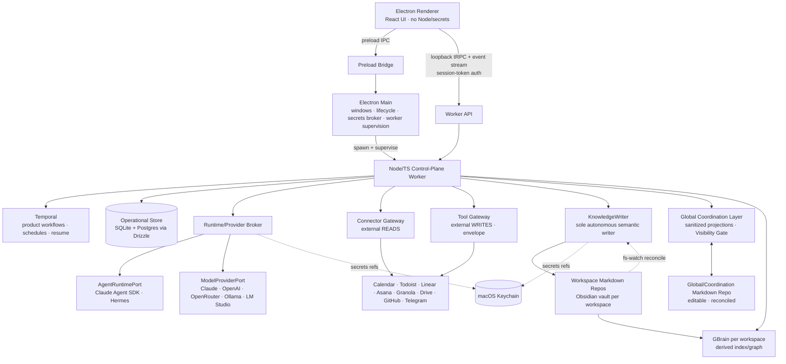
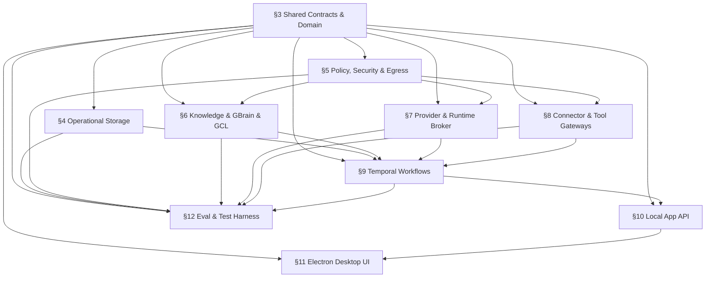

# ARCHITECTURE.md — System of Work Assistant

> **Build contract.** This is the binding architecture. Downstream skills (`/tasks-gen`, the `/tdd` engine, `/check-arch`, the cross-doc-invariants table) treat this file as the source of truth. It is loaded **on demand by `§` anchor**, not whole. Typed models in **Appendix A** are cross-doc invariants: a field change requires editing the model's `§` section and Appendix A in the same round of commits.
>
> **Build posture: production-grade.** Auth, input validation, error paths, idempotency, observability, secrets handling, and a deploy/rollback/repair path are in-scope requirements, not deferrable. Load-bearing safety/security/correctness invariants are never cut.
>
> Source PRD: `system_of_work_assistant_prd_v0_3.md`. Planning artifacts: `docs/planning/`. Finalized by `/arch-finalize` (Brain 2) from the Brain-1 draft `docs/planning/ARCHITECTURE_DRAFT.md`; gap-audit detail in `docs/gap-audits/`. Anchor remap from the draft: `docs/gap-audits/anchor-remap.md`.

## Executive summary

The System of Work Assistant is a **Mac-first, local-first, self-hosted personal operating system** for a single technical owner/operator. It coordinates employer work, personal business, and personal life across external tools while preserving **user-owned Obsidian-compatible Markdown as canonical semantic memory**. It is a *governed local control plane*, not a chatbot and not an all-powerful agent.

The desktop shell is **Electron**: an unprivileged renderer (React), a thin **main** process that owns windows, app lifecycle, secrets brokering, and supervision, and a dedicated **Node/TypeScript control-plane worker** that owns durable workflows, policy, connectors, provider routing, the GBrain adapter, the operational store, outboxes, and read models. The renderer reaches the worker two ways: **preload IPC** for privileged desktop/lifecycle actions and a **loopback tRPC API + event stream** for commands/queries/status — the latter authenticated by a **per-launch session token** (loopback binding is not authentication).

Knowledge and side effects are **gated, never direct**: model/provider outputs and agent results are *candidate data only* until they pass strict JSON-Schema validation and policy checks. Durable **semantic** changes flow only through **KnowledgeWriter** into per-workspace Markdown repos; **external** side effects flow only through the **Tool Gateway** behind an idempotent external-write envelope; **product workflows** are durable **Temporal** workflows. **GBrain is required** for retrieval/graph/health but is **per-workspace and derived from Markdown** — never an independent semantic origin. Cross-workspace global views use a **Global Coordination Layer (GCL)** of sanitized projections, never raw blended retrieval. **Copilot Q&A** is a read-first agentic surface over the `AgentRuntimePort`: its retrieval is WS-8-scoped (`enforceRetrievalScope`, fail-closed), its synthesis output is *candidate data* (`UiSafeCopilotAnswer`) until the JSON-Schema gate, its cloud egress passes the §5 veto (`guardCopilotEgress`), and its **only** write path is propose→§9 Approvals — never a direct Markdown or external write.

The system is **provider-plural**: an `AgentRuntimePort` (agentic runtimes — Claude Agent SDK, Hermes) and a `ModelProviderPort` (raw model providers — Claude, OpenAI, OpenRouter, Ollama, LM Studio) sit behind a Runtime/Provider Broker that routes per a **workspace × capability matrix**, gated by **egress policy** and conformance tests. The operational store ships **SQLite (local) and standard Postgres adapters from day one** through Drizzle.

The subsystem import-direction DAG and the parallel build tracks it yields are in **§2.5**. **Meeting closeout is the primary proof spine**; full PRD V1 stays in scope, sequenced behind shared contracts, storage, workflow durability, provider conformance, and GBrain parity.

> **One-line posture:** *governed local control plane — candidate-data-in, validated-and-policed-out; Markdown is the only canonical semantic truth and KnowledgeWriter is its only autonomous writer.*

> **Part II (§19).** The *Intelligence, Tool-Sync & Activation Architecture* (Plan Phases 14–25) carries the activation/go-live roadmap that turns the dormant write + intelligence + ingestion-spine substrate live behind **seven owner-gated hard-line crossings** (crossings 1–6 a sequential chain, crossing 7 the independent per-vendor connector arc). Authored from the 2026-07-15 full-system gap audit (66 gaps → tasks, coverage-verified).

## §1 — Goals & non-goals

**Goals**

- Preserve semantic memory in Obsidian-compatible Markdown Git repos, one per workspace, plus a sanitized Global/Coordination repo.
- Keep raw workspace data isolated by default; provide a useful global coordination surface without raw leakage.
- Close meetings into notes, decisions, tasks, calendar proposals, people/project updates, dashboard state, and audit.
- Support daily/weekly/monthly briefs, project dashboards, task routing, cross-calendar scheduling, source ingestion, ingestion-inbox triage, NotebookLM managed-doc sync, approvals (Mac + Telegram), Copilot Q&A, connector sync/health, and System Health.
- Route model work across multiple providers behind strict schema gates and a workspace × capability matrix, with a local zero-egress option.
- Be local-first in V1 with hosted-compatible operational storage (Postgres adapter day one).
- Be installable by other technical users from source.

**Non-goals (V1)**

- No SaaS multi-tenant product; no app accounts beyond the single owner/operator.
- No raw global search across all workspaces by default.
- No direct runtime/GBrain/external-MCP writes into Markdown; no direct external side effects from agents or Hermes automations.
- No NotebookLM direct-API dependency (Drive-backed managed docs only).
- No hosted/always-on control plane while the Mac sleeps (deferred to V1.1 behind the same ports/adapters).
- No final `IMPLEMENTATION_PLAN.md` from this document (that is `/tasks-gen`).

## §2 — System overview



**End-to-end invariant.** Model/provider outputs and agent results are *candidate data only*. They cannot affect Markdown or external systems until **schema validation and policy checks pass** (§3, §5, §7). Markdown commit (KnowledgeWriter) is the semantic durability point; Tool Gateway receipt is the external durability point; everything else is derived/operational.

## §2.5 — Subsystem dependency DAG & parallelization seams

**Import-direction rule:** `apps → application services → contracts/domain → infrastructure adapters`. Infrastructure implements contracts; domain/contracts import no app or adapter code. The renderer imports only UI-safe client contracts, never worker internals.



**Independent subsystems (parallelization seams), after contract freeze.** These tracks share no dependency path and fork in parallel once `§3` contracts are frozen:

- **`contracts`** — `§3`: shared types, JSON Schemas, workspace/capability/provider matrix, Drizzle schema source, test fixtures. *Freezes first; everything else waits on it.*
- **`worker`** — `§4` storage, `§9` Temporal workflows, outboxes, read models, `§10` tRPC API.
- **`knowledge`** — `§6` KnowledgeWriter, Markdown repo/vault rules + fs-watch reconciliation, GBrain adapter, GCL projections + reconcile.
- **`providers-integrations`** — `§7` AgentRuntimePort + ModelProviderPort adapters + Hermes, `§8` Connector Gateway + Tool Gateway.
- **`desktop`** — `§11` Electron shell, preload IPC, React UI; consumes `§10`.
- **`eval-security`** — `§12` EVAL-1 harness, leakage/injection suites, provider/adapter conformance, security gates; consumes contracts + all subsystem outputs.

**Shared contracts across seams (freeze before fork).** Any Appendix-A model whose `§` is crossed by a DAG edge is a cross-track contract: `Workspace`, `ProviderMatrix`, `EgressPolicy`, `ToolPolicy`, `Capability`, `ProviderRoute`, `ProviderProfile`, `AgentJob`, `KnowledgeMutationPlan`, `ProposedAction`, `ExternalWriteEnvelope`, `WriteReceipt`, `Approval`, `SourceEnvelope`, `GclProjection`, `AuditRecord`, `WorkflowRunRef`, `HealthItem`, `NotebookMapping`, and the GBrain write-through/divergence seam models `SemanticFact`, `FactProvenance`, `SignedProvenanceStamp`, `ParityReport`, `Divergence`, `QuarantineRecord`, `GBrainProposedFact`, `GbrainReadGrant`/`GbrainServePolicy`, `GbrainPin` (these cross the knowledge / eval-security / providers-integrations / worker seams). A change to any of these mid-build is a cross-track Finding.

**Cross-seam note — the agentic Copilot arc (Phase-C + §9.6-real + §13.10).** This body of work deliberately spans three seams: the tool catalog + agent-runtime containment (`policy`/`providers-integrations`, §5/§7), the retrieval/synthesis/propose orchestration + tRPC entry (`worker`, §8/§9/§10), and the provenance-stamping serving oracle (`knowledge`, §6). The only frozen contract it touches is `Approval.workspaceId` (already in Appendix A); `UiSafeCopilotAnswer` is a UI-safe projection and the remaining Copilot types are worker-internal (Appendix A) — so the arc adds cross-seam *machinery* but no new cross-track frozen model (the one future one is growing `GbrainReadGrant.allowedOps`, a §13.10 go-live gate).

## §3 — Shared Contracts & Domain

**Responsibilities.** Define cross-package TypeScript contracts, the JSON Schemas that gate provider/runtime outputs, the Drizzle schema source for the operational store, and canonical key/ID/idempotency builders. Pure; imports nothing app- or adapter-side.

**Packages.** `packages/contracts` (runtime-safe types, JSON Schemas, tRPC router types, event names), `packages/domain` (pure rules, state machines, validators, canonical-key builders), `packages/db` (Drizzle schema, migrations, repository interfaces, SQLite + Postgres implementations).

**Universal validation rules (enforced wherever data crosses into application services).**

- Every model/provider output validates against a JSON Schema before any downstream use (REQ-S-006).
- Every external write carries a `canonicalObjectKey` and an `idempotencyKey` (REQ-F / §8).
- Every semantic mutation carries `workspaceId` and `sourceRefs` (REQ-F-006).
- Every cross-workspace projection declares a visibility level and source workspace (REQ-F-005 / §6).
- **No-inference rule (REQ-F-017 / MTG-4):** extraction never invents task owners or due dates; unstated values are emitted as `TBD` or routed to clarification — a validator hard-reject, not a model preference.

**Contracts defined here** (full field lists in Appendix A): `Workspace`, `ProviderMatrix`, `EgressPolicy`, `ToolPolicy`, `Capability`, `ProviderRoute`, `AgentJob`, `KnowledgeMutationPlan`, `ProposedAction`, `ExternalWriteEnvelope`, `WriteReceipt`, `SourceEnvelope`, `Approval`, `GclProjection`, `AuditRecord`, `WorkflowRunRef`, `ProviderProfile`, `HealthItem`, `NotebookMapping` — plus the `SecretsPort` interface. Several were under-pinned in the draft and are load-bearing for P0 controls / cross-track seams:

- **`EgressPolicy`** (gates the Employer-Work raw-content egress control, §5/§16.5-PRD): `{ workspaceId, allowedProcessors: ProcessorId[], rawContentAllowedProcessors: ProcessorId[], employerRawEgressAcknowledged: boolean, acknowledgedAt?: string }`. A *processor* is any external recipient of content (a cloud LLM endpoint, OpenRouter, Drive/NotebookLM); local Ollama/LM Studio are non-egress.
- **`ToolPolicy`** (gates the ING-7 untrusted-content admission gate, §5/§7): `{ mode: "read_only" | "scoped_write", allowedTools: ToolId[], deniedTools: ToolId[], allowsMutating: boolean }`. The admission predicate (§5) **rejects at job admission** any untrusted-content job whose `ToolPolicy` admits a mutating tool.
- **`AgentJob` trust fields** (read by both the §5 egress-veto and the ING-7 admission gate): `trustLevel: "trusted" | "untrusted"` (set `untrusted` whenever the job's context includes imported/source content) and `carriesRawContent: boolean` (true when raw workspace content — not just sanitized metadata — is in the prompt). The §5 predicates are pure functions of these fields + `EgressPolicy`/`ToolPolicy`.
- **`HealthItem`** (the typed System Health record consumed by §10/§11/§12): `{ id, failureClass, severity, message, auditRef, openedAt, state: "open"|"acknowledged"|"resolved", resolvedAt? }` with the enumerated OBS-2 `failureClass` taxonomy (Appendix A).
- **`WriteReceipt`** (sub-shape of `ExternalWriteEnvelope.writeReceipt`): `{ externalObjectId, externalUrl?, recordedAt, rawRef? }` — the proof an external write committed exactly once.
- **`NotebookMapping`** (the §8 Drive-backed NotebookLM model): `{ projectId, notebookKey, driveFolderId, managedDocIds }` mapping the five managed-doc slots (00–04) to Drive doc IDs.
- **`SecretsPort`** (interface, V1 adapter = `KeychainSecretsAdapter`): the worker resolves Keychain-referenced provider keys / connector OAuth tokens through this port; callers receive *references*, never raw secrets, and a Keychain-locked/denied state degrades the dependent providers/connectors (§16).

## §4 — Operational Storage

**Responsibilities.** Persist app-owned operational state: event log, audit, approvals, outboxes, connector cursors, provider conformance status, GCL projections, dashboard read models, workspace config (with Keychain *references* only). SQLite local mode + standard Postgres hosted-compatible mode from day one, via Drizzle migrations and a repository contract suite that **both** adapters must pass (REQ-D-002/003). Domain depends on repository interfaces, never a concrete driver; no dialect-specific SQL in domain code.

**Boundaries (source-of-truth, REQ-D-001/004/005).** Does *not* store: semantic truth (Markdown does), Temporal workflow history (Temporal does), GBrain index (GBrain PGLite does, owned solely by GBrain), or secrets (Keychain does). Read models are rebuildable; **event log / audit / approvals / outboxes / connector cursors are operational truth and are not rebuildable** — see §16 Backup & Recovery.

**At-rest encryption.** V1 relies on **macOS FileVault** full-disk encryption as the at-rest control for the operational store and Temporal persistence; FileVault-enabled is a documented install prerequisite surfaced by the install doctor (§13). **App-level encryption (SQLCipher for the operational store + encrypted Temporal persistence) is a V1.1 hardening item** (§15).

**Failure modes (production-grade).**

- *DB unavailable:* worker enters degraded mode, surfaces a distinct System Health item, queues where possible.
- *Migration mismatch / failed mid-apply:* **back up the operational DB before applying any migration**; run migrations transactionally where the engine allows; on partial/failed apply, **restore from the pre-migration backup** and refuse to start with a typed repair message; record an app-version ↔ schema-version compatibility check and refuse to run an incompatible pairing (no silent forward-only break). Down-migration or restore-from-backup is the rollback path (Drizzle is forward-only by default).
- *Adapter divergence:* the SQLite/Postgres repository contract test fails → release blocked.

**Knowledge-revision store (added 2026-07-12; closes a prior arch_gap).** The operational store now includes a durable **`KnowledgeRevisionStore`** (`knowledge_revisions` table, `idempotencyKey` PK, both dialects, contract-suite-covered) — the substrate for KnowledgeWriter exactly-once (`getByIdempotencyKey`/`record`), replacing the interim in-memory `Map` that lost exactly-once across restart. It is fail-closed in both directions (a `DbError` on lookup or record REJECTS, never masks as "no prior commit"). This makes the **make-it-real vault→ingestion loop durably persistent end-to-end** (§6/§13): an auto-ingested `.md` (owner-opt-in, default-OFF — `SOW_INGEST_WATCH`) now commits real canonical Markdown via the KnowledgeWriter sole-writer with idempotent replay across restart. **Multi-file (2026-07-13):** many distinct files per workspace each persist as their own note — the ingestion build receives the per-file source identity via a dedicated `SourceBuildOutputsPort` and derives a per-source content-addressed note path (`sha256(sourceId,contentHash)`, traversal-safe by construction + a workspace-segment guard that is the primary cross-workspace WS-8 path defense). Update-in-place on an edited re-drop is a follow-on (today an edit → a new lossless note).

**Parity-report store (added 2026-07-13).** The operational store also includes a durable **`ParityReportStore`** (`parity_reports` table, `reportId` UNIQUE/first-write-wins, `workspaceId`+`reconciledAtRevision` indexed, both dialects, contract-suite-covered) — the **serve-time source the Copilot serving-gate coverage leg reads** (§6 write-through (vii) / the C5.4b serving oracle). `record(report, recordedAt)` persists an immutable `ParityReport` (the frozen contract stored as-is in a JSON payload column, re-gated through `ParityReportSchema.parse` on read); `getLatestForRevision(workspaceId, reconciledAtRevision)` returns the newest-recorded report for that revision (deterministic `desc(recordedAt)`+`desc(reportId)` ordering so a re-reconcile supersedes and the two dialects agree). It is **fail-closed in both directions** distinguishing a fault from an absence (a `DbError`, an unparseable payload, or an identity-mismatched payload REJECTS with a typed err — never masked as a silent ok and never collapsed into the `undefined` that means "no row", and a tampered row cannot surface cross-workspace, WS-8). A `ParityReport` is **operational truth — not rebuildable**, backed up, never reconstructed (§16). Fronted by a narrow fakeable read-port for the serve-time coverage reader (`record` stays on the repo for the reconcile→store write path). Ships DORMANT — the serve-time coverage reader binds the read-port in a follow-on slice (today it returns `parity=undefined`).

**Phase-15 ingestion-spine operational stores (added 2026-07-15, §19.2).** The operational store gains two more dual-dialect first-write-wins repos. (1) **`SeenContentHashRow`** (`seen_content_hash` table, composite `(workspaceId, contentHash)` PK, migration 0010) — the durable Flow-4 dedupe backing (WS-8-scoped so a hash seen in workspace A never dedupes it in B; `ON CONFLICT DO NOTHING` keeps the original `seenAt`; fail-closed both directions distinguishing a store fault from a benign not-seen). It is a PRE-DISPATCH optimization: a `has`-fault PROCEEDs (the Temporal `src:ws:hash` workflowId AlreadyStarted-dedupe is the real exactly-once backstop, L16), never HOLDs. Reachability-waivered until the Phase-16 bridge binding (worker Lesson 34). (2) **`SourceDispositionRow`** (`source_disposition` table, `sourceId` PK, migration 0011) — the durable ingestion disposition/park/re-enter backing (closes G5's machinery half): exactly-once by the CAS disposition key (a re-record HIT reuses the prior audit ref, inv-A/B); it persists the parked `SourceEnvelope` (incl. the `+body` candidate) as **server-side-operational-only** state for re-entry — audit is summaries-only, never rendered (the UI-safe ingestion-inbox projection stays the sole render path) nor logged (rule 7); the re-enter runner re-drives THROUGH the pipeline candidate gate (rule 2) reusing the idempotencyKey so an already-committed source replays over the `KnowledgeRevisionStore` (rule 3/inv-D); the rescope's owner workspace override is registry-validated (WS-8). **G5 is functionally live (2026-07-16, `65e6b09a`): the `park`-write IS wired into the low-confidence meeting-closeout branch** — `runMeetingCloseout` invokes the injected `MeetingParkPort.park(...)` on the `confidence:"low"` (no-workspace-guess, inv-1) path → the durable `SourceDispositionRow` park row (first-write-wins, idempotent by meeting id), and `buildActivities.ts` binds `meetingPark` over the 15.5 store. A park fault surfaces a DISTINCT `write_through_failed` health item and still resolves `needs_routing_review` (never a false "parked"/silent loss); the parked envelope carries the source's own ingesting workspace, the routing TARGET stays unbound (inv-1/WS-8). The real connector drive feeding a live low-confidence meeting is Phase-16-waivered (L11). Both are db-owned operational records, NOT frozen Appendix-A contracts (worker Lessons 34/36). Separately, **`SourceBuildOutputsPort.build` gains an optional trailing `body?: string` param** (2026-07-15, task 15.3) — the note projection threads the gate-validated `SourceEnvelope.body` to write the real note body (killing the `"source ingestion (C1)"` placeholder), degrading to a safe minimal note when absent; the note PATH stays body-independent (only `SourceNoteIdentity` keys it — traversal-safe). Additive/optional/backward-compatible; a `@sow/workflows` workflow-port seam, NOT a frozen Appendix-A model (worker Lesson 35).

## §5 — Policy, Security & Egress

**Responsibilities.** Enforce workspace policy, the provider × capability matrix, **egress policy**, **tool policy**, approval policy, and visibility levels. The four hard denials: Employer-Work raw cloud egress unless the workspace gate is acknowledged; direct raw cross-workspace retrieval; untrusted-content agent jobs that declare mutating tools (ING-7 admission gate); and any write adapter called outside the Tool Gateway / KnowledgeWriter.

**Renderer ↔ worker authentication (production-grade — loopback is not auth).** The worker API binds loopback only **and** requires a **per-launch session token** minted by Electron main, injected into the renderer **only via preload** (never discoverable by other localhost clients), and required on every tRPC call and on the WS/SSE event-stream handshake. A strict **Origin/Host allowlist** rejects cross-origin/DNS-rebinding callers. Unauthenticated or wrong-origin callers are rejected before any handler runs. (Transport stays loopback TCP for V1; Unix-domain-socket transport is a V1.1 hardening option, §15.)

**Outbound connector SSRF/egress guard (§19.3, shipped 16.3).** Every connector read transport (`createConnectorHttpTransport`) runs the `@sow/policy` `isAllowedRemoteEndpoint` predicate on the FINAL constructed URL BEFORE any token read: https + exact whole-host allowlist + a private-range **DENYLIST (`isPrivateHost`)** that BEATS the allowlist (blocking RFC-1918/CGNAT/link-local+cloud-metadata/ULA/`.internal` + non-canonical inet_aton/IPv6-hex forms; fail-closed on malformed) — so a misconfigured-allowlisted internal host is still rejected. Plus a runtime ING-7 `{GET,POST}` method-admission gate at the transport. Arming residual (Phase-23): re-run `isPrivateHost` on the DNS-RESOLVED IP to close DNS-rebind. (Redaction rule 7: guard-rejections/faults carry no token/body/cause.)

**Provider/egress composition (the veto rule — closes the "matrix can bypass egress" gap).** Egress policy is evaluated **after** provider selection and acts as a **veto**: for an Employer-Work `AgentJob` with `carriesRawContent = true` and `employerRawEgressAcknowledged = false`, the Broker may select **only a loopback local provider** (Ollama/LM Studio); if none is available/conformant the job **fails closed** — there is no cloud fallback. (The ING-7 admission gate keys off `AgentJob.trustLevel = untrusted`; both predicates are pure functions of the §3 `AgentJob` trust fields + `EgressPolicy`/`ToolPolicy`.) OpenRouter is treated as its **own** processor (not an OpenAI-compatible alias) in `EgressPolicy`. Local endpoints are allowed only through explicit local-provider config (no arbitrary provider URL for sensitive work).

**Electron security.** Renderer: `contextIsolation` on, no Node integration, no direct DB/filesystem/secrets/connector access. Preload exposes a narrow typed IPC surface for privileged desktop/lifecycle actions only.

**Copilot tool catalog & catalog-aware ING-7 admission (Phase-C C1/C4/C5).** The Copilot agent's tool surface is a typed **catalog** (`packages/policy/src/copilot-tool-catalog.ts`): `COPILOT_READ_TOOLS` (the gbrain read/analysis surface — `search`/`graph`/`timeline`/`schema_read`/`health`/`contained_synthesis` plus the Tier-1 §13.10 analysis reads `find_contradictions`/`find_anomalies`/`find_orphans`/`find_experts`/`takes_*`/`code_*`/`get_recent_salience` — + `vault.read`) and the one mutating `COPILOT_PROPOSE_TOOL`. `isMutatingCopilotTool` is a **fail-safe** classifier (an unknown/uncataloged id ⇒ *mutating*), so a tool can reach an untrusted read-only job only by being explicitly cataloged non-mutating. The **only catalog-aware ING-7 layer** is `admitCopilotAgentJob` (`apps/worker/.../copilotAgentSynthesis.ts`) = `isToolPolicyConsistent` + `admitJob(isMutatingCopilotTool)` + `copilotReadOnlyPolicyIsPure` (rejects a `read_only` job carrying any mutating tool). **Content-trust (C5.4):** `deriveCopilotContentTrust` sets a job `trusted` **iff every retrieved source carries `knowledge_writer` provenance** (absent ⇒ untrusted), the fail-closed input to `trustLevel`; a propose-capable job additionally runs **seed-only** (the gbrain read tools are stripped in `buildCopilotAgentJob`) so the tool-reachable content surface == the pre-verified seed (closes the trust TOCTOU). Egress at route selection reuses the §5 veto via `guardCopilotEgress`/`decideCopilotEgress` over the authoritative `WorkspacePosture`. **The read/agent path ships LIVE-by-design; only propose ships DORMANT.** In the shipped worker-host the agent path is ON (`copilotAgentMode` = true — the model may call the gbrain READ tools mid-answer, but only through the in-process SCOPED PROXY, so no unscoped / cross-workspace read is possible); **propose stays structurally OFF** via a fail-closed interim content-trust (§6 serving-oracle seam), `copilotProposeMode` / `copilotProposeKnowledge` deliberately unset. *(Corrected 2026-07-14: the prior "All of this ships DORMANT … `copilotAgentMode` (OFF)" wording was stale.)* **`vault.read` boot-activation (§13.10d, `90679a3`):** `gateCopilotVaultReadDeps` offers the read-only `copilot.vault.read` tool only when the flag + a configured `vaultRoot` + active workspace-scoping + a **usable** vault all hold — the usability check is a fail-safe `vaultUsable` predicate mirroring `createCommittedVaultReader`'s `isFile()`+`.md` recursive filter (`usable ⟺ the reader would find a page`), so the shipped default empty `<userData>/vault` offers no inert tool. It is a strict-subset narrowing (only changes WHEN the tool is offered, never the read scope; the WS-8 vault handler is untouched), byte-equivalent on a real populated vault.

## §6 — Knowledge: Markdown, Obsidian, GBrain & GCL

**Responsibilities.** Preserve Obsidian-compatible Markdown as canonical semantic truth; one repo/vault + one GBrain brain per workspace; a sanitized Global/Coordination Markdown repo; the GCL DB as the cross-workspace Visibility Gate.

**KnowledgeWriter (sole autonomous semantic writer, REQ-F-006).** Accepts only validated `KnowledgeMutationPlan`s. **Preserves human-owned sections** (REQ-F-016 / KN-7): assistant-generated regions are bounded by explicit start/end markers with stable IDs (KN-8); an attempted overwrite of a human-owned region is rejected and audited. Writes atomically with a **compare-revision precondition**; runs an ownership check and a **blocking secret scan** before commit (reject, do not redact); records revision, actor, source event, workflow run, idempotency key, audit summary; triggers GBrain sync/re-index **after** the Markdown commit (async, idempotent, never rolls back the commit).

**Out-of-band writers — Obsidian Sync / iCloud / git pull are a SUPPORTED V1 configuration.** Because the owner may run Obsidian Sync, iCloud, or a git remote on the vaults, KnowledgeWriter is **not** the only possible writer of the working tree. A per-vault **file watcher** detects external working-tree changes, recomputes the on-disk revision, and reconciles against the compare-revision precondition: a clean external change advances the base revision; a conflicting concurrent change (KnowledgeWriter vs external) produces a **conflict-review item** in System Health rather than a silent lost update. Pending KnowledgeWriter writes are applied before queued GBrain index jobs on wake; index jobs re-derive from current Markdown by revision id. Reconciliation uses **positive KnowledgeWriter attribution** (a `kw_writer_sig` + write-journal): any working-tree Markdown mutation that is *neither* a verified KW write *nor* a human-owned-REGION edit — **including a new assistant-domain file** — becomes a conflict-review item and **never** auto-advances the base revision (closing the out-of-band hidden-brain hole); a human-REGION edit still clean-advances. **OS-level one-writer lockdown (REQ-S-NEW-008):** the worker is the sole OS principal with write access to the vault directory (filesystem ACL) and the sole PGLite advisory-lock holder; **every** gbrain process (import/sync/extract/oracle/doctor/lint) runs against a **read-only mount / immutable revision snapshot**, so a gbrain write to canonical `.md` is physically impossible and an fs-write during an index job is a hard alarm by construction.

**GBrain (derived, per-workspace).** Capability surface required in V1 (REQ-F-019 / KN-2): search, typed graph, timelines, schema-read, health, **contained** think/synthesis — **read/query only** at the runtime MCP boundary. gbrain is **DB-first natively** (`put_page`/`dream`/`synthesize`/`patterns`/Minions write the DB, never canonical Markdown); SoW **inverts this by policy** (the only Markdown→DB direction is `import`/`sync` *after* a KnowledgeWriter commit) and enforces it with the write-through & divergence layer below. The read/analysis surface (search, graph, timeline, salience, anomalies, code-search) is used freely; gbrain's generative features are a **gated proposal source**, never an autonomous writer.

**GBrain write-through & divergence/parity layer (V1, fail-closed, REQ-K-NEW-001/002/003).** Write-through ships **ON in V1** (reversing the read-only deferral), protected by a layer that fails closed; read-only/index-only is retained as the per-workspace **default-until-enabled fallback + kill switch** (still DoD-satisfying — the index is fully rebuildable from Markdown, REQ-D-001). Seven invariants:
- **(i) Bytes-from-Markdown serving.** The GBrain DB is a **pointer/ranking index, never a byte source**; the serving gate re-hydrates every served fact's bytes from committed Markdown and hash-matches them at the current revision. A DB-only fact has no bytes to serve.
- **(ii) gbrain-independent canonical derive.** A SoW-owned, gbrain-INDEPENDENT Markdown parser (`CanonicalFactDeriver`) is the sole trusted "what should exist" set; the `gbrain import`-into-scratch rebuild oracle is a **corroborating cross-check only** (disagreement is a defect, never a calibration target). gbrain is out of its own checker's trust base.
- **(iii) Signed provenance.** KnowledgeWriter writes an **HMAC `SignedProvenanceStamp`** at commit (key via SecretsPort, unreachable by the generative / DB-write / runtime paths); serve-time content rebinding makes a copied/forged stamp fail.
- **(iv) Revision-scoped allow-set, quarantine = absence.** The allow-set is the canonical fact SET @ current revision (monotonic compare-and-set; pointer never regresses); a quarantined fact is *absent*, keyed on a content-independent `factIdentity` so it cannot resurrect via a one-byte change.
- **(v) Default-deny ServingGate + ContainedSynthesisGate.** A fact serves only if `Markdown-rehydrated AND signature-valid AND in-allow-set AND not-quarantined`; `think`/Copilot synthesis runs ONLY over the gated, rehydrated context, never the raw store.
- **(vi) Propose-only generative path.** Generative outputs reach canonical state only as a `GBrainProposedFact` → JSON-Schema + no-inference gate → `KnowledgeMutationPlan` (`provenanceOrigin='gbrain_proposal'`) → KnowledgeWriter → Markdown; evidence must cite already-canonical Markdown / an ingested `SourceEnvelope` (the proposal's own scratch origin is inadmissible). gbrain in-engine `dream`/`autopilot`/`sync --install-cron` auto-write-and-serve modes are **hard-disabled in V1**.
- **(vii) Enablement gate.** `writeThroughEnabled` (per-workspace, default **OFF**) flips ON only when the four §12 GO conditions pass LIVE against the pinned gbrain SHA; a dirty/failed `ParityReport` auto-reverts the workspace to Markdown-provenanced-only. Divergences classify into a closed lattice (`db_only`/`unstamped` HARD floor `| content_mismatch` Markdown-wins-resync `| md_only` benign `| edge_* | stale_revision`) → quarantine + `parity_defect` HealthItem → materialize-via-plan or purge-only. **(Full spec: `docs/design/gbrain-write-through-divergence.md`.)**

**Copilot GBrain retrieval transports (§9.6-real).** The Copilot reads a workspace's brain over a `CopilotRetrievalPort` fed by one of two transports (`copilotGbrainTransport`), both consuming the shared pure mapper `parseGbrainSearchResult`/`normalizeGbrainHits` (aligned block↔source pairs, opaque `gbrain:<id>` citations, capped, fail-closed): `createGbrainSubprocessRetrieval` (a TEST seam shelling `gbrain call query` — WS-8 by construction, only `servedWorkspaceId` reads the one brain) and the **mandated** `createGbrainHttpExec`/`createGbrainDcrTokenProvider` (`transport:'http'` MCP-over-HTTP over `gbrain serve --http`, OAuth-2.1/DCR, loopback-guarded, 401→refresh, single-flight) — the http path is the **PGLite single-connection fix** (a concurrent `gbrain serve` holds the DB lock, blocking the CLI). All dormant behind `copilotGbrainRetrieval` (default OFF); the interim default is `createFixtureRetrieval`.

**Copilot serving-oracle seam — the last go-live gate (C5.4b).** A `CopilotServingOracle` returns a per-retrieval `CopilotServingVerdict`; `createProvenanceStampingRetrieval` decorates the retrieval so a source is stamped `knowledge_writer` (⇒ trusted, §5) **only** when the oracle admits its citationId under an explicit gated verdict — a *blanket* stamp on gbrain hits would re-open the ING-7 bypass the §5 admission cannot catch. Today boot wires `createInterimDegradedServingOracle`, which **always degrades ⇒ stamps nothing ⇒ propose stays structurally OFF**. The **real oracle** — bound to the §6(v) default-deny `ServingGate`/`admitForServing`, verifying the HMAC `SignedProvenanceStamp` over bytes rehydrated from committed Markdown so only genuine KnowledgeWriter-authored facts are stamped — is **oracle-core + the worker-side `createServingContextLoader` are BUILT + DORMANT** (G1e-2, `180c748`, 2026-07-09; wired behind boot's `servingOracleFactory` seam, but `createInterimDegradedServingOracle` stays the SELECTED default — only the selection flip + precondition-1 (content-integrity) remain); standing it up (with the five GO-LIVE PRECONDITIONS in `copilotProvenanceStamp.ts`) is the security-review-gated event that flips content-trust/propose ON.

**Serving-coverage parity leg reads the store (added 2026-07-13, `daf4fa1`).** The loader's `ServingCoverageReader` (`createServingCoverageReader`) now reads the **parity leg** from the durable `ParityReportStore` (the §4 operational-store repo): `parity = await store.getLatestForRevision(workspaceId, headRevision)` — the previously honest-interim `parity=undefined` is replaced by the real persisted report. **Fail-closed:** a store fault REJECTS ⇒ the reader degrades ALL coverage legs (never a false green); a true absence ⇒ `undefined` ⇒ degrade; the loader's revision-scoped staleness re-check still fires. The `ServingCoverageReader` seam widened sync→sync-or-async (mirroring `CommittedVaultReader`) so the loader `await`s it. Ships **DORMANT** — the reader's `store` dep is optional and boot leaves it **unbound**, so every workspace still degrades byte-equivalently; the real `createParityReportStoreAdapter(parityRepo)` binding + the GREEN-admission e2e land in a follow-on slice (B4). The **rebuild-oracle leg (`oracleBuildOk`) remains unwired** — coverage stays AND-degraded even with a green report.

**Serving-coverage parity leg — worker-side WRITE path (added 2026-07-13, `07d6b0b`).** The `ParityReportStore` gains a fail-closed worker-side write path: a `ParityReportRecorder` port + adapter over `ParityReportRepository.record` (supplies `recordedAt` via an injected clock, REJECTS on a `DbError`), and a `recordReconcileOutcome` gate that records the `ParityReport` **only on a successful `reconcileParity` outcome** (the full task-4.16 ParityReconciler — NOT the narrow `checkGbrainParity` primitive, which sees only `db_only` and would over-claim coverage) and **verbatim** (never synthesizing `cleanForServing`/`coverageComplete`). A reconcile `err` (`workspace_mismatch`/`report_invalid`) is a typed `skipped_reconcile_error` disposition, **never coerced into a stored clean report**; a `record` fault REJECTS (fault ≠ skip — both fail-closed, distinguishable); a dirty report is recorded verbatim (operational truth — the serve-time degrade signal). Ships **DORMANT** — no reconcile trigger, no boot change, no caller. A later slice wires the Temporal reconcile trigger (post-commit / fs-watch / schedule / on-demand → `reconcileParity` → `recordReconcileOutcome` → route `healthItems`/degrade).

**Serving-coverage parity leg — boot binding (added 2026-07-13, `8aef52d`).** Boot binds the `ParityReportStore` read-adapter (`createParityReportStoreAdapter(backends.repos.parityReports)`) into `createServingCoverageReader` — as a nested arg inside the existing `copilotProvenanceStamping && provenanceBundle` construction branch, so the shipped default (no bundle) constructs no store (byte-equivalent); `goLiveArmed` still gates SELECTION (an unarmed-but-built store is inert). This **closes the B2 store-consuming reachability waiver** — the serve-time parity read chain (boot → reader → store → `@sow/db` repo) is now end-to-end wired + reachable. It is NOT yet a full green admission: serving coverage AND-composes 4 legs and **`oracleBuildOk` (the rebuild-oracle build-status leg) stays hardwired `false`** (deferred), so the verdict still degrades — the write→read round-trip e2e ASSERTS this honest no-false-green (`isDegradedCoverage` true even with a clean report). The Brick-B parity chain (store + reader + record path + boot binding) is complete + DORMANT; full admission remains gated on the rebuild-oracle leg → the reconcile trigger → the owner-gated arming.

**Serving-coverage `oracleBuildOk` leg now BINDABLE — the gate is fully wired (added 2026-07-13, `57fef4b`; SUPERSEDES the "hardwired false" noted above).** `createServingCoverageReader` sources `oracleBuildOk` from an OPTIONAL fail-closed `resolveOracleBuild?: () => boolean` dep (a boot-resolved rebuild-oracle build-status accessor mirroring `resolveRunning`/`pinValid`): unbound ⇒ `false` ⇒ degrade (byte-equivalent to the prior hardwired false); a throwing probe degrades ALL legs (fail-closed, §12); `?? false` never defaults true. With this the **serving-coverage gate is FULLY WIRED** — all 4 `deriveServingCoverage` legs (`cleanForServing` + `coverageComplete` + `pinValid` + `oracleBuildOk`) are bindable, so the AND-verdict can reach non-degraded (a milestone unit test proves green-CAPABILITY with all legs bound as fakes). It ships **DORMANT**: boot leaves `resolveOracleBuild` unbound (and the store's real binding sits behind the go-live bundle), so production still degrades; `goLiveArmed` OFF keeps the interim oracle selected. **Green-capable ≠ armed.** The heavy gbrain import-into-scratch that PRODUCES the build-status is a build-time producer (real gbrain I/O) — owner-gated, deferred; the serve path takes no I/O. Two blockers remain before a REAL green admission: the **reconcile trigger** (records real reports into the store; also closes the per-revision `coverageComplete`-corroboration gap by always supplying a `rebuildOracle`) → the **owner-gated arming** (`goLiveArmed` + `provenanceStamping` + a provisioned signing key = the HARD LINE).

**Reconcile-pass composition seam (added 2026-07-14, `ca8d835`; reconcile-TRIGGER arc piece A).** `runReconcilePass` (`apps/worker/src/composition/parityReconcile.ts`) is the pure worker-side composition every later reconcile-TRIGGER piece wires into: it runs ONE pass — `reconcileParity` over an injected `ReconcileRequest` → the B3 `recordReconcileOutcome` gate (persists the `ParityReport` only on a successful outcome) → routes the reconciler's ready-made `HealthItem`s through an injected `ReconcileHealthSink`, in order → returns the `ParityRecordDisposition`. It owns **composition only** — never input construction (a later piece builds `req` from a real `GbrainReadGrant` DB projection + the canonical set) nor trigger scheduling / burst-collapse. **Fail-closed both directions (§12):** a reconcile `err` is a typed `skipped_reconcile_error` (records nothing, routes nothing — never coerced into a stored clean pass); a store `record` fault REJECTS **before** any routing (the pass didn't durably land ⇒ its health items are not surfaced; the caller degrades + raises a store-fault item); a health-sink fault **propagates** (a trust-defect signal is never silently dropped). The sink shape is the narrow `HealthItem`-in port (Step-2.5 pre-delegated decision (a)); the real OBS-2-dedupe binding (re-project through the worker `HealthSurface` so a defect recurring every pass bumps ONE item's occurrence count, not a fresh id-keyed row) lands at the piece-D/F trigger where the surface is in scope. Ships **DORMANT + reachability-waivered** — no production caller, no boot, no Temporal, no gbrain I/O; the two OWNER-GATED real bindings (live `GbrainReadGrant` DB projection, real `RebuildOracleSet`) stay unbound the whole arc. Piece A of the reconcile trigger → B (`ReconcilerDbProjection` builder) / C (canonical-snapshot reader) → D (driver) → E (trigger origin) → F (boot gate) → the owner-gated arming (the HARD LINE).

**`ReconcilerDbProjection` builder (added 2026-07-14, `8a27e78`; reconcile-TRIGGER arc piece B).** `buildReconcilerDbProjection` (`apps/worker/src/composition/reconcilerDbProjection.ts`) reads the injected read-only `GbrainReadAdapter` (grant-verified, op-gated — `graph` → the semantic-fact rows, `schemaRead` → the index schema version) and maps the response into the `ReconcilerDbProjection` that piece A's `runReconcilePass` consumes as `req.dbProjection`. **Fail-closed on COVERAGE:** `complete=true` ONLY on a clean, fully-consumed, well-formed read; ANY of {read `err`, adapter rejection/non-Result, truncation or open cursor (type-robust — a non-boolean `truncated`/non-string `cursor` still degrades), malformed row/envelope, absent/non-positive schema version} ⇒ `complete=false`. Never throws; never a false-complete (an incomplete read can't claim full coverage ⇒ the reconciler's `coverageComplete` degrades ⇒ serving degrades). `stamped` is conservative (explicit `===true` only — an unstamped `db_only` fact stays visible for the reconciler to quarantine, safety rule 1); `workspaceId` is sourced from the grant-bound adapter, not a caller param (WS-8 — the projection's ws can't disagree with the read grant). Ships **DORMANT** — no production caller (piece D wires it as `req.dbProjection`); the **REAL `GbrainReadGrant` HTTP transport binding stays OWNER-GATED/unbound** (the injected adapter is a fake), and hardening the real completeness/paging contract (a POSITIVE completeness token — default-incomplete unless explicitly signaled; reject unknown "more-results" field names; a row-count-vs-stated-total cross-check) lands with that owner-gated binding.

**Canonical fact-set reader (added 2026-07-14, `85f6b63`; reconcile-TRIGGER arc piece C).** `buildCanonicalFactSet` (`apps/worker/src/composition/canonicalFactSet.ts`) reads the committed vault at head via the injected `CommittedVaultReader` (`createCommittedVaultReader`, C5.4b) → runs the pure `deriveCanonicalFacts` → returns the `CanonicalFactSet` piece A's `runReconcilePass` consumes as `req.canonicalSet`. A **3-way fail-closed outcome** distinguishes a benign ABSENCE (reader `undefined`/throw/reject ⇒ `{kind:"absent"}` ⇒ piece D skips — no canonical reference) from a real DERIVE ERROR (a structurally-broken vault ⇒ `{kind:"derive_error",error}` ⇒ piece D routes to health) — never collapsing the two. Never throws (a belt-and-suspenders try/catch wraps the reader CALL — sync-throw + async-reject both degrade to `absent`). **WS-8 read-back re-gate** (Lesson 12): the returned snapshot's `workspaceId` is re-verified against the request ⇒ a reader defect degrades to `absent`, never a cross-workspace canonical set. **NAMED gap** (not silently owned): `createCommittedVaultReader` collapses an empty vault → `undefined` with no head revision, so an empty vault + a populated DB projection (all `db_only` HARD defects, safety rule 1) is skipped-not-caught; catching it needs a `CommittedVaultReader` change to surface an empty snapshot + head revision — owner-gated (reachable once real corpora exist). Ships **DORMANT** — no production caller (piece D), LOCAL-fs only, reader injected.

**Reconcile DRIVER (added 2026-07-14, `8d07a60`; reconcile-TRIGGER arc piece D).** `runReconcileForWorkspace` (`apps/worker/src/composition/reconcileDriver.ts`) is the end-to-end reconcile composition: given a `workspaceId` + INJECTED async collaborators, it runs `getCanonicalFactSet` (piece C) → on `derived`, `getDbProjection` (piece B) → assembles the `ReconcileRequest` (**`rebuildOracle` omitted** — pre-delegated decision #2 ⇒ `coverageComplete` rests on `dbProjection.complete`) → the injected `runPass` (piece A's `runReconcilePass`) → returns a typed 4-way `ReconcileDriverOutcome` (`reconciled` / `skipped_absent` / `skipped_derive_error` / `pass_faulted`). It **short-circuits** an absent/broken canonical reference BEFORE the gbrain read (no wasted read), **surfaces a derive-error typed** (defers HealthItem materialization to the trigger piece), and **catches the one collaborator with a designed rejection channel** (`runPass` — piece A rejects on a record/sink fault to make it visible) into `pass_faulted`, never throwing, while relying on the contractually never-reject builders (C→`absent`, B→`complete=false`). **Trigger-agnostic by construction:** the injected async collaborators are `proxyActivities` in a Temporal workflow or direct calls in a worker-scheduled pass — so the **workflow-weight decision defers to piece E** (the trigger-origin), where the driver is *triggered*. Ships **DORMANT** — no production caller (piece E supplies the trigger, F the boot gate); the two OWNER-GATED real bindings (live `GbrainReadGrant` transport behind B, real `RebuildOracleSet`) stay unbound. **Binding discipline for E/F:** bind the collaborators ONLY to the never-reject `buildCanonicalFactSet`/`buildReconcilerDbProjection` (the `Promise<…>` dep type does not encode never-reject — a raw transport without B's fail-closed wrapper would break the never-throw guarantee); and E must redact `pass_faulted.cause` + `skipped_derive_error.error` before any log sink (safety rule 7).

**Reconcile SCHEDULER / trigger-origin (added 2026-07-14, `89106e5`; reconcile-TRIGGER arc piece E — where the WORKFLOW-WEIGHT decision resolves).** `createReconcileScheduler` (`apps/worker/src/composition/reconcileScheduler.ts`) is the pure worker-side trigger-origin: `enqueue(workspaceId, PendingTrigger)` accumulates per-workspace; `flush(workspaceId)` **snapshots-and-deletes** the workspace queue BEFORE the dispatch await (a mid-flight enqueue lands in a fresh queue — not lost, not folded into the in-flight burst, not double-dispatched — and a re-flush is a no-op), **burst-collapses** the snapshot via `collapseToMaxRevision` (**LIFE-2** — a burst of vault changes fires ONE reconcile at the MAX revision, never one-per-change), dispatches the injected never-throwing driver ONCE, and routes the outcome through a **SINGLE redacted log sink** (safety rule 7: `reconciled`→`disposition.kind`; `skipped_derive_error`→`DeriveError.code` only, paths dropped; `pass_faulted`→`redactError` → `REDACTED_RAW` + a typed causeCode — the raw cause/error NEVER reaches the log, so no downstream can leak it, while the safe summary is enough for the boot gate to mint the HealthItem). **The pre-delegated workflow-weight decision RESOLVES here → the lighter worker-side scheduled pass** (NOT a Temporal workflow): the reconcile is idempotent read+record (not an external side effect), so exactly-once/durability is over-engineering; `collapseToMaxRevision` IS the LIFE-2 catch-up-collapse; a crash → degrade → next-trigger-recovers is fail-safe. Ships **DORMANT** — trigger-source-agnostic + externally-triggered flush; piece F binds the real trigger source (`startVaultWatcher`/schedule/post-commit) + the flush timing + a non-throwing log sink + the health surface + the default-OFF arming.

**Reconcile boot gate — the arming SEAM (added 2026-07-14, `e9c6d77`; reconcile-TRIGGER arc piece F1).** `gateReconcile(opts, deps): ReconcileWiring | undefined` (`apps/worker/src/boot.ts`, co-located with `gateAutoIngest`; Lesson 2/8/16) is the default-OFF reconcile-activation seam: OFF (`opts.reconcile !== true` — strict `=== true`, no truthy-coerce arming — or a missing precondition) ⇒ `undefined` + ZERO dep-thunk invocations (factory-spy-pinned — the shipped default is byte-equivalent); ON (armed — owner-gated, never default) ⇒ assemble `createReconcileScheduler` bound to `runReconcileForWorkspace` over the never-reject `buildCanonicalFactSet`/`buildReconcilerDbProjection` + a redacted log. The owner-gated `GbrainReadGrant` transport stays **UNBOUND** (`makeDbAdapter → undefined` ⇒ `getDbProjection` returns a degraded `{complete:false}` projection ⇒ the recorded `ParityReport.coverageComplete=false` — verified end-to-end through the REAL `reconcileParity`), so even the armed path records DEGRADED, never a false-green. **F1 adds the helper byte-equivalent BY CONSTRUCTION** (no `bootWorker` edit — an unreferenced exported helper can't change boot). **F2** adds the `bootWorker` call site + the real leaf-thunks (LOCAL vault reader; the gbrain adapter over the unbound transport; the recorder over `backends.repos.parityReports`; a `HealthSurface`-backed sink that materializes the HealthItem from the safe `detail` code) + the reachability closure — still DORMANT. **The reconcile-TRIGGER arc is complete-dormant after F2; the ARMING (`goLiveArmed`/`reconcile` flip + provision the transport/signing-key/corpora + the governance eval + the owner-confirmed flip) is the HARD LINE — NOT crossed by building the seam.** **✅ ARC COMPLETE-DORMANT (2026-07-14, F2 `dadb167`):** `bootWorker` calls `gateReconcile` with the real leaf-thunks (LOCAL reader; `makeDbAdapter → undefined` for the unbound transport; the recorder over `backends.repos.parityReports`; a `HealthSurface`-backed sink materializing a `parity_defect` HealthItem from the safe `detail` code via `surface.record` — OBS-2, not a raw put), byte-equivalent by default (the `reconcile` field omitted from `BootedWorker`); the reachability chain `bootWorker → gateReconcile → scheduler → driver → builders` is closed, all DORMANT. Full arc: A `ca8d835` (compose) · B `8a27e78` (db projection) · C `85f6b63` (canonical set) · D `8d07a60` (driver) · E `89106e5` (scheduler) · F1 `e9c6d77` (gate helper) · F2 `dadb167` (boot binding). **NEXT = the owner's ARMING GATE** (the HARD LINE), which additionally must resolve two deferred armed-path health semantics: the health-sink `surface.record` fault made to PROPAGATE (Lesson 18) + a `pass_faulted` minting a HealthItem.

**Reconcile armed-path health semantics — RESOLVED (added 2026-07-14, `8c559f9`; dormant arming-prep Item 7).** The two armed-path health-semantics deferrals the F2 note named as arming-gate blockers are now resolved (still DORMANT — both fire only on the owner-gated armed path; byte-equivalent default). **(7a)** `createReconcileHealthSink.record` now PROPAGATES a `HealthSurface.record` fault instead of swallowing it, restoring piece A's `ReconcileHealthSink` contract (Lesson 18): a health-materialization fault → `runReconcilePass` rejects → the driver catches it → `pass_faulted`, contained (no unhandled rejection escapes `scheduler.flush`). **(7b)** `createReconcileLogSink` now mints a `parity_defect` HealthItem on a `pass_faulted` outcome (a durable-store / health-sink fault during the reconcile pass is health-worthy) via the injected `HealthSurface.record` (OBS-2, not a raw put), taking the safe code from `redactedCause.causeCode` ONLY (never `redactedCause.message`/stack) with a fixed `pass_faulted` `arch_gap` fallback + a `ws‖rev` subjectRef (safety rule 7); **no new `FailureClass`** is invented, and the mint sink stays UNCONDITIONALLY never-throwing (piece E's `flush` relies on it). Dual-reviewed (safety-critical armed-path) CLEAN. The precise OBS-2 dedupe subjectRef for reconcile health items remains an arming-era refinement (finalizes once real defects flow).

**GbrainReadClient HTTP transport — constructible-dormant (added 2026-07-14, `cdbb389`; dormant arming-prep Item 2a).** The real `GbrainReadClient` HTTP transport (`createGbrainHttpReadClient`, `packages/knowledge/src/gbrain/gbrain-http-read-client.ts`) that the piece-B `GbrainReadAdapter` runs over is now BUILT + constructible, still UNBOUND (`makeDbAdapter → undefined` at boot ⇒ the armed reconcile path degrades `complete=false`, never a false-green). It dispatches `invoke(op, payload, context?)` over the loopback `gbrain serve --http` endpoint through an injected transport+secrets seam (faked in tests — zero real I/O): the SSRF/egress guard (loopback + allowlist, reusing `@sow/policy isLoopbackEndpoint`) runs before token resolution + dispatch; the bearer token resolves from the grant's `tokenRef` via an injected SecretsPort accessor, header-only + fail-closed even on a throwing accessor; faults are redacted typed errors carrying only safe detail. **arch_gap:** the real `gbrain serve --http` wire shape (op→path + response envelope) is a DOCUMENTED CANDIDATE, confirmed only at the owner's arming binding (Lesson 21) — until then parsed fail-closed. The completeness/paging-contract hardening is now DONE in the piece-B projection parse (Item 2b, `4e5f18f`): `parseGraphRead` requires a POSITIVE `env.complete === true` token (STRICT, default-INCOMPLETE), rejects a widened type-robust more-results set (`truncated`/`cursor`/`hasMore`/`nextPageToken`/`nextOffset`/`pageInfo.hasNextPage`), and degrades on a mismatch of any present finite `total`/`totalCount` vs the raw row count. **arch_gap residual (anti-false-green):** the exact real completeness token + the more-results field-NAME set + per-field semantics + the authoritative total field confirm at the arming binding — a real field named OUTSIDE the candidate set would be silently missed even with the positive token (if gbrain sends `complete:true` loosely), so this MUST be closed at the piece-D/arming binding against the real `gbrain serve --http`.

**Rebuild-oracle producer arc — COMPLETE + DORMANT (added 2026-07-15, A `210e95e` / B `118135c` / C `c251518`; the runbook Phase-4 "build-first" producer).** The `oracleBuildOk` serving-coverage leg (`servingContextBootReaders.ts` `resolveOracleBuild`, seam `57fef4b`) now has its boot-resolved PRODUCER — built + wired + dormant WITHOUT crossing the real-I/O hard line, because the heavy rebuild already exists (`rebuildIndexFromMarkdown`) behind an INJECTED `IndexRebuildClient` seam that stays prod-UNBOUND (mirror the reconcile arc's `makeDbAdapter → undefined`). **A `probeRebuildOracle`** (`apps/worker/src/composition/rebuildOracleStatus.ts`): rebuilds the index from committed Markdown via `rebuildIndexFromMarkdown` over the injected prod-UNBOUND client → a fail-closed status (ONLY a wholesale-replace + complete recovery ⇒ `oracleBuildOk:true`; absence / WS-8 read-back mismatch / divergence / fault ⇒ false), never-throws (§16), NO revision pin (frozen-snapshot ⇒ no re-read window). **B `gateRebuildOracle`** (`apps/worker/src/boot.ts`, mirror `gateReconcile` F1): a default-OFF, **CLIENT-PRESENCE-gated** (`typeof makeRebuildClient === "function"`, NOT a flag) boot gate added byte-equivalent BY CONSTRUCTION, folding per-ws corroboration to a fail-closed boot-global `resolveOracleBuild` (strict `=== true`; empty/any-non-corroborated ⇒ false). **C** (`bootWorker`, mirror `gateReconcile` F2): binds the gate with the real client OMITTED/UNBOUND ⇒ byte-equivalent, `await compute()` once, AND-binds `resolveOracleBuild` into `createServingCoverageReader`, routes `diverged` health SAFE-FIELDS-ONLY (`createRebuildOracleHealthSink` — frozen failureClass + synthesized message + subjectRef, never the item's free-form message, rule 7; sink PROPAGATES / boot caller CONTAINS, the containment fault-signal itself guarded against a throwing logger), and PROVES the AND-verdict still degrades by default (`oracleBuildOk=false` with the other legs pinned true — no false green, Lesson 16). Reachability CLOSED (`bootWorker → gateRebuildOracle → compute → probeRebuildOracle`), runtime DORMANT. The parallel knowledge false-green hardening (`e808a43`) makes `rebuildIndexFromMarkdown`'s wholesale-replace gate strict `receipt.replaced !== true` (a truthy client-returned `replaced` can no longer false-green — safety rule 1). **NO hard line crossed** — binding a real `IndexRebuildClient` (real gbrain I/O) is the owner's arming crossing. Arming-era residuals (fail-safe today, no false-green): `faulted` operator-silence (needs a piece-A producer change) · first-`diverged` routing short-circuit · rebuild-`receipt.revisionId/workspaceId` untyped-boundary passthrough · OBS-2 dedupe subjectRef.

**GCL (Global Coordination Layer — Visibility Gate, REQ-F-005 / WS-8).** Stores identity map, busy/free, deadlines, sanitized summaries, priority metadata — **never** raw Employer-Work or raw workspace content by default. It is the **single** cross-workspace read path; agents may not issue direct cross-brain GBrain queries. The **Global/Coordination Markdown repo is human-editable and reconciles back into the GCL DB** (owner choice): the GCL DB remains the queryable master, the Markdown is an Obsidian-editable surface, and a watcher reconciles owner edits into the DB (visibility-level validation on reconcile; conflicts → review item). **Explicit cross-workspace links (REQ-F-020 / WS-5, Level-3)** are user-approved associations recorded in the GCL identity map; they are the only way raw content crosses, and only on explicit approval.

**Deletion (saga, REQ-F-013 — see §9).** The cross-store purge is a compensating saga owned by the deletion workflow.

## §7 — Provider & Runtime Broker

**Two ports, two layers (resolves the AgentRuntimePort/ModelProviderPort conflation).**

- **`AgentRuntimePort` — agentic runtimes** that carry tool-policy/MCP/structured-output/subagent semantics: `ClaudeAgentSdkRuntimeAdapter`, `HermesRuntimeAdapter` (RT-1). These run `AgentJob`s that need GBrain MCP access, tool use, and subagents. The concrete `ClaudeAgentSdkRuntimeAdapter` (over `ClaudeAgentTransport`) enforces containment by a **deny-by-default `canUseTool`** hook + explicit `permissionMode` + no built-in tools + `settingSources:[]` + bounded turns — **never** an empty tool list (banked security lesson: `tools:[]` is a *no-op*, so an empty toolset is not a restriction; containment must be the deterministic `canUseTool` deny). It is the one real production runtime, reached today only via the dormant Copilot agent path.
- **`ModelProviderPort` — raw model providers** for schema-validated latent extraction/synthesis without agentic tool loops: Claude, OpenAI, OpenRouter, Ollama, LM Studio (REQ-F-015 / ADR-004). "Claude" appears in both layers intentionally — the Claude *Agent SDK* runtime vs the Claude *model* provider are distinct adapters.

**Runtime/Provider Broker.** Accepts `AgentJob`s from workflows; resolves the route via the **workspace × capability matrix** (`ProviderMatrix`), then applies, in order: **egress veto** (§5) → provider health/model availability → **budget caps** (`maxRuntimeSeconds`, `maxCostUsd`) → schema/tool policy. Normalizes outputs into capability schemas. **Strict side-effect rule:** provider/runtime output → schema gate → validator → `KnowledgeMutationPlan`/`ProposedAction` → KnowledgeWriter/Tool Gateway. No provider output calls a write adapter directly.

**Critical-path routing (owner finalization decision — supersedes PRD §20.2's fixed-runtime wording).** The provider matrix **may route the meeting-closeout critical path to any conformance-passing provider/runtime** per workspace policy; there is no single hard-wired reference runtime. **DoD consequence:** the build can certify the meeting-closeout DoD only if **at least one conformant provider/runtime is configured for the `meeting.close` capability** in the exercised workspace; the Employer-Work branch additionally requires the egress acknowledgment ON (or a conformant local provider). Claude Agent SDK and Hermes remain required, DoD-tested adapters; Hermes is not required for a baseline fresh install (REQ-I-002/003).

**Budget enforcement (REQ-S-007 / COST-1/2).** Every `AgentJob` enforces `maxRuntimeSeconds` and, when set, `maxCostUsd`: breach cancels the job, records it (§16.3-audit), surfaces a System Health item (OBS-2), and leaves no partial uncommitted side effect. The Broker applies a configurable **default** cap to LLM-calling jobs that lack one (COST-2). Aggregate per-workspace/global spend caps with auto-pause are V1.1 (§15).

**Conformance is the contract.** OpenAI-compatible endpoints are **not** assumed behaviorally identical; each provider × capability × pinned-model pair must pass conformance (§12) before it is eligible in the matrix; failing pairs are disabled. Local providers are an **optional zero-egress path, not a release gate**. **Phase-0 spikes (named here):** *Hermes Adapter Surface* (API server vs TUI gateway vs Python wrapper vs Kanban vs hybrid — OQ-007; no-go branch: Claude SDK / another agentic runtime carries the critical path, Hermes stays required+DoD-tested but not first-install gating) and *Provider conformance* (pin exact provider/model pairs; pricing/model-IDs/limits/structured-output fidelity are volatile, OQ-003). **Resolved (Phase 0):** the Hermes surface is **HYBRID** — a one-shot CLI subprocess (`hermes chat -q … -Q -t <readonly> -m … --provider …`) as the primary synchronous `HermesRuntimeAdapter` (a live meeting-close mock passed: clean JSON, schema gate, no-inference held, SIGTERM cancel = no side effect), plus Kanban for the §9 RT-7 autonomous-automation path. **⚠ Security invariant (banked, `packages/providers/LESSONS.md`):** an *empty* `-t` toolset silently falls back to the user's full (mutating) config toolset — a read-only / untrusted-content (ING-7) Hermes run MUST pass an **explicit minimal toolset**, never empty. Provider conformance resolved: default models per capability + caps recorded in `config/providers.defaults.json`; OpenRouter `deepseek/deepseek-v4-pro` + `anthropic/claude-haiku-4.5` are live-verified conformance-passing; OpenRouter is its own processor, never an OpenAI alias (§5).

**Agentic Copilot runner (§9.6-real / Phase-C).** `createAgentRuntimeCopilotSynthesis` + `createClaudeAgentCopilotRunner` (`copilotAgentSynthesis.ts`) run the Copilot as a governed agent bound to `servedWorkspaceId` — **non-served workspaces run tool-less** (the WS-8 fix). The C1 catalog (§5) auto-flows to the runner's SDK allow-list via `copilotToolToMcpName`/`copilotGbrainReadToolMcpNames` (`gbrain.<op>` → `mcp__gbrain__<op>`), and `resolveCopilotAgentCapability` yields `read_only` or (seed-only) `propose`. The **§13.10 Copilot Skill Catalog** (Tier 0-5 by governance class) is the planned exposure of the upstream gbrain/osb capability surface on these rails; the read/analysis Tier-1 is cataloged + DORMANT (`copilotAgentMode` OFF). The live one-shot alternative is `createClaudeCopilotSynthesis` (tool-less Claude-subscription synthesis).

## §8 — Connector & Tool Gateways

**Connector Gateway (external READS).** Owns outbound reads/syncs, connector auth scoping, cursors, retry/backoff, and health/reachability signals for Calendar, Todoist, Linear, Asana, Granola, Drive/Docs, GitHub, Telegram capture, and URL/source adapters. **Connector-unreachable behavior (REQ-I-005 / LIFE-4):** inbound syncs queue and retry with bounded exponential backoff; the connector is marked degraded in System Health (OBS-2); no silent drops; drain on reconnect (wired to LIFE-6 wake hooks). The MCP connectors (Linear/Asana/Granola) are remote vendor services, not local.

**Connector real-transport template — established on Asana, DORMANT (added 2026-07-15, slice 1 `c2c6525` / slice 2 `47c55c2`; task 13.12, runbook Phase 8 connector round 2).** The V1 connector adapters (`createAsanaConnector` etc.) are built read-only over an injected `ConnectorTransport` (`makeConnector` base), but the only real transport shipped is `createFileReadTransport` — every remote adapter was dormant/unwired. This adds the reusable REAL read-only HTTP transport: **`createConnectorHttpTransport(spec, deps): ConnectorTransport`** (`@sow/integrations`), specialized by `createAsanaHttpTransport`. It mirrors the GbrainReadClient/knowledge-Lesson-1 shape: **(1)** SSRF-guard FIRST on the FINAL constructed URL via the new `@sow/policy` **`isAllowedRemoteEndpoint`** (the OUTBOUND inverse of `isLoopbackEndpoint` — https + non-loopback + exact whole-host allowlist, composed once from the vetted `extractHost`/`isLoopbackHost`, never re-parsed; §5) BEFORE any token read or dispatch; **(2)** token from an injected `SecretsAccessor` — Authorization-header-only, never logged, fail-closed even when the accessor THROWS; **(3)** GET only (ING-7 read-only, rule 6) with an `encodeURIComponent`'d cursor→paging query; **(4)** a positive-2xx gate; **(5)** `spec.mapPage` maps the vendor envelope → a `TransportPage`, with the spec callbacks wrapped so a throwing specialization can't escape unredacted; every fault a REDACTED typed `TransportFailure` (never the token/body/cause, rule 7). The Asana wire shape (`data[]`/`next_page.offset`/`modified_at`) + `contentHash` (via the canonical `payloadHash`) are a documented **arch_gap** candidate — confirmed at the owner-arming binding. Ships **DORMANT + byte-equivalent**: the real `HttpTransport` + `SecretsAccessor` + Asana PAT stay UNBOUND (zero production importers). **NO hard line crossed** — binding a real transport (real external network I/O) is the owner's arming crossing. Round 3+ replicates the template (Granola/Drive/Calendar/Todoist/Linear/GitHub thin specs; Gmail from scratch). Arming residuals (fail-safe): confirm the real wire shape + the offsetless-`next_page` fail-open/closed decision · resolved-IP/DNS-rebind pinning — the **`isPrivateHost` denylist SHIPPED in 16.3 (`5ce1961d`)**, layered into `isAllowedRemoteEndpoint` beating the allowlist (RFC-1918/CGNAT/link-local+metadata/ULA/`.internal` + non-canonical inet_aton/IPv6-hex forms, fail-closed on malformed); the residual is that the real transport must **re-run `isPrivateHost` on the DNS-RESOLVED IP** to close DNS-rebind/NAT64/6to4 (a hostname check can't catch DNS-rebind). See providers **Lesson §2**.

**Connector template — 2nd/3rd instances + a Context7 correctness pass (added 2026-07-15, round 3; Drive `0087154` / Calendar `a4e5b9b` / Asana-verify `6908b0b`).** The template now has three Context7-grounded instances: **Asana** (round 2, then **CORRECTED** by the round-3 verify), **Google Drive** (`createDriveHttpTransport`, `www.googleapis.com/drive/v3/files`, candidate `{files[], nextPageToken}`), **Google Calendar** (`createCalendarHttpTransport`, `/calendar/v3/calendars/{id}/events`, candidate `{items[], nextPageToken, nextSyncToken}` — paging via `nextPageToken` only, `nextSyncToken` is the arming-era incremental-sync token, NOT the cursor). OAuth needs NO template change — the `SecretsAccessor` seam is token-type-agnostic (a bearer string; a Google OAuth access token works verbatim, its refresh/expiry an arming-era concern behind the seam). Each Google spec lives in the EXISTING adapter file (`drive.ts`/`calendar.ts`) ⇒ no new connector-adapter file ⇒ the OSB §13.1 count-pin is untouched (18). **The owner's Context7 correctness pass** (verify each built connector's candidate vs the authoritative Context7 shape) caught a real candidate bug on Asana: the built list query omitted `opt_fields`, so Asana returns COMPACT records without `modified_at`, silently degrading the change-token dedupe — corrected by requesting `opt_fields=name,modified_at`. **Process now standing: ground every connector candidate on Context7 at authoring, and back-verify any built pre-Context7** (providers **Lesson §3**). Still DORMANT — real transports/secrets/tokens UNBOUND; binding any real transport is the owner's arming crossing. Round 4 = Granola (a static-Bearer HTTP connector — owner-corrected from the local-source hypothesis) — **DONE (`7687f2c`)**: `createGranolaHttpTransport` (`public-api.granola.ai/v1/notes`, candidate `ListNotesOutput{notes[], hasMore, cursor}`, a STRICT `hasMore===true`+non-empty-cursor pagination gate that fail-closes to done on any invalid state, static `grn_` Bearer, no OAuth), Context7 CONFORMANT. **The connector-transport template now has FOUR Context7-grounded instances (Asana + Drive + Calendar + Granola), all DORMANT.** Remaining connectors (round 5+, orch21): Linear · GitHub · Gmail (from scratch) · web/podcast/youtube (source extractors) — Todoist DROPPED (owner).

**Connector template — 5th instance (GitHub) + a backward-compatible `mapPage` widening (added 2026-07-15, round 5; `66b44ee`; task 13.12, orch21 + integrations-impl).** GitHub is the template's FIRST page-number paginator: `GET api.github.com/issues` returns a **bare JSON array** and pages via `?per_page&page` + a Link header — there is NO in-body cursor (unlike Granola's `{hasMore, cursor}`), so the body-only `mapPage(json)` couldn't compute the next page. Fix (lead-ruled Option A): widen the shared seam `ConnectorHttpSpec.mapPage(json)` → **`mapPage(json, request: TransportRequest)`** — additive/backward-compatible (the 4 existing 1-arg mappers stay byte-unchanged and assign to the widened type by function-param contravariance; the extra arg is a runtime no-op), giving GitHub the request cursor to compute `page+1`. The passed `request` is the token-free `{cursor?, readScope}` (the PAT rides only the Authorization header — **rule 7** preserved, pinned by a template test). `createGithubHttpTransport` spec: single-source `GITHUB_PER_PAGE=100` + `state=all&sort=updated&direction=desc&page`, `done = len < per_page` (short page terminal — mirrors the Link `rel=next`-absent signal without headers), a STRICT `^[1-9][0-9]*$` cursor parse (a tampered/coercible `"1e2"`-style cursor fail-safes to page 1, no injection/loop), recordId = `node_id`, PRs ingested (tagged `pull_request`). The widening is an **integrations-internal template-contract** change (NOT a frozen `packages/contracts` model / no Appendix-A / no snapshot); the 4 prior specializations are unaffected. Context7 CONFORMANT (`/websites/github_en_rest`); count-pin untouched (existing `github.ts`). Still DORMANT — real transport + PAT UNBOUND, no hard line. **The connector-transport template now has FIVE Context7-grounded instances (Asana + Drive + Calendar + Granola + GitHub), all DORMANT.** Remaining (round 6+): Linear (GraphQL POST — a method+body template extension) · Gmail (from scratch, OAuth `gmail.readonly`) · web/podcast/youtube (OSB source extractors). See providers **Lesson §4**.

**Connector template — 6th instance (Linear) + an additive POST+body path (added 2026-07-15, round 6; slice 1 `8a97f44` / slice 2 `47fbf99`; task 13.12, orch21 + integrations-impl).** Linear is the template's FIRST GraphQL-over-POST connector. **Slice 1** adds an additive optional POST method + JSON body: `ConnectorHttpSpec.method?: "GET"|"POST"` (absent ⇒ GET) + `buildBody?(request)` (token-free, wrapped fail-closed); `HttpTransportRequest` gains `method:"GET"|"POST"` + `body?`. The SSRF guard runs on the FINAL url **method-agnostically** (a POST does not bypass it — off-allowlist ⇒ zero token/buildBody/dispatch); the token stays Authorization-header-only (never in the body, rule 7); GET is **byte-identical** (the 5 existing GET connectors + suites unchanged — backward-compat proof). **Read-only intent (ING-7):** POST carries read QUERIES only — since the transport can't inspect an opaque GraphQL body, read-only is the SPEC's contract (a fixed query-only `buildBody`) + review, NOT the HTTP method (an in-code WARNING documents this; GET default ⇒ no existing connector gains a write path). **Slice 2 — `createLinearHttpTransport`** (`POST api.linear.app/graphql`): a FIXED compile-time query-only `LINEAR_ISSUES_QUERY` (a `query`, never a `mutation`/`subscription`); `linearBuildBody` = `JSON.stringify({query, variables:{first, after}})` — the cursor rides `variables.after`, JSON-escaped, NEVER interpolated into the query text (a `mutation`-injection cursor is escaped verbatim into the variable); `linearMapPage` fail-closes on a **GraphQL-200 `errors` array** (Linear returns HTTP 200 even on a query error, so the positive-2xx gate passes it — checked BEFORE the data read; partial data dropped), non-object, missing `data.issues.nodes`, or a bad node; STRICT `hasNextPage`/`endCursor` pagination (a 1-arg body-cursor mapper — the cursor is in the body, so it doesn't need the widened `request` arg). **AUTH arch_gap (arming residual):** the candidate assumes a Linear OAuth2 access token (Bearer — template-compatible); a personal API key uses a RAW `Authorization: <key>` (no Bearer), needing a per-spec auth-scheme seam (an arming-era template touch, NOT this round). Both slices DORMANT + byte-equivalent (real transports/tokens UNBOUND); count-pin untouched (existing `linear.ts`); Context7 CONFORMANT (`/websites/linear_app_developers`). **The template now has SIX Context7-grounded instances (Asana + Drive + Calendar + Granola + GitHub + Linear) over three shapes (GET body-cursor · GET page-number · POST GraphQL), all DORMANT.** Remaining (round 7+): Gmail (from scratch, OAuth `gmail.readonly`) · web/podcast/youtube (OSB source extractors — ING-7 tool-stripping). See providers **Lesson §5**.

**Connector template — 7th instance (Gmail, LIST-ONLY) (added 2026-07-15, round 7; `c7dcd16`; task 13.12, orch21 + integrations-impl).** Gmail is the 7th Context7-grounded instance — a GET **body-cursor** connector (`nextPageToken` in the body, like Drive/Calendar) in a NEW `gmail.ts` (`createGmailConnector` + `createGmailHttpTransport`; `GET gmail.googleapis.com/gmail/v1/users/me/messages`, scope `gmail.readonly` ONLY). `gmailMapPage`: an **absent `messages`** ⇒ an empty page (empty inbox; `done` per `nextPageToken`, NOT a failure), while a PRESENT non-array / a bare top-level array (an `Array.isArray` envelope guard) / a bad message ⇒ fail-closed; `contentHash = payloadHash({id, threadId})` (immutable id-refs); STRICT `nextPageToken` pagination. **LIST-ONLY by design (owner-gated scope call):** `messages.list` returns id-level `{id, threadId}` only — per-message content is a `messages.get` **fan-out** (batching / rate-limit backoff / partial-failure) deferred to an arming residual + a candidate FUTURE round (a reusable connector detail-hydration step, likely beyond Gmail); when hydration lands, email content is **UNTRUSTED** ⇒ **ING-7 tool-stripping applies HARD** (an in-code note; NOT a silent drop). The new `gmail.ts` tripped the OSB §13.1 anti-corruption count-pin (18→19, CONSTANT-ONLY + an audit line; the scan logic + `violations` assertion untouched; gmail.ts read-only ⇒ 0 violations — the tripwire working). DORMANT + byte-equivalent (real transport/OAuth token UNBOUND); Context7 CONFORMANT (`/websites/developers_google_workspace_gmail_api`). **The connector-template chain now has SEVEN Context7-grounded instances (Asana + Drive + Calendar + Granola + GitHub + Linear + Gmail), all DORMANT.** Remaining (round 8): web/podcast/youtube = OSB source EXTRACTORS (a different mechanism from HTTP connectors — ING-7 tool-stripping on untrusted content).

**Connector chain CLOSED — round 8 = the OSB extractor Context7-verify + ING-7 admission pin (added 2026-07-15, round 8; `f21b2b8`; task 13.12, orch21 + integrations-impl).** The 4 OSB source EXTRACTORS (web/podcast/youtube/file) are a DIFFERENT mechanism from the HTTP connectors — emit-only mappers that turn an injected/faked transport's output into a `RegisterSourceInput` candidate through the real `registerSource()` gate (NOT the `createConnectorHttpTransport` template). Round 8 was a VERIFY + harden pass (not a build — the mappers were already dormant-complete + governance-proven): **(1) Context7 back-verify — 4/4 CONFORMANT, zero correctness bugs** (every dedupe-anchor/origin-id carried — `guid→episodeId`, `videoId`, `url`, `path` — no Asana-`opt_fields`-class drop): web vs `/mozilla/readability`, podcast vs the RSS 2.0 spec, youtube vs `/jdepoix/youtube-transcript-api` + yt-metadata, file CONFORMANT-BY-DESIGN/arch_gap (`config/osb.pin` v0.11.1 `PENDING_NO_SUBTREE`, not Context7-verifiable) — all deltas cosmetic ⇒ citation comments + arch_gap markers only, no shape edits. **(2)** the `youtube-source.ts` ING-7 header gap fixed (doc parity). **(3) LOAD-BEARING — ING-7 read-only is enforced at JOB ADMISSION, NOT the adapter:** `admitJob` (broker step 1, before route/run/egress) gates on `trustLevel` (fail-closed — only explicit `"trusted"` bypasses) AND `admitsMutating(toolPolicy)`, source-type-AGNOSTIC ⇒ every untrusted job (including one consuming any of the 4 source types' content) is admitted read-only or DENIED `UNTRUSTED_CONTENT_MUTATING_TOOL`, non-bypassably. Verified adversarially + pinned (+8 `admission.test.ts`, naming the 4 source types); the adapter headers only DOCUMENT the posture. No new file ⇒ count-pin unchanged (19); no hard line (real parse/extract transports deferred to the SPINE/arming). See providers **Lesson §6**.

**⛓️ THE CONNECTOR CHAIN IS COMPLETE (rounds 2–8, task 13.12):** the `@sow/policy` `isAllowedRemoteEndpoint` SSRF predicate + the reusable `createConnectorHttpTransport` template (3 shapes — GET body-cursor · GET page-number · POST GraphQL) + **7 HTTP read connectors** (Asana · Drive · Calendar · Granola · GitHub · Linear · Gmail) + **4 Context7-verified OSB source extractors** (web · podcast · youtube · file), ALL dormant behind the owner-gated arming line, every candidate Context7-grounded, ING-7 read-only verified at admission. **NEXT = the SPINE** (connector → ingestion → content → gbrain), per the owner's breadth-first-then-spine decision; the real dormant extractor transports fold into it.

**Tool Gateway (external WRITES — the only external-write path).** Owns all external writes behind the **external-write envelope**: approval policy, `idempotencyKey`, `canonicalObjectKey`, preconditions, **pre-write existence check** (vendor create-tools lack native idempotency keys, so match-by-canonical-key-then-reuse-on-hit is mandatory before every create), payload hash, and write receipt. Replay reuses the receipt/matched object → **no duplicate external writes** (the §20.1 replay gate). Outbound writes during connector outage hold in the **write outbox** and retry on reconnect. **AdapterTransport owner-gate (2026-07-14, Tier-5 arming-prep).** The per-target vendor write client (`AdapterTransport`) the envelope drives is **selected behind a default-OFF `WriteTransportGate`** at the composition root (`apps/worker/src/composition/backends.ts` `selectAdapterTransport`): a non-stub transport is chosen only when an AND of an `enabled === true` owner flag AND an owner-injected `make` factory (`typeof === "function"`) holds; the shipped default is the deterministic stub (real factory UNBOUND ⇒ byte-equivalent, dormant). Selecting a real external-write client is therefore a deliberate owner config, not a one-line source edit — mirroring the reconcile / keychain arming seams.

**NotebookLM (Drive-backed, REQ-I-004 / NLM-2).** The `notebooklm.sync` capability upserts the managed Drive docs (00 Brief / 01 Decisions / 02 Meeting Digest / 03 Research / 04 Open Questions) per `notebookMapping` through the Tool Gateway/NotebookPort; continuous auto-sync of arbitrary docs is **not** assumed (the flow surfaces a "re-add/refresh NotebookLM source" state). Direct NotebookLM API is V1.1/spike-gated (§15).

**Copilot propose → Tool Gateway / §9 Approvals (Phase-C C5.2/C5.3).** The Copilot's *only* write path. `createCopilotProposeMcpServer` (providers) exposes `mcp__copilot__propose_action` (raw args forwarded as `unknown` — the worker re-validates strictly; the tool shape is **not** the gate); `deriveCopilotProposedAction` derives the server-side `canonicalObjectKey`/`idempotencyKey` (**the model never supplies keys**); `createApprovalsProposeSink` records a pending §9 Approval with a **server-bound, registry-validated `workspaceId`**, first-write-wins + **payloadHash-divergence TOCTOU reject**, and **no auto-apply** on `approvalPolicy`. Today the live path derives **only §8 `ExternalWriteEnvelope` external-write proposals**; the §13.10a **Copilot→`KnowledgeMutationPlan`** semantic-write bridge is **PARTIALLY BUILT** — the frozen `Approval` semantic subject (`subjectKind`/`planRef`, above), the pure `deriveCopilotProjectKnowledgePlan` (intent → validated KMP), the **pending-KMP operational store** (`PendingKnowledgeMutationRepository` — the semantic-write sibling of the `outbox`, dual-dialect, keyed by `planId`; the stored plan is candidate data re-validated before commit), and the **KMP-propose sink** (`createApprovalsKnowledgeProposeSink` — records the derived plan as a pending-KMP row + a `semantic_mutation` §9 Approval carrying `planRef`; server-bound + plan/workspace-matched workspaceId, first-write-wins + payloadHash-divergence reject, KMP-store-recorded-first) have landed (Slices A–E); the on-approval → KnowledgeWriter executor and the `copilot.propose_knowledge` tool are the remaining §13.10a slices, **DORMANT** behind their boot flags until go-live. **Planned connector additions:** §13.10c a read-scoped **Gmail** ingestion connector (`gmail-source.ts` → candidate `SourceEnvelope` → `registerSource`) and §13.10d a read-only **vault MCP** connector (`vault.read` + `list_skills`/`get_skill` + the §13.4 vault reads).

## §9 — Temporal Workflows & Automation

**Responsibilities.** Own product workflows, retries, approval waits, schedules, and resume. Durable schedules run **missed occurrences once, collapsed, on wake** within the catch-up window (LIFE-2); in-flight workflows **resume after restart/sleep** and reuse the §8 envelope so no external side effect is duplicated (LIFE-3, REQ-NF-006). State machines for Source, Meeting Closeout, Knowledge Mutation, Proposed External Action, AgentJob, and Approval are normative in `docs/planning/DOMAIN_MODEL.md` and binding here.

**Core workflows (each a `WorkflowRun`).** The draft listed five; the gap audit surfaced the rest as in-scope-but-unspecified. Full V1 set:

1. **Meeting closeout** (proof spine) — Granola poll → correlate (calendar/workspace/project/attendees/history; low confidence → Ingestion Inbox) → `meeting.close` AgentJob (read-only tool policy on untrusted transcript; provider/model per matrix; budget; idempotency; output schema) → validator (rejects missing evidence, inferred owners/dates per REQ-F-017, unsupported claims, ambiguous routing, schema/tool-policy violations) → KnowledgeWriter (meeting/project/person/decision/daily/source) → Tool Gateway (proposals/writes) → GBrain re-index → dashboard/Telegram/audit/read-models.
2. **Daily brief** — durable schedule or collapsed wake catch-up → connector refresh → GCL projections → briefing agent (GCL global scope + in-scope workspace brains) → KnowledgeWriter workspace briefs + Global/Coordination brief → Telegram summary.
3. **Weekly / monthly review** *(new)* — period-windowed inputs (period meetings/decisions/commitments, project-progress deltas, recurring-blocker detection) → workspace + global outputs via the GCL Visibility Gate → LIFE-2 catch-up semantics. Distinct from the daily brief (BRF-1).
4. **Source ingestion** — `SourceEnvelope` register → adapter extract → route (low confidence → Inbox) → read-only source agent → KnowledgeWriter → optional NotebookLM managed-doc sync → GBrain index.
5. **Ingestion-inbox triage** *(new)* — user disposition of a parked `SourceEnvelope` (Mac or Telegram): re-classify workspace/project, apply routing override, set sensitivity, **re-enter the ingestion pipeline reusing the same idempotency key** (replay-safe). Resolves the ING-4 dead-end.
6. **Cross-calendar scheduling** — intent → GCL busy/free across calendars → propose windows (generic conflict explanations) → auto-create private personal event if policy allows; shared/invite/external → Approval Inbox.
7. **Project sync** — registry resolves task systems/plan path/progress providers → deterministic parser (no model-only percentages, REQ-F-011) → agent synthesis → KnowledgeWriter status → read model.
8. **Approval flow** — Tool Gateway records pending action (canonical key, payload hash, required approval, expiry/visibility) → Mac + Telegram card → approve/edit/reject/**defer** → idempotent apply or record → audit + read models **exactly once**. *Deferred-approval default (resolved):* a deferred item re-surfaces after a configurable snooze (default 24h) and auto-expires after a configurable window (default 7d); `deferred` is non-terminal (`deferred → pending | expired`). The inbox **read** is workspace-scoped via `ApprovalRepository.listByStatusAndWorkspace` on the frozen `Approval.workspaceId` (WS-4 attribution set at record time from the server-bound context / Copilot sink; legacy rows carry a `__unassigned__` NOT-NULL-DEFAULT sentinel and fail-closed-exclude from every inbox), so the global inbox stays WS-8-safe (§9.8).
9. **User-initiated cross-store deletion (saga)** *(elaborated, REQ-F-013)* — validate explicit intent → build a deterministic deletion plan → ordered, per-step-idempotent steps: **Markdown tombstone via KnowledgeWriter (commit point)** → GBrain purge/re-index → event-store tombstone (history preserved, not silently deleted) → read-model + external-ref reconciliation. Partial failure → compensating/retry states surfaced in System Health; idempotent re-drive on crash; no orphan/resurrection (Flow 7 failure states).
10. **Connector sync & health** *(new)* — scheduled/wake-triggered poll per connector → cursor advance → health signal; unreachable branch per §8 (queue/hold/backoff/drain, surface in System Health).
11. **System Health surfacing** *(cross-cutting workflow/§16)* — each OBS-2 failure class (connector outage, failed/blocked write-through, budget breach, missed/late schedule, schema rejection) → distinct typed health item linked to its audit record, persistent until resolved/acknowledged.
12. **NotebookLM managed-doc sync** *(new)* — assemble doc bodies from Markdown → idempotent upsert per `notebookMapping` via Tool Gateway/NotebookPort → surface re-add/refresh state.
13. **Copilot Q&A** *(read-first agentic surface, §9.6-real / Phase-C)* — owner question → `resolveWorkspaceId` (ASK-direction fail-closed) → `CopilotRetrievalPort` retrieval with `enforceRetrievalScope` (WS-8 fail-closed; Global via the GCL Visibility Gate) → `guardCopilotEgress`/`decideCopilotEgress` at route selection over the authoritative `WorkspacePosture` (§5) → governed synthesis over `AgentRuntimePort`/`ModelProviderPort` (`createClaudeCopilotSynthesis` one-shot, or the agentic runner §7) → `toUiSafeCopilotAnswer` **candidate gate** (`UiSafeCopilotAnswer`, `gbrain:<id>` citations, optional `egressProcessor` consent notice) → cited turn. **Writes only via propose→§9 Approvals** (`deriveCopilotProposedAction`/`routeCopilotProposal`) — never a direct write. Entry: tRPC `query.copilotAsk` → `answerCopilotQuestion`. The read path is LIVE over interim fixture/stub adapters; real cloud synthesis, gbrain retrieval, and the agent/propose/provenance modes ship **DORMANT** behind the `copilot*` flags (§13).

**Hermes autonomous automation (REQ-F-014 / RT-7).** Hermes cron/Kanban **may** initiate user-defined automations, but every external side effect routes through the **Tool Gateway** and every semantic write through **KnowledgeWriter** — duplicate-write safety and the one-writer invariant are enforced by the gateways, not by forbidding a second scheduler. Hermes is **not** the product-workflow source of truth (Temporal is). A dedicated test proves a replayed Hermes automation produces no duplicate external action and no direct Markdown/GBrain write (§12).

## §10 — Local App API

**Responsibilities.** Expose typed worker commands/queries and a status/event stream to Electron. **tRPC** for TypeScript-native commands/queries (`httpBatchLink` over loopback); a single push stream over **WebSocket** — a tRPC v11 subscription (`applyWSSHandler`/`wsLink`) — for workflow status, approval updates, System Health, and read-model changes (**resolved by the Phase-0 API spike, OQ-002**: both WS and SSE validated lossless under disconnect via a transport-agnostic router (`tracked(eventId)` + `lastEventId` + bounded replay buffer); **WS wins on loopback auth** — the per-launch session token rides the first socket message, never a URL, honoring the §16 secrets-in-logs rule; SSE via `httpSubscriptionLink` is the validated drop-in fallback). Consumers are **idempotent by event id** (at-least-once); the server async-iterable is bounded by the replay window. See `docs/spikes/0.5-api-stream.md`.

**Boundaries & auth.** Loopback-only **and** session-token-authenticated (§5) on every call and on the stream handshake, with Origin/Host allowlist. The renderer receives **UI-safe projections** (e.g. the candidate-gated, citation-carrying `UiSafeCopilotAnswer` from `toUiSafeCopilotAnswer`, which carries `egressProcessor` for the Employer-Work consent notice — never raw retrieval hits or synthesis prose), never secrets or unfiltered raw data. Privileged app-lifecycle and file-picker operations stay on preload IPC / main. Reconnection/backpressure semantics are pinned in the API spike.

## §11 — Electron Desktop UI

**Surfaces (REQ-UX-001).** Global Today Dashboard, Workspace tabs, Project dashboard, **Copilot (a right sidebar, not a page)**, Ingestion Inbox (with **triage resolution**, workflow 5), Approval Inbox (Mac + Telegram parity), Calendar view, Recent Changes, System Health.

**UX rules.** Global surfaces show **GCL sanitized grouped results** with drill-down into workspace-scoped raw context per policy (REQ-UX-002). Employer-Work egress status is visible in System Health and workspace settings (REQ-S-002). Approval state is consistent across Mac and Telegram (single idempotent transition). **Workspace presets (REQ-UX-005 / WS-6):** first-run onboarding offers Simple / Professional / Founder / Advanced presets that scaffold workspaces, repos, and brains. Obsidian remains a first-class editor for workspace repos and the global coordination repo (REQ-UX-003). **The Copilot is a right-hand *sidebar* composer** (an AskUserQuestion-style surface hosting every Copilot skill), **not** a standalone nav page (owner reverted the page framing); its ingest-trigger skills surface in the Ingestion Inbox and its write/external proposals land in the Approval Inbox. It carries the Employer-Work egress consent notice/banner when `UiSafeCopilotAnswer.egressProcessor` is present (§9 workflow 13).

## §12 — Eval & Test Harness

**Posture:** contract/eval-heavy (REQ-T-002). Every PRD §20.1 acceptance test and §5.4 metric maps **1:1** to a named suite/fixture (the audit found seven DoD-required suites missing from the draft). Required suites:

- Drizzle migration + repository **contract tests on SQLite *and* Postgres** (Postgres is not a permanent stub — it must pass the same suite before DoD, REQ-D-003).
- **Provider conformance** per enabled provider × capability × pinned model; **runtime adapter conformance** for Claude SDK and Hermes (REQ-I-001/002/003).
- KnowledgeWriter ownership/merge/secret-scan tests; **human-section preservation** (KN-7); **out-of-band-writer reconciliation** (Obsidian Sync/iCloud/git) conflict test.
- **GBrain write-through divergence/parity suite** *(REQ-K-NEW-001/002/003, expanded)* — the **four GO conditions as V1 acceptance gates**, against **real gbrain 0.35.1.0 + a real embedding key** (never a `noEmbed`-degraded index): **#1** one-writer/no-hidden-brain (read-only-mounted vault; zero non-KW `.md` mutations; stray `frontmatter --fix`/`writeBrainPage` + new assistant-domain out-of-band file → conflict-review, never auto-advance); **#2** no-lost-update (concurrent `sync` vs immutable snapshot + out-of-order triggers → final allow-set == derive(N+1), lower-revision apply a no-op, withhold-during-window); **#3** parity catches DB-only facts incl. the **borrowed-stamp** and **forged-content_hash-collision** adversarial cases + the **common-mode-malicious-gbrain** case (each → `db_only`/`unstamped` HARD floor, quarantined, served by neither the keyed gate nor contained-synthesis); **#4** round-trip semantic-field lossless (SoW parser as the reference side, slug-strip/frontmatter-reformat tolerated). Plus the **bytes-from-Markdown serve test**, the **ContainedSynthesisGate** quarantined-fact-leak test, the **read-token-rejects-write** conformance against the *pinned* SHA, and the **divergence fail-closed suite** (monotonic apply / out-of-order drain / crash-recovery rebuild from the gbrain-independent derive / quarantine-non-resurrection / `content_mismatch` Markdown-wins). The **enablement gate** keeps `writeThroughEnabled` OFF until #1–#4 are green live and `config/gbrain.pin` is promoted out of the `PENDING_LIVE_VALIDATION` sentinel.
- Tool Gateway idempotency/replay; **connector outage/retry**; **calendar-conflict / all-availability-sources** safety *(added)*; **project-progress deterministic-parser** (no model-only %) *(added)*.
- **Retention/deletion cross-store purge** saga *(added, REQ-F-013)*; **budget-cap COST-1** cancel-with-no-partial-side-effect *(added)*; **Hermes standalone-automation** gateway-routing replay *(added, RT-7)*; **egress-acknowledgment ON/OFF** *(added, REQ-S-002)*; **System Health surfacing** per failure class *(added, OBS)*.
- Prompt-injection red-team corpus (5 PRD vectors + cross-workspace exfiltration); **WS-7 workspace-leakage** suite — **leakage corpus ≥15 cases** (resolved default: the five §16.1 vectors plus the cross-workspace disclosure case), recorded in EVALUATION_CRITERIA.
- **EVAL-1** meeting-closeout (≥20 labeled transcripts) and retrieval (≥30 queries) benchmarks; corpora versioned, drafted in Phase 0 (REQ-T-001).
- **Performance & latency benchmark** *(added, REQ-NF-002/003)*: instruments KnowledgeWriter→GBrain→read-model for p95 and dashboard warm-load — recorded thresholds ≤60s / ≤10s / <2s; matching rows added to the EVALUATION_CRITERIA acceptance matrix. (Other interactive latency budgets are set in the Phase-0 perf pass, §18.)
- Electron security/IPC + **worker-API session-token/Origin auth** tests; Temporal sleep/wake/restart; clean-install test.

**DoD cannot be satisfied by mocks** — final DoD requires the real integrations exercised by these suites (CONSTRAINTS).

## §13 — Deployment, Install, Rollback & Repair

**V1 local.** Electron main starts thin and **supervises** the control-plane worker (supervision contract in §16). The worker starts/connects to a **local Temporal dev server with persistent storage** (`--db-filename` SQLite under app data, never in-memory), opens the operational **SQLite** by default, and starts a **single-owner GBrain process/sidecar per workspace brain** (exactly one process owns each PGLite file). All local services **bind loopback only**; the worker API additionally enforces the §5 session-token + Origin auth. External connector credentials and provider keys live in **macOS Keychain**.

**Packaging (owner decision).** **V1 ships an unsigned build-from-source** (matches the open-source install-from-GitHub goal). A **signed + notarized DMG is a V1.1 deliverable** (§15). A **Phase-0 Electron shell/packaging spike** validates packaging + supervision of the spawned Node worker, Temporal dev-server, and GBrain subprocesses, plus hardened-runtime entitlements (OQ-001/OQ-004-question).

**GBrain version-pin, upgrade & write-through enablement gate** *(added; amended for write-through)*. The typed `GbrainPin` (Appendix A) is recorded in `config/gbrain.pin`; it must be **re-captured against the installed gbrain 0.35.1.0** (`gbrain --version` + `gbrain doctor --json` schema_version), **retiring the v0.18.2 / `PENDING_LIVE_VALIDATION` sentinel**. The GBrain process verifies the running version matches the pin at startup (mismatch or `PENDING` sentinel → degrade to read-only/index-only + System Health). A pin bump **and** flipping `writeThroughEnabled` ON (per-workspace) are gated on: the §12 four-GO divergence suite + the read-token-rejects-write conformance green **against the actual pinned SHA**, a full re-index from Markdown, a present embedding key, and **no `dream`/`autopilot`/`sync --install-cron`/`jobs-work` bound to the canonical brain**. The install doctor additionally verifies the **vault filesystem-ACL / read-only-mount posture** and runs a **continuous probe** for any stray write-capable gbrain process bound to a canonical brain. **Two enablement gates (deliberate, 2026-07-09):** `evaluateEnablementGate` is the RUNTIME continuous auto-revert gate (9 all-required §12-GO legs, no parity; inside `resolveWriteThrough`); `decideWriteThroughEnablement` (Phase 11.3, `@sow/knowledge`) is the one-time FLIP-PRECONDITION gate — a pure fail-closed AND over 6 injected leg results that ADDS the setup legs (divergence-clean + reindex-complete) and fails closed on an omitted leg. Shared legs consume the same upstream booleans (no drift); the real leg producers + the flip stay HITL.

**Copilot enablement ladder** *(added; mirrors the write-through gate above)*. The real Copilot ships behind five default-**OFF** `boot.ts` flags, each gated on `copilotRealModel`: `copilotRealModel` (cloud Claude-subscription synthesis + the Employer-Work consent notice) → `copilotGbrainRetrieval` (+ `copilotGbrainTransport` `subprocess|http`; the **http** grant is the PGLite single-writer fix) → `copilotAgentMode` (the tool-holding agentic runner, §7) → `copilotProposeMode` (the propose→§9 tool, §8) → `copilotProvenanceStamping` (the serving-oracle decorator, §6). Propose is **structurally OFF** until the real `admitForServing`-backed provenance-stamping serving oracle is stood up (§6); flipping the agent/propose surface against a **multi-workspace** brain is additionally gated on the §13.10 go-live gates — (a) WS-8 combined-brain per-workspace partitioning, (b) growing the frozen `GbrainReadGrant.allowedOps` enum (a cross-track Appendix-A change), and (c) the C6 governance eval (`packages/evals`). The §9.8 approval-inbox read-model scoping this depends on is **already DONE**.

**Migrations & rollback** *(added, see §4)*. Back up before migrate; transactional apply where supported; restore-from-backup + typed repair message on failure; app-version ↔ schema-version compatibility refusal.

**Install doctor / repair.** A `doctor`/repair command checks prerequisites (Node/pnpm, FileVault on, Keychain reachable, Temporal/GBrain startable, loopback ports free, git remotes configured) and reports typed repair steps; the **clean-install acceptance** test exercises the documented path on the default provider runtime without Hermes (REQ-NF-005).

**Hosted-compatible (V1.1).** Operational store supports standard Postgres from day one; the hosted always-on control plane is V1.1 behind the existing `WorkflowHostAdapter` / `EventIngressAdapter` / `InstanceLeaseAdapter` seams. Supabase may host Postgres later but is not an architecture dependency.

## §14 — Alternatives considered

- **Tauri vs Electron** → Electron (TypeScript-first control plane, fewer Rust/Node seams; ADR-001). *Reopen if the Phase-0 Electron security/packaging spike fails.*
- **Monorepo subdirs vs repo/vault per workspace** → per-workspace (privacy + Obsidian alignment; ADR-002).
- **Source-scoped personal GBrain vs brain per workspace** → brain per workspace (stronger isolation; ADR-002 fallback = source-scoped if multi-brain ergonomics fail).
- **SQLite-only vs dual SQLite/Postgres** → dual day one (hosted-compatible; ADR-003).
- **Global raw search vs GCL projections** → GCL projections (privacy).
- **Cloud-only vs cloud + local models** → cloud + local, local optional + conformance-gated (ADR-004).
- **Fixed Claude critical-path vs matrix-routed** → matrix-routed, conformance-gated (owner finalization decision; §7).
- **Single semantic writer vs allow Obsidian-Sync out-of-band writes** → supported, with fs-watch reconciliation (owner decision; §6).

## §15 — Scope boundaries & deferred work

**Deferred to V1.1+:** hosted always-on control plane while the Mac sleeps; NotebookLM direct-API adapter; **signed + notarized packaging**; **app-level at-rest encryption (SQLCipher / encrypted Temporal persistence)**; **Unix-domain-socket worker-API transport**; Supabase-specific Auth/Realtime/Storage/Edge; 1Password/pluggable secret providers; Slack; advanced OCR/PDF beyond V1 source adapters; aggregate workspace/global spend caps with auto-pause; deeper retention/pruning controls; multi-user/team mode. **(Gmail** was moved *out* of this deferred list — it is now an **in-plan V1** read-scoped ingestion connector, §13.10c, owner decision 2026-07-05.)

**Delivered — the read/cloud/agent Copilot lane is LIVE-by-design; only the write half ships dormant.** The shipped desktop app (`apps/desktop/worker-host/index.ts`) turns the **READ + cloud + agentic** Copilot lane ON by owner posture — `copilotRealModel` (Claude Sonnet 5) + `copilotGbrainRetrieval` + `copilotWorkspaceScoping` + `copilotAgentMode` + `copilotVaultRead` + `copilotSkillIntrospection` are all `true`, governed at runtime by WS-8 scoping + the candidate-data gate + ING-7 admission + the §5 egress veto (Employer-Work→cloud owner-relaxed WITH a visible notice). **Only the WRITE/mutation half ships DORMANT** — propose / provenance-stamping / semantic-write (`copilotProposeMode` / `copilotProposeKnowledge`), plus reconcile / auto-ingest arming and external-write / secrets provisioning, stay OFF: propose is structurally OFF pending the real serving oracle (`goLiveArmed` unset + no signing key + coverage degrades), and those write-side flags default OFF (§13 enablement ladder). Delivered ≠ armed for the write half; write go-live is a deliberate, security-review-gated event. *(Corrected 2026-07-14: the prior "all `copilot*` flags default OFF … ship DORMANT" wording was stale — the read/cloud/agent lane is live in the shipped worker-host.)*

**Not deferred (in V1):** idempotency, approvals, audit, provider schema validation, prompt-injection defense, workspace isolation, **EgressPolicy/ToolPolicy enforcement**, **worker-API auth**, **logging redaction**, secrets handling, error paths, retry/outbox, System Health, **deletion saga**, **out-of-band-writer reconciliation**, **backup/recovery**, GBrain parity + version-pin gate, and install reproducibility.

## §16 — Cross-cutting concerns

**Observability, structured logging & redaction** *(added — closes the unlogged-egress gap)*. Structured logs carry correlation/workflow-run IDs. A **mandatory redaction layer** strips credential-shaped strings and raw-content fields (provider prompts, raw Employer-Work content, `AgentResult.logs`) **before any log sink**; prompts/raw payloads are never logged at default level. System Health is the operational surface (OBS-1/OBS-2): connector status, GBrain health, workflow run status (last/next/failed), queue/outbox depth, blocked write-throughs, GBrain sync lag, agent cost, approval backlog. Each item is a typed `HealthItem` (§3 / Appendix A) carrying its OBS-2 `failureClass`, `severity`, `auditRef`, and `state` (open\|acknowledged\|resolved) — a distinct, persistent, audit-linked record per failure class. `HealthItem`s are operational truth (not a rebuildable read model), so they are covered by §16 Backup & Recovery.

**Worker supervision & lifecycle** *(added)*. Electron main supervises the worker with **restart-on-crash + bounded backoff** and a **crash-loop threshold** that surfaces a "worker down" System Health/UI state instead of looping; on respawn the worker **re-acquires the single-instance lease (LIFE-1)**; in-flight side effects are recovered via Temporal resume + the §8 envelope. **Temporal-unavailable** and **Keychain-locked** are first-class degraded modes: Temporal down → block workflow dispatch, surface health, retry connection with backoff, report repair; Keychain locked/denied → the `SecretsPort` (§3; `KeychainSecretsAdapter`) surfaces a typed unavailable result, the worker marks affected providers/connectors degraded, holds dependent jobs retryable, and re-attempts on unlock (LIFE-6 wake/power hooks). Secrets are resolved only through `SecretsPort`; callers receive references, never raw secret material.

**Backup & recovery** *(added)*. Workspace repos and the Global/Coordination repo are backed by the owner's **Obsidian Sync / iCloud and/or a configured git remote** (supported V1 config; the install doctor checks a remote is configured or records an explicit local-only acceptance). The **operational DB and Temporal persistence are operational truth and not Git-backed** → a periodic local backup (pre-migration backup is mandatory, §4) with documented restore; remote operational-DB backup is an owner option. The **`QuarantineLedger` + `ParityReport`s are likewise operational truth (not rebuildable)** and are covered by this backup; the parity **allow-set is rebuildable from Markdown** by the gbrain-independent `CanonicalFactDeriver` on crash recovery (so a crash never strands a true fact un-served nor resurrects a quarantined one). The **HMAC provenance-stamp-signing key** is a SecretsPort/Keychain-managed secret kept unreachable by the generative / DB-write / runtime paths; **key rotation invalidates historical stamps** → a re-stamp-on-rotation migration or a multi-key verify window is required. Keychain export/restore guidance is documented.

**Configuration & time.** Non-secret config in `.env`/config files (never secrets — Keychain only). Catch-up/scheduling use persisted last-run bookkeeping (monotonic where available), not naive wall-clock comparison, surviving NTP correction on wake (LIFE-5).

**Error-handling convention.** Every cross-subsystem operation has a typed result with explicit failure variants; failures route to the retry/write outbox and/or a System Health item; nothing fails silently.

## §17 — Repo scaffold

```text
apps/
  desktop/        Electron renderer, main, preload
  worker/         Node/TS control-plane worker runtime
packages/
  contracts/      shared types, JSON Schemas, tRPC router types, event names
  domain/         pure domain rules, state machines, validators, key builders
  db/             Drizzle schema, migrations, repository interfaces, SQLite/Postgres adapters
  workflows/      Temporal workflow definitions + activities
  policy/         workspace, egress, tool, approval, provider-matrix logic
  knowledge/      KnowledgeWriter, Markdown repo/vault adapter + fs-watch reconcile, GBrain + GCL adapters
  integrations/   Connector Gateway + Tool Gateway adapters (+ NotebookPort)
  providers/      AgentRuntimePort + ModelProviderPort adapters
  ui/             shared UI primitives (if needed)
  evals/          EVAL-1 harness, fixtures, conformance + security suites
docs/
  planning/       Brain-1 planning package
  gap-audits/     Brain-2 gap audit + anchor remap
```

Tooling: **pnpm workspaces + Turbo**, TypeScript strict, Drizzle migrations, JSON-Schema validation, cross-package contract tests. (Exact package names are an implementation detail, OQ-009; `packages/adapters` may be split as above into `integrations`/`providers`.)

## §18 — Open questions

| ID | Question | Disposition |
|---|---|---|
| OQ-001 | Electron signing/notarization for V1 | **Resolved:** unsigned build-from-source V1; signed+notarized V1.1 (§13/§15). |
| OQ-002 | Worker stream primitive (WS vs SSE) | **Resolved (spike 0.5):** WebSocket (tRPC v11 subscription); SSE the validated drop-in fallback (§10). |
| OQ-003 | Default models per provider/capability | **Resolved (spike 0.4):** defaults + caps in `config/providers.defaults.json`; OpenRouter `deepseek/deepseek-v4-pro` + `anthropic/claude-haiku-4.5` live-verified conformance-passing (§7). |
| OQ-004 | Default `maxRuntimeSeconds`/`maxCostUsd` per capability | **Resolved (spike 0.6):** per-capability caps set (`config/providers.defaults.json`); global `maxCostUsd` 0.50, `meeting.close` 1.0; local runtime ×3 multiplier. |
| OQ-006 | Known-good GBrain SHA | **Superseded by the write-through amendment:** typed `GbrainPin` re-captured vs gbrain 0.35.1.0 (sha 3933eb6a, schema_version 2); the validated pin + `writeThroughEnabled` are gated by §13 / tasks 12.22/12.23. |
| OQ-007 | Hermes integration surface | **Resolved (spike 0.3):** HYBRID — one-shot CLI subprocess (primary) + Kanban (RT-7); empty-`-t`→full-toolset security caveat banked (§7). |
| OQ-010 | Global repo Obsidian-vault by default | Default yes; editable + reconciled (§6). |
| OQ-011 | First source adapter (YouTube vs podcast) | YouTube first (implementation detail). |
| OQ-012 | NotebookLM managed-doc depth | 00–04 pack (§8). |
| Perf-pass | Meeting-closeout E2E latency, Copilot/approval round-trip, ingress→workflow-start, single-machine concurrency cap, default per-job cost cap | **Resolved (spike 0.6) — advisory SLOs SET, enforcement deferred to a measured Phase-7/12 pass:** meeting-close E2E p95 ≤180s cloud/600s local; Copilot TTFT ≤3s, full ≤20s cloud/45s local; approval state-reflect ≤2s, external-write ≤10s; ingress→wf-start ≤2s; concurrency 4 cloud / 1 local AgentJobs (Temporal 16 activity / 32 wf-task slots). The three PRD budgets (dashboard <2s, KW→GBrain ≤60s p95, KW→dashboard ≤10s p95) remain hard gates. |


## §19 — Intelligence, Tool-Sync & Activation Architecture (Part II)

Part II is the **activation architecture**: it turns the dormant/stubbed *write + intelligence + spine* half of the system — the half that today runs on in-memory fakes, interim-degraded oracles, and unbound transports — into the wanted product, without ever weakening a §5–§13 invariant. Part I (§1–§18, Plan Phases 0–13) froze the contracts and built the *governed local control plane* as a proof spine (meeting-closeout + local `.md` ingestion) over injected stubs; Part II is the ordered, owner-gated turn-on of everything the spine was built to gate. The audit that produced these phases inventoried **66 gaps** across ingestion-spine plumbing, model-driven intelligence, external write/tool-sync, gbrain write-back/parity/provenance, onboarding/config surfaces, runtime substrate, and embedding-egress/cost hard-lines; every gap maps to exactly one §19.x subsection below and one prescriptive Plan Part-II task, so the build cannot reach "done" still 50% stubbed.

**Safety posture — build freely, arm deliberately.** Every §19.x design is **buildable-to-the-gate while dormant**: the substrate, seams, and byte-equivalent-by-default boot gates land under TDD/eval against fakes with zero production reachability, exactly as the reconcile-trigger, rebuild-oracle, keychain, and connector-transport arcs already shipped (§6/§8/§13). Only an **owner-confirmed arming flip** crosses a hard line, and **every hard-line crossing is owner-confirmed per crossing**. There are **seven hard-line crossings**. Crossings **(1)–(6)** form a **single sequential activation chain**, each gated on the prior; crossing **(7)** is a **separate independent arc** gated only on §19.3 + §19.4 (not on the chain) and armable in parallel, one owner-confirmed vendor per round:

- **(1) Keychain secret provisioning** (§19.4 / Phase 17) — real OS credentials enter the SecretsPort.
- **(2) Real model transport + first real API spend** (§19.5 / Phase 18) — provider/runtime `run` legs stop returning fixed candidates.
- **(3) Real gbrain write/read client bind** (§19.6 / Phase 19) — real gbrain I/O + the employer-embedding-egress hard line.
- **(4) Serving-oracle go-live flip** (§19.7 / Phase 20) — KW-provenanced facts become *trusted*; content-trust flips ON.
- **(5) Real external-write transport arming** (§19.8 / Phase 21) — the first real, irreversible external side effect.
- **(6) Propose activation** (§19.9 / Phase 22) — **the last flip of the sequential chain**; the Copilot's write path opens (still human-gated per write).
- **(7) Per-vendor connector credential binding** (§19.10 / Phase 23) — real external network reads. **Independent of the (1)–(6) chain**: gated only on §19.3 + §19.4, one owner-confirmed vendor per round, pullable earlier per owner breadth preference.

The remaining §19.x (14/15/16/24/25) are pure-build or mixed and cross no hard line by themselves. **Propose is deliberately the last flip of the sequential chain** (§19.9), after every downstream real-write path (§19.6 gbrain, §19.8 external write) is real — and even after arming every propose lands a *pending* §9 Approval. Per-vendor connector enablement (§19.10 / Phase 23) is drawn **after** propose in the phase numbering but is architecturally **independent** — it does not gate, and is not gated by, the (1)–(6) chain beyond §19.3/§19.4. The one-writer, candidate-data, egress-veto, ING-7, workspace-isolation, and external-write-envelope invariants (safety rules 1–7) hold across the entire activation. This section is the **arch home the Plan Part II phases anchor to**: each Part-II task cites `*(implements §19.x / §Y)*`, where §Y is an **existing §3–§16 section** it activates (the anchors span §3 SecretsPort/contracts, §4 operational stores, §5 policy/egress, §6 knowledge/reconcile, §7 broker, §8 gateways, §9 workflows, §11 UI, §13 deploy, §16 health/observability/redaction).

### §19.1 — Onboarding, Config Surfaces & Runtime Substrate

Closes **G58, G59, G61, G62** — the swept-past "a real user and a running app must exist before spine work matters" layer — and stands up the two registries the spine resolves against (typed-Project registry; cross-workspace link store). Replaces `provisionDev` fixtures with real workspace onboarding (create workspace → choose vault root → pick a Simple/Professional/Founder/Advanced preset → populate the WS-8 workspace registry), maps each preset to a concrete provisioning profile, adds a connector-instance config surface + per-workspace connector registry, builds the **durable typed-Project registry** (the store the content→project router and projectSync/projectDashboard resolve against) and the **cross-workspace link model + owner-approval flow** (the single sanctioned WS-8 cross-read input feeding the GCL Visibility Gate), surfaces the already-minted `HealthItem` producers in an operator-visible System Health panel, and makes the app **supervise a local Temporal dev-server** (mirroring the already-managed `gbrain serve`).

- **Symbols:** `apps/worker/src/composition/provisionDev.ts` (replace), `apps/desktop/renderer/store/scope.ts`, `apps/worker/src/health/surface.ts` (`HealthSurface`), `apps/desktop/worker-host/index.ts` (`temporalAddress` 127.0.0.1:7233, `MANAGE_GBRAIN_SERVE`), `packages/workflows/src/ports/projectSync.ts` (`ResolveRegistryPort`, `ProjectRegistryEntry`, `ProjectIdentity`), `apps/worker/src/api/procedures/queries.ts` + `api/projections/uiSafe.ts` (`GclProjection`); `Workspace`, `HealthItem`, NEW `ProjectRegistryEntry`, NEW `CrossWorkspaceLink`.
- **Activates:** §11 (Global Today / Workspace tabs / System Health surfaces, WS-6 first-run presets), §13 (V1-local topology: app-managed local Temporal supervision + install doctor), §5 (WS-8 registry as the isolation root; cross-workspace link is the single sanctioned WS-8 exception), §8 (connector-instance config surface / Connector Gateway registry), §6 (typed-Project registry + KnowledgeWriter-created projects; GCL Visibility Gate consumes approved links), §16 (System Health / OBS-2 producers + redaction before the surface sink).
- **Invariant:** WS-8 workspace isolation — the registry is fail-closed (a workspace absent from the registry gets no read path); a cross-workspace read surfaces content **only** through an owner-approved link into the GCL Visibility Gate; loopback-only + session-token auth on every new surface (safety rule 4).
- **Kind:** mixed (pure-build UI/provisioning/registries; local-Temporal supervision is substrate, not a hard-line crossing — see the G62 owner-ratification note in task 14.4).
- **Impl note (2026-07-15, 14.1 worker leg `e1e4cfd`):** the production provisioning path is `provisionWorkspace` (`apps/worker/src/composition/provisionWorkspace.ts`), superseding the dev-only `provisionDev` fixture: it builds a safe-default `Workspace` (`defaultWorkspace` — egress CLOSED / `isolated`), upserts it into the existing dual-dialect `WorkspaceConfigRepository`, then unions its id into the fail-closed WS-8 `{workspaceIds}` registry — **upsert precedes the union** so a partial failure never yields a registry-known but config-less workspace (no rule-5 fail-open). The registry stays the **sole scoped-read visibility authority**; the config row is data-about, never a second read path. The workspace **isolation classification (`type`→`dataOwner`) is immutable through onboarding** — re-onboarding an existing id with a changed `type` is rejected (`workspace_type_immutable`); same-type re-provision stays idempotent (a deliberate owner-gated + audited reclassification path is the deferred escape hatch — never a silent flip). No frozen-`Workspace`-seam change (vaultRoot = the existing `markdownRepoPath`; `preset` deferred to 14.5). Entry: the `onboarding.createWorkspace` tRPC mutation (candidate-gate + auth + redaction-safe errors), boot-bound. **Known follow-ups (Carry-forward):** the copilot propose-sinks still gate acceptance on `workspaceConfig.get` (a second validity authority, fail-safe/transient) — fold onto the registry; the registry union is a non-atomic get→put (TOCTOU, fail-safe) — make single-writer/atomic.
- **Impl note (2026-07-15, 14.6 typed-Project registry `b9dc03b`+`21ee906`):** the durable typed-Project registry is a dual-dialect `project_registry` table + `ProjectRegistryRepository`, fronted by a production `ResolveRegistryPort` (`apps/worker/src/composition/projectRegistry.ts`) that supersedes the test-only `FakeResolveRegistryPort`. It is **operational resolution truth, distinct from the KW-owned canonical Project** (Markdown frontmatter) — the creation path (`createProjectRegistryEntry` + a boot-wired create procedure, the reachable production entry) writes ONLY the operational entry, never Markdown (safety rule 1). WS-8: `resolve(ctx)` sources `workspaceId` from the STORED entry (never a caller field) and is gated on that workspace being known in the fail-closed registry; `resolveRef` prefers an exact projectId (PK) match over aliases and fails closed (`project_unknown`) on an alias colliding across workspaces (never an arbitrary cross-workspace pick). The project's `workspaceId` binding (its WS-2/WS-8 anchor) is **immutable through the creation path** — re-creating a projectId with a changed workspaceId is rejected (`project_workspace_immutable`); same-workspace re-create is idempotent. The `ProjectRegistryRow` is a db-owned DTO (contracts primitives only) mapped to the workflow-port `ProjectRegistryEntry` at the worker boundary (no `@sow/db`→`@sow/workflows` edge; no frozen-contract seam). A store fault folds fail-closed to `project_unknown` (arch_gap: a distinct degraded/retry signal is a spine-arming decision). **Dormancy (Lesson 11):** the port is NOT bound into the dormant `runProjectSync` — deferred to the spine.
- **Impl note (2026-07-15, 14.2 connector-instance registry `bda2c91`+`6f639a6`):** the per-workspace connector-instance config registry is a dual-dialect `connector_instance` table + `ConnectorInstanceRepository` (upsert/get/listByWorkspace/setState/setCadence) + the `connectorConfig` tRPC procedure (register/setState/setCadence). It is the durable config record the Phase-16 connector composition + Phase-23 arming consume — **NOT a live vendor call**. Safety: the record persists a `tokenRef` **reference** (a Keychain key id) ONLY — never credential bytes (safety rule 7; a strict whitelisting parser drops any smuggled secret field; the input shape has no secret field, so rule-7 is structural); `register` defaults `state` to **paused** (fail-safe — nothing auto-activates, explicit-enable-only pinned); WS-8 binds only to a registry-known workspace (a registry-read fault fails closed); the instance's `workspaceId` binding is **immutable** (re-register with a changed workspaceId ⇒ `connector_instance_workspace_immutable`). The immutability guard is **composition-layer** — a direct `repo.upsert` (a future Phase-16 caller) bypasses it, so every writer must preserve the binding (Future-TODO). ConnectorInstance connector-ids match the canonical adapter ids.
- **Impl note (2026-07-15, 14.5+14.3 `a81040e`):** `presetProfiles(preset)→ProvisioningProfile` maps each preset (Simple/Professional/Founder/Advanced) to a DISTINCT profile `{ connectors, workflows, schedules, policyDefaults }`; the four tiers diverge by default connector/workflow set. **No profile arms a hard line — STRUCTURALLY:** `policyDefaults` are typed with literal `false`/`"isolated"` and frozen at runtime (`Object.freeze`), so a profile *cannot* set an arming flip (propose / real-write / real-transport / real-spend all default-OFF; egress CLOSED) regardless of preset — build-freely / arm-deliberately at the provisioning layer. Reachable via `presetProfiles.preview(preset)` (a read-only, auth-gated, UI-safe query — the desktop onboarding picker's data source). **14.3 System-Health read path (verified, no source change):** a minted degraded `HealthItem` is retained in the boot-bound durable `HealthSurface` and round-trips through the `systemHealth` read procedure redaction-safe (`toUiSafeHealthItem` drops `message`/`auditRef`/`parityReportRef`/`factIdentity` — the store retains the raw at rest, the read projection drops it; safety rule 7). Producer routing verified: `worker_down`, `keychain_locked`, `parity_defect` route to the surface; `coverage-degrade` + connector `auth_locked` producers are unbuilt (Phase 16/23) — route when built, not a gap. The renderer panel + the retained-but-UNREAD round-trip (24.3) are deferred.
- **Impl note (2026-07-15, 14.7 cross-workspace-link store `4d36b9b2`+`06ba3d3a` — safety rule 4):** the single sanctioned WS-8 cross-workspace read input is a durable `CrossWorkspaceLink` (dual-dialect table + `CrossWorkspaceLinkRepository`) + a create/approve/revoke flow (the link carries its OWN `status` pending|approved|revoked — the frozen `Approval.subjectKind` is untouched) + the default-CLOSED read gate `resolveApprovedCrossWorkspaceSlice` (`apps/worker/src/composition/crossWorkspaceRead.ts`). Absent an approved directional A→B link, ZERO of B crosses; an approved link crosses ONLY the scoped slice (`scopeProjectionType`/`scopeVisibilityLevel`, both NOT NULL — no scopeless all-of-B) AND only through the existing `GclProjection` sanitizer (a raw-content-shaped B row fails closed even under an approved link — the link authorizes the sanitizer's OUTPUT, never raw bytes), with a read-back identity re-gate (each crossing row's `workspaceId === link.toWorkspaceId`, extends the §6 GCL leakage gate). The `(from, to, scope)` tuple is immutable (a silent scope-widening is a bypass); a revoked link is terminal (never revived); authorization is one-way; a store fault fails closed. Reachability-waivered — the production consumers are the coordination/global briefs (25.2/25.4). This is the GCL Visibility Gate's approved-link input (§5/§6). [worker Lesson 32]
- **Impl note (2026-07-15, 15.1 connector→ingestion bridge `a6190122` — §19.2):** `createConnectorIngestionBridge` (the onRecords seam) bridges a connector poll pass into the ingestion path — the SECOND production trigger into `dispatchSourceIngestion` alongside the `.md` watcher, closing G1's SOURCE-dispatch half (the MEETING-dispatch half is 15.9). Each record → `RegisterSourceInput` sourced from the BOUND connector-instance (never `record.payload` content — WS-8/no-inference), routed THROUGH `registerSource` (the candidate-data gate) → dispatch with `src:${ws}:${contentHash}` as the idempotent Temporal `workflowId`; a registration-rejected poison record SKIPS+observes, a dispatch failure HOLDS the page (REQ-I-005). Fakes only, reachability-waivered — the drive-path binding (buildActivities/connectorPoll/schedule) lands in Phase 16 (Lesson 11). [worker Lesson 33]

### §19.2 — Ingestion Spine Plumbing + Human Routing-Resolution

Closes **G1–G7, G60** — the connector→ingestion→content→note spine, all buildable with fakes — and builds the **production meeting-closeout dispatcher** (the analog of `dispatchSourceIngestion` that starts `meetingCloseoutWorkflow`) plus a calendar/Granola→meeting-correlation bridge, so the owner's flagship *meeting transcript → closeout note → propose tasks* reaches its dedicated correlation/propose machinery in production rather than being folded into the generic source path. Wires the `onRecords → RegisterSourceInput → dispatchSourceIngestion` bridge + a meeting-closeout dispatch trigger; **threads extracted body text** through `SourceEnvelope`; projects note **body/frontmatter from the validated extraction**; adds a **persisted `seenContentHash` dedupe store** (Flow-4 / REQ-F-010); makes parked sources re-enterable and auto-ingest not re-fire on its own `.md` output; and closes the **human routing-resolution loop** so a low-confidence "which project" item is *reroute-to-project + re-drive*, not merely accept/reject (the exact ambiguity REQ-F-017 parks for).

- **Symbols:** `apps/worker/src/watch/vaultWatcher.ts` (`dispatchSourceIngestion`), `apps/worker/src/temporal/dispatchSourceIngestion.ts` (the sole production `client.workflow.start`; NEW `dispatchMeetingCloseout` analog), `apps/worker/src/temporal/workflows.ts` (`meetingCloseoutWorkflow`), `packages/workflows/src/activities/connectorPoll.ts` (`onRecords`), `packages/contracts/src/models/source-envelope.ts` (`SourceEnvelope` — add body field), `apps/worker/src/composition/buildActivities.ts` (note projection, `seenContentHash`), `apps/worker/src/composition/sourceNotePath.ts`, `apps/worker/src/api/procedures/triageCommands.ts` (add target `workspaceId/projectId`), `apps/desktop/renderer/surfaces/ingestion-inbox/index.tsx`; `registerSource`, `RegisterSourceInput`, `MeetingCloseoutInput`.
- **Activates:** §9 (workflows 1 meeting-closeout **production dispatch**, 4 source-ingestion, 5 ingestion-inbox triage — ING-4 dead-end), §6 (KnowledgeWriter note projection from validated plan), §8 (Connector Gateway read → register bridge + completed-meeting → meeting dispatcher route), §4 (durable dedupe + disposition store, operational truth).
- **Invariant:** REQ-F-017 no-inference — unresolved routing is *parked to clarification*, never invented; replay-safe idempotency-key reuse on re-enter (safety rule 3); KnowledgeWriter sole-writer + WS-8 workspace-segment path guard (safety rule 1). A completed-meeting transcript reaches the meeting correlation/propose machinery in production, not the generic source path.
- **Kind:** pure-build (fakes only; no network, no tokenRef bound — the meeting bridge fires from a fake calendar/Granola record; real Granola/calendar enablement is §19.10/Phase 23).

**Reserved ingestion-output subtree (added 2026-07-15, task 15.6).** The vault's `sources/` subtree (root-anchored) is the RESERVED ingestion-note output home (`deriveSourceNotePath` → `sources/<ws>/<digest>.md`); the auto-ingest watcher EXCLUDES it (root-anchored, segment-safe, via the shared `SOURCE_NOTE_SUBTREE` constant) to break the write→re-ingest feedback loop (G6). A user top-level `sources/foo.md` is excluded by design (surfaced typed via `onCapture`, never a silent drop).

**Production meeting-dispatch trigger landed (2026-07-16, task 15.9 / `725acaf2` — closes G1).** `dispatchMeetingCloseout` (the `dispatchSourceIngestion` analog) starts `meetingCloseoutWorkflow` idempotently (workflowId = `meeting:${workspaceId}:${recordId}`, Temporal `REJECT_DUPLICATE`). The completed-meeting bridge in `connectorIngestionBridge`/`onRecords` DISCRIMINATES on the BOUND connector instance's `binding.kind` (a policy-bound 14.2 field — never the record or `record.payload`, WS-8 / no-inference): `kind:"meeting"` → the meeting dispatcher; default `"source"` → the 15.1 `registerSource` path (back-compat). Both flow THROUGH the candidate gate, but the meeting path deliberately SKIPS `registerSource`'s contentHash dedupe — a meeting's idempotency axis is its stable `recordId` (one closeout per meeting, stable across an edited-transcript re-poll), NOT its transcript content (distinct empty-transcript meetings would collide on contentHash). Correlation runs INSIDE `meetingCloseoutWorkflow` (its `CorrelatePort` — WS-2 binds the workspace before any durable write), NOT in the bridge; the `dispatchMeeting` dep is fail-fast-required at bridge construction for a meeting-capable binding. Verified end-to-end under a real Temporal worker (`SOW_TEMPORAL=1`, flagship e2e). The real Granola/calendar drive that feeds a live completed-meeting is §19.3/Phase-16 + §19.10/Phase-23 (waivered, L11).

**Source-propose real gateway + human routing-resolution landed (2026-07-16, tasks 15.7 `010d53e5` closes G7; 15.8 `bf33b669`+`cd1b7cb4` closes G60).** **15.7 (G7):** the source-ingestion external-write propose now routes through the SAME real Tool Gateway `propose` (`createProposeActivity` over `dispatchExternalWrite`) that backs `meetingPropose`, replacing the in-memory `ext-source-N` receipt stub — a source propose produces a real `ProposedAction` → `ExternalWriteEnvelope` → pending §9 Approval (an approval-required employer_work write FAILS CLOSED to `approval_pending`, rules 3/5/7), DORMANT (no real transport bound — Phase-21, L11). **15.8 (G60):** the ingestion-triage disposition command gains an optional **registry-validated `target {workspaceId, projectId?}`** — a WORKER-API-layer shape on the command input / `TriagePort` / `TriageDispatchFn`, **NOT a `packages/contracts` frozen model** (`TriageDisposition` is already a worker-API string) — required for a `reroute` disposition. REQ-F-017 no-inference is load-bearing: a reroute with no/blank target fails closed (`reroute_target_required`), the validator is never consulted and nothing dispatches (no default workspace); the target is validated against the REAL 14.1/14.6 registries (`createRegistryValidatedRerouteTarget`, mirroring `createRegistryValidatedRescope`) — an unregistered workspace ⇒ `reroute_target_unknown`, a project not resolving UNDER that workspace ⇒ `reroute_target_project_unknown` (WS-8 / never a raw cross-workspace bind; a registry fault folds closed); a target on a non-reroute disposition is rejected (`reroute_target_forbidden`), not silently ignored. The desktop Ingestion Inbox offers a registry-sourced workspace/project picker (no free-text; submit blocked until a workspace is chosen), whose reroute idempotencyKey encodes the full target (`${sourceId}:reroute:${workspaceId}[:${projectId}]`) so a failed-then-resubmit reroute to a DIFFERENT workspace is a distinct operation, never a silent re-drive to the earlier target. **Phase-16 follow-up (flagged, NOT end-to-end-live):** the command VALIDATES + FORWARDS the target; the re-entry runner actually re-scoping the parked envelope BY the target is the existing 15.5 runner + the real Temporal dispatch binding — a Phase-16 wiring step. (15.7 was recovered clean test-first after a mid-slice machine crash — see IMPLEMENTATION_PLAN "Currently in progress".)

### §19.3 — Connector Engine, Composition & Bridge (dormant substrate)

Closes **G25, G29, G31, G32, G33** — stands up the whole connector→ingestion drive path as inert substrate. Composes `ConnectorPorts` + `ConnectorGateway` at boot, registers the poll activity + `connectorSyncHealth` workflow into the bundle with a real `resolve()` + schedule, and lands the reusable real read-only HTTP transport wrapper (`createConnectorHttpTransport`, already built + Context7-grounded across 7 vendors/3 shapes) plus Drive `incompleteSearch` coverage-degrade and File/PDF binary parsing — **all against a fake transport with no `tokenRef` bound**, so a scheduled poll fetches fake records → bridges to `registerSource` end-to-end while every vendor stays dormant.

- **Symbols:** `createConnectorHttpTransport` (`@sow/integrations`), `packages/integrations/src/connectors/adapters/index.ts`, `packages/workflows/src/activities/connectorPoll.ts`, `apps/worker/src/temporal/registerWorker.ts` (`workflowsPath`), `packages/integrations/src/connectors/adapters/drive.ts` (`incompleteSearch`), `packages/integrations/src/connectors/adapters/file-read-transport.ts`; `@sow/policy isAllowedRemoteEndpoint`.
- **Activates:** §8 (Connector Gateway external-reads engine, cursors/retry/health), §9 (workflow 10 connector sync & health, LIFE-4/LIFE-6 drain-on-wake).
- **Invariant:** ING-7 read-only enforced at *job admission* (source-type-agnostic) AND at the transport (runtime {GET,POST} method-admission gate; POST admitted for GraphQL/query reads, the read-only guarantee resting on the read-only adapters + the allowlist as defense-in-depth), SSRF/egress guard on the final URL before any token read (safety rule 6); redacted typed faults, never token/body/cause (safety rule 7).
- **Kind:** pure-build (dormant substrate; binding a real transport is §19.10's independent hard line).

**⭐ LANDED (2026-07-16) — Phase 16 complete, all pure-build/dormant, NO hard line crossed.** 16.1 `316760ba` (G32): `composeConnectors()` builds a **`ComposedConnectors`** port set (renamed off "ConnectorGateway" to avoid overloading §8's `runConnectorSync` engine) over all 9 read adapters against an INERT `ConnectorTransport` default — no `create*HttpTransport`, no tokenRef, zero fetch at boot; todoist excluded (no HttpTransport yet), obsidian-vault excluded (not a ConnectorPort); dup-connectorId fails fast (L39/L30); exposed on `BootedWorker.connectors`. 16.2 `e6a4e573` (G33): `connectorPoll` registered with a real `resolve()` (adapter + cursor + the 15.1 bridge onRecords + backoff) + `connectorSyncHealth` sandbox workflow + schedule CONFIG (poll enumerates only ENABLED 14.2 instances ⇒ empty shipped default = inert tick, NO health spam; live `createSchedule` NOT started). 16.3 `5ce1961d` (G25 build): `createConnectorHttpTransport` over a fake send seam (real send UNBOUND — §19.10 hard line) + the runtime ING-7 method gate. **SSRF finding fixed (§5):** `@sow/policy isAllowedRemoteEndpoint` blocked internal hosts only by allowlist-absence (fail-OPEN on a misconfigured-allowlisted host / DNS-rebind) → added **`isPrivateHost`** as a DENYLIST that beats the allowlist (RFC-1918/CGNAT/link-local+metadata/ULA/`.internal` + non-canonical inet_aton/IPv6-hex forms; fail-closed on malformed); security-reviewer found 1 high + 2 med + 2 low evasions, all fixed in-slice + RE-VERIFIED PASS. 16.4/16.5 `07e27aea` (G29/G31): Drive `incompleteSearch` → fail-VISIBLE coverage-degrade GatewayHealthSignal (reuses `sync_lagging`, L25; records still commit) + File/PDF text extraction (unpdf, root-confined). 16.6 `265e2b1d`: the real `SeenContentHashRepository` (15.4) wired into `registerSource` (de-deads the Phase-15 gate's dead-code note; L34 fault/throw-PROCEEDs; WS-8-scoped; re-enter probe stays false, inv-D). **§19.10/Phase-23 arming ledger (the honest go-live prerequisites, all tracked in-code):** bind real per-vendor `HttpTransport` send + tokenRef **+ re-run `isPrivateHost` on the RESOLVED IP** (DNS-rebind/NAT64/6to4/0x-inet_aton residuals); real schedule bookkeeping + wakeDrain + live `createSchedule` START; the connector-instance binding-metadata seam + real cursor persistence; single-engine arming coherence (the poll-path `composeConnectors()` is THE injection point); point the poll-bridge's own seenContentHash seam at the real probe.

### §19.4 — Keychain Secrets Activation

Closes **G47, G48, G49** — **HARD LINE (crossing 1; owner confirm per crossing).** Provisions the macOS Keychain (HMAC signing key + provider API keys), verifies the `security`-CLI backend against the live binary, and wires `buildKeychainSecrets` + the `getSecret` facade into the ModelProvider deps with a keychain-locked degraded handler. It also establishes the **secret-ref namespace/convention covering every secret kind** — HMAC signing key, model-provider keys, per-vendor connector **read** tokens, per-vendor connector **write** tokens, and the Telegram bot token — so the downstream external-write credential seam (§19.8) and per-vendor read binding (§19.10) resolve through one facade. The adapter and no-shell backend are already built + fail-closed, so the crossing is the *provisioning + wiring*, not new code.

- **Symbols:** `apps/worker/src/secrets/keychain-adapter.ts` (`KeychainSecretsAdapter`, fail-closed), `apps/worker/src/secrets/keychain-backend.ts` (bounded no-shell `execFile` wrapper), `apps/worker/src/secrets/keychain-boot.ts` (`buildKeychainSecrets`, `getSecret`); `SecretsPort`.
- **Activates:** §3 (`SecretsPort` interface — references, never raw secrets; the ref convention for all secret kinds), §13 (Keychain creds in V1-local topology + install-doctor probe), §7 (provider-key resolution), §6 (HMAC signing key for `SignedProvenanceStamp`), §16 (Keychain-locked degradation → `keychain-locked` HealthItem, LIFE-6 wake re-attempt).
- **Invariant:** safety rule 7 — secrets resolved only through SecretsPort/Keychain, never Markdown/logs/renderer; keychain-locked/denied → degraded providers + `HealthItem`, fail-closed (never a silent plaintext fallback).
- **Kind:** HARD-LINE (owner provisions real OS credentials; owner confirm per crossing).

**⭐ BUILD LANDED (2026-07-16) — all mock/inert, NO hard line crossed; the owner provisioning+arming crossing is PENDING.** 17.1 `8ebb55ff` (adapter core — trust-boundary de-alias) · 17.2 build `2737e0df` (no-shell `security`-CLI wrapper — max-length guard) · 17.3 build `09e0630e` (`createLockRoutingSecretsAccessor` — a `locked` Keychain routes to `KeychainLockController.onKeychainLocked` [keychain-locked HealthItem] AND still returns the fail-closed Err, never a plaintext fallback; routes ONLY on `locked`, never a `missing`-collapsed config error) · 17.4 `732be4dc` (the secret-ref convention). **Finalized secret-ref namespace** (`keychain://<service>/<account>`, 2 charset-clean/traversal-safe segments, single-sourced through the resolver's `parseKeychainRef`): **`providers/{claude,openai,openrouter}`** (the canonical `ProviderId` cloud subset — Phase-18 composes the ref directly from `providerId`, no translation layer; `ollama`/`lm_studio` are local/non-egress, no key), **`embeddings/voyage`** (a DISTINCT kind — the gbrain embeddings key is not a ModelProvider), **`sow/kw-signing`** (HMAC), **`connector-read/<vendor>`** + **`connector-write/<vendor>`** (§19.10/§19.8), **`telegram-bot/token`** (§19.12). The whole Keychain machinery is BUILT + fail-closed + mock-tested; the crossing is the owner *provisioning* (`security add-generic-password` for the set above; the `claude` account holds the Anthropic key) + flipping `config.keychainSecrets` present (⇒ real backend + real read-back). **NOTE (17.3 scope correction):** "wire `getSecret` into ModelProvider/Stamper deps" is DEFERRED to Phase-18 — those deps don't exist yet (§19.5/§19.6), so 17.3 built the accessor + convention and the boot BINDING is a Phase-18 follow-up (wiring an unconsumed seam now = dormant-on-dormant, L11). **GO-LIVE VERIFY at the crossing:** the real `security` exit codes (not-found/locked/denied) + stderr strings + key-encoding (the mock tests pinned the CLASSIFIER, not the real codes).

### §19.5 — Real Model Transport & Intelligence Legs

Closes **G8–G13, G17, G45, G54, G55** — **HARD LINE (crossing 2, eval-tested; owner confirm per crossing).** Binds `ModelProviderPort`/`AgentRuntimePort` into `broker.run` (matrix route→provider selection; local zero-egress Ollama/LM Studio for employer-work; key via `getSecret`), makes `mapCandidate` read the *accepted* `BrokerOutcome`, adds real prompts + output schemas + real HEALTH/BUDGET/SCHEMA gates (the BUDGET gate exposes a pluggable ledger port, backed in-phase by single-run accounting and upgraded to the durable cross-run cost ledger in §19.6), and stands up the meeting + source extraction agents, the correlation-signal producer, and the content→project resolver. Arming auto-ingest here makes the local spine produce **real** notes — an autonomous, recurring real-API-spend flip (default-OFF, strict `=== true`, owner-confirmed). Because these are model-driven, they are **eval-tested** (the `packages/evals` harness), not pinned by unit TDD; the deterministic gates around them stay TDD.

- **Symbols:** `apps/worker/src/composition/backends.ts` (`createStubProviderRunner`, `stubHealthGate`, `stubBudgetGate` → real), `packages/providers/src/model/http-transport.ts` (real fetch-based OpenAI-compatible transport, currently zero call-sites), `apps/worker/src/composition/buildActivities.ts` (`mapCandidate`), `packages/policy/src/egress.ts` (veto); `ProviderMatrix`, `ProviderRoute`, `AgentJob`, `ProposedAction`.
- **Activates:** §7 (Broker: matrix route → egress veto → health → budget caps → schema/tool policy; the two ports; conformance-is-the-contract; provider health + COST-1/COST-2 budget caps live here, REQ-S-006 candidate-vs-schema gate at §3/§7), §5 (egress veto fail-closed local-only), §9 (workflows 1 & 4 real extraction legs), §6 (KnowledgeWriter commit callers carry real content — task 18.8).
- **Invariant:** safety rule 2 candidate-data gate (schema gate before any side effect); safety rule 5 Employer-Work egress veto — raw employer content + ack OFF ⇒ loopback local provider only, else fail closed, **no cloud fallback**; REQ-F-017 no-inference held under a real model.
- **Kind:** HARD-LINE, eval-tested (owner confirm per crossing).

**⭐ BUILD LANDED (2026-07-17) — Phase-18 safe-build, all dormant / eval + provisioning deferred to the owner crossing (#13). NO hard line crossed.** The intelligence legs are wired real behind default-OFF seams and exercised end-to-end against FAKE transports; no real endpoint, key, or model spend. Per-slice:

- **18.1 `99cae521` — provider run leg + `ProviderError→GateDeny` (§7).** `assembleBackends`' fixed-candidate run leg (`createStubProviderRunner`) is replaced by a real `ProviderRunner` selected through an AND-composed default-OFF gate (`providerTransport` unset/OFF ⇒ the byte-identical stub, factory-spy zero-invocation; `enabled===true && make` ⇒ the real runner). `createRealProviderRunner` selects the `ModelProviderPort` adapter for the route's `providerId`, calls `.complete()`, and maps `ProviderOutput→AgentResult` / **`ProviderError→GateDeny` — never throwing** (§16); a rogue-collaborator throw folds to a typed `provider_unavailable` (totality). The provider key resolves ONLY through §19.4's degraded `getSecret` accessor; missing/locked ⇒ retryable HOLD via the never-reject `KeychainLockController`, never a plaintext fallback. The egress veto still PRECEDES the run leg (§7 pipeline order unchanged); local routes pinned to the loopback allowlist (rule 5). The concrete fetch client + real endpoint/key bind at the crossing (`ProviderTransportGate.make`). *(worker Lesson 43)*

- **18.2 `d4c2a9a0` — real HEALTH/BUDGET/SCHEMA gates + `BudgetLedgerPort` seam (§7).** The three stub gates are replaced by the real `@sow/providers` gates. A deny-only POLICING gate produces no spend/egress/write, so it is **ACTIVE by default with no dormancy knob** — only effect-producing seams arm behind default-OFF. The NEW pluggable **`BudgetLedgerPort`** wraps `createBudgetGate` to record each run's spend: single-run in-boot, the durable cross-run ledger (§19.6) plugs in BACKWARD (no forward dependency); `.record` is try/caught (§16 never-throw). *Accept-path (§7/§19.5):* the `meeting.close` broker candidate is a **KMP stand-in** under the registered `sow:knowledge-mutation-plan` schema (a closeout note IS a KMP; the extraction output-schema is a separate 18.3/18.4 concern), a documented STAND-IN until the real extraction leg lands; REQ-F-017's `NoInferenceView` binds at 18.3/18.4 with real extraction fields (a no-op here would be a misleading gate). Token-priced COST-1 dollar cap + a real conformance/health source are crossing follow-ups. *(worker Lesson 44)*

- **18.6+18.5 `3af7e58d` — `routingHints.projectRef` routing-key convention (§19.2 / §9).** Content→project resolution binds `{workspaceId, projectId}` ONLY from the resolved registry ENTRY on a confident (≥ 0.7) match; no-match/ambiguous/below-threshold parks to the Ingestion Inbox clarification surface, never a guessed binding (REQ-F-017 routing surface). A source-supplied `routingHints.projectRef`/workspace is never authoritative (WS-8; a smuggled caller ws/projectId is ignored). The threshold is single-sourced across the classify + the route/correlate activity (`confidence === threshold` ⇒ bind). Shipped byte-equivalent (the boot default binds the boot workspace, never parks); the real registry/model boot-wiring is G11's LIVE half. *(worker Lesson 45)*

- **18.3 `0bbb281c` — `MeetingSchemaGate` structural contract + REQ-F-017 division-of-labor + `mapCandidate` gate-on-outcome (§7 / §9).** `mapCandidate→mapAcceptedMeetingExtraction` narrows `outcome.ok` and reads the ACCEPTED candidate (confirming the run-leg output passed the broker schema gate); a non-accepted outcome ⇒ an EMPTY extraction (downstream gate rejects → no commit), never a blind echo of `params`. `createMeetingExtractionSchemaGate()` is a REAL pure structural gate over `extraction.fields` (non-empty; each a well-formed `ExtractionField {value: primitive|TBD, evidenceRef?}`; malformed ⇒ `schema_rejected`; never coerce/throw). **The candidate-data gate is a DIVISION OF LABOR:** the structural gate proves well-formedness, `validateNoInference` (REQ-F-017, at the `ValidateExtractionPort`) proves evidence (a concrete owner/dueDate with no `evidenceRef` ⇒ rejected as inferred; `TBD` ⇒ ok). The faithful evidence-bearing reconstruction from a real broker outcome is DEFERRED to the crossing (the frozen KMP stand-in discards `evidenceRef` — **GATE-1 #18/Option A**; do NOT arm the real transport until it lands). *(worker Lesson 46)*

- **18.4 `2068039f` — source `source.process` capability + ING-7-via-broker-routing (§7 / §5).** The source-agent bypass (`run:()=>ok(sourceBinding.extraction)`, which never hit admission/gates) is replaced by `createSourceAgentBrokerRouting`: it builds a source `AgentJob` (capability **`source.process`** — a worker-internal capability, an **arch_gap** to fold into the §7 capability set at arming; `toolPolicy read_only`; `trustLevel untrusted`; `carriesRawContent`; `workspaceId = ctx.workspaceId`), runs `admitJob` (ING-7) BEFORE `broker.runJob`, then gate-on-outcome `mapCandidate`. Routing the source through the broker SUBJECTS it to admission — an untrusted source job with a mutating toolPolicy is now rejected (`UNTRUSTED_CONTENT_MUTATING_TOOL`); the prior bypass meant admission NEVER ran for the source path. WS-8: the job ws is the routing-bound `ctx.workspaceId`, never the content's `ctx.source.workspaceId` (unbound fails closed pre-admission). Employer raw content routes loopback-local ONLY (rule 5). *(worker Lesson 47)*

- **18.7 `8d9c6507` — ProposedAction extraction→action mapping, no-dispatch boundary, `payloadHash` digests the payload (§8 / §9).** The KMP's `externalActionProposals` is populated by `produceProposedActions` (source, binding-driven + DORMANT by default via optional `externalActionBinding?`) and by the meeting leg mirroring its projection-derived actions. An action's `targetSystem` + external-write keys come from the BINDING + a traversal-safe §8 identity (`buildCanonicalObjectKey`/`buildIdempotencyKey`), never from content (content flows only to `payload.intent`); a non-concrete intent ⇒ `[]` (REQ-F-017). **STRUCTURAL no-dispatch boundary:** the producer is pure + takes NO gateway/dispatch dep, so it cannot dispatch — the action lands PENDING a §9 Approval via the existing propose path; Phase 21/22 arms the Tool Gateway. **Rule-3 integrity:** `payloadHash = payload:<targetSystem>:sha256(payload)` (digests the PAYLOAD, not the identity `canonicalObjectKey` — a propose→dispatch payload swap must remain detectable by the §8 TOCTOU guard; Tool-Gateway integrity binds at arming). *(worker Lesson 48)*
  - **`approvalPolicy` taxonomy (§9, arch_gap).** No-dispatch rests on `approvalPolicy != "auto_private" ⇒ requires approval, fail-closed`. **`"auto_private"` is the ONLY auto-eligible value; every other value (incl. the meeting descriptors' misleadingly-named `"auto"`) fail-closes to PENDING.** Reconcile the §9 approval-policy taxonomy names at arming so the auto-eligible set is explicit and the `"auto"`≠`"auto_private"` distinction is not a latent trap.

- **18.8 `f1318db2` — real source-note content + fixed-frontmatter-convention (§6).** Trace-first: meeting note + source note body (15.3) + workspace were already real; the one gap was the SOURCE note frontmatter (identity-only). It now carries the validated extraction's owner/dueDate over a **FIXED `["owner","dueDate"]` convention** (`frontmatterValue` TBD-when-absent sentinel + `neutralizeFrontmatterValue` marker-safety), reusing the meeting projection's own helpers (parity). The fixed convention can't inject arbitrary frontmatter (a smuggled `workspaceId`/path field never lands); the note path is identity-derived + traversal-safe; the workspaceId is routing-bound. Rule 1: the frontmatter reaches the note ONLY via the validated KMP → `createCommitActivity → applyPlan` (the sole writer; no direct fs write). *(worker Lesson 49)*

- **18.9 `55f0a33a` / 18.10 `29555821` — egress-veto assembled-broker fail-closed + auto-ingest boot gate (§5 / §16).** Verify+pin (no production change) at the REAL assembled composition root. **18.9 (§5):** driving the default `assembleBackends` broker with raw employer content, cloud + ack-OFF ⇒ DENY `EMPLOYER_RAW_EGRESS_UNACKNOWLEDGED` at `egress_veto`, no cloud fallback; **OpenRouter is classified CLOUD — its OWN processor, never an OpenAI alias, never laundered to a local ALLOW** (rule 5); the veto precedes the allowlist; a tunneled-`local` remote still DENIES. **18.10:** `gateAutoIngest` strict `opts.autoIngest !== true` is the SOLE arming chokepoint (the desktop worker-host passes `config.autoIngest` raw), guarded against a truthy-not-`true` vector (Lesson 28). The leakage-eval + real arming remain the owner crossing (#13). *(worker Lesson 50)*

**⭐ CROSSING-PREREQUISITE ROUND LANDED (2026-07-17) — the 7 crossing-prerequisites (CP-1…CP-7), all dormant / no real key/endpoint/spend. NO hard line crossed.** Builds the two hard gates + the operational must-fixes the owner flip (#13) depends on, still behind the default-OFF seams.

- **`agent_extraction` extraction path (CP-1 `beb77b6d` · CP-2 `9958f4b9`/`904ddfde` · CP-3 `c4c714e6`/`052522ae`).** The meeting + source extraction legs now flow over a first-class **`agent_extraction` `BrokerCandidate`** (a providers-internal union member) that carries `ExtractionField.evidenceRef` FAITHFULLY from the run leg → candidate → schema gate → `validateNoInference` (REQ-F-017), grounded on the Appendix-A `sow:agent-extraction` schema (CP-1) — the KMP stand-in that discarded `evidenceRef` (the 18.2/18.3 GATE-1 gap) is closed. A non-`agent_extraction`/non-accepted candidate ⇒ an EMPTY extraction ⇒ candidate-gate reject (no commit). **ING-7 preserved:** an untrusted-source job still routes through `admitJob` read-only (18.4) — no raw bypass.

- **Path-A resolution (Finding A).** The `agent_extraction` candidate contract is INTENTIONALLY **provider-agnostic + open** (a `fields` record; the extraction shape is prompt-instructed to the model, not a closed field catalog). The **candidate-data gate + `validateNoInference` IS the trust boundary — NOT a closed-catalog contract projection.** Per-adapter hard-constraining (a model's json_schema `output_config`) is a deferred reliability optimization, not a safety dependency; contract-impl was NOT re-spawned.

- **Spend-safety — COST-1 dollar cap (CP-5 `81399fb8`/`b24429f5`).** The COST-1 dollar cap is now wired into the composed budget gate via a **conservative element-wise-MAX pricing projection** (`conservativeProviderPricing`) — fail-safe (over-counts, NEVER under-caps), **deny-only, ships ON (worker Lesson 44), inert while dormant** (no tokens ⇒ `measured:false`). The dormant pricing table is a **compiled-in conservative PLACEHOLDER**, re-verified via Context7 at the flip (a hard #13 precondition). **Finding-F:** the agent-runtime `meeting.close` route (a runtime route with no `providerRoute.provider`) is NOT dollar-capped by this wiring — so a hard arming precondition is to **arm the dollar-capped raw-model provider routes first**; extending the cost meter to runtime routes is a Future-TODO.

- **HEALTH source AND-locked (CP-4 `f9e5417d`).** The broker HEALTH source is AND-locked to the `providerTransport` arming: a real health/conformance source is bound TOGETHER with the transport flip (the always-green `DEFAULT_HEALTH_SOURCES` default is killed) — armed-without-a-source ⇒ UNAVAILABLE, never stub-green.

- **Operational must-fixes (CP-6 `bfd477cd` · CP-7 `8f69a528`).** Missing-key credential-unavailability mints an operator-visible HealthItem (distinct from `locked`, rule-7 value-free) + `recordPark` mints a deterministic `auditRef`; extraction/schema reject messages carry field KEYS only, never field VALUES (rule 7).

### §19.6 — gbrain Write-Back, Parity, Provenance, Embedding-Egress & Cost Ledger

Closes **G36–G42, G44, G51, G65, G66** — **HARD LINE (crossing 3, mixed; owner confirm per crossing).** Makes the app own vault→gbrain population and vault↔gbrain parity: builds the post-commit incremental index-sync engine + durable `GbrainSyncOutboxStore` (drain-on-wake), binds the real `IndexApplyClient` (sole-issuer, distinct from the read adapter) and the `GbrainReadGrant` HTTP transport behind the already-built reconcile-trigger arc (pieces A–F, dormant), stamps every KW commit with the HMAC `SignedProvenanceStamp`, and binds the rebuild-from-Markdown oracle so `oracleBuildOk` and `deriveServingCoverage`'s 4-way AND-gate can reach green. Two hidden hard-lines the draft under-marked are made explicit: binding the real gbrain write client makes gbrain **embed every written fact** (employer-work must index only through a **verified local zero-egress embedding backend**, G65), and the **durable cross-run cost ledger** (G66) that upgrades the §19.5 budget-gate port lands here (needs only §4 store patterns; it depends *backward* on the Phase-18 budget gate, never forward).

- **Symbols:** `apps/worker/src/composition/backends.ts` (`createStubIndexApplyClient` → real; `stubBudgetGate` ledger port), `packages/knowledge/src/knowledge-writer/gbrain-sync-trigger.ts` (`triggerGbrainSync`), `packages/knowledge/src/gbrain/index-sync.ts` (`applyGbrainIndexJob`/`toIndexDispatcher`), `packages/knowledge/src/knowledge-writer/provenance-stamp.ts` (`stampProvenance`/`verify`), `apps/worker/src/composition/{parityReconcile,reconcileDriver,reconcilerDbProjection,parityReportStore,rebuildOracleStatus}.ts`, `packages/knowledge/src/gbrain/rebuild.ts` (`rebuildIndexFromMarkdown`), `createGbrainHttpReadClient`; `ParityReport`, `SignedProvenanceStamp`, `GbrainReadGrant`, `FactProvenance`, NEW `CostLedger` row.
- **Activates:** §6 (write-through/divergence/parity 7-invariant layer; serving-coverage reader; reconcile trigger; provenance stamping — the primary anchor), §4 (`GbrainSyncOutboxStore` + `ParityReportStore` + durable cost ledger, operational truth), §5 (egress veto — **new embedding-backend predicate extending the existing processor veto**; the processor veto does not today cover gbrain's embedding backend, and this is the predicate G65 adds), §7 (budget gate backed by the ledger).
- **Invariant:** safety rule 1 one-writer / no-hidden-brain (a DB-only or unstamped fact is a `db_only`/`unstamped` HARD-floor parity defect → quarantined = absent); safety rule 5 employer embeddings local zero-egress only; safety rule 7 HMAC key via SecretsPort; fail-closed parity in both directions (fault ≠ absence).
- **Kind:** HARD-LINE/mixed (sync-engine + outbox + ledger are pure-build; binding the real gbrain client + employer-embedding egress are the crossing).

### §19.7 — Serving-Oracle Go-Live

Closes **G43, G50, G51 (green admission), G52 (trust flip)** — **HARD LINE (crossing 4; owner + security-review confirm per crossing).** Provisions the `provenanceServingOracle` bundle (signing key + gbrain pin + running-version) and flips `copilotServingOracleGoLive` so the **loader-backed oracle is selected** and stamps KW-provenanced retrieval sources `knowledge_writer` ⇒ *trusted*, replacing the interim always-degraded oracle. This is a security-review-gated crossing, valid **only after §19.6 coverage is green**, and it satisfies the five GO-LIVE preconditions in `copilotProvenanceStamp.ts`.

- **Symbols:** `apps/worker/src/boot.ts` (`createInterimDegradedServingOracle`, loader-backed oracle, `copilotServingOracleGoLive`, `provenanceBundle`, `goLiveArmed`), `createServingContextLoader`, `deriveCopilotContentTrust`, `admitForServing`, `copilotProvenanceStamp.ts`; `CopilotServingOracle`, `CopilotServingVerdict`.
- **Activates:** §6 (invariant v default-deny `ServingGate`/`admitForServing`; serving oracle), §5 (content-trust → `trusted`; the ING-7 bypass a *blanket* stamp would reopen), §13 (write-through enablement ladder flip, security-review gate).
- **Invariant:** safety rules 1 & 2 — a source is stamped trusted **only** under an explicit gated verdict over bytes rehydrated from committed Markdown + valid HMAC stamp; never a blanket gbrain-hit stamp; the flip is owner + security-review gated.
- **Kind:** HARD-LINE (owner confirm per crossing; security-review-gated).

### §19.8 — External Write / Tool-Sync

Closes **G14–G16, G18, G21–G24, G53** — **HARD LINE (crossing 5, mixed; owner confirm per crossing).** Builds the per-`TargetSystem` adapter routing registry composition root, wires the 7 per-vendor write-adapter factories into it (pure-build), and builds the **external-write-adapter credential seam** (a `SecretsAccessor`/`getSecret` binding into the Tool Gateway + `adapter-core`, fail-closed on an unavailable token — resolving each vendor's write token and the Telegram bot token through §19.4's facade) — then, behind the arming flip, binds the first real per-vendor external-write transport, arms `WriteTransportGate`, binds the real Mac+Telegram approval-card renderers (today no-op), and stands up NotebookLM Drive-backed back-sync (which uses the Drive **write** transport + connector-instance config, not the Drive read connector). Every real external write flows through the **only** external-write path with its full envelope.

- **Symbols:** `apps/worker/src/composition/backends.ts` (`createStubAdapterTransport`, `selectAdapterTransport`, `WriteTransportGate`, `makeTargetWriteAdapter`), `packages/integrations/src/tools/adapters/{asana,adapter-core}.ts` (`createAsanaWriteAdapter` etc. — NEW SecretsAccessor seam), `packages/integrations/src/tools/gateway.ts`, `packages/integrations/src/tools/outbox-drain.ts` (`drainOutbox`), `apps/worker/src/composition/buildActivities.ts` (`cardRenderer`), `packages/integrations/src/notebook/notebooklm-sync.ts`; `ExternalWriteEnvelope`, `WriteReceipt`, `NotebookMapping`, `Approval`.
- **Activates:** §8 (Tool Gateway = only external-write path; external-write envelope; `AdapterTransport` owner-gate; write outbox; write-adapter credential seam; NotebookLM), §3 (SecretsPort write-token resolution via §19.4's ref convention), §9 (workflow 8 approval flow, workflow 12 NotebookLM sync), §11 (Approval Inbox Mac+Telegram parity).
- **Invariant:** safety rule 3 external-write envelope — `idempotencyKey` + `canonicalObjectKey` + pre-write existence check + write receipt; replay reuses the receipt ⇒ zero duplicate external writes; `WriteTransportGate` default-OFF, owner-provisioned; every write token resolved via SecretsPort, never logged (safety rule 7).
- **Kind:** HARD-LINE/mixed (routing registry + factory wiring + credential seam + drain are pure-build; real transport + card renderers + NotebookLM are the crossing).

### §19.9 — Propose Activation (last flip of the sequential chain)

Closes **G19, G20, G52 (propose AND-term)** — **HARD LINE (crossing 6 — the last flip of the sequential (1)–(6) chain; owner confirm per crossing).** Turns on the Copilot's only write path: `copilot.propose_action` (server-derived `ProposedAction` → §9 Approval) and `copilot.propose_knowledge` (server-derived `KnowledgeMutationPlan` → §9 Approval → on-approval KnowledgeWriter commit), by flipping the mutually-exclusive `copilotProposeMode` / `copilotProposeKnowledge` boot flags. It is valid **only** after content-trust is trusted (§19.7), auto-ingest is provisioned (§19.5), the real external-write path is armed (§19.8), gbrain provenance stamping is real (§19.6), and the signing key is present (§19.4); the §13.10a KMP bridge's on-approval executor + tool are its remaining dormant slices. (Per-vendor connector enablement, §19.10/Phase 23, is a separate independent arc and is **not** a precondition of propose.)

- **Symbols:** `apps/worker/src/api/procedures/copilotPropose.ts` (`deriveCopilotProposedAction`/route/handler), `copilotProposeSink.ts` (`createApprovalsProposeSink`), `copilotProposeKnowledge.ts` / `copilotProposeKnowledgeTool.ts`, `deriveCopilotProjectKnowledgePlan`, `PendingKnowledgeMutationRepository`, `createApprovalsKnowledgeProposeSink`, `apps/worker/src/boot.ts` (`proposeEnabled`/`knowledgeProposeEnabled`); `ProposedAction`, `KnowledgeMutationPlan`, `Approval`.
- **Activates:** §8 (Copilot propose → Tool Gateway / §9 Approvals; §13.10a KMP bridge), §5 (propose gating + content-trust AND-term), §9 (workflow 8 approvals, workflow 13 Copilot Q&A), §6 (KnowledgeWriter commit on approval).
- **Invariant:** safety rule 1 (semantic writes only via validated `KnowledgeMutationPlan` → KnowledgeWriter); safety rule 2 (model never supplies keys; server derives + re-validates); the two propose flags stay mutually exclusive; **every** propose lands a *pending* §9 Approval — no auto-apply.
- **Kind:** HARD-LINE (final flip of the chain; write path stays human-gated per write even after arming; owner confirm per crossing).

### §19.10 — Per-Vendor Connector Enablement

Closes **G26, G27, G28, G30, G34, G35, G25 (go-live)** — **HARD LINE (crossing 7, independent arc, ~1 owner-confirmed round per vendor; owner confirm per vendor crossing).** Arms the built-and-dormant connectors one vendor at a time: binds a Keychain `SecretsAccessor` + provisions each `tokenRef` (through §19.4's ref convention), builds the OAuth refresh/expiry/rotation loop (Google), adds per-vendor content hydration (Gmail `messages.get` fan-out, Granola transcript body, Asana GID+`opt_fields`), stands up the OSB source extractors (web/podcast/YouTube) + URL-source real transports, and adds capture ingress (Telegram bot + coding-session git-hook) — **verifying each candidate wire-shape against the live API** at the crossing. **Independent of the (1)–(6) chain**: armable per vendor once §19.3 + §19.4 exist (owner may pull earlier per breadth preference).

- **Symbols:** `packages/integrations/src/connectors/adapters/http-transport.ts` (`HttpTransport.send`, `SecretsAccessor`, owner-gated/unbound), `drive.ts`/`calendar.ts`/`gmail.ts` (`OAuthTokenSource`), `gmail.ts` (`messages.get` fan-out), `granola.ts` (transcript), `web-source.ts` (`WebFetchTransport`), `podcast-source.ts` (`PodcastExtractTransport`), `capture-source.ts` (`CapturePayload`), `telegram-capture.ts`; `createConnectorHttpTransport`.
- **Activates:** §8 (Connector Gateway per-vendor real transports + credential binding + `SecretsAccessor`/OAuth seam + capture ingress), §3 (SecretsPort interface — per-vendor token refs), §5 (ING-7 read-only at admission + SSRF/egress guard on the final URL), §13 (Keychain creds per vendor).
- **Invariant:** ING-7 untrusted-content read-only at admission (email/web/podcast/YouTube content is UNTRUSTED — tool-stripping applies HARD, safety rule 6); token Authorization-header-only, never logged (safety rule 7); each vendor its own owner-confirmed crossing; wire-shape live-verified before trust.
- **Kind:** HARD-LINE, independent arc, ~1 round per vendor (owner confirm per vendor crossing).

### §19.11 — OS One-Writer Enforcement, Hardening & Real Packaging

Closes **G46, G56, G57, G61 (health round-trip), G63** — makes the one-writer guarantee OS-enforced, packages the app for real, and **authors the Part II arming runbook** (G57). Upgrades REQ-S-NEW-008 from a **report-only** doctor posture to an **active OS ACL / advisory-lock-backed** one-writer check (a stray write-capable gbrain process bound to a canonical brain is physically prevented, not merely reported), gives every arming knob a **truthy-not-`true` regression guard-test** (including the string `'false'`), round-trips retained-but-unread health items, prunes dead boot fields, brings `docs/runbooks/turn-on-and-smoke-test-runbook.md` + `copilot-propose-go-live.md` up to the **12-phase / 7-crossing** structure (the sequential (1)–(6) chain + the independent per-vendor arc, each with its owner/security-review gate, strict-`=== true` flag list, and per-crossing smoke steps — the operator artifact governing safe turn-on order), and delivers real packaging: native-ABI `@electron/rebuild` (better-sqlite3 ABI) + a signed/notarized DMG.

- **Symbols:** `apps/worker/test/install/doctor-posture.test.ts` (report-only → active), `packages/knowledge/src/markdown-vault/atomic-write.ts` (code-level one-writer), `apps/desktop/worker-host/index.ts` (`child_process.fork`, packaging), `apps/desktop/LESSONS.md` (@electron/rebuild), `apps/worker/src/health/surface.ts`, `docs/runbooks/turn-on-and-smoke-test-runbook.md`, `docs/runbooks/copilot-propose-go-live.md`.
- **Activates:** §6 (OS-level one-writer lockdown REQ-S-NEW-008 — filesystem ACL + sole PGLite advisory-lock), §13 (packaging: unsigned build-from-source → signed/notarized DMG, install doctor continuous probe, **arming runbook / safe turn-on order**), §4 (durable health-surface store).
- **Invariant:** safety rule 1 enforced at the OS layer (gbrain writes to canonical `.md` physically impossible); strict `=== true` arming discipline (never truthy-coerce) with defense-in-depth guard-tests; the runbook enumerates the crossings in dependency order so an operator cannot arm out of order.
- **Kind:** pure-build.

### §19.12 — Second-Brain Output Workflows (register + schedule)

Closes **G64** — registers and schedules the built-but-dormant output workflows so the system produces daily value beyond ingestion. The Temporal bundle today exposes only the proof spine (`meetingCloseoutWorkflow` + `sourceIngestion`); this adds `dailyBrief`, `periodReview` (weekly/monthly), `projectSync` + `projectDashboard`, `crossCalendarScheduling`, and `ingestionTriage` to the registered bundle with Temporal schedules and LIFE-2 catch-up collapse, each surfacing its output in the UI. Scheduling these produces autonomous recurring runs (real API spend / gbrain writes once the §19.5/§19.6 transports are bound) — a default-OFF, strict-`=== true`, owner-confirmed arming per schedule. Deterministic legs (parsers, routing, GCL projection) land via TDD; the model-driven synthesis legs are eval-tested. Global/coordination briefs and cross-calendar scheduling blend across workspaces **only** through the owner-approved cross-workspace links (§19.1) feeding the GCL Visibility Gate.

- **Symbols:** `apps/worker/src/temporal/workflows.ts` (bundle — extend past the proof spine), `apps/worker/src/temporal/registerWorker.ts` (`workflowsPath = proofSpineWorkflowsPath()`), `packages/workflows/src/workflows/periodReview.ts`, `.../ports/{dailyBrief,projectSync,crossCalendarScheduling}.ts`, `.../activities/projectDashboard.ts`, `.../workflows/ingestionTriage.ts`.
- **Activates:** §9 (workflows 2 daily brief, 3 weekly/monthly review, 5 ingestion triage, 6 cross-calendar scheduling, 7 project sync; durable schedules + LIFE-2), §11 (surfaces the outputs), §6 (KnowledgeWriter workspace + Global/Coordination briefs; GCL Visibility Gate consumes approved cross-workspace links).
- **Invariant:** safety rule 4 — global briefs read only through the GCL Visibility Gate over owner-approved links (no raw cross-workspace blend); LIFE-2 missed-occurrence collapse-on-wake; project-progress from a deterministic parser (no model-only %, REQ-F-011).
- **Kind:** mixed (deterministic legs TDD; model-driven synthesis eval-tested; scheduling is a default-OFF owner-gated arming per workflow).

<!-- Executive-summary insertion — apply this line separately, AFTER the one-line-posture blockquote (~L21) and BEFORE `## §1 — Goals & non-goals`; it is NOT part of the §19 body above: -->
<!--
**Part II (§19) carries the activation roadmap.** §1–§18 specify the governed control plane as a dormant-over-stubs proof spine; **§19 (Part II)** is the arch home for the go-live roadmap (Plan Phases 14–25) that turns that dormant write + intelligence + spine substrate live behind seven owner-gated hard-line crossings — a sequential chain of six (Keychain → model transport → gbrain write-back → serving-oracle → external write → propose, the last flip of the chain) plus one independent per-vendor connector-enablement arc — with the one-writer, candidate-data, egress-veto, workspace-isolation, and external-write-envelope invariants preserved throughout.
-->

---

## Spec Anchor Index

Requirement → contract traceability. `tasks-gen` derives REQ→task coverage from this index plus each phase's `Spec anchors:` line. The seven `REQ-*-NEW` rows were added by `/arch-finalize` to cover PRD must-haves that lacked a REQ (gap-audit coverage table).

| REQ ID | Implemented by § | Summary |
|---|---|---|
| REQ-F-001 | §3, §5, §6 | Three workspaces + GCL boundaries |
| REQ-F-002 | §3, §9 | Workspace-assignment before durable processing |
| REQ-F-003 | §6 | Obsidian-compatible Markdown canonical |
| REQ-F-004 | §6 | Repo/vault per workspace + sanitized global repo |
| REQ-F-005 | §5, §6 | One GBrain brain/workspace; cross-workspace only via GCL (WS-8) |
| REQ-F-006 | §6 | KnowledgeWriter sole autonomous semantic writer |
| REQ-F-007 | §9 | Meeting closeout proof spine |
| REQ-F-008 | §6, §9 | Daily/weekly/monthly briefs, leakage-safe |
| REQ-F-009 | §9 | Cross-calendar scheduling w/ all availability sources |
| REQ-F-010 | §8, §9 | Source ingestion via SourceEnvelope + triage |
| REQ-F-011 | §9 | Deterministic project progress (no model-only %) |
| REQ-F-012 | §9, §10, §11 | Approval inbox Mac+Telegram, exactly once |
| REQ-F-013 | §9 | User-initiated cross-store deletion saga |
| REQ-F-014 | §7, §8, §9 | Hermes automation gateway-routed |
| REQ-F-015 | §7 | ModelProviderPort (5 providers) |
| REQ-F-016 (new) | §6 | Human-owned section preservation + assistant markers/stable IDs (KN-7/KN-8) |
| REQ-F-017 (new) | §3, §9 | No-inference of owners/dates; mark TBD / clarify (MTG-4) |
| REQ-F-018 (new) | §9, §5 | Default + configurable retention policy; prune-safety (RET-1/RET-3) |
| REQ-F-019 (new) | §6 | GBrain knowledge-engine capability surface (KN-2) |
| REQ-F-020 (new) | §6, §5 | User-approved explicit cross-workspace links (WS-5, Level-3) |
| REQ-NF-001 | §4, §5, §12, §16 | Production-grade hardening in scope |
| REQ-NF-002/003 | §12, §16 | Dashboard <2s; sync-latency p95 budgets + benchmark |
| REQ-NF-004 | §5, §13 | Loopback-only binding |
| REQ-NF-005 | §13 | Clean-install reproducibility |
| REQ-NF-006 | §9 | Restart/sleep survival + idempotent resume |
| REQ-D-001 | §6 | Markdown canonical; GBrain derived/rebuildable |
| REQ-D-002/003 | §4 | Operational store domains; SQLite+Postgres day one |
| REQ-D-004/005 | §4 | Temporal + GBrain PGLite persistence separate |
| REQ-S-001 | §5, §7 | ING-7 untrusted-content read-only + admission gate |
| REQ-S-002 | §5, §11 | Employer-Work egress gate + visibility |
| REQ-S-003 | §13, §16 | Keychain secrets; .env non-secret |
| REQ-S-004 | §5 | Renderer no direct FS/DB/secrets |
| REQ-S-005 | §5, §7 | Provider routing obeys matrix + egress |
| REQ-S-006 | §3, §7 | Strict JSON-Schema gate before side effects |
| REQ-S-007 (new) | §7 | Per-job runtime/cost-cap enforcement + default cap (COST-1/2) |
| REQ-UX-001 | §11 | Mac app surfaces |
| REQ-UX-002 | §6, §11 | Sanitized global summaries + drill-down |
| REQ-UX-003 | §6, §11 | Obsidian first-class surface |
| REQ-UX-004 | §8, §9, §11 | Telegram capture/approval/alerts |
| REQ-UX-005 (new) | §11 | User-selectable workspace presets (WS-6) |
| REQ-I-001..005 | §7, §8 | Provider/runtime/connector conformance + NotebookLM Drive + outage handling |
| REQ-T-001..003 | §12 | EVAL-1, contract/eval posture, adapter conformance |
| REQ-K-NEW-001 (new) | §6, §12, §13 | GBrain write-through divergence/parity layer, fail-closed; per-workspace `writeThroughEnabled` enablement gate |
| REQ-K-NEW-002 (new) | §6, §12 | Signed (HMAC) provenance stamp + serve-time content rebinding (unforgeable Markdown-provenance) |
| REQ-K-NEW-003 (new) | §6, §12 | gbrain-independent canonical derive + bytes-from-Markdown serving + ContainedSynthesisGate |
| REQ-S-NEW-008 (new) | §6, §13 | OS-level one-writer lockdown: vault filesystem ACL + read-only mounts/immutable snapshots + continuous stray-process scan |
| §19.1 (Phase 14) | §11, §13, §5, §8, §6, §16 | Onboarding, config surfaces, per-workspace connector registry, typed-Project registry, cross-workspace link model + owner-approval → GCL gate, preset→provisioning profiles & app-managed local Temporal substrate (replaces provisionDev; WS-8 registry) |
| §19.2 (Phase 15) | §9, §6, §8, §4 | Ingestion spine plumbing (connector→register bridge, body threading, note projection, persisted dedupe) + production meeting-closeout dispatcher/bridge + human routing-resolution loop (reroute-to-project) |
| §19.3 (Phase 16) | §8, §9 | Connector engine, boot composition & bridge — ConnectorGateway + poll/connectorSyncHealth + real HTTP transport, dormant against fake (no tokenRef) |
| §19.4 (Phase 17) | §3, §13, §16, §7, §6 | Keychain secrets activation — KeychainSecretsAdapter + security-CLI backend + getSecret facade + all-secret-kind ref convention (HMAC, model, per-vendor read/write, Telegram) [HARD-LINE crossing 1] |
| §19.5 (Phase 18) | §7, §5, §9, §6 | Real ModelProviderPort/AgentRuntimePort transport into broker.run + real intelligence legs + egress-veto local-only + pluggable budget-ledger port [HARD-LINE crossing 2, eval-tested] |
| §19.6 (Phase 19) | §6, §4, §5, §7 | gbrain write-back (IndexApplyClient) + parity/reconcile + HMAC provenance + serving-coverage green + employer embedding-egress predicate + durable cost ledger [HARD-LINE crossing 3/mixed] |
| §19.7 (Phase 20) | §6, §5, §13 | Serving-oracle go-live — loader-backed oracle stamps KW facts trusted; content-trust flips ON (owner + security-review-gated) [HARD-LINE crossing 4] |
| §19.8 (Phase 21) | §8, §3, §9, §11 | External write / tool-sync — per-TargetSystem routing registry + 7 write adapters + write-adapter credential seam + WriteTransportGate + Mac/Telegram cards + NotebookLM back-sync [HARD-LINE crossing 5/mixed] |
| §19.9 (Phase 22) | §8, §5, §9, §6 | Propose activation (last flip of the sequential chain) — copilot.propose_action + propose_knowledge → §9 Approvals → KnowledgeWriter; every write human-gated [HARD-LINE crossing 6] |
| §19.10 (Phase 23) | §8, §3, §5, §13 | Per-vendor connector enablement (independent arc) — SecretsAccessor/tokenRef bind, OAuth refresh, content hydration, OSB extractors, capture ingress; ~1 round/vendor [HARD-LINE crossing 7] |
| §19.11 (Phase 24) | §6, §13, §4 | OS one-writer enforcement (active ACL/advisory lock, REQ-S-NEW-008) + strict ===true arming guard-tests + Part II arming runbook / safe turn-on order (G57) + real signed/notarized packaging |
| §19.12 (Phase 25) | §9, §11, §6 | Second-brain output workflows registered + scheduled (dailyBrief/periodReview/projectSync/projectDashboard/crossCalendarScheduling/ingestionTriage), GCL-gated coordination [mixed] |

## Appendix A — Model / contract inventory

Cross-doc invariants. A field change requires editing the model's `§` section and this appendix in the same round of commits. Models whose `§` is crossed by a §2.5 edge are **shared contracts across tracks** — freeze before parallel tracks fork.

| Model | Section | Fields (summary) |
|---|---|---|
| Workspace | §3, §6 | id, name, type, dataOwner, markdownRepoPath, gbrainBrainId, defaultVisibility, egressPolicy, providerMatrix |
| ProviderMatrix | §3, §5, §7 | workspaceId, allowedProviders, capabilityDefaults: Record\<Capability, ProviderRoute\>, rawCloudEgressEnabled, localProviderPreference? |
| **EgressPolicy** (new) | §3, §5 | workspaceId, allowedProcessors[], rawContentAllowedProcessors[], employerRawEgressAcknowledged, acknowledgedAt? |
| **ToolPolicy** (new) | §3, §5, §7 | mode("read_only"\|"scoped_write"), allowedTools[], deniedTools[], allowsMutating |
| Capability / ProviderRoute | §3, §7 | capability id; { runtime\|provider, model, endpoint, egressClass } |
| AgentJob | §3, §7, §9 | id, workflowRunId, workspaceId, capability, contextRefs, outputSchemaId, toolPolicy, providerRoute, **trustLevel** (trusted\|untrusted), **carriesRawContent** (bool), maxRuntimeSeconds, maxCostUsd?, idempotencyKey |
| **AgentExtractionCandidate** (new; §19.5 GATE-1, 2026-07-17) | §7, §9, §19.5 | `{ fields: Record<name, { value: string\|number(finite)\|boolean\|"TBD"(sentinel), evidenceRef? (verbatim source span) }> }` — the first-class **evidence-preserving** agent-extraction candidate + its `sow:agent-extraction` JSON Schema (registry id): strict outer+inner (`additionalProperties:false`), a `__proto__`/`constructor`/`prototype` `propertyNames` blocklist (closes the ajv↔Zod prototype-smuggling shape structurally), `value` = `anyOf` of the primitives (excludes null — absence is the `"TBD"` sentinel; `.finite()` forces ajv-strict `anyOf` without loosening the shared registry). Empty `{fields:{}}` is STRUCTURALLY valid (non-emptiness is the worker `MeetingSchemaGate`'s job — L46 division of labor). **GATE-1 (REQ-F-017):** preserves per-field `evidenceRef` end-to-end so `validateNoInference` runs on the model's REAL evidence (the KMP stand-in discarded `evidenceRef`, so arming a real model over it silently defeated no-inference). The TS type is `AgentExtractionCandidate` (avoids the `@sow/workflows` `AgentExtraction` collision); the schema id stays `sow:agent-extraction`. The `agent_extraction` `BrokerCandidate` union member (providers) + the producer/consumer legs are CP-2/CP-3 (18.12/18.13); field-name charset + `maxProperties`/`maxLength` bounds are deferred Future-TODOs (§9 field catalog). |
| KnowledgeMutationPlan | §3, §6, §7 | planId, workspaceId, sourceRefs, creates, patches, linkMutations, frontmatterUpdates, externalActionProposals, confidence, requiresApproval, **provenanceOrigin** (human\|meeting_close\|ingestion\|gbrain_proposal\|parity_remediation\|**project_capture**\|**project_sync**\|**copilot_propose** — §13.10a Copilot semantic-write bridge: model intent → server-derived KMP → §9.8 Approvals → KW commit on approval), **gbrainProposalRef?**, **signedProvenanceStamp** (the stamp KW writes at commit), **expectedProjectId?** (§13.10a gate 1 — verification-only raw projectId; the on-approval executor rejects a NotePatch whose target note's frontmatter `projectId` ≠ this, closing the lossy-`safeNoteSlug` cross-project collision) |
| ProposedAction | §3, §8, §9 | actionId, targetSystem, canonicalObjectKey, payload, approvalPolicy, idempotencyKey |
| ExternalWriteEnvelope | §3, §8 | actionId, targetSystem, canonicalObjectKey, idempotencyKey, preconditions, payloadHash, approvalId?, writeReceipt? |
| SourceEnvelope | §3, §8, §9 | sourceId, workspaceId, origin, contentHash, type, sensitivity, routingHints, body? (candidate extracted text — additive/optional, gate-validated string-if-present; §19.2/§8) |
| GclProjection | §3, §5, §6, §11 | workspaceId, visibilityLevel, projectionType, sanitizedPayload, sourceRefs — **sanitizedPayload leakage gate is KEY-NAME-INDEPENDENT** (2026-07-01): rejects a raw-content-shaped key OR any multi-line / over-length (>1024) string value anywhere (recursive), so raw content cannot ride an arbitrary key name (safety rule 4 / WS-8) |
| Approval | §3, §9, §10, §11 | id, **actionRef?**, **planRef?**, **subjectKind**(external_action\|semantic_mutation), workspaceId, status(pending\|approved\|edited\|rejected\|deferred\|expired), actor, channel, payloadHash, snoozeUntil?, expiresAt? — **§13.10a SUBJECT invariant** (refine): `subjectKind` discriminates the pending card's subject and the on-approval executor routes off it — `external_action` ⇒ `actionRef` only (a §8 ProposedAction → Tool Gateway); `semantic_mutation` ⇒ `planRef` only (a §6 KMP in the pending-KMP store → KnowledgeWriter). EXACTLY the matching ref is present (a mis-routed card is unrepresentable). workspaceId is the WS-4 inbox-scope attribution (set at record time from the server-bound ApprovalFlowContext/Copilot-sink workspace; the §9.8 inbox filters on it via `listByStatusAndWorkspace`) |
| AuditRecord | §3, §4, §16 | actor, event, refs, payloadHash, before/after summary, timestamps, workspaceId? (optional WS-8 scope for the §9.5 recent-changes projector — global control-plane events unscoped; plain string, brand-free) |
| Project | §3, §6, §9, §13.5 | id (ProjectId), workspaceId, slug (canonical note), title, lifecycleState (idea\|planning\|active\|paused\|done\|archived), timeline[] (bi-temporal ProjectStatusEntry {state, eventTime, transactionTime} — APPEND-ONLY, status never overwritten), provenanceOrigin — SEMANTIC/Markdown-canonical entity (frontmatter, KnowledgeWriter-owned; NO operational table); lifecycleState ≡ latest timeline entry's state; the 7th domain state machine (packages/domain/src/state/project.ts) asserts equivalence to the lifecycle enum. Progress is NOT stored (deterministic checkbox parse, REQ-F-011). |
| WorkflowRunRef | §3, §9 | workflowId, trigger, state, idempotencyKey, auditRefs |
| ProviderProfile | §3, §4, §7 | provider, endpoint, model, capabilities, egressClass, costCaps, conformanceStatus (keys in Keychain) |
| HealthItem (new) | §16, §10, §11 | id, failureClass, severity, message, auditRef, openedAt, state (open\|acknowledged\|resolved), resolvedAt?, **parityReportRef?**, **factIdentity?** — **OBS-2 failureClass** ∈ {connector_unreachable, write_through_failed, budget_breach, missed_or_late_schedule, schema_rejection, worker_down, parity_defect, conflict_review, **sync_lagging**, **rebuild_divergence**, **security_violation**, **policy_denial**, **egress_denied**, **isolation_breach**} — the last four (task 11.8 C-enum) distinguish terminal SECURITY (injection/secret), POLICY (ING-7 admission), EGRESS (rule-5 veto), and ISOLATION (WS-4) causes; the source-ingestion driver maps each + `defaultSeverityForFailureClass` defaults security/isolation→critical, policy/egress→error |
| WriteReceipt (new) | §8 | externalObjectId, externalUrl?, recordedAt, rawRef? — the sub-shape of `ExternalWriteEnvelope.writeReceipt` |
| NotebookMapping (new) | §8, §9 | projectId, notebookKey, driveFolderId, managedDocIds { 00_brief, 01_decisions, 02_meetings, 03_research, 04_open_questions } |
| SemanticFact (new) | §6, §12 | factIdentity (content-INDEPENDENT: `page:<slug>` \| `link:<src>-><dst>:<field>` \| `timeline:<page>:<seq>` \| `tag:<page>:<tag>`), factKind (page\|link\|timeline\|tag\|frontmatter_value), workspaceId, mdContentSha (sha256 of normalized semantic content), revisionId — the normalized unit both the SoW `CanonicalFactDeriver` and the read-only `DbProjector` emit |
| FactProvenance (new) | §6, §12 | origin (markdown\|frontmatter\|db_only\|generative_unmaterialized), kwRevision?, originPath?, mdContentSha?, stampSig?, gbrainLinkSource? (markdown\|frontmatter\|manual\|null — mirrors `links.link_source` for edges) |
| SignedProvenanceStamp (new; frontmatter sub-shape) | §6, §12 | { kwRevision, originPath, mdContentSha, writerActor:'KnowledgeWriter', sourceEventRef, committedAt, sig } where sig = HMAC over (workspaceId, factIdentity, originPath, mdContentSha, kwRevision); survives `gbrain import` into `pages.frontmatter` JSONB |
| ParityReport (new) | §6, §12, §16 | reportId, workspaceId, reconciledAtRevision, gbrainSchemaVersion, canonicalFactCount, dbFactCount, oracleFactCount?, divergences: Divergence[], cleanForServing (bool), coverageComplete (bool) — operational truth |
| Divergence (new) | §6, §12 | factIdentity, divergenceClass (db_only\|unstamped\|content_mismatch\|md_only\|edge_db_only\|edge_md_only\|stale_revision), severityFloor (db_only/unstamped = HARD, non-downgradable), mdContentSha?, dbContentHash?, remediation (resync\|materialize\|purge\|review) |
| QuarantineRecord (new) | §6, §16 | factIdentity (content-INDEPENDENT), workspaceId, divergenceRef, divergenceClass, capturedDbDigest, remediationState (pending\|materializing\|materialized\|purged\|dismissed), healthItemId, auditRef, planId? — operational truth |
| GBrainProposedFact (new) | §6, §7 | proposalId, workspaceId, factKind, proposedContent, evidenceRefs: CanonicalSourceRef[] (MUST point at already-canonical Markdown / ingested `SourceEnvelope` spans — scratch origin inadmissible; `CanonicalSourceRef` = { kind, ref, span? (line/char range), **block?** (optional numbered `(src: Bn)` back-ref — 13.7a `58599b3`, additive/DORMANT: no producer emits it yet; the `block-provenance` domain validator is standalone, NOT a required gate until producers emit) }), confidence, generatedBy (synthesis\|dream\|patterns\|minion), requiresApproval (default true) |
| GbrainReadGrant / GbrainServePolicy (new) | §6, §7 | { workspaceId, brainId, transport:'http', scope:['read'], tokenRef (Keychain), allowedOps (search\|graph\|timeline\|schema_read\|health\|contained_synthesis), federationScope:'workspace_only', generativeCycleEnabled:false, pinnedSha, indexSchemaVersion } — typed proof no write/admin token reaches the runtime. **⚠ the frozen 6-member `allowedOps` enum is now UNDER-INCLUSIVE** vs the live `COPILOT_READ_TOOLS` catalog (§5: `find_*`/`takes_*`/`code_*`/`get_recent_salience`) — the agentic MCP allow-list bypasses it for *safety*, but **functional** exposure of the new ops requires GROWING this enum (a cross-track Appendix-A change = §13.10 go-live gate (b); not grown yet). |
| GbrainPin (new; typed config-contract for `config/gbrain.pin`) | §6, §13 | { gbrainSha, gbrainTag, gbrainRepo, indexSchemaVersion, validatedOn, validationRef, writeThroughEnabled (bool, default false) } |
| **UiSafeCopilotAnswer** (§9.6; a UI-safe *projection*, NOT a frozen seam) | §9, §10, §11 | { answer[], citations: { citationId(`gbrain:<id>`), title }[], egressProcessor? } — produced by `toUiSafeCopilotAnswer` (`packages/contracts/src/api/ui-safe.ts`); the renderer-facing candidate-gate / leakage contract for the Copilot sidebar; `egressProcessor` carries the Employer-Work consent notice. A UI-safe projection contract, **not** an Appendix-A frozen model (the `egressProcessor` addition is a contract-surface addition, not a frozen-contract change). |
| _Copilot worker-internal types (Phase-C; **inventory only, NOT frozen seams**)_ | §5–§9 (worker) | `RetrievedContext`/`RetrievedSource`/`SourceProvenance`, `WorkspacePosture`, `CopilotProposeSink`, `CopilotServingOracle`/`CopilotServingVerdict` — worker-internal shapes in `apps/worker/src/api/procedures/copilot*.ts` (the Phase-C Copilot machinery: retrieval, egress posture, propose sink, serving oracle). Listed for traceability; these are NOT `packages/contracts` frozen surfaces and carry no snapshot/drift-guard obligation. |
