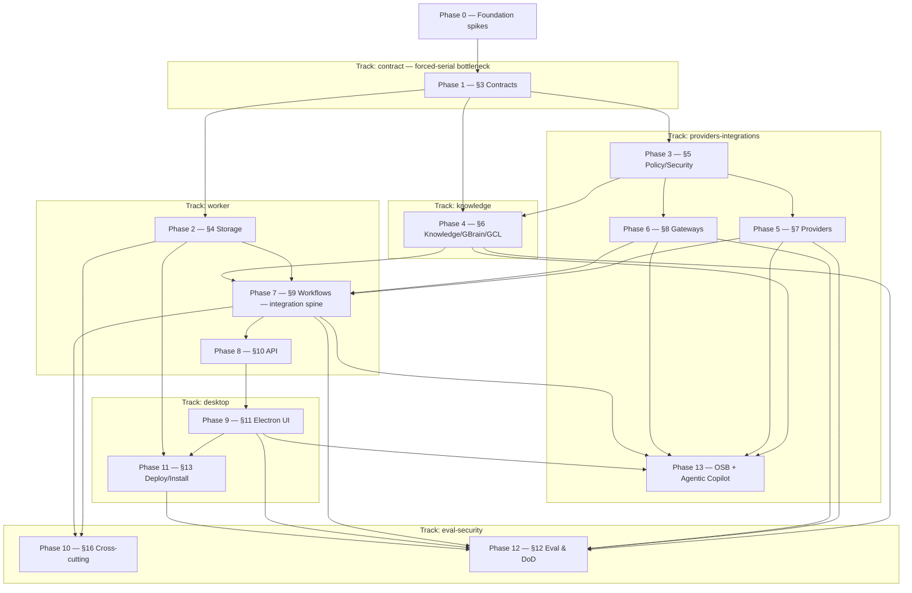

# IMPLEMENTATION_PLAN.md — System of Work Assistant

> **Phase note.** Spec-anchored build plan decomposed from the binding `ARCHITECTURE.md` (production-grade). 26 phases (0–25), ~310 first-class tasks — Phases 14–25 = the Part II activation roadmap (ARCH §19; 66 gaps→tasks coverage-verified). The §3 contracts phase (Phase 1) was the forced-serial bottleneck; the §9 workflows phase (Phase 7) is the integration spine. Locked decisions live in `docs/planning/DECISIONS.md`; every phase anchors to `ARCHITECTURE.md §` sections — drift surfaces at TDD Step 9. **All task states in this file were verified against the repo (commits, symbols, tests, audits, green gates) on 2026-07-19 at baseline `db45eb6e`** — the doc-wide reverification that rebuilt this file to the format contract below.

> **Reading discipline.** Read by section, not whole. Round history lives in `docs/archive/IMPLEMENTATION_LOG.md`, never here.

> **Session protocol:**
> - **Session start** — orchestrator `/orchestrate-start`; implementer `/session-start`. Confirm the session target.
> - **Session end** — implementer `/session-end` (TDD + cross-doc audit + Step-9 list + `/preflight`); orchestrator `/orchestrate-end` (reconcile State lines, Carry-forward, archive Log entry, push).

> **Format contract (lint-enforced by `scripts/plan-lint.sh`).**
> - **Task state** lives on ONE checkbox line — the first content line under each `### N.M` heading:
>   `- [x] DONE · `hash` · YYYY-MM-DD` (append `· dormant` for built-behind-OFF-flag work, `— arms via §ARM-x` where an arming ledger applies) · `- [~] PARTIAL · landed: …; remaining: … → target` · `- [ ] OPEN` · `- [ ] DEFERRED → target · owner-approved ref` · `- [ ] OWNER-GATED ⛔ Owner-Gates §ARM-x`.
>   Headings carry **no** state tokens; metadata (`**Kind:** / **Spec:** / **Depends:** / **Blocks:** / **Files:**`) are plain fielded lines, never checkboxes; narrative never carries state.
> - **Currently in progress** — ≤3 items / ≤15 lines, REPLACED each round (a snapshot of NOW, not a history).
> - **Carry-forward** — ≤7 items; resolved items are DELETED (never annotated in place); overflow lives in the owning phase's `#### Residuals`.
> - **Owner gates & arming ledgers** — the dedicated section below; every `OWNER-GATED` task references a `§ARM-*`/`§DEC-*` id defined there.
> - **Every task** carries a `**Spec:**` `ARCHITECTURE.md §` anchor or an explicit `arch_gap` flag.
> - **Phase-exit checklists** live in the archive (`docs/archive/IMPLEMENTATION_LOG.md` Part 3); each phase keeps a one-line `**Gate:**` pointer.

> **Spec-anchor convention.** Each phase header carries `**Spec anchors:**`, a `**Track:**` tag, and a `**Depends on (phases):**` edge. A slice surfacing a behavior the anchors don't cover is a cross-doc invariant flag at Step 9. New mid-build tasks get a first-class `### N.M` heading at the round they land — never narrative-only state.

---

## Phase status (at a glance)

_One row per phase; `Open` = tasks not yet DONE-class (open + partial + deferred + owner-gated). States: ✅ done · 🔶 active · ⬜ open · ⛔ owner-gated. Verified 2026-07-19 @ `db45eb6e`._

| Ph | Title | Track | State | Gate | Open | Anchor |
|----|-------|-------|-------|------|------|--------|
| 0 | Foundation spikes | — | ✅ done | complete (no formal gate) | 1* | §OQ |
| 1 | Shared Contracts & Domain | contract | ✅ done | CLEAR 06-30 | 0* | §3 |
| 2 | Operational Storage | worker | ✅ done | CLEAR 06-30 | 0* | §4 |
| 3 | Policy, Security & Egress | prov-int | ✅ done | CLEAR 07-01 | 0* | §5 |
| 4 | Markdown, Obsidian, GBrain & GCL | knowledge | ✅ done | CLEAR 07-01 | 1* | §6.1/§13 |
| 5 | Provider & Runtime Broker | prov-int | ✅ done | CLEAR 07-01 | 0 | §7 |
| 6 | Connector & Tool Gateways | prov-int | ✅ done | CLEAR 07-01 | 0 | §8 |
| 7 | Temporal Workflows & Automation | worker | ✅ done | CLEAR 07-02 (+ worker-wiring gate) | 1 (7.19 re-opened) | §9 |
| 8 | Local App API | worker | ✅ done | CLEAR 07-02 | 0 | §10 |
| 9 | Electron Desktop UI | desktop | 🔶 active | — (no /phase-exit run) | 9 | §11 |
| 10 | Cross-cutting concerns | worker | ✅ done | CLEAR 07-02 | 0* | §16 |
| 11 | Deployment, Install, Rollback & Repair | worker | 🔶 active | — (no /phase-exit run) | 6 | §17 |
| 12 | Eval & Test Harness | eval-sec | 🔶 active | — (no /phase-exit run) | 6 | §20 |
| 13 | Source Extractors & Knowledge Ingestion (+Copilot arc) | knowledge | 🔶 active | — (no /phase-exit run) | 8 | §13/§8 |
| 14 | Onboarding, Config Surfaces & Runtime Substrate | worker+desktop | ✅ done | CLEAR 07-15 (re-run) | 0 | §19.1 |
| 15 | Ingestion Spine Plumbing + Routing-Resolution | worker+desktop | ✅ done | CLEAR 07-16 | 0 | §19.2 |
| 16 | Connector Engine, Composition & Bridge | worker+prov-int | ✅ done | CLEAR 07-16 | 0 | §19.3 |
| 17 | Keychain Secrets Activation [HARD-LINE] | worker | ⛔ gated | build done; owner crossing PENDING §ARM-17 | 0* | §19.4 |
| 18 | Real Model Transport & Intelligence Legs | worker+prov-int | ⛔ gated | crossing CLEAR 07-18; full tick HELD — breadth §ARM-18 | 1 | §19.5 |
| 19 | gbrain Write-Back, Parity, Provenance & Cost | knowledge | ⬜ open | — | 11 | §19.6 |
| 20 | Serving-Oracle Go-Live | worker | ⛔ gated | — (§ARM-GBRAIN) | 4 | §19.7 |
| 21 | External Write / Tool-Sync | prov-int | ⬜ open (4 gated) | — (§ARM-21) | 10 | §19.8 |
| 22 | Propose Activation (last flip) | worker | ⛔ gated | — (crossing 6, §ARM-GBRAIN) | 5 | §19.9 |
| 23 | Per-Vendor Connector Enablement | prov-int | ⛔ gated | — (crossing 7, §ARM-23) | 7 | §19.10 |
| 24 | OS One-Writer Enforcement & Real Packaging | worker | ⬜ open | — | 5 | §19.11 |
| 25 | Second-Brain Output Workflows | knowledge | ⬜ open | — | 6 | §19.12 |

_`*` = a residual/deferred bullet remains inside a certified phase (see that phase's `#### Residuals`)._

---

## Currently in progress

- **Active:** none in flight — Phase-18 **Path-β desktop-arming round SEALED** (4 slices, all dormant/default-OFF, nothing armed): 18.31 `dd2ceaa4` (egress-allowlist seam) · 18.32 `0d8e7c56` (desktop subscription-arming forwarding) · 18.34 `fc3031f7` (native allowlisted `.env` loading) · 18.33 `db45eb6e` (committed L64 go/no-go harness). Gates GREEN: worker 1820/0, desktop 361/0, typecheck 20/20; lint/format env-waived. Session docs 102 (worker) + 103 (desktop).
- **Next target:** owner call — the auto-ingest / subscription in-app ENABLE (§ARM-18, owner-gated; the app is now CAPABLE — run the go/no-go `SOW_L64_DRYRUN=1 npx vitest run apps/worker/test/integration/autoIngest-armed-live.test.ts` first), OR a Carry-forward brief (SPINE arc · 7.19 retention re-open · Phase-9 completion).
- **Blocker:** all Phase-18 breadth + every arming step is owner-gated (§ARM-18). Nothing arms without the owner.

---

## Carry-forward to upcoming briefs

_≤7 items; the next-1–2-brief working set only. Resolved ⇒ deleted with an archive pointer. Overflow lives in the owning phase's `#### Residuals`._

1. **The SPINE arc** — connector→ingestion→content→gbrain end-to-end (owner-sequenced post-connector-chain target; folds the dormant extractor real-transports as sub-rounds, each owner-confirmed to bind — §ARM-23). Includes 13.10c gmail-source content hydration. *(origin: 2026-07-15 R8 close, owner breadth-then-spine decision)*
2. **7.19 retention-pruning workflow — RE-OPENED** — claimed done, verification found `retentionPrune.ts`/`prunePolicy.ts` absent (refuter-upheld, high confidence). Re-implement per RET-1/REQ-F-018. *(origin: 2026-07-19 doc-wide reverification)*
3. **Phase-9 completion → `/phase-exit 9`** — finish 9.5 (remaining projections), 9.9–9.12 open, then run the phase's first formal exit gate. *(origin: Phase-9 census; no gate ever run)*
4. **11.2 startup app-schema-compat REFUSAL wiring** — migration lifecycle is live; the version-refusal check at startup is unwired (the PARTIAL's remaining). *(origin: 2026-07-19 refuter finding)*
5. **FailureClass enum completion cluster** — add `db_unavailable` (P2 carry) + `provider_routing_unavailable` (P5 carry) members; owner decision on security members pending (§DEC-CAT4). Frozen-contract edit — contracts track. *(origin: phase-2/5 exit checklists)*
6. **LIVE `/design-review` owed** — the 15.8 reroute control (+ `aria-controls` a11y) and the Phase-14 Liquid-Glass styling pass, at the next app-up window. *(origin: 15.8 + #53 rounds)*
7. **ESLint configuration** — `lint` scripts are `tsc --noEmit` placeholders; `/preflight`'s lint gate is a no-op. Configure ESLint repo-wide. *(origin: Phase-1 tooling note L404)*

---

## Owner gates & arming ledgers

> ⛔ **Every entry here is an owner-gated HARD LINE — escalate-before-crossing with EXPLICIT owner confirm PER crossing (the lead brings the owner in).** The four standing hard lines: **cloud egress on raw Employer-Work · propose-bridge flip · real external write/fetch · real external-API spend / paid-key provisioning** (+ the write-through flip). Dormant machinery may be built + dual-reviewed freely; NOTHING arms without the owner. Tasks reference these ledgers via `OWNER-GATED ⛔ Owner-Gates §ARM-x`.

### §ARM-GBRAIN — the ⭐⭐ arming gate (gbrain/KW go-live; 7 steps, IN ORDER)

The dormant arming-prep arc is COMPLETE (Item 7 `8c559f9` + 2a `cdbb389` + 2b `4e5f18f`; Item 6 deferred → folds in here). What remains, verbatim-to-run-cold:

1. **RUN on the real vault + generate real KW corpora** (the owner's current step) — real KnowledgeWriter Markdown commits produce the corpora so serving coverage can go green. Prereqs: `claude` login · `VOYAGE_API_KEY` · `temporal` CLI · gbrain + initialized brain · real vault path (`docs/runbooks/run-it-live-and-provision.md`).
2. **PROVISION the HMAC signing key into macOS Keychain** — `security add-generic-password` + set the `keychainSecrets` config gate + verify vs live `security` (the FIRST real Keychain touch). The 11.4 KeychainSecretsAdapter is BUILT + boot-wired, inert until `keychainSecrets` is set (`4010155`/`4db092e`/`536d3b2`).
3. **CONFIRM the real `gbrain serve --http` WIRE SHAPE, then BIND the live transport.** ⚠ FIRST run the real serve and confirm the wire shape against it (op→path/method + response envelope + the completeness token + the EXACT more-results field-NAME set + per-field semantics incl. `nextOffset:0` + the authoritative total field) — the Item-2a/2b shapes are a DOCUMENTED CANDIDATE (arch_gap); a real field named OUTSIDE the candidate set is silently missed (**the anti-false-green residual**, worker Lesson 26). THEN bind the real `createGbrainHttpReadClient` (Item 2a) over a real Node HTTP transport + Keychain-backed SecretsAccessor + the provisioned loopback endpoint INTO `makeDbAdapter` at boot (`boot.ts` `gateReconcile`, currently `() => undefined`). Add a bounded AbortSignal/timeout at this binding; confirm the ServingCoverageReader schema-gates the returned unknown before it can drive a coverage GREEN. Related owner sub-decision at the pin re-capture: gbrain 0.35.1.0 exposes NO local commit-SHA, so `checkVersionPin` SHA-matching can never pass a real build — resolve pin identity SHA→semver (frozen-contract `GbrainPin` change) or add a real SHA source (see task 11.3).
4. **WIRE the deferred Item-6 trigger** — bind the real trigger source (`startVaultWatcher` / a schedule / the post-sourceIngestion-commit point → the reconcile scheduler's enqueue with the COMMITTED head revisionId) + debounce → flush, on the armed path ONLY (`gateReconcile` ON).
5. **ARMED-PATH HEALTH** — DONE (Item 7); only the precise OBS-2 dedupe subjectRef for reconcile health items remains (finalize once real defects flow).
6. **GOVERNANCE EVAL** — close the propose-path governance eval read-path/WS-8 coordination on the eval-security track (`../SoW-build-evalsec` — COORDINATE, do not touch that worktree).
7. **FLIP the flags (owner-confirmed, one at a time, LAST)** — `goLiveArmed` / `reconcile` / `copilotProposeMode` / `copilotServingOracleGoLive`. Even armed, every propose write = a PENDING §9.8 Approvals card; rollback = 1 flag. The `writeThroughEnabled` flip is additionally gated by 12.7's four GO conditions + `config/gbrain.pin` promoted out of `PENDING_LIVE_VALIDATION` (see 12.7/12.22).

**Arming-era residuals (finalize when real defects/transports flow):** (i) the OBS-2 reconcile subjectRef; (ii) confirm no non-`summarizeOutcome` producer wires into the reconcile log sink (single upstream-redaction chokepoint); (iii) bounded AbortSignal/timeout at the real transport binding; (iv) ServingCoverageReader candidate-gate confirm; (v) the anti-false-green completeness field-set confirm (step 3). **Reconcile-arming holds:** two owner-gated real bindings (live GbrainReadGrant transport behind piece B; real RebuildOracleSet) stay UNBOUND even armed; NAMED gap (piece C): empty-vault + populated-DB (all-`db_only` defects) is skipped-not-caught — needs a reader change once real corpora exist. **Copilot posture (owner):** propose OFF · reads+ingest only · Employer-Work→cloud egress owner-RELAXED for Copilot reads (2026-07-12) · `copilotAgentMode` + P1 scope filter FLIPPED LIVE (owner-instructed) through the scoped proxy; **accepted residual A1**: body-embedded foreign content isn't stopped by a runtime post-filter — needs ingest-time attribution + per-workspace source partitioning (Option B per-workspace brains removes it, deferred). Refs: `docs/runbooks/copilot-propose-go-live.md` · worker Lessons 18–26 · knowledge Lesson 1.

### §ARM-17 — Keychain provisioning + arming crossing (Phase 17)

THE OWNER CROSSING (lead brings to owner): `security add-generic-password` for `sow/kw-signing` (HMAC) + `providers/{claude,openai,openrouter}` (the `claude` account holds the Anthropic key) + `embeddings/voyage`, then flip `config.keychainSecrets` present ⇒ real backend + real read-back at boot. **GO-LIVE VERIFY at the crossing:** real `security` exit codes (not-found/locked/denied) + stderr strings + key-encoding — the mock tests pinned the CLASSIFIER, not the real codes. G48/G49 fully close at the crossing. Phase-18 follow-ups tracked: bind the accessor + secret-ref convention into real ModelProvider/Stamper deps (never-reject KeychainLockController, worker L21/L29); denied-operator-visibility signal; connector read/write + telegram token resolution-site bindings (Phases 21/23).

### §ARM-18 — subscription-extraction ENABLE (steps 0–7; ⛔ HARD STOP before step 6)

**Owner decision (ARCH §7/§19.5):** the real-model EXTRACTION path runs on the Claude **SUBSCRIPTION** — `createClaudeSubscriptionCompletion` (Agent SDK `query()` on the local `claude` login, NO credential; **the worker runs `ANTHROPIC_API_KEY` UNSET** — an empty/stale key shadows the subscription profile by resolution precedence). The raw-API `ModelProviderPort` path is FALLBACK ONLY — provision no key. Steps 0–5 are LANDED (18.19–18.24: builders + fail-closed runtime branch + real `ExtractionContentResolver` [exactly-one `refKind:"source"` + WS-8 read-back re-gate] + fail-closed health probe + AND-locked route knob + rule-5 fail-closed PROOF + armed-path shadowing-env guard [13-key set, 18.28] + deny-only cost cap + `bootWorker` one-signal arm via `isProviderTransportArmed`). **Step 6 (set the arming input) + step 7 (a run) are owner+lead-run, per-crossing confirm.** The SOURCE-leg maiden run is COMPLETE (2026-07-18, `rev:c416ed74`, $0.044772 metered, safety PASS incl. REQ-F-017 live) — **crossing GO-LIVE done; the FULL phase tick is HELD (owner call).**

**Remaining owner-deferred breadth (each its own confirm):** meeting.close live arming (Finding-F) · the model-driven eval-class validation runs · a live `ProposedAction` real-`targetSystem` · **18.10 auto-ingest ARM** (autonomous recurring spend on cadence; dormant trigger pre-ARM-verified SAFE, 18.30/18.33; readiness runbook `phase-18-10-auto-ingest-enable-readiness.md`). **Path-β in-app capability now BUILT + dormant (2026-07-20):** the packaged app can assemble the subscription-armed config from env (18.32) over the egress-allowlist seam (18.31) + native allowlisted `.env` loading (18.34). **ENABLE preconditions:** set `SOW_SUBSCRIPTION_ARM=1` + `SOW_EGRESS_ALLOWED_PROCESSORS=claude-agent-sdk` + `SOW_MANAGE_TEMPORAL=true` + `SOW_VAULT_ROOT=<vault>` AND inject a worker-host-side real `checkReachable` (env-only arm stays HEALTH-denied by design — `FAIL_CLOSED_REACHABILITY`). **Go/no-go GATE (run FIRST, $0):** `SOW_L64_DRYRUN=1 npx vitest run apps/worker/test/integration/autoIngest-armed-live.test.ts` — proves the armed path produces a real note (not spend-and-produce-nothing, L64); a green run is the precondition for the flip. **CHECKPOINT-1 residuals (MUST resolve before the first employer-raw armed run):** live-Agent-SDK-docs re-verify at the flip · reconsider `NODE_EXTRA_CA_CERTS` · the out-of-band `apiKeyHelper` owner check (settings-injection is invisible to the env guard — deployment-checklist item) · optional runtime-seconds cap (the route relies on SDK `maxBudgetUsd` $1.50, Finding-F; owner re-confirms the cap value at the final-spend gate). **Coupled follow-up:** 11.4's Keychain-locked degraded routing + provider `getSecret` consumption fold in at provider enablement (HELD, lead Ruling-A — not a standalone slice).

### §ARM-21 — external-write / tool-sync arming (Phase 21)

WS-8 re-gate at arming (security LOW, 15.7): the pending Approval `workspaceId` derives from `meetingJobInputs.workspaceId` — correct-by-coincidence under single-workspace-per-worker + the dormant `actions:[]` leg. When source external actions / the real transport arm: source the Approval ws from the source action's ROUTED workspace + add a WS-8 re-gate (worker L12/L32). Every external write stays inside the Tool-Gateway envelope (idempotency + canonical object key + pre-write existence check + receipt) and lands as a PENDING Approval even when armed.

### §ARM-23 — per-vendor connector enablement (Phase 23; crossing 7, INDEPENDENT arc)

Posture: NOT part of the sequential chain; gated only on Phases 16+17; ~1 owner-confirmed round PER VENDOR; does not gate and is not gated by propose (Phase 22). **The Phase-16 arming ledger (6 groups):** (1) real per-vendor HttpTransport send + tokenRef + re-run `isPrivateHost` on the RESOLVED IP (DNS-rebind/NAT64/6to4/0x-inet_aton); (2) real schedule bookkeeping + wakeDrain + live `createSchedule` START; (3) connector-instance binding-metadata seam + real cursor persistence; (4) single-engine arming coherence (poll-path `composeConnectors()` = THE injection seam); (5) point the poll-bridge seenContentHash seam at the real probe; (6) `coverage_degraded` FailureClass (contracts) + multi-signal ConnectorSyncResult + `ya29.` redaction pattern + seenContentHash record-on-commit migration. **Ingestion-binding cluster:** preserve the meeting-path contentHash-dedupe SKIP (recordId is the meeting idempotency axis, worker L38) + supply the `dispatchMeeting` dep at construction (fail-fast conditional-required, worker L39) when binding `connectorIngestionBridge` into the scheduled poll + real transports.

**Per-vendor residuals:** [Granola] provision the `grn_` key minimal-scope GET-only. [Google/Asana] OAuth token manager BEHIND SecretsAccessor (never a static token) · read-only-scope invariant (`drive.readonly`/`calendar.readonly`/minimal Asana) · Drive `incompleteSearch` degrade-vs-ignore decision · Calendar `nextSyncToken` incremental resume · Asana scope param (owner GID) + richer `opt_fields`. [GitHub] minimal READ-only PAT · rate-limit backoff · `since`/labels + PR-exclusion · versioned headers. [Linear] AUTH arch_gap: personal API key uses RAW `Authorization:<key>` (no Bearer) ⇒ per-spec auth-scheme seam. [Gmail] detail-HYDRATION (`messages.get` fan-out) = future round; **ING-7 tool-stripping HARD when hydration lands** (email content UNTRUSTED) · minimal `gmail.readonly`. [Extractors → SPINE] real parse/extract transports (web HTTP+readability [map `textContent`, NOT HTML] · podcast RSS+transcription · youtube pinned-subprocess [join transcript segments in DOCUMENT order] · file fs+PDF) are heterogeneous + hard-line-adjacent — fold into the SPINE as sub-rounds, one per extractor, build dormant, owner confirm to bind. [Template] confirm the REAL Asana wire shape + present-but-offsetless `next_page` fail-open-vs-closed decision · resolved-IP pinning carries. [All] confirm real wire shape at arming; TODOIST DROPPED (owner). Chain state: 7 HTTP connectors + 4 OSB extractors all DORMANT behind the line; ING-7 read-only verified non-bypassable at admission.

### §ARM-REBUILD — rebuild-oracle arming residuals (task 13.10 piece-A/C)

Surface only when the real `IndexRebuildClient` binds: (a) a `faulted` per-ws `RebuildOracleStatus` routes NO health (operator-silent — needs a piece-A producer change, Lesson-25 asymmetry); (b) a `sink.record` rejection on the FIRST `diverged` ws short-circuits later divergences that boot (fail-safe; per-ws resilience finalizes at arming); (c) rebuild `receipt.revisionId`/`workspaceId` pass verbatim from the untyped client boundary — confirm no serve-time consumer trusts them over locally-computed fields; (d) the OBS-2 `rebuild_divergence` dedupe subjectRef finalizes when real defects flow. **Empty-derived decision:** a mapped vault deriving 0 facts corroborates `true` with an empty `oracleSet` (not a live false-green — the loader AND-degrades); decide at arming whether to mint a distinct empty-derived signal.

### §DEC-CAT4 — FailureClass security members (frozen-contract owner decision — PENDING)

Whether the frozen `FailureClass` taxonomy gains dedicated security members (category-4 call surfaced in the 11.8 round-7 review). Related open enum members ride Carry-forward #5 (`db_unavailable`, `provider_routing_unavailable`). A frozen-contract edit — contracts track + schema-snapshot bump + repo-wide typecheck when decided.

---

## Parallelization plan (Track map)

> **⚠ PART I HISTORICAL.** The 6-track worktree parallelization below served Phases 0–13 and was retired 2026-07-09 (single-track on `main`; archive Part 1). Part II (Phases 14–25) runs as a near-linear owner-gated chain — sequencing lives on the phase `**Depends on**` edges + the Owner-Gates crossings, not this DAG. Track names remain the authority for the `<track>-<area>-<role>` naming convention.

> **Team mode.** A *track* is a dependency-isolated region of the `ARCHITECTURE.md` §2.5 DAG. Tracks with no unsatisfied upstream-track dependency run **in parallel**, each in its own git worktree + agent team. Phase 0 (spikes) and Phase 1 (contracts) are pre-fork: **all tracks wait on Phase 1**.

**Phase/track DAG** (nodes = phases; edges = `Depends on (phases)`):

> **Critical path:** Phase 0 → 1 → 3 → 6 → 7 → 8 → 9 → 11 → 12 (9 phases — the serial floor; staff it first). **Forced-serial bottlenecks:** **Phase 1 (§3 contracts)** — every track waits on the frozen contract; and **Phase 7 (§9 workflows)** — the integration spine every feature track (storage, knowledge, providers, gateways) converges into.

**Track map** — `<track>-<area>-<role>` naming per root `CLAUDE.md`:

| Track | Phases | Code area(s) | Worktree (branch) | Agent-team names |
|---|---|---|---|---|
| contract | 1 | `packages/contracts`, `packages/domain` | `../SoW-build-contract` (`track/contract`) | `contract-contracts-orchestrator` / `-implementer` |
| worker | 2, 7, 8, 13 | `packages/db`, `packages/workflows`, `apps/worker` | `../SoW-build-worker` (`track/worker`) | `worker-workflows-orchestrator` / `-implementer` |
| providers-integrations | 3, 5, 6, 13 | `packages/policy`, `packages/providers`, `packages/integrations` | `../SoW-build-provint` (`track/providers-integrations`) | `providers-integrations-policy-orchestrator` / `-implementer` |
| knowledge | 4, 13 | `packages/knowledge` | `../SoW-build-knowledge` (`track/knowledge`) | `knowledge-knowledge-orchestrator` / `-implementer` |
| desktop | 9, 11 | `apps/desktop` | `../SoW-build-desktop` (`track/desktop`) | `desktop-desktop-orchestrator` / `-implementer` |
| eval-security | 10, 12, 13 | `packages/evals` | `../SoW-build-evalsec` (`track/eval-security`) | `eval-security-evals-orchestrator` / `-implementer` |

**Integration / merge order** (DAG topological): 1 (contract — freeze first) → 2 ∥ 3 → 4 ∥ 5 ∥ 6 → 7 (spine) → 8 → 9 → 10 ∥ 11 → 12 (DoD certification last); **13 (OSB inheritance + Agentic Copilot arc)** attaches after 9 (+4/5/6/7) — cross-track: **worker** (primary for the §13.11 Copilot machinery + §13.10 catalog wiring) + providers-integrations (OSB extractors; §13.10 catalog/policy + §13.11 runtime) + knowledge (§13.3/13.8 + the serving oracle) + eval-security (§13.11 P2.5 + the C6 governance eval) + contract (§13.5 Project frozen-contract round).

**Shared contracts across tracks** (freeze before fork — Appendix-A models crossing a §2.5 edge): `Workspace`, `ProviderMatrix`, `EgressPolicy`, `ToolPolicy`, `Capability`, `ProviderRoute`, `AgentJob`, `KnowledgeMutationPlan`, `ProposedAction`, `ExternalWriteEnvelope`, `SourceEnvelope`, `Approval`, `GclProjection`, `AuditRecord`, `WorkflowRunRef`, `ProviderProfile` — **plus the GBrain write-through/divergence seam models** `SemanticFact`, `FactProvenance`, `SignedProvenanceStamp`, `ParityReport`, `Divergence`, `QuarantineRecord`, `GBrainProposedFact`, `GbrainReadGrant`/`GbrainServePolicy`, `GbrainPin` (9 NEW), and the **amended** `KnowledgeMutationPlan` (+`provenanceOrigin`/`gbrainProposalRef`/`signedProvenanceStamp`) + `HealthItem` (+`sync_lagging`/`rebuild_divergence`/`parityReportRef`/`factIdentity`) — all defined + schema-snapshot-frozen in Phase 1.

> **Write-through seam-freeze note (added by the 2026-06-29 amendment).** The GBrain write-through/divergence layer (Phase-4 tasks 4.14–4.20; spec `docs/design/gbrain-write-through-divergence.md`) crosses the **knowledge / eval-security / providers-integrations / worker** seams, so the 9 new + 2 amended models above **MUST** be authored + JSON-Schema-snapshot-frozen in Phase 1 **before those tracks fork** — an unfrozen seam here is a guaranteed mid-build cross-track Finding. The `HealthItem.sync_lagging` enum value (already emitted by task 4.4 + the 1.13 state machine but previously absent from Appendix A) is closed in this same freeze round.

<!-- ▲ END EXAMPLE BLOCK [id=parallelization-plan] ▲ -->

---

## Phase exit checklist (template — applies to every phase)

Executed row-by-row by `/phase-exit <phase>`:

- [ ] All phase task checkboxes ticked (partial work stays unchecked with a Log note).
- [ ] Acceptance criterion met (`/preflight` clean + manual smoke if runtime behavior).
- [ ] `/preflight` clean (incl. architecture-invariant tests).
- [ ] Cross-doc invariants verified — no model field change without an `ARCHITECTURE.md` edit in the same round.
- [ ] Reachability audit clean per touched area.
- [ ] Arch-drift audit clean over the phase's Spec anchors.
- [ ] Spec coverage: every phase anchor has a tagged test or waiver (`spec-lint tests <phase>`).
- [ ] _(production-grade)_ Dependency audit: `pnpm audit --prod` shows no NEW findings vs the accepted-risk baseline (new findings accepted-risk-recorded in Decisions tabled or escalated as a Finding).
- [ ] _(production-grade)_ Whole-system security review clean for qualifying phases (trust-boundary / security-/invariant-tagged tasks — per `THREAT_MODEL.md`; resolves against `security-reviewer = invariant`).
- [ ] Session doc(s) exist and list every file created/modified.
- [ ] Commits pushed.

---

## Final-submission acceptance criteria (project-level)

- [ ] All PRD §20.1 end-to-end acceptance tests pass against real integrations (no mocks on load-bearing paths) — certified in Phase 12.
- [ ] Meeting-closeout proof spine works end-to-end with zero duplicate external writes on replay.
- [ ] EVAL-1 metrics met: meeting-closeout ≥90% routing accuracy; retrieval ≥90% relevance; WS-7 leakage = 0.
- [ ] SQLite **and** Postgres pass the one repository contract suite (Postgres not a permanent stub).
- [ ] Perf budgets met: dashboard <2s; KW→GBrain ≤60s p95; KW→dashboard ≤10s p95.
- [ ] Clean install succeeds on a fresh Mac on the default runtime without Hermes.

---

---

## Phase 0 — Foundation spikes (de-risk gates)
**Goal:** Resolve the load-bearing unknowns the architecture names as Phase-0 spikes, each with a recorded go/no-go + no-go branch, before the contract freezes; spikes are throwaway experiments producing recorded decisions (pinned versions, chosen primitives, budgets), not TDD slices. · **Spec anchors:** §18 (open-question dispositions), §13, §7, §12 · **Track:** — (pre-fork foundation) · **Depends on (phases):** none
**Gate:** — (no /phase-exit run) — throwaway-spikes phase (decision artifacts, no shipped code to audit); gate satisfied by ticked Acceptance criteria + close-out `af1eea49` (2026-06-29).

### 0.1 — Electron shell / packaging spike (OQ-001)
- [x] DONE · `af1eea49` · 2026-06-29
**Kind:** spike · **Spec:** §18 OQ-001 · §13 Deploy/Install · §14/ADR-001 · **Depends:** none · **Blocks:** —
**Files:** docs/spikes/0.1-electron-packaging.md
Validate an unsigned build-from-source packaging that spawns + supervises the Node worker, the local Temporal dev-server, and per-workspace GBrain subprocesses; capture hardened-runtime entitlement needs. Recorded go/no-go — no-go ⇒ reopen the Electron shell ADR (§14/ADR-001). OQ-001 resolved: unsigned build-from-source for V1; signed+notarized deferred to V1.1.

### 0.2 — GBrain round-trip + version-pin spike (OQ-006)
- [ ] DEFERRED → Phase 4 (tasks 4.14–4.20); GO conditions as Phase-12 acceptance gates 12.7/12.22/12.23 · owner-approved 2026-06-29 (write-through amendment)
**Kind:** spike · **Spec:** §18 OQ-006 · §6 Knowledge/GBrain · §19.6 write-back/parity · §13 deploy gate · **Depends:** none · **Blocks:** 4.14–4.20
**Files:** docs/spikes/0.2-gbrain-roundtrip.md, config/gbrain.pin
Prove the §19 round-trip GO conditions (fs-watch shows zero non-KnowledgeWriter Markdown mutations; a concurrent GBrain index job loses no KnowledgeWriter write; an injected DB-only fact is flagged by the parity check; Markdown stays syntactically valid + semantically lossless) and pin the known-good GBrain SHA. Phase-0 methodology harness landed 13/13 PASS; `config/gbrain.pin` re-captured vs installed gbrain 0.35.1.0 (3933eb6a, `write_through_enabled` default false) per the 2026-06-29 write-through amendment — read-only/index-only is now the per-workspace default-until-enabled fallback + kill switch, NOT the V1 endpoint; write-through ships ON in V1 behind the fail-closed divergence layer. **Done-when:** the live 4-GO-condition proof lands as Phase-4 tasks 4.14–4.20, verified as Phase-12 acceptance gates 12.7/12.22/12.23.

### 0.3 — Hermes adapter surface spike (OQ-007)
- [x] DONE · `af1eea49` · 2026-06-29
**Kind:** spike · **Spec:** §18 OQ-007 · §7 Provider & Runtime Broker · **Depends:** none · **Blocks:** —
**Files:** docs/spikes/0.3-hermes-surface.md
Choose the Hermes integration surface via a bounded meeting-close mock with schema validation, stop/cancel, logs, controlled tools. OQ-007 resolved: HYBRID one-shot CLI subprocess (primary) + Kanban; no-go branch keeps the Claude SDK (or another conformant runtime) on the critical path — Hermes stays required + DoD-tested but not first-install-gating. Empty `-t` full-toolset caveat banked (§7).

### 0.4 — Provider conformance baseline spike (OQ-003)
- [x] DONE · `af1eea49` · 2026-06-29
**Kind:** spike · **Spec:** §18 OQ-003 · OQ-004 caps · §7 broker · **Depends:** none · **Blocks:** —
**Files:** docs/spikes/0.4-provider-conformance.md, config/providers.defaults.json
Pin exact provider × capability × model pairs and verify structured-output/tool-use fidelity per enabled provider (Claude/OpenAI/OpenRouter/Ollama/LM Studio); choose default models per capability; record the cost-estimation source + default `maxCostUsd` cap. OQ-003 resolved: defaults + caps in config; OpenRouter deepseek-v4-pro + claude-haiku-4.5 live-verified. (config/providers.defaults.json later extended by 18.23b for staged-ENABLE.)

### 0.5 — Local API streaming primitive spike (OQ-002)
- [x] DONE · `af1eea49` · 2026-06-29
**Kind:** spike · **Spec:** §18 OQ-002 · §10 Local API (push primitive) · **Depends:** none · **Blocks:** —
**Files:** docs/spikes/0.5-api-stream.md
Decide the worker→renderer push primitive (tRPC subscription over WebSocket vs SSE-style stream); validate reconnection/backpressure under the session-token auth model. OQ-002 resolved: WebSocket (tRPC v11 subscription); SSE validated as a drop-in fallback.

### 0.6 — Perf-budget pass (deferred budgets)
- [x] DONE · `af1eea49` · 2026-06-29
**Kind:** spike · **Spec:** §18 Perf-pass/OQ-004 · §12 Eval & Test Harness · §7 caps · **Depends:** none · **Blocks:** —
**Files:** docs/spikes/0.6-perf-budgets.md
Set or explicitly defer (with rationale) the non-PRD interactive budgets: meeting-closeout end-to-end p95, Copilot response, approval round-trip, ingress→workflow-start, single-machine concurrency cap, default per-job `maxCostUsd`. Resolved: advisory SLOs set, enforcement deferred to Phase-7/12; the three PRD budgets (dashboard <2s, KW→GBrain ≤60s p95, KW→dashboard ≤10s p95) remain hard gates regardless.

### Acceptance criteria (0)
- [x] DONE · `af1eea49` · 2026-06-29 — all 0.X spikes have a recorded go/no-go + decision artifact in `docs/spikes/`; GBrain SHA pinned; stream primitive chosen; provider/model pairs + default caps recorded; Hermes surface chosen or critical-path reassigned.

---

## Phase 1 — Shared Contracts & Domain

**Goal:** Define and freeze the entire shared-contract surface every §2.5 track imports — all Appendix-A models (base set + the 9 NEW GBrain write-through/divergence seam models, with `KnowledgeMutationPlan`/`HealthItem` amended) as runtime-safe TS types + strict JSON Schemas (each schema-snapshot-frozen), the Drizzle operational-store schema source + repository interfaces, and the pure domain layer (6 state machines, 5 universal rules incl. REQ-F-017 no-inference, key builders). Forced-serial bottleneck: contracts/domain import nothing app- or adapter-side, so every seam is exhaustively pinned + snapshot-frozen before any downstream track forks. · **Spec anchors:** §3 (primary) · §2.5 · Appendix A · §5 · §7 · §9 + DOMAIN_MODEL.md · §12 · §16 (REQ-S-006, REQ-S-001/002/007, REQ-F-002/005/006/012/017, REQ-D-002/003) · **Track:** contract · **Depends on (phases):** 0
**Gate:** ✅ /phase-exit 1 CLEAR (2026-06-30) — checklist: docs/archive/IMPLEMENTATION_LOG.md Part 3 · audits: docs/audits/phase1-arch-drift.md, docs/audits/phase1-security.md

### 1.1 — Package scaffold + shared primitives, enums, typed-result envelope, event-name catalog
- [x] DONE · `6f004194` · 2026-06-30
**Kind:** build · **Spec:** §3 (primary) · §16 typed-result · §2.5 import-direction · §10 event catalog · **Depends:** none · **Blocks:** 1.2, 1.3, 1.4, 1.7, 1.9, 1.10
**Files:** packages/contracts/src/primitives/{ids,enums,result}.ts, events/catalog.ts; packages/{contracts,domain}/package.json + tsconfig
Stands up packages/contracts + packages/domain as pure packages that import nothing app- or adapter-side (§2.5 import-direction, pinned by a boundary check). Branded/opaque ID types block cross-assignment at compile time and reject empty/whitespace at runtime; shared enums pin exact literal membership (WorkspaceType, DataOwner, VisibilityLevel, ProviderId, egressClass; ProcessorId/ToolId as branded strings). Result<T,E> gives enumerable typed failure variants with no throw-based control flow across subsystem boundaries (§16); the event-name catalog is the single §10 push-stream source of truth — renderer-importable and carrying no secrets/raw data.

### 1.2 — JSON Schema validation gate + schema registry
- [x] DONE · `8a42f133` · 2026-06-30
**Kind:** build · **Spec:** REQ-S-006 · §3 universal candidate-data rule · **Depends:** 1.1 · **Blocks:** 1.3, 1.4, 1.7, 1.8, 1.11
**Files:** packages/contracts/src/schema/registry.ts; packages/domain/src/validation/schema-gate.ts
The candidate-data gate (safety rule 2). A schema registry maps schemaId→compiled validator; an unknown schemaId is a typed rejection, never a silent pass-through. validate(output, schemaId) returns a typed Result — on failure it yields schemaId + failing JSON paths and does NOT return the output as usable, enforcing candidate-data-in/validated-out before any downstream use. ajv strict + format assertions reject unknown/additional properties so provider drift cannot smuggle fields; validation is pure/deterministic (no network/clock), and rejection variants are enumerable so the §9 meeting validator surfaces a distinct schema_rejected class.

### 1.3 — EgressPolicy + ToolPolicy contracts (P0 controls — exhaustive)
- [x] DONE · `512d7314` · 2026-06-30
**Kind:** build · **Spec:** REQ-S-002, REQ-S-001 · §5 veto rule · §3 model surface · **Depends:** 1.1, 1.2 · **Blocks:** 1.5, 1.6, 1.14, 1.15
**Files:** models/{egress-policy,tool-policy}.ts, schemas/*.schema.json, models/__snapshots__/*.snap
Field-exhaustive P0 controls with spec(§3)-tagged schema-snapshots. EgressPolicy fields exactly {workspaceId, allowedProcessors, rawContentAllowedProcessors, employerRawEgressAcknowledged, acknowledgedAt?} with acknowledgedAt present iff acknowledged===true; a ProcessorId is any external content recipient — local Ollama/LM Studio are NON-egress and never appear, and OpenRouter is its OWN processor id, not an OpenAI-compatible alias (§5 veto rule). ToolPolicy {mode, allowedTools, deniedTools, allowsMutating} exposes the consistency predicate for the §5 admission gate: mode===read_only ⇒ allowsMutating===false and no mutating tool in allowedTools; deniedTools takes precedence over allowedTools on overlap.

### 1.4 — Capability + ProviderRoute + ProviderProfile contracts
- [x] DONE · `512d7314` · 2026-06-30
**Kind:** build · **Spec:** §3 schema-snapshot · §7 matrix-eligibility · REQ-S-003 no-inline-secret · **Depends:** 1.1, 1.2 · **Blocks:** 1.5, 1.6, 1.14, 1.15
**Files:** primitives/zod-brands.ts (Capability), models/{provider-route,provider-profile}.ts + schemas + snaps
Capability is an open branded capability-id string (config-driven membership like meeting.close/notebooklm.sync) — it lives in primitives/zod-brands.ts as `Branded<string,'Capability'>`, not a standalone model file, so there is no capability.snap (the old Files line's `models/capability.ts` is doc drift, not open work). ProviderRoute is a discriminated union with exactly one of runtime|provider set; egressClass===local marks the non-egress route that is the §5 veto's only legal pick for unacknowledged Employer-Work raw content. ProviderProfile carries secrets as Keychain references only — the schema forbids any inline API-key/plaintext-secret field (REQ-S-003); conformanceStatus (unknown|passing|failing|disabled) is representable-but-flagged, with matrix-eligibility itself living in §7.

### 1.5 — ProviderMatrix + Workspace contracts (aggregate config)
- [x] DONE · `512d7314` · 2026-06-30
**Kind:** build · **Spec:** REQ-F-001 · §3 · **Depends:** 1.3, 1.4 · **Blocks:** 1.8, 1.14, 1.15
**Files:** models/{provider-matrix,workspace}.ts + schemas + snaps
Aggregate config with referential pins. ProviderMatrix {workspaceId, allowedProviders, capabilityDefaults, rawCloudEgressEnabled, localProviderPreference?} pins every capabilityDefaults route provider ⊆ allowedProviders. Workspace embeds EgressPolicy + ProviderMatrix by value with workspace.id===egressPolicy.workspaceId===providerMatrix.workspaceId. Safe default pinned fail-closed: type===employer_work ⇒ dataOwner defaults employer AND egress defaults closed (employerRawEgressAcknowledged===false, rawContentAllowedProcessors empty).

### 1.6 — AgentJob contract (incl. ContextRef, budgets, embedded policy/route)
- [x] DONE · `512d7314` · 2026-06-30
**Kind:** build · **Spec:** §3 · §5 admission gate · §7 egress veto (COST-1) · **Depends:** 1.3, 1.4 · **Blocks:** 1.12, 1.14, 1.15
**Files:** models/agent-job.ts + schema + snap
AgentJob fields exactly {id, workflowRunId, workspaceId, capability, contextRefs, outputSchemaId, toolPolicy, providerRoute, maxRuntimeSeconds, maxCostUsd?, idempotencyKey}; ContextRef sub-type defined here. COST-1 budget pins: maxRuntimeSeconds required positive, maxCostUsd optional-but-positive, idempotencyKey required non-empty (replay key). outputSchemaId must resolve in the §3 registry — an AgentJob naming an unknown id is invalid at construction (referential pin to 1.2). toolPolicy + providerRoute are carried by value (plus trustLevel + carriesRawContent) so the §5 admission gate and §7 egress veto evaluate without extra lookups.

### 1.7 — KnowledgeMutationPlan + ProposedAction + ExternalWriteEnvelope contracts (write path)
- [x] DONE · `512d7314` · 2026-06-30
**Kind:** build · **Spec:** §3 universal rule (REQ-F-006) · §8/§20.1 external-write + replay · **Depends:** 1.1, 1.2 · **Blocks:** 1.11, 1.13, 1.14, 1.15
**Files:** models/{knowledge-mutation-plan,proposed-action,external-write-envelope}.ts + schemas + snaps
The write-path shapes. KnowledgeMutationPlan is the ONLY KW input shape; pinned reject-on-empty — a semantic mutation carries workspaceId AND non-empty sourceRefs (REQ-F-006 / §3 universal rule). ProposedAction and ExternalWriteEnvelope both require canonicalObjectKey + idempotencyKey (universal external-write rule, §3/§8); the envelope pins linkage envelope.actionId===ProposedAction.actionId with targetSystem/canonicalObjectKey/idempotencyKey agreeing, and WriteReceipt gives exactly-once. payloadHash is a deterministic function of payload (stable across runs) so replay matches the §20.1 replay gate.

### 1.8 — SourceEnvelope + GclProjection contracts
- [x] DONE · `512d7314` · 2026-06-30
**Kind:** build · **Spec:** REQ-F-002, REQ-F-005 · §3 universal rule · §6 Visibility Gate · **Depends:** 1.1, 1.2, 1.5 · **Blocks:** 1.11, 1.14, 1.15
**Files:** models/{source-envelope,gcl-projection}.ts + schemas + snaps
SourceEnvelope {sourceId, workspaceId, origin, contentHash, type, sensitivity, routingHints} requires workspaceId (REQ-F-002 scoped-before-durable); contentHash is deterministic and drives the Flow-4 dedupe-hit. GclProjection is the single cross-workspace shape and pins reject-on-missing — every projection MUST declare visibilityLevel AND source workspace (§3 universal rule / §6 WS-8 Visibility Gate). projectionType drives an allowed-field set for sanitizedPayload and the schema forbids raw-content-shaped fields by construction (a raw-key denylist floor here; full WS-8 leakage enforcement lands §5/§6).

### 1.9 — Approval + WorkflowRunRef + AuditRecord contracts
- [x] DONE · `512d7314` · 2026-06-30
**Kind:** build · **Spec:** §3 · §16 redaction-friendly summaries · **Depends:** 1.1 · **Blocks:** 1.13, 1.14, 1.15
**Files:** models/{approval,workflow-run-ref,audit-record}.ts + schemas + snaps
Approval {id, actionRef, status, actor, channel, payloadHash, snoozeUntil?, expiresAt?} freezes status ∈ pending|approved|edited|rejected|deferred|expired and channel ∈ mac|telegram, with snoozeUntil present only when status===deferred. WorkflowRunRef {workflowId, trigger, state, idempotencyKey, auditRefs}. AuditRecord before/after are SUMMARIES, never raw content (redaction-friendly, §16) — the schema has no raw-content field.

### 1.10 — Canonical-object-key + idempotency-key builders (replay-stable)
- [x] DONE · `e373cdda` · 2026-06-30
**Kind:** build · **Spec:** §8 pre-write existence · §20.1 replay gate (REQ-NF-006) · **Depends:** 1.1 · **Blocks:** 1.11
**Files:** packages/domain/src/keys/{canonical-key,idempotency-key}.ts
buildCanonicalObjectKey is deterministic over (targetSystem + stable identity inputs) — the same logical external object yields the same key across runs/processes (enabling the §8 pre-write existence check / match-by-canonical-key), with documented, pinned input normalization (trim/case/order-independence). buildIdempotencyKey is deterministic over operation identity so a replayed workflow step yields the same key — collisions occur only for a genuinely-identical operation (no duplicate external writes, §20.1 replay gate, REQ-NF-006). Both builders are pure: NO clock, NO randomness, NO env; keys are opaque, URL/storage-safe strings.

### 1.11 — Universal validation rules + no-inference validator
- [x] DONE · `e373cdda` · 2026-06-30
**Kind:** build · **Spec:** REQ-F-017 · §3 universal rules · §9 meeting validator · **Depends:** 1.2, 1.7, 1.8, 1.10 · **Blocks:** 1.15
**Files:** packages/domain/src/validation/{universal-rules,no-inference}.ts
The 5 §3 universal rules as pure composable predicates returning typed rejections (schema-valid delegating to 1.2; external write carries canonicalObjectKey+idempotencyKey; semantic mutation carries workspaceId+non-empty sourceRefs; cross-workspace projection declares visibilityLevel+source workspace). The no-inference rule (REQ-F-017 / MTG-4) is a HARD REJECT — a validator denial, not a model preference: an extraction field (owner/date) populated WITHOUT a supporting evidence ref fails; unstated values must be TBD or routed to clarification. Rejections are typed/enumerable (missing_evidence, inferred_owner_or_date, missing_key, unscoped_mutation, missing_visibility) so the §9 meeting validator surfaces distinct classes; all validators pure/deterministic.

### 1.12 — Domain state machines: Source, Meeting Closeout, AgentJob
- [x] DONE · `d1434804` · 2026-06-30
**Kind:** build · **Spec:** §9 + docs/planning/DOMAIN_MODEL.md · **Depends:** 1.6 · **Blocks:** —
**Files:** packages/domain/src/state/{source,meeting-closeout,agent-job}.ts
Three of the six DOMAIN_MODEL state machines as pure total transition functions — illegal transitions return typed rejections (never throw), terminal states frozen. Source (captured→…→applied|rejected|failed_*) forbids captured→applied without classification+policy validation and processing→external_write from the source-processing agent. Meeting Closeout runs detected→…→summarized with failure/recovery states reachable from their specified points. AgentJob makes cancelled_budget a terminal reachable from running (COST-1, no committed side effect at the state level). Five AMBIGUOUS recovery-edge arch_gaps (Source failed_retryable→processing; Meeting-Closeout provider_failed/schema_rejected/write_conflict recovery; AgentJob running→cancelled_budget + failed_retryable→admitted) are flagged in code and carry to §9/Phase-7 — documented, not open Phase-1 work.

### 1.13 — Domain state machines: Knowledge Mutation, Proposed External Action, Approval
- [x] DONE · `d1434804` · 2026-06-30
**Kind:** build · **Spec:** REQ-F-012 · §9 · §6 Divergence taxonomy · **Depends:** 1.7, 1.9 · **Blocks:** —
**Files:** packages/domain/src/state/{knowledge-mutation,proposed-action,approval}.ts
The remaining three machines. Knowledge Mutation reaches committed_to_markdown as the durability point (no transition rolls it back); provenanceOrigin (human|meeting_close|ingestion|gbrain_proposal|parity_remediation) discriminates entry (gbrain_proposal defaults requiresApproval=true), and parity_defect is classified by the §6 Divergence taxonomy (db_only/unstamped HARD-floor, content_mismatch Markdown-wins, md_only, edge_*, stale_revision), remediated materialize-or-purge at task 4.18. Proposed External Action runs proposed→…→receipt_recorded (terminal-success), retry_queued re-entering dispatched. Approval's deferred is NON-terminal (deferred→pending|expired) with configurable snooze/expiry, and re-applying a terminal transition is an idempotent no-op (REQ-F-012, Mac+Telegram parity).

### 1.14 — Drizzle operational-store schema source + repository interface contracts
- [x] DONE · `5e713aa7` · 2026-06-30
**Kind:** build · **Spec:** REQ-D-002 · §4 (adapters deferred) · REQ-S-003 · **Depends:** 1.3–1.9 · **Blocks:** Phase 2 (db adapters)
**Files:** packages/db/src/schema/*.ts (9 domain files + index), repositories/interfaces.ts
Dialect-neutral Drizzle table definitions for the operational-store domains (workspace config, event log, audit, approvals, outboxes, connector cursors, provider state, read models, GCL projections) — no SQLite/Postgres-only column types (concrete adapters/migrations/both-dialect contract suite deferred to §4/worker track, REQ-D-003). Column-name parity drift-guard: the 6 flat Appendix-A models are guarded by column-parity.test.ts, while SourceEnvelope is persisted as event-log payloads (not a flat config row) and so intentionally NOT flat-parity-checked (reconciled, not a defect). No plaintext-secret column anywhere — secrets are Keychain references only (REQ-S-003); audit before/after are summaries (§16). Repository interface contracts live in packages/db so domain depends on interfaces, never a concrete driver (import-direction §2.5, REQ-D-002).

### 1.15 — Shared seam contract test fixtures (valid + per-rule invalid)
- [x] DONE · `a039e86e` · 2026-06-30
**Kind:** build · **Spec:** §3 (shared seam fixtures) · **Depends:** 1.3–1.9, 1.11 · **Blocks:** downstream-track RED outlines
**Files:** packages/contracts/src/fixtures/{index,valid,invalid}.ts
A canonical valid instance plus a per-rejection-rule set of invalid instances for every Appendix-A contract — the shared seam fixtures every downstream track's RED outline imports. Invalid fixtures cover the pinned rules (read_only ToolPolicy admitting a mutating tool; EgressPolicy acknowledged without acknowledgedAt; KMP empty sourceRefs; ProposedAction missing canonicalObjectKey/idempotencyKey; GclProjection missing visibilityLevel; no-inference owner/date without evidence ref; ProviderProfile inline secret; ProviderMatrix route outside allowedProviders). Fixtures are typed and each carries a claimed validity label; a meta-test pins that the label matches the schema-gate verdict from 1.2, and fixtures are deterministic literals so snapshots and replay tests stay stable.

### Acceptance criteria (1)
- [x] DONE · `a039e86e` · 2026-06-30 · phase-certified
All 1.X checkboxes ticked; all Appendix-A models — the base 16 **plus the 9 NEW write-through/divergence seam models** (SemanticFact, FactProvenance, SignedProvenanceStamp, ParityReport, Divergence, QuarantineRecord, GBrainProposedFact, GbrainReadGrant/GbrainServePolicy, GbrainPin) with `KnowledgeMutationPlan`/`HealthItem` amended — are runtime-safe TS types + strict JSON Schemas, each with a green spec(§3/§6)-tagged schema-snapshot freezing its field-name set (27 models frozen; WriteReceipt + NotebookMapping co-frozen). EgressPolicy/ToolPolicy P0 invariants pinned; the 5 universal rules + REQ-F-017 no-inference are pure typed-rejection validators with enumerable classes; all 6 DOMAIN_MODEL state machines are pure total functions with frozen terminals + non-terminal deferred-Approval; key builders are replay-stable (no clock/random); the Drizzle schema + repository interfaces are dialect-neutral with column parity, no plaintext-secret columns, no raw-content audit fields; contracts/domain import nothing app-/adapter-side and the freeze gate is green before any downstream track forks.

#### Residuals (1)
- ESLint not configured — every package's `lint` script is a `tsc --noEmit` placeholder, no eslint config or `[id=forbidden-patterns]` grep wiring exists, so `/preflight`'s lint step stays type-only; stand up real ESLint in an early slice (origin: carry-item L404 (b)) (carry-candidate)
- Under-specified KW-primitive nested sub-shapes (NoteCreate/NotePatch/LinkMutation/FrontmatterPatch/ContextRef/SourceRef) were frozen provisionally to firm up as §6/§8 landed — those phases shipped + gated CLEAR (largely resolved, spot-check), but the ESLint half above remains open (origin: dossier dos-L404-subshapes-and-eslint) (carry-candidate)

---

## Phase 2 — Operational Storage (packages/db)
**Goal:** Build packages/db — the Drizzle schema, migrations, repository interfaces and BOTH SQLite (local) and standard Postgres (hosted) adapters for the app-owned operational store, persisting only the operational domains (event log, audit, approvals, outboxes, connector cursors, provider conformance, GCL projections, read models, workspace config with Keychain refs only) and never semantic truth, Temporal history, GBrain index, or plaintext secrets. · **Spec anchors:** §4 (Operational Storage); §16 (backup/recovery, error-handling, System Health); §13 (migrations/rollback, install-doctor/FileVault); §3 + Appendix A (AuditRecord, ProviderProfile, Approval, GclProjection); §12 (Drizzle migration + contract-test, DoD-cannot-be-mocks); §2.5 (import-direction) · REQ-D-002/003/004/005, REQ-NF-001/005, REQ-S-003 · **Track:** worker · **Depends on (phases):** 1
**Gate:** ✅ /phase-exit 2 CLEAR (2026-06-30) — checklist: docs/archive/IMPLEMENTATION_LOG.md Part 3 · audits: docs/audits/phase2-arch-drift.md, docs/audits/phase2-security.md

### 2.1 — Drizzle operational-store schema source — all domains, dialect-portable, storage-boundary rejections, seam-table snapshots
- [x] DONE · `48a72607` · 2026-06-30
**Kind:** build · **Spec:** §4 (REQ-D-001/003/004/005) + §3/Appendix A (AuditRecord, ProviderProfile) + REQ-S-003 · **Depends:** 2.1←P1 · **Blocks:** 2.2, 2.6
**Files:** packages/db/src/schema/{event-log,audit,approvals,outboxes,connector-cursors,provider-state,gcl-projections,read-models,workspace-config}.ts + pg/ mirror · test/schema/operational-schema.test.ts
One dialect-portable Drizzle source covers every §4/DATA_MODEL operational domain and compiles to both SQLite and standard Postgres (portability is a build invariant, REQ-D-003). Storage-boundary invariant: no table/column persists semantic truth (Markdown owns), Temporal history (Temporal owns), or the GBrain index (GBrain owns); secrets are Keychain reference strings only — a plaintext-secret column is a contract violation (REQ-S-003). AuditRecord/ProviderProfile persisted column-name sets equal the Appendix-A field sets; deviation is a cross-doc-invariant failure. The seam schema-snapshot lands as a programmatic column-parity check (column-parity.test.ts) rather than a `.snap.json` file — invariant satisfied, path deviates from plan; forbidden-column set enforced both dialects, Appendix-A parity MATCH.

### 2.2 — Repository interface ports — dialect-agnostic, domain depends on interfaces not drivers
- [x] DONE · `48a72607` · 2026-06-30
**Kind:** build · **Spec:** §4 (domain depends on repo interfaces, never a driver) + REQ-D-003 · **Depends:** 2.1 · **Blocks:** 2.3, 2.4, 2.5, 2.8
**Files:** packages/db/src/repositories/interfaces.ts
One repository interface per operational domain; domain/application code imports these interfaces ONLY, never a concrete DB driver (§4). Signatures are dialect-agnostic — no dialect-specific SQL leaks above the adapter boundary (REQ-D-003). The audit interface exposes append/tombstone only (no in-place update or hard-delete of an audit row); the operational-truth set (events/audit/approvals/outboxes/connector cursors) exposes no destructive bulk-clear. Consolidated into a single interfaces.ts (plan listed repositories/*.ts + index.ts) over a typed DbResult/DbError surface.

### 2.3 — SQLite adapter implementation (local default)
- [x] DONE · `48a72607` · 2026-06-30
**Kind:** build · **Spec:** §13 local-mode default + §4 append-only/tombstone · **Depends:** 2.2 · **Blocks:** 2.5, 2.9
**Files:** packages/db/src/adapters/sqlite/index.ts + errors.ts
Implements every 2.2 interface against SQLite via Drizzle, opened from an app-data file path — production is never in-memory (in-memory is test-only), matching the §13 local-mode default. Append-only/tombstone is enforced structurally: no UPDATE/DELETE path is exposed on audit/event rows from the public methods.

### 2.4 — Postgres adapter implementation (hosted-compatible, NOT a stub)
- [x] DONE · `48a72607` · 2026-06-30
**Kind:** build · **Spec:** REQ-D-003 + §12 (Postgres not a permanent stub) + ADR-003 (plain Postgres, not Supabase) · **Depends:** 2.2 · **Blocks:** 2.9
**Files:** packages/db/src/adapters/postgres/index.ts + errors.ts · migrate/pg-engine.ts
A real working Postgres adapter — NOT a permanent stub/placeholder — using standard Postgres only, no Supabase-specific features (ADR-003). Honors the same append-only/tombstone/exactly-once contracts as SQLite and must pass the same contract suite before DoD (REQ-D-003, §12). pg-engine.ts is a real PGLite-backed migrator (not a stub) and runs the full contract suite via describe.each([sqlite, pglite]).

### 2.5 — Operational-truth invariants — append-only/immutable, read-model rebuildability, exactly-once approval transitions, outbox depth queryable
- [x] DONE · `48a72607` · 2026-06-30
**Kind:** build · **Spec:** §4 boundary + DATA_MODEL exactly-once + §9 (across channels) + §16 (outbox depth) · **Depends:** 2.2, 2.3 · **Blocks:** 2.9
**Files:** packages/db/src/invariants/operational-truth.ts · repositories/{approvals,readModels,rebuild}.ts
Event log append-only, audit immutable, deletion is a tombstone (history preserved) — in-place mutation/hard-delete is rejected. Read models are rebuildable from canonical records while the operational-truth set (events/audit/approvals/outboxes/connector cursors) is EXCLUDED from any destructive rebuild (treated as not-rebuildable). Approval status transition is an atomic compare-and-set so concurrent Mac + Telegram channels yield exactly-once apply — one transition wins, the loser is a typed no-op, replay is an idempotent no-op (§9). Outbox depth and blocked/failed entries are queryable per kind to feed §16 System Health. Shared `decideApprovalCas` decider across both adapters; conditional `UPDATE…WHERE status=expectedFrom RETURNING` — no double-apply/TOCTOU.

### 2.6 — Migration apply lifecycle — mandatory backup-before-migrate, transactional apply, restore-on-failure, forward-only rollback
- [x] DONE · `48a72607` · 2026-06-30
**Kind:** build · **Spec:** §4 + §16 (backup-before-migrate) + §13 (migrations/rollback) · **Depends:** 2.1 · **Blocks:** 2.7, 2.9, 2.10
**Files:** packages/db/src/migrate/{runner,sqlite-engine,pg-engine,version-compat}.ts · migrations/* · drizzle.config.ts
Backs up the operational DB BEFORE applying ANY migration — the pre-migration backup is mandatory (§4/§16); applies transactionally where the engine allows. On partial/failed mid-apply it restores from the pre-migration backup and refuses to start with a typed repair message — never a silent partial-applied state. Fails closed on `backup_failed`; `apply_failed_unrestorable` is CRITICAL do-NOT-start. Forward-only default; the dialect-aware runner applies the same logical migration set to both SQLite and Postgres. backup-before-migrate is folded into runner.ts (plan listed a separate file).

### 2.7 — App-version ↔ schema-version compatibility check + refusal
- [x] DONE · `48a72607` · 2026-06-30
**Kind:** build · **Spec:** §4 / §13 (app-version↔schema-version refusal) + §16 (error-handling convention) · **Depends:** 2.6 · **Blocks:** —
**Files:** packages/db/src/migrate/version-compat.ts
Persists a schema-version marker and checks it against the running app version at startup (§4/§13); refuses an incompatible pairing with a typed repair message — no silent forward-only break. `assertSchemaCompatible` returns four typed refusal reasons (unknown_app_version, corrupt marker, schema_ahead_of_app, schema_below_minimum), each with repair text, and fails closed; a compatible pairing proceeds rather than crashing opaquely (§16 error-handling convention).

### 2.8 — DB-unavailable degraded mode + distinct System Health item
- [x] DONE · `48a72607` · 2026-06-30
**Kind:** build · **Spec:** §4 failure mode + §16 (OBS-2 distinct System Health item) · **Depends:** 2.2 · **Blocks:** —
**Files:** packages/db/src/health/degraded-mode.ts
When the operational DB is unavailable the store layer returns a typed failure (never an opaque throw) and signals the worker into degraded mode; surfaces a distinct, persistent, audit-linked System Health item for the DB-unavailable class (§16 OBS-2), separate from connector/Temporal/Keychain degraded modes; queues where possible rather than dropping, never crash-loops, and exposes a typed availability probe. Recorded arch_gap: degraded-mode maps DB-unavailable onto OBS-2 failureClass `worker_down` because the FailureClass enum has no `db_unavailable` member — in-code-flagged, not a defect (the enum follow-up is carried as a residual); the distinct Health item still surfaces via subjectRef+message. (The §16 HealthItem-persistence table, owner-deferred Phase 2→Phase 10, has since been built in both dialects.)

### 2.9 — Repository CONTRACT suite both adapters must pass (SQLite + Postgres parity; release-blocking)
- [x] DONE · `48a72607` · 2026-06-30
**Kind:** verify · **Spec:** REQ-D-003 + §12 (DoD cannot be mocks; Postgres not a permanent stub) + §4 (adapter divergence → release blocked) · **Depends:** 2.3, 2.4, 2.5, 2.6 · **Blocks:** —
**Files:** packages/db/test/contract/repository-contract.test.ts
A single parameterized contract suite runs against BOTH adapters via describe.each([sqlite, pglite]); both must pass before DoD (REQ-D-003, §12), and adapter divergence (one passes, one fails) fails the suite and BLOCKS release. Covers CRUD round-trips, append-only event log, immutable/tombstone audit, exactly-once approval CAS, outbox enqueue/depth/blocked-query, connector-cursor advance, read-model rebuild, plus the Drizzle migration apply test (backup-before-migrate, transactional apply, restore-on-failure) on both dialects. The Postgres run is real (in-process PGLite), not skipped or mocked — §12 'DoD cannot be satisfied by mocks'. Consolidated from the plan's four separate files into one suite; the 2 todo are the optional live Docker-Postgres server gate.

### 2.10 — Periodic operational-DB backup/restore + FileVault at-rest posture (SQLCipher explicitly V1.1-deferred)
- [x] DONE · `48a72607` · 2026-06-30
**Kind:** build · **Spec:** §16 (Backup & Recovery, not Git-backed) + §13 (FileVault install-doctor prereq) + §15 (SQLCipher V1.1-deferred) + §4 · **Depends:** 2.6 · **Blocks:** —
**Files:** packages/db/src/backup/{periodic-backup,restore,pg-ops}.ts · docs/at-rest-posture.md
Periodic local backup of the operational DB with a documented, exercised restore; the operational DB and Temporal persistence are operational truth and are NOT Git-backed (§16). At-rest encryption relies on macOS FileVault full-disk encryption, recorded as a §13 install-doctor prerequisite (not re-implemented here). App-level encryption (SQLCipher for the operational store + encrypted Temporal persistence) is explicitly V1.1-deferred (§15) — not implemented in V1, only the posture is documented and the seam left. The restore-from-backup path produces a consistent store and is the documented recovery for the not-rebuildable operational-truth set; forced/cadence/retention/restore/digest-integrity tested (fails closed on a tampered digest).

### Acceptance criteria (2)
- [x] DONE · `48a72607` · 2026-06-30

#### Residuals (2)
- Phase-2 security-hardening defer-class bundle still open: bind `audit.query`, atomic `appendAuditRef`, digest table-name allow-list, driver cause/message §16 redaction, drop the `POSTGRES_PASSWORD=sow` docker literal (verifiably not dropped) — non-blocking; gate stayed CLEAR at seal. (origin: docs/audits/phase2-security.md — L401)
- `db_unavailable` FailureClass enum member never added — degraded-mode still maps DB-unavailable onto `worker_down`; the enum was extended 2026-07-11 with 4 other members but not this one. Open contract-edit follow-up across Appendix A + §16 + health-item.ts + snapshot + registry. (origin: L399, Phase-2 STALE-DOC carry-forward) (carry-candidate)

---

## Phase 3 — Policy, Security & Egress (§5)
**Goal:** Build packages/policy as the security-critical decision core behind §6/§7/§8 — workspace-policy resolution, provider×capability matrix, EgressPolicy with the Employer-Work raw-egress VETO, ToolPolicy + ING-7 admission, approval policy, visibility enforcement — all typed, fail-closed, audit-emitting, redaction-safe PolicyDecisions, plus the renderer↔worker session-token auth primitive (loopback binding ≠ auth); the four hard denials are load-bearing and fail-closed by construction. · **Spec anchors:** §5 (primary) · §2.5 DAG/tracks · §3 frozen contracts · §7 broker/egress-veto ordering · §16 error-handling/redaction/observability · Appendix A · **Track:** providers-integrations · **Depends on (phases):** 1
**Gate:** ✅ /phase-exit 3 CLEAR (2026-07-01) — checklist: docs/archive/IMPLEMENTATION_LOG.md Part 3 · audits: docs/audits/phase3-arch-drift.md, docs/audits/phase3-security.md

### 3.1 — Policy foundation: typed PolicyDecision + four-hard-denial taxonomy + denial audit/health/redaction contract
- [x] DONE · `bc18914b` · 2026-07-01
**Kind:** build · **Spec:** §5 · REQ-NF-001 · **Depends:** P1 (§3 contracts frozen) · **Blocks:** 3.2–3.7
**Files:** packages/policy/{package.json, src/decision.ts, src/denials.ts, src/audit-signal.ts, src/index.ts}
Typed PolicyDecision<T> with explicit allow/deny variants; every deny carries a stable closed-set DenialReason code, human message, and the refs/hashes to build an AuditRecord (§16 typed-result — nothing fails silently). Enumerates exactly the four §5 hard-denial codes: EMPLOYER_RAW_EGRESS_UNACKNOWLEDGED, DIRECT_CROSS_WORKSPACE_RAW_RETRIEVAL, UNTRUSTED_CONTENT_MUTATING_TOOL (ING-7), WRITE_ADAPTER_OUTSIDE_GATEWAY — an unknown/unmapped reason is a programming-error reject, never a silent allow. Fail-closed by construction: any missing/unrecognized/malformed input resolves to DENY (default-deny is the contract, not a convention). Each denial maps to an AuditRecord + a distinct persistent audit-linked typed System-Health signal class (OBS-2); the decision payload is redaction-safe — refs/hashes/processor-ids/codes only, never raw content, prompts, or credential-shaped strings. WRITE_ADAPTER_OUTSIDE_GATEWAY enforced structurally via import-direction (§2.5); no invented runtime token.

### 3.2 — Workspace policy resolution + visibility levels + direct cross-workspace raw-retrieval denial (hard denial #2)
- [x] DONE · `bc18914b` · 2026-07-01
**Kind:** build · **Spec:** §5 (§6 GCL reconcile predicate) · REQ-F-001, REQ-F-005, REQ-F-020 · **Depends:** 3.1 · **Blocks:** 3.3, 3.4, 3.6
**Files:** packages/policy/src/{workspace-policy.ts, visibility.ts}
Resolves a Workspace (type, dataOwner, defaultVisibility, egressPolicy, providerMatrix) into one pure/deterministic typed view for the matrix/egress/approval steps. Visibility taxonomy is the closed set isolated|coordination|sanitized|full; a GclProjection whose visibilityLevel exceeds the source workspace's defaultVisibility or falls outside the set is rejected on validation. Hard denial #2: any direct cross-workspace / cross-brain raw retrieval is denied (DIRECT_CROSS_WORKSPACE_RAW_RETRIEVAL) — the ONLY permitted cross-workspace path is a sanitized GclProjection; raw content never crosses by default. The Level-3 explicit cross-workspace link (REQ-F-020 / WS-5) is the sole exception and requires a prior recorded owner approval in the GCL identity map, else the link/raw-cross request is denied, never auto-created. Edge: a projection whose sourceWorkspace mismatches its workspaceId, or that omits a declared visibility level/source workspace, is rejected (§3 universal rule).

### 3.3 — Provider × capability matrix evaluation → ProviderRoute resolution
- [x] DONE · `bc18914b` · 2026-07-01
**Kind:** build · **Spec:** §5 (route feeds §7 veto) · REQ-S-005 · **Depends:** 3.1, 3.2 · **Blocks:** 3.4
**Files:** packages/policy/src/provider-matrix.ts
Resolves the ProviderRoute for an AgentJob (workspaceId, capability) from the workspace ProviderMatrix's capabilityDefaults[capability]; a capability with no configured route is a typed DENY with a distinct reason — there is NO implicit/global fallback route. Only providers in allowedProviders are eligible (a capabilityDefault pointing outside the allowlist is rejected); resolution is pure and deterministic and performs NO health/availability/budget checks (those are the §7 broker, after route resolution and after the egress veto). The resolved route surfaces egressClass + processor identity for the downstream egress veto (3.4): local Ollama/LM Studio routes are non-egress, cloud and OpenRouter routes carry their processor id. Edge: a local-class route whose endpoint is outside explicit local-provider config is rejected — no arbitrary provider URL is accepted (pins §5 'local endpoints only through explicit local-provider config'; prototype-member fail-open closed via Object.hasOwn).

### 3.4 — EgressPolicy enforcement + Employer-Work raw-content egress VETO (hard denial #1)
- [x] DONE · `bc18914b` · 2026-07-01
**Kind:** build · **Spec:** §5, §7 veto ordering · REQ-S-002, REQ-S-005, REQ-F-001 · **Depends:** 3.1, 3.2, 3.3
**Files:** packages/policy/src/{egress.ts, processors.ts}; test/adversarial-regressions.test.ts
Egress is evaluated AFTER provider selection and acts strictly as a VETO over the resolved ProviderRoute — it can only narrow or deny, never widen (closes the 'matrix bypasses egress' gap, §7 ordering). Processor model: every cloud LLM endpoint, OpenRouter, and Drive/NotebookLM is a distinct ProcessorId; OpenRouter is its OWN processor, NOT an OpenAI-compatible alias; local Ollama/LM Studio are non-egress. A route's processor must be in allowedProcessors, and when the job carries raw content it must ADDITIONALLY be in rawContentAllowedProcessors, else deny. Employer-Work raw-egress veto: for an Employer-Work AgentJob carrying raw content with employerRawEgressAcknowledged=false, the ONLY eligible route is a loopback-local (non-egress) provider; absent a conformant local provider the job FAILS CLOSED (EMPLOYER_RAW_EGRESS_UNACKNOWLEDGED) — no cloud fallback. Acknowledgment ON lifts the veto only for rawContentAllowedProcessors; toggling OFF re-blocks on the next job — re-evaluation is per-job, idempotent, no cached allow. Edge: a remote/proxied/non-loopback URL presented as 'local' is treated as egress (closes the tunneled-local hole; loopback-spoof bypass found by adversarial verify + fixed with regression tests).

### 3.5 — ToolPolicy evaluation + ING-7 untrusted-content job-admission gate (hard denial #3)
- [x] DONE · `bc18914b` · 2026-07-01
**Kind:** build · **Spec:** §5 (ING-7) · REQ-S-001 · **Depends:** 3.1
**Files:** packages/policy/src/{tool-policy.ts, admission.ts}
The admission predicate runs at job admission (Agent Job created → admitted), BEFORE provider selection / running / egress veto — a rejection here prevents the job from ever reaching a provider or producing any side effect. For any AgentJob whose context is untrusted content, if its ToolPolicy admits a mutating tool (allowsMutating=true, OR allowedTools contains a mutating tool, OR mode='scoped_write'), the job is REJECTED at admission (UNTRUSTED_CONTENT_MUTATING_TOOL, ING-7) — a hard reject, not a silent downgrade. ToolPolicy evaluation is closed and deny-wins: a tool in deniedTools is never admitted even if also in allowedTools; mode='read_only' forces effective allowsMutating=false regardless of declared tools. Untrusted-content classification is an explicit typed input (supplied by the §9 workflow); a job lacking a trust/sensitivity classification is treated as untrusted (fail-closed default). A rejected admission emits an AuditRecord + a distinct typed System-Health item and guarantees no provider call or side effect occurred. admitCandidateJob composes ajv + Zod.refine + admitJob (the full candidate-data gate).

### 3.6 — Approval policy evaluation (requiresApproval predicate + card parameters)
- [x] DONE · `bc18914b` · 2026-07-01
**Kind:** build · **Spec:** §5 · REQ-F-012 · **Depends:** 3.1, 3.2
**Files:** packages/policy/src/approval-policy.ts; test/approval-policy.test.ts
Decides requiresApproval for a ProposedAction / ExternalWriteEnvelope from its targetSystem, approvalPolicy, the workspace visibility/egress posture (3.2), and dataOwner; a missing or ambiguous policy defaults to requiresApproval=true (fail-closed — never auto-apply under uncertainty). Shared / invite / external-message / cross-workspace-visible actions ALWAYS require approval; only private, policy-allowed personal actions may be auto-allowed (pins Flow 3 auto-create-private-only and Flow 6; auto-allow is keyed off an explicit AUTO_ALLOW_ELIGIBLE_TARGETS allow-list). Emits the approval-card parameters §9 needs — required channel(s), card visibility level, and deferred defaults (re-surface after a snooze, default 24h; auto-expire after a window, default 7d) — but the predicate does NOT mutate Approval state (the idempotent transition is §9). Pure and deterministic and redaction-safe (payloadHash/refs, never the raw payload).

### 3.7 — Renderer↔worker auth primitive: per-launch session-token mint/inject/verify + Origin/Host allowlist
- [x] DONE · `bc18914b` · 2026-07-01
**Kind:** build · **Spec:** §5, §13 topology · REQ-S-004, REQ-NF-004 · **Depends:** 3.1
**Files:** packages/policy/src/session-auth.ts (pure verify + Origin/Host allowlist); apps/desktop/main/session-token.ts (mint); wiring landed Phase 7/9 under apps/worker/src/api/auth/* + apps/desktop/preload/bridge.ts
Electron main mints a per-LAUNCH session token that is high-entropy (CSPRNG randomBytes(32), not derived from any guessable value), regenerated every launch, never persisted plaintext, never logged. The token reaches the renderer ONLY via preload (contextIsolation on, no Node integration) — never a window global, query string, or world-readable file discoverable by another localhost client. The worker API requires the token on EVERY tRPC call AND on the WS/SSE stream handshake; a missing/wrong/expired token is rejected BEFORE any handler or business logic runs (authentication precedes dispatch/authorization). A strict Origin/Host allowlist rejects cross-origin / DNS-rebinding callers — loopback binding alone is explicitly NOT authentication (REQ-NF-004 binding, not auth). Comparison is constant-time (timingSafeEqual, no timing leak); rejection paths emit an auth-failure audit + health signal and never echo the token. A stale token from a previous launch is rejected (per-launch lifecycle, consistent with worker re-spawn, §16 supervision). The plan-named app-shell paths (apps/worker/src/api/auth-guard.ts, apps/desktop/preload/inject-token.ts) were an owner-approved deferment to Phase 7/9 and landed under auth/* + bridge.ts; functionality fully realized, only the paths differ.

### Acceptance criteria (3)
- [x] DONE · `bc18914b` · 2026-07-01 · closes /phase-exit 3
Every policy decision is a typed, allow/deny-explicit PolicyDecision, fail-closed on missing/malformed input, emitting an AuditRecord + a distinct typed System-Health class with redaction-safe payloads (refs/hashes/codes only). The four §5 hard denials are enforced and non-bypassable: Employer-Work raw cloud egress with ack=false (loopback-local-only or fail-closed, no cloud fallback), direct cross-workspace raw retrieval (GCL-projection-only except approved Level-3 links), ING-7 untrusted-content jobs declaring mutating tools (rejected at admission), and the declared write-adapter-outside-gateway code. Egress is a post-selection pure veto (narrow/deny only); OpenRouter is its own processor; local Ollama/LM Studio are non-egress; non-loopback 'local' endpoints are egress; ack ON/OFF re-evaluates per-job with no cached allow. Matrix resolution is deterministic, allowlist-bound, no implicit fallback. The worker API rejects every unauthenticated/wrong-token/expired/wrong-Origin caller before any handler, with a per-launch token injected only via preload and constant-time verified. All §5 logic lives behind packages/policy over the §3-frozen seam models; §6/§7/§8 depend on these predicates.

#### Residuals (3)
- L394 policy_denial/egress_status health class: §16 make-it-real added `policy_denial` + `egress_denied` to FailureClass, but packages/policy/src/audit-signal.ts still uses the loose-string abstraction (healthSignalClass untyped) with a now-stale ARCH_GAP comment — rewire onto the enum + clean the comment. (origin: /phase-exit 3 carry-forward L394)
- L395 approval auto-allow arch_gap: ProposedAction has no shared/private classification field and approvalPolicy remains a candidate-settable open string (`z.string().min(1)`); auto-allow is keyed off a target Set rather than workspace policy + explicit classification — §8/§9 shipped without pinning the taxonomy. (origin: /phase-exit 3 carry-forward L395)
- L397 wire isRedactionSafe into the emit path: assertRedactionSafe/isRedactionSafe exist and are test-verified but buildAuditSignal does not itself invoke the guard at construct/emit (low-priority defense-in-depth; payloads are redaction-safe by construction). (origin: /phase-exit 3 security carry-forward L397)

---

## Phase 4 — Knowledge: Markdown, Obsidian, GBrain & GCL

**Goal:** Knowledge track of §6 — KnowledgeWriter as the provably-sole autonomous semantic-Markdown writer (validated KnowledgeMutationPlan apply; human-section preservation; reject-not-redact secret scan; compare-revision precondition; atomic commit; audit + async GBrain sync), per-vault fs-watch out-of-band reconciliation, a read/query-only GBrain adapter (parity-quarantine + rebuild-from-Markdown + version-pin), the fail-closed write-through layer, and the GCL Visibility Gate. Markdown stays canonical; GBrain derived/rebuildable; persists via repository interfaces (no concrete driver). · **Spec anchors:** §6 (PRIMARY) · §3 universal rules · §2.5 · §12 · §16 · Appendix A · **Track:** knowledge · **Depends on (phases):** 1, 3
**Gate:** ✅ /phase-exit 4 CLEAR (2026-07-01) — checklist: docs/archive/IMPLEMENTATION_LOG.md Part 3 · audits: docs/audits/phase4-arch-drift.md, docs/audits/phase4-security.md

### 4.1 — KnowledgeWriter core: validated-plan apply, atomic commit, compare-revision precondition, revision/audit recording, sole-writer invariant
- [x] DONE · `84c3c7e2` · 2026-07-01
**Kind:** build · **Spec:** §6 · REQ-S-006 · REQ-F-006 · §16 · **Depends:** P1 (§3 contracts) · **Blocks:** 4.2, 4.3, 4.4, 4.5, 4.14
**Files:** packages/knowledge/src/knowledge-writer/writer.ts, revision.ts; markdown-vault/atomic-write.ts
Accepts ONLY a schema-valid KnowledgeMutationPlan carrying workspaceId + sourceRefs — a plan failing the JSON-Schema gate (REQ-S-006) or missing them is rejected before any filesystem touch (no partial write). Sole-writer invariant (REQ-F-006, KN-4/9): this is the only path that mutates a workspace Markdown repo, exposing no bypass and no raw-write export. Atomic all-or-nothing across the whole plan at exactly one new revision id or nothing; compare-revision precondition fails a typed write_conflict on base drift (no lost update). One AuditRecord per commit (revision, actor, source event, WorkflowRunRef, idempotencyKey, before/after); idempotent replay by idempotencyKey never double-commits. Every failure is typed (schema_rejected/write_conflict/ownership_violation/secret_found) and routed to outbox/System Health, never silent.

### 4.2 — Human-owned section preservation + assistant region markers with stable IDs
- [x] DONE · `84c3c7e2` · 2026-07-01
**Kind:** build · **Spec:** §6 · REQ-F-016 · KN-7 · KN-8 · **Depends:** 4.1 · **Blocks:** 4.3, 4.5
**Files:** packages/knowledge/src/markdown-vault/sections.ts; knowledge-writer/ownership.ts
Assistant-generated regions are bounded by explicit start/end markers carrying stable IDs (KN-8) kept across successive re-writes; content outside markers is human-owned and stays byte-stable across applies (re-apply rewrites ONLY the bounded assistant region). A patch whose range intersects a human-owned region is REJECTED with ownership_violation and audited (REQ-F-016 / KN-7 — reject, never merge-over or relocate); a plan creating/expanding an assistant region over existing human text is rejected (no silent absorption). The ownership check runs before the secret scan and before the atomic commit (ordering pinned with 4.1/4.3).

### 4.3 — Blocking pre-commit secret scan (reject, do not redact)
- [x] DONE · `84c3c7e2` · 2026-07-01
**Kind:** build · **Spec:** §6 (reject-not-redact) · §5/§16 redaction · **Depends:** 4.1, 4.2; P3 · **Blocks:** —
**Files:** packages/knowledge/src/knowledge-writer/secret-scan.ts
A blocking secret scan runs over the fully-rendered post-apply content — including frontmatter and link mutations, not only the note body — after the ownership check and immediately before the atomic commit (§6). On any credential-shaped match the ENTIRE commit is rejected with secret_found: reject-not-redact is normative — the writer never redacts-and-writes and never writes a partial/sanitized file to disk. Rejection is recorded as an AuditRecord and raises a distinct System Health item; the offending secret value never reaches any log sink (passes the §16 redaction layer).

### 4.4 — Post-commit GBrain sync trigger (async, idempotent, never rolls back the commit) + sync outbox
- [x] DONE · `84c3c7e2` · 2026-07-01
**Kind:** build · **Spec:** §6 · REQ-D-001 · §16 · **Depends:** 4.1; P1 (outbox) · **Blocks:** 4.5, 4.6, 4.8, 4.13
**Files:** packages/knowledge/src/knowledge-writer/gbrain-sync-trigger.ts, sync-outbox.ts
GBrain re-index is triggered ONLY after the Markdown commit succeeds; it is asynchronous and never rolls back, blocks, or invalidates the committed Markdown (REQ-D-001; index is async-after-commit). Enqueues an index job keyed by (workspaceId, revision id) with duplicate triggers collapsing to one effective index — state committed_to_markdown → gbrain_sync_queued. A sync failure leaves the Markdown commit durably intact, retries via the persisted sync outbox (repository interface, operational-not-rebuildable), and surfaces sync_lagging in System Health; commit durability is independent of index success. Outbox drains on wake (LIFE-6 ordering enforced in 4.6).

### 4.5 — KnowledgeWriter tombstone/removal commit-point primitive for cross-store deletion
- [x] DONE · `84c3c7e2` · 2026-07-01
**Kind:** build · **Spec:** §6 · REQ-F-013 (§9 Flow 7 step 3) · **Depends:** 4.1, 4.2, 4.4 · **Blocks:** —
**Files:** packages/knowledge/src/knowledge-writer/tombstone.ts
Exposes a tombstone/removal operation that removes or tombstones canonical Markdown as the deletion COMMIT POINT of the §9 saga (Flow 7 step 3), preserving every unaffected human-owned section (no collateral deletion). Per-step idempotent: a crash/replay re-drive yields the same end state — no resurrection of removed content, no duplicate tombstone. Records a new revision + AuditRecord and triggers async GBrain purge via the 4.4 path (purge never rolls back the Markdown tombstone). Scope boundary: ordered cross-store purge orchestration (GBrain → event-store tombstone → read-model reconciliation, compensating states) is owned by the §9 deletion workflow; this task provides only the Markdown commit-point primitive.

### 4.6 — Per-vault fs-watch reconciliation for out-of-band writers (Obsidian Sync / iCloud / git) incl. conflict-review
- [x] DONE · `84c3c7e2` · 2026-07-01
**Kind:** build · **Spec:** §6 out-of-band reconciliation · REQ-S-NEW-008 (read side) · **Depends:** 4.1, 4.4 · **Blocks:** 4.11
**Files:** packages/knowledge/src/fs-watch/vault-watcher.ts, reconcile.ts
A per-vault watcher detects external working-tree changes (Obsidian Sync / iCloud / git pull — a supported V1 config) and recomputes the on-disk revision id. A clean external change advances the base/compare revision so subsequent applies precondition against the new revision (external edits not clobbered); a conflicting concurrent change (KW pending vs external) yields a System Health conflict-review item, never a silent lost update. Positive KnowledgeWriter attribution (write-through GO #1, REQ-S-NEW-008): each mutation is matched against a kw_writer_sig + write-journal — any mutation that is neither a verified KW write nor a human-owned-REGION edit, INCLUDING a new assistant-domain file, becomes conflict-review and NEVER auto-advances the base (closes the out-of-band hidden-brain hole); a human-REGION edit still clean-advances. Wake/restart ordering (LIFE-6): pending KW writes apply before queued index jobs (re-derive by revision id); debounced so one sync burst = one revision recompute.

### 4.7 — GBrain adapter: read/query-only MCP capability surface + single-owner connection + startup version-pin check
- [x] DONE · `84c3c7e2` · 2026-07-01
**Kind:** build · **Spec:** §6 · REQ-F-019 · KN-2 · §13 pin · **Depends:** P1 (§3 contracts) · **Blocks:** 4.8, 4.9, 4.16
**Files:** packages/knowledge/src/gbrain/mcp-read-adapter.ts, version-pin.ts
Exposes exactly the V1 read surface (search, typed graph, timelines, schema-read, health, contained synthesis) over the HTTP transport with a read-ONLY OAuth GbrainReadGrant, NEVER stdio `gbrain serve` (which has no scope gate and is fully write-capable in 0.35.1.0); the SoW worker is the sole credential issuer and never hands the runtime a write/admin token (allowedOps excludes store-wide think/put/mutate). ContainedSynthesisGate: think/Copilot synthesis (§9 flow 13) runs ONLY over ServingGate-filtered, Markdown-rehydrated, signature-verified context passed in as input — never the raw PGLite store/embeddings (a free-text generative read is contained structurally). Connects only to the single-owner per-workspace sidecar and never opens the PGLite file directly (REQ-D-005). Startup version-pin: on SHA mismatch it refuses to enable GBrain and degrades (never runs an unpinned binary); GBrain-unavailable is a first-class degraded mode (Flow 1 precondition).

### 4.8 — GBrain index/sync apply: re-derive from current Markdown by revision id, idempotent
- [x] DONE · `84c3c7e2` · 2026-07-01
**Kind:** build · **Spec:** §6 · REQ-D-001 · **Depends:** 4.4, 4.7 · **Blocks:** 4.9, 4.13
**Files:** packages/knowledge/src/gbrain/index-sync.ts
Consumes the post-commit index job (4.4) and re-derives index content from the CURRENT committed Markdown identified by revision id — GBrain is derived, Markdown is the source (REQ-D-001). Idempotent per (workspaceId, revision id): re-running the same job yields an identical index state with no duplicate nodes; state gbrain_sync_queued → indexed. Persistent lag surfaces sync_lagging in System Health (§16) and stays retryable via the 4.4 outbox until indexed. The index never writes back into Markdown and never becomes a source of semantic truth (any DB-only fact is handled by 4.9).

### 4.9 — GBrain parity check + DB-only quarantine + rebuild-from-Markdown
- [x] DONE · `84c3c7e2` · 2026-07-01
**Kind:** build · **Spec:** §6 (parity/quarantine/rebuild) · REQ-D-001 · **Depends:** 4.7, 4.8, 4.1 · **Blocks:** —
**Files:** packages/knowledge/src/gbrain/parity.ts, rebuild.ts
Parity check: any DB-only semantic fact (present in GBrain but not derivable from committed Markdown) is a parity DEFECT — quarantined, surfaced as a distinct System Health item, and queued as a KnowledgeMutationPlan for the normal write path (no DB-first semantic truth). Generative outputs reach canonical state ONLY as proposals via 4.18; gbrain in-engine dream/autopilot/sync-cron auto-write-and-serve is hard-disabled (4.19). Write-through ships ON in V1 behind the fail-closed divergence layer (4.14–4.20); read/index-only is the per-workspace default-until-enabled fallback + kill switch (writeThroughEnabled default OFF), still DoD-satisfying. Rebuild-from-Markdown: a full re-index reconstructs every semantic node from Markdown alone (disposable/derived); quarantined facts re-enter retrieval only via an accepted plan. This is the foundational quarantine primitive; the full reconciler + classifier + serving gate live in 4.16/4.17.

### 4.10 — GCL Visibility Gate: single cross-workspace read path + sanitized visibility-validated projections
- [x] DONE · `84c3c7e2` · 2026-07-01
**Kind:** build · **Spec:** §6 GCL Visibility Gate · REQ-F-005 · WS-8 · §5 · **Depends:** P1 (GclProjection); P3 (§5) · **Blocks:** 4.11, 4.12
**Files:** packages/knowledge/src/gcl/visibility-gate.ts, projection.ts
GCL is the SINGLE cross-workspace read path; agents may not issue direct cross-brain GBrain queries — a cross-brain query attempt is denied (REQ-F-005 / WS-8, one of the four hard denials §5). Produces sanitized GclProjection records (identity map, busy/free, deadlines, sanitized summaries, priority); raw Employer-Work / raw workspace content is NEVER projected by default. Every projection declares a visibilityLevel + source workspace (§3 universal rule) and is validated against the workspace visibility policy (P3/§5) — a projection carrying raw or over-visibility content is a hard reject, not a downgrade-and-store. Persistence via repository interface (the GCL DB is the queryable master; no concrete driver in this package).

### 4.11 — Bidirectional Global/Coordination-Markdown ↔ GCL-DB reconcile (DB stays authoritative)
- [x] DONE · `84c3c7e2` · 2026-07-01
**Kind:** build · **Spec:** §6 (OQ-010) · §5 visibility levels · **Depends:** 4.10, 4.6; P3 · **Blocks:** —
**Files:** packages/knowledge/src/gcl/global-markdown-reconcile.ts
The GCL DB remains the queryable master; the Global/Coordination Markdown repo is an Obsidian-editable surface (OQ-010 default yes) projected from the DB. A watcher reconciles owner Markdown edits BACK into the DB with visibility-level validation on the owner edit — an edit raising content above its allowed visibility is rejected/flagged, never silently admitted. Concurrent DB-vs-Markdown changes produce a review item rather than a silent overwrite (consistent with 4.6 conflict-review semantics), and the DB stays authoritative on resolve. Reuses the per-vault watcher (4.6) for the global repo, ordering pending DB→Markdown projections and Markdown→DB reconciles so neither clobbers the other.

### 4.12 — User-approved explicit cross-workspace links in the GCL identity map
- [x] DONE · `84c3c7e2` · 2026-07-01
**Kind:** build · **Spec:** §6 · REQ-F-020 · WS-5 Level-3 · §5 · **Depends:** 4.10; P3 · **Blocks:** —
**Files:** packages/knowledge/src/gcl/cross-workspace-links.ts
Explicit cross-workspace links are user-APPROVED associations recorded in the GCL identity map — the ONLY mechanism by which raw content crosses workspaces, and only on explicit approval (REQ-F-020 / WS-5 Level-3). A link without a recorded Approval is rejected: auto-proposed or unapproved links never cross raw content (no implicit raw blending), and an expired approval fails closed (linkActiveAt rejects without req.at). Recording captures the approval ref, both workspace endpoints, and the visibility level it unlocks; revocation removes the cross-workspace raw path. Priority P1 (should-ship), but the approval gate is hard — an unapproved cross-workspace raw read is denied even when the feature is enabled.

### 4.13 — Benchmark: KW-commit → GBrain-search-visibility (≤60s p95) and → read-model (≤10s p95) sync latency
- [x] DONE · `84c3c7e2` · 2026-07-01
**Kind:** verify · **Spec:** §6 · REQ-NF-003 · §12 · **Depends:** 4.4, 4.8 · **Blocks:** —
**Files:** packages/evals/src/benchmarks/knowledge-sync-latency.bench.ts; docs/planning/EVALUATION_CRITERIA.md
Exactly ONE benchmark instruments the budgeted hot path KW-commit → GBrain-search-visibility and → dashboard-read-model, recording p95 and asserting ≤60s (GBrain search) and ≤10s (read-model) p95 thresholds (REQ-NF-003 / §12). Matching threshold rows are added to the EVALUATION_CRITERIA acceptance matrix. This is the sole timing assertion for the path — no per-task latency assertions live in 4.1–4.12 (dashboard warm-load is a separate read-model budget, out of this track).

### 4.14 — CanonicalFactDeriver (SoW-owned, gbrain-INDEPENDENT Markdown→SemanticFact[] parser)
- [x] DONE · `84c3c7e2` · 2026-07-01
**Kind:** build · **Spec:** implements §6 · **Depends:** P1 (SemanticFact/FactProvenance), 4.1 · **Blocks:** 4.15, 4.16, 4.17, 4.20
**Files:** packages/knowledge/src/gbrain/derive/canonical-fact-deriver.ts
(origin: write-through amendment) A SoW-owned parser parses vault Markdown @ a pinned revision into normalized SemanticFact[] (pages, links/edges, timeline, tags, frontmatter), each with a content-INDEPENDENT factIdentity + a SoW-computed mdContentSha; it NEVER asks gbrain what Markdown contains (gbrain is out of its own checker's trust base). `gbrain extract --source fs --dry-run --json` is used ONLY as a corroborating cross-check oracle — disagreement is a divergence to investigate, never a calibration target. Deterministic + revision-keyed: re-deriving the same revision yields an identical SemanticFact[] set — the sole trusted "what should exist" set for the allow-set + serving.

### 4.15 — SignedProvenanceStamper in KnowledgeWriter (HMAC via SecretsPort)
- [x] DONE · `84c3c7e2` · 2026-07-01
**Kind:** build · **Spec:** implements §6 · SecretsPort §3/§16 · **Depends:** 4.1, 4.14, P1 (SignedProvenanceStamp), SecretsPort · **Blocks:** 4.17
**Files:** packages/knowledge/src/knowledge-writer/provenance-stamp.ts
(origin: write-through amendment) At the KW atomic commit, writes a SignedProvenanceStamp into page/region frontmatter {kwRevision, originPath, mdContentSha, writerActor:'KnowledgeWriter', sourceEventRef, committedAt, sig} where sig = HMAC(workspaceId, factIdentity, originPath, mdContentSha, kwRevision) via a SecretsPort/Keychain key. The signing key is UNREACHABLE by the generative path, the remediation/DB-write token, and the runtime (key isolation); a verification test proves a copied/forged stamp fails (serve-time content rebinding). The stamp survives `gbrain import` into pages.frontmatter JSONB (gbrain strips only slug:); key rotation → re-stamp migration / multi-key verify window (§16).

### 4.16 — ParityReconciler (continuous bidirectional) + DivergenceClassifier
- [x] DONE · `84c3c7e2` · 2026-07-01
**Kind:** build · **Spec:** implements §6/§12 · **Depends:** 4.14, 4.7, P1 (ParityReport/Divergence) · **Blocks:** 4.17, 4.18, 4.20
**Files:** packages/knowledge/src/gbrain/parity/reconciler.ts, divergence-classifier.ts
(origin: write-through amendment) A SoW-owned Temporal-scheduled pass (NOT gbrain cron) diffs CanonicalFactSet (4.14) vs a read-only DbProjection (over the GbrainReadGrant HTTP read token) keyed by factIdentity + mdContentSha, with a gbrain-import-into-scratch RebuildOracle as a SECOND corroborating cross-check. Fires on post-commit index / fs-watch change / schedule (LIFE-2 collapse = MAX revision) / on-demand; emits a revision-scoped ParityReport with cleanForServing + coverageComplete. Closed divergence taxonomy: db_only | unstamped (HARD severity floor — never auto-downgraded/backfilled on a gbrain-supplied hash) | content_mismatch (Markdown-wins resync only) | md_only (benign) | edge_db_only | edge_md_only | stale_revision. (Serve-time rebuild-oracle arming residuals are held under Owner-Gates §ARM-REBUILD.)

### 4.17 — MarkdownRehydrationServingGate (bytes-from-Markdown, default-deny) + QuarantineLedger
- [x] DONE · `84c3c7e2` · 2026-07-01
**Kind:** build · **Spec:** implements §6 · **Depends:** 4.14, 4.15, 4.16 · **Blocks:** 4.18, 4.20
**Files:** packages/knowledge/src/gbrain/serving/rehydration-gate.ts, quarantine-ledger.ts
(origin: write-through amendment) The serving gate uses the GBrain DB ONLY for retrieval/ranking/pointers (slug + span + score), NEVER as a byte source — it re-hydrates every candidate fact's bytes from committed Markdown at serve time. DEFAULT-DENY admission: serve only if rehydrated-hash == CanonicalFactDeriver.mdContentSha @ current revision AND SignedProvenanceStamp.sig verifies AND factIdentity ∈ current-revision allow-set AND not quarantined; else withhold. Degraded coverage (stale/failed ParityReport, pin mismatch, oracle-build fail) → DIRECT committed-Markdown retrieval only. Allow-set IS CanonicalFactSet @ current revision — a SET, monotonic compare-and-set on revisionId (pointer never regresses); QuarantineLedger uses the ABSENCE model keyed on content-independent factIdentity (one-byte change → same identity, so purge can't be evaded), old factIdentity admissibility retracted atomically at the KW commit.

### 4.18 — RemediationRouter (materialize-or-purge, purge-ONLY token) + GenerativeProposalIntake (propose-only)
- [x] DONE · `84c3c7e2` · 2026-07-01
**Kind:** build · **Spec:** implements §6/§7 · **Depends:** 4.16, 4.17, 4.1; P5 (ModelProviderPort/AgentJob) · **Blocks:** —
**Files:** packages/knowledge/src/gbrain/remediation/router.ts, generative-proposal-intake.ts
(origin: write-through amendment) RemediationRouter: a db_only fact with no Markdown counterpart → materialize-via-plan (re-validated through the full pipeline) OR purge via a DELETE/PURGE-ONLY token (never a general put_page/add_link, even local ctx.remote=false); content_mismatch → resync-FROM-Markdown ONLY (Markdown wins; DB body NEVER materialized); ambiguous → owner review. GenerativeProposalIntake: generative output (a SoW-worker ModelProviderPort/AgentJob call over read-only ServingGate-filtered context — NEVER gbrain in-engine synthesize/dream) → GBrainProposedFact → JSON-Schema + no-inference validator (REQ-F-017) → KnowledgeMutationPlan (provenanceOrigin='gbrain_proposal', requiresApproval default-true) → KnowledgeWriter. NON-circular evidence: a proposal must cite already-canonical Markdown / a genuinely-ingested SourceEnvelope span; its own scratch origin is audited but INADMISSIBLE as support (any scratch brain is a physically separate PGLite file + vault dir).

### 4.19 — GbrainWriteFence + OS-level one-writer lockdown (REQ-S-NEW-008)
- [ ] DEFERRED → Phase 7 OS-level wiring (real OS enforcement Part-II §19.11) · owner-approved 2026-07-01
**Kind:** build · **Spec:** §6/§13 · REQ-S-NEW-008 (real OS enforcement §19.11) · **Depends:** 4.7, P1 (GbrainReadGrant) · **Blocks:** 4.20
**Files:** packages/knowledge/src/gbrain/write-fence.ts (in-package decision logic); apps/worker ACL/mount + continuous-scan (deferred)
(origin: write-through amendment) Intent: the SoW worker is the only OS principal with write access to the canonical vault (filesystem ACL) and the sole PGLite advisory-lock holder; every gbrain process (import/sync/extract/oracle/doctor/lint) runs against a READ-ONLY mount / immutable revision snapshot so it physically cannot write canonical .md (an fs-write during an index job = hard alarm); a CONTINUOUS scan rejects any stray stdio serve / sync --install-cron / autopilot / jobs work bound to a canonical brain (the generative DB-writing cycle is hard-disabled in V1). Landed: write-fence.ts pure decision logic is BUILT + fixture-tested (default-deny; unknown → write_capable). Done-when: the apps/worker filesystem-ACL / read-only-mount / continuous-scan wiring lands — owner-approved Phase-7 deferment; the real OS enforcement is the Part-II §19.11 activation.

### 4.20 — WriteThroughEnableFlag (default OFF) + GbrainPin re-capture + CrashRecoveryReconciler
- [x] DONE · `84c3c7e2` · 2026-07-01
**Kind:** build · **Spec:** implements §6/§13 · **Depends:** 4.16, 4.17, 4.19, P1 (GbrainPin) · **Blocks:** —
**Files:** packages/knowledge/src/gbrain/enablement/write-through-flag.ts; config/gbrain.pin; crash-recovery-reconciler.ts
(origin: write-through amendment) writeThroughEnabled (per-workspace, default FALSE = read-only/index-only fallback + kill switch) flips ON only when the four §12 GO conditions pass LIVE against installed 0.35.1.0 + embedding-key GREEN + read-token-rejects-write conformance vs the ACTUAL pinned SHA + no cron/autopilot installed (12.22); a dirty/failed ParityReport auto-reverts the workspace to Markdown-provenanced-only. Re-captures config/gbrain.pin (typed GbrainPin) against installed 0.35.1.0 (gbrain --version + doctor --json schema_version), retiring the PENDING_LIVE_VALIDATION sentinel. CrashRecoveryReconciler: on restart the allow-set is rebuilt from CanonicalFactDeriver(current Markdown) (gbrain-independent) — a crash never strands a true fact un-served nor resurrects a quarantined one. The gated feature is dormant-by-design (default OFF); live enablement proof is owner-gated §ARM-GBRAIN (Phase-12 12.7/12.22/12.23).

### Acceptance criteria (4)
- [~] PARTIAL · landed: all 7 substantive DoD bullets VERIFIED via both CLEAR audits (phase4-arch-drift + phase4-security @84c3c7e) + green @sow/knowledge / @sow/evals gate — sole-writer + four §6 pre-commit gates, atomic/idempotent typed-failure commits, out-of-band reconcile, read-only GbrainReadGrant + pin + rebuild-from-Markdown, fail-closed write-through, GCL single cross-workspace path, KW→GBrain/read-model sync benchmark; remaining: the "all 4.X checkboxes ticked" bullet — 4.19 OS-level lockdown wiring → Phase 7 (owner-approved).

#### Residuals (4)
- CanonicalFactDeriver (4.14) standing re-validation against the real ~/gbrain source at every gbrain pin-bump — it must track gbrain's link/timeline/edge derivation closely enough to avoid false-positive divergence floods while staying gbrain-independent (residual risk: docs/design/gbrain-write-through-divergence.md §7); a standing obligation, not codeable-to-done (origin: L405 carry-forward) (carry-candidate)

---

---

## Phase 5 — Provider & Runtime Broker

**Goal:** Two-layer Provider & Runtime Broker executing governed AgentJobs — a ModelProviderPort (raw schema-validated extraction: Claude/OpenAI/OpenRouter/Ollama/LM Studio) + an AgentRuntimePort (Claude Agent SDK + Hermes), fronted by a Broker that resolves the workspace×capability matrix and applies a fixed gate order (egress veto → health/availability → budget caps → schema/tool-policy), normalizing every output into a capability schema and emitting only KnowledgeMutationPlan/ProposedAction candidates — no provider output ever calls a write adapter. · **Spec anchors:** §7 (primary); §2.5, §3, §5, §12, §13, §16, Appendix A · **Track:** providers-integrations · **Depends on (phases):** 1, 3
**Gate:** ✅ /phase-exit 5 CLEAR (2026-07-01) — checklist: docs/archive/IMPLEMENTATION_LOG.md Part 3 · audits: docs/audits/phase5-arch-drift.md, docs/audits/phase5-security.md

### 5.1 — Two-port contracts: AgentRuntimePort + ModelProviderPort (the layer split)
- [x] DONE · `ac9f9b8d` · 2026-07-01
**Kind:** build · **Spec:** §7, §3, §16 · **Depends:** P1 (frozen §3 contracts) · **Blocks:** 5.2, 5.6, 5.7, 5.8
**Files:** packages/providers/src/ports/{agent-runtime-port,model-provider-port,agent-result}.ts
Two distinct port interfaces resolving the §7 conflation: AgentRuntimePort (agentic runtimes — tool-policy/MCP/structured-output/subagent semantics) vs ModelProviderPort (raw extraction/synthesis, NO agentic tool loop); each exposes invoke(AgentJob)→typed result, cooperative cancel(), a structured-output declaration, and a typed failure surface with explicit variants (no thrown-string failures, §16). "Claude" is intentionally two adapters — a Claude Agent SDK runtime vs a Claude model provider — and one adapter MUST NOT satisfy both ports. AgentResult.logs is an isolated field that 5.6 redaction is contractually required to strip before any sink. Ports import only §3 contracts (AgentJob/Capability/ProviderRoute/ToolPolicy/outputSchemaId), zero write-adapter (knowledge/integrations) import — pinned by an architectural import test.

### 5.2 — Broker route resolution + ordered gate pipeline + AgentJob lifecycle state machine
- [x] DONE · `ac9f9b8d` · 2026-07-01
**Kind:** build · **Spec:** §7, §5, DOMAIN_MODEL AgentJob machine · **Depends:** 5.1, P3 (§5 matrix resolution + ING-7 admission) · **Blocks:** 5.3, 5.4, 5.5, 5.9
**Files:** packages/providers/src/broker/{broker,route-resolution,agent-job-machine}.ts
Route is resolved SOLELY from ProviderMatrix.capabilityDefaults[capability] for the job's workspace — no hard-wired reference runtime; any conformance-passing provider/runtime is routable. Gates run in EXACTLY this order (reordering is a defect): matrix route → egress veto → health/availability → budget caps → schema/tool-policy, with the egress veto AFTER selection (a veto, not a pre-filter). Drives created→admitted→provider_selected→running→schema_validated→accepted (branches rejected|cancelled_budget|failed_retryable|failed_terminal); skipping admitted/provider_selected is forbidden. No eligible provider after the sequence → fail closed with a typed failure + distinct System Health item, never a silent fallback; re-drive on the same idempotencyKey is replay-safe (no duplicate audit/candidate) and an admitted job's ToolPolicy is binding and never relaxed. An adversarial regression pins runRoute===budgetRoute===MATRIX_ROUTE (no divergent-route exfil). The no-eligible-provider health class is a broker-local named constant (arch_gap) absent from the frozen FailureClass enum — see Residuals.

### 5.3 — Egress veto composition (fail-closed, no cloud fallback)
- [x] DONE · `ac9f9b8d` · 2026-07-01
**Kind:** build · **Spec:** §5, §7 · **Depends:** 5.2, P3 (§5 EgressPolicy + processor classification) · **Blocks:** —
**Files:** packages/providers/src/broker/egress-veto.ts
Egress policy is evaluated AFTER provider selection and vetoes the matrix's choice (closes the "matrix can bypass egress" gap). For an Employer-Work AgentJob carrying raw content with employerRawEgressAcknowledged=false the Broker may select ONLY a loopback local provider (Ollama/LM Studio); if none is available/conformant the job FAILS CLOSED — explicitly no cloud fallback path (Rule 5). OpenRouter is its OWN processor in EgressPolicy (not an OpenAI-compatible alias) and is vetoed like any cloud processor for raw ack=false work; a widened route yields MALFORMED_POLICY_INPUT (narrow-only). Local endpoints are admitted only via explicit local-provider config — an arbitrary/unlisted URL (incl. tunneled-local) is rejected for sensitive work; with ack=true, matrix-permitted cloud providers pass.

### 5.4 — Budget-cap enforcement — COST-1/2 cancel-with-no-partial-side-effect + default cap
- [x] DONE · `ac9f9b8d` · 2026-07-01
**Kind:** build · **Spec:** §7 (REQ-S-007 / COST-1/2) · **Depends:** 5.2 · **Blocks:** —
**Files:** packages/providers/src/broker/{budget-enforcer,cost-meter}.ts
Every AgentJob enforces maxRuntimeSeconds; maxCostUsd is enforced via a running cost meter over the job's provider calls. The Broker applies a configurable DEFAULT cap (read from config, never hardcoded — OQ-003/OQ-004) to any LLM-calling job lacking one (COST-2); the uncapped case is never silently unbounded. A cap breach cancels the job (→ cancelled_budget), records an AuditRecord (§16.3), and surfaces a distinct System Health item (OBS-2). Cancellation leaves NO partial uncommitted side effect: output only becomes a candidate after the 5.5 schema gate, so a breached job's output is discarded before any KnowledgeWriter/Tool Gateway hand-off (REQ-S-007). Re-drive on the same idempotencyKey re-evaluates caps and emits no duplicate audit/health items. (The broker exports budgetBreachHealthItem() but attaches the OBS-2 item via §9 workflow-11, not on the rejection itself — see Residuals.)

### 5.5 — Schema gate + output normalization + strict side-effect rule
- [x] DONE · `ac9f9b8d` · 2026-07-01
**Kind:** build · **Spec:** §7, §3, REQ-F-017 (no-inference) · **Depends:** 5.2, P1 (§3 capability schemas + KnowledgeMutationPlan/ProposedAction) · **Blocks:** 5.7, 5.8
**Files:** packages/providers/src/broker/{schema-gate,output-normalizer}.ts
Every provider/runtime output is validated against the capability's JSON Schema (AgentJob.outputSchemaId, REQ-S-006) before any downstream use; schema-invalid output → schema_rejected with no side effect. The composed gate runs ajv → Zod → no-inference (REQ-F-017: reject-never-coerce) → normalize → §3 universal validation → tool-policy, emitting output ONLY as KnowledgeMutationPlan/ProposedAction candidates — never applied. The strict side-effect rule is structural: the broker and ALL adapters have zero import of write-adapter packages (KnowledgeWriter, Tool Gateway, Markdown, GBrain), pinned by an architectural import test — provider output reaching a write adapter directly is release-blocking. A read_only job's output implying a mutating action is rejected, not coerced; no-inference means unstated owners/dates pass through as TBD/clarification for the §9 validator, never fabricated to satisfy the schema.

### 5.6 — Provider-boundary log redaction (§16)
- [x] DONE · `ac9f9b8d` · 2026-07-01
**Kind:** build · **Spec:** §16 · **Depends:** 5.1 · **Blocks:** 5.7, 5.8
**Files:** packages/providers/src/redaction/provider-log-redaction.ts
A mandatory redaction layer strips credential-shaped strings and raw-content fields (provider prompts, raw Employer-Work content, AgentResult.logs) BEFORE any log sink (Rule 7). Prompts and raw payloads are never logged at default level; only correlation/workflow-run IDs and typed status emit by default. Redaction is applied at the provider/runtime boundary by both ports' adapters — an adapter logging a raw prompt/response bypassing the redactor is a defect. Redaction failure on an unredactable structured field fails safe by dropping the whole field rather than logging it raw.

### 5.7 — ModelProviderPort adapters — Claude / OpenAI / OpenRouter / Ollama / LM Studio
- [x] DONE · `ac9f9b8d` · 2026-07-01
**Kind:** build · **Spec:** §7 (REQ-F-015 / ADR-004), Appendix A · **Depends:** 5.1, 5.5, 5.6 · **Blocks:** 5.10
**Files:** packages/providers/src/model/{claude,openai,openrouter,ollama,lmstudio}-provider.ts
Five adapters implement ModelProviderPort for raw schema-validated extraction/synthesis with NO agentic tool loop. OpenAI-compatible endpoints are NOT assumed behaviorally identical — each adapter is conformance-gated (5.10) per capability×pinned-model before eligibility; OpenRouter is a distinct provider/processor, not an OpenAI alias (providerId "openrouter", consistent with 5.3). Ollama and LM Studio bind loopback and are non-egress, their endpoint from explicit local-provider allowlist config (arbitrary URL rejected for sensitive work). API keys are read from macOS Keychain references only (never .env, never logged); a missing/locked key marks the provider degraded (5.9) rather than failing raw. Adapter logic is built + green; real network transports are transport-mocked/UNBOUND by design — real-provider binding is the Phase-18 arming crossing, not a Phase-5 gap.

### 5.8 — AgentRuntimePort adapters — ClaudeAgentSdkRuntimeAdapter + HermesRuntimeAdapter
- [x] DONE · `ac9f9b8d` · 2026-07-01
**Kind:** build · **Spec:** §7 (RT-1), §13 (Hermes REQ-I-002/003) · **Depends:** 5.1, 5.5, 5.6 · **Blocks:** 5.10
**Files:** packages/providers/src/runtime/{claude-agent-sdk-runtime,hermes-runtime}.ts
Two runtime adapters implement AgentRuntimePort with tool-policy/MCP/structured-output/subagent semantics for AgentJobs needing GBrain MCP access, tool use, and subagents. GBrain MCP access at the runtime boundary is READ/QUERY ONLY (REQ-F-019 / KN-2) — no write-through; a runtime emits only candidate plans/actions via 5.5. ToolPolicy is enforced inside the runtime (ties to ING-7 admission, §5): a read_only job cannot invoke a mutating tool — attempting one is a typed failure, not a silent allow. The Hermes empty-toolset invariant (LESSONS §1) refuses an empty `-t` → tool_policy_violation with the subprocess never spawned. Claude Agent SDK is a required DoD-tested adapter (REQ-I-002); Hermes is DoD-tested but NOT required for a baseline fresh install (REQ-I-003 / §13, resolved HYBRID per the OQ-007 spike). The one-writer/no-duplicate-write replay proof itself is a §9/§12 cross-phase test (RT-7).

### 5.9 — Provider health / model-availability gate + degraded modes
- [x] DONE · `ac9f9b8d` · 2026-07-01
**Kind:** build · **Spec:** §7, §16 (degraded modes / OBS-2) · **Depends:** 5.2 · **Blocks:** 5.10
**Files:** packages/providers/src/broker/{provider-health,model-availability}.ts
Provider health and pinned-model availability are a broker gate (after egress veto, before budget/dispatch); an unhealthy or model-unavailable provider is INELIGIBLE for that route. Provider unreachable → degraded health signal + distinct System Health item (OBS-2), dependent jobs held retryable, never silently dropped. Keychain-locked/denied degrades a missing key to a retryable auth_unavailable (never throws) and holds dependent jobs, re-attempted on unlock (LIFE-6 wake hook, wired to §16 cross-phase). A pinned model absent at the configured endpoint → route ineligible with a typed failure, not a substitute-model fallback. Every gate returns a typed GateResult (never throws; closed error enums); status is exposed to the 5.10 conformance/eligibility layer and System Health read models.

### 5.10 — Conformance harness + matrix-eligibility gate + meeting.close DoD gate
- [x] DONE · `ac9f9b8d` · 2026-07-01
**Kind:** build · **Spec:** §12 (REQ-I-001/002/003), §7 (meeting.close DoD / "conformance is the contract"), Appendix A (NEW ConformanceResult) · **Depends:** 5.7, 5.8, 5.9 · **Blocks:** —
**Files:** packages/evals/src/conformance/{provider-conformance,runtime-conformance,matrix-eligibility}.ts, packages/evals/fixtures/conformance/snapshots/, packages/contracts/src/provider/conformance-result.ts
Conformance is evaluated per provider×capability×pinned-model pair (ModelProviderPort) AND per runtime adapter for Claude SDK + Hermes (AgentRuntimePort) — conformance is the contract, OpenAI-compatible endpoints are not assumed identical. Pinned pairs come from repo config (OQ-003), not hardcoded. A failing pair is DISABLED in matrix eligibility — the Broker (5.2/5.9) cannot route to a non-conformant pair; failing local pairs are simply unavailable, not release-blocking (local providers are an optional zero-egress path, not a DoD gate). The meeting.close DoD gate certifies only if ≥1 conformant provider/runtime is configured for meeting.close in the exercised workspace, with the Employer-Work branch additionally requiring egress ack ON OR a conformant local provider. Defines/persists the ConformanceResult / ProviderProfile conformance-status contract (cross-track with §4 storage), whose RED outline includes a spec(§7)-tagged schema-snapshot test (field-name set == checked-in snapshot).

### Acceptance criteria (5)
- [x] DONE · `ac9f9b8d` · 2026-07-01 — all 8 bullets ticked: two ports cleanly split (Claude present in both as distinct adapters, neither importing a write adapter); canonical gate order with egress veto AFTER selection failing closed with no cloud fallback (OpenRouter its own processor); AgentJob lifecycle matches the DOMAIN_MODEL machine with idempotent re-drive; budget breach → cancelled_budget with no partial side effect + audit + System Health item + configurable default cap (REQ-S-007/COST-1/2); no output reaches a write adapter directly (all JSON-Schema-gated, structural import test green); prompts/raw content/AgentResult.logs never hit a default-level sink (§16); conformance gates matrix eligibility (failing pairs disabled), local providers never a release gate, meeting.close certifiable only with ≥1 conformant pair, conformance-status contract carries the spec(§7)-tagged schema-snapshot test.

#### Residuals (5)
- OBS-2 FailureClass taxonomy: add `provider_routing_unavailable` to the frozen FailureClass enum (ARCHITECTURE Appendix A HealthItem + §16 + health-item.ts + snapshot) — currently only a broker-local named constant (arch_gap, joins policy_denial/egress_status/db_unavailable); folds in (b) the §7-vs-§9 boundary on whether the broker or §9 workflow-11 attaches the budget-breach BrokerHealthItem, and (c) a low worker-track pin that the injected ProviderRunner builds ProviderRequest.route from the broker's vetted route — item (a) genuinely OPEN, (b)/(c) Phase-7-boundary/certified. (origin: L388 Phase-5 carry-forward) (carry-candidate)

---

## Phase 6 — Connector & Tool Gateways

**Goal:** providers-integrations external edge — a Connector Gateway owning ALL external READS (per-connector cursors, bounded-backoff retry, typed health, unreachable queue/hold/drain-in-order, no silent drops) and a Tool Gateway as the ONLY external-WRITE path via the external-write envelope (idempotencyKey + canonicalObjectKey + pre-write existence check + persisted receipt, replay-safe) plus a write outbox and the NotebookPort Drive-backed 00–04 managed-doc sync; invariant cores (no-silent-drop reads, no-duplicate writes) land before adapter breadth. · **Spec anchors:** §8, §3, §5, §16, §9, §15, Appendix A · PRD §20.1 replay gate · REQ-I-004/I-005/F-010/F-012/F-014/NF-006 · **Track:** providers-integrations · **Depends on (phases):** 1, 3
**Gate:** ✅ /phase-exit 6 CLEAR (2026-07-01) — checklist: docs/archive/IMPLEMENTATION_LOG.md Part 3 · audits: docs/audits/phase6-arch-drift.md, docs/audits/phase6-security.md

### 6.1 — Connector Gateway core read engine (cursors, backoff, health, unreachable branch)
- [x] DONE · `eb19898b` · 2026-07-01
**Kind:** build · **Spec:** §8 / REQ-I-005 (cursor no-silent-drop); §16 (backoff/degraded/OBS-2/Keychain/redaction); LIFE-6/LIFE-4 (wake/reconnect) · **Depends:** P1, P3 · **Blocks:** 6.3
**Files:** packages/integrations/src/connectors/{gateway,port,backoff,health}.ts
Implements ConnectorPort reads: a sync advances a per-connector cursor persisted through the P1 operational-store repo only after the consumer commits, so a mid-stream failure NEVER advances past unprocessed records (no silent drops). Transient errors retry with bounded exponential backoff (capped attempts + max delay); on exhaustion the connector is marked degraded with a distinct, persistent, audit-linked System Health signal (OBS-2). The unreachable branch queues/holds inbound and drains in order on reconnect wired to LIFE-6 wake/power hooks, deduping replayed records by content-hash/cursor. Credentials resolve via Keychain references through the secrets broker (never plaintext in store or logs); Keychain-locked → degraded, dependent reads held-retryable until unlock. Health is a typed reachable | degraded | unreachable result; read logs route through the §16 redaction layer so raw content and credential-shaped strings never reach a log sink.

### 6.2 — Tool Gateway external-write envelope core (no-duplicate-write invariant)
- [x] DONE · `eb19898b` · 2026-07-01
**Kind:** build · **Spec:** §5 fourth hard denial (no write adapter outside Tool Gateway); §3 (ExternalWriteEnvelope/canonical-key/idempotency); §8 — REQ-F-012, REQ-F-014 · **Depends:** P1, P3 · **Blocks:** 6.4, 6.5, 6.6
**Files:** packages/integrations/src/tools/{gateway,envelope,existence-check,receipt-store}.ts
Tool Gateway is the ONLY external-write path — adapters are invokable solely through the envelope flow and a write attempted outside it is rejected (§5 fourth hard denial). Each write builds an ExternalWriteEnvelope from the inbound ProposedAction (canonicalObjectKey + idempotencyKey + preconditions + payloadHash). A mandatory pre-write existence check matches by canonicalObjectKey and reuses the existing object + receipt on hit (vendor create-tools lack native idempotency) — no duplicate external write; concurrency-safe via an atomic reserve()/release() between the existence-check and the sole adapter.create call site. A replayed/retried envelope with the same idempotencyKey reuses the stored receipt or matched object and performs NO second side effect (externally exactly-once; PRD §20.1 / RISK-004). Approval-requiring actions record a pending Approval and do not dispatch until approved, then apply once idempotently across Mac/Telegram. A precondition mismatch routes to a typed retry/conflict, never a blind overwrite; every dispatch records an AuditRecord and persists the receipt through the §16 redaction layer.

### 6.3 — Connector read adapters (V1 set) + SourceEnvelope registration
- [x] DONE · `eb19898b` · 2026-07-01
**Kind:** build · **Spec:** §8 adapters; REQ-F-010 (SourceEnvelope/contentHash dedupe, Flow 4); REQ-I-005; Flow 1 (Granola+Calendar meeting-closeout proof spine) · **Depends:** 6.1, P1 · **Blocks:** §9 workflows
**Files:** packages/integrations/src/connectors/adapters/{calendar,todoist,linear,asana,granola,drive,github,telegram-capture,url-source}.ts; connectors/source-register.ts
Implements ConnectorPort for the V1 read set (Calendar, Todoist, Linear/Asana/Granola over MCP, Drive/Docs, GitHub, Telegram capture, URL/source), each scoped to least-privilege read and passing the 6.1 conformance contract. MCP connectors are treated as remote vendor services — a network fault routes through the 6.1 unreachable branch, not a local-process error. URL/source + capture adapters register a SourceEnvelope (sourceId, workspaceId, origin, contentHash, type, sensitivity, routingHints) BEFORE extraction; contentHash dedupes re-capture to a no-op, not a duplicate source. Granola + Calendar feed the Flow-1 meeting-closeout proof spine carrying cursor + workspace hint; no owner/date/workspace inference here (REQ-F-017) — low-confidence routing is left to downstream Ingestion-Inbox triage. Each adapter surfaces reachability/degraded via the 6.1 health signal and drops no records on partial failure.

### 6.4 — Tool Gateway per-target write adapters
- [x] DONE · `eb19898b` · 2026-07-01
**Kind:** build · **Spec:** REQ-F-012 (idempotent write/approval transition); REQ-UX-004 (Telegram approval cards/notifications); §16 redaction (orchestration §9/§11 not owned here) · **Depends:** 6.2 · **Blocks:** 6.6
**Files:** packages/integrations/src/tools/adapters/{calendar,todoist,linear,asana,drive,github,telegram}.ts (+ adapter-core.ts, transport.ts)
Seven target write adapters behind the 6.2 envelope: Calendar create/update, Todoist/Linear/Asana task create/update, Drive/Docs upsert, GitHub issue/PR/comment, Telegram approval cards / brief notifications / failure alerts. Each defines its canonicalObjectKey derivation (via an injected IdentityDeriver) plus a pre-write existence-check query so match-by-canonical-key holds per target and the 6.2 no-duplicate invariant carries to every adapter. Each create/update returns a write receipt (external object id/ref) persisted by the gateway; an update against a stale precondition routes to a typed conflict, never overwrite. Telegram send + approval-card writes are idempotent across replay (re-send of the same idempotencyKey never double-posts); Mac/Telegram approval is a single idempotent transition. Raw payloads and secrets never reach a log sink (redaction §16).

### 6.5 — Write outbox hold-on-outage + replay-safe drain
- [x] DONE · `eb19898b` · 2026-07-01
**Kind:** build · **Spec:** §8 (write outbox hold-through-outage); REQ-I-005, REQ-NF-006; PRD §20.1 replay gate · **Depends:** 6.2, P1 · **Blocks:** §9 workflows
**Files:** packages/integrations/src/tools/{outbox,outbox-drain}.ts
Outbound writes attempted during a connector outage are HELD in the write outbox (persisted via the P1 repository interface) rather than failing or dropping (§8); each held item retains its full ExternalWriteEnvelope (idempotencyKey, canonicalObjectKey, payloadHash). On reconnect/wake the outbox drains with bounded backoff; drain re-drive reuses the envelope existence-check + stored receipt so a replayed held write produces no duplicate external action (replay-safe, PRD §20.1 / REQ-NF-006). Outbox depth and blocked write-throughs surface as a persistent, audit-linked System Health item (OBS-2); held items never silently expire. The drain entry-point is callable by the downstream §9 connector-sync/health and approval workflows; a crash mid-drain re-drives idempotently with no orphaned or double-applied writes.

### 6.6 — NotebookPort + notebooklm.sync Drive-backed managed-doc sync
- [x] DONE · `eb19898b` · 2026-07-01
**Kind:** build · **Spec:** REQ-I-004 (NotebookPort Drive-backed managed-doc sync / NLM-2); §8 NotebookPort; §15 (direct NotebookLM API out of scope, V1.1 / spike-gated) · **Depends:** 6.2, 6.4 · **Blocks:** —
**Files:** packages/integrations/src/notebook/{notebook-port,notebooklm-sync}.ts
NotebookPort exposes notebooklm.sync: assemble the five managed doc bodies (00 Brief / 01 Decisions / 02 Meeting Digest / 03 Research / 04 Open Questions) from committed Markdown and upsert each to its mapped Drive doc per notebookMapping, routed through the Tool Gateway / 6.4 Drive adapter (REQ-I-004 / NLM-2). Each upsert uses a stable canonicalObjectKey (workspace/project × doc-slot) so re-sync updates in place — idempotent, no duplicate Drive docs on replay. Continuous auto-sync of arbitrary docs is NOT performed; a missing/unlinked managed source surfaces a typed 're-add/refresh NotebookLM source' state, not a silent failure. Direct NotebookLM API is out of scope (V1.1 / spike-gated, §15) — sync is Drive-backed only.

### Acceptance criteria (6)
- [x] DONE · `eb19898b` · 2026-07-01 — all 6.X ticked; connector outage/retry queues + bounded-backoff + audit-linked degraded + in-order drain, no silent drops (REQ-I-005); replayed/retried envelope produces no duplicate external write, pre-write existence check reuses matched object/receipt (PRD §20.1 / RISK-004); every write carries canonicalObjectKey + idempotencyKey + payloadHash + AuditRecord + persisted receipt, no write path outside the Tool Gateway (§5 fourth denial); outbox holds through outages and re-drives idempotently, depth + blocked write-throughs in System Health (REQ-NF-006); NotebookLM 00–04 upsert idempotent per notebookMapping with re-add/refresh state, no direct-API dependency (REQ-I-004); all read + write adapters pass conformance, raw content and credential-shaped strings never reach a log sink (redaction §16).

#### Residuals (6)
- Gateway wiring seams → Phase-7: (a) DB-backed `ReceiptStore.reserve` must use a unique-constraint insert for CROSS-PROCESS safety (in-process atomic today); (b) injected `requireApproval`/`recordPendingApproval`/`isApproved` ports bind to `@sow/policy requiresApproval` + the Approval store at §9 wiring; (c/d) per-target `canonicalObjectKey` `IdentityDeriver` + connector/tool `Transport` seams are placeholder injection points pinned at real-SDK wiring, and `GatewayHealthSignal` (open `severity`) hands off to the §9 System-Health materializer's closed severity taxonomy. (origin: L389 phase-6 carry-forward) (carry-candidate)
- Item (e) genuinely OPEN — `outbox_blocked`/`write_through_blocked` still reuses the `write_through_failed` FailureClass (`health-signal.ts:40` arch_gap); joins the OBS-2 named-constant cluster (`db_unavailable`/`policy_denial`/`egress_status`/`provider_routing_unavailable`) a single frozen-contract round could pin as distinct members. (origin: L389 phase-6 carry-forward) (carry-candidate)
- LOW residual L-1: AWS SigV4 signed-URL param not in the scrub allowlist (defense-in-depth only; raw content already structurally dropped). (origin: docs/audits/phase6-security.md)

---

---

## Phase 7 — Temporal Workflows & Automation

**Goal:** Build the durable integration spine — a supervised Temporal worker owning all 13 core product workflows atop the lifecycle invariants (single-active-instance lease LIFE-1, collapsed-catch-up schedules LIFE-2, idempotent in-flight resume reusing the §8 external-write envelope LIFE-3/REQ-NF-006, clock-jump-safe bookkeeping LIFE-5). Every run is a WorkflowRun carrying an idempotencyKey + audit refs, enforces its DOMAIN_MODEL state machine, routes semantic writes only through KnowledgeWriter and external writes only through the Tool Gateway, surfaces each failure class as a distinct System Health item, and binds a workspace before any durable processing; Hermes automation is permitted but gateway-routed. · **Spec anchors:** §9 (primary) · §2.5 (worker-track DAG, structural) · §16 (lifecycle/supervision/observability/time) · §6 (KW/GCL/GBrain) · §8 (Connector/Tool/NotebookPort gateways) · §7 (Runtime Broker) · §5 (policy/admission) · §4 (operational store) · Appendix A (WorkflowRunRef, Approval, AgentJob, SourceEnvelope, ProposedAction, ExternalWriteEnvelope, KnowledgeMutationPlan, GclProjection) · DOMAIN_MODEL state machines · USER_FLOWS 1–7 · REQ-F-002/007–014/017/018, REQ-NF-006, REQ-S-007 · **Track:** worker · **Depends on (phases):** 2, 4, 5, 6
**Gate:** ✅ /phase-exit 7 CLEAR (2026-07-02) + Worker-wiring phase-exit CLEAR (2026-07-02) — checklist: docs/archive/IMPLEMENTATION_LOG.md Part 3 · audits: docs/audits/phase7-arch-drift.md · phase7-security.md

### 7.1 — Temporal worker bootstrap + single-active-instance lease (LIFE-1)
- [x] DONE · `9a61db5` · 2026-07-01
**Kind:** build · **Spec:** §16 (supervision) · §9 · REQ-NF-006 (LIFE-1) · **Depends:** P2 operational store, P-infra Temporal dev server (§13) · **Blocks:** 7.2, 7.4
**Files:** apps/worker/src/temporal/worker.ts · apps/worker/src/lease/instanceLease.ts · packages/workflows/src/runtime/taskQueue.ts
Worker connects to the local Temporal dev server with persistent (never in-memory) storage and registers the task queue; bootstrap is a typed result with explicit failure variants. Exactly one active instance may own the queue — a second concurrently-started instance fails to acquire the lease and stays passive (no split-brain); on supervised respawn the worker RE-ACQUIRES the lease before resuming dispatch and a stale lease clears at expiry. Temporal-unavailable is a first-class degraded mode: dispatch blocked, distinct System Health item surfaced, bounded-backoff retries — no crash-loop. Lease state persists in the operational store (P2), not Temporal history; nothing fails silently.

### 7.2 — Durable schedules + collapsed catch-up (LIFE-2) + clock-jump-safe bookkeeping (LIFE-5)
- [x] DONE · `9a61db5` · 2026-07-01
**Kind:** build · **Spec:** §16 (Configuration & time) · REQ-NF-006 (LIFE-2/LIFE-5) · **Depends:** 7.1 · **Blocks:** 7.10, 7.11, 7.15, 7.19
**Files:** packages/workflows/src/runtime/schedule.ts · runtime/catchUpWindow.ts · runtime/clock.ts
A durable schedule abstraction registers recurring workflows (daily brief, weekly/monthly review, connector sync) with persisted last-run/next-run bookkeeping. On wake across multiple due occurrences the workflow runs exactly ONCE within the catch-up window — never once-per-missed-occurrence. Bookkeeping uses a monotonic clock where available and survives NTP/wall-clock correction (forward AND backward jump) without double-firing or starving — naive wall-clock comparison is rejected. Occurrences older than the configurable catch-up window are dropped as missed (recorded, surfaced as a missed/late-schedule health class), not silently replayed; registration and last-run advance are idempotent across restarts.

### 7.3 — In-flight workflow resume + external-write-envelope reuse (LIFE-3 / REQ-NF-006)
- [x] DONE · `9a61db5` · 2026-07-01
**Kind:** build · **Spec:** §8 (ExternalWriteEnvelope reuse) · §6 (ordering) · REQ-NF-006 (LIFE-3) · **Depends:** 7.1, P6 Tool Gateway envelope + receipt store · **Blocks:** 7.6, 7.9, 7.14, 7.15, 7.16, 7.18
**Files:** packages/workflows/src/runtime/resume.ts · runtime/wakeHooks.ts · activities/envelopeReuse.ts
An in-flight workflow interrupted by restart/sleep/crash RESUMES from durable Temporal state without re-running committed steps; on resume every external side effect re-uses the SAME §8 ExternalWriteEnvelope (idempotencyKey + canonicalObjectKey + matched receipt) so a re-driven step performs NO duplicate external write (the §20.1 replay gate, proven create-then-restart-then-resume). Pending KnowledgeWriter writes apply BEFORE queued GBrain index jobs (§6 ordering); index jobs re-derive from current Markdown by revision id and never roll back a commit. Wake/power hooks (LIFE-6) drain held outbox work; a crashed-mid-flight activity retries idempotently with no partial side effect. Unrecoverable state surfaces a typed System Health item with its audit record rather than dropping the run.

### 7.4 — WorkflowRun registry + idempotency/audit linkage (WorkflowRunRef)
- [x] DONE · `9a61db5` · 2026-07-01
**Kind:** build · **Spec:** §9 · Appendix A WorkflowRunRef · REQ-F-002 · **Depends:** 7.1, P2 operational store, P1 §3 contracts freeze · **Blocks:** 7.5–7.18
**Files:** packages/workflows/src/runtime/workflowRun.ts · runtime/idempotency.ts
Every run is recorded as a WorkflowRunRef { workflowId, trigger, state, idempotencyKey, auditRefs }; the state field encodes the run lifecycle and trigger enumerates allowed initiators (schedule, connector event, owner action, Hermes automation). A re-submitted trigger carrying an already-seen idempotencyKey resolves to the existing run (no duplicate started) — the idempotency seam every workflow builds on. Each run links its audit records (§16.3) and cannot reach a terminal state without an audit trail; workspace is bound before any durable processing step (REQ-F-002 / WS-2) and an unscoped run is rejected at admission. RED outline pins the WorkflowRunRef field-name set and trigger/state enums against the checked-in §3/Appendix-A schema snapshot.

### 7.5 — System Health surfacing workflow (OBS-2 failure classes)
- [x] DONE · `9a61db5` · 2026-07-01
**Kind:** build · **Spec:** §16 (OBS-2 HealthItem) · §9.11 System Health · **Depends:** 7.4, P2 read models + outboxes · **Blocks:** 7.6–7.18 (their failure sink)
**Files:** packages/workflows/src/workflows/systemHealthSurfacing.ts · activities/healthItem.ts
Each OBS-2 failure class — connector outage, failed/blocked write-through, budget breach, missed/late schedule, schema rejection — emits a DISTINCT typed System Health item linked to its audit record. An item is persistent until explicitly resolved/acknowledged; a recurring failure updates the existing item rather than duplicating. Nothing fails silently: any cross-subsystem workflow failure routes to the retry/write outbox and/or a health item. Items expose last/next/failed run status, queue/outbox depth, and blocked write-throughs as read-model projections (P2) for §10/§11 to render. This surfacing path is the failure sink consumed by all later workflow tasks (7.6–7.18).

### 7.6 — Meeting closeout workflow (proof spine)
- [x] DONE · `7fed14c` · 2026-07-01
**Kind:** build · **Spec:** §9 (Meeting-Closeout SM) · §6 KW · §8 gateway · §5 admission · REQ-F-007, REQ-F-017 · **Depends:** 7.3, 7.4, 7.5, P5 Broker + schema gate, P6 Tool Gateway, P4 KW/GBrain, P3 §5 policy
**Files:** packages/workflows/src/workflows/meetingCloseout.ts · activities/correlateMeeting.ts · activities/runAgentJob.ts · activities/validateClosetout.ts
Implements the full Meeting-Closeout state machine (detected→correlated→context_loaded→agent_extracted→validated→knowledge_committed→external_actions_pending|applied→summarized) plus failure/recovery states (needs_routing_review, provider_failed, schema_rejected, write_conflict, approval_pending, outbox_retry, completed_with_warnings). Low-confidence correlation routes to the Ingestion Inbox rather than guessing; workspace is bound before any durable write. The meeting.close AgentJob is submitted to the Broker with a READ-ONLY ToolPolicy on the untrusted transcript, output schema id, budget caps and idempotencyKey — a job declaring a mutating tool is rejected at admission (ING-7). The validator HARD-REJECTS missing evidence, inferred owners/dates (REQ-F-017/MTG-4 → TBD or clarification), unsupported claims, ambiguous routing and policy violations — driving schema_rejected, never a partial commit. Semantic outputs go ONLY through KnowledgeWriter, external writes ONLY through the Tool Gateway envelope, GBrain re-index after commit (async, idempotent); replay mid-pipeline yields no duplicate external write and no duplicate Markdown commit.

### 7.7 — Source ingestion workflow
- [x] DONE · `ba893c2` · 2026-07-02
**Kind:** build · **Spec:** §9 (Source SM) · §5 (ING-7 read-only) · REQ-F-010 · **Depends:** 7.4, 7.5, P5 Broker, P6 Connector/Tool/NotebookPort, P4 KW/GBrain · **Blocks:** 7.8
**Files:** packages/workflows/src/workflows/sourceIngestion.ts · activities/registerSource.ts · activities/routeSource.ts
Implements the Source state machine (captured→classified→queued_for_review|processing→proposed→applied|rejected|failed_retryable|failed_terminal) from a registered SourceEnvelope; the envelope is registered before extraction. Forbidden transitions are enforced — captured→applied without classification+policy validation is rejected, and processing→external_write directly from the source-processing agent is rejected. Router low-confidence parks the envelope in the Ingestion Inbox rather than auto-routing; sensitivity/workspace are bound before durable processing. The source-processing AgentJob runs under a READ-ONLY ToolPolicy emitting only KnowledgeMutationPlan/ProposedAction (Flow 4); injection detection, unsupported type and dedupe-hit are typed failure states surfaced via 7.5. Approved plans commit through KnowledgeWriter, with optional NotebookLM sync + GBrain index after commit, idempotently.

### 7.8 — Ingestion-inbox triage workflow
- [x] DONE · `ba893c2` · 2026-07-02
**Kind:** build · **Spec:** §9 (ING-4 dead-end resolution) · REQ-F-010 · **Depends:** 7.7
**Files:** packages/workflows/src/workflows/ingestionTriage.ts · activities/disposition.ts
Owner disposition of a parked SourceEnvelope (from Mac or Telegram) re-classifies workspace/project, applies a routing override and sets sensitivity — resolving the ING-4 dead-end. Triage RE-ENTERS the ingestion pipeline (7.7) reusing the SAME idempotencyKey so re-processing is replay-safe with no duplicate downstream writes. A disposition is recorded exactly once with an audit ref; a re-submitted identical disposition is a no-op. Telegram and Mac dispositions converge on a single state transition — no divergent inbox state across channels.

### 7.9 — Approval flow workflow incl. deferred-approval snooze/expiry (Approval)
- [x] DONE · `ba893c2` · 2026-07-02
**Kind:** build · **Spec:** §9 (Approval SM) · Appendix A Approval · REQ-F-012 · **Depends:** 7.3, 7.4, 7.5, P6 Tool Gateway · **Blocks:** 7.12, 7.17
**Files:** packages/workflows/src/workflows/approvalFlow.ts · activities/approvalTransition.ts · runtime/snoozeTimer.ts
Implements the Approval state machine pending→approved|edited|rejected|deferred|expired; the Tool Gateway records the pending action (canonical key, payload hash, required approval, expiry/visibility) with parity Mac + Telegram cards. Apply/record is idempotent and EXACTLY ONCE across Mac and Telegram — a second approve/reject from either channel does not double-apply or double-audit. Deferred is NON-TERMINAL (deferred→pending|expired): a deferred item re-surfaces after a configurable snooze (default 24h) via snoozeUntil and auto-expires after a configurable window (default 7d) via expiresAt; an expired approval cannot later be approved. Approved actions dispatch through the envelope (no duplicate external write on replay); rejection/deferral record without side effect; precondition failure/stale card/conflicting approvals are typed failures surfaced via 7.5. RED outline pins the Approval field-name set and status enum (incl. deferred/expired, snoozeUntil, expiresAt) against the §3/Appendix-A snapshot.

### 7.10 — Daily brief workflow
- [x] DONE · `ba893c2` · 2026-07-02
**Kind:** build · **Spec:** §9 · §6 (GCL Visibility Gate) · REQ-F-008 · **Depends:** 7.2, 7.5, P4 GCL/KW/GBrain, P6 Connector + Telegram · **Blocks:** 7.11
**Files:** packages/workflows/src/workflows/dailyBrief.ts · activities/buildGclProjection.ts
Triggered by the durable schedule or a collapsed wake catch-up (7.2); refreshes connectors, updates sanitized GCL projections, then runs the briefing agent over the GCL global scope plus only in-scope workspace brains (Flow 2). Output is leakage-safe: no raw cross-workspace content reaches the Global/Coordination brief — global context comes only through the GCL Visibility Gate (REQ-F-005/008). Workspace-specific briefs commit via KnowledgeWriter to their workspace repos; the global brief commits to the Global/Coordination repo + dashboard read model, with a Telegram summary link/status. Stale connector/stale GCL projection/provider failure/write conflict are typed failures surfaced via 7.5; a missed schedule collapses to one run (LIFE-2).

### 7.11 — Weekly / monthly review workflow
- [x] DONE · `ba893c2` · 2026-07-02
**Kind:** build · **Spec:** §9 (BRF-1 period window) · §6 GCL · REQ-F-008 · **Depends:** 7.2, 7.5, 7.10, P4 GCL/KW
**Files:** packages/workflows/src/workflows/periodReview.ts · activities/periodWindow.ts
A period-windowed workflow distinct from the daily brief (BRF-1): inputs are the period's meetings/decisions/commitments, project-progress deltas and recurring-blocker detection over the window. Workspace and global outputs are produced only via the GCL Visibility Gate (no raw cross-workspace blend) — same leakage-safety as the daily brief. Uses LIFE-2 collapsed catch-up on wake; the period window is computed from clock-jump-safe bookkeeping (7.2), not naive wall-clock. Failure classes surface via 7.5; outputs commit through KnowledgeWriter / the Global-Coordination repo.

### 7.12 — Cross-calendar scheduling workflow
- [x] DONE · `ba893c2` · 2026-07-02
**Kind:** build · **Spec:** §9 · §8 (Calendar via Tool Gateway) · REQ-F-009 · **Depends:** 7.9, 7.5, P4 GCL, P6 Calendar via Tool Gateway
**Files:** packages/workflows/src/workflows/crossCalendarScheduling.ts · activities/proposeWindows.ts
Reads busy/free across ALL configured availability sources via the GCL (REQ-F-009): an omitted/unreachable calendar source is a typed failure (insufficient availability metadata), never silently treated as free. Proposes windows with GENERIC conflict explanations only — no raw work/event detail leaks into a cross-workspace proposal (Flow 3). Auto-creates a private personal event through the Tool Gateway only if workspace policy allows; shared/invite/external-message changes route to the Approval Inbox (7.9) rather than auto-applying. External event creation reuses the envelope (no duplicate event on replay); calendar-connector-unavailable and approval-pending are typed states surfaced via 7.5.

### 7.13 — Project sync workflow
- [x] DONE · `ea2a342` · 2026-07-02
**Kind:** build · **Spec:** §9 (PRJ-3/4 deterministic progress) · REQ-F-011 · **Depends:** 7.4, 7.5, P6 Connector PM reads, P4 KW, P5 Broker for synthesis
**Files:** packages/workflows/src/workflows/projectSync.ts · activities/deterministicProgress.ts
The project registry resolves task systems, IMPLEMENTATION_PLAN.md path, aliases and progress providers (Flow 5). Progress is derived by a DETERMINISTIC parser of checkboxes/status from the plan and/or external PM systems — model-only percentages are forbidden (REQ-F-011 / PRJ-3/4); the agent only synthesizes explanation/blockers/next-actions over deterministic facts. Status commits via KnowledgeWriter to project sections and the dashboard read model updates from the committed Markdown. Missing provider mapping/parse failure/stale connector/ambiguous status are typed failures surfaced via 7.5.

### 7.14 — Cross-store deletion saga (ordered steps + compensation)
- [x] DONE · `ea2a342` · 2026-07-02
**Kind:** build · **Spec:** §9 (ordered saga) · §6 KW · REQ-F-013, REQ-F-018 · **Depends:** 7.3, 7.4, 7.5, P4 KW + GBrain purge/re-index, P2 event-store tombstone + read models
**Files:** packages/workflows/src/workflows/deletionSaga.ts · activities/deletionPlan.ts · activities/compensateDeletion.ts
Validates explicit owner intent, then builds a DETERMINISTIC deletion plan and executes ORDERED, per-step-idempotent steps: Markdown tombstone via KnowledgeWriter (the commit point) → GBrain purge/re-index → event-store tombstone (history preserved, NOT silently deleted) → read-model + external-ref reconciliation (REQ-F-013 / Flow 7). Partial failure drives compensating/retry states surfaced via 7.5; a crash mid-saga re-drives idempotently leaving no orphaned reference and no resurrected GBrain index entry. Human-owned Markdown sections and derived semantic notes are preserved — automated pruning never removes a human-owned region (REQ-F-018 / RET-3); retention defaults (raw audio after audited synthesis; other raw after a configurable window, default 30d) are honored. Re-running a completed deletion is a no-op; a dangling external ref is reconciled or surfaced, never left silently.

### 7.15 — Connector sync & health workflow
- [x] DONE · `ea2a342` · 2026-07-02
**Kind:** build · **Spec:** §8 (connector cursors/backoff) · §9 · REQ-I-005, LIFE-4 · **Depends:** 7.2, 7.3, 7.5, P6 Connector Gateway cursors/backoff/health
**Files:** packages/workflows/src/workflows/connectorSyncHealth.ts · activities/connectorPoll.ts
A scheduled/wake-triggered poll per connector advances the cursor and emits a health/reachability signal (§8 / Flow 1 preconditions). Connector-unreachable (REQ-I-005 / LIFE-4): inbound syncs QUEUE and retry with bounded exponential backoff, the connector is marked degraded in System Health (via 7.5), with NO silent drops. On reconnect held work drains (wired to the LIFE-6 wake hooks from 7.3); cursor advance is idempotent so a re-poll does not reprocess already-cursored items. A missed/late scheduled poll collapses to one run on wake (LIFE-2).

### 7.16 — NotebookLM managed-doc sync workflow
- [x] DONE · `ea2a342` · 2026-07-02
**Kind:** build · **Spec:** §8 (NotebookPort upsert) · REQ-I-004, NLM-2 · **Depends:** 7.3, 7.5, P6 Tool Gateway/NotebookPort, P4 Markdown source
**Files:** packages/workflows/src/workflows/notebookLmSync.ts · activities/assembleNotebookDocs.ts
Assembles managed-doc bodies (00 Brief / 01 Decisions / 02 Meeting Digest / 03 Research / 04 Open Questions) from committed Markdown and idempotently UPSERTS them per notebookMapping through the Tool Gateway / NotebookPort (REQ-I-004 / NLM-2). Upsert is by canonical key (pre-write existence check); a replay/retry reuses the receipt → no duplicate Drive doc. Continuous auto-sync of arbitrary docs is NOT assumed — the workflow surfaces a 're-add/refresh NotebookLM source' state rather than silently failing when the managed source must be re-added. Drive/connector outage holds the upsert in the write outbox and retries on reconnect; failures surface via 7.5.

### 7.17 — Copilot Q&A read-path workflow
- [x] DONE · `ea2a342` · 2026-07-02
**Kind:** build · **Spec:** §9.13 (read-path) · §6 GCL · REQ-F-005, REQ-S-007 · **Depends:** 7.4, 7.5, 7.9, P4 GBrain/GCL retrieval, P5 Broker + schema gate
**Files:** packages/workflows/src/workflows/copilotQa.ts · activities/scopedRetrieval.ts
An owner question (Mac/Telegram) resolves to workspace-scoped retrieval, or to the GCL Visibility Gate for a global question — agents may not issue direct cross-brain GBrain queries (REQ-F-005). Synthesis is schema-gated and returns citations; the workflow has NO side effects — it never writes Markdown, never calls a write adapter, and produces only proposals if the owner explicitly asks to act (§9.13). An explicit 'act on this' request is handed off to the approval/Tool-Gateway path (7.9) as a ProposedAction rather than applied inline — the read path stays side-effect-free. Provider/budget failure surfaces via 7.5; a budget breach cancels with no partial side effect (REQ-S-007).

### 7.18 — Hermes autonomous automation gateway-routing
- [x] DONE · `ea2a342` · 2026-07-02
**Kind:** build · **Spec:** §9 · §7 (Hermes runtime gateway-routing) · REQ-F-014, RT-7 · **Depends:** 7.3, 7.4, 7.5, P5 HermesRuntimeAdapter, P6 Tool Gateway, P4 KW
**Files:** packages/workflows/src/workflows/hermesAutomation.ts · activities/hermesRoute.ts
Hermes cron/Kanban MAY initiate user-defined automations, but every external side effect is forced through the Tool Gateway envelope and every semantic write through KnowledgeWriter — there is no Hermes-direct Markdown or GBrain write path (REQ-F-014 / RT-7). Hermes is NOT the product-workflow source of truth (Temporal is): a Hermes-initiated automation is recorded as a WorkflowRun with trigger=hermes_automation carrying an idempotencyKey. A REPLAYED automation produces NO duplicate external action (envelope/canonical-key reuse) and NO direct Markdown/GBrain write — the one-writer + duplicate-write invariants are enforced by the gateways, not by trusting Hermes. An attempted ungoverned write (Hermes calling a write adapter directly) is rejected and surfaced via 7.5 (no hidden-brain write). Note: as-built filenames are workflows/hermesAutomation.ts + activities/hermesRoute.ts (the plan's automation/hermesGateway.ts + activities/hermesAutomationRun.ts remain empty) — doc-accuracy nit, functionality present and green.

### 7.19 — Automated retention-pruning scheduled workflow (RET-1)
- [ ] OPEN
**Kind:** build · **Spec:** §16.4 (retention) · RET-1 · REQ-F-018 · **Depends:** 7.2, 7.3, 7.5, P4 KW, P2 operational-store raw-capture records
**Files:** packages/workflows/src/workflows/retentionPrune.ts (absent) · activities/prunePolicy.ts (absent)
A durable scheduled workflow must enforce the configurable retention policy on ASSISTANT-HELD raw capture (voice/audio, OCR intermediates, cached payloads): raw audio deleted after audited synthesis, other raw payloads pruned after a configurable window (default 30d). Pruning operates ONLY on assistant-held copies — externally-authoritative sources (Granola transcripts, Calendar events) are kept as links and never re-stored or pruned (§10.1); any Markdown removal routes through KnowledgeWriter (one-writer) and NEVER deletes human-owned sections or derived semantic notes (RET-3); a run is idempotent and audit-logged; a missed prune schedule collapses to one run on wake (LIFE-2). **Done-when:** retentionPrune.ts + prunePolicy.ts exist and a scheduled prune run enforces the above end-to-end (RET-1/RET-3/LIFE-2). Discrepancy note (re-opened 2026-07-19: claimed done, verification found otherwise): both files are absent repo-wide (find=0, git log --all=0); the /phase-exit checklist scoped only 7.1–7.18 and the "13 workflows" count runs 7.6→7.18, so the phase gate never asserted 7.19; retention safety today exists only reactively (7.14 deletion saga + Phase-12 eval), the proactive scheduled sweep is absent.

### Acceptance criteria (7)
- [~] PARTIAL · landed: all 13 core workflows (7.6–7.18) as durable WorkflowRuns with idempotencyKey + audit refs and workspace-bound-before-processing; LIFE-1/2/3/5 enforced and proven; DOMAIN_MODEL state machines incl. forbidden transitions + failure/recovery states; one-writer KW + Tool-Gateway routing (no direct Markdown/GBrain/external write); distinct persistent audit-linked OBS-2 health items; non-terminal deferred-approval (snooze 24h/expiry 7d) exactly-once across Mac + Telegram; ordered per-step-idempotent deletion saga with compensation preserving history + human-owned content; leakage-safe briefs/reviews/scheduling/Copilot via the GCL Visibility Gate; WorkflowRunRef + Approval seam schema-snapshot tests match §3/Appendix-A; remaining: criterion #1 "all 7.X checkboxes ticked" fails on 7.19's re-opened false tick (retention-prune workflow unbuilt) → 7.19

#### Residuals (7)
- The other 10 drivers' 40 fake-only activity ports remain dormant-by-design — agent-runners/synthesizers → eval/Phase 12; read-model/dashboard/notify → Phase 8/9; deterministic remainder (validators/commits/build-projections/connector-refresh) → a follow-on wave once its sibling agent-runner exists (origin: L390 /phase-exit 7 carry-forward, a-i) (carry-candidate)
- Real ConnectorTransport/AdapterTransport/provider/gbrain-index vendor SDK transports — the proof spine uses deterministic stubs at the marked REAL-SDK INJECTION POINTs (origin: L390 /phase-exit 7 carry-forward, a-ii) (carry-candidate)
- Make the @sow/contracts/@sow/domain barrels workflow-safe — they `export *` a node:fs/node:crypto module into the Temporal sandbox (provably never called there, currently neutralized via a bundler module-replacement plugin); a barrel-first / fs-free split removes the plugin (origin: L390 /phase-exit 7 carry-forward, a-iv) (carry-candidate)
- Promote the wrappers' in-sandbox stub WorkflowRunRefRepository (sandboxRunRepo: getByIdempotencyKey always not_found, pass-through create) to a proxyActivities-backed run repo when the run registry must be a durable cross-execution fact — run-level exactly-once is currently delivered by the ACTIVITY layer (KW idempotent-replay + DB write-receipt reserve); arch-drift NOTE, non-blocking (origin: L390 /phase-exit 7 carry-forward, a-vi) (carry-candidate)
- Sole-writer path containment centralized in @sow/knowledge (the sole writer rejecting any plan path escaping the workspace root) — the running system is already safe via the two shipped guard layers; Phase-4/10 hardening (origin: L390 /phase-exit 7 carry-forward, a-v) (carry-candidate)
- ProvenanceOrigin has no project_sync (7.13 stamps ingestion) or deletion-specific (7.14 stamps human) member — a frozen-contract round (@sow/contracts shared-enums + Appendix A + snapshot) if §6 wants distinct provenance (origin: L390 /phase-exit 7 carry-forward, b) (carry-candidate)
- The cross-calendar leakage detector is heuristic — Phase-10+ could allowlist calendar-payload keys (the redaction of a surfaced error `cause` was resolved in Phase 10.1) (origin: L390 /phase-exit 7 carry-forward, c) (carry-candidate)

---

---

## Phase 8 — Local App API (§10)
**Goal:** Expose the worker control plane to the Electron renderer as a typed, loopback-only tRPC command/query surface plus one push stream (workflow status, approval updates, System Health, read-model changes) — every call and the stream handshake gated by the §5 per-launch session token + strict Origin/Host allowlist before any handler runs, with the renderer receiving UI-safe projections only. · **Spec anchors:** §10 (Local App API); §5 (session-token auth + Origin/Host allowlist, UI-safe boundary); §2.5 (worker track, import-direction); §16 (redaction, System Health OBS-2); §9 (Approval state machine, workflows 5/8/11/13); §11 (UI surfaces, Mac+Telegram parity); §18/OQ-002 (Phase-0 API spike); Appendix A. REQ-F-012, REQ-UX-001/002, REQ-S-002, REQ-NF-002, REQ-NF-004. · **Track:** worker · **Depends on (phases):** 7
**Gate:** ✅ /phase-exit 8 CLEAR (2026-07-02) — checklist: docs/archive/IMPLEMENTATION_LOG.md Part 3 · audits: docs/audits/phase8-arch-drift.md, phase8-security.md, phase8-reachability.md
> **Note:** At phase-exit the API layer was unreachable-by-design — mount deferred to the app-shell wiring wave under an approved waiver; leaf modules unit+conformance tested, importable via `@sow/worker/**`. The waiver has since been discharged: the mount landed (apps/worker/src/api/mount.ts, apps/worker/src/boot.ts::bootWorker, apps/worker/test/integration/api-live.test.ts) — the API is now mounted/reachable.

### 8.1 — Worker-API auth gate: per-launch session-token verification + Origin/Host allowlist (loopback bind)
- [x] DONE · `745573f` · 2026-07-02
**Kind:** build · **Spec:** §5 (per-launch token + Origin/Host allowlist L173), §10 Local App API (L303), REQ-NF-004 loopback bind, §16 redaction (L369) · **Depends:** none · **Blocks:** 8.2, 8.3, 8.4, 8.5
**Files:** apps/worker/src/api/auth/{sessionAuth,originAllowlist,loopbackBind}.ts (+ interceptor.ts, cors.ts)
A single transport interceptor verifies the §5 per-launch session token (constant-time compare) before any procedure/handler runs — missing/wrong token returns a typed unauthenticated error, handler never invoked. Both Origin and Host are checked against a strict allowlist so cross-origin, wrong-Host, and DNS-rebinding callers are rejected before any handler (distinct from the token check). The API binds loopback only — a non-loopback bind is a startup failure, not a warning. The token is never logged (reuses §16 redaction) nor echoed in error/rejection bodies; rejection emits an auditable security event that does not leak the expected token. This task consumes the token minted by Electron main / §5 policy — it verifies, never mints or persists it.

### 8.2 — tRPC server bootstrap + UI-safe projection / redaction boundary
- [x] DONE · `745573f` · 2026-07-02
**Kind:** build · **Spec:** §10 (L303/L307), §2.5 renderer imports UI-safe only (L82), §16 redaction (L369), §6 GCL sanitized grouped (L313) · **Depends:** 8.1 · **Blocks:** 8.3, 8.4, 8.5
**Files:** apps/worker/src/api/server.ts, projections/uiSafe.ts; packages/contracts/src/api/{events.ts, ui-safe.ts} (UI_SAFE_ALLOWLIST); worker api/router.ts
tRPC server mounts on the loopback transport behind the 8.1 interceptor; the request context carries only the authenticated session — no secrets, no Keychain handles. A UI-safe projection boundary maps domain records (Approval, GclProjection, WorkflowRunRef, AuditRecord, dashboard/project/brief/system-health read-models) to UI-safe shapes via an explicit named-field-only allowlist (no spread) — secrets, Keychain references, raw Employer-Work content, provider prompts, and AgentResult.logs can never cross; a snapshot test pins the projected field set to the checked-in UI_SAFE_ALLOWLIST so no raw/secret field is silently added later, with publish `.strict()` re-validation. Every procedure returns a typed result with explicit failure variants; global-surface projections return GCL sanitized grouped results with drill-down references but never raw cross-workspace content inline. (Path drift: the claimed projections/fieldAllowlist.ts consolidated into contracts UI_SAFE_ALLOWLIST; contracts freeze landed the tRPC event/UI-safe surface at `a2f09f7`.)

### 8.3 — Query procedures: read-model serving (dashboard, workspace, project, inboxes, System Health, Copilot read)
- [x] DONE · `745573f` · 2026-07-02
**Kind:** build · **Spec:** §11 surfaces (L311), §16 System Health OBS-2 (L369), workflow 11 System Health surfacing (L297), workflow 13 Copilot read, §5 forbidden-scope typed reject · **Depends:** 8.2, P7 (read-models + workflow status) · **Blocks:** 8.8
**Files:** apps/worker/src/api/procedures/{queries,systemHealth}.ts
Read-only query procedures serve Global Today Dashboard, Workspace tabs, Project dashboard, Approval Inbox, Ingestion Inbox, Recent Changes, System Health, and the Copilot read path. The System Health query returns each OBS-2 failure class as a distinct, typed, audit-linked item — connector outage, blocked write-through, budget breach, missed/late schedule, schema rejection — persistent until resolved/acknowledged. Queries serve read-models only and never trigger side effects; the Copilot read path is strictly no-side-effect. Employer-Work egress status is surfaced via the System Health / workspace-settings query. An unknown-workspace or out-of-scope request returns a typed not-found/forbidden result — never a partial raw leak.

### 8.4 — Command procedures: approval transitions + ingestion-triage disposition (exactly-once / idempotent)
- [x] DONE · `745573f` · 2026-07-02
**Kind:** build · **Spec:** §9 Approval state machine + workflow 8 (L281/L295), §7 one-writer + §8 Tool Gateway (dispatch-only), §11 Mac+Telegram parity (L313), workflow 5 ingestion-triage re-enter · **Depends:** 8.2, P7 (Approval flow + ingestion-triage workflows) · **Blocks:** 8.5, 8.7
**Files:** apps/worker/src/api/procedures/{commands,approvalCommands,triageCommands}.ts
Approval command supports approve/edit/reject/defer as single idempotent transitions over pending → approved|edited|rejected|deferred|expired; resubmitting the same decision is a no-op returning the same transition. Mac and Telegram are parity channels — the command path is the same idempotent transition regardless of channel, and a double-apply across both collapses to exactly one state change (applied:true, dispatch once). defer sets snoozeUntil/expiresAt and is non-terminal (deferred → pending|expired); an approve/reject on an already-expired item is a typed rejection with no state change, audited. Ingestion-inbox triage disposition re-enters the ingestion pipeline reusing the same idempotencyKey (replay-safe), resolving the ING-4 dead-end. Commands dispatch only to Temporal / the Tool Gateway via the worker — the API writes no external system or Markdown directly, preserving the one-writer / Tool-Gateway invariants.

### 8.5 — Single push stream: authenticated handshake + four event classes
- [x] DONE · `cd3a5da` · 2026-07-02
**Kind:** build · **Spec:** §10 single push stream / four event classes (L303/L305), §5 handshake auth gate (L173), §16 correlation/run-id, REQ-F-012 approval exactly-once · **Depends:** 8.1, 8.2, 8.4 · **Blocks:** 8.6, 8.7
**Files:** apps/worker/src/api/stream/{pushStream,eventClasses,handshake}.ts
A single push stream (WS or SSE, per the Phase-0 API spike OQ-002) carries workflow status, approval updates, System Health, and read-model changes — one stream, four event classes. The handshake passes the same 8.1 session-token + Origin/Host allowlist gate; an unauthenticated or wrong-origin/wrong-Host handshake is rejected before any subscription is established. Stream payloads reuse the 8.2 UI-safe projection boundary so no secrets or raw content cross. Each event carries a correlation/workflow-run id and a monotonic per-stream sequence number (via tracked()/lastEventId) for client ordering and resume; approval-update events are exactly-once and consistent with the 8.4 transition — a replayed/resumed workflow produces no duplicate approval event.

### 8.6 — Stream reconnection + backpressure semantics
- [x] DONE · `cd3a5da` · 2026-07-02
**Kind:** build · **Spec:** §10 reconnection/backpressure pinned by the Phase-0 API spike (L305/L307), OQ-002 resolved spike 0.5 (L408) · **Depends:** 8.5 · **Blocks:** —
**Files:** apps/worker/src/api/stream/{backpressure,resume}.ts
On reconnect the client resumes from its last acknowledged sequence; read-model changes committed during the disconnect are caught up via snapshot-or-replay, with no silently dropped committed change — resume.ts fails closed on an over-horizon gap by emitting an explicit RESYNC control frame rather than a silent partial replay. Backpressure bounds each connection's outbound buffer; on overflow the policy is explicit (coalesce read-model deltas and/or signal re-sync) — never unbounded memory growth and never a silent partial loss leaving the UI inconsistent. A slow or stalled consumer cannot block other subscribers or the worker event loop (per-connection isolation). Exact buffer bound, heartbeat interval, and resume-window thresholds are taken from the Phase-0 API spike outputs (OQ-002), not hard-coded ad hoc.

### 8.7 — Worker-API session-token/Origin auth + UI-safe leakage test suite (§12 named suite)
- [x] DONE · `cd3a5da` · 2026-07-02
**Kind:** verify · **Spec:** §5 auth/allowlist (L169/L173), §12 named worker-API session-token/Origin auth suite, REQ-NF-004 loopback-only, REQ-F-012 cross-channel exactly-once · **Depends:** 8.1, 8.2, 8.3, 8.4, 8.5 · **Blocks:** —
**Files:** apps/worker/test/api/auth/*.test.ts, uiSafe.test.ts; packages/evals/src/worker-api-auth/{auth-suite,leakage-suite,exactly-once-suite}.ts
Implements the §12 named worker-API session-token/Origin auth tests: reject no-token, wrong-token, valid-token/wrong-Origin, and valid-token/wrong-Host (rebind) on both tRPC calls and the stream handshake — each rejected before any handler runs. UI-safe leakage assertions deep-scan five sentinel classes (no secret, Keychain-reference, raw Employer-Work content, provider-prompt, or AgentResult.logs field in any query, command, or stream payload — ties to the 8.2 field-allowlist snapshot). Loopback-only bind is asserted (a non-loopback bind is refused). Approval exactly-once cross-channel is asserted at the API boundary: a Mac+Telegram double-apply collapses to one transition. (Path/ext drift only: the named §12 suites drive the real modules under evals/src/worker-api-auth + worker test/api/auth/.)

### 8.8 — Dashboard warm-load benchmark (<2s) — single discrete hot-path benchmark
- [x] DONE · `cd3a5da` · 2026-07-02
**Kind:** benchmark · **Spec:** REQ-NF-002 dashboard warm-load <2s, §12 EVALUATION_CRITERIA acceptance matrix row, §18 hard gate (L403) · **Depends:** 8.3 · **Blocks:** —
**Files:** packages/evals/src/benchmarks/dashboard-warmload.bench.ts (+ test/benchmarks/dashboard-warmload.test.ts)
One benchmark instruments Global Today Dashboard warm-load served through the §10 query path (references buildQueryRouter, the query serve path); the recorded threshold is dashboard warm-load <2s, added as a row to the EVALUATION_CRITERIA acceptance matrix. This is the sole timing gate for the dashboard-serve hot path — no per-procedure latency assertions are added elsewhere (the KW→GBrain and KW→dashboard p95 budgets belong to the knowledge/worker pipeline phases, not here).

### Acceptance criteria (8)
- [x] DONE · `cd3a5da` · 2026-07-02 — all 8 tasks verified; each acceptance bullet maps to a CLEAR-audited behavior: no procedure/stream handler runs until the 8.1 interceptor verifies the token + Origin/Host allowlist (no-token/wrong-token/wrong-Origin/wrong-Host rejected pre-handler on both tRPC and the stream handshake); loopback-only bind refused otherwise; renderer receives UI-safe projections only (field-allowlist snapshot proves no secret/Keychain-ref/raw-Employer-Work/provider-prompt/AgentResult.logs crosses); approve/edit/reject/defer is a single idempotent transition exactly-once across Mac+Telegram with deferred non-terminal and no direct external/Markdown write; the single push stream delivers workflow status, approval updates, System Health (one typed item per OBS-2 class), and read-model changes with correlation/run-id + monotonic sequence; the stream survives reconnect with resume-from-last-ack and bounded backpressure (no silent loss, no unbounded growth, no head-of-line block); the §12 auth + UI-safe leakage suites pass and the dashboard warm-load <2s benchmark is the single §10-serve timing gate.

---

## Phase 9 — Electron Desktop UI
**Goal:** Build the Electron desktop shell + its nine UI surfaces as an unprivileged consumer of the §10 worker API — first locking the load-bearing security invariants (renderer contextIsolation/no-node-integration, a narrow typed preload bridge, per-launch session-token auth, UI-safe-projection-only data flow), then delivering the surfaces (Global Today, Workspace tabs, Project dashboard, Copilot, Ingestion Inbox+triage, Approval Inbox w/ Mac+Telegram parity, Calendar, Recent Changes, System Health) under the cross-cutting UX invariants (GCL sanitized grouped results w/ policy-gated drill-down, visible Employer-Work egress status, single idempotent approval transition, workspace-preset onboarding), closing with the warm-load benchmark + an adversarial desktop-security pass. · **Spec anchors:** §11 (Electron Desktop UI); §10 (Local App API — consumed); §5 (renderer↔worker auth, Electron security); §2.5 (desktop track, import-direction); §16 (System Health, redaction); Appendix A (GclProjection, Approval, SourceEnvelope, EgressPolicy, Workspace); THREAT_MODEL; USER_FLOWS 3/5/6/13 · **Track:** desktop · **Depends on (phases):** 8
**Gate:** — (no /phase-exit run)

### 9.1 — Electron shell security baseline — main, narrow typed preload bridge, hardened renderer
- [x] DONE · `543e61a8` · 2026-07-03
**Kind:** build · **Spec:** §5 Electron security, REQ-S-004 · **Depends:** none · **Blocks:** 9.2 · 9.12 · 9.14
**Files:** apps/desktop/main/{index,window}.ts · preload/{index.ts,api.d.ts,inventory.json} · renderer/main.tsx · test/security/preload-inventory.snapshot.test.ts
BrowserWindow is created contextIsolation:true, nodeIntegration:false, sandbox on, webSecurity on, no remote module, strict CSP — from the renderer `require`/`process`/Node/Electron internals are unreachable (undefined or throw). Preload exposes ONLY a narrow typed IPC bridge (file picker, open-in-vault, lifecycle) with NO db/fs/secrets/connector access, enumerated in a checked-in inventory whose snapshot test fails on drift; will-navigate / setWindowOpenHandler deny non-app navigation + new-window creation by default.

### 9.2 — Per-launch session-token mint + preload injection + authenticated worker client
- [x] DONE · `0788b1d6` · 2026-07-03
**Kind:** build · **Spec:** §5 (per-launch session token) · **Depends:** 9.1 · P8 · **Blocks:** 9.3 · 9.14
**Files:** apps/desktop/main/session-token.ts · renderer/lib/trpc.ts · extended preload/index.ts
Electron main mints a cryptographically-random per-launch token, generated fresh each launch and never persisted; it reaches the renderer ONLY via preload injection (not on window/global, not in served HTML, never logged) so other localhost clients cannot discover it. The renderer worker client attaches the token + an allowlisted Origin/Host on every tRPC call and the event-stream handshake; a missing/wrong token or disallowed Origin surfaces a typed auth-failure and does NOT silently retry an unauthenticated path.

### 9.3 — Worker event-stream client + UI-safe renderer store (reconnect, backpressure, worker-down state)
- [x] DONE · `2940fef1` · 2026-07-03
**Kind:** build · **Spec:** §10 boundary, REQ-S-004, §16 redaction · **Depends:** 9.2 · P8 · **Blocks:** 9.4–9.11 · 9.14
**Files:** apps/desktop/renderer/lib/event-stream.ts · store/{index,projections}.ts
A single push-stream subscription (WS/SSE per the §10 API) feeds workflow status, approval updates, System Health, and read-model changes into the store; on drop it reconnects with bounded backoff and re-authenticates the handshake with the token — never a tight loop. A persistent worker-unreachable condition surfaces a distinct UI state (not an indefinite silent spinner) and clears on reconnect. The store hydrates ONLY from UI-safe projections delivered over the API — it never holds or persists secrets or unfiltered raw content.

### 9.4 — Global Today Dashboard + sanitized-global grouped results & policy-gated drill-down
- [x] DONE · `4cb75f0f` · 2026-07-03
**Kind:** build · **Spec:** REQ-UX-002 / GclProjection (§11/§10) · **Depends:** 9.3 · **Blocks:** 9.5 · 9.6 · 9.13
**Files:** contracts api/ui-safe.ts (UiSafeGclProjection) · worker api/procedures/queries.ts (globalDrillDown) + projections/uiSafe.ts · policy visibility.ts · renderer lib/drilldown.ts + store/scope.ts + Today.tsx
Renders ONLY GclProjection sanitized grouped-by-workspace results (UiSafeGclProjection drops raw sanitizedPayload/sourceRefs) — never raw cross-workspace content. The drill affordance shows IFF `item.drillable` and the worker `permitsRawDrillDown` (full-visibility only) enforces server-side; drill fetches raw context through a single workspace-scoped query (`globalDrillDown`→`workspaceCards`), never a blended cross-brain query. Reconciled to the Global scope on the unified Today per the locked design (owner-approved — merges §9.4 Global + §9.5 workspace-tabs into one scoped surface); plumbing-over-empty until ingestion populates `global_surface` (no seed).

### 9.5 — Workspace tabs + Project dashboard + Recent Changes (workspace-scoped, deterministic progress)
- [~] PARTIAL · landed: dedicated Projects page (§4.5) w/ server-derived deterministic progress + routing/AppShell foundation + scope-aware PULL+PUSH reads + workspace-scoped Recent Changes list (`c1f585d`/`c379f84`/`f86d2d07`, `39132ea`/`db4b559`, `4246f66`/`6beee0e`/`4b89e6e`; dev-provisioner `6ae8036` OFF by default); remaining: the "links to their audit records" affordance on Recent Changes (worker-mediated, keyed by opaque changeId) + the §4.5 managed doc-pack → 9.5 follow-up + Residuals
**Kind:** build · **Spec:** REQ-F-011, Flow 5 (§11) · **Depends:** 9.3 · 9.4 · **Blocks:** 9.13
**Files:** contracts api/ui-safe.ts (UiSafeProjectDashboard/UiSafeRecentChange) · worker procedures/queries.ts + adapters/readModel.ts + composition/provisionDev.ts · renderer store/* + lib/live.ts + surfaces/today/Today.tsx + Projects page
Each workspace tab scopes all reads to its workspaceId — switching tabs never blends data (isolation adversarially unrefuted on both PULL `hydrateScope` and the scope-gated PUSH fold `applyStreamEvent`; `isWorkspaceScope` fails CLOSED on an unknown scope). The Project dashboard renders REQ-F-011 deterministic progress/evidence/blockers/next-actions from the read-model and displays the SERVER-derived percent — the UI never computes or shows a model-only/inferred %. Recent Changes lists workspace-scoped, ordered, never cross-workspace mutations. Done-when: the named audit-record link + the §4.5 doc-pack land (owner-deferred, blocked on a Drive connector — see Residuals).

### 9.6 — Copilot Q&A surface (read-only, cited, no side effects)
- [~] PARTIAL · landed: read-only cited Copilot (retrieve→synthesize→candidate-gate→cited answer, NO side effects) + governance conformance + WS-8-scoped fail-closed workspace path (`761f312`…`08cbf6e`); remaining: real GBrain retrieval + model-prose eval + Global-Copilot-via-GCL + the live propose→Approvals flow → carry-forward (real model) + 9.8 (propose flow)
**Kind:** build · **Spec:** WS-8 / GclProjection (§11) · **Depends:** 9.3 · 9.4 · **Blocks:** —
**Files:** renderer surfaces/copilot/Copilot.tsx + lib/copilot-ask.ts · worker api/procedures/copilot.ts · contracts api/ui-safe.ts · evals conformance/copilot-governance.test.ts
A question triggers a read-only retrieval+synthesis with NO side effects; answers render cited. Workspace Copilot is WS-8-scoped + fail-closed (`resolveWorkspaceId` + worker `enforceRetrievalScope`) and NEITHER path issues a direct cross-brain query; under Global the composer shows a fail-closed "pick a workspace" state (GCL-gated Global Copilot deferred). The read-only posture holds — the proposal-action row is present but disabled ("Review in Approvals") and no silent-write path exists. Done-when: real GBrain retrieval + the model-prose eval + Global-via-GCL + the live propose→Approvals path land.

### 9.7 — Ingestion Inbox + triage-resolution UI (idempotency-key replay-safe re-entry)
- [~] PARTIAL · landed: read-model (9.7-A UiSafeIngestionItem, drop-rules, WS-8 fail-closed, cap 100) + write-time producer core (9.7-B dormant) + routable read-only surface (9.7-C) + triage-resolution action UI (`1dc53e6`/`27818cf`/`d4f38cf0`); remaining: the always-on Temporal producer wiring (recordPark + recordDisposition in the workflow layer) → carry-forward (dormant/empty-until-wired)
**Kind:** build · **Spec:** workflow 5 / ING-4, SourceEnvelope (§11) · **Depends:** 9.3 · **Blocks:** —
**Files:** contracts UiSafeIngestionItem · worker api/projections/ingestionInboxProjection.ts + query.ingestionInbox · renderer surfaces/ingestion-inbox/index.tsx + lib/triage-disposition.ts
The inbox lists parked low-confidence SourceEnvelope items; triage actions submit a single `disposeTriage` command — the renderer never re-classifies or mutates locally. Read-model drop-rules mean no raw refs at rest; the producer core enforces WS-8 write-key authority (caller ws ≡ source ws, REQ-F-002) + dedup-by-sourceId. Re-entering the pipeline reuses the SAME idempotency key (replay-safe, no dead-end; workflow 5 / ING-4). Done-when: the always-on Temporal wiring (`recordPark` at sourceIngestion + `recordDisposition` at createRecordDispositionActivity) lands — until then read-model + producer stay dormant-built (empty-until-wired, Temporal-gated).

### 9.8 — Approval Inbox (Mac) — single idempotent transition, Mac+Telegram parity, defer/snooze/expire
- [~] PARTIAL · landed: approve/reject/defer via idempotent CAS (exactly-once, cross-channel no-op tested server-side) + defer 24h-snooze / 7d-expiry + stream-fed store, routable Approvals page (`770f2f0`…`eca2660`); remaining: explicit `edit`-verb payload editor + client-visible "already resolved" message + printed 7d expiry + UiSafeApproval enriched w/ targetSystem/workspaceId → 9.8 follow-up
**Kind:** build · **Spec:** REQ-F-012 / Approval (§11) · **Depends:** 9.3 · **Blocks:** 9.6 (propose flow) · 9.9
**Files:** renderer surfaces/approvals/Approvals.tsx + lib/approval-decision.ts · worker api/procedures/commands.ts
Cards render the Approval read-model; approve/reject/defer submit a single idempotent CAS transition — acting on an already-resolved/stale card folds to a safe no-op, NEVER a second apply (exactly-once tested server-side). Defer stamps 24h snooze / 7d expiry (non-terminal, re-surfaces on un-snooze; an expired card offers no apply action; terminal statuses drop from the inbox). The store stays consistent with the `approval.update` stream (single source of truth). Global inbox by design (Approval has no workspaceId; UI-safe, no raw leak). Done-when: the `edit` payload editor + explicit "already resolved" message + printed expiry window + enriched card fields land.

### 9.9 — Calendar view (busy/free, generic conflict explanations, shared events → approval)
- [ ] OPEN
**Kind:** build · **Spec:** Flow 3, REQ-F-009 / GclProjection (§11) · **Depends:** 9.3 · 9.8 · **Blocks:** —
**Files:** apps/desktop/renderer/surfaces/calendar/index.tsx (absent)
The Calendar renders busy/free + scheduling proposals with generic conflict explanations only — it never reveals raw cross-workspace event detail (Flow 3, REQ-F-009). A proposal creating a shared/invite/external event routes to the Approval Inbox; a private personal event auto-creates (no approval card) only when policy allows. Availability is shown via the GCL projection across configured sources, never a blended raw calendar read. Done-when: the calendar surface exists and satisfies the three bullets — currently absent (calendar logic lives only in the worker/workflows backend).

### 9.10 — System Health surface + Employer-Work egress status & acknowledgment action
- [~] PARTIAL · landed: the System Health panel rendering redaction-safe UiSafeHealthItem (class/severity/state/timing), empty-until-data — built under Phase 14 (§14.3, `7d141528`); remaining: per-item audit-record link (auditRef dropped worker-side) + the Employer-Work egress-ack status surface (workspace-settings/egress.tsx absent) + the EgressPolicy ack command → 9.10 follow-up
**Kind:** build · **Spec:** §16 System Health, REQ-S-002 · **Depends:** 9.3 · **Blocks:** —
**Files:** apps/desktop/renderer/surfaces/system-health/index.tsx (built under 14.3) · surfaces/workspace-settings/egress.tsx (absent)
System Health renders each OBS-2 failure class as a distinct, persistent item that persists until resolved/acknowledged (§16). Missing for full scope: the health-panel leg is partly superseded by Phase 14 but has no per-item audit-record link (auditRef dropped; no ack command); the Employer-Work raw-egress acknowledgment status is not surfaced in System Health + workspace settings per workspace (acknowledged vs not, REQ-S-002); and toggling the egress acknowledgment as a confirmed EgressPolicy command to the worker (renderer never flips policy locally) is unbuilt. Done-when: the egress-ack surface + audit-link + ack command land.

### 9.11 — Workspace-preset onboarding (Simple/Professional/Founder/Advanced), idempotent scaffold
- [~] PARTIAL · landed: the first-run onboarding surface + 4 presets (Simple/Professional/Founder/Advanced) w/ live differentiated preview + worker scaffold-command wiring (fail-closed WS-8) — built under Phase 14 (§14.1+§14.5, `ad624a16`); remaining: first-run-only gating (main/first-run.ts absent) + the confirmed idempotent partial-scaffold repair/resume state → 9.11 follow-up
**Kind:** build · **Spec:** REQ-UX-005 / WS-6, REQ-S-004 (§11) · **Depends:** 9.3 · P8 · **Blocks:** —
**Files:** apps/desktop/renderer/surfaces/onboarding/{index,presets}.tsx (built under 14.1/14.5) · main/first-run.ts (absent)
Onboarding offers the four presets (REQ-UX-005 / WS-6); selecting one submits a scaffold command to the worker (`onboarding.createWorkspace` / `presetProfiles.preview` via injected callbacks) — the renderer never creates repos/brains/filesystem state directly (REQ-S-004). Missing for full scope: onboarding-shows-only-on-first-run is NOT enforced (no `main/first-run.ts`), and the idempotent-scaffold guarantee (re-running after a partial failure duplicates no workspaces; a partial scaffold surfaces a typed repair/resume state, not a half-built silent result) is unproven. (Built work homed under Phase 14; ledger final_state=superseded, rendered PARTIAL per verified reality.) Done-when: first-run gating + idempotent repair land.

### 9.12 — Obsidian first-class open/reveal integration via preload (path-scoped)
- [ ] OPEN
**Kind:** build · **Spec:** REQ-UX-003 (§11) · **Depends:** 9.1 · **Blocks:** —
**Files:** apps/desktop/main/open-in-vault.ts (absent) · extended preload/index.ts + inventory.json
Open-in-Obsidian / reveal-in-vault for workspace repos and the Global/Coordination repo are invoked through the typed preload IPC bridge and performed in main (REQ-UX-003); the renderer requests open-by-path only and never reads or enumerates the vault filesystem itself; main rejects any open request for a path outside the configured workspace/global repo roots (no arbitrary path open). Done-when: `main/open-in-vault.ts` + the path-scoped preload channel land (currently absent — this is L381 leg g, same scope as this task).

### 9.13 — Dashboard warm-load benchmark (<2s, REQ-NF-002)
- [x] DONE · `cd3a5da2` · 2026-07-02
**Kind:** benchmark · **Spec:** REQ-NF-002, §12 · **Depends:** 9.4 · 9.5 · **Blocks:** —
**Files:** packages/evals/src/benchmarks/dashboard-warmload.bench.ts · packages/evals/EVALUATION_CRITERIA.md
A single benchmark measures Global Today / workspace dashboard warm-load (after local cache warmup) against the <2s budget and records the measured value into the EVALUATION_CRITERIA acceptance matrix (REQ-NF-002, §12); this is the ONLY dashboard hot-path timing assertion — per-surface tasks carry no latency assertions. Built on the eval-security track as "task 8.8"; the named `apps/desktop/bench/` path was never used (a location note, not a defect).

### 9.14 — Desktop security hardening & adversarial IPC/auth verification
- [~] PARTIAL · landed: the preload-inventory snapshot pin (live bridge == inventory.json + forbidden-channel + single-token-channel guards) + the worker-API auth suite (no-token / wrong-token constant-time / valid+wrong-Origin / valid+wrong-Host DNS-rebind — all rejected before any handler runs, on the eval-security track); remaining: the named desktop adversarial specs (renderer-XSS isolation + no-secrets-in-renderer-logs) → 9.14 follow-up
**Kind:** verify · **Spec:** §5/§12 Electron security/IPC · **Depends:** 9.1 · 9.2 · 9.3 · **Blocks:** —
**Files:** apps/desktop/test/security/preload-inventory.snapshot.test.ts (present) · evals worker-api-auth/auth-suite.test.ts (present) · test/security/{renderer-isolation,auth-rejection}.spec.ts (absent)
The preload API inventory snapshot is enforced (live surface == checked-in inventory; a new privileged channel must update the inventory — security pin, §5/§12), and worker-API auth is exercised from the client side (calls without the token or with a disallowed Origin/Host are rejected before any handler runs — covered by the evals worker-api-auth suite). Remaining as named desktop specs: simulated renderer-side XSS cannot invoke any privileged op beyond the enumerated bridge or reach Node/Electron internals, and no secrets/raw content appear in renderer logs or persisted renderer state (§16). Done-when: `renderer-isolation.spec.ts` + the redaction spec land.

### Acceptance criteria (9)
- [ ] OPEN — no exit gate exists for this phase. Blockers: 9.9 Calendar + 9.12 open-in-vault absent; 9.10 egress-ack/audit-link + 9.11 first-run gating incomplete (partial work built under Phase 14); 9.6 real Copilot model, 9.7 always-on Temporal producer wiring, and 9.14 renderer-isolation/redaction desktop specs remain. Security-critical baseline (9.1–9.3) + benchmark (9.13) are done+green.

#### Residuals (9)
- Packaging swap deferred-by-design: `fork(system node)`→`utilityProcess` (Electron ABI) + `@electron/rebuild` (better-sqlite3) + prod `app://` paths + real productName; current `child_process.fork` spawn is dev-correct only (origin: L381 leg f → owner-gated go-live packaging/notarization)
- Copilot real-model follow-ups: real GBrain retrieval + model-prose eval (open corpus/real-call Qs for owner) + authoritative per-workspace WorkspaceConfigRepository posture + question-length cap (origin: 9.6 / L375) (carry-candidate)
- Recent Changes R5 always-on Temporal wiring (audit rows generated only inside Temporal flows) + the real project-sync projector (typed Project model, §13.5) (origin: 9.5 / L376) (carry-candidate)
- Managed doc-pack LIVE path: a Drive-backed doc-pack projector writing real link/sync state + the re-add/refresh worker action — blocked on a Drive connector that does not exist yet (origin: 9.5 §4.5 / L377) (carry-candidate)
- Static Today sections → live: Daily brief / schedule / nav counts / egress pill need read-model sources; verify real cards/health + CORS preflight once the read-model is populated (origin: 9.4–9.5 / L381 legs b,d) (carry-candidate)
- 9.7 always-on Temporal producer wiring (`recordPark` at packages/workflows/src/workflows/sourceIngestion.ts + `recordDisposition` at createRecordDispositionActivity) + the live stream path + `state`/`queuedAt` additive fields (origin: 9.7 / L409) (carry-candidate)

---

## Phase 10 — Cross-cutting concerns (observability, redaction, supervision, degraded modes, backup/recovery, config/time)
**Goal:** Build the production-grade cross-cutting substrate every subsystem depends on — non-bypassable structured-logging + mandatory redaction, a typed System Health surface per failure class, the worker-supervision lifecycle, Temporal-unavailable / Keychain-locked degraded modes, operational-truth backup/restore, and config/time conventions — as first-class invariants, ordered invariants → lifecycle → tests, not deferred hardening. · **Spec anchors:** §16 (Observability/redaction; Worker supervision & lifecycle; Backup & recovery; Configuration & time; Error-handling); cross-refs §4, §5, §8, §9, §13; OBS-1/OBS-2, LIFE-1/4/5/6, REQ-NF-001/004/006, REQ-S-002/003, REQ-D-002/004 · **Track:** eval-security · **Depends on (phases):** 2, 7
**Gate:** ✅ /phase-exit 10 CLEAR (2026-07-02) — checklist: docs/archive/IMPLEMENTATION_LOG.md Part 3 · audits: docs/audits/phase10-arch-drift.md, phase10-security.md, phase10-reachability.md

### 10.1 — Mandatory redaction layer + structured logger (non-bypassable security invariant)
- [x] DONE · `9fd682a6` · 2026-07-02
**Kind:** build · **Spec:** §16 Observability/structured-logging/redaction; REQ-S-003 (secrets/raw never logged), REQ-S-002 (Employer-Work raw never logged) · **Depends:** none · **Blocks:** 10.8
**Files:** packages/contracts/src/observability/log-record.ts; packages/domain/src/redaction/redact.ts + redaction-rules.ts; apps/worker/src/observability/logger.ts
Structured records carry correlation ID + workflowRunId (+ workspaceId where present); the logger is the SINGLE chokepoint — no path reaches a sink without first passing redaction. Redaction runs BEFORE any sink, stripping credential-shaped strings and §16 raw-content fields (provider prompts, raw Employer-Work content, AgentResult.logs), never emitted at default level; raw is reachable only behind an explicit non-default debug flag, and Employer-Work raw stays redacted even then (§5). Fail-safe by allowlist of known-safe fields (denylist insufficient) — an unclassifiable field defaults to redacted; coverage includes thrown Errors / exception messages / stack traces. Redacted output is structurally stable (typed marker e.g. [REDACTED:credential]); pure rules live in domain (no I/O), unit-tested against a secret-fixture corpus.

### 10.2 — Error-handling convention: typed Result + failure taxonomy + nothing-fails-silently routing
- [x] DONE · `9fd682a6` · 2026-07-02
**Kind:** build · **Spec:** §16 Error-handling convention (typed Result + failure taxonomy + nothing-fails-silently routing) · **Depends:** none · **Blocks:** 10.3, 10.5, 10.7
**Files:** packages/contracts/src/primitives/result.ts + failure.ts; packages/domain/src/error-routing/route-failure.ts
Every cross-subsystem operation returns a typed Result with an enumerated failure-variant taxonomy (validation_rejected, provider_failed, budget_exceeded, connector_unreachable, write_conflict, schema_rejected, degraded_unavailable, …) — failures are values, never thrown-and-swallowed. A canonical routing function maps each variant → {outbox?, healthClass?, retryable}; there is no path that neither retries nor surfaces — 'nothing fails silently' is enforced by the routing function, exhaustive over FailureVariant (never a default fallthrough), not by convention. The failure-class enum stays in sync with the OBS-2 classes (10.3) and degraded modes (10.5) that discriminate on it; routing is pure/deterministic and unit-testable without I/O. (routeFailure is reachable — called by degraded/keychain-locked + temporal-unavailable.)

### 10.3 — System Health surface: typed per-failure-class items, persistent, audit-linked, deduped (OBS-1/OBS-2)
- [x] DONE · `70c8caff` · 2026-07-02
**Kind:** build · **Spec:** §16 System Health + §9 workflow 11 surfacing; OBS-1/OBS-2 · **Depends:** 10.2, P2, P7 · **Blocks:** 10.4, 10.5, 10.6, 10.8
**Files:** packages/contracts/src/models/health-item.ts (HealthItem + FailureClass enum); packages/db/src/schema/health-items.ts (+ pg variant, migration); apps/worker/src/health/surface.ts
Each OBS-2 failure class produces a DISTINCT typed HealthItem (connector outage, failed/blocked write-through, budget breach, missed/late schedule, schema rejection) — discriminated, not a single generic item; OBS-1 persistent surfaces (connector/GBrain health, run status, queue/outbox depth, sync lag, agent cost, approval backlog) are modeled as read-model state. Every item is AUDIT-LINKED (ref to its AuditRecord) and PERSISTENT until resolved/acknowledged, stored durably in the operational store so acknowledgement survives worker restart and read-model rebuild. Surfacing is idempotent — dedupe by (failureClass, subjectRef); re-occurrence updates lastSeen/occurrenceCount instead of spawning duplicates. Lifecycle open → acknowledged | resolved (terminal), with auto-resolve when the underlying condition clears; the failure-class discriminant set is a checked-in type-shape contract so cross-track consumers cannot drift.

### 10.4 — Worker supervision contract: restart + bounded backoff, crash-loop → worker-down, lease re-acquire, in-flight recovery
- [x] DONE · `2a544800` · 2026-07-02 · dormant
**Kind:** build · **Spec:** §16 Worker supervision & lifecycle + §8 external-write envelope + §9 LIFE-3 resume; REQ-NF-006 · **Depends:** 10.3, P7 · **Blocks:** 10.5, 10.8
**Files:** apps/desktop/main/worker-supervisor.ts (spawn, backoff, crash-loop threshold, worker-down state); apps/worker/src/lifecycle/lease-reacquire.ts + supervision-policy.ts + recovery.ts
Electron main supervises the worker: on crash it restarts with bounded exponential backoff (redacted-logged); a crash-loop threshold (N restarts in a window) STOPS the respawn loop and surfaces a distinct worker-down health item + UI state instead of looping forever. On respawn the worker re-acquires the LIFE-1 single-instance lease — if a live instance holds it the new worker does NOT double-run (no two owners of the operational store / GBrain files). In-flight side effects recover via Temporal resume (LIFE-3) reusing the §8 external-write envelope so an interrupted side effect is NOT duplicated (replay matches receipt/canonical key); recovery is idempotent + re-drivable, and a failure to recover surfaces a typed item rather than silently dropping the run. Restart-survival IS wired (supervisor backoff/fork, reachable); the idempotent-resume half (recoverRun) has no production caller yet (evals-only) and the composition root still binds the in-memory store — production wiring of the recovery/lease half is deferred to the Phase 11 app-shell wave (UNREACHABLE-BY-DESIGN, bounded, gate-accepted).

### 10.5 — Degraded modes: Temporal-unavailable and Keychain-locked as first-class states
- [x] DONE · `2a544800` · 2026-07-02 · dormant
**Kind:** build · **Spec:** §16 degraded modes (Temporal-unavailable + Keychain-locked); LIFE-6 wake hooks; routed through 10.2/10.3 · **Depends:** 10.2, 10.3, 10.4, P7 · **Blocks:** 10.8
**Files:** apps/worker/src/lifecycle/degraded/temporal-unavailable.ts + keychain-locked.ts
Temporal-unavailable BLOCKS workflow dispatch (queue/hold, never silently drop triggers), surfaces a distinct deduped worker_down item via routeFailure(degraded_unavailable), retries with bounded backoff, and auto-clears + drains on reconnect. Keychain-locked/denied marks affected providers/connectors DEGRADED and holds dependent jobs as retryable (not failed_terminal, so no work is lost), re-attempting on unlock via LIFE-6 wake/power hooks. Both are typed degraded states routed through the 10.2 taxonomy + 10.3 surface, not ad-hoc exceptions; re-attempt-on-unlock / reconnect is idempotent through the normal admission/envelope path (no duplicated side effects). Controllers built + conformance-green; production wiring into worker boot is deferred to the Phase 11 app-shell wave.

### 10.6 — Backup & recovery: operational-truth backup + restore, vault git-remote doctor check, Keychain export guidance
- [x] DONE · `70c8caff` · 2026-07-02 · dormant
**Kind:** build · **Spec:** §16 Backup & recovery + §4 operational-store/pre-migration backup + §13 install doctor · **Depends:** 10.3, P2, §13 · **Blocks:** 10.8
**Files:** apps/worker/src/backup/operational-backup.ts + restore.ts + doctor.ts; docs/ops/backup-restore.md
Non-rebuildable operational truth (event log, audit, approvals, outboxes, connector cursors per §4) plus Temporal persistence are covered by a periodic LOCAL backup (configurable cadence) with a tested, documented restore; remote operational-DB backup is an owner option. Restore recovers all non-rebuildable truth and re-derives rebuildable read models (incl. dashboard projections) rather than backing them up — verified to leave no orphaned/duplicated state. Pre-migration backup is mandatory and OWNED by §4/P2 (referenced, not duplicated); the restore-from-pre-migration path here is the documented rollback. Keychain export/restore guidance is documented and the doctor verifies Keychain reachability. Restore ALGORITHM is real + tested; the periodic-driver + vault-remote-doctor halves are UNWIRED — runVaultRemoteDoctor and the standalone doctor.ts have no §13 install-doctor invoking them and backupService is undefined at worker-host, deferred to the Phase 11 app-shell wave.

### 10.7 — Configuration & time conventions: secrets-out-of-config guard + monotonic last-run bookkeeping (LIFE-5)
- [x] DONE · `a2f09f7c` · 2026-07-02 · dormant
**Kind:** build · **Spec:** §16 Configuration & time (secrets-out-of-config + monotonic last-run LIFE-5); LIFE-2 catch-up; REQ-S-003 (.env non-secret portion) · **Depends:** 10.2, P2, P7 · **Blocks:** —
**Files:** apps/worker/src/lifecycle/last-run.ts + packages/workflows/src/runtime/clock.ts; packages/contracts/src/config/config-schema.ts; packages/db schedule_bookkeeping table + migration
Non-secret config lives in .env/config; a config-load guard REJECTS secret-shaped values at load with a typed message — secrets are Keychain-only (REQ-S-003). Catch-up/scheduling reads PERSISTED last-run bookkeeping on a monotonic clock, never naive wall-clock, so a collapsed missed-occurrence catch-up (LIFE-2, consumed by §9 schedules) stays correct across NTP correction on wake (LIFE-5) — a backward NTP jump causes no double-fire or skip; bookkeeping survives restart in the operational store, and the clock utility is a pure injectable abstraction (monotonic + wall-clock separated) for unit-testing without real clock manipulation. The last-run/LIFE-5 half IS wired (schedule_bookkeeping table); the config-secret-shape guard is built + tested but has ZERO production callers — worker config arrives via IPC WorkerHostConfig, not .env — so loadConfig/secretShapeGuard never runs; wiring deferred to the Phase 11 app-shell wave.

### 10.8 — Cross-cutting conformance suites: redaction adversarial corpus + System Health surfacing per failure class
- [x] DONE · `70c8caff` · 2026-07-02
**Kind:** verify · **Spec:** §12 Eval & Test Harness (cross-cutting conformance suites as DoD gates) · **Depends:** 10.1, 10.3, 10.4, 10.5, 10.6 · **Blocks:** acceptance (10)
**Files:** packages/evals/test/observability/redaction-conformance.test.ts + fixtures; test/lifecycle/supervision-degraded-conformance.test.ts + backup-restore-conformance.test.ts; suites/system-health/health-surfacing.test.ts; suites/lifecycle/worker-supervision.test.ts
Redaction adversarial/secret-fixture suite asserts NO credential-shaped string and NO raw-content field reaches any sink at default level — including via Error/stack-trace paths — verifies the allowlist fail-safe and that the debug flag still keeps Employer-Work raw redacted. System-Health surfacing suite: each OBS-2 class yields its distinct, persistent, audit-linked item; dedupe-by-subject + the open→acknowledged/resolved + auto-resolve lifecycle are exercised and acknowledge state survives a simulated restart. Supervision/degraded suite covers crash-loop→worker-down, single-owner lease, in-flight recovery with no duplicate external write, Temporal-unavailable hold, and Keychain-locked retryable-hold+resume; backup/restore suite covers non-rebuildable recovery + read-model re-derivation with no orphan/duplicate and the vault remote-or-explicit-local-only doctor. All suites pass over real production imports (via vitest); NOTE they are not yet registered in the /eval DoD-gate class table (carry-forward 129g), so the §10.8 'DoD gates' claim is only partially met though the suites are green.

### Acceptance criteria (10)
- [~] PARTIAL · landed: redaction chokepoint (10.1), OBS-2 typed audit-linked health items (10.3), and typed-Result nothing-fails-silently routing (10.2) — all verified + gate-CLEAR; remaining: the un-ticked criteria assert PRODUCTION behavior of the dormant-built halves (crash-loop worker-down + LIFE-1 lease + in-flight recovery [10.4], Temporal/Keychain degraded modes wired at boot [10.5], periodic backup + install-doctor [10.6], config-secret load guard + wired monotonic last-run [10.7]) → re-check via a Phase-11 app-shell wiring wave / a re-run Phase-10 /phase-exit once the production drivers land.

#### Residuals (10)
- §10/§16 LOW-hardening tail (also covers Phase 8): (a-1) converge `mount.ts` `makeWsContext` onto `runStreamHandshake` (two handshake paths today); (a-2) read-model `workspaceId` rides a GET query-string — move to POST body or add to the redaction scrub set; (d) the LIFE-1 lease fencing token is minted but `isFencedStale` is unthreaded through writers; (f) §16 prose omits the `worker_down` FailureClass in the backup-manifest failure list (stale-doc). (origin: phase-8/10 carry-forward L391) (carry-candidate)

---

## Phase 11 — Deployment, Install, Rollback & Repair
**Goal:** Stand up the V1 local deploy/install/rollback/repair lifecycle — a loopback-bound worker + persistent local Temporal + single-owner GBrain PGLite sidecars, a backup-before-apply migration runner with rollback + app↔schema refusal, a GBrain version-pin startup-verify + gated upgrade, Keychain-only secrets with a locked degraded mode, an install doctor/repair, and an unsigned build-from-source Electron package supervising the three subprocesses on the default runtime (no Hermes). · **Spec anchors:** §13 (primary); §4; §16; §7; §5; §12; Appendix A; REQ-NF-004/005, REQ-D-005, REQ-S-003, REQ-I-002/003, OQ-001/004/006 · **Track:** desktop · **Depends on (phases):** 9, 2
**Gate:** — (no /phase-exit run)

### 11.1 — Local service boot orchestration + loopback binding + single-owner PGLite
- [~] PARTIAL · landed: serve-time `ParityReportStore` (`ca10090`, dormant), loopback-only bind (REQ-NF-004, non-loopback refused), single-instance lease (LIFE-1); remaining: gbrain-sidecar spawn + single-owner PGLite lock (REQ-D-005) + persistent `--db-filename` Temporal spawn (traces to Phase 14) → Phase 14 durability / carry-forward L413
**Kind:** build · **Spec:** §13, §4, §5, §16, REQ-D-005, REQ-NF-004, LIFE-1 · **Depends:** 9, 2 · **Blocks:** 11.2, 11.3, 11.4, 11.5, 11.6, 11.8
**Files:** apps/worker/src/boot.ts (loopback + refusal), apps/worker/src/composition/parityReportStore.ts, apps/worker/src/lease/ + lifecycle/lease-reacquire.ts, packages/db/src/schema/instance-leases.ts + `parity_reports` repo (0006 migration)
On boot the worker binds every local service (Temporal dev-server, GBrain sidecars, worker API) to 127.0.0.1 only — a non-loopback/public bind is refused (REQ-NF-004) — and acquires the single-instance lease (LIFE-1) before serving, second instance fails closed. Exactly one GBrain owns each workspace PGLite via a single-owner lock (REQ-D-005). The dormant serve-time `ParityReportStore` (`@sow/db` `parity_reports` repo, dual-dialect + additive `0006` migration, WS-8 read-back re-gate, fail-closed both directions) is the source the C5.4b coverage kill-switch reads. **Done-when:** the planned boot/*.ts split ships and gbrain-sidecar spawn + single-owner PGLite lock + persistent `--db-filename` Temporal spawn land as Phase-11 units (spawn currently traces to Phase 14).

### 11.2 — Migration apply / pre-migration backup / rollback + app↔schema compatibility refusal
- [~] PARTIAL · landed: migration apply / pre-migration backup / rollback lifecycle live-wired, dialect-agnostic (SQLite + Postgres engines), db gate green; remaining: startup app↔schema-version compatibility refusal UNWIRED (not gating boot serving) → 11.2
**Kind:** build · **Spec:** §4, §16, §13, REQ-D-003 · **Depends:** 11.1, 2 · **Blocks:** 11.7
**Files:** packages/db/src/migrate/runner.ts (backup/restore), packages/db/src/migrate/version-compat.ts, apps/worker/src/boot.ts (compat-check serving-gate)
Before applying any migration the operational DB is backed up; apply proceeds only after backup succeeds, and a partial/failed mid-apply restores from the pre-migration backup and refuses to start with a typed repair message (no half-migrated startup). Rollback is explicit — down-migration OR restore-from-backup (Drizzle is forward-only) — a recorded restore is idempotent, and the logic carries no dialect-specific SQL assumption (exercised on both SQLite + Postgres, REQ-D-003). **Done-when:** the startup app-version↔schema-version compatibility check is wired into the boot serving-gate to refuse an incompatible pairing (migration lifecycle is live but the compat-refusal is not yet wired).

### 11.3 — GBrain version-pin record + startup verify + gated pin-upgrade
- [~] PARTIAL · landed: version-pin startup verify real + wired + reachable (11.3-a `3141118` over `gbrain doctor --json`, 11.3-b `c70426d` into `bootWorker`, fail-closed degrade-on-mismatch), `decideWriteThroughEnablement` 6-leg flip-precondition gate (`c4467ee`); remaining: `writeThroughEnabled` per-workspace FLIP + real leg producers + `config/gbrain.pin` re-capture (gbrain 0.35.1.0, still PENDING sentinel) → §ARM-GBRAIN
**Kind:** build · **Spec:** §13, §6, §12, OQ-006 · **Depends:** 11.1, 12 (compat suite — gate input) · **Blocks:** 11.7
**Files:** packages/knowledge/src/gbrain/version-pin.ts, packages/knowledge/src/gbrain/startup-verify.ts, packages/knowledge/src/gbrain/enablement/decide-enablement.ts, config/gbrain.pin
At startup the running GBrain version is compared to the typed `GbrainPin` (single source, OQ-006); on mismatch or the `PENDING` sentinel the brain degrades to read-only/index-only (the SAFE state) with a distinct System Health item. A pin bump AND flipping `writeThroughEnabled` ON are gated by a pure fail-closed AND over 6 legs — §12 four-GO divergence suite + read-token-rejects-write (12.22) + fail-closed (12.23) green against the ACTUAL pinned SHA, full re-index from Markdown, embedding key present, no cron/autopilot bound — else refused with a typed, observable reason. **Done-when:** the per-workspace FLIP + real leg producers land and the pin is re-captured; carries a banked category-4 owner FINDING — gbrain 0.35.1.0 exposes NO local commit-SHA, so `checkVersionPin`'s SHA-compare can never match a real build (resolve via SHA→semver-tag identity change or a real SHA source).

### 11.4 — Secrets bootstrap (Keychain-only) + Keychain-locked degraded mode
- [~] PARTIAL · landed: real `KeychainSecretsAdapter` dormant-built (`4010155`/`4db092e`/`536d3b2`) — adapter core (ref-only typed errors, never-throws) + real `security find-generic-password` backend (args-array, no-shell) + inert boot wiring (owner-gated first touch), Rule-7 held (no real Keychain I/O in build/test); remaining: Keychain-locked degraded routing + provider `getSecret` wire into an ABSENT provider-secrets seam → carry-forward L372
**Kind:** build · **Spec:** REQ-S-003, §16/LIFE-6, §5, Appendix A · **Depends:** 11.1 · **Blocks:** 11.5, 11.7
**Files:** apps/worker/src/secrets/keychain-adapter.ts, degraded-mode.ts (absent — HELD), packages/contracts/src/events/system-health.ts (keychain-degraded item)
Provider/connector credentials live in macOS Keychain as references only — the operational store and `.env`/config hold references + non-secret config, never plaintext (REQ-S-003); a bootstrap secret-scan (`secretShapeGuard`) rejects any plaintext credential-shaped value, and the renderer never receives secret values (§5, brokered through Electron main). Keychain locked/denied is a first-class degraded mode — affected providers/connectors held retryable, re-attempted on unlock (LIFE-6), not a crash. **Done-when:** the degraded routing + provider `getSecret` consumption land against a real provider-secrets seam (HELD, lead Ruling-A — provider-enablement-coupled; do NOT dispatch standalone).

### 11.5 — Install doctor / repair command (typed prerequisite checks)
- [x] DONE · `9fa5760` · 2026-07-12 · dormant
**Kind:** build · **Spec:** §13, §4, §16, REQ-S-NEW-008, safety rule 1 · **Depends:** 11.1, 11.3, 11.4 · **Blocks:** 11.7
**Files:** apps/worker/src/install/doctor.ts + checks/*.ts (filevault, keychain, temporal, gbrain, loopback-ports, git-remotes, node-pnpm, vault-acl, gbrain-readonly-mount, stray-gbrain-process), packages/contracts/src/install/doctor-result.ts, `sow-doctor` CLI
The `sow-doctor` CLI runs each prerequisite check and returns a typed per-check result with a DISTINCT failure variant + repair step (Node/pnpm, FileVault, Keychain, Temporal/GBrain startable, loopback free, git remotes) — never a generic catch-all — and is idempotent (re-running after a fix reports green, no side effects). The git-remote check passes on a configured remote OR a recorded local-only backup acceptance (§16). Write-through one-writer posture checks (REQ-S-NEW-008 / safety rule 1): canonical-vault filesystem ACL (worker = sole write principal), gbrain read-only-mount posture, and a continuous stray-process probe (no `stdio serve` / `sync --install-cron` / `autopilot` / `jobs work` bound to a canonical brain) — a writable/mispointed gbrain mount is a distinct finding (re-opens GO #1), never a silent pass. LOCAL-only, report-only; held only pending 11.6/11.7 + /phase-exit.

### 11.6 — Electron unsigned build-from-source packaging (supervises worker + Temporal + GBrain)
- [ ] OWNER-GATED ⛔ Owner-Gates §ARM-GBRAIN
**Kind:** build · **Spec:** §13, OQ-001/004, §15 · **Depends:** 11.1 · **Blocks:** 11.7
**Files:** apps/desktop/electron-builder.config.ts, apps/desktop/build/entitlements.mac.plist, apps/desktop/src/main/supervisor.ts, scripts/package-local.sh (all NEW — absent)
Produces an UNSIGNED build-from-source Electron package (no notarization, owner decision §13) bundling renderer/main/preload plus the spawned Node worker, Temporal dev-server, and GBrain subprocesses; hardened-runtime entitlements per the Phase-0 spike (OQ-001/004) with NO signing-identity dependency (signed+notarized DMG is explicitly V1.1, §15). The packaged app supervises the three subprocesses via the §16 supervision contract (restart-on-crash + bounded backoff + crash-loop threshold surfacing a 'worker down' state), wiring to 11.1's boot orchestrator (not a second boot path), reproducible from source (feeds REQ-NF-005). Genuinely not built — all four files absent; real Electron packaging + supervisor is owner-gated real-ops.

### 11.7 — Clean-install acceptance — default runtime, no Hermes
- [ ] OWNER-GATED ⛔ Owner-Gates §ARM-GBRAIN
**Kind:** verify · **Spec:** REQ-NF-005, REQ-I-002/003, §7 DoD, §12 · **Depends:** 11.1, 11.2, 11.3, 11.4, 11.5, 11.6 · **Blocks:** acceptance (11)
**Files:** packages/evals/src/install/clean-install.acceptance.ts, packages/evals/src/install/fixtures/ (both NEW — absent)
Exercises the documented install path end-to-end on a clean environment and succeeds (REQ-NF-005): post-install the 11.1 boot sequence reaches a serving state on the DEFAULT provider runtime WITHOUT Hermes (REQ-I-002/003), with ≥1 conformant provider for the exercised capability (§7 DoD — install does not falsely certify with zero conformant providers). Post-install the 11.5 doctor reports every prerequisite green + a binding audit confirms loopback-only exposure (REQ-NF-004), covering the 11.2 migration first-run path + 11.3 GBrain pin verify from a clean state. Genuinely not built — `packages/evals/src/install/` absent; requires the real Electron package (11.6) + real clean-environment ops, owner-gated.

### 11.8 — Make-it-real (Option C): live `sourceIngestion` on LOCAL Temporal
- [x] DONE · `727ab769` · 2026-07-11 · dormant — arms via §ARM-18
**Kind:** build · **Spec:** §9 (workflow spine), REQ-F-010, §16 (FailureClass) · **Depends:** 7.7, 11.1, §9 spine · **Blocks:** —
**Files:** apps/worker/src/temporal/workflows.ts, composition/buildActivities.ts + registerWorker.ts, apps/worker/test/integration/sourceIngestion-live.test.ts, packages/integrations/src/connectors/adapters/file-read-transport.ts (C2)
Activates the previously-uncalled `sourceIngestion` §9 workflow on a REAL local Temporal worker with a real `node:fs` local-file connector leaf (C1/C2), a pure `dispatchSourceIngestion` over an injected start port + real Temporal-client adapter (C3a, `REJECT_DUPLICATE`→idempotent `already_started`), and a ROOT-confined `node:fs` vault-root file-watcher that captures add/edit `.md` → dispatch a run (C3b, `trigger:"connector_event"` on the closed `WorkflowTrigger` union). C-fix/C-enum made the terminal §16 `FailureClass` cause-aware and added dedicated frozen-contract members (`security_violation`/`policy_denial`/`egress_denied`/`isolation_breach`, additive-only, ARCHITECTURE §16 + Appendix A mirrored). LOCAL-only, SOW_TEMPORAL-gated + vaultWatch OFF by default → dormant. HARD LINE (escalate-before-crossing): cloud egress, Employer-Work→cloud, propose-bridge flip, real external-API spend. (origin: owner make-it-real pivot 2026-07-11)

### Acceptance criteria (11)
- [ ] OPEN — met dormant: 11.2 migration backup/rollback/compat · 11.5 doctor distinct-repair + idempotent · 11.3 version-pin verify · 11.4 secrets-in-Keychain · 11.1 single-owner lease + loopback audit. NOT met: all 11.X ticked, clean-install pass, unsigned Electron subprocess supervision (11.6/11.7 owner-gated absent).

#### Residuals (11)
- Install/packaging gate + acceptance verified OPEN — 11.4 Keychain adapter dormant-built; 11.6/11.7 packaging owner-gated (origin: deliverable-map row `del-p11-install-packaging`)
- Auto-ingest spine verified done-dormant, default-OFF; homed here for the propose-gate cross-link to the Phase-13 dossier (origin: Living-log L121 / task 11.1)
- Keychain-locked degraded routing + provider `getSecret` consumption wire into an ABSENT provider-secrets seam — provider-enablement-coupled (origin: carry-forward L372) (carry-candidate)
- Per-source-path follow-ons: update-on-edit patch (edited re-drop = new lossless note today), prune dead `sourceBinding.sourceRef/.planIdentity` fields, optional writer-side WS-scoped path guard; Tier-3 web/podcast/youtube triggers remain owner-gated (origin: carry-forward L374) (carry-candidate)
- Round-7 residuals: guard prose-FP eval-security follow-up · `budget_exceeded`→`budget_breach` mapping precision · §16 taxonomy doc-drift cleanup (origin: carry-forward L411) (carry-candidate)
- Auto-ingest arc follow-ons: formal doc-seal backlog (3 lessons + propose-runbook + Bucket-A runbook + ARCH §4/§13/§6 notes) · partial-11.1 residuals (Temporal-connect + PGLite single-owner lease) (origin: carry-forward L413) (carry-candidate)

---

## Phase 12 — Eval & Test Harness
**Goal:** Contract/eval-heavy harness proving every binding invariant: each PRD §20.1 acceptance test + latency budget maps 1:1 to a named versioned suite/fixture, and DoD suites exercise REAL integrations (mocks cannot satisfy DoD) — EVAL-1/security corpora, dual-dialect DB contract suite, provider/runtime conformance, KnowledgeWriter/GBrain/Tool-Gateway suites, the seven added §20.1 suites, the meeting-closeout e2e, Electron/worker-auth + Temporal lifecycle + clean-install, and one budgeted-hot-path perf benchmark. · **Spec anchors:** §12 (primary); §2.5/§3/§4/§5/§6/§7/§8/§9/§11/§13/§16; Appendix A; REQ-T-001..003, REQ-D-003, REQ-I-001..005, REQ-S-002/006/007, REQ-F-011/013/016/017, REQ-NF-002/003/005/006 · **Track:** eval-security · **Depends on (phases):** 4, 5, 6, 7, 9, 11
**Gate:** — (no /phase-exit run)

### 12.1 — EVAL-1 harness core + EVALUATION_CRITERIA 1:1 traceability matrix
- [x] DONE · `e51988cc` · 2026-07-04
**Kind:** build · **Spec:** §12; REQ-T-001 · **Depends:** none · **Blocks:** 12.2, 12.3, 12.5, 12.9–12.16, 12.20, 12.21
**Files:** packages/evals/src/harness/{runner,corpus-loader,criteria-registry,corpus-schemas}.ts · EVALUATION_CRITERIA.md · test/coverage-matrix.test.ts
Reproducible runner loads versioned corpora by {corpusId, version}, stamps id+version into every result, and scores deterministically for a fixed run manifest. The EVALUATION_CRITERIA matrix maps every §20.1 acceptance test + the three pinned latency budgets 1:1 to a named suite/fixture; a coverage meta-test HARD-FAILS on any unmapped §20.1 row or orphan suite. A `real-integration-required` flag per DoD suite blocks reporting a mock-backed run as DoD-passing; accuracy/precision thresholds are read from EVALUATION_CRITERIA (fails closed on a missing threshold, never silently defaults).

### 12.2 — EVAL-1 corpora: meeting-closeout (≥20 labeled) + retrieval (≥30)
- [x] DONE · `828c0312` · 2026-07-04
**Kind:** build · **Spec:** §12; REQ-F-017/MTG-4, REQ-T-001 · **Depends:** 12.1 · **Blocks:** 12.16
**Files:** packages/evals/corpora/meeting-closeout/{entries,manifest}.json (23 labeled) · corpora/retrieval/entries.json (35)
≥20 labeled transcripts with gold notes/decisions/tasks/owners/dates/evidence-refs, INCLUDING no-inference fixtures where owners/dates are unstated and the gold is `TBD`/clarification-routed (REQ-F-017/MTG-4) so the validator hard-reject is measurable; ≥30 retrieval queries with expected results/citations covering workspace-scoped recall. Corpora are versioned + checked in; the loader rejects an unversioned or hash-mismatched set. Each transcript is tagged with target workspace + sensitivity for reuse by leakage/egress suites.

### 12.3 — Security corpora: prompt-injection red-team (5 vectors + cross-workspace exfil) + leakage (≥15)
- [x] DONE · `828c0312` · 2026-07-04
**Kind:** build · **Spec:** §12; §16.1 leakage vectors · **Depends:** 12.1 · **Blocks:** 12.17
**Files:** packages/evals/corpora/injection/entries.json (6: 5 vectors + exfil) · corpora/leakage/entries.json (16)
Injection corpus covers all five PRD vectors (transcript, calendar description, web/docs, NotebookLM, Markdown) plus a cross-workspace exfiltration vector; leakage corpus ≥15 = the five §16.1 vectors plus the cross-workspace disclosure case, recorded in EVALUATION_CRITERIA. Each injection fixture DECLARES the side-effect it attempts (mutating tool call, external write, cross-brain query) so the suite asserts the attempt was rejected pre-validation, not merely absent. Versioned; loader rejects unversioned/hash-mismatched sets.

### 12.4 — SQLite + Postgres repository & migration contract suite (Postgres not a permanent stub)
- [x] DONE · `a34d9627` · 2026-07-15
**Kind:** build · **Spec:** §12; §4; REQ-D-003 · **Depends:** P4 · **Blocks:** —
**Files:** packages/db/test/contract/repository-contract.test.ts · adapters/{postgres,sqlite}.test.ts · migrate/{version-compat,lifecycle}.test.ts · backup/backup-restore.test.ts
ONE contract suite runs against BOTH dialects; a divergence (passing on one, failing on the other) BLOCKS release. Migration tests assert a pre-migration backup before any apply, transactional apply where the engine allows, and on partial/failed apply a restore-from-backup with the worker refusing to start behind a TYPED repair message (never a silent forward-only break). App-version↔schema-version incompatibility refuses to run; no dialect-specific SQL leaks into domain code; operational-truth tables (event log/audit/approvals/outboxes/connector cursors) are exercised as non-rebuildable. (Coverage authored incrementally across Phases 4/15 — a34d9627, 4d36b9b2 — not a single 12.4 commit.)

### 12.5 — Provider conformance + runtime adapter conformance harness
- [x] DONE · `73daf1b6` · 2026-07-04
**Kind:** build · **Spec:** §12; §7; REQ-I-001/002/003 · **Depends:** 12.1, P7 · **Blocks:** 12.16
**Files:** packages/evals/src/conformance/{provider-conformance,runtime-conformance,pinned-models}.ts · suites/conformance/release-gate.test.ts
Conformance runs per enabled provider × capability × pinned-model; a failing pair is disabled/ineligible in the matrix (OpenAI-compatible endpoints are NOT assumed behaviorally identical — structured-output fidelity is tested). Runtime-adapter conformance covers Claude Agent SDK + Hermes (Hermes DoD-tested but NOT required for a baseline fresh install). conformanceStatus is recorded per ProviderProfile; the release gate asserts ≥1 conformant provider/runtime for `meeting.close` in the exercised workspace. Local Ollama/LM Studio are an OPTIONAL zero-egress path, never a release gate.

### 12.6 — KnowledgeWriter ownership/merge/secret + human-section + out-of-band-reconcile suite
- [x] DONE · `aecb8f1e` · 2026-07-01
**Kind:** build · **Spec:** §12; §6; KN-7/KN-8 · **Depends:** P6 · **Blocks:** —
**Files:** packages/knowledge/test/{ownership,secret-scan,reconcile,global-markdown-reconcile}.test.ts
Human-owned section preservation (KN-7): an overwrite of a human-owned region is REJECTED and audited; assistant regions are bounded by explicit start/end markers with stable IDs (KN-8) and merges stay inside them. A blocking secret scan REJECTS (does not redact) a credential-shaped plan — the commit never lands; atomic write with compare-revision precondition fails a stale base rather than clobbering. Out-of-band reconciliation (Obsidian Sync/iCloud/git): a clean external change advances the base revision, a conflicting concurrent change produces a System Health conflict-review item (NOT a silent lost update), pending KW writes apply before queued GBrain jobs on wake; GBrain re-index fires AFTER the commit, async + idempotent, and its failure never rolls back the commit. (Authored during Phase 4/§6 work — aecb8f1e, 11801362.)

### 12.7 — GBrain parity / rebuild / divergence suite (four GO conditions vs real gbrain 0.35.1.0)
- [ ] DEFERRED → §ARM-GBRAIN · owner-approved Log 2026-06-30 (ADR-007)
**Kind:** build · **Spec:** §12; §6; §13 enablement-gate · **Depends:** P6 · **Blocks:** 12.22
**Files:** packages/knowledge/test/gbrain-{onewriter,concurrency,parity,rebuild,divergence}.test.ts (onewriter/concurrency/divergence absent; parity/rebuild predate P12)
The four GO conditions as V1 acceptance gates against a REAL gbrain 0.35.1.0 + a real embedding key (never a `noEmbed`-degraded index): #1 one-writer/no-hidden-brain (read-only-mounted vault, zero non-KW `.md` mutations, a stray write raises conflict-review); #2 no-lost-update (out-of-order sync vs KW N+1 → final allow-set == derive(N+1), collapse=MAX, ServingGate withheld during the window); #3 parity catches DB-only facts — manual `put`, synthesize/dream page, BORROWED-STAMP, FORGED-content_hash collision each → `db_only`/`unstamped` HARD floor, quarantined, served by neither the keyed gate nor contained-synthesis; #4 round-trip semantic-field lossless. Plus bytes-from-Markdown serve, ContainedSynthesisGate leak, and common-mode-malicious-gbrain cases. Asserts the §13 precondition: four GO green AND full re-index AND `config/gbrain.pin` promoted out of `PENDING_LIVE_VALIDATION` before any SHA pin bump or `writeThroughEnabled` flip (see 12.22). **Done-when:** the five suites land and run green against real gbrain 0.35.1.0 + a real embedding key — a real-integration/owner-gated prerequisite (write-through DECISION already resolved by ADR-007; only the live proof is deferred).

### 12.8 — Tool Gateway idempotency/replay + connector outage/retry suite
- [x] DONE · `eb19898b` · 2026-07-01
**Kind:** build · **Spec:** §12; §8; REQ-I-005 · **Depends:** P7, P9 · **Blocks:** —
**Files:** packages/integrations/test/{tool-gateway,tool-gateway-race,connector-gateway}.test.ts
Replay reuses the write receipt/matched object so NO duplicate external write occurs (the §20.1 replay gate); a replayed envelope with the same idempotencyKey + canonicalObjectKey is a no-op-with-receipt. A pre-write existence check (match-by-canonical-key-then-reuse-on-hit) runs before EVERY create, since vendor create-tools lack native idempotency keys. Connector-unreachable (REQ-I-005/LIFE-4): inbound syncs queue and retry with bounded backoff, the connector is marked degraded in System Health, no silent drops, and the queue drains on reconnect; outbound writes hold in the outbox and retry on reconnect (no lost/duplicated write across the outage). (Authored during Phase 6/16 — eb19898b, 07e27aea.)

### 12.9 — Calendar-conflict / all-availability-sources scheduling safety suite
- [x] DONE · `13779731` · 2026-07-04
**Kind:** build · **Spec:** §12; §20.1; REQ-F-009; GCL Visibility Gate · **Depends:** 12.1, P6, P9 · **Blocks:** —
**Files:** packages/evals/suites/calendar-conflict/calendar-conflict.test.ts
Scheduling respects ALL configured availability sources across calendars (REQ-F-009). Proposals carry only GENERIC conflict explanations — no raw work/cross-workspace detail leaks through the explanation (GCL Visibility Gate). A private personal event auto-creates only if policy allows; shared/invite/external changes route to the Approval Inbox, not auto-applied. Insufficient-availability-metadata is a typed failure state, not a silent best-guess.

### 12.10 — Project-progress deterministic-parser suite
- [x] DONE · `13779731` · 2026-07-04
**Kind:** build · **Spec:** §12; §20.1; REQ-F-011 · **Depends:** 12.1, P9 · **Blocks:** —
**Files:** packages/evals/suites/project-progress/project-progress.test.ts
Progress percentages are derived DETERMINISTICALLY from IMPLEMENTATION_PLAN.md checkboxes/status and/or external PM systems — the suite hard-fails on any model-only/model-invented percentage. Agent synthesis may explain blockers/next-actions but the numeric progress is owned by the parser, not the model (parser-vs-model separation asserted). Missing provider mapping / parse failure / ambiguous status are typed failure states surfaced, never silently zeroed.

### 12.11 — Retention / cross-store deletion purge saga suite
- [x] DONE · `13779731` · 2026-07-04
**Kind:** build · **Spec:** §12; §20.1; REQ-F-013/018; Flow 7 · **Depends:** 12.1, P6, P9 · **Blocks:** —
**Files:** packages/evals/suites/deletion/{deletion-saga,retention-prune-safety}.test.ts
Ordered, per-step-idempotent purge: Markdown tombstone via KnowledgeWriter (commit point) → GBrain purge/re-index → event-store tombstone (history preserved) → read-model + external-ref reconciliation. Partial failure produces compensating/retry states in System Health; a crash mid-saga re-drives idempotently with no orphaned reference and no resurrected index entry (Flow 7). Prune-safety (REQ-F-018): automated pruning NEVER deletes human-owned sections or derived semantic notes; documented default windows are exercised, and deletion requires validated explicit user intent before any tombstone step runs.

### 12.12 — Budget-cap COST-1 cancel-with-no-partial-side-effect suite
- [x] DONE · `13779731` · 2026-07-04
**Kind:** build · **Spec:** §12; §20.1; REQ-S-007; COST-1/COST-2; OBS-2 · **Depends:** 12.1, P7 · **Blocks:** —
**Files:** packages/evals/suites/budget-cap/budget-cap.test.ts
A maxRuntimeSeconds or maxCostUsd breach CANCELS the job, records it in audit, and surfaces a System Health item (OBS-2). Crucially the cancelled job leaves NO partial uncommitted side effect — no Markdown commit, no external write, no orphaned envelope. The Broker applies a configurable DEFAULT cap to an LLM-calling job lacking one (COST-2); an uncapped job is never run uncapped. AgentJob terminal state is `cancelled_budget`, distinct from failed_retryable/failed_terminal.

### 12.13 — Hermes standalone-automation gateway-routing replay suite
- [x] DONE · `13779731` · 2026-07-04
**Kind:** build · **Spec:** §12; §20.1; RT-7 · **Depends:** 12.1, P6, P7, P9 · **Blocks:** —
**Files:** packages/evals/suites/hermes-standalone/hermes-gateway-routing.test.ts
A replayed Hermes cron/Kanban automation produces NO duplicate external action (Tool Gateway idempotency) and NO direct Markdown/GBrain write — every semantic write routes through KnowledgeWriter, every external side effect through the Tool Gateway. The suite asserts Hermes is NOT the product-workflow source of truth (Temporal is) — a Hermes-initiated side effect still carries the §8 envelope + KnowledgeWriter plan path. A direct-write attempt bypassing the gateways is rejected/blocked, not silently allowed.

### 12.14 — Egress-acknowledgment ON/OFF suite
- [x] DONE · `ccdfbc79` · 2026-07-04
**Kind:** build · **Spec:** §12; §20.1; REQ-S-002; §5 egress veto · **Depends:** 12.1, P5, P7 · **Blocks:** —
**Files:** packages/evals/suites/egress-ack/egress-veto.test.ts
OFF (employerRawEgressAcknowledged=false): for an Employer-Work AgentJob carrying raw content the Broker may select ONLY a loopback local provider; if none is available/conformant the job FAILS CLOSED — no cloud fallback (the egress veto, evaluated AFTER provider selection). ON: cloud processors permitted, egress status visible in System Health + workspace settings. OpenRouter is its OWN processor in EgressPolicy (not an OpenAI-compatible alias); a route via OpenRouter under OFF is blocked. Local Ollama/LM Studio are non-egress, allowed only via explicit local-provider config (no arbitrary provider URL for sensitive work).

### 12.15 — System Health surfacing per failure class suite
- [x] DONE · `13779731` · 2026-07-04
**Kind:** build · **Spec:** §12; §20.1; OBS; §16 · **Depends:** 12.1, P4, P9 · **Blocks:** —
**Files:** packages/evals/suites/system-health/health-surfacing.test.ts
Each OBS-2 failure class — connector outage, failed/blocked write-through, budget breach, missed/late schedule, schema rejection — produces a DISTINCT typed health item linked to its audit record. Each item is PERSISTENT until resolved/acknowledged (does not auto-clear on transient recovery without resolution). The suite asserts the redaction invariant at the surfacing layer: health items never expose prompts/raw payloads/credential-shaped strings (§16 redaction).

### 12.16 — Meeting-closeout 1:1 acceptance e2e (proof spine) + no-inference validator
- [ ] OPEN
**Kind:** build · **Spec:** §12 (proof-spine e2e + no-inference, REQ-F-017) · **Depends:** 12.1, 12.2, 12.5, P6, P7, P9 · **Blocks:** —
**Files:** packages/evals/suites/meeting-closeout/{meeting-closeout-e2e,no-inference-validator}.test.ts (NEW — absent)
Full replay exercises the spine: Granola poll → correlate (low confidence → Ingestion Inbox) → `meeting.close` AgentJob with a READ-ONLY tool policy on the untrusted transcript → validator → KnowledgeWriter → Tool Gateway → GBrain re-index → dashboard/Telegram/audit/read-models. The validator REJECTS missing evidence, inferred owners/dates (REQ-F-017 — unstated values must be TBD/clarification, a hard reject), unsupported claims, ambiguous routing, and schema/tool-policy violations; replay is idempotent end-to-end (no duplicate external write, no duplicate Markdown commit). Scored against the ≥20 labeled corpus (12.2) using EVALUATION_CRITERIA thresholds. **Done-when:** both suites land and run green requiring ≥1 conformant provider/runtime for `meeting.close` (and, on the Employer-Work branch, egress-ack ON or a conformant local provider) — a real-integration/live-env prerequisite, not neglected work.

### 12.17 — Prompt-injection red-team + WS-7 workspace-leakage suites
- [x] DONE · `13779731` · 2026-07-04
**Kind:** build · **Spec:** §12; §6 GCL; §7 ING-7; REQ-S-001; WS-7 · **Depends:** 12.1, 12.3, P5, P6, P7 · **Blocks:** —
**Files:** packages/evals/suites/injection/injection-redteam.test.ts · suites/leakage/workspace-leakage.test.ts
Injection corpus (12.3): untrusted content causes no side effect before validation; the ING-7 admission gate REJECTS at job admission any untrusted-content job whose ToolPolicy admits a mutating tool (REQ-S-001). Leakage corpus ≥15 (12.3): per-workspace GBrain brains + no direct cross-brain queries + GCL-only projections block every cross-workspace disclosure case; an agent attempting a direct cross-brain query is denied. Each fixture's declared exfiltration/mutation attempt is asserted REJECTED, not merely absent (negative-control discipline); results recorded against the EVALUATION_CRITERIA leakage/injection rows.

### 12.18 — Electron security/IPC + worker-API session-token/Origin auth suite
- [ ] OPEN
**Kind:** build · **Spec:** §12; §11 Electron; §5 auth denials · **Depends:** P5, P9, P11 · **Blocks:** —
**Files:** apps/desktop/test/security/{electron-isolation,preload-surface}.test.ts · apps/worker/test/auth/session-token-origin.test.ts (NEW — absent)
Renderer hardening asserted: contextIsolation on, no Node integration, no direct DB/filesystem/secrets/connector access; preload exposes only a narrow typed IPC surface (inventory checked). The worker API requires the per-launch session token on EVERY tRPC call AND on the WS/SSE handshake — an unauthenticated/wrong-token caller is rejected BEFORE any handler runs; a strict Origin/Host allowlist rejects cross-origin/DNS-rebinding callers (loopback binding is NOT authentication). Renderer receives UI-safe projections only. **Done-when:** the three dedicated suites land (cross-package desktop+worker, Phase-11-gated); adjacent session-token coverage exists but is not the specified 12.18 isolation/preload/origin suites.

### 12.19 — Temporal sleep/wake/restart + worker-supervision lifecycle suite
- [x] DONE · `73daf1b6` · 2026-07-04
**Kind:** build · **Spec:** §12; §9; §16 supervision; LIFE-1/2/3/5, REQ-NF-006 · **Depends:** P9, P11 · **Blocks:** —
**Files:** packages/evals/suites/lifecycle/{sleep-wake-restart,worker-supervision}.test.ts
Durable schedules run missed occurrences ONCE, collapsed, on wake within the catch-up window (LIFE-2); catch-up uses persisted last-run bookkeeping (monotonic where available), surviving NTP correction (LIFE-5). In-flight workflows resume after restart/sleep and reuse the §8 envelope so NO external side effect is duplicated (LIFE-3, REQ-NF-006). Worker supervision: restart-on-crash with bounded backoff, a crash-loop threshold surfaces a 'worker down' health state instead of looping, and on respawn the worker re-acquires the single-instance lease (LIFE-1). Temporal-unavailable + Keychain-locked are exercised as first-class degraded modes (block/hold/retry + repair message), not crashes.

### 12.20 — Clean-install acceptance suite
- [ ] OPEN
**Kind:** build · **Spec:** §12; §13 clean-install/doctor; REQ-NF-005 · **Depends:** 12.1, P9, P11 · **Blocks:** —
**Files:** packages/evals/suites/clean-install/{clean-install,doctor-prereqs}.test.ts (NEW — absent)
The doctor/repair command checks prerequisites (Node/pnpm, FileVault on, Keychain reachable, Temporal/GBrain startable, loopback ports free, git remotes configured) and reports TYPED repair steps per missing prerequisite. Clean-install acceptance exercises the documented install path on the DEFAULT provider runtime WITHOUT Hermes (not required for baseline fresh install, REQ-I-003). All local services bind loopback only (network-binding audit), the worker API enforces session-token + Origin auth post-install, and GBrain version-pin verification blocks/degrades on a SHA mismatch with a System Health item rather than running an unpinned binary (§13). **Done-when:** both suites run against a real install path + live services (Phase-11-gated; not runnable in safe-build).

### 12.21 — Performance & latency benchmark (single discrete budgeted-hot-path benchmark)
- [~] PARTIAL · landed: one benchmark instrumenting the three budgeted hot paths + matching EVALUATION_CRITERIA rows; remaining: measure against real KnowledgeWriter→GBrain→read-model integrations on warmed local cache (not mocks) → real-integration gated (§ARM-GBRAIN)
**Kind:** build · **Spec:** §12; REQ-NF-002/003 · **Depends:** 12.1, P4, P6, P9, P11 · **Blocks:** —
**Files:** packages/evals/src/benchmarks/{knowledge-sync-latency,dashboard-warmload}.bench.ts
ONE benchmark instruments the three budgeted hot paths — dashboard warm-load <2s, KnowledgeWriter→GBrain search-visibility ≤60s p95, KnowledgeWriter→dashboard read-model visibility ≤10s p95 (REQ-NF-002/003). Timing lives ONLY here — no per-slice/per-suite timing assertions leak into the functional suites; recorded thresholds add matching rows to the EVALUATION_CRITERIA matrix and a regression past a budget fails the benchmark. The instrumentation (`runSyncLatencyBenchmark`/`perfBudget`) is built and green; the "measured against real integrations" leg is deferred. **Done-when:** the benchmark runs against real KW→GBrain→read-model integrations on a warmed local cache.

### 12.22 — Write-through enablement gate suite
- [ ] OPEN
**Kind:** build · **Spec:** §12/§13 (write-through enablement gate) · **Depends:** 12.7, 4.19, 4.20 · **Blocks:** —
**Files:** packages/evals/test/gbrain-enablement-gate.test.ts (NEW — absent)
The issued `GbrainReadGrant` read token REJECTS every `scope:'write'` op (`put_page`/`add_link`/`add_tag`/`delete_page`/`restore_page`/`purge_deleted_pages`/…) against the ACTUAL pinned gbrain SHA (HTTP OAuth scope-lattice conformance — stdio serve is never the runtime surface). No `dream`/`autopilot`/`sync --install-cron`/`jobs work` is bound to a canonical brain; doctor `embeddings`/`embedding_provider` is GREEN (parity never runs against a noEmbed-degraded index). `writeThroughEnabled` stays FALSE until all four GO conditions (12.7) are green AND `config/gbrain.pin` is promoted out of `PENDING_LIVE_VALIDATION`; the enablement flip + a dirty-ParityReport auto-revert are asserted. **Done-when:** the suite lands — gated on 12.7 four-GO green + pin promotion + 4.19/4.20; sibling 12.23 (fail-closed) is built, this enablement-gate leg is not.

### 12.23 — Divergence / serving fail-closed suite
- [x] DONE · `6e2a1d2f` · 2026-07-05
**Kind:** build · **Spec:** §12 (divergence / serving fail-closed) · **Depends:** 4.16, 4.17, 4.20 · **Blocks:** —
**Files:** packages/evals/test/gbrain-failclosed.test.ts
Monotonic apply / out-of-order drain: a lower-revision index apply is a no-op (pointer never regresses); trigger collapse = MAX revision. Crash-recovery rebuilds the allow-set from the gbrain-INDEPENDENT `CanonicalFactDeriver(current Markdown)` — no true fact stranded, no quarantined fact resurrected. Quarantine-as-absence non-resurrection after a one-byte change (content-independent `factIdentity`); `content_mismatch` resolves Markdown-wins (no DB-content laundering into Markdown); signature forgery/copy rejected; reconciler-failure / `coverageComplete=false` degrades to Markdown-provenanced-only serving (never serves the last-known DB set).

### Acceptance criteria (12)
- [ ] OPEN — blocked on 12.7/12.16/12.18/12.20/12.22 + the 12.21 real-integration leg; the DoD "exercised against real integrations" bullet is unmet (the mock-backed §20.1 wave is green, but GBrain parity, meeting-closeout e2e, clean-install, and perf-vs-real need live infra). No false all-ticked claim.

#### Residuals (12)
- Phase-12 DoD certification gate + acceptance remain OPEN — the project's final-cert gate (real-integration DoD unmet). (origin: deliverable-map row del-p12-eval-harness)
- All 6 project-level acceptance criteria genuinely OPEN — PRD §20.1 real-integration certs, EVAL-1 floors, perf budgets, clean-install. (origin: final-submission/security review sec-final-submission-acceptance)

---

## Phase 13 — Source Extractors & Knowledge Ingestion (Obsidian Second Brain inheritance)
**Goal:** Inherit `obsidian-second-brain`'s fetch/analyze under SoW governance — emit-only source extractors (YouTube/podcast/web/file), local retrieval, a read-only vault MCP, a typed Project model + state machine, governed capture, tiered-autonomy synthesis, NotebookLM grounding + an osb version-pin/3-part eval-gate; plus the Agentic Copilot arc (§13.10 skill catalog + §13.11 C1–C5.4b runtime). Governing rule: extractors emit CANDIDATE DATA and never write; model calls route through `ModelProviderPort` + the egress veto; every mutation flows candidate-gate → `KnowledgeMutationPlan` → `KnowledgeWriter` (sole writer) → Approval Inbox. · **Spec anchors:** §6 (KnowledgeWriter/GBrain/GCL, candidate gate) · §5 (egress veto, ModelProviderPort) · §8 (SourceIngestionPort/Connector + Tool Gateway envelope) · §7 (AgentRuntimePort, ING-7) · §12/§13 (pin + eval-gate) · Appendix A (Project); PRD ING-2/ING-3/REQ-F-011/REQ-F-005/WS-8/OQ-011 · **Track:** worker · providers-integrations (primary) · knowledge · eval-security · contract · **Depends on (phases):** 7, 6, 5, 4, 1, 9
**Gate:** — (no /phase-exit run) — phase legitimately in progress (13.3/13.8/13.9/13.10c OPEN; acceptance unticked; no docs/audits/phase13-* file, consistent with no CLEAR claim)

### 13.1 — Anti-corruption layer + osb version-pin + 3-part eval-gate (do FIRST)
- [~] PARTIAL · landed: gate (a) write-path conformance guard (`scanForWriteSurfaces` over the full 16-adapter Connector Gateway read edge, `3fdb0c6`+`3fdf748`) + `config/osb.pin` (`osb_tag=v0.11.1`, `PENDING_NO_SUBTREE` sentinel); remaining: gate (b) egress-leakage eval + gate (c) retrieval eval + real `vendor/osb/` vendoring + the `subtree_sha` content-SHA flip → deferred (owner-gated real vendor I/O)
**Kind:** build + eval-gate · **Spec:** §6, §8, §12, §13 · **Depends:** P12 (eval-harness pattern), P5 (ModelProviderPort) · **Blocks:** 13.2, 13.3, 13.4, 13.6, 13.9
**Files:** config/osb.pin · packages/evals/src/osb/anti-corruption-guard.ts · pin.ts · (deferred) vendor/osb/ · packages/evals/src/osb/{conformance,egress-leakage,retrieval}.ts
Gate (a) is a pure write-surface denylist scan proving no source-extractor / vendored path reaches the `@sow/knowledge` sole-writer / fs-vault / Tool-Gateway write surface (safety rule 1, KN-4/KN-9), non-vacuous via a count-pin + a self-detect catch-power test; the 13.1-hardening slice generalized the scan to the FULL Connector Gateway read edge (all 16 `connectors/adapters/*.ts` incl. `obsidian-vault-mcp.ts`) via `isConnectorAdapterScanFile` — a standing structural one-writer boundary. `config/osb.pin` mirrors `config/gbrain.pin` so a version bump is deliberate, never silent. Banked as LESSON 12. **Done-when:** gates (b) egress-leakage + (c) retrieval evals built, `vendor/osb/` vendored (vault-agnostic libs only, no osb writers/commands), and the guard wired into `/preflight` `[forbidden-patterns]` + the `/eval` class table — all in the deferred real-vendor-I/O wave.

### 13.2 — Source extractor adapters (emit-only): YouTube / podcast / web / file
- [x] DONE · `0d2409c` · 2026-07-11 · dormant — real fetch transports arm via §ARM-23
**Kind:** build · **Spec:** §8, §5 · **Depends:** 13.1, P6 (registerSource / Connector Gateway), P5 (ModelProviderPort + egress veto) · **Blocks:** 13.7 (candidate producers), 13.10 Tier-3
**Files:** packages/integrations/src/connectors/adapters/{youtube-source,web-source,podcast-source,file-source}.ts · test/{…}-source.test.ts
The 4-extractor set is complete: each adapter deterministically maps its source to a `RegisterSourceInput` candidate (`SourceEnvelope.type` open string; `contentHash=payloadHash`; no-inference), proven through the REAL `registerSource()` gate (ajv+Zod, workspaceId required, Flow-4 dedupe), TOTAL never-throws over the untrusted transport, fail-closed on fault/empty/malformed. All dormant over FAKED transports (real WebFetch/fs/subprocess = injection point, held under owner direction C). YouTube is first-to-ship (OQ-011), closing the §20.1 DoD gap. Transcript/article content is untrusted → extraction agent runs read-only (ING-7). Banked as LESSON 11. The real parse/extract transports (web HTTP+readability · podcast HTTP+RSS+transcription · youtube pinned-subprocess · file fs+PDF) are heterogeneous, owner-gated, and fold into the SPINE/arming. (origin: aaa5f3f prototype)

### 13.3 — Local retrieval + eval harness (GBrain-aligned)
- [ ] OPEN
**Kind:** build · **Spec:** §6, §5 · **Depends:** 13.1, P4 (GBrain adapter/index), P5 (ModelProviderPort) · **Blocks:** 13.8 (retrieval feeds synthesis)
**Files:** packages/knowledge/src/gbrain/local-embed.ts (NEW) · packages/evals/src/retrieval/ (NEW)
Wrap osb's local semantic search (Ollama `mxbai-embed-large`, RRF fusion) behind `ModelProviderPort(Ollama/LM Studio)` as GBrain's local-zero-egress retrieval path; the embedding index lives OUTSIDE the canonical Markdown tree (rebuildable/read-only) and the `openai` cloud embed backend is denied for employer-work. Port `retrieval_eval.py` into `packages/evals` as the §13.1c pin re-validation bar (recorded bar: hybrid recall@10 ≥ ~0.91). **Done-when:** `local-embed.ts` + the retrieval eval exist and pass with no ranking regression vs the recorded bar. Both named files are absent; no build evidence either direction.

### 13.4 — Read-only vault MCP connector (per workspace)
- [~] PARTIAL · landed: read-only vault tool surface (`createObsidianVaultReadConnector`, `60ebd9d`) — the 5 reads registered, the 3 write tools NOT registered, Set-backed fail-safe registry; remaining: the real per-workspace MCP server + MCP-SDK wiring + real vault-read behaviors (faked transport stands in) + Connector-Gateway routing + the Copilot-catalog add → 13.10d, blocked on a live read-scoped Obsidian MCP endpoint
**Kind:** build · **Spec:** §8 · **Depends:** 13.1, P6 (Connector Gateway) · **Blocks:** 13.10d
**Files:** packages/integrations/src/connectors/adapters/obsidian-vault-mcp.ts · test/obsidian-vault-mcp.test.ts
A governed read-ONLY vault tool surface: a frozen `mutating:false` descriptor set of the 5 reads (`obsidian_search`/`read_note`/`backlinks`/`vault_health`/`validate_note`) + a Set-backed registry (unregistered id ⇒ reject) + a read-only `invoke` checking the registry BEFORE the seam. The 3 write tools (`save_note`/`update_note`/`capture`) are NOT registered ⇒ no MCP path can write Markdown (KN-4/KN-9, safety rule 1). Never-throws TOTAL (Lesson 11); banked as LESSON 13. Shape decision (consumers depend on this): the read edge is a read-tool-descriptor surface in integrations, NOT a `ConnectorPort` nor a real MCP server — the load-bearing property is "no MCP write path". One server process per workspace vault (isolation). The catalog add is BLOCKED because `copilot-tool-catalog.ts` enforces a servable-under-read-scope precondition and 13.4 built only a faked-transport surface. **Done-when:** a real read-scoped Obsidian MCP endpoint exists, the surface routes through `runConnectorSync`, and the 5 reads land in the §13.10 Tier-1 catalog.

### 13.5 — Typed Project model + state machine (FROZEN-CONTRACT round)
- [~] PARTIAL · landed: typed `Project` seam model (P1 `517659c`) + 7th domain state machine (P2 `1ddbf10`) + P3a–e concrete builder/update/`ValidateNarrativePort`/provenance ports + the concrete `SyncOutputsProjection` (`30bcfbf`/`05df188`), the frozen-contract round G8 (Appendix A + schema-snapshot same round); remaining: P3 composition wiring (wire the concrete projection/validate/update ports into the projectSync activity, replacing the fakes) + the driver create-vs-patch split + P4 Temporal activation → deferred (memory sow-dashboard-real-producers)
**Kind:** build (frozen-contract) · **Spec:** §6 + Appendix A · **Depends:** 1 (contract-freeze pattern), P4 (KnowledgeWriter consumes Project mutations) · **Blocks:** §9.5 Project dashboard, 13.6, 13.10 Tier-4
**Files:** packages/contracts/src/models/project.ts (+schema+snapshot+test) · packages/domain/src/state/project.ts · packages/contracts/src/models/shared-enums.ts · ARCHITECTURE.md Appendix A
The typed `Project` seam model (osb frontmatter schema + bi-temporal timeline; status appended never overwritten) + a 7th state machine (idea→planning→active→…) + `project_capture`/`project_sync` on `ProvenanceOrigin`, edited in the SAME round as Appendix A + the schema-snapshot (contract-track territory) — UNBLOCKING the §9.5 dashboard (coordinate with desktop, do not race). Cross-doc invariant: **Project (NEW Appendix-A seam model) + ProvenanceOrigin extension**. The `SyncOutputsProjection` builds the `{workspaceId, dashboard}` envelope + a committed project-status note (path rooted at workspaceId NOT the slug — WS-8 traversal fix; percent re-derived — REQ-F-011; prose via `renderProseLines`; `kw:region:project-status`), design-verified via a survey→design→adversarial-verify pass that caught 3 safety MAJORs, all fixed. Every concrete port + projection for Arc P now exists + is tested; only the composition wiring + Temporal activation remain.

### 13.6 — Governed "capture as I work" write-through source (git + telegram)
- [~] PARTIAL · landed: the `capture-source` emit-only adapter (`capture-source.ts`, `aaa5f3f`, tested, dormant) mapping a capture → candidate `SourceEnvelope` through `registerSource()`; remaining: the substantive trigger machinery (git commit-hook/scheduled, session-end/PostCompact hook, `/capture`, telegram bot) + the worker capture-trigger ingress + repo→workspace map → OPEN (telegram/captures arm via §ARM-23)
**Kind:** build · **Spec:** §8, §5, §7 (ING-7 trust) · **Depends:** 13.1, 13.5 (Project-scoped captures), P6, P7 (ingestionTriage), P5 (egress veto) · **Blocks:** 13.7
**Files:** packages/integrations/src/connectors/adapters/capture-source.ts · apps/worker capture-trigger ingress + repo→workspace map (NEW) · reuses ingestionTriage workflow
Emit-only, never writes. Git captures are trusted (`trustLevel='trusted'`, may auto-apply per §13.8); telegram captures are untrusted (`trustLevel='untrusted'` → downstream ING-7 read-only) and sender-allowlisted (fail-closed on unknown sender). Triggers ship in trust order (git hook → loopback-API session-end hook → explicit `/capture` → telegram bot with ING-7 + allowlist + size/rate limits). Extraction runs via `ModelProviderPort` + egress veto (employer-repo ⇒ local model or fail closed); output is candidate → `KnowledgeMutationPlan` → `KnowledgeWriter` → Approval Inbox (propose-only default). NO autonomous unattended writer. **Done-when:** the worker ingress + repo→workspace map + at least the git and session-end triggers are wired and route captures through the gate.

### 13.7 — Adopt governance-hardening primitives
- [x] DONE · `1180136` · 2026-07-11 · dormant
**Kind:** build · **Spec:** §6 · **Depends:** 13.2/13.6 (candidate producers to harden) · **Blocks:** —
**Files:** packages/domain/src/validation/ (extended) · packages/knowledge/src/knowledge-writer/ (extended: sentinel markers)
Two additive dormant halves. 13.7a (`58599b3`, frozen-contract round): optional `block?` on `CanonicalSourceRef` (numbered `(src:Bn)` back-ref, orthogonal to `span?`) + a pure `block-provenance` domain validator (`hasBlockProvenance`/`distillBlockProvenance`/`validateBlockProvenance`); banked as LESSON 15. 13.7b (`1180136`, Step-8 no-weakening — `enforceHumanOwnership` gate byte-unchanged): adopts osb's `@user`/`@generated` marker vocabulary onto the EXISTING human-section-preservation machinery — `@user` → a `HumanSection` whose signature covers the full marked span (modifying inner text OR de-marking both reject, the confinement primitive 13.8 rests on), `@generated` → an `AssistantSection` (== `kw:region`), with machine-checked parser↔neutralizer parity (no forge vector, Lesson 9); banked as LESSON 14. Producer-coordination (wire numbered-block emission into the extractors + compose `validateBlockProvenance` as a required gate into `intakeGenerativeProposal`) is deferred BY DESIGN — a block-required gate today drops every ref (Lesson 15).

### 13.8 — Living-vault autonomous synthesis (TIERED AUTONOMY)
- [ ] OPEN
**Kind:** build · **Spec:** §6 (revises "generative = propose-only") · **Depends:** P4 (KnowledgeWriter + GBrain), 13.3 (retrieval feeds synthesis) · **Blocks:** 13.10 Tier-4 on-request synthesis
**Files:** packages/knowledge/src/synthesis/ (NEW: confined synthesis planner → KnowledgeMutationPlans) · apps/worker scheduled synthesis activity (NEW)
OWNER DECISION 2026-07-04: tiered autonomy revises "generative = propose-only" — additive/derived writes (new synthesis notes, links, backlinks, timelines, `@generated`-region refreshes) AUTO-apply; edits to a human-relevant claim + external side effects PROPOSE. Autonomy is safe by confinement (can't touch `@user` regions) + attribution + reversibility, all through KnowledgeWriter (never a 2nd writer). Each run is three separated phases: SENSE (gbrain READ via the §13.10b analysis surface) → REASON (a governed `ModelProviderPort` call over ServingGate-filtered, egress-veto'd context) → EFFECT (every change is a `KnowledgeMutationPlan` → KnowledgeWriter writes Markdown → gbrain RE-INDEXES from Markdown); gbrain never writes, a DB-only fact is a parity defect (quarantined). One digest receipt per run with one-action batch-undo; the same planner is invocable on-demand via the §13.10a path. Cross-doc invariant: ARCHITECTURE §6 stance revised same round. The confinement primitive (13.7b `@user`) is built; the SENSE→REASON→EFFECT planner itself is not (`packages/knowledge/src/synthesis` absent). **Done-when:** the confined planner + scheduled activity exist, additive writes auto-apply with digest+undo, and a `@user` region is provably never overwritten.

### 13.9 — NotebookLM cloud grounding (WORKSPACE-GATED)
- [ ] OPEN
**Kind:** build · **Spec:** §5 (EgressPolicy ack / egress veto), §8 (Tool Gateway envelope) · **Depends:** 13.1, P6 (Tool Gateway), P5 (ModelProviderPort + egress veto) · **Blocks:** 13.10 Tier-5
**Files:** packages/integrations/src/tools/adapters/notebooklm-ground.ts (NEW; Gemini File Search as a ModelProviderPort cloud processor behind the Tool Gateway)
OWNER DECISION 2026-07-04: NotebookLM is NOT rejected — workspace-gated. `personal_business`/`personal_life` work freely; `employer_work` works with the per-workspace egress acknowledgment ON (explicit, logged) and FAILS CLOSED with it OFF. The upload is scoped to the CURRENT workspace's notes only (isolation; GCL still forbids raw cross-workspace content in one call), goes through the Tool Gateway envelope (idempotency + receipt; ephemeral store force-deleted after), and the returned grounded synthesis is candidate → gate → KnowledgeWriter. Reuses existing `EgressPolicy` ack + Tool Gateway envelope (no new contract). The adapter (`notebooklm-ground.ts`) is absent; no build evidence. **Done-when:** the adapter exists and the egress-leakage eval proves an employer-work ack-OFF invocation fails closed while a personal-workspace invocation succeeds and never includes another workspace's notes.

### 13.10 — Copilot Skill Catalog (C6): expose capabilities as GOVERNED skills
- [~] PARTIAL · landed: Tier-1 gbrain analysis reads (15 tools) + skill self-introspection (`skills.list`/`get`) cataloged (13.10b, `24174a3`); the Copilot→`KnowledgeMutationPlan` propose bridge built end-to-end + dormant (13.10a, Slices A–H `de8ca9e` + go-live gates 1–3); `vault.read` + skill-introspection MCP surfaces dormant (13.10d, `d693e32`, flags OFF); the WS-8 combined-brain scoping core (SC1–SC9) + multi-served gbrain proxy, with the P1 scope filter + `copilotAgentMode` FLIPPED LIVE (`35b8ad4`/`12ea650`); remaining: Tiers 2/3/5 skills, 13.10c Gmail ingestion adapter (OPEN — `gmail-source.ts` absent), 13.4's obsidian vault reads (blocked on a real MCP endpoint), Tier-4 arm+flip, and the catalog-wide gate-(c) governance eval → §ARM-GBRAIN + 13.10c
**Kind:** build (governed catalog) · **Spec:** §7, §6, §5, §8, §10 + safety rules 1/2/4/5/6 · **Depends:** C1–C5.4b (propose machinery), 13.3 (retrieval), 13.4 (vault reads), 13.5 (Project model), 13.8 (dream-cycle) · **Blocks:** 13.8 on-request synthesis tier
**Files:** packages/policy/src/{copilot-tool-catalog,copilot-workspace-scope,copilot-arg-policy,copilot-result-redaction}.ts · apps/worker/src/api/procedures/copilotProposeKnowledge.ts · copilotGbrainProxy.ts · packages/integrations/.../gmail-source.ts (NEW, absent)
§13.1–13.9 build the engine but add ZERO catalog entries; §13.10 IS the catalog — expose the upstream capability surface (gbrain 55 skills/76 tools + osb 44 commands) as governed Copilot skills by governance class on the existing rails (KnowledgeWriter sole writer, Tool-Gateway envelope, propose→§9.8, WS-8, ING-7, egress veto); the gap is exposure, not machinery (owner 2026-07-05 "all of them"). Every WRITE skill is propose-only: semantic writes route Copilot→KMP→§9.8 (the Copilot never writes Markdown), external writes route Copilot→Tool-Gateway→§9.8 + egress veto; untrusted-content skills run ING-7 read-only. The 13.10a bridge derives a validated KMP from model intent (`subjectKind`/`planRef`; slug-collision `expectedProjectId` guard; YAML-safe frontmatter; FG-2 persisted-form hashing) — dormant behind `copilotProposeKnowledge`; the C5.4b real serving oracle is constructible-dormant behind 3 independent OFF-locks. WS-8 holds today by scope-filtering the single combined brain PER-REQUEST (foreign→DROP, ambiguous→DROP fail-closed); OWNER ACCEPTED employer-work in the combined brain PREFIXED (2026-07-06), with accepted residual A1 (body-embedded foreign content needs ingest-time attribution — inert on today's single-workspace brain). 13.10c's `gmail-source.ts` email-ingestion adapter is absent; the existing `gmail.ts` is the 13.12 list-only read connector, not this. Canonical catalog: `docs/planning/copilot-skill-catalog.md`. **Done-when:** Tier-4/5 skills wired, 13.10c built, the obsidian reads cataloged against a live MCP endpoint, and the gate-(c) catalog-wide governance eval (eval-security) green — then owner arms via §ARM-GBRAIN.

### 13.11 — The Agentic Copilot arc (Phase-C C1–C5.4b + §9.6-real)
- [x] DONE · `3d56dc62` · 2026-07-13 · dormant — arms via §ARM-GBRAIN
**Kind:** build · **Spec:** §5, §6, §7, §8, §9 (workflow #13), §10, §11, §13 · **Depends:** P7 (agent-job admission), P5 (§7 runtime), P9 (§9.6 sidebar) · **Blocks:** §13.10 skill catalog
**Files:** packages/policy/src/copilot-tool-catalog.ts · packages/providers/src/runtime/claude-agent-sdk-{runtime,transport}.ts · apps/worker/.../copilotAgentSynthesis.ts · copilotProvenanceStamp.ts
The full agentic Copilot machinery, DELIVERED but DORMANT: C1 tool catalog (fail-safe unknown⇒mutating classifier); C2 real SDK `query()` with `canUseTool` deny-by-default containment (banked: `tools:[]` is a no-op); C3 servedWorkspaceId-bound agentic synthesis (non-served workspaces run tool-less — the WS-8 fix); C4 catalog-aware ING-7 admission; C5.1 content-derived trust (trusted IFF every source is `knowledge_writer`-provenanced); C5.2/C5.3 propose→§9.8 wired (payloadHash-divergence TOCTOU reject); C5.4a seed-only propose surface; C5.4b provenance-stamping serving-oracle seam. Plus §9.6-real P1 egress governance, P2 real Claude-subscription synthesis (Sonnet 5 + 1M beta, LIVE), P2.5 model-prose eval, P3.1 deterministic gbrain retrieval adapter (P3-live BLOCKED on a populated/embedded brain + per-workspace grants). The five enablement-ladder boot flags (`copilotRealModel`→`GbrainRetrieval`→`AgentMode`→`ProposeMode`→`ProvenanceStamping`) default OFF; go-live is a deliberate security-review-gated flip, propose structurally OFF pending the real serving oracle. Only future frozen change: `KnowledgeMutationPlan.provenanceOrigin=copilot_propose` (landed with 13.10a).

### 13.12 — Connector real-transport go-live (runbook Phase 8)
- [x] DONE · `47c55c2` · 2026-07-15 · dormant — arms via §ARM-23
**Kind:** build · **Spec:** §8, §5 · **Depends:** 6.3 (dormant adapters + ConnectorTransport seam), P5 (§5 egress / SecretsPort), P8 (§8 Connector Gateway) · **Blocks:** 13.10c Gmail transport, the SPINE extractor transports
**Files:** packages/integrations/src/connectors/adapters/{asana,drive,calendar,granola,github,linear,gmail,http-transport}.ts · packages/policy/src/processors.ts (isAllowedRemoteEndpoint)
The V1 connector adapters were built read-only over an injected `ConnectorTransport` with only `createFileReadTransport` real. Slice 1 (`c2c6525`) added the vetted outbound SSRF predicate `isAllowedRemoteEndpoint` (https + allowlisted-host + reject-loopback, composed once — Lesson 1/4, a safety predicate lives once). Slice 2 (`47c55c2`) built the reusable real read-only HTTP `ConnectorTransport` template (SSRF-guard-before-auth · token-from-SecretsPort fail-closed · redacted typed faults behind a positive-2xx gate · GET/ING-7 + `encodeURIComponent` paging · candidate wire-mapper arch_gap · `payloadHash` contentHash) + the Asana instance; rounds 3–8 replicated it across Drive/Calendar/Granola/GitHub/Linear + built Gmail (list-only), all dormant. Every transport ships byte-equivalent behind an UNBOUND transport+secrets seam; binding a real transport + vendor creds is an OWNER-GATED arming crossing (real external network I/O = HARD LINE), never part of the build. Todoist DROPPED (owner). (origin: 2026-07-15 runbook Phase-8 connector round 2)

### Acceptance criteria (13)
- [ ] OPEN — not met (all criteria unticked honestly). Met: emit-only + grep-guard mechanism built (13.1a/13.2/13.6), the typed Project model + machine + snapshot frozen and the §9.5 dependency satisfied (13.5). NOT met: all 13.X boxes ticked; the egress-leakage eval (13.1b/13.9 unbuilt); the 3-part osb gate (1/3 built); tiered-autonomy synthesis + digest + undo (13.8); "YouTube operational" is dormant-built over a faked transport, not live-operational.

#### Residuals (13)
- Agentic Copilot lane (C1–C5.4b + §9.6-real + Tier-1 skill catalog) DONE but DORMANT — real cloud read/agent lane LIVE-behind-flags; propose/semantic-write structurally OFF, go-live gates open (origin: deliverable-map row §13.10/§13.11)
- OSB inheritance (§13.1–13.9) still OPEN as a whole — proposal + emit-only youtube/capture prototypes (`aaa5f3f`) landed; the 4 extractor mappers are dormant but the SPINE transports are unbuilt (origin: deliverable-map row §13.1–13.9)
- eval-security should review the accumulated OSB §13.1 anti-corruption count-pin moves (every connector round bumps `EXPECTED_CONNECTOR_ADAPTER_COUNT` +1) + consider a per-file write-free allowlist — no eval-security team ran these rounds (carry-candidate) (origin: 13.1 anti-corruption, lead guardrail #3, L344)
- SPINE pivot — owner breadth-first-then-spine decision: after R8 closes the connector chain the next major phase wires the end-to-end read/ingest path connector→ingestion→content→gbrain; real extractor transports fold in as owner-gated sub-rounds (Phase-18 auto-ingest 18.29–18.34 is this spine build already underway) (carry-candidate) (origin: lead 2026-07-15 R7-close, L346)
- C5.4b go-live-only hardening (safe today): committed-vault reader re-enumerates via `readVaultHeadRevision` (double-read/TOCTOU — go-live wants one atomic snapshot); loader's `snapshot.workspaceId` check structurally redundant; per-workspace vault roots replace the single-served resolver at go-live (carry-candidate) (origin: C5.4b, copilot-propose-go-live.md §1, L373)
- 13.10 Tier-2 C6-(b) enrichment follow-ons (non-blocking): workspace-cards in briefing (needs UiSafe dashboard projector), real-adapter desc-sort+cap, quote-escape the concept term, eval-security briefing/concept governance-eval cases, renderer "brief me"/"explain a concept" affordances (carry-candidate) (origin: 13.10 Tier-2 briefs 040/041, L412)
- Post-audit tracked gaps (partial): (a) OS-level one-writer enforcement REQ-S-NEW-008 still report-only/UNSHIPPED (today's guarantee rests on KnowledgeWriter attribution + conflict-review, not fs-ACL/read-only-mount); (b) reconcile trigger-source + rebuild-oracle producers UNBUILT (`oracleBuildOk` hardwired false → serving coverage degrades honestly; folds into arming Item 6); (c) getSecret provider facade + Keychain-locked routing built-but-UNWIRED — sub-claim (d) "Gmail UNBUILT" STRUCK (gmail.ts built dormant round 7, `c7dcd16`) (carry-candidate) (origin: 2026-07-14 post-audit hardening, L355)

---

---

## Phase 14 — Onboarding, Config Surfaces & Runtime Substrate
**Goal:** Give a real user a way to exist in the system, give the packaged app the local processes it needs to run, and stand up the two registries the spine resolves against (typed-Project registry; cross-workspace link store) — replacing `provisionDev` fixtures with real onboarding. Posture: pure-build / substrate — crosses no arming hard line (loopback-only; no external network / spend / credential). · **Spec anchors:** §19.1 (primary) · §11 · §13 · §5 · §8 · §6 · §4 · §16 · **Track:** desktop, worker · **Depends on (phases):** 3, 8, 9, 11
**Gate:** ✅ /phase-exit 14 CLEAR (2026-07-15) — checklist: docs/archive/IMPLEMENTATION_LOG.md Part 3 · audits: docs/audits/14-reachability-desktop.md, 14-reachability-worker.md, 14-arch-drift.md

### 14.1 — Workspace onboarding & provisioning (real replacement for provisionDev)
- [x] DONE · `e1e4cfd` · 2026-07-15 · closes G58
**Kind:** build · **Spec:** §19.1 · §11 · §5 (WS-8 registry) · **Depends:** P9 (§11 UI), P8 (§10 API), P3 (§5 WS-8 registry) · **Blocks:** 14.2, 14.5, 14.6, 14.7
**Files:** apps/desktop/renderer/surfaces/onboarding/, renderer/store/scope.ts, apps/worker/src/api/procedures/onboarding.ts, apps/worker/src/composition/provisionDev.ts (`provisionWorkspace`)
Real onboarding (create workspace → choose vault root → pick Simple/Professional/Founder/Advanced preset) mints workspaces and unions each id into the fail-closed WS-8 registry as the production provisioning path: `provisionWorkspace` builds a safe-default `Workspace` → upserts into the dual-dialect `WorkspaceConfigRepository` → unions into the WS-8 `{workspaceIds}` registry, **upsert-precedes-union** so a partial failure never yields a registry-known-but-config-less workspace. Isolation-class immutability guard: re-onboarding an existing id with a changed `type` → `workspace_type_immutable` (closes a rule-4/5 latent downgrade); same-type stays idempotent. vaultRoot maps to the existing `markdownRepoPath` — no frozen-`Workspace`-seam change; `preset` deferred to 14.5. Worker leg `e1e4cfd`; desktop onboarding UI + preset picker `ad624a16`. A workspace absent from the registry still gets zero read path (fail-closed).

### 14.2 — Connector configuration surface + per-workspace connector-instance registry
- [x] DONE · `6f639a6` · 2026-07-15 · closes G59
**Kind:** build · **Spec:** §19.1 · §11 · §8 · **Depends:** 14.1, P6 (§8 gateways), P2 (§4 storage) · **Blocks:** Phase-16 composition, Phase-23 arming
**Files:** apps/desktop/renderer/surfaces/connectors/, packages/db connector-instance table + migration, apps/worker/src/api/procedures/connectorConfig.ts
A connectors/settings surface lets a user add a connector, bind it to a workspace, record its tokenRef, enable/pause it, and set cadence — each choice persisted as a per-vendor+workspace connector-instance record (the record Phase-16 composition + Phase-23 arming consume). tokenRef is **reference-only** (rule 7, structural whitelisting parser — no live call); register defaults **paused** (fail-safe); WS-8 membership-gated (registry-read-fault fails closed); `connector_instance_workspace_immutable` binding guard. NO real credential is provisioned here — binding a real credential/transport is Phase 17/23. Dual-dialect `connector_instance` table + `ConnectorInstanceRepository` db `bda2c91` + config path `6f639a6`; desktop connectors surface `7d141528`.

### 14.3 — System Health / observability panel (HealthItem producers → durable surface → renderer)
- [x] DONE · `a81040e` · 2026-07-15 · closes G61
**Kind:** build (verify) · **Spec:** §19.1 · §11 · §16 · **Depends:** 14.1, P9 (§11 UI) · **Blocks:** —
**Files:** apps/worker/src/health/surface.ts, apps/desktop/renderer/surfaces/system-health/, apps/worker/src/api/procedures/health.ts (pre-existing Phase-10 `systemHealth` — verified, not built new)
Wire the existing HealthItem producers (worker_down, parity_defect, keychain_locked) through the durable health surface store into an operator-visible System Health panel; retained-but-unread items round-trip to the renderer. The mint→durable-surface→redaction-safe-read path already existed (Phase-10 `HealthSurface` boot-bound; `systemHealth` reads `UiSafeHealthItem`) — this leg verified it end-to-end and pinned redaction **non-vacuously** (marker-secret retained at rest, dropped by the read projection; safety rule 7 — secrets + raw content stripped before the surface sink). `coverage-degrade` + connector `auth_locked` producers are unbuilt (Phase 16/23) and route when built — not a gap. Worker leg tests-only (`a81040e`); renderer panel `7d141528`. The retained-but-unread round-trip is 24.3.

### 14.4 — App-managed local Temporal server supervision
- [x] DONE · `98696cea` · 2026-07-15 · dormant · closes G62
**Kind:** build (substrate) · **Spec:** §19.1 · §13 · **Depends:** P7 (§9 workflows), P11 (§13 deploy) · **Blocks:** 24.5 (arming-runbook re-record)
**Files:** apps/desktop/worker-host/index.ts, apps/desktop/worker-host/temporal-supervisor.ts
The worker-host spawns/supervises a local Temporal dev-server (loopback 127.0.0.1:7233), mirroring MANAGE_GBRAIN_SERVE, so workflows run in-product instead of only under `TestWorkflowEnvironment`; the app leaves Temporal-DEGRADED mode when the managed server is healthy. Env-gated OFF-default; mock-tested (no real Temporal spawned in-suite). PERSISTENT storage (`--db-filename <userData>/temporal/dev.db`, typed-required, structural no-in-memory) — `3270a7d6` closed the `/phase-exit 14` §13/§9 durability drift. Loopback-only supervision touches none of the 4 hard lines (no egress/spend/credential/real-transport); the G62 hard-line→substrate downgrade was **OWNER-RATIFIED 2026-07-15** — pending owner-action: re-record the downgrade in the (still unauthored) 24.5 arming runbook. desktop Lesson 13.

### 14.5 — Preset → provisioning-profile mapping (consume Simple/Professional/Founder/Advanced)
- [x] DONE · `a81040e` · 2026-07-15
**Kind:** build · **Spec:** §19.1 · §11 · §13 · **Depends:** 14.1 · **Blocks:** Phase-25 scheduling
**Files:** apps/worker/src/composition/presetProfiles.ts, apps/desktop/renderer/surfaces/onboarding/ (preset picker)
Map each onboarding preset to a concrete `ProvisioningProfile` — `presetProfiles(preset)→ProvisioningProfile`, 4 distinct tiers by connector/enabled-workflow/schedule set + policy/egress defaults — so the tiers are differentiated, not cosmetic (Founder/Advanced surface more connectors + the cross-calendar workflow; Simple enables the minimal spine). **Structural no-arming:** `policyDefaults` literal-`false`/`"isolated"` + `Object.freeze` ⇒ a profile CANNOT set an arming flip, egress stays CLOSED — every real-spend/real-write flip stays default-OFF regardless of preset. A reachable read-only `presetProfiles.preview(preset)` query is the picker's data source; connector-ids aligned to canonical adapter ids. Worker `a81040e`; desktop picker `ad624a16`.

### 14.6 — Durable typed-Project registry + production ResolveRegistryPort
- [x] DONE · `21ee906` · 2026-07-15
**Kind:** build · **Spec:** §19.1 · §4 · §6 · **Depends:** 14.1, P2 (§4 storage) · **Blocks:** 18.6, 25.3 (unblocks G12/G64)
**Files:** packages/db `project_registry` table + dual-dialect migration, apps/worker/src/composition/projectRegistry.ts, packages/workflows/src/ports/projectSync.ts, packages/workflows/src/activities/deterministicProgress.ts
Build the durable typed-Project registry the content→project router (18.6), projectSync, and projectDashboard (25.3) resolve against: dual-dialect `project_registry` table + `ProjectRegistryRepository` (`resolveRef` PK-precedence + ambiguous-alias-fail-closed), a production `ResolveRegistryPort` (supersedes `FakeResolveRegistryPort`; WS-8 workspaceId-from-entry + membership-gated; store-fault→`project_unknown`), and a boot-wired create procedure — **rule-1: operational entry ONLY, never KW Markdown** — with the `project_workspace_immutable` WS-2-anchor guard. Db-owned `ProjectRegistryRow` DTO mapped to the workflow-port type at the boundary (no frozen-contract seam). db `b9dc03b` + port/creation `21ee906`. **DEFERRED (Lesson 11 → carry-forward):** binding the production port into the dormant `runProjectSync` spine.

### 14.7 — Cross-workspace link model + durable store + owner-approval flow (feeds the GCL Visibility Gate)
- [x] DONE · `06ba3d3a` · 2026-07-15
**Kind:** build · **Spec:** §19.1 · §5 (WS-8 — approved link = single sanctioned cross-read exception) · §6 (GCL Visibility Gate consumes approved links) · **Depends:** 14.1, P8 (§9.8 Approvals), P9 (§11 UI) · **Blocks:** 25.2, 25.4
**Files:** packages/db cross-workspace-link table + dual-dialect migration, apps/worker/src/api/procedures/crossWorkspaceLink.ts, api/projections/uiSafe.ts (`GclProjection`), apps/desktop/renderer/surfaces/links/
Build the `CrossWorkspaceLink` entity + durable store + create/approve/revoke + the default-closed read gate `resolveApprovedCrossWorkspaceSlice` — the **single sanctioned** WS-8 cross-read input (safety rule 4) — feeding approved links into the GCL Visibility Gate so a coordination/global brief (25.2/25.4) blends exactly the approved slice and nothing else. Desktop rule-4 approval surface: UI-safe-only render, deliberate per-link approve, WS-8 registered-only selectors, deterministic collision-free anchor-id, no pre-approval smuggling. Links default-absent ⇒ zero raw cross-workspace content surfaces; revoking a link closes the read path. db `4d36b9b2` + worker `06ba3d3a` + desktop `31a0a0d3`. Future-TODO (carry-forward): `crossWorkspaceLink.listByWorkspace` WS-8 cold-load. worker Lesson 32; desktop Lesson 12.

### Acceptance criteria (14)
- [x] DONE · `3270a7d6` · 2026-07-15 (functional acceptance met by verified code + green gate; the literal "all 14.X boxes ticked" bullet is a doc-hygiene gap, not a functional shortfall — smoke path onboard→connector→health→preset→registry→cross-link→managed-Temporal all present; WS-8 stays fail-closed; crosses no arming hard line)

#### Residuals (14)
- `docs/audits/14-arch-drift.md` on disk still reads "Verdict: BLOCKED" — the drift it flagged was fixed (`3270a7d6`) and the gate RE-RAN CLEAR (2026-07-15), but the report file was never re-written; annotate/re-run at next touch so the audit file matches the CLEAR Gate line. (origin: 2026-07-19 review)
- `connectorConfig.listByWorkspace` + `crossWorkspaceLink.listByWorkspace` cold-load API procedures not wired — DB primitive exists for ConnectorInstance/ProjectRegistry, but `CrossWorkspaceLinkRepository` lacks even the primitive; surfaces are optimistic-only + fail-safe today (origin: 14.2/14.7 Future-TODO bundle; also in p15/p16 dossiers) (carry-candidate)
- Live `/design-review` of the rendered Phase-14 surfaces still owed — the static CSS styling pass landed (`0abdb75a`, gate green) but was blind/static-mirrored from the Approvals vocab with no app-up env to verify spacing/hierarchy/color/motion (origin: Phase-14 desktop styling) (carry-candidate)
- Phase-14 living Future-TODOs: 14.6 — bind production `ResolveRegistryPort` into dormant `runProjectSync` (Lesson-11 dormant-on-dormant) + store-fault degraded-signal decision (arch_gap) + `resolveRef` O(n)→indexed alias lookup; 14.2 — TOCTOU single-writer/CAS follow-up (14.1/14.6/14.2) + Phase-16 connector composition must preserve an existing row's workspaceId (a direct `repo.upsert` bypasses the `*_immutable` guard) + connector-id canonicalization (origin: 14.6/14.2 deferred follow-ups) (carry-candidate)
- eval-security cross-track re-confirm: at the next eval-security run, verify the 4 constant-only auth-suite stubs are logic-free + add onboarding/projectRegistry/connectorConfig/crossWorkspaceLink to auth-gated-procedure conformance coverage (origin: eval-security territory, not re-verified here) (carry-candidate)

---

## Phase 15 — Ingestion Spine Plumbing + Human Routing-Resolution
**Goal:** Wire the connector→ingestion→content→note spine end-to-end with fakes, build the production meeting-closeout dispatcher, and close the human routing-resolution loop (REQ-F-017). Pure-build posture — fakes only, no network, no tokenRef bound. · **Spec anchors:** §19.2 (primary); §9, §6, §8, §4, §11; Appendix A (SourceEnvelope, RegisterSourceInput, MeetingCloseoutInput, ProposedAction, ExternalWriteEnvelope) · **Track:** worker, contract, desktop · **Depends on (phases):** 14, 4, 7
**Gate:** ✅ /phase-exit 15 CLEAR (2026-07-16) — checklist: docs/archive/IMPLEMENTATION_LOG.md Part 3 · audits: docs/audits/15-arch-drift.md, 15-reachability-worker.md, 15-reachability-desktop.md

### 15.1 — Connector→ingestion bridge + meeting-closeout dispatch trigger
- [x] DONE · `a6190122` · 2026-07-15 · dormant · closes G1 (source-half)
**Kind:** build · **Spec:** §19.2 / §9, §8 · **Depends:** 14.2, P6, P7 · **Blocks:** 15.5, 15.6, 15.7, 15.9
**Files:** packages/integrations/.../connectorIngestionBridge.ts (+test), apps/worker/src/watch/vaultWatcher.ts, buildActivities.ts, packages/workflows/src/activities/connectorPoll.ts
Ships the `onRecords → RegisterSourceInput → dispatchSourceIngestion` bridge seam (`createConnectorIngestionBridge`) on fakes — a poll pass over a fake adapter's records bridges each record to registerSource → dispatchSourceIngestion, zero network. Reachability-WAIVERED: the buildActivities/connectorPoll/schedule binding lands in Phase-16 (connectorPoll has zero prod usage today; wiring now = dormant-on-dormant, Lesson 11). G1 SOURCE-half only — the meeting-dispatch half is 15.9, and G1 closes only when both land.

### 15.2 — Source content threading through SourceEnvelope
- [x] DONE · `a6495293` · 2026-07-15 · closes G2
**Kind:** build · **Spec:** §19.2 / §8 · **Depends:** P1 · **Blocks:** 15.3
**Files:** packages/contracts/src/models/source-envelope.ts (+schema/snapshot), packages/integrations/src/connectors/adapters/file-source.ts
Adds an optional additive `body?` candidate field to `SourceEnvelope` (gate-validated string-if-present, no embedder leak) and stops file-source discarding the extracted text after hashing `contentHash`, so a registered source carries its body past registration (not just the hash). Cross-doc rows written to ARCH Appendix-A + packages/contracts/CLAUDE.md.

### 15.3 — Note body/frontmatter projection from validated extraction
- [x] DONE · `80bfd721` · 2026-07-15 · closes G3
**Kind:** build · **Spec:** §19.2 / §6 · **Depends:** 15.2, P4 · **Blocks:** —
**Files:** apps/worker/src/composition/buildActivities.ts
Projects the ingested note's title/body/frontmatter from the gate-validated `SourceEnvelope.body` via `SourceBuildOutputsPort.build` (+optional `body?` param, degrade-on-absent/empty), killing the `"source ingestion (C1)"` placeholder literal that ignored `validated.value`. The committed write still routes through KnowledgeWriter (sole-writer, WS-8 path guard — safety rule 1).

### 15.4 — Persisted seenContentHash dedupe store (Flow-4)
- [x] DONE · `19e626fe` · 2026-07-15 · dormant · closes G4
**Kind:** build · **Spec:** §19.2 / §4 · **Depends:** P2 · **Blocks:** —
**Files:** packages/db dedupe table + migration 0010 (pg+sqlite), apps/worker/src/composition/buildActivities.ts, packages/integrations/src/connectors/source-register.ts
Backs `seenContentHash` with a durable dual-dialect store (WS-8-scoped `(workspaceId,contentHash)` PK, first-write-wins, fail-closed both directions) so re-importing identical content across runs is a no-op while a first import still ingests. Reachability-WAIVERED at Phase-15 close (0 live consumers; C1 hardwired `false` at buildActivities.ts:621); de-deaded live by 16.6 (`265e2b1d`), which wired the real store into source registration.

### 15.5 — Durable disposition store + real isParked + parked reader + re-enter runner
- [x] DONE · `a34d9627` · 2026-07-15 · closes G5
**Kind:** build · **Spec:** §19.2 / §9, §4 · **Depends:** P2, 15.1 · **Blocks:** 15.8
**Files:** packages/db source_disposition table + migration 0011 (pg+sqlite), apps/worker/src/composition/{buildActivities.ts, dispositionDurable.ts}
Replaces the in-memory disposition Map with a durable `source_disposition` store (worker `b8b258ee`): real `isParked` derived from it, a parked-source read seam (audit summaries only, rule 7), and a replay-safe re-enter that re-drives THROUGH the gate reusing the idempotencyKey (exactly-once CAS inv-A/B, safety rule 3/inv-D; registry-validated rescope, WS-8). Park-write into the low-confidence branch closes G5 (`65e6b09a`, 2026-07-16). Phase-16 follow-up (Lesson-11 waiver, not open work): the reroute re-scope-BY-target leg of the re-enter runner.

### 15.6 — Auto-ingest .md-only scope + output-subtree feedback-loop guard
- [x] DONE · `bb5962b8` · 2026-07-15 · dormant · closes G6 — arms via §ARM-18
**Kind:** build · **Spec:** §19.2 / §9 · **Depends:** 15.1 · **Blocks:** —
**Files:** apps/worker/src/watch/vaultWatcher.ts, apps/worker/src/composition/sourceNotePath.ts
Excludes the `sources/<ws>/<digest>.md` output subtree (root-anchored, segment-safe, via the shared `SOURCE_NOTE_SUBTREE` constant) so a written ingestion note ⇒ typed `ignored/output_subtree` and does not re-fire the watcher — guard-before-I/O in both `computeOutcome` and `onEvent`, breaking the write→re-ingest loop; a user `.md` outside `sources/` still ingests. Dormant behind the default-OFF watcher gate; the auto-ingest enable is owner-gated.

### 15.7 — Source-ingestion external-write propose via the real Tool Gateway
- [x] DONE · `010d53e5` · 2026-07-16 · closes G7
**Kind:** build · **Spec:** §19.2 / §8 · **Depends:** P6, 15.1 · **Blocks:** —
**Files:** apps/worker/src/composition/buildActivities.ts, apps/worker/test/proof-spine-composition.test.ts
Routes `sourcePropose` through the SAME real Tool Gateway `propose` port backing `meetingPropose` (in-memory `sourceReceiptByKey` Map deleted), so a source-ingestion propose lands a pending §9 Approval via an idempotencyKey + canonicalObjectKey ExternalWriteEnvelope (safety rule 3); an approval-required employer_work write FAILS CLOSED to `approval_pending` (rule 5), redaction-safe (rule 7). Dormant only in that no real external transport is bound (that is Phase-21). ⚠ Phase-21 arming precondition (§ARM-21, security LOW): the pending Approval `workspaceId` derives from `params.meetingJobInputs.workspaceId` — correct-by-coincidence under single-workspace-per-worker + the dormant `actions:[]` leg; when source external actions / the real transport arm, source the Approval ws from the source action's routed workspace + add a WS-8 re-gate (L12/L32).

### 15.8 — Human routing-resolution loop (reroute parked item to workspace/project + re-drive)
- [x] DONE · `bf33b669` · 2026-07-16 · closes G60
**Kind:** build · **Spec:** §19.2 / §9, §11 · **Depends:** 15.5, 14.6, P9 · **Blocks:** —
**Files:** apps/worker/src/api/procedures/triageCommands.ts (+commands.ts, adapters/commands.ts, composition/dispositionDurable.ts), apps/desktop/renderer/surfaces/ingestion-inbox/index.tsx (+reroute-picker.ts, triage-disposition.ts)
Extends the triage disposition with an optional registry-validated `target {workspaceId, projectId?}` and adds a reroute/assign-project action to the Ingestion Inbox (desktop `cd1b7cb4`), so a low-confidence parked "which project" item is human-resolved against the 14.6 typed-Project registry — closing the exact REQ-F-017 ambiguity the park exists for. Reroute with no/blank target FAILS CLOSED (`reroute_target_required`), validator never consulted, zero dispatch; unknown ws/project ⇒ typed reject (WS-8 never a raw bind); `reroute_target_forbidden` on a non-reroute disposition; the reroute key encodes the full target (no silent re-drive to a stale target). WORKER-API-layer shape, not a frozen `packages/contracts` model.

### 15.9 — Production meeting-closeout dispatcher + calendar/Granola→meeting-correlation bridge
- [x] DONE · `725acaf2` · 2026-07-15 · dormant · closes G1 — arms via §ARM-23
**Kind:** build · **Spec:** §19.2 / §9, §8 · **Depends:** 15.1, P7 · **Blocks:** —
**Files:** NEW apps/worker/src/temporal/dispatchMeetingCloseout.ts, apps/worker/src/temporal/workflows.ts, packages/workflows/src/activities/connectorPoll.ts, apps/worker/src/composition/{buildActivities.ts, connectorIngestionBridge.ts}
Builds the production meeting-closeout dispatcher (`dispatchMeetingCloseout`, analog of `dispatchSourceIngestion`: workflowId `meeting:${ws}:${recordId}`, REJECT_DUPLICATE, fail-closed on malformed/Temporal-unavailable, never-throws) plus a completed-meeting bridge — `connectorIngestionBridge` discriminates on `binding.kind` (a policy-bound 14.2 field, never the record/payload — WS-8/no-inference; default `"source"` = 15.1 back-compat) so a Granola-shaped meeting routes to the meeting machinery, not `registerSource`. The meeting path SKIPS the source contentHash-dedupe (recordId is the meeting idempotency axis, worker L38). Flagship e2e t13 EXECUTED green under `SOW_TEMPORAL=1` (fake Granola meeting → dispatch → `meetingCloseoutWorkflow` on a real Temporal worker → correlate(HIGH) → ProposedAction + pending Approval). Closes G1's meeting-half; real Granola/calendar drive is Phase-16 wiring + Phase-23 vendor enablement (Lesson-11 waiver). Rejected alt (b): folding meetings into the source path — loses the meeting-specific correlateMeeting/propose specialization the flagship needs.

### Acceptance criteria (15)
- [x] DONE · `32e66c5b` · 2026-07-16 — /phase-exit 15 CLEAR, all 11 rows GREEN (gate-ledger; audits 15-arch-drift + 15-reachability-worker + 15-reachability-desktop all CLEAR). A source runs end-to-end whose committed note body/frontmatter derive from the validated extraction through KnowledgeWriter (sole-writer, WS-8 path guard); dedupe holds across re-import and a parked source's disposition is durable + re-enterable (idempotency-key reused); a note write does not re-trigger the watcher; source-ingestion external-write routes through the real Tool Gateway to a pending §9 Approval; a low-confidence routing park is human-resolvable (reroute-to-registry + re-drive), never inferred (REQ-F-017); a completed-meeting record reaches `meetingCloseoutWorkflow` in production via `dispatchMeetingCloseout` (reachability proven from a production entry point) through its dedicated correlation/propose machinery. Doc-hygiene only: acceptance bullet 1 ("all 15.X checkboxes ticked") read as literally unsatisfied due to prior-round doc-lag — substantive criteria all met.

#### Residuals (15)
- Named-deferred bundle (all still-open follow-ups, none landed): 15.4 dedupe-ledger retention/prune; 15.3 deeper source-metadata frontmatter (origin/type/sensitivity); formalize the cross-workspace-allowed `scopeProjectionType` taxonomy (§6/GCL arch_gap — curated set today); harden 14.2 tokenRef-reference-shape; 14.1 F2 (propose-sink validity gate onto the WS-8 registry) + F4 (atomic single-writer registry union); eval-security auth-suite 4-constant-stub re-confirm; §16 backup posture must cover `<userData>/temporal/`; const-share `127.0.0.1:7233` between desktop TEMPORAL_DEV_ADDRESS + worker boot.ts. (origin: IMPLEMENTATION_PLAN L315 Named-deferred bucket; dedup with p14 L321/L322/L323/L326) (carry-candidate)
- 15.8 not-done fragments: (1) a LIVE /design-review of the new reroute control + an `aria-controls` a11y item, owed at the next app-up window; (2) the command validates+forwards the target but the re-entry runner actually re-scoping the parked envelope BY target = the 15.5 runner + real Temporal dispatch binding, a Phase-16 wiring step (Lesson-11 dormant waiver, not open code). (origin: 15.8 round narrative, carry-item L53b) (carry-candidate)

---

---

## Phase 16 — Connector Engine, Composition & Bridge (dormant substrate)
**Goal:** Stand up the whole connector→ingestion drive path as inert substrate — compose `ConnectorPorts` + `ConnectorGateway` at boot, register `connectorPoll` + `connectorSyncHealth` with a real `resolve()` + periodic schedule, land the read-only HTTP transport wrapper, add Drive coverage-degrade + File/PDF binary parsing — all over a FAKE transport with NO tokenRef bound (a scheduled poll fetches fake records → bridges to `registerSource` end-to-end while every vendor stays dormant). · **Spec anchors:** §19.3 (primary); §8, §9, §5, §16 · **Track:** providers-integrations, worker · **Depends on (phases):** 6, 15, 7
**Gate:** ✅ /phase-exit 16 CLEAR (2026-07-16) — checklist: docs/archive/IMPLEMENTATION_LOG.md Part 3 · audits: docs/audits/16-arch-drift.md, 16-reachability-worker.md, 16-reachability-integrations.md
> **Phase-23 arming ledger (§ARM-23) — honest go-live prerequisites, tracked in-code:** (1) real per-vendor HttpTransport send + tokenRef + re-run `isPrivateHost` on the RESOLVED IP (DNS-rebind/NAT64/6to4/0x-inet_aton); (2) real schedule bookkeeping + wakeDrain + live `createSchedule` START; (3) connector-instance binding-metadata seam + real cursor persistence; (4) single-engine arming coherence (poll-path `composeConnectors()` = THE injection seam); (5) point the poll-bridge seenContentHash seam at the real probe; (6) `coverage_degraded` FailureClass + multi-signal ConnectorSyncResult + `ya29.` redaction pattern + seenContentHash record-on-commit migration. **HARD LINE:** binding a real network transport is Phase-23's independent owner-gated crossing (owner confirm per vendor).

### 16.1 — Boot composition of ConnectorPorts + ConnectorGateway
- [x] DONE · `316760ba` · 2026-07-16 · dormant — arms via §ARM-23 · closes G32
**Kind:** build · **Spec:** §19.3 / §8 · **Depends:** P6 (§8 gateways) · **Blocks:** 16.2, 16.3, 16.4, 16.5
**Files:** apps/worker/src/composition/connectors.ts (NEW), packages/integrations/src/connectors/adapters/index.ts (barrel consumed at boot)
`composeConnectors` builds the `ConnectorPorts` + `ConnectorGateway` over all 7 adapter factories + url/telegram at worker boot, over an INERT `ConnectorTransport` with no tokenRef bound — zero `create*HttpTransport`, zero `fetch` at boot; no adapter performs a live vendor call. The poll-path `composeConnectors()` is THE single injection seam for Phase-23 arming.

### 16.2 — connectorPoll registration + connectorSyncHealth workflow + resolve() + schedule
- [x] DONE · `e6a4e573` · 2026-07-16 · dormant — arms via §ARM-23 · closes G33
**Kind:** build · **Spec:** §19.3 / §9 (workflow 10, LIFE-4/LIFE-6 drain-on-wake), §8 · **Depends:** 16.1, 15.1, P7 · **Blocks:** 16.6
**Files:** apps/worker/src/composition/connectorPolling.ts (real resolve()+backoff), apps/worker/src/temporal/workflows.ts (connectorSyncHealth), buildActivities.ts (registration)
Registers `connectorPoll` with a real `resolve()` (adapter + cursor repo + onRecords + backoff) and adds `connectorSyncHealth` to the workflow bundle with a periodic schedule; a scheduled run resolves the poll, fetches fake records, and bridges to `registerSource` → `dispatchSourceIngestion` → note. Schedule is CONFIG-only (poll enumerates only ENABLED instances = empty default = inert tick; live `createSchedule` NOT started); LIFE-4/LIFE-6 drain-on-wake honored. (The plan's original file-refs to `connectorPoll.ts:47-51`/`registerWorker.ts:261` were imprecise; the landed work lives in the files above.)

### 16.3 — Reusable read-only HTTP transport wrapper against a fake endpoint
- [x] DONE · `5ce1961d` · 2026-07-16 · dormant — arms via §ARM-23 · closes G25 (build)
**Kind:** build · **Spec:** §19.3 / §8 (implements ING-7 read-only at admission, SSRF/egress guard on final URL — safety rule 6) · **Depends:** 16.1 · **Blocks:** —
**Files:** packages/integrations/src/connectors/adapters/http-transport.ts (send seam wrapper), packages/policy/src/processors.ts (SSRF isPrivateHost denylist)
`createConnectorHttpTransport` + the `HttpTransport.send` seam, exercised against a controlled local/fake endpoint: the SSRF/egress guard runs on the final URL before any token read, and ING-7 read-only is enforced at admission plus a runtime {GET,POST} method gate. SSRF hardening (isPrivateHost denylist covering DNS-rebind/NAT64/6to4/0x-inet_aton) landed in policy/processors.ts. **HARD LINE:** binding the real network send (undici / https / real fetch) to a live vendor is owner-gated arming (owner confirm per vendor crossing), executed in Phase 23 — never part of this build.

### 16.4 — Drive incompleteSearch coverage-degrade handling
- [x] DONE · `07e27aea` · 2026-07-16 · closes G29
**Kind:** build · **Spec:** §19.3 / §8 · **Depends:** 16.1, 14.3 (health surface) · **Blocks:** —
**Files:** packages/integrations/src/connectors/adapters/drive.ts, health/health-signal.ts, gateway.ts
Drive `incompleteSearch=true` now mints a fail-VISIBLE coverage-degrade `GatewayHealthSignal` (records still commit) instead of being silently dropped — closing the arch_gap where the flag was ignored. `buildConnectorCoverageDegradeSignal` + the incomplete-coverage thread are reachable, asserted by a fake-Drive-response test. The signal fires on a real page only once the Phase-23 transport is armed, but the handling code is complete.

### 16.5 — File/PDF extractor binary parsing
- [x] DONE · `07e27aea` · 2026-07-16 · closes G31
**Kind:** build · **Spec:** §19.3 / §8 · **Depends:** 16.1 · **Blocks:** —
**Files:** packages/integrations/src/connectors/adapters/file-read-transport.ts, apps/worker/src/watch/vaultWatcher.ts (transport wired into the real vault watcher)
Extends the root-confined `node:fs` transport with a binary/PDF parse path (`unpdf` defaultBinaryTextExtractor + `MAX_EXTRACTED_TEXT_CHARS`) so binary source files extract real text instead of rejecting on the NUL-byte branch. LIVE, not Phase-23-dormant: boot.ts `createFileReadTransport` binds the real unpdf extractor in production inside `startVaultWatcher` (behind default-OFF `SOW_INGEST_WATCH`, but PDF text genuinely extracts when the watcher runs). A NUL-only file still rejects; path stays root-confined.

### 16.6 — Wire the real seenContentHash store into source registration (de-deads 15.4)
- [x] DONE · `265e2b1d` · 2026-07-16
**Kind:** build · **Spec:** §19.3 / §8 · **Depends:** 16.2, 15.4 · **Blocks:** —
**Files:** apps/worker/src/composition/seenContentHashProbe.ts (NEW), registerSource.ts, buildActivities.ts
`createSeenContentHashProbe` wires the real `SeenContentHashRepository` (15.4, previously 0 live consumers) into `sourceRegister` → `sourceIngestionWorkflow` → the LIVE fs-watcher ingestion path — de-deading 15.4, confirmed by the reachability-worker audit; the L34 fail-safe is preserved. (origin: /phase-exit 16 narrative — no `### 16.6` heading existed in the old doc; the missing heading was a doc-structure gap, the work itself is verified done + live-wired.)

### Acceptance criteria (16)
- [x] DONE · `265e2b1d` · 2026-07-16 · dormant — arms via §ARM-23

---

## Phase 17 — Keychain Secrets Activation [HARD-LINE]
**Goal:** Provision the macOS Keychain (HMAC signing key + provider/embeddings keys), verify the `security`-CLI backend against the live binary, wire `buildKeychainSecrets` + the `getSecret` facade into ModelProvider deps with a keychain-locked degraded handler, and establish a secret-ref namespace over every secret kind (HMAC, model, per-vendor connector read/write tokens, Telegram bot) — the credential substrate real transports (18), provenance stamping (19), external-write creds (21), and connector reads (23) depend on. Posture: HARD-LINE crossing 1 of 7 — adapter core + no-shell backend already built + fail-closed; the crossing is provisioning + wiring. · **Spec anchors:** §19.4 (primary); §3, §13, §7, §6, §16 · **Track:** worker, providers-integrations · **Depends on (phases):** 3, 5
**Gate:** — build verified; owner crossing PENDING §ARM-17

### 17.1 — KeychainSecretsAdapter core (SecretsPort over a mockable backend)
- [x] DONE · `8ebb55ff` · 2026-07-16 · closes G47
**Kind:** build · **Spec:** §19.4 / §3, §16 · **Depends:** P3 (§3 SecretsPort) · **Blocks:** 17.2
**Files:** apps/worker/src/secrets/keychain-adapter.ts:91-104 · test/secrets/keychain-adapter.test.ts
Fail-closed `KeychainSecretsAdapter` implementing SecretsPort over a mockable backend — malformed ref ⇒ 0 backend calls, zero-length key rejected, never throws — proven end-to-end against a mock with no OS Keychain touched. A trust-boundary de-alias guards the adapter's output contract over the swappable backend: the compile-time type/backend contract is not a runtime backstop on the credential path, so the adapter never trusts its dependency's output.

### 17.2 — Real macOS security-CLI Keychain backend (first real OS-credential I/O)
- [x] DONE · `2737e0df` · 2026-07-16 · dormant — arms via §ARM-17
**Kind:** build (crossing half owner-gated) · **Spec:** §19.4 / §13 · **Depends:** 17.1 · **Blocks:** 17.3
**Files:** apps/worker/src/secrets/keychain-backend.ts:22 (no-shell `execFile`, args-array, max-length guard) · keychain-boot.ts:93 (real `security` on provisioned path) · test/secrets/keychain-backend.test.ts
Bounded no-shell `execFile` `security`-CLI backend built + mock-tested; the real `security` process is constructed only on the owner-provisioned path (keychain-boot.ts:94), so with `config.keychainSecrets` absent it stays dormant (default-OFF, fail-closed). Live-binary verify + real HMAC/provider read-back arm at §ARM-17 — real `security` exit codes (not-found/locked/denied), stderr strings, key-encoding; unprovisioned/locked fails closed. The mock tests pinned the classifier, not the real codes; G48 fully closes at the crossing.

### 17.3 — buildKeychainSecrets boot gate + lock-routing getSecret accessor + keychain-locked degraded handler
- [x] DONE · `09e0630e` · 2026-07-16 · dormant — arms via §ARM-17
**Kind:** build (crossing half owner-gated) · **Spec:** §19.4 / §7, §6, §16 · **Depends:** 17.2, P5 (§7 broker) · **Blocks:** 17.4 · implements safety rule 7 (secrets only via SecretsPort/Keychain)
**Files:** apps/worker/src/secrets/keychain-boot.ts:88-95 (buildKeychainSecrets + makeGetSecretFacade + `onKeychainLocked` seam) · test/secrets/keychain-boot.test.ts
`createLockRoutingSecretsAccessor` + the deferred `onKeychainLocked` controller seam — routes a keychain-locked HealthItem ONLY on a genuine `locked` (never a `missing`-collapsed config error), fail-closed-no-plaintext, throw-safe on both injected seams, degraded-by-default; `buildKeychainSecrets` returns undefined when the gate is absent. Binding the accessor + `getSecret` into the real ModelProvider/Stamper deps is deferred to Phase 18 (those deps don't exist yet — dormant-on-dormant, L11, with a never-reject KeychainLockController L21/L29); G49 closes at the §ARM-17 crossing. (origin: 17.3 scope correction — the plan's "thread getSecret into ModelProvider/Stamper deps" line-refs were a stale premise.)

### 17.4 — Secret-ref convention for all secret kinds (per-vendor read/write tokens + Telegram) via the getSecret facade
- [x] DONE · `732be4dc` · 2026-07-16
**Kind:** build · **Spec:** §19.4 / §7, §3, §16 · **Depends:** 17.3 · **Blocks:** 21.10, 21.8, 23.2, 23.6
**Files:** NEW apps/worker/src/secrets/secretRefConvention.ts · keychain-adapter.ts (reuses `parseKeychainRef`) · test/secrets/secretRefConvention.test.ts
Single-sourced traversal-safe secret-ref convention over `keychain://<service>/<account>` covering every secret kind — `model:*`, `hmac:*`, `connector-read:<vendor>:*`, `connector-write:<vendor>:*`, `telegram-bot:*` — resolved through one `getSecret` facade; an unknown/malformed ref fails closed with 0 backend calls (build-side closed-set validation symmetric with the parser, never duplicating the charset). The convention is unconditionally active (already consumed by the provider-runner); per-vendor real token provisioning happens at each vendor's own crossing (21.6/21.8/23.2 under §ARM-21/§ARM-23). Closes the completeness finding — write/Telegram secret-ref coverage.

### Acceptance criteria (17)
- [ ] OWNER-GATED ⛔ Owner-Gates §ARM-17 — build/mock criteria (adapter fail-closed; ref-convention coverage over all five kinds; no secret to Markdown/logs/renderer per safety rule 7) verifiable green now; the smoke (provision via `security add-generic-password` → boot resolves `getSecret` + signing key into deps → lock Keychain → providers degrade + keychain-locked HealthItem) is PENDING at the crossing; phase stays inert until the owner provisions.

---

## Phase 18 — Real Model Transport & Intelligence Legs

**Goal:** Bind `ModelProviderPort`/`AgentRuntimePort` into `broker.run` (matrix route → provider select → `getSecret` key → loopback zero-egress for employer-work), make `mapCandidate` read the *accepted* `BrokerOutcome`, stand up real HEALTH/BUDGET/SCHEMA gates on a pluggable budget-ledger port + the meeting/source extraction agents, correlation producer, and content→project resolver, then arm auto-ingest so the local spine produces real notes. HARD-LINE (crossing 2 — first real model transport + first real API spend); model-driven legs are eval-tested, deterministic gates stay TDD, every leg buildable dormant against the stub runner until the transport is bound. · **Spec anchors:** §19.5 (primary); §7 broker; §5 egress veto; §9 workflows 1&4; §6 KnowledgeWriter; §16 redaction; Appendix A (ProviderMatrix/ProviderRoute/AgentJob/ProposedAction/BrokerOutcome/Capability) · **Track:** providers-integrations · worker · **Depends on (phases):** 17 (Keychain `getSecret`), 15 (spine plumbing), 14 (app-managed Temporal + typed-Project registry), 16 (connector source content)
**Gate:** ✅ crossing gate CLEAR (2026-07-18) — SOURCE-leg go-live complete; FULL phase tick HELD by owner — remaining breadth OWNER-GATED §ARM-18 · checklist: archive Part 3 · audits: docs/audits/18-crossing-*
> **Build rounds:** SAFE-BUILD S1–S9 (18.1–18.10, 2026-07-17, owner Path B safe order) — gates + must-fixes dormant, no key/endpoint/spend · CROSSING-PREREQUISITE (18.11–18.18, 2026-07-17, NO-SPEND/dormant) — GATE-1 `agent_extraction` machinery + #13 must-fixes + flip-wiring behind default-OFF gates + fake transports; GATE-2/multi-ws deferred (single-workspace Claude-first) · SUBSCRIPTION-ROUTING (18.19–18.20, 2026-07-18, Option B/dormant) — extraction legs route through the Claude subscription (`createClaudeSubscriptionCompletion`, worker `ANTHROPIC_API_KEY` UNSET); raw `x-api-key` stays fallback · STAGED ENABLE (18.21–18.26, 2026-07-18) — owner GO on steps 0–5 ONLY, ⛔ HARD STOP before step 6 (arm `ProviderTransportGate`) + step 7 (first real run) · GO-LIVE + carry-forward + Path-β desktop-arming (18.27–18.34, 2026-07-18/19).

### 18.1 — Bind ModelProviderPort/AgentRuntimePort transport into `broker.run`
- [x] DONE · `99cae521` · 2026-07-16 · dormant — arms via §ARM-18 · closes G8
**Kind:** build · **Spec:** §19.5 / §7 · **Depends:** 17 (`getSecret` facade), P5 (§7 broker composition) · **Blocks:** 18.2–18.9
**Files:** `apps/worker/src/composition/backends.ts` (real runner replaces stub), `packages/providers/src/model/http-transport.ts` (bound at first call site), `apps/worker/src/boot.ts` (wire provider deps + `getSecret`)
Replaces the fixed-candidate run leg with the real provider/runtime transport: matrix route → provider selection → `ModelProviderPort.complete` / `AgentRuntimePort.run`, provider key via `getSecret`, a local route uses the loopback zero-egress transport. Ships behind a default-OFF `providerTransport` gate — byte-identical stub behavior when unbound; binding is the first real model call + first real API spend (owner-confirmed arming).

### 18.2 — Real broker HEALTH / BUDGET / SCHEMA gates (pluggable ledger port)
- [x] DONE · `d4c2a9a0` · 2026-07-16 · closes G13
**Kind:** build · **Spec:** §19.5 / §7 · **Depends:** 18.1 (only — durable ledger 19.11 plugs backward into this port) · **Blocks:** 18.3
**Files:** `apps/worker/src/composition/backends.ts` (real health/budget/schema gates + `BudgetLedgerPort` seam)
Replaces `stubHealthGate`/`stubBudgetGate` with real gates: provider availability/health, COST-1/COST-2 caps read through a pluggable budget-ledger port (single-run accounting here; durable cross-run ledger arrives in 19.11), and candidate-vs-schema validation (REQ-S-006 candidate-data gate) before any accepted outcome. Deny-only policing, fail-closed, no side effect before validation; a schema-invalid candidate is rejected at the SCHEMA gate with no downstream write.

### 18.3 — Meeting transcript→structured-fields extraction leg
- [x] DONE · `0bbb281c` · 2026-07-17 · dormant — arms via §ARM-18 · closes G9
**Kind:** build · **Spec:** §19.5 / §9 · **Depends:** 18.1, 18.2, 15.9 (meeting dispatcher) · **Blocks:** 18.7
**Files:** `apps/worker/src/composition/buildActivities.ts` (`mapCandidate` reads outcome), `packages/providers/src/model` (meeting extraction prompt + schema)
Makes `mapCandidate` gate on the accepted `BrokerOutcome` (was echoing `params.meetingExtraction`) via a real `MeetingSchemaGate` + `ValidateExtractionPort`, so a transcript yields schema-valid fields under the candidate-data gate. REQ-F-017 no-inference: an ambiguous owner/date yields `TBD`, never an invented value. The live meeting.close run + extraction eval-class are owner-deferred (Finding-F) → §ARM-18.

### 18.4 — Source-ingestion extraction agent leg
- [x] DONE · `2068039f` · 2026-07-17 · dormant — arms via §ARM-18 · closes G10
**Kind:** build · **Spec:** §19.5 / §9 · **Depends:** 18.1, 18.2, 15 (SourceEnvelope body) · **Blocks:** 18.7, 18.8
**Files:** `apps/worker/src/composition/buildActivities.ts` (real `sourceAgent.run`), `apps/worker/src/boot.ts` (remove hand-built extraction), `packages/providers/src/model` (source extraction prompt + schema)
Replaces the fixed `sourceAgent.run` + hand-built `{owner,dueDate:TBD}` with a real agent extraction over dropped source content routed THROUGH the broker (ING-7 admission on untrusted source: the agent declares no mutating tools, rejected at admission if it does), real in-sandbox schema gate, WS-8 dynamic ws-bind. Exercised live on the maiden real subscription extraction (rev:c416ed74, safety PASS); the committed product path remains dormant behind the default-OFF run leg.

### 18.5 — Meeting correlation signal producer (`resolveSignals`)
- [x] DONE · `3af7e58d` · 2026-07-17 · dormant — arms via §ARM-18 · closes G11
**Kind:** build · **Spec:** §19.5 / §9 · **Depends:** 18.1, 18.6 (co-dependent — land together) · **Blocks:** 18.8
**Files:** `apps/worker/src/composition/buildActivities.ts` (real `resolveSignals`), `apps/worker/src/boot.ts` (remove hardcoded signals)
Replaces the `params.correlationSignals` echo (`confidence:0.95`, no `projectId`, no content read) with a real producer: transcript + history → confidence-scored workspace + project binding. REQ-F-017: below-threshold confidence parks to the Ingestion Inbox rather than binding a guessed `projectId`. Deterministic wiring landed (with 18.6); the model-driven eval-class run is owner-deferred → §ARM-18.

### 18.6 — Content→workspace/project resolver (routing classifier)
- [x] DONE · `3af7e58d` · 2026-07-17 · dormant — arms via §ARM-18 · closes G12
**Kind:** build · **Spec:** §19.5 / §9 · **Depends:** 15 (spine), 14.6 (typed-Project registry; co-dependent with 18.5) · **Blocks:** 18.8
**Files:** `apps/worker/src/composition/buildActivities.ts` (real `classify`), `packages/workflows/src/activities/deterministicProgress.ts` (content-resolved `projectId`)
Replaces `sourceRoute.classify` (`confidence:1` for the single boot workspace, caller-supplied `projectId`) with a real content-based routing classifier over the 14.6 typed-Project registry. Pure-build deterministic (TDD): a source matching a real registry entry routes above threshold; an ambiguous source parks with a clarification item (REQ-F-017, no blind bind).

### 18.7 — ProposedAction producer (real `targetSystem`)
- [x] DONE · `8d9c6507` · 2026-07-17 · dormant — arms via §ARM-18 · closes G17
**Kind:** build · **Spec:** §19.5 / §7 · **Depends:** 18.3, 18.4 (real extraction feeds the action) · **Blocks:** §8 external-write path
**Files:** `apps/worker/src/composition/buildActivities.ts` (`buildOutputs` emits ProposedAction)
Makes extraction `buildOutputs` emit a real `targetSystem` `ProposedAction` (was `actions:[]`) so the §8 external-write path has a proposal to route; the action lands a PENDING §9 Approval with structural no-dispatch. Fixed a rule-3 `payloadHash` TOCTOU in review. A LIVE `ProposedAction` with a real `targetSystem` is owner-deferred breadth → §ARM-18.

### 18.8 — KnowledgeWriter commit callers carry real content
- [x] DONE · `f1318db2` · 2026-07-17 · closes G45
**Kind:** build · **Spec:** §19.5 / §6 · **Depends:** 18.3, 18.4, 18.5, 18.6, 15 · **Blocks:** 18.10
**Files:** `apps/worker/src/composition/buildActivities.ts` (commit callers carry real content)
Feeds the real extraction/routing outputs into the already-real `createCommitActivity` sites so committed notes carry real body/frontmatter (owner/dueDate validated). Safety rule 1 (one-writer / no hidden brain): every semantic mutation via a validated `KnowledgeMutationPlan`, sole-writer boundary preserved — the maiden run committed a note with real body. Note-projection field-name alignment later hardened by 18.29.

### 18.9 — Employer-Work egress veto honored under the real transport
- [x] DONE · `55f0a33a` · 2026-07-17 · closes G55
**Kind:** verify · **Spec:** §19.5 / §5 · **Depends:** 18.1 · **Blocks:** any employer-work cloud run
**Files:** `apps/worker/src/composition/backends.ts` (veto before provider selection), `packages/policy/src/egress.ts` (assert against real transport)
Verify-and-pin that the fail-closed veto governs the real transport: raw employer-work + egress-ack OFF routes only to a loopback local provider, else the job FAILS CLOSED — no cloud fallback, `cloudCopilotPosture` un-bypassed (safety rule 5). Proven at the REAL assembled broker (veto-before-allowlist, OpenRouter-own-processor-denied, tunneled-local anti-laundering) on the LIVE armed cloud `{runtime}` route. A standalone leakage-eval on the armed route rides the eval-class follow-up → §ARM-18.

### 18.10 — autoIngest gate arm (activate the local ingestion spine)
- [ ] OWNER-GATED ⛔ Owner-Gates §ARM-18
**Kind:** build · **Spec:** §19.5 / §9 · **Depends:** 14 (app-managed Temporal), 18.8 (real content) · **Blocks:** — · closes G54
**Files:** `apps/desktop/worker-host/index.ts` (arming provision), `apps/worker/src/boot.ts` (gate wiring)
The gate MACHINERY is built dormant + strict `=== true`, verify-and-pinned pre-ARM by 18.30 (no Finding). Arming the flip is owner-gated: once 18.1's transport is bound, turning `gateAutoIngest` ON triggers autonomous recurring real API spend on cadence (HARD LINE, recorded in the arming runbook). Default-OFF/byte-equivalent when unset; the arm action legitimately remains owner-gated.

### 18.11 — GATE-1: `agent_extraction` first-class BrokerCandidate + Appendix-A schema (CP-1)
- [x] DONE · `beb77b6d` · 2026-07-17 · dormant — arms via §ARM-18
**Kind:** contract · **Spec:** §19.5 / §7 · **Depends:** none · **Blocks:** 18.12, 18.13 (closes GATE-1 / #18)
**Files:** `packages/contracts/src/models/agent-extraction.ts` + `__snapshots__/agent-extraction.snap` + schema `sow:agent-extraction`
Adds the `agent_extraction` BrokerCandidate kind + registers its evidence-PRESERVING Appendix-A JSON Schema, so a real model's evidence-bearing extraction (`ExtractionField` + `evidenceRef`) reaches `validateNoInference` faithfully (the KMP stand-in discards `evidenceRef`) — the REQ-F-017 hard gate (GATE-1). Frozen-surface add (contracts src/model + schema + snapshot + test); produced only on the owner-armed path.

### 18.12 — meeting extraction leg over `agent_extraction` (CP-2)
- [x] DONE · `9958f4b9`/`904ddfde` · 2026-07-17 · dormant — arms via §ARM-18
**Kind:** build · **Spec:** §19.5 / §9 · **Depends:** 18.11 · **Blocks:** — (closes GATE-1 meeting leg)
**Files:** `packages/providers/src/model` (Claude extraction request + prompt), `apps/worker` (`mapCandidate` consumes accepted `agent_extraction`)
Switches the meeting leg (18.3) onto the `agent_extraction` candidate so `evidenceRef` flows run-leg→candidate→`MeetingSchemaGate`→`validateNoInference` faithfully, then projects to KMP for commit (REQ-F-017 invariant). Providers producer + worker consumer wired, live-reachable; the live meeting run is deferred (Finding-F).

### 18.13 — source extraction leg over `agent_extraction` + source `stubExtraction` threading (CP-3)
- [x] DONE · `c4c714e6`/`052522ae` · 2026-07-17
**Kind:** build · **Spec:** §19.5 / §9 · **Depends:** 18.11 · **Blocks:** — (closes GATE-1 source leg + auto-ingest source-stubExtraction precondition)
**Files:** `packages/providers/src/model` (source extraction request), `apps/worker` (thread source `stubExtraction` through `gateAutoIngest`)
Switches the source leg (18.4) onto `agent_extraction` (evidenceRef end-to-end, ING-7 admission preserved) + threads the source `stubExtraction` to the worker-host so auto-ingest no longer fails the source closed at the schema gate. Ran LIVE on the maiden source extraction (rule REQ-F-017 + ING-7 invariants).

### 18.14 — real HEALTH source AND-locked to the transport flip (CP-4)
- [x] DONE · `f9e5417d` · 2026-07-17 · dormant — arms via §ARM-18
**Kind:** build · **Spec:** §19.5 / §7 · **Depends:** 18.1 · **Blocks:** — (closes #13 HEALTH must-fix)
**Files:** `apps/worker/src/composition/backends.ts`, `provider-runner.ts`, `health-source-and-lock.test.ts`
Replaces the always-green `DEFAULT_HEALTH_SOURCES` false-green default with a real health source AND-locked to `providerTransport` arming — the HEALTH gate reports "healthy" only when the real transport is reachable, killing the deny-gate false-green risk under real transport.

### 18.15 — BUDGET real pricing + COST-1 dollar cap (CP-5)
- [x] DONE · `81399fb8`/`b24429f5` · 2026-07-17
**Kind:** build · **Spec:** §19.5 / §7 · **Depends:** 18.2 · **Blocks:** — (closes #13 BUDGET must-fix)
**Files:** `packages/providers/src/model/pricing.ts` (conservative projection), `apps/worker` (thread pricing into budget enforcer)
Populates real per-model pricing (tokens→USD) so the BUDGET gate denies an over-budget route on `BudgetCap.maxCostUsd` (COST-1 dollar cap), not just runtime-seconds. Deny-only cost cap ships ON and live-reachable (crossing reachability audit; maiden $0.044772 under the $1.5 cap).

### 18.16 — missing-key silent-hold observability + recordPark propagate-or-mint (CP-6, BUNDLE)
- [x] DONE · `bfd477cd` · 2026-07-17
**Kind:** build · **Spec:** §19.5 / §9 · **Depends:** 18.1 (a), 15.x park path (b) · **Blocks:** — (closes 2 #13 must-fixes)
**Files:** `keychain-boot.ts`, `keychain-locked.ts`, `dispositionDurable.ts` + tests
(a) Mints a `HealthItem` on a missing-key HOLD in the 17.3 lock-routing accessor (not only on `locked`) — a missing key needs operator visibility; (b) `recordPark`/`createDurableMeetingParkPort` propagates an existing audit ref or MINTS one instead of `auditRef: null`.

### 18.17 — rule-7 reject-message field-key redaction (CP-7)
- [x] DONE · `8f69a528` · 2026-07-17
**Kind:** verify · **Spec:** §19.5 / §16 · **Depends:** 18.2/18.3 (schema/extraction reject paths) · **Blocks:** — (closes #13 rule-7 must-fix)
**Files:** `apps/worker` `meeting-extraction.test.ts`
Test-pins the rule-7 invariant: extraction/schema reject messages carry field KEYS only, never field VALUES — no raw content in logs or reject paths.

### 18.18 — flip-wiring: real transport client + boot threading + gate-assembly (crossing-prereq FINAL; DORMANT)
- [x] DONE · `67f6b87a`/`aa4b93e1` · 2026-07-17 · dormant — arms via §ARM-18
**Kind:** build · **Spec:** §19.5 / §7 · **Depends:** 18.1, CP-1..CP-7 · **Blocks:** the owner ENABLE (#13)
**Files:** `packages/providers/src/model/real-http-transport.ts` (`createRealModelHttpTransport`), `apps/worker` `buildBackendsConfig` seam + `real-provider-transport-gate.ts` + `boot.ts` threading
(b) `createRealModelHttpTransport({fetch?})` — the injected-fetch `HttpTransport` the owner injects at ENABLE; hardens the egress wire with `redirect:"manual"` (a cross-origin 3xx can't re-send `x-api-key`, a vector the upstream veto can't see), mock-fetch tested, zero prod caller. (a) `buildBackendsConfig(config)` forwards `config.providerTransport` (bootWorker silently dropped it); L52 — never binds `config.healthSources`, omitted `healthSource` ⇒ UNAVAILABLE deny. Closes the crossing-prereq BUILD — owner ENABLE (provision key → redirect-honoring fetch → bind healthSource → set cap → flip) is the only remaining step.

### 18.19 — Subscription extraction `CompletionRequest` assembler + COST-1→SDK `maxBudgetUsd`
- [x] DONE · `199758f9` · 2026-07-18 · dormant — arms via §ARM-18
**Kind:** build · **Spec:** §19.5 / §7 · **Depends:** CP-1/CP-2/CP-3, §9.6-real `createClaudeSubscriptionCompletion` · **Blocks:** 18.20
**Files:** `packages/providers/src/model/extraction-completion-request.ts` (`buildExtractionCompletionRequest`)
Barrel-exports the CP-2/CP-3 extraction-request builders + adds a pure `buildExtractionCompletionRequest(req, content, opts) → CompletionRequest` mapping extraction prompt→`systemPrompt`, resolved content→`userPrompt`, inline `sow:agent-extraction` schema→`outputSchema`, and enforced `maxCostUsd`→SDK-native `maxBudgetUsd` (the COST-1 dollar-cap re-point for the runtime route — a token-priced budget gate can't meter a runtime route; closes Finding-F for that route). ANTHROPIC_API_KEY-UNSET ambient-auth invariant documented.

### 18.20 — Bind the fail-closed runtime branch to the subscription-extraction runner (dormant)
- [x] DONE · `7ab16dcb` · 2026-07-18 · dormant — arms via §ARM-18
**Kind:** build · **Spec:** §19.5 / §7 / §5 · **Depends:** 18.19, 18.1, CP-1..CP-7 · **Blocks:** the owner ENABLE (#13)
**Files:** `apps/worker/src/composition/provider-runner.ts` (runtime branch → `subscription-extraction-runner.ts`)
Binds the fail-closed runtime-branch deny to a subscription-backed extraction runner: injects `ClaudeSubscriptionCompletion` + a NEW content-resolution seam + reuses `buildExtractionCompletionRequest`; maps `structuredOutput → makeAgentResult({candidateOutput})` (evidenceRef preserved) and `CompletionError → GateDeny` (redaction-safe, never throws, §16). AND-locked to the default-OFF `ProviderTransportGate`, byte-equivalent dormant; the `{runtime}` route-selection change + cloud-egress-veto re-eval (rule 5) are the owner ENABLE precondition.

### 18.21 — Real `ExtractionContentResolver` (step 1; dormant)
- [x] DONE · `706334a2` · 2026-07-18 · dormant — arms via §ARM-18
**Kind:** build · **Spec:** §19.5 / §9 · **Depends:** 18.20 (the seam), 15.x parked `SourceEnvelope.body` · **Blocks:** owner ENABLE (#13 step 6)
**Files:** `apps/worker/src/composition/real-extraction-content-resolver.ts`
Implements the real `ExtractionContentResolver` (the 18.20 seam): derefs the `AgentJob` `contextRefs` → parked `sourceId`, reads the body via `ParkedSourceReader.read` → `SourceEnvelope.body`, discriminates meeting-vs-source on `job.capability`; fail-closed typed `ContentResolutionFault` (code-only, rule 7) on absent/unresolvable body. Dormant — no caller until the owner flip binds it as `subscription.content`.

### 18.22 — Subscription health probe primitive (step 3a; dormant)
- [x] DONE · `083c8e0e` · 2026-07-18 · dormant — arms via §ARM-18
**Kind:** build · **Spec:** §19.5 / §7 · **Depends:** §9.6-real `createClaudeSubscriptionCompletion` · **Blocks:** 18.23 (worker `HealthGateSources` wrap)
**Files:** `packages/providers/src/model/subscription-health-probe.ts` (`probeClaudeSubscriptionHealth`)
Builds an injected/fakeable reachability check (local `claude` login present + SDK reachable) → a typed health verdict the worker wraps into `HealthGateSources` at the flip. NO real SDK call at build; the always-green stub stays default — selected only on the armed path via `gate.healthSource` (L52, never `config.healthSources`).

### 18.23 — Staged ENABLE arming surface: route knob + rule-5 proof + auth guard + cost cap + health wrap (dormant)
- [x] DONE · `58ea6100`/`e46160f4` · 2026-07-18 · dormant — arms via §ARM-18
**Kind:** build · **Spec:** §19.5 / §7 / §5 · **Depends:** 18.22, 18.1/18.18a · **Blocks:** owner ENABLE (#13 steps 6–7)
**Files:** `apps/worker` `extraction-route-gate.ts`, `subscription-auth-guard.ts`, `budget-ledger.ts`, `subscription-health-sources.ts`, `egress-veto-assembled.test.ts`, `providers.defaults.json`
Assembles ENABLE steps 0,2,3b,4,5 dormant: (4) `selectExtractionRoute(armed)` returns local by default, cloud `{runtime}` only when armed (one flip, no split-brain L52); (5) rule-5 fail-closed VERIFICATION — employer-raw + ack OFF + cloud `{runtime}` ⇒ DENY `EMPLOYER_RAW_EGRESS_UNACKNOWLEDGED`, no local fallback; (0) `ANTHROPIC_API_KEY`-unset guard (a stale key shadows the subscription by precedence); (2) `source.process` (+ `meeting.close`) cost cap `{maxCostUsd:1.5}` deny-only — owner re-confirms the value at the final-spend gate; (3b) `createSubscriptionHealthSources(probe)` armed-without-it ⇒ UNAVAILABLE fail-closed.

### 18.24 — Step-6 subscription arming wiring: single default-OFF arming input → AND-locked bundle (dormant)
- [x] DONE · `65dd9e5f`/`c9361092` · 2026-07-18 · dormant — arms via §ARM-18
**Kind:** build · **Spec:** §19.5 / §7 / §5 / §16 · **Depends:** 18.20/18.21/18.22/18.23, 18.18a · **Blocks:** owner ENABLE (#13 steps 6–7)
**Files:** `apps/worker` `subscription-extraction-arming.ts`, `subscription-auth-guard.ts`, `boot.ts`, `source-extraction.ts`, `buildActivities.ts`
Wires the staged helpers into boot behind ONE default-OFF arming input: `gateSubscriptionExtraction(...)` (OFF guard FIRST, STRICT `===true`, ZERO dep-thunk invocations on OFF ⇒ byte-equivalent default) constructs — only when armed — the subscription deps + `providerTransport` gate + armed route. Extends `SUBSCRIPTION_SHADOWING_ENV_KEYS` to the grounded 8 vars with `assertSubscriptionAuthEnv` fail-closed on the armed boot path (§16/L52); populates exactly one `{refKind:"source", ref:sourceId}` ContextRef (WS-8, never content). ⛔ HOLD at the arm — sets no arming input, provisions no key, runs no real extraction (steps 6–7 are owner+lead-gated HARD LINES).

### 18.25 — Arm-boot subscription-only runner + reader-holder late-bind
- [x] DONE · `7e892be3`/`dd347b3c` · 2026-07-18 · dormant — arms via §ARM-18
**Kind:** build · **Spec:** §19.5 / §7 · **Depends:** 18.24 (arm co-gate seam) · **Blocks:** 18.26/18.27 arm co-gate
**Files:** `apps/worker` `subscription-extraction-arming.ts` (reader-holder late-bind), `subscription-extraction-runner.ts` (subscription-only runner), `real-extraction-content-resolver.ts`, `claude-keychain-login.ts`
(folded: previously under the 18.24 umbrella — promoted 2026-07-19.) The ARM co-gate seam referenced by 18.26 (`checkReachable` inject) and 18.27 (co-gate): reader-holder late-bind + a subscription-only runner + a spend-free macOS Keychain login detector as the subscription HEALTH gate source. Dormant.

### 18.26 — Real spend-free subscription reachability probe (the health-source leg for the arm)
- [x] DONE · `42a7af14` · 2026-07-18 · dormant — arms via §ARM-18
**Kind:** build · **Spec:** §19.5 / §7 · **Depends:** 18.22 (consumer), `createClaudeSubscriptionCompletion` · **Blocks:** the owner ARM CP2 "health available" leg
**Files:** `packages/providers/src/model/subscription-reachability-probe.ts` (`probeSubscriptionReachability`)
The real SPEND-FREE `checkReachable` input to `probeClaudeSubscriptionHealth`: `{loginPresent, sdkReachable}` proving the local `claude` login is present + the Agent SDK is resolvable — NO `query()`/completion (that would spend before the gated run). Fail-closed + total (§16/L52): fault/throw/ambiguous ⇒ non-reachable, never false-green; rule 7 (never surface the credential value). Injected at the ARM via `config.subscriptionArm.checkReachable`.

### 18.27 — #13 Finding C: agent_extraction reachable end-to-end (armed outputSchemaId flip + worker schema-registration)
- [x] DONE · `a20f9e7d` · 2026-07-18
**Kind:** build · **Spec:** §19.5 / §7 / §9 / §16 · **Depends:** 18.11, CP-2, 18.12b, the arm (18.24/18.25/18.26 co-gate) · **Blocks:** the maiden real run
**Files:** `apps/worker` `backends.ts` (register `AGENT_EXTRACTION_SCHEMA_ID→AgentExtractionCandidateSchema`), `boot.ts`, `buildActivities.ts`, `agent-extraction-broker.test.ts`
Makes an ARMED subscription extraction produce a note end-to-end (maiden run GO-LIVE $0.044772 metered) — the pre-spend dry-run proved a real run spent but produced NO note (no `agent_extraction` parser in worker `CANDIDATE_MODEL_SCHEMAS` ⇒ schema_rejected → empty → no commit). Registers the parser (ships ON, behaviorally dormant) + flips `source.process` (+`meeting.close`) `outputSchemaId → sow:agent-extraction` on the ARMED path. Load-bearing safety pin (c): faithful value+evidenceRef reconstruction runs e2e so `validateNoInference` (REQ-F-017) validates REAL evidence — an inferred candidate (concrete value, no evidenceRef) ⇒ REJECTED, no note.

### 18.28 — shadowing-env guard full grounded set (crossing-gate security-MEDIUM hardening)
- [x] DONE · `6ebe07a8` · 2026-07-18
**Kind:** build · **Spec:** §19.5 / §7 / §5 / §16 · **Depends:** 18.24/18.23 · **Blocks:** the FIRST employer-raw armed run (NOT the phase seal) · closes the crossing-gate security-MEDIUM
**Files:** `apps/worker/src/composition/subscription-auth-guard.ts:43` + 2 test files
Extends `SUBSCRIPTION_SHADOWING_ENV_KEYS` from 8→13 (adds lowercase `http_proxy`/`https_proxy`, `ALL_PROXY`+`all_proxy`, `ANTHROPIC_CUSTOM_HEADERS`) so a lowercase-only proxy / all-proxy / custom-header override can no longer silently arm the subscription path (closes the Class-B fail-OPEN). `NO_PROXY`/`no_proxy` deliberately EXCLUDED (bypass allowlist, not a redirect); a set var DEGRADES the arm fail-closed, never crashes boot.

### 18.29 — multi-task source-note frontmatter projection (note-projection alignment)
- [x] DONE · `31fc3383` · 2026-07-19
**Kind:** build · **Spec:** §19.5 / §9 / §6 · **Depends:** 18.11–18.27 · **Blocks:** nothing · closes the note-projection ↔ extraction-schema alignment
**Files:** `apps/worker/src/composition/buildActivities.ts:898` (source-note frontmatter projection)
Aligns the SOURCE-note frontmatter projection (the fixed `["owner","dueDate"]` loop) to the real model's MULTI-TASK task-prefixed extraction (strict allow-list bare ∪ `^task\d+_(owner|dueDate)$`, ascending numeric order, cap 50 + visible `tasksTruncated` sentinel). PRESERVES the L49 injection-resistance (hostile/smuggled keys never land), retains absent→`TBD` (REQ-F-017) + marker-neutralization + path-independence. Pure note-shape cleanup, no new wiring.

### 18.30 — auto-ingest dormant trigger verify-and-pin (pre-ARM assurance)
- [x] DONE · `9eb9dd99` · 2026-07-19
**Kind:** verify · **Spec:** §19.5 / §9 / §5 / §16 · **Depends:** the auto-ingest dormant wiring (`29555821`), 18.11–18.27 · **Blocks:** nothing — pre-ARM assurance for the owner-gated 18.10 ARM
**Files:** `apps/worker` `egress-veto-assembled.test.ts` (test-only, no prod change)
A tight verify-and-pin over the already-built-dormant auto-ingest source-arrival trigger, before the owner-gated 18.10 ARM. Confirms `gateAutoIngest` OFF byte-equivalence + truthy-not-`true` guard, L37 output-subtree exclusion, ING-7 source-unit admission-reject with the real `admitJob`; ties ING-7 reject + rule-5 employer-raw+ack-OFF+cloud fail-closed to the `source.process` capability at `assembleBackends` with a hostile input. NO Finding — the dormant seam is proven SAFE (real admit/route/veto short-circuit before the dormant run leg; the 18.10 ARM flips a proven-safe seam).

### 18.31 — auto-ingest egress-allowlist seam (Path-β foundation)
- [x] DONE · `dd2ceaa4` · 2026-07-19 · dormant — arms via §ARM-18
**Kind:** build · **Spec:** §5 / §19.5 / §9 · **Depends:** 18.10 (auto-ingest gate, dormant), 18.30 (assembled-broker egress infra) · **Blocks:** 18.32
**Files:** `apps/worker/src/boot.ts` (`egressAllowedProcessors` → `AutoIngestGateOpts`/`AutoIngestWiring` → `buildAutoIngestProofSpineParams`)
Threads an optional `egressAllowedProcessors` through `gateAutoIngest`, populating the proof-spine `EgressPolicy` `allowedProcessors` AND `rawContentAllowedProcessors` (source ingestion carries raw content); default `[]` ⇒ byte-equivalent to today's hardcoded-empty. An armed personal-ws `source.process` cloud `{runtime}` route is ALLOWED past the veto ONLY when allowlisted, else `PROCESSOR_NOT_ALLOWED`; the employer-raw+ack-OFF DENY is unaffected. Independent OFF-lock from `subscriptionArm`.

### 18.32 — desktop subscription-arming + egress-allowlist forwarding (dormant capability)
- [x] DONE · `0d8e7c56` · 2026-07-19 · dormant — arms via §ARM-18
**Kind:** build · **Spec:** §19.5 / §5 / §19.1 · **Depends:** 18.31 · **Blocks:** the in-app L64 fake-completion dry-run + the owner in-app ENABLE
**Files:** `apps/desktop/main/worker-arming-env.ts`, `arming-forward.ts`, `worker-supervisor.ts`, `worker-host/index.ts`, `main/index.ts`
Threads plain-data `subscriptionArm: {enabled, model?}` (Option-B; IPC can't carry the `makeCompletion`/`checkReachable` thunks — `bootWorker` defaults completion, the real probe stays worker-host-side) + `egressAllowedProcessors` through both `WorkerHostConfig` interfaces + `bootWorker` (conditional-spread) + env reads (`SOW_SUBSCRIPTION_ARM` strict `"1"|"true"`, `SOW_SUBSCRIPTION_MODEL`, `SOW_EGRESS_ALLOWED_PROCESSORS`). Makes the app CAPABLE of subscription-armed auto-ingest; default-OFF, arming-via-env alone stays HEALTH-denied (`FAIL_CLOSED_REACHABILITY`) — real probe injection + flip are owner-gated future steps.

### 18.33 — committed L64 armed-auto-ingest dry-run harness (the go/no-go)
- [x] DONE · `db45eb6e` · 2026-07-19
**Kind:** verify · **Spec:** §19.5 / §9 / §7 / §6 · **Depends:** 18.31 (the `egressAllowedProcessors` seam) · **Blocks:** the owner in-app ENABLE go/no-go
**Files:** `apps/worker/test/integration/autoIngest-armed-live.test.ts` (committed env-gated `-live`, test-only)
A COMMITTED env-gated `-live` integration test that boots the worker ARMED (FAKE `makeCompletion`/`checkReachable` + `autoIngest` + `egressAllowedProcessors:["claude-agent-sdk"]` + the `-live` Temporal seam), drops ONE benign non-employer `.md`, and asserts a REAL note is produced through broker→`agent_extraction` gate→`validateNoInference`→sole KnowledgeWriter — $0, no real subscription call, flips nothing (proves the armed auto path produces a note, not spend-and-produce-nothing). Includes a non-vacuous negative control (empty allowlist ⇒ `PROCESSOR_NOT_ALLOWED`, no note) + the L37 no-refire pin; a clean repeatable `npx vitest run` command replacing the maiden run's throwaway harness.

### 18.34 — native allowlisted `.env` loading in Electron main (kills the dev.sh wrapper)
- [x] DONE · `fc3031f7` · 2026-07-19
**Kind:** build · **Spec:** §5 / §16 · **Depends:** 18.32 (allowlist includes the `SOW_SUBSCRIPTION_*`/`SOW_EGRESS_ALLOWED_PROCESSORS` reads) · **Blocks:** native config loading / dev.sh retirement
**Files:** `apps/desktop/main/dotenv-allowlist.ts`, `main/index.ts`, `dotenv-allowlist.test.ts`
Loads repo-root `.env` natively in Electron main at startup, hydrating ONLY the recognized `SOW_*` config allowlist into `process.env` — never blanket. ⛔ SAFETY: the 13-var `SUBSCRIPTION_SHADOWING_ENV_KEYS` set + all real secrets (VOYAGE/OPENROUTER) are structurally excluded (not `SOW_*`) so a plaintext `.env` can never shadow the subscription / redirect egress / auto-load a secret (rule 5 + rule 7 defense-in-depth); a shadowing/secret key is skipped + warned KEY-only. Missing `.env` ⇒ no-op; existing `process.env` wins. Replaces `dev.sh`'s blanket `source .env`.

### Acceptance criteria (18)
- [~] PARTIAL · landed: SOURCE leg proven end-to-end LIVE through a real model under the egress veto (maiden rev:c416ed74, safety PASS — schema-valid `agent_extraction`, real note committed); employer-raw+ack-OFF cloud route fails closed at the REAL assembled broker (rule 5, no fallback); COST-1 dollar-cap denies over-budget ($1.5 cap, maiden $0.044772); candidate-data gate rejects schema-invalid/inferred output before any side effect (REQ-F-017, absent datum → `TBD`); every real leg byte-equivalent to the shipped stub when unbound. remaining: meeting.close live cloud arming (Finding-F), model-driven eval-class runs, a live `ProposedAction` real-`targetSystem`, and the auto-ingest arming (autonomous recurring spend) → OWNER-GATED §ARM-18 follow-up rounds.

#### Residuals (18)
- Leading-zero task-index frontmatter cap-slot variants (`task1_`/`task01_`) each consume a distinct slot; deduping leading zeros would silently merge distinct keys — left as-is unless the agent_extraction schema later constrains the field-name charset (origin: 18.29 code-quality defer) (carry-candidate)
- `subscription-extraction-arming.ts:124` `gateSubscriptionExtraction` has test-only callers (superseded at 18.25 by the wired `gateSubscriptionOnlyExtraction`) — delete-or-annotate hygiene, non-blocking (origin: 18-crossing-reachability-worker audit) (carry-candidate)
- `.env` allowlist scope: the native loader (18.34) allowlists the 9 launch-tier `SOW_*` keys; 5 worker-child ops keys (`SOW_API_PORT`, `SOW_CANONICAL_BRAIN_PATH`, `SOW_CONTROL_PLANE_TASK_QUEUE`, `SOW_OPERATIONAL_DB_PATH`, `SOW_VAULT_ROOT_PATHS`) no longer load from a `.env` once `dev.sh`'s blanket source is removed — documented boundary (`.env` = launch-tier config, ops via shell); expand the allowlist to 14 if the owner wants full `.env` ops-config coverage (safety unaffected — all `SOW_*`, none shadowing/secret) (origin: 18.34) (carry-candidate)
- 18.33 empty-allowlist deny control could additionally assert the denial reason/stage (`PROCESSOR_NOT_ALLOWED` at the egress veto) — airtight today by paired construction + `completionCalls===0`; optional defense-in-depth (the activity wraps the broker error, so the reason-assert needs a shape check) (origin: 18.33) (carry-candidate)
- `SUBSCRIPTION_SHADOWING_ENV_KEYS` is inlined in the desktop `.env` loader (warning-specificity only — NOT the safety gate, which is the allowlist); worker could barrel-export it from `@sow/worker` for single-sourcing (a stale copy only downgrades a shadowing key's warn, never the gate) (origin: 18.34) (carry-candidate)
- Phase-18 hardening follow-ups (fold into the relevant arming/refactor slice): shared `assembleProposedAction` (18.7) + shared `stampConventionFrontmatter` (18.8) so the two producers can't drift; `ExternalActionInput` neutral alias + barrel-export `neutralizeFrontmatterValue`; extraction-derived source-note title; JSON-loader single-source for `DEFAULT_BUDGET_DEFAULTS` (18.2) (origin: Phase-18 orch follow-ups) (carry-candidate)

---

## Phase 19 — gbrain Write-Back, Parity, Provenance, Embedding-Egress & Cost Ledger

**Goal:** App owns vault→gbrain population and vault↔gbrain parity — post-commit incremental sync + durable outbox, HMAC provenance stamping on every KW commit, reconcile pass + real read/write gbrain clients, the rebuild-from-Markdown oracle, the serving-coverage 4-way gate, plus the two under-marked hard-lines (employer-embedding egress at the gbrain layer + a durable cross-run cost ledger upgrading the Phase-18 budget-gate port). Posture: HARD-LINE/mixed (crossing 3) — engines build dormant against fake clients; binding the real gbrain write/read clients + the real HMAC signing key + the employer-embedding backend is the crossing, owner confirm per crossing. · **Spec anchors:** §19.6 (primary); §6 write-through/divergence/parity + serving-coverage reader + reconcile trigger + provenance stamping; §4 operational stores (`GbrainSyncOutboxStore`, `ParityReportStore`, cost ledger); §5 embedding-egress veto; §7 budget gate; §16 redaction; Appendix A (ParityReport, SignedProvenanceStamp, GbrainReadGrant, FactProvenance). · **Track:** knowledge · worker · **Depends on (phases):** 18 (real KW-commit content + budget-gate port), 17 (Keychain HMAC signing key + `getSecret`), 14 (app-managed `gbrain serve` substrate)
**Gate:** — (no /phase-exit run)

### 19.1 — Post-commit incremental index-sync engine + durable `GbrainSyncOutboxStore`
- [ ] OPEN
**Kind:** build · **Spec:** §19.6 / §6 (outbox-store leg also §4) · **Depends:** P2, 18.8 · **Blocks:** 19.3, 19.4, 19.7
**Files:** `packages/knowledge/src/knowledge-writer/gbrain-sync-trigger.ts`, `packages/knowledge/src/gbrain/index-sync.ts`, `packages/db/src/schema` + `migrations/{pg,sqlite}` (NEW store), `apps/worker/src/composition/buildActivities.ts`
Wire `triggerGbrainSync` → `toIndexDispatcher`/`applyGbrainIndexJob` over a concrete `CanonicalMarkdownSource`, backed by a durable `GbrainSyncOutboxStore` (`@sow/db` schema + dual-dialect migration + drain-on-wake) — today all three symbols have zero non-test callers, and only a knowledge-pkg `GbrainSyncOutboxEntry` type exists (no db store). Pure-build dormant against the fake apply client; safety rule 3 — drain reuses the row, no duplicate apply (closes G37). **Done-when:** a KW commit enqueues an outbox row and fires an idempotent index-apply against the fake client; a simulated wake re-drives held rows exactly once; the store round-trips across restart.

### 19.2 — Signed provenance stamping wired into the live commit deps
- [ ] OPEN
**Kind:** build · **Spec:** §19.6 / §6 (§6 Activates lists provenance stamping) · **Depends:** 17 (HMAC key via SecretsPort) · **Blocks:** Acceptance (19)
**Files:** `packages/knowledge/src/knowledge-writer/provenance-stamp.ts`, `apps/worker/src/composition/buildActivities.ts` (extended — StamperDeps + secrets + signingKeyRef)
Wire built `stampProvenance`/`verify` into `KnowledgeWriterDeps` (today wires vault/revisions/audit/now only — no stamper/secrets/signingKeyRef), so every KW commit carries an HMAC `SignedProvenanceStamp`. HARD LINE (crossing 3, owner confirm per crossing): the stamper wiring is buildable dormant, the real HMAC key is the crossing; secret resolved only through SecretsPort — never Markdown/logs/renderer. Safety rule 1 (unstamped fact = HARD-floor parity defect) + safety rule 7 (closes G38). **Done-when:** a committed note carries a valid `SignedProvenanceStamp` `verify` accepts under the real key; a tampered byte fails `verify`; a missing/locked key degrades (not crashes) to a `keychain-locked` unstamped-parity-defect signal — never an unsigned silent commit.

### 19.3 — Real worker→gbrain index WRITE client (`IndexApplyClient`)
- [ ] OPEN
**Kind:** build · **Spec:** §19.6 / §6 (sole-issuer IndexApplyClient) · **Depends:** 19.1, 14 · **Blocks:** 19.5, 19.8, 19.10
**Files:** `apps/worker/src/composition/backends.ts` (real client replaces `createStubIndexApplyClient`), `apps/worker/src/boot.ts` (owner-gated bind), `packages/knowledge/src/gbrain` (NEW write transport)
Replace `createStubIndexApplyClient` (an in-memory `Set`, still the only bound client; its one caller passes `facts:[]`) with a real `IndexApplyClient` over gbrain `put_page`/`sync_brain`, idempotency-keyed on `(ws,rev,facts)`, fail-safe so an apply failure NEVER rolls back the already-committed Markdown. HARD LINE (crossing 3, owner confirm per crossing): real gbrain write I/O, sole-issuer distinct from the 19.5 read adapter; ships dormant behind the owner-gated bind (stub stays default) — per Lessons 16/27 bind the real adapter as a nested arg inside the existing dormancy gate, factory-spy zero-invocation OFF pin. Safety rule 3 (replay reuses the receipt) + safety rule 1 (gbrain indexes only KW-committed truth; a DB-only fact is a parity defect) (closes G36). **Done-when:** against a controlled local gbrain a synced fact lands once under a repeated key, an apply failure leaves Markdown intact, and unbound is byte-identical stub behavior.

### 19.4 — Parity reconcile pass + live trigger source
- [ ] OPEN
**Kind:** build · **Spec:** §19.6 / §6 (§6 Activates lists reconcile trigger) · **Depends:** 19.5, 19.6, 19.1 · **Blocks:** 19.9
**Files:** `apps/worker/src/composition/parityReconcile.ts` + `reconcileDriver.ts` (bound), `apps/worker/src/boot.ts` (reconcile trigger + `config.reconcile` gate)
Flip `config.reconcile` and wire the live trigger that flushes the `ReconcileScheduler` so the built-but-dormant `reconcileParity` (canonical-vs-DB diff) runs in production → `ParityReport` → `parity_defect` health; today the default-OFF gate is unset, so no reconcile machinery is constructed and there is no production caller. Pure-build (per Lesson 22 the trigger is a pure burst-collapse scheduler — LIFE-2, enqueue + externally-triggered flush, crash→degrade→next-trigger); runs dormant against a fake DB projection until 19.5's real grant binds. Safety rule 1 (a DB-only fact is a quarantined parity defect — the reconcile pass detects it) (closes G39). **Done-when:** a canonical-vs-DB divergence produces a dirty `ParityReport` minting a `parity_defect` HealthItem; a clean vault yields a clean report; the trigger burst-collapses to one reconcile per flush (no per-tick replay).

### 19.5 — `ReconcilerDbProjection` over a live `GbrainReadGrant` HTTP read adapter
- [ ] OPEN
**Kind:** build · **Spec:** §19.6 / §6 (GbrainReadGrant projection) · **Depends:** 14, 19.3 · **Blocks:** 19.4
**Files:** `apps/worker/src/boot.ts` (`makeDbAdapter` binds the real read grant), `packages/knowledge/src/gbrain` (NEW read transport — distinct from the 19.3 write client), `apps/worker/src/composition/reconcilerDbProjection.ts`
Bind a live `GbrainReadGrant` HTTP read adapter into `makeDbAdapter` (today `() => undefined` ⇒ degrade), so `ReconcilerDbProjection` reads the real DB side of the parity diff. HARD LINE (crossing 3, owner confirm per crossing): real gbrain read I/O, sole-reader distinct from the 19.3 write client; ships dormant behind the owner-gated bind (unbound ⇒ `complete=false` degrade). Per Lesson 19 the projection is fail-closed on coverage (any read err / truncation / malformed row / absent-or-non-positive version ⇒ `complete=false`, never a throw, never a false-complete), workspace sourced from the grant (WS-8), trust flags stamped on explicit `===true` only. Safety rule 4 (workspace from the grant-bound adapter, not a caller param — WS-8) (closes G40). **Done-when:** with the grant bound the projection returns the real fact-set `complete=true` on a clean fully-consumed read; any read fault/truncation ⇒ `complete=false`; unbound is byte-identical degrade.

### 19.6 — Serve-time `ParityReport` store WRITE side (`recordReconcileOutcome`)
- [ ] OPEN
**Kind:** build · **Spec:** §19.6 / §4 (ParityReportStore) · **Depends:** 19.4, P2 · **Blocks:** 19.9
**Files:** `apps/worker/src/composition/parityReportStore.ts` (production caller bound), `apps/worker/src/composition/reconcileDriver.ts` (record BEFORE route), `apps/worker/src/boot.ts` (wire write sink into the reconcile trigger)
Add the `recordReconcileOutcome` production caller (today `'DORMANT: no production caller yet'`), so a reconcile pass durably records its `ParityReport`, lifting the parity leg of serving-coverage (the read side is already wired at `boot.ts:1371`). Pure-build (per Lessons 12/14/18 record VERBATIM only on `ok` — forward by reference, never synthesize trust fields; a reconcile `err` is a typed SKIP never a stored clean report; a sink `DbError` REJECTS; record dirty reports too — the defect report IS the serve-time degrade signal; record BEFORE route). Safety rule 1 (the recorded `ParityReport` is the serve-time degrade signal for a parity defect) (closes G41). **Done-when:** a clean reconcile records a clean report the coverage reader reads; a dirty reconcile records the dirty report; a reconcile `err` records nothing (typed skip); a store fault REJECTS (never a silent drop).

### 19.7 — Rebuild-from-Markdown ORACLE (`IndexRebuildClient` bound)
- [ ] OPEN
**Kind:** build · **Spec:** §19.6 / §6 (rebuild-from-Markdown oracle) · **Depends:** 14, 19.1 · **Blocks:** 19.9
**Files:** `apps/worker/src/composition/rebuildOracleStatus.ts` (bound), `apps/worker/src/boot.ts` (owner-gated `IndexRebuildClient` bind), `packages/knowledge/src/gbrain/rebuild.ts` (real rebuild transport)
Bind a real `IndexRebuildClient` (gbrain scratch-import / wholesale-replace) so `probeRebuildOracle` (DORMANT, reachability-waivered) can run `rebuildIndexFromMarkdown` and `oracleBuildOk` can go true — the rebuild-from-Markdown leg of serving-coverage. HARD LINE (crossing 3, owner confirm per crossing): scratch-import is real write I/O; ships dormant behind the owner-gated bind (unbound ⇒ `oracleBuildOk=false` degrade). Per Lesson 29 a local-derivation + owner-gated prod-UNBOUND-injected-client composition, fail-closed (only full corroboration ⇒ true, never-throws); OMIT the factory to stay dormant (provisioning ≠ arming). Safety rule 1 (the oracle proves canonical Markdown alone reconstructs the index — no hidden DB brain) (closes G42). **Done-when:** with the rebuild client bound, a rebuild over a scratch brain matching the live index ⇒ `oracleBuildOk=true`; a mismatch or unbound ⇒ `oracleBuildOk=false` (never a false green).

### 19.8 — Copilot retrieval bound to the real gbrain-exec factory (served path)
- [ ] OPEN
**Kind:** build · **Spec:** §19.6 / §6 (WS-8 retrieval scope) · **Depends:** 19.3, 14 · **Blocks:** Acceptance (19)
**Files:** `apps/worker/src/api/procedures/copilot.ts` (real gbrain-exec factory replaces fixture), `apps/worker/src/api/procedures/copilotClaudeSynthesis.ts` (select real retrieval), `apps/worker/src/boot.ts` (bind exec factory)
Bind Copilot retrieval to the real gbrain-exec factory in the served path (today `createFixtureRetrieval` is the interim honest stub; the real path exists but falls back to the fixture when gbrain is OFF), reusing the WS-8 `enforceRetrievalScope`. Pure-build (per apps/worker Lesson 1 the retrieval source varies but WS-8 / posture / egress-veto / candidate machinery does not — reuse `enforceRetrievalScope`, never re-implement the gate); needs a reachable `serve --http` + embeddings key to exercise the real path, unbound ⇒ fixture byte-equivalent. Safety rule 4 (workspace isolation — the WS-8 Visibility Gate; no raw cross-workspace retrieval) (closes G44). **Done-when:** with the exec factory bound + gbrain reachable, a Copilot query retrieves real gbrain results scoped to the request workspace; a cross-workspace slug is withheld; gbrain OFF is byte-identical fixture behavior.

### 19.9 — Assemble the `deriveServingCoverage` 4-way AND-gate legs
- [ ] OPEN
**Kind:** build · **Spec:** §19.6 / §6 (serving-coverage reader) · **Depends:** 19.6, 19.7, pin validator · **Blocks:** Phase 20 (go-live admission)
**Files:** `apps/worker/src/api/procedures/servingContextLoader.ts` (leg assembly), `apps/worker/src/boot.ts` (wire all 4 leg sources into the coverage reader)
Assemble `deriveServingCoverage`'s 4 legs (`cleanForServing` + `coverageComplete` from the parity report, `pinValid`, `oracleBuildOk`) so the composite AND-gate is green-CAPABLE — parity legs fed by 19.4/19.6, `oracleBuildOk` by 19.7, `pinValid` from the existing pin validator; legs fail-closed-`false` when unbound, never a hardcoded all-green. Go-live ADMISSION is Phase 20 — this only makes the gate green-capable. Pure-build (per Lessons 8/16/17/29 keep green-CAPABLE distinct from ARMED, each leg fail-closed-`false`, ASSERT the AND-verdict still degrades on any deferred leg). Safety rules 1+2 (a served fact must be parity-clean + provenance-covered before retrieval — the serve-time floor) (closes G51). **Done-when:** with all 4 legs true the gate is green (READY); defeating any single leg degrades — pinning the other three true so the degrade is provably that leg; the shipped default (legs unbound) stays degraded.

### 19.10 — Employer-Work EMBEDDING egress at the gbrain layer
- [ ] OPEN
**Kind:** build · **Spec:** §19.6 / §5 (embedding-backend predicate extending the processor veto) · **Depends:** 19.3, 14, 18.9 · **Blocks:** employer-brain indexing
**Files:** `packages/policy/src/egress.ts` (NEW embedding-backend predicate), `apps/worker/src/composition/backends.ts` (write client asserts the predicate before apply), `apps/desktop/worker-host/index.ts` (provision verified local embedding backend for employer brains)
Before the 19.3 write client indexes any brain holding employer-work content, pin/verify gbrain's embedding backend is a LOCAL zero-egress model — the app's egress veto governs `ModelProviderPort` calls only, NOT gbrain's own embedding backend, so employer Markdown embedded by a cloud backend is a hidden egress crossing (safety rule 5 outside the veto). HARD LINE (crossing 3, owner confirm per crossing): indexing employer content FAILS CLOSED unless gbrain's embedding backend is a verified local zero-egress model; never a cloud-embedding fallback — OpenRouter / any cloud embedding is its own processor, not exempt (closes G65). **Done-when:** an employer-work brain whose embedding backend is cloud/unverified FAILS CLOSED at index time (no fact embedded); the same brain with a verified local zero-egress backend indexes normally; a leakage eval confirms zero raw employer content reaches a cloud embedding endpoint.

### 19.11 — Persistent cross-run cost/budget ledger (durable `@sow/db` COST-1/COST-2 store)
- [ ] OPEN
**Kind:** build · **Spec:** §19.6 / §4 (durable cost ledger upgrading the §7 budget gate) · **Depends:** 18.2, P2 · **Blocks:** cross-run budget enforcement
**Files:** `packages/db/src/schema` + `migrations/{pg,sqlite}` (NEW `CostLedger` store + additive migration), `packages/db/src/repositories/interfaces.ts` (CostLedger repo), `apps/worker/src/composition/backends.ts` (BUDGET gate reads the durable ledger via the 18.2 port)
Build a durable `@sow/db` COST-1/COST-2 cost/budget ledger (dual-dialect schema + migration + repository contract) that plugs into Phase 18.2's pluggable budget-ledger port — the port is defined in 18, the durable adapter lands here (backward dependency, never forward; no circular dependency); today `stubBudgetGate` assumes a fixed 1s and keeps no ledger. Pure-build (per Lessons 3/12 a dual-dialect `@sow/db` repo passing the ONE contract suite on both SQLite and Postgres + an additive migration, fail-closed both directions, idempotent-first-write-wins). Implements COST-1/COST-2 (persistent provider budget caps across runs — the durable enforcement 18.2's single-run accounting deferred here) (closes G66). **Done-when:** spend recorded on one run is read by the BUDGET gate on the next run (survives restart); an over-budget cumulative total denies the route; the ledger repo passes the contract suite on both SQLite and Postgres.

### Acceptance criteria (19)
- [ ] OPEN — all 11 task checkboxes unticked; no Phase-19 implementation commits (stub clients still default, real gbrain write/read clients + HMAC key + embedding backend unbound). With the real clients bound to a controlled local gbrain: a KW commit stamps an HMAC `SignedProvenanceStamp` (`verify` accepts; a tampered byte fails), enqueues a durable outbox row, and drives an idempotent index-apply that lands the fact exactly once — an apply failure never rolls back the commit (safety rule 3); the reconcile pass over the real read grant produces a clean-or-dirty `ParityReport` recorded record-only-on-ok feeding the coverage parity legs, a canonical-vs-DB divergence mints a `parity_defect` and degrades serving (safety rule 1); the rebuild-from-Markdown oracle sets `oracleBuildOk` and `deriveServingCoverage`'s 4-way AND-gate is green-CAPABLE, defeating any single leg degrades (go-live ADMISSION is Phase 20); an employer-work brain on a non-verified-local embedding backend FAILS CLOSED at index time, proven by a leakage eval showing zero raw employer content on any cloud embedding endpoint (safety rule 5); the durable cross-run cost ledger enforces COST-1/COST-2 across restarts via the 18.2 port (no forward/circular) and passes the one contract suite on both SQLite and Postgres. Every real-client leg is byte-equivalent to the shipped dormant default when the clients, HMAC key, and embedding backend are unbound (the owner-gated binds are the only behavior change); each `=== true` arming knob carries a truthy-not-`true` guard.

---

## Phase 20 — Serving-Oracle Go-Live

**Goal:** Provision the `provenanceServingOracle` bundle (signing key + gbrain pin + running-version) and flip `copilotServingOracleGoLive` so the loader-backed oracle is selected and stamps KW-provenanced retrieval sources `knowledge_writer` ⇒ *trusted*, replacing the interim always-degraded oracle — valid only after Phase 19 coverage is green. HARD-LINE (crossing 4 of the sequential (1)–(6) chain — content-trust flips ON), security-review-gated, owner confirm per crossing; byte-equivalent to the interim degraded oracle while `goLiveArmed` is false. · **Spec anchors:** §19.7 (primary) · §6 default-deny `ServingGate`/`admitForServing` · §5 content-trust → `trusted` (the ING-7 bypass a *blanket* stamp would reopen) · §13 write-through enablement-ladder flip + security-review gate · §16 redaction · Appendix A: CopilotServingOracle, CopilotServingVerdict, SignedProvenanceStamp · **Track:** worker · knowledge · **Depends on (phases):** 19
**Gate:** — (no /phase-exit run)

### 20.1 — `provenanceServingOracle` provisioning bundle + `copilotServingOracleGoLive` arming flag
- [ ] OWNER-GATED ⛔ Owner-Gates §ARM-GBRAIN
**Kind:** build · **Spec:** §19.7 / §13 · **Depends:** 19.2 (signing key), 19.7 (rebuild oracle / running-version), 19.9 (coverage gate) · **Blocks:** 20.2, 20.3
**Files:** `apps/worker/src/boot.ts:1638-1712` (`provenanceBundle` provisioning + `copilotServingOracleGoLive` flag + `selectServingOracleFactory`)
Provision the go-live bundle and add the `copilotServingOracleGoLive` arming flag driving `selectServingOracleFactory`. The substrate (flag + `provenanceServingOracle` bundle field + `selectServingOracleFactory`) is dormant-built; the deliverable is the owner + security-review-gated provisioning + selection flip, not performed. HARD LINE (crossing 4; owner confirm per crossing; security-review-gated): ships unarmed (`goLiveArmed` false ⇒ interim degraded oracle), byte-equivalent default. Armed, `selectServingOracleFactory` returns the loader-backed oracle; unarmed, the interim degraded oracle — proven both ways. Implements safety rules 1 & 2 (trusted only under an explicit gated verdict). (plan-cited boot.ts:380,1330,1367 drifted to 1638-1712 in Phase 18.) closes G50.

### 20.2 — Loader-backed oracle admits `knowledge_writer`-provenanced facts
- [ ] OWNER-GATED ⛔ Owner-Gates §ARM-GBRAIN
**Kind:** build · **Spec:** §19.7 / §6 · **Depends:** 20.1, 19.9 (coverage green) · **Blocks:** 20.4
**Files:** `apps/worker/src/boot.ts` (loader-backed oracle selection), `apps/worker/src/api/procedures/copilotProvenanceStamp.ts` (satisfy the 5 GO-LIVE preconditions)
Select the loader-backed oracle (built only with `copilotProvenanceStamping && provenanceBundle`; selection needs `goLiveArmed && loaderBacked`) so KW-provenanced sources are stamped `knowledge_writer` ⇒ *trusted*, replacing the interim always-degraded oracle that stamps NOTHING ⇒ untrusted ⇒ propose OFF. HARD LINE (crossing 4; owner confirm per crossing; security-review-gated): a source is stamped trusted **only** under an explicit gated verdict over bytes rehydrated from committed Markdown + a valid HMAC stamp — **never** a blanket gbrain-hit stamp (that reopens the ING-7 bypass). Loader-backed oracle dormant-built; the 5 GO-LIVE preconditions unsatisfied. Implements safety rules 1 & 2, ING-7. closes G43.

### 20.3 — `deriveServingCoverage` green admission
- [ ] OWNER-GATED ⛔ Owner-Gates §ARM-GBRAIN
**Kind:** verify · **Spec:** §19.7 / §6 · **Depends:** 19.9 (gate assembly), 20.1 · **Blocks:** 20.4
**Files:** `apps/worker/src/api/procedures/servingContextBootReaders.ts` (readers bound live), `apps/worker/src/boot.ts` (gate oracle selection on green coverage)
Verify the composite 4-way gate (`cleanForServing && coverageComplete && pinValid && oracleBuildOk`, assembled in 19.9) reports **all legs green** in the go-live boot — the admission precondition for selecting the loader-backed oracle. Machinery + bindable readers are dormant-built + tested, but green admission is unreachable un-armed: the `oracleBuildOk` leg is deferred (real rebuild client unbound) until the go-live arming, so the crossing is the green-admission event. The fail-closed fold from 19.9 is re-asserted at the go-live boundary. Implements safety rule 1 — never a false green; any leg fault blocks go-live. closes G51 (green-admission leg; gate assembly is 19.9).

### 20.4 — Runtime content-trust flip to `trusted`
- [ ] OWNER-GATED ⛔ Owner-Gates §ARM-GBRAIN
**Kind:** verify · **Spec:** §19.7 / §5 · **Depends:** 20.2, 20.3 · **Blocks:** Phase 22 propose AND-term (22.1/22.5)
**Files:** `apps/worker/src/api/procedures/copilotAgentSynthesis.ts` (trust derived from the loader-backed verdict)
With the loader-backed oracle selected, `deriveCopilotContentTrust` returns `trusted` for a KW-stamped ask (today it returns untrusted for **every** live ask, and capability fails closed to `read_only` unless `contentTrust==='trusted'`). `deriveCopilotContentTrust` is already built + correct — the observable flip is a consequence of arming 20.1–20.3 (loader-backed oracle stamping `knowledge_writer`). HARD LINE (crossing 4; owner confirm per crossing): only a KW-stamped, gate-green ask flips trusted; an unstamped/untrusted ask still fails closed to `read_only`; the interim degraded oracle path (unarmed) stays untrusted for all asks. Implements safety rule 2 (candidate-data / trust gate). closes G52 (trust-flip half; the propose AND-term/mutual-exclusion is 22.1/22.5).

### Acceptance criteria (20)
- [ ] OWNER-GATED ⛔ Owner-Gates §ARM-GBRAIN — a source is stamped trusted **only** under an explicit gated verdict over bytes rehydrated from committed Markdown + a valid HMAC stamp (a blanket gbrain-hit stamp proven rejected — ING-7 bypass stays closed, safety rules 1 & 2); the go-live selection is byte-equivalent to the interim degraded oracle when `goLiveArmed` is false; forcing any coverage leg red blocks admission (never a false green); a truthy-not-`true` guard-test covers `copilotServingOracleGoLive` (defense-in-depth suite in 24.2); security-review sign-off recorded for the crossing (owner + security-reviewer gate); the crossing + its runbook step are cross-referenced in the 24.5 arming runbook.

---

## Phase 21 — External Write / Tool-Sync

**Goal:** Compose the per-`TargetSystem` write-adapter routing registry (wiring the seven per-vendor factories), the fail-closed external-write credential seam, the outbox-drain trigger, and the write-target coverage decision (all pure-build); then behind the arming flip bind the first real per-vendor external-write transport, arm `WriteTransportGate`, wire real Mac+Telegram approval cards, and stand up NotebookLM Drive back-sync — every real write through the only external-write path with its full envelope. Posture: HARD-LINE/mixed (crossing 5 — first real, irreversible external side effect; owner confirm per crossing). · **Spec anchors:** §19.8 (primary); §8 (Tool Gateway = only external-write path + envelope + AdapterTransport owner-gate + write outbox + credential seam + NotebookLM); §3 (SecretsPort write-token via §19.4 ref); §9 (workflow 8 approval + workflow 12 NotebookLM sync); §11 (Mac+Telegram parity); §16 (redaction); Appendix A (ExternalWriteEnvelope, WriteReceipt, NotebookMapping, Approval, ProposedAction) · **Track:** providers-integrations · worker · **Depends on (phases):** 6 (§8 Tool/Connector Gateways), 16 (connector/adapter seam), 17 (Keychain write credentials + secret-ref convention), 18 (real `ProposedAction.targetSystem` to route on)
**Gate:** — (no /phase-exit run)

### 21.1 — Per-`TargetSystem` adapter routing registry composition root
- [ ] OPEN
**Kind:** build · **Spec:** §19.8 / §8 · **Depends:** P6, 18.7 · **Blocks:** 21.2, 21.3, 21.4, 21.5, 21.10
**Files:** `apps/worker/src/composition/backends.ts` (routing registry), `apps/worker/src/composition/buildActivities.ts` (select by `targetSystem`)
Replace the single `makeTargetWriteAdapter({targetSystem:'todoist'})` — one adapter for all dispatches (backends.ts:830) — with a per-`TargetSystem` routing registry that selects the adapter by `action.targetSystem`; deterministic registry selection, all targets resolve to the stub transport until armed. **Done-when:** a `ProposedAction` for each of the seven `targetSystem` values routes to that vendor's adapter over the stub, and an unknown target fails closed with a typed fault. (closes G15)

### 21.2 — Wire the seven per-vendor write adapter factories into the routing registry
- [ ] OPEN
**Kind:** build · **Spec:** §19.8 / §8 · **Depends:** 21.1 · **Blocks:** 21.5
**Files:** `packages/integrations/src/tools/adapters/{asana,calendar,todoist,linear,drive,github,telegram}.ts`, `apps/worker/src/composition/backends.ts` (register the seven factories)
Register `createAsanaWriteAdapter` and its six peers — built and contract-tested but never called outside tests — into the routing registry, replacing the sole generic `makeTargetWriteAdapter` invocation; each factory runs over the stub transport until armed. **Done-when:** each of the seven vendor factories is reachable through the registry and produces a stub `WriteReceipt`, with a contract test over all seven adapter shapes. (closes G16)

### 21.3 — TargetSystem write-target coverage + read/write connector asymmetry
- [ ] OPEN
**Kind:** build · **Spec:** §19.8 / §8 · **Depends:** 21.1 · **Blocks:** 21.6
**Files:** `packages/contracts/src/models/shared-enums.ts` (widen enum only if the owner decision does), `docs/runbooks/turn-on-and-smoke-test-runbook.md` (record the routing decision)
Resolve the write-enum coverage vs read/write asymmetry (write enum `calendar|todoist|linear|asana|drive|github|telegram`; gmail read but no gmail write; todoist write but no todoist read) as a **load-bearing owner routing decision** recorded in the plan/runbook — never invented; the owner records either a widened enum or an explicit "not covered" per target, folding into the 24.5 runbook. **Done-when:** every `targetSystem` in the write enum has a registered adapter (or an explicit owner-recorded non-coverage), the asymmetry is documented, and no dispatch silently no-ops. (closes G24)

### 21.4 — Write outbox drain trigger
- [ ] OPEN
**Kind:** build · **Spec:** §19.8 / §8 · **Depends:** 21.1 · **Blocks:** 21.7
**Files:** `packages/integrations/src/tools/outbox-drain.ts` (bind to trigger), `apps/worker/src/composition/buildActivities.ts` (drain on wake), `apps/worker/src/lifecycle` (wake hook)
Wire the built, idempotent `drainOutbox` (outbox-drain.ts:199) behind a live drain trigger on wake/reconnect so held external writes re-drive replay-safe — today `enqueue` is wired to `repos.outbox` (buildActivities.ts:434) but nothing drains it; drains to the stub until armed. Implements safety rule 3 (replay reuses the receipt ⇒ zero duplicate external writes). **Done-when:** a held write re-drives exactly once on wake, and a replay of the same idempotency key reuses the existing `WriteReceipt`. (closes G21)

### 21.5 — `WriteTransportGate` arming
- [ ] OWNER-GATED ⛔ Owner-Gates §ARM-21
**Kind:** build · **Spec:** §19.8 / §8 · **Depends:** 21.1, 21.2, 21.10 · **Blocks:** 21.6
**Files:** `apps/worker/src/composition/backends.ts` (arm `WriteTransportGate`)
Arm `WriteTransportGate` — `enabled===true` plus an owner-provisioned `make` factory; the substrate is dormant-built (AND-composed OFF-locks, real `make` ships UNBOUND ⇒ deterministic stub, byte-equivalent shipped default). **HARD LINE (crossing 5; owner confirm per crossing):** the gate is the switch for real external writes — default-OFF, owner-provisioned, strict `=== true` (never truthy-coerce); with the gate armed + a `make` provisioned `selectAdapterTransport` returns the real transport, else the byte-identical stub default. (closes G53)

### 21.6 — Real per-vendor external-write transport
- [ ] OWNER-GATED ⛔ Owner-Gates §ARM-21
**Kind:** build · **Spec:** §19.8 / §8 · **Depends:** 21.5, 21.10, 17.4 · **Blocks:** 21.7, 21.9
**Files:** `apps/worker/src/composition/backends.ts` (real transport `make`), `packages/integrations/src/tools/adapters/adapter-core.ts` (real HTTP bind per vendor over the credential seam)
Bind the first real per-vendor `AdapterTransport` in place of `createStubAdapterTransport` (in-memory Map) — selected only when `gate.enabled===true && make is a function`; each vendor authenticates via the 21.10 seam over its provisioned `connector-write:<vendor>` token. **HARD LINE (crossing 5; owner confirm per crossing):** first real, irreversible external side effect — one vendor at a time, each its own owner-confirmed sub-crossing + write-token provisioning; every write carries the full envelope (idempotency key + canonical object key + pre-write existence check + receipt). Implements safety rules 3 + 7. (closes G14)

### 21.7 — §9.8 Approvals→dispatch terminal write hits a real vendor
- [ ] OWNER-GATED ⛔ Owner-Gates §ARM-21
**Kind:** build · **Spec:** §19.8 / §8, §9 · **Depends:** 21.6 · **Blocks:** —
**Files:** `packages/integrations/src/tools/gateway.ts` (`adapter.create` over the selected real transport), `apps/worker/src/composition/buildActivities.ts` (dispatch uses the routed real adapter)
Route the already-live Approvals CAS + `dispatchExternalWrite` chain so `adapter.create` hits the **real** transport (today the stub) — the terminal write of an approved §9.8 card lands a real vendor object. **HARD LINE (crossing 5; owner confirm per crossing):** an approved card now writes for real; the Tool Gateway is the **only** external-write path. Implements safety rule 3 (envelope + receipt on the terminal write). (closes G18)

### 21.8 — Approval card renderer real Mac + Telegram transports
- [ ] OPEN
**Kind:** build · **Spec:** §19.8 / §11 · **Depends:** 21.10, 17.4 · **Blocks:** —
**Files:** `apps/worker/src/composition/buildActivities.ts` (real `cardRenderer`), `packages/integrations/src/tools` (Mac + Telegram card transports, NEW)
Replace the no-op `cardRenderer.render:()=>ok(undefined)` (buildActivities.ts:629) with real dual-channel push (Mac + Telegram) so an approval card surfaces on both with parity; the Telegram bot token resolves via the 21.10 seam over the `telegram-bot:*` ref. **HARD LINE (crossing 5; owner confirm per crossing):** real push to Mac + Telegram — redaction strips secrets/raw content/prompts before any push sink (safety rule 7). **Done-when:** a pending approval renders matching cards on Mac and Telegram, a redaction test proves no secret/raw content leaks into either channel, and the no-op default holds when the renderer is unbound. (closes G22)

### 21.9 — NotebookLM back-sync (Drive write)
- [ ] OWNER-GATED ⛔ Owner-Gates §ARM-21
**Kind:** build · **Spec:** §19.8 / §9 · **Depends:** 21.6, 14.2 · **Blocks:** —
**Files:** `packages/integrations/src/notebook/notebooklm-sync.ts` (bound), `apps/worker/src/composition` (link the Drive connector-instance + schedule the sync over the Drive write transport)
Stand up NotebookLM Drive-backed back-sync (vault-derived managed docs → Drive → NotebookLM; direct NotebookLM API spike-gated) over the **Drive WRITE transport (21.6)** + connector-instance config (14.2) — **not** the Drive read connector, so it has no Phase-23 read-side dependency; the `notebooklm-sync` module is dormant-built. **HARD LINE (crossing 5; owner confirm per crossing):** real Drive writes of vault-derived docs — managed docs only, through the envelope (safety rule 3). (closes G23)

### 21.10 — External-write-adapter credential seam (SecretsAccessor/getSecret into the Tool Gateway + adapter-core)
- [ ] OPEN
**Kind:** build · **Spec:** §19.8 / §3 · **Depends:** 17.4, 21.1 · **Blocks:** 21.5, 21.6, 21.8
**Files:** `packages/integrations/src/tools/adapters/adapter-core.ts` (NEW SecretsAccessor seam), `packages/integrations/src/tools/gateway.ts` (thread `getSecret` through the write path), `apps/worker/src/composition/backends.ts` (bind `getSecret` into the write-adapter deps)
Build the external-write-adapter credential seam so each write adapter resolves its auth token at dispatch-time through §19.4's `getSecret` facade — a `SecretsAccessor`/`getSecret` binding threaded into the Tool Gateway + `adapter-core`, **fail-closed** on an unavailable/throwing accessor (no unauthenticated write). Resolves each vendor's `connector-write:<vendor>` token + the `telegram-bot:*` token via the 17.4 ref convention; actual per-vendor token *provisioning* is the owner-confirmed crossing at 21.6/21.8. Implements safety rule 7 (write token resolved only via SecretsPort/Keychain, never logged). **Done-when:** a write adapter resolves a `connector-write:<vendor>`/`telegram-bot` ref through a mock accessor, and an unavailable/throwing accessor fails the dispatch closed with a typed fault — no unauthenticated write, no token in any log sink, no real vendor token provisioned here.

### Acceptance criteria (21)
- [ ] OWNER-GATED ⛔ Owner-Gates §ARM-21 — pure-build legs (21.1/21.2/21.3/21.4/21.8/21.10) open over the dormant write-path substrate; crossings (21.5/21.6/21.7/21.9) owner-gated. On entry: every real transport byte-equivalent to the shipped stub when `WriteTransportGate` unarmed; strict `=== true` arming with a truthy-not-`true` guard-test (incl. string `'false'` — suite in 24.2); the Tool Gateway is the **only** external-write path (a boundary test proves no dispatch bypasses the envelope: idempotency key + canonical object key + pre-write existence check + receipt); owner has confirmed the 21.3 routing decision and each real-transport crossing (one vendor at a time), cross-referenced in the 24.5 arming runbook; approval cards surface on Mac AND Telegram with parity and no secret/raw-content leak.

---

## Phase 22 — Propose Activation (last flip of the sequential chain)
**Goal:** Turn on the Copilot's only write path — `copilot.propose_action` (external) + `copilot.propose_knowledge` (semantic) — as the LAST flip of the sequential (1)–(6) chain behind a five-precondition gate, so every model-originated write lands a PENDING §9 Approval and nothing auto-applies. HARD-LINE crossing 6 — all §19.9 substrate is built + dormant; the flips are owner-gated (owner confirm per crossing) and every write stays human-gated per Approval even after arming; Phase 23 per-vendor enablement is NOT a precondition. · **Spec anchors:** §19.9 (activation home) · §8 · §6 · §5 · §9 · §3 (ProposedAction / KnowledgeMutationPlan / Approval frozen contracts) · **Track:** worker · **Depends on (phases):** 17, 18, 19, 20, 21
**Gate:** — (no /phase-exit run)

### 22.1 — Propose precondition-gate assertion (five preconditions across the sequential chain)
- [ ] OPEN
**Kind:** build · **Spec:** §19.9 L580 (Propose Activation) + §5 propose gating / content-trust AND-term · **Depends:** Phase 17, Phase 18, Phase 19, Phase 20, Phase 21 · **Blocks:** 22.2, 22.3
**Files:** apps/worker/src/boot.ts:1628,1633 (extended — five-precondition guard ahead of `proposeEnabled` / `knowledgeProposeEnabled`)
Boot asserts the five arming preconditions before either propose flag is honored: (1) `deriveCopilotContentTrust` returns `'trusted'` (Phase 20), (2) `proofSpineParams !== undefined` — auto-ingest / KnowledgeWriter commit path provisioned (Phase 18), (3) the Keychain signing key resolves via `getSecret` (Phase 17), (4) the real external-write path is armed `WriteTransportGate.enabled === true` (Phase 21), (5) gbrain provenance stamping is real (Phase 19); any missing precondition holds propose OFF and mints an operator-visible `HealthItem` — never a flag-only override. Closes G52 (precondition / AND-term readiness half; the trust-flip itself is 20.4). Today boot has only the flag `===true` checks plus one `proofSpineParams` coupling — the unified composite gate is unbuilt. **Done-when:** with any one precondition absent, both propose paths resolve `read_only` and a System Health item names the missing precondition; boot surfaces `propose=OFF (reason=<precondition>)`.

### 22.2 — Arm `copilot.propose_action` (external-write propose path)
- [ ] OWNER-GATED ⛔ Owner-Gates §ARM-GBRAIN
**Kind:** arm · **Spec:** §19.9 L580 (external-write propose flip) + §8 Copilot propose → Tool Gateway / §9 Approvals · **Depends:** 22.1, 21.6, 21.7 · **Blocks:** 22.5
**Files:** apps/worker/src/boot.ts (`proposeEnabled: config.copilotProposeMode === true`), apps/worker/src/api/procedures/copilotPropose.ts:120,275,327, apps/worker/src/api/procedures/copilotProposeSink.ts:111
Flip `copilotProposeMode === true` so the built-but-dormant external-write propose path opens: model intent → `deriveCopilotProposedAction` (server-derived, C5.3 — never model-supplied `targetSystem`/keys) → `proposeCopilotAction` → `createApprovalsProposeSink` mints a PENDING §9 Approval carrying the derived `ProposedAction`. HARD-LINE crossing 6 — the write stays human-gated per Approval; owner confirm per crossing. Substrate is dormant-built default-OFF via strict `===true`. Closes G19. **Done-when:** a Copilot external-write intent lands a PENDING Approval carrying the server-derived `ProposedAction`; approving dispatches through the Tool Gateway (Phase 21) with a `WriteReceipt`; rejecting discards with zero side effect.

### 22.3 — Arm `copilot.propose_knowledge` (semantic-write propose path)
- [ ] OWNER-GATED ⛔ Owner-Gates §ARM-GBRAIN
**Kind:** arm · **Spec:** §19.9 L580 (semantic-write propose flip) + §6 KnowledgeWriter commit on approval · **Depends:** 22.1 · **Blocks:** 22.4, 22.5
**Files:** apps/worker/src/boot.ts:1633 (`knowledgeProposeEnabled`), apps/worker/src/api/procedures/copilotProposeKnowledge.ts:1, apps/worker/src/api/procedures/copilotProposeKnowledgeTool.ts:130
Flip `copilotProposeKnowledge === true` (with `proofSpineParams` provisioned, per the §13.10a coupling) so the semantic-write propose path opens: model → `deriveCopilotProjectKnowledgePlan` (server-derived, re-validated `KnowledgeMutationPlan`) → `createApprovalsKnowledgeProposeSink` → PENDING §9 Approval via `PendingKnowledgeMutationRepository`. Safety rule 2 — the model never supplies the plan or keys. Mutually exclusive with `copilotProposeMode`. HARD-LINE crossing 6; owner confirm per crossing. Closes G20 (propose-sink leg). **Done-when:** a Copilot knowledge intent lands a PENDING Approval carrying the validated `KnowledgeMutationPlan`; rejecting leaves the vault untouched.

### 22.4 — §13.10a KMP-bridge on-approval executor + tool (remaining dormant slices)
- [ ] OWNER-GATED ⛔ Owner-Gates §ARM-GBRAIN
**Kind:** arm · **Spec:** §19.9 L580 (§13.10a KMP-bridge on-approval executor + tool remaining dormant slices) + §6 · **Depends:** 22.3, 19.2 · **Blocks:** —
**Files:** apps/worker/src/api/procedures/copilotProposeKnowledgeTool.ts:130 (extended — on-approval executor), apps/worker/src/boot.ts (extended — bridge executor wiring)
Wire the on-approval executor so an approved knowledge Approval commits its `KnowledgeMutationPlan` through KnowledgeWriter (sole autonomous semantic writer, safety rule 1) — closing the §13.10a bridge's last dormant leg (executor + tool) so an approved card is always committable, never stranded on external-only dispatch; the commit carries the HMAC provenance stamp (Phase 19). Executor + tool are dormant-built (Slice F/G/H); the commit fires only on human approval. Closes G20 (on-approval commit leg). **Done-when:** approving a knowledge card produces exactly one KnowledgeWriter commit routed through a validated `KnowledgeMutationPlan` carrying a valid `SignedProvenanceStamp`; no DB-only or unstamped write occurs (a parity defect would quarantine it); re-approval is idempotent.

### 22.5 — Mutual-exclusion + content-trust AND-term runtime regression guard
- [~] PARTIAL · landed: the mutual-exclusion (`copilotAgentSynthesis.ts:263` both-on ⇒ `read_only`) + AND-term (`:265` propose-only-when-trusted) guard logic, already pinned by resolver tests (`copilotAgentSynthesis.test.ts:339` both-on ⇒ `read_only`; `:336`/`:312` untrusted ⇒ `read_only`); remaining: a dedicated armed / assembled-level regression-test artifact driving both flags-on against a forced-untrusted verdict → 22.5
**Kind:** build · **Spec:** §19.9 L580 (two propose flags stay mutually exclusive) + §5 content-trust AND-term · **Depends:** 22.2, 22.3 · **Blocks:** —
**Files:** apps/worker/src/api/procedures/copilotAgentSynthesis.ts:261,287-289 (guard verified), apps/worker/test/... (NEW regression test)
Pin the runtime safety of both flips: the two propose flags stay mutually exclusive (both `true` ⇒ the capability resolver fails closed to `read_only`), and the propose capability remains an AND of `flag === true && contentTrust === 'trusted'` so a flag flip can never override an untrusted per-source verdict. Closes G52 (mutual-exclusion + AND-term guard half). **Done-when:** setting both flags `true` yields `read_only`; forcing `deriveCopilotContentTrust` untrusted keeps both paths OFF regardless of flags; the test is red before the guard, green after.

### Acceptance criteria (22)
- [ ] OWNER-GATED ⛔ Owner-Gates §ARM-GBRAIN — both propose flags default OFF and are honored only after 22.1's five-precondition gate passes; every propose (external or semantic) lands a PENDING §9 Approval with no auto-apply (external routes through the Tool Gateway with a `WriteReceipt`, semantic through KnowledgeWriter with a provenance stamp — safety rules 1–3 held); the two flags are provably mutually exclusive (both-on ⇒ `read_only`); propose is the last flip of the (1)–(6) chain (Phase 23 NOT a precondition).

---

## Phase 23 — Per-Vendor Connector Enablement

**Goal:** Arm the built-and-dormant connectors one vendor at a time — bind the real HTTP transport, provision each vendor's Keychain credential, build the Google OAuth refresh loop, add per-vendor content hydration, stand up the OSB URL-source extractors + capture ingress, and live-verify each candidate wire-shape, so real external reads flow while every un-armed vendor stays inert. HARD-LINE independent arc (gated only on Phase 16 §19.3 + Phase 17 §19.4); owner confirm per vendor crossing; neither gates nor is gated by propose (Phase 22). · **Spec anchors:** §19.10 (activation home) · §8 (Connector Gateway real transports + credential binding + SecretsAccessor/OAuth seam + capture ingress) · §3 (SecretsPort per-vendor token refs via §19.4) · §5 (ING-7 read-only at admission + SSRF/egress guard on the final URL) · §13 (Keychain creds per vendor); frozen contracts: SourceEnvelope, RegisterSourceInput, CapturePayload · **Track:** providers-integrations · worker · **Depends on (phases):** 16 (§19.3 connector engine + `createConnectorHttpTransport`), 17 (§19.4 Keychain + `connector-read` ref convention)
**Gate:** — (no /phase-exit run)

### 23.1 — Bind real `HttpTransport.send` (go-live — the keystone every remote connector needs)
- [ ] OWNER-GATED ⛔ Owner-Gates §ARM-23
**Kind:** build · **Spec:** §19.10 L589 (Per-Vendor Connector Enablement) + §8 (real transport bind) · **Depends:** 16, 17 · **Blocks:** 23.2, 23.5, 23.7
**Files:** packages/integrations/src/connectors/adapters/http-transport.ts:61,122-128 (`HttpTransport.send` — real fetch, owner-gated/UNBOUND)
Bind the real network behind the owner-gated `HttpTransport.send` seam — the wrapper `createConnectorHttpTransport` is built + Context7-grounded across 7 vendors/3 shapes but UNBOUND in the shipped default (dormant build = 16.3). The SSRF/egress guard (`isAllowedRemoteEndpoint`) fires on the final URL **before** any token read; each vendor bind is its own owner-confirmed crossing. Done-when: a bound vendor polls with a real HTTPS GET/POST through the SSRF-guarded transport, an un-bound vendor hits zero network, and typed redacted faults never carry token/body/cause. (closes G25 — real transport go-live; dormant build is 16.3)

### 23.2 — Connector credential binding (SecretsAccessor + provisioned `tokenRef` per vendor)
- [ ] OWNER-GATED ⛔ Owner-Gates §ARM-23
**Kind:** build · **Spec:** §19.10 L589 + §3 (SecretsPort per-vendor token refs via §19.4 convention) · **Depends:** 23.1, 17.4 (`connector-read` ref convention) · **Blocks:** 23.3, 23.4, 23.6
**Files:** packages/integrations/src/connectors/adapters/http-transport.ts:74-79,177-186 (`SecretsAccessor` — provision `tokenRef` + bind per vendor)
Provision each vendor's Keychain credential and bind the `SecretsAccessor` so `HttpTransport` resolves the ref at send-time via §19.4's `connector-read:<vendor>` convention, **fail-closed** on an unavailable/throwing accessor (no unauthenticated fallback); the token is Authorization-header-only and never logged (safety rule 7). The seam is dormant-built (`getSecret` → typed `Result`; `deps.tokenRef` UNBOUND default). Revoking/locking the Keychain entry fails the poll closed with an `auth_locked` `HealthItem`. (closes G26)

### 23.3 — OAuth token refresh / expiry / rotation loop (Google: Drive, Calendar, Gmail)
- [ ] OPEN
**Kind:** build · **Spec:** §19.10 L589 + §8 (SecretsAccessor/OAuth seam) · **Depends:** 23.2 · **Blocks:** —
**Files:** packages/integrations/src/connectors/adapters/drive.ts:37-42, calendar.ts:40-43, gmail.ts:41-43 (`OAuthTokenSource` — implement refresh/expiry/rotation)
Build the OAuth refresh/expiry/rotation loop for the Google connectors — today `OAuthTokenSource` is documentation-only (token-agnostic template, no near-expiry-detect / refresh / rotate-ref / retry-on-401 code). Detect near-expiry, refresh against the token endpoint, rotate the stored ref via SecretsPort, and retry the in-flight request once on a 401. **Done-when:** an expired Google token auto-refreshes without operator action; a refresh failure fails closed with an `auth_locked` `HealthItem`; rotated tokens land back in Keychain, never Markdown/logs. (closes G27)

### 23.4 — Per-vendor content hydration (list→get): Gmail `messages.get` fan-out · Granola transcript · Asana GID+`opt_fields`
- [ ] OPEN
**Kind:** build · **Spec:** §19.10 L589 + §8 · **Depends:** 23.2 · **Blocks:** 23.7
**Files:** packages/integrations/src/connectors/adapters/gmail.ts:35-40 (`messages.get` fan-out), granola.ts:29-31 (transcript body), asana.ts (GID + `opt_fields`)
Add the second-hop content hydration each list-only vendor needs: Gmail `messages.get` fan-out over the `id/threadId` refs (today LIST-ONLY — `{id,threadId}` only), Granola transcript/note-body fetch (today `GET /v1/notes` metadata-only), Asana GID + `opt_fields` expansion — feeding real body text into `SourceEnvelope`. List-only connectors + candidate shapes are dormant-built (13.12); the second-hop hydration is not implemented. All hydrated content is admitted **read-only** (ING-7 tool-stripping HARD, safety rule 6). **Done-when:** a Gmail poll hydrates full message bodies, Granola yields transcript text routed to the meeting dispatcher (15.9) not the generic source path, and Asana yields the expanded task. (closes G28)

### 23.5 — OSB source extractors (web-article · podcast RSS+transcription · YouTube pinned-subprocess) + generic URL-source real transports
- [ ] OPEN
**Kind:** build · **Spec:** §19.10 L589 + §8 · **Depends:** 23.1 · **Blocks:** —
**Files:** packages/integrations/src/connectors/adapters/web-source.ts:41-53 (`WebFetchTransport`), podcast-source.ts:50-65 (`PodcastExtractTransport`), + YouTube pinned-subprocess extractor
Implement the OSB extractor real transports — today type-only injected ports ("production wires the real one"): `WebFetchTransport` (web-article), `PodcastExtractTransport` (RSS + audio transcription; audio-only currently fails `empty_content`), the YouTube pinned-subprocess extractor, and the generic URL-source transport — each emit-only into the candidate-data path. Source adapters + candidate shapes are dormant-built (round 8). Extracted content is UNTRUSTED and runs **read-only** at job admission (safety rule 6). **Done-when:** a URL/RSS/YouTube source extracts real body text → registers → ingests to a note, and an audio-only podcast transcribes rather than failing `empty_content`. (closes G30)

### 23.6 — Capture ingress: Telegram bot receiver + coding-session git-hook (CapturePayload producers)
- [ ] OPEN
**Kind:** build · **Spec:** §19.10 L589 + §8 · **Depends:** 23.2, 17.4 (`telegram-bot` ref) · **Blocks:** —
**Files:** packages/integrations/src/connectors/adapters/telegram-capture.ts:1-16 (add long-poll/webhook receiver), capture-source.ts:80-143 (`CapturePayload` producers)
Stand up the two capture producers that today have no source: a Telegram long-poll/webhook receiver (the current adapter is a 16-line shell over an injected transport) and a coding-session git-hook — each producing an allowlisted, emit-only `CapturePayload` into the candidate-data path; the Telegram bot token resolves via §19.4's `telegram-bot` ref (17.4). **Done-when:** a Telegram message and a git-hook event each produce a `CapturePayload` that ingests to a note; capture content is admitted read-only (ING-7); the Telegram bot token resolves via Keychain, never logged. (closes G34)

### 23.7 — Vendor wire-shape verification against live APIs
- [ ] OWNER-GATED ⛔ Owner-Gates §ARM-23
**Kind:** verify · **Spec:** §19.10 L589 + §8 (candidate shapes are arch_gap — Context7-documented, unverifiable until the live crossing) · **Depends:** 23.1, 23.4 · **Blocks:** —
**Files:** packages/integrations/src/connectors/adapters/asana.ts:28-31, drive.ts:29-35, granola.ts:29-32, gmail.ts:28-33 (confirm/correct candidate shapes at arming)
Verify each connector's Context7-grounded candidate wire-shape against the live API at the arming crossing — Asana/Drive/Granola/Gmail request+response shapes are DOCUMENTED CANDIDATES (arch_gap), correcting any drift before the vendor is trusted. Intrinsically an owner-crossing action (needs the real vendor API + a bound credential; can't run before arming). Done-when: each armed vendor's real response parses cleanly through its adapter (shape live-verified, not assumed) and a mismatch is corrected before the vendor is marked enabled. (closes G35)

### Acceptance criteria (23)
- [ ] OWNER-GATED ⛔ Owner-Gates §ARM-23 — shipped-default criterion holds (binds no real transport; an un-armed vendor performs zero live calls — verified: `HttpTransport` leaves transport/secrets/tokenRef UNBOUND); phase-done ("≥1 owner-confirmed vendor smoke-verified end-to-end, remaining vendors dormant-ready") needs an owner arming round (not occurred) plus the open code in 23.3–23.6. Every remote read resolves its credential through SecretsPort/Keychain (fail-closed on lock), passes the SSRF/egress guard on the final URL before any token read, logs no token/body/cause; all imported/untrusted content runs read-only at admission (ING-7, safety rule 6).

---

---

## Phase 24 — OS One-Writer Enforcement, Hardening & Real Packaging

**Goal:** Make the one-writer guarantee OS-enforced (filesystem ACL + sole advisory-lock, not merely doctor-reported), guard every arming knob against truthy-coercion, round-trip retained-but-unread health items, ship a signed/notarized native-ABI DMG, and author the Part II arming runbook (safe turn-on order over the 12 phases / 7 crossings). Posture: pure-build — no hard-line crossing; safe to build to completion without an arming flip. · **Spec anchors:** §19.11 (activation home) · §6 (OS one-writer lockdown REQ-S-NEW-008) · §13 (packaging + arming runbook) · §4 (durable health-surface store) · §3 frozen HealthItem · **Track:** worker · knowledge · desktop · **Depends on (phases):** 14, 19, 17–23
**Gate:** — (no /phase-exit run)

### 24.1 — Upgrade REQ-S-NEW-008 doctor from report-only to active OS one-writer enforcement (ACL / advisory-lock)
- [ ] OPEN
**Kind:** build · **Spec:** §19.11 / §6 (REQ-S-NEW-008 OS one-writer lockdown: filesystem ACL + sole PGLite/vault advisory-lock) · **Depends:** Phase 19 · **Blocks:** 24.2
**Files:** apps/worker/test/install/doctor-posture.test.ts:1 · packages/knowledge/src/markdown-vault/atomic-write.ts:59
Upgrade the one-writer guarantee from a report-only doctor posture to an active OS-backed check so a stray write-capable gbrain process bound to a canonical brain is physically prevented from writing the canonical `.md`, not merely flagged; `atomic-write.ts` remains the in-process code-level floor and this is the OS floor beneath it (safety rule 1). This is the forward-home of the Phase-4 4.19 deferral (OS-level one-writer lockdown). At HEAD only the in-process floor exists — no advisory/flock/ACL lock acquisition present. **Done-when:** a second write-capable process attempting to bind the canonical brain is denied at the OS layer, verified by a test that spawns a contending writer and asserts the write is physically blocked, not just reported (closes G46).

### 24.2 — Strict `=== true` arming-guard regression tests across every arming knob (incl. string `'false'`)
- [ ] OPEN
**Kind:** build · **Spec:** §19.11 / §13 · **Depends:** 24.1 · **Blocks:** —
**Files:** apps/worker/src/composition/backends.ts:130 · apps/worker/src/boot.ts:1304,1557 · apps/worker/src/api/procedures/copilotAgentSynthesis.ts:262 · apps/worker/src/composition/reconcilerDbProjection.ts:121 · apps/worker/test/… (NEW guard-tests)
Add a defense-in-depth regression guard-test for every arming knob asserting strict `=== true` (never truthy-coerce), including the adversarial string `'false'` and other truthy-but-not-`true` inputs, so no arming flip can be accidentally opened by a coercion bug; prune dead/superseded boot fields the sweep surfaces. Covers every Part II flip: `autoIngest`, model-transport bind, gbrain write/read binds, `copilotServingOracleGoLive`, `WriteTransportGate`, `copilotProposeMode`/`copilotProposeKnowledge`, per-vendor `HttpTransport.send` binds, and the Phase-25 schedule flips. The strict-equality checks already exist at the cited lines (Phase-18 arming discipline) — the guard-tests are the gap. **Done-when:** each knob set to `'false'` (and other truthy non-`true` values) resolves OFF; the guard-test is red under a hypothetical truthy-coerce, green under strict equality; dead boot fields removed with no behavior change (closes G56).

### 24.3 — Retained-but-unread health-item round-trip + durable surface store
- [ ] OPEN
**Kind:** build · **Spec:** §19.11 / §4 (durable health-surface store; §3 frozen HealthItem) · **Depends:** Phase 14 (14.3 System Health panel/producer leg) · **Blocks:** —
**Files:** apps/worker/src/health/surface.ts · apps/worker/src/lifecycle/degraded/temporal-unavailable.ts:218
Round-trip retained-but-unread `HealthItem`s from producer → durable surface store → renderer panel so an operator sees degrades minted while the panel was closed (producers already mint `worker_down`, `auth_locked`, `parity_defect`, coverage-degrade, `keychain-locked`; `surface.ts` already carries a persistent `HealthSurfaceStore` port with lifecycle bookkeeping). The gap is the concrete durable retention + read-cursor + end-to-end round-trip, not yet wired at HEAD. **Done-when:** a `HealthItem` minted while the panel is closed is still present and marked unread when the operator opens System Health, and marking it read persists across restart (closes G61 — round-trip leg; panel/producer leg is 14.3).

### 24.4 — Real Electron packaging: native-ABI worker + bundled runtime + signed/notarized DMG
- [ ] OPEN
**Kind:** build · **Spec:** §19.11 / §13 (packaging: unsigned build-from-source → signed/notarized DMG) · **Depends:** Phase 14 (14.4 local Temporal supervision — bundled runtime) · **Blocks:** —
**Files:** apps/desktop/worker-host/index.ts:8 (`child_process.fork` — packaging topology) · apps/desktop/LESSONS.md #2 (`@electron/rebuild` better-sqlite3 ABI note)
Deliver real packaging: native-ABI rebuild via `@electron/rebuild` (better-sqlite3 ABI), bundle the runtime binaries the app supervises (gbrain / local Temporal), migrate the worker host to a packaged `utilityProcess`/`child_process.fork` topology, and produce a Mac code-signed + notarized DMG — replacing the unsigned build-from-source path. Explicitly tabled to V1.1 (§15): unsigned build-from-source is proven for V1; native-ABI rebuild / bundled runtimes / signed+notarized DMG not delivered at HEAD. **Done-when:** a signed + notarized DMG installs on a clean Mac and launches with the native-ABI worker (no ABI mismatch), the supervised gbrain/Temporal binaries start, and Gatekeeper accepts the notarized bundle (closes G63).

### 24.5 — Part II arming runbook / safe turn-on order (12-phase / 7-crossing structure)
- [ ] OPEN
**Kind:** build · **Spec:** §19.11 / §13 (arming runbook / safe turn-on order) · **Depends:** Phases 17, 18, 19, 20, 21, 22, 23 · **Blocks:** —
**Files:** docs/runbooks/turn-on-and-smoke-test-runbook.md · docs/runbooks/copilot-propose-go-live.md
Bring the turn-on runbook (+ `copilot-propose-go-live.md`) up from its current Phase 0–9 structure to the 12-phase / 7-crossing Part II structure: enumerate, in dependency order, every flag-flip vs BUILD-round vs hard-line crossing — the sequential (1)–(6) chain (17 Keychain → 18 model transport → 19 gbrain write-back → 20 serving-oracle → 21 external-write → 22 propose, the last flip) plus the independent per-vendor connector arc (23, gated only on 16+17) — each with its owner/security-review gate, its strict-`=== true` flag list, and per-crossing smoke steps. Records the G62 local-Temporal substrate-downgrade owner-ratification (from 14.4), the 21.3 write-target routing decision, and the autonomous-recurring-spend note for 18.10 / 25.2–25.4. This is the single operator artifact governing safe turn-on order; an operator must not be able to arm out of order from it. **Done-when:** the runbook enumerates all 12 Part II phases and all 7 hard-line crossings in dependency order, each with its owner (and where applicable security-review) gate, its strict-`=== true` flags, and a per-crossing smoke step; each hard-line phase's Done-when cross-references its runbook step; a reader can determine the one legal arming order (chain 17→18→19→20→21→22; independent 23 arc after 16+17) and cannot arm out of order (closes G57).

### Acceptance criteria (24)
- [ ] OPEN
All 24.X ticked; the one-writer guarantee is OS-enforced (ACL/advisory-lock) with a contending write-capable process physically blocked, proven by a spawn-a-contender test not a report; every arming knob resolves OFF for all truthy-but-not-`true` inputs (incl. string `'false'`), pinned by regression guard-tests, dead boot fields pruned; retained-but-unread `HealthItem`s round-trip to the renderer and persist read-state across restart; the Part II arming runbook documents the full 12-phase / 7-crossing turn-on order (sequential chain + independent per-vendor arc), each crossing's gate/flags/smoke, with each hard-line phase's Done-when citing its runbook step (closes G57). Phase smoke: a stray write-capable gbrain process bound to a canonical brain is physically blocked; every knob set to `'false'` resolves OFF; a `HealthItem` minted while the panel was closed appears unread on open; a signed+notarized DMG installs and launches with the native-ABI worker and its bundled runtimes; the runbook's turn-on order is internally consistent with every hard-line phase's Done-when.

---

## Phase 25 — Second-Brain Output Workflows (register + schedule)
**Goal:** Register + schedule the built-but-dormant output workflows (daily brief, period review, project sync + dashboard, cross-calendar scheduling, ingestion triage) so the system produces recurring value beyond ingestion, each surfacing in the UI; global/coordination briefs blend across workspaces **only** through the GCL Visibility Gate over 14.7 owner-approved links. Posture is mixed — deterministic legs (bundle plumbing, parsers, routing, GCL projection) land via TDD, model-driven synthesis legs are eval-tested; every schedule is a **default-OFF, strict-`=== true`, owner-confirmed arming** (byte-inert until armed — autonomous recurring real API spend / gbrain writes once the Phase-18/19 transports bind; recorded in 24.5). · **Spec anchors:** §19.12 (activation home); §9 (workflows 2/3/5/6/7 + durable schedules + LIFE-2 catch-up collapse); §11 (surfaces); §6 (KnowledgeWriter + Global/Coordination briefs via GCL gate) · **Track:** worker · **Depends on (phases):** 14 (14.4/14.6/14.7), 18 (§19.5 model legs), 19 (§19.6 gbrain write-back)
**Gate:** — (no /phase-exit run)

### 25.1 — Extend the registered Temporal bundle past the proof spine
- [ ] OPEN
**Kind:** build · **Spec:** §19.12 / §9 · **Depends:** Phase 14 (14.4 local Temporal supervision) · **Blocks:** 25.2, 25.3, 25.4, 25.5, 25.6
**Files:** apps/worker/src/temporal/workflows.ts:46,52,241; apps/worker/src/temporal/registerWorker.ts:261
Repoint `workflowsPath` from `proofSpineWorkflowsPath()` to a bundle that also exposes the output workflows alongside the two proof-spine entry points (`meetingCloseoutWorkflow` + `sourceIngestion`), keeping the sandbox module graph clean (deep-imports, node:fs/node:crypto stubs) exactly as the proof spine does; closes the G64 registration-substrate leg. At HEAD registerWorker.ts:261 still resolves to `proofSpineWorkflowsPath()` (output workflows not exposed). **Done-when:** the worker registers a bundle exposing the output workflows alongside the proof spine; the sandbox bundle still compiles (no node:fs/node:crypto leakage); a smoke start of each newly-exposed workflow resolves.

### 25.2 — Register + schedule dailyBrief + periodReview (weekly/monthly) with LIFE-2 catch-up collapse
- [ ] OPEN
**Kind:** build (mixed: schedule/GCL-projection legs TDD; brief synthesis eval-tested) · **Spec:** §19.12 / §6 · **Depends:** 25.1, 14.7 (cross-workspace links → GCL gate), Phase 18, Phase 19 · **Blocks:** 25.6
**Files:** packages/workflows/src/ports/dailyBrief.ts; packages/workflows/src/workflows/periodReview.ts
Register `dailyBrief` (daily) and `periodReview` (weekly/monthly) on Temporal schedules with LIFE-2 missed-occurrence collapse-on-wake; global/coordination briefs read **only** through the GCL Visibility Gate over the 14.7 owner-approved links (no raw cross-workspace blend, safety rule 4); the KnowledgeWriter writes the brief note. The schedule is a **default-OFF, strict-`=== true`, owner-confirmed arming** — arming triggers autonomous recurring real API spend / gbrain writes once the Phase-18/19 transports bind (recorded in 24.5). Workflow bodies + fakes exist (daily-brief-fakes.ts / period-review-fakes.ts) but are ABSENT from the registered bundle and unscheduled. **Done-when:** both run on their schedules over real workspace data; a missed occurrence collapses to one run on wake; global briefs surface only GCL-projected content over approved links; synthesis legs pass evals; the schedule is byte-inert until armed.

### 25.3 — Register + schedule projectSync + projectDashboard
- [ ] OPEN
**Kind:** build (mixed: progress parser + sync routing TDD; narrative synthesis eval-tested) · **Spec:** §19.12 / §9 · **Depends:** 25.1, 14.6 (typed-Project registry), Phase 19 · **Blocks:** 25.6
**Files:** packages/workflows/src/ports/projectSync.ts; packages/workflows/src/activities/projectDashboard.ts (+ deterministicProgress.ts)
Register `projectSync` and the `projectDashboard` activity on schedules, resolving projects against the 14.6 durable typed-Project registry, with project-progress computed by a **deterministic parser** (no model-only %, REQ-F-011); surface the dashboard in the Projects UI. The schedule is a **default-OFF, strict-`=== true`, owner-confirmed arming** (autonomous recurring runs once transports bind; recorded in 24.5). Port + project-sync-fakes.ts + a deterministic-progress activity exist but are not registered/scheduled and the dashboard is not wired to the Projects UI at HEAD. **Done-when:** projectSync runs on schedule and projectDashboard produces a dashboard whose progress comes from the deterministic parser (never a model-only %) for a real 14.6 registry project; the dashboard renders in the Projects page; the schedule is byte-inert until armed.

### 25.4 — Register + schedule crossCalendarScheduling
- [ ] OPEN
**Kind:** build (mixed: scheduling/GCL-projection legs TDD; suggestion synthesis eval-tested) · **Spec:** §19.12 / §9 · **Depends:** 25.1, 14.7 (cross-workspace links → GCL gate) · **Blocks:** 25.6
**Files:** packages/workflows/src/ports/crossCalendarScheduling.ts
Register `crossCalendarScheduling` on a schedule; cross-workspace calendar reads pass through the GCL Visibility Gate over the 14.7 owner-approved links (no raw cross-workspace retrieval, safety rule 4). The schedule is a **default-OFF, strict-`=== true`, owner-confirmed arming** (recorded in 24.5). Port + cross-calendar-scheduling.test.ts exist but are not registered on a schedule at HEAD. **Done-when:** it runs on schedule and produces scheduling output over real calendar data with zero raw cross-workspace blend (GCL-gated over approved links); output surfaces in the UI; the schedule is byte-inert until armed.

### 25.5 — Register + schedule ingestionTriage
- [ ] OPEN
**Kind:** build (pure-build: deterministic triage routing) · **Spec:** §19.12 / §9 · **Depends:** 25.1, 15.5 (durable disposition store), 15.8 (reroute loop) · **Blocks:** 25.6
**Files:** packages/workflows/src/workflows/ingestionTriage.ts
Register `ingestionTriage` on a schedule so parked/low-confidence sources are periodically re-surfaced to the Ingestion Inbox, closing the ING-4 dead-end complement to Phase 15's human routing-resolution loop; the schedule is a **default-OFF, strict-`=== true`, owner-confirmed arming**. The workflow body exists and is deep-imported in workflows.ts but is not a registered scheduled entry point at HEAD. **Done-when:** it runs on schedule and re-surfaces parked sources to the Ingestion Inbox; a resolved item is not re-surfaced; disposition state is durable; the schedule is byte-inert until armed.

### 25.6 — Surface each output workflow's result in the UI
- [ ] OPEN
**Kind:** build (pure-build: UI surfacing; loopback-only, session-token auth) · **Spec:** §19.12 / §11 · **Depends:** 25.2, 25.3, 25.4, 25.5 · **Blocks:** —
**Files:** apps/desktop/renderer/surfaces/… (extended — output-workflow result surfaces)
Wire each registered output workflow's result to its UI surface (Global Today / period-review view / Projects dashboard / calendar / Ingestion Inbox) so produced value is operator-visible, not headless. Unbuilt because the workflows are not yet registered/scheduled (blocked on 25.2–25.5). **Done-when:** each output workflow's latest result renders in its UI surface after a scheduled run; global briefs render only GCL-projected content over approved links; an empty state shows until the first run produces data.

### Acceptance criteria (25)
- [ ] OPEN — all 25.X unticked and the registered bundle is still proof-spine-only (registerWorker.ts:261 `proofSpineWorkflowsPath()`); to close: the bundle exposes all six output workflow families alongside the proof spine, each on a durable schedule with LIFE-2 collapse-on-wake and every schedule a default-OFF strict-`=== true` owner-confirmed arming (byte-inert until armed; autonomous-recurring-spend note in 24.5); a boundary test proves no raw cross-workspace content blends into a Personal output absent an approved 14.7 link (safety rule 4); project progress comes from a deterministic parser (no model-only %, REQ-F-011); phase smoke runs each schedule over real data, a missed occurrence collapses on wake, outputs surface in the UI, synthesis legs pass evals + deterministic legs pass TDD, and with the schedule unarmed no autonomous run fires.

---

## Trims / Nice-to-Haves Catalog

- **The REAL Copilot model path — RESOLVED 2026-07-06, promoted to first-class §13.11 tasks** (archive Part 1, 2026-07-06). Still-open fragment: **(1) real GBrain/GCL retrieval** needs a passage-serving read-model (none exists yet) — lands with the serving-oracle arc (Phase 20 / §ARM-GBRAIN step 3); synthesis, eval, and propose→Approvals legs are done/built-dormant.

---

## Decisions tabled

- **Schema-snapshot coverage scope** — RESOLVED at the contract layer 2026-06-30 (all 27 Appendix-A seam models covered); the residual decision survives only for downstream-phase artifacts (archive Part 1).
- **Config-default deferrals** (Phase-0 config, not contract changes): LIFE-2 catch-up window · LIFE-1 lease TTL/heartbeat + fencing-token location · crash-loop threshold · backup cadence · default `maxCostUsd` · per-preset composition. Built configurable with documented defaults; confirm before V1 ship.
- **GBrain live 4-condition round-trip validation → Phase 12 (12.7/12.22/12.23)** — the enablement gate for the per-workspace `writeThroughEnabled` flip (decision itself resolved, ADR-007; only the live proof is deferred). Related: the **gbrain pin-identity sub-decision** (SHA vs semver — gbrain exposes no local commit-SHA; task 11.3 + §ARM-GBRAIN step 3).
- **Local-provider conformance (Ollama / LM Studio)** — operator-deferred; both stay `conformanceStatus: unknown` (matrix-ineligible). Architecturally required as the §5 Employer-Work zero-egress route — validate before any local egress path ships.
- **Native-key provider conformance (Anthropic/OpenAI direct)** — extraction now runs Option-B subscription (§ARM-18), so native-key conformance stays deferred; OpenRouter routes live-verified. Per-token pricing for OpenAI/OpenRouter: `costEstimation.pricing` null-with-cited-source; operator fills.
- **Signed + notarized DMG (hardened runtime)** — V1.1 (§15); unsigned build-from-source proven for V1.
- **§DEC-CAT4 — FailureClass security members** (see Owner-Gates; frozen-contract, owner's call).
- **Workspace reclassification path (owner-gated — recorded 2026-07-15, lead ruling).** Workspace `type`/isolation-class and every workspace-binding anchor (`workspace_type_immutable`, `project_workspace_immutable`, `connector_instance_workspace_immutable` — 14.1/14.6/14.2, worker L30) are **immutable-by-default as the safe floor**. The ONLY escape hatch is a deliberate, owner-gated, audited **reclassification** operation that re-scopes/re-indexes the resource (rule 4/5, §5/§19.1) — a future session must NEVER satisfy a rebind need by weakening the immutability guard in place.
- **Accepted redaction residual (§16 boundary).** A secret mislabeled under a system id field (`correlationId`/`*Id`/`*Ref`) passes the id-charset gate — an accepted, recorded boundary of the redaction design (phase-10 exit), not an open defect.
- **FailureVariant→FailureClass collapse (recorded).** `validation_rejected`+`schema_rejected` collapse to `schema_rejection`; `degraded_unavailable`→`worker_down`. Deliberate taxonomy mapping — cross-linked to §DEC-CAT4 + Carry-forward #5 (open enum members).

---

## Log

Round history is **not** kept in this file (context efficiency — the doc is a working tracker, not an archive).
Full chronological history: **`docs/archive/IMPLEMENTATION_LOG.md`** — Part 1 Log (2026-06-29 → 2026-07-19) · Part 2 round narratives · Part 3 materialized phase-exit checklists · Part 4 the pre-rebuild Carry-forward · Part 5 the retired Deliverable map.
Current arc: Phase-18 crossing GO-LIVE complete (source leg); owner-gated breadth next (§ARM-18).
