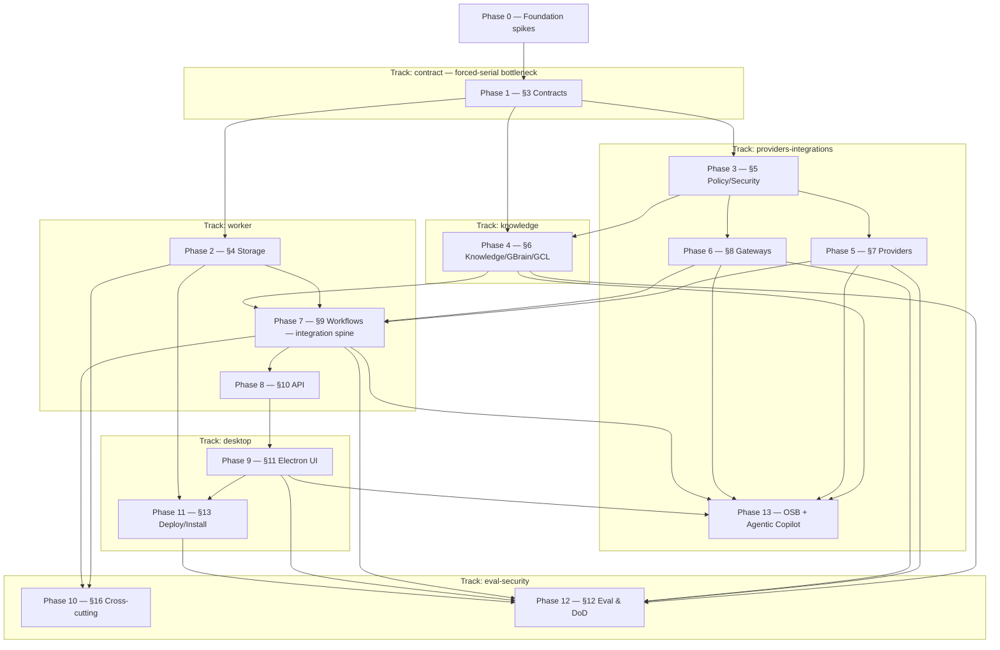

# IMPLEMENTATION_PLAN.md — System of Work Assistant

> **Phase note.** Spec-anchored build plan decomposed from the binding `ARCHITECTURE.md` (production-grade). 26 phases (0–25), ~238 first-class tasks — Phases 14–25 = the Part II activation roadmap (ARCH §19; from the 2026-07-15 gap audit, 66 gaps→tasks coverage-verified) (counted as `### N.M` headings) across 6 parallel tracks (Phase 13 = Obsidian-Second-Brain inheritance **+ the Agentic Copilot arc** — §13.10 skill catalog + §13.11 Phase-C/§9.6-real machinery, promoted from Log-only 2026-07-06); the §3 contracts phase (Phase 1) is the forced-serial bottleneck and the §9 workflows phase (Phase 7) is the integration spine. Locked decisions live in `docs/planning/DECISIONS.md`; every phase anchors to `ARCHITECTURE.md §` sections — drift surfaces at TDD Step 9. Living sections (Currently-in-progress, Carry-forward, Log, Trims, Decisions-tabled) accrete through real `/tdd` work; the Parallelization plan is authored here.

> **Reading discipline.** Read by section, not whole. Living sections are bounded/pruned at `/orchestrate-end`.

> **Session protocol:**
> - **Session start** — orchestrator `/orchestrate-start`; implementer `/session-start`. Confirm the session target.
> - **Session end** — implementer `/session-end` (TDD + cross-doc audit + Step-9 list + `/preflight`); orchestrator `/orchestrate-end` (reconcile checkboxes, Log, Decisions, Carry-forward, push).

> **Spec-anchor convention.** Each phase header carries `**Spec anchors:**` (the `ARCHITECTURE.md §` it implements), a `**Track:**` tag, and a `**Depends on (phases):**` edge — the source the Parallelization plan renders from. A slice surfacing a behavior the anchors don't cover is a cross-doc invariant flag at Step 9. New mid-build tasks carry `(implements §X; origin: <slice>)` on the heading.

---

## Currently in progress

**◆ 2026-07-16 (Part II — PHASE 16 ROUND: ⭐ CONNECTOR ENGINE COMPLETE — G25/G29/G31/G32/G33 closed; two-track [worker + providers-integrations]; team `session-734f946b`) — /phase-exit 16 ✅ CLEAR — round SEALED + PUSHED.** Phase 16 (§19.3 Connector Engine, Composition & Bridge) built as INERT substrate across 6 slices, ALL pure-build/dormant, **NO hard line crossed**: **16.1** `316760ba` (G32, ComposedConnectors inert boot composition, 9 adapters, no tokenRef) · **16.2** `e6a4e573` (G33, connectorPoll registration + connectorSyncHealth workflow + schedule config; enumerates only ENABLED instances ⇒ empty default = inert no-spam) · **16.3** `5ce1961d` (G25 build, read-only HTTP transport wrapper + a runtime ING-7 {GET,POST} gate + **SSRF hardening**: added `isPrivateHost` denylist-beats-allowlist; security found 1 high + 4 lower evasions, all fixed + RE-VERIFIED) · **16.4+16.5** `07e27aea` (G29/G31, Drive coverage-degrade + File/PDF unpdf extraction, root-confined) · **16.6** `265e2b1d` (real seenContentHash wiring — de-deads 15.4, the Phase-15 gate note CLOSED). The one hard line (a real per-vendor network send) stays UNBOUND on the Phase-23 side. `/phase-exit 16` = **CLEAR** (11 rows; 3 auditors clean — arch-drift 0-drift + both reachability audits 0-undocumented-unreachable; reports `docs/audits/16-*.md`). A precise **Phase-23 arming ledger** (6 groups, all tracked in-code + the Phase-16 gate note) records exactly what go-live requires — nothing hand-waved. Session doc 090. **TEAM = orch (lead-carried) + worker-impl4 + integrations-impl (both idle-available post-Phase-16) + desktop-impl (idle, no P16 work).** **NEXT: Phase 17 (§19.4 Keychain) = the FIRST hard-line / owner-gated phase — needs owner sign-off before kickoff.**

**◆ 2026-07-16 (Part II — 15.8 ROUND: ⭐ G60 CLOSED — human routing-resolution; ⭐ PHASE-15 SPINE COMPLETE; team `session-734f946b`) — round SEALED + PUSHED.** 15.8 landed on BOTH legs in parallel (disjoint files, one shared pinned contract): **worker `bf33b669`** — the triage disposition command gains an optional **registry-validated `target {workspaceId, projectId?}`** for `reroute`; REQ-F-017 no-inference is load-bearing (no/blank target fails closed `reroute_target_required`, validator never consulted, ZERO dispatch, no default ws); target validated against the REAL 14.1/14.6 registries via `createRegistryValidatedRerouteTarget` (mirrors `createRegistryValidatedRescope` — unknown ws/project ⇒ typed reject, WS-8 never a raw cross-workspace bind, registry fault folds closed); `reroute_target_forbidden` on a non-reroute; WORKER-API-layer shape (NOT a `packages/contracts` model). **desktop `cd1b7cb4`** — Ingestion Inbox reroute/assign-project action; registry-sourced workspace/project picker (no free-text; submit blocked until a workspace is chosen); the reroute idempotencyKey encodes the FULL target (`${sourceId}:reroute:${workspaceId}[:${projectId}]`) so a failed-then-resubmit reroute to a DIFFERENT workspace never silently re-drives to the stale target (a review catch promoted from LOW → a WS-8 silent-misroute hole closed). Reviews: security CLEAR both legs; +34 tests (worker 13 + desktop 21); repo-wide typecheck 20/20, full suite 20/20 tasks green; ARCH §19.2 mirror written. **⚠ Phase-16 follow-up (flagged, NOT end-to-end-live):** the command VALIDATES + FORWARDS the target to `TriagePort.reenterIngestion`; the re-entry runner re-scoping the parked envelope BY the target is the existing 15.5 runner + the real Temporal dispatch binding — a Phase-16 wiring step. **Future TODO:** a LIVE `/design-review` of the new reroute control (+ an `aria-controls` a11y item) owed at the next app-up window. **⭐ PHASE-15 (§19.2 ingestion spine) SPINE COMPLETE** — 15.1–15.9 all landed (G1 · G5 · G6 · G7 · G60 closed). **NEXT: `/phase-exit 15` (orchestrator gate — arch-drift + reachability auditors) → Phase 16 (§19.3 connector engine — pure-build, NO hard line) → Phase 17 (§19.4 Keychain = FIRST hard-line / owner-gate).** **TEAM = orch25 (orchestrator role lead-carried) + worker-impl4 + desktop-impl (idle-available post-15.8).**

**◆ 2026-07-16 (Part II — CRASH-RECOVERY round: G5 confirmed + ⭐ 15.7 recovered → G7 CLOSED; team `session-734f946b` re-spawned) — round SEALED + PUSHED.** The dev machine died mid-slice while the old team (orch24 + worker-impl3) was implementing **15.7**; on restart the lead reconstructed state from git + the task tracker + handoff 006. **Findings:** (1) **G5 park-write had actually committed cleanly before the crash** (`65e6b09a`, closes G5 — MEMORY's "in flight" was stale). (2) The only at-risk work was an **uncommitted, test-less 15.7 implementation edit** to `buildActivities.ts` (it compiled but had ZERO tests — a lost test-first step). **Recovery (owner-approved "clean re-run"):** the unverified edit was backed up + discarded, then 15.7 was re-run PROPERLY test-first — 6 composition tests (a `meetingPropose` control oracle + 5 source pins) RED → the mirror fix (`sourcePropose` → the real `propose` port) GREEN → security review CLEAR (rules 3/5/7 + dormancy; 1 LOW Phase-21 WS-8 note) + code-quality clean (orphaned imports removed) → committed **`010d53e5` (closes G7)**. worker 1503✓, typecheck 20/20. Net loss from the crash: **nothing** — the slice is back with the tests + reviews it never had. **⭐ G7 CLOSED — the source-ingestion external-write propose is a real ProposedAction→envelope→pending Approval, not an in-memory `ext-source-N` receipt.** All pure-build/dormant, **NO hard line.** **TEAM AFTER THIS ROUND = orch25 (successor orchestrator) + worker-impl4 + desktop-impl (re-spawned for 15.8).** **NEXT: 15.8 — human routing-resolution loop (closes G60; has a worker leg [triage payload +target ws/project] + a desktop leg [Inbox reroute/assign-project UI]).** **⚠ ANTI-"end-at-50%": Phase-15 spine — 15.1–15.7 ✅ DONE; 15.8 is the LAST Phase-15 slice.** Recovered-round routing banked (15.7 DONE marker + G7-CLOSED + the Phase-21 WS-8 Future-TODO). Brief 104 on disk. Full detail → the crash-recovery session doc + this Log entry.

**◆ 2026-07-16 (Part II — orch24 ROUND: ⭐ G1 CLOSED + Phase-14 desktop styling; team `session-734f946b`) — round SEALED + PUSHED.** ⭐ **G1 — the audit's flagship gap — is CLOSED.** 15.9 production meeting-closeout dispatcher landed (`725acaf2`, worker-impl3, brief 101): `dispatchMeetingCloseout` (mirror of `dispatchSourceIngestion`) + `connectorIngestionBridge` discrimination on `binding.kind` (policy-bound, never payload — WS-8/no-inference); meeting-path skips the source contentHash-dedupe (recordId axis, worker **L38**) + fail-fast conditional-dep at construction (**L39**); flagship e2e t13 EXECUTED green under a real Temporal worker → a `ProposedAction` + pending Approval. **G1 = 15.1 source-half ✅ + 15.9 meeting-half ✅.** Also this round: **#53 Phase-14 desktop Liquid Glass styling** (`0abdb75a`, brief 102) closed the design-review-#52 visual-polish debt (⚠ a **LIVE /design-review still owed** — no app-up env). All pure-build/dormant, **NO hard line.** **TEAM AFTER THIS ROUND = orch24 (orchestrator) + worker-impl3 (on G5).** desktop-impl CYCLED at context HARD-STOP 85% → shipped #53 + /session-end (docs 086 `1c46d029` / 087 `71514e24`) → **STOOD DOWN** (no re-spawn; a fresh desktop-impl spawns at 15.8 / a Phase-16 desktop leg). **IN FLIGHT: worker-impl3 on G5 park-write (task #54, brief 103 — the disposition park into `runMeetingCloseout`'s low-confidence branch; closes G5; Step-2.5 pending orch24 review).** **NEXT (orch24): review G5 Step-2.5 → SHIP (G5 CLOSED) → 15.7 (source-ingestion external-write propose — ⚠ CHECK for a hard line before dispatch) → 15.8 (routing-resolution loop; has a desktop leg).** **⚠ ANTI-"end-at-50%": G1 CLOSED ✅ · G5 = 15.5 machinery ✅ + park-write IN FLIGHT.** Round routing banked (15.9 DONE marker + G1-CLOSED + worker L38/L39 + ARCH §19.2 meeting-dispatch note + Phase-16 Future-TODO + desktop styling-debt-closed). Briefs 101-103 on disk. Full detail → Log `2026-07-16 (orch24 round)` + session docs 086-088.

**◆ 2026-07-15 (Part II — ROUND 4 SEALED + orch23→orch24 CYCLE at WARN 73%; team `session-734f946b`) — PHASE 14 COMPLETE + PHASE-15 spine advancing.** Round 4 closed + pushed. **This round:** 14.4-durability `3270a7d6` (the `/phase-exit 14` §13 durability fix — persistent `--db-filename` Temporal) · 15.6 `bb5962b8` (auto-ingest output-subtree feedback-loop guard, closes G6) · **`/phase-exit 14` RE-RUN = CLEAR → PHASE 14 (§19.1) COMPLETE** (worker foundation + all desktop legs + local-Temporal substrate 14.4+durability, G62 owner-ratified). The phase-exit gate caught + closed a real in-memory-Temporal durability drift (arch-drift-auditor). **IN FLIGHT (orch24 inherits):** worker-impl3 on **15.9 (task #50, brief 101 — the G1 FLAGSHIP meeting-closeout dispatcher; Step-2.5 PENDING — orch24 reviews it)**. **TEAM AFTER CYCLE = orch24 (successor orchestrator; orch23 cycled at WARN 73%) + worker-impl3 (on 15.9) + desktop-impl (idle-available — Phase-14 session doc + /design-review queued).** worker-impl2 + contract-impl SHUT DOWN (round-3). **⚠ G1 closes ONLY when 15.9 lands (15.1 ✅).** **NEXT (orch24):** review 15.9 Step-2.5 → SHIP (G1 CLOSED) → **G5 park-write** (the G5 second-half — wire the `park`-write into the 7.7 low-confidence branch; G5 not functionally live until it lands) → remaining Phase-15: 15.7 (source-ingestion external-write propose — **CHECK: near-arming, verify no hard line before dispatch**) · 15.8 (human routing-resolution loop — has a desktop leg for desktop-impl). **⚠ ANTI-"end-at-50%" TRACKERS:** G1 (15.1✅ + 15.9 in-flight) · G5 (15.5 machinery✅ + park-write pending). **All Round-4 routing banked this close** (Phase-14 tick · desktop Lesson 13 · worker Lesson 37 · ARCH §19.2 reserved-`sources/` note · Future-TODOs); the Round-3 residuals + Round-4 remaining Future-TODOs are in Carry-forward. Briefs 099-101 on disk. Full detail → Log `2026-07-15 (Part II — round 4 close)` + the `/phase-exit 14` re-run Log + session docs 082-085.

**◆ 2026-07-15 (PHASE-14 worker-foundation round close) — ✅ 5/6 PHASE-14 WORKER/DB SLICES SHIPPED — onboarding + the three registries + preset profiles + health read-path; all pure-build/dormant, NO hard line (team `session-734f946b`, orch `orch22` + impl `worker-impl`; on `main`).** The FIRST Part-II activation round (§19.1). Replaces the "only `provisionDev` creates workspaces" gap with a real substrate a user + the spine resolve against. **Slices (6 commits):** **14.1** `e1e4cfd` — `provisionWorkspace` (safe-default `Workspace` → upsert into the existing dual-dialect `WorkspaceConfigRepository` → union into the fail-closed WS-8 `{workspaceIds}` registry, **upsert-precedes-union**; the registry is the SOLE scoped-read visibility authority) + the `onboarding.createWorkspace` tRPC mutation + an **isolation-class immutability guard** (`workspace_type_immutable`). **14.6** `b9dc03b`+`21ee906` — the durable typed-Project registry (`project_registry` table + `ProjectRegistryRepository` + production `ResolveRegistryPort` superseding `FakeResolveRegistryPort`; WS-8 workspaceId-from-entry + membership-gated; rule-1 creation writes only the operational entry, never KW Markdown; `project_workspace_immutable` guard). **14.2** `bda2c91`+`6f639a6` — the per-workspace connector-instance registry (`connector_instance` table + `connectorConfig` procedure; tokenRef **reference-only** rule-7-structural, register defaults **paused**, `connector_instance_workspace_immutable`). **14.5+14.3** `a81040e` (bundle, owner directive) — `presetProfiles` (4 distinct tiers; **structural no-arming** via literal-`false`/frozen `policyDefaults`) + `presetProfiles.preview` query + the System-Health mint→durable-surface→redaction-safe-read path VERIFIED. **SAFETY THEME — the immutable workspace-binding anchor:** dual review caught the same latent WS-2/WS-8 downgrade three times (14.1 workspace `type`→dataOwner, 14.6 project `workspaceId`, 14.2 connector-instance `workspaceId`) — a silent rebind moves a resource across the isolation boundary; each fixed-in-slice with a `*_immutable` guard (get-before-upsert, get-fault-fails-closed) → banked as **worker Lesson 30**; 14.5's structural-no-arming banked as **worker Lesson 31**. Every slice strict-TDD + mandatory dual review (security=invariant on the WS-8/rule-7 surfaces) + Context7-grounding N/A. Repo-wide `turbo typecheck` 20/20 + lint 11/11 throughout; worker suite 1415✓ / db 397✓. Cross-track: 3 constant-only eval-security `auth-suite` stubs (orch-authorized; review-note in Carry-forward). **⏭ NEXT (post-cycle): 14.7** (cross-workspace-link store — safety rule 4/WS-8, the highest-bar slice; sequenced LAST so a FRESH worker-impl2 does it with full headroom) **+ the DESKTOP-track slices** (14.1 onboarding UI, 14.2 connectors surface, 14.3 health panel, 14.7 links approval, 14.5 preset picker, 14.4 local-Temporal supervision) via a desktop-impl. Cycle triggered at ACTION (worker-impl=76%) at this clean boundary. Commits: 14.1 `e1e4cfd` · 14.6 `b9dc03b`/`21ee906` · 14.2 `bda2c91`/`6f639a6` · 14.5+14.3 `a81040e` · this round-seal. Briefs 085–088. Detail: worker-impl session doc 081.

**◆ 2026-07-15 (round 8 close) — ✅ CONNECTOR CHAIN COMPLETE — the OSB extractor Context7-verify + ING-7 admission pin (task 13.12; runbook Phase 8). DORMANT; no build, no hard line (team `session-734f946b`, orch `orch21` + impl `integrations-impl`; on `main`).** The round that CLOSES the connector chain — a VERIFY + harden pass (not a build) over the 4 dormant-complete OSB extractors (web/podcast/youtube/file). **R8 (`f21b2b8`, brief 084):** (1) Context7 back-verify — **4/4 CONFORMANT, zero correctness bugs** (every dedupe-anchor carried — `guid→episodeId`/`videoId`/`url`/`path` — no Asana-`opt_fields`-class drop): web vs `/mozilla/readability`, podcast vs RSS 2.0 spec, youtube vs `/jdepoix/youtube-transcript-api`+yt-metadata, file CONFORMANT-BY-DESIGN/arch_gap (`config/osb.pin` PENDING_NO_SUBTREE) — all deltas cosmetic ⇒ citation comments + arch_gap markers only; (2) youtube ING-7 header gap fixed (doc parity); (3) **LOAD-BEARING — ING-7 read-only VERIFIED non-bypassable at JOB ADMISSION** (`admitJob` source-agnostic + fail-closed on `trustLevel`, broker step 1; adversarially confirmed NO gap) + PINNED (+8 admission tests naming the 4 source types). NO shape edits, NO count-pin bump (anti-corruption 19/19), NO hard line (real parse/extract transports deferred to the SPINE). Dual-reviewed CLEAR/SHIP; `/preflight` CLEAN (42/42 turbo; admission 8→16; repo-wide 31/31). Docs: ARCH §8/§7 note + providers Lesson §6. **⛓️ THE CONNECTOR CHAIN IS COMPLETE (rounds 2–8): the SSRF predicate + the reusable template (3 shapes) + 7 HTTP connectors (Asana/Drive/Calendar/Granola/GitHub/Linear/Gmail) + 4 Context7-verified OSB extractors (web/podcast/youtube/file), all dormant behind the arming line.** **⏭ NEXT = the SPINE** (connector → ingestion → content → gbrain), per the owner's breadth-first-then-spine decision (recorded in Carry-forward; the real dormant extractor transports fold into it). Commits: R8 `f21b2b8` · session doc 080 `f03d09e` · this round-seal. Detail: Log 2026-07-15 round 8.

**◆ 2026-07-15 (round 7 close) — ✅ GMAIL messages LIST-ONLY read connector (task 13.12; runbook Phase 8). DORMANT; real transport + OAuth token UNBOUND (team `session-734f946b`, orch `orch21` + impl `integrations-impl`; on `main`).** The 7th connector-template instance — a GET body-cursor connector (like Drive) in a NEW `gmail.ts`. **Gmail (`c7dcd16`, brief 083):** `createGmailConnector` (readScope `gmail.readonly` ONLY) + `createGmailHttpTransport` (`GET gmail.googleapis.com/gmail/v1/users/me/messages`); `gmailMapPage` absent-`messages`⇒empty-page vs present-non-array/bare-array⇒fail-closed (an `Array.isArray` envelope guard, caught in GREEN); `payloadHash({id, threadId})`; STRICT nextPageToken. **LIST-ONLY by design (lead ruling):** `messages.list` = id-level `{id, threadId}` only; the `messages.get` content fan-out is a NAMED arming residual + a candidate FUTURE round (a reusable detail-hydration step) + an in-code ING-7 note (email content is UNTRUSTED ⇒ tool-stripping HARD when hydration lands) — NOT a silent drop. Count-pin 18→19 CONSTANT-ONLY + audit line (0 violations — the tripwire working; cross-track pre-authorized). Context7 CONFORMANT (`/websites/developers_google_workspace_gmail_api`). Dual-reviewed CLEAR/SHIP; `/preflight` CLEAN (42/42 turbo; workspace 5493; typecheck 20/20; anti-corruption 19/19). **NO hard line crossed** — real transport/token UNBOUND (byte-equivalent). Docs: ARCH §8 note (Gmail = 7th instance). **The connector-template chain is now Asana + Drive + Calendar + Granola + GitHub + Linear + Gmail (7 vendors over 3 shapes — GET body-cursor · GET page-number · POST GraphQL — all dormant + Context7-grounded).** **⏭ NEXT:** round 8 = web/podcast/youtube OSB source EXTRACTORS (a DIFFERENT mechanism from HTTP connectors — ING-7 tool-stripping HARD on untrusted content; **LEAD nod at the new-round scope first**) — the LAST connector-chain work. Commits: Gmail `c7dcd16` · session doc 079 `2a356dc` · this round-seal. Detail: Log 2026-07-15 round 7.

**◆ 2026-07-15 (round 6 close) — ✅ LINEAR read connector (GraphQL-over-POST) + an additive template POST+body path (task 13.12; runbook Phase 8). DORMANT; real transports/tokens UNBOUND (team `session-734f946b`, orch `orch21` + impl `integrations-impl`; on `main`).** The 6th connector-template instance and the FIRST GraphQL-over-POST connector; a 2-slice round. **Slice 1 (`8a97f44`, brief 081):** additive optional POST method + JSON body on the template (`ConnectorHttpSpec.method?`/`buildBody?`, `HttpTransportRequest.method|body?`) — SSRF guard method-agnostic on the FINAL url, token Authorization-only (never in body, rule 7), GET **byte-identical** (5 GET connectors + suites unchanged), + an in-code READ-ONLY WARNING (POST = read queries only; read-only is the spec's contract + review, not the method). **Slice 2 (`47fbf99`, brief 082):** `createLinearHttpTransport` (`POST api.linear.app/graphql`) — fixed compile-time query-only `LINEAR_ISSUES_QUERY` (no `mutation`); `linearBuildBody` = JSON.stringify (cursor via `variables.after`, never interpolated — a mutation-injection cursor is JSON-escaped verbatim); `linearMapPage` fail-closed incl. the **GraphQL-200-`errors`** case (checked before data; partial data dropped); STRICT hasNextPage/endCursor. Context7 CONFORMANT (`/websites/linear_app_developers`). Both dual-reviewed CLEAR/SHIP (security couldn't construct a mutation-injection, token-in-body, false-page-on-200-error, or SSRF-on-POST bypass); `/preflight` CLEAN (42/42 turbo; workspace 5471; typecheck 20/20); count-pin untouched. **NO hard line crossed** — real transports/tokens UNBOUND (byte-equivalent). Docs: ARCH §8 note + providers Lesson §5. **The connector-template chain is now Asana + Drive + Calendar + Granola + GitHub + Linear (6 vendors over 3 shapes — GET body-cursor · GET page-number · POST GraphQL — all dormant + Context7-grounded).** **⏭ NEXT:** round 7 = Gmail (from scratch, OAuth `gmail.readonly`; **LEAD nod at the new-round scope first**) → R8 web/podcast/youtube extractors (ING-7 tool-stripping). Commits: slice 1 `8a97f44` · slice 2 `47fbf99` · session doc 078 `3042505` · this round-seal. Detail: Log 2026-07-15 round 6.

**◆ 2026-07-15 (round 5 close) — ✅ GITHUB read connector + a backward-compatible `mapPage(json)` → `mapPage(json, request)` widening (task 13.12; runbook Phase 8). DORMANT; real transport + PAT UNBOUND (team `session-734f946b`, orch `orch21` + impl `integrations-impl`; on `main`).** The 5th connector-template instance and the FIRST page-number paginator. **GitHub (`66b44ee`, brief 080):** `createGithubHttpTransport` in the existing github.ts (`api.github.com`/`GET /issues`, static Bearer PAT); a bare JSON array candidate; `githubMapPage` bare-array fail-closed; single-source `GITHUB_PER_PAGE=100`; `done = len < per_page`; STRICT `^[1-9][0-9]*$` cursor parse (the `"1e2"`-coercion caught + hardened in GREEN); recordId = `node_id`; PRs ingested; Context7 CONFORMANT (`/websites/github_en_rest`). **Template widening (lead-ruled Option A, 2 guardrails):** `ConnectorHttpSpec.mapPage(json)` → `mapPage(json, request)` — ADDITIVE/backward-compatible (4 existing 1-arg mappers byte-unchanged + all suites green by contravariance) + rule-7-safe (token-free request to mapPage, pinned). Integrations-internal template-contract change (NOT a frozen contract / no Appendix-A). Dual-reviewed CLEAR/SHIP; `/preflight` CLEAN (42/42 turbo; workspace 5440; typecheck 20/20); count-pin untouched. **NO hard line crossed** — real transport + PAT UNBOUND (byte-equivalent). Docs: ARCH §8 note + providers Lesson §4. **The connector-template chain is now Asana + Drive + Calendar + Granola + GitHub (5 vendors, all dormant + Context7-grounded).** **⏭ NEXT:** round 6 = Linear (GraphQL POST — a method+body template extension; **LEAD nod at the new-round scope first**) → R7 Gmail (from scratch, OAuth) → R8 web/podcast/youtube extractors. Commits: GitHub `66b44ee` · session doc 077 `c083dc6` · this round-seal. Detail: Log 2026-07-15 round 5.

**◆ 2026-07-15 (round 4 close) — ✅ GRANOLA read connector (task 13.12; runbook Phase 8). DORMANT; real transport + `grn_` key UNBOUND (orch `orch20` + impl `integrations-impl`; on `main`).** The simplest template-follow — a thin static-Bearer clone (no OAuth). **Granola (`7687f2c`, brief 079):** `createGranolaHttpTransport` in the existing granola.ts over `createConnectorHttpTransport`; candidate `ListNotesOutput{notes[], hasMore, cursor}` (Context7 CONFORMANT, `/websites/granola_ai`); the load-bearing STRICT pagination gate `granolaNextCursor` (advances ONLY on `hasMore===true` + a non-empty cursor string — all invalid states fail-close to done, no infinite loop; worker-Lesson-28 class); `payloadHash({id, updated_at})`; static Bearer `grn_` key (SecretsAccessor verbatim). Dual-reviewed CLEAR/SHIP; `/preflight` CLEAN (42/42 turbo; workspace 5411); count-pin untouched (existing file). **NO hard line crossed** — real transport + key UNBOUND (byte-equivalent). Docs: ARCH §8 note (Granola = 4th Context7-grounded instance). **The connector-template chain is now Asana + Drive + Calendar + Granola (4 vendors, all dormant + Context7-grounded).** **⏭ CYCLE:** orch20 stands down after this seal (~78% ctx); a fresh **orch21** picks up **round 5** — the remaining connector set **Linear · GitHub · Gmail · web · podcast · youtube** (⚠ Todoist DROPPED) per the Carry-forward. Commits: Granola `7687f2c` · session doc 076 `ea72a62` · this round-seal. Detail: Log 2026-07-15 round 4.

**◆ 2026-07-15 (round 3 close) — ✅ GOOGLE connectors (Drive + Calendar) + Asana Context7 correctness-verify (task 13.12; runbook Phase 8). DORMANT; real transports UNBOUND (team `session-734f946b`, orch `orch20` + impl `integrations-impl`; on `main`).** Round 3 replicated the round-2 connector template to the owner's next-priority connectors + ran the owner-directed CONTEXT7 CORRECTNESS PASS on the built adapters. **Drive (`0087154`, brief 076):** `createDriveHttpTransport` (existing drive.ts, candidate `{files[], nextPageToken}`, `payloadHash({id, modifiedTime})`) — **VERDICT CONFORMANT** (Context7 `developers_google_workspace_drive`: host/path/Bearer/nextPageToken/`fields(id,name,mimeType,size,modifiedTime)`/`drive.readonly` all match; `incompleteSearch` a named arming candidate). **Calendar (`a4e5b9b`, brief 077):** `createCalendarHttpTransport` (existing calendar.ts, candidate `{items[], nextPageToken, nextSyncToken}`, paging `nextPageToken`-only, `payloadHash({id, updated})`) — Context7-grounded (`developers_google_workspace_calendar_api`; the load-bearing sync-token-is-NOT-the-cursor case verified). **Asana verify (`6908b0b`, brief 078):** **VERDICT CORRECTED** — 7/8 axes CONFORMANT; the correctness-pass CAUGHT A REAL CANDIDATE BUG: the built `asanaBuildQuery` omitted `opt_fields`, so Asana returned COMPACT records without `modified_at`, silently degrading `asanaContentHash`'s change-token dedupe → fixed by adding `opt_fields=name,modified_at` (Context7 `developers_asana`); +1 named arming gap (GET /tasks requires a scope param — owner GID). OAuth is a NO-CODE-CHANGE (the template's SecretsAccessor is token-agnostic — a bearer string). All three DORMANT + byte-equivalent (real transports/secrets/tokens UNBOUND, zero production importers); count-pin untouched (existing files, no new adapter); dual-reviewed CLEAR/SHIP; `/preflight` CLEAN (42/42 turbo; workspace 5389). **NO hard line crossed.** Docs this round: ARCH §8 note extension (Asana+Drive+Calendar Context7-grounded) + providers **Lesson §3** (ground-on-Context7 + back-verify). Process now standing: every connector brief grounds its candidate on Context7 at authoring. **NEXT = round 4 (Granola)** — the simplest template-follow (static `grn_` Bearer, no OAuth), spec Context7-grounded in Carry-forward. Commits: Drive `0087154` · Calendar `a4e5b9b` · Asana `6908b0b` · session doc 075 `81096b9` · this round-seal. Detail: Log 2026-07-15 round 3.

**◆ 2026-07-15 (round 2 close) — ✅ CONNECTOR REAL-TRANSPORT TEMPLATE established on Asana (task 13.12 slices 1+2); DORMANT, real transport UNBOUND (team `session-734f946b`, orch `orch20` + impl `integrations-impl`; on `main`).** The FIRST connector build round (runbook Phase 8): the dormant read-only adapters now have a reusable REAL HTTP transport, established on Asana (lowest-risk). **Slice 1 (`c2c6525`, brief 074):** `isAllowedRemoteEndpoint` in `@sow/policy` — the OUTBOUND connector-egress SSRF predicate (https + non-loopback + exact whole-host allowlist), the inverse of `isLoopbackEndpoint`, composed once from the vetted `extractHost`/`isLoopbackHost` (never re-parse, Lesson 4). Security CLEAR (0 bypasses constructed). **Slice 2 (`47c55c2`, brief 075):** `createConnectorHttpTransport(spec, deps)` template + `createAsanaHttpTransport` — SSRF-guard-first-on-the-final-url (slice 1) → token from a SecretsAccessor (header-only, fail-closed-even-on-throw) → GET/ING-7 → positive-2xx gate → `spec.mapPage` → `TransportPage`; redacted typed `TransportFailure`; wrapped spec callbacks (a throwing specialization can't escape unredacted); Asana wire shape a documented `arch_gap` candidate; contentHash reuses canonical `payloadHash`. Both dual-reviewed CLEAR/SHIP; `/preflight` CLEAN (42/42 turbo tasks). **DORMANT + byte-equivalent** — real `HttpTransport`+`SecretsAccessor`+PAT UNBOUND (zero production importers); binding = owner-arming HARD LINE. **NO hard line crossed.** **Cross-track (orch20 ruling a, lead-endorsed):** eval-security OSB anti-corruption count-pin 17→18, CONSTANT-ONLY (scan logic + `violations` assertion untouched), folded into `47c55c2` — see Carry-forward for the DURABLE eval-security review note. Docs this round: ARCH §8 connector-template note + providers Lesson §2. The template makes Granola/Drive/Calendar/Todoist/Linear/GitHub thin (round 3+); Gmail from scratch (13.10c). Commits: slice 1 `c2c6525` · slice 2 `47c55c2` · session doc 074 `9161004` · this round-seal. Detail: Log 2026-07-15 connector round 2.

**◆ 2026-07-15 (round close) — ✅ REBUILD-ORACLE PRODUCER arc COMPLETE (A+B+C) + the knowledge-track false-green hardening LANDED; owner-gated ARMING GATE unchanged (team `session-734f946b`, orch `orch20` + impl `impl22` + `knowledge-impl`; on `main`).** The runbook Phase-4 "build-first" `oracleBuildOk` producer is now fully built + wired + DORMANT. **Piece C (`c251518`, brief 072)** — the `bootWorker` binding of `gateRebuildOracle`: the real `IndexRebuildClient` OMITTED/UNBOUND ⇒ byte-equivalent (client-PRESENCE OFF-lock — a `() => undefined` would read as ON, impl22's Step-2.5 brief correction); `await compute()` once, AND-bind `resolveOracleBuild` into `createServingCoverageReader`, route `diverged` health SAFE-FIELDS-ONLY via `createRebuildOracleHealthSink` (sink propagates / boot caller contains / containment fault-signal guarded); asserts the AND-verdict still degrades by default (no false green, Lesson 16); reachability CLOSED (`bootWorker → gateRebuildOracle → compute → probeRebuildOracle`). **Knowledge hardening (`e808a43`, brief 073, `knowledge-impl`)** — the ⚠ Finding fixed: `rebuild.ts:160` strict `receipt.replaced !== true` + a 5-case truthy-not-`true` guard test (worker Lesson 28 class; arming-gate blocker CLEARED — the real client may now be bound at arming without the false-green vector). Both dual-reviewed CLEAN; `/preflight` CLEAN (31/31; worker 1363; **5294 tests pass**). **NO hard line crossed** — real `IndexRebuildClient` UNBOUND throughout. Docs this round: ARCH §6 arc-close note + worker Lesson 29 + knowledge Lesson §2. Arc residuals (arming-era, in Carry-forward): `faulted`-status operator-silence · first-diverged routing short-circuit · rebuild-`receipt.revisionId/workspaceId` untyped-boundary passthrough · OBS-2 dedupe subjectRef. Commits: C `c251518` · knowledge `e808a43` · session docs 072 `19d1a05` / 073 `8540d65` · this round-seal. Detail: Log 2026-07-15 rebuild-oracle arc close.

**◆ 2026-07-15 — ✅ REBUILD-ORACLE PRODUCER arc — PIECES A+B SEALED; clean-boundary round close for lead compaction (team `session-734f946b`, orch `orch20` + impl `impl22`; on `main`).** The FIRST of the runbook Phase-4 "build-first" producer rounds (go-live master runbook `docs/runbooks/turn-on-and-smoke-test-runbook.md`): builds the producer that computes `oracleBuildOk` (the last hardwired-false serving-coverage leg — `servingContextBootReaders.ts:139`, seam `57fef4b`) by rebuilding the index from committed Markdown via the existing `rebuildIndexFromMarkdown` (`@sow/knowledge`) over an INJECTED, prod-UNBOUND `IndexRebuildClient` (the owner-gated gbrain scratch-import) — mirrors the reconcile arc's `makeDbAdapter → undefined`; **NO hard line crossed.** **Piece A DONE + committed (`210e95e`, brief 070):** pure `probeRebuildOracle` (`apps/worker/src/composition/rebuildOracleStatus.ts`) — fail-closed `oracleBuildOk` (ONLY a wholesale-replace + complete recovery ⇒ true; every absence / WS-8-mismatch / divergence / fault ⇒ false), typed `RebuildOracleStatus`, WS-8 read-back re-gate, never-throws (§16), NO revision pin (frozen-snapshot rationale — orch20 Step-2.5 TWEAK). Dual review security CLEAR / code-quality 0 high-med (2 low fixed in-slice); worker suite 1352 pass; DORMANT + reachability-waivered (prod caller = piece C). **Piece B DONE + committed (`118135c`, brief 071):** default-OFF `gateRebuildOracle` boot-gate helper (Lesson-23 split, byte-equivalent BY CONSTRUCTION — 3 hunks all before `bootWorker@1014`; verified boot byte-identical) folding per-ws `probeRebuildOracle` corroboration to a fail-closed boot-global `resolveOracleBuild` accessor (true IFF served-set non-empty AND every ws strictly `corroborated`); OFF (owner-gated real client absent/non-function, or no served ws) ⇒ `undefined` + ZERO dep-thunk invocations (factory-spy pin). Dual review security CLEAR / code-quality 0 high-med; worker suite 1358 pass; DORMANT + reachability-waivered (prod caller = piece C). **⚠ FINDING (impl22 security review; lead-ruled HARDEN-NOW 2026-07-15):** `packages/knowledge/src/gbrain/rebuild.ts:160` gates wholesale-replace with truthy `!receipt.replaced`, NOT strict `receipt.replaced !== true` — a false-green vector into the serve-time trust gate once the REAL client binds at arming (same class the propose guard `392e7db` hardened; worker Lesson 28) → a **KNOWLEDGE-track** strict `=== true` + guard-test slice, scheduled right after this arc; ALSO an arming-gate blocker (do NOT bind the real client until it lands). **CARRIED FORWARD (compaction close — see the Carry-forward "REBUILD-ORACLE PRODUCER arc" bullet):** piece C (the `bootWorker` binding — call `gateRebuildOracle`, `await compute()` ONCE, bind the cached `resolveOracleBuild` into `createServingCoverageReader`, reproject the divergence HealthItem to safe-fields-only before any log sink [rule 7, mirror gateReconcile healthSink], consume `resolveOracleBuild` ONLY as an AND-term of `deriveServingCoverage`; real client UNBOUND ⇒ byte-equivalent; closes reachability) + the knowledge-track rebuild.ts:160 hardening + (docs at arc close) the ARCH §6 arc notes + worker Lesson 29. Round sealed + PUSHED at this /orchestrate-end (authorized push point; lead compacting) — commits A `210e95e` · B `118135c` · session doc `6b648fa` · this round-seal. orch20 + impl22 IDLE (stay ALIVE — reject any shutdown, hold at the A+B round boundary) for the lead to reconnect + dispatch piece C. Briefs 070/071; session doc 071. Detail: Log 2026-07-15 rebuild-oracle A+B.

**◆ 2026-07-14 — ✅ POST-AUDIT HARDENING ROUND SEALED (team `session-734f946b`, orch `orch19` + impl `impl21`; on `main`). Still HOLDING at the ARMING GATE.** A dormancy audit at the prior round's close surfaced two pre-arming hardening gaps — both fixed DORMANT + byte-equivalent, NO hard line crossed: **Slice 1** (`462a7c7`) gated the external-write `AdapterTransport` behind a default-OFF `WriteTransportGate` (strict `enabled === true` AND `typeof make === "function"`, fail-closed to the stub; real factory UNBOUND ⇒ shipped default byte-equivalent) — the hardcoded `createStubAdapterTransport()` at the composition root (`backends.ts:720`) was a one-line source-edit from a real vendor client with NO owner gate; selecting a non-stub transport now requires deliberate owner config (mandatory dual review CLEAR/SHIP; worker **Lesson 27**). **Slice 2** (`392e7db`) a TEST-ONLY regression guard pinning the three propose/serving-oracle false-arming `=== true` sites (`boot.ts:1171/1173` + `servingContextLoader.ts:239`) can't silently weaken to truthy — pure-fn behavioral pin + key-anchored source-assertion, non-vacuity mutation-proven (worker **Lesson 28**). Repo-wide preflight CLEAN (worker 1332 / evals 492; 31/31). Orchestrator close-out ALSO corrected STALE dormancy claims: `ARCHITECTURE.md` §337/§175 (the read/cloud/AGENT Copilot lane ships LIVE-by-design in worker-host — `copilotRealModel`/`copilotAgentMode`/`copilotGbrainRetrieval`/`copilotWorkspaceScoping`/`copilotVaultRead`/`copilotSkillIntrospection` = true; only write/propose/ingest/reconcile/external-write/secrets is dormant) + 2 stale code comments (`copilot-tool-catalog.ts` "INERT until C4" — ING-7 enforcement IS active via `admitCopilotAgentJob`; worker-host skill-introspection LIVE-but-harmless). **⇒ NO buildable-dormant work remains. NEXT = the owner-gated ARMING GATE (unchanged).** Session doc 070; briefs 068/069.

**◆ 2026-07-14 — ✅ DORMANT ARMING-PREP ARC COMPLETE + ROUND SEALED (team `session-734f946b`, orch `orch18` + impl `impl20`; on `main`). HOLDING at the ARMING GATE (the owner-gated HARD LINE).** The cycle-fresh orch18+impl20 built the dormant arming-prep arc end-to-end — all DORMANT + byte-equivalent + mandatory-dual-reviewed, NO hard line crossed: **Item 7** (`8c559f9`) armed-path health semantics — `createReconcileHealthSink` fault now PROPAGATES (Lesson 18) + `pass_faulted` mints a `parity_defect` HealthItem from the safe redacted causeCode (worker **Lesson 25**); **Item 2a** (`cdbb389`) the real `GbrainReadClient` HTTP transport (`createGbrainHttpReadClient`) — injected transport+secrets seams (NO `@sow/providers` import), SSRF loopback+allowlist reusing `@sow/policy isLoopbackEndpoint`, token via SecretsPort fail-closed-even-on-throw (security-review MEDIUM caught), redacted typed faults, wire shape a documented CANDIDATE (arch_gap, Lesson 21); UNBOUND (`makeDbAdapter → undefined`) — knowledge **Lesson 1**; **Item 2b** (`4e5f18f`) reconciler DB-projection completeness hardening — flipped the negative more-results probe (fail-open) to a POSITIVE `env.complete === true` token (default-incomplete) + widened type-robust more-results set + stated-total cross-check (a conflicting-total false-complete caught) — worker **Lesson 26**. **Item 6** (reconcile trigger-source wiring) ASSESSED → DEFERRED to arming (not cleanly dormant-separable — the committed revisionId is post-Temporal-commit, the flush is a live timer, wiring it would touch the LIVE auto-ingest run-path for zero dormant benefit; folds into the arming binding). **PROCESS:** orch18 caught + corrected the "push per slice" instruction as a violation of the user's push-boundary (push ONLY at `/orchestrate-end`); the lead ratified; memory banked ([[push-posture-round-close-only]]). **⇒ NO buildable-dormant work remains. NEXT = the owner-gated ARMING GATE (the HARD LINE) — the full arming bundle is captured verbatim-to-run-cold as the ⭐⭐ TOP Carry-forward item.** Round sealed at `/orchestrate-end` (this commit) + pushed; the team STANDS DOWN here (owner is testing on the real vault). Session doc 069. Repo-wide preflight: typecheck 20/20 + 5244 tests pass. Detail: the arming-prep Item entries in Carry-forward + session doc 069.

**◆ 2026-07-14 — ROUND CLOSED at the run-path-standup milestone (owner steer: CYCLE-FRESH for the safety-critical arming-prep + to fix the context-monitoring gap). Last durable commit origin/main `26738b5` (+ this round-seal); everything pushed, NO hard line crossed all round.** orch17 (this orch) + impl19 drain after close-out (~10 slices / 2 arcs); the lead spawns a FRESH **orch18 + impl20** for the next arc **with the `team-register.sh` registry-write fix** (this session's spawn omitted it ⇒ `/context-check` was blind to orch17/impl19). **NEXT ARC = the ⭐ DORMANT ARMING-PREP arc** (build-up-to-the-gate; Item 7 health-semantics fixes FIRST → Item 2 the GbrainReadGrant transport adapter dormant/unbound → Item 6 trigger-source wiring if cleanly dormant) — captured verbatim-to-run-cold as the ⭐ TOP item in **Carry-forward**; then **HOLD at the ARMING GATE** (the owner-gated HARD LINE). The successor authors Item-7 briefs after `/orchestrate-start` reads this reconciled tracker. Detail: Log 2026-07-14 round close.

**◆ 2026-07-14 — ✅ RUN-PATH STANDUP ARC COMPLETE (owner steer: HOLD arming, STAND UP + RUN the read path first) (team `session-734f946b`, orch `orch17` + impl `impl19`; on `main`).** After the reconcile-TRIGGER arc sealed, the owner chose to HOLD at the arming gate + run the read path on the real vault first. This arc VERIFIED + polished + documented the live READ+INGEST path (propose STAYS OFF; no arming). **Piece 1 — VERIFY + gap inventory (orch17, delegated agent):** read+ingest wiring traced end-to-end (`main/index.ts` SOW_* env → IPC → worker-host flags-ON → `boot.ts` gates); repo-wide `typecheck`+`test` exit 0 (worker 1285 / evals 492 pass). **FINDING (escalated to lead):** the named `copilotVaultRead` "gap" was a STALE-DOC artifact, NOT a functional gap — the gate had no vault-existence check, `SOW_VAULT_ROOT` already threads to it ⇒ it Just Works on a real vault today (personal-business). **Piece 2 — `copilot.vault.read` usable-gate polish (impl19, §13.10d, slice `90679a3`):** AND a fail-safe `vaultUsable(root)` predicate into `gateCopilotVaultReadDeps` (mirrors `createCommittedVaultReader`'s `isFile()`+`.md` recursive filter EXACTLY ⇒ `usable ⟺ reader-would-find-a-page`) so the default empty `<userData>/vault` doesn't offer an inert tool; **strict-subset no-widening** (security CLEAR, 0 findings), byte-equivalent on a real vault, WS-8 handler UNTOUCHED; 20 tests, worker **Lesson 24**. **Piece 3 — the owner RUN GUIDE (orch17, `d5c4408`+`f72e635`):** refreshed `docs/runbooks/run-it-live-and-provision.md` — corrected the stale Keychain-UNBUILT (11.4 is BUILT + boot-wired), `copilotVaultRead`, + go-live-gate claims + the load-bearing anchors; added a VERIFIED 2026-07-14 stamp + an **OWNER-RUN VERIFICATION CHECKLIST** (per-capability test steps: read Copilot · gbrain retrieval · `vault.read` on a real vault · auto-ingest drop-`.md`→KW-commit · Phase-9 + a safety confirm) + the exact safety posture (propose OFF · reads+ingest · Employer-Work→cloud egress owner-relaxed for Copilot reads · WS-8 airtight · arming = a SEPARATE owner-gated bundle). **NO hard line crossed** — reads/ingest only; no arming, no real gbrain-transport binding, propose OFF. **⇒ the owner can now stand up + run the read path on their real vault (guide + verified path ready).** Owner prereqs: `claude` login · `VOYAGE_API_KEY` · `temporal` CLI · gbrain+initialized brain · real vault path. **NEXT = the owner's call** (run it + generate real KW corpora → then the ARMING GATE remains the owner-gated HARD LINE per `docs/runbooks/copilot-propose-go-live.md`). Detail: Log 2026-07-14 run-path standup.

**◆ 2026-07-14 — ✅✅ RECONCILE-TRIGGER ARC COMPLETE-DORMANT — F2 composition-root boot binding (`gateReconcile` call) committed; TASK 13.10 arc DONE (team `session-734f946b`, orch `orch17` + impl `impl19`; slice `dadb167`, on `main`).** The composition-root binding that CLOSES the arc: `bootWorker` (`boot.ts:1276`) calls `gateReconcile(reconcileOpts, deps)` with the REAL leaf-thunks — `makeReader → createCommittedVaultReader` (LOCAL fs); `makeDbAdapter → undefined` (owner-gated `GbrainReadGrant` transport UNBOUND ⇒ `getDbProjection` degrades `complete=false` ⇒ recorded `coverageComplete=false`, verified e2e: even armed, NEVER a false-green); `makePassDeps → { reconcilerDeps, recorder over backends.repos.parityReports, HealthSurface-backed healthSink }`; `makeLog →` a redacted, UNCONDITIONALLY never-throwing sink that materializes a `parity_defect` HealthItem (subjectRef ws‖rev, message from the SAFE `detail` code) via `surface.record` (OBS-2, not a raw put) — exposed on `BootedWorker.reconcile`. **BYTE-EQUIVALENT BY DEFAULT** (`config.reconcile` unset, strict `=== true` ⇒ `gateReconcile → undefined` ⇒ no machinery + the field OMITTED from the return). Reachability CLOSED (F1's waiver). 7 unit tests; repo-wide 31/31 green. Mandatory dual review (composition-root arming binding, highest bar) security CLEAR (0 crit/high/med; all 4 arming properties) / code-quality SHIP. Lesson 23 F2-completion addendum; **ARCHITECTURE §6** arc-complete-dormant note. Cross-doc invariants NONE (`BootConfig.reconcile`/`BootedWorker.reconcile` boot-config seams). Ships **DORMANT** — reconcile unset, transport unbound, no source/timing wired. **NO hard line crossed.** Brief `063` (spec-lint PASS @e95c32e6). **✅✅ THE reconcile-TRIGGER ARC IS COMPLETE-DORMANT — all 7 slices A `ca8d835` · B `8a27e78` · C `85f6b63` · D `8d07a60` · E `89106e5` · F1 `e9c6d77` · F2 `dadb167` built + reachable + byte-equivalent, nothing armed.** **NEXT = the owner's ARMING GATE (the HARD LINE) — orch17 ESCALATED to lead+owner.** The arming bundle: `goLiveArmed`/`reconcile` flip + provision the `GbrainReadGrant` transport + signing key into Keychain + real corpora + the propose-path governance eval [eval-security coordinate] + wire the trigger source/timing + resolve the 2 deferred armed-path health semantics (healthSink→PROPAGATE per Lesson 18; `pass_faulted`→mint a HealthItem) + the owner-confirmed flip. Detail: Log 2026-07-14 F2 / arc close.

**◆ 2026-07-14 — ✅ RECONCILE-TRIGGER ARC PIECE F1 — default-OFF `gateReconcile` boot gate HELPER (the arming SEAM logic) committed; byte-equivalent BY CONSTRUCTION (team `session-734f946b`, orch `orch17` + impl `impl19`; slice `e9c6d77`, on `main`).** The pure `gateReconcile(opts, deps): ReconcileWiring | undefined` (`apps/worker/src/boot.ts`, co-located with `gateAutoIngest`, Lesson 2/8/16), added with NO `bootWorker` edit ⇒ boot byte-equivalent BY CONSTRUCTION (an unreferenced exported helper can't change boot; additive-only diff, `bootWorker`:684 outside every hunk). OFF (`opts.reconcile !== true` — strict `=== true`, no truthy-coerce arming — or a missing precondition) ⇒ `undefined` + ZERO dep-thunk invocations (factory-spy-pinned — THE safety test). ON (armed — owner-gated, never default) ⇒ assemble `createReconcileScheduler` bound to `runReconcileForWorkspace` over the never-reject builders + a redacted log. **The owner-gated `GbrainReadGrant` transport stays UNBOUND** (`makeDbAdapter → undefined` ⇒ `getDbProjection` degraded `{complete:false}` ⇒ recorded `coverageComplete=false` — verified end-to-end through the REAL `reconcileParity`) ⇒ even the armed path records DEGRADED, never a false-green. 6 unit tests (the OFF byte-equiv factory-spy pin; missing-precondition fail-safe; ON assembly; + tests 4/5/6 driving the ASSEMBLED wiring end-to-end — never-reject binding, unbound-transport no-false-green degrade, redacted log); repo-wide 31/31 green. **Mandatory dual review (arming seam, highest bar): security CLEAR — 0 findings (adversarial sweep of all 6 arming-seam invariants PASS) / code-quality SHIP — 0 must-fix.** Worker **Lesson 23** banked; **ARCHITECTURE §6** arming-seam note added. Cross-doc invariants NONE (`ReconcileGateOpts`/`ReconcileWiring`/`ReconcileGateDeps` boot-config seams). Ships **DORMANT + reachability-waivered** (`gateReconcile` has no `bootWorker` caller — F2 adds it; reachable only from its own test). **NO hard line crossed** — nothing armed, `bootWorker` untouched, transport unbound. Brief `062` (spec-lint PASS @116acb7f). **NEXT: piece F2 — the `bootWorker` call site + real leaf-thunks (still DORMANT); the arc is complete-dormant AFTER F2 → then orch17 escalates the ARMING GATE.** Detail: Log 2026-07-14 piece F1.

**◆ 2026-07-14 — ✅ RECONCILE-TRIGGER ARC PIECE E — pure worker-side reconcile scheduler (`createReconcileScheduler`) committed; WORKFLOW-WEIGHT RESOLVED (team `session-734f946b`, orch `orch17` + impl `impl19`; slice `89106e5`, on `main`).** The trigger-origin (`apps/worker/src/composition/reconcileScheduler.ts`): `enqueue(ws, PendingTrigger)` accumulates per-workspace; `flush(ws)` SNAPSHOTS+DELETES the ws queue BEFORE the dispatch await (a mid-flight enqueue → a FRESH queue, not lost/folded/double-dispatched; a re-flush is a no-op), burst-collapses via `collapseToMaxRevision` (**LIFE-2** — a burst fires ONE reconcile at the MAX revision), dispatches the injected never-throwing driver ONCE, isolates per-workspace, and routes the outcome through a **SINGLE redacted log sink** (safety rule 7: reconciled→disposition.kind; skipped_derive_error→DeriveError.code only [paths dropped]; pass_faulted→redactError [REDACTED_RAW + typed causeCode] — the raw cause/error NEVER reaches the log, so no downstream can leak it, while the safe summary suffices for F to mint the HealthItem). **The pre-delegated WORKFLOW-WEIGHT decision RESOLVED → the lighter worker-scheduled pass** (NOT Temporal): the reconcile is idempotent read+record (not a side effect) ⇒ exactly-once/durability is over-engineering; `collapseToMaxRevision` IS the LIFE-2 catch-up; crash→degrade→next-trigger is fail-safe. 7 unit tests (LIFE-2 collapse; empty/clear/per-ws-isolation; the mid-flight-enqueue concurrency; the redaction airtightness w/ a marker-secret cause; never-throws over every outcome kind); repo-wide 31/31 green. Mandatory dual review security CLEAR (0 crit/high/med; redaction chokepoint VERIFIED airtight) / code-quality SHIP (2 test+doc folds). Worker **Lesson 22** banked; **ARCHITECTURE §6** scheduler note added. Cross-doc invariants NONE (`ReconcileSchedulerDeps`/`LoggedReconcileOutcome` worker-internal; frozen `PendingTrigger`/`ReconcileTriggerOrigin`/`ReconcileDriverOutcome` reused). Ships **DORMANT + reachability-waivered** (reachable only from its own test; production caller = piece F). **NO hard line crossed** — trigger-source-agnostic; owner-gated real bindings unbound. Brief `061` (spec-lint PASS @b4e0eb83). **NEXT: piece F — the boot gate (the LAST DORMANT piece; `gateReconcile`-style, default-OFF byte-equivalent, mirror `gateAutoIngest`).** After F → **HOLD at the ARMING GATE** (the HARD LINE — orch17 escalates to lead+owner; do NOT arm). Detail: Log 2026-07-14 piece E.

**◆ 2026-07-14 — ✅ RECONCILE-TRIGGER ARC PIECE D — pure trigger-agnostic reconcile driver (`runReconcileForWorkspace`) committed (team `session-734f946b`, orch `orch17` + impl `impl19`; slice `8d07a60`, on `main`).** The end-to-end driver (`apps/worker/src/composition/reconcileDriver.ts`) composing the arc's builders + pass over INJECTED async collaborators: `getCanonicalFactSet` (C) → on `derived`, `getDbProjection` (B) → assemble `ReconcileRequest` (**`rebuildOracle` OMITTED**, decision #2 ⇒ `coverageComplete` rests on `dbProjection.complete`) → `runPass` (injected A) → typed 4-way `ReconcileDriverOutcome` `{ reconciled | skipped_absent | skipped_derive_error | pass_faulted }`. Short-circuits an absent/broken canonical reference BEFORE the gbrain read; surfaces a derive-error TYPED (defers HealthItem materialization to E/F); catches ONLY `runPass` (the collaborator with a DESIGNED rejection channel — A rejects on a record/sink fault to make it visible) into `pass_faulted`, never throwing, relying on the never-reject builders (C→absent, B→complete=false). **Trigger-agnostic BY CONSTRUCTION** — injected async collaborators are proxyActivities in a Temporal workflow OR direct calls in a worker pass ⇒ the pre-delegated **workflow-weight decision defers to piece E**. Step-2.5 TWEAK applied (inject `runPass` vs import + module-mock — arc injection-uniform, `passDeps` dropped from the driver surface). 6 unit tests; repo-wide 31/31 green. Mandatory dual review security CLEAR (0 crit/high/med) / code-quality SHIP (2 test-only LOWs folded — ws-to-both-reads + `toBe` cause identity). Worker **Lesson 21** banked; **ARCHITECTURE §6** driver note added. Cross-doc invariants NONE (`ReconcileDriverDeps`/`ReconcileDriverOutcome` worker-internal; frozen `ReconcileRequest`/`ParityRecordDisposition`/`DeriveError` reused). Ships **DORMANT + reachability-waivered** (reachable only from its own test; production callers = pieces E/F). **NO hard line crossed** — owner-gated real bindings unbound. Brief `060` (spec-lint PASS @7c09368f). **NEXT: piece E — the trigger-origin (where the workflow-weight decision LANDS; orch17+impl19 lean = the lighter worker-scheduled pass).** Then F (boot gate) → **HOLD at the ARMING GATE** (the HARD LINE; lead brings the owner in). **E/F BINDING CONSTRAINTS (piece-D dual-review LOWs, load-bearing):** (a) bind `getCanonicalFactSet`/`getDbProjection` ONLY to the never-reject `buildCanonicalFactSet`/`buildReconcilerDbProjection` (the `Promise<…>` dep type doesn't encode never-reject — a raw transport without B's fail-closed wrapper breaks the never-throw guarantee); (b) E redacts `pass_faulted.cause` + `skipped_derive_error.error` before any log sink (safety rule 7); (c) the derive_error/ws-mismatch HealthItem materialization binds at E/F where the health surface is in scope. Detail: Log 2026-07-14 piece D.

**◆ 2026-07-14 — ✅ RECONCILE-TRIGGER ARC PIECE C — canonical fact-set reader (`buildCanonicalFactSet`) committed (team `session-734f946b`, orch `orch17` + impl `impl19`; slice `85f6b63`, on `main`).** A thin worker-side composition (`apps/worker/src/composition/canonicalFactSet.ts`): reads the committed vault at head via the injected `CommittedVaultReader` → the pure `deriveCanonicalFacts` → the `CanonicalFactSet` piece A consumes as `req.canonicalSet`. **3-way fail-closed outcome** `{ derived | absent | derive_error }` — a benign ABSENCE (reader undefined/throw/reject ⇒ skip) distinct from a real DERIVE ERROR (broken vault ⇒ piece D routes to health); never collapsed. Never throws (try/catch wraps the reader CALL — sync-throw + async-reject both ⇒ absent). **WS-8 read-back re-gate** (Lesson 12; convergent dual-review fold): the returned snapshot's `workspaceId` is re-verified vs the request ⇒ a reader defect degrades to absent, never a cross-workspace canonical set. The empty-vault `db_only`-detection gap is NAMED (in-code + Future TODO), not silently owned. 7 unit tests (real `deriveCanonicalFacts` — a two-files-same-slug fixture yields a real `duplicate_fact_identity`; Lesson 15 on the reject/throw tests); repo-wide 31/31 green. Mandatory dual review security CLEAR (0 crit/high/med) / code-quality SHIP. Worker **Lesson 20** banked; **ARCHITECTURE §6** reader note added. Cross-doc invariants NONE (`CanonicalSnapshotOutcome` worker-internal; frozen `CanonicalFactSet`/`CanonicalVaultSnapshot`/`DeriveError` reused). Ships **DORMANT + reachability-waivered** (reachable only from its own test; production caller = piece D). **NO hard line crossed** — LOCAL-fs only, reader injected. Brief `059` (spec-lint PASS @57f548a9). **Both input-builders (B `req.dbProjection` + C `req.canonicalSet`) now landed ⇒ piece D unblocked. NEXT: piece D — the reconcile DRIVER.** **REFRAME (orch17): build piece D as the PURE, TRIGGER-AGNOSTIC end-to-end driver** (given workspaceId + injected async collaborators → `buildCanonicalFactSet` + `buildReconcilerDbProjection` → assemble `ReconcileRequest` → `runReconcilePass` → route the disposition + the absent/derive_error skip-vs-health → typed driver result); this defers the **pre-delegated workflow-weight decision** (full Temporal `reconcileParity` workflow vs a lighter worker-side scheduled pass) to **piece E** (the trigger-origin), where it manifests — the pure driver taking injected async collaborators works under EITHER trigger model (proxyActivities in a workflow, direct calls in a worker pass). Then E (trigger origin + `collapseToMaxRevision`) → F (boot gate) → **HOLD at the ARMING GATE**. Detail: Log 2026-07-14 piece C.

**◆ 2026-07-14 — ✅ RECONCILE-TRIGGER ARC PIECE B — fail-closed `ReconcilerDbProjection` builder (`buildReconcilerDbProjection`) committed (team `session-734f946b`, orch `orch17` + impl `impl19`; slice `8a27e78`, on `main`).** A worker-side builder (`apps/worker/src/composition/reconcilerDbProjection.ts`) that reads the injected read-only `GbrainReadAdapter` (`graph` → semantic-fact rows, `schemaRead` → index schema version) → maps to `DbFact[]` → returns the `ReconcilerDbProjection` piece A's `runReconcilePass` consumes as `req.dbProjection`. **Fail-closed on COVERAGE:** `complete=true` ONLY on a clean, fully-consumed, well-formed read; ANY of {read `err`, adapter rejection/non-Result, truncation or open cursor (TYPE-ROBUST — a non-boolean `truncated`/non-string `cursor` still degrades), malformed row/envelope, absent/non-positive schema version} ⇒ `complete=false` (never a throw, never a false-complete — an incomplete read can't claim coverage ⇒ the reconciler's `coverageComplete` degrades ⇒ serving degrades). `stamped` conservative (explicit `===true` only — an unstamped `db_only` fact stays quarantine-visible, safety rule 1); `workspaceId` sourced from the grant-bound adapter, NOT a caller param (WS-8 — closes a projection-vs-grant ws-mismatch vector, a Step-2.5 improvement over the brief); schema-version 0-sentinel emitted ONLY with `complete=false`. 33 unit tests (parametrized — every fail-closed path + all 8 parseRow reject branches + empty-facts→complete); repo-wide 31/31 green. Mandatory dual review security CONFIRM (0 blocking; 3 fail-closed hardening fixes folded + re-verified — the type-robust-truncation fix closed a fail-OPEN on non-conforming pagination) / code-quality SHIP. Worker **Lesson 19** banked; **ARCHITECTURE §6** projection-builder note added. Cross-doc invariants NONE (`ReconcilerReadParams` worker-internal; frozen `ReconcilerDbProjection`/`DbFact`/`FactKind` reused). Ships **DORMANT + reachability-waivered** (reachable only from its own test; production caller = piece D). **NO hard line crossed** — the REAL `GbrainReadGrant` HTTP transport binding stays OWNER-GATED/unbound (fake adapter); the real completeness/paging-contract hardening (positive completeness token / reject unknown more-results fields / row-count-vs-total) folds into that owner-gated binding. Brief `058` (spec-lint PASS @e9e0237b). **NEXT: piece C** (canonical-snapshot reader → `deriveCanonicalFacts` — read committed vault at head → files `Map<path,content>` → the existing pure deriver → `req.canonicalSet`; LOCAL-fs only, fixture map in tests). Then D (driver, needs B+C) → E (trigger origin) → F (boot gate) → **HOLD at the ARMING GATE**. Detail: Log 2026-07-14 piece B.

**◆ 2026-07-14 — ✅ RECONCILE-TRIGGER ARC PIECE A — pure reconcile-pass composition (`runReconcilePass`) committed (team `session-734f946b`, orch `orch17` + impl `impl19`; slice `ca8d835`, on `main`).** The arc's smallest-safe-first slice: a pure worker-side composition (`apps/worker/src/composition/parityReconcile.ts`) that runs `reconcileParity` over INJECTED inputs `(canonicalSet, dbProjection, optional rebuildOracle)` → the B3 `recordReconcileOutcome` gate → routes the reconciler's ready-made `HealthItem`s through an injected `ReconcileHealthSink` (fail-closed, in order) → returns the `ParityRecordDisposition`. **Record BEFORE route (fail-closed both directions, §12):** a store `record` fault REJECTS before any routing (the pass didn't durably land ⇒ nothing routed); a health-sink fault PROPAGATES (never a silent drop of a trust-defect signal); a reconcile `err` is a typed `skipped_reconcile_error` (records nothing, routes nothing — never coerced to a clean pass). **Pre-delegated decision (3) = (a):** a narrow `HealthItem`-in sink port (shape matches exactly what the reconciler emits — no lossy decomposition); the real OBS-2-dedupe binding (re-project through the worker `HealthSurface`) deferred to piece D/F where the surface is in scope. It owns COMPOSITION only — never input construction (pieces B/C) nor trigger scheduling (pieces D/E). 7 unit tests (drive the REAL `deriveCanonicalFacts`+`reconcileParity` producer over fake recorder/sink; both fault tests non-vacuous per Lesson 15); repo-wide `pnpm -w turbo run typecheck test` 31/31 green. Mandatory dual review security CLEAR (0 findings) / code-quality SHIP (0 must-fix). Worker **Lesson 18** banked; **ARCHITECTURE §6** reconcile-composition-seam note added. Cross-doc invariants NONE (`ReconcileHealthSink`/`RunReconcilePassDeps` are worker-internal seams; reuses `ParityRecordDisposition`/`HealthItem`/`ReconcileRequest`). Ships **DORMANT + reachability-waivered** (reachable only from its own test; the production caller = the reconcile TRIGGER, pieces B–F). **NO hard line crossed** — the two OWNER-GATED real bindings (live `GbrainReadGrant` DB projection, real `RebuildOracleSet`) stay unbound the whole arc. Brief `057` (spec-lint PASS @424aed34). **NEXT: piece B** (`ReconcilerDbProjection` builder over the injected `GbrainReadClient` — a greenfield gbrain-read→`DbFact[]`+`complete` mapper; the REAL live `GbrainReadGrant` HTTP transport stays OWNER-GATED/unbound) **and/or piece C** (canonical-snapshot reader → `deriveCanonicalFacts`, LOCAL-fs only) — both feed piece A's injected inputs and are unblocked now. Then D (driver) → E (trigger origin + `collapseToMaxRevision`) → F (boot gate) → **HOLD at the ARMING GATE** (the HARD LINE; lead brings the owner in). Detail: Log 2026-07-14 piece A.

**◆ 2026-07-14 — ROUND CLOSED at the "gate fully wired" milestone (owner steer: CYCLE-FRESH). Last durable commit origin/main `9bc5625` (+ this round-seal); everything pushed, no hard line crossed all round.** orch16 (this orch) + impl18 drain after close-out; the lead spawns a FRESH **orch17 + impl19** for the next arc. **NEXT ARC = the reconcile-TRIGGER** (task 13.10) — a ~5-6 piece DORMANT arc, captured verbatim-to-run-cold as the ⭐ TOP item in **Carry-forward** (piece A = the smallest-safe-first pure reconcile-composition; the two owner-gated real-gbrain bindings stay unbound). After the arc → **HOLD at the ARMING GATE** (the HARD LINE; owner touchpoint). The successor authors piece A's `/tdd` brief after `/orchestrate-start` reads this reconciled tracker. Detail: Log 2026-07-14 round close.

**◆ 2026-07-13 — ✅ rebuild-oracle (`oracleBuildOk`) COVERAGE LEG — the SERVING-COVERAGE GATE IS NOW FULLY WIRED (green-CAPABLE), committed + pushed (`orch16`+`impl18`; slice `57fef4b`, origin/main).** The LAST hardwired-false coverage leg made BINDABLE: `createServingCoverageReader` sources `oracleBuildOk` from an OPTIONAL fail-closed `resolveOracleBuild?: () => boolean` dep (mirrors `resolveRunning`) — unbound⇒false⇒degrade (byte-equivalent); a throwing probe degrades ALL legs (inside the existing try/catch); `?? false` never defaults true. With this all 4 `deriveServingCoverage` legs are bindable ⇒ the AND-gate can reach non-degraded — a **milestone** unit test proves green-CAPABILITY (all legs bound as fakes ⇒ `isDegradedCoverage` false). **Green-capable ≠ armed:** production stays DORMANT (boot leaves `resolveOracleBuild` unbound; `goLiveArmed` OFF keeps the interim oracle). The heavy gbrain import-into-scratch build-status PRODUCER (real gbrain I/O) is owner-gated/deferred — the serve path takes NO I/O. Mandatory dual review security CLEAR (0 findings) / code-quality SHIP (1 cosmetic fixed); repo-wide 31/31 green. Worker **Lesson 17** banked; **ARCHITECTURE §6** note added (supersedes the B4 hardwired-false note). NO hard line crossed. Brief `056` (spec-lint PASS @a1e1f182). **NEXT (owner steer — keep grinding): the reconcile-TRIGGER slice** — the Temporal pass that reads the DB projection + derives the CanonicalFactSet + runs `reconcileParity` + calls `recordReconcileOutcome` (B3) + routes health — records REAL reports into the store (else `getLatestForRevision` returns undefined ⇒ degrade) AND closes the per-revision `coverageComplete`-corroboration gap (always supplies a `rebuildOracle`). Then **HOLD at the ARMING GATE** (`goLiveArmed` + `provenanceStamping` + provisioned signing key = the HARD LINE; lead brings the owner in). Detail: Log 2026-07-13 rebuild-oracle leg.

**◆ 2026-07-13 — ✅ Brick-B slice 4 (B4) — SERVING-COVERAGE STORE BOOT-BINDING committed + pushed; BRICK-B ARC COMPLETE (`orch16`+`impl18`; slice `8aef52d`, origin/main).** The composition-root CLOSING slice: boot binds `createParityReportStoreAdapter(backends.repos.parityReports)` into `createServingCoverageReader` (a NESTED arg inside the pre-existing `provenanceStamping && bundle` branch ⇒ lazy-eval byte-equivalent shipped default; no bundle ⇒ no store) — **closing the B2 store-consuming reachability waiver** (`/wired`: bootWorker → reader → store → `@sow/db` repo). A write→read round-trip parity-chain e2e over a REAL better-sqlite3 repo greens the two PARITY legs (`cleanForServing`+`coverageComplete`+`pinValid`); **NOT a full green admission** — `oracleBuildOk` stays hardwired false, so the e2e ASSERTS `isDegradedCoverage`===true (honest no-false-green). Mandatory dual review security CLEAR / code-quality SHIP (2 low fixed — construction-vs-selection comment precision + a stale-case `pinValid` assertion). Repo-wide 31/31 + e2e 3/3 green. Worker **Lesson 16** banked; **ARCHITECTURE §6** boot-binding note added. NO hard line crossed. Brief `055` (spec-lint PASS @e2aa7860). **BRICK-B ARC COMPLETE** — the serve-time ParityReport chain (store B1 `ca10090` · reader B2 `daf4fa1` · record path B3 `07d6b0b` · boot-bind B4 `8aef52d`) is end-to-end wired + reachable, all DORMANT. **NEXT (owner steer — keep grinding): the rebuild-oracle (`oracleBuildOk`) leg** — a dormant fail-closed serve-time build-status seam on `createServingCoverageReader` (unbound⇒false; the heavy gbrain import-into-scratch is a build-time producer, NO serve-time I/O ⇒ no hard line) → then the reconcile-TRIGGER slice → then **HOLD at the arming gate** (goLiveArmed + provenanceStamping + provisioned signing key = the HARD LINE; lead brings the owner in). Detail: Log 2026-07-13 B4.

**◆ 2026-07-13 — ✅ Brick-B slice 3 (B3) — PARITY RECONCILE→STORE RECORD PATH committed + pushed (`orch16`+`impl18`; slice `07d6b0b`, origin/main).** The worker-side WRITE path persisting a reconcile pass's `ParityReport` into the durable store (B1): a fail-closed `ParityReportRecorder` port + adapter (supplies `recordedAt` via injected clock, REJECTS on `DbError`) + a `recordReconcileOutcome` gate that records **only on a successful `reconcileParity` outcome** (the FULL task-4.16 producer — lead Ruling A; NOT the narrow `checkGbrainParity`), **verbatim** (never synthesizing `cleanForServing`/`coverageComplete`). A reconcile `err` (`workspace_mismatch`/`report_invalid`) ⇒ typed `skipped_reconcile_error` disposition, never a stored clean report; a `record` fault REJECTS (fault ≠ skip); a dirty report IS recorded (operational truth). Worker-side only (type-only `@sow/knowledge` import — no knowledge-package edit). Mandatory dual review security CLEAR / code-quality SHIP (a convergent rule-7 test-validity low fixed — a vacuous `.catch()` rejection assertion); repo-wide 31/31 green. Worker **Lessons 14 + 15** banked; **ARCHITECTURE §6** write-path note added. NO hard line crossed. Brief `054` (spec-lint PASS @f044bae3). Ships **DORMANT + waivered** (no reconcile trigger — a later slice). **NEXT: Brick-B B4** — boot binds `createParityReportStoreAdapter(parityRepo)` into `createServingCoverageReader` + the parity-chain e2e (the reachability-closing slice); the reconcile-TRIGGER slice (Temporal `reconcileParity`→`recordReconcileOutcome`→health) is the other open follow-on. Detail: Log 2026-07-13 B3.

**◆ 2026-07-13 — ✅ Brick-B slice 2 (B2) — SERVING-COVERAGE READER PARITY WIRING committed + pushed (`orch16`+`impl18`; slice `daf4fa1`, origin/main).** Wires the durable `ParityReportStore` read-port (B1) into `createServingCoverageReader` so the serving-coverage **parity leg** reads the latest persisted `ParityReport` @ head revision — replacing the honest-interim `parity: undefined`. Seam widened sync→sync-or-async (mirrors `CommittedVaultReader`); the loader now `await`s `readServingCoverage`; the revision-scope staleness re-check unchanged + still fires. **Fail-closed:** a store REJECT ⇒ all coverage legs degrade (never a false green); a true absence ⇒ degrade. `oracleBuildOk` stays `false` (rebuild-oracle leg unwired). Ships **DORMANT** — the `store` dep is OPTIONAL and boot (`:927`) leaves it UNBOUND ⇒ byte-equivalent, still triple-locked. Mandatory dual review security CLEAR / code-quality SHIP (2 low fixed); repo-wide 31/31 green. Worker **Lesson 13** banked; **ARCHITECTURE §6** note added. NO hard line crossed. Brief `053` (spec-lint PASS @a1afb020). **NEXT: Brick-B B3** — the reconcile→store WRITE path via `reconcileParity` (`packages/knowledge/src/gbrain/parity/reconciler.ts:110` → `record`), then **B4** (boot binds `createParityReportStoreAdapter(parityRepo)` into the reader + the parity-chain e2e). Detail: Log 2026-07-13 B2.

**◆ 2026-07-13 — ✅ 11.1 SERVE-TIME ParityReport STORE (Brick-B slice 1) — CRASH-RECOVERY COMMITTED + PUSHED (team `session-734f946b`, orch `orch16` + impl `impl18`; slice `ca10090` + session doc `183aeba`, origin/main).** Recovery of an in-flight, pre-written, lead-verified-green slice (a machine crash landed between Step-8 and the Step-10 commit; the lead triaged + verified green before dispatch). A durable serve-time **`ParityReportStore`** = a new `@sow/db` `parity_reports` operational-store repo (dual-dialect adapters + additive `0006` migration) + a narrow fakeable read-port + db-backed adapter (`apps/worker/src/composition/parityReportStore.ts`) — **the serve-time source the C5.4b trust-oracle coverage kill-switch reads** (closes propose precondition (b)'s "serve-time `ParityReport` store" leg; the B2 reader-wiring + B3 write-path remain). `record(report,recordedAt)` idempotent first-write-wins on `reportId` (immutable operational truth); `getLatestForRevision(ws,rev)` newest-wins-or-`undefined`; the frozen `ParityReport` stored as-is + re-gated through `ParityReportSchema.parse` on read; **fail-closed BOTH directions (§16)** — a `DbError`/unparseable/identity-mismatched payload ⇒ typed err, never a masked ok and never the `undefined` that means no-row. Mandatory dual review CLEAR/SHIP; **4 findings addressed** incl. an **orch16-ruled ADD-NOW WS-8 read-back identity re-gate** (parsed ws/rev == query key, else typed err) + a **deterministic `desc(reportId)` ordering tiebreak** (a same-`recordedAt` collision must not pick a dialect-arbitrary row that shadows a dirty report). Repo-wide `pnpm -w turbo run typecheck test` 31/31 (db 366 + worker 1187) green; /preflight clean. Worker **Lesson 12** banked; **ARCHITECTURE §4** note added; cross-doc invariants NONE frozen (additive — `ParityReport` stored as-is). Ships **DORMANT** (no serve-time wiring — reachability-waivered until B2). **NO hard line crossed** (local ops-store persistence only; no propose arming, no external I/O). **NEXT: Brick-B B2** — bind the read-port into `createServingCoverageReader` (`apps/worker/src/api/procedures/servingContextBootReaders.ts:90-96`, `parity: undefined` today) → **B3** reconcile→store write path via `reconcileParity` (`packages/knowledge/src/gbrain/parity/reconciler.ts:110`) → **B4** boot wiring + the parity-chain e2e; each atomic + mandatory-dual-reviewed (the coverage reader is safety-critical), all dormant until the owner-confirmed propose flip. Detail: Log 2026-07-13 11.1 parity-store recovery + brief `052`.

**◆ 2026-07-13 — ✅ 11.4 KEYCHAIN SECRETS-ADAPTER ARC COMPLETE (adapter build; task 11.4 PARTIAL) (team `session-f2673cd5`, orch `orch15` + impl `impl16`→cycling at ACTION-77%; 3 slices, all mandatory-dual-reviewed CLEAR/SHIP, repo-wide 31/31 + worker 1180 green, PUSHED origin/main=`536d3b2`).** Owner-picked (via lead) after C5.4b: the real macOS Keychain `SecretsPort` adapter — the highest-leverage brick (C5.4b OFF-lock-2's signing-key SOURCE + future per-vendor secrets). **Slices:** **1 `4010155`** adapter core (brief 049) — `createKeychainSecretsAdapter` over a MOCKABLE `KeychainBackend` seam; `resolveSigningKey(ref)→Result<Uint8Array,SecretUnresolved>` maps every fault to a typed ref-only token (never key bytes/stderr), never-throws, fail-closed ref-parse, rejects a zero-length key · **2 `4db092e`** real `security find-generic-password` backend (brief 050) — injected execFile-shaped exec (args-array, absolute `/usr/bin/security`, no shell), stderr-pattern fault classification, **a review-caught Buffer-slice-aliasing MEDIUM fixed** (`new Uint8Array(subarray)` not `.slice` — a Node Buffer's slice shares the ~4KB pool on the real-secret path) · **3 `536d3b2`** boot wiring (brief 051) — `buildKeychainSecrets(gate)` behind a default-absent `BootConfig.keychainSecrets` gate sources `provenanceServingOracle.secrets` (OFF-lock-2), + a built-but-unwired `getSecret` provider facade; **INERT BY DEFAULT** (no `security` spawn; factory-spy pins 0 off-path invocations; byte-equivalent). **NO real Keychain I/O in build/test the whole arc (mockable seam); the first real Keychain touch is OWNER-GATED.** Safety rule-7 held end-to-end (secret only in the ok Result, never a log/typed-error/renderer). Lessons 9–11 banked. Cross-doc: NONE (all worker-internal; `provenanceServingOracle.secrets` made optional, backward-compatible). **`.gitignore` guardrail** surgically scoped (`158dadd`, review-worthy) so `apps/worker/src/secrets/*.ts` tracks while real secret material (`.key`/`.pem`/`.env`/any non-`.ts`) stays ignored — VERIFIED (git check-ignore exit-codes + real-fs drop); lead-confirmed sound. **TASK 11.4 = ADAPTER DELIVERED (owner's core ask); remaining HELD (lead Ruling-A after an orch15 recon-finding):** the degraded routing + provider `getSecret` consumption are NOT a clean local slice — they wire into an ABSENT provider-secrets seam (boot stubs the provider runner; no real cloud provider/`SecretsAccessor`; `KeychainLockController` unwired), so they're a **PROVIDER-ENABLEMENT-COUPLED follow-up** folding into the owner's next-major-target (file:line evidence in the Carry-forward + Log). Building now = speculative unconsumed dormant code. **GO-LIVE:** after owner provisioning (the `keychainSecrets` gate + a real HMAC signing key in Keychain via `signingKeyRef`), C5.4b OFF-lock 2 is satisfiable; arming `copilotServingOracleGoLive`/`copilotProposeMode` stays the HARD-LINE flip (owner). impl16 cycling→impl17 at ACTION-77% (clean arc boundary). Detail: Log 2026-07-13 11.4 arc + briefs 049–051.

**◆ 2026-07-13 — ✅ C5.4b CONSTRUCTIBLE-DORMANT SERVING ORACLE ARC COMPLETE (team `session-f2673cd5`, orch `orch15` + impl `impl16`; 3 slices, all mandatory-dual-reviewed CLEAR/SHIP, repo-wide 31/31 + worker 1146 green, PUSHED origin/main=`3d56dc6`).** The real `admitForServing`-backed serving oracle — the single largest Bucket-B item + the propose/write bridge's last serving gate — is now BUILT, constructible in boot, and proven (crown-jewel e2e) to admit a KnowledgeWriter-stamped source as `trusted` (blocks rebuilt from proven bytes) while rejecting an imported note. **Slices:** **1 `4650ad4`** content-integrity (brief 046) — the verdict carries admitted proven bytes; `stampFromVerdict` rebuilds `RetrievedContext.blocks` POSITIONALLY from them (a Step-7.5 security-review catch fixed a partial-admission misattribution: `buildCopilotUserPrompt` pairs blocks↔sources by index) · **2 `286910f`** boot readers (brief 047) — real `createCommittedVaultReader` (vault→`CanonicalVaultSnapshot`) + honest-interim `createServingCoverageReader` (`pinValid` real; `parity=undefined`/`oracleBuildOk=false` — no serve-time ParityReport store exists, documented) · **3 `3d56dc6`** go-live-seam boot assembly (brief 048) — `loaderBacked` wired behind `selectServingOracleFactory`, gated by the new default-unset `copilotServingOracleGoLive` arming flag. **Propose STAYS OFF behind THREE INDEPENDENT OFF-locks (pairwise-defeat verified — defeat any two, the third holds; no config combination admits a non-KW source):** (1) arming flag unset (default) · (2) `loaderBacked` undefined unless a signing key is provisioned (Keychain SecretsPort is HITL/unbuilt → absent today even if armed) · (3) real coverage degrades by reality (`parity===undefined`, NOT config-defeatable). Shipped default byte-equivalent (interim degraded oracle selected). Lessons 6–8 banked (worker: positional-array trust-rebuild · honest-interim coverage reader · multi-lock go-live seam). **The DID-NOT-cross-a-hard-line posture held the whole arc: building the oracle crosses no line; the flag was NEVER armed.** **REMAINING FOR PROPOSE GO-LIVE = ALL OWNER-GATED (surface to owner):** (a) provision the serve-time signing key via the `provenanceServingOracle` boot bundle (SecretsPort/Keychain — HITL 11.4) · (b) real KW corpora + a serve-time `ParityReport` store + rebuild-oracle so coverage can go green · (c) per-workspace vault roots · (d) the propose-path governance-eval extension (`packages/evals` — coordinate eval-security, do NOT touch `../SoW-build-evalsec`) · (e) the owner arms `copilotServingOracleGoLive` + `copilotProposeMode` (the HARD-LINE flip). Runbook `docs/runbooks/copilot-propose-go-live.md` §1 + flip-procedure updated. Detail: Log 2026-07-13 C5.4b arc + briefs 046/047/048.

**◆ 2026-07-13 — [SUPERSEDED by the bullet above — arc DONE] NEXT TARGET = C5.4b PROPOSE/WRITE SERVING ORACLE (owner-picked; the big Bucket-B item). BOTH orch13 + impl14 CYCLING OUT at this clean boundary (owner-directed, for full runway on the C5.4b arc); fresh `orch15` + `impl16` take C5.4b after this round-seal.** C5.4b = build the real `admitForServing`-backed retrieval adapter that stamps `knowledge_writer` ONLY on genuine KnowledgeWriter-authored canonical Markdown — the SINGLE remaining go-live gate for the propose/semantic-WRITE bridge (Tier-4). Starting context for the fresh orch: `apps/worker/src/api/procedures/copilotProvenanceStamp.ts` (5 named preconditions in its header; the interim oracle stamps nothing → every ask untrusted → propose runtime-OFF); ⚠ a BLANKET stamp on gbrain hits re-opens the ING-7 bypass (C4 admission can't catch a false-trusted job) — the oracle must be admitForServing-backed. Then propose-path governance eval (`packages/evals`, coordinate eval-security — do NOT touch `../SoW-build-evalsec`), THEN the owner flips `copilotProposeMode`/`copilotProposeKnowledge` (explicit per-item owner confirm — a HARD-LINE crossing). ⚠ **The propose go-live gate must verify the flag + oracle locks on the OWNER'S ACTUAL config (which may have ingest ON): `proofSpineParams`-absence NO LONGER gates propose** (slice 1 defines it; slice 2b durablizes its revisions) — see `docs/runbooks/copilot-propose-go-live.md`. Refs: `[[sow-kmp-bridge-finish]]`, doc `004`/`005` (Bucket-B menu), the propose runbook. Detail: Log 2026-07-13 round-seal.

**◆ 2026-07-12 — OPEN-THE-GATES pivot (owner directive) — the AUTO-INGEST ARC (this cycle) COMPLETE — building the owner-gated Bucket-B menu to a WORKING state, owner-in-loop per gate (team `session-f2673cd5`, orch `orch13` + impl `impl14`→cycling; impl12 cycled out at ACTION-76% clean boundary, session doc `062`/`4b29cd3`).** Posture: BUILD real impls freely WITH mandatory adversarial review; each ACTUAL crossing (propose-flip · real spend · external write/fetch · write-through) gets a per-item owner confirm through the lead; safety machinery stays enforced. Canonical menu = `docs/team-handoffs/004` + `005`. **Slice 1 auto-ingest live-wiring LANDED + PUSHED `727ab76`** (brief 042, task 11.1): owner-configurable, default-OFF `gateAutoIngest` (mirrors `gateCopilotVaultReadDeps`) wires `vaultWatch` + minimal `proofSpineParams` + `temporalAddress` only when `SOW_INGEST_WATCH` + a real `vaultRoot` are set; default OFF = today's degraded boot byte-unchanged; reuses the built 11.8 machinery, zero ingestion-internal change; both reviews CLEAR. **⚠ The loop RUNS to `applied` but does NOT durably persist yet** — the `sourceCommit` leaf is still the built deterministic FAKE (guardrail-3). **Slice 2 = make it persist — DONE; AUTO-INGEST ARC COMPLETE (impl `impl14`):** **2a durable `KnowledgeRevisionStore` repo `bbabd5f`** (brief 043 — Drizzle table + SQLite/Postgres adapters passing the repo-contract suite on both dialects + the composition-root store adapter, replacing the in-memory `Map` arch_gap; idempotent-across-restart; fail-closed both directions) + **2b real `sourceCommit` `a6cf0ec`** (brief 044 — swapped the fake for `createCommitActivity` over `applyPlan` [real `enforceHumanOwnership`/`scanForSecrets` defaults, `readVaultHeadRevision` resolver] + rebound `proofSpineParams.revisions`→the durable 2a store, LAZILY behind `gateAutoIngest` so default-OFF still persists nothing). **The make-it-real ingestion loop is now END-TO-END REAL — drop-a-file → durably ingested (owner-opt-in, default-OFF); `SOW_TEMPORAL=1` verified.** Both slices dual-reviewed CLEAR (0 crit/high/med), all-local, NO hard line (sanctioned KnowledgeWriter sole-writer; propose STAYS OFF — the rebind only durablizes the DORMANT propose-dispatch revisions, not activation). **✅ MULTI-FILE FIX LANDED `ac78327`** (brief 045, task 11.1 partial, PUSHED) — the fixed-path collision is RESOLVED: real multi-file ingestion now works (distinct files → distinct durable notes). Built as a DEDICATED `SourceBuildOutputsPort` (narrow `SourceNoteIdentity {sourceId, contentHash}` param — the shared `BuildOutputsPort` byte-unchanged, so meeting/hermes/crossCalendar/projectSync untouched, zero regression; matches the crossCalendar/projectSync fork precedent); path + planId content-addressed via `sha256(sourceId,contentHash)` (same-file re-drop replays; edited file → new note, lossless); traversal-safe BY CONSTRUCTION (sha256 hex segment) + a ws-segment guard (`^[A-Za-z0-9_-]+$`, fail-closed → build_failed) that ALSO **closes the pre-existing raw-`ws` interpolation gap** (`WorkspaceId` is charset-unvalidated; the vault-root guard only backstops whole-vault escape, so the ws-guard is the primary cross-workspace WS-8 defense). Both reviews CLEAR (security 0 crit/high/med/low, 7/7 SOUND path-hard-review; code-quality SHIP). 31/31 + `SOW_TEMPORAL=1` non-vacuous two-files→two-notes verified. Emerged from TWO impl14 design findings (static-binding broken premise → Option A; hermes 3rd-consumer → dedicated port) + the ws catch — all orch-ruled (build-time design, lead-endorsed) / lead-ruled (the shared-contract call). All-local, NO hard line. Both all-local, NO hard line (KnowledgeWriter sole-writer). **⚑ Propose-gate finding (durable in `727ab76` commit msg):** auto-ingest-ON now DEFINES `proofSpineParams` → satisfies a propose precondition; propose STAYS OFF via 3 designed locks (`copilotProposeMode`/`copilotProposeKnowledge` unset + C5.4b interim oracle → untrusted); the propose go-live gate must re-verify the flag+oracle, not rely on proofSpineParams-absence. **Full doc-seal (all hot-routing: propose-runbook update, convention lessons, Carry-forward triage, arch §4 note for the revisions repo, ticks) lands after slice 2b.** Detail: Log 2026-07-12 open-the-gates + briefs `042`/`043`.

**◆ 2026-07-12 — C6 SLICE (b) COMPLETE + ROUND-SEALED (LOCAL, UNPUSHED; team `session-f2673cd5`, orch `orch13` + impl `impl12`). Tier-2 LOCAL synthesis skills DONE — the autonomous LOCAL non-HITL build is essentially COMPLETE; remainder = ALL owner-gated (2 buckets).** Two own-commit, safety-relevant, dual-reviewed-CLEAR slices, reusing existing governed machinery (recon-first, no rebuild): **(b)-1 briefing `b1048c3`** — `answerCopilotBriefing` / `query.copilotBriefing`, an on-request READ-ONLY briefing bound to the workspace-scoped §9.4 Today read-model; extracted `runGovernedCopilotSynthesis` (single-sourced WS-8 re-guard → posture → egress veto → synthesis → candidate/UI-safe gate) now shared with Q&A; `CopilotBriefingRetrievalPort` assembles ONLY already-UiSafe Today items + an approval COUNT (no-raw by construction — workspace-cards deferred). **(b)-2 concept `048d13e`** — `answerCopilotConcept` / `query.copilotConcept`, concept-synthesis over workspace knowledge reusing the governed core verbatim (`copilot.ts` byte-unchanged); client concept term bounded ≤200 + single-line (code-point guard, Unicode-in-regex lesson). Both: `UiSafeCopilotAnswer` (no frozen-contract change), egress-veto'd, WS-8-double-gated, **propose STAYS OFF** (hard line — verified structurally off). Repo-wide 31/31 green throughout (worker 1055). Security 0 crit/high/med + code-quality CLEAR on both. **Round-sealed with the #41 CLOSE-OUT DOCS (owner directive):** `docs/runbooks/run-it-live-and-provision.md` (Bucket A — how to run what's built, honest works-now-vs-blocked) + `docs/team-handoffs/004-2026-07-12-remaining-work-resume-menu.md` (Bucket B — the durable RESUME MENU consolidating all 7 owner-gated items + the deferred-HITL ledger). Worker Lesson §1 banked (on-request skill = own procedure + reuse the single-sourced governed core). **NO PUSH until owner go** (lead reviews both docs before pause). **NEXT = ALL OWNER-GATED — see `docs/team-handoffs/004-…` (the resume menu):** Bucket A hands-on ops (run-it-live · provision secrets [11.4 Keychain UNBUILT] · packaging 11.6/11.7) + Bucket B owner-gated builds (Tier-4 propose/write bridge [gated on C5.4b oracle — the big one] · Tier-3 ingest-triggers · Tier-5 external-action adapters · write-through + pin re-capture + gbrain SHA-identity). Detail: Log 2026-07-12 C6-(b) + briefs `040`/`041`.

**◆ 2026-07-12 — C6 SLICE (a) GO-LIVE DONE + PUSHED (origin/main=`762ae8a`); ORCH CYCLING (orch11→successor) MID-ROUND; NEXT = C6 slice (b).** Owner cleared **Employer-Work↔cloud EGRESS for the Copilot** (2026-07-12, EGRESS-ONLY — reads + model outputs of employer-work content; the propose/semantic-WRITE bridge STAYS OFF: `copilotProposeMode`/`copilotProposeKnowledge`, gated on the C5.4b serving oracle — do NOT flip, HARD LINE). **C6-(a)** = `vault.read` + skill-introspection flipped LIVE on the scoped cloud Sonnet-5 agent (`apps/desktop/worker-host` flags + `boot.ts` gate-helper extraction `gateCopilotVaultReadDeps`/`gateCopilotSkillIntrospectionDeps` + a 10-test gating pin; BOTH mandatory reviews CLEAR — security 0 findings / 7 go-live invariants; WS-8 cross-workspace AIRTIGHT [`decideHitScope` lead-verified: foreign→DROP, ambiguous→DROP fail-closed, servedWorkspaceId server-bound]; the only egress = served-workspace-OWN content, owner-cleared). Committed `762ae8a`. ⚠ a hard-line go-live FINDING (impl12's Employer-Work→cloud catch: the multi-served runtime means an employer-served ask reads employer-work notes to cloud — the owner-framing under-stated it) was routed to the lead → owner ACK'd. **NEXT (owner said CONTINUE): C6 slice (b) — Tier-2 LOCAL synthesis skills: briefing bound to §9.4 Today + concept-synthesis.** RECON DONE, REUSE existing governed machinery: `packages/workflows/src/workflows/dailyBrief.ts` + `ports/dailyBrief.ts` `BriefingAgentOutput`/`RunBriefingAgentPort` (contract already "NEVER raw cross-workspace bodies; CANDIDATE output"; READ-ONLY-ToolPolicy AgentJob through the Broker: ING-7 + egress veto + budget + schema gate; sanitized projections only) + `apps/worker/.../copilot.ts` `answerCopilotQuestion`/`CopilotSynthesisPort` (governed, egress-veto'd, candidate-gated, WS-8; real Sonnet-5 live). Tier-2 = the ON-REQUEST Copilot versions. Deterministic wiring/governance = TDD + MANDATORY review (candidate-gate/WS-8/egress); LLM prose = eval-tested (coordinate eval-security, don't touch `../SoW-build-evalsec`); NO external fetch (web-research is a HIGHER tier, gated); propose STAYS OFF. **Successor: /orchestrate-start → author brief 040 → dispatch (b) to impl12.** Orch round-docs banked in this mid-round docs-commit (brief 039, this note, the runbook egress note). Detail: Log 2026-07-12 C6-(a) + brief `039`.

**◆ 2026-07-12 — PHASE-9 RENDERER PIVOT ROUND COMPLETE + PUSHED (team `session-f2673cd5`; orch `orch11`, impl `impl12` — successors after WARN-cycles). 4 slices, all spec-lint-gated + Step-2.5-reviewed + code-quality CLEAR, repo-wide 31/31 GREEN throughout; PUSHED to origin (owner-authorized).** (1) 9-a11y `5c55011` · (2) AppRouter typing `4ee886d` (renderer tRPC client typed vs `@sow/worker`'s concrete `AppRouter`, 9 `client as any` casts dropped; cross-package `@sow/worker`+`@sow/db` `declaration:true` + surgical `paths` to the built `.d.ts`) · (3) §9.7 triage-resolution ACTION UI `d4f38cf` (disposeTriage from the Ingestion Inbox; deterministic replay-safe idempotency key) · (4) ScopeSwitcher popup keyboard loop `1110024` (a MED flag-lifecycle leak caught+fixed in review). **§9.4 Global Today GclProjection = confirmed ALREADY DONE (session 015) — orch11 recon-before-dispatch caught a STALE flag before a redundant rebuild; reconciled to DONE (Carry-forward (c) + the strike below).** Lessons banked: desktop §5/§6/§7 (`apps/desktop/LESSONS.md`). Clean local non-HITL vein EXHAUSTED. **NEXT (owner-directed): C6 Copilot skills RECON — do NOT build (recon-before-build); surface the skill/tool-exposure machinery + a classified read-only-vs-mutating TIERED menu; the lead takes the which-skills/tier decision to the owner. Read-only skill exposure = non-HITL/local; MUTATING skill exposure stays gated behind the OFF propose bridge (`copilotProposeMode`/`copilotProposeKnowledge` — HARD LINE, do NOT flip).** Everything past this = owner-gated HITL (secrets/Keychain provisioning · packaging/notarization · write-through GO). Detail: Log 2026-07-12 Phase-9-pivot + orchestrator session doc `061`.

**◆ PIVOT-IN-PROGRESS (post-round-9 push `678695e`, 2026-07-12, team `session-f2673cd5`) — Phase-9 renderer non-HITL vein (owner-authorized pivot; lead-routed). [SUPERSEDED — pivot round COMPLETE, see the bullet above.]** The non-HITL Phase-11 runway is SPENT (install-doctor + version-pin DONE + reachable; 11.4 deterministic cores already-built in Phase 10; the Phase-11 remainder is ALL owner-gated HITL — 11.3 pin-recapture/flip+SHA-identity · 11.4 Keychain adapter/secrets-broker · 11.6/11.7 packaging). Owner authorized pivoting to Phase-9 LOCAL non-HITL work; lead routes one slice at a time. **DONE:** pivot slice 1 = **9-a11y** (`5c55011`, roving-tabindex listboxes via a shared `useRovingListbox` hook — Projects + ScopeSwitcher; code-quality CLEAR; Lesson 22 banked). **NEXT (lead-routed, one-at-a-time):** (2) **full AppRouter typing** (emit `@sow/worker` `AppRouter` type → type the renderer tRPC client → remove the ~30 `(client as any)` casts; cross-package ⇒ repo-wide `turbo typecheck test` gate; a typing REFACTOR — tsc-as-gate + cast-removal, not classic unit-TDD) → (3) **§9.7 triage-resolution ACTION UI** (`command.disposeTriage` → the desktop IngestionInbox; the live-STREAM path needs a `workspaceId` on the streamed item — defer unless trivial). **FLAGGED — do NOT start without lead go:** ~~§9.4 Global Today GclProjection~~ **✅ ALREADY DONE (session 015 — the flag was STALE, reconciled 2026-07-12; see Carry-forward (c))** · Phase-12 evals (eval-security track territory — coordinate) · C6 Copilot skills (owner-decision-gated: which skills) · Phase-13 file-OSB (thin/mostly-HITL). **Future-TODO (Phase-9 a11y fast-follow):** the ScopeSwitcher popup keyboard loop (focus-on-open + Escape-to-close + return-focus-to-button; the activeIndex-persists-on-popup-reopen LOW folds in — key the reset on the open event). **Mid-pivot orch cycle 2026-07-12: orch9 → fresh orch** (orch9 at 60% before the meaty AppRouter slice; docs-committed handoff, NO round-seal — round 9 sealed+pushed at `678695e`; the successor picks up AppRouter typing from this note). Round 9 (below) is the sealed baseline.

**◆ ROUND 9 2026-07-12 (team `session-f2673cd5`, orch `orch9` + impl `impl10`, cycled at the round-8 boundary) — Phase-11 non-HITL make-real continued: collector hardening + the GBrain version-pin made REAL + REACHABLE. 3 slices (11.5-e, 11.3-a, 11.3-b), each spec-lint-gated + Step-2.5-reviewed + (safety/real-I/O) mandatory-dual-reviewed CLEAR; repo-wide 31/31 green throughout (worker 1024); LOCAL seal (slices `9fa5760`→`c70426d` + this seal commit).** **11.5-e `9fa5760`** closed the collector exec-surface residuals (`--` separator + absolute security-state bins; version-presence bins stay bare) — the install-doctor arc is fully closed. **11.3-a `3141118`** made the GBrain version-pin startup check REAL over a local `gbrain doctor --json` probe (`verifyGbrainStartup` delegates to the built `checkVersionPin`, fail-closed parse, Lesson-19 shape) — impl10's real-surface verification surfaced a **category-2 broken-premise FINDING** (gbrain 0.35.1.0 exposes NO local commit-SHA source → `checkVersionPin` can't SHA-match a real build; LOW on the non-HITL build [ships fail-closed], MATERIAL to the deferred write-through GO — banked-not-relayed, tied to the 11.3 pin-recapture item as its version-pin-IDENTITY sub-decision). **11.3-b `c70426d`** wired it into `bootWorker` (degraded-safe never-crash-boot, config-gated, surfaces the version-pin HealthItem via `backends.healthItems.put`) — **11.3-a reachability waiver CLOSED** (`/wired` confirmed). **Lessons: 19-residual CLOSED (by 11.5-e); 20 applied (reachability-waiver-holder, 11.3-a/b); NEW 21 banked** (make-real over a probe whose REAL output contradicts the assumed contract → fail-closed candidate-field parse + delegate to the built pure core + document the gap as a deferred Finding). Cross-doc: NONE. Deferred-HITL ledger: +1 (the SHA-identity sub-decision, tied to write-through-flip/pin-recapture). **LOCAL seal — NO push** (lead-directed: accumulate through Phase 11). orch9 stays (51%, no cycle). **NEXT (lead-directed fork = (b), packaging DEFERRED):** VERIFY 11.4 secrets-bootstrap's existing surface for a clean non-HITL LOCAL core (bootstrap secret-scan + Keychain-locked degraded-mode; safety rule 7 → mandatory review, NO secret-value leak — presence/locked-state/redacted-reference only); if it needs a real secret written/moved or is HITL/unclear → STOP + report. 11.6/11.7 packaging owner-gated (lead brings the blast radius to the owner). Detail: Log 2026-07-12 Round-9 + briefs `032`/`033`/`034`.

**◆ ROUND 8 2026-07-12 (team `session-f2673cd5`, orch `orch7`→`orch9` cycled mid-round · impl `impl8`→`impl10` cycling at close) — Phase-11 install-doctor REAL-COLLECTOR ARC COMPLETE + the `sow-doctor` CLI (reachability waiver CLOSED). 4 slices (11.5-a/b/c/d), each spec-lint-gated + Step-2.5-reviewed; the safety-critical 11.5-c (rule 1+7) + render-path 11.5-b/d dual-adversarially-reviewed CLEAR; repo-wide 31/31 + worker 1014 green throughout; HEAD `8d71c64` (+ impl8 session doc `73fb9cf` + this LOCAL round-seal).** The install-doctor is a runnable command: real prerequisite (11.5-a `5171f2a`, orch7 round) + macOS-security (11.5-b `76cf02f`) + one-writer POSTURE (11.5-c `0646df7`) collectors feed the pure `runDoctor`; **11.5-d `8d71c64` closes the 11.5-a/b/c reachability waiver** (`runInstallDoctor` = the first real caller; multi-vault `vault_acl`/`git_remotes` worst-of fold over every configured vault; vault-independent probes hoisted → loopback bound exactly-once; report-only, exit-code gateable, LOCAL-ONLY). Reviews caught+fixed a 10-char-mode fail-open (11.5-c) + a per-vault loopback self-collision + a bin fail-open (11.5-d). **Lessons 19+20 banked** (safe real-probe collectors; the reachability-waiver-holder + multi-instance-fold pattern). Cross-doc: NONE. Deferred-HITL ledger UNCHANGED (this arc crossed NO hard-line — all LOCAL, report-only, no external I/O). **LOCAL round-seal — NO push** (lead-directed: accumulate through Phase 11, one push decision at a bigger boundary; main ahead of origin `273a3b9`, unpushed). Implementer cycle impl8→impl10 at this clean arc boundary (context ACTION 77%); orch9 stays (fresh). **NEXT:** collector bin-path/argv-separator hardening (LOW, non-HITL) → 11.3 pin-verify deterministic core → 11.6/11.7 packaging + clean-install acceptance (owner-gated) → `/phase-exit 11`. Detail: Log 2026-07-12 Round-8 + implementer session doc `059-…` + briefs `030`/`031`.

**◆ ROUND 7 2026-07-11 (team `session-f2673cd5`, orch `orch7` + impl `impl7`→`impl8`) — ⚡ THE MAKE-IT-REAL PIVOT: Option-C arc COMPLETE — the local vault is now a REAL source through a LIVE Temporal path. 6 slices (11.8 C1/C2/C-fix/C-enum/C3a/C3b), EVERY ONE mandatory-adversarially-reviewed, repo-wide 31/31 + `SOW_TEMPORAL=1` live green throughout; HEAD `571ab33` (+ frozen-contract mirror `97759a7` + this round-doc commit).** The dormant runway was spent → owner authorized STARTING real LOCAL-ONLY I/O. **What is REAL now (all LOCAL, TestWorkflowEnvironment loopback, ZERO hard-line crossing):** a real local `.md` file → ROOT-confined `node:fs` capture → the real `registerSource()` candidate gate → a LIVE `sourceIngestion` run on a real (local) Temporal worker → `applied`. **Slices:** **C1 `25f14d0`** live `sourceIngestion` registered on the worker (TestWorkflowEnvironment; only `registerSource()` real, leaves deterministic — guardrail-3) · **C2 `8a48833`** real ROOT-confined `createFileReadTransport` (realpath-containment before open, bounded cap, NUL-sniff, errno-redacted; **independent orchestrator-dispatched CERTIFY** gated a one-time cross-track evals count-pin bump 16→17 w/ acknowledgment comment) · **C-fix `77c717e`** §16 failure-class made CAUSE-aware (drained the C1 `worker_down`-mislabel Finding; least-wrong+`arch_gap` interim) · **C-enum `0fea74c`** FROZEN-CONTRACT `FailureClass` +4 members (`security_violation`/`policy_denial`/`egress_denied`/`isolation_breach`) + `defaultSeverityForFailureClass` (assertNever forward-guard) — retired the interim; orch wrote Appendix-A L441 + contracts-CLAUDE.md rows, committed EARLY as mirror `97759a7` (frozen-contract no-drift) · **C3a `7a471d3`** degraded-safe idempotent `dispatchSourceIngestion` (workflowId=source key → Temporal `REJECT_DUPLICATE` + `resolveRun` dual dedupe; pure core + injected port + real adapter tested via `env.client`) · **C3b `571ab33`** the CAPSTONE — a `node:fs` vault file-watcher (WS-2 workspace-bound-by-config, NEVER content-inferred; double-guarded containment reusing C2's exported predicate; never-throws even on fs.watch's SYNC start-throw — a HIGH boot-crash the review caught; lazy loopback Client; `vaultWatch` flag OFF by default). **Owner-gated REMAINDER (ops/HITL — NOT team scope):** the actual local Temporal dev-server RUN + booting the app against it (the owner does when ready; the wiring is test-gated + flag-OFF). Implementer-only context-cycle impl7→impl8 at the clean C3a/C3b break (ACTION 77%). **Lessons 16–18 banked.** Carry-forward triaged (see Step-5.5 outcome in the Log). **NEXT:** the owner's dev-server ops step, OR the carried non-blocking follow-ups (durability outbox · `close()` shutdown race · doc-drift cleanup of stale §16 `arch_gap` prose in policy/providers · eval-security guard-PATTERN prose-FP fix · `budget_exceeded`→`budget_breach` precision), OR a new owner target. Detail: Log 2026-07-11 Round-7 + implementer session doc `058-…` (C1–C3a) + C3b `571ab33`.

**◆ ROUND 6 2026-07-11 (team `session-f2673cd5`, fresh orch `orchestrator-2` + implementer `holds`, autonomous — owner direction C) — the OSB one-writer GOVERNANCE arc + the owner-authorized (a)→(b) steer. 5 slices, EVERY ONE Step-8 adversarially reviewed, repo-wide 31/31 green throughout, all DORMANT; HEAD `58599b3` (+ this round-doc commit + terminal push).** **#17 13.1-a `3fdb0c6`** — the anti-corruption write-path guard (`scanForWriteSurfaces`, a pure denylist scan proving no `*-source.ts` extractor / future `vendor/osb` path reaches the `@sow/knowledge` sole-writer / fs-vault / Tool-Gateway write surface, non-vacuous via count-pin) + `config/osb.pin` (mirrors `gbrain.pin`, `subtree_sha=PENDING_NO_SUBTREE`) — Step-8 caught a `copyFile`/`cp` bypass (14→22 tokens); **Lesson 12**. **#18 13.4 `60ebd9d`** — a read-ONLY Obsidian-vault MCP tool surface (`createObsidianVaultReadConnector`: frozen `mutating:false` descriptor set + `Set`-backed fail-safe registry + read-only dispatch; the 3 write tools NOT registered, KN-4/KN-9; shape-A adjudicated under direction C) — Step-8 caught a `Set`-not-object prototype-pollution vector; **Lesson 13**. **#19 13.1-hardening `3fdf748`** — generalized the guard's scan surface from the 6 `*-source.ts` extractors to the FULL 16-adapter Connector-Gateway read edge (incl. `obsidian-vault-mcp.ts`) via a pure `isConnectorAdapterScanFile` predicate + count-pin 16 — **the coverage Finding logged on 13.1+13.4 is CLOSED**. **#20 13.7b `1180136` (OWNER-authorized sole-writer change)** — adopted osb's `@user`/`@generated` marker vocabulary onto the EXISTING human-section preservation, ADDITIVELY: `@user`→a full-span-protected `HumanSection` (de-marking un-seizable, the confinement primitive 13.8 rests on), `@generated`→an `AssistantSection`, neutralizer extended with a MACHINE-CHECKED parser↔neutralizer parity; Step-8 verdict **NO WEAKENING FOUND** (the `enforceHumanOwnership` gate is byte-unchanged; additivity flows through `parseSections`); **Lesson 14**. **#21 13.7a `58599b3` (FROZEN-CONTRACT round)** — added an optional numbered-block `block?` back-ref to `CanonicalSourceRef` (regenerated `gbrain-proposed-fact.schema.json`; `.snap` unchanged) + a standalone pure `block-provenance` domain validator; ADDITIVE + DORMANT, NOT wired as a required gate (would drop every ref); Step-8 **NO regression**; **Lesson 15** (+ orchestrator wrote the Appendix-A L450 + cross-doc rows this round). **Owner's (a)→(b) authorized queue is COMPLETE.** Deferred-HITL ledger UNCHANGED. **NEXT: HOLD for owner wrap-vs-continue** — the clean non-HITL dormant deterministic runway is genuinely spent (adjacent Phase-13 candidates: 13.7a/b now done; 13.10-vault BLOCKED on the deferred real obsidian MCP endpoint; 13.3/13.8/13.9 need real model/retrieval/egress I/O; 13.5 is worker-composition wiring; producer coordination for 13.7a is a follow-up). Detail: Log 2026-07-11 Round-6 + orchestrator session doc `057-…`.

**◆ ROUND 5 2026-07-11 (team `session-f2673cd5`, orch `orchestrator-2` cycling out at close / implementer `27%` STAYS) — Phase-13 OSB 4-extractor SET COMPLETE (owner direction C). 3 slices, all Step-8-reviewed CLEAR/SHIP, repo-wide 31/31 green; HEAD `0d2409c`.** podcast `e73168d` (`extractPodcastSource`, origin=episodeId) + youtube-hardening `54c9363` (whole-body-under-one-try + `empty_content` guard → all 3 shipped extractors at Lesson-11 parity) + file `0d2409c` (`extractFileSource`, origin=path, empty routingHints `{}` honest-no-inference; completes the set). All 4 emit-only extractors (youtube/web/podcast/file) emit `RegisterSourceInput` candidates through the REAL `registerSource()` gate, TOTAL never-throws over the untrusted transport, fail-closed, dormant over FAKED transports (Lesson 11). Deferred-HITL ledger UNCHANGED. **NEXT (successor orchestrator authors): the 13.1 anti-corruption grep-guard** + `config/osb.pin` (governance boundary — no vendored/extractor path can write the canonical vault). Orchestrator cycling out at 65% (approaching WARN); implementer STAYS (27%). Detail: Log 2026-07-11 Round-5 + orchestrator session doc `056-…`.

**◆ ROUND 4 2026-07-10 (team `session-f2673cd5`, fresh orch `orchestrator-2` + implementer, autonomous) — Rank-2 §9.7 ingestion arc COMPLETE end-to-end + UI-safe bounding convention CLOSED + Phase-13 OSB extractor arc OPENED (owner direction C). 6 slices, adversarially reviewed SHIP where the surface warranted, repo-wide 31/31 green throughout; HEAD `e05285a` (round-doc commit + terminal push at this pre-cycle close-out).** §9.7: read-model `1dc53e6` (`UiSafeIngestionItem` + `query.ingestionInbox`, WS-8 fail-closed, alias removed) → producer core `27818cf` (drop-rules-at-WRITE, WS-8 write-key authority, dormant) → desktop surface `bd134f4` (routable Ingestion Inbox, empty-until-producer). UI-safe display-field bounding: `uiSafeToken` hardening `f9e9adb` + sweep `810af35` (convention CLOSED — every open display token/title bound by TYPE). **Owner direction C** (via lead): autonomous on highest-value non-HITL DETERMINISTIC work, EVERYTHING DORMANT over faked ports (no real vendor I/O, no HITL/go-live). Phase-13 OSB extractors OPENED: web-article `e05285a` (`extractWebSource`, emit-only over a FAKED transport, TOTAL-§16). **Lessons 10 + 11 banked; spec-lint tooling bug fixed** (Task-ID regex never matched numeric IDs). Deferred-HITL ledger UNCHANGED. **NEXT: podcast extractor** (then file/PDF) — same emit-only mirror; + the youtube-source try-widening follow-up. Fresh 1M implementer cycled in at this clean boundary (prior at 63%, approaching WARN — lead-approved implementer-only cycle). Detail: Log 2026-07-10 Round-4 + implementer session doc `055-…`.

**◆ ROUND 3 2026-07-09 (team `session-f2673cd5`) — frontmatter marker-safety; the region-marker safety arc is COMPLETE.** `be229cd` task #7 extends `neutralizeRegionMarkers` to model-derived frontmatter values (a `neutralizeFrontmatterValue` dispatcher; slug neutralized, `projectId` kept raw for gate-1) — a marker-valued field can no longer form a spurious `parseSections` region / fail-closed `checkOwnership` rejection. Drains the round-2 frontmatter carry-forward finding. Adversarially reviewed SHIP, 31/31 green. NEXT (a fresh orchestrator+implementer cycle is recommended — orch 56% climbing): the higher-value Rank-2 §9.7 ingestion read-model+UiSafe-contract (advances Phase 9), or a Phase-11 deterministic core (VERIFY what's already built first — 11.3/11.5 cores were largely pre-built). Deferred-HITL ledger UNCHANGED.

**◆ ROUND 2 2026-07-09 (team `session-f2673cd5`, fresh 1M implementer) — 2 more slices, HEAD `3daa0c8`.** Phase 11.3 write-through enablement-refusal gate (`c4467ee` `decideWriteThroughEnablement` — the deterministic one-time FLIP-PRECONDITION core, dormant; DISTINCT from the runtime auto-revert `evaluateEnablementGate`; reuses the already-built `checkVersionPin`/`pinValidatedForEnablement`) + region-marker neutralization (`3daa0c8` — a shared fixpoint escape at both region composers' inner builders closes a latent boundary-forgery vector; Step-8 caught+fixed a MEDIUM ReDoS). Both adversarially reviewed SHIP, repo-wide 31/31 green. NEW carry-forward finding: `checkOwnership`-over-frontmatter marker-valued field (pre-existing, fail-closed-SAFE). 5h rate-limit 80% at round close ⇒ a fresh cycle is recommended before heavy work. Deferred-HITL ledger UNCHANGED (nothing acted on). Detail: Log 2026-07-09 Round-2 + `docs/sessions/053-…`.

**◆ SESSION 2026-07-09 (team `session-f2673cd5`, orchestrator+implementer autonomous) — gate-4 serving side CLOSED + Phase 11 OPENED + meeting create-vs-patch parity. 4 slices, all adversarially reviewed SHIP, repo-wide 31/31 green throughout.** Slice HEAD `1627ac2` (+ session doc `3126980` + this round's doc commit). **`180c748` G1e-2** — the worker-side `createServingContextLoader` behind boot's DORMANT `servingOracleFactory` seam (interim degraded oracle stays SELECTED default) ⇒ **the gate-4 WRITER→SERVING build is complete + dormant**. **`e21536c`** — the propose-path governance conformance battery (runbook §3 assertions 1–4 green; 5 = deferred real-egress `it.todo`). **`fc1960d`** — the install-doctor check-engine core ⇒ **Phase 11 OPENED** (deterministic, dormant; real probes + repair command = bucket B). **`1627ac2`** — meetingOutputs create-vs-patch (re-sync clobber closed, projectSync-W1 parity). **All remaining Copilot-propose go-live gates are HITL/owner-gated (deferred — ledger in the Log + runbook §1).** Next: Phase 11.3 pin-verify deterministic core (fresh 1M implementer cycling in; current one at 67%). Full detail: Log 2026-07-09 + `docs/sessions/052-…` + `docs/runbooks/copilot-propose-go-live.md`.

**◆ CONSOLIDATION — single track (2026-07-09).** The 6-track worktree parallelization is **retired for the endgame** — the build now runs single-operator on `main` (the integration point every track FF'd into). The `../SoW-build-evalsec` worktree is 146 commits behind `main` with **zero unmerged commits** (safe to remove); the eval-security track's remaining territory (the propose-path governance eval in `packages/evals`) is done **here**, not on a separate worktree. **The remaining §13.10a Copilot semantic-write go-live arc is finished on this track:** the write-bridge is WIRED END-TO-END + DORMANT (session 051, HEAD `ed34092` — a trusted answer → `copilot.propose_knowledge` → pending §9.8 card → head-at-commit KnowledgeWriter commit). **Hardening residuals — ALL 3 DONE (2026-07-09), each adversarially reviewed SHIP (general-purpose Agent, no crit/high/med), repo-wide green:** WS-8 path-within-workspace **containment** in the executor — every create/patch target must sit directly inside `projects/<workspaceId>/` (derived from the `projectNotePath` authority), the sole per-workspace containment on the dispatch side since the vault join only blocks whole-vault escape (`82adaa2`) · **approvalId folded into the semantic commit audit trail** — the `commit` dep is now a per-approval factory so the authorizing §9.8 approval threads into `sourceEventRef` → AuditRecord + CommittedRevision (`ef88820`) · **approve→dispatch reconciler** — `reconcileApprovedSemanticMutations` re-drives the idempotent semantic dispatch for every approved-but-uncommitted card (recovers a crash between the approval CAS and the commit), wired **fire-and-forget** at boot so recovery never gates serving (`2cc5d41`). What remains to flip it live: **(1) gate 4** — the real `admitForServing`-backed serving oracle (worker, `apps/worker/src/api/procedures/copilotProvenanceStamp.ts`; replaces `createInterimDegradedServingOracle`; 5 named preconditions in that file's header; security-review-gated) — the single gate that lets `deriveCopilotContentTrust` ever return `trusted`; **(2)** the propose-path **governance eval** (`packages/evals`). Then the flag stays OFF until real vendor I/O (a running `gbrain serve --http` + KnowledgeWriter-authored corpora to stamp). **Full remaining-project picture:** the Deliverable map below + `docs/runbooks/copilot-propose-go-live.md` (the authoritative go-live gate list) + memory `sow-kmp-bridge-finish`.

**Phase 0 — COMPLETE (2026-06-29).** All 6 de-risk spikes (0.1–0.6) run + recorded in `docs/spikes/`; none triggered a no-go. Driven single-operator via two parallel Workflows (6-agent spike fan-out + a 2-agent 0.4 empirical re-run with adversarial verify), not a team. Decision artifacts + `config/{gbrain.pin,providers.defaults.json}` landed. Close-out session doc: `docs/sessions/001-2026-06-29-phase-0-spikes.md`.

**GBrain write-through amendment — DONE (2026-06-29).** Owner approved shipping GBrain **write-through in V1**, fail-closed (reversing the 0.2 read-only deferral). `ARCHITECTURE.md` (§6/§12/§13/§16/Appendix A/§2.5/Spec-Anchor) + this plan (Phase-4 4.6/4.7/4.9 amended + **4.14–4.20 new**; Phase-12 12.7 amended + **12.22/12.23 new**; 11.3/11.5 amended) amended from the design spec `docs/design/gbrain-write-through-divergence.md`. gbrain **0.35.1.0** installed locally for Phase-4. The **9 new + 2 amended contract models** must be frozen in Phase 1.

**Phase 1 — COMPLETE (2026-06-30).** Shared Contracts & Domain — the forced-serial bottleneck — done; the parallel tracks may now fork. **All tasks 1.1–1.15 green.** (1.1 monorepo + primitives `6f00419`; 1.2–1.9 + the full **27-model Appendix-A freeze** `8a42f13`/`512d731`/`4bdedf6`/`bbd2007`, Zod-as-source = `.strict()` Zod → `z.infer` type → generated strict JSON Schema → spec(§)-tagged frozen field-set snapshot, ajv-strict registry covers all; **1.10** key builders + **1.11** the 5 universal validators + REQ-F-017 no-inference `e373cdd`; **1.12/1.13** the 6 pure state machines over `defineMachine` `d143480`; **1.14** the new `@sow/db` Drizzle schema source + pure repo interfaces + column-parity drift-guard `5e713aa`/`9abedc8`; **1.15** shared seam fixtures + barrel wiring `a039e86`.) **Full Phase-1 gate green: 45 test files / 728 tests; `pnpm typecheck` clean across @sow/contracts + @sow/domain + @sow/db; `pnpm audit --prod` clean (drizzle-orm bumped to ^0.45.2).** Built via two single-operator **Workflow fan-outs** (contract freeze, then the domain layer) with adversarial consistency-critic + verify each; driftless apart from the reconciled items below. Authoring locked as **ADR-008 (Zod-as-source)**; db single-dialect-source as **ADR-009**. Phase-0 fold-forward (WebSocket §10 / Hermes §7 / perf §18) ratified. **Open Phase-1 FINDING (carried to §5/§7/§9):** the ajv `validate()` gate is structural-only — the candidate-data gate (safety rule 2) MUST compose ajv + the model's Zod parse + the §3 universal rules; no consumer may treat `validate()` as the whole gate. **`/phase-exit 1`: CLEAR** (certified checklist + verdict above the Phase-2 header).

**Phase 2 — COMPLETE (2026-06-30).** Operational Storage (`@sow/db`) built + certified. All 2.1–2.10 + acceptance (2) green: sqlite-core + pg-core schema (identical column sets), SQLite (better-sqlite3) + Postgres (PGLite = in-process real PG16; `pg` for prod) adapters both passing ONE repository contract suite (REQ-D-003), operational-truth invariants (append-only/immutable/exactly-once CAS/rebuildable), dialect-aware migration lifecycle (backup→fail→restore→typed repair), version-compat refusal, degraded-mode + HealthItem, backup/restore + FileVault posture. **985 tests + 2 gated Docker-pg todos; typecheck clean; `pnpm audit --prod` clean.** Two Workflow fan-outs (impl, then a parity repair adding the pg migration/backup engine + dual-dialect lifecycle tests + reconciling approval-CAS to ok-on-replay). Owner chose **PGLite + optional Docker-pg gate** (`SOW_PG_DOCKER=1`); **ADR-009 now COMPLETED**; storage ports went async for PGLite. **`/phase-exit 2`: CLEAR.** Handoff: `docs/sessions/004-2026-06-30-phase2-operational-storage.md`.

**Phase 3 — COMPLETE (2026-07-01).** Policy, Security & Egress (`@sow/policy`) built + certified. All 3.1–3.7 + acceptance (3): typed **PolicyDecision** core + the four §5 **hard denials** (EMPLOYER_RAW_EGRESS_UNACKNOWLEDGED egress veto · DIRECT_CROSS_WORKSPACE_RAW_RETRIEVAL · ING-7 UNTRUSTED_CONTENT_MUTATING_TOOL admission · WRITE_ADAPTER_OUTSIDE_GATEWAY), deterministic allowlist-bound provider-matrix resolution, fail-closed approval predicate (auto-allow private-personal `calendar` only), and the pure renderer↔worker **session-auth** primitive (per-launch mint · constant-time verify · Origin/Host allowlist). All decisions PURE, fail-closed, audit-emitting (clock-free AuditSignal), redaction-safe. **173 tests; typecheck clean; `pnpm audit --prod` clean; repo-wide 1158 tests green.** Built via ONE Workflow fan-out (foundation → wave1 → wave2 → synthesis → **6-lens adversarial verify**). The verify pass found **5 real findings — 1 CRITICAL** (an `extractHost` userinfo-before-path confusion that let `http://evil.com/@127.0.0.1` spoof loopback → **Employer-Work egress veto bypass**) + 4 MED — **all fixed with regression tests** encoding each bypass (`test/adversarial-regressions.test.ts`); commit `bc18914`. The **candidate-data gate composition FINDING is DISCHARGED for §5**: `admitCandidateJob` composes ajv `validate()` + `AgentJobSchema.parse` (the `.refine` layer ajv drops) + the ING-7 predicate, with a biconditional test (LESSONS §3). **OWNER-APPROVED DEFERMENT (2026-07-01):** task 3.7 `apps/worker`+`apps/desktop` session-auth wiring → **Phase 7/9** (those app shells are unscaffolded); only the pure primitive ships now. **`/phase-exit 3`: CLEAR** (both reviewer sub-agents CLEAR — `docs/audits/phase3-{arch-drift,security}.md`). Handoff: `docs/sessions/005-2026-07-01-phase3-policy-security-egress.md`. **Phases 1–3 CERTIFIED — fork Phase 4/5/6 concurrently (all gate on 1+3, now satisfied; no edges between them; run 2-at-a-time for rate-limit headroom).**

**Phases 4 + 5 — BUILT + verified, NOT yet formally certified (2026-07-01).** Both forked as concurrent Workflows against the frozen `@sow/policy`. **Phase 5 (§7 broker, `@sow/providers`, commit `ac9f9b8`)** — two ports + fixed-order gate pipeline (admission→resolve→egress-veto→health→budget→schema→normalize→emit-candidate) + transport-mocked adapters + conformance harness (`packages/evals`) + `ConformanceResult` contract. 232 tests. Adversarial verify found **2 findings (HIGH+MED, same root cause: the veto/budget bound the matrix route but adapters executed `job.providerRoute`) — FIXED + regression-tested** (the vetted route is threaded as the effective job route). **Phase 4 (§6 knowledge, `@sow/knowledge`, commit `aecb8f1`)** — KnowledgeWriter sole-writer + human-section preservation + secret scan + fs-watch reconcile + GBrain read-adapter/parity + GCL Visibility Gate + the **write-through/divergence layer (7 invariants)**. 341 tests. Adversarial verify: the safety-critical **serving/quarantine lens is CLEAR** (bytes-from-Markdown, forged-stamp rejection, quarantine-non-resurrection hold); **4 open findings (3 MED + 1 LOW) — NOT yet fixed** (see Carry-forward). **Repo-wide 1781 tests green; typecheck clean; committed + pushed.** Handoff: `docs/sessions/006-2026-07-01-phase4-5-knowledge-broker.md`.

**UPDATE (2026-07-01, same session):** the **4 Phase-4 findings are ALL FIXED + regression-tested** (commit `84c3c7e`; repo-wide **1790** green) — incl. finding #3 as a frozen-contract change (the `GclProjection` raw-content gate is now key-name-independent; Appendix A + cross-doc table updated, snapshot unchanged) and #4 secure-by-default gates. **`/phase-exit 4`: CLEAR + `/phase-exit 5`: CLEAR** — all 4 reviewer sub-agents CLEAR (`docs/audits/phase{4,5}-{arch-drift,security}.md`); Phase-4 security's 1 medium auditability finding (literal NUL separators) FIXED (`944c76f`). **PHASES 0–5 now CERTIFIED.** **Phase 6 (§8 Connector & Tool Gateways) is the next session's work** (owner will run it fresh) — critical path 3→6→7.

### `/phase-exit 4` — materialized checklist (2026-07-01)
- [x] All 4.1–4.20 tasks built; the 4 adversarial-verify findings FIXED + regression-tested (`84c3c7e`).
- [x] `/preflight` — `@sow/knowledge` 346 tests + repo-wide 1790 green; typecheck clean; audit clean.
- [x] Cross-doc invariants — the `GclProjection` refine tightening is recorded (Appendix A + `contracts/CLAUDE.md`); generated schema + field-set snapshot UNCHANGED (refines aren't emitted; snapshot test green).
- [x] Spec coverage — every module `spec(§6)`-tagged; the write-through 7 invariants + the 4 fixes pinned by tests.
- [x] Adversarial verify — serving/quarantine lens CLEAR at build; 4 findings fixed.
- [x] Reachability — judgment-waived (no production consumer of `@sow/knowledge` until §9 workflows/Phase 7).
- [x] Arch-drift + security reviewer sub-agents — **both CLEAR** (`docs/audits/phase4-{arch-drift,security}.md`). Arch-drift: 13 anchors, **0 DRIFT / 0 STALE-DOC / 0 AMBIGUOUS** (the write-through 7 invariants + all 4 fixes confirmed). Security: safety rules 1/2/4/7 all PASS, all 4 fixes independently re-derived as closed, no new critical/high; **1 medium auditability finding (literal NUL separators → binary files) FIXED** (`944c76f`).
- **Verdict: CLEAR** (2026-07-01).

### `/phase-exit 5` — materialized checklist (2026-07-01)
- [x] All 5.1–5.10 tasks built; the 2 adversarial-verify findings FIXED + regression-tested (`ac9f9b8`).
- [x] `/preflight` — `@sow/providers` 232 tests + repo-wide 1790 green; typecheck clean; audit clean.
- [x] Cross-doc invariants — new `ConformanceResult` contract (Zod-as-source, snapshot frozen); no frozen-model field change.
- [x] Spec coverage — every module `spec(§7)`-tagged; the ordered gate pipeline + strict side-effect rule + the veto-binds-execution fix pinned by tests.
- [x] Adversarial verify — budget-candidate-gate lens CLEAR; the 2 route-binding findings fixed.
- [x] Reachability — judgment-waived (no production consumer until §9 workflows/Phase 7); real provider conformance is the key-gated eval path.
- [x] Arch-drift + security reviewer sub-agents — **both CLEAR** (`docs/audits/phase5-{arch-drift,security}.md`). Arch-drift: 5 anchors / 15 statements, **0 DRIFT / 1 STALE-DOC** (`FailureClass` missing `provider_routing_unavailable` — named-constant arch_gap, carry-forward) **/ 1 AMBIGUOUS** (broker-vs-§9 budget-breach health-item attachment). Security: strict-side-effect + rule 5/6/7 + COST-1/2 all PASS, both route-binding fixes re-derived as closed, no new critical/high (2 low → carry-forward). *(Phase-5 security run 1 hit a transient API error; the retry landed CLEAR.)*
- **Verdict: CLEAR** (2026-07-01).

**Phase 6 — COMPLETE + CERTIFIED (2026-07-01).** Connector & Tool Gateways (`@sow/integrations`) built via a single-operator Workflow fan-out (foundation → invariant cores 6.2/6.1 → adapters+outbox 6.4/6.3/6.5 → NotebookPort 6.6 → synthesis → 3-lens adversarial verify). Connector Gateway (cursors/backoff/health/no-silent-drop) + Tool Gateway (the external-write envelope: candidate-gate → approval-before-dispatch → mandatory pre-write existence check → **atomic reserve** → create → receipt+audit; conflict/unreachable typed; the ONLY external-write path) + 9 read + 7 write adapters + SourceEnvelope register + write outbox (hold-through-outage + replay-safe drain) + NotebookPort (Drive-backed 00–04 upsert). **The adversarial-verify pass found 3 real findings (1 HIGH + 2 MED) — all FIXED + regression-tested:** (1) HIGH — `dispatchExternalWrite` was check-then-create with no atomic reservation, so two interleaved dispatches on the same object each fired `adapter.create` (duplicate external write under a second scheduler, §2.5); fixed by a `ReceiptStore.reserve`/`release` object-identity claim between the existence check and create (only the reservation winner creates); (2) MED — gateway redaction missed Google `AIza…` keys + URL/query-param secrets (+ AWS/GCS SigV4 `X-Amz-*` from the security review's L-1); broadened; (3) MED — the hold-through-outage path had no production caller; `notebooklm.sync` now enqueues a held Drive write via `holdWrite`. **Package 150 tests; repo-wide 1941 green + 2 todo; typecheck clean (8/8); `pnpm audit --prod` clean.** **`/phase-exit 6`: CLEAR** (both reviewer sub-agents CLEAR — `docs/audits/phase6-{arch-drift,security}.md`). **PHASES 0–6 CERTIFIED — Phase 7 (§9 Temporal Workflows, the integration spine) is next (critical path 3→6→7).**

### `/phase-exit 6` — materialized checklist (2026-07-01)
- [x] All 6.1–6.6 tasks + acceptance built; the 3 adversarial-verify findings FIXED + regression-tested.
- [x] `/preflight` — `@sow/integrations` 150 tests + repo-wide 1941 green + 2 todo; typecheck clean (8/8 packages); `pnpm audit --prod` clean; lint = `tsc` placeholder; `format:check` waived (no prettier).
- [x] `spec-lint tests 6` PASS — §8/§3/§5/§9/§16/§20.1 covered (§20.1 tagged on `tool-gateway-race.test.ts`); §15 waived (direct NotebookLM API out of scope, Drive-backed only).
- [x] Cross-doc invariants — no frozen-model field change (the `ReceiptStore` reserve/release is a gateway-owned port, not a frozen contract; `NotebookSyncResult.heldForRetry` is package-local). `contracts/CLAUDE.md` ExternalWriteEnvelope note tightened to name `approvalId?` (Appendix A already had it).
- [x] Adversarial verify — 3-lens skeptic pass; the no-duplicate-write HIGH + 2 MED all fixed; each pinned by a regression test (`tool-gateway-race`, `gateway-redaction-credentials`, `notebook-sync` hold-through-outage).
- [x] Reachability — judgment-waived (no production consumer of `@sow/integrations` until §9 workflows/Phase 7 wire the gateways; the barrel exports the seam for that wiring).
- [x] Arch-drift + security reviewer sub-agents — **both CLEAR** (`docs/audits/phase6-{arch-drift,security}.md`). Arch-drift: 9 anchors, **0 DRIFT / 2 STALE-DOC / 1 AMBIGUOUS** (STALE-DOC: Appendix-A already carries `approvalId?` + `GatewayHealthSignal.severity` open string; AMBIGUOUS: per-target `canonicalObjectKey` identity — both carry-forward). Security: safety rules 3/7 + no-silent-drop + hold-through-outage PASS, all 3 fixes re-derived closed, no new critical/high; **1 LOW (AWS SigV4 signed-URL params) FIXED this round**.
- **Verdict: CLEAR** (2026-07-01).

**Phase 7 — COMPLETE + CERTIFIED (2026-07-02).** §9 Temporal Workflows & Automation — the integration spine (`@sow/workflows` + `@sow/worker`, + a Phase-2 `@sow/db` ApprovalRepository amendment). Built as a SEQUENCE of Workflow fan-outs (foundation → proof spine → workflows A → workflows B), each a PURE, replay-safe orchestration driver over the @sow/domain state machines + injected activity ports (sandbox-safe: no @temporalio/node:crypto/Date.now in drivers; activities wire the real adapters; live-Temporal tests gated behind `SOW_TEMPORAL`). Durability foundation (7.1–7.5: LIFE-1 fenced single-active lease · LIFE-2 collapsed catch-up · LIFE-3 resume + §8 envelope reuse · LIFE-5 clock-jump-safe · WorkflowRun registry/idempotency · OBS-2 System Health surfacing) + all 13 workflows (7.6 meeting-closeout proof spine, 7.7 source ingestion, 7.8 inbox triage, 7.9 approval flow, 7.10 daily brief, 7.11 weekly/monthly, 7.12 cross-calendar, 7.13 project sync, 7.14 deletion saga, 7.15 connector sync/health, 7.16 NotebookLM sync, 7.17 Copilot Q&A read-path, 7.18 Hermes gateway-routing). **The adversarial-verify passes earned their keep at EVERY wave — a CRITICAL + multiple HIGH, all FIXED + regression-tested + re-verified CLEAR:** foundation 9 (incl. a CRITICAL LIFE-5 monotonic-across-restart + HIGH lease-fencing / resume-idempotency-key / idempotency-race); 7.6 CRITICAL (the no-inference gate validated the extraction but committed a caller-supplied plan — fixed by DERIVING outputs from validated data) + HIGH workspace-binding; 7.7–7.12 2 HIGH + 1 MED (approval exactly-once via surfacing the @sow/db CAS apply-vs-noop kind; cross-calendar leakage-guard-on-a-decoy-field → guard the dispatched payload); 7.13–7.18 1 HIGH (deletion-saga content-blind idempotency keys — fixed over two cycles to fold each deleted region's LIVE-content hash). **`/phase-exit 7`: CLEAR** (both reviewer sub-agents CLEAR — `docs/audits/phase7-{arch-drift,security}.md`). **PHASES 0–7 CERTIFIED — the integration spine is done; Phase 8 (§10 Local App API, worker track) ∥ Phase 10 (cross-cutting, eval-security) now reopen.**

### `/phase-exit 7` — materialized checklist (2026-07-02)
- [x] All 7.1–7.18 tasks + acceptance built; every wave's adversarial-verify findings FIXED + regression-tested + re-verified CLEAR.
- [x] `/preflight` — `@sow/workflows` 438 + `@sow/worker` 13 (1 `SOW_TEMPORAL`-gated skip) + `@sow/db` 275 (both dialects); repo-wide 2392 green + 2 todo; typecheck clean (10/10); `pnpm audit --prod` clean (a NEW moderate `protobufjs` advisory from the Temporal deps FIXED via a `pnpm-workspace.yaml` override to `^7.6.3`); lint = `tsc` placeholder; `format:check` waived (no prettier).
- [x] `spec-lint tests 7` PASS — §9/§16/§6/§8/§7/§5/§4 covered; §2.5 waived (architectural DAG / import-direction — structural, not a §9 unit test).
- [x] Cross-doc invariants — no FROZEN @sow/contracts field change. The Phase-2 `@sow/db` `ApprovalRepository.applyTransition` return was widened to `ApprovalTransitionOutcome { approval, applied }` (a @sow/db-internal repo contract — both dialect adapters + the Phase-2 contract tests updated + re-run green; NOT a frozen Appendix-A seam). WorkflowRun trigger/state taxonomies are @sow/workflows-local (the frozen WorkflowRunRef field-set is unchanged + snapshot-pinned).
- [x] Adversarial verify — per-wave 3-lens skeptic passes + an independent re-verify on every fix; all CLEAR.
- [x] Reachability — judgment-WAIVED: `@sow/workflows` drivers/activities have no production Temporal entrypoint yet (the thin @temporalio workflow wrappers + real-adapter worker wiring are the deferred worker-wiring wave); the drivers are consumed by their tests + the barrel. Re-run when the worker wiring lands.
- [x] Arch-drift + security reviewer sub-agents — **both CLEAR** (`docs/audits/phase7-{arch-drift,security}.md`). Arch-drift: 9 anchors, **0 DRIFT / 2 STALE-DOC (doc-annotation notes) / 0 AMBIGUOUS**; all LIFE invariants + all 18 tasks + every fix confirmed in code. Security: **0 critical/high/medium**, 7/7 invariant passes PASS, all fixed findings independently re-derived closed, 2 LOW (heuristic leakage-allowlist + redact error `cause` in the log sink) → Phase-10 carry-forward.
- **Verdict: CLEAR** (2026-07-02).

**WORKER-WIRING wave (proof spine) — DONE (2026-07-02).** The deferred Phase-7 worker-wiring, scoped to a **proof spine** after a finding: only **3 of 13 drivers are fully wireable today** (meeting-closeout, approval-flow, ingestion-triage); the other 10 depend on **40 fake-only ports** that belong to their natural phases (agent-runners/synthesizers → eval/Phase 12; read-model/dashboard/notify → Phase 8/9; deterministic remainder → follow-on). Owner-confirmed proof-spine scope (see memory `worker-wiring-scope`). **Delivered:** WW-1 (`d755c7b`) DB cross-process no-dup-write — `write_receipts.reserve` (safety rule 3) + `workflowRunRefs.idempotencyKey` UNIQUE closing `resolveRun`'s race, dual-dialect; WW-2/3 (`11d7e6b`) the real `meetingOutputsProjection` + the `apps/worker` composition root (real KnowledgeWriter/Broker/Tool-Gateway/policy/db, deterministic vendor stubs at marked injection points) + thin `@temporalio/workflow` wrappers + `Worker.create` wired into `bootstrapWorker` + a `SOW_TEMPORAL`-gated integration test. **Adversarial verify earned its keep again — 2 HIGH, both fixed + regression-pinned + re-verified:** WW-1 a non-injective reserve placeholder key (→ nullable placeholder); WW-2/3 a path-traversal via the model-controlled meeting title raw-interpolated into `note.path` escaping the workspace vault (→ title slug + `createFsVault` containment guard, defense-in-depth). **Gates: repo-wide 2447 pass / 5 gated skip / 2 todo; typecheck 10/10; `pnpm audit --prod` clean; `SOW_TEMPORAL=1` live 4/4** (happy-path commit + idempotency + approval exactly-once + triage replay). Phase-7 reachability waiver **partially discharged** (the 3 wired drivers now have a live production Temporal entrypoint; the 10 deferred remain unreachable-by-design). Handoff: `docs/sessions/009-2026-07-02-worker-wiring-proof-spine.md`. **Phase 8 (§10) ∥ Phase 10 (cross-cutting) now the active fork.**

### Worker-wiring phase-exit — materialized checklist (2026-07-02)
- [x] Proof spine built + adversarially verified (WW-1 3-lens, WW-2/3 3-lens); both HIGHs fixed + regression-pinned + re-verified.
- [x] `/preflight` — repo-wide **2448 pass / 5 gated skip / 2 todo**; typecheck **10/10**; `pnpm audit --prod` clean; **`SOW_TEMPORAL=1` live 4/4**.
- [x] Reachability — **Phase-7 waiver DISCHARGED** (`docs/audits/worker-wiring-reachability.md`): production entrypoint traced (`bootstrapWorker → onConnected → Worker.create → 3 wrappers → drivers`); **3/3 wired drivers + 15 activity factories reachable**; the 10 deferred drivers + their fake-only ports explicitly phase-attributed (no silent cap); `SOW_TEMPORAL` 4/4.
- [x] Arch-drift auditor — **CLEAR** (`docs/audits/worker-wiring-arch-drift.md`): 5 anchors (§8/§4/§6/§9/§16), **0 DRIFT**; 1 STALE-DOC (`write_receipts` absent from the `OperationalDomain` rebuild-guard union) **FIXED** (`c06975d` — classified `operational_truth` + test); 1 NOTE (in-sandbox WorkflowRunRef stub — exactly-once delivered by the activity layer; carry-forward).
- [x] Security auditor — **CLEAR** (`docs/audits/worker-wiring-security.md`): **0 new critical/high**; both prior HIGHs (WW-1 injective key, WW-2/3 path traversal) independently re-derived as closed; no other model-controlled value escapes into a path; approval fail-closed; KnowledgeWriter real gates intact; stub transports don't reach durable-write gates + are `SOW_TEMPORAL`/injection-marker gated. Findings NOTE/STALE-DOC (tracked carry-forwards) only.
- **Verdict: CLEAR** (2026-07-02). Proof spine certified; the 3 wired §9 drivers run live on real Temporal.

**Phase 8 (§10 Local App API) + Phase 10 (§16 cross-cutting) — COMPLETE + CERTIFIED (2026-07-02).** Forked as concurrent Workflows (worker ∥ eval-security) via the *freeze-then-fork* pattern: Wave 0 froze the one net-new cross-fork contract (`FailureVariant`) + `LogRecord`/markers + the tRPC event/UI-safe surface + config-schema (`a2f09f7`); then Round 1 (8A `745573f` ∥ 10A `9fd682a`) + Round 2 (8B `cd3a5da` ∥ 10B `2a54480`), each round 2 concurrent Workflows. **Phase 8:** the loopback tRPC + single WS push-stream API — per-launch session-token + Origin/Host auth interceptor (constant-time, anti-DNS-rebind, loopback-only), UI-safe projection field-allowlist boundary (WS-8/§10), read-model queries + System-Health + egress-status, approve/edit/reject/defer commands (exactly-once cross-channel via `decideApprovalCas`), `tracked()`/`lastEventId` stream with fail-closed over-horizon resync, §12 auth/leakage suites + the <2s dashboard benchmark; the Lesson-4 URL-authority isolator **converged to a single vetted `@sow/policy` source**. **Phase 10:** the non-bypassable redaction+logger, `routeFailure` nothing-fails-silently taxonomy, the 3 persistent operational-truth tables (`health_items`/`schedule_bookkeeping`/`instance_leases`, landing the Phase-7 in-memory port fakes), the System-Health surface (dedupe/lifecycle/auto-resolve/persistent), worker supervision (crash-loop→worker_down, LIFE-1 re-acquire, LIFE-3+§8 recovery = no dup write), Temporal-unavailable + Keychain-locked degraded modes, operational-truth backup/restore + vault doctor, config secret-shape guard + LIFE-5 last-run, and the cross-cutting conformance suites. **Adversarial verify earned its keep — the redaction target was REFUTED (a real HIGH: short single-line raw Employer-Work content / opaque secrets passed a length-heuristic, then a purely-syntactic token gate) and fixed at root over two iterations + a surgical id-suffix fix to CLEAR; the stream over-horizon MEDIUM (resync logic bypassed by the wire path) + the degraded-drain MEDIUM (throw/lose held jobs) both fixed + re-verified.** **Gates: repo-wide 2973 pass / 5 gated skip / 2 todo; typecheck 10/10; `pnpm audit --prod` clean.** **`/phase-exit 8`: CLEAR + `/phase-exit 10`: CLEAR** (all 6 auditors CLEAR — `docs/audits/phase{8,10}-{arch-drift,security,reachability}.md`). Handoff: `docs/sessions/010-2026-07-02-phase8-phase10-local-api-crosscutting.md`. **PHASES 0–8 + 10 CERTIFIED.** **The Phase-8/10 APP-SHELL WIRING wave is ✅ DONE (2026-07-02, `d44f5d8`) — the §10 API runs live on a real loopback HTTP+WS transport behind auth (SOW_API=1 7/7) + the persistent §16 stores are swapped into the composition; the reachability waiver is DISCHARGED for the mounted paths.** Next: **Phase 9 (Electron Desktop UI, desktop track)** — the nine UI surfaces over the now-live §10 API + the Electron-main supervisor spawn + the session-token mint/inject + the renderer WS handshake.

### `/phase-exit 8` — materialized checklist (2026-07-02)
- [x] All 8.1–8.8 tasks + acceptance built; the two adversarial-verify findings (stream over-horizon MEDIUM, egressStatus LOW) FIXED + re-verified.
- [x] `/preflight` — repo-wide **2973 pass / 5 gated skip / 2 todo**; typecheck **10/10**; `pnpm audit --prod` clean.
- [x] Cross-doc invariants — no FROZEN Appendix-A field change. New INTERNAL contracts (`api/events` StreamEvent + `api/ui-safe` UI_SAFE_ALLOWLIST) are @sow/contracts-owned, non-seam (no snapshot ceremony). The @sow/policy `extractAuthority`/`isLoopbackHost` are new PUBLIC exports (the converged single-source URL-authority isolator).
- [x] Adversarial verify — auth HOLDS; UI-safe leakage HOLDS (independently re-derived by the phase-exit security auditor).
- [x] Reachability — **CLEAR** (`docs/audits/phase8-reachability.md`): 0 genuinely dead exports; the API mount surface (`createApiServer`/`createPushStream`/routers/interceptor) is UNREACHABLE-BY-DESIGN/deferred to the app-shell wiring wave (Phase 9 loopback mount + renderer), the SAME waiver Phase 7 used; the contract-layer `api/ui-safe`+`api/events` are production-reachable via the stream publisher.
- [x] Arch-drift + security + reachability auditors — **all CLEAR** (`docs/audits/phase8-{arch-drift,security,reachability}.md`). Arch-drift: 5 anchors, **0 DRIFT / 0 STALE-DOC / 0 AMBIGUOUS**. Security: 0 new critical/high/med; both prior HOLDS re-derived; the URL-authority convergence preserves behavior byte-for-byte.
- **Verdict: CLEAR** (2026-07-02).

### `/phase-exit 10` — materialized checklist (2026-07-02)
- [x] All 10.1–10.8 tasks + acceptance built; the redaction HIGH (2 iterations + a surgical id-suffix fix) + the degraded-drain MEDIUM FIXED + independently re-verified CLEAR.
- [x] `/preflight` — repo-wide **2973 pass / 5 gated skip / 2 todo**; typecheck **10/10**; `pnpm audit --prod` clean. `@sow/db` repository-contract suite 136/136 on BOTH dialects (the 3 new operational-truth tables).
- [x] Cross-doc invariants — no FROZEN Appendix-A field change. New INTERNAL contracts (`FailureVariant`, `LogRecord`+markers, `config-schema`) are non-seam @sow/contracts. The 3 new `@sow/db` tables are classified `operational_truth` in the rebuild-guard union + tested.
- [x] Adversarial verify — redaction REFUTED→FIXED→HOLDS (per-field frozen-enum/id/number/ISO validation, no shape pass-path; `providerId` enum-validated before the id rule); recovery/degraded HOLDS (no-dup-write via the durable reserve + CAS).
- [x] Reachability — **CLEAR** (`docs/audits/phase10-reachability.md`): ~44 symbols production-reachable (the domain redaction API via the worker logger + providers boundary; `routeFailure` via both degraded controllers; the 3 new `@sow/db` repos on the repo bundles; backup domains + supervision backoff via production orchestrators); the top-level mount factories (`createLogger`/`createHealthSurface`/supervision/backup entry) UNREACHABLE-BY-DESIGN/deferred to the app-shell wiring wave (Phase 9/11 boot), per the waiver.
- [x] Arch-drift + security + reachability auditors — **all CLEAR** (`docs/audits/phase10-{arch-drift,security,reachability}.md`). Arch-drift: 9 anchors, **0 DRIFT / 2 STALE-DOC (doc-annotation gaps: §16 prose failure-class list omits `worker_down` [Appendix A authoritative]; §16 backup names QuarantineLedger/ParityReports that live in @sow/knowledge Phase-4 territory) / 0 AMBIGUOUS**. Security: redaction independently re-derived HOLDS across all 4 vectors incl. the `providerId` fix; createLogger is the single non-bypassable chokepoint; **2 LOW → carry-forward** (the lease-fencing token minted-but-unthreaded [no-dup-write already guaranteed by the §8 reserve+CAS]; the documented accepted redaction residual — a secret caller-mislabeled under a genuine system-generated id field).
- **Verdict: CLEAR** (2026-07-02).

---

**Phase 9 — IN PROGRESS (2026-07-03): security foundation + the LIVE-WORKER TRANSPORT SEAM done; surface data-wiring + 9.5–9.14 + packaging remain.** Session 012 locked the UI/UX design (macOS Liquid Glass; `docs/design/ui-ux/`) + built 9.1–9.3 (hardened shell + narrow preload bridge + snapshot drift-guard · per-launch session-token mint/inject + authed client · event-stream client + UI-safe store) + a running Today over a dev seed (9.4a). **Session 013 replaced the seed with a REAL spawned worker:** the app runs `@sow/worker` as a supervised `child_process.fork` child (SYSTEM node, `--conditions=sow-built`), the renderer subscribes live over tRPC-WS, and the locked Today renders with a green **Live** pill (owner-confirmed). **12 commits `d7c81af`…`135bd58`:** worker §5 independent Origin+Host allowlisting (dropped the same-origin `Origin==Host` cross-check; security-reviewer 0 findings) · strict single-origin CORS (real-socket proven) · `app://` privileged scheme + traversal-safe resolver · optional `proofSpineParams` → Temporal-degraded first-render boot · **the `@sow` BUILD SYSTEM (D2/D3, `a2e3109`): 9 packages build structure-preserving to `dist` + a `sow-built` export condition + a child-only ESM resolve-loader** (so the bundler-authored source-TS packages run as built JS in the child WITHOUT breaking `@sow/contracts`' `import.meta.url` schema loading — bundling was proven to break it) · supervisor spawn + `worker:getConnection` preload channel · renderer live transport + hydrate · persistence under userData + turbo-cached `build:sow`. **Gate: worker 316/17-skip + desktop 66 + contracts 587; all typecheck clean; tree clean; LOCAL-only (no remote).** **HONEST BOUNDARY — transport seam only:** just 3 Today sections are store-driven (connection pill · Waiting-on-you · System-health, all empty over the degraded/empty read-model); Daily-brief/schedule/recent-activity/nav-counts are STATIC mockup chrome. **Session 014 discharged carry-forward (a): degraded-health surfacing** — System Health now shows "Worker down · error · Open" on the Temporal-degraded first render (was a false "All systems healthy"). Root cause: two disconnected health stores — the degraded controller's surface was in-memory while the `systemHealth` query reads the persistent `health_items` table. Fix (4 commits `41f0a93`…`9bccdd6`): `createPersistentHealthSurfaceStore` bridges the surface onto the persistent bare `HealthItemStore` (repo owns the OBS-2 dedupe/`occurrenceCount`/`lastSeen` — no `@sow/db` change), `reportInitialConnect` drives `onConnectionLost` on a degraded connect (+WARN on a persist fault), and the worker-host awaits it before announcing ready. Worker gate 316→**325**; security-review **0 findings**. **Session 015 delivered §9.4 (Global Today) end-to-end** — the WS-8 sanitized-global read path: `UiSafeGclProjection` + `query.global` UI-safe + the server-enforced `globalDrillDown` (security-reviewed clean) + the Global scope switcher on the unified Today rendering grouped GCL with a policy-gated drill affordance (6 commits `93e44a9`…`4cb75f0`; built as Global-scope-on-Today per the locked design, not a separate page). Plumbing-over-empty until ingestion. **Session 016 added §9.5 slice 1** (scope-aware reads — the switcher re-queries per scope, no blend on the pull path). **No formal `/phase-exit 9` yet** (9.1–9.3 substantially met with nuances; 9.4 DONE; 9.5 in progress; 9.6–9.14 remain). Findings + full handoffs: `docs/sessions/013-…-live-worker.md` + `014-…-degraded-health-surfacing.md` + `015-…-phase9-4-global-today.md` + `016-…-session-end-handoff.md` (session-end). **Session 017** closed the §9.5 push-path (workspace-scope ISOLATION + LIVENESS on `read_model.change`; `39132ea`/`db4b559`). **Session 018** delivered DATA-UNLOCK D1 (a dev-provisioner turns local Markdown into REAL workspace read-model data via the deterministic checkbox parser + fail-closed registry — `6ae8036`) + a Fable design fan-out for the 3 remaining targets. **Session 019** built §9.5 surfaces: ③ Recent Changes DONE + ② Project-dashboard DATA path DONE (8 slices `4246f66`…`271ff00`, all security-reviewed 0-critical/high) — **BUT ② is INCOMPLETE: the dedicated Projects PAGE the locked design §4.5 requires was wrongly interim-shipped as a Today section (a unilateral scope cut the owner rejected 2026-07-04).** **Session 021 FIXED the scope cut: the dedicated Projects PAGE + the renderer routing/AppShell foundation SHIPPED** (R1 route store `c1f585d` · R2 AppShell extraction — §9.4 scope switcher/drill-down moved VERBATIM, security-review CONFIRMED behavior-preserving · R3 dedicated Projects page `f86d2d0`, list→detail, REQ-F-011 server-percent, WS-8 empty-under-Global, route≠scope). The AppShell + `Route` model now also **unblock the 9.6–9.14 dedicated pages** (mount by adding a Route variant + a NavLink + a surface). All slices security-reviewed clean (0 critical/high). The §4.5 managed doc-pack (00–04) is a SURFACED owner deferment (blocked on a Drive connector + doc-pack read-model). **HEAD `f86d2d0` (local; round push at `/orchestrate-end`).** Repo-wide `turbo lint typecheck test` 42/42 green; desktop 111/111. Handoffs: `017-…-push-path-scope-isolation-and-liveness.md` · `018-…-data-unlock-d1-and-surfaces-design.md` · `019-…-projects-and-recent-changes-surfaces.md` (+ its ⚠️ CORRECTION) · `020-…-RESUME-dedicated-projects-page.md` (EXECUTED) · `021-…-dedicated-projects-page.md`. **Session 022** built the §4.5 managed doc pack (00–04) end-to-end (DP-1 contract `241e048` · DP-2 worker writer+slot-uniqueness `a729520` · DP-3 UI `ce62c38`; all-unlinked pre-connector, security-reviewed clean) + a **JSX-render UI test harness** (jsdom + @testing-library/react second tier, LESSONS §4; 13 render tests incl. the §9.4 switcher dismissal — proving R2's verbatim-extraction claim) `d1667c8`. **HEAD `d1667c8`** (doc-pack + harness commits LOCAL until this round's push). Repo-wide 31/31; desktop 127. **NEXT (owner "b-d"): b = 9.6 Copilot Q&A (needs a retrieval+LLM+citation backend — eval-tested), c = real recent_changes/project projectors** — both backend-heavy, scoped as focused sessions (Carry-forward). Handoff: `022-…-docpack-and-ui-test-harness.md`. **Session 025 delivered §9.6 Copilot Q&A END-TO-END (8 slices `761f312`…`08cbf6e`, 16 subagent reviews 0-crit/high):** built per the LOCKED design as the expandable RIGHT SIDEBAR (owner-confirmed via AskUserQuestion, NOT a nav page — corrected the handoff). B (page shell): B1 rail→sidebar expand/collapse chrome + B2 chat panel (iMessage bubbles · citation chips · proposal→Approvals row · read-only reminder · a new `resolveWorkspaceId` ASK-direction fail-closed gate). A (backend): A1 `UiSafeCopilotAnswer`/`UiSafeCitation` leakage-gate contract (opaque citationId, single-line-bounded blocks, chunk-smuggle caps) · A2 workspace-scoped retrieval (fail-closed `enforceRetrievalScope` + interim fixture) · A3 governed synthesis (egress veto REUSES the broker's `vetoJobEgress` + forces carriesRawContent; stub cites-not-echoes) · A4 `query.copilotAsk` + the candidate-data gate (`toUiSafeCopilotAnswer`) · A5 page wiring (`createAskCopilot`, fail-closed `{ok:false}`, live composer) · A6 governance-conformance eval (19-case leakage battery, model-prose eval DEFERRED). **The real model path (GBrain retrieval + real LLM synthesis + `guardCopilotEgress` at route selection with authoritative Workspace posture + model eval + question cap) is the pinned DEFERRED follow-up.** **HEAD `08cbf6e`** (LOCAL until this round's push). Repo-wide 31/31; desktop 149 · worker 387 · contracts 629 · evals 148. Handoff: `025-2026-07-04-copilot-qa-end-to-end.md`. **Session 027 mounted §9.8 the Approval Inbox (Mac) as a page (5 slices `770f2f0`…`eca2660`, 6 subagent reviews 0-crit/high):** the backend already existed (state machine + `approvalCommands` + `query.approvalInbox` + `UiSafeApproval`) — this added the routable `Approvals` surface (pending Approve/Reject/Defer cards + a display-only Snoozed section per the `deferred→pending|expired` machine) + `createApprovalDecision` client glue (fixed `mac` channel; re-validates every worker record via `UiSafeApprovalSchema.safeParse`) + a cold-load `hydrateApprovalInbox` fan-out + the dynamic nav badge, and fixed a real leak: `command.decideApproval` now returns a UI-safe projection (was leaking the raw `Approval`'s `actor`/`payloadHash` to the renderer). GLOBAL inbox by design (Approval has no `workspaceId` — carry-forward 129 a-3; UI-safe so cross-scope-safe). **This UNBLOCKS §9.6 Copilot's deferred propose→Approvals flow.** Follow-up: enrich `UiSafeApproval` (targetSystem + sanitized summary + workspaceId) for richer, workspace-filterable cards; the `edit` payload editor; an explicit "already resolved" message. **HEAD `eca2660`** (round push at this close-out). Repo-wide 31/31; desktop 169 · worker 391 · contracts 629 · evals 148. Handoff: `027-2026-07-04-approvals-page.md`.

### `/phase-exit 14` — materialized checklist (2026-07-15, orch23) — **BLOCKED**

- [x] All 14.X task checkboxes ticked — DONE-notes on 14.1–14.7 (all shipped; stale desktop-PENDING markers on 14.1/14.2/14.3/14.5 corrected at this gate).
- [~] Acceptance criterion met — met at BUILD+TEST level (all 7 legs green + dual-reviewed CLEAR); the full runtime END-TO-END smoke (fresh boot → onboard → … → workflow on managed Temporal → HealthItem visible) DEFERRED — no app-up env; components individually verified + mock-tested.
- [x] `/preflight` clean — green this round (5747 repo-wide + desktop 304 post-14.4; typecheck clean).
- [x] Cross-doc invariants verified — arch-drift auditor found NO model/cross-doc mismatch (the one drift is a runtime durability gap, not a model disagreement).
- [x] Reachability audit clean per touched area — worker CLEAR (11 surfaces; 2 waived matched exactly) + desktop CLEAR (5 surfaces routed). Reports: `docs/audits/14-reachability-{worker,desktop}.md`.
- [x] **Arch-drift audit clean over the phase's Spec anchors — CLEAR (re-run 2026-07-15).** The §13/§9 durability drift is CLOSED: 14.4-durability (`3270a7d6`) added a typed-REQUIRED `--db-filename <userData>/temporal/dev.db` to `temporalServerArgs` (verified: persistent, userData-derived, structurally never in-memory). Original finding + report: `docs/audits/14-arch-drift.md`.
- [x] Spec coverage — `spec-lint tests 14` PASS (all 8 anchors §11/§13/§16/§19.1/§4/§5/§6/§8 covered).
- [x] Dependency audit — no new EXTERNAL deps this phase (only `workspace:*` @sow/policy added for 14.4's `isLoopbackHost`); baseline unchanged.
- [x] Security review — security-reviewer=invariant per-slice; every Phase-14 safety slice dual-reviewed CLEAR (policy is per-slice-invariant, not phase-boundary).
- [x] Session doc(s) exist — 081 (worker foundation), 083 (worker spine incl. 14.7), 084 (orch23 close) + the commit trail cover the phase's slices (desktop-impl's dedicated doc lands at its cycle — it continues into Phase 15).
- [~] Commits pushed — VERIFY-ONLY: branch ahead 1 (14.4 `98696cea`); pushes at the next `/orchestrate-end` (Round-4 close), not here.

**VERDICT: CLEAR** (re-run 2026-07-15 after 14.4-durability `3270a7d6`) — ALL rows pass; the arch-drift BLOCK was resolved by the `--db-filename` fix. **Phase-14 gate PASSED** — the phase checkbox ticks at the Round-4 `/orchestrate-end` (per /phase-exit Step 4).

## Carry-forward to upcoming briefs

- **[🔵 ROUND-3 RESIDUAL FOLLOW-UPS (orch23) — this close EXECUTED the routing (DONE-notes on 14.7/15.1-15.5 · lessons worker 34-36 / contracts 23 / desktop 8-12 banked · `SourceEnvelope` Appendix-A + `SourceDisposition`/`SeenContentHash`/`SourceBuildOutputsPort` arch notes written). Remaining actionable items below.] (origin: 2026-07-15 round-3 close).**
  - **✅ G1 CLOSED (2026-07-16, `725acaf2`)** — 15.1 source-half ✅ + 15.9 meeting-half ✅ (flagship e2e t13 EXECUTED green). The audit's flagship gap — *transcript → closeout → propose-tasks* — has a real, exercised production trigger. (worker L38/L39 banked.)
  - **⚠ G5 second-half = the park-write wiring** into the 7.7 low-confidence branch — **IN FLIGHT (task #54, brief 103, worker-impl3, 2026-07-16)**: wires the durable park into the 15.5 disposition store via an injected port (inv-1 no-workspace-guess / WS-8 / CAS-idempotent / fail-safe). **G5 not functionally live end-to-end until it lands.**
  - **Phase-16 ingestion-binding cluster** (all land when Phase 16 binds the connector→ingestion drive path): 15.1 bridge → buildActivities/connectorPoll/schedule binding · 15.4 `seenContentHash` bridge binding + the has-fault→PROCEED interpretation (Temporal `src:ws:hash` is the exactly-once backstop, L16) · the 15.5 full-7.7 fresh-commit re-drive in the re-enter runner · **15.9 meeting-bridge binding** — bind `connectorIngestionBridge` (with its required `dispatchMeeting` dep) into the scheduled connector poll (its prod caller) + wire the real Granola/calendar transport (Phase-16/23); ⚠ the meeting path's contentHash-dedupe SKIP is INTENTIONAL (recordId is the meeting idempotency axis, worker L38) — the wiring owner MUST preserve it, and MUST supply the `dispatchMeeting` dep at construction (fail-fast conditional-required dep, worker L39). (origin: 2026-07-16 15.9, `725acaf2`).
  - **BUNDLE (one small worker slice — same WS-8 per-workspace LIST-query pattern):** `connectorConfig.listByWorkspace` + `crossWorkspaceLink.listByWorkspace` (cold-load lists for the 14.2 connectors + 14.7 links surfaces; optimistic-only today, fails-safe).
  - **Named-deferred:** 15.4 dedupe-ledger retention/prune · 15.3 deeper source-metadata frontmatter (origin/type/sensitivity) · formalize the cross-workspace-allowed `scopeProjectionType` taxonomy (§6/GCL arch_gap; curated set today) · harden 14.2 tokenRef-reference-shape · the 14.1 F2 (propose-sink validity gate onto the WS-8 registry) + F4 (atomic/single-writer registry union) · eval-security auth-suite 4-constant-stub re-confirm (onboarding/projectRegistry/connectorConfig/crossWorkspaceLink — next eval-security run). · **Temporal persistence** — `<userData>/temporal/dev.db` (the 14.4-durability fix) is operational-truth ⇒ the **§16 backup posture** must cover `<userData>/temporal/` (origin: /phase-exit 14 durability finding; lead-directed).
  (origin: 2026-07-15 round-3 close.)
- **[🎨 PHASE-14 DESKTOP — ✅ STYLING DONE (`0abdb75a`, #53, brief 102); ⚠ ONLY the LIVE /design-review remains owed.] (origin: 2026-07-15 orch24 /design-review #52; styling landed 2026-07-16).**
  - **✅ Styling slice DONE (`0abdb75a`, brief 102):** Liquid Glass CSS for all 5 Phase-14 surfaces mirroring the Approvals vocab + shared `sow-content`/`sow-page-head` chrome + `sow-*-btn--<variant>` per-row buttons + loading/step affordances; 2 code-quality fixes in-slice (primary-vs-approve color split; preset-preview SR separator); zero logic/safety change; 315 desktop tests green.
  - **⚠ STILL OWED — a LIVE /design-review** once an app-up env exists: #53 was a static/blind CSS pass mirroring the Approvals vocab, so the RENDERED spacing/hierarchy/color/motion is UNVERIFIED. The next desktop-impl (or a QA pass) runs it against the live app. **desktop lesson candidate (maybe):** a new surface adopts `sow-content`/`sow-page-head` + the Approvals `sow-*-card/head/status` + `sow-*-btn--<variant>` vocab FROM THE START (ships styled, not as deferred debt) — bank if durable at the next desktop round. (last-consumer-slice: the first app-up /design-review.)
- **[✅ ROUND-4 accumulator — EXECUTED at the round-4 close (2026-07-15): Phase-14 ticked · desktop Lesson 13 + worker Lesson 37 banked · ARCH §19.2 reserved-`sources/` note written · Future-TODOs below retained.] (origin: 2026-07-15 round-4).**
  - **Tick the Phase-14 checkbox** — `/phase-exit 14` re-ran CLEAR (all rows pass; the §13/§9 drift closed by 14.4-durability `3270a7d6`). Phase 14 (§19.1) is COMPLETE. (Record already in the materialized checklist + Log.)
  - **desktop Lesson candidate (13)** — app-managed local-process supervision: loopback FORCED via the CLI `--ip`/`--ui-ip` flags (better than gbrain's bind-residual) · args-array/no-shell · env-gated `SOW_MANAGE_TEMPORAL` OFF-default byte-equivalent · injected spawner seam (suite never spawns a real server) · clean stop-on-quit AND **persists to app-data** (`--db-filename <userData>/temporal/dev.db`, mkdir-if-absent via injected seam, path-safe, STRUCTURAL no-in-memory via a typed-required param — L31-style, LIFE-3); a hard-line→substrate downgrade is owner-ratified + recorded, never self-adjudicated. (14.4 `98696cea` + 14.4-durability `3270a7d6`.)
  - **worker Lesson candidate (37)** — an auto-ingest watcher excludes its OWN output subtree (root-anchored, segment-safe, via the note-path producer's SHARED constant `SOURCE_NOTE_SUBTREE` — no drift) to break the write→re-ingest feedback loop, guard-BEFORE-I/O in BOTH entry paths (computeOutcome + onEvent), staying narrow (a user `.md` outside `sources/` still ingests; the reserved-subtree exclusion surfaces typed, never a silent drop). (15.6 — pending commit.)
  - **ARCH §19.2 note (I write)** — `sources/` is the RESERVED ingestion-output subtree (a top-level user `sources/foo.md` is excluded by design; surfaces via onCapture). Origin: 15.6.
  - **Future-TODO** — share the `127.0.0.1:7233` const between desktop TEMPORAL_DEV_ADDRESS and worker boot.ts (two aligned sources of truth); + the 14.4 dirname(config.dbPath) userData-coupling documented-note (correct today; revisit if main's userData layout nests).

- **[✅ SUPERSEDED round-3 (14.1-14.7 landed → DONE-notes; TODOs → Round-3 residuals above) — PHASE 14 (Onboarding, Config Surfaces & Runtime Substrate; §19.1; pure-build/dormant). Team orch22 + worker-impl on `main`.] (origin: 2026-07-15 Phase-14 kickoff).** Slice order: **14.1 ✅ (`e1e4cfd`, brief 085)** → **14.6 ✅ (`b9dc03b`+`21ee906`, brief 086)** → **14.2 ✅ (`bda2c91`+`6f639a6`, brief 087)** → **14.5+14.3 ✅ (`a81040e`, brief 088 bundle)** → **14.7 cross-workspace-link store ✅ DONE (`4d36b9b2` db + `06ba3d3a` worker leg, brief 089, worker-impl2, 2026-07-15) — THE WORKER FOUNDATION IS COMPLETE.** The single sanctioned WS-8 cross-read input (safety rule 4): CrossWorkspaceLink entity + dual-dialect store + create/approve/revoke flow (own status, frozen `Approval` untouched) + the default-closed read gate `resolveApprovedCrossWorkspaceSlice` (absent-link⇒ZERO bleed; approved⇒ONLY the sanitized scoped slice via GclProjection, never raw bytes; read-back identity re-gate per L12; revoke terminal+immediate; one-way; (from,to,scope) immutable per L30). Both reviews CLEAR/SHIP, 0 blocking; read-gate reachability-waivered (prod consumers 25.2/25.4). worker 1450✓/db 407✓/evals 492✓, repo-wide 20/20. **14.7 Step-9 (route at next round close):** bank worker **Lesson 32** (cross-workspace-read default-CLOSED — approved+directional+scoped link ONLY, only the SANITIZED slice crosses, read-back re-gate extends L12, (from,to,scope) immutable extends L30); NEW `CrossWorkspaceLink` cross-doc note + ARCH §19.1/§5/§6; eval-security review-note now covers **4** constant-only auth-suite stubs (onboarding/projectRegistry/connectorConfig/crossWorkspaceLink); Future-TODO — 25.2/25.4 coordination/global briefs must CALL the read gate to blend approved slices. → then DESKTOP-track (desktop-impl spawned): 14.1 onboarding UI + `scope.ts`, 14.2 connectors surface, 14.3 health panel, 14.7 links approval surface, 14.5 preset picker, + **14.4** app-managed local-Temporal supervision (worker-host; the G62 substrate-downgrade owner-ratification item + the "test against a controlled/mock process only" caveat). **14.6 delivered:** dual-dialect `project_registry` table + `ProjectRegistryRepository` (repo-contract both dialects; `resolveRef` PK-precedence-over-alias + ambiguous-alias-fail-closed), a production `ResolveRegistryPort` (supersedes `FakeResolveRegistryPort`; WS-8 workspaceId-from-entry + registry-membership-gated; store-fault→`project_unknown` fail-closed), a boot-wired create procedure (rule-1: writes ONLY the operational entry, never KW Markdown) with a **project-workspace immutability guard** (`project_workspace_immutable` — the WS-2 anchor analog of 14.1). Db-owned `ProjectRegistryRow` DTO mapped to the workflow-port type at the worker boundary (Q1: no frozen-contract seam). **Step-9 Future-TODOs from 14.6:** (i) **bind the production `ResolveRegistryPort` into `runProjectSync` at spine dispatch** (deferred — dormant-on-dormant avoided, Lesson 11); (ii) **store-fault degraded signal** — decide at spine-arming whether a store fault needs a distinct degraded/retry signal vs the current fold-to-`project_unknown` (in-code `arch_gap`); (iii) **`resolveRef` O(n) scan** → an indexed alias lookup when scale warrants (portability rationale sound — no dialect JSON operators). Plan-anchor reconciled: the `deterministicProgress.ts:264/329` file-touch was STALE (projectId already server-resolved in the driver `projectSync.ts:377`; no change needed); §4 added to the Phase-14 header. **14.2 delivered (`bda2c91`+`6f639a6`):** dual-dialect `connector_instance` table + `ConnectorInstanceRepository` + `connectorConfig` procedure (register/setState/setCadence); tokenRef **reference-only** (rule 7 — whitelisting parser drops smuggled secrets, no live call), register defaults **paused** (fail-safe), WS-8 membership-gated (registry-read-fault fails closed), workspace-binding immutability guard (`connector_instance_workspace_immutable`). **Step-9 items from 14.2:** the TOCTOU single-writer/CAS follow-up now spans 14.1/14.6/14.2 (one shared Future-TODO); **composition-layer-enforcement caveat** — the immutability guard is composition-enforced, so a direct `repo.upsert` (Phase-16 consumer) bypasses it ⇒ Future-TODO: the Phase-16 connector composition must preserve an existing row's workspaceId (fold into the lesson). **✅ BANKED worker Lesson 30 (round close):** *immutable workspace-binding anchor* — every Phase-14 workspace-bound operational record (14.1 workspace `type`→dataOwner, 14.6 project `workspaceId`, 14.2 connector-instance `workspaceId`) rejects a re-registration that changes the binding (`*_immutable`; get-before-upsert; get-fault fails closed); the guard is composition-layer (every writer must enforce it — a direct repo.upsert bypasses); the only escape hatch is a deliberate owner-gated + audited reclassification path (never weaken the guard). **✅ BANKED worker Lesson 31:** preset sets DEFAULTS only — structural-no-arming via literal-`false`/frozen `policyDefaults`. **★ Future-TODO — connector-id canonicalization (origin: 2026-07-15 14.5):** `presetProfiles` connector-ids were aligned to the adapter-declared ids (`drive`/`calendar`/…, the transport-resolution source of truth); DOCUMENT the adapter-declared ids as canonical + consider whether 14.2's `ConnectorInstanceRepository` should VALIDATE `connectorId` against the known adapter set (so an unknown-id registration is rejected, not dead config at Phase-17/23 arming). The connectorConfig TEST fixtures still use free-form ids (harmless test data). **Step-9 Future-TODOs from 14.1 (route into the right phase/slice at close or when consumed):**
  1. **Reconcile the second validity authority onto the WS-8 registry** — `copilotProposeSink.ts:151` + `copilotProposeKnowledgeSink.ts:151` gate acceptance on `workspaceConfig.get`, NOT the fail-closed registry; after a partial provision a config-known/registry-absent workspace is invisible to scoped reads (safe) yet acceptable to those sinks (fail-safe, transient — approvals workspaceId-folded, no cross-ws leak). Fold the propose-sink validity gates onto the registry. (origin: 2026-07-15 14.1 F2.)
  2. **Atomic / single-writer registry union** — `composition/workspaceRegistry.ts` union is a non-atomic get→union→put (TOCTOU); concurrent `createWorkspace` can lost-update. Fail-SAFE (a dropped id → invisible), inherited from the dev helper; documented in-code `arch_gap`. Fold a single-writer/atomic-union. (origin: 2026-07-15 14.1 F4.)
  3. **Convention (defer):** `provisionErrorToFailure` wants an `assertNever` guard (a shared helper doesn't exist; tsc already enforces exhaustiveness) + `passthroughInput` is per-file-duplicated (hoist candidate). (origin: 2026-07-15 14.1 F5.)
  4. **Owner-gated + audited workspace RECLASSIFICATION path (lead directive 2026-07-15)** — the immutability guard makes `type`/isolation-class immutable-by-default (the safe floor). The eventual escape hatch is NOT to relax the guard but a DELIBERATE, owner-gated + audited reclassification that forces a re-scope/re-index (never a silent in-place flip). Capture so a later session can't "fix" the guard by weakening it.
  - **⚠ eval-security cross-track review note:** `packages/evals/src/worker-api-auth/auth-suite.ts serverDeps()` gained CONSTANT-ONLY stubs — `onboarding` (`e1e4cfd`) and `projectRegistry` (`21ee906`) — each orch22-authorized + tsc-forced by the respective required `ApiServerDeps` field, zero suite logic touched. When the eval-security track next runs: re-confirm both are logic-free + consider adding `onboarding` + `projectRegistry` (and the forthcoming 14.2 `connectorConfig` etc.) to the auth-suite's auth-gated-procedure conformance coverage. Each new Phase-14 command procedure with a required `ApiServerDeps` field trips this same stub-add — that's the pattern, not a defect. (No active eval-security team this round.) The 14.7 crossWorkspaceLink stub is the **4th**.

- **[✅ SUPERSEDED round-3 (15.1-15.5 landed → DONE-notes; 15.6-15.9 pending; TODOs → Round-3 residuals above) — PHASE 15 (Ingestion Spine Plumbing, §19.2; pure-build/dormant/fakes) — kicked off on worker-impl2 (lead-approved), parallel to desktop Phase-14.] (origin: 2026-07-15 Phase-15 kickoff).** 15.1 connector→ingestion bridge IN FLIGHT (brief 091, task #40; ships `connectorIngestionBridge.ts` reachability-WAIVERED — the buildActivities/connectorPoll/schedule BINDING is Phase 16, Lesson 11). **⚠ G1 ANTI-"end-at-50%" TRACKER (lead directive 2026-07-15):** G1 (the audit's flagship) has TWO halves — **15.1 = the SOURCE-dispatch bridge** (in flight) + **15.9 = the MEETING-dispatch trigger** (`dispatchMeetingCloseout` + Granola→meeting correlation — the *transcript→closeout→propose-tasks* production trigger). **G1 closes ONLY when BOTH 15.1 + 15.9 land — 15.1-done ≠ G1-done. 15.9 must NOT evaporate in the split.** Remaining Phase-15: 15.2 (SourceEnvelope +body — CONTRACT-track, frozen-seam) → 15.3 (note projection) · 15.4 (seenContentHash dedupe) · 15.5 (disposition store + re-enter) · 15.6 (feedback-loop guard) · 15.7 (external-write propose) · 15.8 (routing-resolution loop) · 15.9 (meeting dispatcher). **Future-TODO (desktop→worker):** `connectorConfig.listByWorkspace` — a WS-8-scoped per-workspace connector-instance LIST query so the 14.2 connectors surface can cold-load (currently optimistic-only, fail-safe; origin: 2026-07-15 14.2 desktop). Route to worker-impl2 as a small slice.

- **[⭐⭐ THE ARMING GATE — the owner-gated HARD LINE (verbatim-to-run-cold for the next session). The dormant arming-prep arc is COMPLETE (Item 7 `8c559f9` + 2a `cdbb389` + 2b `4e5f18f`; Item 6 deferred → folds in here); THIS is what remains] (origin: 2026-07-14 arming-prep arc close, orch18+impl20).** ⛔ **EVERY item below is a HARD LINE — owner-gated; escalate-before-crossing with EXPLICIT owner confirm PER crossing (the lead brings the owner in). DO NOT execute any without owner authorization. NO arming, NO real gbrain I/O, NO propose, NO real external write/spend until the owner confirms.** The dormant machinery is ALL built + dual-reviewed + byte-equivalent (default boot constructs none of it). The arming bundle, IN ORDER:
  1. **RUN on the real vault + generate real KW corpora** (the owner's CURRENT step) — real KnowledgeWriter Markdown commits produce the corpora so serving coverage can go green; precondition for the rest. Prereqs: `claude` login · `VOYAGE_API_KEY` · `temporal` CLI · `gbrain` + initialized brain · real vault path (`docs/runbooks/run-it-live-and-provision.md`).
  2. **PROVISION the HMAC signing key into macOS Keychain** — `security add-generic-password` + set the `keychainSecrets` config gate + verify vs live `security` (the FIRST real Keychain touch). The 11.4 `KeychainSecretsAdapter` is BUILT + boot-wired, inert until `keychainSecrets` is set (`4010155`/`4db092e`/`536d3b2`).
  3. **CONFIRM the real `gbrain serve --http` WIRE SHAPE, then BIND the live transport.** ⚠ FIRST run the real gbrain serve + confirm the wire shape against it (op→path/method + response envelope + the completeness token + the EXACT more-results field-NAME set + per-field semantics incl. `nextOffset:0` + the authoritative total field): the Item-2a/2b shapes are a DOCUMENTED CANDIDATE (arch_gap) — a real field named OUTSIDE the candidate set is silently missed (THE anti-false-green residual, worker Lesson 26). THEN bind the real `createGbrainHttpReadClient` (Item 2a, `packages/knowledge/src/gbrain/gbrain-http-read-client.ts`) over a real Node HTTP transport + a real Keychain-backed `SecretsAccessor` + the provisioned loopback endpoint INTO `makeDbAdapter` at boot (`boot.ts` `gateReconcile`, currently `() => undefined`). Add a bounded `AbortSignal`/timeout at this binding (defer iii); confirm piece B / the ServingCoverageReader schema-gates the returned `unknown` before it can drive a coverage GREEN (defer iv — `parseGraphRead` already degrades on a wrong-shape body).
  4. **WIRE the deferred Item-6 trigger source/timing** — bind the real trigger (`startVaultWatcher` `apps/worker/src/watch/vaultWatcher.ts:284` / a schedule / the POST-`sourceIngestion`-commit point → the reconcile scheduler's `enqueue` with the COMMITTED head `revisionId`) + a debounce/interval → `flush`, on the armed path ONLY (`gateReconcile` ON). Rationale for the defer is in the Item-6 bullet below.
  5. **ARMED-PATH HEALTH SEMANTICS — DONE (Item 7)**; only the precise OBS-2 dedupe `subjectRef` for reconcile health items remains (finalize once real defects flow — arming refinement i).
  6. **GOVERNANCE EVAL** — close the propose-path governance eval read-path/WS-8 coordination on the eval-security track (`../SoW-build-evalsec` — COORDINATE, do NOT touch that worktree).
  7. **FLIP the flags (owner-confirmed, one at a time, LAST)** — `goLiveArmed` / `reconcile` / `copilotProposeMode` / `copilotServingOracleGoLive`. Even armed, every propose write = a PENDING §9.8 Approvals card (owner approves each; rollback = 1 flag).
  Refs: `docs/runbooks/copilot-propose-go-live.md` + `run-it-live-and-provision.md`; the reconcile-TRIGGER arc F1/F2 + the arming-prep Item entries below; worker Lessons 18–26; knowledge Lesson 1; session docs 068 + 069. HARD LINES (per MEMORY): propose-flip · real external write/fetch · real external-API spend · write-through flip.

- **[✅ DONE (round 4, `7687f2c`) — GRANOLA read connector over the HTTP template (task 13.12; owner-corrected 2026-07-15: Granola HAS a public API — NOT local). The SIMPLEST template-follow — a thin Asana-clone (static Bearer, NO OAuth). Built dormant, Context7 CONFORMANT; arming residuals in the connector-residuals bullet below] (origin: 2026-07-15 lead relay of owner Granola API guidance).** API spec — a DOCUMENTED CANDIDATE, **Context7-grounded** (`/websites/granola_ai`, full OpenAPI 3.1; confirmed at arming, never hardcoded-confirmed): **server** `https://public-api.granola.ai` (add `public-api.granola.ai` to the SSRF `allowedHosts`); **auth** `securitySchemes.ApiKeyAuth {type: http, scheme: bearer, bearerFormat: apiKey}` — a static Bearer key prefixed `grn_` via `Authorization: Bearer` — the template's bearer-string `SecretsAccessor` VERBATIM (like Asana's PAT; NO OAuth manager / NO refresh); **read endpoints (GET-only)** `GET /v1/notes` (list; params `created_after`/`created_before`/`updated_after` [date|date-time], `folder_id` [`^fol_[a-zA-Z0-9]{14}$`], `cursor`, `page_size` [int, min 1, **MAX 30, default 10**]) · `GET /v1/notes/{id}` · `GET /v1/notes/{id}?include=transcript` (transcript = array of `{speaker{source}, text}`); **response** `ListNotesOutput { notes: NoteSummary[], hasMore: bool (REQUIRED), cursor: string|null (REQUIRED) }` where `NoteSummary { id [`^not_[a-zA-Z0-9]{14}$`], object: "note", title: string|null, owner {name,email}, created_at, updated_at }` (⇒ `contentHash = payloadHash({id, updated_at})`, `done = !hasMore`, `nextCursor = cursor ?? undefined`); **faults** 401 = invalid key → `auth_locked`; rate limits 25 burst / 5 rps → 429 → `rate_limited` (document; backoff SCHEDULING arming-era); **wire shape** the API returns only notes with an AI summary+transcript (unprocessed excluded from List / 404 on Get). **DORMANT** — real transport + `grn_` key UNBOUND. **Arming residual:** provision the `grn_` key into Keychain with MINIMAL granted scope — endpoints are GET-only (read-only) but minimize the key scope. Granularity: round 4 (own round; lead-leaned + orch20-agreed — keeps round 3 thematically "Google connectors"). **PROCESS:** ground the brief's candidate on Context7 (`/websites/granola_ai`) at authoring time per the owner directive.
- **[CONNECTOR ARMING RESIDUALS — Google (Drive+Calendar) + Asana (from round 3; owner reinforcements + the correctness pass). NOT fix-now — surface only when a REAL transport binds.] (origin: 2026-07-15 round 3).** (a) **OAuth token manager** — before a real Google token binds, an OAuth refresh/expiry/rotation manager MUST sit behind the `SecretsAccessor` (never bind a static access token — it expires; the 401→`auth_locked` mapping is the dormant placeholder). (b) **Read-only-scope invariant** — the arming OAuth app / API key must be provisioned with ONLY `drive.readonly`/`calendar.readonly` (Google) or the minimal Asana/Granola scope — NEVER a write scope (read-only-connector invariant; the adapters already DECLARE only read scopes). (c) **Drive `incompleteSearch`** — decide whether `incompleteSearch:true` should DEGRADE coverage (mirror the reconciler completeness flag) vs the current ignore. (d) **Calendar** — `nextSyncToken` incremental-sync resume (a future incremental pass) + a configurable `calendarId` (vs the `primary` candidate default). (e) **Asana** — GET /tasks REQUIRES a scope param (`project`|`tag` OR `assignee`+`workspace`, owner GID) or it 400s; + ingestion-richness `opt_fields` beyond `name,modified_at`. (f) confirm every real vendor wire shape at arming (all candidates are Context7-grounded but never hardcoded-confirmed). Binding any real transport = owner HARD LINE.
- **[✅ CONNECTOR CHAIN COMPLETE (rounds 2–8, task 13.12) — the arming ledger below is KEEP (arming-gated, folds into the ⭐⭐ ARMING GATE at arming).] (origin: 2026-07-15 owner connector-scope decision).** ✅ **7 HTTP connectors** — Asana r2 `47c55c2` · Drive+Calendar r3 · Granola r4 `7687f2c` · GitHub r5 `66b44ee` (REST Bearer + the `mapPage(json,request)` widening) · Linear r6 `47fbf99` (GraphQL-over-POST + the template POST+body path) · Gmail r7 `c7dcd16` (list-only GET body-cursor). ✅ **4 Context7-verified OSB extractors** — web/podcast/youtube/file (r8 `f21b2b8`, verify + ING-7-admission pin). **⚠ TODOIST DROPPED** (owner). All DORMANT behind the arming line; every candidate Context7-grounded; ING-7 read-only verified non-bypassable at job admission. **The real transports/tokens are UNBOUND = owner HARD LINE.**
  - **CONNECTOR ARMING RESIDUALS (NOT fix-now — surface only when a REAL transport binds; part of the arming bundle):** [GitHub] minimal-scope PAT (READ-only repo, NEVER write) · `X-RateLimit`/`Retry-After` backoff · `since`/`labels`/`filter` + PR-exclusion filters · the recommended `application/vnd.github+json` + `X-GitHub-Api-Version` headers (template hardcodes generic `accept: application/json`). [Linear] **AUTH arch_gap** — a personal API KEY uses a RAW `Authorization: <key>` (no `Bearer`), NOT template-compatible ⇒ a **per-spec auth-scheme seam** (arming-era; the candidate assumes an OAuth2 Bearer token, which works today) · minimal-scope token · rate-limit backoff. [Gmail] **detail-HYDRATION** (`messages.get` fan-out — batching/backoff/partial-failure) = an arming residual + a candidate FUTURE round (a reusable connector detail-hydration step, likely beyond Gmail); **⚠ ING-7 tool-stripping HARD when hydration lands** (email content UNTRUSTED) · OAuth token manager + minimal `gmail.readonly` token · `q`/`labelIds`/`includeSpamTrash` filters + the legacy `www.googleapis.com/gmail/v1` host alt. [Extractors — fold into the SPINE] the real parse/extract transports (web HTTP+readability · podcast HTTP+RSS+transcription · youtube pinned-subprocess · file fs+PDF) are DORMANT/unbuilt — heterogeneous, no template, hard-line-adjacent; **2 defensive transport-mapping notes to survive to the real build:** web must map Readability `textContent` (NOT `content`/HTML) → `text`; youtube must join transcript segments in DOCUMENT ORDER (both protect the replay-stable dedupe hash); **ING-7 read-only-at-admission must keep holding when a real untrusted-content consuming job is wired** (verified source-agnostic + fail-closed at `admitJob`, providers Lesson §6). [All] confirm the real wire shape · bind the real transport + token (HARD LINE).
- **[✅ COMPLETE (orch20+integrations-impl, 2026-07-15) — the CONNECTOR REAL-TRANSPORT TEMPLATE (task 13.12 slices 1+2; runbook Phase 8). Asana instance SHIPPED DORMANT; real transport UNBOUND (NO hard line)] (origin: 2026-07-15 owner "keep building" connector round 2).** The reusable read-only HTTP transport template + Asana are built (slice 1 `c2c6525` SSRF predicate · slice 2 `47c55c2` template+Asana). **ARMING-era residuals (NOT fix-now — surface only when a REAL transport binds; the arming ledger):** (a) confirm the REAL Asana wire shape (`data[]`/`next_page.offset`/`modified_at` — currently a candidate `arch_gap`) at the owner-arming binding, and DECIDE the present-but-offsetless `next_page` fail-open(done)-vs-fail-closed then; (b) bind the real Node `HttpTransport` + Keychain `SecretsAccessor` + the provisioned Asana PAT into `createAsanaConnector(createAsanaHttpTransport(...))` (real external network I/O = HARD LINE); (c) carry the slice-1 resolved-IP/DNS-rebind pinning + an `isPrivateHost` predicate (RFC-1918/link-local/ULA) into that same binding — a hostname allowlist can't catch DNS-rebind (documented in-code arch_gap). **Round 3+ replicates the template:** Granola/Drive/Calendar/Todoist/Linear/GitHub (thin per-vendor specs) + Gmail from scratch (13.10c).
  - **⚠ DURABLE eval-security review note (per lead guardrail #3, 2026-07-15):** the OSB §13.1 anti-corruption count-pin `EXPECTED_CONNECTOR_ADAPTER_COUNT` was bumped **17→18** (`47c55c2`, `http-transport.ts`) then **18→19** (`c7dcd16`, round-7 `gmail.ts`) — each CONSTANT-ONLY, orch-AUTHORIZED cross-track tripwire-acks for a new confirmed-read-only connector file (the `violations` write-surface assertion stayed GREEN each time; each security-reviewed read-only). **EVERY future connector round trips this same pin (+1 each — e.g. round-8's web/podcast/youtube extractor files)** — that's the control working. When the **eval-security track next runs**, it should do a review pass over the accumulated connector-adapter pin moves (re-confirm each added adapter file is write-free) + consider whether the count-pin wants a more granular per-file allowlist. No active eval-security team was present this round.

- **[🎯 POST-R8 TARGET — the SPINE (owner breadth-first-then-spine decision; recorded per lead 2026-07-15 R7-close so it survives any orch cycle).] (origin: 2026-07-15 R7 close, lead steer).** After R8 closes the connector chain (the last connector-breadth work), the next MAJOR phase = the **SPINE**: wire the end-to-end read/ingest path **connector → ingestion → content → gbrain**. Per the owner's standing "finish connector breadth FIRST, THEN the spine" decision. Scope it when R8 seals; this is the post-connector-chain pivot.
  - **[DEFERRED into the SPINE/arming (lead ruling 2026-07-15 R7-close) — R8-option-B: the real DORMANT extractor transports.]** The extractor MAPPERS are dormant-complete (R8 = a Context7-verify/harden pass over them, brief 084). The real parse/extract TRANSPORTS (web HTTP+readability · podcast HTTP+RSS+**transcription** · youtube **pinned-subprocess** · file fs+PDF) are heterogeneous (NO shared template) + hard-line-adjacent (real fetch/subprocess/model-call = owner-gated) ⇒ they fold into the SPINE/arming as sub-rounds (one per extractor; each new transport module = +1 count-pin; build dormant/unbound, owner confirm to bind). NOT a dormant-breadth round.
- **[✅ COMPLETE (orch20+impl22+knowledge-impl, 2026-07-15) — the REBUILD-ORACLE PRODUCER arc (runbook Phase 4 "build-first"; task 13.10). A+B+C ALL SHIPPED DORMANT + byte-equivalent + the knowledge false-green hardening LANDED; the real `IndexRebuildClient` stays UNBOUND (NO hard line — mirrors the reconcile arc's `makeDbAdapter → undefined`); ARMING-era residuals only remain (below)] (origin: 2026-07-15 orch20 dispatch on the go-live master runbook `turn-on-and-smoke-test-runbook.md` Phase 4).** Builds the producer that computes `oracleBuildOk` (the last hardwired-false serving-coverage leg — `servingContextBootReaders.ts:139`, seam `57fef4b`) by rebuilding the index from committed Markdown via the existing `rebuildIndexFromMarkdown` (`@sow/knowledge`) over an INJECTED, prod-UNBOUND `IndexRebuildClient` (the owner-gated gbrain scratch-import). **A ✅ DONE (`210e95e`, brief 070):** pure `probeRebuildOracle` (`apps/worker/src/composition/rebuildOracleStatus.ts`) — fail-closed `oracleBuildOk` (only wholesale-replace + complete recovery ⇒ true), typed status, WS-8 read-back re-gate, never-throws, no revision pin (frozen-snapshot rationale, orch20 TWEAK). **B ✅ DONE (`118135c`, brief 071):** default-OFF `gateRebuildOracle` boot-gate helper (Lesson-23 split, byte-equivalent BY CONSTRUCTION; folds per-ws corroboration to a fail-closed boot-global `resolveOracleBuild`). **C ✅ DONE (`c251518`, brief 072):** the `bootWorker` binding — real client OMITTED/UNBOUND ⇒ byte-equivalent (client-PRESENCE OFF-lock), `await compute()` once, AND-bind `resolveOracleBuild` into `createServingCoverageReader`, `diverged` health SAFE-FIELDS-ONLY (`createRebuildOracleHealthSink`); reachability CLOSED. **Knowledge false-green hardening ✅ DONE (`e808a43`, brief 073, knowledge-impl):** `rebuild.ts:160` strict `receipt.replaced !== true` + a 5-case truthy-not-`true` guard (worker Lesson 28 class) — the arming-gate blocker is CLEARED (the real client may now bind at arming without the false-green vector). **Step-9 routing to LAND at /orchestrate-end:**
  - **✅ RESOLVED (`e808a43`, brief 073, knowledge-impl) — was ⚠ FINDING (harden-now, lead ruling 2026-07-15):** `rebuild.ts:160` now strict `receipt.replaced !== true` (was truthy `!receipt.replaced`) + a 5-case truthy-not-`true` guard — the false-green vector into the serve-time trust gate is closed; the arming-gate blocker is CLEARED (the real `IndexRebuildClient` may now bind at arming). Banked as knowledge **Lesson §2**.
  - **Piece-C binding obligations — ✅ ALL SATISFIED by `c251518`:** (i) call `gateRebuildOracle` in `bootWorker` (nest inside the existing `copilotProvenanceStamping && provenanceBundle` construction branch; `makeRebuildClient` UNBOUND ⇒ gate `undefined` ⇒ byte-equivalent), `await wiring.compute()` EXACTLY ONCE at boot, bind the cached `wiring.resolveOracleBuild` into `createServingCoverageReader` alongside `pin`/`resolveRunning`/`now`/`store`; (ii) bind a TOTAL clock + id-minter (`buildRebuildDivergenceHealthItem` calls `now()`/`newHealthItemId()` unguarded; producer RELIES on `rebuildIndexFromMarkdown` never-throwing, Lesson 21); (iii) **safety rule 7** — health routing of the per-ws `diverged` statuses MUST reproject the `rebuild_divergence` HealthItem to SAFE-FIELDS-ONLY before any log sink (mirror `gateReconcile`'s healthSink `boot.ts:698-707`, synthesized safe message — never the item's free-form `message`; Lessons 21/25); (iv) consume `resolveOracleBuild` ONLY as one AND-term of `deriveServingCoverage`, NEVER as a standalone serving-admit signal (else piece-A's documented empty-derived→`true` becomes a real false-green — the loader AND-degrades on an empty allow-set); (v) reachability closes here (A+B are waivered). Ship dormant; real client stays UNBOUND (arming crossing).
  - **Empty-derived arming decision:** a mapped vault deriving to 0 facts corroborates `true` with an empty `oracleSet` (NOT a live false-green — the loader AND-degrades on an empty allow-set; deliberate separation of concerns, documented in-code); decide at arming whether to mint a distinct empty-derived signal.
  - **ARMING-era residuals (NOT fix-now — surface only when the real client binds; the arming ledger):** (a) a `faulted` per-ws `RebuildOracleStatus` routes NO health (operator-silent at arming — `faulted` carries no HealthItem + `compute()` swallows; serving still degrades fail-safe, no false-green — needs a piece-A producer change to carry/synth a HealthItem, Lesson-25 asymmetry vs reconcile's `pass_faulted`); (b) a `sink.record` rejection on the FIRST `diverged` ws short-circuits routing of later divergences that boot (fail-safe; per-ws resilience finalizes at arming); (c) rebuild `receipt.revisionId`/`receipt.workspaceId` pass verbatim from the untyped client boundary into `RebuildSuccess.receipt` — confirm at arming no serve-time consumer trusts them over the locally-computed fields (same untyped-boundary class the `replaced` fix closed); (d) the OBS-2 dedupe subjectRef for `rebuild_divergence` items (`rebuild-oracle:${ws}` fallback today) finalizes when real defects flow.
  - **Docs — ✅ DONE this round:** ARCH §6 arc-close note (A+B+C) + worker **Lesson 29** (serve-time trust-status PRODUCER over a LOCAL reader + owner-gated prod-UNBOUND injected client — wholesale-replace-with-complete-recovery corroboration, absence/divergence/fault split, no-pin-on-frozen-snapshot; extends Lessons 17/20/21).

- **[Post-audit tracked gaps → arming/future work] (origin: 2026-07-14 orch19+impl21 post-audit hardening round, session 070).** The dormancy audit (verdict MOSTLY_WITH_CAVEATS; 0 adversarial refutations of any safety-critical dormancy claim — the write/mutation half confirmed built + inert) flagged these as TRACKED-not-blocking arming/future work: (a) **OS-level one-writer enforcement (REQ-S-NEW-008) is report-only / UNSHIPPED** — the fs-ACL + read-only-mount / immutable-snapshot lockdown described in §6 is NOT implemented; today's one-writer guarantee rests on positive KnowledgeWriter attribution + conflict-review, not OS enforcement. (b) **reconcile trigger-source + rebuild-oracle producers are UNBUILT** — `oracleBuildOk` hardwired false ⇒ serving coverage degrades honestly; the reconcile-trigger's live source/timing folds into the arming binding (Item 6, deferred). (c) **the `getSecret` provider facade + Keychain-locked provider routing are built-but-UNWIRED** (11.4 Slice-4, provider-enablement-coupled). (d) **§13.10c Gmail connector UNBUILT** (owner-approved 2026-07-05; absent from code). PLUS a refactor follow-up: extract the two inline boot arming-config mappings (`boot.ts:1171/1173`) into a pure `armFromConfig` helper so they become behaviorally pinnable and Slice-2's source-assertion can retire (non-blocking; a production change ⇒ its own future slice).

- **[✅ DONE (orch18+impl20, 2026-07-14) — the DORMANT ARMING-PREP arc (build-up-to-the-gate; owner steer 2026-07-14: while the owner tests on their real vault, build the dormant arming-prep). Items 7/2a/2b DONE; Item 6 deferred → the ARMING GATE above] (origin: 2026-07-14 run-path-standup close, `26738b5`; lead dispatch on the cycle).** **BUILD-UP-TO-THE-GATE ONLY — every item ships DORMANT + mandatory-dual-reviewed (safety-critical armed-path code); each its own atomic TDD commit, `graphify update`. PUSH at `/orchestrate-end` close-out ONLY — never mid-slice (user boundary; the git-guard enforces orchestrator-only push. NOTE: the earlier "push per slice" wording here was WRONG — corrected by orch18 2026-07-14 after the auto-mode classifier blocked a mid-slice push; `8c559f9` had already landed on origin before the boundary engaged).** ⛔ **DO NOT BUILD (all OWNER-GATED — the lead brings the owner in at the arming gate): the flag flips (`reconcile`/`goLiveArmed`/`copilotProposeMode`), provisioning the Keychain signing key, real KW corpora, the LIVE `GbrainReadGrant` transport BINDING (`makeDbAdapter` stays `undefined`), the propose flip.** NO arming, NO real gbrain I/O, NO propose. Do the items in order:
  - **(Item 7 — ✅ DONE `8c559f9`, brief 065, 2026-07-14; dual-review CLEAN, DORMANT, byte-equivalent; worker Lesson 25 + ARCH §6 note) the 2 armed-path health-semantics fixes.** Resolved the two blockers flagged at F2 — 7a: `createReconcileHealthSink.record` now PROPAGATES a `surface.record` fault (swallow dropped) ⇒ `runReconcilePass` rejects → driver → `pass_faulted`; 7b: `createReconcileLogSink` mints a `parity_defect` HealthItem on `pass_faulted` from `redactedCause.causeCode` only (fixed `pass_faulted` `arch_gap` fallback, `ws‖rev` subjectRef, safety rule 7), no new `FailureClass`, log sink stays UNCONDITIONALLY never-throwing. Original spec preserved below:
    - **(7a) the health-sink `surface.record` fault must PROPAGATE, not swallow.** `createReconcileHealthSink` (in `apps/worker/src/boot.ts`, F2 slice `dadb167`) currently maps a `surface.record` err to a RESOLVED `Promise<void>` (swallow) — this **deviates from piece A's Lesson-18 contract** (a `ReconcileHealthSink` fault must propagate: `runReconcilePass` → rejects → the driver catches → `pass_faulted` → the log records it). A swallow silently drops operator-visibility on a real parity defect once armed. FIX: make `createReconcileHealthSink.record` REJECT (propagate) on a `surface.record` err. Verify piece A's `runReconcilePass` (`apps/worker/src/composition/parityReconcile.ts`) still propagates a sink fault (its `health_sink_fault_propagates` test) + the driver catches it to `pass_faulted`. Dormant (the sink only fires on the armed path).
    - **(7b) a `pass_faulted` disposition must mint a HealthItem.** Today `pass_faulted` is log-only (the scheduler's redacted log sink logs it). A durable-store fault is health-worthy. FIX: `createReconcileLogSink` (`apps/worker/src/boot.ts`, F2) — on a `pass_faulted` outcome, mint a HealthItem via the injected `HealthSurface.record` (OBS-2, NOT a raw put) from the SAFE summary (a store-fault `FailureClass` — reuse the least-wrong existing member + an `arch_gap` marker if none fits; do NOT invent a new `FailureClass`; subjectRef `ws‖rev`; message from the safe code, never the raw cause). Keep the log sink UNCONDITIONALLY never-throwing (piece E's flush relies on it).
  - **(Item 2 — SPLIT 2a done / 2b next) build the `GbrainReadGrant` HTTP transport ADAPTER + completeness hardening DORMANT/constructible, UNBOUND.** **2a ✅ DONE (`cdbb389`, brief 066, 2026-07-14; dual-review CLEAN — security MEDIUM getSecret-throw fixed+re-confirmed; knowledge Lesson 1 + ARCH §6/§7 note):** the real `GbrainReadClient` HTTP transport (`createGbrainHttpReadClient`, `packages/knowledge/src/gbrain/gbrain-http-read-client.ts`) — injected transport+secrets seams (NO `@sow/providers` import — layer rule), SSRF loopback+allowlist guard (reuses `@sow/policy isLoopbackEndpoint`, Lesson 17/4), token via SecretsPort fail-closed-even-on-throw, redacted typed faults, wire shape a DOCUMENTED CANDIDATE (arch_gap, Lesson 21). UNBOUND (`makeDbAdapter → undefined` ⇒ byte-equivalent). **2b ✅ DONE (`4e5f18f`, brief 067, 2026-07-14; dual-review CLEAN — security LOW conflicting-total false-complete fixed+re-confirmed; worker Lesson 26 + ARCH §6/§12 note):** the completeness/paging-contract hardening in piece B's `parseGraphRead` — flipped the negative signal to a POSITIVE `env.complete === true` token (STRICT, default-INCOMPLETE), rejected the widened type-robust more-results set (`hasMore`/`nextPageToken`/`nextOffset`/`pageInfo.hasNextPage` + `truncated`/`cursor`), and a row-count-vs-stated-total cross-check (mismatch of ANY present finite `total`/`totalCount` ⇒ incomplete). Dormant/byte-equivalent (piece B unbound; no boot edit). **⇒ ITEM 2 CLOSED (2a `cdbb389` + 2b `4e5f18f`).** Original combined spec: Build the real `GbrainReadClient` HTTP transport (`invoke(op,payload,context?)` over the `gbrain serve --http` endpoint — the shape `createGbrainReadAdapter` (`packages/knowledge/src/gbrain/mcp-read-adapter.ts:45`/`:138`) consumes) + the **completeness/paging-contract hardening** piece B deferred to this binding (a POSITIVE completeness token — default-incomplete unless explicitly signaled; reject unknown "more-results" field names `hasMore`/`nextPageToken`/`nextOffset`/`pageInfo.hasNextPage`; a row-count-vs-stated-total cross-check; tune the cursor "done" whitelist). **TEST WITH A FAKE HTTP transport — NO real gbrain I/O.** Leave `makeDbAdapter → undefined` at boot (F2) — the LIVE binding (the real adapter over a real gbrain serve URL) is OWNER-GATED arming, NOT this arc. This makes the adapter constructible + the completeness contract enforced, still unbound ⇒ armed path still degrades until the owner binds it.
  - **(Item 6 — ⏸ ASSESSED → DEFERRED to arming, orch18 2026-07-14; the plan's own "else defer" conditional) the reconcile trigger-source/timing wiring** — **ASSESSMENT (orch18, verified against `boot.ts:1427` + `vaultWatcher.ts`): NOT cleanly dormant-separable ⇒ DEFERRED to the arming binding.** Rationale: (1) the semantically-correct trigger is the POST-`sourceIngestion`-commit point (enqueue with the COMMITTED head revision — `PendingTrigger.revisionId`), known only AFTER the Temporal ingestion workflow commits — NOT at the raw fs-change point (the watcher's `capture` → `dispatchSourceIngestion` only DISPATCHES; the KW commit lands inside Temporal), so the trigger needs a real post-commit/workflow-completion hook = an arming-era runtime binding; (2) the flush timing is a real interval/timer firing `flush(ws)` — a live resource, armed-only; (3) wiring it MODIFIES the currently-LIVE auto-ingest run-path (`config.vaultWatch`-gated, the owner is ACTIVELY running it per the run-path standup) for a dormant-only benefit — imprudent to touch the live path; (4) a trigger source that constructs nothing on the default path adds NO dormant-testable value beyond piece E's own tests (the scheduler is already dormant-tested) — speculative unconsumed code = reachability-discipline violation (cf. the 11.4 Slice-4 defer, lead Ruling A). F2's own note already lists the trigger-source binding under the ARMING bundle. ⇒ Item 6 folds into the arming binding (bind `startVaultWatcher`/post-commit → `enqueue` + the flush timing at arm-time). ~~Original spec:~~ the reconcile trigger-source/timing wiring (`startVaultWatcher` `apps/worker/src/watch/vaultWatcher.ts:284` / a schedule / the post-`sourceIngestion`-commit point → the scheduler's `enqueue`; a debounce/interval → `flush`) behind the default-OFF reconcile gate (F1/F2 `gateReconcile`, `boot.ts`). Wire it on the ON/armed path ONLY (default-OFF constructs nothing — byte-equivalent, factory-spy-pinned like F1). **Assess first whether this is genuinely dormant-safe** (no real fs watcher started on the default path); if it can't be built cleanly dormant, DEFER it to the arming era + note why. This is the LAST buildable-dormant piece before arming = flip+provision+bind.
  **✅ DORMANT ARMING-PREP ARC COMPLETE (orch18+impl20, 2026-07-14): Item 7 `8c559f9` + Item 2a `cdbb389` + Item 2b `4e5f18f` DONE; Item 6 ASSESSED → DEFERRED to arming. NO more buildable-dormant work remains → HOLDING at the ARMING GATE.** After Item 7 (+2 done, +6 deferred) → HOLD at the ARMING GATE (the HARD LINE — `goLiveArmed`/`reconcile` flip + provision the signing key into Keychain + bind the live `GbrainReadGrant` transport + real corpora + the governance eval [eval-security coordinate] + the owner-confirmed flip; the lead brings the owner in). **+ two arming-era health refinements (from the Item-7 dual-review, deferred — NOT buildable dormant, they finalize when real defects flow):** (i) finalize the precise OBS-2 dedupe subjectRef for reconcile health items (session-068 deferral #3); (ii) at the OBS-2 binding, confirm no non-`summarizeOutcome` producer is ever wired into the reconcile log sink's input, so the single upstream-redaction chokepoint stays enforced (security note). **+ two arming-era TRANSPORT refinements (from the Item-2a dual-review, deferred):** (iii) wire a bounded `AbortSignal`/timeout at the real transport binding (the `send(req, signal?)` seam exists; a hung `gbrain serve` otherwise stalls the read); (iv) confirm piece B / the `ServingCoverageReader` schema-gates the returned `unknown` at the candidate-data gate before it can drive a parity/coverage GREEN (a right-path 200 with a valid-JSON-wrong-shape body resolves as `unknown` — the transport correctly defers validation; piece B's fail-closed `parseGraphRead` already degrades on a wrong-shape body, and Item 2b hardens exactly this). **(v) ⚠ THE anti-false-green completeness residual (Item-2b security-confirmed — highest-priority arming close):** confirm the REAL `gbrain serve --http` graph-read completeness token + the exact more-results field-NAME set + per-field semantics (incl. `nextOffset:0`) + the authoritative total field against the running gbrain — the widened set is a DOCUMENTED CANDIDATE, so a real field named OUTSIDE it would be silently missed even with the positive token (if gbrain sends `complete:true` loosely). MUST close at the piece-D/arming binding. Refs: the reconcile-TRIGGER arc entry below (the built machinery + F2 `dadb167`), `docs/runbooks/copilot-propose-go-live.md`, `docs/runbooks/run-it-live-and-provision.md` (the read-path run guide), the 2026-07-14 F1/F2 + run-path-standup Log entries.
- **[✅✅ DONE — the reconcile-TRIGGER arc is COMPLETE-DORMANT (task 13.10; orch17+impl19, 2026-07-14; all 7 slices A `ca8d835` · B `8a27e78` · C `85f6b63` · D `8d07a60` · E `89106e5` · F1 `e9c6d77` · F2 `dadb167`, on `main`). NEXT = the owner's ARMING GATE — orch17 escalated to lead+owner.] (origin: 2026-07-14 rebuild-oracle-leg `57fef4b`; orch16 investigation).** The last DORMANT arc before the owner-gated arming. The serve-time ParityReport chain + all 4 coverage legs are BUILT + dormant (Brick-B `ca10090`/`daf4fa1`/`07d6b0b`/`8aef52d` + rebuild-oracle leg `57fef4b`); the gate is green-CAPABLE. The reconcile-trigger RUNS `reconcileParity` and feeds the store REAL reports (else `getLatestForRevision`→`undefined`⇒degrade) AND closes the per-revision `coverageComplete`-corroboration gap. **It is a ~5-6 PIECE arc, NOT one slice** — all DORMANT-buildable except two OWNER-GATED real-gbrain bindings (both stay UNBOUND the whole arc ⇒ no hard line up to the arming):
  - **(A) [smallest-safe-FIRST slice] pure reconcile-composition — ✅ DONE (`ca8d835`, 2026-07-14, brief 057, `orch17`+`impl19`).** `runReconcilePass` in `apps/worker/src/composition/parityReconcile.ts`: runs `reconcileParity(req, deps)` over INJECTED `(canonicalSet, dbProjection, optional rebuildOracle)` → the built `recordReconcileOutcome` gate (`apps/worker/src/composition/parityReportStore.ts`, B3 `07d6b0b`) → routes `outcome.healthItems` to an injected `ReconcileHealthSink` (fail-closed, in order) → returns the `ParityRecordDisposition`. Health-sink shape = pre-delegated decision (3) = **(a)** narrow `HealthItem`-in port (real OBS-2-dedupe binding deferred to piece D/F). Record BEFORE route; a `record` fault rejects pre-routing, a sink fault propagates, a reconcile err is a typed skip. Every dep a fake in tests; no workflow, no boot, no real I/O. Worker Lesson 18; ARCH §6 note. DORMANT + waivered.
  - **(B) `ReconcilerDbProjection` builder — ✅ DONE (`8a27e78`, 2026-07-14, brief 058, `orch17`+`impl19`).** `buildReconcilerDbProjection` in `apps/worker/src/composition/reconcilerDbProjection.ts`: reads the injected read-only `GbrainReadAdapter` (`graph`+`schemaRead`, `packages/knowledge/src/gbrain/mcp-read-adapter.ts:79`/`:138`, fake in tests) → `DbFact[]` + fail-closed `complete` (any fault / adapter-rejection-or-non-Result / truncation-or-open-cursor [type-robust] / malformed-row-or-envelope / absent-or-non-positive-version ⇒ complete=false; `stamped` conservative; `workspaceId` from the grant, WS-8). 33 tests; worker Lesson 19; ARCH §6 note. DORMANT + waivered. **The REAL live `GbrainReadGrant` HTTP transport = real gbrain I/O = OWNER-GATED (unbound)** — its binding ALSO carries the **completeness/paging-contract hardening** (a POSITIVE completeness token — default-incomplete unless explicitly signaled; reject unknown "more-results" field names `hasMore`/`nextPageToken`/`nextOffset`/`pageInfo.hasNextPage`; a row-count-vs-stated-total cross-check; tune the cursor "done" whitelist for a falsy-numeric/boolean sentinel), which needs the real transport shape (both reviewers' load-bearing carry-forward, piece-B Step-9; piece B's field coverage is `{truncated,cursor}` by design).
  - **(C) canonical-snapshot reader → `deriveCanonicalFacts` — ✅ DONE (`85f6b63`, 2026-07-14, brief 059, `orch17`+`impl19`).** `buildCanonicalFactSet` in `apps/worker/src/composition/canonicalFactSet.ts`: injected `CommittedVaultReader` (committed vault @ head → snapshot) → the pure `deriveCanonicalFacts` (`packages/knowledge/src/gbrain/derive/canonical-fact-deriver.ts:259`) → `CanonicalFactSet` (`req.canonicalSet`). 3-way outcome `{ derived | absent | derive_error }`; never-throws (try wraps the CALL); WS-8 read-back re-gate (Lesson 12). 7 tests; worker Lesson 20; ARCH §6 note. DORMANT + waivered, LOCAL-fs only. **NAMED gap (owner-gated / reader-change):** an empty vault + populated DB (all `db_only` HARD defects) is skipped-not-caught — `createCommittedVaultReader` collapses empty→undefined with no head revision; catching it needs a reader change to surface an empty snapshot + head revision (reachable once real corpora exist at the arming). **Piece-D option:** surface a distinct ws-mismatch HEALTH signal (vs the current fail-closed skip-to-absent).
  - **(D) reconcile DRIVER — ✅ DONE (`8d07a60`, 2026-07-14, brief 060, `orch17`+`impl19`; `runReconcileForWorkspace`, 4-way `ReconcileDriverOutcome`, injected collaborators incl. `runPass`, Lesson 21).** orch17 REFRAME (built): the PURE, TRIGGER-AGNOSTIC end-to-end driver. Given a workspaceId + injected async collaborators → `buildCanonicalFactSet` (C) + `buildReconcilerDbProjection` (B) → assemble the `ReconcileRequest` → `runReconcilePass` (A) → route the disposition + the absent/derive_error skip-vs-health → a typed driver result. This DEFERS the pre-delegated **workflow-weight decision** (full Temporal `reconcileParity` workflow — mirror the LIVE `sourceIngestion` arc: pure driver `packages/workflows/src/workflows/sourceIngestion.ts:308` → sandbox reg `apps/worker/src/temporal/workflows.ts` → activity composition `apps/worker/src/composition/buildActivities.ts:317` → client dispatch `apps/worker/src/temporal/dispatchSourceIngestion.ts:101` — vs a lighter worker-side scheduled pass) to **piece E** (trigger-origin), where it manifests: the pure driver taking injected async collaborators works under EITHER model (proxyActivities in a workflow, direct calls in a worker pass). Piece-D option (from C): a distinct ws-mismatch HEALTH signal on top of the fail-closed skip.
  - **(E) trigger-origin wiring — ✅ DONE (`89106e5`, 2026-07-14, brief 061, `orch17`+`impl19`; `createReconcileScheduler`, Lesson 22).** The PURE worker-side scheduler: `enqueue`/`flush` + `collapseToMaxRevision` burst-collapse (LIFE-2) + snapshot-delete-before-await concurrency + per-ws isolation + a single redacted log-sink chokepoint. Trigger-source-agnostic; the real `startVaultWatcher` (`apps/worker/src/watch/vaultWatcher.ts:284`) / post-`sourceIngestion`-commit / schedule source + flush timing bind at piece F. **← the WORKFLOW-WEIGHT decision RESOLVED = the lighter worker-scheduled pass** (orch17+impl19 converged — the reconcile is idempotent read+record, NOT an external side effect ⇒ Temporal exactly-once/durability is over-engineering; `collapseToMaxRevision` is the pure LIFE-2 burst-collapse; crash→degrade→next-trigger-recovers is fail-safe). **CONSTRAINTS (piece-D dual-review LOWs, binding):** (a) bind the driver's `getCanonicalFactSet`/`getDbProjection` ONLY to the never-reject `buildCanonicalFactSet`/`buildReconcilerDbProjection` (the `Promise<…>` dep type doesn't encode never-reject — a raw transport without B's wrapper breaks the driver's never-throw guarantee); (b) REDACT `pass_faulted.cause` + `skipped_derive_error.error` before any log sink (safety rule 7 — A strips its own cause, E owns the routing); (c) materialize the derive_error / ws-mismatch HealthItem here (where the health surface binds).
  - **(F) boot gate — THE LAST DORMANT PIECE — SPLIT F1/F2 (safety-first, orch17 ruling).** **F1 ✅ DONE (`e9c6d77`, 2026-07-14, brief 062, `orch17`+`impl19`; `gateReconcile` helper, Lesson 23):** the pure `gate…() → wiring | undefined` gate helper added to `boot.ts` with NO `bootWorker` edit ⇒ byte-equivalent BY CONSTRUCTION; strict `=== true` OFF guard + factory-spy zero-invocation pin; ON assembles the scheduler+driver over the never-reject builders; the owner-gated transport stays UNBOUND (armed ⇒ degraded, never false-green). Dual review security CLEAR (0 findings). **F2 = NEXT (still DORMANT):** the `bootWorker` `gateReconcile(...)` call site + `BootConfig.reconcile` field + `BootedWorker` exposure + the REAL leaf-thunks (`createCommittedVaultReader`; the gbrain adapter over the UNBOUND transport → `makeDbAdapter` undefined; `createParityReportRecorderAdapter` over `backends.repos.parityReports`; passDeps w/ `reconcilerDeps` + a `HealthSurface`-backed `ReconcileHealthSink`; the redacted log sink that MATERIALIZES the HealthItem from the safe `detail` code — constraint c) + the reachability closure. **Binds (on the ON/armed path ONLY — default-OFF constructs nothing):** the real trigger source (`startVaultWatcher`/schedule/post-`sourceIngestion`-commit) → `enqueue`; the flush timing (debounce/interval → `flush`); the driver `runReconcileForWorkspace` over the **NEVER-REJECT** `buildCanonicalFactSet`/`buildReconcilerDbProjection` (constraint a — the `Promise<…>` type doesn't encode never-reject); a **NON-THROWING** log sink (constraint — flush's never-throw depends on it; redaction precedes the log so no leak regardless); the health surface (materialize the `skipped_derive_error`/ws-mismatch HealthItem from the safe `detail` code — constraint c). The two OWNER-GATED real bindings (live `GbrainReadGrant` transport behind B, real `RebuildOracleSet`) stay UNBOUND even on the armed path. **After F → HOLD at the ARMING GATE** (`goLiveArmed` + provenanceStamping + provision signing key into Keychain + real corpora + governance-eval [eval-security coordinate] + owner-confirmed flip = the HARD LINE; orch17 escalates to lead+owner; do NOT arm).
  **3 PRE-DELEGATED decisions:** (1) workflow-weight (full Temporal vs lighter pass) @ piece D; (2) **omit-rebuildOracle — orch16 REC: DEFER the real oracle** — it's genuinely OPTIONAL (omitting ⇒ `coverageComplete` rests on `dbProjection.complete`, NOT forced false; `reconciler.ts:171-183`); the real `RebuildOracleSet` = `rebuildIndexFromMarkdown` (`packages/knowledge/src/gbrain/rebuild.ts:104`, real gbrain scratch-import) = OWNER-GATED; (3) health-routing shape @ piece-A Step-2.5 — `put()` the reconciler's ready-made `HealthItem[]` directly vs re-project through the 7.5 `materializeHealthItem` (`packages/workflows/src/activities/healthItem.ts:200`, owns id/openedAt/dedupe/lifecycle). **After the arc → HOLD at the ARMING GATE** (`goLiveArmed` + `provenanceStamping` + provision signing key into Keychain + real corpora + governance-eval [eval-security coordinate] + owner-confirmed flip = the HARD LINE). Refs: `docs/runbooks/copilot-propose-go-live.md`, MEMORY RESUME-HERE, the B1–B5 Log entries 2026-07-13/14.
- **[11.4 follow-up — PROVIDER-ENABLEMENT-COUPLED, NOT a clean local slice] (origin: 2026-07-13 11.4 arc `4010155`/`4db092e`/`536d3b2`; ⚠ orch15 recon-finding + lead Ruling-A 2026-07-13).** The 11.4 **KeychainSecretsAdapter is DELIVERED** (adapter core + real `security`-CLI backend + inert boot wiring, provisions-ready). The two remaining sub-requirements are **NOT dormant-wiring — they wire into an ABSENT provider-secrets seam** and must NOT be dispatched as a local "Slice 4": (a) **Keychain-locked degraded routing** (`locked`→`KeychainLockController.onKeychainLocked`) — the controller (`apps/worker/src/lifecycle/degraded/keychain-locked.ts`) is UNWIRED (only `createTemporalUnavailabilityController` is, `boot.ts:1085`), and its "mark the PROVIDER degraded" semantics need the provider path; the one live-ish `resolveSigningKey` consumer (`servingContextLoader.ts:165`) already degrades a `locked` on its own and isn't a "provider". (b) **provider `getSecret` consumption** — boot constructs NO real cloud provider (uses `createStubProviderRunner`, `backends.ts:474`/`716`); there is **no `CloudProviderDeps.secrets`/`SecretsAccessor` seam** to thread the built+tested `getSecret` facade into. **Precondition (the real blocker): construct the real cloud providers + a `SecretsAccessor` in boot** — enablement-ladder work coupled to the real-provider go-live (plausibly owner-gated for real API-key spend/egress). ⇒ **This folds into whichever next-major-target the owner picks (provider-enablement is one), NOT a standalone slice.** Building it now = speculative unconsumed dormant code (no live trigger) — reachability-discipline violation, so HELD (lead Ruling A).
- **[C5.4b go-live-time residuals — dormant, NON-blocking] (origin: 2026-07-13 C5.4b arc `4650ad4`/`286910f`/`3d56dc6`).** The constructible-dormant serving oracle is DONE; these are go-live-only hardening notes (documented in-code, safe today): (a) the committed-vault reader re-enumerates via `readVaultHeadRevision` → a DOUBLE read + a files↔head-revision TOCTOU window — go-live wants ONE atomic single-view snapshot; (b) the loader's `snapshot.workspaceId===workspaceId` check is structurally redundant for this reader (real WS-8 = the resolver + the HMAC binding) — harmless; (c) per-workspace vault roots replace the single-served-workspace resolver at go-live. **The owner-gated propose GO-LIVE preconditions themselves (signing-key provisioning · real corpora + serve-time ParityReport store + rebuild-oracle · governance-eval extension · the arm+flip) are tracked in `docs/runbooks/copilot-propose-go-live.md` §1 + the 2026-07-13 Log entry + the "Currently in progress" C5.4b bullet — NOT duplicated here (owner-gated, not next-brief items).**
- **✅ DONE (2026-07-13, `ac78327`, brief 045) — Per-source Markdown path derivation (real multi-file ingestion).** The fixed-path collision is RESOLVED via a dedicated `SourceBuildOutputsPort` + content-addressed per-file path/planId + a traversal-safe helper with a ws-segment guard (which also closed the pre-existing raw-`ws` interpolation gap). Distinct files → distinct durable notes; both reviews CLEAR; `SOW_TEMPORAL=1` verified. **Remaining follow-ons (non-blocking):** (a) update-on-edit (note-exists → patch; today an edited re-drop = a new lossless note, no clobber); (b) prune the now-dead `sourceBinding.sourceRef`/`.planIdentity` fields on the boot binding; (c) OPTIONAL writer-side workspace-scoped path guard (defense-in-depth — the derivation-side ws-guard already closes the immediate risk). Note: real-time multi-file works today given owner-opt-in; the deeper Tier-3 ingest-triggers (web/podcast/youtube = external-fetch, hard-line) remain owner-gated.
- **[b: 9.6 Copilot Q&A — ✅ DONE end-to-end (session 025, 2026-07-04, `761f312`…`08cbf6e`, 8 slices).** Built per the LOCKED design as the expandable RIGHT SIDEBAR (owner-confirmed via AskUserQuestion — NOT a nav page; corrected the handoff's framing). Full path: `Copilot` composer → `App.onAskCopilot` → `live.askCopilot` → `query.copilotAsk` → retrieve (WS-8 fail-closed) → governed synthesis (egress veto reused from `vetoJobEgress`) → candidate-data gate (`UiSafeCopilotAnswer`) → cited answer turn. Contract A1 (leakage-gate seam), retrieval A2, synthesis+egress A3, procedure+gate A4, page-wiring A5, governance-conformance eval A6 (19-case leakage battery). 16 subagent reviews, 0 critical/high. **The real model path (GBrain retrieval + real LLM synthesis + `guardCopilotEgress` wired at route selection with the authoritative Workspace posture + the model-prose eval + a question-length cap) is the DEFERRED follow-up** — pinned in code (A3/A4 EGRESS NOTE) + Trims. Detail: `docs/sessions/025-2026-07-04-copilot-qa-end-to-end.md`. **UPDATE (sessions 028/030): the egress-governance + real-synthesis portions are now DELIVERED** — `guardCopilotEgress`/`decideCopilotEgress` wired at route selection + the visible Employer-Work notice (P1, `56e9731`…`27aa649`), and real Claude-subscription synthesis behind the `copilotRealModel` flag (P2.3/P2.4, `47d57cb`/`03a144a`). **STILL deferred: real GBrain retrieval (P3), the model-prose eval (P2.5 — open corpus/real-call design Qs for the owner), the authoritative per-workspace `WorkspaceConfigRepository` posture (the flag-driven consent posture is interim), and the question-length cap.**_
- **[PARTIAL — c: recent_changes INTERIM built; audit-driven + project-sync DEFERRED] (origin: 2026-07-04 owner "b-d").** Session 023 (`0dc8d4a`) built the unblocked INTERIM: the dev-provisioner writes a real workspace-scoped recent_changes row per project sync (Today's Recent activity now shows real data), + a shared `collapseToSummaryLine` normalizer (write/read gate can't drift). **UPDATE 2026-07-06 (owner picked "audit-driven" over the EventLog source): the audit-driven recent_changes DETERMINISTIC CORE is now BUILT (Arc R, `66c3bde`→`534c7ed`, dual-reviewer clean).** The `workspaceId` arch_gap is CLOSED — R1 added an optional `AuditRecord.workspaceId` (frozen-contract round), R2 the audit DB column + `AuditQuery` filter (both dialects + `0002` migration), R3 populates it at the KnowledgeWriter commit + tombstone audits, R4 is the pure WS-8-fail-closed + Lesson-§5-redacted `projectRecentChanges` projector (`apps/worker/src/api/projections/recentChanges.ts`, 13 tests). **⏳ R5 (always-on wiring, replacing the dev seed) stays Temporal-gated + DEFERRED** (audit rows are generated only inside Temporal flows). The real **project-sync projector** (Projects dashboard) is Arc P — the typed Project model, §13.5, NEXT (see memory `sow-dashboard-real-producers` + the plan). Session 023 built the earlier interim (dev-provisioner + `collapseToSummaryLine`, which R4 reuses).
- **[FOLLOW-UP — the §4.5 doc-pack LIVE path] (origin: 2026-07-04 DP-3).** The doc-pack CORE is BUILT (DP-1 contract `241e048` · DP-2 worker writer+slot-uniqueness `a729520` · DP-3 UI `ce62c38`) — all-unlinked pre-connector. The LIVE path (a Drive-backed doc-pack projector writing real link/sync state + the re-add/refresh worker action) lands with a **Drive connector**. Overlaps c.
- **[FOLLOW-UP — a11y: Projects list ARIA-APG] (origin: 2026-07-04 §9.5 R3).** The Projects `role="listbox"` lacks arrow-key roving focus — matches the existing ScopeSwitcher, so a codebase-wide a11y pass, not a regression. **✅ DONE (2026-07-12, slice 9-a11y `5c55011`):** a shared `useRovingListbox` hook (roving-tabindex, single tab stop, Up/Down/Home/End, explicit-selection, no-wrap; live-projection count-shrink clamp) now backs BOTH Projects + ScopeSwitcher; Lesson 22 banked. REMAINING a11y fast-follow: the ScopeSwitcher popup keyboard loop (focus-on-open + Escape-close + return-focus — see the PIVOT note). _(The UI test-harness follow-up is RESOLVED — session 022 `d1667c8` added the jsdom + @testing-library/react second tier; 13 render tests incl. the §9.4 switcher dismissal.)_
- **§9.5 items resolved since the session-013 PHASE-9 bullet below:** (h) STREAM-path scope-filter — **✅ DONE session 017** (`applyStreamEvent` scope-isolates `read_model.change` + `createScopeRefresher` liveness; `39132ea`/`db4b559`). (b-partial) static Today sections → live — Recent activity now wired to `query.recentChanges` (session 019); Daily brief / schedule / nav counts / egress pill still static. Real GCL data — dev-provisioner (D1, session 018) now yields real workspace-scoped read-model data.
- _(Carry-forward is over its ~7-item working-set cap — a standing multi-phase backlog condition inherited from prior rounds, not drained this correction round. **Round-6 Step-5.5 triage: 0 new items added** — this round's follow-ups were routed to TASK ANNOTATIONS, not Carry-forward (13.7a producer-coordination + required-gate composition → the 13.7 task annotation; 13.10-vault "servable-under-read-scope" blocker → the 13.4 annotation; the guard `/preflight`+`/eval`-class wiring + code-derived-registry → the 13.1 annotation; the coverage Finding CLOSED). The inherited items are owner-approved deferments / phase-homed with a consumer, not orphans — not force-drained.)_
- **PHASE-9 carry-forward (session 013, 2026-07-03; (a) discharged session 014) — the live-worker seam is in; surface data-wiring + packaging remain:** (a) **degraded-health surfacing — ✅ DONE (session 014, 2026-07-03, `41f0a93`…`9bccdd6`).** `createPersistentHealthSurfaceStore` bridges the degraded controller's `HealthSurface` onto the persistent `health_items` table the systemHealth query reads (repo owns the 4-arg `put` dedupe/bookkeeping — no `@sow/db` change; placeholder occurrenceCount/lastSeen traced safe, security-review 0 findings); `reportInitialConnect` drives `onConnectionLost` on a degraded connect (+WARN on persist fault) and the worker-host awaits it before ready. System Health shows "Worker down" on the Temporal-degraded first render. Detail: `docs/sessions/014-2026-07-03-degraded-health-surfacing.md`. (b) **static Today sections → live** — Daily brief / Today's schedule / Recent activity / Approvals+Inbox nav counts are hard-coded `static illustrative content` in `Today.tsx` (9.4a design-fidelity port); each needs a real read-model source (schedule←Calendar, activity←audit log, brief←generator, counts←inboxes) + (for several) a worker read-model projector. (c) **§9.4 proper — ✅ DONE (session 015, 2026-07-03; backend `93e44a9`/`e7fc5fc`/`e1c6286`/`731fa9a` + renderer `01e7169`/`4cb75f0`, all in main; drill-down security-reviewed 0 findings / 5 properties unrefuted).** The Global Today's GclProjection sanitized-grouped results + policy-gated, worker-enforced, workspace-scoped drill-down via the GCL Visibility Gate are BUILT end-to-end (`UiSafeGclProjection` + `query.global` UI-safe + `globalDrillDown` + `permitsRawDrillDown` + renderer scope-switcher/`GlobalGroups`/`drilldown.ts`). This bullet's original "NOT built" was written in **session 013**, BEFORE the 015 build — STALE (reconciled 2026-07-12 by orch11 when a §9.4 dispatch was authorized off the stale flag; see memory `sow-phase9-4-global-today`). Only residual: empty-until-real-ingestion (live cross-workspace data through the gate = Temporal-gated, by design — not a slice). (d) **hydrate unverified-with-data** — `startLive` runs `query.dashboard` + `systemHealth.items` on connect (empty read-model today); verify it surfaces real cards/health + that the cross-origin HTTP query's CORS preflight succeeds once data exists. (e) **full AppRouter typing** — the renderer client is typed against `AnyTRPCRouter` (subscription/query/`globalDrillDown` paths are `(client as any)`); needs `@sow/worker` to emit an `AppRouter` `.d.ts` (worker-track). (h) **STREAM-path scope-filter (§9.5, session 016)** — the PULL/query path is scope-correct (`hydrateScope` clears+re-queries), but a `read_model.change` STREAM event still upserts regardless of the active scope (`UiSafeDashboardCard` carries no `workspaceId` to filter on) — a cross-scope blend once card stream events flow. Fix: add `workspaceId` to the card contract OR scope the stream per subscription server-side. Doesn't manifest over the empty read-model. (f) **PACKAGING (deferred by design)** — swap `child_process.fork`(system node)→`utilityProcess`(Electron ABI) + `@electron/rebuild` for `better-sqlite3` + ship the built `@sow` dist + the `app://` prod paths + a real `productName`; the current spawn is dev-correct only. (g) preload bridge is minimal (`app:getVersion`/`session:getToken`/`worker:getConnection`) — §9.1's file-picker/open-in-vault privileged actions unbuilt. Full detail: `docs/sessions/013-2026-07-03-phase9-4b-live-worker.md`.
- **PHASE-4 PRE-CERTIFICATION BLOCKERS — ✅ ALL RESOLVED (2026-07-01, commit `84c3c7e`, regression-tested; repo-wide 1790 green).** Detail retained below for the audit trail:
  1. **MED (fs-watch lost-update)** `src/fs-watch/reconcile.ts:~207` — an out-of-band ROLLBACK of a KW note to any *prior* KW-committed byte-state is misattributed as a fresh `kw_write` and clean-advances the base revision, silently losing the newer content (no conflict-review). Fix: only the CURRENT expected KW write signature counts as a KW write; a rollback to a *different* prior state is an out-of-band change → conflict-review.
  2. **MED (GCL Level-3 link expiry)** `src/gcl/cross-workspace-links.ts:~130` — the raw-cross-workspace link ignores the owner `Approval.expiresAt` (+ post-record status change), so a time-boxed Level-3 grant authorizes raw Employer-Work→Personal crossing indefinitely. Fix: check the Approval is currently valid (not expired, status still `approved`) before authorizing.
  3. **MED (GclProjection raw-content denylist)** — the raw-content refine on `GclProjectionSchema` (Phase-1 frozen contract, `packages/contracts/src/models/gcl-projection.ts`) is a 3-key DENYLIST (`rawcontent`/`body`/`content`), so verbatim raw content under any other key passes `admitProjection`+`serveProjection`. Fix is a **contract-level change** (needs Appendix A + schema + snapshot in one round + a design call: positive-allowlist or a stronger sanitization guarantee).
  4. **LOW (KnowledgeWriter fail-open defaults)** `src/knowledge-writer/writer.ts:152-165` — `deps.ownershipCheck`/`deps.secretScan` default to pass-through no-ops (`ownershipPass`/`secretScanPass`), so an uninjected caller gets NO ownership/secret enforcement (fail-OPEN). No production caller yet. Fix: default to the REAL `enforceHumanOwnership` (4.2) + secret scan (4.3), or fail-CLOSED when uninjected.
  - Also: **Phase-5 `localConfig` (Phase-3 carry-forward) applies to the broker** — `route-resolution.ts` passes `localConfig?` through to `@sow/policy resolveRoute`; the broker's caller (Phase 7) must supply it.
- **PHASE-5 carry-forward (from `/phase-exit 5`, non-blocking):** (a) add `provider_routing_unavailable` to the OBS-2 `FailureClass` taxonomy (ARCHITECTURE Appendix A HealthItem row + §16 + `health-item.ts` + snapshot) — the broker uses `NO_ELIGIBLE_PROVIDER_HEALTH_CLASS` as a named-constant arch_gap (joins `policy_denial`/`egress_status`/`db_unavailable`). (b) §7-vs-§9 boundary: whether the broker attaches a `BrokerHealthItem` on a budget breach or §9 workflow-11 assembles it — pin at the Phase-7 gate. (c) low: a worker-track wiring-slice regression that the injected `ProviderRunner` builds `ProviderRequest.route` from the broker's vetted `route`.
- **PHASE-6 carry-forward (from `/phase-exit 6`, non-blocking) — gateway seams → Phase 7 wiring:** (a) `ReceiptStore.reserve`/`release` (the no-duplicate-write reservation) is atomic IN-PROCESS (single-threaded check-and-set on `(targetSystem, canonicalObjectKey)`); the Phase-7 DB-backed store MUST implement `reserve` via a unique-constraint insert for CROSS-PROCESS safety (multiple workers), and decide whether ReceiptStore gets its own `@sow/db` table or reuses the outbox `writeReceipt`. (b) the Tool Gateway takes an INJECTED `requireApproval` verdict + `recordPendingApproval`/`isApproved` ports — the §9 workflow wiring binds `@sow/policy requiresApproval(action, resolvedWorkspacePolicy)` (unwrap `PolicyAllow`) + the Approval store. (c) per-target `canonicalObjectKey` identity (`IdentityDeriver`) + the connector `ConnectorTransport` / tool `AdapterTransport` seams are placeholder injection points for real vendor SDKs — pin at wiring. (d) `GatewayHealthSignal` (open `severity`, default `warn`) → the §9/Phase-7 System-Health materializer owns the persisted `HealthItem` + closed severity taxonomy. (e) `outbox_blocked`/`write_through_blocked` reuses the `write_through_failed` FailureClass — joins the OBS-2 named-constant cluster (`db_unavailable`/`policy_denial`/`egress_status`/`provider_routing_unavailable`) that a single frozen-contract round could pin as distinct members.
- **PHASE-7 carry-forward (from `/phase-exit 7`, non-blocking) — the WORKER-WIRING wave + Phase-10 items:** (a) **worker-wiring wave — PROOF-SPINE DONE (2026-07-02, `d755c7b`+`11d7e6b`; session 009).** The 3 fully-wireable drivers (meeting-closeout, approval-flow, ingestion-triage) now RUN live on a real Temporal worker (`bootstrapWorker → Worker.create → @temporalio wrappers → pure drivers`; `SOW_TEMPORAL=1` 4/4). DELIVERED (subsumed from the Phase-6 gateway-seams bullet): the DB-backed `ReceiptStore.reserve` unique-constraint insert for cross-process no-dup-write, the `@sow/policy requiresApproval` + Approval-store binding into the Tool Gateway, and the §7-broker `localConfig` (Phase-3/5). **STILL DEFERRED:** (a-i) the other 10 drivers' **40 fake-only activity ports** — agent-runners/synthesizers → eval/Phase 12; read-model/dashboard/notify → Phase 8/9; deterministic remainder (validators/commits/build-projections/connector-refresh) → a follow-on wave once its sibling agent-runner exists; (a-ii) real `ConnectorTransport`/`AdapterTransport`/provider/gbrain-index **vendor SDK transports** (the proof spine uses deterministic stubs at marked `REAL-SDK INJECTION POINT`s); (a-iii) the `apps/worker` renderer↔worker **session-auth wiring → Phase 8.1** (build the guard with the tRPC door, not before it); (a-iv) make the `@sow/contracts`/`@sow/domain` **barrels workflow-safe** (they `export *` a `node:fs`/`node:crypto` module into the Temporal sandbox — provably never called there, currently neutralized via a bundler module-replacement plugin; a barrel-first / fs-free split removes the plugin); (a-v) **sole-writer path containment** — the vault-escape guard shipped in `apps/worker createFsVault`, but the architecturally-central place is `@sow/knowledge` (the sole writer) rejecting any plan path escaping the workspace root (Phase-4/10 hardening; the running system is already safe via the two shipped layers); (a-vi) the wrappers use an **in-sandbox stub `WorkflowRunRefRepository`** (`sandboxRunRepo`: `getByIdempotencyKey` always `not_found`, pass-through `create`) — run-level exactly-once is currently delivered by the ACTIVITY layer (KnowledgeWriter commit idempotent-replay + the DB-backed write-receipt reserve), not the run registry; promote to a `proxyActivities`-backed run repo when the run-registry must be a durable cross-execution fact (arch-drift NOTE, non-blocking). (b) `ProvenanceOrigin` has no `project_sync` (7.13 stamps `ingestion`) or deletion-specific (7.14 stamps `human`) member — if §6 wants distinct provenance, that is a frozen-contract round (`@sow/contracts` shared-enums + Appendix A + snapshot). (c) Phase-7 security LOWs → Phase 10: the cross-calendar leakage detector is heuristic (Phase-10 could allowlist calendar-payload keys); the redaction/log sink must redact a surfaced error `cause` (drivers currently expose only `.code`). (d) `HealthItem` PERSISTENCE (the `health_items` table + repo) — **✅ RESOLVED in Phase 10.3** (2026-07-02): `health_items` + `schedule_bookkeeping` + `instance_leases` tables + dual-dialect repos landed (operational-truth, backup-covered). (c-partial) redaction of a surfaced error `cause` — **✅ RESOLVED in Phase 10.1** (`redactError` gates `.code` through the per-field classifier); the heuristic cross-calendar leakage allowlist remains open (Phase-10+ hardening).
- **PHASE-8 + PHASE-10 carry-forward (from `/phase-exit 8`+`/phase-exit 10`, non-blocking) — the APP-SHELL WIRING wave + hardening:** **(a) The Phase-8/10 app-shell wiring wave — ✅ DONE (2026-07-02, `d44f5d8`).** The §10 API now RUNS on a real loopback HTTP+WS transport: `createApiServer` composes the query/command/systemHealth/stream routers into `appRouter`; `api/mount.ts` `startApiServer` stands up `createHTTPServer`+`applyWSSHandler` on one `127.0.0.1` port behind the SAME `makeAuthInterceptor` pre-handler on both paths (WS token off the first-message connectionParams) + `assertLoopbackBind`; `boot.ts` `bootWorker` composes `assembleBackends`+`startApiServer`+`createLogger`+the Temporal-unavailable degraded controller+the proof-spine register hook. The persistent `@sow/db` `{healthItems,scheduleBookkeeping,instanceLeases}` stores are SWAPPED into the live composition (proof-spine health sink now persists to sqlite; `store-adapters.ts` fail-closed on a real DbError); `api/adapters/{readModel,commands}` bind the 8.3/8.4 ports to the real @sow/db repos. **SOW_API=1 live round-trip 7/7** (wrong-token + DNS-rebind rejected pre-handler on HTTP AND WS; UI-safe empty read-model; stream resume; non-loopback refused); adversarial verify: mounted-auth HOLDS + store-swap HOLDS (no-dup-write + §10.3 dedupe + WS-8 preserved). **This DISCHARGES the Phase-8/10 reachability waiver for the mounted paths.** **New LOW carry-forward (from the wiring verify):** (a-1) converge `mount.ts` `makeWsContext`'s inline token/Origin extraction onto the audited `runStreamHandshake` (drift risk; live-tested correct today); (a-2) the read-model query `input` (workspaceId) rides the GET URL query-string (token is header-only) → POST sensitive inputs or add access-log redaction; (a-3) `approvalInbox`/`ingestionInbox` return GLOBAL pending approvals (the frozen `Approval` has no `workspaceId`; workspace-scoping needs the `actionRef`→workspace read-model join — UI-safe today, no raw leak) . **(b)** the Electron-main worker-supervisor SPAWN (feeds `decideRestart` its crash ledger, sleeps `supervisionBackoffMs`, calls `reacquireLease` then `recoverRun` on respawn) + the mint/inject session-token + the renderer WS handshake → **Phase 9** (apps/desktop). **(c)** the backup CRON scheduler (the `operational-backup` service is built; a periodic trigger is deployment/Phase-11). **(d) LOW (security audit):** the LIFE-1 lease FENCING token (`isFencedStale`) is minted but threaded to no side-effect target — wire the generation into the §8 envelope + a target-side check when a durable cross-execution fence is wanted; **no-dup-write is already guaranteed** by the §8 durable reserve (unique-key insert) + CAS + single-owner re-acquire, so this is defense-in-depth for a narrow woken-paused-holder window. **(e) accepted redaction residual (documented + pinned):** a secret a CALLER mislabels under a genuine system-generated id-named field (`correlationId`/`*Id`/`*Ref`) passes the id-charset gate — an accepted §16 boundary (IDs are explicitly loggable + built by the id-builders, never from raw content; secrets resolve only through SecretsPort). **(f) doc STALE-DOC (arch-drift):** §16 prose OBS-2 list omits `worker_down` (Appendix A authoritative); §16 backup names `QuarantineLedger`/`ParityReport`s that live in `@sow/knowledge` (Phase-4) — add to the backup manifest when that persistence ships. **(g)** register the 3 §12 worker-api-auth suites + the 4 §16 conformance suites in the `/eval` harness eval-class table; add the dashboard-warm-load-<2s row to `docs/planning/EVALUATION_CRITERIA.md` (bench: `packages/evals/src/benchmarks/dashboard-warmload.bench.ts`). **(h)** the `FailureVariant`→`FailureClass` routing collapses `validation_rejected`+`schema_rejected`→`schema_rejection` and maps `degraded_unavailable`→`worker_down` (nearest frozen members); pin distinct members in a frozen-contract round if §16 wants them separate.
- **Phases 1–3 COMPLETE + certified; Phase 4/5 BUILT (pending certification); Phase 6 next.** (all gate on 1+3, satisfied; no edges between them — see the DAG). Recommend forking them 2-at-a-time (rate-limit-conservative), each against the frozen `@sow/policy`.
- **(Phase 3 → §9) candidate-data gate composition — FULLY DISCHARGED (§5/§7/§8/§9).** Phase 3's `admitCandidateJob` (`packages/policy/src/admission.ts`) is the reference composition: ajv `validate()` + `AgentJobSchema.parse` (the `.refine` layer ajv drops) + the ING-7 predicate (LESSONS §3). Reused by Phase 5 (§7 broker), Phase 6 (§8 gateways: `admitProposedAction`/`admitExternalWriteEnvelope` + `registerSource`), and **Phase 7 (§9 meeting validator, `activities/validateCloseout.ts`: `validateNoInference` + the schema gate)**. No open consumer remains — never ajv `validate()` alone.
- **(Phase 3 → contract) `policy_denial` OBS-2 health class:** `AuditSignal.healthSignalClass` uses the named constant `POLICY_DENIAL_HEALTH_CLASS`='policy_denial' (+ egress.ts's `EGRESS_STATUS_HEALTH_CLASS`='egress_status') because the frozen `FailureClass` enum names neither. One-line swap if §16 wants distinct policy/egress health items — add the members to ARCHITECTURE Appendix A + §16 + `health-item.ts` + snapshot (same pattern as `db_unavailable`).
- **(Phase 3 → §8/§9 arch_gap) approval-policy auto-allow surface + candidate-settable `approvalPolicy`:** `requiresApproval` auto-allows ONLY the spec-named `calendar` surface (§9 Flow 6) under `approvalPolicy==='auto_private'` + user-owned + isolated. The `approvalPolicy` taxonomy is an open string (deferred upstream) and a genuine shared/private action flag is missing on `ProposedAction`; when §8/§9 pin them, the auto-allow must key off workspace policy + an explicit shared/private classification, not a candidate-settable string alone, and the eligible-target set may widen.
- **(Phase 3 → Phase 7 broker contract) `resolveRoute` `localConfig` must be supplied by the broker.** The §5 "local endpoints only through explicit local-provider config" rule is enforced only when `localConfig` is passed (it's optional; `processorOfRoute`'s loopback proof already blocks arbitrary/remote URLs, so no §5 security regression). The Phase-7 broker MUST always supply `localConfig` to `resolveRoute` (or document why not) — flagged AMBIGUOUS by the Phase-3 arch-drift audit.
- **(Phase 3 → hardening, defense-in-depth) wire `isRedactionSafe` into the AuditSignal emit path.** The guard is test-verified + redaction-safe by construction (host-only refs), but `buildAuditSignal` does not itself call `assertRedactionSafe` — a `[low]` from the Phase-3 security audit. Wire it (or the decision constructors) as belt-and-suspenders when convenient.
- **(Phase 3 → Phase 7/9, OWNER-APPROVED DEFERMENT 2026-07-01) session-auth apps/* wiring:** the pure `session-auth.ts` primitive ships in `@sow/policy`; the renderer↔worker WIRING lands when the app shells exist — `apps/worker/src/api/auth-guard.ts` (tRPC + stream-handshake guard) → **Phase 7**, `apps/desktop/main/session-token.ts` (mint) + `apps/desktop/preload/inject-token.ts` (inject) → **Phase 9**.
- **(Phase 2 → contract) Add a `db_unavailable` member to the OBS-2 `HealthItem.failureClass` enum** (origin: 2026-06-30 Phase 2): degraded-mode reuses `worker_down`, abstracted behind `DB_UNAVAILABLE_FAILURE_CLASS` for a one-line swap. Frozen-contract edit: ARCHITECTURE Appendix A + §16 + `packages/contracts/src/models/health-item.ts` + its snapshot + registry.
- **(Phase 2 → OWNER-APPROVED deferment → Phase 10) HealthItem persistence:** HealthItems are operational truth (§16) but currently in-memory only (degraded-mode); the `health_items` table + repo + backup land in **Phase 10** (observability/System Health), cohesively with System Health surfacing + backup/recovery. (origin + approved: 2026-06-30 Phase 2.)
- **(Phase 2 security hardening — defer-class, `docs/audits/phase2-security.md`):** bound `audit.query` reads (unbounded `.all()`-then-slice); make `appendAuditRef` atomic; add an allow-list assertion for the digest table-name interpolation; ensure driver `cause`/`message` pass §16 redaction before any log sink; drop the test-only `POSTGRES_PASSWORD=sow` docker literal.
- **HIGH-PRIORITY FINDING — candidate-data gate composition (safety rule 2; origin: 2026-06-30 Phase 1; §5 DISCHARGED 2026-07-01 via `admitCandidateJob`, see the discharged entry above; STILL OPEN for §7 broker + §9 meeting validator):** the 1.2 ajv `validate()` gate is **structural-only** — Zod `.refine` cross-field invariants are NOT in the generated JSON Schema, so ajv alone admits e.g. a `read_only` ToolPolicy with `allowsMutating:true` (ING-7/safety rule 6), an unsourced `KnowledgeMutationPlan` (REQ-F-006), an egress-ack without `acknowledgedAt` (safety rule 5), or a `ParityReport` `cleanForServing` with a HARD divergence (§12 fail-closed). The candidate-data gate MUST compose **ajv + the model's Zod parse + the §3 universal rules** (the 1.11 validators + the §5/§6/§7 predicates). No §9 meeting validator / §5 admission gate / §7 broker may treat `validate()` as the whole gate. (Surfaced + pinned by the 1.15 fixtures meta-test, which uses the full ajv+Zod biconditional.)
- **Frozen-contract NOTE flags to resolve at §6/§7/Phase-4 (driftDetected=false; not blockers):** (1) `KnowledgeMutationPlan.signedProvenanceStamp` is modeled `.optional()` because KW writes the HMAC stamp **at the atomic commit** while the plan is KW *input* — confirm at §6 whether the stamp belongs on the plan at all (vs only on committed frontmatter). (2) `GbrainReadGrant.scope` is `z.array(z.literal('read'))` (accepts `[]`/duplicates) vs Appendix A's literal `['read']` — pin cardinality if §7 GbrainServePolicy semantics require exactly-one. (3) schema-version numeric posture differs: `GbrainPin.indexSchemaVersion` is `int().nonnegative()` but `ParityReport.gbrainSchemaVersion` + `GbrainReadGrant.indexSchemaVersion` are open `number()` — unify when a parity/serving consumer compares them.
- **Under-specified sub-shapes frozen provisionally (arch_gaps, refine at §6/Phase-4):** the KW mutation primitives `NoteCreate`/`NotePatch`/`LinkMutation`/`FrontmatterPatch` + `ContextRef`, `SourceRef`, `CanonicalSourceRef`, and the open `proposedContent`/`payload`/`preconditions`/`sanitizedPayload`/`routingHints` records were modeled minimally (open strings/records, no invented closed enums). Their parents' field-sets are frozen, but the nested field-level contracts firm up when §6 KnowledgeWriter + §8 gateways land — treat a nested-shape change there as a cross-track Finding.- **ESLint not yet configured:** the `lint` script is a `tsc --noEmit` placeholder (root `CLAUDE.md` calls for ESLint). Stand up real ESLint + the `[id=forbidden-patterns]` grep wiring in an early Phase-1/2 slice; until then `/preflight`'s lint step is type-only.
- **(Phase 4) `CanonicalFactDeriver` (task 4.14):** brief it against the real `~/gbrain` source — it must track gbrain's link/timeline/edge derivation closely enough to avoid false-positive divergence floods while staying gbrain-independent; re-validate at every gbrain pin-bump (residual risk in `docs/design/gbrain-write-through-divergence.md` §7).
- **(origin: 2026-07-09 team `session-f2673cd5`) Phase-11 continuation + this round's non-HITL follow-ups:** (a) **Phase 11.3 pin-verify deterministic core = NEXT** — version-compare→degrade + the AND-composed enablement-refusal predicate; **VERIFY** what `packages/knowledge/src/gbrain/version-pin.ts` (`checkVersionPin`) + `write-through-flag.ts` (`pinValidatedForEnablement`) already provide BEFORE authoring (scope only the non-built core; the pin RE-CAPTURE + `writeThroughEnabled` flip stay gated/HITL). (b) **marker-neutralization hardening** (cross-cutting LOW): `composeMeetingRegionBody` AND projectSync's `composeRegionBody` share a fail-closed marker-string-in-content quirk — a graceful degrade-not-fail hardening for a future slice (inherited from projectSync; meeting-only fix would break parity). (c) **Rank-2 §9.7 Ingestion Inbox needs a read-model+UI-safe-contract slice FIRST** — the triage command/workflow EXIST (`disposeTriageCommand`/`runIngestionTriage`) but there is no `query.ingestionInbox` / `UiSafeIngestion*` contract / desktop surface, so it is NOT a clean §9.8-mirror single slice.
- **(origin: 2026-07-10, from the region-marker Step-9 review) `checkOwnership`-over-frontmatter marker forgery follow-up:** `enforceHumanOwnership`/`checkOwnership` runs `parseSections` over the FULL note INCLUDING frontmatter; model-derived frontmatter copies (meeting title/decisions/attendees, project title) are YAML-quoted via `serializeScalar`, which does NOT strip `<!--`, so a marker-valued field stays a literal `<!-- kw:region:… -->` substring in the quoted YAML ⇒ `parseSections` can see a spurious frontmatter region ⇒ parse error ⇒ **fail-closed write rejection**. PRE-EXISTING + fail-closed-SAFE (no corruption, no boundary forgery) — the region-marker slice's threat model logically extends here. ✅ **RESOLVED (`be229cd`, task #7):** `neutralizeFrontmatterValue` (delegates to `neutralizeRegionMarkers`) now neutralizes the model-derived frontmatter values (5 meeting fields + project title/slug; `projectId` kept raw for gate-1) at both composition sites — a marker-valued field can no longer form a spurious `parseSections` region. Region-marker safety arc (bodies + frontmatter) COMPLETE.
- **(origin: 2026-07-12 slice 9.7-triage-action-ui / task 37, `d4f38cf`) §9.7 triage-resolution ACTION UI DONE — 3 deferred follow-ups:** (a) **cross-disposition in-flight race** — a fast Accept-then-Reject on ONE inbox card mints two DISTINCT deterministic keys (`${sourceId}:${disposition}`) → two pipeline re-entries (same-button double-click IS server-deduped). A shared per-card **in-flight-disable** (Approvals §9.8 + IngestionInbox §9.7 both lack it) closes it; deferred YAGNI, precedent-consistent, NO safety surface. (b) **disposition taxonomy arch_gap** — `TriageDisposition = string` at the worker command; the UI offers accept/reject; if the UI set hardens into a real contract, that's a future frozen-contract round. (c) coverage nit (accepted): no test drives the reject-path through `.mutate` (the caller is disposition-agnostic — effectively covered by the accept-through-mutate + the key-inequality tests). (Convention banked as desktop Lesson 6.)
- **(origin: 2026-07-10 slices 9.7-A/9.7-B, ingestion read-model+producer) §9.7 continuation + a UI-safe hardening candidate:** (a) **write-time PRODUCER core — ✅ DONE (9.7-B):** `createIngestionInboxProjectionPort` upserts the `ingestion_inbox` row on park / removes on disposition (drop-rules at write, WS-8 write-key authority, dormant). **REMAINING:** the always-on **Temporal wiring** — `recordPark` at the ingestion park route (`packages/workflows/src/workflows/sourceIngestion.ts`) + `recordDisposition` at `createRecordDispositionActivity` (`disposition.ts:104-141`), R5-style (Temporal-gated; parks/dispositions fire only inside Temporal). If wired, reconsider a park-side growth bound (9.7-B intentionally has NO write-cap — dispositions drain the inbox, read caps 100). (b) **desktop ingestion-inbox surface — ✅ DONE (9.7-C):** routable read-only `IngestionInbox` + `hydrateIngestionInbox` cold-load + `replaceIngestion` store projection (workspace-scoped, empty-under-Global) + nav mount (empty-until-producer). **REMAINING:** the triage-resolution ACTION UI (`command.disposeTriage`) + the live STREAM path (needs a `workspaceId` on the streamed item — the 9.5 precedent — plus the producer wiring; deferred) + listbox ARIA roving-focus (joins the codebase-wide a11y pass with Projects/ScopeSwitcher). (c) **`state`/`queuedAt` on `UiSafeIngestionItem`** — non-seam additive when the producer supplies an ordering key (9.7-A/B shipped Q2-minimal). (d) **UI-safe display-field bounding — ✅ CONVENTION CLOSED (slices 9.7-hardening + 9.7-sweep):** NEW `uiSafeToken` (single-line, `.max(64)`, shared `isSingleLine` guard with `uiSafeSummaryLine`) bounds `UiSafeDashboardCard.kind`/`.status` + `UiSafeIngestionItem.type`/`.sensitivity` + `UiSafeProjectDashboard.status` + `UiSafeRecentChange.kind`; `UiSafeDashboardCard.title` → `uiSafeSummaryLine` (68-char real title pinned; the token cap would have regressed it). Every open UI-safe display token/title across the family is now bound by TYPE (validator-tighten only; freeze/allowlist/parity green; no frozen-contract change). Instance of Lesson §5 (redact/bound-by-type). No remaining outliers.
- **(origin: 2026-07-10 slice 13.2-web, owner direction C — Phase-13 OSB extractor arc) source extractors (emit-only, dormant, FAKED transports):** YouTube (G1 prototype) + web-article (`extractWebSource`, 13.2-web) + podcast (`extractPodcastSource`, 13.2-podcast) + file/PDF (`extractFileSource`, 13.2-file) — **ALL 4 emit-only extractors DONE + Lesson-11-consistent** — emit `RegisterSourceInput` candidates through the REAL `registerSource()` gate; TOTAL never-throws over the untrusted transport (whole map under one try); banked as LESSON 11. **REMAINING (deferred, direction-C):** the REAL fetch transports (dormant injection points — no real I/O per direction C) + downstream summarization + the **13.1 anti-corruption grep-guard** (governance boundary proving no vendored/extractor path can write the vault + `config/osb.pin`) — **✅ gate (a) write-path conformance DONE (`3fdb0c6`, 2026-07-11, LESSON 12); gates (b) egress-leakage + (c) retrieval eval + real `vendor/osb` vendoring/`subtree_sha` flip deferred (real I/O). See the 13.1 task annotation.** **Inherited NITs (LOW, sibling-wide — fix across web+youtube+podcast together, never one-only to preserve parity):** frozen-input `toEqual` is belt-and-suspenders; the `*ExtractResult` doc-comment opens describing the transport; no test asserts the transport receives its request shape (a null/non-string optional hint rides routingHints, caught at the `registerSource` gate). **Deferred (named):** the REAL fetch transports (dormant injection points — real network, out of scope); downstream summarization (ModelProviderPort + egress veto); the 13.1 anti-corruption grep-guard + `config/osb.pin` (governance boundary, parallel — does not block extractors). **FOLLOW-UP — ✅ DONE (slice 13.2-youtube-hardening):** `youtube-source.ts` try-widened (whole map under one try) + adapter-level empty-transcript guard (`empty_content`) — all 3 shipped extractors now at Lesson-11 never-throw parity.
- **(origin: 2026-07-11 slice C1 / task 11.8, make-it-real Option-C — live `sourceIngestion` on local Temporal) round-7 follow-ups:** **C1 DONE** (`sourceIngestionWorkflow` registered as a sandbox workflow + wired through `buildProofSpineActivities`; `SOW_TEMPORAL`-gated `TestWorkflowEnvironment` live 4/4; only `registerSource()` runs real, every other leaf a deterministic composition-root fake per guardrail-3; reviews CLEAR; hash on task #22). **REMAINING:** (a) **FINDING — suspected §16 mislabel (PRE-EXISTING in 7.7, NOT introduced by C1):** the pure `sourceIngestion.ts` driver's `failureClassFor("failed_terminal")` returns `worker_down` (an infra/supervision class) for a data-validation `malformed_source` rejection; the "distinct §16 health item PER failure class" invariant wants a validation/reject class (e.g. `schema_rejection`). C1 test (b) pins the ACTUAL value (green) + flags it; escalated to team-lead (non-blocking). Fold the fix into C2 or a standalone §9/§16 correctness slice. (b) **C2 (real `node:fs` file connector leaf) security preconditions:** derive-from-validated is STUBBED in C1 (the inline source-`buildOutputs` fake ignores its `validated` arg — the governance property lands with the real writer); the plan path interpolates `${ws}` (inert now — no real write) — **confirm the branded `WorkspaceId` cannot carry `../` at the real write boundary in C2/C3** before any real fs write. (c) **C3 (production boot dispatch):** `bootWorker` scheduling `sourceIngestion` on the local dev-server path — the default DEGRADED-boot path must stay safe when no local Temporal runs. (d) **Convention-candidate lesson** (make-it-real live-activation reuses the proof-spine bundle + `buildRegisteredActivities`; only the already-real gate runs real, leaves stay composition-root fakes; the driver's validate port runs in-sandbox, never a proxied activity) — carried, formal banking deferred to arc close (first instance). (e) **Eval-security ONE-TIME CROSS-TRACK count-pin bump (C2) — ✅ DONE (landed in C2 `8a48833`):** the new `file-read-transport.ts` is the 17th connectors/adapters read-edge file → the Lesson-12 anti-corruption guard trips its count-pin (finds 17, `EXPECTED_CONNECTOR_ADAPTER_COUNT`=16). The guard + count-pin live ONLY in `packages/evals/test/osb/anti-corruption.test.ts` (verified — no knowledge/integrations mirror) = cross-track territory; my earlier in-evals authorization was reversed, then the lead authorized a GATED one-time bump (build-time cross-track process call, crosses no hard-line item). **Gate:** an INDEPENDENT (orchestrator-dispatched, NOT impl7) Step-8 security review must render a CERTIFY covering (a) `file-read-transport.ts` candidate-data-only/one-writer-safe (produces a `RegisterSourceInput` candidate, writes NO canonical Markdown, no KnowledgeWriter bypass/dup, read stops at `registerSource()`) AND an independent write-free scan = 0 surfaces — that CERTIFY stands in for eval-security's acknowledgment (reviewer=decider, impl7=scribe). ONLY on CERTIFY does impl7 land the one-line bump 16→17 WITH an acknowledgment comment (names the file as an acknowledged read-edge candidate-data connector, write-free-scanned 0 violations, C2/task 11.8, refs the reviewer verdict) + a one-line eval-security reconciliation note. If Step-8 can't certify (a) or the scan finds ANY violation → no bump, no commit, escalate a one-writer Finding. Do NOT relocate the file (would exclude the highest-risk real-fs file from the write-free scan). **eval-security still reconciles this one-time edit + owns the deferred guard-PATTERN prose-FP fix (f).** RESOLVED: independent orchestrator-dispatched CERTIFY = PASS (write-free 0 surfaces via graphify call-graph + only realpath/stat/readFile; candidate-data-only, read stops at `registerSource()`); the bump landed WITH the acknowledgment comment + reconciliation note in `8a48833`; repo-wide 31/31 green, SOW_TEMPORAL=1 live 5/5. (f) **Guard prose-FP — eval-security follow-up (deferred):** the guard's `symlink` denylist token `/\bsymlink(Sync)?\b/` false-positives on PROSE (doc-comments describing symlink REJECTION) — word-bounded but not call-context-anchored (a Lesson-12-relative defect). Interim: C2 rephrased its own comments `symlink`→"symbolic link" (guard kept maximally strict, zero weakening). Durable guard-side fix = anchor to a call-context (`fs\.symlink` / `\bsymlink(Sync)?\s*\(`) — its OWN reviewed eval-security slice, NOT bundled into C2. (g) **DRY awareness (low, no action now):** a near-identical confined-fs-read already exists at `apps/worker/src/api/procedures/copilotVaultRead.ts` (`createFsVaultReadFileExec`, 1 MiB cap) vs C2's transport (10 MiB) — cap divergence is INTENTIONAL (Copilot vault-note read vs source-ingestion file capture); different packages/Result-contracts/seams, so no merge now — a shared confined-read helper could unify them in a later refactor. (h) **`FailureClass` security/isolation members — CATEGORY-4 OWNER DECISION (frozen-contract, deferred):** the §16 C-fix (task #24) maps the terminal SECURITY/isolation causes (`injection_detected`/`egress_vetoed`/`ownership_violation`/`secret_found`) to least-wrong existing members (`schema_rejection`/`write_through_failed`) + `arch_gap` markers, because the frozen `FailureClass` enum has no dedicated security/isolation/egress member (same precedent as `policy_denial`/`egress_status`). This UNDERSTATES a security event to a class-filtering operator (the cause code still rides the health-item MESSAGE, so it's not lost). A proper fix = a frozen-contract round adding e.g. `security_violation`/`policy_denial`/`isolation_breach` members (Appendix A + `shared-enums.ts` + snapshot + registry) — a TAXONOMY decision that is the owner's to make. Route to the owner as a load-bearing contract call (non-blocking; grep `arch_gap` at the understated sites to find them). (i) **`budget_exceeded`→`budget_breach` precision (deferred, non-terminal):** the C-fix left the agent `budget_exceeded`→`failed_retryable`→`write_through_failed` mapping unchanged (a non-terminal path the brief scoped OUT), but a dedicated `budget_breach` FailureClass member EXISTS — mapping `budget_exceeded`→`budget_breach` would be more precise. Deferred: `budget_breach` may be COST-1-monitor-reserved (needs a decision); marked `arch_gap` in `sourceIngestion.ts`. (j) **Arc-close lesson bank (carried, not yet numbered):** three convention candidates accumulate from round-7 C-arc for banking at arc close — (1) make-it-real live-Temporal activation reuses the proof-spine bundle + `buildRegisteredActivities`, only the already-real gate runs real (guardrail-3); (2) every real connector read transport is ROOT-confined (realpath + assert containment before open; bounded cap; NUL-sniff; fail-closed §16); (3) a §16 health failure-class must reflect the CAUSE not just the resting state (cause-aware class at each site; reserve `worker_down` for infra; least-wrong + greppable `arch_gap` + cause-in-message where the frozen enum lacks a member); (4) a frozen-taxonomy expansion's consumer ripple must be EMPIRICALLY surveyed not assumed (a pass-through discriminant can have ZERO tsc-breaking consumers — the only pin was a membership TEST); where a new class needs distinct handling, add ONE exhaustive assertNever-guarded decision point (e.g. `defaultSeverityForFailureClass`) so future members can't silently mis-bucket; (5) a workflow dispatch is idempotent BY CONSTRUCTION — the deterministic source key IS the Temporal `workflowId` → re-dispatch dedupes at BOTH the Temporal layer (`REJECT_DUPLICATE`→`AlreadyStarted` folded to an idempotent no-op) AND the driver's `resolveRun`; confine the concrete Temporal Client to a thin adapter behind an injected port so the dispatch is degraded-testable AND the SAME adapter runs under `env.client` (no dormant code); degraded-safe = typed err + a `worker_down` §16 item + never-throw (nullish input / health-sink fault both swallowed). (k) **§16 taxonomy doc-drift cleanup (deferred, follow-up from C-enum):** stale "no dedicated member"/`arch_gap`-narrative comments now CONTRADICTED by the C-enum survive in UNTOUCHED files — `packages/policy/src/audit-signal.ts` ~L12-19, `packages/policy/src/egress.ts` ~L39-43, `packages/providers/src/broker/{broker.ts:56,provider-health.ts:34,model-availability.ts:29}`. NOT a defect (dormant string-only fields / prose; `POLICY_DENIAL_HEALTH_CLASS` confirmed a dormant `AuditSignal` field dropped at the `AuditRecord` boundary — NOT a second HealthItem producer, so C-enum's sole-producer claim holds) — a narrative-accuracy cleanup pass, not blocking.
- **(origin: 2026-07-12 C6-(b) synthesis skills, briefs 040/041) C6-(b) enrichment follow-ons (non-blocking, non-owner-gated):** (a) **workspace-cards in the briefing** — needs the UiSafe dashboard projector (deferred per 040 Step 2.5; the briefing today assembles only already-UiSafe recentChanges/ingestion + an approval COUNT). (b) **real-adapter desc-sort + cap** — mirror the recentChanges/ingestion procedures' ordering + cap in `createReadModelBriefingRetrieval` when the producers land (security LOW: unbounded rows → synthesis-context cost/latency, NOT a leak). (c) **quote-escape the concept term** in `conceptDirective` (deferred LOW hardening; both reviewers agreed ≤ Q&A posture — the Q&A path passes the raw question with no framing — so no escalation). (d) **eval-security follow-on:** the briefing + concept **governance-eval cases** join `packages/evals/test/conformance/copilot-governance.test.ts` (coordinate — do NOT touch `../SoW-build-evalsec`). (e) **renderer affordances** — "brief me" / "explain a concept" in the Copilot sidebar (desktop track; the worker procedures are live, the renderer surfaces are the follow-on). Full remaining-work menu: `docs/team-handoffs/004-2026-07-12-remaining-work-resume-menu.md`.
- **(origin: 2026-07-12 open-the-gates auto-ingest arc, briefs 042/043/044) follow-ons:** (a) **⚑ multi-source ingestion path (real per-source Markdown path)** — the C1 `sourceBuildOutputs` derivation (`buildActivities.ts:636-643`) writes every source to the FIXED path `sources/${ws}/ingested.md`; with the commit now real, a 2nd different source into one workspace COLLIDES (create-over-existing). Single-source persists fine; a per-source path/note derivation is needed for real multi-file ingestion (folds into the ingest-triggers / Tier-3 work). (b) **the FORMAL doc-seal backlog** for the arc (deferred to the next lead-cycle/owner-command): 3 convention lessons → `apps/worker/LESSONS.md` §2–4 + index · propose-runbook update (proofSpineParams-defined + revisions-durable both now incidentally satisfy propose preconditions on ingest-ON; propose STILL OFF via flag+oracle) · Bucket-A runbook ingestion "durably persists (owner-opt-in)" + `SOW_*` knobs · ARCHITECTURE §4 note (knowledge-revision repo) + §13/§6 (ingestion durably persists) · resume-menu doc-004 item-2 status (file-ingest REAL; web/podcast/youtube still gated). (c) the auto-ingest arc's partial-11.1 (Temporal-connect + ingestion durability) — 11.1's PGLite single-owner / single-instance lease remain.

---

## Deliverable map

<!-- ▼ EXAMPLE BLOCK [id=deliverable-map]: deliverable map — the project's required outputs (one row per phase deliverable). ▼ -->

| Deliverable | Status | Delivered by |
|---|---|---|
| Phase-0 spike reports + go/no-go (Electron pkg, GBrain pin, Hermes surface, provider conformance, stream primitive, perf budgets) | ✅ | Phase 0 |
| Frozen shared contracts + JSON Schemas + Drizzle schema (packages/contracts, domain, db schema) | ✅ | Phase 1 |
| Operational store: SQLite + Postgres adapters passing one repository contract suite; migration backup/rollback | ✅ | Phase 2 |
| Policy/Security/Egress engine: matrix + egress veto + ING-7 admission gate + worker-API session-token auth | ✅ (session-auth primitive; apps/* wiring → Ph 7/9) | Phase 3 |
| KnowledgeWriter + GBrain adapter + GCL Visibility Gate + fs-watch reconciliation | ✅ | Phase 4 |
| Provider/Runtime Broker (AgentRuntimePort + ModelProviderPort) + budget caps + conformance harness | ✅ | Phase 5 |
| Connector Gateway + Tool Gateway (external-write envelope) + NotebookLM Drive sync | ✅ | Phase 6 |
| Temporal workflows: meeting-closeout proof spine + 12 other core workflows + Hermes gateway-routing | ✅ | Phase 7 |
| Local app API (tRPC + event stream, authed) | ✅ built + certified (mount deferred to app-shell wave) | Phase 8 |
| Electron desktop app: 9 surfaces + workspace-preset onboarding | ⏳ partial — several surfaces BUILT (§9.4 Today · §9.5 Projects · §9.6 Copilot sidebar · §9.8 Approvals); full set + onboarding pending the Phase-9 audit (task #41) | Phase 9 |
| Observability/redaction + System Health + worker supervision + backup/recovery | ✅ built + certified (composition wiring deferred to app-shell wave) | Phase 10 |
| Install/packaging (unsigned build-from-source) + GBrain pin-upgrade gate + doctor/repair + clean-install | ❌ | Phase 11 |
| Eval & test harness: 1:1 PRD §20.1 suites + EVAL-1 corpora + perf benchmark + DoD certification | ❌ | Phase 12 |
| OSB inheritance: source extractors (YouTube/podcast/web/file) + governed capture (git/telegram) + local retrieval + read-only vault MCP + typed Project model + tiered-autonomy synthesis + workspace-gated NotebookLM + osb-pin/eval-gate | ❌ (proposal; emit-only youtube/capture prototypes `aaa5f3f`) | Phase 13 (§13.1–13.9) |
| Agentic Copilot & Skill Catalog: real cloud model path + agentic runtime + propose→Approvals + tool/skill catalog + provenance oracle | ⏳ partial — real cloud read path LIVE behind flags; C1–C5.4b + §9.6-real + Tier-1 skill catalog DONE (DORMANT); propose structurally OFF; go-live gates open | Phase 13 (§13.10/§13.11) |

<!-- ▲ END EXAMPLE BLOCK [id=deliverable-map] ▲ -->

---

<!-- ▼ EXAMPLE BLOCK [id=parallelization-plan]: Parallelization plan / Track map — authored by /tasks-gen from ARCHITECTURE.md §2.5 refined by the per-task Depends-on graph; /team-start <track> reads it. ▼ -->

## Parallelization plan (Track map)

> **Team mode.** A *track* is a dependency-isolated region of the `ARCHITECTURE.md` §2.5 DAG. Tracks with no unsatisfied upstream-track dependency run **in parallel**, each in its own git worktree + agent team. Phase 0 (spikes) and Phase 1 (contracts) are pre-fork: **all tracks wait on Phase 1**.

**Phase/track DAG** (nodes = phases; edges = `Depends on (phases)`):

> **Critical path:** Phase 0 → 1 → 3 → 6 → 7 → 8 → 9 → 11 → 12 (9 phases — the serial floor; staff it first). **Forced-serial bottlenecks:** **Phase 1 (§3 contracts)** — every track waits on the frozen contract; and **Phase 7 (§9 workflows)** — the integration spine every feature track (storage, knowledge, providers, gateways) converges into.

**Track map** — `<track>-<area>-<role>` naming per root `CLAUDE.md`:

| Track | Phases | Code area(s) | Worktree (branch) | Agent-team names |
|---|---|---|---|---|
| contract | 1 | `packages/contracts`, `packages/domain` | `../SoW-build-contract` (`track/contract`) | `contract-contracts-orchestrator` / `-implementer` |
| worker | 2, 7, 8, 13 | `packages/db`, `packages/workflows`, `apps/worker` | `../SoW-build-worker` (`track/worker`) | `worker-workflows-orchestrator` / `-implementer` |
| providers-integrations | 3, 5, 6, 13 | `packages/policy`, `packages/providers`, `packages/integrations` | `../SoW-build-provint` (`track/providers-integrations`) | `providers-integrations-policy-orchestrator` / `-implementer` |
| knowledge | 4, 13 | `packages/knowledge` | `../SoW-build-knowledge` (`track/knowledge`) | `knowledge-knowledge-orchestrator` / `-implementer` |
| desktop | 9, 11 | `apps/desktop` | `../SoW-build-desktop` (`track/desktop`) | `desktop-desktop-orchestrator` / `-implementer` |
| eval-security | 10, 12, 13 | `packages/evals` | `../SoW-build-evalsec` (`track/eval-security`) | `eval-security-evals-orchestrator` / `-implementer` |

**Integration / merge order** (DAG topological): 1 (contract — freeze first) → 2 ∥ 3 → 4 ∥ 5 ∥ 6 → 7 (spine) → 8 → 9 → 10 ∥ 11 → 12 (DoD certification last); **13 (OSB inheritance + Agentic Copilot arc)** attaches after 9 (+4/5/6/7) — cross-track: **worker** (primary for the §13.11 Copilot machinery + §13.10 catalog wiring) + providers-integrations (OSB extractors; §13.10 catalog/policy + §13.11 runtime) + knowledge (§13.3/13.8 + the serving oracle) + eval-security (§13.11 P2.5 + the C6 governance eval) + contract (§13.5 Project frozen-contract round).

**Shared contracts across tracks** (freeze before fork — Appendix-A models crossing a §2.5 edge): `Workspace`, `ProviderMatrix`, `EgressPolicy`, `ToolPolicy`, `Capability`, `ProviderRoute`, `AgentJob`, `KnowledgeMutationPlan`, `ProposedAction`, `ExternalWriteEnvelope`, `SourceEnvelope`, `Approval`, `GclProjection`, `AuditRecord`, `WorkflowRunRef`, `ProviderProfile` — **plus the GBrain write-through/divergence seam models** `SemanticFact`, `FactProvenance`, `SignedProvenanceStamp`, `ParityReport`, `Divergence`, `QuarantineRecord`, `GBrainProposedFact`, `GbrainReadGrant`/`GbrainServePolicy`, `GbrainPin` (9 NEW), and the **amended** `KnowledgeMutationPlan` (+`provenanceOrigin`/`gbrainProposalRef`/`signedProvenanceStamp`) + `HealthItem` (+`sync_lagging`/`rebuild_divergence`/`parityReportRef`/`factIdentity`) — all defined + schema-snapshot-frozen in Phase 1.

> **Write-through seam-freeze note (added by the 2026-06-29 amendment).** The GBrain write-through/divergence layer (Phase-4 tasks 4.14–4.20; spec `docs/design/gbrain-write-through-divergence.md`) crosses the **knowledge / eval-security / providers-integrations / worker** seams, so the 9 new + 2 amended models above **MUST** be authored + JSON-Schema-snapshot-frozen in Phase 1 **before those tracks fork** — an unfrozen seam here is a guaranteed mid-build cross-track Finding. The `HealthItem.sync_lagging` enum value (already emitted by task 4.4 + the 1.13 state machine but previously absent from Appendix A) is closed in this same freeze round.

<!-- ▲ END EXAMPLE BLOCK [id=parallelization-plan] ▲ -->

---

## Phase exit checklist (template — applies to every phase)

Executed row-by-row by `/phase-exit <phase>`:

- [ ] All phase task checkboxes ticked (partial work stays unchecked with a Log note).
- [ ] Acceptance criterion met (`/preflight` clean + manual smoke if runtime behavior).
- [ ] `/preflight` clean (incl. architecture-invariant tests).
- [ ] Cross-doc invariants verified — no model field change without an `ARCHITECTURE.md` edit in the same round.
- [ ] Reachability audit clean per touched area.
- [ ] Arch-drift audit clean over the phase's Spec anchors.
- [ ] Spec coverage: every phase anchor has a tagged test or waiver (`spec-lint tests <phase>`).
- [ ] _(production-grade)_ Dependency audit: `pnpm audit --prod` shows no NEW findings vs the accepted-risk baseline (new findings accepted-risk-recorded in Decisions tabled or escalated as a Finding).
- [ ] _(production-grade)_ Whole-system security review clean for qualifying phases (trust-boundary / security-/invariant-tagged tasks — per `THREAT_MODEL.md`; resolves against `security-reviewer = invariant`).
- [ ] Session doc(s) exist and list every file created/modified.
- [ ] Commits pushed.

---

## Final-submission acceptance criteria (project-level)

- [ ] All PRD §20.1 end-to-end acceptance tests pass against real integrations (no mocks on load-bearing paths) — certified in Phase 12.
- [ ] Meeting-closeout proof spine works end-to-end with zero duplicate external writes on replay.
- [ ] EVAL-1 metrics met: meeting-closeout ≥90% routing accuracy; retrieval ≥90% relevance; WS-7 leakage = 0.
- [ ] SQLite **and** Postgres pass the one repository contract suite (Postgres not a permanent stub).
- [ ] Perf budgets met: dashboard <2s; KW→GBrain ≤60s p95; KW→dashboard ≤10s p95.
- [ ] Clean install succeeds on a fresh Mac on the default runtime without Hermes.

---

## Phase 0 — Foundation spikes (de-risk gates)

**Goal:** Resolve the load-bearing unknowns the architecture names as Phase-0 spikes, each with a recorded go/no-go and a no-go branch, before the contract freezes. Spikes are throwaway experiments, not TDD slices; their output is a recorded decision (pinned versions, chosen primitives, budgets).

**Spec anchors:** `ARCHITECTURE.md §13`, §7, §18, §12.

**Track:** — (pre-fork foundation) · **Depends on (phases):** none.

### 0.1 — Electron shell / packaging spike (OQ-001)
- [x] Validate an **unsigned build-from-source** packaging that spawns + supervises the Node worker, the local Temporal dev-server, and per-workspace GBrain subprocesses; capture hardened-runtime entitlement needs.
- [x] Record go/no-go; no-go ⇒ reopen the Electron shell ADR (ARCHITECTURE.md §14 / DECISIONS ADR-001).
- [x] Files: NEW `docs/spikes/0.1-electron-packaging.md`
- [x] Cross-doc invariant: none
- [x] Depends on: none

### 0.2 — GBrain round-trip + version-pin spike (OQ-006)
- [ ] Prove the §19 round-trip GO conditions: fs-watch audit shows zero non-KnowledgeWriter Markdown mutations; a GBrain index job concurrent with a KnowledgeWriter write loses no update; an injected DB-only fact is flagged by the parity check; Markdown stays syntactically valid + semantically lossless. Pin the known-good GBrain SHA. _(Live proof DEFERRED to Phase 4 — it inherently exercises KnowledgeWriter + the parity/serving layer, which don't exist yet. **REVERSED by the 2026-06-29 write-through amendment:** read-only/index-only is NO LONGER the V1 endpoint — it is the per-workspace **default-until-enabled fallback + kill switch**; **write-through ships ON in V1** behind the fail-closed divergence layer (Phase-4 tasks **4.14–4.20**) with the 4 GO conditions as Phase-12 acceptance gates (**12.7 / 12.22 / 12.23**). `config/gbrain.pin` is re-captured against installed gbrain **0.35.1.0** (3933eb6a; retires the v0.18.2 / `PENDING_LIVE_VALIDATION` sentinel at the enablement gate). Phase-0 outcome retained: methodology harness 13/13 PASS. Spec: `docs/design/gbrain-write-through-divergence.md`; see `docs/sessions/001`.)_
- [x] Record go/no-go; **no-go ⇒ GBrain ships READ-ONLY/index-only** (still satisfies DoD per §6/§14.5).
- [x] Files: NEW `docs/spikes/0.2-gbrain-roundtrip.md`, `config/gbrain.pin` (NEW)
- [x] Cross-doc invariant: none
- [x] Depends on: none

### 0.3 — Hermes adapter surface spike (OQ-007)
- [x] Choose the Hermes integration surface (API server / TUI gateway / Python wrapper / Kanban / hybrid) via a bounded meeting-close mock with schema validation, stop/cancel, logs, controlled tools.
- [x] Record go/no-go; **no-go ⇒ Claude SDK (or another conformant runtime) carries the critical path**; Hermes stays required + DoD-tested but not first-install-gating.
- [x] Files: NEW `docs/spikes/0.3-hermes-surface.md`
- [x] Cross-doc invariant: none
- [x] Depends on: none

### 0.4 — Provider conformance baseline spike (OQ-003)
- [x] Pin exact provider × capability × model pairs and verify structured-output/tool-use fidelity for each enabled provider (Claude/OpenAI/OpenRouter/Ollama/LM Studio); choose default models per capability; record the cost-estimation source + default `maxCostUsd` cap.
- [x] Files: NEW `docs/spikes/0.4-provider-conformance.md`, `config/providers.defaults.json` (NEW)
- [x] Cross-doc invariant: none
- [x] Depends on: none

### 0.5 — Local API streaming primitive spike (OQ-002)
- [x] Decide the worker→renderer push primitive (tRPC subscription over WebSocket vs SSE-style stream); validate reconnection/backpressure under the session-token auth model.
- [x] Files: NEW `docs/spikes/0.5-api-stream.md`
- [x] Cross-doc invariant: none
- [x] Depends on: none

### 0.6 — Perf-budget pass (deferred budgets)
- [x] Set or explicitly defer (with rationale) the non-PRD interactive budgets: meeting-closeout end-to-end p95, Copilot response, approval round-trip, ingress→workflow-start, single-machine concurrency cap, and default per-job `maxCostUsd`. The three PRD budgets (dashboard <2s, KW→GBrain ≤60s p95, KW→dashboard ≤10s p95) remain hard gates regardless.
- [x] Files: NEW `docs/spikes/0.6-perf-budgets.md`
- [x] Cross-doc invariant: none
- [x] Depends on: none

### Acceptance criteria (0)
- [x] All 0.X spikes have a recorded go/no-go + decision artifact in `docs/spikes/`.
- [x] GBrain SHA pinned; stream primitive chosen; provider/model pairs + default caps recorded; Hermes surface chosen or critical-path reassigned.

---

## Phase 1 — Shared Contracts & Domain

**Goal:** Define and freeze the entire shared-contract surface that every other §2.5 track imports: all Appendix-A contract models (the base set **plus the 9 NEW GBrain write-through/divergence seam models** — `SemanticFact`, `FactProvenance`, `SignedProvenanceStamp`, `ParityReport`, `Divergence`, `QuarantineRecord`, `GBrainProposedFact`, `GbrainReadGrant`/`GbrainServePolicy`, `GbrainPin` — with `KnowledgeMutationPlan` + `HealthItem` **amended**; see the §2.5 freeze list) as runtime-safe TypeScript types plus strict JSON Schemas (each with a frozen schema-snapshot), the Drizzle operational-store schema source and repository interfaces, the pure domain layer (the 6 DOMAIN_MODEL state machines, the 5 universal validation rules including the REQ-F-017 no-inference hard-reject, and deterministic canonical-key/idempotency builders), and shared seam fixtures. This is the forced-serial bottleneck: packages/contracts and packages/domain import nothing app- or adapter-side, and a mid-build change to any seam model is a cross-track Finding, so the contracts must be exhaustively pinned and snapshot-frozen before any downstream track forks. EgressPolicy and ToolPolicy (the two newly-defined P0 controls) are specified field-exhaustively here.

**Spec anchors:** ARCHITECTURE.md §3 (primary); §2.5 (non-TDD: import-direction enforced by the pure-package structure; boundary lint test deferred to ESLint setup); Appendix A (model inventory, cross-doc invariants); §5 (covered-by: EgressPolicy/ToolPolicy model + invariant tests under §3; veto/admission behavior is §5/Phase-5); §7 (covered-by: ProviderRoute/ProviderProfile/AgentJob field+budget tests under §3; broker behavior is §7/Phase-5); §9 + docs/planning/DOMAIN_MODEL.md (the 6 normative state machines); §12 (covered-by: the spec(§3/§6)-tagged schema-snapshot suite + registry-all.test.ts); §16 (typed-result error convention + redaction). REQs: REQ-S-006, REQ-S-001/002/007, REQ-F-002/005/006/012/017, REQ-D-002/003.

**Track:** contract · **Depends on (phases):** 0

### 1.1 — Package scaffold + shared primitives, enums, typed-result envelope, event-name catalog
- [x] Branded/opaque ID types (WorkspaceId, AgentJobId, ActionId, PlanId, SourceId, ApprovalId, WorkflowId, AuditId) prevent cross-assignment at compile time; runtime constructors reject empty/whitespace.
- [x] Shared enums with exact literal membership: WorkspaceType (employer_work|personal_business|personal_life), DataOwner (employer|user|client), VisibilityLevel (isolated|coordination|sanitized|full), ProviderId (claude|openai|openrouter|ollama|lm_studio), egressClass (local|cloud); ProcessorId and ToolId as branded strings (concrete catalogs unspecified upstream — see arch_gaps).
- [x] Typed Result<T,E> envelope with explicit, enumerable failure variants (§16 error-handling convention): no throw-based control flow across subsystem boundaries; every failure carries a typed code.
- [x] Event-name catalog as a const union (workflow status, approval update, System Health, read-model change) — single source of truth for the §10 push stream; renderer-importable and carries no secrets/raw data.
- [x] packages/contracts and packages/domain are pure: import nothing app- or adapter-side (import-direction rule §2.5); a lint/boundary check pins this.
- [x] Files: NEW packages/contracts/package.json, packages/contracts/tsconfig.json, packages/contracts/src/index.ts, packages/contracts/src/primitives/ids.ts, packages/contracts/src/primitives/enums.ts, packages/contracts/src/primitives/result.ts, packages/contracts/src/events/catalog.ts; NEW packages/domain/package.json, packages/domain/tsconfig.json, packages/domain/src/index.ts
- [x] Cross-doc invariant: none
- [x] Depends on: none

### 1.2 — JSON Schema validation gate + schema registry (REQ-S-006)
- [x] A schema registry maps schemaId -> compiled JSON Schema validator; an unknown schemaId is a typed rejection, never a silent pass-through.
- [x] validate(output, schemaId) returns a typed Result: on failure it yields a structured rejection (schemaId + failing JSON paths) and does NOT return the output as usable — enforcing candidate-data-in / validated-out before any downstream use (REQ-S-006, §3 universal rule).
- [x] Strict mode: additional/unknown properties are rejected so provider drift cannot smuggle fields; ajv strict + format assertions pinned.
- [x] Validation is pure, deterministic, and side-effect-free: identical input -> identical verdict; no network/clock.
- [x] Rejection variants are enumerable so the §9 meeting validator can surface a distinct schema_rejected class.
- [x] Files: NEW packages/contracts/src/schema/registry.ts, packages/domain/src/validation/schema-gate.ts
- [x] Cross-doc invariant: none
- [x] Depends on: 1.1
- [x] Implements: REQ-S-006

### 1.3 — EgressPolicy + ToolPolicy contracts (newly-defined P0 controls — exhaustive)
- [x] EgressPolicy fields exactly { workspaceId, allowedProcessors: ProcessorId[], rawContentAllowedProcessors: ProcessorId[], employerRawEgressAcknowledged: boolean, acknowledgedAt? }; conditional pinned: acknowledgedAt is present iff employerRawEgressAcknowledged===true.
- [x] A ProcessorId is any external content recipient (cloud LLM endpoint, OpenRouter, Drive/NotebookLM); local Ollama/LM Studio are NON-egress and never appear as required processors; OpenRouter is its OWN processor id, not an OpenAI-compatible alias (pinned in fixture + schema note, §5 veto rule).
- [x] ToolPolicy fields exactly { mode: read_only|scoped_write, allowedTools: ToolId[], deniedTools: ToolId[], allowsMutating: boolean }; consistency predicate exposed for the §5 admission gate: mode===read_only => allowsMutating===false AND allowedTools contains no mutating tool (a violating ToolPolicy is invalid here, independently of the §5 job-admission denial).
- [x] deniedTools takes precedence over allowedTools on overlap — conflict resolution pinned.
- [x] RED outline must include a spec(§3)-tagged schema-snapshot test for EgressPolicy and for ToolPolicy: field-name set == checked-in snapshot.
- [x] Files: NEW packages/contracts/src/models/egress-policy.ts, packages/contracts/src/models/tool-policy.ts, packages/contracts/schemas/egress-policy.schema.json, packages/contracts/schemas/tool-policy.schema.json, packages/contracts/src/models/__snapshots__/egress-policy.snap, packages/contracts/src/models/__snapshots__/tool-policy.snap
- [x] Cross-doc invariant: NEW — EgressPolicy, ToolPolicy *(seam — RED outline must include the spec-tagged schema-snapshot test)*
- [x] Depends on: 1.1, 1.2
- [x] Implements: REQ-S-002, REQ-S-001

### 1.4 — Capability + ProviderRoute + ProviderProfile contracts
- [x] Capability modeled as a branded capability-id string (config-driven membership, e.g. meeting.close, notebooklm.sync) — open, not a closed enum (see arch_gaps).
- [x] ProviderRoute = { runtime|provider, model, endpoint, egressClass }: discriminated union with exactly one of runtime|provider set (mutual exclusivity pinned); egressClass===local marks a non-egress route (the §5 veto's only legal pick for unacknowledged Employer-Work raw content).
- [x] ProviderProfile fields { provider, endpoint, model, capabilities[], egressClass, costCaps, conformanceStatus } where secrets are Keychain references only — the schema forbids any inline API-key/plaintext-secret field (REQ-S-003).
- [x] conformanceStatus enum (unknown|passing|failing|disabled); a non-passing profile is representable but flagged (matrix-eligibility predicate itself lives in §7).
- [x] RED outline includes a spec(§3)-tagged schema-snapshot test for Capability, ProviderRoute, and ProviderProfile.
- [x] Files: NEW packages/contracts/src/models/capability.ts, packages/contracts/src/models/provider-route.ts, packages/contracts/src/models/provider-profile.ts, packages/contracts/schemas/provider-route.schema.json, packages/contracts/schemas/provider-profile.schema.json, packages/contracts/src/models/__snapshots__/provider-route.snap, packages/contracts/src/models/__snapshots__/provider-profile.snap
- [x] Cross-doc invariant: NEW — Capability, ProviderRoute, ProviderProfile *(seam — RED outline must include the spec-tagged schema-snapshot test)*
- [x] Depends on: 1.1, 1.2

### 1.5 — ProviderMatrix + Workspace contracts (aggregate config)
- [x] ProviderMatrix fields { workspaceId, allowedProviders: ProviderId[], capabilityDefaults: Record<Capability, ProviderRoute>, rawCloudEgressEnabled, localProviderPreference? }; consistency predicate pinned: every provider referenced by capabilityDefaults routes is a subset of allowedProviders.
- [x] Workspace fields { id, name, type, dataOwner, markdownRepoPath, gbrainBrainId, defaultVisibility, egressPolicy, providerMatrix }, embedding the EgressPolicy + ProviderMatrix by value; referential pin: workspace.id === egressPolicy.workspaceId === providerMatrix.workspaceId.
- [x] Safe default pinned: type===employer_work => dataOwner defaults employer AND egress defaults closed (employerRawEgressAcknowledged===false, rawContentAllowedProcessors empty).
- [x] RED outline includes a spec(§3)-tagged schema-snapshot test for ProviderMatrix and Workspace.
- [x] Files: NEW packages/contracts/src/models/provider-matrix.ts, packages/contracts/src/models/workspace.ts, packages/contracts/schemas/provider-matrix.schema.json, packages/contracts/schemas/workspace.schema.json, packages/contracts/src/models/__snapshots__/provider-matrix.snap, packages/contracts/src/models/__snapshots__/workspace.snap
- [x] Cross-doc invariant: NEW — ProviderMatrix, Workspace *(seam — RED outline must include the spec-tagged schema-snapshot test)*
- [x] Depends on: 1.3, 1.4
- [x] Implements: REQ-F-001

### 1.6 — AgentJob contract (incl ContextRef, budgets, embedded policy/route)
- [x] Fields exactly { id, workflowRunId, workspaceId, capability, contextRefs: ContextRef[], outputSchemaId, toolPolicy, providerRoute, maxRuntimeSeconds, maxCostUsd?, idempotencyKey }; ContextRef sub-type defined here.
- [x] Budget pins (COST-1): maxRuntimeSeconds required and positive; maxCostUsd optional but if present positive; idempotencyKey required non-empty (replay key).
- [x] outputSchemaId must resolve in the §3 schema registry — an AgentJob naming an unknown schema id is invalid at construction (referential pin to 1.2).
- [x] toolPolicy and providerRoute are carried by value so the §5 admission gate and §7 egress veto evaluate without extra lookups.
- [x] RED outline includes a spec(§3)-tagged schema-snapshot test for AgentJob.
- [x] Files: NEW packages/contracts/src/models/agent-job.ts, packages/contracts/schemas/agent-job.schema.json, packages/contracts/src/models/__snapshots__/agent-job.snap
- [x] Cross-doc invariant: NEW — AgentJob *(seam — RED outline must include the spec-tagged schema-snapshot test)*
- [x] Depends on: 1.3, 1.4

### 1.7 — KnowledgeMutationPlan + ProposedAction + ExternalWriteEnvelope contracts (write path)
- [x] KnowledgeMutationPlan fields { planId, workspaceId, sourceRefs: SourceRef[], creates: NoteCreate[], patches: NotePatch[], linkMutations: LinkMutation[], frontmatterUpdates: FrontmatterPatch[], externalActionProposals: ProposedAction[], confidence, requiresApproval }; nested NoteCreate/NotePatch/LinkMutation/FrontmatterPatch/SourceRef defined; pinned reject-on-empty: a semantic mutation carries workspaceId AND non-empty sourceRefs (REQ-F-006 / §3 universal rule).
- [x] ProposedAction fields { actionId, targetSystem, canonicalObjectKey, payload, approvalPolicy, idempotencyKey }; targetSystem enum (calendar|todoist|linear|asana|drive|github|telegram); both canonicalObjectKey and idempotencyKey required (universal external-write rule, §3/§8).
- [x] ExternalWriteEnvelope fields { actionId, targetSystem, canonicalObjectKey, idempotencyKey, preconditions, payloadHash, approvalId?, writeReceipt? }; WriteReceipt sub-type defined; linkage pin: envelope.actionId === its ProposedAction.actionId and targetSystem/canonicalObjectKey/idempotencyKey agree.
- [x] payloadHash is a deterministic function of payload (stable across runs) so replay matches the §20.1 replay gate.
- [x] RED outline includes spec(§3)-tagged schema-snapshot tests for KnowledgeMutationPlan, ProposedAction, and ExternalWriteEnvelope.
- [x] Files: NEW packages/contracts/src/models/knowledge-mutation-plan.ts, packages/contracts/src/models/proposed-action.ts, packages/contracts/src/models/external-write-envelope.ts, packages/contracts/schemas/knowledge-mutation-plan.schema.json, packages/contracts/schemas/proposed-action.schema.json, packages/contracts/schemas/external-write-envelope.schema.json, packages/contracts/src/models/__snapshots__/knowledge-mutation-plan.snap, packages/contracts/src/models/__snapshots__/proposed-action.snap, packages/contracts/src/models/__snapshots__/external-write-envelope.snap
- [x] Cross-doc invariant: NEW — KnowledgeMutationPlan, ProposedAction, ExternalWriteEnvelope *(seam — RED outline must include the spec-tagged schema-snapshot test)*
- [x] Depends on: 1.1, 1.2

### 1.8 — SourceEnvelope + GclProjection contracts
- [x] SourceEnvelope fields { sourceId, workspaceId, origin, contentHash, type, sensitivity, routingHints }; workspaceId required (REQ-F-002 scoped-before-durable); contentHash deterministic and used for dedupe (Flow 4 dedupe-hit).
- [x] GclProjection fields { workspaceId, visibilityLevel, projectionType, sanitizedPayload, sourceRefs }; pinned reject-on-missing: every cross-workspace projection MUST declare visibilityLevel AND source workspace (§3 universal rule / §6 Visibility Gate).
- [x] projectionType drives an allowed-field set for sanitizedPayload; the schema forbids raw-content-shaped fields by construction (full leakage enforcement lives in §5/§6, but the shape gate is pinned here).
- [x] RED outline includes spec(§3)-tagged schema-snapshot tests for SourceEnvelope and GclProjection.
- [x] Files: NEW packages/contracts/src/models/source-envelope.ts, packages/contracts/src/models/gcl-projection.ts, packages/contracts/schemas/source-envelope.schema.json, packages/contracts/schemas/gcl-projection.schema.json, packages/contracts/src/models/__snapshots__/source-envelope.snap, packages/contracts/src/models/__snapshots__/gcl-projection.snap
- [x] Cross-doc invariant: NEW — SourceEnvelope, GclProjection *(seam — RED outline must include the spec-tagged schema-snapshot test)*
- [x] Depends on: 1.1, 1.2, 1.5
- [x] Implements: REQ-F-002, REQ-F-005

### 1.9 — Approval + WorkflowRunRef + AuditRecord contracts
- [x] Approval fields { id, actionRef, status, actor, channel, payloadHash, snoozeUntil?, expiresAt? }; status enum exactly pending|approved|edited|rejected|deferred|expired; channel enum (mac|telegram); pinned: snoozeUntil present only when status===deferred.
- [x] WorkflowRunRef fields { workflowId, trigger, state, idempotencyKey, auditRefs }.
- [x] AuditRecord fields { actor, event, refs, payloadHash, beforeSummary, afterSummary, timestamps }; before/after are SUMMARIES, never raw content (redaction-friendly, §16) — the schema has no raw-content field.
- [x] RED outline includes spec(§3)-tagged schema-snapshot tests for Approval, WorkflowRunRef, and AuditRecord.
- [x] Files: NEW packages/contracts/src/models/approval.ts, packages/contracts/src/models/workflow-run-ref.ts, packages/contracts/src/models/audit-record.ts, packages/contracts/schemas/approval.schema.json, packages/contracts/schemas/workflow-run-ref.schema.json, packages/contracts/schemas/audit-record.schema.json, packages/contracts/src/models/__snapshots__/approval.snap, packages/contracts/src/models/__snapshots__/workflow-run-ref.snap, packages/contracts/src/models/__snapshots__/audit-record.snap
- [x] Cross-doc invariant: NEW — Approval, WorkflowRunRef, AuditRecord *(seam — RED outline must include the spec-tagged schema-snapshot test)*
- [x] Depends on: 1.1

### 1.10 — Canonical-object-key + idempotency-key builders (replay-stable)
- [x] buildCanonicalObjectKey is deterministic over (targetSystem + stable identity inputs): the same logical external object yields the same key across runs and processes (enables the §8 pre-write existence check / match-by-canonical-key); input normalization (trim/case/order-independence where applicable) is documented and pinned.
- [x] buildIdempotencyKey is deterministic over the operation identity so a replayed workflow step yields the same key — collisions occur only for a genuinely-identical operation (no duplicate external writes, §20.1 replay gate, REQ-NF-006).
- [x] Builders are pure: NO clock, NO randomness, NO env — pinned (nondeterministic input would break replay).
- [x] Keys are opaque, URL/storage-safe strings.
- [x] Files: NEW packages/domain/src/keys/canonical-key.ts, packages/domain/src/keys/idempotency-key.ts
- [x] Cross-doc invariant: none
- [x] Depends on: 1.1

### 1.11 — Universal validation rules + no-inference validator (REQ-F-017)
- [x] The 5 §3 universal rules implemented as pure, composable predicates returning typed rejections: (a) output validates against its JSON Schema (delegates to 1.2); (b) every external write carries canonicalObjectKey + idempotencyKey; (c) every semantic mutation carries workspaceId + non-empty sourceRefs; (d) every cross-workspace projection declares visibilityLevel + source workspace.
- [x] No-inference rule (REQ-F-017 / MTG-4): an extraction field (task owner, due date) populated WITHOUT a supporting evidence ref is a HARD REJECT — a validator denial, not a model preference; unstated values must be TBD or routed to clarification (a value that is neither TBD nor evidence-backed fails). Operates over an abstract evidence-backed extraction-field shape (concrete meeting.close output schema is §9 — see arch_gaps).
- [x] Rejections are typed and enumerable so the §9 meeting validator surfaces distinct classes: missing_evidence, inferred_owner_or_date, missing_key, unscoped_mutation, missing_visibility.
- [x] Validators are pure and deterministic: no network/clock/random.
- [x] Files: NEW packages/domain/src/validation/universal-rules.ts, packages/domain/src/validation/no-inference.ts
- [x] Cross-doc invariant: none
- [x] Depends on: 1.2, 1.7, 1.8, 1.10
- [x] Implements: REQ-F-017

### 1.12 — Domain state machines: Source, Meeting Closeout, AgentJob
- [x] Source machine (DOMAIN_MODEL): captured->classified->queued_for_review|processing->proposed->applied|rejected|failed_retryable|failed_terminal; forbidden transitions rejected with a typed error: captured->applied without classification+policy validation, and processing->external_write from the source-processing agent.
- [x] Meeting Closeout machine: detected->correlated->context_loaded->agent_extracted->validated->knowledge_committed->external_actions_pending|external_actions_applied->summarized, with failure/recovery states (needs_routing_review, provider_failed, schema_rejected, write_conflict, approval_pending, outbox_retry, completed_with_warnings) reachable from their specified points.
- [x] AgentJob machine: created->admitted->provider_selected->running->schema_validated->accepted|rejected|cancelled_budget|failed_retryable|failed_terminal; cancelled_budget is terminal and reachable from running (COST-1, leaves no committed side effect at the state level).
- [x] Transition functions are pure and total: an illegal transition returns a typed rejection (never throws); terminal states accept no further transitions (frozen).
- [x] Files: NEW packages/domain/src/state/source.ts, packages/domain/src/state/meeting-closeout.ts, packages/domain/src/state/agent-job.ts
- [x] Cross-doc invariant: none
- [x] Depends on: 1.6

### 1.13 — Domain state machines: Knowledge Mutation, Proposed External Action, Approval
- [x] Knowledge Mutation machine: planned->validated->conflict_checked->approved_if_required->committed_to_markdown->gbrain_sync_queued->indexed|sync_lagging|parity_defect; committed_to_markdown is the durability point (no transition rolls it back); parity_defect reachable after the sync-queued step. The plan's **`provenanceOrigin`** (human\|meeting_close\|ingestion\|gbrain_proposal\|parity_remediation) discriminates the entry (gbrain_proposal carries `requiresApproval` default-true); `parity_defect` is classified by the §6 **Divergence** taxonomy (db_only\|unstamped HARD-floor \| content_mismatch Markdown-wins \| md_only \| edge_* \| stale_revision) and remediated materialize-or-purge (task 4.18).
- [x] Proposed External Action machine: proposed->approval_required|auto_allowed->precondition_checked->dispatched->receipt_recorded|retry_queued|rejected|expired; receipt_recorded is terminal-success; retry_queued re-enters dispatched.
- [x] Approval machine: pending->approved|edited|rejected|deferred|expired; deferred is NON-terminal (deferred->pending|expired) with configurable snooze (default 24h) and expiry (default 7d) parameters; exactly-once semantics pinned: re-applying a terminal transition is an idempotent no-op (REQ-F-012, Mac+Telegram parity).
- [x] Transition functions are pure and total: typed rejection on illegal transition; terminal states frozen.
- [x] Files: NEW packages/domain/src/state/knowledge-mutation.ts, packages/domain/src/state/proposed-action.ts, packages/domain/src/state/approval.ts
- [x] Cross-doc invariant: extended — Approval
- [x] Depends on: 1.7, 1.9
- [x] Implements: REQ-F-012

### 1.14 — Drizzle operational-store schema source + repository interface contracts
- [x] Drizzle table definitions for the operational-store domains (workspace config, event log, audit, approvals, outboxes, connector cursors, provider state, read models, GCL projections) authored dialect-neutrally — no SQLite- or Postgres-only column types that would break the other adapter (concrete adapters, migrations, and the both-dialect repository contract suite are §4 / worker track, REQ-D-003).
- [x] Column-name parity drift-guard: tables persisting Appendix-A models (Workspace config, Approval, AuditRecord, GclProjection, ProviderProfile, WorkflowRunRef) have a column set matching the model's field-name set. **[RECONCILED 2026-06-30: `SourceEnvelope` is persisted as event-log *payloads* (per `DATA_MODEL.md` "Event log | …source envelopes…"), not a flat config row, so it is intentionally NOT a flat-parity-checked table; the 6 flat models above are parity-guarded by `packages/db/test/schema/column-parity.test.ts`. A future hardening: make the parity test fail if a named model is silently dropped from its cases.]**
- [x] No plaintext-secret column anywhere — secrets are Keychain references only (REQ-S-003); audit before/after columns are summaries (no raw content, §16).
- [x] Repository interface contracts (per domain) defined in packages/db so domain depends on interfaces, never a concrete driver (import-direction §2.5, REQ-D-002).
- [x] Operational-truth domains (event log, audit, approvals, outboxes, connector cursors) expressible as append-only/tombstone; read models marked rebuildable (§4 boundaries).
- [x] Files: NEW packages/db/package.json, packages/db/tsconfig.json, packages/db/src/schema/index.ts, packages/db/src/schema/workspace-config.ts, packages/db/src/schema/event-log.ts, packages/db/src/schema/audit.ts, packages/db/src/schema/approvals.ts, packages/db/src/schema/outboxes.ts, packages/db/src/schema/connector-cursors.ts, packages/db/src/schema/provider-state.ts, packages/db/src/schema/read-models.ts, packages/db/src/schema/gcl-projections.ts, packages/db/src/repositories/interfaces.ts
- [x] Cross-doc invariant: extended — Workspace, Approval, AuditRecord, GclProjection, ProviderProfile, WorkflowRunRef, SourceEnvelope
- [x] Depends on: 1.3, 1.4, 1.5, 1.6, 1.7, 1.8, 1.9
- [x] Implements: REQ-D-002

### 1.15 — Shared seam contract test fixtures (valid + per-rule invalid)
- [x] A canonical valid instance plus a set of invalid instances (one per pinned rejection rule) for EVERY Appendix-A contract — the shared seam fixtures every downstream track's RED outlines import.
- [x] Invalid fixtures cover the pinned rejection rules: read_only ToolPolicy admitting a mutating tool; EgressPolicy acknowledged=true without acknowledgedAt; KnowledgeMutationPlan with empty sourceRefs; ProposedAction missing canonicalObjectKey/idempotencyKey; GclProjection missing visibilityLevel; meeting extraction owner/date without an evidence ref (no-inference); ProviderProfile with an inline secret field; ProviderMatrix route referencing a provider outside allowedProviders.
- [x] Fixtures are typed (compile against the contracts) and each carries a claimed validity label; a meta-test pins that the claimed label matches the schema-gate verdict from 1.2.
- [x] Fixtures are deterministic literals (no clock/random) so snapshots and replay tests are stable.
- [x] Files: NEW packages/contracts/src/fixtures/index.ts, packages/contracts/src/fixtures/valid.ts, packages/contracts/src/fixtures/invalid.ts
- [x] Cross-doc invariant: none
- [x] Depends on: 1.3, 1.4, 1.5, 1.6, 1.7, 1.8, 1.9, 1.11

### Acceptance criteria (1)
- [x] All 1.X task checkboxes ticked.
- [x] All Appendix-A contract models — the base set (Workspace, ProviderMatrix, EgressPolicy, ToolPolicy, Capability, ProviderRoute, ProviderProfile, AgentJob, KnowledgeMutationPlan, ProposedAction, ExternalWriteEnvelope, SourceEnvelope, GclProjection, Approval, AuditRecord, WorkflowRunRef) **plus the 9 NEW write-through/divergence seam models** (SemanticFact, FactProvenance, SignedProvenanceStamp, ParityReport, Divergence, QuarantineRecord, GBrainProposedFact, GbrainReadGrant/GbrainServePolicy, GbrainPin) — are defined as runtime-safe TypeScript types + strict JSON Schemas, each with a green spec(§3/§6)-tagged schema-snapshot test freezing the field-name set; `KnowledgeMutationPlan` (+provenanceOrigin/gbrainProposalRef/signedProvenanceStamp) and `HealthItem` (+sync_lagging/rebuild_divergence/parityReportRef/factIdentity) carry their amended fields in the freeze. **[DONE 2026-06-30: 27 models frozen, schema-snapshot + ajv-registry coverage green; WriteReceipt + NotebookMapping co-frozen.]**
- [x] EgressPolicy and ToolPolicy are field-exhaustive with their P0 invariants pinned: EgressPolicy acknowledged<->acknowledgedAt coupling and OpenRouter-as-own-processor; ToolPolicy read_only=>non-mutating consistency predicate exposed for the §5 admission gate.
- [x] The 5 universal validation rules plus the REQ-F-017 no-inference hard-reject are implemented as pure, deterministic, typed-rejection validators with enumerable failure classes.
- [x] All 6 DOMAIN_MODEL state machines (Source, Meeting Closeout, Knowledge Mutation, Proposed External Action, AgentJob, Approval) are pure total transition functions: forbidden transitions return typed rejections, terminal states are frozen, and deferred-Approval is non-terminal with configurable snooze/expiry.
- [x] Canonical-object-key and idempotency-key builders are pure and deterministic (no clock/random), producing replay-stable keys for the §8 pre-write existence check and §20.1 replay gate.
- [x] Drizzle operational-store schema source + repository interfaces are authored dialect-neutrally with column-name parity to Appendix A, no plaintext-secret columns, and no raw-content audit fields (concrete adapters/migrations/contract suite deferred to §4).
- [x] packages/contracts and packages/domain import nothing app- or adapter-side (import-direction §2.5); shared seam fixtures (valid + per-rule invalid, label==schema verdict) exist for every contract; the contract freeze gate is green before any downstream track forks.

### Phase 1 exit checklist — `/phase-exit 1` → **CLEAR** (2026-06-30)

- [x] All phase task checkboxes ticked — 1.1–1.15 + acceptance criteria (1) all `[x]`.
- [x] Acceptance criterion met — pure contracts/domain (no runtime smoke); 45 files / 728 tests + typecheck green.
- [x] `/preflight` clean — install ✓ · lint (tsc placeholder) ✓ · typecheck ✓ · test ✓; **`format:check` WAIVED** — no prettier configured (ESLint/format tooling is a carry-forward).
- [x] Cross-doc invariants verified — `ARCHITECTURE.md` untouched this session (no model field change); SourceEnvelope flat-parity reconciled in 1.14.
- [x] Reachability audit — **judgment-WAIVED**: foundational contract phase has no production entry points yet (apps/worker land Phase 2+); exports are barrel-wired + test-covered (synthesis orphan-check clean). Re-run `reachability-auditor` once a consuming app exists.
- [x] Arch-drift audit — `arch-drift-auditor` **CLEAR**: 0 DRIFT, 1 STALE-DOC (fixed — DOMAIN_MODEL.md §Approval `deferred` edges), 5 AMBIGUOUS arch_gaps (flagged in code; pin at §9/Phase-7). Report: `docs/audits/phase1-arch-drift.md`.
- [x] Spec coverage — `scripts/spec-lint.sh tests 1` **PASS** (§3/§6/§9/§16 tagged; §2.5/§5/§7/§12 waived with rationale on the Spec-anchors line).
- [x] Dependency audit — `pnpm audit --prod` clean (drizzle-orm `^0.36`→`^0.45.2`, GHSA-gpj5-g38j-94v9).
- [x] Whole-system security review — `security-reviewer` **CLEAR**: 7/7 invariant passes; 1 medium non-blocking (gate-composition — Lesson 3 + carry-forward); secrets clean. Report: `docs/audits/phase1-security.md`.
- [x] Session doc(s) exist — `docs/sessions/003-…` (Parts 1 + 2) cover all Phase-1 slices.
- [x] Commits pushed — verified (branch not ahead of origin/main).

> **Verdict: CLEAR.** Phase 1 (the forced-serial contract+domain bottleneck) is certified — the parallel tracks (Phase 2/3/5/6) may now fork. 5 AMBIGUOUS state-machine arch_gaps + the gate-composition Finding carry to §5/§7/§9/Phase-4/7 (Carry-forward).

---

## Phase 2 — Operational Storage (packages/db)

**Goal:** Build packages/db: the Drizzle schema source, migrations, repository interfaces, and BOTH SQLite (local) and standard Postgres (hosted-compatible) adapters for the app-owned operational store — persisting only the operational domains (event log, audit, approvals, outboxes, connector cursors, provider conformance, GCL projections, dashboard read models, workspace config with Keychain references only) and never semantic truth, Temporal history, GBrain index, or plaintext secrets. Establish the load-bearing invariants first (boundary-of-storage, append-only/immutable operational truth vs rebuildable read models, exactly-once approval transitions), then lifecycle correctness (backup-before-migrate, transactional apply, restore-on-failure rollback, app-version↔schema-version compatibility refusal, DB-unavailable degraded mode), then the single repository CONTRACT suite both adapters must pass (release-blocking on divergence), then hardening (periodic backup/restore, FileVault at-rest posture with SQLCipher explicitly V1.1-deferred).

**Spec anchors:** ARCHITECTURE.md §4 (Operational Storage); §16 (Backup & recovery, error-handling convention, System Health); §13 (Migrations & rollback, install doctor / FileVault prereq); §3 + Appendix A (seam models AuditRecord, ProviderProfile, Approval, GclProjection); §12 (Drizzle migration + repository contract-test posture, DoD-cannot-be-mocks); §2.5 (non-TDD: worker-track DAG boundary; @sow/db is pure schema + adapters, import-direction holds). REQs: REQ-D-002/003/004/005, REQ-NF-001, REQ-NF-005, REQ-S-003.

**Track:** worker · **Depends on (phases):** 1

### 2.1 — Drizzle operational-store schema source — all domains, dialect-portable, storage-boundary rejections, seam-table snapshots
- [x] Defines tables covering every §4/DATA_MODEL operational domain: event log (canonical product events, source-envelope records, workflow triggers); audit (actor/event/refs/payloadHash/before-after summaries/timestamps); approvals; outboxes (KnowledgeWriter / Tool-Gateway / connector / GBrain-sync retries); connector state (cursors, sync checkpoints, health, rate-limit); provider state (provider profiles, capability conformance, model availability, cost/runtime defaults); GCL projections; dashboard/project/brief/system-health read models; workspace config (provider matrix, egress policy, repo paths, GBrain brain refs).
- [x] Storage-boundary invariant (§4 REQ-D-001/004/005): NO table or column persists semantic truth (Markdown owns), Temporal workflow history (Temporal owns), or the GBrain index (GBrain PGLite owns) — these are out-of-bounds for this store.
- [x] Secrets rule (REQ-S-003): provider API keys and connector credentials are stored as Keychain reference strings only; a column holding plaintext secret material is a contract violation — the schema models references, never secret values.
- [x] One Drizzle schema source compiles to BOTH SQLite and standard Postgres; no dialect-only column type that breaks the other dialect (portability is a build invariant, REQ-D-003).
- [x] The persisted column-name set of the AuditRecord and ProviderProfile tables equals the Appendix-A field set for those seam models; deviation is a cross-doc-invariant failure.
- [x] RED outline must include a schema-snapshot test: persisted column-name set per seam table (AuditRecord, ProviderProfile, Approval, GclProjection) == checked-in snapshot, spec(§4)-tagged.
- [x] Files: NEW packages/db/src/schema/*.ts (events, audit, approvals, outboxes, connectorState, providerState, gclProjections, readModels, workspaceConfig); NEW packages/db/test/__snapshots__/operational-schema.snap.json
- [x] Cross-doc invariant: extended — AuditRecord, ProviderProfile, Approval, GclProjection *(seam — RED outline must include the spec-tagged schema-snapshot test)*
- [x] Depends on: P1 (Appendix-A contract types + canonical-key/ID builders from §3 contracts track)

### 2.2 — Repository interface ports — dialect-agnostic, domain depends on interfaces not drivers
- [x] Defines one repository interface per operational domain; application/domain code imports these interfaces ONLY and never a concrete DB driver (§4: domain depends on repository interfaces, never a concrete driver).
- [x] No dialect-specific SQL leaks above the adapter boundary — interface signatures are identical for both adapters (REQ-D-003).
- [x] Audit interface exposes append/insert and tombstone operations only — no in-place update or hard-delete of an audit row (immutable-operational-truth boundary, §4).
- [x] Event-log interface exposes append + read; the operational-truth set (events/audit/approvals/outboxes/connector cursors) has no destructive bulk-clear method exposed for rebuild use.
- [x] Files: NEW packages/db/src/repositories/*.ts (interfaces) ; NEW packages/db/src/repositories/index.ts
- [x] Cross-doc invariant: none
- [x] Depends on: 2.1

### 2.3 — SQLite adapter implementation (local default)
- [x] Implements every repository interface from 2.2 against SQLite via Drizzle.
- [x] Opens the operational SQLite from an app-data file path (production path is never in-memory; in-memory is test-only) — matches the §13 local-mode default.
- [x] Honors append-only/tombstone semantics at the driver level (no UPDATE/DELETE path on audit/event rows from the public methods).
- [x] Files: NEW packages/db/src/adapters/sqlite/*.ts
- [x] Cross-doc invariant: none
- [x] Depends on: 2.2

### 2.4 — Postgres adapter implementation (hosted-compatible, NOT a stub)
- [x] Implements every repository interface from 2.2 against standard Postgres via Drizzle; the adapter is a real working implementation — Postgres is NOT a permanent stub/placeholder and must pass the same contract suite before DoD (REQ-D-003, §12).
- [x] Uses standard Postgres only — no Supabase-specific features (ADR-003 / DECISIONS: plain Postgres, not Supabase-specific).
- [x] Honors the same append-only/tombstone/exactly-once contracts as the SQLite adapter.
- [x] Files: NEW packages/db/src/adapters/postgres/*.ts
- [x] Cross-doc invariant: none
- [x] Depends on: 2.2

### 2.5 — Operational-truth invariants — append-only/immutable, read-model rebuildability, exactly-once approval transitions, outbox depth queryable
- [x] Event log is append-only and audit is immutable; deletion of an audited entity is a tombstone (history preserved, never silently deleted) — attempted in-place mutation/hard-delete is rejected (§4 boundary + DATA_MODEL).
- [x] Read models are rebuildable from canonical records: a rebuild routine reconstructs every read-model projection; the operational-truth set (event log / audit / approvals / outboxes / connector cursors) is explicitly EXCLUDED from any destructive rebuild and is treated as not-rebuildable (§4 Backup & Recovery boundary).
- [x] Approval status transition is an atomic compare-and-set so concurrent Mac + Telegram channels yield exactly-once apply (one transition wins; the loser is a typed no-op, not a second apply) — DATA_MODEL 'exactly-once state transitions'.
- [x] Replaying the identical approval transition is an idempotent no-op (supports §9 'exactly once' across channels).
- [x] Outbox depth and blocked/failed entries are queryable per outbox kind to feed System Health queue/outbox-depth signals (§16).
- [x] Files: extended packages/db/src/repositories/approvals.ts; extended packages/db/src/repositories/readModels.ts; NEW packages/db/src/repositories/rebuild.ts; NEW packages/db/src/invariants/operational-truth.ts
- [x] Cross-doc invariant: extended — Approval, AuditRecord, GclProjection
- [x] Depends on: 2.2, 2.3

### 2.6 — Migration apply lifecycle — mandatory backup-before-migrate, transactional apply, restore-on-failure, forward-only rollback
- [x] Backs up the operational DB BEFORE applying ANY migration — the pre-migration backup is mandatory (§4 / §16).
- [x] Runs migrations transactionally where the engine allows (§4).
- [x] On partial/failed mid-apply: restores from the pre-migration backup and refuses to start with a typed repair message — never leaves a silent partial-applied state (§4 failure mode).
- [x] Forward-only is the default (Drizzle): down-migration OR restore-from-backup is the only rollback path; the runner provides that path explicitly rather than silently breaking forward.
- [x] Migration runner is dialect-aware and applies the same logical migration set to both SQLite and Postgres.
- [x] Files: NEW packages/db/migrations/*; NEW packages/db/src/migrate/runner.ts; NEW packages/db/src/migrate/backup-before-migrate.ts; NEW packages/db/drizzle.config.ts
- [x] Cross-doc invariant: none
- [x] Depends on: 2.1

### 2.7 — App-version ↔ schema-version compatibility check + refusal
- [x] Records/persists a schema-version marker and checks it against the running app version on startup (§4 / §13).
- [x] Refuses to run an incompatible app-version↔schema-version pairing with a typed repair message — no silent forward-only break (§4 failure mode).
- [x] A compatible pairing proceeds; the refusal path surfaces the documented repair step rather than crashing opaquely (§16 error-handling convention).
- [x] Files: NEW packages/db/src/migrate/version-compat.ts
- [x] Cross-doc invariant: none
- [x] Depends on: 2.6

### 2.8 — DB-unavailable degraded mode + distinct System Health item
- [x] When the operational DB is unavailable the store layer returns a typed failure (not a thrown opaque error) and signals the worker to enter degraded mode (§4 failure mode + §16 error-handling convention — nothing fails silently).
- [x] Surfaces a distinct, persistent, audit-linked System Health item for the DB-unavailable class (§16 OBS-2), separate from connector/Temporal/Keychain degraded modes.
- [x] Queues operations where possible rather than dropping them; does not crash-loop on repeated DB-unavailable.
- [x] Exposes a typed health/availability probe the worker supervisor and System Health surface can poll.
- [x] Files: NEW packages/db/src/health/db-availability.ts; NEW packages/db/src/health/degraded-mode.ts
- [x] Cross-doc invariant: none
- [x] Depends on: 2.2

### 2.9 — Repository CONTRACT suite both adapters must pass (SQLite + Postgres parity; release-blocking)
- [x] A single parameterized repository contract suite runs against BOTH the SQLite and the Postgres adapter; both must pass before DoD (REQ-D-003, §12).
- [x] Adapter divergence (SQLite passes, Postgres fails, or vice versa) fails the suite and BLOCKS release (§4 'adapter divergence → release blocked').
- [x] Covers per-domain behaviors: CRUD round-trips, append-only event log, immutable/tombstone audit, exactly-once approval compare-and-set transitions, outbox enqueue/depth/blocked-query, connector-cursor advance, read-model rebuild reconstructing projections.
- [x] The Postgres run is real (against a live Postgres) — not skipped or mocked: §12 'DoD cannot be satisfied by mocks' and 'Postgres is not a permanent stub'.
- [x] Also includes the Drizzle migration apply test (backup-before-migrate, transactional apply, restore-on-failure) on both dialects per §12 'Drizzle migration + repository contract tests on SQLite AND Postgres'.
- [x] Files: NEW packages/db/test/contract/repository-contract.suite.ts; NEW packages/db/test/contract/sqlite.contract.test.ts; NEW packages/db/test/contract/postgres.contract.test.ts; NEW packages/db/test/contract/migration.contract.test.ts
- [x] Cross-doc invariant: none
- [x] Depends on: 2.3, 2.4, 2.5, 2.6

### 2.10 — Periodic operational-DB backup/restore + FileVault at-rest posture (SQLCipher explicitly V1.1-deferred)
- [x] Provides a periodic local backup of the operational DB with a documented, exercised restore procedure; the operational DB and Temporal persistence are operational truth and are NOT Git-backed (§16 Backup & Recovery).
- [x] At-rest encryption for the operational store relies on macOS FileVault full-disk encryption; the package records FileVault-enabled as a documented install prerequisite consumed by the §13 install doctor — not re-implemented here.
- [x] App-level encryption (SQLCipher for the operational store + encrypted Temporal persistence) is explicitly V1.1-deferred (§15) and is NOT implemented in V1 — the task only documents the posture and leaves the seam.
- [x] Restore-from-backup path produces a consistent operational store and is the documented recovery for the not-rebuildable operational-truth set (§4 / §16).
- [x] Files: NEW packages/db/src/backup/periodic-backup.ts; NEW packages/db/src/backup/restore.ts; NEW packages/db/docs/at-rest-posture.md
- [x] Cross-doc invariant: none
- [x] Depends on: 2.6

### Acceptance criteria (2)
- [x] All 2.X task checkboxes ticked.
- [x] Both the SQLite and Postgres adapters pass the SAME repository contract suite, including a real (non-mocked) Postgres run; adapter divergence blocks release (REQ-D-003, §12).
- [x] Drizzle schema persists only the §4 operational domains; no semantic-truth, Temporal-history, GBrain-index, or plaintext-secret columns exist (secrets are Keychain references only) — enforced by the storage-boundary and schema-snapshot tests (§4, REQ-D-001/004/005, REQ-S-003).
- [x] Migration apply always backs up first, applies transactionally where supported, and on partial/failed apply restores from the pre-migration backup and refuses to start with a typed repair message (§4 failure mode).
- [x] Startup refuses an incompatible app-version↔schema-version pairing with a typed repair message; no silent forward-only break (§4/§13).
- [x] DB-unavailable triggers degraded mode with a distinct, audit-linked System Health item and queues where possible — nothing fails silently (§4/§16).
- [x] Event log is append-only and audit is immutable/tombstone-only; read models are rebuildable while the operational-truth set is not; approval transitions are exactly-once across Mac+Telegram via atomic compare-and-set (§4, DATA_MODEL).
- [x] At-rest control is documented as FileVault (install-doctor prerequisite) with SQLCipher explicitly deferred to V1.1; periodic operational-DB backup with an exercised restore exists (§4/§13/§15/§16).

### Phase 2 exit checklist — `/phase-exit 2` → **CLEAR** (2026-06-30)

- [x] All 2.1–2.10 task checkboxes + acceptance criteria (2) ticked.
- [x] Acceptance / `/preflight` — 985 tests + 2 gated Docker-pg todos + typecheck (3 pkgs) green; lint (tsc placeholder) ✓; `format:check` WAIVED (no prettier).
- [x] Cross-doc invariants verified — no frozen model field change (pg mirror uses the same field sets); the `db_unavailable` enum gap + HealthItem-persistence gap are recorded, not silent.
- [x] Reachability — **judgment-WAIVED**: no production consumer of `@sow/db` yet (the worker lands Phase 7+). Re-run then.
- [x] Arch-drift audit — `arch-drift-auditor` **CLEAR** (no unrecorded §4/§12/§13 drift; both adapters real PGLite; column parity matches Appendix A). 1 recorded §16 DRIFT (HealthItem persistence) → **deferment owner-APPROVED → Phase 10**; 1 STALE-DOC (`db_unavailable`, carry-forward). Report: `docs/audits/phase2-arch-drift.md`.
- [x] Spec coverage — `scripts/spec-lint.sh tests 2` **PASS** (§4/§12/§13/§16/§3 tagged; §2.5 waived).
- [x] Dependency audit — `pnpm audit --prod` clean.
- [x] Whole-system security review — `security-reviewer` **CLEAR** (0 critical/high; no secret/semantic columns, no CAS double-apply, no injection, migration/backup fail-closed; 3 low + 2 info hardening items → Carry-forward). Report: `docs/audits/phase2-security.md`.
- [x] Session doc — `docs/sessions/004-…` covers all Phase-2 slices + the resume prompt.
- [x] Commits pushed — verified.

> **Verdict: CLEAR.** Phase 2 certified. One §16 scope item (HealthItem persistence) is an **owner-approved deferment to Phase 10**. Phases 1–2 done ⇒ Phase 3/4/5/6 may fork.

---

## Phase 3 — Policy, Security & Egress (§5)

**Goal:** Build packages/policy as the security-critical decision core that all of §6/§7/§8 sit behind: workspace policy resolution, provider×capability matrix evaluation, EgressPolicy enforcement with the Employer-Work raw-content egress VETO (ack=false ⇒ loopback-local-only or fail-closed; OpenRouter = its own processor), ToolPolicy with the ING-7 untrusted-content job-admission gate, approval policy, and visibility-level enforcement — all expressed as typed, fail-closed, audit-emitting, redaction-safe PolicyDecisions. Also deliver the renderer↔worker auth primitive (per-launch session-token mint/inject/verify + strict Origin/Host allowlist) since loopback binding is explicitly not authentication. Invariants and lifecycle correctness come first; the four hard denials are load-bearing and must be fail-closed by construction.

**Spec anchors:** ARCHITECTURE.md §5 (primary); §2.5 DAG/tracks (Sec→P, Sec→X, Sec→K, Sec→E edges); §3 frozen contracts; §7 broker composition (egress-veto ordering); §16 error-handling/redaction/observability; Appendix A: Workspace, ProviderMatrix, EgressPolicy, ToolPolicy, Capability, ProviderRoute, AgentJob, ProposedAction, ExternalWriteEnvelope, Approval, GclProjection, AuditRecord.

**Track:** providers-integrations · **Depends on (phases):** 1

### 3.1 — Policy foundation: typed PolicyDecision + four-hard-denial taxonomy + denial audit/health/redaction contract
- [x] Define a typed PolicyDecision<T> result with explicit allow vs deny variants; every deny carries a stable closed-set DenialReason code, a human message, and the refs/hashes needed to build an AuditRecord (§16 typed-result convention — nothing fails silently).
- [x] Enumerate exactly the four §5 hard-denial reason codes: EMPLOYER_RAW_EGRESS_UNACKNOWLEDGED, DIRECT_CROSS_WORKSPACE_RAW_RETRIEVAL, UNTRUSTED_CONTENT_MUTATING_TOOL (ING-7), WRITE_ADAPTER_OUTSIDE_GATEWAY; the reason set is exhaustive and an unknown/unmapped reason is itself a programming-error reject, never a silent allow.
- [x] Fail-closed by construction: a deny is non-bypassable by callers, and any missing/unrecognized/malformed policy input resolves to DENY, never allow (default-deny is the contract, not a convention).
- [x] Each denial maps to (a) an AuditRecord (actor/event/refs/payloadHash/before-after summary) and (b) a distinct, persistent, audit-linked typed System-Health signal class (OBS-2); the decision payload is redaction-safe — it carries refs/hashes/processor-ids/codes only, never raw content, prompts, or credential-shaped strings (§16 redaction).
- [x] WRITE_ADAPTER_OUTSIDE_GATEWAY is exposed as a declared denial code with a predicate asserting the caller is an authorized write-path (Tool Gateway / KnowledgeWriter); structural enforcement (import-direction §2.5) is the primary mechanism and is documented as such (no invented runtime token).
- [x] Files: NEW packages/policy/package.json, NEW packages/policy/src/decision.ts, NEW packages/policy/src/denials.ts, NEW packages/policy/src/audit-signal.ts, NEW packages/policy/src/index.ts
- [x] Cross-doc invariant: none — AuditRecord
- [x] Depends on: P1 (§3 contracts frozen)
- [x] Implements: REQ-NF-001

### 3.2 — Workspace policy resolution + visibility levels + direct cross-workspace raw-retrieval denial (hard denial #2)
- [x] Resolve a workspace's effective policy from Workspace (type, dataOwner, defaultVisibility, egressPolicy, providerMatrix) into one typed view consumed by the matrix/egress/approval steps; resolution is pure and deterministic.
- [x] Visibility taxonomy is the closed set isolated|coordination|sanitized|full; a GclProjection whose visibilityLevel exceeds the source workspace's defaultVisibility, or falls outside the set, is rejected on validation (the predicate §6 GCL reconcile calls).
- [x] Hard denial #2: any direct cross-workspace / cross-brain raw retrieval request is denied (DIRECT_CROSS_WORKSPACE_RAW_RETRIEVAL); the ONLY permitted cross-workspace path is a sanitized GclProjection — raw content never crosses by default.
- [x] Level-3 explicit cross-workspace link (REQ-F-020 / WS-5) is the sole exception and requires a prior recorded owner approval in the GCL identity map; absent that approval the link/raw-cross request is denied, never auto-created.
- [x] Edge: a projection whose declared sourceWorkspace mismatches its workspaceId, or that omits a declared visibility level/source workspace, is rejected (every projection must declare visibility level + source workspace, §3 universal rule).
- [x] Files: NEW packages/policy/src/workspace-policy.ts, NEW packages/policy/src/visibility.ts
- [x] Cross-doc invariant: none — Workspace, GclProjection, ProviderMatrix
- [x] Depends on: 3.1
- [x] Implements: REQ-F-001, REQ-F-005, REQ-F-020

### 3.3 — Provider × capability matrix evaluation → ProviderRoute resolution
- [x] Given an AgentJob (workspaceId, capability) + the workspace ProviderMatrix, resolve the ProviderRoute from capabilityDefaults[capability]; a capability with no configured route is a typed DENY with a distinct reason — there is NO implicit/global fallback route.
- [x] Only providers in allowedProviders are eligible; a capabilityDefault route pointing at a provider absent from the allowlist is rejected.
- [x] Resolution is pure and deterministic for a given (matrix, capability): same input → same route; this step performs NO health/availability/budget checks (those are the §7 broker, applied after route resolution and after the egress veto).
- [x] The resolved route surfaces egressClass + processor identity for the downstream egress veto (3.4): local Ollama/LM Studio routes are marked non-egress; cloud and OpenRouter routes carry their processor id.
- [x] Edge: a local-class route whose endpoint is outside explicit local-provider config is rejected — no arbitrary provider URL is accepted for routing (pins §5 'local endpoints only through explicit local-provider config').
- [x] Files: NEW packages/policy/src/provider-matrix.ts
- [x] Cross-doc invariant: none — ProviderMatrix, Capability, ProviderRoute, AgentJob
- [x] Depends on: 3.1, 3.2
- [x] Implements: REQ-S-005

### 3.4 — EgressPolicy enforcement + Employer-Work raw-content egress VETO (hard denial #1)
- [x] Egress is evaluated AFTER provider selection (3.3) and acts strictly as a VETO over the resolved ProviderRoute: it can only narrow or deny, never widen, the selection (closes the 'matrix can bypass egress' gap, §7 ordering).
- [x] Processor model: every cloud LLM endpoint, OpenRouter, and Drive/NotebookLM is a distinct ProcessorId; OpenRouter is its OWN processor and is NOT treated as an OpenAI-compatible alias; local Ollama/LM Studio are non-egress (never processors).
- [x] A route's processor must be in EgressPolicy.allowedProcessors; when the job carries raw content the processor must ADDITIONALLY be in rawContentAllowedProcessors, else deny.
- [x] Employer-Work raw-egress veto: for an Employer-Work workspace AgentJob carrying raw content with employerRawEgressAcknowledged=false, the ONLY eligible route is a loopback local (non-egress) provider; if no conformant local provider is available the job FAILS CLOSED (deny EMPLOYER_RAW_EGRESS_UNACKNOWLEDGED) — there is NO cloud fallback.
- [x] Acknowledgment ON (employerRawEgressAcknowledged=true with acknowledgedAt set) lifts the veto only for processors in rawContentAllowedProcessors; toggling OFF re-blocks on the very next job — re-evaluation is per-job and idempotent, with no cached allow.
- [x] Every egress decision (allow and deny) emits an AuditRecord and exposes allow/deny status for System Health visibility (REQ-S-002); the decision payload carries processor id + refs/hashes only, never raw content (redaction-safe).
- [x] Edge: a route whose endpoint is a remote/proxied/non-loopback URL presented as 'local' is treated as egress (a processor), closing the tunneled-local-endpoint hole.
- [x] Files: NEW packages/policy/src/egress.ts, NEW packages/policy/src/processors.ts
- [x] Cross-doc invariant: none — EgressPolicy, ProviderRoute, AgentJob, Workspace, AuditRecord
- [x] Depends on: 3.3, 3.1, 3.2
- [x] Implements: REQ-S-002, REQ-S-005, REQ-F-001

### 3.5 — ToolPolicy evaluation + ING-7 untrusted-content job-admission gate (hard denial #3)
- [x] The admission predicate runs at job admission (Agent Job created → admitted), BEFORE provider selection / running / egress veto; a rejection here prevents the job from ever reaching a provider or producing any side effect.
- [x] For any AgentJob whose context is untrusted content, if its ToolPolicy admits a mutating tool (allowsMutating=true, OR allowedTools contains a mutating tool, OR mode='scoped_write'), the job is REJECTED at admission (UNTRUSTED_CONTENT_MUTATING_TOOL, ING-7) — a hard reject, not a silent downgrade.
- [x] ToolPolicy evaluation is closed and deny-wins: a tool in deniedTools is never admitted even if also in allowedTools; mode='read_only' forces effective allowsMutating=false regardless of declared tools.
- [x] Untrusted-content classification is an explicit typed input to admission (supplied by the §9 workflow building the job); a job lacking a trust/sensitivity classification is treated as untrusted (fail-closed default).
- [x] A rejected admission emits an AuditRecord + a distinct typed System-Health item, and guarantees no provider call and no side effect occurred (boundary: admission strictly precedes 3.4 egress veto and §7 budget checks).
- [x] Files: NEW packages/policy/src/tool-policy.ts, NEW packages/policy/src/admission.ts
- [x] Cross-doc invariant: none — ToolPolicy, AgentJob, AuditRecord
- [x] Depends on: 3.1
- [x] Implements: REQ-S-001

### 3.6 — Approval policy evaluation (requiresApproval predicate + card parameters)
- [x] Decide requiresApproval for a ProposedAction / ExternalWriteEnvelope from its targetSystem, approvalPolicy, the workspace visibility/egress posture (3.2), and dataOwner; a missing or ambiguous policy defaults to requiresApproval=true (fail-closed — never auto-apply under uncertainty).
- [x] Shared / invite / external-message / cross-workspace-visible actions ALWAYS require approval; only private, policy-allowed personal actions may be auto-allowed (pins Flow 3 auto-create-private-only and Flow 6).
- [x] Emit the approval-card parameters §9 needs: required channel(s), visibility level for the card, and the deferred defaults (deferred re-surfaces after a configurable snooze, default 24h; auto-expires after a configurable window, default 7d) — but the predicate does NOT mutate Approval state (the idempotent transition is §9).
- [x] Pure and deterministic: same (action, resolved workspace policy) → same approval requirement; the decision is redaction-safe (carries payloadHash/refs, never the raw payload).
- [x] Files: NEW packages/policy/src/approval-policy.ts
- [x] Cross-doc invariant: none — ProposedAction, ExternalWriteEnvelope, Approval
- [x] Depends on: 3.1, 3.2
- [x] Implements: REQ-F-012

### 3.7 — Renderer↔worker auth primitive: per-launch session-token mint/inject/verify + Origin/Host allowlist
- [x] Electron main mints a per-LAUNCH session token that is high-entropy (not derived from any guessable value), regenerated on every launch, never persisted to disk in plaintext, and never logged (redaction-safe).
- [x] The token reaches the renderer ONLY via preload (contextIsolation on, no Node integration); it is never placed anywhere another localhost client can read it (no window global, no query string, no world-readable file) — pins 'injected only via preload, never discoverable by other localhost clients'.
- [x] The worker API requires the token on EVERY tRPC call AND on the WS/SSE event-stream handshake; a missing/wrong/expired token is rejected BEFORE any handler or business logic runs (authentication precedes dispatch and authorization).
- [x] A strict Origin/Host allowlist rejects cross-origin / DNS-rebinding callers (Host or Origin not in the loopback allowlist ⇒ reject); loopback binding alone is explicitly NOT treated as authentication (REQ-NF-004 is binding, not auth).
- [x] Token comparison is constant-time (no substring/timing leak); rejection paths emit an auth-failure audit + health signal and never echo the presented token.
- [x] Token is invalidated on worker restart/relaunch: a stale token minted by a previous launch is rejected (per-launch lifecycle), consistent with worker re-spawn (§16 supervision).
- [x] Files: NEW packages/policy/src/session-auth.ts (pure verify + Origin/Host allowlist), NEW apps/worker/src/api/auth-guard.ts (tRPC + stream-handshake guard), NEW apps/desktop/main/session-token.ts (mint), NEW apps/desktop/preload/inject-token.ts (inject)
- [x] Cross-doc invariant: none
- [x] Depends on: 3.1
- [x] Implements: REQ-S-004, REQ-NF-004

### Acceptance criteria (3)
- [x] All 3.X task checkboxes ticked. *(3.1–3.7 delivered; 3.7 apps/* wiring owner-approved-deferred → Phase 7/9.)*
- [x] Every policy decision is a typed PolicyDecision that is allow/deny-explicit, fail-closed on missing/malformed input, and emits an AuditRecord + a distinct typed System-Health signal class; decision payloads are redaction-safe (refs/hashes/codes only, never raw content/prompts/credentials). *(clock-free AuditSignal → toAuditRecordInput; host-only endpoint refs + URL-userinfo redaction guard.)*
- [x] The four §5 hard denials are enforced and non-bypassable: Employer-Work raw cloud egress with ack=false (loopback-local-only or fail-closed, no cloud fallback), direct cross-workspace raw retrieval (GCL-projection-only except approved Level-3 links), ING-7 untrusted-content jobs declaring mutating tools (rejected at admission), and the declared write-adapter-outside-gateway denial code. *(loopback-spoof bypass found by adversarial verify + fixed with regression tests.)*
- [x] Egress is evaluated AFTER provider selection as a pure veto that can only narrow/deny; OpenRouter is its own processor; local Ollama/LM Studio are non-egress; non-loopback 'local' endpoints are treated as egress; acknowledgment ON/OFF re-evaluates per-job with no cached allow.
- [x] Provider-matrix resolution is deterministic, allowlist-bound, and yields no implicit/global fallback; routes carry egressClass + processor identity for the veto. *(prototype-member capability fail-open fixed via Object.hasOwn.)*
- [x] The worker API rejects every unauthenticated, wrong-token, expired-token, or wrong-Origin/Host caller before any handler runs, with a per-launch token injected only via preload and constant-time verified. *(pure primitive `session-auth.ts`: mint/verify/Origin-Host allowlist; the apps/* handler+preload WIRING is the owner-approved Phase 7/9 deferment.)*
- [x] All §5 logic lives behind packages/policy and consumes the §3-frozen seam models without redefining them; §6/§7/§8 depend on these predicates. *(apps/desktop mint/inject + apps/worker guard deferred to Ph 9/7 with the app shells.)*

### `/phase-exit 3` — materialized checklist (2026-07-01)
- [x] All 3.1–3.7 task checkboxes + acceptance (3) ticked (3.7 apps/* wiring = recorded deferment).
- [x] `/preflight` — `@sow/policy` 173 tests + repo-wide 1158 tests green; typecheck clean (contracts/domain/db/policy); lint = `tsc` placeholder (ESLint still a carry-forward); `format:check` waived (no prettier).
- [x] Cross-doc invariants — no frozen model field change (policy consumes the §3 seam models by value; the `policy_denial`/`egress_status` health classes are recorded carry-forwards, not silent enum edits).
- [x] Spec coverage — every module test tagged `spec(§5)`; the four hard denials + gate-composition biconditional pinned by tests.
- [x] Dependency audit — `pnpm audit --prod` clean.
- [x] Adversarial verify (6 lenses) — 5 real findings (1 CRITICAL egress-veto bypass + 4 MED) all fixed + regression-tested (`bc18914`).
- [x] Reachability — judgment-waived (no production consumer of `@sow/policy` yet; §7 broker lands Phase 5, §9 workflows Phase 7). Re-run when a consumer exists.
- [x] Arch-drift + security reviewer sub-agents — **both CLEAR** (`docs/audits/phase3-{arch-drift,security}.md`). Arch-drift: 6 anchors / 30 statements, 0 DRIFT / 0 STALE-DOC / 1 AMBIGUOUS (`resolveRoute` `localConfig` optional — no security regression, routes to the Phase-7 broker contract). Security: safety rules 4/5/6/7 all PASS, all 5 prior fixes independently re-derived as closed, no new critical/high (1 low defense-in-depth → carry-forward).
- [x] Session doc (`docs/sessions/005-…`) + commits.
- **Verdict: CLEAR** (2026-07-01).

---

## Phase 4 — Knowledge: Markdown, Obsidian, GBrain & GCL

**Goal:** Build the knowledge track of §6: KnowledgeWriter as the provably-sole autonomous semantic Markdown writer (validated KnowledgeMutationPlan apply with human-owned-section preservation, assistant markers/stable IDs, compare-revision precondition, blocking reject-not-redact secret scan, atomic all-or-nothing commit, revision/audit recording, and async-idempotent post-commit GBrain sync), the per-vault fs-watch reconciliation that makes Obsidian Sync/iCloud/git a supported out-of-band writer without silent lost updates, the read/query-only GBrain adapter with parity-quarantine + rebuild-from-Markdown + startup version-pin, and the GCL Visibility Gate (sanitized projections, single cross-workspace read path with no direct cross-brain queries, bidirectional Global-Markdown↔GCL-DB reconcile, and approval-gated cross-workspace links). Consumes frozen §3 contracts and §5 policy; persists via repository interfaces (no concrete driver), keeping Markdown canonical and GBrain derived/rebuildable.

**Spec anchors:** ARCHITECTURE.md §6 (PRIMARY); §3 universal validation rules (schema gate, workspaceId+sourceRefs, visibility+source on projections, no-inference); §2.5 knowledge track + shared-contract freeze; §12 knowledge suites (KnowledgeWriter ownership/merge/secret-scan, KN-7 human-section preservation, out-of-band reconciliation, GBrain parity/rebuild/divergence, perf benchmark); §16 System Health classes + backup/recovery + log redaction; Appendix A (KnowledgeMutationPlan, GclProjection, AuditRecord, WorkflowRunRef, Workspace, Approval, SourceEnvelope)

**Track:** knowledge · **Depends on (phases):** 1, 3

### 4.1 — KnowledgeWriter core: validated-plan apply, atomic all-or-nothing commit, compare-revision precondition, revision/audit recording, sole-writer invariant
- [x] Accepts ONLY a schema-valid KnowledgeMutationPlan; a plan failing the JSON-Schema gate (REQ-S-006) or missing the universal workspaceId + sourceRefs (§3/REQ-F-006) is rejected before any filesystem touch — no partial write occurs.
- [x] Sole-writer invariant (REQ-F-006): this package surface is the only code path that mutates a workspace Markdown repo/vault; it exposes no bypass and no raw-write export — any other component attempting a semantic Markdown write must be unable to do so through this contract.
- [x] Atomic, all-or-nothing across the whole plan (creates/patches/linkMutations/frontmatterUpdates): the entire plan commits at exactly one new revision id or nothing is written; a mid-apply error leaves the working tree at the prior revision.
- [x] Compare-revision precondition: the apply is computed against an expected base revision id; if the on-disk revision != expected at commit time, the apply fails with a typed write_conflict (Knowledge Mutation state stays pre-commit) — no lost update.
- [x] On successful commit records exactly one AuditRecord carrying: new revision id, actor, source event ref, workflow run ref (WorkflowRunRef), idempotencyKey, before/after audit summary (§6).
- [x] Idempotent replay: re-applying a plan with the same idempotencyKey does not double-commit — it returns the already-committed revision without a second write or second AuditRecord.
- [x] Every failure is a typed variant routed to outbox/System Health, never silent (§16 error-handling): schema_rejected, write_conflict, ownership_violation, secret_found.
- [x] Files: packages/knowledge/src/knowledge-writer/writer.ts (NEW); packages/knowledge/src/knowledge-writer/revision.ts (NEW); packages/knowledge/src/markdown-vault/atomic-write.ts (NEW)
- [x] Cross-doc invariant: none — KnowledgeMutationPlan, AuditRecord, WorkflowRunRef, Workspace
- [x] Depends on: P1 (§3 contracts: KnowledgeMutationPlan, AuditRecord, WorkflowRunRef, repository interfaces)

### 4.2 — Human-owned section preservation + assistant region markers with stable IDs (REQ-F-016 / KN-7 / KN-8)
- [x] Assistant-generated regions are bounded by explicit start/end markers carrying stable IDs (KN-8); a given logical region keeps the same stable ID across successive re-writes.
- [x] Content outside assistant markers is human-owned and is never modified by an apply; re-applying an updated plan rewrites ONLY the bounded assistant region(s), leaving human text and unrelated assistant regions byte-stable.
- [x] A patch whose target range intersects a human-owned region is REJECTED with ownership_violation and audited (REQ-F-016 / KN-7) — reject, do not merge-over or relocate.
- [x] A plan that attempts to create/expand an assistant region overlapping an existing human-owned region is rejected (no silent absorption of human text into an assistant region).
- [x] Ownership check runs before the secret scan and before the atomic commit (ordering pinned with 4.1/4.3).
- [x] Files: packages/knowledge/src/markdown-vault/sections.ts (NEW); packages/knowledge/src/knowledge-writer/ownership.ts (NEW)
- [x] Cross-doc invariant: none — KnowledgeMutationPlan, AuditRecord
- [x] Depends on: 4.1

### 4.3 — Blocking pre-commit secret scan (reject, do not redact)
- [x] A blocking secret scan runs over the fully-rendered post-apply content after the ownership check and immediately before the atomic commit (§6).
- [x] On any credential-shaped match the ENTIRE commit is rejected with secret_found — the writer never redacts-and-writes and never writes a partial/sanitized file to disk (reject-not-redact is normative).
- [x] Rejection is recorded as an AuditRecord and surfaces a distinct System Health item; the offending secret value is never emitted to any log sink (must pass through the §16 redaction layer).
- [x] Scan applies to all plan-produced content including frontmatter and link mutations, not only note body.
- [x] Files: packages/knowledge/src/knowledge-writer/secret-scan.ts (NEW)
- [x] Cross-doc invariant: none — AuditRecord
- [x] Depends on: 4.1, 4.2; P3 (§5/§16 redaction + secret-scan policy)

### 4.4 — Post-commit GBrain sync trigger (async, idempotent, never rolls back the Markdown commit) + sync outbox
- [x] GBrain sync/re-index is triggered ONLY after the Markdown commit succeeds; it is asynchronous and never rolls back, blocks, or invalidates the committed Markdown (REQ-D-001; DATA_MODEL lifecycle: index is async-after-commit).
- [x] The trigger enqueues an index job keyed by (workspaceId, revision id); duplicate triggers for the same revision collapse to one effective index — advances Knowledge Mutation state committed_to_markdown → gbrain_sync_queued.
- [x] A GBrain-sync failure leaves the Markdown commit durably intact, retries via the sync outbox, and surfaces sync_lagging as a distinct System Health item (§16) — commit durability is independent of index success.
- [x] Sync outbox entries are persisted via repository interface (operational truth, not rebuildable) and drained on wake (LIFE-6 ordering enforced in 4.6).
- [x] Files: packages/knowledge/src/knowledge-writer/gbrain-sync-trigger.ts (NEW); packages/knowledge/src/knowledge-writer/sync-outbox.ts (NEW)
- [x] Cross-doc invariant: none — KnowledgeMutationPlan, AuditRecord
- [x] Depends on: 4.1; P1 (§3 repository interfaces: outbox)

### 4.5 — KnowledgeWriter tombstone/removal commit-point primitive for cross-store deletion (REQ-F-013)
- [x] Exposes a tombstone/removal operation that removes or tombstones canonical Markdown content as the deletion COMMIT POINT of the §9 saga (Flow 7 step 3), preserving every unaffected human-owned section (no collateral deletion).
- [x] Tombstone is per-step idempotent: a crash/replay re-drive yields the same end state with no resurrection of removed content and no duplicate tombstone.
- [x] Records a new revision + AuditRecord and triggers GBrain purge/re-index post-commit via the 4.4 trigger path (purge is async, never rolls back the Markdown tombstone).
- [x] Scope boundary: ordered cross-store purge orchestration (GBrain → event-store tombstone → read-model/external-ref reconciliation, compensating states) is owned by the §9 deletion workflow (cross-phase); this task provides only the Markdown commit-point primitive.
- [x] Files: packages/knowledge/src/knowledge-writer/tombstone.ts (NEW)
- [x] Cross-doc invariant: none — KnowledgeMutationPlan, AuditRecord
- [x] Depends on: 4.1, 4.2, 4.4

### 4.6 — Per-vault fs-watch reconciliation for out-of-band writers (Obsidian Sync / iCloud / git) incl. conflict-review
- [x] A per-vault file watcher detects external working-tree changes (Obsidian Sync / iCloud / git pull — a SUPPORTED V1 config) and recomputes the on-disk revision id.
- [x] A clean external change (no concurrent KnowledgeWriter pending write) advances the base/compare revision so subsequent applies (4.1) precondition against the new revision — external edits are not clobbered.
- [x] A conflicting concurrent change (KnowledgeWriter pending vs external) produces a conflict-review item in System Health rather than a silent lost update (THREAT_MODEL: 'Manual Obsidian edit lost' → compare-revision + conflict review).
- [x] **Positive KnowledgeWriter attribution (write-through GO #1 read side; REQ-S-NEW-008):** reconciliation matches each working-tree mutation against a `kw_writer_sig` + write-journal; any mutation that is neither a verified KW write nor a human-owned-REGION edit — **including a NEW assistant-domain file** — becomes a conflict-review item and NEVER auto-advances the base revision (closes the §6 out-of-band hidden-brain hole). A human-REGION edit still clean-advances.
- [x] Wake/restart ordering (LIFE-6): pending KnowledgeWriter writes are applied BEFORE queued GBrain index jobs are drained; index jobs re-derive from current Markdown by revision id (no stale-revision indexing).
- [x] Watcher debounces multi-file sync bursts so a single logical external sync resolves to one revision recompute, not per-file churn.
- [x] Files: packages/knowledge/src/fs-watch/vault-watcher.ts (NEW); packages/knowledge/src/fs-watch/reconcile.ts (NEW)
- [x] Cross-doc invariant: none — AuditRecord
- [x] Depends on: 4.1, 4.4

### 4.7 — GBrain adapter: read/query-only MCP capability surface (REQ-F-019 / KN-2) + single-owner connection + startup version-pin check
- [x] Exposes exactly the V1 capability surface — search, typed graph, timelines, schema-read, health, **contained** synthesis — read/query ONLY at the runtime MCP boundary (REQ-F-019/KN-2). **The runtime surface is the HTTP transport with a read-ONLY OAuth token (`GbrainReadGrant`), NEVER stdio `gbrain serve`** (which has no scope gate and is fully write-capable in gbrain 0.35.1.0); the SoW worker is the sole issuer of GBrain credentials and never hands the runtime a write/admin token. `allowedOps` excludes any store-wide `think`/`put`/mutate op (THREAT_MODEL: GBrain read-only runtime MCP).
- [x] **ContainedSynthesisGate:** `think`/Copilot synthesis (§9 flow 13) runs ONLY over ServingGate-filtered, Markdown-rehydrated, signature-verified context passed in as input — never the raw PGLite store/embeddings (a free-text generative read cannot be policed by a factIdentity filter, so it is contained structurally).
- [x] Connects to the single-owner per-workspace GBrain process/sidecar (exactly one process owns each PGLite file, §13); the adapter never opens the PGLite file directly (REQ-D-005 ownership).
- [x] Startup version-pin check: verifies the running GBrain matches the recorded known-good SHA (OQ-006 / §13); on mismatch it refuses to enable GBrain and surfaces a degraded System Health item — it does not silently run an unpinned binary.
- [x] GBrain-unavailable is a first-class degraded mode (Flow 1 precondition): adapter reports health, callers degrade rather than fail hard.
- [x] Files: packages/knowledge/src/gbrain/mcp-read-adapter.ts (NEW); packages/knowledge/src/gbrain/version-pin.ts (NEW)
- [x] Cross-doc invariant: none
- [x] Depends on: P1 (§3 contracts/event names)

### 4.8 — GBrain index/sync apply: re-derive from current Markdown by revision id, idempotent
- [x] Consumes the post-commit index job (4.4); re-derives index content from the CURRENT committed Markdown identified by revision id — GBrain is derived, Markdown is the source (REQ-D-001).
- [x] Idempotent per (workspaceId, revision id): re-running the same index job yields an identical index state with no duplicate nodes; advances Knowledge Mutation state gbrain_sync_queued → indexed.
- [x] Persistent index lag surfaces sync_lagging in System Health (§16) and remains retryable via the 4.4 outbox until indexed.
- [x] Index never writes back into Markdown and never becomes a source of semantic truth (any DB-only fact is handled by 4.9).
- [x] Files: packages/knowledge/src/gbrain/index-sync.ts (NEW)
- [x] Cross-doc invariant: none
- [x] Depends on: 4.4, 4.7

### 4.9 — GBrain parity check + DB-only quarantine + rebuild-from-Markdown
- [x] Parity check: any DB-only semantic fact (present in GBrain but not derivable from committed Markdown) is a parity DEFECT — it is quarantined, surfaced as a distinct System Health item, and queued as a KnowledgeMutationPlan for the normal write path (no DB-first semantic truth; THREAT_MODEL: hidden GBrain semantic truth).
- [x] GBrain generative outputs (synthesize / dream / patterns / Minion) reach canonical state ONLY as proposals via the propose-only path (4.18); gbrain in-engine `dream`/`autopilot`/`sync --install-cron` auto-write-and-serve is hard-disabled (4.19). **Write-through ships ON in V1** (reversing the 0.2 read-only deferral) behind the fail-closed divergence layer (4.14–4.20); read-only/index-only is the per-workspace **default-until-enabled fallback + kill switch** (`writeThroughEnabled` default OFF), still DoD-satisfying (§6, REQ-D-001). NOTE: 4.9 is the foundational quarantine primitive; the full bidirectional reconciler + classifier + serving gate live in 4.16/4.17.
- [x] Rebuild-from-Markdown: a full re-index reconstructs every semantic node from Markdown alone (REQ-D-001) — a rebuilt brain recovers all semantic nodes recoverable from canonical Markdown, proving GBrain is disposable/derived.
- [x] Quarantined facts never silently re-enter retrieval as authoritative — they are only promoted via an accepted KnowledgeMutationPlan committed by the KnowledgeWriter.
- [x] Files: packages/knowledge/src/gbrain/parity.ts (NEW); packages/knowledge/src/gbrain/rebuild.ts (NEW)
- [x] Cross-doc invariant: none — KnowledgeMutationPlan, AuditRecord
- [x] Depends on: 4.7, 4.8, 4.1

### 4.10 — GCL Visibility Gate: single cross-workspace read path (no direct cross-brain queries) + sanitized visibility-validated projections
- [x] GCL is the SINGLE cross-workspace read path; agents may not issue direct cross-brain GBrain queries — a cross-brain query attempt is denied (REQ-F-005 / WS-8; one of the four hard denials, §5).
- [x] Produces sanitized GclProjection records (identity map, busy/free, deadlines, sanitized summaries, priority metadata); raw Employer-Work / raw workspace content is NEVER projected by default (DATA_MODEL: raw workspace content forbidden in GCL).
- [x] Every projection declares a visibilityLevel and source workspace (§3 universal rule) and is validated against the workspace visibility policy (P3/§5); a projection carrying raw or over-visibility content is a hard reject, not a downgrade-and-store.
- [x] Projection persistence is via repository interface (GCL DB is the queryable master); no concrete driver dependency in this package.
- [x] Files: packages/knowledge/src/gcl/visibility-gate.ts (NEW); packages/knowledge/src/gcl/projection.ts (NEW)
- [x] Cross-doc invariant: none — GclProjection, Workspace
- [x] Depends on: P1 (§3 GclProjection, repository interfaces); P3 (§5 visibility levels + sanitization policy)

### 4.11 — Bidirectional Global/Coordination-Markdown ↔ GCL-DB reconcile (DB stays authoritative)
- [x] The GCL DB remains the queryable master; the Global/Coordination Markdown repo is an Obsidian-editable surface (OQ-010 default yes) projected from the DB (inspectable, REQ-UX-002/003).
- [x] A watcher reconciles owner Markdown edits BACK into the GCL DB (owner-choice bidirectional); reconcile runs visibility-level validation on owner edits — an edit raising content above its allowed visibility is rejected/flagged, never silently admitted.
- [x] Concurrent DB-vs-Markdown changes produce a review item rather than a silent overwrite (consistent with 4.6 conflict-review semantics); the DB stays authoritative on resolve.
- [x] Reuses the per-vault watcher infrastructure (4.6) for the global repo; pending DB→Markdown projections and Markdown→DB reconciles are ordered so neither clobbers the other.
- [x] Files: packages/knowledge/src/gcl/global-markdown-reconcile.ts (NEW)
- [x] Cross-doc invariant: none — GclProjection
- [x] Depends on: 4.10, 4.6; P3 (§5 visibility levels)

### 4.12 — User-approved explicit cross-workspace links in the GCL identity map (REQ-F-020 / WS-5, Level-3)
- [x] Explicit cross-workspace links are user-APPROVED associations recorded in the GCL identity map; they are the ONLY mechanism by which raw content crosses workspaces, and only on explicit approval (REQ-F-020 / WS-5, Level-3).
- [x] A link without a recorded Approval is rejected — auto-proposed or unapproved links never cross raw content (no implicit raw blending; THREAT_MODEL: cross-workspace exfiltration).
- [x] Recording a link captures the approval ref, the two workspace endpoints, and the visibility level it unlocks; revocation removes the cross-workspace raw path.
- [x] Priority P1 (should-ship, REQ-F-020) but the approval gate is hard — an unapproved cross-workspace raw read is denied even when the feature is enabled.
- [x] Files: packages/knowledge/src/gcl/cross-workspace-links.ts (NEW)
- [x] Cross-doc invariant: none — Approval, GclProjection
- [x] Depends on: 4.10; P3 (§5 approval/visibility policy)

### 4.13 — Benchmark: KnowledgeWriter-commit → GBrain-search-visibility (≤60s p95) and → read-model (≤10s p95) sync latency
- [x] Exactly ONE benchmark instruments the budgeted hot path KnowledgeWriter-commit → GBrain-search-visibility and → dashboard-read-model, recording p95 and asserting ≤60s (GBrain search) and ≤10s (read-model) p95 thresholds (REQ-NF-003 / §12).
- [x] Matching threshold rows are added to the EVALUATION_CRITERIA acceptance matrix (§12).
- [x] This is the sole timing assertion for this path — no per-task latency assertions live in 4.1–4.12 (dashboard <2s warm-load is a separate desktop/read-model budget, out of this track).
- [x] Files: packages/evals/src/benchmarks/knowledge-sync-latency.bench.ts (NEW); docs/planning/EVALUATION_CRITERIA.md (extended)
- [x] Cross-doc invariant: none
- [x] Depends on: 4.4, 4.8

### 4.14 — CanonicalFactDeriver (SoW-owned, gbrain-INDEPENDENT Markdown→SemanticFact[] parser) *(implements §6; origin: write-through amendment)*
- [x] A SoW-owned parser parses vault Markdown @ a pinned revision into normalized `SemanticFact[]` (pages, links/edges, timeline, tags, frontmatter values), each with a content-INDEPENDENT `factIdentity` + a SoW-computed `mdContentSha`. It NEVER asks gbrain what Markdown contains (gbrain is out of its own checker's trust base).
- [x] `gbrain extract --source fs --dry-run --json` is used ONLY as a corroborating cross-check oracle (disagreement is a divergence to investigate, never a calibration target the parser is tuned toward).
- [x] Deterministic + revision-keyed: re-deriving the same revision yields an identical `SemanticFact[]` set — the sole trusted "what should exist" set for the allow-set + serving; RED outline includes the schema-snapshot test (`spec(§6)`-tagged).
- [x] Files: packages/knowledge/src/gbrain/derive/canonical-fact-deriver.ts (NEW)
- [x] Cross-doc invariant: NEW — SemanticFact, FactProvenance
- [x] Depends on: P1 (SemanticFact/FactProvenance contracts), 4.1

### 4.15 — SignedProvenanceStamper in KnowledgeWriter (HMAC via SecretsPort) *(implements §6; origin: write-through amendment)*
- [x] At the KW atomic commit, writes a `SignedProvenanceStamp` into page/region frontmatter: `{kwRevision, originPath, mdContentSha, writerActor:'KnowledgeWriter', sourceEventRef, committedAt, sig}` where `sig = HMAC(workspaceId, factIdentity, originPath, mdContentSha, kwRevision)` via a SecretsPort/Keychain key.
- [x] The signing key is UNREACHABLE by the generative path, the remediation/DB-write token, and the runtime (key isolation); a verification test proves a copied/forged stamp fails (serve-time content rebinding).
- [x] Survives `gbrain import` into `pages.frontmatter` JSONB (gbrain strips only `slug:`); key rotation → re-stamp migration / multi-key verify window (§16).
- [x] Files: packages/knowledge/src/knowledge-writer/provenance-stamp.ts (NEW)
- [x] Cross-doc invariant: NEW — SignedProvenanceStamp; extended — KnowledgeMutationPlan
- [x] Depends on: 4.1, 4.14, P1 (SignedProvenanceStamp), SecretsPort (§3/§16)

### 4.16 — ParityReconciler (continuous bidirectional) + DivergenceClassifier *(implements §6/§12; origin: write-through amendment)*
- [x] A SoW-owned Temporal-scheduled pass (NOT gbrain cron) diffs `CanonicalFactSet` (4.14) vs a read-only `DbProjection` (via the `GbrainReadGrant` HTTP read token) keyed by `factIdentity + mdContentSha`, with a `gbrain import`-into-scratch RebuildOracle as a SECOND corroborating cross-check.
- [x] Fires on post-commit index / fs-watch change / schedule (LIFE-2 collapse = MAX revision) / on-demand; emits a revision-scoped `ParityReport` with `cleanForServing` + `coverageComplete`.
- [x] Closed divergence taxonomy: `db_only | unstamped` (HARD severity floor — never auto-downgraded/backfilled on a gbrain-supplied hash) `| content_mismatch` (Markdown-wins resync only) `| md_only` (benign) `| edge_db_only | edge_md_only | stale_revision`.
- [x] Files: packages/knowledge/src/gbrain/parity/reconciler.ts (NEW); .../divergence-classifier.ts (NEW)
- [x] Cross-doc invariant: NEW — ParityReport, Divergence
- [x] Depends on: 4.14, 4.7, P1 (ParityReport/Divergence)

### 4.17 — MarkdownRehydrationServingGate (bytes-from-Markdown, default-deny) + QuarantineLedger *(implements §6; origin: write-through amendment)*
- [x] The serving gate uses the GBrain DB ONLY for retrieval/ranking/pointers (slug + span + score), NEVER as a byte source; it re-hydrates every candidate fact's bytes from committed Markdown at serve time.
- [x] DEFAULT-DENY admission: serve only if rehydrated-hash == `CanonicalFactDeriver.mdContentSha` @ current revision AND `SignedProvenanceStamp.sig` verifies AND `factIdentity ∈` current-revision allow-set AND not quarantined; else withhold. Degraded coverage (stale/failed ParityReport, pin mismatch, oracle-build fail) → DIRECT committed-Markdown retrieval only.
- [x] Allow-set IS `CanonicalFactSet @ current revision` — a SET, monotonic compare-and-set on revisionId (pointer never regresses). QuarantineLedger uses the ABSENCE model keyed on content-independent `factIdentity` (one-byte change → same identity, so purge can't be evaded by re-introduction); old `factIdentity` admissibility retracted atomically at the KW commit.
- [x] Files: packages/knowledge/src/gbrain/serving/rehydration-gate.ts (NEW); .../quarantine-ledger.ts (NEW)
- [x] Cross-doc invariant: NEW — QuarantineRecord
- [x] Depends on: 4.14, 4.15, 4.16

### 4.18 — RemediationRouter (materialize-or-purge, purge-ONLY token) + GenerativeProposalIntake (propose-only) *(implements §6/§7; origin: write-through amendment)*
- [x] RemediationRouter: `db_only` no-Markdown-counterpart → materialize-via-plan (re-validated through the full pipeline) OR purge via a DELETE/PURGE-ONLY token (never a general put_page/add_link capability, even local ctx.remote=false); `content_mismatch` → resync-FROM-Markdown ONLY (Markdown wins; DB body NEVER materialized); ambiguous → owner review.
- [x] GenerativeProposalIntake: generative output (a SoW worker ModelProviderPort/AgentJob call over read-only ServingGate-filtered context — NEVER gbrain in-engine synthesize/dream) → `GBrainProposedFact` candidate → JSON-Schema + no-inference validator (REQ-F-017) → `KnowledgeMutationPlan` (provenanceOrigin='gbrain_proposal', requiresApproval default-true) → KnowledgeWriter → Markdown → commit → import/sync.
- [x] NON-circular evidence: a proposal's evidence MUST cite already-canonical Markdown / a genuinely-ingested SourceEnvelope span; the proposal's own scratch origin is recorded for audit but INADMISSIBLE as support. Any scratch brain is a physically separate PGLite file + vault dir.
- [x] Files: packages/knowledge/src/gbrain/remediation/router.ts (NEW); .../generative-proposal-intake.ts (NEW)
- [x] Cross-doc invariant: NEW — GBrainProposedFact; extended — KnowledgeMutationPlan
- [x] Depends on: 4.16, 4.17, 4.1; P5 (ModelProviderPort/AgentJob)

### 4.19 — GbrainWriteFence + OS-level one-writer lockdown (REQ-S-NEW-008) *(implements §6/§13; origin: write-through amendment)*
- [ ] The SoW worker is the only OS principal with write access to the canonical vault directory (filesystem ACL) AND the sole PGLite advisory-lock holder; the runtime gets only a read-only HTTP `GbrainReadGrant`.
- [ ] EVERY gbrain process (import/sync/extract/oracle/doctor/lint) runs against a READ-ONLY mount / immutable revision snapshot — gbrain physically cannot write canonical `.md` (no `writeBrainPage`/`frontmatter --fix` to the vault); an fs-write during an index job is a hard alarm.
- [ ] A CONTINUOUS scan rejects any stray `stdio serve` / `sync --install-cron` / `autopilot` / `jobs work` bound to a canonical brain; the generative DB-writing cycle is hard-disabled in V1.
- [ ] Files: packages/knowledge/src/gbrain/write-fence.ts (NEW); apps/worker integration (ACL/mount + continuous scan)
- [ ] Cross-doc invariant: NEW — GbrainReadGrant/GbrainServePolicy
- [ ] Depends on: 4.7, P1 (GbrainReadGrant)

### 4.20 — WriteThroughEnableFlag (default OFF) + GbrainPin re-capture + CrashRecoveryReconciler *(implements §6/§13; origin: write-through amendment)*
- [x] `writeThroughEnabled` (per-workspace, default FALSE = read-only/index-only §6 fallback + kill switch) flips ON only when the four §12 GO conditions pass LIVE against installed 0.35.1.0 + embedding key GREEN + read-token-rejects-write conformance vs the ACTUAL pinned SHA + no cron/autopilot installed (12.22). A dirty/failed `ParityReport` auto-reverts the workspace to Markdown-provenanced-only.
- [x] Re-captures `config/gbrain.pin` (typed `GbrainPin`) against installed 0.35.1.0 (`gbrain --version` + `gbrain doctor --json` schema_version), retiring the v0.18.2 / `PENDING_LIVE_VALIDATION` sentinel.
- [x] CrashRecoveryReconciler: on restart the allow-set is rebuilt from `CanonicalFactDeriver(current Markdown)` (gbrain-independent) — a crash never strands a true fact un-served nor resurrects a quarantined one.
- [x] Files: packages/knowledge/src/gbrain/enablement/write-through-flag.ts (NEW); config/gbrain.pin (re-captured); .../crash-recovery-reconciler.ts (NEW)
- [x] Cross-doc invariant: NEW — GbrainPin
- [x] Depends on: 4.16, 4.17, 4.19, P1 (GbrainPin)

### Acceptance criteria (4)
- [ ] All 4.X task checkboxes ticked.
- [x] KnowledgeWriter is provably the sole autonomous semantic Markdown writer; all four §6 pre-commit gates — plan/schema validity, human-owned-section ownership, blocking secret scan (reject-not-redact), and compare-revision precondition — are enforced with reject (not merge/redact) semantics, are audited, and produce no partial writes.
- [x] Commits are atomic and all-or-nothing per plan, idempotent by idempotencyKey, and record revision + actor + source event + workflow run + audit summary; failures are typed (schema_rejected/write_conflict/ownership_violation/secret_found) and routed to outbox/System Health, never silent.
- [x] Out-of-band writers (Obsidian Sync/iCloud/git) are supported: a clean external change advances the base revision and is not clobbered; a conflicting concurrent change yields a conflict-review item with no silent lost update; on wake, pending KnowledgeWriter writes apply before queued GBrain index jobs and index re-derives by revision id.
- [x] GBrain is read/query-only at the runtime boundary via an HTTP read-only OAuth `GbrainReadGrant` (never stdio serve), connects only via the single-owner sidecar, enforces the `GbrainPin` startup check (refuses the PENDING sentinel / SHA mismatch → degrade), and is rebuildable from Markdown (full re-index recovers all semantic nodes, REQ-D-001).
- [x] **Write-through is fail-closed:** serving returns NO byte that is not Markdown-rehydrated + signature-verified + in the current-revision allow-set + not quarantined (bytes-from-Markdown; DB = pointer/ranking only); the canonical set is derived by the SoW-owned gbrain-INDEPENDENT parser; generative outputs reach Markdown only as propose-only `GBrainProposedFact`s through KnowledgeWriter (non-circular evidence); DB-only/unstamped facts are quarantined (parity_defect) and remediated materialize-or-purge; OS-level one-writer lockdown (vault ACL + read-only mounts for every gbrain process) makes a gbrain canonical-`.md` write impossible; `writeThroughEnabled` is per-workspace default-OFF and auto-reverts on a dirty ParityReport.
- [x] GCL is the single cross-workspace read path with direct cross-brain queries denied; projections are sanitized and visibility-validated (raw content rejected, not downgraded); the Global/Coordination Markdown reconciles into the authoritative GCL DB with conflicts → review; raw content crosses workspaces only via approval-recorded identity-map links.
- [x] One benchmark records KW→GBrain ≤60s p95 and KW→read-model ≤10s p95 and writes the matching EVALUATION_CRITERIA rows.

---

## Phase 5 — Provider & Runtime Broker

**Goal:** Build the two-layer Provider & Runtime Broker that executes governed AgentJobs: a ModelProviderPort (Claude/OpenAI/OpenRouter/Ollama/LM Studio raw schema-validated extraction) and an AgentRuntimePort (Claude Agent SDK + Hermes agentic runtimes), fronted by a Broker that resolves the workspace×capability matrix and applies, in a fixed order, egress veto → provider health/availability → budget caps → schema/tool-policy gate, normalizing every output into a capability schema and emitting only KnowledgeMutationPlan/ProposedAction candidates (no provider output ever calls a write adapter directly). The phase enforces COST-1/2 budget caps (cancel-with-no-partial-side-effect + configurable default cap), boundary log redaction, and a conformance harness whose pass/fail gates matrix eligibility — making meeting.close certifiable only when ≥1 conformant provider/runtime is configured.

**Spec anchors:** ARCHITECTURE.md §7 (primary). Supporting: §2.5 (providers-integrations track + shared-contract freeze list), §3 (AgentJob/ProviderMatrix/ProviderRoute/Capability/ToolPolicy/EgressPolicy/ProviderProfile contracts + universal validation rules), §5 (egress veto, ING-7 admission, matrix obedience), §12 (provider×capability×pinned-model + runtime-adapter conformance suites), §16 (redaction, degraded modes), §13 (Hermes-optional fresh install), Appendix A (model inventory). Planning: DOMAIN_MODEL AgentJob state machine; DATA_MODEL AgentJob/ProviderMatrix sketches + Provider-state domain; THREAT_MODEL worker→provider/local-provider boundaries; EVALUATION_CRITERIA provider-conformance + Hermes/Provider Phase-0 spikes. REQs: REQ-F-014/015, REQ-S-005/006/007 (COST-1/2), REQ-I-001/002/003, REQ-F-019.

**Track:** providers-integrations · **Depends on (phases):** 1, 3

### 5.1 — Two-port contracts: AgentRuntimePort + ModelProviderPort (the layer split)
- [x] Defines two distinct port interfaces: AgentRuntimePort (agentic runtimes carrying tool-policy/MCP/structured-output/subagent semantics) and ModelProviderPort (raw model providers for schema-validated extraction/synthesis with NO agentic tool loop) — resolving the §7 conflation.
- [x] Each port exposes: invoke(AgentJob)→typed result, cooperative cancel(), structured-output declaration, and a typed failure surface with explicit variants (no thrown-string failures) per §16 error-handling convention.
- [x] Pins that 'Claude' is two separate adapters intentionally — a Claude Agent SDK runtime (AgentRuntimePort) vs a Claude model provider (ModelProviderPort); a single adapter MUST NOT satisfy both ports.
- [x] Port result type carries an isolated logs/diagnostics field (AgentResult.logs) that downstream redaction (5.6) is contractually required to strip before any sink.
- [x] Ports import only §3 contracts (AgentJob, Capability, ProviderRoute, ToolPolicy, outputSchemaId); zero import of write-adapter packages (knowledge/integrations) — enforced as an architectural import test.
- [x] Files: NEW packages/providers/src/ports/agent-runtime-port.ts, NEW packages/providers/src/ports/model-provider-port.ts, NEW packages/providers/src/ports/agent-result.ts
- [x] Cross-doc invariant: none — AgentJob, Capability, ProviderRoute, ToolPolicy
- [x] Depends on: P1.x (frozen §3 contracts AgentJob/Capability/ProviderRoute/ToolPolicy)

### 5.2 — Broker route resolution + ordered gate pipeline + AgentJob lifecycle state machine
- [x] Route is resolved SOLELY from ProviderMatrix.capabilityDefaults[capability] for the job's workspace; there is no hard-wired reference runtime — any conformance-passing provider/runtime is routable (matrix-may-route-critical-path, §7).
- [x] Gates run in EXACTLY this order and reordering is a defect: matrix route → egress veto (5.3) → provider health/model-availability (5.9) → budget caps (5.4) → schema/tool-policy gate (5.5). Egress veto MUST run AFTER provider selection (it is a veto, not a pre-filter).
- [x] Drives the AgentJob state machine: created → admitted → provider_selected → running → schema_validated → accepted, with branches rejected | cancelled_budget | failed_retryable | failed_terminal; skipping admitted or provider_selected is forbidden.
- [x] No eligible provider after the gate sequence → fail closed with a typed failure and a distinct System Health item; the Broker NEVER silently falls back to an arbitrary provider/endpoint.
- [x] Replay-safe: re-driving an AgentJob with the same idempotencyKey after a crash/resume does not re-execute an already-accepted job nor emit duplicate audit/candidate output.
- [x] Untrusted-content jobs whose ToolPolicy admits a mutating tool are already rejected at §5 admission; the Broker treats an admitted job's ToolPolicy as binding and never relaxes it.
- [x] Files: NEW packages/providers/src/broker/broker.ts, NEW packages/providers/src/broker/route-resolution.ts, NEW packages/providers/src/broker/agent-job-machine.ts
- [x] Cross-doc invariant: none — AgentJob, ProviderMatrix, ProviderRoute, Capability, ToolPolicy
- [x] Depends on: 5.1; P3.x (§5 ProviderMatrix resolution + ING-7 admission gate)

### 5.3 — Egress veto composition (fail-closed, no cloud fallback)
- [x] Egress policy is evaluated AFTER provider selection and acts as a veto over the matrix's choice (closes the 'matrix can bypass egress' gap).
- [x] For an Employer-Work AgentJob carrying raw content with employerRawEgressAcknowledged=false, the Broker may select ONLY a loopback local provider (Ollama/LM Studio).
- [x] If no local provider is available/conformant for that job, the job FAILS CLOSED — there is explicitly no cloud fallback path.
- [x] OpenRouter is treated as its OWN processor in EgressPolicy (not an OpenAI-compatible alias); routing to OpenRouter for raw Employer-Work content with ack=false is vetoed like any other cloud processor.
- [x] Local endpoints are admitted only through explicit local-provider config; an arbitrary/unlisted provider URL is rejected for sensitive work.
- [x] With the workspace egress gate acknowledged (ack=true), cloud providers permitted by the matrix pass the veto.
- [x] Files: NEW packages/providers/src/broker/egress-veto.ts
- [x] Cross-doc invariant: none — EgressPolicy, ProviderMatrix, ProviderRoute, AgentJob
- [x] Depends on: 5.2; P3.x (§5 EgressPolicy evaluation + processor classification)

### 5.4 — Budget-cap enforcement — COST-1/2 cancel-with-no-partial-side-effect + default cap
- [x] Every AgentJob enforces maxRuntimeSeconds; when set, maxCostUsd is enforced via a running cost meter accumulated/estimated over the job's provider calls.
- [x] The Broker applies a configurable DEFAULT cap to any LLM-calling job that lacks maxRuntimeSeconds (and the default cost cap) — COST-2; the uncapped case is never silently unbounded.
- [x] A cap breach cancels the job (transition → cancelled_budget), records an AuditRecord (§16.3), and surfaces a distinct System Health item (OBS-2).
- [x] Cancellation leaves NO partial uncommitted side effect: because output only becomes a candidate after the schema gate (5.5), a breached job's output is discarded before any KnowledgeWriter/Tool Gateway hand-off — REQ-S-007 acceptance (cancel, no partial side effect).
- [x] Idempotent on re-drive: a previously cancelled_budget job re-evaluates caps on replay and does not emit duplicate audit/health items for the same idempotencyKey.
- [x] Default cap VALUE and per-provider pricing source are Phase-0 deliverables (OQ-003/OQ-004); the enforcement logic reads them from config and must not hardcode them.
- [x] Files: NEW packages/providers/src/broker/budget-enforcer.ts, NEW packages/providers/src/broker/cost-meter.ts
- [x] Cross-doc invariant: none — AgentJob, AuditRecord
- [x] Depends on: 5.2

### 5.5 — Schema gate + output normalization + strict side-effect rule
- [x] Every provider/runtime output is validated against the capability's JSON Schema (AgentJob.outputSchemaId, REQ-S-006) before any downstream use; schema-invalid output → rejected (schema_rejected), no side effect.
- [x] Output is normalized into the capability schema, then emitted ONLY as KnowledgeMutationPlan / ProposedAction candidates — never applied.
- [x] Strict side-effect rule is structural: the broker and ALL adapters have zero import of write-adapter packages (KnowledgeWriter, Tool Gateway, Markdown, GBrain) — verified by an architectural import test; provider output reaching a write adapter directly is a release-blocking defect.
- [x] Tool-policy violation in the output (a read_only job's output implying a mutating action) → rejected, not silently coerced.
- [x] No-inference is preserved (REQ-F-017): the schema gate does not fabricate task owners/due dates; unstated values pass through as TBD/clarification for the §9 validator to hard-reject — the broker must not coerce them to satisfy the schema.
- [x] Files: NEW packages/providers/src/broker/schema-gate.ts, NEW packages/providers/src/broker/output-normalizer.ts
- [x] Cross-doc invariant: none — AgentJob, KnowledgeMutationPlan, ProposedAction
- [x] Depends on: 5.2; P1.x (§3 capability JSON Schemas + KnowledgeMutationPlan/ProposedAction contracts)

### 5.6 — Provider-boundary log redaction (§16)
- [x] A mandatory redaction layer strips credential-shaped strings and raw-content fields (provider prompts, raw Employer-Work content, AgentResult.logs) BEFORE any log sink.
- [x] Prompts and raw payloads are never logged at default level; only correlation/workflow-run IDs and typed status are emitted by default.
- [x] Redaction is applied at the provider/runtime boundary by both ports' adapters; an adapter that logs a raw prompt/response bypassing the redactor is a defect.
- [x] Redaction failure (unredactable structured field) fails safe by dropping the field rather than logging it raw.
- [x] Files: NEW packages/providers/src/redaction/provider-log-redaction.ts
- [x] Cross-doc invariant: none
- [x] Depends on: 5.1

### 5.7 — ModelProviderPort adapters — Claude / OpenAI / OpenRouter / Ollama / LM Studio
- [x] Five adapters implement ModelProviderPort for raw schema-validated extraction/synthesis with NO agentic tool loop (REQ-F-015 / ADR-004).
- [x] OpenAI-compatible endpoints are NOT assumed behaviorally identical — each adapter is conformance-gated (5.10) per capability×pinned-model before eligibility.
- [x] OpenRouter is a distinct provider/processor, not an OpenAI alias (consistent with the egress classification in 5.3).
- [x] Ollama and LM Studio bind loopback and are non-egress; their endpoint comes from explicit local-provider config (allowlist) — an arbitrary URL is rejected for sensitive work.
- [x] API keys are read from macOS Keychain references only (never .env, never logged via 5.6); a missing/locked key marks the provider degraded (5.9) rather than failing raw.
- [x] Each adapter supports cooperative cancel and a structured-output request path so the budget enforcer (5.4) and schema gate (5.5) can act.
- [x] Files: NEW packages/providers/src/model/claude-provider.ts, NEW packages/providers/src/model/openai-provider.ts, NEW packages/providers/src/model/openrouter-provider.ts, NEW packages/providers/src/model/ollama-provider.ts, NEW packages/providers/src/model/lmstudio-provider.ts
- [x] Cross-doc invariant: none — ProviderRoute, ProviderProfile, AgentJob
- [x] Depends on: 5.1, 5.5, 5.6

### 5.8 — AgentRuntimePort adapters — ClaudeAgentSdkRuntimeAdapter + HermesRuntimeAdapter
- [x] Two runtime adapters implement AgentRuntimePort with tool-policy / MCP / structured-output / subagent semantics for AgentJobs that need GBrain MCP access, tool use, and subagents (RT-1).
- [x] GBrain MCP access at the runtime boundary is READ/QUERY ONLY (REQ-F-019 / KN-2); no write-through — a runtime emits only candidate plans/actions via 5.5, never a direct Markdown/GBrain write.
- [x] Bounded-job contract holds (Hermes Phase-0 spike DoD): logs, cancel, schema-validated output, and runtime control all function under budget caps (5.4).
- [x] ToolPolicy is enforced inside the runtime: a read_only job cannot invoke a mutating tool (ties to ING-7 admission, §5); attempting one is a typed failure, not a silent allow.
- [x] Hermes is required and DoD-tested but NOT required for a baseline fresh install (REQ-I-003 / §13); Claude Agent SDK is a required DoD-tested adapter (REQ-I-002). Hermes adapter surface follows the resolved Phase-0 OQ-007 spike outcome.
- [x] Hermes-initiated automations still emit only candidates here; the one-writer/no-duplicate-write replay proof itself is a §9/§12 cross-phase test (RT-7).
- [x] Files: NEW packages/providers/src/runtime/claude-agent-sdk-runtime.ts, NEW packages/providers/src/runtime/hermes-runtime.ts
- [x] Cross-doc invariant: none — AgentJob, ToolPolicy
- [x] Depends on: 5.1, 5.5, 5.6

### 5.9 — Provider health / model-availability gate + degraded modes
- [x] Provider health and pinned-model availability are checked as a broker gate (after egress veto, before budget/dispatch); an unhealthy or model-unavailable provider is INELIGIBLE for that route.
- [x] Provider unreachable → degraded health signal + distinct System Health item (OBS-2); dependent jobs are held retryable, never silently dropped.
- [x] Keychain-locked/denied → affected providers marked degraded and dependent jobs held retryable, re-attempted on unlock (LIFE-6 wake hook); the surfacing is wired to §16 (cross-phase).
- [x] Pinned model absent at the configured endpoint → route ineligible with a typed failure, not a substitute-model fallback.
- [x] Health/availability status is exposed to the conformance/eligibility layer (5.10) and to System Health read models.
- [x] Files: NEW packages/providers/src/broker/provider-health.ts, NEW packages/providers/src/broker/model-availability.ts
- [x] Cross-doc invariant: none — ProviderProfile, ProviderRoute
- [x] Depends on: 5.2

### 5.10 — Conformance harness (provider×capability×pinned-model + runtime adapters) + matrix-eligibility gate + meeting.close DoD gate
- [x] Conformance is evaluated per provider × capability × pinned-model pair (ModelProviderPort) AND per runtime adapter for Claude SDK + Hermes (AgentRuntimePort) — REQ-I-001/002/003; conformance is the contract, OpenAI-compatible endpoints are not assumed behaviorally identical.
- [x] Pinned model/provider pairs are sourced from repo config (OQ-003 / Phase-0), not hardcoded; the harness consumes them.
- [x] A failing provider×capability×model (or runtime) pair is DISABLED in matrix eligibility — the Broker (5.2/5.9) cannot route to a non-conformant pair; failing local pairs are simply unavailable, not release-blocking.
- [x] Local providers are an optional zero-egress path, NOT a release gate: a local-provider conformance failure does not block DoD.
- [x] meeting.close DoD gate: the build certifies the meeting-closeout DoD only if ≥1 conformant provider/runtime is configured for the meeting.close capability in the exercised workspace; the Employer-Work branch additionally requires the egress acknowledgment ON OR a conformant local provider.
- [x] Defines/persists a ConformanceResult / ProviderProfile conformance-status contract shared cross-track with §4 operational storage; the RED outline MUST include a schema-snapshot test (field-name set == checked-in snapshot, spec(§7)-tagged).
- [x] Files: NEW packages/evals/src/conformance/provider-conformance.ts, NEW packages/evals/src/conformance/runtime-conformance.ts, NEW packages/evals/src/conformance/matrix-eligibility.ts, NEW packages/evals/fixtures/conformance/snapshots/, NEW packages/contracts/src/provider/conformance-result.ts
- [x] Cross-doc invariant: NEW — ConformanceResult (proposed Appendix-A addition), ProviderProfile *(seam — RED outline must include the spec-tagged schema-snapshot test)*
- [x] Depends on: 5.7, 5.8, 5.9

### Acceptance criteria (5)
- [x] All 5.X task checkboxes ticked.
- [x] Two ports are cleanly separated — AgentRuntimePort (agentic) vs ModelProviderPort (raw) — with Claude present in both as distinct adapters; neither port's adapter imports a write-adapter package.
- [x] The Broker applies its gates in the canonical order and the egress veto runs AFTER provider selection, failing closed with no cloud fallback for unacknowledged Employer-Work raw content; OpenRouter is its own processor.
- [x] AgentJob lifecycle transitions match the normative DOMAIN_MODEL machine (created→admitted→provider_selected→running→schema_validated→accepted plus rejected/cancelled_budget/failed_retryable/failed_terminal); re-drive is idempotent.
- [x] A budget-cap breach cancels the job (cancelled_budget) with no partial uncommitted side effect, records audit, and surfaces a System Health item; a configurable default cap is applied to uncapped LLM jobs (REQ-S-007/COST-1/2).
- [x] No provider/runtime output reaches a write adapter directly — every output is JSON-Schema-gated (REQ-S-006) and emitted only as KnowledgeMutationPlan/ProposedAction candidates (structural import test green).
- [x] Provider prompts, raw Employer-Work content, and AgentResult.logs never reach a log sink at default level (§16 redaction).
- [x] The conformance harness gates matrix eligibility (failing pairs disabled), local providers are never a release gate, and meeting.close is certifiable only with ≥1 conformant provider/runtime configured; the conformance-status contract carries a spec(§7)-tagged schema-snapshot test.

---

## Phase 6 — Connector & Tool Gateways

**Goal:** Build the providers-integrations external-edge layer: a Connector Gateway that owns ALL external READS (per-connector cursors, bounded-exponential-backoff retry, typed health/reachability, and the connector-unreachable branch — queue inbound, hold outbound, drain in order on reconnect, with no silent drops) for Calendar/Todoist/Linear/Asana/Granola/Drive/GitHub/Telegram-capture/URL+source; a Tool Gateway that is the ONLY external-WRITE path, executing every write behind the external-write envelope (idempotencyKey, canonicalObjectKey, preconditions, mandatory pre-write existence check, payloadHash, approval enforcement, persisted write receipt, replay-safe so a retried/replayed envelope never produces a duplicate external action) plus a write outbox that holds writes through outages and re-drives idempotently; and the NotebookPort notebooklm.sync managed-doc sync that upserts the Drive-backed 00–04 doc pack per notebookMapping through the Tool Gateway and surfaces a re-add/refresh state. Invariant cores (no-silent-drop reads, no-duplicate writes) land before adapter breadth.

**Spec anchors:** ARCHITECTURE.md §8 (Connector & Tool Gateways); §3 (ExternalWriteEnvelope / ProposedAction / SourceEnvelope / Approval contracts + canonical-key/idempotency builders); §5 (fourth hard denial: no write adapter outside Tool Gateway; approval + tool policy); §16 (redaction layer, System Health OBS-2, Keychain-locked degraded mode, LIFE-6 wake/power hooks, error-handling convention); §9 (workflows 8/10/12 are downstream consumers); §15 (non-TDD: direct NotebookLM API is out of scope, V1.1 spike-gated; this phase is Drive-backed only); Appendix A (ExternalWriteEnvelope, ProposedAction, SourceEnvelope, Approval, AuditRecord); PRD §20.1 replay gate *(covered-by: `packages/integrations/test/tool-gateway-race.test.ts` spec(§20.1) + tool-gateway/outbox-drain replay tests)*; REQ-I-004, REQ-I-005, REQ-F-010, REQ-F-012, REQ-F-014, REQ-NF-006.

**Track:** providers-integrations · **Depends on (phases):** 1, 3

### 6.1 — Connector Gateway core read engine (cursors, backoff, health, unreachable branch)
- [x] Implements the ConnectorPort read contract: every inbound sync advances a per-connector cursor persisted through the operational-store repository interface (P1); a sync that fails mid-stream NEVER advances the cursor past unprocessed records — no silent drops (§8 / REQ-I-005).
- [x] Transient connector errors retry with bounded exponential backoff (capped attempt count + max delay); on exhausted retries the connector is marked degraded and emits a distinct, persistent, audit-linked System Health signal (OBS-2), never a silent failure (§16).
- [x] Connector-unreachable branch: inbound syncs queue/hold and resume; on reconnect the queued backlog drains in order, wired to LIFE-6 wake/power hooks (LIFE-4); a reconnect re-drive is idempotent — replayed records dedupe by content hash / cursor with no double-emit.
- [x] Credentials resolve via Keychain references through the secrets broker (never plaintext in store or logs); Keychain-locked → connector marked degraded and dependent reads held retryable, re-attempted on unlock (§16).
- [x] Connector read logs route through the §16 redaction layer: raw fetched content and credential-shaped strings never reach any log sink.
- [x] Health/reachability is a typed result with explicit variants (reachable | degraded | unreachable) and explicit failure variants; nothing fails silently (§16 error-handling convention).
- [x] Files: NEW packages/integrations/src/connectors/gateway.ts, packages/integrations/src/connectors/port.ts, packages/integrations/src/connectors/backoff.ts, packages/integrations/src/connectors/health.ts
- [x] Cross-doc invariant: none — AuditRecord
- [x] Depends on: P1, P3
- [x] Implements: REQ-I-005

### 6.2 — Tool Gateway external-write envelope core (no-duplicate-write invariant)
- [x] Tool Gateway is the ONLY external-write path: target write adapters are invokable solely through the envelope flow; a write attempted outside the gateway is rejected (§5 fourth hard denial).
- [x] Every external write builds an ExternalWriteEnvelope from the inbound ProposedAction carrying canonicalObjectKey + idempotencyKey + preconditions + payloadHash (§3 / §8).
- [x] Mandatory pre-write existence check: before any create, match-by-canonicalObjectKey against the target; on hit, reuse the existing object and its receipt instead of creating (vendor create-tools lack native idempotency keys) — no duplicate external write.
- [x] Replay safety (PRD §20.1 replay gate / RISK-004): a replayed or retried envelope with the same idempotencyKey reuses the stored write receipt or matched object and performs NO second side effect; externally exactly-once.
- [x] Approval enforcement: an envelope whose ProposedAction requires approval records a pending Approval (canonicalObjectKey, payloadHash, required approval, expiry/visibility) and does NOT dispatch until approved; on approval it applies exactly once, idempotent across Mac/Telegram channels (card/defer/snooze orchestration is §9/§11, not owned here).
- [x] Preconditions are checked at dispatch; a precondition mismatch routes to a typed retry/conflict state, never a blind overwrite.
- [x] Every dispatch records an AuditRecord (actor, event, refs, payloadHash, before/after summary) and persists the write receipt; write logs route through the §16 redaction layer (no raw payloads/secrets).
- [x] Files: NEW packages/integrations/src/tools/gateway.ts, packages/integrations/src/tools/envelope.ts, packages/integrations/src/tools/existence-check.ts, packages/integrations/src/tools/receipt-store.ts
- [x] Cross-doc invariant: none — ExternalWriteEnvelope, ProposedAction, Approval, AuditRecord
- [x] Depends on: P1, P3
- [x] Implements: REQ-F-012, REQ-F-014

### 6.3 — Connector read adapters (V1 set) + SourceEnvelope registration
- [x] Implement ConnectorPort for the V1 read set: Google Calendar, Todoist, Linear (MCP), Asana (MCP), Granola (MCP), Drive/Docs, GitHub, Telegram capture, and URL/source adapters; each scopes auth to least-privilege read and passes the ConnectorPort conformance contract from 6.1.
- [x] MCP connectors (Linear/Asana/Granola) are treated as remote vendor services — a network failure routes through the 6.1 unreachable branch, not a local-process error.
- [x] URL/source and capture adapters register a SourceEnvelope (sourceId, workspaceId, origin, contentHash, type, sensitivity, routingHints) BEFORE extraction; contentHash dedupes re-capture so a dedupe hit is a no-op, not a duplicate source (REQ-F-010 / Flow 4).
- [x] Granola + Calendar reads feed the meeting-closeout proof spine (Flow 1): emitted canonical source/meeting events carry cursor + workspace hint; low-confidence routing is left for downstream Ingestion-Inbox triage — no owner/date/workspace inference here.
- [x] Each adapter surfaces reachability/degraded via the 6.1 health signal and drops no records on partial failure.
- [x] Files: NEW packages/integrations/src/connectors/adapters/calendar.ts, todoist.ts, linear.ts, asana.ts, granola.ts, drive.ts, github.ts, telegram-capture.ts, url-source.ts (all under packages/integrations/src/connectors/adapters/)
- [x] Cross-doc invariant: none — SourceEnvelope
- [x] Depends on: 6.1, P1
- [x] Implements: REQ-F-010, REQ-I-005

### 6.4 — Tool Gateway per-target write adapters
- [x] Implement target write adapters behind the 6.2 envelope: Calendar (create/update event), Todoist/Linear/Asana (task create/update), Drive/Docs (doc upsert), GitHub (issue/PR/comment), Telegram (send approval cards / brief notifications / failure alerts).
- [x] Each adapter defines its canonicalObjectKey derivation and a pre-write existence-check query so match-by-canonical-key works per target — the 6.2 no-duplicate invariant holds for every adapter.
- [x] Each create/update returns a write receipt (external object id/ref) persisted by the gateway; an update against a stale precondition routes to conflict, never overwrite.
- [x] Telegram send and approval-card writes are idempotent across replay (re-send of the same idempotencyKey does not double-post); Mac/Telegram approval is a single idempotent transition (REQ-F-012; orchestration §9/§11).
- [x] Each write adapter passes the Tool-Gateway adapter conformance contract; raw payloads and secrets never reach any log sink (redaction §16).
- [x] Files: NEW packages/integrations/src/tools/adapters/calendar.ts, todoist.ts, linear.ts, asana.ts, drive.ts, github.ts, telegram.ts (all under packages/integrations/src/tools/adapters/)
- [x] Cross-doc invariant: none — ExternalWriteEnvelope
- [x] Depends on: 6.2
- [x] Implements: REQ-F-012, REQ-UX-004

### 6.5 — Write outbox hold-on-outage + replay-safe drain
- [x] Outbound writes attempted during a connector outage are HELD in the write outbox (persisted via the P1 repository interface) rather than failing or dropping (§8); each held item retains its full ExternalWriteEnvelope (idempotencyKey, canonicalObjectKey, payloadHash).
- [x] On reconnect/wake the outbox drains with bounded backoff; drain re-drive reuses the envelope existence-check + stored receipt so a replayed held write produces no duplicate external action (replay-safe, PRD §20.1 / REQ-NF-006).
- [x] Outbox depth and blocked write-throughs surface as a persistent, audit-linked System Health item (OBS-2); held items never silently expire.
- [x] The drain entry-point is callable by the downstream §9 connector-sync/health and approval workflows; a crash mid-drain re-drives idempotently with no orphaned or double-applied writes.
- [x] Files: NEW packages/integrations/src/tools/outbox.ts, packages/integrations/src/tools/outbox-drain.ts
- [x] Cross-doc invariant: none — ExternalWriteEnvelope
- [x] Depends on: 6.2, P1
- [x] Implements: REQ-I-005, REQ-NF-006

### 6.6 — NotebookPort + notebooklm.sync Drive-backed managed-doc sync
- [x] NotebookPort exposes notebooklm.sync: assemble the five managed doc bodies (00 Brief / 01 Decisions / 02 Meeting Digest / 03 Research / 04 Open Questions) from committed Markdown and upsert each to its mapped Drive doc per notebookMapping, routed through the Tool Gateway / 6.4 Drive adapter (REQ-I-004 / NLM-2).
- [x] Each managed-doc upsert uses a stable canonicalObjectKey (workspace/project × doc-slot) so re-sync updates in place — idempotent, no duplicate Drive docs on replay.
- [x] Continuous auto-sync of arbitrary docs is NOT performed; when a managed source is missing/unlinked the flow surfaces a 're-add/refresh NotebookLM source' state, not a silent failure.
- [x] Direct NotebookLM API is out of scope (V1.1 / spike-gated, §15); sync is Drive-backed only.
- [x] Files: NEW packages/integrations/src/notebook/notebook-port.ts, packages/integrations/src/notebook/notebooklm-sync.ts
- [x] Cross-doc invariant: none — ExternalWriteEnvelope
- [x] Depends on: 6.2, 6.4
- [x] Implements: REQ-I-004

### Acceptance criteria (6)
- [x] All 6.X task checkboxes ticked.
- [x] Connector outage/retry: inbound syncs queue, retry with bounded exponential backoff, mark the connector degraded with an audit-linked System Health item, and drain in order on reconnect/wake with no silent drops (§12 connector-outage/retry suite, REQ-I-005).
- [x] Tool Gateway idempotency/replay: a replayed or retried external-write envelope produces NO duplicate external write; the mandatory pre-write existence check reuses the matched object/receipt (§12 idempotency/replay suite; PRD §20.1 replay gate; RISK-004).
- [x] Every external write carries canonicalObjectKey + idempotencyKey + payloadHash and records an AuditRecord plus a persisted write receipt; no external write path exists outside the Tool Gateway envelope (§5 fourth denial).
- [x] Write outbox holds outbound writes through outages and re-drives idempotently (no orphan/double-apply); outbox depth and blocked write-throughs surface in System Health (REQ-NF-006).
- [x] NotebookLM Drive-backed 00–04 managed-doc upsert is idempotent per notebookMapping and surfaces a re-add/refresh state; no direct NotebookLM API dependency (REQ-I-004).
- [x] All connector read adapters and Tool-Gateway write adapters pass their conformance contracts; raw fetched/written content and credential-shaped strings never reach any log sink (redaction §16).

---

## Phase 7 — Temporal Workflows & Automation

**Goal:** Build the durable integration spine: a supervised Temporal worker that owns all 13 core product workflows plus the lifecycle invariants that make them survive sleep/restart/crash without duplicating side effects. Lifecycle correctness comes first — a single-active-instance lease (LIFE-1), durable schedules with collapsed catch-up (LIFE-2), idempotent in-flight resume reusing the §8 external-write envelope (LIFE-3 / REQ-NF-006), and clock-jump-safe last-run bookkeeping (LIFE-5) — because every workflow's safety depends on them. Each workflow is a WorkflowRun carrying an idempotencyKey and audit refs, enforces its DOMAIN_MODEL state machine (including forbidden transitions and failure/recovery states), routes all semantic writes through KnowledgeWriter and all external writes through the Tool Gateway, surfaces every failure class as a distinct persistent System Health item, and assigns a workspace before any durable processing. Hermes autonomous automation is permitted but gateway-routed so it can produce no duplicate, ungoverned, or hidden-brain write. Meeting closeout is the proof spine and is sequenced first after the durability foundation.

**Spec anchors:** ARCHITECTURE.md §9 (primary); §2.5 (non-TDD: worker-track DAG / import-direction boundary; enforced structurally by the package layering, not a §9 unit test); §16 (lifecycle, supervision, observability, time/LIFE-5); §6 (KnowledgeWriter/GCL/GBrain), §8 (Connector/Tool/NotebookPort gateways), §7 (Runtime Broker / AgentJob), §5 (policy/egress/admission), §4 (operational store/outboxes); Appendix A (WorkflowRunRef, Approval, AgentJob, SourceEnvelope, ProposedAction, ExternalWriteEnvelope, KnowledgeMutationPlan, GclProjection); DOMAIN_MODEL.md state machines (Source, Meeting Closeout, Knowledge Mutation, Proposed External Action, Agent Job, Approval); USER_FLOWS.md Flows 1–7; REQUIREMENTS REQ-F-002/007/008/009/010/011/012/013/014/017/018, REQ-NF-006, REQ-S-007.

**Track:** worker · **Depends on (phases):** 2, 4, 5, 6

### 7.1 — Temporal worker bootstrap + single-active-instance lease (LIFE-1)
- [x] Worker connects to the local Temporal dev server with persistent storage (never in-memory) and registers the workflow task queue; bootstrap is a typed result with explicit failure variants (§16 error-handling).
- [x] Exactly one active worker instance may own the task queue at a time: a second concurrently-started instance fails to acquire the lease and stays passive rather than processing in parallel (no split-brain).
- [x] On supervised respawn after crash, the worker RE-ACQUIRES the single-instance lease before resuming dispatch (§16 supervision); a stale lease from the crashed instance does not block the new one beyond its expiry.
- [x] Temporal-unavailable is a first-class degraded mode: workflow dispatch is blocked, a distinct System Health item is surfaced, and connection retries with bounded backoff (§16) — the worker does not crash-loop.
- [x] Lease state is persisted in the operational store (P2), not in Temporal history; nothing fails silently.
- [x] Files: apps/worker/src/temporal/worker.ts (NEW), apps/worker/src/lease/instanceLease.ts (NEW), packages/workflows/src/runtime/taskQueue.ts (NEW)
- [x] Cross-doc invariant: none — WorkflowRunRef
- [x] Depends on: P2.* (operational store + repository contract), P-infra Temporal dev server (§13)
- [x] Implements: REQ-NF-006

### 7.2 — Durable schedules + collapsed catch-up (LIFE-2) + clock-jump-safe bookkeeping (LIFE-5)
- [x] A durable schedule abstraction registers recurring product workflows (daily brief, weekly/monthly review, connector sync) on Temporal schedules with persisted last-run/next-run bookkeeping in the operational store.
- [x] On wake after the Mac was asleep across multiple due occurrences, missed runs are collapsed and the workflow runs exactly ONCE within the catch-up window — never once-per-missed-occurrence (LIFE-2).
- [x] Bookkeeping uses a monotonic clock source where available and survives an NTP/wall-clock correction on wake (forward AND backward jump) without double-firing or starving (LIFE-5 / §16 Configuration & time) — naive wall-clock comparison is rejected as a behavior.
- [x] Occurrences older than the configurable catch-up window are dropped as missed (recorded, surfaced as a 'missed/late schedule' System Health class), not silently replayed.
- [x] Schedule registration and last-run advance are idempotent across worker restarts.
- [x] Files: packages/workflows/src/runtime/schedule.ts (NEW), packages/workflows/src/runtime/catchUpWindow.ts (NEW), packages/workflows/src/runtime/clock.ts (NEW)
- [x] Cross-doc invariant: none — WorkflowRunRef
- [x] Depends on: 7.1
- [x] Implements: REQ-NF-006

### 7.3 — In-flight workflow resume + external-write-envelope reuse (LIFE-3 / REQ-NF-006)
- [x] An in-flight workflow interrupted by restart/sleep/crash RESUMES from durable Temporal state and completes without re-running already-committed steps (LIFE-3).
- [x] On resume, every external side effect re-uses the SAME §8 ExternalWriteEnvelope (idempotencyKey + canonicalObjectKey + matched write receipt) so a re-driven step performs NO duplicate external write (the §20.1 replay gate) — proven for create-then-restart-then-resume.
- [x] On wake, pending KnowledgeWriter writes are applied BEFORE queued GBrain index jobs (§6 ordering); index jobs re-derive from current Markdown by revision id, never roll back a commit.
- [x] Wake/power hooks (LIFE-6) trigger drain of held outbox work; an activity that crashed mid-flight is retried idempotently, never leaving a partial uncommitted side effect.
- [x] Resume is a typed recovery path: unrecoverable state surfaces a System Health item with its audit record rather than silently dropping the run.
- [x] Files: packages/workflows/src/runtime/resume.ts (NEW), packages/workflows/src/runtime/wakeHooks.ts (NEW), packages/workflows/src/activities/envelopeReuse.ts (NEW)
- [x] Cross-doc invariant: none — ExternalWriteEnvelope, WorkflowRunRef
- [x] Depends on: 7.1, P6.* (Tool Gateway external-write envelope + receipt store)
- [x] Implements: REQ-NF-006

### 7.4 — WorkflowRun registry + idempotency/audit linkage (WorkflowRunRef)
- [x] Every workflow run is recorded as a WorkflowRunRef { workflowId, trigger, state, idempotencyKey, auditRefs }; the state field encodes the run's lifecycle and the trigger enumerates allowed initiators (schedule, connector event, owner action, Hermes automation).
- [x] A re-submitted trigger carrying an already-seen idempotencyKey resolves to the existing WorkflowRun (no duplicate run started) — the idempotency seam every workflow builds on.
- [x] Each run links to its audit records (§16.3); a run cannot reach a terminal state without an audit trail.
- [x] Workspace is bound on the WorkflowRun before any durable processing step executes (REQ-F-002 / WS-2): an unscoped run is rejected at admission.
- [x] RED outline MUST include a schema-snapshot test pinning the WorkflowRunRef field-name set and the trigger/state enums against the checked-in §3/Appendix-A snapshot (spec §9-tagged).
- [x] Files: packages/workflows/src/runtime/workflowRun.ts (NEW), packages/workflows/src/runtime/idempotency.ts (NEW)
- [x] Cross-doc invariant: extended — WorkflowRunRef *(seam — RED outline must include the spec-tagged schema-snapshot test)*
- [x] Depends on: 7.1, P2.* (operational store), P1.* (§3 contracts freeze)
- [x] Implements: REQ-F-002

### 7.5 — System Health surfacing workflow (OBS-2 failure classes)
- [x] Each OBS-2 failure class — connector outage, failed/blocked write-through, budget breach, missed/late schedule, schema rejection — emits a DISTINCT typed System Health item linked to its audit record (§16 / §9.11).
- [x] A health item is persistent until explicitly resolved or acknowledged; a recurring failure updates the existing item rather than spawning duplicates.
- [x] Nothing fails silently: any cross-subsystem workflow failure routes to the retry/write outbox and/or a health item (§16 error-handling convention).
- [x] Health items expose last/next/failed workflow run status, queue/outbox depth, and blocked write-throughs as read-model projections (P2) for §10/§11 to render.
- [x] This surfacing path is consumed by all later workflow tasks (7.6–7.18) as their failure sink.
- [x] Files: packages/workflows/src/workflows/systemHealthSurfacing.ts (NEW), packages/workflows/src/activities/healthItem.ts (NEW)
- [x] Cross-doc invariant: none — AuditRecord
- [x] Depends on: 7.4, P2.* (read models + outboxes)

### 7.6 — Meeting closeout workflow (proof spine)
- [x] Implements the full Meeting-Closeout state machine (detected → correlated → context_loaded → agent_extracted → validated → knowledge_committed → external_actions_pending | external_actions_applied → summarized) with failure/recovery states needs_routing_review, provider_failed, schema_rejected, write_conflict, approval_pending, outbox_retry, completed_with_warnings (DOMAIN_MODEL).
- [x] Correlation low-confidence routes the item to the Ingestion Inbox (needs_routing_review) instead of guessing a workspace/project; workspace is assigned before any durable write (REQ-F-002).
- [x] The meeting.close AgentJob is submitted to the Broker (P5) with a READ-ONLY ToolPolicy on the untrusted transcript, an output schema id, budget caps, and an idempotencyKey; a job declaring a mutating tool is rejected at admission (ING-7).
- [x] Validator HARD-REJECTS missing evidence, inferred owners/dates (REQ-F-017 / MTG-4 → TBD or clarification), unsupported claims, ambiguous routing, and schema/tool-policy violations — rejection drives schema_rejected, never a partial commit.
- [x] Semantic outputs go ONLY through KnowledgeWriter (meeting/project/person/decision/daily/source notes); external proposals/writes ONLY through the Tool Gateway envelope; GBrain re-index runs after the Markdown commit, async and idempotent.
- [x] Replay/restart mid-pipeline produces no duplicate external write and no duplicate Markdown commit (reuses 7.3 envelope + compare-revision); each failure class surfaces via 7.5.
- [x] Files: packages/workflows/src/workflows/meetingCloseout.ts (NEW), packages/workflows/src/activities/correlateMeeting.ts (NEW), packages/workflows/src/activities/runAgentJob.ts (NEW), packages/workflows/src/activities/validateClosetout.ts (NEW)
- [x] Cross-doc invariant: none — AgentJob, KnowledgeMutationPlan, ProposedAction, ExternalWriteEnvelope, WorkflowRunRef
- [x] Depends on: 7.3, 7.4, 7.5, P5.* (Runtime Broker + schema gate), P6.* (Tool Gateway), P4.* (KnowledgeWriter + GBrain), P3.* (§5 policy/admission gate)
- [x] Implements: REQ-F-007, REQ-F-017

### 7.7 — Source ingestion workflow
- [x] Implements the Source state machine (captured → classified → queued_for_review | processing → proposed → applied | rejected | failed_retryable | failed_terminal) starting from a registered SourceEnvelope; the envelope is registered before extraction (data-lifecycle rule).
- [x] Forbidden transitions are enforced: captured → applied without classification+policy validation is rejected; processing → external_write directly from the source-processing agent is rejected.
- [x] Router low-confidence parks the SourceEnvelope in the Ingestion Inbox (queued_for_review) rather than auto-routing; sensitivity/workspace bound before durable processing.
- [x] The source-processing AgentJob runs under a READ-ONLY ToolPolicy and may emit only KnowledgeMutationPlan / ProposedAction (Flow 4); injection detection / unsupported type / dedupe-hit are typed failure states surfaced via 7.5.
- [x] Approved plans commit through KnowledgeWriter; optional NotebookLM managed-doc sync and GBrain index run after commit, idempotently.
- [x] Files: packages/workflows/src/workflows/sourceIngestion.ts (NEW), packages/workflows/src/activities/registerSource.ts (NEW), packages/workflows/src/activities/routeSource.ts (NEW)
- [x] Cross-doc invariant: none — SourceEnvelope, KnowledgeMutationPlan, ProposedAction
- [x] Depends on: 7.4, 7.5, P5.* (Broker), P6.* (Connector Gateway + Tool/NotebookPort), P4.* (KnowledgeWriter/GBrain)
- [x] Implements: REQ-F-010

### 7.8 — Ingestion-inbox triage workflow
- [x] Owner disposition of a parked SourceEnvelope (from Mac or Telegram) can re-classify workspace/project, apply a routing override, and set sensitivity (resolves the ING-4 dead-end).
- [x] Triage RE-ENTERS the ingestion pipeline (7.7) reusing the SAME idempotencyKey so re-processing is replay-safe and produces no duplicate downstream writes.
- [x] A disposition is recorded exactly once with an audit ref; a re-submitted identical disposition is a no-op (idempotent).
- [x] Telegram and Mac dispositions converge on a single state transition (no divergent inbox state across channels).
- [x] Files: packages/workflows/src/workflows/ingestionTriage.ts (NEW), packages/workflows/src/activities/disposition.ts (NEW)
- [x] Cross-doc invariant: none — SourceEnvelope
- [x] Depends on: 7.7
- [x] Implements: REQ-F-010

### 7.9 — Approval flow workflow incl. deferred-approval snooze/expiry (Approval)
- [x] Implements the Approval state machine pending → approved | edited | rejected | deferred | expired; Tool Gateway records the pending action (canonical key, payload hash, required approval, expiry/visibility) and a Mac + Telegram card is shown with parity.
- [x] Apply/record is idempotent and EXACTLY ONCE across Mac and Telegram: a second approve/reject from either channel does not double-apply or double-audit (single idempotent transition).
- [x] Deferred is NON-TERMINAL (deferred → pending | expired): a deferred item re-surfaces after a configurable snooze (default 24h) via snoozeUntil and auto-expires after a configurable window (default 7d) via expiresAt; an expired approval cannot later be approved.
- [x] Approved action dispatches through the Tool Gateway envelope (no duplicate external write on replay); rejection/deferral records without side effect; precondition failure / stale card / conflicting approvals are typed failure states surfaced via 7.5.
- [x] RED outline MUST include a schema-snapshot test pinning the Approval field-name set and the status enum (incl. deferred/expired, snoozeUntil, expiresAt) against the checked-in §3/Appendix-A snapshot (spec §9-tagged).
- [x] Files: packages/workflows/src/workflows/approvalFlow.ts (NEW), packages/workflows/src/activities/approvalTransition.ts (NEW), packages/workflows/src/runtime/snoozeTimer.ts (NEW)
- [x] Cross-doc invariant: none — Approval, ProposedAction, ExternalWriteEnvelope *(seam — RED outline must include the spec-tagged schema-snapshot test)*
- [x] Depends on: 7.3, 7.4, 7.5, P6.* (Tool Gateway)
- [x] Implements: REQ-F-012

### 7.10 — Daily brief workflow
- [x] Triggered by the durable schedule or a collapsed wake catch-up (7.2); refreshes connectors, updates sanitized GCL projections, then runs the briefing agent over the GCL global scope plus only in-scope workspace brains (Flow 2).
- [x] Output is leakage-safe: no raw cross-workspace content reaches the Global/Coordination brief — global context comes only through the GCL Visibility Gate (REQ-F-005/008).
- [x] Workspace-specific briefs commit via KnowledgeWriter to their workspace repos; the global brief commits to the Global/Coordination Markdown repo + dashboard read model; a Telegram summary with link/status is sent.
- [x] Stale connector / stale GCL projection / provider failure / write conflict are typed failure states surfaced via 7.5; a missed schedule collapses to one run (LIFE-2).
- [x] Files: packages/workflows/src/workflows/dailyBrief.ts (NEW), packages/workflows/src/activities/buildGclProjection.ts (NEW)
- [x] Cross-doc invariant: none — GclProjection, KnowledgeMutationPlan
- [x] Depends on: 7.2, 7.5, P4.* (GCL/KnowledgeWriter/GBrain), P6.* (Connector + Telegram)
- [x] Implements: REQ-F-008

### 7.11 — Weekly / monthly review workflow
- [x] Period-windowed workflow distinct from the daily brief (BRF-1): inputs are the period's meetings/decisions/commitments, project-progress deltas, and recurring-blocker detection over the window.
- [x] Workspace and global outputs are produced only via the GCL Visibility Gate (no raw cross-workspace blend); same leakage-safety guarantee as the daily brief.
- [x] Uses LIFE-2 collapsed catch-up semantics on wake; the period window is computed from clock-jump-safe bookkeeping (7.2), not naive wall-clock.
- [x] Failure classes surface via 7.5; outputs commit through KnowledgeWriter / Global-Coordination repo.
- [x] Files: packages/workflows/src/workflows/periodReview.ts (NEW), packages/workflows/src/activities/periodWindow.ts (NEW)
- [x] Cross-doc invariant: none — GclProjection, KnowledgeMutationPlan
- [x] Depends on: 7.2, 7.5, 7.10, P4.* (GCL/KnowledgeWriter)
- [x] Implements: REQ-F-008

### 7.12 — Cross-calendar scheduling workflow
- [x] Reads busy/free across ALL configured availability sources via the GCL (REQ-F-009): an omitted/unreachable calendar source is a typed failure (insufficient availability metadata), never silently treated as free.
- [x] Proposes windows with GENERIC conflict explanations only — no raw work/event detail leaks into a cross-workspace proposal (Flow 3 security constraint).
- [x] Auto-creates a private personal event through the Tool Gateway only if workspace policy allows; shared/invite/external-message changes route to the Approval Inbox (7.9) instead of auto-applying.
- [x] External event creation reuses the envelope (no duplicate event on replay); calendar-connector-unavailable and approval-pending are typed states surfaced via 7.5.
- [x] Files: packages/workflows/src/workflows/crossCalendarScheduling.ts (NEW), packages/workflows/src/activities/proposeWindows.ts (NEW)
- [x] Cross-doc invariant: none — GclProjection, ProposedAction, ExternalWriteEnvelope
- [x] Depends on: 7.9, 7.5, P4.* (GCL), P6.* (Calendar via Tool Gateway)
- [x] Implements: REQ-F-009

### 7.13 — Project sync workflow
- [x] Project registry resolves task systems, IMPLEMENTATION_PLAN.md path, aliases, and progress providers (Flow 5).
- [x] Progress is derived by a DETERMINISTIC parser of checkboxes/status from the plan and/or external PM systems — model-only percentages are forbidden (REQ-F-011 / PRJ-3/4); the agent only synthesizes explanation/blockers/next-actions over deterministic facts.
- [x] Status commits via KnowledgeWriter to project sections; the dashboard read model updates from the committed Markdown.
- [x] Missing provider mapping / parse failure / stale external connector / ambiguous status are typed failure states surfaced via 7.5.
- [x] Files: packages/workflows/src/workflows/projectSync.ts (NEW), packages/workflows/src/activities/deterministicProgress.ts (NEW)
- [x] Cross-doc invariant: none — KnowledgeMutationPlan
- [x] Depends on: 7.4, 7.5, P6.* (Connector Gateway PM reads), P4.* (KnowledgeWriter), P5.* (Broker for synthesis)
- [x] Implements: REQ-F-011

### 7.14 — Cross-store deletion saga (ordered steps + compensation)
- [x] Validates explicit owner intent, then builds a DETERMINISTIC deletion plan and executes ORDERED, per-step-idempotent steps: Markdown tombstone via KnowledgeWriter (the commit point) → GBrain purge/re-index → event-store tombstone (history preserved, NOT silently deleted) → read-model + external-ref reconciliation (REQ-F-013 / Flow 7).
- [x] Partial failure drives compensating/retry states surfaced in System Health (7.5); a crash mid-saga re-drives idempotently and leaves no orphaned reference and no resurrected GBrain index entry.
- [x] Human-owned Markdown sections and derived semantic notes are preserved — automated pruning/deletion never removes a human-owned region (REQ-F-018 / RET-3); retention defaults (raw audio after audited synthesis; other raw after configurable window, default 30d) are honored.
- [x] Re-running a completed deletion is a no-op; a dangling external ref is reconciled or surfaced, never left silently.
- [x] Files: packages/workflows/src/workflows/deletionSaga.ts (NEW), packages/workflows/src/activities/deletionPlan.ts (NEW), packages/workflows/src/activities/compensateDeletion.ts (NEW)
- [x] Cross-doc invariant: none — KnowledgeMutationPlan, AuditRecord
- [x] Depends on: 7.3, 7.4, 7.5, P4.* (KnowledgeWriter + GBrain purge/re-index), P2.* (event-store tombstone + read models)
- [x] Implements: REQ-F-013, REQ-F-018

### 7.15 — Connector sync & health workflow
- [x] Scheduled/wake-triggered poll per connector advances the cursor and emits a health/reachability signal (§8 / Flow 1 preconditions).
- [x] Connector-unreachable branch (REQ-I-005 / LIFE-4): inbound syncs QUEUE and retry with bounded exponential backoff, the connector is marked degraded in System Health (via 7.5), and there are NO silent drops.
- [x] On reconnect, held work drains (wired to LIFE-6 wake hooks from 7.3); cursor advance is idempotent so a re-poll does not reprocess already-cursored items.
- [x] A missed/late scheduled poll collapses to one run on wake (LIFE-2).
- [x] Files: packages/workflows/src/workflows/connectorSyncHealth.ts (NEW), packages/workflows/src/activities/connectorPoll.ts (NEW)
- [x] Cross-doc invariant: none — WorkflowRunRef
- [x] Depends on: 7.2, 7.3, 7.5, P6.* (Connector Gateway cursors/backoff/health)

### 7.16 — NotebookLM managed-doc sync workflow
- [x] Assembles the managed-doc bodies (00 Brief / 01 Decisions / 02 Meeting Digest / 03 Research / 04 Open Questions) from committed Markdown and idempotently UPSERTS them per notebookMapping through the Tool Gateway / NotebookPort (REQ-I-004 / NLM-2).
- [x] Upsert is by canonical key (pre-write existence check); a replay/retry reuses the receipt → no duplicate Drive doc.
- [x] Continuous auto-sync of arbitrary docs is NOT assumed: the workflow surfaces a 're-add/refresh NotebookLM source' state rather than silently failing when the managed source must be re-added.
- [x] Drive/connector outage holds the upsert in the write outbox and retries on reconnect; failures surface via 7.5.
- [x] Files: packages/workflows/src/workflows/notebookLmSync.ts (NEW), packages/workflows/src/activities/assembleNotebookDocs.ts (NEW)
- [x] Cross-doc invariant: none — ExternalWriteEnvelope
- [x] Depends on: 7.3, 7.5, P6.* (Tool Gateway / NotebookPort), P4.* (Markdown source)

### 7.17 — Copilot Q&A read-path workflow
- [x] Owner question (Mac/Telegram) resolves to workspace-scoped retrieval, or to the GCL Visibility Gate for a global question — agents may not issue direct cross-brain GBrain queries (REQ-F-005).
- [x] Synthesis is schema-gated and returns citations; the workflow has NO side effects — it never writes Markdown, never calls a write adapter, and produces only proposals if the owner explicitly asks to act (§9.13).
- [x] An explicit 'act on this' request is handed off to the approval/Tool-Gateway path (7.9) as a ProposedAction rather than being applied inline — the read path itself stays side-effect-free.
- [x] Provider/budget failure surfaces via 7.5; a budget breach cancels with no partial side effect (REQ-S-007).
- [x] Files: packages/workflows/src/workflows/copilotQa.ts (NEW), packages/workflows/src/activities/scopedRetrieval.ts (NEW)
- [x] Cross-doc invariant: none — GclProjection, AgentJob
- [x] Depends on: 7.4, 7.5, 7.9, P4.* (GBrain/GCL retrieval), P5.* (Broker + schema gate)

### 7.18 — Hermes autonomous automation gateway-routing
- [x] Hermes cron/Kanban MAY initiate user-defined automations, but every external side effect is forced through the Tool Gateway envelope and every semantic write through KnowledgeWriter — there is no Hermes-direct Markdown or GBrain write path (REQ-F-014 / RT-7).
- [x] Hermes is NOT the product-workflow source of truth (Temporal is): a Hermes-initiated automation is recorded as a WorkflowRun with trigger=hermes_automation carrying an idempotencyKey.
- [x] A REPLAYED Hermes automation produces NO duplicate external action (envelope/canonical-key reuse) and NO direct Markdown/GBrain write — the one-writer + duplicate-write invariants are enforced by the gateways, not by trusting Hermes.
- [x] An attempted ungoverned write (Hermes calling a write adapter directly, bypassing the gateway) is rejected and surfaced via 7.5 (no hidden-brain write).
- [x] Files: packages/workflows/src/automation/hermesGateway.ts (NEW), packages/workflows/src/activities/hermesAutomationRun.ts (NEW)
- [x] Cross-doc invariant: none — ExternalWriteEnvelope, KnowledgeMutationPlan, WorkflowRunRef
- [x] Depends on: 7.3, 7.4, 7.5, P5.* (HermesRuntimeAdapter), P6.* (Tool Gateway), P4.* (KnowledgeWriter)
- [x] Implements: REQ-F-014

### 7.19 — Automated retention-pruning scheduled workflow (RET-1)
- [x] A durable scheduled workflow enforces the configurable retention policy on ASSISTANT-HELD raw capture (voice/audio, OCR intermediates, cached payloads): raw audio is deleted after audited synthesis; other raw payloads are pruned after a configurable window (default 30d) (REQ-F-018 / RET-1 / §16.4).
- [x] Pruning operates ONLY on assistant-held copies; externally-authoritative sources (Granola transcripts, Calendar events) are kept as links and never re-stored or pruned (§10.1).
- [x] Any Markdown removal routes through KnowledgeWriter (one-writer) and NEVER deletes human-owned sections or derived semantic notes (RET-3); a prune run is idempotent and audit-logged.
- [x] A missed prune schedule collapses to one run on wake (LIFE-2); the default prune window is configurable (see Decisions tabled).
- [x] Files: packages/workflows/src/workflows/retentionPrune.ts (NEW), packages/workflows/src/activities/prunePolicy.ts (NEW)
- [x] Cross-doc invariant: none — AuditRecord
- [x] Depends on: 7.2, 7.3, 7.5, P4.* (KnowledgeWriter), P2.* (operational-store raw-capture records)
- [x] Implements: REQ-F-018

### Acceptance criteria (7)
- [x] All 7.X task checkboxes ticked.
- [x] All 13 core workflows are implemented as durable Temporal workflows, each recorded as a WorkflowRun carrying an idempotencyKey and audit refs, with a workspace bound before any durable processing (REQ-F-002).
- [x] Lifecycle invariants are enforced and proven: single-active-instance lease re-acquired on respawn (LIFE-1), missed scheduled occurrences collapse to exactly one run on wake (LIFE-2), in-flight runs resume idempotently reusing the §8 envelope with no duplicated external side effect (LIFE-3 / REQ-NF-006), and last-run bookkeeping survives clock/NTP jumps without double-firing (LIFE-5).
- [x] Every workflow enforces its DOMAIN_MODEL state machine including forbidden transitions (e.g. captured→applied without validation, source-agent→external_write) and failure/recovery states.
- [x] All semantic writes route only through KnowledgeWriter and all external writes only through the Tool Gateway envelope; no workflow or Hermes automation performs a direct Markdown/GBrain/external write.
- [x] Each failure class (connector outage, blocked write-through, budget breach, missed/late schedule, schema rejection) surfaces a distinct, persistent, audit-linked System Health item; nothing fails silently.
- [x] Deferred-approval is non-terminal with configurable snooze (default 24h) and expiry (default 7d); approval transitions are exactly-once across Mac and Telegram.
- [x] Cross-store deletion executes ordered, per-step-idempotent saga steps with compensation, preserves event-store history and human-owned/derived semantic content, and leaves no orphan or resurrected index entry.
- [x] Briefs/reviews/scheduling/Copilot remain leakage-safe — global context only via the GCL Visibility Gate, never raw cross-workspace retrieval.
- [x] Seam-model schema-snapshot tests for WorkflowRunRef and Approval match the checked-in §3/Appendix-A snapshots.

---

## Phase 8 — Local App API (§10)

**Goal:** Expose the worker control plane to the Electron renderer as a typed, loopback-only tRPC command/query surface plus a single push stream (WS or SSE per the Phase-0 API spike) carrying workflow status, approval updates, System Health, and read-model changes. Every call and the stream handshake are gated by the §5 per-launch session token and a strict Origin/Host allowlist (anti-DNS-rebinding) before any handler runs; the renderer receives UI-safe projections only — never secrets, Keychain references, raw Employer-Work content, provider prompts, or AgentResult.logs. Approval transitions are exactly-once across Mac/Telegram, and the stream survives reconnect with bounded backpressure.

**Spec anchors:** ARCHITECTURE.md §10 (Local App API); §5 (renderer↔worker session-token auth + Origin/Host allowlist; UI-safe boundary); §2.5 (worker track, import-direction rule, renderer imports only UI-safe client contracts); §16 (error-handling convention, redaction, System Health OBS-2); §9 (Approval state machine, workflows 5/8/11/13); §11 (UI surfaces, Mac+Telegram parity); §18/OQ-002 (Phase-0 API spike: stream primitive + reconnection/backpressure); Appendix A (Approval, GclProjection, WorkflowRunRef, AuditRecord). REQ-F-012, REQ-UX-001/002, REQ-S-002, REQ-NF-002, REQ-NF-004.

**Track:** worker · **Depends on (phases):** 7

### 8.1 — Worker-API auth gate: per-launch session-token verification + Origin/Host allowlist (loopback bind)
- [x] Every tRPC call AND the push-stream handshake pass through a single transport interceptor that verifies the §5 per-launch session token (constant-time compare) BEFORE any procedure/handler runs; missing or wrong token returns a typed unauthenticated error and the handler is never invoked (§5, §10).
- [x] Both Origin and Host headers are checked against a strict allowlist; cross-origin, wrong-Host, and DNS-rebinding callers are rejected before any handler (anti-rebind), distinct from the token check (§5).
- [x] The worker API binds loopback only; a non-loopback bind is a startup failure, not a warning (REQ-NF-004).
- [x] The session token is never logged (reuses §16 redaction) and never echoed in error bodies or rejection responses; rejection emits an auditable security event that does not leak the expected token (§16).
- [x] Wires the §5 auth primitive: this task consumes the token minted by Electron main / §5 policy and verifies it; it does not mint or persist the token itself.
- [x] Files: apps/worker/src/api/auth/sessionAuth.ts (NEW), apps/worker/src/api/auth/originAllowlist.ts (NEW), apps/worker/src/api/auth/loopbackBind.ts (NEW)
- [x] Cross-doc invariant: none
- [x] Depends on: none

### 8.2 — tRPC server bootstrap + UI-safe projection / redaction boundary
- [x] tRPC server mounts on the loopback transport behind the 8.1 interceptor; the request context carries only the authenticated session — no secrets, no Keychain handles (§10, §2.5 import-direction rule).
- [x] A UI-safe projection boundary maps worker/domain records (Approval, GclProjection, WorkflowRunRef, AuditRecord, dashboard/project/brief/system-health read-models) to UI-safe shapes via an explicit field-name allowlist; secrets, Keychain references, raw Employer-Work content, provider prompts, and AgentResult.logs can never cross (§10, §16).
- [x] RED outline must include a UI-safe-projection field-allowlist test: the projected field set equals a checked-in allowlist snapshot (spec(§10)-tagged) so no raw/secret field can be silently added later.
- [x] Every procedure returns a typed result with explicit failure variants (§16 error-handling convention); no untyped throw crosses the API boundary.
- [x] Global-surface projections return GCL sanitized grouped results only, with drill-down references but never raw cross-workspace content inline (REQ-UX-002, §6).
- [x] Files: apps/worker/src/api/server.ts (NEW), apps/worker/src/api/projections/uiSafe.ts (NEW), apps/worker/src/api/projections/fieldAllowlist.ts (NEW), packages/contracts/src/api/router.ts (extended), packages/contracts/src/api/events.ts (NEW)
- [x] Cross-doc invariant: none — Approval, GclProjection, WorkflowRunRef, AuditRecord
- [x] Depends on: 8.1

### 8.3 — Query procedures: read-model serving (dashboard, workspace, project, inboxes, System Health, Copilot read)
- [x] Read-only query procedures for Global Today Dashboard, Workspace tabs, Project dashboard, Approval Inbox, Ingestion Inbox, Recent Changes, System Health, and the Copilot read path (REQ-UX-001, §11).
- [x] The System Health query returns each OBS-2 failure class as a distinct, typed, audit-linked item — connector outage, blocked write-through, budget breach, missed/late schedule, schema rejection — persistent until resolved/acknowledged (§16, workflow 11).
- [x] Queries serve read-models only and never trigger side effects; the Copilot read path is strictly no-side-effect (workflow 13).
- [x] Employer-Work egress status is surfaced via the System Health / workspace-settings query (REQ-S-002).
- [x] Unknown workspace or out-of-scope request returns a typed not-found/forbidden result — never a partial raw leak (§5).
- [x] Files: apps/worker/src/api/procedures/queries.ts (NEW), apps/worker/src/api/procedures/systemHealth.ts (NEW)
- [x] Cross-doc invariant: none — GclProjection, WorkflowRunRef, AuditRecord
- [x] Depends on: 8.2, P7 (read-models + workflow status)

### 8.4 — Command procedures: approval transitions + ingestion-triage disposition (exactly-once / idempotent)
- [x] Approval command supports approve/edit/reject/defer; each is a single idempotent state transition over pending → approved|edited|rejected|deferred|expired; resubmitting the same decision is a no-op returning the same transition (REQ-F-012, §9 workflow 8, Approval state machine).
- [x] Mac and Telegram are parity channels: the command path is the same idempotent transition regardless of channel, and a double-apply across both channels yields exactly one state change (REQ-F-012, §11).
- [x] defer sets snoozeUntil/expiresAt and is non-terminal (deferred → pending|expired); an approve/reject on an already-expired item is a typed rejection with no state change, audited (§9).
- [x] Ingestion-inbox triage disposition command re-enters the ingestion pipeline reusing the same idempotencyKey (replay-safe), resolving the ING-4 dead-end (workflow 5).
- [x] Commands dispatch only to Temporal / the Tool Gateway via the worker; the API never writes external systems or Markdown directly, preserving the one-writer / Tool-Gateway invariants (§7, §8).
- [x] Files: apps/worker/src/api/procedures/commands.ts (NEW), apps/worker/src/api/procedures/approvalCommands.ts (NEW), apps/worker/src/api/procedures/triageCommands.ts (NEW)
- [x] Cross-doc invariant: none — Approval, ProposedAction, SourceEnvelope
- [x] Depends on: 8.2, P7 (Approval flow + ingestion-triage workflows)

### 8.5 — Single push stream: authenticated handshake + four event classes
- [x] A single push stream (WS or SSE, per the Phase-0 API spike OQ-002) carries workflow status, approval updates, System Health, and read-model changes — one stream, four event classes (§10).
- [x] The stream handshake passes the same 8.1 session-token + Origin/Host allowlist gate; an unauthenticated or wrong-origin/wrong-Host handshake is rejected before any subscription is established (§5, §10).
- [x] Stream payloads reuse the 8.2 UI-safe projection boundary; no secrets or raw content cross the stream (§10).
- [x] Each event carries a correlation/workflow-run id (§16) and a monotonic per-stream sequence number for client ordering and resume.
- [x] Approval-update events are exactly-once and consistent with the 8.4 transition: a replayed/resumed workflow produces no duplicate approval event (REQ-F-012).
- [x] Files: apps/worker/src/api/stream/pushStream.ts (NEW), apps/worker/src/api/stream/eventClasses.ts (NEW), apps/worker/src/api/stream/handshake.ts (NEW)
- [x] Cross-doc invariant: none — Approval, WorkflowRunRef
- [x] Depends on: 8.1, 8.2, 8.4

### 8.6 — Stream reconnection + backpressure semantics
- [x] On reconnect, the client resumes from its last acknowledged sequence; read-model changes committed during the disconnect are caught up via snapshot-or-replay, with no silently dropped committed change (§10; reconnection semantics pinned by the Phase-0 API spike).
- [x] Backpressure: the server bounds each connection's outbound buffer; on overflow the policy is explicit — coalesce read-model deltas and/or signal the client to re-sync — never unbounded memory growth and never a silent partial loss that leaves the UI inconsistent (§10).
- [x] A slow or stalled consumer cannot block other subscribers or the worker event loop (per-connection isolation).
- [x] Exact buffer bound, heartbeat interval, and resume-window thresholds are taken from the Phase-0 API spike outputs (OQ-002), not hard-coded ad hoc.
- [x] Files: apps/worker/src/api/stream/backpressure.ts (NEW), apps/worker/src/api/stream/resume.ts (NEW)
- [x] Cross-doc invariant: none
- [x] Depends on: 8.5

### 8.7 — Worker-API session-token/Origin auth + UI-safe leakage test suite (§12 named suite)
- [x] Implements the §12 named 'worker-API session-token/Origin auth tests': reject no-token, wrong-token, valid-token/wrong-Origin, and valid-token/wrong-Host (rebind) on both tRPC calls and the stream handshake — each rejected before any handler runs (§5, §12).
- [x] UI-safe leakage assertions: no secret, Keychain-reference, raw Employer-Work content, provider-prompt, or AgentResult.logs field appears in any query, command, or stream payload (ties to the 8.2 field-allowlist snapshot).
- [x] Loopback-only bind is asserted; a non-loopback bind is refused (REQ-NF-004).
- [x] Approval exactly-once cross-channel is asserted at the API boundary: a Mac+Telegram double-apply collapses to one transition (REQ-F-012).
- [x] Files: apps/worker/test/api/auth.spec.ts (NEW), apps/worker/test/api/uiSafe.spec.ts (NEW), packages/evals/suites/worker-api-auth/ (NEW)
- [x] Cross-doc invariant: none
- [x] Depends on: 8.1, 8.2, 8.3, 8.4, 8.5

### 8.8 — Dashboard warm-load benchmark (<2s) — single discrete hot-path benchmark
- [x] One benchmark instruments Global Today Dashboard warm-load served through the §10 query path; recorded threshold is dashboard warm-load <2s, added as a row to the EVALUATION_CRITERIA acceptance matrix (REQ-NF-002, §12, §18 hard gate).
- [x] This is the sole timing gate for the dashboard-serve hot path; no per-procedure latency assertions are added elsewhere (the KW→GBrain and KW→dashboard p95 budgets belong to the knowledge/worker pipeline phases, not here).
- [x] Files: packages/evals/benchmarks/dashboard-warmload.bench.ts (NEW)
- [x] Cross-doc invariant: none
- [x] Depends on: 8.3

### Acceptance criteria (8)
- [x] All 8.X task checkboxes ticked.
- [x] No procedure or stream handler executes until the 8.1 interceptor has verified the per-launch session token and the Origin/Host allowlist; no-token, wrong-token, wrong-Origin, and wrong-Host (rebind) callers are all rejected before any handler, on both tRPC and the stream handshake.
- [x] The worker API binds loopback only and refuses any non-loopback bind (REQ-NF-004).
- [x] The renderer receives UI-safe projections only; a field-allowlist snapshot test proves no secret, Keychain ref, raw Employer-Work content, provider prompt, or AgentResult.logs field crosses any query, command, or stream payload.
- [x] Approval approve/edit/reject/defer is a single idempotent transition that is exactly-once across Mac and Telegram; deferred is non-terminal; the API never writes external systems or Markdown directly.
- [x] The single push stream delivers workflow status, approval updates, System Health (one typed item per OBS-2 failure class), and read-model changes, each with a correlation/workflow-run id and monotonic sequence.
- [x] The stream survives reconnect with resume-from-last-ack and bounded backpressure (no silent loss, no unbounded growth, no head-of-line block across subscribers), with exact thresholds drawn from the Phase-0 API spike.
- [x] The §12 worker-API session-token/Origin auth suite and UI-safe leakage suite pass; the dashboard warm-load <2s benchmark is recorded as the single timing gate for the §10 serve path.

---

## Phase 9 — Electron Desktop UI

**Goal:** Build the Electron desktop shell and its nine UI surfaces as an unprivileged consumer of the §10 worker API. The phase first locks the load-bearing security invariants (renderer contextIsolation/no-node-integration, a narrow typed preload bridge, per-launch session-token auth, UI-safe-projection-only data flow), then delivers the surfaces (Global Today Dashboard, Workspace tabs, Project dashboard, Copilot, Ingestion Inbox + triage, Approval Inbox with Mac+Telegram parity, Calendar, Recent Changes, System Health), enforcing the cross-cutting UX invariants: GCL sanitized grouped results with policy-gated drill-down, visible Employer-Work egress status, single idempotent approval transition, and workspace-preset onboarding — closing with the dashboard warm-load benchmark and an adversarial desktop-security hardening pass.

**Spec anchors:** ARCHITECTURE.md §11 (Electron Desktop UI); §10 (Local App API — consumed); §5 (renderer↔worker auth, Electron security); §2.5 (desktop track, import-direction rule); §16 (System Health surfacing, redaction); Appendix A (GclProjection, Approval, SourceEnvelope, EgressPolicy, Workspace); THREAT_MODEL (renderer→preload/main, renderer→loopback worker boundaries); USER_FLOWS Flow 3/5/6/13

**Track:** desktop · **Depends on (phases):** 8

### 9.1 — Electron shell security baseline — main, narrow typed preload bridge, hardened renderer
- [x] BrowserWindow is created with contextIsolation:true, nodeIntegration:false, sandbox enabled, webSecurity on, no remote module, and a strict CSP; from the renderer, `require`/`process`/Node/Electron internals are unreachable (undefined or throw) (§5 Electron security, REQ-S-004).
- [x] Preload exposes ONLY a narrow, typed IPC bridge for privileged desktop/lifecycle actions (file picker, open-in-vault, app lifecycle); it exposes NO database, filesystem, secrets, or connector access.
- [x] The preload-exposed surface is enumerated in a checked-in preload API inventory; an inventory-snapshot test (spec §5/§11) fails if the live surface drifts from the inventory.
- [x] Navigation to non-app origins and new-window creation are denied by default (will-navigate / setWindowOpenHandler reject).
- [x] Files: NEW apps/desktop/main/index.ts, apps/desktop/main/window.ts, apps/desktop/preload/index.ts, apps/desktop/preload/api.d.ts, apps/desktop/preload/inventory.json, apps/desktop/renderer/main.tsx
- [x] Cross-doc invariant: none
- [x] Depends on: none

### 9.2 — Per-launch session-token mint + preload injection + authenticated worker client
- [x] Electron main mints a cryptographically-random per-launch session token, generated fresh each launch and never persisted to disk (§5).
- [x] The token reaches the renderer ONLY via preload injection — not on `window`/global, not embedded in served HTML, and never logged — so other localhost clients cannot discover it.
- [x] The renderer worker client attaches the session token AND an allowlisted Origin/Host on every tRPC call and on the event-stream handshake (§5/§10).
- [x] A call with a missing/wrong token or disallowed Origin surfaces a typed auth-failure to the UI and does NOT silently retry against an unauthenticated path.
- [x] Files: NEW apps/desktop/main/session-token.ts, apps/desktop/renderer/lib/trpc.ts; extended apps/desktop/preload/index.ts
- [x] Cross-doc invariant: none
- [x] Depends on: 9.1, P8

### 9.3 — Worker event-stream client + UI-safe renderer store (reconnect, backpressure, worker-down state)
- [x] A single push-stream subscription (WS or SSE per the §10 API spike) feeds workflow status, approval updates, System Health, and read-model changes into the renderer store.
- [x] On stream drop the client reconnects with bounded backoff and re-authenticates the handshake with the session token; it never reconnects in a tight loop.
- [x] A persistent worker-unreachable / worker-down condition surfaces a distinct UI state (not an indefinite silent spinner) and clears on reconnect.
- [x] The store hydrates only from UI-safe projections delivered over the API; it never holds or persists secrets or unfiltered raw content (§10 boundary, REQ-S-004, §16 redaction).
- [x] Files: NEW apps/desktop/renderer/lib/event-stream.ts, apps/desktop/renderer/store/index.ts, apps/desktop/renderer/store/projections.ts
- [x] Cross-doc invariant: none
- [x] Depends on: 9.2, P8

### 9.4 — Global Today Dashboard + sanitized-global grouped results & policy-gated drill-down
**✅ DONE (session 015, 2026-07-03, 6 commits `93e44a9`…`4cb75f0`, LOCAL).** RECONCILIATION: built as the **Global scope on the unified Today** (owner-approved — honors the locked design's single scoped Today over the plan's pre-lock separate `global-today/` page; merges §9.4 Global + §9.5 workspace-tabs into one scoped surface). Plumbing-over-empty until ingestion populates `global_surface` (no seed, by design). Backend security-reviewed clean.
- [x] The Global Today Dashboard renders ONLY GclProjection sanitized grouped results; it never displays raw cross-workspace content (REQ-UX-002, workspace-leakage threat). — `UiSafeGclProjection` (drops raw `sanitizedPayload`/`sourceRefs`); `query.global` now UI-safe (was raw); `GlobalGroups` renders grouped-by-workspace.
- [x] Drill-down from a grouped global item opens workspace-scoped raw context ONLY when the projection's visibility level permits; a projection without drill permission exposes no raw-context navigation path. — affordance shown IFF `item.drillable`; worker `permitsRawDrillDown` (full-only) enforces server-side.
- [x] Drill-down fetches raw context through a workspace-scoped query — never a blended cross-brain query. — `globalDrillDown` → `workspaceCards(workspaceId)` (single-workspace); adversarially security-reviewed (5 isolation properties, 0 findings).
- [x] The dashboard renders from the read-model; warm-load latency is asserted only by the dedicated benchmark task (9.13), not here. — hydrates `query.global`; no latency assertion here.
- [x] Files: NEW apps/desktop/renderer/lib/drilldown.ts + store/scope.ts; extended Today.tsx/App.tsx/store; worker `api/procedures/queries.ts` (`globalDrillDown`) + `projections/uiSafe.ts`; policy `visibility.ts`; contracts `api/ui-safe.ts`. *(NOT `surfaces/global-today/index.tsx` — reconciled to the unified Today per the locked design.)*
- [x] Cross-doc invariant: none — GclProjection (added `UiSafeGclProjection`, an additive API contract, not a frozen seam edit)
- [x] Depends on: 9.3 ✓
- Follow-ups: real GCL data (buildGclProjection on ingested content); §9.5 per-workspace scope rendering; full AppRouter `.d.ts` typing. Full handoff: `docs/sessions/015-2026-07-03-phase9-4-global-today.md`.

### 9.5 — Workspace tabs + Project dashboard + Recent Changes (workspace-scoped, deterministic progress)
**IN PROGRESS — ③ Recent Changes DONE; ② Project dashboard DONE (dedicated Projects PAGE + routing/AppShell foundation shipped session 021, `c1f585d`…`f86d2d0`; the Today-section scope cut is removed; managed doc-pack 00–04 deferred to owner).** Scope-aware reads DONE (PULL slice-1 session 016 `9568616`; PUSH path session 017 `39132ea`+`db4b559`); ③ Recent Changes DONE session 019 (`4246f66`/`6beee0e`/`4b89e6e`); ② Project-dashboard DATA path DONE session 019 (`5ca5a89`/`dca7089`/`009bc31`) but the surface must become a dedicated PAGE (locked design §4.5) — session 019 wrongly interim-shipped it as a Today section (`271ff00`); the routing/AppShell foundation (also unblocks 9.6-9.14) is the **#1 next task** (`docs/sessions/020-…` resume handoff). All shipped slices security-reviewed clean. Scope switcher (built in §9.4) is fully scope-correct on BOTH read paths: the PULL path re-queries the scope-appropriate read-model clearing-first with a stale-scope guard (`hydrateScope`/`replaceCards`); the PUSH path (session 017) is scope-ISOLATED (`applyStreamEvent` folds a read_model.change into `cards` ONLY in Global; a workspace scope suppresses the card — UiSafeDashboardCard has no workspaceId — advancing only the resume cursor) and scope-LIVE (`createScopeRefresher` re-hydrates the workspace scope's cards via query.workspace on each push). `isWorkspaceScope` fails CLOSED on an unknown scope (defense-in-depth). Both slices security-reviewed clean (could not refute isolation under any interleaving). **Remaining:** the 2 dedicated SURFACES (Project dashboard w/ deterministic progress, Recent Changes) — each needs a NEW frozen UI-safe contract + a new worker read-model that do NOT exist today; per the §9.4 owner-approval precedent the new contract SHAPE is a load-bearing owner decision (see `docs/sessions/017-…`). **Owner (2026-07-04) approved building all three (Project dashboard · Recent Changes · data-unlock).** DATA-UNLOCK D1 DONE (session 018 `6ae8036`): a dev-provisioner (`composition/provisionDev.ts`, BootConfig.devProvision, OFF by default) turns local Markdown into REAL workspace-scoped read-model rows via the deterministic checkbox parser + fail-closed registry — so a workspace scope now shows real deterministic-progress cards (NOT a seed; security-reviewed). Sequence: D2 (gated global surface) → ② Project dashboard (+ routing foundation) → ③ Recent Changes. Build-ready designs: `docs/sessions/018-…`.
- [x] Each workspace tab scopes all reads to its workspaceId; switching tabs never blends data across workspaces (no cross-workspace records appear under the wrong tab). — PULL path (`hydrateScope`, session 016) + PUSH path (`applyStreamEvent` scope-gated fold, session 017 `39132ea`) both scope-correct; workspace-scope liveness restored by `createScopeRefresher` (`db4b559`). Adversarially security-reviewed (isolation could not be refuted).
- [x] The Project dashboard renders deterministic progress, evidence refs, blockers, waiting items, and next actions from the read-model; the UI never computes or displays a model-only/inferred progress percentage (REQ-F-011, Flow 5). — **DONE (session 021): the DATA path (session 019 — `UiSafeProjectDashboard`/`UiSafeProjectProgress` contract `5ca5a89` + `query.projectList` w/ worker-side REQ-F-011 re-derivation `dca7089` + dev-provisioner writer `009bc31`) is now surfaced on a DEDICATED Projects PAGE (locked design §4.5), reached via a hand-rolled routing/AppShell foundation. R1 route store `c1f585d` · R2 AppShell extraction (scope switcher/drill-down moved VERBATIM, security-review CONFIRMED behavior-preserving) `c379f84` · R3 dedicated Projects page (list→detail; REQ-F-011 displays the SERVER percent; WS-8 empty-under-Global; route≠scope) `f86d2d0`. The Today `ProjectsSection` scope cut is REMOVED. Security-reviewed clean (all invariants CONFIRMED, 0 findings). DEFERRED (owner deferment surfaced, awaiting decision): the §4.5 managed doc pack (00 Brief…04 Open Questions) + re-add/refresh — blocked on a Drive connector + doc-pack read-model that don't exist yet. See `docs/sessions/021-…`.)**
- [ ] Recent Changes lists workspace-scoped committed knowledge mutations / audit-linked changes with links to their audit records; entries are ordered and scoped, never cross-workspace. — **partial (audit 2026-07-06): the scoped/ordered list IS done; the named navigable "links to their audit records" affordance is NOT built (a worker-mediated follow-up keyed by the opaque changeId).** DONE session 019: NEW `UiSafeRecentChange` contract (`4246f66`) + `query.recentChanges` (workspace-scoped, re-validated, DESC-by-instant, capped) (`6beee0e`) + Today's "Recent activity" list wired scope-aware (`4b89e6e`). Folded into Today (not a dedicated page) per the locked design. Empty until a real audit-record projector runs (deferred, no seed); the audit-drill (link to the audit record) is a worker-mediated follow-up keyed by the opaque changeId.
- [x] Files: DONE — contracts `api/ui-safe.ts` (2 shapes) · worker `procedures/queries.ts` + `adapters/readModel.ts` (`recent_changes`/`project_dashboards` keys) + `composition/provisionDev.ts` (writer) · desktop `store/*` · `lib/live.ts` · `surfaces/today/Today.tsx` (RecentActivity + ProjectsSection) · evals fake-port fixes. (NOT dedicated surface files — folded into Today; the dedicated Projects page is the deferred routing follow-up.)
- [x] Cross-doc invariant: none — `UiSafe*` projections are not Appendix-A seam models (the allowlist is their source of truth); no schema-snapshot / ARCHITECTURE coordination needed.
- [x] Depends on: 9.3, 9.4

### 9.6 — Copilot Q&A surface (read-only, cited, no side effects)
- [x] A Copilot question triggers a read-only retrieval+synthesis query and produces NO side effects; answers render with citations. _(session 025, `761f312`…`08cbf6e`; `query.copilotAsk` → retrieve → synthesize → candidate-data gate → cited answer turn; egress-veto reused from `vetoJobEgress`. The REAL model is DEFERRED — interim fixture retrieval + stub synthesis over the app's stubs; the model-prose eval + real GBrain retrieval + wiring `guardCopilotEgress` at route selection are the pinned follow-up.)_
- [ ] Global Copilot questions route through the GCL Visibility Gate (sanitized); workspace Copilot is scoped to that workspace brain — neither issues a direct cross-brain query. _(partial: workspace Copilot IS workspace-scoped + fail-closed (WS-8: `resolveWorkspaceId` + worker `enforceRetrievalScope`), and NEITHER path issues a cross-brain query — but Global-Copilot-VIA-GCL is not built; under Global the composer shows a fail-closed "pick a workspace" state, not a sanitized-global ask. The GCL-gated Global Copilot is deferred.)_
- [ ] A proposed action appears only when the owner explicitly asks to act; acting then routes through the Approval path (9.8), never a silent write. _(partial: the read-only posture + the proposal-action row ("Review in Approvals", disabled) + the persistent read-only reminder are BUILT and no silent-write path exists — but the LIVE propose→Approvals flow needs the 9.8 Approvals page + real synthesis emitting a proposal; deferred with 9.8.)_
- [ ] Files: NEW apps/desktop/renderer/surfaces/copilot/Copilot.tsx (+ lib/copilot-ask.ts; worker api/procedures/copilot.ts; contracts api/ui-safe.ts additions; evals test/conformance/copilot-governance.test.ts)
- [ ] Cross-doc invariant: none — GclProjection (UiSafeCopilotAnswer/UiSafeCitation are UI-safe projections, not Appendix-A seam models)
- [ ] Depends on: 9.3, 9.4

### 9.7 — Ingestion Inbox + triage-resolution UI (idempotency-key replay-safe re-entry)
> **READ-MODEL + PRODUCER + DESKTOP SURFACE DONE (slices 9.7-A `1dc53e6` + 9.7-B `27818cf` + 9.7-C, 2026-07-10, team `session-f2673cd5`).** 9.7-A read path: non-seam `UiSafeIngestionItem` + `toUiSafeIngestionItem` (drops origin/contentHash/routingHints/workspaceId) + `query.ingestionInbox → UiSafeIngestionItem[]` (WS-8 fail-closed, per-`(workspaceId,key)` read-model row keyed `READ_MODEL_KEYS.ingestion="ingestion_inbox"`, boundary re-validation, cap 100) + the `ingestionInbox=pendingApprovals` alias REMOVED. 9.7-B write-time PRODUCER core: `createIngestionInboxProjectionPort.recordPark`/`recordDisposition` — drop-rules AT WRITE (no raw refs at rest), dedup-by-sourceId, WS-8 write-key authority (caller ws ≡ source ws, REQ-F-002), upsert into the SAME read_models row (the row IS the store — no listable parked-source domain store needed). Both mirror recentChanges/projectDashboardUpdate; empty-until-wired; Step-8 both SHIP, 0 crit/high/med; banked as LESSON 10. **REMAINING for 9.7 (the unticked bullets below):** (1) the always-on **Temporal wiring** — call `recordPark` at the ingestion park route (`packages/workflows/src/workflows/sourceIngestion.ts`) + `recordDisposition` at `createRecordDispositionActivity` (`packages/workflows/src/activities/disposition.ts:104-141`), R5-style (Temporal-gated); (2) the triage-resolution ACTION UI (`command.disposeTriage`) + the live ingestion STREAM path — the routable read-only desktop surface + `hydrateIngestionInbox` cold-load + store projection + nav mount landed in 9.7-C (empty-until-producer). Detail: briefs `docs/briefs/008-ingestion-inbox-readmodel.md` + `009-ingestion-inbox-producer.md` + `010-ingestion-inbox-desktop-mount.md`.
- [ ] The inbox lists parked low-confidence SourceEnvelope items with their routing hints and current classification.
- [ ] Triage actions (re-classify workspace/project, apply routing override, set sensitivity) submit a single triage-disposition command; the renderer never re-classifies or mutates locally.
- [ ] Re-entering the ingestion pipeline reuses the SAME idempotency key so the re-run is replay-safe (no duplicate processing); an item leaves the inbox only after confirmed re-entry — no dead-end (workflow 5 / ING-4).
- [ ] A failed triage submission surfaces a typed error and the item remains in the inbox (no silent drop).
- [ ] Files: NEW apps/desktop/renderer/surfaces/ingestion-inbox/index.tsx, apps/desktop/renderer/surfaces/ingestion-inbox/triage.tsx
- [ ] Cross-doc invariant: none — SourceEnvelope
- [ ] Depends on: 9.3

### 9.8 — Approval Inbox (Mac) — single idempotent transition, Mac+Telegram parity, defer/snooze/expire
> **SUBSTANTIALLY DONE (session 027, 2026-07-04, `770f2f0`…`eca2660`, 5 slices, 6 subagent reviews 0-crit/high).** Mounted as a routable page on the AppShell/Route foundation; the backend (state machine + `approvalCommands` + `query.approvalInbox` + `UiSafeApproval`) already existed — this session added the page + client glue + the S2 renderer-boundary fix. Global inbox by design (Approval has no workspaceId — plan carry-forward 129 a-3; UI-safe, no raw leak). Detail: `docs/sessions/027-2026-07-04-approvals-page.md`.
- [x] Cards render the Approval read-model status; approve/reject/defer submit an idempotent transition command. (audit 2026-07-06: the 3 verbs are wired + reachable via the idempotent CAS; the separate `edit` verb + an explicit "already resolved" message are deferred follow-ups. PENDING cards render + Approve/Reject/Defer submit `command.decideApproval`; DEFERRED renders display-only in a Snoozed section; terminal statuses drop from the inbox (resolved). `edit` decision DEFERRED — needs a payload editor.)
- [ ] Acting on an approval already resolved via Telegram (or a stale card) reflects the single existing transition and is rejected — never a second apply. (partial: exactly-once / never-a-2nd-apply is DONE server-side via the CAS + tested S2 (cross-channel no-op); a stale-card decision folds to a safe no-op / drops on the authoritative-record fold — an EXPLICIT client-visible "already resolved" message is a follow-up.)
- [x] Defer surfaces a snooze (default 24h) and expiry (default 7d), non-terminal, re-surfaces on un-snooze; an expired card offers no apply action. — server stamps 24h/7d (S2 tested); the Snoozed section shows the re-surface date; expired items offer no action (drop from the inbox). _(card does not yet print the 7d expiry window explicitly — minor follow-up.)_
- [x] The approval state shown on Mac stays consistent with the state pushed over the event stream (single source of truth). — the store `approvals` Map is fed by the `approval.update` stream + the cold-load `hydrateApprovalInbox` fan-out + each decision's authoritative post-CAS record.
- [ ] Files: ACTUAL — NEW apps/desktop/renderer/surfaces/approvals/Approvals.tsx, renderer/lib/approval-decision.ts; MOD renderer/{App,chrome/AppShell,lib/live,store/{route,projections},dev/seed}.tsx/ts + worker api/procedures/commands.ts (UI-safe return) + styles.css. (single-file surface, not the index/card split originally sketched.)
- [x] Cross-doc invariant: none — Approval unchanged (the new `UiSafeApprovalDecisionResult` is a worker-local API return type, not an Appendix-A seam).
- [ ] Depends on: 9.3
- [ ] Follow-up (documented): enrich `UiSafeApproval` with `targetSystem` + a sanitized action summary + `workspaceId` (needs an actionRef→ProposedAction read-model join) so cards are richer AND workspace-filterable; the explicit `edit` payload editor; an explicit "already resolved" client message.

### 9.9 — Calendar view (busy/free, generic conflict explanations, shared events → approval)
- [ ] Calendar renders busy/free and scheduling proposals with generic conflict explanations only; it never reveals raw cross-workspace event details (Flow 3, REQ-F-009).
- [ ] A proposal that creates a shared/invite/external event routes to the Approval Inbox; a private personal event is auto-created (no approval card) only when policy allows it.
- [ ] Availability is shown across all configured sources via the GCL projection, never by a blended raw calendar read.
- [ ] Files: NEW apps/desktop/renderer/surfaces/calendar/index.tsx
- [ ] Cross-doc invariant: none — GclProjection
- [ ] Depends on: 9.3, 9.8

### 9.10 — System Health surface + Employer-Work egress status & acknowledgment action
- [ ] System Health renders each OBS-2 failure class as a distinct, persistent, audit-linked item: connector outage, blocked write-through, budget breach, missed/late schedule, schema rejection, GBrain sync lag, queue/outbox depth, approval backlog, and worker-down; items persist until resolved/acknowledged (§16).
- [ ] Employer-Work raw-egress acknowledgment status is visible BOTH in System Health and in workspace settings, per workspace, showing acknowledged vs not-acknowledged (REQ-S-002).
- [ ] Toggling the Employer-Work egress acknowledgment is a consequential action requiring explicit confirmation; it submits an EgressPolicy acknowledgment command to the worker — the renderer never flips the policy locally.
- [ ] Each health item links to its audit record; acknowledging an item submits a command and does not delete the underlying audit trace.
- [ ] Files: NEW apps/desktop/renderer/surfaces/system-health/index.tsx, apps/desktop/renderer/surfaces/workspace-settings/egress.tsx
- [ ] Cross-doc invariant: none — EgressPolicy
- [ ] Depends on: 9.3

### 9.11 — Workspace-preset onboarding (Simple/Professional/Founder/Advanced), idempotent scaffold
- [ ] First-run onboarding offers Simple / Professional / Founder / Advanced presets (REQ-UX-005 / WS-6); onboarding shows only on first run and not thereafter.
- [ ] Selecting a preset submits a scaffold command to the worker to create workspaces, repos, and brains; the renderer never creates repos/brains/filesystem state directly (REQ-S-004).
- [ ] The scaffold command is idempotent: re-running onboarding after a partial failure does not duplicate workspaces; a partial scaffold surfaces a typed repair/resume state rather than a half-built silent result.
- [ ] Files: NEW apps/desktop/renderer/surfaces/onboarding/index.tsx, apps/desktop/renderer/surfaces/onboarding/presets.tsx, apps/desktop/main/first-run.ts
- [ ] Cross-doc invariant: none — Workspace
- [ ] Depends on: 9.3, P8

### 9.12 — Obsidian first-class open/reveal integration via preload (path-scoped)
- [ ] Open-in-Obsidian / reveal-in-vault actions for workspace repos and the Global/Coordination repo are invoked through the preload IPC bridge and performed in main (REQ-UX-003).
- [ ] The renderer requests open-by-path through the typed bridge; it never reads or enumerates the vault filesystem itself.
- [ ] An open request for a path outside the configured workspace/global repo roots is rejected by main (no arbitrary path open).
- [ ] Files: NEW apps/desktop/main/open-in-vault.ts; extended apps/desktop/preload/index.ts, apps/desktop/preload/inventory.json
- [ ] Cross-doc invariant: none
- [ ] Depends on: 9.1

### 9.13 — Dashboard warm-load benchmark (<2s, REQ-NF-002)
- [x] A single benchmark measures Global Today / workspace dashboard warm-load (after local cache warmup) against the <2s budget and records the measured value into the EVALUATION_CRITERIA acceptance matrix (REQ-NF-002, §12).
- [x] This is the ONLY timing assertion for the dashboard hot path; per-surface tasks carry no latency assertions.
- [x] Files: `packages/evals/src/benchmarks/dashboard-warmload.bench.ts` (built on the eval-security track as "task 8.8"; the named `apps/desktop/bench/` path was never used — audit 2026-07-06)
- [x] Cross-doc invariant: none
- [x] Depends on: 9.4, 9.5

### 9.14 — Desktop security hardening & adversarial IPC/auth verification
- [ ] Adversarial check: simulated renderer-side XSS cannot invoke any privileged operation beyond the enumerated preload bridge and cannot reach Node/Electron internals (renderer privilege-escalation threat).
- [ ] Worker-API auth is exercised from the desktop client side: calls without the session token or with a disallowed Origin/Host are rejected before any handler runs (DNS-rebinding / cross-origin rejection).
- [x] The preload API inventory snapshot is enforced (live surface == checked-in inventory); adding any privileged channel must update the inventory (security pin, §5/§12 Electron security/IPC + session-token/Origin suite). — **DONE (audit 2026-07-06): `apps/desktop/test/security/preload-inventory.snapshot.test.ts` walks the live bridge == `inventory.json` + forbidden-channel + single-token-channel guards.**
- [ ] No secrets or raw content appear in renderer logs or persisted renderer state (redaction / UI-safe boundary, §16).
- [ ] Files: NEW apps/desktop/test/security/renderer-isolation.spec.ts, apps/desktop/test/security/auth-rejection.spec.ts, apps/desktop/test/security/preload-inventory.snapshot.spec.ts
- [ ] Cross-doc invariant: none
- [ ] Depends on: 9.1, 9.2, 9.3

### Acceptance criteria (9)
- [ ] All 9.X task checkboxes ticked.
- [ ] Renderer runs with contextIsolation on, no Node integration, and a narrow typed preload bridge exposing no DB/FS/secrets/connector access; renderer security review + preload inventory snapshot pass (§5/§12, REQ-S-004).
- [ ] Every renderer→worker tRPC call and the event-stream handshake carry the per-launch session token (preload-injected, never disk-persisted/logged) plus an allowlisted Origin; unauthenticated or wrong-origin callers are rejected before any handler runs (§5).
- [ ] All nine surfaces (Global Today Dashboard, Workspace tabs, Project dashboard, Copilot, Ingestion Inbox + triage, Approval Inbox, Calendar, Recent Changes, System Health) render from UI-safe projections only (REQ-UX-001).
- [ ] Global surfaces show GCL sanitized grouped results with policy/visibility-gated drill-down; no raw cross-workspace content leaks and no blended cross-brain query is issued (REQ-UX-002, WS-7/WS-8).
- [ ] Approval Inbox reflects a single idempotent transition consistent with Telegram, with defer/snooze/expire semantics; no double-apply (REQ-F-012).
- [ ] Ingestion triage re-enters the pipeline reusing the same idempotency key (replay-safe, no dead-end); Project dashboard shows deterministic progress only (no model-only %).
- [ ] Employer-Work egress acknowledgment status is visible in System Health and workspace settings, and toggling it is a confirmed command to the worker (REQ-S-002).
- [ ] Workspace-preset onboarding (Simple/Professional/Founder/Advanced) scaffolds via an idempotent worker command on first run only (REQ-UX-005).
- [ ] Dashboard warm-load <2s benchmark is recorded in the EVALUATION_CRITERIA matrix; it is the sole dashboard timing assertion (REQ-NF-002).

---

## Phase 10 — Cross-cutting concerns (observability, redaction, supervision, degraded modes, backup/recovery, config/time)

**Goal:** Build the production-grade cross-cutting substrate that every subsystem depends on: a non-bypassable structured-logging + mandatory-redaction layer (no secrets, no provider prompts, no raw Employer-Work content, no AgentResult.logs ever reach a sink at default level), a typed System Health surface where each OBS-1/OBS-2 failure class becomes a distinct, persistent, audit-linked item, the worker-supervision lifecycle contract (restart + bounded backoff, crash-loop → worker-down, LIFE-1 lease re-acquire, in-flight recovery via Temporal resume + the §8 envelope), the Temporal-unavailable and Keychain-locked degraded modes, backup/recovery for non-rebuildable operational truth plus vault git-remote doctor checks, and the config/time conventions (secrets only in Keychain; monotonic persisted last-run bookkeeping surviving NTP correction). These are first-class invariants, ordered invariants → lifecycle → tests, not deferred hardening.

**Spec anchors:** ARCHITECTURE.md §16 (Observability/structured-logging/redaction; Worker supervision & lifecycle; Backup & recovery; Configuration & time; Error-handling convention); cross-refs §4 (operational-store boundaries + pre-migration backup), §5 (egress/secrets), §8 (external-write envelope), §9 (workflow 11 System-Health surfacing; LIFE-1/2/3 resume), §13 (install doctor / lease / migrations). OBS-1/OBS-2, LIFE-1/4/5/6, REQ-NF-001/004/006, REQ-S-002/003, REQ-D-002/004. Appendix-A consumed: AuditRecord (§3/§4/§16), WorkflowRunRef, ExternalWriteEnvelope, AgentJob, ProviderProfile.

**Track:** eval-security · **Depends on (phases):** 2, 7

### 10.1 — Mandatory redaction layer + structured logger (non-bypassable security invariant)
- [x] Structured log records carry correlation ID and workflowRunId (and workspaceId where present) so every line is traceable to a run; logger interface is the SINGLE chokepoint — there is no code path that reaches a sink without first passing redaction.
- [x] Redaction runs BEFORE any sink and strips (a) credential-shaped strings (API keys, bearer/OAuth tokens, Keychain-shaped secrets) and (b) raw-content fields named by §16: provider prompts, raw Employer-Work content, AgentResult.logs; prompts/raw payloads are NEVER emitted at default level (raw is reachable only behind an explicit non-default debug flag, and Employer-Work raw content stays redacted even then per §5).
- [x] Fail-safe classification: content fields use an allowlist of known-safe fields (denylist is insufficient) — an unrecognized/unclassifiable field defaults to redacted, never passed through.
- [x] Redaction also covers thrown Error objects, exception messages, and stack traces (a failure that embeds a prompt or raw content is redacted before logging — closes the unlogged-egress gap).
- [x] Redacted output is structurally stable (field present, value replaced by a typed marker e.g. [REDACTED:credential]/[REDACTED:raw]) so downstream parsing and tests can assert on shape without seeing secrets.
- [x] Pure redaction rules live in domain (no I/O), independently unit-testable against a secret-fixture corpus.
- [x] Files: NEW packages/contracts/src/observability/log-record.ts (LogRecord type, correlation/workflowRunId fields, redaction markers); NEW packages/domain/src/redaction/redact.ts + redaction-rules.ts (pure classifier, allowlist of safe fields, credential-shape detectors); NEW apps/worker/src/observability/logger.ts (single chokepoint sink wiring that always invokes redaction)
- [x] Cross-doc invariant: none
- [x] Depends on: none
- [x] Implements: REQ-S-003 (log-redaction portion: secrets/raw never logged), REQ-S-002 (Employer-Work raw never logged)

### 10.2 — Error-handling convention: typed Result + failure taxonomy + nothing-fails-silently routing
- [x] Every cross-subsystem operation returns a typed Result with an explicit, enumerated failure-variant taxonomy (e.g. validation_rejected, provider_failed, budget_exceeded, connector_unreachable, write_conflict, schema_rejected, degraded_unavailable) — failures are values, never thrown-and-swallowed.
- [x] A canonical routing rule maps each failure variant to its destination: retry / write-outbox (operational store, P2) and/or a System Health item (10.3); there is no failure path that neither retries nor surfaces — 'nothing fails silently' is enforced by the routing function, not by convention alone.
- [x] The failure taxonomy is the shared vocabulary the OBS-2 failure classes (10.3) and degraded modes (10.5) discriminate on — failure-class enum and Result variants are kept in sync.
- [x] Routing is pure/deterministic (variant → {outbox?, healthClass?, retryable}) and unit-testable without I/O.
- [x] Files: NEW packages/contracts/src/result/result.ts (Result<T,E> + FailureVariant union); NEW packages/domain/src/error-routing/route-failure.ts (variant → outbox/health/retryable mapping)
- [x] Cross-doc invariant: none
- [x] Depends on: none

### 10.3 — System Health surface: typed per-failure-class items, persistent, audit-linked, deduped (OBS-1/OBS-2)
- [x] Each OBS-2 failure class produces a DISTINCT typed HealthItem: connector outage, failed/blocked write-through, budget breach, missed/late schedule, schema rejection — discriminated, not a single generic item (§16, §9 workflow 11).
- [x] OBS-1 persistent surfaces are modeled as health/read-model state: connector status, GBrain health, workflow run status (last/next/failed), queue/outbox depth, blocked write-throughs, GBrain sync lag, agent cost, approval backlog.
- [x] Every HealthItem is AUDIT-LINKED (carries a ref to its AuditRecord) and PERSISTENT until resolved/acknowledged — its acknowledge/resolve state survives worker restart (stored in the operational store; see arch-gap on rebuildable-vs-operational classification — built as durable so user acknowledgement is never lost on read-model rebuild).
- [x] Idempotent surfacing: a recurring failure of the same class for the same subject (e.g. same connector) does NOT spawn duplicate open items — dedupe by (failureClass, subjectRef); re-occurrence updates lastSeen/occurrenceCount on the existing open item.
- [x] Lifecycle: open → acknowledged | resolved; resolved is terminal; an item auto-resolves when its underlying condition clears (e.g. connector reconnects, Temporal reconnects) so health reflects truth, not stale alarms.
- [x] HealthItem and its failure-class enum are a checked-in typed contract consumed by §10 API and §11 UI; the RED outline must include a type-shape test pinning the failure-class discriminant set so cross-track consumers cannot drift (see arch-gap: promote to Appendix A).
- [x] Files: NEW packages/contracts/src/health/health-item.ts (HealthItem type, FailureClass enum, OBS-1 surface set, lifecycle states); extended packages/db/src/schema (health_items table + migration) and NEW packages/db/src/repositories/health-item-repo.ts; NEW apps/worker/src/health/surface.ts (failure → typed item, dedupe, lifecycle, auto-resolve)
- [x] Cross-doc invariant: none
- [x] Depends on: 10.2; P2 (operational store / repository contract suite); P7 (§9 workflow 11 surfacing triggers + workflow run status); consumes AuditRecord (P-contracts)

### 10.4 — Worker supervision contract: restart + bounded backoff, crash-loop → worker-down, lease re-acquire, in-flight recovery
- [x] Electron main supervises the control-plane worker: on crash it restarts with bounded exponential backoff (configurable, documented default); restarts are logged via 10.1 (redacted).
- [ ] A crash-loop threshold (N restarts within a window, configurable) STOPS the respawn loop and surfaces a distinct 'worker down' System Health item (10.3) + UI state instead of looping forever.
- [ ] On respawn the worker re-acquires the LIFE-1 single-instance lease; if a live instance already holds the lease the new worker does NOT double-run (no two owners of the operational store / GBrain files).
- [ ] In-flight side effects are recovered via Temporal resume (LIFE-3) reusing the §8 external-write envelope so a side effect interrupted by the crash is NOT duplicated on recovery (replay matches the receipt/canonical key → no duplicate external write).
- [ ] Recovery is idempotent and re-drivable across repeated crashes (recovery itself never produces partial uncommitted side effects); failure to recover surfaces a typed health item rather than silently dropping the run.
- [x] Files: NEW apps/desktop/src/main/supervision/worker-supervisor.ts (spawn, backoff, crash-loop threshold, worker-down state); NEW apps/worker/src/lifecycle/lease.ts (LIFE-1 single-instance lease re-acquire) and NEW apps/worker/src/lifecycle/recovery.ts (Temporal-resume + envelope in-flight recovery)
- [x] Cross-doc invariant: none
- [x] Depends on: 10.3; P7 (Temporal workflows / resume + §8 envelope owners)
- [ ] Implements: REQ-NF-006 (restart/sleep survival + idempotent resume) — **partial (audit 2026-07-06): restart-survival IS wired (supervisor backoff + fork); the idempotent-resume half (`recoverRun`) has no production caller (evals-only).**

### 10.5 — Degraded modes: Temporal-unavailable and Keychain-locked as first-class states
- [ ] Temporal-unavailable: BLOCK workflow dispatch (do not silently drop triggers — queue/hold where possible), surface a distinct System Health item (10.3), retry the connection with bounded backoff, and report a typed repair message; auto-clear the item and resume dispatch when Temporal reconnects.
- [ ] Keychain-locked/denied: mark affected providers/connectors (ProviderProfile / connector state) DEGRADED, hold dependent jobs as retryable (not failed_terminal so no work is lost), and re-attempt on unlock — wired to LIFE-6 wake/power hooks.
- [ ] Both are typed degraded states routed through the 10.2 taxonomy and 10.3 surface, not ad-hoc exceptions; neither path discards queued work.
- [ ] Re-attempt-on-unlock / reconnect is idempotent — a held job resumes through the normal admission/envelope path without duplicating side effects.
- [x] Files: NEW apps/worker/src/lifecycle/degraded/temporal-unavailable.ts (block-dispatch + backoff reconnect + auto-clear); NEW apps/worker/src/lifecycle/degraded/keychain-locked.ts (mark degraded, hold retryable, re-attempt on LIFE-6 unlock)
- [x] Cross-doc invariant: none
- [x] Depends on: 10.2, 10.3, 10.4; P7 (Temporal client; provider/connector degraded-state owners)

### 10.6 — Backup & recovery: operational-truth backup + restore, vault git-remote doctor check, Keychain export guidance
- [x] Non-rebuildable operational truth (event log, audit, approvals, outboxes, connector cursors per §4) plus Temporal persistence are covered by a periodic LOCAL backup with a configurable cadence (documented default) and a tested, documented restore path; remote operational-DB backup is an owner option.
- [x] Restore recovers all non-rebuildable operational truth; rebuildable read models (incl. dashboard projections) are re-derived after restore rather than backed up redundantly — restore is verified to leave no orphaned/duplicated state.
- [x] Pre-migration backup is mandatory and is OWNED by §4/P2 (migrate path): this task references and does not duplicate it; on partial/failed migration the restore-from-pre-migration-backup path here is the documented rollback.
- [ ] Vault backup: the install doctor (§13) checks that each workspace Markdown repo AND the Global/Coordination repo has a git remote configured, OR records an explicit local-only acceptance — no silent unbacked vault. — **un-ticked (audit 2026-07-06): `runVaultRemoteDoctor` is built + tested but explicitly does NOT wire into worker bootstrap, and no §13 install doctor exists to invoke it.**
- [x] Keychain export/restore guidance is documented and the doctor verifies Keychain is reachable (degraded-mode precondition for 10.5).
- [x] Files: NEW apps/worker/src/backup/operational-backup.ts + restore.ts (cadence, snapshot of non-rebuildable domains, verified restore); extended §13 install doctor (apps/.../doctor) for vault git-remote + Keychain-reachable checks; NEW docs/ops/backup-restore.md (restore + Keychain export/restore guidance) — **audit 2026-07-06: `operational-backup.ts`/`restore.ts`/`backup-restore.md` exist; the "install doctor" is a STANDALONE `apps/worker/src/backup/doctor.ts` (UNWIRED — no §13 install doctor invokes it; no periodic backup runs in prod, `backupService` is undefined at `worker-host/index.ts`). Restore ALGORITHM is real+tested; the periodic/doctor halves are unwired.**
- [x] Cross-doc invariant: none
- [x] Depends on: 10.3; P2 (operational store boundaries + pre-migration backup §4); §13 install doctor

### 10.7 — Configuration & time conventions: secrets-out-of-config guard + monotonic last-run bookkeeping (LIFE-5)
- [ ] Non-secret config lives in .env/config files; a config-load guard REJECTS secret-shaped values in .env/config (fail at load with a typed message) — secrets are Keychain-only (REQ-S-003). — **un-ticked (audit 2026-07-06): `secretShapeGuard`/`loadConfig` are built + tested but `loadConfig` has ZERO production callers (worker config arrives via IPC `WorkerHostConfig`, not .env) — the guard never runs.**
- [x] Catch-up/scheduling uses PERSISTED last-run bookkeeping (monotonic clock where available), never naive wall-clock comparison, so a missed-occurrence catch-up (LIFE-2, consumed by §9 schedules) stays correct across NTP correction on wake (LIFE-5).
- [x] Last-run bookkeeping survives restart (persisted in the operational store) and is the single source schedules read for collapsed catch-up; a backward NTP jump does not cause double-fire or skip.
- [x] Time/clock utility is a pure, injectable abstraction (monotonic + wall-clock separated) so LIFE-5 behavior is unit-testable without real clock manipulation.
- [x] Files: NEW packages/domain/src/time/last-run.ts (monotonic-aware bookkeeping rule, pure); extended packages/db/src/schema (last_run table + migration) + repo; NEW packages/contracts/src/config/config-schema.ts (non-secret config schema + secret-shape guard) — **audit 2026-07-06: real paths are `packages/workflows/src/runtime/clock.ts` + `apps/worker/src/lifecycle/last-run.ts` (NOT `packages/domain/src/time/`); the table is `schedule_bookkeeping` (NOT `last_run`); `config-schema.ts` exists but `loadConfig` has no prod caller (the config-load guard is unwired). The last-run/LIFE-5 half IS wired; the config-guard half is not.**
- [x] Cross-doc invariant: none
- [x] Depends on: 10.2; P2 (last-run persistence); P7 (§9 schedules consume bookkeeping)
- [x] Implements: REQ-S-003 (.env non-secret portion)

### 10.8 — Cross-cutting conformance suites: redaction adversarial corpus + System Health surfacing per failure class
- [x] Redaction adversarial/secret-fixture suite: asserts NO credential-shaped string and NO raw-content field (provider prompt, raw Employer-Work content, AgentResult.logs) reaches any sink at default level — including via Error/stack-trace paths; verifies the allowlist fail-safe (an unknown field is redacted) and that the debug flag still keeps Employer-Work raw redacted (§12 'secrets written to logs' / THREAT_MODEL secret-fixture tests).
- [x] System Health surfacing suite (§12 'System Health surfacing per failure class'): each OBS-2 class (connector outage, failed/blocked write-through, budget breach, missed/late schedule, schema rejection) yields its distinct, persistent, audit-linked item; dedupe-by-subject and the open→acknowledged/resolved + auto-resolve lifecycle are exercised; acknowledge state survives a simulated restart.
- [x] Supervision/degraded suite: crash-loop threshold → worker-down state (no infinite respawn); lease re-acquire enforces single owner; in-flight recovery via Temporal resume + §8 envelope produces NO duplicate external write; Temporal-unavailable holds dispatch and auto-recovers; Keychain-locked holds jobs retryable and resumes on unlock.
- [x] Backup/restore suite: restore recovers non-rebuildable operational truth and re-derives read models with no orphan/duplicate; vault doctor enforces remote-configured-or-explicit-local-only.
- [x] Suites are runnable in the eval/security harness and are DoD gates for this phase; these are conformance suites, not unit assertions duplicated per task.
- [x] Files: NEW packages/evals/src/observability/redaction-corpus.spec.ts + fixtures; NEW packages/evals/src/lifecycle/health-surfacing.spec.ts; NEW packages/evals/src/lifecycle/supervision-degraded.spec.ts; NEW packages/evals/src/lifecycle/backup-restore.spec.ts — **audit 2026-07-06: the 4 suites exist + PASS over real production imports at `packages/evals/test/**` (not the named `src/*.spec.ts`) but are NOT registered in the `/eval` DoD-gate class table (carry-forward 129g) — they run via vitest, not the named `/eval` runner. NOTE the §10.8 'DoD gates' claim is therefore only partially met.**
- [x] Cross-doc invariant: none
- [x] Depends on: 10.1, 10.3, 10.4, 10.5, 10.6

### Acceptance criteria (10)
- [ ] All 10.X task checkboxes ticked. — **(audit 2026-07-06: several §10.4/§10.5/§10.6/§10.7 boxes un-ticked as tested-but-unwired; re-check via a Phase-10 `/phase-exit` once their production drivers land.)**
- [x] No log sink ever receives a credential-shaped string or a raw-content field (provider prompts, raw Employer-Work content, AgentResult.logs) at default level; redaction is the single non-bypassable chokepoint with an allowlist fail-safe and covers Error/stack-trace paths.
- [x] Every OBS-2 failure class produces exactly one distinct, persistent, audit-linked System Health item, deduped per subject, with an acknowledge/resolve lifecycle (and auto-resolve) that survives worker restart; OBS-1 surfaces are modeled.
- [ ] A worker crash-loop yields a worker-down state (no infinite respawn); respawn re-acquires the LIFE-1 single-instance lease without double-running, and in-flight side effects recover via Temporal resume + the §8 envelope with no duplicate external write.
- [ ] Temporal-unavailable and Keychain-locked are first-class degraded modes that block/hold (never silently fail), surface typed health items, and auto-recover with bounded backoff / on LIFE-6 unlock without losing queued work.
- [ ] Non-rebuildable operational truth (event log, audit, approvals, outboxes, connector cursors) plus Temporal persistence are covered by periodic local backup with a tested restore; install doctor enforces vault git-remote-or-explicit-local-only and Keychain reachability.
- [ ] Catch-up/scheduling reads persisted monotonic last-run bookkeeping that survives NTP correction on wake (LIFE-5, no double-fire/skip); secrets never appear in .env/config (Keychain-only, enforced at config load).
- [x] Every cross-subsystem operation returns a typed Result whose failure variants route to retry/outbox and/or a health item — no silent failure path exists.

---

## Phase 11 — Deployment, Install, Rollback & Repair

**Goal:** Stand up the V1 local deployment, install, rollback, and repair path as a production-grade lifecycle: a boot sequence that spawns and loopback-binds the Node worker, a persistent local Temporal dev-server, and single-owner GBrain sidecars per workspace PGLite; a migration runner that backs up before applying, rolls back on failure, and refuses app↔schema mismatches; a GBrain version-pin record with startup verification and a gated pin-upgrade; a Keychain-only secrets bootstrap with a Keychain-locked degraded mode; an install doctor/repair command emitting typed repair steps per prerequisite; an unsigned build-from-source Electron package supervising the three subprocesses; and a clean-install acceptance on the default provider runtime without Hermes.

**Spec anchors:** ARCHITECTURE.md §13 (primary); §4 (migration backup/rollback, FileVault at-rest, REQ-D-005 PGLite ownership); §16 (worker supervision lifecycle, backup/recovery, Keychain-locked degraded mode, LIFE-1/LIFE-6); §7 (DoD: ≥1 conformant provider/runtime, Hermes not first-install gating); §5 (loopback-only + session-token); §12 (clean-install + GBrain parity/compat suite); Appendix A (ProviderProfile, Workspace.egressPolicy); REQ-NF-004/005, REQ-D-005, REQ-S-003, REQ-I-002/003, OQ-001/004/006

**Track:** desktop · **Depends on (phases):** 9, 2

### 11.1 — Local service boot orchestration + loopback binding + single-owner PGLite
- [ ] On boot the worker starts or connects to a LOCAL Temporal dev server configured with persistent SQLite storage via `--db-filename` under app data; an in-memory/ephemeral Temporal configuration is refused with a typed error (never in-memory, §13).
- [ ] The operational store opens SQLite by default under app data (Postgres adapter remains config-selectable per §4, not the default).
- [ ] Exactly one GBrain process owns each workspace PGLite file: a second attempted owner of the same PGLite file is rejected via a single-owner lock/lease (not silently allowed), pinning REQ-D-005.
- [ ] All local services — Temporal dev server, GBrain sidecars, and the worker API — bind loopback (127.0.0.1) only; a binding audit confirms no 0.0.0.0/public bind (REQ-NF-004); the worker API additionally requires the §5 session-token + Origin allowlist (cross-ref, not redefined here).
- [ ] The worker acquires the single-instance lease (LIFE-1) before it begins serving; a second worker instance fails closed rather than racing.
- [ ] Each subprocess start yields a typed startable/failed result feeding a distinct System Health item — no silent start failure; partial boot (e.g. Temporal up, one GBrain sidecar down) degrades that brain, it does not crash the whole worker.
- [ ] Files: apps/worker/src/boot/orchestrator.ts (NEW), apps/worker/src/boot/temporal-devserver.ts (NEW), apps/worker/src/boot/gbrain-sidecar.ts (NEW), apps/worker/src/boot/single-instance-lease.ts (NEW), packages/contracts/src/events/system-health.ts (extended: boot/startable health items)
- [ ] Cross-doc invariant: none
- [ ] Depends on: P9.x (Temporal workflow host), P2.x (operational store open/repository)
- [ ] **(operational-store sub-slice, 2026-07-13 — DONE, task stays partial) serve-time `ParityReportStore`** — a new `@sow/db` `parity_reports` operational-store repo (dual-dialect + additive `0006` migration, one repo-contract suite both dialects, §4) + a narrow fakeable read-port + db-backed adapter (`apps/worker/src/composition/parityReportStore.ts`): `record(report,recordedAt)` idempotent first-write-wins on `reportId`; `getLatestForRevision(ws,rev)` newest-wins-or-`undefined`; frozen `ParityReport` stored as-is + re-gated on read; fail-closed both directions (§16, fault≠absence); WS-8 read-back identity re-gate; deterministic `desc(recordedAt)`+`desc(reportId)` ordering. The serve-time source the C5.4b coverage kill-switch reads (Brick-B slice 1; brief `052`, slice `ca10090`). DORMANT — B2 binds the read-port into `createServingCoverageReader`; B3 uses `record`. (11.1's boot-orchestration acceptance bullets remain → task stays `[ ]`.)

### 11.2 — Migration apply / pre-migration backup / rollback + app↔schema compatibility refusal
- [ ] Before applying ANY migration the operational DB is backed up; migration apply proceeds only after the backup succeeds (mandatory pre-migration backup, §4/§16).
- [ ] Migrations apply transactionally where the engine supports it; on a partial/failed mid-apply the runner restores from the pre-migration backup and refuses to start with a typed repair message (no half-migrated startup).
- [ ] A startup app-version ↔ schema-version compatibility check refuses an incompatible pairing with a typed message — no silent forward-only break.
- [ ] The rollback path is explicit: down-migration OR restore-from-backup (Drizzle is forward-only by default); a recorded restore is itself idempotent (re-running after success is a no-op).
- [ ] Migration + backup/rollback logic carries no dialect-specific SQL assumption and is exercised on both SQLite and Postgres adapter paths (REQ-D-003 cross-ref).
- [ ] Files: packages/db/src/migrate/runner.ts (NEW), packages/db/src/migrate/backup.ts (NEW), packages/db/src/migrate/compat-check.ts (NEW), apps/worker/src/boot/orchestrator.ts (extended: gate serving on compat-check)
- [ ] Cross-doc invariant: none
- [ ] Depends on: 11.1, P2.x (Drizzle schema + migrations source)

### 11.3 — GBrain version-pin record + startup verify + gated pin-upgrade
> **(partial, 2026-07-09 `c4467ee`): the deterministic FLIP-PRECONDITION gate landed — `decideWriteThroughEnablement` (`packages/knowledge/src/gbrain/enablement/decide-enablement.ts`): a pure fail-closed AND over 6 injected legs (pin-validated · divergence-clean · conformance-green · reindex-complete · embedding-key-present · no-stray-writer), distinct refusal per leg, `enabled` IFF every leg satisfied; REUSES the already-built `checkVersionPin` + `pinValidatedForEnablement` (the version-compare→degrade core was already built). DISTINCT from the runtime auto-revert `evaluateEnablementGate` (see the §13 two-gate note). REMAINING (bucket B / HITL): the real leg PRODUCERS + the `writeThroughEnabled` per-workspace FLIP + the `config/gbrain.pin` re-capture against gbrain 0.35.1.0.)**
> **UPDATE (2026-07-12, Round 9, `orch9`+`impl10`, slices 11.3-a/b — briefs `033`/`034`): the version-pin startup check is now REAL + REACHABLE.** **11.3-a `3141118`** made it real over a local `gbrain doctor --json` probe (`startup-verify.ts`: pure `parseGbrainDoctorJson` fail-closed + `GbrainVersionProbe` port + `verifyGbrainStartup` delegating to the built `checkVersionPin`; thin knowledge-side `createGbrainVersionProbe` execFile adapter, Lesson-19 shape; dual-reviewed CLEAR). **11.3-b `c70426d`** wired it into `bootWorker` (`gbrainStartupVerify` helper, config-gated `config.gbrainStartupVerify`, fire-and-forget best-effort, degraded-safe never-crash-boot; surfaces the version-pin `HealthItem` via `backends.healthItems.put`; `/wired` confirmed → **11.3-a reachability waiver CLOSED**; dual-reviewed CLEAR). **STILL HITL/deferred:** the `writeThroughEnabled` per-workspace FLIP + the real leg PRODUCERS + the **`config/gbrain.pin` re-capture** — and its **version-pin-IDENTITY sub-decision (category-4 owner call; FINDING banked Round 9, lead-directed banked-not-relayed):** gbrain 0.35.1.0 exposes NO local commit-SHA source (`gbrain doctor --json` carries none; `gbrain --version` = the semver tag `0.35.1.0`, NOT the 40-hex `gbrain_sha`), so `checkVersionPin`'s SHA-comparison can NEVER match a real local build — real serving needs the pin re-capture to resolve either (i) switch `GbrainPin` identity SHA→semver-tag (FROZEN-contract change to `GbrainPin`+`checkVersionPin`) OR (ii) add a real commit-SHA source, AND (iii) the index-schema source ambiguity (doctor top-level `schema_version`=2 [matches the pin] vs the per-check migration ver=66). LOW impact on the non-HITL build (11.3-a/b ship fail-closed; the real machine degrades `gbrain_unavailable`, the SAFE state; pin is `PENDING_PHASE12` regardless). Surfaces to the owner when the write-through-GO path opens. **Also Future-TODO:** production boot must supply `config.gbrainStartupVerify {pinPath}` to make the verify always-on (tie to packaging; default-OFF ≠ never-runs-in-prod).**
- [ ] The known-good GBrain pin is the typed `GbrainPin` in `config/gbrain.pin` (single source; OQ-006), **re-captured against installed gbrain 0.35.1.0** (`gbrain --version` + `gbrain doctor --json` schema_version), retiring the v0.18.2 / `PENDING_LIVE_VALIDATION` sentinel; no second source overrides it.
- [ ] At GBrain startup the running version is compared to the pin; on mismatch **or the `PENDING` sentinel** the worker degrades that brain to read-only/index-only and raises a distinct System Health item — it does not proceed as if healthy.
- [ ] A pin bump AND flipping `writeThroughEnabled` ON (per-workspace) are gated: only AFTER the §12 four-GO divergence suite + the read-token-rejects-write conformance (12.22) + the fail-closed suite (12.23) are green against the ACTUAL pinned SHA AND a full re-index from Markdown succeeds AND an embedding key is present AND no cron/autopilot is bound — else refused with a typed reason.
- [ ] The gated-upgrade/enablement check is observable (audit/health record of which gate failed), so a refused bump/enable is never silent.
- [ ] Files: packages/knowledge/src/gbrain/version-pin.ts (NEW), packages/knowledge/src/gbrain/startup-verify.ts (NEW), config/gbrain.pin (re-captured, typed `GbrainPin`)
- [ ] Cross-doc invariant: none
- [ ] Depends on: 11.1, P12.x (GBrain compatibility/parity suite — cross-phase, gate input)

### 11.4 — Secrets bootstrap (Keychain-only) + Keychain-locked degraded mode

**⏳ ADAPTER DELIVERED; task PARTIAL (2026-07-13, arc `4010155`/`4db092e`/`536d3b2`, briefs 049–051; lead Ruling-A):** the real `KeychainSecretsAdapter` — the owner's core ask — is BUILT + provisions-ready: `createKeychainSecretsAdapter` (adapter core, ref-only typed errors, never-throws, mockable backend seam) + `createSecurityCliKeychainBackend` (real `security find-generic-password`, args-array/absolute-bin/no-shell, stderr-pattern faults, Buffer-de-alias) + `buildKeychainSecrets` boot wiring (owner-provisioning `keychainSecrets` gate, INERT by default, sources `provenanceServingOracle.secrets` = C5.4b OFF-lock 2). Rule-7 held end-to-end; NO real Keychain I/O in build/test; owner-gated first touch. The bootstrap secret-scan (`secretShapeGuard`) + ProviderProfile-refs-only + renderer-never-receives-secrets sub-requirements hold via existing machinery. **REMAINING (⚠ NOT a clean local slice — HELD, lead Ruling-A):** the Keychain-locked degraded routing + the provider `getSecret` consumption both wire into an ABSENT provider-secrets seam (boot stubs the provider runner; no real cloud provider / `SecretsAccessor` / wired `KeychainLockController`) → **PROVIDER-ENABLEMENT-COUPLED follow-up**, folds into the owner's next-major-target (see the Carry-forward bullet for the file:line evidence). Do NOT dispatch as a standalone slice.
- [ ] Provider keys and connector credentials are written to / read from macOS Keychain as references; the operational store and `.env`/config hold references and non-secret config only — never plaintext secrets (REQ-S-003).
- [ ] A bootstrap secret-scan rejects any plaintext credential-shaped value found in `.env`/config/operational store (fail the bootstrap, do not silently accept).
- [ ] Keychain locked/denied is a first-class degraded mode: affected providers/connectors are marked degraded, dependent jobs are held retryable, and re-attempted on unlock (LIFE-6) — not a hard crash.
- [ ] Persisted provider configuration stores Keychain references only via ProviderProfile (cross-ref Appendix A; this task does not change ProviderProfile fields).
- [ ] The renderer never receives secret values — secrets are brokered through Electron main only (§5 cross-ref).
- [ ] Files: apps/desktop/src/main/secrets-broker.ts (extended), apps/worker/src/secrets/keychain-adapter.ts (NEW), apps/worker/src/secrets/degraded-mode.ts (NEW), packages/contracts/src/events/system-health.ts (extended: keychain-degraded item)
- [ ] Cross-doc invariant: none
- [ ] Depends on: 11.1

### 11.5 — Install doctor / repair command (typed prerequisite checks)
> **(partial, 2026-07-09 `fc1960d`): the DETERMINISTIC check-engine core landed — pure `runDoctor(ProbeSnapshot)→DoctorReport` + per-check diagnosers (distinct repair per variant) + the SAFETY one-writer posture checks (vault-acl/readonly-mount/stray-process, fail-closed to `finding`, redaction-safe by construction), in `apps/worker/src/install/` + `packages/contracts/src/install/doctor-result.ts` (non-seam local result). REMAINING (bucket B, deps 11.1/11.6): the real OS/boot probe COLLECTORS that PRODUCE the snapshot + the CLI/boot repair command that CALLS `runDoctor`. Adversarially reviewed SHIP.)**
> **UPDATE (2026-07-11, Phase-11 round `orch7`+`impl8`, slice 11.5-a — brief `028`): the real PREREQUISITE probe COLLECTORS are DONE (hash on task #28).** `collectPrerequisiteProbes` (pure over injected `RunCommand`/`ProbeLoopbackBind` ports) + real `createLocalCommandRunner` (`execFile`, `shell:false`, per-probe FIXED argv-array, timeout+cap, errno-redacted) / `createLoopbackBindProbe` (127.0.0.1 exclusive bind) fill 5 of the 10 `ProbeSnapshot` fields (node/pnpm · temporal · gbrain · git-remotes · loopback) + `runPrerequisiteDoctor` composes them into the built pure `runDoctor`; version-floor parsing (Node≥22/pnpm≥8), never-throws + fail-closes to the assume-worst `finding` (Lesson 8), LOCAL-ONLY, `doctor.ts` kept I/O-free. Dual-reviewer CLEAR (exec-injection/never-throw/fail-closed/local-only). **STILL REMAINING:** 11.5-b (macOS-security probes filevault/keychain) · 11.5-c (the one-writer POSTURE collectors vault-acl/gbrain-readonly-mount/stray-gbrain-process — REQ-S-NEW-008 / safety rule 1, its OWN reviewed slice) · the doctor **CLI/repair COMMAND** production entry that calls `runPrerequisiteDoctor`/`runDoctor` (the reachability waiver holder). Top-level 11.5 checkboxes stay `[ ]` until the full task (all probes + the command) lands + `/phase-exit 11`.
> **UPDATE (2026-07-12, Phase-11 round `orch9`+`impl8`, slices 11.5-b/c/d — briefs `029`/`030`/`031`): the install-doctor REAL-COLLECTOR ARC is COMPLETE.** 11.5-b (macOS-security filevault/keychain `76cf02f`) · **11.5-c** (one-writer POSTURE collectors vault-ACL/gbrain-mount/stray-process — REQ-S-NEW-008 / safety rule 1+7, `0646df7`, dual-reviewed CLEAR: 10-char-mode fail-open + launcher-skip both review-caught+fixed) · **11.5-d** (the `sow-doctor` CLI/repair command `8d71c64`, dual-reviewed CLEAR) — **11.5-d CLOSES the 11.5-a/b/c reachability waiver** (`runInstallDoctor` is the first real caller of the collector chain; multi-vault `vault_acl`/`git_remotes` worst-of fold over every configured vault; vault-independent probes hoisted to run once → loopback bound exactly-once; report-only, exit-code gateable, LOCAL-ONLY). Lessons 19+20 banked. **STILL REMAINING (before `/phase-exit 11`):** 11.6 packaging + 11.7 clean-install acceptance (real Electron/ops — owner-gated) · the doctor `--json` mode (→ 11.7) · the collector `--` argv-separator + prereq/security absolute-bin hardening (LOW) · 11.3 pin-verify deterministic core (next non-HITL candidate). Top-level 11.5 checkboxes stay `[ ]` until 11.6/11.7 land + `/phase-exit 11`.
> **UPDATE (2026-07-12, Round 9, `orch9`+`impl10`, slice 11.5-e — brief `032`): the two accepted LOW exec-surface residuals are CLOSED.** `9fa5760` — a `--` end-of-options separator before the one positional-PATH command (`/bin/ls -lde -- <vaultDir>` — a `-`-leading config path is now a positional, never a flag) + absolute bins for the security-STATE macOS SYSTEM probes (`fdesetup`→`/usr/bin/fdesetup`, `security`→`/usr/bin/security`, joining the already-absolute `/bin/ls`·`/sbin/mount`·`/bin/ps`; a hostile PATH can't shadow a security-state probe); the version-PRESENCE bins (`node`/`pnpm`/`temporal`/`gbrain`) stay BARE by design (the check IS PATH-presence). No behavior change for well-formed inputs; dual-reviewed CLEAR; applies Lesson 19. The install-doctor collector arc (probes + CLI + hardening) is fully closed; only 11.6/11.7 (owner-gated) + `/phase-exit 11` remain for the 11.5 checkboxes.
- [ ] The doctor runs each prerequisite check and returns a typed per-check result carrying an explicit failure variant + repair step: Node/pnpm present, FileVault enabled, Keychain reachable, Temporal startable, GBrain startable, loopback ports free, git remotes configured.
- [ ] FileVault-off, Keychain-unreachable, an occupied loopback port, and a missing git remote each yield a DISTINCT typed repair message — no generic catch-all failure.
- [ ] The git-remote check passes if a remote is configured OR an explicit local-only backup acceptance is recorded (§16 backup-and-recovery contract).
- [ ] The repair command is idempotent: re-running after a prerequisite is fixed reports that check green without side effects.
- [ ] FileVault-enabled is surfaced as the documented at-rest control prerequisite (§4) — its absence is a reported, non-fatal-to-doctor finding, not a silent pass.
- [ ] **Write-through one-writer posture checks (REQ-S-NEW-008):** the doctor verifies the canonical-vault **filesystem ACL** (worker = sole write principal) + the **read-only-mount/immutable-snapshot** posture for gbrain processes, and runs the **continuous stray-process probe** (no `stdio serve` / `sync --install-cron` / `autopilot` / `jobs work` bound to a canonical brain). A mispointed/writable gbrain mount is a DISTINCT typed finding (it re-opens GO #1) — never a silent pass.
- [ ] Files: apps/worker/src/install/doctor.ts (NEW), apps/worker/src/install/checks/*.ts (NEW: filevault, keychain, temporal, gbrain, loopback-ports, git-remotes, node-pnpm, **vault-acl, gbrain-readonly-mount, stray-gbrain-process**), packages/contracts/src/install/doctor-result.ts (NEW typed result)
- [ ] Cross-doc invariant: none
- [ ] Depends on: 11.1, 11.3, 11.4

### 11.6 — Electron unsigned build-from-source packaging (supervises worker + Temporal + GBrain)
- [ ] Produces an UNSIGNED build-from-source Electron package (no notarization) bundling renderer/main/preload plus the spawned Node worker, the Temporal dev-server, and GBrain subprocesses (owner decision, §13).
- [ ] Hardened-runtime entitlements are applied per the Phase-0 packaging spike (OQ-001/OQ-004); packaging must NOT depend on a signing identity (signed+notarized DMG is explicitly V1.1, §15).
- [ ] The packaged app spawns and supervises the three subprocesses via the §16 supervision contract (restart-on-crash + bounded backoff + crash-loop threshold surfacing a 'worker down' state) — wiring to the boot orchestrator of 11.1, not a second boot path.
- [ ] The build is reproducible from source per the documented install path (feeds REQ-NF-005 clean-install).
- [ ] Files: apps/desktop/electron-builder.config.ts (NEW), apps/desktop/build/entitlements.mac.plist (NEW), apps/desktop/src/main/supervisor.ts (NEW: spawn+restart+backoff+crash-loop), scripts/package-local.sh (NEW)
- [ ] Cross-doc invariant: none
- [ ] Depends on: 11.1

### 11.7 — Clean-install acceptance — default runtime, no Hermes
- [ ] Exercises the documented install path end-to-end on a clean environment with the documented prerequisites and succeeds (REQ-NF-005); post-install the boot sequence (11.1) reaches a serving state.
- [ ] Runs on the DEFAULT provider runtime WITHOUT Hermes — Hermes is not required for a baseline fresh install (REQ-I-002/003).
- [ ] Requires at least one conformant provider/runtime configured for the exercised capability per the §7 DoD consequence; install does not falsely certify with zero conformant providers.
- [ ] Post-install the doctor (11.5) reports every prerequisite green, and a binding audit confirms loopback-only exposure (REQ-NF-004).
- [ ] Acceptance covers the migration first-run path (11.2) and GBrain pin verify (11.3) succeeding from a clean state.
- [ ] Files: packages/evals/src/install/clean-install.acceptance.ts (NEW), packages/evals/src/install/fixtures/ (NEW: documented-prereq fixture)
- [ ] Cross-doc invariant: none
- [ ] Depends on: 11.1, 11.2, 11.3, 11.4, 11.5, 11.6

### 11.8 — Make-it-real (Option C): live `sourceIngestion` on LOCAL Temporal (owner pivot 2026-07-11)
> **The make-it-real arc — owner-approved (round 7, team `session-f2673cd5`): activate the previously-uncalled `sourceIngestion` §9 workflow on a REAL local Temporal worker, then swap in a REAL local-file connector leaf. LOCAL-ONLY (`@temporalio/testing` TestWorkflowEnvironment loopback / local dev-server); leaf activities stay deterministic/local until each is separately owner-gated. HARD LINE (escalate-before-crossing): cloud egress, Employer-Work→cloud, propose-bridge flip, real external-API spend. Reaches into §9 (the workflow) — a legitimate cross-phase make-it-real activation; the deferred Phase-7 "10 drivers' 40 fake-only activity ports" carry-forward is where this lands.**
- [x] **C1 — live `sourceIngestion` on the real local Temporal worker.** Register the driver as a sandbox workflow + wire its activity set (real `registerSource()` gate + the existing deterministic proof-spine/source fakes for route/agent/validate/build/commit/propose/index) into the registered activities; a `SOW_TEMPORAL`-gated `TestWorkflowEnvironment` integration test proves the workflow SCHEDULES + EXECUTES its activities end-to-end and rests in the expected deterministic sourceMachine state. No cloud, no external write, no real disk-content read. (brief `022`.)
- [x] **C2 — real `node:fs` local-file connector leaf.** A real `FileExtractTransport` (reads ONE local UTF-8/Markdown file; typed `unreachable`/`unknown` on fault) wired as `extractFileSource`'s transport so the live workflow reads a REAL local file → the real `registerSource()` gate. First real disk-content read; still no cloud / no external write.
- [x] **C3a — sourceIngestion DISPATCH surface (owner-resolved arc: file-watcher; ops/HITL boundary held).** A pure `dispatchSourceIngestion` over an injected `StartWorkflowRun` port + a real `createTemporalClientStartRun` adapter (`client.workflow.start`, `workflowId`=idempotencyKey, `REJECT_DUPLICATE`→fold `WorkflowExecutionAlreadyStartedError` to `already_started` idempotent-success); degraded-safe (`temporal_unavailable`/`dispatch_failed` typed err + a `worker_down` §16 health item — Temporal-down is INFRA, correct C-fix taxonomy; never-throws). TestWorkflowEnvironment-gated (the adapter is driven via `env.client` — genuinely tested, not dormant). **Does NOT touch `boot.ts`** (reachability — the boot Client composition lands with its first real caller in C3b). (brief `026`.)
- [x] **C3b — file-watcher trigger on the local vault root (REAL local I/O; owner-directed 2026-07-11).** A `node:fs` watcher on the configured vault directory — adding/editing a `.md` file → capture (C2's ROOT-confined transport → `extractFileSource` → `RegisterSourceInput`) → dispatch a `sourceIngestion` run (via C3a's `dispatchSourceIngestion`, **`trigger:"connector_event"`** — the closed `WorkflowTrigger` union, per the C3a finding; NOT "event"). C3b may also adopt the `DispatchOutcome` discriminated-union cleanup (C3a code-quality-low deferred). Reuse C2's ROOT-confinement (watch/read ONLY within the vault root; no traversal outside; local FS path only — no network/remote mount); debounce; add/change only. **Composes the real Temporal Client (the deferred C3a boot-Client wiring) + the watcher together — the Client's first real caller (`bootWorker`).** TestWorkflowEnvironment-gated + degraded-safe. MANDATORY adversarial review (real local I/O). **The actual local Temporal dev-server RUN + booting the app against it is a SEPARATE owner ops/HITL step — the team does NOT stand up or run the dev-server; land the wiring test-gated only.**
- [x] **C-fix — §16 failure-class correctness (follow-up from the C1 Finding).** The `sourceIngestion` driver's `failureClassFor` maps `failed_terminal`→`worker_down`, but `failed_terminal` conflates a register-malformed SCHEMA reject (should be `schema_rejection`), injection/admission/egress terminal safety rejections, ownership/secret breaches, and commit-failed — so a data-validation reject is mislabeled infra-down against the §16 "distinct health item per failure class" invariant. Fix: make the terminal failure-class CAUSE-aware (register-malformed → `schema_rejection`; other causes → least-wrong existing member + arch_gap note where the frozen `FailureClass` enum lacks a dedicated member — consistent with the `policy_denial`/`egress_status` named-constant precedent); update the C1 live test (b) assertion. Autonomous via least-wrong-member (no frozen-contract change); escalate ONLY if the review concludes an enum expansion is genuinely required (frozen-contract, §16-load-bearing). (brief `024`.)
- [x] **C-enum — §16 `FailureClass` frozen-contract EXPANSION (owner-directed 2026-07-11).** Add dedicated members for the terminal SECURITY/POLICY/EGRESS/ISOLATION causes the C-fix mapped to least-wrong interims: default taxonomy `security_violation` (← `injection_detected`/`secret_found`) · `policy_denial` (← `admission_rejected` ING-7) · `egress_denied` (← `egress_vetoed`, safety rule 5) · `isolation_breach` (← `ownership_violation`, WS-4). Additive-only (no rename/remove); `unsupported_type` stays `schema_rejection`. FULL frozen-contract discipline: Zod (`shared-enums.ts`) + regenerated JSON Schema + `__snapshots__` + cross-doc mirroring (ARCHITECTURE.md §16 + Appendix A — orchestrator writes hot) + repo-wide `turbo typecheck test` (tsc enforces exhaustive-switch consumers handle new members). Then REWIRE the C-fix `arch_gap` sites to the new members + retire those markers. Mandatory review (contract + safety-taxonomy). (brief `025`.)
- [ ] Files: apps/worker/src/temporal/workflows.ts (extend — sandbox workflow), apps/worker/src/composition/buildActivities.ts + registerWorker.ts (extend — activity set + params), apps/worker/test/integration/sourceIngestion-live.test.ts (NEW), packages/integrations/src/connectors/adapters/file-source-transport.ts (NEW, C2)
- [ ] Cross-doc invariant: none — SourceEnvelope, KnowledgeMutationPlan, ProposedAction (reuses frozen contracts)
- [ ] Depends on: 7.7 (the pure driver, done), 11.1 (boot, for C3); §9 workflow spine
- [ ] Implements: REQ-F-010 (live activation)

### Acceptance criteria (11)
- [ ] All 11.X task checkboxes ticked.
- [ ] Clean-install acceptance passes on the default provider runtime without Hermes, with ≥1 conformant provider configured (REQ-NF-005, REQ-I-002/003, §7 DoD).
- [ ] Binding audit confirms all local services (worker API, Temporal dev-server, GBrain sidecars) bind loopback only (REQ-NF-004).
- [ ] Temporal dev-server runs with persistent SQLite (`--db-filename`), never in-memory; exactly one process owns each workspace PGLite file (REQ-D-005).
- [ ] Migration runner backs up before apply, restores-from-backup + refuses to start on failed apply, and refuses an incompatible app↔schema pairing with a typed repair message (§4).
- [ ] GBrain version-pin is verified at startup (mismatch → block/degrade + System Health) and pin-upgrade is gated on §12 compat-suite green + full re-index success (§13).
- [ ] Install doctor returns a distinct typed repair step for each failing prerequisite (Node/pnpm, FileVault, Keychain, Temporal/GBrain startable, loopback free, git remotes) and is idempotent.
- [ ] Secrets exist only in Keychain (references in DB/.env); Keychain-locked is a degraded, retryable mode, not a crash (REQ-S-003, LIFE-6).
- [ ] Unsigned build-from-source Electron package supervises worker + Temporal + GBrain subprocesses with no signing-identity dependency (§13/§15).

---

## Phase 12 — Eval & Test Harness

**Goal:** Build the production-grade, contract/eval-heavy test harness that proves every binding invariant of the System of Work Assistant. Every PRD §20.1 acceptance test and §5.4 metric maps 1:1 to a named, versioned suite/fixture (the audit found seven DoD-required suites missing); the harness exercises REAL integrations (DoD cannot be satisfied by mocks). It delivers the EVAL-1 corpora (meeting-closeout ≥20 labeled, retrieval ≥30, leakage ≥15) plus the prompt-injection red-team corpus, the SQLite+Postgres repository/migration contract suite (Postgres is not a permanent stub), provider/runtime/adapter conformance, KnowledgeWriter ownership/secret/human-section/out-of-band-reconcile suites, GBrain parity/rebuild/divergence, Tool Gateway idempotency/replay + connector-outage, the seven added acceptance suites (calendar-conflict, project-progress, retention/deletion purge, budget-cap, Hermes-standalone, egress-ack, system-health-surfacing), the meeting-closeout proof-spine e2e, Electron security/IPC + worker-API auth, Temporal sleep/wake/restart + worker supervision, clean-install, and ONE discrete performance & latency benchmark for the three budgeted hot paths.

**Spec anchors:** ARCHITECTURE.md §12 (primary); supporting §2.5 (DAG/tracks), §3 (contracts/validation rules), §4 (storage failure modes/migration rollback), §5 (egress/tool/auth denials), §6 (KnowledgeWriter/GBrain/GCL), §7 (Broker/budget/conformance), §8 (Tool Gateway/connector outage), §9 (workflows + state machines), §11 (Electron surfaces), §13 (clean-install/doctor/version-pin), §16 (System Health/supervision/backup); Appendix A (all seam models); REQUIREMENTS REQ-T-001..003, REQ-D-003, REQ-I-001..005, REQ-S-002/006/007, REQ-F-011/013/016/017, REQ-NF-002/003/005/006.

**Track:** eval-security · **Depends on (phases):** 4, 5, 6, 7, 9, 11

### 12.1 — EVAL-1 harness core + EVALUATION_CRITERIA 1:1 traceability matrix (foundational invariant)
- [x] Reproducible eval runner loads versioned corpora by {corpusId, version}, stamps the corpus id+version into every result, and produces deterministic scored output for a fixed run manifest (REQ-T-001 'reproducible eval run').
- [x] EVALUATION_CRITERIA acceptance matrix records every PRD §20.1 acceptance test and the three pinned latency budgets as rows mapped 1:1 to a named suite/fixture; a meta/coverage test HARD-FAILS if any §20.1 row is unmapped OR any registered suite is orphaned (not referenced by a row).
- [x] Harness carries a 'real-integration-required' flag per DoD suite so a mock-backed run cannot be reported as DoD-passing (DoD cannot be satisfied by mocks, CONSTRAINTS).
- [x] Pass thresholds for accuracy/precision suites are read from EVALUATION_CRITERIA (Phase-0-drafted), never hard-coded in suite logic — the harness fails closed if a referenced threshold is missing rather than defaulting silently.
- [x] Files: packages/evals/harness/runner.ts (NEW), packages/evals/harness/corpus-loader.ts (NEW), packages/evals/harness/criteria-registry.ts (NEW), packages/evals/EVALUATION_CRITERIA.md (NEW), packages/evals/test/coverage-matrix.test.ts (NEW)
- [x] Cross-doc invariant: none
- [x] Depends on: none

### 12.2 — EVAL-1 corpora: meeting-closeout (≥20 labeled) + retrieval (≥30)
- [x] ≥20 labeled meeting transcripts with gold labels for notes/decisions/tasks/owners/dates/evidence-refs; the set INCLUDES no-inference fixtures where owners/due-dates are unstated and the gold label is `TBD` or clarification-routed (REQ-F-017/MTG-4) so the validator hard-reject is measurable.
- [x] ≥30 retrieval queries with expected results/citations covering workspace-scoped recall and citation correctness.
- [x] Corpora are versioned and checked in (drafted Phase 0, REQ-T-001); the loader rejects an unversioned or hash-mismatched corpus.
- [x] Each transcript fixture is tagged with its target workspace + sensitivity so downstream leakage/egress suites can reuse it without re-labeling.
- [x] Files: packages/evals/corpora/meeting-closeout/*.json (NEW), packages/evals/corpora/retrieval/*.json (NEW), packages/evals/corpora/meeting-closeout/manifest.json (NEW)
- [x] Cross-doc invariant: none — SourceEnvelope, KnowledgeMutationPlan
- [x] Depends on: 12.1

### 12.3 — Security corpora: prompt-injection red-team (5 vectors + cross-workspace exfil) + leakage (≥15)
- [x] Prompt-injection corpus covers all five PRD vectors (transcript, calendar description, web/docs, NotebookLM, Markdown) plus a cross-workspace exfiltration vector.
- [x] Leakage corpus has ≥15 cases = the five §16.1 vectors plus the cross-workspace disclosure case (the resolved default), and is recorded in EVALUATION_CRITERIA.
- [x] Each injection fixture declares the side-effect it ATTEMPTS to induce (mutating tool call, external write, cross-brain query) so the suite can assert the attempt was rejected pre-validation rather than merely absent.
- [x] Corpora are versioned; loader rejects unversioned/hash-mismatched sets.
- [x] Files: packages/evals/corpora/injection/*.json (NEW), packages/evals/corpora/leakage/*.json (NEW), packages/evals/corpora/injection/manifest.json (NEW)
- [x] Cross-doc invariant: none — ToolPolicy, GclProjection, EgressPolicy
- [x] Depends on: 12.1

### 12.4 — SQLite + Postgres repository & migration contract suite (Postgres not a permanent stub)
- [x] ONE repository contract suite runs against BOTH SQLite and Postgres; a divergence (a case passing on one dialect, failing on the other) BLOCKS release (REQ-D-003, §4).
- [x] Migration tests assert: a pre-migration backup is taken before any apply; transactional apply where the engine allows; on partial/failed apply the DB restores from the pre-migration backup and the worker refuses to start with a TYPED repair message (not a silent forward-only break).
- [x] App-version ↔ schema-version compatibility check refuses to run an incompatible pairing; restore-from-backup / down-migration is the exercised rollback path.
- [x] Suite asserts no dialect-specific SQL leaks into domain code (domain depends only on repository interfaces) and exercises the operational-truth tables (event log/audit/approvals/outboxes/connector cursors) as non-rebuildable.
- [x] Files: packages/db/test/contract/repository-contract.test.ts (NEW), packages/db/test/contract/migration-rollback.test.ts (NEW), packages/db/test/contract/dialect-matrix.ts (NEW)
- [x] Cross-doc invariant: none — AuditRecord, Approval, WorkflowRunRef, ProviderProfile, GclProjection
- [x] Depends on: P4

### 12.5 — Provider conformance + runtime adapter conformance harness
- [x] Conformance runs per enabled provider × capability × pinned-model pair; a failing pair is disabled/ineligible in the matrix (conformance is the contract; OpenAI-compatible endpoints are NOT assumed behaviorally identical — structured-output fidelity is tested) (§7, REQ-I-001).
- [x] Runtime-adapter conformance covers Claude Agent SDK and Hermes (REQ-I-002/003); Hermes is DoD-tested but NOT required for baseline fresh install.
- [x] conformanceStatus is recorded per ProviderProfile; the release gate asserts at least one conformant provider/runtime exists for the `meeting.close` capability in the exercised workspace (DoD consequence, §7).
- [x] Local providers (Ollama/LM Studio) are exercised as an OPTIONAL zero-egress path, never as a release gate.
- [x] Files: packages/evals/conformance/provider-conformance.ts (NEW), packages/evals/conformance/runtime-conformance.ts (NEW), packages/evals/conformance/pinned-models.ts (NEW)
- [x] Cross-doc invariant: none — ProviderProfile, ProviderMatrix, Capability, ProviderRoute, AgentJob
- [x] Depends on: 12.1, P7

### 12.6 — KnowledgeWriter ownership/merge/secret + human-section + out-of-band-reconcile suite
- [x] Human-owned section preservation (KN-7): an attempted overwrite of a human-owned region is REJECTED and audited; assistant regions are bounded by explicit start/end markers with stable IDs (KN-8) and merges stay inside the markers.
- [x] Blocking secret scan runs before commit and REJECTS (does not redact) a plan carrying credential-shaped content; the Markdown commit never lands.
- [x] Atomic write with compare-revision precondition: a stale base revision fails the write rather than clobbering.
- [x] Out-of-band-writer reconciliation (Obsidian Sync / iCloud / git pull): a clean external working-tree change advances the base revision; a conflicting concurrent change (KnowledgeWriter vs external) produces a System Health conflict-review item, NOT a silent lost update; pending KnowledgeWriter writes apply before queued GBrain index jobs on wake.
- [x] GBrain sync/re-index is triggered AFTER the Markdown commit, is async + idempotent, and a sync failure never rolls back the commit.
- [x] Files: packages/knowledge/test/knowledgewriter-ownership.test.ts (NEW), packages/knowledge/test/secret-scan.test.ts (NEW), packages/knowledge/test/out-of-band-reconcile.test.ts (NEW)
- [x] Cross-doc invariant: none — KnowledgeMutationPlan, AuditRecord, Workspace
- [x] Depends on: P6

### 12.7 — GBrain parity / rebuild / divergence suite
- [ ] **The four GO conditions as V1 acceptance gates, against real gbrain 0.35.1.0 + a real embedding key (never a `noEmbed`-degraded index):** **#1 one-writer/no-hidden-brain** (read-only-mounted vault: zero non-KW `.md` mutations; a stray `frontmatter --fix`/`writeBrainPage` at the vault FAILS + raises conflict-review; a NEW assistant-domain out-of-band file → conflict-review, never auto base-revision advance; a human-REGION edit still clean-advances). **#2 no-lost-update** (`gbrain sync` vs an immutable snapshot of revision N while KW commits N+1, triggers OUT OF ORDER → final allow-set == derive(N+1), the N apply a no-op, collapse=MAX, ServingGate withheld during the window). **#3 parity catches DB-only facts** incl. (a) manual `put`, (b) synthesize/dream page, (c) **BORROWED-STAMP** page, (d) **FORGED-content_hash collision** — each → `db_only`/`unstamped` HARD floor, quarantined, served by NEITHER the keyed gate NOR contained-synthesis; (c) fails on signature + serve-time rehydration-hash mismatch, (d) fails because the gbrain-INDEPENDENT deriver doesn't derive it. **#4 round-trip semantic-field lossless** (SoW parser as the reference side; slug-strip/frontmatter-reformat tolerated, byte-level not required; `gbrain lint` clean; doctor frontmatter_integrity + markdown_body_completeness + embeddings GREEN).
- [ ] **Bytes-from-Markdown serve test** (a tampered DB-row body is structurally un-serveable) + the **ContainedSynthesisGate leak test** (a quarantined fact must NOT surface in a contained `think`/Copilot answer) + the **common-mode-malicious-gbrain** case (a uniformly-buggy/hostile gbrain cannot fabricate an allow-set entry or forge a stamp).
- [ ] Asserts the §13 enablement-gate precondition: the four GO conditions green AND a full re-index AND `config/gbrain.pin` promoted out of `PENDING_LIVE_VALIDATION` before a SHA pin bump or `writeThroughEnabled` flip (see 12.22).
- [ ] Files: packages/knowledge/test/gbrain-onewriter.test.ts (NEW), gbrain-concurrency.test.ts (NEW), gbrain-parity.test.ts (NEW), gbrain-rebuild.test.ts (NEW), gbrain-divergence.test.ts (NEW)
- [ ] Cross-doc invariant: none — KnowledgeMutationPlan, Workspace
- [ ] Depends on: P6

### 12.8 — Tool Gateway idempotency/replay + connector outage/retry suite
- [x] Replay reuses the write receipt / matched object so NO duplicate external write occurs (the §20.1 replay gate); a replayed envelope with the same idempotencyKey + canonicalObjectKey is a no-op-with-receipt.
- [x] Pre-write existence check (match-by-canonical-key-then-reuse-on-hit) runs before EVERY create — asserted because vendor create-tools lack native idempotency keys (§8).
- [x] Connector-unreachable behavior (REQ-I-005/LIFE-4): inbound syncs queue and retry with bounded exponential backoff, the connector is marked degraded in System Health, no silent drops, and the queue drains on reconnect.
- [x] Outbound writes during a connector outage hold in the write outbox and retry on reconnect (no lost/duplicated write across the outage).
- [x] Files: packages/integrations/test/tool-gateway-replay.test.ts (NEW), packages/integrations/test/connector-outage.test.ts (NEW)
- [x] Cross-doc invariant: none — ExternalWriteEnvelope, ProposedAction
- [x] Depends on: P7, P9

### 12.9 — Calendar-conflict / all-availability-sources scheduling safety suite (added §20.1)
- [x] Scheduling respects ALL configured availability sources across calendars (the doctor-appointment flow avoids conflicts, REQ-F-009).
- [x] Proposals carry only GENERIC conflict explanations — no raw work/cross-workspace detail leaks through the explanation (GCL Visibility Gate).
- [x] A private personal event is auto-created only if policy allows; shared/invite/external changes route to the Approval Inbox (not auto-applied).
- [x] Insufficient-availability-metadata is a typed failure state, not a silent best-guess.
- [x] Files: packages/evals/suites/calendar-conflict/calendar-conflict.test.ts (NEW)
- [x] Cross-doc invariant: none — GclProjection, ProposedAction, Approval
- [x] Depends on: 12.1, P6, P9

### 12.10 — Project-progress deterministic-parser suite (added §20.1, REQ-F-011)
- [x] Progress percentages are derived DETERMINISTICALLY from IMPLEMENTATION_PLAN.md checkboxes/status and/or external PM systems — the suite hard-fails on any model-only/model-invented percentage.
- [x] Agent synthesis may explain blockers/next-actions but the numeric progress is owned by the parser, not the model (parser-vs-model separation asserted).
- [x] Missing provider mapping / parse failure / ambiguous status are typed failure states surfaced, not silently zeroed.
- [x] Files: packages/evals/suites/project-progress/project-progress.test.ts (NEW)
- [x] Cross-doc invariant: none — KnowledgeMutationPlan
- [x] Depends on: 12.1, P9

### 12.11 — Retention / cross-store deletion purge saga suite (added §20.1, REQ-F-013/018)
- [x] Ordered, per-step-idempotent purge: Markdown tombstone via KnowledgeWriter (commit point) → GBrain purge/re-index → event-store tombstone (history preserved, not silently deleted) → read-model + external-ref reconciliation.
- [x] Partial failure produces compensating/retry states surfaced in System Health; a crash mid-saga re-drives idempotently with no orphaned reference and no resurrected index entry (Flow 7 failure states).
- [x] Retention prune-safety (REQ-F-018): automated pruning NEVER deletes human-owned sections or derived semantic notes; documented default windows (raw audio after audited synthesis; other raw payloads after configurable window) are exercised.
- [x] Deletion requires validated explicit user intent before any tombstone step runs.
- [x] Files: packages/evals/suites/deletion/deletion-saga.test.ts (NEW), packages/evals/suites/deletion/retention-prune-safety.test.ts (NEW)
- [x] Cross-doc invariant: none — KnowledgeMutationPlan, AuditRecord, WorkflowRunRef
- [x] Depends on: 12.1, P6, P9

### 12.12 — Budget-cap COST-1 cancel-with-no-partial-side-effect suite (added §20.1, REQ-S-007)
- [x] A maxRuntimeSeconds or maxCostUsd breach CANCELS the job, records it in audit, and surfaces a System Health item (OBS-2).
- [x] Crucially: the cancelled job leaves NO partial uncommitted side effect — no Markdown commit, no external write, no orphaned envelope.
- [x] The Broker applies a configurable DEFAULT cap to an LLM-calling job that lacks one (COST-2); an uncapped job is never run uncapped.
- [x] AgentJob terminal state is `cancelled_budget` (distinct from failed_retryable/failed_terminal).
- [x] Files: packages/evals/suites/budget-cap/budget-cap.test.ts (NEW)
- [x] Cross-doc invariant: none — AgentJob, AuditRecord
- [x] Depends on: 12.1, P7

### 12.13 — Hermes standalone-automation gateway-routing replay suite (added §20.1, RT-7)
- [x] A replayed Hermes cron/Kanban automation produces NO duplicate external action (Tool Gateway idempotency enforced) and NO direct Markdown/GBrain write — every semantic write routes through KnowledgeWriter, every external side effect through Tool Gateway.
- [x] The suite asserts Hermes is NOT the product-workflow source of truth (Temporal is) — a Hermes-initiated side effect still carries the §8 envelope and KnowledgeWriter plan path.
- [x] A direct-write attempt by the Hermes automation (bypassing the gateways) is rejected/blocked, not silently allowed.
- [x] Files: packages/evals/suites/hermes-standalone/hermes-gateway-routing.test.ts (NEW)
- [x] Cross-doc invariant: none — ExternalWriteEnvelope, KnowledgeMutationPlan, ProposedAction
- [x] Depends on: 12.1, P6, P7, P9

### 12.14 — Egress-acknowledgment ON/OFF suite (added §20.1, REQ-S-002)
- [x] OFF (employerRawEgressAcknowledged=false): for an Employer-Work AgentJob carrying raw content the Broker may select ONLY a loopback local provider; if none is available/conformant the job FAILS CLOSED — there is no cloud fallback (the egress veto, evaluated AFTER provider selection).
- [x] ON: cloud processors are permitted; egress status is visible in System Health and workspace settings.
- [x] OpenRouter is treated as its OWN processor in EgressPolicy (not an OpenAI-compatible alias); a route via OpenRouter under OFF is blocked.
- [x] Local Ollama/LM Studio endpoints are non-egress and allowed only via explicit local-provider config (no arbitrary provider URL for sensitive work).
- [x] Files: packages/evals/suites/egress-ack/egress-veto.test.ts (NEW)
- [x] Cross-doc invariant: none — EgressPolicy, ProviderMatrix, ProviderRoute, AgentJob
- [x] Depends on: 12.1, P5, P7

### 12.15 — System Health surfacing per failure class suite (added §20.1, OBS)
- [x] Each OBS-2 failure class — connector outage, failed/blocked write-through, budget breach, missed/late schedule, schema rejection — produces a DISTINCT typed health item linked to its audit record.
- [x] Each item is PERSISTENT until resolved/acknowledged (does not auto-clear on transient recovery without resolution).
- [x] The suite asserts the redaction invariant at the surfacing layer: health items never expose prompts/raw payloads/credential-shaped strings (§16 redaction).
- [x] Files: packages/evals/suites/system-health/health-surfacing.test.ts (NEW)
- [x] Cross-doc invariant: none — AuditRecord, WorkflowRunRef
- [x] Depends on: 12.1, P4, P9

### 12.16 — Meeting-closeout 1:1 acceptance e2e (proof spine) + no-inference validator
- [ ] Full replay exercises the spine: Granola poll → correlate (low confidence → Ingestion Inbox) → `meeting.close` AgentJob with READ-ONLY tool policy on the untrusted transcript → validator → KnowledgeWriter → Tool Gateway → GBrain re-index → dashboard/Telegram/audit/read-models.
- [ ] Validator REJECTS: missing evidence, inferred owners/dates (REQ-F-017 — unstated values must be TBD/clarification, a hard reject), unsupported claims, ambiguous routing, and schema/tool-policy violations.
- [ ] Replay is idempotent end-to-end: a second run produces no duplicate external write and no duplicate Markdown commit.
- [ ] Scored against the ≥20 labeled corpus (12.2) using EVALUATION_CRITERIA thresholds; the run requires at least one conformant provider/runtime for `meeting.close` (and, on the Employer-Work branch, egress-ack ON or a conformant local provider).
- [ ] Files: packages/evals/suites/meeting-closeout/meeting-closeout-e2e.test.ts (NEW), packages/evals/suites/meeting-closeout/no-inference-validator.test.ts (NEW)
- [ ] Cross-doc invariant: none — AgentJob, KnowledgeMutationPlan, ProposedAction, ExternalWriteEnvelope, SourceEnvelope, AuditRecord, WorkflowRunRef
- [ ] Depends on: 12.1, 12.2, 12.5, P6, P7, P9

### 12.17 — Prompt-injection red-team + WS-7 workspace-leakage suites
- [x] Injection corpus (12.3): untrusted content cannot cause any side effect before validation; the ING-7 admission gate REJECTS at job admission any untrusted-content job whose ToolPolicy admits a mutating tool (REQ-S-001).
- [x] Leakage corpus ≥15 (12.3): per-workspace GBrain brains + no direct cross-brain queries + GCL-only projections block every cross-workspace disclosure case; an agent attempting a direct cross-brain query is denied.
- [x] Each fixture's declared exfiltration/mutation attempt is asserted REJECTED, not merely absent (negative-control discipline).
- [x] Results recorded against the EVALUATION_CRITERIA leakage/injection rows.
- [x] Files: packages/evals/suites/injection/injection-redteam.test.ts (NEW), packages/evals/suites/leakage/workspace-leakage.test.ts (NEW)
- [x] Cross-doc invariant: none — ToolPolicy, GclProjection, AgentJob, EgressPolicy
- [x] Depends on: 12.1, 12.3, P5, P6, P7

### 12.18 — Electron security/IPC + worker-API session-token/Origin auth suite
- [ ] Renderer hardening asserted: contextIsolation on, no Node integration, no direct DB/filesystem/secrets/connector access; preload exposes only a narrow typed IPC surface (inventory checked).
- [ ] Worker API requires the per-launch session token on EVERY tRPC call AND on the WS/SSE event-stream handshake; an unauthenticated or wrong-token caller is rejected BEFORE any handler runs.
- [ ] Strict Origin/Host allowlist rejects cross-origin / DNS-rebinding callers; loopback binding is treated as NOT authentication.
- [ ] Renderer receives UI-safe projections only — a test asserts secrets/unfiltered raw data never cross to the renderer.
- [ ] Files: apps/desktop/test/security/electron-isolation.test.ts (NEW), apps/desktop/test/security/preload-surface.test.ts (NEW), apps/worker/test/auth/session-token-origin.test.ts (NEW)
- [ ] Cross-doc invariant: none — Workspace
- [ ] Depends on: P5, P9, P11

### 12.19 — Temporal sleep/wake/restart + worker-supervision lifecycle suite
- [x] Durable schedules run missed occurrences ONCE, collapsed, on wake within the catch-up window (LIFE-2); catch-up uses persisted last-run bookkeeping (monotonic where available), not naive wall-clock, surviving NTP correction (LIFE-5).
- [x] In-flight workflows resume after restart/sleep and reuse the §8 envelope so NO external side effect is duplicated (LIFE-3, REQ-NF-006).
- [x] Worker supervision: restart-on-crash with bounded backoff; a crash-loop threshold surfaces a 'worker down' System Health/UI state instead of looping; on respawn the worker re-acquires the single-instance lease (LIFE-1).
- [x] Temporal-unavailable and Keychain-locked are exercised as first-class degraded modes (block/hold/retry-with-backoff + repair message), not crashes.
- [x] Files: packages/evals/suites/lifecycle/sleep-wake-restart.test.ts (NEW), packages/evals/suites/lifecycle/worker-supervision.test.ts (NEW)
- [x] Cross-doc invariant: none — WorkflowRunRef, ExternalWriteEnvelope
- [x] Depends on: P9, P11

### 12.20 — Clean-install acceptance suite (REQ-NF-005)
- [ ] The doctor/repair command checks prerequisites (Node/pnpm, FileVault on, Keychain reachable, Temporal/GBrain startable, loopback ports free, git remotes configured) and reports TYPED repair steps for each missing prerequisite.
- [ ] Clean-install acceptance exercises the documented install path on the DEFAULT provider runtime WITHOUT Hermes (Hermes not required for baseline fresh install, REQ-I-003).
- [ ] All local services bind loopback only (network-binding audit) and the worker API additionally enforces session-token + Origin auth post-install.
- [ ] GBrain version-pin verification at startup: a SHA mismatch blocks/degrades with a System Health item rather than running an unpinned binary (§13).
- [ ] Files: packages/evals/suites/clean-install/clean-install.test.ts (NEW), packages/evals/suites/clean-install/doctor-prereqs.test.ts (NEW)
- [ ] Cross-doc invariant: none — ProviderProfile, Workspace
- [ ] Depends on: 12.1, P9, P11

### 12.21 — Performance & latency benchmark (single discrete budgeted-hot-path benchmark)
- [x] ONE benchmark instruments the three budgeted hot paths: dashboard warm-load <2s, KnowledgeWriter→GBrain search-visibility ≤60s p95, KnowledgeWriter→dashboard read-model visibility ≤10s p95 (REQ-NF-002/003).
- [x] Timing lives ONLY here — no per-slice/per-suite timing assertions are added to the functional suites above.
- [x] Recorded thresholds add matching rows to the EVALUATION_CRITERIA acceptance matrix; a regression past a budget fails the benchmark.
- [ ] Measured against real KnowledgeWriter→GBrain→read-model integrations on warmed local cache (not mocks).
- [ ] Files: packages/evals/perf/latency-budgets.bench.ts (NEW), packages/evals/perf/dashboard-warmload.bench.ts (NEW)
- [x] Cross-doc invariant: none — KnowledgeMutationPlan
- [x] Depends on: 12.1, P4, P6, P9, P11

### 12.22 — Write-through enablement gate suite *(implements §12/§13; origin: write-through amendment)*
- [ ] The issued `GbrainReadGrant` read token REJECTS every `scope:'write'` op (`put_page`/`add_link`/`add_tag`/`delete_page`/`restore_page`/`purge_deleted_pages`/…) against the ACTUAL pinned gbrain SHA (HTTP OAuth scope-lattice conformance — stdio serve is never the runtime surface).
- [ ] No `dream`/`autopilot`/`sync --install-cron`/`jobs work` is bound to a canonical brain; doctor `embeddings`/`embedding_provider` is GREEN (parity never runs against a noEmbed-degraded index).
- [ ] `writeThroughEnabled` stays FALSE until all four GO conditions (12.7) are green AND `config/gbrain.pin` is promoted out of `PENDING_LIVE_VALIDATION`; the enablement flip + a dirty-ParityReport auto-revert are asserted.
- [ ] Files: packages/evals/test/gbrain-enablement-gate.test.ts (NEW)
- [ ] Cross-doc invariant: none — GbrainReadGrant, GbrainPin
- [ ] Depends on: 12.7, 4.19, 4.20

### 12.23 — Divergence / serving fail-closed suite *(implements §12; origin: write-through amendment)*
- [x] Monotonic apply / out-of-order drain: a lower-revision index apply is a no-op (pointer never regresses); trigger collapse = MAX revision.
- [x] Crash-recovery: the allow-set is rebuilt from the gbrain-INDEPENDENT `CanonicalFactDeriver(current Markdown)` — no true fact stranded, no quarantined fact resurrected.
- [x] Quarantine-as-absence non-resurrection after a one-byte change (content-independent `factIdentity`); `content_mismatch` resolves Markdown-wins (no DB-content laundering into Markdown); signature forgery/copy rejected; reconciler-failure / `coverageComplete=false` degrades to Markdown-provenanced-only serving (never serves the last-known DB set).
- [x] Files: packages/evals/test/gbrain-failclosed.test.ts (NEW)
- [x] Cross-doc invariant: none — ParityReport, QuarantineRecord, Divergence
- [x] Depends on: 4.16, 4.17, 4.20

### Acceptance criteria (12)
- [ ] All 12.X task checkboxes ticked.
- [ ] Every PRD §20.1 acceptance test and the three pinned latency budgets map 1:1 to a named suite/fixture; the coverage meta-test fails on any unmapped §20.1 row or any orphan suite (12.1).
- [ ] The repository/migration contract suite is green on BOTH SQLite and Postgres; a dialect divergence blocks release (Postgres is not a permanent stub) (12.4).
- [ ] All seven added §20.1 suites are present and green: calendar-conflict, project-progress, retention/deletion purge, budget-cap, Hermes-standalone, egress-ack, system-health-surfacing (12.9–12.15).
- [ ] EVAL-1 corpora meet minimum sizes and are versioned: meeting-closeout ≥20 labeled (incl. no-inference/TBD cases), retrieval ≥30, leakage ≥15; prompt-injection covers the 5 PRD vectors + cross-workspace exfil (12.2, 12.3).
- [ ] Provider × capability × pinned-model and Claude-SDK/Hermes runtime conformance pass; at least one conformant provider/runtime exists for meeting.close (12.5).
- [ ] KnowledgeWriter (ownership/secret/human-section/out-of-band reconcile), GBrain parity/rebuild/divergence, and Tool Gateway idempotency/replay + connector-outage suites are green (12.6–12.8).
- [ ] Meeting-closeout proof-spine e2e is idempotent with the no-inference validator hard-reject; injection + leakage red-team suites reject all declared attempts (12.16, 12.17).
- [ ] Electron security/IPC + worker-API session-token/Origin auth, Temporal sleep/wake/restart + supervision, and clean-install-without-Hermes acceptance are green (12.18–12.20).
- [ ] The single performance benchmark records and meets dashboard <2s, KW→GBrain ≤60s p95, KW→dashboard ≤10s p95, with no timing assertions leaking into functional suites (12.21).
- [ ] DoD suites are exercised against real integrations — a mock-backed run cannot be reported as DoD-passing.

---

## Phase 13 — Source Extractors & Knowledge Ingestion (Obsidian Second Brain inheritance)

**Goal:** Inherit `obsidian-second-brain`'s fetch/analyze capabilities under SoW governance — YouTube/podcast/web/file source extractors, local semantic retrieval, a read-only vault MCP connector, a typed Project model + state machine, governed "capture as I work" (git + telegram triggers), tiered-autonomy living-vault synthesis, and workspace-gated NotebookLM grounding — plus a version-pin + 3-part eval-gate so SoW stays current as obsidian-second-brain (and gbrain) grow. **The one governing rule:** inherit extractors/analyzers as `SourceIngestionPort` adapters that emit CANDIDATE DATA and never write; route model calls through `ModelProviderPort` + the egress veto; every mutation flows candidate-gate → `KnowledgeMutationPlan` → `KnowledgeWriter` (sole writer) → Approval Inbox. Full design: `docs/planning/PHASE-13-PROPOSAL-osb-inheritance.md` + `docs/planning/osb-integration-architecture.md`. **This phase also houses the Agentic Copilot arc:** §13.10 (the Copilot Skill Catalog — exposing the gbrain/osb capability surface as governed skills; canonical catalog `docs/planning/copilot-skill-catalog.md`) + §13.11 (the Phase-C C1–C5.4b + §9.6-real machinery — agentic runtime, tool catalog, content-trust, propose→Approvals, provenance oracle), both riding this phase's KnowledgeWriter / candidate-gate / egress-veto rails.

**Spec anchors:** `ARCHITECTURE.md` §6 (KnowledgeWriter/GBrain/GCL, candidate-data gate), §5 (egress veto, ModelProviderPort), §8 (SourceIngestionPort/Connector Gateway, Tool Gateway envelope), §7 (AgentRuntimePort, ING-7 admission), §12/§13 (pin + eval-gate); PRD `ING-2`/`ING-3` (P1 source adapters, YouTube first-to-ship, §20.1 DoD), `REQ-F-011` (Project), `REQ-F-005`/`WS-8` (GCL); `OQ-011`. Owner decisions 2026-07-04: §13.8 tiered autonomy revises "generative = propose-only"; §13.9 NotebookLM workspace-gated (NOT rejected).
**Track:** worker (§13.10/§13.11 Copilot machinery) · providers-integrations (primary for OSB extractors; §13.10 catalog/policy + §13.11 runtime) · knowledge (§13.3/§13.8 + the serving oracle) · eval-security (§13.11 P2.5 + the C6 governance eval) · contract (§13.5) · **Depends on (phases):** 7, 6, 5, 4, 1, 9
> Order within phase: **13.1 → 13.2 ∥ 13.3 ∥ 13.4 → 13.5 → 13.6 → 13.7 ∥ 13.8 ∥ 13.9.** Slots in AFTER the Phase-9 §9.5 Project-dashboard slice; §13.5 is a frozen-contract round that UNBLOCKS that surface — coordinate with the desktop track, do not race.
> **Desktop-track UI follow-ups** (Phase 13 = engine; the desktop track renders). Most Phase-13 UI folds into already-designed §9.x surfaces (see each task's `UI surface` note). Three GENUINELY-NEW affordances to build when their host surface is ready — filed here so they're not lost: **(1)** the §13.8 **auto-tier digest-receipt with per-line undo** (no Phase-9 equivalent — Recent activity / Settings→Audit are read-only); **(2)** an **"add a source" quick-capture input** (paste URL / drop file) — a pre-existing design gap, needed for §13.2; **(3)** an **autonomy-tier toggle** (auto vs propose, per workspace) in Settings → Workspaces. All consume Phase-13 read-models/APIs; none expand Phase-13 backend scope. §13.4/§13.7 are headless.

### 13.1 — Anti-corruption layer + osb version-pin + 3-part eval-gate (do FIRST)
> **GATE (a) — WRITE-PATH CONFORMANCE DONE + dormant (slice 13.1-a, `3fdb0c6`, 2026-07-11, brief `017`).** The deterministic non-HITL core: `scanForWriteSurfaces` (`packages/evals/src/osb/anti-corruption-guard.ts`) — a PURE 22-token write-surface denylist scan over the `*-source.ts` extractor family proving no source-extractor / future vendored path reaches the `@sow/knowledge` sole-writer / fs-vault / Tool-Gateway write surface (safety rule 1, KN-4/KN-9), non-vacuous via a count-pin (`scannedCount===6 && >0`) + a data-driven every-token-self-detects catch-power test; `config/osb.pin` (mirrors `config/gbrain.pin`: `osb_tag=v0.11.1`, `subtree_sha=PENDING_NO_SUBTREE` sentinel so a bump can't silently drift) + `parseOsbPin`/`validateOsbPin`. Step-8 adversarial review folded the `copyFile`/`cp` bypass (14→22 tokens, all 0-FP re-verified). osb suite 17/17; repo-wide 31/31. Banked as LESSON 12. **REMAINING (deferred — task stays `[ ]`):** gate (b) egress-leakage eval + (c) retrieval eval (real `ModelProviderPort`/retrieval I/O); real `vendor/osb/**` vendoring + the `subtree_sha` flip to a real content-SHA (owner-gated real vendor I/O — within the already-deferred sourceIngestion real-I/O wave); wiring the guard into `/preflight` `[id=forbidden-patterns]` + the `/eval` class table; ~~deriving the scan surface from the `*-source.ts` name convention (a non-conforming-named adapter would escape)~~ **✅ CLOSED by the 13.1-hardening slice (`3fdf748`, 2026-07-11): the guard's live scan now covers the FULL Connector Gateway read edge (all 16 `connectors/adapters/*.ts` minus `index.ts`, incl. `obsidian-vault-mcp.ts`) via the pure `isConnectorAdapterScanFile` predicate + count-pin 16; a standing structural one-writer boundary over the whole read edge.** (Remaining deferred: a code-derived registry parsing `adapters/index.ts` exports vs the directory glob — the glob+count-pin is sufficient; folding the connector-CORE files, out of the write-surface threat model.)
- [ ] `config/osb.pin` records the upstream release tag (`v0.11.1`) + a content-SHA of the vendored subtree (the artifact has zero git tags — pin release + subtree hash); a bump is a deliberate act, never silent.
- [ ] Only vault-agnostic libs are vendored under `vendor/osb/` — no osb commands, no osb writers; SoW depends on the internal `SourceIngestionPort`, never osb's command surface (anti-corruption layer).
- [ ] A version bump must PASS 3 gates before it lands: (a) write-path conformance — grep-guard + boundary test proving no vendored path reaches a vault write; (b) egress-leakage eval — no adapter reaches a cloud endpoint under employer-work ack-OFF; (c) retrieval eval reusing osb's `retrieval_eval.py` case format (no ranking regression vs the recorded bar).
- [ ] Files: `config/osb.pin` (NEW) · `vendor/osb/` (NEW, vault-agnostic libs) · `packages/evals/src/osb/{conformance,egress-leakage,retrieval}.ts` (NEW)
- [ ] Cross-doc invariant: none (mirrors the `config/gbrain.pin` pin pattern + Hermes-pin re-validation precedent, LESSON providers#1)
- [ ] Depends on: P12 (eval-harness pattern), P5 (ModelProviderPort for the egress-leakage eval)

### 13.2 — Source extractor adapters (emit-only): YouTube / podcast / web / file
> **WEB EXTRACTOR DONE (slice 13.2-web, 2026-07-10, owner direction C).** `extractWebSource` (`packages/integrations/src/connectors/adapters/web-source.ts`) — emit-only web-article extractor over a FAKED `WebFetchTransport`, mirroring `youtube-source` (G1). Deterministic map → `RegisterSourceInput` candidate (`type:"web_article"` on the open `SourceEnvelope.type`; `contentHash=payloadHash({url,text})`; no-inference), TOTAL-never-throws over the untrusted transport (whole map under one try), fail-closed on fault/empty/malformed, proven through the REAL `registerSource()` gate. Dormant (real WebFetch = injection point). Step-8 security+code-quality both SHIP; banked as LESSON 11. **4-EXTRACTOR SET COMPLETE (youtube/web/podcast/file — all emit-only + Lesson-11-consistent; 13.2-file completed it).** All 4 adapters emit `RegisterSourceInput` candidates through the REAL `registerSource()` gate, TOTAL never-throws over the untrusted transport, fail-closed, dormant over FAKED transports. **REMAINING (deferred, direction-C):** the REAL fetch transports (dormant injection points — fs/network/vendor I/O, no real I/O per direction C), downstream summarization, the sibling-wide NIT sweep (youtube/web/podcast), + the **13.1 anti-corruption grep-guard** (governance boundary — next non-HITL deterministic target). Detail: briefs `docs/briefs/013`–`016`.
- [ ] Each adapter shells to the pinned vendored Python in an added `--emit-json`/`--no-save` mode (the `vault.write_note` tail stripped) and maps the result to a candidate `SourceEnvelope`; EMIT-ONLY (never writes); passes `registerSource()` (ajv+Zod, workspaceId required, Flow-4 dedupe); a fault is a typed `Result` err, never a throw.
- [ ] The summarize/transcription step (Grok/Perplexity/Whisper) is a `ModelProviderPort` call the egress veto can fail closed; YouTube `--visual` frames + local Whisper stay zero-egress; transcript/article content is untrusted → extraction agent runs read-only (ING-7).
- [ ] YouTube is delivered (OQ-011 first-to-ship) — closes the §20.1 DoD "≥1 YouTube-or-podcast adapter operational or a deferral ticket" gap.
- [ ] Files: `packages/integrations/src/connectors/adapters/{youtube-source,podcast-source,web-research,file-source}.ts` (`youtube-source.ts` prototype committed `aaa5f3f`) · `vendor/osb/*.py` (patched `--emit-json`)
- [ ] Cross-doc invariant: none (`SourceEnvelope.type` is an open string — `youtube_video`/`podcast`/`web_article`/`file` need no frozen-contract change)
- [ ] Depends on: 13.1, P6 (registerSource / Connector Gateway), P5 (ModelProviderPort + egress veto)
- [ ] UI surface (desktop track renders; this task = engine): **Inbox** (ingestion triage, §9.7) — extracted items become triage rows. Net-new affordance: an **"add a source"** input (paste URL / drop file).

### 13.3 — Local retrieval + eval harness (GBrain-aligned)
- [ ] osb's local semantic search (Ollama `mxbai-embed-large`, RRF fusion) is wrapped behind `ModelProviderPort(Ollama/LM Studio)` as GBrain's local-zero-egress retrieval path.
- [ ] The embedding index lives OUTSIDE the canonical Markdown tree (a rebuildable artifact — GBrain's derived/read-only posture); default backend is local; the `openai` cloud embed backend is denied for employer-work.
- [ ] `retrieval_eval.py` is ported into `packages/evals` as the pin re-validation bar (§13.1c) — recorded bar: hybrid recall@10 ≥ ~0.91 on realistic queries.
- [ ] Files: `packages/knowledge/src/gbrain/local-embed.ts` (NEW) · `packages/evals/src/retrieval/` (NEW)
- [ ] Cross-doc invariant: none
- [ ] Depends on: 13.1, P4 (GBrain adapter/index), P5 (ModelProviderPort)
- [ ] UI surface: **⌘K palette** + **Copilot** sidebar (§9.6) + **Knowledge** browser — retrieval is the engine under these existing surfaces; opt. a semantic-vs-keyword mode in ⌘K.

### 13.4 — Read-only vault MCP connector (per workspace)
> **READ-ONLY TOOL SURFACE DONE + dormant (slice 13.4, `60ebd9d`, 2026-07-11, brief `018`).** `createObsidianVaultReadConnector` (`packages/integrations/src/connectors/adapters/obsidian-vault-mcp.ts`) — a governed read-ONLY vault tool surface: a frozen `mutating:false` descriptor set of the 5 reads (`obsidian_search`/`read_note`/`backlinks`/`vault_health`/`validate_note`) + a `Set`-backed fail-safe registry (unregistered id ⇒ reject) + a read-only `invoke` that checks the registry BEFORE the seam. The 3 write tools (`save_note`/`update_note`/`capture`) are NOT registered ⇒ no MCP path can write Markdown (KN-4/KN-9, safety rule 1). Never-throws TOTAL (Lesson 11). Banked as LESSON 13. Step-8 folded a `Set`-not-object prototype-pollution fix + a non-vacuous inline write-surface self-check. obsidian 11/11; repo-wide 31/31. **SHAPE DECISION (arch note — consumers depend on this seam):** the read edge takes **shape (A) — a read-tool-descriptor surface in integrations**, NOT a `ConnectorPort` (a cursor-paginated ingester, wrong for named query tools) nor a `packages/providers` MCP server (needs the real MCP SDK, not dormant); the load-bearing property is "no MCP write path", not the `ConnectorPort` seam. Adjudicated under direction C (dormant/reversible/non-contract build-time fork). **REMAINING (deferred — task stays `[ ]`):** the real per-workspace MCP server + MCP SDK wiring; real vault-read behaviors (faked transport stands in); routing the surface through the Connector Gateway `runConnectorSync`; adding the obsidian reads to the Copilot tool catalog (§13.10 Tier-1, policy-area) — **BLOCKED on the real obsidian MCP endpoint: `copilot-tool-catalog.ts` enforces a "servable-under-read-scope" precondition (a catalog entry must name a live-verified read-scoped op, else it's a phantom allow-list entry — why `health`/`schema_read` were pruned), so the 5 obsidian reads can't be cataloged until a live read-scoped obsidian MCP server exists (13.4 built only a faked-transport surface).** **FINDING ✅ CLOSED (`3fdf748`, 13.1-hardening):** this module was OUTSIDE the 13.1 `*-source.ts` scan surface; the guard now covers the FULL Connector Gateway read edge (all 16 `connectors/adapters/*.ts` incl. `obsidian-vault-mcp.ts`), so this file is under the canonical structural one-writer guard. (Its own 13.4 inline self-check is kept as belt-and-suspenders.)
- [ ] The vault MCP connector registers ONLY the read tools (`obsidian_search`/`read_note`/`backlinks`/`vault_health`/`validate_note`); the 3 write tools are NOT registered — no MCP path can write Markdown (KN-4/KN-9).
- [ ] One server process per workspace vault (isolation); reads flow through the Connector Gateway.
- [ ] Files: `packages/integrations/src/connectors/adapters/obsidian-vault-mcp.ts` (NEW)
- [ ] Cross-doc invariant: none
- [ ] Depends on: 13.1, P6 (Connector Gateway)
- [ ] UI surface: none (headless read port) — at most a read-only status row in **Settings → Connectors**.

### 13.5 — Typed Project model + state machine (FROZEN-CONTRACT round) — G8
**✅ P1+P2+P3a+P3b+P3c DONE (2026-07-06→07, `517659c` P1 seam + `1ddbf10` P2 machine + `63a8d0b` P3a builder + `7ba1892` P3b update port + `ccaebf5`/`49334c4` P3c ValidateNarrativePort). All three landable concrete ports built. The P3c schema-gate-redundancy question was RESOLVED by investigation (security-reviewer-verified): the ajv+Zod schema half IS redundant (broker `createSchemaGate` owns it upstream on the raw output), the no-inference half is NOT (owned at ValidateNarrativePort over `draft.fields`, the committed representation) — so the port = real no-inference + brand + a default-off injectable narrative-schema hook. ⚠ go-live gate: assert the (future) real synthesize is broker-dispatched + wire a narrative-draft schema on the hook. P3d (`f919565`) closed the provenance arch_gap. **P3e DONE (`0ca8dd0` threading + `30bcfbf` projection + `05df188` hardening) — the CONCRETE `SyncOutputsProjection`, design-verified via a survey→design→adversarial-verify workflow that caught 3 safety MAJORs (WS-8 slug-as-path traversal, REQ-F-011 note percent, no-inference render dup), all fixed + dual-reviewer re-verified HELD (0 crit/high/med).** Threaded `ProjectIdentity`+`updatedAt` through build/project (extended `ProjectRegistryEntry`); the projection builds the `{workspaceId, dashboard}` envelope (reusing `buildProjectDashboardPayload`) + a committed project-status note (path rooted at workspaceId not the slug; percent re-derived; prose via the shared `renderProseLines`; `kw:region:project-status`); field-key convention `blockers.N`/`waitingItems.N`/`nextActions.N`+`explanation`. **So every concrete port + projection for Arc P now EXISTS + is tested.** P3-remainder = COMPOSITION WIRING (wire the concrete projection + validate + update ports into the projectSync activity/driver, replacing the fakes) + the driver create-vs-patch re-run split (named follow-up) + P4 (Temporal activation). See memory `sow-dashboard-real-producers`.**
- [x] A typed `Project` seam model is added (Appendix A) with osb's frontmatter schema + bi-temporal timeline (event-time vs transaction-time; status appended, never overwritten), plus JSON Schema + spec-tagged schema-snapshot. **[P1 `517659c`]**
- [x] A 7th domain state machine (Project) enforces transitions (idea→planning→active→…); a `project_capture` member is added to `ProvenanceOrigin`. **[P2 machine `1ddbf10` + P1 enum `517659c`; also added `project_sync`]**
- [x] FROZEN-CONTRACT ROUND: `ARCHITECTURE.md` Appendix A + the schema-snapshot are edited in the SAME round (contract-track/orchestrator territory); UNBLOCKS the Phase-9 §9.5 Project dashboard — **coordinate with the desktop track, do not race.** **[P1 — solo owns all roles]**
- [x] Files: `packages/contracts/src/models/project.ts` (+schema+snapshot+test) · `packages/domain/src/state/project.ts` (NEW) · `packages/contracts/src/models/shared-enums.ts` (extended) · `ARCHITECTURE.md` Appendix A (row) · this file's shared-contracts list
- [x] Cross-doc invariant: **Project (NEW Appendix-A seam model) + ProvenanceOrigin extension** — `ARCHITECTURE.md` Appendix A + §6 + schema-snapshot, same round
- [ ] Depends on: 1 (contract-freeze pattern), P4 (KnowledgeWriter consumes Project mutations) — **P3/P4 open**
- [ ] UI surface: **Projects** page (§9.5, BUILT) — the typed state machine makes the existing progress/status/blockers honest; opt. a lifecycle-state chip. **[the projectSync→UiSafeProjectDashboard seam is P3; live population is P4/Temporal]**

### 13.6 — Governed "capture as I work" write-through source (git + telegram) — G4
- [ ] A `capture-source` adapter maps a capture (git coding-session OR telegram mobile) → candidate `SourceEnvelope` through `registerSource()`; emit-only, never writes. (Prototype committed `aaa5f3f`.)
- [ ] Git captures are trusted (`routingHints.trustLevel='trusted'`, deterministic — may auto-apply per §13.8); telegram captures are untrusted (`trustLevel='untrusted'` → downstream ING-7 read-only) and sender-allowlisted (fail-closed on an unknown sender).
- [ ] Triggers ship in trust order: (1) git commit-hook/scheduled (deterministic, no egress); (2) session-end/PostCompact hook POSTing to the worker loopback API; (3) explicit `/capture`; (4) telegram bot (reuses the built `telegram-capture` connector; ING-7 + sender allowlist + size/rate limits). Symmetric with the Telegram approval channel.
- [ ] Extraction runs via `ModelProviderPort` + egress veto (employer-repo session ⇒ local model or fail closed); output is candidate → `KnowledgeMutationPlan` → `KnowledgeWriter` → Approval Inbox (propose-only default, tiered auto per §13.8). NO autonomous unattended writer.
- [ ] Files: `packages/integrations/src/connectors/adapters/capture-source.ts` (committed `aaa5f3f`) · `vendor/osb/{architect_scan,mine_commit_decisions}.py` wrappers · `apps/worker` capture-trigger ingress + repo→workspace map (NEW) · reuses `ingestionTriage` workflow
- [ ] Cross-doc invariant: none (`coding_session`/`telegram_capture` are open `SourceEnvelope.type` values; trust via routingHints → AgentJob.trustLevel)
- [ ] Depends on: 13.1, 13.5 (Project-scoped captures), P6 (registerSource / telegram-capture connector), P7 (ingestionTriage), P5 (egress veto)
- [ ] UI surface: **Approval Inbox** (§9.8) for proposed notes · **Today** Recent activity for committed captures · per-trigger enable/allowlist in **Settings**.

### 13.7 — Adopt governance-hardening primitives
> **SENTINEL-MARKER HALF (13.7b) DONE + dormant (slice 13.7b, `1180136`, 2026-07-11, brief `020`, OWNER-authorized sole-writer change).** Adopted osb's `@user`/`@generated` marker vocabulary onto the EXISTING human-section-preservation machinery, ADDITIVELY (Step-8: **NO WEAKENING FOUND** — `enforceHumanOwnership` gate byte-unchanged, +8/-0 doc-comment only; additivity flows through `parseSections`). `@user` → a `HumanSection` whose signature covers the FULL marked span (so modifying inner text OR de-marking to seize the region both reject — the confinement primitive 13.8 rests on: "a `@user` region is provably never overwritten"); `@generated` → an `AssistantSection` (writer-owned, explicit opt-in, == `kw:region`); the neutralizer (`noteSlug.ts`) extended to the full vocabulary with a MACHINE-CHECKED parser↔neutralizer parity (no forge vector, Lesson 9); prose-safe HTML-comment syntax. Banked as LESSON 14. **ARCH NOTE (consumers depend on this):** the KnowledgeWriter now supports an EXPLICIT `@user` human-owned region in addition to the implicit unmarked complement (human-owned = unmarked-complement ∪ `@user`, strictly more protected). knowledge 36/36; repo-wide 31/31. **BLOCK-PROVENANCE HALF (13.7a) = the owner's queued NEXT slice (b)** — a FROZEN-CONTRACT round (numbered `(src:Bn)` block-provenance model: Appendix A + JSON Schema + `__snapshots__` + cross-doc mirroring + producer coordination).
- [x] Block-provenance distillation `(src: Bn)` + segregated-inference strengthen the candidate gate / no-inference validator (a claim with no traceable source is dropped). **[13.7a `58599b3`, frozen-contract round, additive/DORMANT, Lesson 15]** — added optional `block?` to `CanonicalSourceRef` (numbered `(src:Bn)` back-ref, orthogonal to `span?`; embedder `gbrain-proposed-fact.schema.json` regenerated, `.snap` unchanged) + a standalone pure `block-provenance` domain validator (`hasBlockProvenance`/`distillBlockProvenance`/`validateBlockProvenance`). The drop-untraceable-claim behavior already shipped (`validateNoInference`/`intakeGenerativeProposal`); this half = the NEW numbered-block granularity. **DEFERRED (producer coordination — task NOT fully complete):** wire numbered-block emission into the 13.2 extractors + the generative generator, THEN compose `validateBlockProvenance` as a required gate into `intakeGenerativeProposal` (never before — a block-required gate today drops every ref, Lesson 15).
- [x] osb's `@generated`/`@user` sentinel-marker vocabulary is adopted for KnowledgeWriter's marker-bounded human-section preservation (Obsidian-compat). **[13.7b `1180136`, additive, Step-8 no-weakening, Lesson 14]**
- [ ] Files: `packages/domain/src/validation/` (extended) · `packages/knowledge/src/knowledge-writer/` (extended: sentinel markers)
- [ ] Cross-doc invariant: none
- [ ] Depends on: 13.2/13.6 (candidate producers to harden)
- [ ] UI surface: none (headless defense-in-depth) — effects show only indirectly via **System Health** rejection rows.

### 13.8 — Living-vault autonomous synthesis (TIERED AUTONOMY) — OWNER DECISION 2026-07-04
- [ ] Revises "generative = propose-only" → tiered autonomy: additive/derived writes (new synthesis notes, links, backlinks, timelines, `@generated`-region refreshes) AUTO-apply; edits to a human-relevant claim + external side effects PROPOSE. Autonomy is safe by confinement (can't touch `@user` regions) + attribution + reversibility, all through KnowledgeWriter (never a 2nd writer).
- [ ] Anti-clutter: a synthesis run posts ONE digest receipt (counts + [review] [undo batch]) with one-action batch-undo (KnowledgeWriter revisions); confident reconciliations auto-apply, only ambiguous conflicts queue.
- [ ] The synthesizing model obeys the workspace egress veto (employer-work ack-OFF ⇒ local model).
- [ ] **The dream-cycle loop (how gbrain's read-only-ness reconciles with autonomous "keep it organized"):** the writer is RELOCATED, not removed. Each run is three separated phases — **SENSE** (gbrain READ: `find_contradictions/find_orphans/find_anomalies/get_recent_salience` + dedup candidates — the §13.10b analysis surface) → **REASON** (a governed `ModelProviderPort` call over ServingGate-filtered context, egress-veto'd) → **EFFECT** (every change is a `KnowledgeMutationPlan` → **KnowledgeWriter** writes canonical Markdown → gbrain RE-INDEXES from the updated Markdown via fs-watch/parity). gbrain never writes; the DB never diverges (a DB-only fact is a parity defect, quarantined — GO#3, line 1879); Markdown stays canonical + every change is visible in Obsidian and batch-undoable. Contradiction handling splits by tier: SURFACING is a read (safe); resolving a stale `@generated` summary auto-applies; resolving between two HUMAN claims PROPOSES (never osb's silent auto-resolve).
- [ ] **On-request variant (a Copilot skill, not just scheduled):** the same SENSE→REASON→EFFECT planner is invocable on demand ("synthesize / build links / reconcile / organize X now") via the §13.10a Copilot→KMP path, in addition to the scheduled activity. Both share the §13.10b analysis surface + the tiered-autonomy rule.
- [ ] Files: `packages/knowledge/src/synthesis/` (NEW: confined synthesis planner → KnowledgeMutationPlans) · `apps/worker` scheduled synthesis activity (NEW)
- [ ] Cross-doc invariant: **`ARCHITECTURE.md` §6 "generative = propose-only" stance revised** to "generative = confined-auto, propose for human-truth edits" (owner-approved; orchestrator edits §6 note same round)
- [ ] Depends on: P4 (KnowledgeWriter + GBrain), 13.3 (retrieval feeds synthesis)
- [ ] UI surface: 'propose' tier → **Approvals** (§9.8); 'auto' tier → a **NEW digest-receipt-with-undo** (no Phase-9 equivalent); tier toggle in **Settings → Workspaces**. ← the one net-new UI object.

### 13.9 — NotebookLM cloud grounding (WORKSPACE-GATED) — OWNER DECISION 2026-07-04
- [ ] NotebookLM is NOT rejected — workspace-gated: `personal_business`/`personal_life` work freely; `employer_work` works with the per-workspace egress acknowledgment ON (explicit, logged), and FAILS CLOSED with it OFF.
- [ ] The upload is scoped to the CURRENT workspace's notes only (isolation; GCL still forbids raw cross-workspace content in one call) and goes through the Tool Gateway envelope (idempotency + receipt; ephemeral store force-deleted after); the returned grounded synthesis is candidate → gate → KnowledgeWriter.
- [ ] An employer-work invocation with ack-OFF fails closed (proven by the egress-leakage eval); a personal-workspace invocation succeeds; the upload never includes another workspace's notes.
- [ ] Files: `packages/integrations/src/tools/adapters/notebooklm-ground.ts` (NEW; Gemini File Search as a `ModelProviderPort` cloud processor behind the Tool Gateway)
- [ ] Cross-doc invariant: none (uses existing `EgressPolicy` ack + Tool Gateway envelope)
- [ ] Depends on: 13.1, P6 (Tool Gateway), P5 (ModelProviderPort + egress veto)
- [ ] UI surface: **Projects doc-pack** (00–04, already BUILT — DP-1/2/3 `241e048`/`a729520`/`ce62c38`; Phase 13 + a Drive adapter feed its LIVE path, discharging the §4.5 doc-pack carry-forward) + egress-ack in **Settings → Workspaces** + toolbar egress pill.

### 13.10 — Copilot Skill Catalog (C6): expose capabilities as GOVERNED skills — OWNER DECISION 2026-07-05 ("all of them")

**Goal:** Phase 13.1–13.9 builds the engine room (extractors, retrieval, Project model, provenance) but adds **ZERO** entries to the Copilot tool catalog (`packages/policy/src/copilot-tool-catalog.ts` — today only 6 gbrain reads + `vault.read` + `copilot.propose_action`). §13.10 IS the catalog: expose the upstream capability surface (gbrain 55 skills / 76 tools + osb 44 commands) as governed Copilot skills, by **governance class**, on the already-built rails (KnowledgeWriter sole writer, Tool-Gateway envelope, propose→§9.8, WS-8, ING-7, egress veto). The Copilot gap is an **exposure/catalog gap, not a machinery gap**. Owner: "I want all the skills," sequenced by class (2026-07-05). **Canonical full catalog + gap analysis (durable, in-repo): `docs/planning/copilot-skill-catalog.md`** — every skill by governance class, its machinery, and live BUILD STATUS; this §13.10 is the task tracker, that doc is the reference. (Also mirrored as the skill-catalog artifact + memory `sow-copilot-skill-catalog`.)

**Governing rule:** every skill enters via the tool catalog classified by mutation. Read-only skills are ING-7-safe / WS-8-scoped / no-approval. Every WRITE skill is propose-only — **semantic** writes route Copilot→`KnowledgeMutationPlan`→§9.8 (the Copilot NEVER writes Markdown; KnowledgeWriter is the sole writer); **external** writes route Copilot→Tool-Gateway envelope→§9.8 + egress veto. Untrusted-content skills (web/YouTube/X/podcast) run ING-7 read-only.

**Spec anchors:** `ARCHITECTURE.md` §7 (AgentRuntimePort, ING-7 admission, ToolPolicy), §6 (KnowledgeWriter/candidate-gate), §5 (egress veto), §8 (Tool Gateway envelope), §10 (Copilot §9.6); root `CLAUDE.md` safety rules 1/2/4/5/6. **Track:** providers-integrations · knowledge · worker. **Depends on:** C1–C5.4b (the propose machinery + provenance seam, DONE), 13.3 (retrieval engine), 13.4 (vault reads), 13.5 (Project model), 13.8 (dream-cycle synthesis).

Sequenced by governance class (every write human-gated ⇒ this is wiring order, not a safety gate):
- [ ] **Tier 0 — expose-now.** (partial: live gbrain read transport confirmed ON + `VOYAGE_API_KEY` present, owner 2026-07-05. STILL: bind a concrete `vault.read` handler — folded into the vault-MCP slice below; ship the think-style cited Q&A with explicit "what the brain does NOT yet know", REQ-F-017.) Read-only + synthesis, zero new governance.
- [x] **Tier 1 — catalog-extend read-only (the biggest gap — in NEITHER code nor 13.1–13.9).** ✅ **gbrain-read portion DONE** (b186d82 `find_contradictions/find_anomalies/find_orphans` · 9c0ba53 `find_experts` + `takes_list/search/scorecard/calibration` + `code_def/refs/callers/callees/flow/blast` · 24174a3 `get_recent_salience`). All verified pure reads vs the live gbrain MCP; both reviewers clean per slice; DORMANT (copilotAgentMode OFF). EXCLUSIONS (pinned by negative tests): `code_traversal_cache_clear` (D8-destructive), `get_recent_transcripts` (LOCAL-ONLY — rejects remote MCP/http callers). ✅ **`list_skills/get_skill` DONE** (`bf994e6`/`bdf4170`/`d693e32` — skill self-introspection via its own `mcp__skills__*` server + the new `workspace-agnostic` scoping class; see 13.10d below). **REMAINING (partial):** 13.4's 4 more vault read tools (`obsidian_search/read_note/backlinks/vault_health/validate_note`) — need the Obsidian vault path wired; NOT gbrain-catalog adds.
- [ ] **Tier 2 — synthesis skills** (candidate-data gate + egress veto, no side effect): daily briefing (bound to §9.4 Today), strategic-reading / concept-synthesis / idea-lineage, cross-modal second-model review, brain-augmented web research (inherit osb's 10 key-less source adapters as candidate-data-in; cloud upgrade veto-gated per workspace, fail-closed for Employer-Work).
- [ ] **Tier 3 — ingest-trigger skills** (registerSource→KnowledgeWriter; untrusted→ING-7 tool-strip): catalog "summarize & register this YouTube/URL/podcast/file" + "/capture this decision" + X `x_read/x_pulse` over the emit-only 13.2/13.6 extractors; wire YouTube's real transport; build the missing podcast + article/RSS adapters.
- [ ] **Tier 4 — semantic-write skills** (propose-only). **PRECONDITION 13.10a** (the missing bridge). Then the filing/taxonomy proposal-builder (brain-taxonomist shape → a KMP), on-request synthesis/link/reconcile (see 13.8 note), and Project/task state proposals (needs 13.5). Precondition: the C5.4b **real** `admitForServing`-backed serving oracle (go-live gate) — ✅ **constructible-dormant DONE 2026-07-13** (arc `4650ad4`/`286910f`/`3d56dc6`); remaining = owner-gated provisioning + arm+flip.
- [ ] **Tier 5 — external-action skills** (highest risk, last): wire the built-but-OFF write adapters (Calendar/Todoist/Linear/Drive/GitHub/Telegram) + NotebookLM (13.9) behind `copilot.propose_action`→Tool-Gateway→§9.8 + egress veto. Reuses the fully-built-but-OFF propose machinery (`copilotProposeMode`). Gated on the C5.4 go-live work.
- [~] **13.10a — the Copilot→`KnowledgeMutationPlan` propose path (the missing bridge — SHARPEST GAP).** 🔶 **BRIDGE BUILT END-TO-END + DORMANT (session 049); only the live runner-wiring (G3/G4) + the go-live gates remain.** Today `copilot.propose_action` only builds an *external-write* `ProposedAction`; there is NO path for the Copilot to propose a Markdown/vault edit. Design: model supplies intent → server derives a validated `KnowledgeMutationPlan` → routes to §9.8 → KnowledgeWriter commits on approval. Unblocks the ENTIRE semantic-write class AND the 13.8 dream-cycle propose tier. **DONE:** (Slice A `dd2915b`) the frozen round `ProvenanceOrigin += "copilot_propose"`; (Slice B `d38a319`) the PURE `deriveCopilotProjectKnowledgePlan` (`apps/worker/src/api/procedures/copilotProposeKnowledge.ts`) — untrusted typed project intent → a validated, human-gated KMP for the project note (strict shape-guard; WS-8 path via the shared `projectNotePath`; create-vs-patch; NO percent [REQ-F-011]; `provenanceOrigin:copilot_propose`; `requiresApproval:true`; `sourceRefs≥1`; re-validated through the candidate-data gate; DERIVES ONLY). Dual-reviewer security CLEAR. **BRIDGE NOW BUILT END-TO-END (sessions 048–049, all dual/adversarially-reviewed, repo-wide 31/31):** (C `715766b`) the Approval frozen round (`subjectKind`/`planRef`, biconditional refine); (D `e1e83f3`) the pending-KMP operational store (dual-dialect + migration 0004); (E `2718f35`) the KMP-propose sink→§9.8 Approvals (`createApprovalsKnowledgeProposeSink`); (F `11faf76`) the on-approval→KnowledgeWriter executor (`apps/worker/src/api/procedures/semanticMutationDispatch.ts` — the SEMANTIC branch of the approval dispatcher: fetch-by-planRef, idempotency LIFE-3, FG-1 WS-8, FG-2 TOCTOU vs the FROZEN `payloadHash`, candidate-gate re-validate, commit via `CommitKnowledgePort`, mark row committed/rejected; never-throws, redaction-safe); (G1 `d6a1983`) the `copilot.propose_knowledge` tool + propose path (`copilotProposeKnowledgeTool.ts`); (G2 `09218b6`) the ING-7 catalog entry (`COPILOT_PROPOSE_KNOWLEDGE_TOOL` mutating) + a DECOUPLED knowledge-propose grant; (H `de8ca9e`) the desktop semantic-mutation Approvals card (`UiSafeApproval.subjectKind` surfaced + `Approvals.tsx` branch). **The bridge is fully built + DORMANT.** **REMAINING = the live wiring + the go-live gates:** G3 the providers SDK-MCP adapter (`createCopilotProposeKnowledgeMcpServer`, eval-gated) + G4 the runner/boot flag `copilotProposeKnowledge` (mirrors `copilotProposeMode`; the runner MUST server-bind `workspaceId` + resolve `noteExists` at call time). **Go-live gates:** (1) ✅ **DONE (`1cfa1f4` KMP `expectedProjectId?` frozen round + `09ca3c7` derive-stamp + executor-verify)** — slug-collision guard: the executor reads each write TARGET's frontmatter `projectId` (WS-8-scoped `readNoteProjectId` port) and rejects a NotePatch whose target ≠ `plan.expectedProjectId` AND a NoteCreate whose target path already exists (renderCreate overwrites); fail-closed. Adversarial review folded the create-clobber vector + the reader↔gate-2 quoting contract. ⚠ residuals: the concrete `readNoteProjectId` impl (must return the UNESCAPED raw scalar) is dormant/go-live; a small gate-read↔writer-read TOCTOU window is documented. (2) ✅ **DONE `3011749`** — YAML-safe frontmatter serialization (KnowledgeWriter `serializeScalar` quotes+escapes unsafe/coercible string values incl. all C0/C1 control chars; the create `title` path routed through it; adversarial review folded 2 MEDs [digit-leading type-coercion + raw control chars]); (3) ✅ **DONE (`b7e677e`)** — FG-2 persisted-form hashing: the sink now hashes the round-tripped (persisted) plan so the executor's re-hash of the read-back blob always matches, even for a future producer emitting a schema-legal present-`undefined` value (no-op today; fail-closed either way); (4) ✅ **the C5.4b real serving oracle — CONSTRUCTIBLE-DORMANT DONE (2026-07-13, arc `4650ad4`/`286910f`/`3d56dc6`, briefs 046–048)**: built + proven-selectable behind 3 independent OFF-locks (arming flag unset · signing key HITL-unprovisioned · real coverage degrades); remaining go-live = owner-gated provisioning + the flag flip (runbook §1). Built files: `copilotProposeKnowledge.ts` · `copilotProposeKnowledgeSink.ts` · `semanticMutationDispatch.ts` · `copilotProposeKnowledgeTool.ts` · `packages/policy/src/copilot-tool-catalog.ts` · `ui-safe.ts`/`uiSafe.ts`/`Approvals.tsx` (all DONE); G3/G4 NEW.
- [x] **13.10b — the gbrain analysis surface in the catalog** ✅ **CATALOG DONE** (the Tier-1 gbrain reads above, 15 tools = 14 analysis reads + `get_recent_salience`; `packages/policy/src/copilot-tool-catalog.ts`). SHARED by both the Copilot skills AND the 13.8 dream cycle (which SENSES via these reads). One catalog, two consumers — the "shared with the dream cycle" half activates when 13.8 is built.
- [ ] **13.10c — Gmail/email connector** (OWNER DECISION 2026-07-05 "yes"; absent from BOTH code and Phase 13). A least-privilege read-scoped ingestion connector (email → candidate `SourceEnvelope` → registerSource → KnowledgeWriter); gbrain's archive-crawler pattern partially informs it. Untrusted content → ING-7 read-only. Files: `packages/integrations/src/connectors/adapters/gmail-source.ts` (NEW).
- [~] **13.10d — the vault MCP connector (13.4) — the rest of the Tier-1 read surface.** 🔶 **PARTIAL — `vault.read` DONE (`75cf6a8` providers MCP + `f7feb95` worker, boot flag `copilotVaultRead` OFF):** stood up the read-only vault MCP (`createCopilotVaultMcpServer` → `mcp__vault__read`, coexists w/ the gbrain proxy under a distinct key), the SYMLINK-SAFE `handleCopilotVaultReadCall` (3-layer: lexical WS-8+traversal → realpath containment + REAL-path re-attribution → size-capped read; fail-closed, never-throws), wired into `createClaudeAgentCopilotRunner.mcpServers` (served+scoped+non-propose only; partial config skips vault) + boot flag. Dual-reviewer: a symlink-escape CRITICAL (both traversal guards were purely LEXICAL; fs follows symlinks) found + fixed in-slice (realpath re-attribution) + RE-VERIFIED CLOSED; 2 mediums (stat-before-buffer size cap; layout-premise doc) closed. 17 vault tests (incl. tmpdir fs-seam integration) + 2 runner-wiring; repo-wide 31/31. ✅ **`list_skills/get_skill` DONE (skill self-introspection, `bf994e6` policy + `bdf4170` worker + `d693e32` providers/wiring, boot flag `copilotSkillIntrospection` OFF):** the C6 skill-catalog-over-MCP pattern. Skill-A cataloged `skills.list`/`skills.get` in `COPILOT_READ_TOOLS` + a NEW 4th `CopilotToolScopingClass` `"workspace-agnostic"` (distinct from arg-scopable/unscopable — the tools read the STATIC catalog, touch NO workspace data, so nothing to scope + no leak possible; `copilotScopedReadToolIds` keeps them on ANY brain). Skill-B `handleCopilotSkillIntrospect` (list→`COPILOT_READ_TOOLS` metadata, get→one read-skill or `{skill:null}`; NEVER enumerates the write-proposing tool — reads `COPILOT_READ_TOOLS`, not the combined `CATALOG`; never-throws, fail-closed). Skill-C `createCopilotSkillsMcpServer` (`mcp__skills__list`+`mcp__skills__get`, thin 2-op wrapper, DAG-clean) + runner/boot wiring (served & !propose scoped branch only; single factory dep, no partial-config). Dual-reviewer clean: security 0 crit/high/med (propose tool never revealed via list or get); 1 by-design low (list advertises the full read catalog — descriptors carry no workspace data, real grant gate unchanged). **REMAINING:** 13.4's `obsidian_search/backlinks/vault_health/validate_note` (more vault ops — needs the Obsidian vault path wired).
- [ ] **⚠ 13.10 GO-LIVE GATES (before flipping `copilotAgentMode`; the catalog is DORMANT until ALL clear). Status tracked in `docs/runbooks/copilot-propose-go-live.md` §13.10.** (a) **⏳ DESIGN DONE + SC1 LANDED — WS-8 combined-brain partitioning (the hard blocker).** Design in `docs/planning/ws8-workspace-scoping.md` (survey→3-designs→judge→4 adversarial verifiers, session 042): ONE shared pure `decideHitScope`/`attributeSlug` core reused at P1 (live retrieval filter) + P2 (dormant gbrain-proxy MCP); data-attribution substrate + arg-pinning defense-in-depth; default-OFF, fail-closed; descriptor split-ready (optional `sourceId`/`brainId`) but does NOT bake in the 3-brain split. **SC1 + SC2 + SC3 DONE (session 042, `a0870bb` + `369a3b1` + `8092d80`), dual-reviewer clean — the P1 unit is COMPLETE + default-OFF.** SC1 = the pure scope core (`packages/policy/src/copilot-workspace-scope.ts`: `attributeSlug`/`attributeHit`/`decideHitScope` + `WorkspaceScopeRegistry` + `LegacyContentPolicy`). SC2 = the P1 scope filter over the raw gbrain hits (`createWorkspaceScopeFilter` + `scopeFilter?` on `createGbrainSubprocessRetrieval`; both transports flow through it). SC3 = boot wiring (`buildInterimCopilotScopeRegistry` + `gbrainWorkspaceScope?` on `buildCopilotDeps` + `BootConfig.copilotWorkspaceScoping`/`copilotLegacyContentPolicy`, default OFF). **P1 FLIPPED LIVE (owner-directed, `12ea650`)** — worker-host sets `copilotWorkspaceScoping: true` + `copilotLegacyContentPolicy: {assign, personal-business}`; served=personal-business ⇒ INERT on today's single-workspace brain (all hits kept), enforcement live for future prefixed/multi-workspace content. ⚠ the `{assign}` bridge holds only while the brain is single-workspace-unprefixed. **BUILD-ORDER DECIDED = RUNTIME-FIRST** (owner delegated the call; a session-042 survey found ingest-attribution INERT today — the KW→gbrain reindex is a stub + the Copilot reads a separately hand-seeded unprefixed brain, so ingest attribution is the assign-bridge EXIT, not a prerequisite). **Legacy posture = `{assign, personal-business}`** (owner). **SC4 DONE (`2795a7d`, dual-reviewer clean)** — the P2 catalog narrowing (`COPILOT_TOOL_SCOPING` frozen classification + `copilotScopedReadToolIds(brainPartitioned)` denies the unscopable whole-brain tools — find_experts/anomalies/orphans, takes_*, code_* — on a non-partitioned brain; dormant behind `copilotAgentMode`). **SC5a DONE (`ef369f6`, dual-reviewer clean)** — the P2 arg policer `policeGbrainToolArgs` (deny widening [neutralized] / foreign seed / unknown-mutating / unscopable-on-non-partitioned; force scope args; `packages/policy/src/copilot-arg-policy.ts`; dormant). **SC5b DONE (`fffd78d`, dual-reviewer clean)** — the P2 result redactor `redactGbrainToolResult` (`packages/policy/src/copilot-result-redaction.ts`; dormant): parses the gbrain MCP `{content:[{text:JSON}]}` envelope, drops foreign hits by per-hit slug (reuses SC1 `decideHitScope`), folds A2 (traverse_graph node+edge filter + strip edge `context`) + A3 (find_contradictions fail-closed far-side) + A4 (strip `resolution_command`/title, keep severity/axis/confidence); malformed⇒DROP-ALL. Both load-bearing review MEDIUMs fixed in-slice: F1 (non-array `links` was fail-OPEN → neutralized to `[]`) + F3 (unscopable op DROPS-ALL on a non-partitioned brain via `copilotToolScopingClass`, an independent last-line guard mirroring SC5a M2). ⚠ **F2 CARRY-FORWARD → gate (c) eval:** per-op FIELD allow-listing of kept hits/nodes (nested foreign refs under non-`links` keys) needs gbrain's pinned per-op result schema; documented in-code, not reachable today. **SC6 DECIDED-OUT** (SDK conformance verified: `canUseTool` supports `updatedInput` but PostToolUse result-replacement is UNCONFIRMED ⇒ the in-process proxy is the primary path; SC6 canUseTool arg-policing deferred as redundant defense-in-depth). **SC7 DONE (dual-reviewer clean, dormant):** SC7a `d8fc89d` (`apps/worker/.../copilotGbrainProxy.ts` — `handleCopilotGbrainToolCall`, SC5a→exec→SC5b, structural never-throws) + SC7b `2c330b5` (`packages/providers/.../copilot-gbrain-proxy-mcp.ts` — `createCopilotGbrainProxyMcpServer`, one tool per scoped read op under server `gbrain`, replaces the http entry; thin/unparsed-forwarding; 22 tests). Insight (documented in-code): the SDK zod-strips undeclared model args upstream, so the per-op shapes double as a positive arg allow-list (SC5a widening-deny = defense-in-depth on the wired path). **SC8 DONE (3 sub-slices, dual-reviewer clean — security 0 crit/high/med):** SC8a `e9b577e` (`copilotGbrainHttp.ts` — `createGbrainMcpToolCallExec`, a generic MCP-over-HTTP call returning the RAW envelope; shared `postMcpRequest` extracted, query exec rewired) · SC8b `27aa0c0` (`copilotAgentSynthesis.ts` — the runner's proxy branch REPLACES the raw http gbrain server under the same `gbrain` map key, drives `allowedTools` from `COPILOT_GBRAIN_PROXY_MCP_NAMES`, mints no token; a partial proxy config FAILS CLOSED) · SC8c `6b47192` (`boot.ts` — builds scope+exec+`createCopilotGbrainProxyMcpServer` behind `copilotWorkspaceScoping`+`copilotAgentMode`, dormant). MAP-KEY CONTRACT verified HOLDS (mutually-exclusive branches; test asserts the raw http entry absent + no-token + scoped allow-list). The runtime WS-8 tool path is now fully built (SC5a+SC5b+SC7+SC8), all dormant. **SC9 REASSESSED-OUT (mis-targeted; do NOT build as spec'd):** an agentic job's `toolPolicy.allowedTools` is `copilotReadToolIds()` = the FULL read catalog INCLUDING unscopable tools (the ING-7 mutating-classification surface, NOT the exposure set), so "reject a job whose policy lists an unscopable tool" would reject EVERY agentic job. The unscopable vector is correctly defended at the SDK-exposure layer at 4 points already (SC4 narrows the read set · SC8b's fixed 5-op `COPILOT_GBRAIN_PROXY_MCP_NAMES` · SC5a arg-deny · SC5b result-drop-all). **`copilotAgentMode` is FLIPPED LIVE (`35b8ad4`, owner-instructed):** Copilot synthesis is now the tool-enabled agent (Sonnet 5 may call gbrain READ tools mid-answer), routed ONLY through the scoped proxy. WS-8-safe today (single-workspace brain ⇒ scoping + F2 inert); fails closed if `serve --http` unreachable; reversible. Repo-wide 31/31. **Option A (app-managed serve + unify transport) BUILT** (owner-picked — makes the agentic tools functional by having the app own ONE `gbrain serve --http` both transports share, resolving the PGlite DB-lock contention): SS1 supervisor `e029115` (`gbrainServeSupervisor.ts`, dual-reviewer clean; spawn/ready/restart/dispose over injected seams) + SS2 (already the `copilotGbrainTransport:"http"` boot flag) + SS3 `7554086` (`worker-host` starts the supervisor, sets `copilotGbrainHttpUrl`+transport on ready, disposes on shutdown/boot-failure; bootWorker unchanged). **`MANAGE_GBRAIN_SERVE` ships DEFAULT OFF** — an OWNER runtime step enables it AFTER verifying serve becomes ready + binds loopback (`lsof -iTCP:8899 -sTCP:LISTEN` → 127.0.0.1; gbrain has no `--host` flag — the SS1 bind residual). **✅ MULTI-SERVED DONE (Option A, single-brain, `daab098`+`73592be`+`31adae0`, security-reviewer CLEAR for WS-8, repo-wide 31/31):** the retrieval + agentic runner now gate on registry membership (`descriptorFor`), NOT a fixed served id — ANY registered workspace reads the ONE brain scoped PER-REQUEST to its own slug prefix (`createMultiServedGbrainRetrieval` + the runner's `gbrainProxyScopeFor` resolver, wired in `buildCopilotDeps`+`boot`); an unregistered workspace → fixture fallback / tool-less (fail closed, no brain read). LIVE on boot (worker-host `copilotWorkspaceScoping:true` + `{assign,personal-business}`) — each of the 3 well-known workspaces reads the brain scoped to itself (only personal-business has content today, so others read filtered-to-empty). WS-8 now holds by SCOPE FILTERING (not by construction), so F2/A1 are REACHABLE for any workspace with real combined-brain content — INERT today. **✅ F2 STRUCTURAL field-fidelity CLOSED at runtime (`0e6b000`, `allowItemFields` in the SC5b redactor — schema-agnostic, dissolved the pinned-schema blocker; security-reviewer CLEAR). OWNER ACCEPTED employer-work in the combined brain (2026-07-06, "separate brains later") — save it PREFIXED. Cross-workspace SURFACING scoped out; accepted residuals of one shared brain: A1 (body-quote) + A1-employer-text-egressing-under-a-personal-cloud-ask-without-the-employer-notice (employer-work egresses to Claude cloud WITH a notice via cloudCopilotPosture). Option B (per-workspace brains) removes both, deferred.** ✅ **STRUCTURAL separation CERTIFIED end-to-end** (`2601b69`, `apps/worker/test/integration/copilot-ws8-separation.test.ts`): one brain, 3 workspaces + legacy, both read paths (P1 answerCopilotQuestion + P2 agentic proxy), every direction, exact-set + foreign-marker assertions. The catalog-wide gate-(c) governance eval in `packages/evals` (eval-security) would extend it to every cataloged read op. **Multi-workspace WS-8 hardening (inert today): F2 field-fidelity → gate-(c) eval; A1 body-embedded → ingest-time.** The full ingest-exit (de-stub KW→gbrain + re-seed from KnowledgeWriter + per-workspace source partitioning) is the durable WS-8 enabler (knowledge-track + owner-run migration). **⚠ RESULT-LEAKAGE FINDING (A1, load-bearing, owner-facing):** slug attribution scopes the CONTAINER, not CONTENTS — body-embedded foreign content is NOT stopped by any runtime post-filter; full WS-8 ("0 raw foreign content") needs ingest-time attribution + per-workspace source partitioning. Verifier also folded A2 (traverse_graph edge/target filtering) + A3 (find_contradictions fail-closed far-side) + A4 (strip `resolution_command` server-side, the UI-safe gate is shape-only) into the SC5 requirements. The whole enumerate-aggregator group (find_experts/anomalies/orphans, takes_scorecard/calibration) is DENIED on a non-partitioned brain (SC4). (b) **✅ VERIFIED (session 042) — `serve --http` op scoping** — probed live vs gbrain v0.35.1: `serve --http` advertises 63 tools but enforces per-op scope (read/write/admin) at INVOCATION; scope is client-asserted at DCR REGISTRATION (`createGbrainDcrTokenProvider` correctly pins `scope=read`). The frozen `GbrainReadGrant.allowedOps` enum is a **SoW-side Path-1 gate only** — gbrain never sees it, and Path-2 (the agentic MCP allow-list) bypasses it → **no frozen-enum growth is required** for the analysis reads (its truthing is a separate OPTIONAL Appendix-A change, not a blocker). (c) **✅ NOTED (session 042) — C6 governance eval** (`packages/evals` = eval-security track, coordinate) — the 5-point read-path eval contract is spelled out in the go-live runbook §13.10 gate (c): WS-8 no-cross-workspace-leakage per cataloged read (query-scope AND result-content), UI-safe gate strips `find_contradictions.resolution_command`, dormant-until-scoped, fail-safe on unknown tools. WS-8 assertions firm up once gate (a) lands. (d) **✅ DONE (session 042, `245e4fd`) — phantom-name cleanup** — renamed `gbrain.graph`→`traverse_graph`, `gbrain.timeline`→`get_timeline`; pruned `schema_read`/`contained_synthesis` (no live tool) + `health` (admin-scoped ⇒ unreachable to the read client). Servable-under-read-scope is now a catalog precondition; fail-safe preserved.
- [ ] Files: `packages/policy/src/copilot-tool-catalog.ts` (extended, per tier) · `apps/worker/src/api/procedures/copilot*.ts` (tool handlers + `copilotProposeKnowledge.ts`) · `packages/integrations/src/connectors/adapters/gmail-source.ts` (NEW) · per-skill tool handlers.
- [ ] Cross-doc invariant: none for read/synthesis skills (catalog additions, not seam models). 13.10a may touch the propose surface — flag at Step 9 if a contract field changes.
- [ ] UI surface: the **Copilot right sidebar** (§9.6, BUILT) hosts every skill; ingest-triggers also surface in the **Inbox** (§9.7); semantic-write/external proposals land in **Approvals** (§9.8); the dream-cycle digest lands in the **13.8 digest-receipt-with-undo**.

### 13.11 — The Agentic Copilot arc (Phase-C C1–C5.4b + §9.6-real) — BUILT, DORMANT

**Spec anchors:** `ARCHITECTURE.md` §5 (Copilot tool catalog + catalog-aware ING-7), §6 (Copilot gbrain retrieval transports + serving-oracle seam), §7 (AgentRuntimePort containment + agentic runner), §8 (Copilot propose→Tool-Gateway/§9), §9 workflow #13 (Copilot Q&A pipeline), §10 (`UiSafeCopilotAnswer`), §11 (Copilot sidebar), §13 (enablement ladder). **Track:** worker (primary) · providers-integrations · policy · knowledge · eval-security. **Depends on:** P7 (§9 agent-job admission), P5 (§7 runtime), P9 (§9.6 sidebar). **Status: DELIVERED but DORMANT** — all `copilot*` boot flags default OFF; propose is structurally OFF pending the real serving oracle (§13.10 go-live gates).

> _Canonical promotion of Log-only work: the Phase-C / §9.6-real arc was recorded only in the Log + memory `sow-copilot-real-model-direction`; these are its first-class tasks so the plan — not just the Log — is canonical. §13.10 (skill catalog) sits on top of this machinery._

- [x] **C1 — Copilot tool catalog** (`packages/policy/src/copilot-tool-catalog.ts`): `COPILOT_READ_TOOLS` + `COPILOT_PROPOSE_TOOL`; `isMutatingCopilotTool` fail-safe classifier (unknown ⇒ mutating); `copilotReadOnlyPolicyIsPure`. `88b0f7d`.
- [x] **C2 — concrete agent runtime/transport** (`packages/providers/src/runtime/claude-agent-sdk-{runtime,transport}.ts`): real SDK `query()` with `canUseTool` **deny-by-default** containment (banked lesson: `tools:[]` is a no-op). `bee9d8e`.
- [x] **C3 — agentic Copilot synthesis** (`apps/worker/.../copilotAgentSynthesis.ts`): `createAgentRuntimeCopilotSynthesis` + `createClaudeAgentCopilotRunner` — servedWorkspaceId-bound (non-served workspaces run tool-less, the WS-8 fix). `a5e62dd`.
- [x] **C4 — ING-7 admission wiring** (`admitCopilotAgentJob`): the only catalog-aware ING-7 layer; activates C1. `dac4f95`.
- [x] **C5.1 — content-derived trust** (`deriveCopilotContentTrust` + `resolveCopilotAgentCapability`): trusted IFF every retrieved source is `knowledge_writer`-provenanced. `7c1e9ff`.
- [x] **C5.2 — propose derivation → §9.8** (`copilotPropose.ts`: `deriveCopilotProposedAction` server-derived keys · `routeCopilotProposal` · `handleCopilotProposeToolCall`). `2d3988b` / `add9ae1` / `e530032`.
- [x] **C5.3 — propose wired live** (providers `createCopilotProposeMcpServer` `0be926a` · `createApprovalsProposeSink` w/ payloadHash-divergence TOCTOU reject `28a78e9` · runner grant `41dd26b` · boot flag `1d14524`).
- [x] **C5.4a — real content-trust + seed-only propose surface** (gbrain read tools stripped on a propose job — the build-time-trust TOCTOU closure). `3c64052`.
- [x] **C5.4b — provenance-stamping serving-oracle seam** (`copilotProvenanceStamp.ts`: `createProvenanceStampingRetrieval` + `CopilotServingOracle`/`Verdict` + `createInterimDegradedServingOracle`). `d170c3b`.
- [x] **§9.6-real P1 — Copilot egress governance** (`guardCopilotEgress`/`decideCopilotEgress`/`WorkspacePosture` + `UiSafeCopilotAnswer.egressProcessor` + the Employer-Work consent-notice banner). `27aa649`.
- [x] **§9.6-real P2 — real Claude-subscription synthesis** (`createClaudeCopilotSynthesis` + `buildCopilotDeps`; P2.4b flipped LIVE — Claude Sonnet 5 + the 1M-context beta). `03a144a` / `185b16d`.
- [x] **§9.6-real P2.5 — Copilot model-prose eval** (`gradeCopilotAnswer` + a golden corpus, `packages/evals`). `9c84074`.
- [x] **§9.6-real P3.1 — deterministic gbrain retrieval adapter** (`createGbrainCopilotRetrieval` over the read-only `GbrainReadAdapter`, WS-8 fail-closed) + the subprocess/http transports (`72ab50c` + http-grant `dd4398b`/`452e359`). **P3-live BLOCKED** on a populated/embedded brain + per-workspace grants.
- [ ] **Enablement ladder — the five default-OFF boot flags** (`apps/worker/src/boot.ts`): `copilotRealModel` → `copilotGbrainRetrieval` (+`copilotGbrainTransport` subprocess|http, the http-grant = the PGLite one-writer fix) → `copilotAgentMode` → `copilotProposeMode` → `copilotProvenanceStamping`. Go-live is a deliberate, security-review-gated flip; propose waits on the **real `admitForServing`-backed serving oracle** (a §13.10 task) + the §13.10 WS-8/enum/eval go-live gates.
- [ ] Cross-doc invariant: **none new** — the arc's only frozen change is `Approval.workspaceId` (already Appendix-A); `UiSafeCopilotAnswer`/`egressProcessor` is a UI-safe projection; the rest are worker-internal (ARCHITECTURE.md §2.5 cross-seam note + Appendix A). The one anticipated FUTURE frozen change is adding `KnowledgeMutationPlan.provenanceOrigin = copilot_propose` when 13.10a lands. _(NOTE: growing/truthing `GbrainReadGrant.allowedOps` is NO LONGER a required go-live change — session-042 gate (b) verification confirmed that enum is a SoW-side Path-1 gate gbrain never sees, and the agentic Path-2 allow-list bypasses it; its truthing is an OPTIONAL cleanup, not a blocker.)_
- [ ] UI surface: the **Copilot right sidebar** (§9.6) — the read path is LIVE over interim stubs; the real cloud/agent/propose/provenance modes are dormant behind the flags.

### 13.12 — Connector real-transport go-live (runbook Phase 8): the dormant read-only adapters get REAL HTTP transports (implements §8, §5; origin: 2026-07-15 runbook Phase-8 connector round 2)

**Goal:** The V1 connector adapters (`createAsanaConnector`/`createGranolaConnector`/`createDriveConnector`/`createCalendarConnector`/`createGithubConnector`/`createTodoistConnector`/`createLinearConnector`) are BUILT read-only over an injected `ConnectorTransport`, but the ONLY real transport in the tree is `createFileReadTransport` — every remote adapter is DORMANT/unwired. Build the reusable REAL read-only HTTP `ConnectorTransport` TEMPLATE (SSRF-guard-before-auth · token-from-SecretsPort fail-closed · redacted typed faults behind a positive-2xx gate · wire shape a documented candidate · ING-7 read-only), establish it on ASANA first (lowest-risk: read-only `tasks:read` base + a documented REST API), then replicate per connector. Every transport ships DORMANT behind an UNBOUND transport+secrets seam — byte-equivalent default; binding a real transport (+ vendor creds) is an OWNER-GATED arming crossing (real external network I/O = HARD LINE), NOT part of building the template.

- [x] **Slice 1 — the vetted remote-endpoint SSRF predicate** (`@sow/policy` `isAllowedRemoteEndpoint`, `c2c6525`): the OUTBOUND counterpart to `isLoopbackEndpoint` (https + allowlisted-host + reject-loopback), composed once from the vetted parse primitives (Lesson 1/4 — a safety predicate lives once). Brief 074. security CLEAR (0 bypasses) / code-quality SHIP. _(origin: round 2 slice 1)_
- [x] **Slice 2 — the `createConnectorHttpTransport` template + the Asana instance** (`@sow/integrations`, `47c55c2`): the reusable real read-only HTTP `ConnectorTransport` builder (SSRF guard on the FINAL url via slice 1 · token via a `SecretsAccessor` fail-closed-even-on-throw · GET/ING-7 + `encodeURIComponent` cursor→paging · redacted `TransportFailure` behind a positive-2xx gate · wrapped spec callbacks · candidate wire-mapper, arch_gap · contentHash via canonical `payloadHash`) + `createAsanaHttpTransport`; DORMANT (transport + secrets UNBOUND at boot, byte-equivalent). security CLEAR / code-quality SHIP.
- [ ] **Later (round 3+) — replicate the template:** Granola, Drive, Calendar, Todoist, Linear, GitHub (thin specializations over the template) + build Gmail from scratch (13.10c) + the web/podcast/youtube real extractors.
- [ ] Cross-doc invariant: none anticipated (worker/integrations/policy-internal seams; reuses the frozen `ConnectorTransport`/`ConnectorPort`). Flag at Step 9 if a seam changes.
- [ ] Depends on: 6.3 (the dormant adapters + `makeConnector` base + the `ConnectorTransport` seam), P5 (§5 egress / SecretsPort), P8 (§8 Connector Gateway). **HARD LINE:** binding a real transport (real external network) is owner-gated arming, never part of the build.
- [ ] UI surface: none (headless ingestion); connector health surfaces in **System Health** (§16).

### Acceptance criteria (13)
- [ ] All 13.X task checkboxes ticked.
- [ ] Every source-extractor + capture adapter is EMIT-ONLY — a boundary test + grep-guard prove no Phase-13 path reaches a vault write; all mutations route through KnowledgeWriter (13.1a, 13.2, 13.6).
- [ ] The egress-leakage eval passes: no Phase-13 adapter reaches a cloud endpoint under employer-work ack-OFF; NotebookLM + cloud summarizers fail closed there (13.1b, 13.2, 13.9).
- [ ] `config/osb.pin` exists and a version bump runs the 3-part gate before landing (13.1).
- [ ] The typed Project model + state machine + schema-snapshot are frozen (Appendix A same round); the §9.5 Project-dashboard contract dependency is satisfied (13.5).
- [ ] YouTube (+ ≥1 other) source adapter is operational, closing the §20.1 DoD gap (13.2).
- [ ] Tiered-autonomy synthesis: additive writes auto-apply with a digest+undo; a `@user` region is provably never overwritten (13.8).
- [ ] All Phase-13 model calls route through `ModelProviderPort` (no hardcoded vendor endpoint); no direct osb writer or command surface is imported (anti-corruption layer).

---

## Part II — Activation Roadmap (Plan Phases 14–25)

Part II turns the dormant/stubbed *write + intelligence + spine* half of the system live, in dependency order, behind owner-gated arming flips — anchored to **ARCHITECTURE.md §19** (each Part-II task cites `*(implements §19.x / §Y)*`, §Y being the existing §3–§16 section it activates). Part I (Phases 0–13) froze the contracts and built the governed control plane as a proof spine over stubs; Part II is the ordered turn-on of everything it was built to gate.

**Arming discipline.** Build-up-to-the-gate is free: every task ships dormant, byte-equivalent-by-default, under TDD (deterministic) or eval (model-driven), with zero production reachability until an **owner-confirmed arming flip** crosses a hard line. There are **seven hard-line crossings**. Crossings **(1)–(6)** form a **sequential activation chain**, each gated on the prior — Keychain (Phase 17) → real model transport (18) → gbrain write-back (19) → serving-oracle (20) → external write (21) → **propose (22, the last flip of the chain)**. Crossing **(7)**, per-vendor connector enablement (Phase 23), is a **separate independent arc** gated only on Phase 16 + Phase 17, armable per vendor in parallel and pullable earlier. Every arming knob is strict `=== true` (never truthy-coerce); every HARD-LINE task carries **owner confirm per crossing** (Phase 23: **per vendor crossing**). The safe turn-on order is the operator runbook authored in task 24.5 (closes G57). Safety rules 1–7 hold across the entire activation.

---

## Phase 14 — Onboarding, Config Surfaces & Runtime Substrate

> **✅ PHASE 14 COMPLETE (2026-07-15) — `/phase-exit 14` re-run CLEAR (all rows pass; the §13/§9 durability drift closed by 14.4-durability `3270a7d6`). Worker foundation (14.1/14.2/14.3/14.5/14.6) + all desktop legs (14.1/14.2/14.3/14.7 UI) + the local-Temporal substrate (14.4 `98696cea` + 14.4-durability `3270a7d6`, G62 owner-ratified + persistent). The phase-exit gate caught + closed a real in-memory-Temporal durability drift.**

**Goal:** Give a real user a way to EXIST in the system, give the packaged app the local processes it needs to RUN, and stand up the two registries the spine resolves against (typed-Project registry; cross-workspace link store). Replace `provisionDev` fixtures with real workspace onboarding, map each preset to a concrete provisioning profile, add a connector-instance config surface + per-workspace connector registry, build the durable typed-Project registry and the cross-workspace link model + owner-approval flow, surface the `HealthItem` producers in an operator-visible System Health panel, and supervise a local Temporal dev-server. **Posture: pure-build / substrate — crosses no arming hard line** (loopback-only; no external network / spend / credential).

**Spec anchors:** ARCHITECTURE.md §19.1 (primary); §11 (Global Today / Workspace tabs / System Health surfaces, WS-6 first-run presets); §13 (V1-local topology: app-managed local Temporal supervision + install doctor); §5 (WS-8 registry as the isolation root; cross-workspace link = the single sanctioned WS-8 exception); §8 (connector config surface / Connector Gateway registry); §6 (typed-Project registry; GCL Visibility Gate consumes approved links); §4 (operational stores — workspace-config / typed-Project registry / connector-instance / cross-workspace-link tables; added 2026-07-15 orch22 — tasks 14.2/14.6/14.7 cite §4 storage); §16 (health / observability / redaction).

**Track:** desktop, worker · **Depends on (phases):** 3, 8, 9, 11

### 14.1 — Workspace onboarding & provisioning (real replacement for provisionDev) *(implements §19.1 / §11, §5)*
> **◆ WORKER LEG DONE (`e1e4cfd`, brief 085, orch22+worker-impl, 2026-07-15) — DESKTOP UI DONE `ad624a16` (brief 090, round 2).** Shipped: `provisionWorkspace` (build safe-default `Workspace` via `defaultWorkspace` → upsert into the existing dual-dialect `WorkspaceConfigRepository` → union into the fail-closed WS-8 `{workspaceIds}` registry, **upsert-precedes-union** so a partial failure never yields a registry-known-but-config-less workspace); the shared `workspaceRegistry` union helper reused byte-identically by `provisionDev`; the `onboarding.createWorkspace` tRPC mutation (candidate-gate + auth + redaction-safe errors) mounted + boot-bound; an **isolation-class immutability guard** (re-onboarding an existing id with a changed `type` → `workspace_type_immutable`; same-type stays idempotent — closes a rule-4/5 latent downgrade). Dual-reviewed CLEAR/SHIP; worker 1380✓, repo-wide typecheck 20/20; NO hard line. **✅ DESKTOP LEG LANDED (`ad624a16`, brief 090, desktop-impl, round 2):** the onboarding UI (`surfaces/onboarding/` + `scope.ts`) + preset picker (14.5) shipped; reachability CLEAR (Phase-14 desktop audit).
- [ ] Real onboarding flow mints workspaces (create workspace → choose vault root → pick Simple/Professional/Founder/Advanced preset) and unions each workspace id into the fail-closed WS-8 registry — becoming the production provisioning path; read-model stays empty until a workspace is onboarded. *(worker leg landed `e1e4cfd`; the create→choose→pick UI flow is the desktop leg — pending.)*
- [ ] Files: NEW apps/desktop/renderer/surfaces/onboarding/, apps/desktop/renderer/store/scope.ts:11 (extended — drop the "minted by onboarding (§9.12); until then empty" stub), apps/worker/src/composition/provisionDev.ts:3 + :119 registerWorkspace (superseded — promote real provisioning out of dev-only), NEW apps/worker/src/api/procedures/onboarding.ts
- [ ] Cross-doc invariant: extended — Workspace; NEW — onboarding procedure *(RECONCILED `e1e4cfd`: NO frozen-`Workspace`-seam change — vaultRoot maps to the existing `markdownRepoPath`; `preset` deferred to its natural home 14.5, not the seam. The "extended — Workspace" note is satisfied by provisioning over the existing `Workspace` + `WorkspaceConfigRepository`; NEW `onboarding` procedure surface + `provisionWorkspace` production path. No Appendix-A / schema-snapshot touch.)*
- [ ] Depends on: P9 (§11 UI — pending, desktop leg), P8 (§10 API — done), P3 (§5 WS-8 registry — done)
- [ ] Implements: WS-6 (first-run presets), WS-8 (registry isolation root)
- [ ] Kind: **build** — local provisioning only; no arming crossing.
- [ ] Done-when: a fresh user with NO `provisionDev` call completes onboarding, a workspace with the chosen vault root appears in the WS-8 registry, and a workspace absent from the registry still gets zero read path (fail-closed). (closes: G58)

### 14.2 — Connector configuration surface + per-workspace connector-instance registry *(implements §19.1 / §11, §8)*
> **◆ WORKER LEG DONE (`bda2c91` db store + `6f639a6` config path, brief 087, orch22+worker-impl, 2026-07-15) — DESKTOP connectors surface DONE `7d141528` (round 2).** Dual-dialect `connector_instance` table + `ConnectorInstanceRepository` + `connectorConfig` procedure (register/setState/setCadence); tokenRef **reference-only** (rule 7, structural — whitelisting parser, no live call), register defaults **paused** (fail-safe), WS-8 membership-gated (registry-read-fault fails closed), `connector_instance_workspace_immutable` binding guard. Dual-reviewed CLEAR; worker 1415✓/db 397✓, repo-wide 20/20; NO hard line.
- [ ] A connectors/settings surface lets a user add a connector, bind it to a workspace, record its tokenRef, enable/pause it, and set cadence; each choice persists as a per-vendor+workspace connector-instance config record (the record the Phase-16 composition + Phase-23 arming consume). NO real credential is provisioned here — only a tokenRef *reference*.
- [ ] Files: NEW apps/desktop/renderer/surfaces/connectors/ (today `apps/desktop/renderer/surfaces/` has no connectors/settings surface), NEW packages/db connector-instance registry table + migration, NEW apps/worker/src/api/procedures/connectorConfig.ts
- [ ] Cross-doc invariant: NEW — ConnectorInstance (config record)
- [ ] Depends on: 14.1, P6 (§8 gateways), P2 (§4 storage)
- [ ] Kind: **build** — persists tokenRef references only; binding a real credential/transport is Phase 17/23.
- [ ] Done-when: a user registers a connector instance bound to a workspace with cadence + tokenRef reference, it round-trips from the durable registry, and pause/enable toggles persist — with no live vendor call. (closes: G59)

### 14.3 — System Health / observability panel (HealthItem producers → durable surface → renderer) *(implements §19.1 / §11, §16)*
> **◆ WORKER LEG DONE-BY-VERIFY (`a81040e`, brief 088 bundle, 2026-07-15) — RENDERER PANEL DONE `7d141528` (desktop, round 2); retained-but-unread = 24.3.** The mint→durable-surface→redaction-safe-read path was already built (Phase 10: `HealthSurface` boot-bound `boot.ts:1569`, `systemHealth` reads `UiSafeHealthItem`); this leg VERIFIED it end-to-end + pinned redaction non-vacuously (marker-secret retained at rest, dropped by the read projection). Producer routing verified: `worker_down`/`keychain_locked`/`parity_defect` route; `coverage-degrade`+connector `auth_locked` producers are unbuilt (Phase 16/23), route when built — not a gap. No source change (tests only).
- [ ] Wire the existing HealthItem producers (worker_down, connector auth_locked, parity_defect, coverage-degrade, keychain-locked) through the health surface store into an operator-visible System Health panel; retained-but-unread items round-trip to the renderer.
- [ ] Files: apps/worker/src/health/surface.ts (extended — durable surface store already exists), apps/worker/src/lifecycle/degraded/temporal-unavailable.ts:218 (producer — worker_down HealthItem), NEW apps/desktop/renderer/surfaces/system-health/, NEW apps/worker/src/api/procedures/health.ts (read procedure)
- [ ] Cross-doc invariant: extended — HealthItem
- [ ] Depends on: 14.1, P9 (§11 UI)
- [ ] Kind: **build**.
- [ ] Done-when: a minted degraded HealthItem (e.g. temporal-unavailable) appears in the renderer panel and survives a read round-trip; redaction strips secrets + raw content before the surface sink (safety rule 7). (closes: G61 — panel/producer leg; the retained-but-unread round-trip is 24.3)

### 14.4 — App-managed local Temporal server supervision *(implements §19.1 / §13)*
> **◆ DONE — 14.4 `98696cea` (brief 098) + 14.4-durability `3270a7d6` (brief 099), desktop-impl, 2026-07-15.** Loopback-only local-Temporal supervision (mock-tested; env-gated OFF-default; G62 owner-ratified) + PERSISTENT storage (`--db-filename <userData>/temporal/dev.db`, typed-required, structural no-in-memory — closed the `/phase-exit 14` §13/§9 drift). desktop Lesson 13. Closes G62.
> **◆ G62 hard-line→substrate downgrade — OWNER RATIFIED 2026-07-15** (escalated by orch23, ratified via lead). Loopback-only Temporal supervision touches none of the 4 hard lines (no egress/spend/credential/real-transport); build + test against a CONTROLLED/MOCK process only (no real Temporal spawned in-suite). Ratification to be re-recorded in the 24.5 arming runbook when authored. Dispatched build-substrate to desktop-impl (brief 098).
- [ ] The worker-host spawns/supervises a local Temporal dev-server (loopback 127.0.0.1:7233), mirroring MANAGE_GBRAIN_SERVE, so workflows run in-product instead of only under `TestWorkflowEnvironment`; the app leaves "Temporal-DEGRADED mode" when the managed server is healthy.
- [ ] Files: apps/desktop/worker-host/index.ts:53-54 (temporalAddress), :4 (Temporal-DEGRADED default), :28 (MANAGE_GBRAIN_SERVE — the pattern to mirror; today NO Temporal equivalent), NEW apps/desktop/worker-host/temporal-supervisor.ts
- [ ] Cross-doc invariant: none
- [ ] Depends on: P7 (§9 workflows), P11 (§13 deploy)
- [ ] Kind: **build (substrate)** — supervising a loopback-only local process is NOT an arming crossing (no external network/spend/credential). **Owner-ratification item:** the 66-gap inventory marks G62 `hard-line`; this plan downgrades it to substrate per the four defined hard lines (propose-flip / real external write-fetch / real API spend / binding a real transport-Keychain key) — loopback Temporal touches none. This downgrade is surfaced for owner ratification (not self-adjudicated) and recorded in the 24.5 arming runbook.
- [ ] Done-when: launching the dev/packaged app starts a supervised local Temporal server, a registered workflow executes end-to-end in-product (not under `TestWorkflowEnvironment`), and quitting the app cleanly stops the supervised server. (closes: G62)

### 14.5 — Preset → provisioning-profile mapping (consume the Simple/Professional/Founder/Advanced preset) *(implements §19.1 / §11, §13)*
> **◆ WORKER LEG DONE (`a81040e`, brief 088 bundle, 2026-07-15) — DESKTOP preset picker DONE `ad624a16` (bundled w/ 14.1 UI, round 2).** `presetProfiles(preset)→ProvisioningProfile` (4 distinct tiers by connector/workflow set) + a reachable read-only `presetProfiles.preview(preset)` query (the picker's data source). **No profile arms a hard line — STRUCTURAL:** `policyDefaults` literal-`false`/`"isolated"` + `Object.freeze` ⇒ a profile CANNOT set an arming flip; egress CLOSED. Connector-ids aligned to canonical adapter ids. Dual-reviewed CLEAR; repo-wide 20/20; NO hard line.
- [ ] Map each onboarding preset to a concrete provisioning profile so the four tiers are differentiated, not cosmetic: each preset selects a default connector set, a set of enabled output workflows + schedules (Phase 25), and policy/egress defaults (e.g. Founder/Advanced surface more connectors + the cross-calendar workflow; Simple enables the minimal spine). No preset opens an arming hard line — every profile ships its arming flips default-OFF.
- [ ] Files: apps/desktop/renderer/surfaces/onboarding/ (extended — preset picker feeds a profile), NEW apps/worker/src/composition/presetProfiles.ts (preset → {connectors, workflows, schedules, policy defaults})
- [ ] Cross-doc invariant: NEW — PresetProfile
- [ ] Depends on: 14.1
- [ ] Kind: **build** — a preset only sets defaults; every real-spend/real-write flip stays default-OFF and owner-confirmed regardless of preset.
- [ ] Done-when: onboarding with each of the four presets yields a distinct provisioning profile (different default connectors/enabled-workflow set), proven by a test asserting profile divergence; no profile enables a hard-line arming flip. (closes: completeness finding — preset consumption; enables differentiated Phase 25 scheduling)

### 14.6 — Durable typed-Project registry + production ResolveRegistryPort *(implements §19.1 / §4, §6)*
> **◆ DONE (`b9dc03b` db store + `21ee906` port+creation, brief 086, orch22+worker-impl, 2026-07-15) — one deferral.** Dual-dialect `project_registry` table + `ProjectRegistryRepository` (repo-contract both dialects; `resolveRef` PK-precedence + ambiguous-alias-fail-closed), production `ResolveRegistryPort` (supersedes `FakeResolveRegistryPort`; WS-8 workspaceId-from-entry + membership-gated; store-fault→`project_unknown`), boot-wired create procedure (rule-1: operational entry ONLY, never KW Markdown) with the `project_workspace_immutable` WS-2-anchor guard. Db-owned `ProjectRegistryRow` DTO mapped to the workflow-port type at the worker boundary (no frozen-contract seam). Dual-reviewed CLEAR; worker 1399✓/db 385✓/workflows 549✓, repo-wide 20/20; NO hard line. **DEFERRED (Lesson 11):** binding the production port into the dormant `runProjectSync` → spine (Carry-forward). The `deterministicProgress.ts:264/329` file-touch was STALE (already server-resolved in the driver) — no change.
- [ ] Build the durable typed-Project registry the content→project router (18.6), projectSync, and projectDashboard (25.3) resolve against — a `@sow/db` project table + dual-dialect migration, a project-creation path (from onboarding; later also from the §13.10a copilot knowledge-capture flow via KnowledgeWriter), and a production `ResolveRegistryPort` backed by that store (WS-8-scoped). Today `ResolveRegistryPort`/`ProjectRegistryEntry`/`ProjectIdentity` exist only as interfaces with test fakes (`project-sync-fakes.ts`); no boot-wired `resolveRegistry`, no durable store, no creation flow.
- [ ] Files: NEW packages/db project table + dual-dialect migration, NEW apps/worker/src/composition/projectRegistry.ts (production `ResolveRegistryPort`), packages/workflows/src/ports/projectSync.ts (`ResolveRegistryPort`/`ProjectRegistryEntry`/`ProjectIdentity` — bound to the store), packages/workflows/src/activities/deterministicProgress.ts:264,329 (projectId resolved from the registry, not caller-supplied)
- [ ] Cross-doc invariant: NEW — ProjectRegistryEntry / ProjectIdentity (durable)
- [ ] Depends on: 14.1 (workspace registry), P2 (§4 storage)
- [ ] Kind: **build** — WS-8-scoped; no network/credential.
- [ ] Done-when: a project created at onboarding round-trips from the durable store; `ResolveRegistryPort` returns a real `ProjectIdentity` for it (WS-8-scoped); 18.6 and 25.3 resolve against this registry (their Depends cite 14.6). (closes: completeness finding — typed Project registry; unblocks G12/G64)

### 14.7 — Cross-workspace link model + durable store + owner-approval flow (feeds the GCL Visibility Gate) *(implements §19.1 / §5, §6)*
> **◆ DONE — worker leg `4d36b9b2`(db)+`06ba3d3a`(worker) [round 2] + DESKTOP leg `31a0a0d3` (brief 095, desktop-impl, 2026-07-15).** CrossWorkspaceLink entity + dual-dialect store + create/approve/revoke + default-closed read gate `resolveApprovedCrossWorkspaceSlice` (worker); the desktop rule-4 approval surface (UI-safe-only render, deliberate per-link approve, WS-8 registered-only selectors, deterministic collision-free anchor-id, no pre-approval smuggling). Dual-reviewed CLEAR (security=invariant); read gate + its 25.2/25.4 consumers reachability-waivered (L11). worker Lesson 32; desktop Lesson 12. Future-TODO: `crossWorkspaceLink.listByWorkspace` (WS-8 cold-load; bundle w/ `connectorConfig.listByWorkspace`).
- [ ] Build the `CrossWorkspaceLink` entity + durable store + an owner-approval flow (surfaced in the UI) as the **single sanctioned** WS-8 cross-read input, and feed approved links into the GCL Visibility Gate so a coordination/global brief (25.2/25.4) can blend exactly the approved slice and nothing else. Today only `GclProjection` (a per-workspace UI-safe read projection + sanitizer) exists — no link entity, store, or approval — so without this, cross-workspace coordination is either impossible (WS-8 stays fully isolating) or unsafe (gate bypass).
- [ ] Files: NEW packages/db cross-workspace-link table + dual-dialect migration, NEW apps/worker/src/api/procedures/crossWorkspaceLink.ts (create/approve/revoke), apps/worker/src/api/procedures/queries.ts + api/projections/uiSafe.ts (`GclProjection` — consume approved links), NEW apps/desktop/renderer/surfaces/links/ (owner-approval surface)
- [ ] Cross-doc invariant: NEW — CrossWorkspaceLink
- [ ] Depends on: 14.1, P8 (§9.8 Approvals), P9 (§11 UI)
- [ ] Implements: safety rule 4 (WS-8 — approved link is the single cross-workspace read path)
- [ ] Kind: **build** — links default-absent; absent a link, zero raw cross-workspace content surfaces.
- [ ] Done-when: an owner-approved link makes a specific slice of workspace B readable from workspace A **only** through the GCL Visibility Gate; absent the link, a boundary test proves zero raw cross-workspace content leaks (safety rule 4); revoking a link closes the read path. (closes: completeness finding — cross-workspace coordination; unblocks 25.2/25.4)

### Acceptance criteria (14)
- [ ] All 14.X task checkboxes ticked.
- [ ] A real user completes onboarding (create workspace + vault root, no `provisionDev`), registers a connector instance bound to that workspace, sees operator degrades in a System Health panel, and gets a preset-differentiated provisioning profile.
- [ ] The durable typed-Project registry round-trips a created project and resolves a real `ProjectIdentity` (WS-8-scoped); the cross-workspace link store + approval flow gate every cross-workspace read through the GCL Visibility Gate (absent a link → zero cross-workspace bleed).
- [ ] The app supervises a local Temporal server so a registered workflow runs in-product (not only under `TestWorkflowEnvironment`); boot leaves Temporal-DEGRADED mode when healthy (G62 substrate downgrade ratified by owner + recorded in 24.5).
- [ ] WS-8 stays fail-closed: a workspace absent from the registry gets no read path; every new surface is loopback-only + session-token authed; redaction strips secrets/raw content before any sink.
- [ ] Smoke: fresh boot → onboard workspace (preset profile applied) → register connector instance (no creds) → create a project in the registry → approve a cross-workspace link → trigger a workflow on the managed Temporal server → its HealthItem/output is visible in the renderer. Crosses no arming hard line.

---

## Phase 15 — Ingestion Spine Plumbing + Human Routing-Resolution

**Goal:** Wire the connector→ingestion→content→note spine end-to-end with fakes, build the production meeting-closeout dispatcher, and close the human routing-resolution loop. Thread real extracted body text through registration, project note body/frontmatter from the validated extraction, persist the cross-run dedupe store, make parked sources durable + re-enterable, stop auto-ingest re-firing on its own `.md` output, route source-ingestion external-write through the real Tool Gateway, build a production trigger for `meetingCloseoutWorkflow`, and turn a low-confidence "which project" park into a reroute-to-project + re-drive (REQ-F-017). **Posture: pure-build — fakes only, no network, no tokenRef bound.**

**Spec anchors:** ARCHITECTURE.md §19.2 (primary); §9 (workflows 1 meeting-closeout production dispatch, 4 source-ingestion, 5 ingestion-inbox triage — ING-4 dead-end); §6 (KnowledgeWriter note projection from validated plan); §8 (Connector/Tool Gateway read→register bridge + completed-meeting→meeting dispatcher + external-write); §4 (durable dedupe + disposition store, operational truth); §11 (Ingestion Inbox reroute UI); Appendix A: SourceEnvelope, RegisterSourceInput, MeetingCloseoutInput, ProposedAction, ExternalWriteEnvelope.

**Track:** worker, contract, desktop · **Depends on (phases):** 14, 4, 7

> **◆ /phase-exit 15 (2026-07-16) — SPINE COMPLETE, all slices commit-complete.** Task checkboxes below carry prior-round doc-lag (ticked inconsistently as slices landed across rounds) — completion is evidenced by the closed gates + round Log entries: **15.1** (`a6190122` source-half) + **15.9** (`725acaf2`) → **G1**; **15.2** → G2; **15.3** → G3; **15.4** → G4; **15.5** (`65e6b09a` park-write) → **G5**; **15.6** → **G6**; **15.7** (`010d53e5`) → **G7**; **15.8** (`bf33b669`+`cd1b7cb4`) → **G60**. Posture held: pure-build / fakes-only, NO hard line. Phase-16 dormancy waivers (connectorPoll binding; the 15.8 re-entry re-scope-by-target consumption) are documented (L11).
> **GATE VERDICT: ✅ CLEAR** (all 11 rows). Evidence: spec-lint tests(15) PASS (6 anchors tagged) · /preflight — typecheck 20/20, full suite 20/20 tasks, lint 11/11 · dep-audit no vulnerabilities · cross-doc `target` mirror in §19.2 · security = per-slice `invariant` (15.7/15.8 CLEAR) · session doc 089 · commits pushed (not-ahead). **Auditors all CLEAR:** arch-drift (24 anchor-statements, 0 drift; 1 stale-doc FIXED — §4 G5 park-write now marked functionally-live per `65e6b09a`) → `docs/audits/15-arch-drift.md`; reachability worker (0 undocumented-unreachable) → `docs/audits/15-reachability-worker.md`; reachability desktop (10/10 reachable) → `docs/audits/15-reachability-desktop.md`. **Phase-16 tracking note (not a blocker):** the 15.4 persisted `seenContentHash` store has 0 live consumers today (C1 hardwires `false` at `buildActivities.ts:621`) — Phase-16 must wire it alongside the connector bridge or it stays permanently dead. Phase 15 may be ticked complete at the next `/orchestrate-end`.

### 15.1 — Connector→ingestion bridge + meeting-closeout dispatch trigger *(implements §19.2 / §9, §8)*
> **◆ SOURCE-HALF DONE — `a6190122` (brief 091, worker-impl2, 2026-07-15).** Connector→ingestion bridge (fakes; reachability-waivered — Phase-16 poll binding). **G1 SOURCE-half only** — the MEETING-half is 15.9; G1 closes ONLY when both land. worker Lesson 33.
- [ ] Bind the poll driver's `onRecords → RegisterSourceInput → dispatchSourceIngestion` bridge in the worker composition and add a meeting-closeout dispatch trigger, so a completed source (or closed meeting) drives ingestion — today the ONLY trigger reaching `dispatchSourceIngestion` is the local `.md` fs watcher.
- [ ] Files: apps/worker/src/watch/vaultWatcher.ts:1-9 (extended — second dispatch source), apps/worker/src/composition/buildActivities.ts (bridge wiring), packages/workflows/src/activities/connectorPoll.ts:40-51,88-101 (inject resolve → {port, syncDeps.onRecords} — nothing in apps/worker binds it today)
- [ ] Cross-doc invariant: none — RegisterSourceInput
- [ ] Depends on: 14.2 (connector-instance registry), P6 (§8 gateways), P7 (§9 workflows)
- [ ] Kind: **build** — fake transport, no tokenRef.
- [ ] Done-when: a poll pass over a FAKE adapter's records bridges each record to `registerSource` → `dispatchSourceIngestion`, asserted with a fake, zero network. (closes: **G1 SOURCE-dispatch half**. The **meeting-dispatch half of G1 is task 15.9** — split CONFIRMED round-2 [15.1 Step-1 found no `dispatchMeetingCloseout` exists → building it here would duplicate/mis-route 15.9]; the meeting dispatch stays a Phase-15 deliverable, DON'T LOSE IT.) **Scope note (round-2):** 15.1 ships `connectorIngestionBridge.ts` (the onRecords seam) reachability-WAIVERED — the `buildActivities`/`connectorPoll`/schedule BINDING lands in Phase 16 (connectorPoll has zero prod usage today; wiring now = dormant-on-dormant, Lesson 11).

### 15.2 — Source content threading through SourceEnvelope *(implements §19.2 / §8)*
> **◆ DONE — `a6495293` (brief 094, contract-impl, 2026-07-15).** `SourceEnvelope +body?` (optional additive candidate field; gate-validated string-if-present; no embedder leak; 4-file ADR-008 set moved together). Cross-doc: ARCH Appendix-A + `packages/contracts/CLAUDE.md` rows written hot. contracts Lesson 23. Closes G2.
- [ ] Add a body/text field to `SourceEnvelope` and carry the extracted text past registration — today file-source reads real file text, hashes `contentHash`, and DISCARDS the text, so only the hash survives past registration.
- [ ] Files: packages/contracts/src/models/source-envelope.ts:26-62 (extended — add body field + schema), packages/integrations/src/connectors/adapters/file-source.ts:127-157 (stop discarding text)
- [ ] Cross-doc invariant: extended — SourceEnvelope
- [ ] Depends on: P1 (§3 contracts)
- [ ] Kind: **build**.
- [ ] Done-when: a registered source carries its extracted body text (not only `contentHash`) through to the ingestion activity, verified by a contract + integration test. (closes: G2)

### 15.3 — Note body/frontmatter projection from validated extraction *(implements §19.2 / §6)*
> **◆ DONE — `80bfd721` (brief 096, worker-impl2, 2026-07-15).** Killed the `"source ingestion (C1)"` placeholder — real note body from the gate-validated `SourceEnvelope.body` via `SourceBuildOutputsPort.build` +optional `body?` (forked-port param, path-independent by construction, degrade-on-absent/empty, minimal identity frontmatter). Cross-doc: SourceBuildOutputsPort port note (§19.2). worker Lesson 35. Future-TODO: deeper source-metadata frontmatter.
- [ ] Project the ingested note's title/body/frontmatter from the validated extraction value instead of the placeholder literal — today `title:'Ingested:${sourceId}'`, `body:'source ingestion (C1)'`, `frontmatter={}`, and `validated.value` is ignored.
- [ ] Files: apps/worker/src/composition/buildActivities.ts:659-660 (real projection from `validated.value`)
- [ ] Cross-doc invariant: none — KnowledgeMutationPlan
- [ ] Depends on: 15.2, P4 (§6 knowledge)
- [ ] Kind: **build**.
- [ ] Done-when: an ingested note's committed body + frontmatter derive from the validated (schema-gated) extraction, not the placeholder; a boundary test proves the write still routes through KnowledgeWriter (sole-writer, WS-8 path guard — safety rule 1). (closes: G3)

### 15.4 — Persisted seenContentHash dedupe store (Flow-4) *(implements §19.2 / §4)*
> **◆ DONE — `19e626fe` (brief 093, worker-impl2, 2026-07-15).** Persisted `seenContentHash` dedupe store (dual-dialect, WS-8-scoped `(workspaceId,contentHash)` PK, first-write-wins, fail-closed both directions, migration 0010). Reachability-waivered (Phase-16 bridge binding). worker Lesson 34. Future-TODOs: bridge binding + the has-fault→PROCEED interpretation; dedupe-ledger retention/prune.
- [ ] Back `seenContentHash` with a durable store so dedupe holds across runs — today it is `()=>Promise.resolve(false)` (fresh always-miss), while the register gate itself is real.
- [ ] Files: apps/worker/src/composition/buildActivities.ts:592-596 (bind durable store), NEW packages/db dedupe table + migration, packages/integrations/src/connectors/source-register.ts:100-107 (real gate — unchanged)
- [ ] Cross-doc invariant: NEW — SeenContentHash (operational)
- [ ] Depends on: P2 (§4 storage)
- [ ] Implements: REQ-F-010 (Flow-4 dedupe)
- [ ] Kind: **build**.
- [ ] Done-when: re-importing identical content across two runs is deduped (second import a no-op) via the persisted store; a first import still ingests. (closes: G4)

### 15.5 — Durable disposition store + real isParked + parked reader + re-enter runner *(implements §19.2 / §9, §4)*
> **◆ DONE — db `a34d9627` + worker `b8b258ee` (brief 097, worker-impl2, 2026-07-15).** Durable `source_disposition` store + real isParked + parked reader + replay-safe re-enter (exactly-once CAS inv-A/B, server-side-operational-only parked envelope [audit summaries-only, rule 7], re-enter THROUGH the gate reusing idempotencyKey [rule 3/inv-D], registry-validated rescope [WS-8], migration 0011). worker Lesson 36. **⚠ G5 STRUCTURALLY closed — NOT functionally live end-to-end until the `park`-write is wired into the 7.7 low-confidence branch (waivered per L11, Future-TODO; fails-safe empty until then). Do NOT mark G5 fully closed until the park-write lands.** Also Future-TODO: the full-7.7 fresh-commit re-drive.
- [ ] Replace the in-memory disposition Map (`isParked:()=>ok(true)` hardwired; `parkedReader.read` always err `source_unavailable`) with a durable operational disposition store, a real `isParked` derived from it, a working parked-source read seam, and a 7.7 re-enter runner that re-drives a parked source.
- [ ] Files: apps/worker/src/composition/buildActivities.ts:798-804 (durable store), :563-571 (real parkedReader), NEW packages/db disposition table + migration
- [ ] Cross-doc invariant: NEW — SourceDisposition (operational)
- [ ] Depends on: P2 (§4 storage), 15.1
- [ ] Kind: **build**.
- [ ] Done-when: a parked source persists its disposition, `isParked` reflects the store, and re-enter reads the parked source back and re-drives ingestion with the idempotency-key reused (replay-safe — safety rule 3). (closes: G5)

### 15.6 — Auto-ingest `.md`-only scope + output-subtree feedback-loop guard *(implements §19.2 / §9)*
> **◆ DONE — `bb5962b8` (brief 100, worker-impl3, 2026-07-15).** Output-subtree exclusion: a captured `.md` under `sources/` (root-anchored, segment-safe, via the shared `SOURCE_NOTE_SUBTREE` constant) ⇒ typed `ignored/output_subtree`, guard-before-I/O in BOTH computeOutcome + onEvent (no timer armed) — breaks the write→re-ingest loop; narrow (a user `.md` outside `sources/` still ingests). worker Lesson 37; ARCH §19.2 reserved-subtree note. Closes G6.
- [ ] Scope the watcher to `.md` under the vault root AND exclude the `sources/<ws>/<digest>.md` output subtree so a written ingestion note does not re-fire the watcher — today every written note lands inside the watched root and re-triggers.
- [ ] Files: apps/worker/src/watch/vaultWatcher.ts:134-137 (exclude output subtree; captures only `*.md` under one vaultRoot), apps/worker/src/composition/sourceNotePath.ts:74-86 (output path — assert excluded)
- [ ] Cross-doc invariant: none
- [ ] Depends on: 15.1
- [ ] Kind: **build**.
- [ ] Done-when: ingesting a source writes its note without re-triggering the watcher (no infinite feedback loop), asserted by a watcher test that counts dispatches. (closes: G6)

### 15.7 — Source-ingestion external-write propose via the real Tool Gateway *(implements §19.2 / §8)* — ✅ DONE (`010d53e5`, closes G7)
- [x] Route the source-ingestion propose delegate through the real Tool Gateway (`createProposeActivity` over the real gateway) instead of the in-memory `sourceReceiptByKey` Map that mints `ext-source-N` with no `dispatchExternalWrite` — mirroring `meetingPropose`. **DONE:** `sourcePropose` now delegates to the SAME `propose` port that backs `meetingPropose`; the in-memory Map is deleted.
- [x] Files: apps/worker/src/composition/buildActivities.ts (`sourcePropose` → `propose.propose`; in-memory Map removed), meetingPropose pattern mirrored; +6 composition tests in test/proof-spine-composition.test.ts (a meetingPropose control oracle + 5 source pins).
- [x] Cross-doc invariant: none — ProposedAction, ExternalWriteEnvelope
- [x] Depends on: P6 (§8 gateways), 15.1
- [x] Kind: **build** — propose lands a pending Approval; no real external transport bound (that is Phase 21).
- [x] Done-when: ✅ a source-ingestion propose produces a real ProposedAction through the Tool Gateway that lands a pending §9 Approval (idempotencyKey + canonicalObjectKey envelope — safety rule 3), not an in-memory receipt. Approval-required employer_work write FAILS CLOSED to `approval_pending` (rule 5); redaction-safe (rule 7); DORMANT — no real transport bound (Phase-21-waivered, L11). **⚠ Phase-21 arming note (security review, LOW):** the pending Approval `workspaceId` derives from `params.meetingJobInputs.workspaceId` — correct-by-coincidence under single-workspace-per-worker + the dormant `actions:[]` leg; when source external actions / the real transport arm, source the Approval ws from the source action's routed workspace + add a WS-8 re-gate (L12/L32). (closes: G7)

### 15.8 — Human routing-resolution loop (reroute parked item to workspace/project + re-drive) *(implements §19.2 / §9, §11)* — ✅ DONE (worker `bf33b669` + desktop `cd1b7cb4`, closes G60)
- [x] Extend the triage disposition payload with a target `workspaceId/projectId` and add a reroute/assign-project action to the Ingestion Inbox so a low-confidence parked item is human-resolved (reroute + re-drive), not merely accept/reject — closing the exact REQ-F-017 ambiguity the park exists for. Target projects resolve against the 14.6 typed-Project registry. **DONE:** optional registry-validated `target {workspaceId, projectId?}` on the command; registry-sourced Inbox picker.
- [x] Files: apps/worker/src/api/procedures/triageCommands.ts + commands.ts + adapters/commands.ts + composition/dispositionDurable.ts (`createRegistryValidatedRerouteTarget`) + server.ts/boot.ts wiring; apps/desktop/renderer/surfaces/ingestion-inbox/index.tsx + lib/{triage-disposition,reroute-picker,live}.ts + App.tsx
- [x] Cross-doc invariant: extended — triage disposition (optional `target`). **Mirrored in ARCHITECTURE.md §19.2.** WORKER-API-layer shape (not a `packages/contracts` frozen model).
- [x] Depends on: 15.5, 14.6 (project registry), P9 (§11 UI)
- [x] Implements: REQ-F-017 (no-inference → route to clarification) — reroute with no/blank target FAILS CLOSED (`reroute_target_required`), validator never consulted, zero dispatch; target registry-validated (unknown ws/project ⇒ typed reject, WS-8 never a raw bind); `reroute_target_forbidden` on a non-reroute disposition; reroute key encodes the full target (no silent re-drive to a stale target).
- [x] Kind: **build**.
- [x] Done-when: ✅ a parked "which project" item can be rerouted to a chosen workspace/project (from the real registry) in the Inbox and re-driven, never invented — command validates + forwards the target; +34 tests (worker 13 + desktop 21), security CLEAR both legs. **⚠ Phase-16 follow-up (NOT end-to-end-live):** the command VALIDATES + FORWARDS the target to `TriagePort.reenterIngestion`; the re-entry runner actually re-scoping the parked envelope BY the target is the existing 15.5 runner + the real Temporal dispatch binding — a Phase-16 wiring step. **Future TODO (desktop):** a LIVE `/design-review` of the new reroute control (+ an `aria-controls` a11y item) is owed at the next app-up window. (closes: G60)

### 15.9 — Production meeting-closeout dispatcher + calendar/Granola→meeting-correlation bridge *(implements §19.2 / §9, §8)*
> **◆ DONE — `725acaf2` (brief 101, worker-impl3, 2026-07-16). ✅ CLOSES G1** (15.1 source-half + 15.9 meeting-half). `dispatchMeetingCloseout` mirrors `dispatchSourceIngestion` (workflowId = `meeting:${ws}:${recordId}`, REJECT_DUPLICATE, fail-closed on malformed/Temporal-unavailable, never-throws); `connectorIngestionBridge` discriminates on `binding.kind` (a policy-bound 14.2 field, never the record/payload — WS-8/no-inference; default `"source"` = 15.1 back-compat; both paths through the candidate gate); the meeting path SKIPS the source contentHash-dedupe (recordId is the meeting idempotency axis — distinct empty-transcript meetings collide, worker L38) + fail-fast conditional-`dispatchMeeting`-dep at construction (worker L39). Flagship e2e t13 EXECUTED green under `SOW_TEMPORAL=1` (fake Granola meeting → bridge → dispatch → `meetingCloseoutWorkflow` on a real Temporal worker → correlate(HIGH)→agent→validate→derive → a `ProposedAction` + a pending external_action Approval). security CLEAR (7 rules), 3 mediums + 1 low fixed in-slice; worker 1494✓; typecheck 20/20. Phase-16 binding (drive path + real transport) waivered per L11. **G1 flagship — the audit's flagship gap — is CLOSED.**
- [x] Build the production meeting-closeout dispatcher — the analog of `dispatchSourceIngestion.ts` (a `client.workflow.start` of `meetingCloseoutWorkflow` with a real `MeetingCloseoutInput`) — AND a completed-meeting bridge that routes a calendar/Granola completed-meeting record to the **meeting** dispatcher (its dedicated `correlateMeeting`/propose machinery) instead of `registerSource`. Today `apps/worker/src/temporal/` has only `dispatchSourceIngestion.ts` (the sole production `client.workflow.start`, starting `sourceIngestionWorkflow`); there is no `dispatchMeetingCloseout` analog and `meetingCloseoutWorkflow` (workflows.ts:241) is started only in test/fakes — so the owner's flagship *meeting transcript → closeout note → propose tasks* has no production trigger and a Granola transcript arriving as a source would run the generic source path, bypassing the meeting machinery. (Rejected alternative (b): folding meetings into the source path + deleting the meeting legs 18.3/18.5 — rejected because it loses the meeting-specific `correlateMeeting`/propose specialization the flagship needs.)
- [ ] Files: NEW apps/worker/src/temporal/dispatchMeetingCloseout.ts (analog of dispatchSourceIngestion.ts), apps/worker/src/temporal/workflows.ts:241 (`meetingCloseoutWorkflow` — production start target), packages/workflows/src/activities/connectorPoll.ts (onRecords: a completed-meeting record routes to the meeting dispatcher), apps/worker/src/composition/buildActivities.ts (bridge wiring)
- [ ] Cross-doc invariant: none — MeetingCloseoutInput
- [ ] Depends on: 15.1, P7 (§9 workflows)
- [ ] Kind: **build** — fires from a FAKE calendar/Granola completed-meeting record; real Granola/calendar enablement is Phase 23.
- [ ] Done-when (`/wired`-style reachability): a fake completed-meeting record reaches `meetingCloseoutWorkflow` in production (not `TestWorkflowEnvironment`) via `dispatchMeetingCloseout`, runs the `correlateMeeting` leg, and lands a pending `ProposedAction` Approval end-to-end — proven reachable from a production entry point (not test-only); a Granola-shaped meeting record routes to the meeting dispatcher, not `registerSource`. (closes: **G1 MEETING-dispatch half** — the flagship *transcript → closeout note → propose tasks* production trigger the audit caught [G1's other half, the source bridge, is 15.1]; + the completeness blocker — makes G9/G11 reachable. ⚠ ANTI-"end-at-50%": this is THE gap the split must not evaporate — 15.1 done ≠ G1 done; G1 closes ONLY when BOTH 15.1 + 15.9 land.)

### Acceptance criteria (15)
- [ ] All 15.X task checkboxes ticked.
- [ ] A source runs end-to-end whose committed note body/frontmatter come from the validated extraction (not a placeholder), through KnowledgeWriter (sole-writer, WS-8 path guard).
- [ ] Dedupe holds across re-import; a parked source's disposition is durable and re-enterable (idempotency-key reused); writing a note does not re-trigger the watcher.
- [ ] Source-ingestion external-write routes through the real Tool Gateway and lands a pending §9 Approval; a low-confidence routing park is human-resolvable (reroute-to-project against the real registry + re-drive), never inferred (REQ-F-017).
- [ ] A completed-meeting record reaches `meetingCloseoutWorkflow` in production via `dispatchMeetingCloseout` (reachability proven from a production entry point, not test-only) and its dedicated correlation/propose machinery — not the generic source path.
- [ ] Smoke: fake-transport poll → registerSource (body threaded) → extraction → note commit → dedupe on re-run → park a low-confidence item → reroute → re-ingest; and a fake completed-meeting → meeting dispatcher → correlateMeeting → pending ProposedAction Approval — all with fakes, zero network, no tokenRef bound.

---

## Phase 16 — Connector Engine, Composition & Bridge (dormant substrate)

**Goal:** Stand up the whole connector→ingestion drive path as inert substrate. Compose `ConnectorPorts` + `ConnectorGateway` at boot, register the `connectorPoll` activity + `connectorSyncHealth` workflow with a real `resolve()` + periodic schedule, land the reusable read-only HTTP transport wrapper, and add Drive `incompleteSearch` coverage-degrade + File/PDF binary parsing — all against a FAKE transport with NO tokenRef bound, so a scheduled poll fetches fake records → bridges to `registerSource` end-to-end while every vendor stays dormant. **Posture: pure-build (dormant substrate); binding a real network transport is Phase 23's independent hard line.**

**Spec anchors:** ARCHITECTURE.md §19.3 (primary); §8 (Connector Gateway external-reads engine, cursors/retry/health); §9 (workflow 10 connector sync & health, LIFE-4/LIFE-6 drain-on-wake); §5 (SSRF/egress guard, ING-7 admission); §16 (redacted typed faults).

**Track:** providers-integrations, worker · **Depends on (phases):** 6, 15, 7

> **◆ /phase-exit 16 (2026-07-16) — SPINE COMPLETE + GATE ✅ CLEAR.** All 6 slices commit-complete, pure-build/dormant, NO hard line crossed: **16.1** `316760ba` (G32) · **16.4+16.5** `07e27aea` (G29/G31) · **16.2** `e6a4e573` (G33) · **16.3** `5ce1961d` (G25 build) · **16.6** `265e2b1d` (de-deads 15.4). **Gate: all 11 rows pass.** spec-lint(16) PASS (5 anchors) · /preflight — typecheck 20/20, full suite 20/20 tasks, lint 11/11 · dep-audit clean (incl. unpdf) · security = per-slice invariant (16.3 SSRF: 1 high + 4 lower evasions found + fixed + RE-VERIFIED) · session doc 090 · cross-doc §19.3/§8/§5 mirrored + providers LESSONS §2 updated. **Auditors all CLEAR:** arch-drift (20 statements, 0 drift; SSRF *hardened* beyond doc; 2 stale-docs FIXED) → `docs/audits/16-arch-drift.md`; reachability worker (12 reachable, 7 documented-waivered, **16.6 de-deads 15.4 CONFIRMED live over the real repo**) → `16-reachability-worker.md`; reachability integrations (10 reachable + 1 waivered; 16.5 unpdf live) → `16-reachability-integrations.md`. **§19.10/Phase-23 arming ledger (the honest go-live prerequisites — all tracked in-code + here):** (1) real per-vendor HttpTransport send + tokenRef **+ re-run `isPrivateHost` on the RESOLVED IP** (DNS-rebind/NAT64/6to4/0x-inet_aton); (2) real schedule bookkeeping + wakeDrain + live `createSchedule` START; (3) connector-instance binding-metadata seam + real cursor persistence; (4) single-engine arming coherence (poll-path `composeConnectors()` = THE injection seam); (5) point the poll-bridge seenContentHash seam at the real probe; (6) `coverage_degraded` FailureClass (contracts) + multi-signal ConnectorSyncResult + `ya29.` redaction pattern + seenContentHash record-on-commit migration. Phase 16 may be ticked complete at the next `/orchestrate-end`. **NEXT: Phase 17 (§19.4 Keychain) = FIRST hard-line / owner-gate — needs owner sign-off before kickoff.**

### 16.1 — Boot composition of ConnectorPorts + ConnectorGateway *(implements §19.3 / §8)*
- [ ] Compose `ConnectorPorts` + `ConnectorGateway` at worker boot over the 7 adapter factories + url/telegram — today zero `create*Connector` / `create*HttpTransport` exists in `apps/worker/src` or `packages/workflows/src` (non-test); factories are exported only from the local barrel.
- [ ] Files: NEW apps/worker/src/composition/connectors.ts, packages/integrations/src/connectors/adapters/index.ts:26-39 (barrel consumed at boot)
- [ ] Cross-doc invariant: none
- [ ] Depends on: P6 (§8 gateways)
- [ ] Kind: **build** — composed over a FAKE transport, no tokenRef bound.
- [ ] Done-when: the worker boots a `ConnectorGateway` with all adapters composed over a fake transport; no adapter performs a live vendor call (no tokenRef). (closes: G32)

### 16.2 — connectorPoll registration + connectorSyncHealth workflow + resolve() + schedule *(implements §19.3 / §9, §8)*
- [ ] Register the `connectorPoll` activity with a real `resolve()` (bind adapter + cursor repo + onRecords + backoff) and add `connectorSyncHealth` to the workflow bundle with a periodic schedule — today only proofSpine workflows are registered; `connectorSyncHealth` is absent.
- [ ] Files: packages/workflows/src/activities/connectorPoll.ts:47-51 (real resolve), apps/worker/src/temporal/registerWorker.ts:261 (add `connectorSyncHealth` past `proofSpineWorkflowsPath()`)
- [ ] Cross-doc invariant: none
- [ ] Depends on: 16.1, 15.1, P7 (§9 workflows)
- [ ] Kind: **build** — schedule drives a fake transport; LIFE-4/LIFE-6 drain-on-wake honored.
- [ ] Done-when: a scheduled `connectorSyncHealth` run resolves the poll activity, fetches fake records, and bridges to `registerSource` → `dispatchSourceIngestion` → note; the workflow appears in the registered bundle. (closes: G33)

### 16.3 — Reusable read-only HTTP transport wrapper against a fake endpoint *(implements §19.3 / §8)*
- [ ] Land/finish the reusable read-only HTTP transport wrapper (`createConnectorHttpTransport`) + its `HttpTransport.send` seam and exercise it against a controlled LOCAL/fake endpoint — the send seam is owner-gated and UNBOUND in the shipped default (grep: zero undici / https.request / real fetch in the connector tree; only base.ts/port.ts fetch() abstractions).
- [ ] Files: packages/integrations/src/connectors/adapters/http-transport.ts:61,122-128 (send seam wrapper; real network binding deferred)
- [ ] Cross-doc invariant: none
- [ ] Depends on: 16.1
- [ ] Implements: ING-7 (read-only at admission), SSRF/egress guard on the final URL
- [ ] Kind: **build (dormant substrate)** — send runs against a fake/local endpoint only.
- [ ] **HARD LINE:** binding the real network send (undici / https / real fetch) to a live vendor is owner-gated arming (**owner confirm per vendor crossing**), executed in Phase 23 — never part of this build.
- [ ] Done-when: the transport wrapper compiles and passes a smoke test against a controlled local endpoint (SSRF/egress guard runs on the final URL before any token read; ING-7 read-only enforced at admission); no real vendor endpoint is bound. (closes: G25 [build; real-send bind → Phase 23 / §19.10])

### 16.4 — Drive incompleteSearch coverage-degrade handling *(implements §19.3 / §8)*
- [ ] Honor Drive's `incompleteSearch?:boolean` as a partial-corpora coverage-degrade signal (mint a coverage-degrade HealthItem) — today it is IGNORED (arch_gap).
- [ ] Files: packages/integrations/src/connectors/adapters/drive.ts:33-35 (consume `incompleteSearch`)
- [ ] Cross-doc invariant: none — HealthItem
- [ ] Depends on: 16.1, 14.3 (health surface)
- [ ] Kind: **build**.
- [ ] Done-when: a fake Drive response with `incompleteSearch=true` surfaces a coverage-degrade signal (not silently dropped), asserted by a test. (closes: G29)

### 16.5 — File/PDF extractor binary parsing *(implements §19.3 / §8)*
- [ ] Extend the real root-confined fs transport (text-only today; a NUL byte ⇒ binary ⇒ reject) with PDF/doc binary parsing so binary source files extract instead of rejecting.
- [ ] Files: packages/integrations/src/connectors/adapters/file-read-transport.ts:1-5,111-114 (add binary/PDF parse path to the root-confined node:fs read), apps/worker/src/watch/vaultWatcher.ts:34-40 (transport already wired into the real vault watcher)
- [ ] Cross-doc invariant: none
- [ ] Depends on: 16.1
- [ ] Kind: **build** — local file read only, no network.
- [ ] Done-when: a PDF/doc source file extracts real text (not a binary reject) through the root-confined transport; a NUL-only file still rejects; path stays root-confined. (closes: G31)

### Acceptance criteria (16)
- [ ] All 16.X task checkboxes ticked.
- [ ] With a FAKE HttpTransport (no tokenRef bound), a scheduled `connectorSyncHealth` poll fetches records → bridges to `registerSource` → `dispatchSourceIngestion` → note; `connectorSyncHealth` is in the registered bundle.
- [ ] The read-only HTTP transport wrapper compiles + passes a smoke test against a controlled local endpoint with the SSRF/egress + ING-7 read-only guards active; no real vendor endpoint is bound.
- [ ] Drive `incompleteSearch` degrades coverage (not silently dropped); a PDF/doc file extracts real text.
- [ ] Smoke: boot ConnectorGateway (fakes) → scheduled poll → fake records → `registerSource` → note — every vendor inert (no tokenRef, no live call). Binding a real transport is Phase 23.

---

## Phase 17 — Keychain Secrets Activation [HARD-LINE]

**Goal:** Provision the macOS Keychain (HMAC signing key + provider API keys), verify the `security`-CLI backend against the live binary, wire `buildKeychainSecrets` + the `getSecret` facade into the ModelProvider deps with a keychain-locked degraded handler, and establish the secret-ref namespace/convention covering every secret kind (HMAC, model keys, per-vendor connector read tokens, per-vendor connector write tokens, Telegram bot token). The adapter core + no-shell backend are already built + fail-closed; the crossing is the *provisioning + wiring*. This is the substrate real provider transports (Phase 18), provenance stamping (Phase 19), external-write credentials (Phase 21), and per-vendor connector reads (Phase 23) all depend on. **Posture: HARD-LINE (crossing 1 of 7) — owner provisions real OS credentials; build-up-to-gate is free, the flip is owner-confirmed per crossing.**

**Spec anchors:** ARCHITECTURE.md §19.4 (primary); §3 (SecretsPort interface — references, never raw secrets; the ref convention for all secret kinds); §13 (Keychain creds in V1-local topology + install-doctor probe); §7 (provider-key resolution); §6 (HMAC signing key for SignedProvenanceStamp); §16 (Keychain-locked degradation / keychain-locked HealthItem, LIFE-6 wake re-attempt; redaction).

**Track:** worker, providers-integrations · **Depends on (phases):** 3, 5

### 17.1 — KeychainSecretsAdapter core (SecretsPort over a mockable backend) *(implements §19.4 / §3, §16)*
- [ ] Finalize the fail-closed `KeychainSecretsAdapter` (SecretsPort over a mockable backend) — malformed ref ⇒ 0 backend calls, zero-length key rejected, never throws. Testable end-to-end against a mock backend with no real Keychain.
- [ ] Files: apps/worker/src/secrets/keychain-adapter.ts:91-104 (fail-closed ref parse — verify/complete)
- [ ] Cross-doc invariant: none — SecretsPort
- [ ] Depends on: P3 (§3 SecretsPort interface)
- [ ] Kind: **build** — mockable backend, no real Keychain I/O; crosses no line by itself.
- [ ] Done-when: the adapter resolves refs through a mock backend, rejects malformed/zero-length refs with 0 backend calls, and never throws — proven by unit tests with no OS Keychain touched. (closes: G47)

### 17.2 — Real macOS security-CLI Keychain backend (first real OS-credential I/O) *(implements §19.4 / §13)*
- [ ] Verify the bounded no-shell `execFile` `security`-CLI backend against the live binary and provision the Keychain entries (HMAC signing key + provider API keys) via `security add-generic-password` — the real `security` process is constructed only on the provisioned path; today no test spawns it.
- [ ] Files: apps/worker/src/secrets/keychain-backend.ts:22 (no-shell `execFile` wrapper, args-array — verify against live binary), apps/worker/src/secrets/keychain-boot.ts:93 (real `security` process on provisioned path)
- [ ] Cross-doc invariant: none
- [ ] Depends on: 17.1
- [ ] Kind: **HARD LINE** — first real Keychain / OS-credential I/O.
- [ ] **HARD LINE (owner confirm per crossing):** provisioning real OS credentials into the Keychain is owner-confirmed arming, not part of the build; build/verify the wrapper against a mock, cross only on owner confirm.
- [ ] Done-when: with owner-provisioned entries, the backend reads back the HMAC signing key + provider keys via the no-shell `security` wrapper (args-array, no shell); an unprovisioned/locked Keychain fails closed. (closes: G48)

### 17.3 — buildKeychainSecrets boot gate + getSecret facade into ModelProvider deps + keychain-locked degraded handler *(implements §19.4 / §7, §6, §16)*
- [ ] Wire `buildKeychainSecrets` at boot and thread the `getSecret` facade into the ModelProvider deps — today `keychainSecrets?.secrets` feeds only the oracle bundle and `getSecret` is NEVER wired (Slice-4 follow-up) — with a keychain-locked/missing degraded handler that mints a keychain-locked HealthItem and fails closed (never a silent plaintext fallback).
- [ ] Files: apps/worker/src/secrets/keychain-boot.ts:88-95 (returns secrets + getSecret), apps/worker/src/boot.ts:1333,1380,391 (thread `getSecret` into ModelProvider deps + StamperDeps; add degraded handler)
- [ ] Cross-doc invariant: none — SecretsPort, SignedProvenanceStamp
- [ ] Depends on: 17.2, P5 (§7 broker)
- [ ] Implements: safety rule 7 (secrets only via SecretsPort/Keychain)
- [ ] Kind: **HARD LINE** — completes the credential wiring the real provider (Phase 18) + provenance stamp (Phase 19) consume.
- [ ] **HARD LINE (owner confirm per crossing):** binding `getSecret` to real provider/stamper deps over provisioned credentials is owner-confirmed arming; keep inert (degraded) until the owner flips.
- [ ] Done-when: `getSecret` resolves provider keys + the HMAC signing key into the ModelProvider/Stamper deps on the provisioned path; a locked/missing Keychain yields degraded providers + a keychain-locked HealthItem (fail-closed, no plaintext fallback); no secret reaches Markdown/logs/renderer (redaction verified). (closes: G49)

### 17.4 — Secret-ref convention for all secret kinds (per-vendor read/write tokens + Telegram) via the getSecret facade *(implements §19.4 / §7, §3, §16)*
- [ ] Extend the `getSecret` facade + secret-ref convention to cover every secret kind the activation needs — per-vendor connector **read** tokens (Phase 23), per-vendor connector **write** tokens (Phase 21), and the Telegram bot token (used by both the 21.8 outbound card push and the 23.6 inbound capture receiver) — so downstream seams resolve one facade with a stable ref namespace. This is the ref-convention + facade coverage; the actual per-vendor/per-token provisioning happens at each vendor's crossing (21.6/21.8/23.2).
- [ ] Files: apps/worker/src/secrets/keychain-boot.ts:88-95 (extend `getSecret` ref namespace: `model:*`, `hmac:*`, `connector-read:<vendor>:*`, `connector-write:<vendor>:*`, `telegram-bot:*`), NEW apps/worker/src/secrets/secretRefConvention.ts
- [ ] Cross-doc invariant: extended — SecretsPort ref convention
- [ ] Depends on: 17.3
- [ ] Kind: **build** — establishes the ref namespace + facade coverage; per-vendor token provisioning is the owner-confirmed crossing at 21.6/21.8/23.2 (each carries its own owner confirm per crossing).
- [ ] Done-when: `getSecret` resolves a ref of each kind (model / hmac / connector-read / connector-write / telegram-bot) through the mock backend with the stable convention; an unknown/malformed ref fails closed with 0 backend calls; no per-vendor real token is provisioned here. (closes: completeness finding — write/Telegram secret-ref coverage; unblocks 21.10/21.8/23.2/23.6)

### Acceptance criteria (17)
- [ ] All 17.X task checkboxes ticked.
- [ ] The `KeychainSecretsAdapter` is fail-closed against a mock backend (malformed/zero-length refs ⇒ 0 backend calls, never throws) with no OS Keychain touched in tests.
- [ ] On the owner-provisioned path the no-shell `security`-CLI backend reads back the HMAC signing key + provider keys; `getSecret` is threaded into ModelProvider + Stamper deps; a locked/missing Keychain fails closed with a keychain-locked HealthItem (no plaintext fallback).
- [ ] The secret-ref convention covers every secret kind (model / hmac / connector-read / connector-write / telegram-bot) through one `getSecret` facade; downstream write-credential (21.10) and per-vendor read (23.2) seams resolve against it.
- [ ] No secret reaches Markdown, logs, or the renderer (redaction strips secrets before any sink — safety rule 7).
- [ ] Smoke (owner-gated): provision entries via `security add-generic-password` → boot resolves `getSecret` + signing key into deps → lock the Keychain → providers degrade + HealthItem surfaces. Until the owner provisions, the phase stays inert (adapter + backend + ref convention build/verify against mocks).

---

## Phase 18 — Real Model Transport & Intelligence Legs

**Goal:** Bind `ModelProviderPort`/`AgentRuntimePort` into `broker.run` (matrix route → provider selection; key via `getSecret`; local zero-egress Ollama/LM Studio for employer-work), make `mapCandidate` read the *accepted* `BrokerOutcome`, stand up real HEALTH/BUDGET/SCHEMA gates (BUDGET gate on a pluggable ledger port) + the meeting/source extraction agents, the correlation-signal producer, and the content→project resolver, then arm auto-ingest so the local spine produces **real** notes.

**Posture:** HARD-LINE (crossing 2 — first real model transport + first real API spend); model-driven legs are **eval-tested** (the `packages/evals` harness), the deterministic gates around them stay TDD. Every leg is buildable dormant against the existing stub runner until the transport is bound. Owner confirm per crossing.

**Spec anchors:** ARCHITECTURE.md §19.5 (primary); §7 broker (matrix route → egress veto → health → budget → schema/tool policy; the two ports; conformance-is-the-contract; provider health + COST-1/COST-2 caps live here; REQ-S-006 candidate-vs-schema gate at §3/§7); §5 egress veto (fail-closed local-only); §9 workflows 1 & 4 (real extraction legs); §6 (KnowledgeWriter commit callers carry real content); §16 redaction/observability; Appendix A: ProviderMatrix, ProviderRoute, AgentJob, ProposedAction, BrokerOutcome, Capability.

**Track:** providers-integrations · worker · **Depends on (phases):** 17 (Keychain `getSecret` for provider keys), 15 (spine plumbing so real content reaches the note), 14 (app-managed local Temporal + typed-Project registry), 16 (connector engine feeds source content)

### 18.1 — Bind ModelProviderPort/AgentRuntimePort transport into `broker.run` *(implements §19.5 / §7)*
- [ ] Replace the fixed-candidate run leg with the real provider/runtime transport: matrix route → provider selection → `ModelProviderPort.complete` / `AgentRuntimePort.run`; provider key resolved through `getSecret`; a route resolving to a local provider uses the loopback zero-egress transport.
- [ ] Closes (evidence): `apps/worker/src/composition/backends.ts:496-501,768` — `createStubProviderRunner` IS the broker's run leg (fixed candidate, no model call); `packages/providers/src/model/http-transport.ts:203,321,366` — real fetch-based OpenAI-compatible transport built with **zero** worker call site.
- [ ] Files: `apps/worker/src/composition/backends.ts` (extended — real runner replaces stub), `packages/providers/src/model/http-transport.ts` (bound at first call site), `apps/worker/src/boot.ts` (wire provider deps + `getSecret`)
- [ ] Cross-doc invariant: none — ProviderRoute, ProviderMatrix, BrokerOutcome
- [ ] Depends on: 17 (`getSecret` facade), P5 (§7 broker composition already frozen)
- [ ] **HARD LINE (crossing 2; owner confirm per crossing):** binding the transport is the first real model call + first real API spend — owner-confirmed arming; ships dormant (stub runner remains the default until flip).
- [ ] Done-when (smoke): with the transport bound to a controlled local OpenAI-compatible endpoint, `broker.run` returns a real `BrokerOutcome` whose candidate came from the model (not the fixed stub); with it unbound, byte-identical stub behavior.
- [ ] (closes: G8)

### 18.2 — Real broker HEALTH / BUDGET / SCHEMA gates (pluggable ledger port) *(implements §19.5 / §7)*
- [ ] Replace `stubHealthGate` (always ok) + `stubBudgetGate` (assumes 1s) with real gates: provider availability/health (§7), COST-1/COST-2 budget caps (§7) read through a **pluggable budget-ledger port** — backed in this phase by single-run/in-boot accounting sufficient to prove the gate, and **upgraded to the durable cross-run cost ledger by 19.11** (which plugs into this port; the durable store is Phase 19 to stay on the §4-store patterns and avoid a forward dependency) — and candidate-vs-schema validation (REQ-S-006, §3/§7; the candidate-data gate) before any accepted outcome is returned.
- [ ] Closes (evidence): `apps/worker/src/composition/backends.ts:522` — `stubHealthGate` always ok; `backends.ts:531` — `stubBudgetGate` assumes 1s, keeps no ledger.
- [ ] Files: `apps/worker/src/composition/backends.ts` (extended — real health/budget/schema gates + BudgetLedgerPort seam)
- [ ] Cross-doc invariant: none — BrokerOutcome, Capability; NEW — BudgetLedgerPort (seam)
- [ ] Depends on: 18.1 (**only** — the durable ledger 19.11 plugs backward into this port; no forward dependency)
- [ ] Build posture: pure-build (deterministic gates — TDD; failing test pins reject-before-side-effect).
- [ ] Implements: REQ-S-006 (candidate-data gate), COST-1/COST-2 (provider budget caps)
- [ ] Note: PRD §5.4/§5.5/§5.9 map here to ARCHITECTURE homes — provider health + budget caps → §7; candidate-vs-schema gate → §3/§7 (REQ-S-006). (These are PRD subsection refs, not ARCHITECTURE §5.x anchors — ARCHITECTURE §5 has no numbered subsections.)
- [ ] Done-when (smoke): a schema-invalid candidate is rejected at the SCHEMA gate with no downstream side effect; an over-budget route is denied at the BUDGET gate (single-run accounting sufficient here; durable cross-run enforcement arrives in 19.11); an unhealthy provider is denied at the HEALTH gate — all audited, fail-closed.
- [ ] (closes: G13)

### 18.3 — Meeting transcript→structured-fields extraction leg *(implements §19.5 / §9)*
- [ ] Make `mapCandidate` read the **accepted** `BrokerOutcome` (today it ignores it and echoes `params.meetingExtraction`); add the real prompt + output schema so a transcript yields schema-valid structured fields under the candidate-data gate. Reached in production via the 15.9 meeting dispatcher.
- [ ] Closes (evidence): `apps/worker/src/composition/buildActivities.ts:351` — `mapCandidate:(_outcome)=>params.meetingExtraction`, accepted `BrokerOutcome` IGNORED; `backends.ts:501` — stub run returns a fixed candidateOutput.
- [ ] Files: `apps/worker/src/composition/buildActivities.ts` (extended — `mapCandidate` reads outcome), `packages/providers/src/model` (meeting extraction prompt + output schema, NEW)
- [ ] Cross-doc invariant: none — AgentJob, BrokerOutcome
- [ ] Depends on: 18.1, 18.2, 15.9 (production meeting dispatcher — reachability)
- [ ] **HARD LINE (crossing 2; owner confirm per crossing):** live under a real model; **eval-tested** (the model's extraction prose can't be pinned by unit TDD) — the deterministic `mapCandidate` wiring is TDD.
- [ ] Implements: REQ-F-017 (no-inference — never invent owner/date; emit `TBD` or park)
- [ ] Done-when (smoke): a fixture transcript runs end-to-end through the real model (reached via `dispatchMeetingCloseout`), emits schema-valid extraction whose fields trace to the accepted outcome (not `params.meetingExtraction`); the extraction eval class passes; an ambiguous owner/date yields `TBD`, never an invented value.
- [ ] (closes: G9)

### 18.4 — Source-ingestion extraction agent leg *(implements §19.5 / §9)*
- [ ] Replace the fixed `sourceAgent.run` (returns `sourceBinding.extraction`; comment "the real broker/model path is C2/C3") + the hand-built `{owner,dueDate:TBD}` with a real agent extraction over dropped source content → evidence-backed structured fields.
- [ ] Closes (evidence): `apps/worker/src/composition/buildActivities.ts:611-620` — `sourceAgent.run` returns the fixed `sourceBinding.extraction`; `apps/worker/src/boot.ts:1013` — `sourceExtraction` hand-built `{owner,dueDate:TBD}`.
- [ ] Files: `apps/worker/src/composition/buildActivities.ts` (extended — real `sourceAgent.run`), `apps/worker/src/boot.ts` (remove hand-built extraction), `packages/providers/src/model` (source extraction prompt + schema, NEW)
- [ ] Cross-doc invariant: none — AgentJob, SourceEnvelope
- [ ] Depends on: 18.1, 18.2, 15 (SourceEnvelope carries body text)
- [ ] **HARD LINE (crossing 2; owner confirm per crossing):** live model over source content; **eval-tested**. ING-7 read-only: the source-consuming agent declares no mutating tools (rejected at admission if it does).
- [ ] Implements: REQ-F-017 (no-inference), ING-7 (untrusted-content tool-stripping)
- [ ] Done-when (smoke): a dropped source (body threaded from 15) runs through the real agent, emits schema-valid evidence-backed fields; the source-extraction eval passes; an ING-7 admission test rejects the agent if it declares a mutating tool.
- [ ] (closes: G10)

### 18.5 — Meeting correlation signal producer (`resolveSignals`) *(implements §19.5 / §9)*
- [ ] Replace the echo (`resolveSignals` echoes `params.correlationSignals`; `correlationSignals` hardcoded `confidence:0.95`, no `projectId`, no content read) with a real producer: transcript + history → confidence-scored workspace + project binding.
- [ ] Closes (evidence): `apps/worker/src/composition/buildActivities.ts:332-337` — `resolveSignals` echoes `params.correlationSignals`; `apps/worker/src/boot.ts:1041` — hardcoded `confidence:0.95`, no `projectId`, no content read.
- [ ] Files: `apps/worker/src/composition/buildActivities.ts` (extended — real `resolveSignals`), `apps/worker/src/boot.ts` (remove hardcoded signals)
- [ ] Cross-doc invariant: none — AgentJob
- [ ] Depends on: 18.1, 18.6 (shares the content→project resolver — **co-dependent with 18.6; land together**)
- [ ] **HARD LINE (crossing 2; owner confirm per crossing):** content-reading model leg; **eval-tested**. Below-threshold confidence parks to clarification (never an invented binding).
- [ ] Implements: REQ-F-017 (route ambiguous binding to clarification, don't infer)
- [ ] Done-when (smoke): a transcript+history fixture yields a real confidence-scored workspace+project binding; a low-confidence case parks to the Ingestion Inbox rather than binding a guessed `projectId`.
- [ ] (closes: G11)

### 18.6 — Content→workspace/project resolver (routing classifier) *(implements §19.5 / §9)*
- [ ] Replace `sourceRoute.classify` (returns `confidence:1` for the single boot workspace else parks; `projectId` is caller-supplied, never content-resolved) with a real content-based routing classifier over the **14.6 typed-Project registry** ("which project is this").
- [ ] Closes (evidence): `apps/worker/src/composition/buildActivities.ts:602-609` — `sourceRoute.classify` returns `confidence:1` for the single boot workspace; `packages/workflows/src/activities/deterministicProgress.ts:264,329` — `projectId` caller-supplied, never resolved from content.
- [ ] Files: `apps/worker/src/composition/buildActivities.ts` (extended — real `classify`), `packages/workflows/src/activities/deterministicProgress.ts` (content-resolved `projectId` from the registry)
- [ ] Cross-doc invariant: none — Workspace, ProviderRoute, ProjectIdentity
- [ ] Depends on: 15 (spine plumbing), 14.6 (durable typed-Project registry — **co-dependent with 18.5; land together**)
- [ ] Build posture: pure-build (deterministic classifier — TDD; model-assisted signals are eval-tested where present).
- [ ] Implements: REQ-F-017 (below threshold → clarification, not inference)
- [ ] Done-when (smoke): a source whose content matches project A (a real registry entry) routes to A above threshold; an ambiguous source parks with a clarification item; nothing binds a caller-supplied `projectId` blindly.
- [ ] (closes: G12)

### 18.7 — ProposedAction producer (real `targetSystem`) *(implements §19.5 / §7)*
- [ ] Make extraction `buildOutputs` emit a real `targetSystem` `ProposedAction` (today the fixed candidate yields no action; the C1 happy path yields `actions:[]`), so the §8 external-write path has a real proposal to route.
- [ ] Closes (evidence): `apps/worker/src/composition/backends.ts:501` — fixed candidate ⇒ no ProposedAction; `apps/worker/src/composition/buildActivities.ts:699` — propose "NOT exercised on the C1 happy path, which yields actions:[]".
- [ ] Files: `apps/worker/src/composition/buildActivities.ts` (extended — `buildOutputs` emits ProposedAction)
- [ ] Cross-doc invariant: none — ProposedAction
- [ ] Depends on: 18.3, 18.4 (real extraction feeds the action)
- [ ] Build posture: pure-build (deterministic producer — TDD; the extracted intent that seeds it is eval-tested via 18.3/18.4).
- [ ] Done-when (smoke): a meeting/source extraction that implies an external action emits a `ProposedAction` with a concrete `targetSystem` (not `actions:[]`); that action lands a pending §9 Approval — with no real dispatch (Phase 21/22 arm dispatch).
- [ ] (closes: G17)

### 18.8 — KnowledgeWriter commit callers carry real content *(implements §19.5 / §6)*
- [ ] Feed the real extraction/routing outputs into the (already-real) `createCommitActivity` sites so committed notes carry real body/frontmatter (the sole-writer path and `atomicCommit` are already real; only the callers feed stubs).
- [ ] Closes (evidence): `apps/worker/src/composition/buildActivities.ts:391,689` — `createCommitActivity` over REAL `applyPlan` at 3 sites; `packages/knowledge/src/markdown-vault/atomic-write.ts:59` — `atomicCommit` real fs write→fsync→rename.
- [ ] Files: `apps/worker/src/composition/buildActivities.ts` (extended — commit callers carry real content)
- [ ] Cross-doc invariant: none — KnowledgeMutationPlan
- [ ] Depends on: 18.3, 18.4, 18.5, 18.6, 15 (note projection from validated extraction)
- [ ] Build posture: pure-build (KnowledgeWriter is already the sole writer — TDD pins caller content).
- [ ] Implements: safety rule 1 (one-writer / no hidden brain — every semantic mutation via a validated `KnowledgeMutationPlan`)
- [ ] Done-when (smoke): a real end-to-end run commits a note whose body/frontmatter are the real extraction (not the placeholder literal); the sole-writer boundary test still proves no non-KW path writes Markdown.
- [ ] (closes: G45)

### 18.9 — Employer-Work egress veto honored under the real transport *(implements §19.5 / §5)*
- [ ] Verify the (complete, fail-closed) veto governs the real transport: raw employer-work content with egress-ack OFF routes only to a loopback local provider, else the job fails closed — no cloud fallback; keep `cloudCopilotPosture` un-bypassed.
- [ ] Closes (evidence): `packages/policy/src/egress.ts:74,94,119` — veto predicate complete + fail-closed (loopback-local only, no cloud fallback); `apps/desktop/worker-host/index.ts:101` — owner relaxed employer→cloud via `cloudCopilotPosture`.
- [ ] Files: `apps/worker/src/composition/backends.ts` (extended — veto ordered before provider selection), `packages/policy/src/egress.ts` (assert against real transport)
- [ ] Cross-doc invariant: none — EgressPolicy, ProviderRoute
- [ ] Depends on: 18.1
- [ ] **HARD LINE (crossing 2; owner confirm per crossing):** the veto now gates a real cloud call — must be proven fail-closed before any employer-work run reaches a cloud provider. OpenRouter is its own processor, not an OpenAI alias.
- [ ] Implements: safety rule 5 (Employer-Work egress veto)
- [ ] Done-when (smoke): an employer-work job with ack OFF + only a cloud route available **fails closed** (never falls back to cloud); the same job with a local provider present runs on loopback; a leakage eval confirms zero raw employer content on any cloud egress.
- [ ] (closes: G55)

### 18.10 — autoIngest gate arm (activate the local ingestion spine) *(implements §19.5 / §9)*
- [ ] Provision the `autoIngest` arming so `gateAutoIngest` turns ON: provisions `proofSpineParams` + `vaultWatch` + the app-managed Temporal server, so the local spine produces real notes on cadence (default-OFF today).
- [ ] Closes (evidence): `apps/desktop/worker-host/index.ts:176-178` — `gateAutoIngest` default-OFF (`SOW_INGEST_WATCH`/`config.autoIngest` unset); `apps/worker/src/boot.ts:600` — `gateAutoIngest` wiring.
- [ ] Files: `apps/desktop/worker-host/index.ts` (extended — arming provision), `apps/worker/src/boot.ts` (extended — gate wiring)
- [ ] Cross-doc invariant: none — Workspace
- [ ] Depends on: 14 (app-managed local Temporal substrate), 18.8 (real content to commit)
- [ ] Build posture: **default-OFF owner-gated arming flip** (strict `=== true`; dormant/OFF by default, byte-equivalent when unset). **Note:** once 18.1's transport is bound, arming auto-ingest triggers **autonomous recurring real API spend** on cadence — owner confirm; recorded in the 24.5 arming runbook.
- [ ] Done-when (smoke): with `autoIngest` armed on the app-managed Temporal server, a watched `.md` drives ingestion→note without re-firing the watcher (15 guard); with it unset, no spine activity — byte-identical default.
- [ ] (closes: G54)

### Acceptance criteria (18)
- [ ] All 18.X task checkboxes ticked.
- [ ] With the transport bound, a source and a meeting run **end-to-end through a real model under the egress veto**, emit schema-valid extraction with real fields (and a `ProposedAction` with a real `targetSystem`), and commit a note whose body is real content; the extraction/source/correlation eval classes pass.
- [ ] An employer-work job with ack OFF and only a cloud route **fails closed to a local provider** — proven by a leakage eval showing zero raw employer content on any cloud egress (safety rule 5).
- [ ] The BUDGET gate denies an over-budget route (single-run accounting in-phase; durable cross-run enforcement lands in 19.11 via the pluggable ledger port — no forward dependency).
- [ ] Every real leg is byte-equivalent to the shipped stub when the transport is unbound (the arming flip is the only behavior change); a truthy-not-`true` guard-test covers the arming knob (auto-ingest is a default-OFF owner-gated arming flip with autonomous-recurring-spend semantics once armed).
- [ ] The candidate-data gate rejects a schema-invalid model output **before** any Markdown or external side effect (safety rule 2); correlation/routing bind the right workspace/project (from the 14.6 registry) or park below threshold (REQ-F-017, no inference).
- [ ] **Done-when smoke:** boot with the transport bound to a controlled local endpoint + `autoIngest` armed → drop a fixture source → observe a real-model extraction commit a note with real body/frontmatter via KnowledgeWriter, and an employer-work variant fail closed; boot with the transport unbound → identical stub behavior.

---

## Phase 19 — gbrain Write-Back, Parity, Provenance, Embedding-Egress & Cost Ledger

**Goal:** Make the app own vault→gbrain population and vault↔gbrain parity — the post-commit incremental sync engine + durable outbox, HMAC provenance stamping on every KW commit, the reconcile pass + real read/write gbrain clients, the rebuild-from-Markdown oracle, the serving-coverage 4-way gate, plus the two under-marked hard-lines: employer-embedding egress at the gbrain layer and the durable cross-run cost ledger that upgrades the Phase-18 budget-gate port.

**Posture:** HARD-LINE/mixed (crossing 3 — real gbrain write/read client bind + the employer-embedding-egress hard line). The sync engine, outbox, reconcile pass, coverage-gate assembly, ParityReport store, and cost ledger are pure-build dormant against fake clients; binding the real gbrain clients + the real HMAC signing key + the employer-embedding backend is the crossing. Owner confirm per crossing.

**Spec anchors:** ARCHITECTURE.md §19.6 (primary); §6 write-through/divergence/parity 7-invariant layer + serving-coverage reader + reconcile trigger + provenance stamping; §4 operational stores (`GbrainSyncOutboxStore`, `ParityReportStore`, cost ledger); §5 embedding egress veto (new embedding-backend predicate extending the existing processor veto); §7 budget gate backed by the ledger; §16 redaction; Appendix A: ParityReport, SignedProvenanceStamp, GbrainReadGrant, FactProvenance.

**Track:** knowledge · worker · **Depends on (phases):** 18 (real content in KW commits + the budget-gate port), 17 (Keychain HMAC signing key + `getSecret`), 14 (app-managed `gbrain serve` substrate)

### 19.1 — Post-commit incremental index-sync engine + durable `GbrainSyncOutboxStore` *(implements §19.6 / §6)*
- [ ] Wire `triggerGbrainSync` → `toIndexDispatcher`/`applyGbrainIndexJob` over a concrete `CanonicalMarkdownSource`, backed by a durable `GbrainSyncOutboxStore` (`@sow/db` schema + dual-dialect migration + drain-on-wake) — today all three symbols have zero non-test callers.
- [ ] Closes (evidence): `packages/knowledge/src/knowledge-writer/gbrain-sync-trigger.ts:126` — `triggerGbrainSync`, no non-test callers; `packages/knowledge/src/gbrain/index-sync.ts:158,264` — `applyGbrainIndexJob`/`toIndexDispatcher`, zero callers.
- [ ] Files: `packages/knowledge/src/knowledge-writer/gbrain-sync-trigger.ts` (bound at commit), `packages/knowledge/src/gbrain/index-sync.ts` (bound), `packages/db/src/schema` + `packages/db/migrations/{pg,sqlite}` (NEW `GbrainSyncOutboxStore` + migration), `apps/worker/src/composition/buildActivities.ts` (trigger after commit)
- [ ] Cross-doc invariant: NEW — GbrainSyncOutbox row
- [ ] Depends on: P2 (§4 store patterns), 18.8 (real commit content)
- [ ] Build posture: pure-build (dormant against the fake apply client; drain-on-wake idempotency pinned by TDD).
- [ ] Implements: safety rule 3 (replay-safe idempotency — drain reuses the row, no duplicate apply)
- [ ] Done-when (smoke): a KW commit enqueues an outbox row and fires an idempotent index-apply against the **fake** client; a simulated wake re-drives held rows exactly once; the store round-trips across restart.
- [ ] (closes: G37)

### 19.2 — Signed provenance stamping wired into the live commit deps *(implements §19.6 / §6)*
- [ ] Wire `stampProvenance`/`verify` (built) into `KnowledgeWriterDeps` (which today wires vault/revisions/audit/now but **no** stamper/secrets/signingKeyRef), so every KW commit carries an HMAC `SignedProvenanceStamp`.
- [ ] Closes (evidence): `packages/knowledge/src/knowledge-writer/provenance-stamp.ts:208,254` — `stampProvenance`/`verify` built; `apps/worker/src/composition/buildActivities.ts:382-390` — `KnowledgeWriterDeps` wires vault/revisions/audit/now but NO stamper/secrets/signingKeyRef.
- [ ] Files: `packages/knowledge/src/knowledge-writer/provenance-stamp.ts` (bound), `apps/worker/src/composition/buildActivities.ts` (extended — StamperDeps + secrets + signingKeyRef)
- [ ] Cross-doc invariant: none — SignedProvenanceStamp, FactProvenance
- [ ] Depends on: 17 (HMAC signing key via SecretsPort)
- [ ] **HARD LINE (crossing 3; owner confirm per crossing):** requires the real HMAC signing key (Phase 17); the stamper wiring is buildable dormant, the key is the crossing. Secret resolved only through SecretsPort — never Markdown/logs/renderer.
- [ ] Implements: safety rule 1 (unstamped fact = HARD-floor parity defect), safety rule 7 (secrets via SecretsPort)
- [ ] Done-when (smoke): a committed note carries a valid `SignedProvenanceStamp` that `verify` accepts under the real key; a tampered byte fails `verify`; a missing/locked key degrades (not crashes) to a `keychain-locked` unstamped-parity-defect signal — never an unsigned silent commit.
- [ ] (closes: G38)

### 19.3 — Real worker→gbrain index WRITE client (`IndexApplyClient`) *(implements §19.6 / §6)*
- [ ] Replace `createStubIndexApplyClient` (an in-memory `Set`, the only bound client; its one caller passes `facts:[]`) with a real `IndexApplyClient` over gbrain `put_page`/`sync_brain` (or `serve --http` write), idempotency-keyed on `(ws,rev,facts)`, fail-safe so an apply failure NEVER rolls back the already-committed Markdown.
- [ ] Closes (evidence): `apps/worker/src/composition/backends.ts:640,780` — `createStubIndexApplyClient`, an in-memory `Set`, the only bound client; `apps/worker/src/composition/buildActivities.ts:452-455` — the one caller (meeting reindex) passes `facts:[]`.
- [ ] Files: `apps/worker/src/composition/backends.ts` (real client replaces `createStubIndexApplyClient`), `apps/worker/src/boot.ts` (owner-gated bind), `packages/knowledge/src/gbrain` (NEW gbrain write transport)
- [ ] Cross-doc invariant: none — IndexApplyClient (sole-issuer, distinct from the read adapter)
- [ ] Depends on: 19.1 (the sync engine that drives the client), 14 (app-managed `gbrain serve`)
- [ ] **HARD LINE (crossing 3; owner confirm per crossing):** real gbrain write I/O — sole-issuer, distinct from the 19.5 read adapter; ships dormant behind the owner-gated bind (stub client remains the default). Per Lessons 16/27 — bind the real adapter as a nested arg INSIDE the existing dormancy gate (lazy-eval ⇒ byte-equivalent), factory-spy zero-invocation OFF pin.
- [ ] Implements: safety rule 3 (idempotency-keyed — replay reuses the receipt, no duplicate apply), safety rule 1 (gbrain is not a hidden Markdown writer — it only indexes the KW-committed canonical truth; a DB-only fact is a parity defect)
- [ ] Done-when (smoke): with the client bound to a controlled local gbrain, a synced fact lands in the index exactly once under a repeated `(ws,rev,facts)` key; an apply failure leaves the committed Markdown intact (never rolls back the commit); with it unbound, byte-identical stub behavior.
- [ ] (closes: G36)

### 19.4 — Parity reconcile pass + live trigger source *(implements §19.6 / §6)*
- [ ] Flip `config.reconcile` + wire the live trigger that flushes the `ReconcileScheduler`, so the built-but-dormant `reconcileParity` (canonical-vs-DB diff) runs in production → `ParityReport` → `parity_defect` health.
- [ ] Closes (evidence): `packages/knowledge/src/gbrain/parity/reconciler.ts:110` — `reconcileParity` built; `apps/worker/src/composition/parityReconcile.ts:53` / `reconcileDriver.ts:65` — DORMANT, no production caller.
- [ ] Files: `apps/worker/src/composition/parityReconcile.ts` + `reconcileDriver.ts` (bound), `apps/worker/src/boot.ts` (reconcile trigger + `config.reconcile` gate)
- [ ] Cross-doc invariant: none — ParityReport, HealthItem
- [ ] Depends on: 19.5 (the DB-projection leg of the diff — dormant against a fake read adapter until 19.5 binds the real grant), 19.6 (records the reconcile outcome — land together), 19.1 (canonical source populated)
- [ ] Build posture: pure-build (the reconcile pass + scheduler flush are deterministic — TDD; per Lesson 22 the trigger is a PURE burst-collapse scheduler — LIFE-2, enqueue + externally-triggered flush, crash→degrade→next-trigger). Runs dormant against a fake DB projection until 19.5's real grant binds.
- [ ] Implements: safety rule 1 (a DB-only semantic fact is a parity defect — quarantined; the reconcile pass is how it's detected)
- [ ] Done-when (smoke): a canonical-vs-DB divergence produces a dirty `ParityReport` that mints a `parity_defect` HealthItem; a clean vault yields a clean report; the trigger burst-collapses to one reconcile per flush (no per-tick replay).
- [ ] (closes: G39)

### 19.5 — `ReconcilerDbProjection` over a live `GbrainReadGrant` HTTP read adapter *(implements §19.6 / §6)*
- [ ] Bind a live `GbrainReadGrant` HTTP read adapter into `makeDbAdapter` (today `() => undefined` ⇒ degrade), so `ReconcilerDbProjection` (fail-closed `complete=false` when unbound) reads the real DB side of the parity diff.
- [ ] Closes (evidence): `apps/worker/src/boot.ts:1562` — `makeDbAdapter:()=>undefined`, owner-gated `GbrainReadGrant` UNBOUND ⇒ degrade; `apps/worker/src/composition/reconcilerDbProjection.ts:68` — fail-closed `complete=false`.
- [ ] Files: `apps/worker/src/boot.ts` (`makeDbAdapter` binds the real read grant), `packages/knowledge/src/gbrain` (NEW gbrain read transport — DISTINCT from the 19.3 write client), `apps/worker/src/composition/reconcilerDbProjection.ts` (bound)
- [ ] Cross-doc invariant: none — GbrainReadGrant
- [ ] Depends on: 14 (app-managed `gbrain serve` read endpoint), 19.3 (facts must be indexed before the DB side has anything to read — but this adapter is a DISTINCT sole-reader, not the write client)
- [ ] **HARD LINE (crossing 3; owner confirm per crossing):** real gbrain read I/O — the read adapter is distinct from the 19.3 write client (sole-issuer separation); ships dormant behind the owner-gated `makeDbAdapter` bind (unbound ⇒ `complete=false` degrade). Per Lesson 19 — the projection is fail-closed on coverage (any read err / truncation-or-open-cursor / malformed row / absent-or-non-positive version ⇒ `complete=false`, never a throw, never a false-complete), workspace sourced from the grant (WS-8), trust flags stamped on explicit `===true` only.
- [ ] Implements: safety rule 4 (workspace from the grant-bound adapter, not a caller param — WS-8)
- [ ] Done-when (smoke): with the grant bound to a controlled local gbrain, the projection returns the real DB fact-set with `complete=true` on a clean fully-consumed read; any read fault/truncation ⇒ `complete=false` (never a false-complete); with `makeDbAdapter` unbound, byte-identical degrade.
- [ ] (closes: G40)

### 19.6 — Serve-time `ParityReport` store WRITE side (`recordReconcileOutcome`) *(implements §19.6 / §4)*
- [ ] Add the `recordReconcileOutcome` production caller (today `'DORMANT: no production caller yet'`), so a reconcile pass durably records its `ParityReport` — record-only-on-ok, dirty reports recorded too — lifting the parity leg of serving-coverage (the read side is already wired at `boot.ts:1371`).
- [ ] Closes (evidence): `apps/worker/src/composition/parityReportStore.ts:125-133` — `recordReconcileOutcome`, `'DORMANT: no production caller yet'`; `apps/worker/src/boot.ts:1371` — read side wired into `createServingCoverageReader`.
- [ ] Files: `apps/worker/src/composition/parityReportStore.ts` (production caller bound), `apps/worker/src/composition/reconcileDriver.ts` (record BEFORE route), `apps/worker/src/boot.ts` (wire the write sink into the reconcile trigger)
- [ ] Cross-doc invariant: none — ParityReport
- [ ] Depends on: 19.4 (the reconcile producer whose outcome it records — land together), P2 (§4 store patterns)
- [ ] Build posture: pure-build (the record gate is deterministic — TDD; per Lessons 12/14/18 record VERBATIM only on `ok` (forward by reference, never synthesize the trust fields), a reconcile `err` is a typed SKIP never a stored clean report, a sink `DbError` REJECTS; record dirty reports too — the defect report IS the serve-time degrade signal; record BEFORE route).
- [ ] Implements: safety rule 1 (the recorded `ParityReport` is the serve-time degrade signal for a parity defect)
- [ ] Done-when (smoke): a clean reconcile records a clean `ParityReport` the serving-coverage reader then reads; a dirty reconcile records the dirty report (degrade signal preserved); a reconcile `err` records nothing (typed skip); a store fault REJECTS (never a silent drop).
- [ ] (closes: G41)

### 19.7 — Rebuild-from-Markdown ORACLE (`IndexRebuildClient` bound) *(implements §19.6 / §6)*
- [ ] Bind a real `IndexRebuildClient` (gbrain scratch-import / wholesale-replace) so `probeRebuildOracle` (DORMANT) can run `rebuildIndexFromMarkdown` and `oracleBuildOk` can go true — the rebuild-from-Markdown leg of serving-coverage.
- [ ] Closes (evidence): `packages/knowledge/src/gbrain/rebuild.ts:104` — `rebuildIndexFromMarkdown` built; `apps/worker/src/composition/rebuildOracleStatus.ts:3` — `probeRebuildOracle` DORMANT.
- [ ] Files: `apps/worker/src/composition/rebuildOracleStatus.ts` (bound), `apps/worker/src/boot.ts` (owner-gated `IndexRebuildClient` bind), `packages/knowledge/src/gbrain/rebuild.ts` (real rebuild transport)
- [ ] Cross-doc invariant: none — ServingCoverage (`oracleBuildOk` leg)
- [ ] Depends on: 14 (gbrain scratch-import endpoint), 19.1 (canonical Markdown source to rebuild from)
- [ ] **HARD LINE (crossing 3; owner confirm per crossing):** gbrain scratch-import / wholesale-replace is real write I/O; ships dormant behind the owner-gated client bind (unbound ⇒ `oracleBuildOk=false` degrade). Per Lesson 29 — a local-derivation + owner-gated prod-UNBOUND-injected-client composition, fail-closed (only a full corroboration ⇒ true, never-throws); OMIT the factory to stay dormant (provisioning ≠ arming).
- [ ] Implements: safety rule 1 (the rebuild oracle proves the canonical Markdown alone reconstructs the index — no hidden brain in the DB)
- [ ] Done-when (smoke): with the rebuild client bound to a controlled local gbrain, a rebuild-from-Markdown over a scratch brain matches the live index ⇒ `oracleBuildOk=true`; a mismatch or an unbound client ⇒ `oracleBuildOk=false` (never a false green).
- [ ] (closes: G42)

### 19.8 — Copilot retrieval bound to the real gbrain-exec factory (served path) *(implements §19.6 / §6)*
- [ ] Bind Copilot retrieval to the real gbrain-exec factory in the served path (today `createFixtureRetrieval` is the interim stub; the real path exists but falls back to the fixture stub when gbrain is OFF), reusing the WS-8 `enforceRetrievalScope`.
- [ ] Closes (evidence): `apps/worker/src/api/procedures/copilot.ts:118-135` — `createFixtureRetrieval`, the interim fixture stub; `apps/worker/src/api/procedures/copilotClaudeSynthesis.ts:498-504` — real path WITH gbrain exec factory; gbrain OFF ⇒ fixture stub.
- [ ] Files: `apps/worker/src/api/procedures/copilot.ts` (real gbrain-exec factory replaces the fixture), `apps/worker/src/api/procedures/copilotClaudeSynthesis.ts` (select the real retrieval), `apps/worker/src/boot.ts` (bind the exec factory)
- [ ] Cross-doc invariant: none — WorkspaceServingContext (WS-8 retrieval scope)
- [ ] Depends on: 19.3 (facts indexed into gbrain so retrieval has real content), 14 (reachable `serve --http` + embeddings key)
- [ ] Build posture: pure-build (the selection + scope re-guard are deterministic — TDD; per apps/worker Lesson 1 the retrieval source varies but the WS-8 / posture / egress-veto / candidate machinery does not — reuse `enforceRetrievalScope`, never re-implement the gate). Needs a reachable `serve --http` + embeddings key to exercise the real path; unbound ⇒ fixture stub byte-equivalent.
- [ ] Implements: safety rule 4 (workspace isolation — `enforceRetrievalScope`, the WS-8 Visibility Gate; no raw cross-workspace retrieval)
- [ ] Done-when (smoke): with the exec factory bound + gbrain reachable, a Copilot query retrieves real gbrain results scoped to the request workspace (not the fixture); a cross-workspace slug is withheld by `enforceRetrievalScope`; with gbrain OFF, byte-identical fixture behavior.
- [ ] (closes: G44)

### 19.9 — Assemble the `deriveServingCoverage` 4-way AND-gate legs *(implements §19.6 / §6)*
- [ ] Assemble `deriveServingCoverage`'s 4 legs (`cleanForServing` + `coverageComplete` from the parity report, `pinValid`, `oracleBuildOk`) so the composite serving-coverage AND-gate is green-CAPABLE — parity legs fed by 19.4/19.6, `oracleBuildOk` by 19.7, `pinValid` from the existing pin validator. (Go-live ADMISSION is Phase 20; this only makes the gate green-capable.)
- [ ] Closes (evidence): `apps/worker/src/api/procedures/servingContextLoader.ts:95` — `deriveServingCoverage` ANDs the 4 legs (`cleanForServing`/`coverageComplete`/`pinValid`/`oracleBuildOk`), all fail-closed-`false` when unbound; `apps/worker/src/boot.ts:1371` — `createServingCoverageReader` feeds the parity legs.
- [ ] Files: `apps/worker/src/api/procedures/servingContextLoader.ts` (leg assembly), `apps/worker/src/boot.ts` (wire all 4 leg sources into the coverage reader)
- [ ] Cross-doc invariant: none — ServingCoverage
- [ ] Depends on: 19.6 (the parity legs), 19.7 (`oracleBuildOk`), and the existing pin validator (`pinValid`)
- [ ] Build posture: pure-build (the 4-way AND is deterministic — TDD; per Lessons 8/16/17/29 keep green-CAPABLE distinct from ARMED, each leg fail-closed-`false` when unbound, and ASSERT the AND-verdict still degrades on any deferred leg — never a fake full-green).
- [ ] Implements: safety rule 1 + safety rule 2 (a served fact must be parity-clean + provenance-covered before it can be retrieved — the gate is the serve-time floor)
- [ ] Done-when (smoke): with all 4 legs true (a real parity-clean report + `oracleBuildOk` + `pinValid`) the gate is green (READY, not degraded); defeating ANY single leg degrades — pinning the other three true so the degrade is provably that leg's cause; the shipped default (legs unbound) stays degraded.
- [ ] (closes: G51)

### 19.10 — Employer-Work EMBEDDING egress at the gbrain layer *(implements §19.6 / §5)*
- [ ] Before the 19.3 write client indexes any brain holding employer-work content, pin/verify gbrain's embedding backend is a LOCAL zero-egress model — the app's egress veto governs `ModelProviderPort` calls only, NOT gbrain's own embedding backend, so employer Markdown embedded by a cloud backend is a hidden egress crossing (safety rule 5 outside the veto).
- [ ] Closes (evidence): `packages/policy/src/egress.ts` — the Employer-Work egress veto is enforced over the app's `ModelProviderPort` calls only; `apps/desktop/worker-host/index.ts:28` — the worker writes into an app-managed `gbrain serve`; when the worker→gbrain `IndexApplyClient` writes employer Markdown, gbrain EMBEDS it via whatever backend gbrain is configured with — outside the app's control plane.
- [ ] Files: `packages/policy/src/egress.ts` (NEW embedding-backend predicate extending the processor veto), `apps/worker/src/composition/backends.ts` (the write client asserts the embedding-backend predicate before apply), `apps/desktop/worker-host/index.ts` (provision the verified local embedding backend for employer brains)
- [ ] Cross-doc invariant: none — EgressPolicy (embedding-backend extension)
- [ ] Depends on: 19.3 (the real write client is the crossing point), 14 (gbrain embedding-backend config), 18.9 (the egress-veto pattern being extended)
- [ ] **HARD LINE (crossing 3; owner confirm per crossing):** the hidden employer-egress crossing — indexing employer content FAILS CLOSED unless gbrain's embedding backend is a verified local zero-egress model; never a cloud-embedding fallback. OpenRouter / any cloud embedding is its own processor, not exempt.
- [ ] Implements: safety rule 5 (Employer-Work egress veto — extended to gbrain's embedding backend, the leg the app-level veto does not cover)
- [ ] Done-when (smoke): an employer-work brain whose gbrain embedding backend is cloud (or unverified) FAILS CLOSED at index time — no fact is embedded; the same brain with a verified local zero-egress embedding backend indexes normally; a leakage eval confirms zero raw employer content reaches a cloud embedding endpoint.
- [ ] (closes: G65)

### 19.11 — Persistent cross-run cost/budget ledger (durable `@sow/db` COST-1/COST-2 store) *(implements §19.6 / §4)*
- [ ] Build a durable `@sow/db` COST-1/COST-2 cost/budget ledger (dual-dialect schema + migration + repository contract) that plugs into Phase 18.2's pluggable budget-ledger port — the port is defined in 18, the durable adapter lands here (backward dependency, never forward; no circular dependency).
- [ ] Closes (evidence): `apps/worker/src/composition/backends.ts:531` — `stubBudgetGate` assumes a fixed 1s and keeps no ledger; the draft folds budget into "pure-build broker HEALTH/BUDGET/SCHEMA gates" but names no durable cross-run cost store.
- [ ] Files: `packages/db/src/schema` + `packages/db/migrations/{pg,sqlite}` (NEW `CostLedger` store + additive migration), `packages/db/src/repositories/interfaces.ts` (CostLedger repo), `apps/worker/src/composition/backends.ts` (the BUDGET gate reads the durable ledger via the 18.2 port)
- [ ] Cross-doc invariant: NEW — CostLedger row
- [ ] Depends on: 18.2 (the pluggable budget-ledger port — this plugs BACKWARD into it; NO forward dependency), P2 (§4 store patterns)
- [ ] Build posture: pure-build (durable operational store — TDD; per Lessons 3/12 a dual-dialect `@sow/db` repo passing the ONE contract suite on BOTH SQLite and Postgres + an additive migration, fail-closed both directions, idempotent-first-write-wins; the in-memory stub loses cross-run accounting on restart).
- [ ] Implements: COST-1/COST-2 (persistent provider budget caps across runs — the durable enforcement 18.2's single-run accounting deferred here)
- [ ] Done-when (smoke): spend recorded on one run is read by the BUDGET gate on the NEXT run (cross-run accounting survives restart); an over-budget cumulative total denies the route at the BUDGET gate; the ledger repo passes the contract suite on both SQLite and Postgres.
- [ ] (closes: G66)

### Acceptance criteria (19)
- [ ] All 19.X task checkboxes ticked.
- [ ] With the real gbrain clients bound to a controlled local gbrain, a KW commit stamps an HMAC `SignedProvenanceStamp` (`verify` accepts; a tampered byte fails), enqueues a durable outbox row, and drives an idempotent index-apply that lands the fact exactly once — an apply failure never rolls back the commit (safety rule 3).
- [ ] The reconcile pass over the real read grant produces a `ParityReport` (clean or dirty) that is durably recorded record-only-on-ok and feeds the serving-coverage parity legs; a canonical-vs-DB divergence mints a `parity_defect` and degrades serving (safety rule 1 — a DB-only fact is a quarantined parity defect).
- [ ] The rebuild-from-Markdown oracle over a scratch brain sets `oracleBuildOk`; `deriveServingCoverage`'s 4-way AND-gate is green-CAPABLE (parity + `oracleBuildOk` + `pinValid`), and defeating any single leg degrades — pinning the other three true (go-live ADMISSION is Phase 20, not here).
- [ ] An employer-work brain whose gbrain embedding backend is not a verified local zero-egress model FAILS CLOSED at index time — proven by a leakage eval showing zero raw employer content on any cloud embedding endpoint (safety rule 5, extended to gbrain's embedding backend).
- [ ] The durable cross-run cost ledger enforces COST-1/COST-2 across restarts via the 18.2 budget-ledger port (backward dependency — no forward/circular); the ledger repo passes the one contract suite on both SQLite and Postgres.
- [ ] Every real-client leg is byte-equivalent to the shipped dormant default when the gbrain write/read clients, the HMAC key, and the embedding backend are unbound (the owner-gated binds are the only behavior change); each `=== true` arming knob carries a truthy-not-`true` guard.
- [ ] **Done-when smoke:** boot with the gbrain write+read clients bound to a controlled local gbrain + the HMAC key provisioned → a KW commit stamps provenance, syncs+applies the fact, a reconcile pass records a clean `ParityReport`, the rebuild oracle goes green, and Copilot retrieves the real indexed fact scoped to its workspace; an employer-work brain on a cloud embedding backend fails closed; boot with every real client unbound → identical dormant behavior.

## Phase 20 — Serving-Oracle Go-Live

**Goal:** Provision the `provenanceServingOracle` bundle (signing key + gbrain pin + running-version) and flip `copilotServingOracleGoLive` so the **loader-backed** oracle is selected and stamps KW-provenanced retrieval sources `knowledge_writer` ⇒ *trusted*, replacing the interim always-degraded oracle — valid only after Phase 19 coverage is green.

**Posture:** HARD-LINE (crossing 4 of the sequential (1)–(6) chain — content-trust flips ON), **security-review-gated**, **owner confirm per crossing**. The loader-backed oracle is already built; this phase provisions its bundle and performs the owner + security-review-gated selection flip. Nothing here is byte-changed until the flag flips (byte-equivalent to the interim degraded oracle when `goLiveArmed` is false).

**Spec anchors:** ARCHITECTURE.md §19.7 (primary); §6 invariant-v default-deny `ServingGate`/`admitForServing` + serving oracle; §5 content-trust → `trusted` (the ING-7 bypass a *blanket* stamp would reopen); §13 write-through enablement-ladder flip + security-review gate; §16 redaction; Appendix A: CopilotServingOracle, CopilotServingVerdict, SignedProvenanceStamp.

**Track:** worker · knowledge · **Depends on (phases):** 19 (serving-coverage green + provenance stamping + rebuild oracle)

### 20.1 — `provenanceServingOracle` provisioning bundle + `copilotServingOracleGoLive` arming flag *(implements §19.7 / §13)*
- [ ] Provision the bundle (signing key + gbrain pin + running-version) so the loader-backed oracle is built, and add the `copilotServingOracleGoLive` arming flag driving `selectServingOracleFactory` — today the bundle is ABSENT (loader-backed oracle never built) and the flag is unset (interim degraded oracle).
- [ ] Closes (evidence): `apps/worker/src/boot.ts:380,1330,1367` — bundle ABSENT ⇒ loader-backed oracle never built; `apps/worker/src/boot.ts:368,1387` — `copilotServingOracleGoLive` unset ⇒ interim degraded oracle.
- [ ] Files: `apps/worker/src/boot.ts` (extended — `provenanceBundle` provisioning + `copilotServingOracleGoLive` flag + `selectServingOracleFactory`)
- [ ] Cross-doc invariant: none — CopilotServingOracle
- [ ] Depends on: 19.2 (signing key), 19.7 (rebuild oracle / running-version), 19.9 (coverage gate)
- [ ] **HARD LINE (crossing 4; owner confirm per crossing; security-review-gated):** provisioning the go-live bundle is owner + security-review gated; ships unarmed (`goLiveArmed` false ⇒ interim degraded oracle) — byte-equivalent default.
- [ ] Implements: safety rule 1 & 2 (trusted only under an explicit gated verdict)
- [ ] Done-when (smoke): with the bundle provisioned and the flag armed, `selectServingOracleFactory` returns the loader-backed oracle; unarmed, it returns the interim degraded oracle — proven both ways.
- [ ] (closes: G50)

### 20.2 — Loader-backed oracle admits `knowledge_writer`-provenanced facts *(implements §19.7 / §6)*
- [ ] Select the loader-backed oracle (built only with `copilotProvenanceStamping && provenanceBundle`; selection needs `goLiveArmed && loaderBacked`) so KW-provenanced retrieval sources are stamped `knowledge_writer` ⇒ *trusted*, replacing the interim always-degraded oracle that stamps NOTHING ⇒ untrusted ⇒ propose OFF.
- [ ] Closes (evidence): `apps/worker/src/boot.ts:1315-1320` — interim always-degraded oracle stamps NOTHING ⇒ untrusted ⇒ propose OFF; `apps/worker/src/boot.ts:1356-1387` — loader-backed oracle built only with `copilotProvenanceStamping && provenanceBundle`; selection needs `goLiveArmed && loaderBacked`.
- [ ] Files: `apps/worker/src/boot.ts` (extended — loader-backed oracle selection), `apps/worker/src/api/procedures/copilotProvenanceStamp.ts` (satisfy the 5 GO-LIVE preconditions)
- [ ] Cross-doc invariant: none — CopilotServingVerdict, SignedProvenanceStamp
- [ ] Depends on: 20.1, 19.9 (coverage must be green)
- [ ] **HARD LINE (crossing 4; owner confirm per crossing; security-review-gated):** a source is stamped trusted **only** under an explicit gated verdict over bytes rehydrated from committed Markdown + a valid HMAC stamp — **never** a blanket gbrain-hit stamp (that reopens the ING-7 bypass).
- [ ] Implements: safety rule 1 & 2, ING-7 (no blanket-stamp bypass)
- [ ] Done-when (smoke): a KW-committed-and-stamped fact retrieved for serving is admitted `knowledge_writer`/trusted by `admitForServing`; a fact lacking a valid stamp (or not rehydratable from Markdown) is **not** stamped trusted; the five GO-LIVE preconditions all hold.
- [ ] (closes: G43)

### 20.3 — `deriveServingCoverage` green admission *(implements §19.7 / §6)*
- [ ] Verify the composite 4-way gate (assembled in 19.9) reports **all legs green** in the go-live boot (`cleanForServing && coverageComplete && pinValid && oracleBuildOk`) — the admission precondition for selecting the loader-backed oracle.
- [ ] Closes (evidence): `apps/worker/src/api/procedures/servingContextBootReaders.ts:139-142` — bindable readers; `packages/knowledge/src/gbrain/serving/rehydration-gate.ts:107` — the 4-way gate whose green admission is the go-live precondition.
- [ ] Files: `apps/worker/src/api/procedures/servingContextBootReaders.ts` (verify all readers bound live), `apps/worker/src/boot.ts` (gate oracle selection on green coverage)
- [ ] Cross-doc invariant: none — ParityReport, GbrainReadGrant
- [ ] Depends on: 19.9 (gate assembly), 20.1
- [ ] Build posture: pure-build/verify (deterministic admission — TDD; the fail-closed fold from 19.9 is re-asserted at the go-live boundary).
- [ ] Implements: safety rule 1 (never a false green — any leg fault blocks go-live)
- [ ] Done-when (smoke): the go-live boot reports all four legs green and admits the loader-backed oracle; forcing any leg red blocks admission and keeps the interim degraded oracle selected.
- [ ] (closes: G51 — green-admission leg; gate assembly is 19.9)

### 20.4 — Runtime content-trust flip to `trusted` *(implements §19.7 / §5)*
- [ ] With the loader-backed oracle selected, `deriveCopilotContentTrust` returns `trusted` for a KW-stamped ask (today it returns untrusted for **every** live ask, and capability fails closed to `read_only` unless `contentTrust==='trusted'`).
- [ ] Closes (evidence): `apps/worker/src/api/procedures/copilotAgentSynthesis.ts:261,287-289` — capability fails closed to `read_only` unless `contentTrust==='trusted'`; `deriveCopilotContentTrust` returns untrusted for every live ask today.
- [ ] Files: `apps/worker/src/api/procedures/copilotAgentSynthesis.ts` (extended — trust derived from the loader-backed verdict)
- [ ] Cross-doc invariant: none — CopilotServingVerdict
- [ ] Depends on: 20.2, 20.3
- [ ] **HARD LINE (crossing 4; owner confirm per crossing):** the content-trust flip is the observable go-live effect; only a KW-stamped, gate-green ask flips trusted — an unstamped/untrusted ask still fails closed to `read_only`. This is the AND-term Phase 22 propose depends on (see G52 propose-term there).
- [ ] Implements: safety rule 2 (candidate-data / trust gate)
- [ ] Done-when (smoke): a live Copilot ask over KW-stamped facts returns `contentTrust==='trusted'`; an ask touching an unstamped/untrusted source stays `read_only`; the interim degraded oracle path (unarmed) still returns untrusted for all asks.
- [ ] (closes: G52 — trust-flip half; propose AND-term/mutual-exclusion is 22.1/22.5)

### Acceptance criteria (20)
- [ ] All 20.X task checkboxes ticked.
- [ ] A live Copilot ask retrieves KW-stamped facts marked **trusted**; `deriveCopilotContentTrust` returns `'trusted'`; the interim degraded oracle is no longer selected; **all four** serving-coverage legs are green.
- [ ] A source is stamped trusted **only** under an explicit gated verdict over bytes rehydrated from committed Markdown + a valid HMAC stamp — a blanket gbrain-hit stamp is proven rejected (ING-7 bypass stays closed — safety rules 1 & 2).
- [ ] The go-live selection is byte-equivalent to the interim degraded oracle when `goLiveArmed` is false; forcing any coverage leg red blocks admission (never a false green); a truthy-not-`true` guard-test covers `copilotServingOracleGoLive` (defense-in-depth suite in 24.2).
- [ ] Security-review sign-off recorded for the crossing (owner + security-reviewer gate); the crossing + its runbook step are cross-referenced in the 24.5 arming runbook.
- [ ] **Done-when smoke:** boot with the bundle provisioned + flag armed + Phase-19 coverage green → issue a Copilot ask over a KW-stamped fact → observe a `trusted` verdict and loader-backed oracle selection; boot unarmed → identical interim-degraded (untrusted, `read_only`) behavior.

---

## Phase 21 — External Write / Tool-Sync

**Goal:** Build the per-`TargetSystem` adapter routing registry composition root, wire the seven per-vendor write-adapter factories into it, build the **external-write-adapter credential seam** (a `SecretsAccessor`/`getSecret` binding into the Tool Gateway + `adapter-core`, resolving each vendor's write token + the Telegram bot token through §19.4's ref convention), plus the outbox-drain trigger and write-target coverage decision (all pure-build); then, behind the arming flip, bind the first real per-vendor external-write transport, arm `WriteTransportGate`, bind the real Mac+Telegram approval-card renderers, and stand up NotebookLM Drive-backed back-sync — every real external write through the **only** external-write path with its full envelope.

**Posture:** HARD-LINE/mixed (crossing 5 of the sequential chain — first real, irreversible external side effect; **owner confirm per crossing**). The routing registry, factory wiring, credential seam, drain trigger, and coverage decision are pure-build; the real transport, gate arming, card renderers, and NotebookLM sync are the crossing.

**Spec anchors:** ARCHITECTURE.md §19.8 (primary); §8 Tool Gateway = only external-write path + external-write envelope + `AdapterTransport` owner-gate + write outbox + write-adapter credential seam + NotebookLM; §3 SecretsPort write-token resolution via §19.4's ref convention; §9 workflow 8 approval flow + workflow 12 NotebookLM sync; §11 Approval Inbox Mac+Telegram parity; §16 redaction; Appendix A: ExternalWriteEnvelope, WriteReceipt, NotebookMapping, Approval, ProposedAction.

**Track:** providers-integrations · worker · **Depends on (phases):** 6 (§8 Tool/Connector Gateways — existing), 17 (Keychain write credentials + secret-ref convention), 18 (real `ProposedAction.targetSystem` to route on), 16 (connector/adapter seam)

### 21.1 — Per-`TargetSystem` adapter routing registry composition root *(implements §19.8 / §8)*
- [ ] Replace the single `makeTargetWriteAdapter({targetSystem:'todoist'})` (one adapter for all dispatches) with a per-`TargetSystem` routing registry that selects the adapter by `action.targetSystem`.
- [ ] Closes (evidence): `apps/worker/src/composition/backends.ts:775` — a single `makeTargetWriteAdapter({targetSystem:'todoist'})`; `apps/worker/src/composition/buildActivities.ts:405` — `externalWriteDeps.adapter` = one adapter for all dispatches.
- [ ] Files: `apps/worker/src/composition/backends.ts` (extended — routing registry), `apps/worker/src/composition/buildActivities.ts` (extended — select by `targetSystem`)
- [ ] Cross-doc invariant: none — ProposedAction, ExternalWriteEnvelope
- [ ] Depends on: P6 (§8 gateway), 18.7 (real `ProposedAction.targetSystem` to route on)
- [ ] Build posture: pure-build (deterministic registry selection — TDD; all targets resolve to the stub transport until armed).
- [ ] Done-when (smoke): a `ProposedAction` for each of the seven `targetSystem` values routes to that vendor's adapter (all over the stub transport); an unknown target fails closed with a typed fault.
- [ ] (closes: G15)

### 21.2 — Wire the seven per-vendor write adapter factories into the routing registry *(implements §19.8 / §8)*
- [ ] Register `createAsanaWriteAdapter` (+ the six peers), each never called outside tests today, into the routing registry — replacing the sole generic `makeTargetWriteAdapter` invocation.
- [ ] Closes (evidence): `packages/integrations/src/tools/adapters/asana.ts:14` — `createAsanaWriteAdapter` never called outside tests; `packages/integrations/src/tools/adapters/adapter-core.ts:142` — the generic `makeTargetWriteAdapter` is the only one invoked.
- [ ] Files: `packages/integrations/src/tools/adapters/{asana,calendar,todoist,linear,drive,github,telegram}.ts` (wired), `apps/worker/src/composition/backends.ts` (extended — register the seven factories)
- [ ] Cross-doc invariant: none — ExternalWriteEnvelope, WriteReceipt
- [ ] Depends on: 21.1
- [ ] Build posture: pure-build (factory wiring — TDD; each factory over the stub transport until armed).
- [ ] Done-when (smoke): each of the seven vendor factories is reachable through the registry and produces a stub `WriteReceipt` for its target; a contract test covers all seven adapter shapes.
- [ ] (closes: G16)

### 21.3 — TargetSystem write-target coverage + read/write connector asymmetry *(implements §19.8 / §8)*
- [ ] Resolve the write-enum coverage vs read/write asymmetry (write enum `calendar|todoist|linear|asana|drive|github|telegram`; gmail read but no gmail write; todoist write but no todoist read) — a load-bearing owner routing decision recorded in the plan/runbook, never invented.
- [ ] Closes (evidence): `packages/contracts/src/models/shared-enums.ts:59` — write enum `calendar|todoist|linear|asana|drive|github|telegram`; `packages/integrations/src/connectors/adapters/` — gmail read but no gmail write; todoist write but no todoist read.
- [ ] Files: `packages/contracts/src/models/shared-enums.ts` (extended if the owner decision widens the enum), `docs/runbooks/turn-on-and-smoke-test-runbook.md` (record the routing decision — folds into the 24.5 runbook)
- [ ] Cross-doc invariant: none — ProposedAction
- [ ] Depends on: 21.1
- [ ] Build posture: pure-build (enum/decision — TDD; **owner decision** on target coverage — surface as a load-bearing routing choice, do not invent).
- [ ] Done-when (smoke): every `targetSystem` in the write enum has a registered adapter (or an explicit owner-recorded "not covered"); the read/write asymmetry is documented and no dispatch silently no-ops.
- [ ] (closes: G24)

### 21.4 — Write outbox drain trigger *(implements §19.8 / §8)*
- [ ] Wire the built, idempotent `drainOutbox` behind a live drain trigger (on wake/reconnect) so held external writes re-drive replay-safe — today `enqueue` is wired to `repos.outbox` but nothing drains it.
- [ ] Closes (evidence): `apps/worker/src/composition/buildActivities.ts:318` — `enqueue` wired to `repos.outbox`; `packages/integrations/src/tools/outbox-drain.ts:199` — `drainOutbox` built, idempotent.
- [ ] Files: `packages/integrations/src/tools/outbox-drain.ts` (bound to trigger), `apps/worker/src/composition/buildActivities.ts` (extended — drain on wake), `apps/worker/src/lifecycle` (wake hook)
- [ ] Cross-doc invariant: none — ExternalWriteEnvelope, WriteReceipt
- [ ] Depends on: 21.1
- [ ] Build posture: pure-build (idempotent drain — TDD; drains to the stub transport until armed).
- [ ] Implements: safety rule 3 (replay reuses the receipt ⇒ zero duplicate external writes)
- [ ] Done-when (smoke): a held write in the outbox re-drives exactly once on wake; a replay of the same idempotency key reuses the existing `WriteReceipt` (no duplicate).
- [ ] (closes: G21)

### 21.10 — External-write-adapter credential seam (SecretsAccessor/getSecret into the Tool Gateway + adapter-core) *(implements §19.8 / §3)*
- [ ] Build the external-write-adapter credential seam so each write adapter resolves its auth token at dispatch-time through §19.4's `getSecret` facade — a `SecretsAccessor`/`getSecret` binding threaded into the Tool Gateway + `adapter-core`, **fail-closed** on an unavailable/throwing accessor (no unauthenticated write). Resolves each vendor's `connector-write:<vendor>` token + the `telegram-bot:*` token via the 17.4 ref convention; the actual per-vendor token *provisioning* is the owner-confirmed crossing at 21.6/21.8.
- [ ] Closes (evidence): grep of `packages/integrations/src/tools/` for `SecretsAccessor|SecretsPort|getSecret|tokenRef|credential` returns NOTHING — the write adapters have no auth-token resolution seam; `packages/integrations/src/tools/adapters/adapter-core.ts:142` — generic adapter with no secrets seam.
- [ ] Files: `packages/integrations/src/tools/adapters/adapter-core.ts` (NEW SecretsAccessor seam), `packages/integrations/src/tools/gateway.ts` (thread getSecret through the write path), `apps/worker/src/composition/backends.ts` (bind `getSecret` into the write-adapter deps)
- [ ] Cross-doc invariant: NEW — external-write SecretsAccessor seam
- [ ] Depends on: 17.4 (secret-ref convention + `getSecret` facade), 21.1
- [ ] Build posture: **build** — the seam is pure-build (fail-closed against a mock accessor); per-vendor write-token provisioning is the owner-confirmed crossing at 21.6/21.8 (each carries its own owner confirm per crossing).
- [ ] Implements: safety rule 7 (write token resolved only via SecretsPort/Keychain, never logged)
- [ ] Done-when (smoke): a write adapter resolves a `connector-write:<vendor>`/`telegram-bot` ref through a mock accessor; an unavailable/throwing accessor fails the dispatch closed with a typed fault (no unauthenticated write, no token in any log sink); no real vendor token is provisioned here. (closes: completeness finding — external-write credential seam; unblocks 21.6/21.8)

### 21.5 — `WriteTransportGate` arming *(implements §19.8 / §8)*
- [ ] Arm `WriteTransportGate` (AND-composed OFF-locks; the real `make` ships UNBOUND ⇒ deterministic stub, byte-equivalent shipped default) — `enabled===true` + an owner-provisioned `make` factory.
- [ ] Closes (evidence): `apps/worker/src/composition/backends.ts:139,610-628` — AND-composed OFF-locks; the real `make` ships UNBOUND ⇒ deterministic stub (byte-equivalent shipped default).
- [ ] Files: `apps/worker/src/composition/backends.ts` (extended — arm `WriteTransportGate`)
- [ ] Cross-doc invariant: none — ExternalWriteEnvelope
- [ ] Depends on: 21.1, 21.2, 21.10 (credential seam)
- [ ] **HARD LINE (crossing 5; owner confirm per crossing):** the gate is the switch for real external writes; default-OFF, owner-provisioned; strict `=== true` (never truthy-coerce).
- [ ] Done-when (smoke): with the gate armed + a `make` provisioned, `selectAdapterTransport` returns the real transport; with either absent, the deterministic stub — byte-identical default.
- [ ] (closes: G53)

### 21.6 — Real per-vendor external-write transport *(implements §19.8 / §8)*
- [ ] Bind the first real per-vendor `AdapterTransport` (→ Todoist/Asana/Calendar/Drive/GitHub/Linear/Telegram) in place of `createStubAdapterTransport` (in-memory Map) — selected only when `gate.enabled===true && make is a function`; each vendor authenticates via the 21.10 seam over its provisioned `connector-write:<vendor>` token.
- [ ] Closes (evidence): `apps/worker/src/composition/backends.ts:574` — `createStubAdapterTransport`, in-memory Map; `backends.ts:621-628` — `selectAdapterTransport` returns the stub unless `gate.enabled===true && make is a function`.
- [ ] Files: `apps/worker/src/composition/backends.ts` (extended — real transport `make`), `packages/integrations/src/tools/adapters/adapter-core.ts` (real HTTP bind per vendor over the credential seam)
- [ ] Cross-doc invariant: none — ExternalWriteEnvelope, WriteReceipt
- [ ] Depends on: 21.5, 21.10 (credential seam), 17.4 (per-vendor write-token ref)
- [ ] **HARD LINE (crossing 5; owner confirm per crossing):** first real, irreversible external side effect — owner-confirmed, one vendor at a time (each vendor its own owner-confirmed sub-crossing + write-token provisioning). Every write carries the full envelope (idempotency key + canonical object key + pre-write existence check + receipt).
- [ ] Implements: safety rule 3 (external-write envelope), safety rule 7 (write token via SecretsPort)
- [ ] Done-when (smoke): an armed dispatch to one real vendor creates a real object and returns a real `WriteReceipt`; a pre-write existence check + idempotency replay produce zero duplicate external writes; a redacted fault carries no token/body.
- [ ] (closes: G14)

### 21.7 — §9.8 Approvals→dispatch terminal write hits a real vendor *(implements §19.8 / §8)*
- [ ] Route the (already-live end-to-end) Approvals CAS + `dispatchExternalWrite` chain so `adapter.create` hits the **real** transport (today it hits the stub) — the terminal write of an approved §9.8 card lands a real vendor object.
- [ ] Closes (evidence): `apps/worker/src/composition/buildActivities.ts:508-546` — real `ApprovalRepository` CAS + `dispatchExternalWrite` (LIVE end-to-end); `packages/integrations/src/tools/gateway.ts:199` — `adapter.create` hits the stub transport today.
- [ ] Files: `packages/integrations/src/tools/gateway.ts` (extended — `adapter.create` over the selected real transport), `apps/worker/src/composition/buildActivities.ts` (dispatch uses the routed real adapter)
- [ ] Cross-doc invariant: none — Approval, ExternalWriteEnvelope, WriteReceipt
- [ ] Depends on: 21.6
- [ ] **HARD LINE (crossing 5; owner confirm per crossing):** an approved card now writes for real — owner-confirmed; the Tool Gateway is the **only** external-write path.
- [ ] Implements: safety rule 3 (envelope + receipt on the terminal write)
- [ ] Done-when (smoke): an approved §9.8 card dispatches a REAL vendor object with a real receipt through the adapter selected by `action.targetSystem`; a rejected/expired card writes nothing; a held/unreachable write drains on wake (21.4) exactly once.
- [ ] (closes: G18)

### 21.8 — Approval card renderer real Mac + Telegram transports *(implements §19.8 / §11)*
- [ ] Replace the no-op `cardRenderer.render:()=>ok(undefined)` with real dual-channel push (Mac + Telegram) so an approval card surfaces on both with parity; the Telegram bot token resolves via the 21.10 seam over the `telegram-bot:*` ref.
- [ ] Closes (evidence): `apps/worker/src/composition/buildActivities.ts:502-505` — `cardRenderer.render:()=>ok(undefined)`.
- [ ] Files: `apps/worker/src/composition/buildActivities.ts` (extended — real `cardRenderer`), `packages/integrations/src/tools` (Mac + Telegram card transports, NEW)
- [ ] Cross-doc invariant: none — Approval
- [ ] Depends on: 21.10 (credential seam / Telegram token ref), 17.4 (`telegram-bot` ref)
- [ ] **HARD LINE (crossing 5; owner confirm per crossing):** real push to Mac + Telegram — owner-confirmed; redaction strips secrets/raw content/prompts before any push sink.
- [ ] Implements: safety rule 7 (redaction before any sink)
- [ ] Done-when (smoke): a pending approval renders a card on Mac and Telegram with matching content; a redaction test proves no secret/raw content leaks into either channel; a no-op default holds when the renderer is unbound.
- [ ] (closes: G22)

### 21.9 — NotebookLM back-sync (Drive write) *(implements §19.8 / §9)*
- [ ] Stand up NotebookLM Drive-backed back-sync (vault-derived managed docs → Drive → NotebookLM; direct NotebookLM API is spike-gated) over the **Drive WRITE transport (21.6)** + the connector-instance config (14.2) — **not** the Drive read connector — so it depends on no Phase-23 read-side enablement.
- [ ] Closes (evidence): `packages/integrations/src/notebook/notebooklm-sync.ts:1` — Drive-backed only; direct NotebookLM API spike-gated; `apps/worker/src/composition/provisionDev.ts:310` — no Drive connector-instance to link/sync (superseded by the 14.2 connector-instance registry).
- [ ] Files: `packages/integrations/src/notebook/notebooklm-sync.ts` (bound), `apps/worker/src/composition` (link the Drive connector-instance config + schedule the sync over the Drive write transport)
- [ ] Cross-doc invariant: none — NotebookMapping
- [ ] Depends on: 21.6 (real Drive **write** transport), 14.2 (Drive connector-instance config) — **no Phase-23 dependency** (write-only managed-doc push; the Drive read connector is a separate, non-blocking Phase-23 arc)
- [ ] **HARD LINE (crossing 5; owner confirm per crossing):** real Drive writes of vault-derived docs — owner-confirmed; managed docs only, through the envelope.
- [ ] Implements: safety rule 3 (Drive write through the envelope with a receipt)
- [ ] Done-when (smoke): a vault-derived managed doc syncs to Drive with a `NotebookMapping` + receipt; a re-sync of an unchanged doc is a no-op (idempotent); no non-managed vault content is pushed; sync uses only the Drive write transport (no Drive read connector bound).
- [ ] (closes: G23)

### Acceptance criteria (21)
- [ ] All 21.X task checkboxes ticked.
- [ ] An approved §9.8 card dispatches a **REAL** vendor object with a real `WriteReceipt` through the adapter selected by `action.targetSystem`; a held/unreachable write drains on wake exactly once; a replay reuses the receipt ⇒ zero duplicate external writes (safety rule 3).
- [ ] The per-`TargetSystem` routing registry resolves all seven vendors (or an explicit owner-recorded non-coverage); every write adapter resolves its `connector-write`/`telegram-bot` token through the 21.10 credential seam (fail-closed on unavailable), never logged (safety rule 7).
- [ ] Approval cards surface on Mac **and** Telegram with parity and no secret/raw-content leak; NotebookLM back-sync uses the Drive write transport only (no Phase-23 read connector).
- [ ] Every real transport is byte-equivalent to the shipped stub when `WriteTransportGate` is unarmed; strict `=== true` arming with a truthy-not-`true` guard-test (incl. string `'false'` — suite in 24.2).
- [ ] The Tool Gateway is the **only** external-write path — a boundary test proves no dispatch bypasses the envelope (idempotency key + canonical object key + pre-write existence check + receipt).
- [ ] Owner has confirmed the write-target routing decision (21.3) and each real-transport crossing (one vendor at a time); each crossing + its runbook step are cross-referenced in the 24.5 arming runbook.
- [ ] **Done-when smoke:** boot with `WriteTransportGate` armed + one real vendor transport provisioned (token via the seam) → approve a §9.8 card → observe a real vendor object + receipt, a Mac+Telegram card, and an idempotent drain of a simulated held write; boot unarmed → identical stub behavior with no external side effect.

---

## Phase 22 — Propose Activation (last flip of the sequential chain)

**Goal:** Turn on the Copilot's *only* write path — `copilot.propose_action` (external) and `copilot.propose_knowledge` (semantic) — as the **last flip of the sequential (1)–(6) chain**, behind a five-precondition gate, so every model-originated write lands a PENDING §9 Approval and nothing auto-applies.

**Posture:** HARD-LINE (crossing 6 — the LAST flip of the sequential chain; **owner confirm per crossing**). All of §19.9's substrate is already built and dormant; this phase is the owner-confirmed flag flips + the remaining KMP-bridge commit leg — build-up-to-gate is free, the flips are owner-gated. Even after arming, every write stays human-gated per Approval. Per-vendor connector enablement (Phase 23) is a **separate independent arc** and is **not** a precondition of propose.

**Spec anchors:** ARCHITECTURE.md §19.9 (activation home); §8 (Copilot propose → Tool Gateway / §9 Approvals; §13.10a KMP bridge); §6 (KnowledgeWriter commit on approval); §5 (propose gating + content-trust AND-term); §9 (workflow 8 approvals, workflow 13 Copilot Q&A); §3 frozen contracts: ProposedAction, KnowledgeMutationPlan, Approval.

**Track:** worker · **Depends on (phases):** 17 (§19.4 signing key), 18 (§19.5 auto-ingest / model legs), 19 (§19.6 gbrain provenance stamping real), 20 (§19.7 content-trust flipped `trusted`), 21 (§19.8 real external-write path armed) — the full sequential chain 17→18→19→20→21 precedes this last flip. (Phase 23 per-vendor enablement is NOT a precondition.)

### 22.1 — Propose precondition-gate assertion (five preconditions across the sequential chain) *(implements §19.9 / §5)*
- [ ] Boot asserts the five arming preconditions before **either** propose flag is honored: (1) `deriveCopilotContentTrust` returns `'trusted'` (Phase 20), (2) `proofSpineParams !== undefined` — auto-ingest / KnowledgeWriter commit path provisioned (Phase 18), (3) the Keychain signing key resolves via `getSecret` (Phase 17), (4) the real external-write path is armed — `WriteTransportGate.enabled === true` (Phase 21), and (5) gbrain provenance stamping is real (Phase 19); any missing precondition holds propose OFF and mints an operator-visible `HealthItem` — never a flag-only override.
- [ ] Files: apps/worker/src/boot.ts:1304,1309 (extended — five-precondition guard ahead of `proposeEnabled`/`knowledgeProposeEnabled`)
- [ ] Cross-doc invariant: none — ProposedAction, KnowledgeMutationPlan, Approval
- [ ] Depends on: Phase 17, Phase 18, Phase 19, Phase 20, Phase 21
- [ ] Tag: HARD-LINE (arming precondition gate; crosses no line by itself; owner confirm per crossing)
- [ ] Done-when: with any one of the five preconditions absent, both propose paths resolve `read_only` and a System Health item names the missing precondition; smoke — boot surfaces `propose=OFF (reason=<precondition>)`.
- [ ] (closes: G52 — precondition/AND-term readiness half; trust-flip is 20.4)

### 22.2 — Arm `copilot.propose_action` (external-write propose path) *(implements §19.9 / §8)*
- [ ] Flip `copilotProposeMode === true` so the built-but-dormant external-write propose path opens: model intent → `deriveCopilotProposedAction` (server-derived, C5.3 — never model-supplied `targetSystem`/keys) → `proposeCopilotAction` → `createApprovalsProposeSink` mints a PENDING §9 Approval carrying the derived `ProposedAction`.
- [ ] Files: apps/worker/src/boot.ts (extended — `proposeEnabled: config.copilotProposeMode === true`), apps/worker/src/api/procedures/copilotPropose.ts:120,275,327 (dormant → reachable), apps/worker/src/api/procedures/copilotProposeSink.ts:111 (real `ApprovalRepository` sink)
- [ ] Cross-doc invariant: none — ProposedAction, Approval
- [ ] Depends on: 22.1, 21.6, 21.7 (approved external write dispatches through the real Tool Gateway path)
- [ ] Tag: HARD-LINE (crossing 6 — opens the Copilot external-write path; write stays human-gated per Approval; owner confirm per crossing)
- [ ] Done-when: a Copilot external-write intent lands a PENDING Approval carrying the server-derived `ProposedAction`; approving dispatches through the Tool Gateway (§19.8, Phase 21) with a `WriteReceipt`; rejecting discards with zero side effect.
- [ ] (closes: G19)

### 22.3 — Arm `copilot.propose_knowledge` (semantic-write propose path) *(implements §19.9 / §6)*
- [ ] Flip `copilotProposeKnowledge === true` (with `proofSpineParams` provisioned, per the §13.10a coupling) so the semantic-write propose path opens: model → `deriveCopilotProjectKnowledgePlan` (server-derived, re-validated `KnowledgeMutationPlan`) → `createApprovalsKnowledgeProposeSink` → PENDING §9 Approval via `PendingKnowledgeMutationRepository`.
- [ ] Files: apps/worker/src/boot.ts:1309 (extended — `knowledgeProposeEnabled`), apps/worker/src/api/procedures/copilotProposeKnowledge.ts:1, apps/worker/src/api/procedures/copilotProposeKnowledgeTool.ts:130
- [ ] Cross-doc invariant: none — KnowledgeMutationPlan, Approval
- [ ] Depends on: 22.1
- [ ] Tag: HARD-LINE (crossing 6 — opens the Copilot semantic-write path; commit only on approval; owner confirm per crossing)
- [ ] Done-when: a Copilot knowledge intent lands a PENDING Approval carrying the validated `KnowledgeMutationPlan`; the plan is server-derived (safety rule 2 — model never supplies the plan/keys); rejecting leaves the vault untouched.
- [ ] (closes: G20 — propose-sink leg)

### 22.4 — §13.10a KMP-bridge on-approval executor + tool (remaining dormant slices) *(implements §19.9 / §6)*
- [ ] Wire the on-approval executor so an **approved** knowledge Approval commits its `KnowledgeMutationPlan` through KnowledgeWriter (sole autonomous semantic writer, safety rule 1) — closing the §13.10a bridge's last dormant leg (executor + tool) so an approved card is always committable, never stranded on the external-only dispatch; the commit carries the HMAC provenance stamp (Phase 19).
- [ ] Files: apps/worker/src/api/procedures/copilotProposeKnowledgeTool.ts:130 (extended — on-approval executor), apps/worker/src/boot.ts (extended — bridge executor wiring)
- [ ] Cross-doc invariant: none — KnowledgeMutationPlan, Approval
- [ ] Depends on: 22.3, 19.2 (provenance stamping — the committed plan is stamped)
- [ ] Tag: HARD-LINE (semantic-write commit path; fires only on human approval; owner confirm per crossing)
- [ ] Done-when: approving a knowledge card produces exactly one KnowledgeWriter commit routed through a validated `KnowledgeMutationPlan` carrying a valid `SignedProvenanceStamp`; no DB-only or unstamped write occurs (a parity defect would quarantine it); re-approval is idempotent.
- [ ] (closes: G20 — on-approval commit leg)

### 22.5 — Mutual-exclusion + content-trust AND-term runtime regression guard *(implements §19.9 / §5)*
- [ ] Pin the runtime safety of both flips: the two propose flags stay **mutually exclusive** (both `true` ⇒ the capability resolver fails closed to `read_only`), and the propose capability remains an AND of `flag === true && contentTrust === 'trusted'` so a flag flip can never override an untrusted per-source verdict; a regression test drives both flags-on and a forced-untrusted verdict.
- [ ] Files: apps/worker/src/api/procedures/copilotAgentSynthesis.ts:261,287-289 (guard verified), apps/worker/test/... (NEW regression test)
- [ ] Cross-doc invariant: none — ProposedAction, KnowledgeMutationPlan
- [ ] Depends on: 22.2, 22.3
- [ ] Tag: pure-build (defense-in-depth guard-test over the arming logic)
- [ ] Done-when: setting both flags `true` yields `read_only`; forcing `deriveCopilotContentTrust` untrusted keeps both paths OFF regardless of flags; test is red before the guard, green after.
- [ ] (closes: G52 — mutual-exclusion + AND-term guard half)

### Acceptance criteria (22)
- [ ] All 22.X task checkboxes ticked.
- [ ] Both propose flags default OFF; each is honored only after 22.1's five-precondition gate passes (content-trust trusted · auto-ingest provisioned · signing key present · external-write path armed · gbrain provenance real); a flag-only flip with any precondition absent never opens a write path.
- [ ] Every propose (external or semantic) lands a **PENDING** §9 Approval — a grep/boundary test proves no propose path auto-applies a write; on approval, external routes through the Tool Gateway (§19.8/Phase 21) and semantic through KnowledgeWriter with a provenance stamp (safety rules 1–3 held).
- [ ] The two propose flags are provably mutually exclusive (both-on ⇒ `read_only`), pinned by 22.5; a truthy-not-`true` guard covers both flags (24.2 suite).
- [ ] Propose is the last flip of the sequential (1)–(6) chain — Phase 23 per-vendor enablement is NOT a precondition; the crossing + runbook step are cross-referenced in 24.5.
- [ ] **Phase smoke:** a Copilot ask intending an external write and one intending a semantic write each land a distinct PENDING Approval; approving the external one dispatches via the Tool Gateway with a `WriteReceipt`, approving the semantic one produces one stamped KnowledgeWriter commit; setting both flags true fails the capability closed to `read_only`; forcing content-trust untrusted keeps both paths OFF.

---

## Phase 23 — Per-Vendor Connector Enablement

**Goal:** Arm the built-and-dormant connectors **one vendor at a time** — bind the real HTTP transport, provision each vendor's Keychain credential, build the Google OAuth refresh loop, add per-vendor content hydration, stand up the OSB URL-source extractors and capture ingress, and live-verify each candidate wire-shape — so real external reads flow while every un-armed vendor stays inert.

**Posture:** HARD-LINE, **independent arc** (NOT part of the sequential (1)–(6) chain), gated only on Phase 16 (§19.3 connector engine) + Phase 17 (§19.4 Keychain), ~1 owner-confirmed round per vendor (**owner confirm per vendor crossing**). Armable in parallel and pullable earlier per owner breadth preference; does not gate, and is not gated by, propose (Phase 22). The transports, adapters, and SecretsAccessor seam are already built (Phase 16 §19.3) and Keychain is live (Phase 17 §19.4); this phase is the credential bind + real-network go-live.

**Spec anchors:** ARCHITECTURE.md §19.10 (activation home); §8 (Connector Gateway per-vendor real transports + credential binding + `SecretsAccessor`/OAuth seam + capture ingress); §3 (`SecretsPort` per-vendor token refs via §19.4's convention); §5 (ING-7 read-only at admission + SSRF/egress guard on the final URL); §13 (Keychain creds per vendor); frozen contracts: SourceEnvelope, RegisterSourceInput, CapturePayload.

**Track:** providers-integrations · worker · **Depends on (phases):** 16 (§19.3 connector engine + `createConnectorHttpTransport`), 17 (§19.4 Keychain activation + `connector-read` ref convention)

### 23.1 — Bind real `HttpTransport.send` (go-live — the keystone every remote connector needs) *(implements §19.10 / §8)*
- [ ] Bind the real network bindings behind the owner-gated `HttpTransport.send` seam (the wrapper is built + Context7-grounded across 7 vendors/3 shapes but UNBOUND in the shipped default), with the SSRF/egress guard (`isAllowedRemoteEndpoint`) enforced on the final URL **before** any token read; each vendor bind is its own owner-confirmed crossing.
- [ ] Files: packages/integrations/src/connectors/adapters/http-transport.ts:61,122-128 (`HttpTransport.send` — bind real fetch, currently owner-gated/UNBOUND)
- [ ] Cross-doc invariant: none — SourceEnvelope
- [ ] Depends on: Phase 16, Phase 17
- [ ] Tag: HARD-LINE (crossing 7 — first real external network read; independent arc; owner confirm per vendor crossing)
- [ ] Done-when: a bound vendor's poll performs a real HTTPS GET/POST against the live endpoint through the SSRF-guarded transport; an un-bound vendor still hits zero network; typed redacted faults never carry token/body/cause.
- [ ] (closes: G25 — real transport go-live; the dormant build is 16.3)

### 23.2 — Connector credential binding (SecretsAccessor + provisioned `tokenRef` per vendor) *(implements §19.10 / §3)*
- [ ] Provision each vendor's Keychain credential and bind the `SecretsAccessor` so `HttpTransport` resolves the ref at send-time via §19.4's `connector-read:<vendor>` convention, **fail-closed** on an unavailable/throwing accessor (no unauthenticated fallback); the token is used Authorization-header-only and never logged.
- [ ] Files: packages/integrations/src/connectors/adapters/http-transport.ts:74-79,177-186 (`SecretsAccessor` — provision `tokenRef` + bind per vendor)
- [ ] Cross-doc invariant: none — SourceEnvelope
- [ ] Depends on: 23.1, 17.4 (`connector-read` ref convention)
- [ ] Tag: HARD-LINE (real OS credential bound to a live vendor; owner confirm per vendor crossing)
- [ ] Done-when: a poll for the armed vendor resolves a real `tokenRef` via Keychain and authenticates; revoking/locking the Keychain entry fails the poll closed with an `auth_locked` `HealthItem`; the token appears in no log sink (safety rule 7).
- [ ] (closes: G26)

### 23.3 — OAuth token refresh / expiry / rotation loop (Google: Drive, Calendar, Gmail) *(implements §19.10 / §8)*
- [ ] Build the OAuth refresh/expiry/rotation loop for the Google connectors (today `OAuthTokenSource` is documentation-only): detect near-expiry, refresh against the token endpoint, rotate the stored ref via SecretsPort, and retry the in-flight request once on a 401.
- [ ] Files: packages/integrations/src/connectors/adapters/drive.ts:37-42, calendar.ts:40-43, gmail.ts:41-43 (`OAuthTokenSource` — implement refresh/expiry/rotation)
- [ ] Cross-doc invariant: none — SourceEnvelope
- [ ] Depends on: 23.2
- [ ] Tag: HARD-LINE (live Google OAuth; owner confirm per vendor crossing)
- [ ] Done-when: an expired Google token auto-refreshes and the request succeeds without operator action; a refresh failure fails closed with an `auth_locked` `HealthItem`; rotated tokens land back in Keychain, never Markdown/logs.
- [ ] (closes: G27)

### 23.4 — Per-vendor content hydration (list→get): Gmail `messages.get` fan-out · Granola transcript · Asana GID+`opt_fields` *(implements §19.10 / §8)*
- [ ] Add the second-hop content hydration each list-only vendor needs: Gmail `messages.get` fan-out over the `id/threadId` refs (today LIST-ONLY), Granola transcript/note-body fetch (today `GET /v1/notes` is metadata-only), and Asana GID + `opt_fields` expansion — feeding real body text into `SourceEnvelope`.
- [ ] Files: packages/integrations/src/connectors/adapters/gmail.ts:35-40 (`messages.get` fan-out), granola.ts:29-31 (transcript body), asana.ts (GID + `opt_fields`)
- [ ] Cross-doc invariant: extended — SourceEnvelope (body threading)
- [ ] Depends on: 23.2
- [ ] Tag: HARD-LINE (real per-vendor content reads; ING-7 UNTRUSTED content; owner confirm per vendor crossing)
- [ ] Done-when: a Gmail poll hydrates full message bodies (not just id refs), Granola yields transcript text, Asana yields the expanded task; email/transcript content is admitted **read-only** (ING-7 tool-stripping HARD, safety rule 6). A hydrated Granola transcript routes to the meeting dispatcher (15.9), not the generic source path.
- [ ] (closes: G28)

### 23.5 — OSB source extractors (web-article · podcast RSS+transcription · YouTube pinned-subprocess) + generic URL-source real transports *(implements §19.10 / §8)*
- [ ] Implement the OSB extractor real transports (today type-only): `WebFetchTransport` (web-article), `PodcastExtractTransport` (RSS + audio transcription; audio-only currently fails `empty_content`), the YouTube pinned-subprocess extractor, and the generic URL-source transport — each emit-only into the candidate-data path.
- [ ] Files: packages/integrations/src/connectors/adapters/web-source.ts:41-53 (`WebFetchTransport`), podcast-source.ts:50-65 (`PodcastExtractTransport`), plus the YouTube pinned-subprocess extractor
- [ ] Cross-doc invariant: none — SourceEnvelope
- [ ] Depends on: 23.1
- [ ] Tag: HARD-LINE (real external web/media fetch; ING-7 UNTRUSTED content; owner confirm per vendor crossing)
- [ ] Done-when: a URL/RSS/YouTube source extracts real body text → registers → ingests to a note; the extracted content is UNTRUSTED and runs read-only at job admission (safety rule 6); an audio-only podcast transcribes rather than failing `empty_content`.
- [ ] (closes: G30)

### 23.6 — Capture ingress: Telegram bot receiver + coding-session git-hook (CapturePayload producers) *(implements §19.10 / §8)*
- [ ] Stand up the two capture producers that today have no source: a Telegram long-poll/webhook receiver (the current adapter is a 16-line shell over an injected transport) and a coding-session git-hook — each producing an allowlisted, emit-only `CapturePayload` into the candidate-data path; the Telegram bot token resolves via §19.4's `telegram-bot` ref.
- [ ] Files: packages/integrations/src/connectors/adapters/telegram-capture.ts:1-16 (add long-poll/webhook receiver), capture-source.ts:80-143 (`CapturePayload` producers)
- [ ] Cross-doc invariant: none — CapturePayload
- [ ] Depends on: 23.2, 17.4 (`telegram-bot` ref)
- [ ] Tag: HARD-LINE (real inbound ingress; UNTRUSTED capture content; owner confirm per vendor crossing)
- [ ] Done-when: a Telegram message and a git-hook event each produce a `CapturePayload` that ingests to a note; capture content is admitted read-only (ING-7); the Telegram bot token resolves via Keychain, never logged.
- [ ] (closes: G34)

### 23.7 — Vendor wire-shape verification against live APIs *(implements §19.10 / §8)*
- [ ] Verify each connector's Context7-grounded **candidate** wire-shape against the live API at the arming crossing (Asana/Drive/Granola/Gmail request+response shapes are DOCUMENTED CANDIDATES), correcting any drift before the vendor is trusted.
- [ ] Files: packages/integrations/src/connectors/adapters/asana.ts:28-31, drive.ts:29-35, granola.ts:29-32, gmail.ts:28-33 (confirm/correct candidate shapes at arming)
- [ ] Cross-doc invariant: none — SourceEnvelope
- [ ] Depends on: 23.1, 23.4
- [ ] Tag: HARD-LINE (live-API confirmation, part of each vendor's crossing; owner confirm per vendor crossing)
- [ ] Done-when: each armed vendor's real response parses cleanly through its adapter (shape live-verified, not assumed); a mismatch is corrected before the vendor is marked enabled.
- [ ] (closes: G35)

### Acceptance criteria (23)
- [ ] All 23.X task checkboxes ticked (per armed vendor; un-armed vendors remain dormant with no `tokenRef` bound and zero network).
- [ ] Each vendor arming is an independent, owner-confirmed round (owner confirm per vendor crossing); Phase 23 is an independent arc — it neither gates nor is gated by the (1)–(6) chain beyond §19.3/§19.4. The shipped default binds no real transport (a boundary test proves an un-armed vendor performs zero live calls).
- [ ] Every remote read resolves its credential through SecretsPort/Keychain (fail-closed on lock), passes the SSRF/egress guard on the final URL before any token read, and logs no token/body/cause.
- [ ] All imported/untrusted content (email, web-article, podcast, YouTube, capture) runs **read-only** at job admission (ING-7, safety rule 6); a job declaring a mutating tool over untrusted content is rejected.
- [ ] Phase-23 "done" = every vendor is independently armable + at least one owner-confirmed vendor smoke-verified end-to-end; remaining vendors are dormant-ready (substrate complete — not a 50% trap, each is a bounded owner round tracked in the 24.5 runbook).
- [ ] **Phase smoke:** for one owner-confirmed vendor, a scheduled poll resolves a real `tokenRef`, fetches over the real `HttpTransport` against the live API (wire-shape verified), hydrates full content (list→get), and registers a source that ingests to a note; the token appears in no log; ING-7 read-only holds for an untrusted web/email source; all other vendors stay dormant.

---

## Phase 24 — OS One-Writer Enforcement, Hardening & Real Packaging

**Goal:** Make the one-writer guarantee **OS-enforced** (not merely doctor-reported), give every arming knob a truthy-not-`true` regression guard, round-trip retained-but-unread health items, deliver real signed/notarized packaging with a native-ABI worker, and **author the Part II arming runbook** (safe turn-on order over the 12 phases / 7 crossings).

**Posture:** pure-build (no hard-line crossing). Hardens, packages, and documents the activated system; safe to build to completion without an arming flip.

**Spec anchors:** ARCHITECTURE.md §19.11 (activation home); §6 (OS-level one-writer lockdown REQ-S-NEW-008 — filesystem ACL + sole PGLite advisory-lock); §13 (packaging: unsigned build-from-source → signed/notarized DMG, install-doctor continuous probe, arming runbook / safe turn-on order); §4 (durable health-surface store); §3 frozen contracts: HealthItem.

**Track:** worker · knowledge · desktop · **Depends on (phases):** 14 (§19.1 System Health panel + local Temporal substrate), 19 (§19.6 code-level one-writer floor), 17–23 (the crossings the runbook documents)

### 24.1 — Upgrade REQ-S-NEW-008 doctor from report-only to active OS one-writer enforcement (ACL / advisory-lock) *(implements §19.11 / §6)*
- [ ] Upgrade the one-writer guarantee from a report-only doctor posture to an **active** OS-backed check: a filesystem ACL + a sole PGLite/vault advisory-lock so a stray write-capable gbrain process bound to a canonical brain is **physically prevented** from writing the canonical `.md`, not merely flagged; the code-level sole-writer (`atomic-write.ts`) is the in-process floor, this is the OS floor beneath it.
- [ ] Files: apps/worker/test/install/doctor-posture.test.ts:1 (report-only → active enforcement), packages/knowledge/src/markdown-vault/atomic-write.ts:59 (code-level floor — extend with OS lock acquisition)
- [ ] Cross-doc invariant: none — (REQ-S-NEW-008)
- [ ] Depends on: Phase 19
- [ ] Tag: pure-build (OS-level enforcement of safety rule 1)
- [ ] Done-when: a second write-capable process attempting to bind the canonical brain is denied at the OS layer (ACL/advisory-lock), verified by a test that spawns a contending writer and asserts the write is physically blocked, not just reported.
- [ ] (closes: G46)

### 24.2 — Strict `=== true` arming-guard regression tests across every arming knob (incl. string `'false'`) *(implements §19.11 / §13)*
- [ ] Add a defense-in-depth regression guard-test for **every** arming knob asserting strict `=== true` (never truthy-coerce), including the adversarial string `'false'` and other truthy-but-not-`true` inputs, so no arming flip can be accidentally opened by a coercion bug; prune dead/superseded boot fields surfaced by the sweep. Covers every Part II flip: `autoIngest`, model-transport bind, gbrain write/read binds, `copilotServingOracleGoLive`, `WriteTransportGate`, `copilotProposeMode`/`copilotProposeKnowledge`, per-vendor `HttpTransport.send` binds, and the Phase-25 schedule flips.
- [ ] Files: apps/worker/src/composition/backends.ts:130, apps/worker/src/boot.ts:1304,1557, apps/worker/src/api/procedures/copilotAgentSynthesis.ts:262, apps/worker/src/composition/reconcilerDbProjection.ts:121 (all `=== true` — add regression guards), apps/worker/test/... (NEW guard-tests)
- [ ] Cross-doc invariant: none
- [ ] Depends on: 24.1
- [ ] Tag: pure-build (arming-discipline regression suite)
- [ ] Done-when: each arming knob set to the string `'false'` (and other truthy non-`true` values) resolves OFF; the guard-test is red under a hypothetical truthy-coerce and green under strict equality; dead boot fields removed with no behavior change.
- [ ] (closes: G56)

### 24.3 — Retained-but-unread health-item round-trip + durable surface store *(implements §19.11 / §4)*
- [ ] Round-trip retained-but-unread `HealthItem`s from producer → durable surface store → renderer panel so an operator sees degrades that were minted while the panel was closed (producers already mint `worker_down`, `auth_locked`, `parity_defect`, coverage-degrade, `keychain-locked` across the system; the durable retention/round-trip is the gap).
- [ ] Files: apps/worker/src/health/surface.ts (durable retention + read-cursor), apps/worker/src/lifecycle/degraded/temporal-unavailable.ts:218 (producer verified end-to-end)
- [ ] Cross-doc invariant: none — HealthItem
- [ ] Depends on: Phase 14 (14.3 System Health panel/producer leg)
- [ ] Tag: pure-build (observability round-trip over §19.1's panel)
- [ ] Done-when: a `HealthItem` minted while the panel is closed is still present and marked unread when the operator opens System Health; marking it read persists across restart.
- [ ] (closes: G61 — retained-but-unread round-trip leg; panel/producer leg is 14.3)

### 24.4 — Real Electron packaging: native-ABI worker + bundled runtime + signed/notarized DMG *(implements §19.11 / §13)*
- [ ] Deliver real packaging: native-ABI rebuild via `@electron/rebuild` (better-sqlite3 ABI), bundle the runtime binaries the app supervises (gbrain / local Temporal), migrate the worker host to a packaged `utilityProcess`/`child_process.fork` topology, and produce a Mac code-signed + notarized DMG — replacing the unsigned build-from-source path.
- [ ] Files: apps/desktop/worker-host/index.ts:8 (`child_process.fork` — packaging topology), apps/desktop/LESSONS.md #2 (`@electron/rebuild` better-sqlite3 ABI note)
- [ ] Cross-doc invariant: none
- [ ] Depends on: Phase 14 (14.4 local Temporal supervision — bundled runtime)
- [ ] Tag: pure-build (packaging; no runtime hard-line)
- [ ] Done-when: a signed + notarized DMG installs on a clean Mac and launches with the native-ABI worker (no ABI mismatch), the supervised gbrain/Temporal binaries start, and Gatekeeper accepts the notarized bundle.
- [ ] (closes: G63)

### 24.5 — Part II arming runbook / safe turn-on order (12-phase / 7-crossing structure) *(implements §19.11 / §13)*
- [ ] Bring `docs/runbooks/turn-on-and-smoke-test-runbook.md` (+ `copilot-propose-go-live.md`) up from the current Phase 0–6 structure to the **12-phase / 7-crossing** Part II structure: enumerate, in dependency order, every flag-flip vs BUILD-round vs hard-line crossing — the sequential (1)–(6) chain (17 Keychain → 18 model transport → 19 gbrain write-back → 20 serving-oracle → 21 external-write → 22 propose, the last flip) **plus** the independent per-vendor connector arc (23, gated only on 16+17) — each with its owner/security-review gate, its strict-`=== true` flag list, and per-crossing smoke steps. Records the G62 local-Temporal substrate-downgrade owner-ratification (from 14.4), the 21.3 write-target routing decision, and the autonomous-recurring-spend note for 18.10 / 25.2–25.4. This is the single operator artifact governing safe turn-on order; an operator must not be able to arm out of order from it.
- [ ] Closes (evidence): `docs/runbooks/turn-on-and-smoke-test-runbook.md` currently structured on Phases 0–6 (Prerequisites / read-Copilot / auto-ingest / Keychain / oracle / reconcile / external-write) — predates and does not describe the 7-crossing Part II order; `docs/runbooks/copilot-propose-go-live.md` predates the five-precondition propose gate.
- [ ] Files: docs/runbooks/turn-on-and-smoke-test-runbook.md (rewritten to the 12-phase/7-crossing structure), docs/runbooks/copilot-propose-go-live.md (updated to the five-precondition propose gate + last-flip-of-chain framing)
- [ ] Cross-doc invariant: none
- [ ] Depends on: Phases 17, 18, 19, 20, 21, 22, 23 (documents each crossing's gate + smoke)
- [ ] Tag: pure-build (operator documentation; the safe turn-on order for a fail-closed system is itself a shipped deliverable)
- [ ] Done-when: the runbook enumerates all 12 Part II phases and all 7 hard-line crossings in dependency order, each with its owner (and where applicable security-review) gate, its strict-`=== true` flags, and a per-crossing smoke step; each hard-line phase's Done-when cross-references its runbook step; a reader can determine the one legal arming order (chain 17→18→19→20→21→22; independent 23 arc after 16+17) and cannot arm out of order.
- [ ] (closes: G57)

### Acceptance criteria (24)
- [ ] All 24.X task checkboxes ticked.
- [ ] The one-writer guarantee is enforced at the OS layer (ACL/advisory-lock) — a contending write-capable process is physically blocked, proven by a spawn-a-contender test, not a report.
- [ ] Every arming knob resolves OFF for all truthy-but-not-`true` inputs (incl. string `'false'`), pinned by regression guard-tests; dead boot fields pruned.
- [ ] Retained-but-unread `HealthItem`s round-trip to the renderer and persist read-state across restart.
- [ ] The Part II arming runbook documents the full 12-phase / 7-crossing turn-on order (sequential chain + independent per-vendor arc), each crossing's gate/flags/smoke; each hard-line phase's Done-when cites its runbook step (closes G57).
- [ ] **Phase smoke:** a stray write-capable gbrain process bound to a canonical brain is physically blocked (not merely reported); every arming knob set to string `'false'` resolves OFF; a `HealthItem` minted while the panel was closed appears unread on open; a signed+notarized DMG installs and launches with the native-ABI worker and its bundled runtimes; the runbook's turn-on order is internally consistent with every hard-line phase's Done-when.

---

## Phase 25 — Second-Brain Output Workflows (register + schedule)

**Goal:** Register and schedule the built-but-dormant output workflows — daily brief, period review, project sync + dashboard, cross-calendar scheduling, ingestion triage — so the system produces daily value beyond ingestion, each surfacing its output in the UI; global/coordination briefs blend across workspaces **only** through the 14.7 owner-approved cross-workspace links feeding the GCL Visibility Gate.

**Posture:** mixed. Deterministic legs (bundle plumbing, parsers, routing, GCL projection) land via TDD; the model-driven synthesis legs are eval-tested. No hard-line crossing by itself — but **scheduling is a default-OFF, strict-`=== true`, owner-confirmed arming per schedule**: once the Phase-18 model transport and Phase-19 gbrain write-back are bound, a live schedule produces autonomous recurring real API spend / gbrain writes (owner confirm; recorded in the 24.5 runbook). The synthesis legs presuppose Phase 18 model transport and Phase 19 gbrain write-back for real data.

**Spec anchors:** ARCHITECTURE.md §19.12 (activation home); §9 (workflows 2 daily brief, 3 weekly/monthly review, 5 ingestion triage, 6 cross-calendar scheduling, 7 project sync; durable schedules + LIFE-2 catch-up collapse); §11 (surfaces the outputs); §6 (KnowledgeWriter workspace + Global/Coordination briefs, read only through the GCL Visibility Gate over 14.7 approved links).

**Track:** worker · **Depends on (phases):** 14 (§19.1 app-managed local Temporal supervision + typed-Project registry 14.6 + cross-workspace links 14.7), 18 (§19.5 model legs for synthesis), 19 (§19.6 gbrain write-back for retrieval)

### 25.1 — Extend the registered Temporal bundle past the proof spine *(implements §19.12 / §9)*
- [ ] Extend the registered workflow bundle beyond the two proof-spine entry points (`meetingCloseoutWorkflow` + `sourceIngestion`) and repoint `workflowsPath` from `proofSpineWorkflowsPath()` to a bundle that also exposes the output workflows — keeping the sandbox module graph clean (deep-imports, node:fs/node:crypto stubs) exactly as the proof spine does.
- [ ] Files: apps/worker/src/temporal/workflows.ts:46,52,241 (bundle — expose output workflows), apps/worker/src/temporal/registerWorker.ts:261 (`workflowsPath` — past `proofSpineWorkflowsPath()`)
- [ ] Cross-doc invariant: none
- [ ] Depends on: Phase 14 (14.4 local Temporal supervision)
- [ ] Tag: pure-build (bundle registration substrate)
- [ ] Done-when: the worker registers a bundle exposing the output workflows alongside the proof spine; the sandbox bundle still compiles (no node:fs/node:crypto leakage); a smoke start of each newly-exposed workflow resolves.
- [ ] (closes: G64 — registration substrate leg)

### 25.2 — Register + schedule dailyBrief + periodReview (weekly/monthly) with LIFE-2 catch-up collapse *(implements §19.12 / §6)*
- [ ] Register `dailyBrief` and `periodReview` (weekly/monthly) on Temporal schedules with LIFE-2 missed-occurrence collapse-on-wake; global/coordination briefs read **only** through the GCL Visibility Gate over the 14.7 owner-approved cross-workspace links (no raw cross-workspace blend, safety rule 4); the KnowledgeWriter writes the brief note.
- [ ] Files: packages/workflows/src/ports/dailyBrief.ts, packages/workflows/src/workflows/periodReview.ts (register + schedule; currently BUILT with fakes but ABSENT from the bundle)
- [ ] Cross-doc invariant: none
- [ ] Depends on: 25.1, 14.7 (cross-workspace links → GCL gate), Phase 18, Phase 19
- [ ] Tag: mixed (schedule/GCL-projection legs TDD; brief synthesis eval-tested) — **the schedule is a default-OFF, strict-`=== true`, owner-confirmed arming per schedule; arming triggers autonomous recurring real API spend / gbrain writes once the Phase-18/19 transports are bound — owner confirm; recorded in 24.5.**
- [ ] Done-when: dailyBrief runs on its daily schedule and periodReview on its weekly/monthly schedule over real workspace data; a missed occurrence collapses to one run on wake (LIFE-2); global briefs surface only GCL-projected content over approved links (absent a 14.7 link, zero cross-workspace blend); synthesis legs pass evals; the schedule is byte-inert until armed.
- [ ] (closes: G64 — dailyBrief/periodReview leg)

### 25.3 — Register + schedule projectSync + projectDashboard *(implements §19.12 / §9)*
- [ ] Register `projectSync` and the `projectDashboard` activity on schedules, resolving projects against the 14.6 durable typed-Project registry, with project-progress computed by a **deterministic parser** (no model-only %, REQ-F-011); surface the dashboard in the Projects UI.
- [ ] Files: packages/workflows/src/ports/projectSync.ts, packages/workflows/src/activities/projectDashboard.ts (register + schedule)
- [ ] Cross-doc invariant: none
- [ ] Depends on: 25.1, 14.6 (typed-Project registry), Phase 19
- [ ] Tag: mixed (progress parser + sync routing TDD; any narrative synthesis eval-tested) — **schedule is a default-OFF, strict-`=== true`, owner-confirmed arming (autonomous recurring runs once transports bound; recorded in 24.5).**
- [ ] Done-when: projectSync runs on schedule and projectDashboard produces a dashboard whose progress comes from the deterministic parser (never a model-only %) for a real 14.6 registry project; the dashboard renders in the Projects page; the schedule is byte-inert until armed.
- [ ] (closes: G64 — projectSync/projectDashboard leg)

### 25.4 — Register + schedule crossCalendarScheduling *(implements §19.12 / §9)*
- [ ] Register `crossCalendarScheduling` on a schedule; cross-workspace calendar reads pass through the GCL Visibility Gate over the 14.7 owner-approved links (no raw cross-workspace retrieval, safety rule 4).
- [ ] Files: packages/workflows/src/ports/crossCalendarScheduling.ts (register + schedule)
- [ ] Cross-doc invariant: none
- [ ] Depends on: 25.1, 14.7 (cross-workspace links → GCL gate)
- [ ] Tag: mixed (scheduling/GCL-projection legs TDD; any suggestion synthesis eval-tested) — **schedule is a default-OFF, strict-`=== true`, owner-confirmed arming (recorded in 24.5).**
- [ ] Done-when: crossCalendarScheduling runs on schedule and produces scheduling output over real calendar data with zero raw cross-workspace blend (GCL-gated over approved links); output surfaces in the UI; the schedule is byte-inert until armed.
- [ ] (closes: G64 — crossCalendarScheduling leg)

### 25.5 — Register + schedule ingestionTriage *(implements §19.12 / §9)*
- [ ] Register `ingestionTriage` on a schedule so parked/low-confidence sources are periodically re-surfaced to the Ingestion Inbox (closing the ING-4 dead-end complement to Phase 15's human routing-resolution loop).
- [ ] Files: packages/workflows/src/workflows/ingestionTriage.ts (register + schedule; already deep-imported in workflows.ts but not a registered entry point)
- [ ] Cross-doc invariant: none
- [ ] Depends on: 25.1, 15.5 (durable disposition store), 15.8 (reroute loop)
- [ ] Tag: pure-build (deterministic triage routing) — schedule is a default-OFF, strict-`=== true`, owner-confirmed arming.
- [ ] Done-when: ingestionTriage runs on schedule and re-surfaces parked sources to the Ingestion Inbox; a resolved item is not re-surfaced; disposition state is durable; the schedule is byte-inert until armed.
- [ ] (closes: G64 — ingestionTriage leg)

### 25.6 — Surface each output workflow's result in the UI *(implements §19.12 / §11)*
- [ ] Wire each registered output workflow's result to its UI surface (Global Today / period review view / Projects dashboard / calendar / Ingestion Inbox) so the produced value is operator-visible, not headless.
- [ ] Files: apps/desktop/renderer/surfaces/... (extended — output-workflow result surfaces)
- [ ] Cross-doc invariant: none
- [ ] Depends on: 25.2, 25.3, 25.4, 25.5
- [ ] Tag: pure-build (UI surfacing; loopback-only, session-token auth)
- [ ] Done-when: each output workflow's latest result renders in its UI surface after a scheduled run; global briefs render only GCL-projected content over approved links; an empty state shows until the first run produces data.
- [ ] (closes: G64 — UI surfacing leg)

### Acceptance criteria (25)
- [ ] All 25.X task checkboxes ticked.
- [ ] The registered Temporal bundle exposes all six output workflow families alongside the proof spine, each on a durable schedule with LIFE-2 missed-occurrence collapse-on-wake; every schedule is a default-OFF, strict-`=== true`, owner-confirmed arming (byte-inert until armed; autonomous-recurring-spend note recorded in 24.5).
- [ ] Every global/coordination brief and cross-calendar read blends across workspaces **only** through the GCL Visibility Gate over 14.7 owner-approved links — a boundary test proves no raw cross-workspace content blends into a Personal output absent an approved link (safety rule 4).
- [ ] Project progress is computed by a deterministic parser (no model-only %, REQ-F-011) over a real 14.6 registry project; deterministic legs land via TDD and model-driven synthesis legs pass evals.
- [ ] **Phase smoke:** each registered output workflow runs on its Temporal schedule over real workspace data, a missed occurrence collapses on wake, its output surfaces in the UI, global briefs read only GCL-projected content over an approved link, and the synthesis legs pass evals while the deterministic legs pass TDD; with the schedule unarmed, no autonomous run fires.

## Trims / Nice-to-Haves Catalog

- **The REAL Copilot model path — ✅ RESOLVED 2026-07-06 → promoted to first-class tasks in §13.11** (originally deferred from §9.6, session 025). Status of the five follow-ups: (2) real governed LLM synthesis **DONE + LIVE** (§13.11 P2, Sonnet-5 1M); (3) model-prose EVAL **DONE** (§13.11 P2.5); (5) propose→Approvals **BUILT** (C5.2/C5.3, dormant); (1) GBrain retrieval **deterministic adapter DONE**, P3-live blocked on a populated brain; (4) Global-Copilot-via-GCL **still open**. Retained here for the come-back guidance only. Original note:
  - §9.6 shipped end-to-end over the app's stubs (interim fixture retrieval + a canned stub synthesis). The real path is a FOLLOW-UP: (1) **real GBrain/GCL retrieval** (needs a passage-serving read-model — none exists yet); (2) **real governed LLM synthesis** through AgentRuntimePort/ModelProviderPort, which MUST call `guardCopilotEgress` at route selection with the **authoritative Workspace record's posture** (type + egress policy resolved by workspaceId, NEVER client input) and bound the `question` length in the synthesis path (both pinned in `apps/worker/src/api/procedures/copilot.ts` — the A3/A4 EGRESS NOTE + review flags); (3) the **model-prose EVAL** (retrieval grounding + citation correctness quality) against a real provider + a labeled corpus (PRD §20.1 / EVAL-1 floors) — documented in `packages/evals/test/conformance/copilot-governance.test.ts`; (4) **Global-Copilot-via-GCL** (today Global fail-closes to "pick a workspace"); (5) the **live propose→Approvals** flow (needs the 9.8 Approvals page + synthesis emitting a proposal). Come-back guidance: the governance (WS-8 / egress veto / candidate-data gate / read-only) is ALREADY built + tested — the follow-up swaps the interim retrieval/synthesis adapters behind the existing ports and wires the deferred egress guard; no contract change needed for the answer shape.

---

## Decisions tabled

- **Schema-snapshot coverage scope** *(start-narrow exception — RESOLVED at the contract layer 2026-06-30; see Log).* Phase 1 ultimately shipped spec-tagged schema-snapshot tests for **all 27 Appendix-A seam models** (not just the 11 write-through seam models), so the contract-model coverage is now complete, not narrow. The residual decision survives only for **downstream-phase artifacts** (e.g. Phase-2 db column-name snapshots, eval fixtures) — those still decide their own snapshot scope off accumulated `/phase-exit` verdicts.
- **Config-default deferrals (set at Phase 0 / config, not contract changes):** LIFE-2 catch-up window duration, LIFE-1 lease TTL/heartbeat + fencing-token location, crash-loop threshold, operational-DB/Temporal backup cadence, default `maxCostUsd`, per-preset composition (what Simple/Professional/Founder/Advanced each scaffold). Built configurable with documented defaults; confirm intended defaults during the relevant phase. _(Phase 0 0.1/0.6 now set concrete defaults: crash-loop = 5 crashes/60s → terminal "down"; backoff min200/max30000/×2; `maxCostUsd` global 0.50 + per-capability rows; concurrency 4 cloud / 1 local AgentJobs. In `config/providers.defaults.json` + `docs/spikes/0.6`.)_
- **Phase 0 spike validations deferred (recorded 2026-06-29; not fabricated):**
  - **GBrain live 4-condition round-trip validation → deferred to Phase 12** (tasks 12.7 / 12.22 / 12.23) — it is the enablement gate that flips per-workspace `writeThroughEnabled` ON (gbrain 0.35.1.0 installed; `config/gbrain.pin` re-captured, sha `3933eb6a`). The write-through *decision* itself is **resolved** (see Log 2026-06-30 + `docs/planning/DECISIONS.md` ADR-007); only the live proof is deferred.
  - **Local-provider conformance (Ollama / LM Studio)** → deferred by operator to reduce machine overhead. Both stay `conformanceStatus: unknown` (broker treats unknown as matrix-ineligible). Still architecturally required as the §5 Employer-Work zero-egress route — validate before any local egress path ships.
  - **Native-key provider conformance (Anthropic, OpenAI direct)** → no `ANTHROPIC_API_KEY`/`OPENAI_API_KEY` present. Claude validated via OpenRouter routing only; the native `claude-agent-sdk` runtime conformance stays a Phase-5 gate. OpenRouter routes `deepseek/deepseek-v4-pro` + `anthropic/claude-haiku-4.5` are **live-verified passing**.
  - **OpenAI / OpenRouter per-token pricing** → `costEstimation.pricing` left null-with-cited-source; operator fills. Anthropic pricing authoritative.
  - **Signed + notarized DMG build (hardened runtime entitlements live)** → V1.1 (§15). Unsigned build-from-source proven for V1; entitlements plist proven valid against `--options runtime`.

---

## Log

- **2026-06-29 — Phase 0 (Foundation spikes) complete.** All 6 spikes recorded in `docs/spikes/0.1–0.6`; none a no-go. Verdicts: 0.1 Electron packaging **GO** (unsigned `electron-builder` `.app` + in-app supervisor restart/backoff/crash-loop validated; `disable-library-validation` load-bearing entitlement; ADR-001 stands); 0.2 GBrain **GO-with-conditions** (read-only/index-only V1 posture; methodology harness 13/13; SHA sentinel pending Phase 4); 0.3 Hermes **GO-with-conditions** (live: hybrid one-shot CLI + Kanban; real meeting-close mock passed; empty-`-t`→full-toolset caveat); 0.4 provider conformance **GO-with-conditions** (live: OpenRouter `deepseek/deepseek-v4-pro` + `anthropic/claude-haiku-4.5` both PASS structured-output + tool-use, adversarially verified; locals/native-keys deferred); 0.5 streaming **GO-with-conditions** (live: **WebSocket** over SSE, both lossless; WS wins on loopback auth/secrets-in-logs); 0.6 perf budgets **GO** (3 PRD hard gates + 6 SLOs + cost/concurrency defaults set, enforcement deferred to measured Phase 7/12). New config: `config/gbrain.pin`, `config/providers.defaults.json`. Run single-operator via 2 Workflows (6-agent fan-out + 2-agent 0.4 re-run). Close-out doc: `docs/sessions/001-2026-06-29-phase-0-spikes.md`.
- **2026-06-29 — GBrain write-through amendment (owner-approved).** Reversed the 0.2 read-only/index-only deferral: GBrain **write-through ships ON in V1**, fail-closed, behind a divergence/parity layer (basis: reconciler-first + rebuild-equivalence + HMAC provenance; designed via an 8-agent ground→design→adversarial-critique→synthesis Workflow against real gbrain 0.35.1.0). Core invariant added: **serve bytes from Markdown (DB = pointer/ranking index only) + derive the canonical set with a SoW-owned gbrain-independent parser**; 3 safety legs (bytes-from-Markdown serving, gbrain-independent allow-set + unforgeable HMAC stamp, OS-level one-writer lockdown); generative features (synthesize/dream/patterns/Minions) survive as a propose-only source; `writeThroughEnabled` per-workspace default-OFF (read-only fallback retained). Amended `ARCHITECTURE.md` §6/§12/§13/§16/Appendix A/§2.5/Spec-Anchor (+9 new contract models, +2 amended) and this plan (Phase-4 4.6/4.7/4.9 + **4.14–4.20**; Phase-12 12.7 + **12.22/12.23**; 11.3/11.5; Phase-1 freeze list). Spec: `docs/design/gbrain-write-through-divergence.md`. gbrain 0.35.1.0 installed locally.
- **2026-06-29 — Tasks-gen contract pins resolved** (moved from Decisions-tabled). `AgentJob.trustLevel`/`carriesRawContent`, typed `HealthItem` + OBS-2 taxonomy, `WriteReceipt`, `NotebookMapping`, `SecretsPort` — pinned in `ARCHITECTURE.md` (§3/§5/§16/Appendix A) + the §2.5 seam-freeze list at the tasks-gen gate; affected tasks (3.x/6.x/10.x) build against the frozen contract.
- **2026-06-30 — Phase-0 fold-forward + orchestrate-end reconciliation.** WebSocket→§10 (OQ-002), Hermes hybrid + provider conformance→§7 (OQ-003/007), perf SLOs→§18 (OQ-004/Perf-pass) ratified into `ARCHITECTURE.md`; Hermes empty-toolset lesson → `packages/providers/LESSONS.md` §1. Locked decisions synced to `docs/planning/DECISIONS.md` (ADR-007 write-through + WS/Hermes summary rows) and `EVALUATION_CRITERIA.md` (GBrain rows). Commits af1eea4 (Phase-0 close-out), cf8ada9 (write-through amendment), cb8ad14 (fold-forward), 6f00419 (Phase-1 task 1.1), 319232f (session-002 doc) — all pushed.
- **2026-06-30 — Phase 1 started.** Task 1.1 complete (monorepo bootstrap + shared primitives, TDD-green; `@sow/contracts` + `@sow/domain`). 14 tasks remain; next is the contract-model Workflow fan-out (1.2–1.9 + the 11 write-through seam models).
- **2026-06-30 — Phase 1 contract freeze COMPLETE (tasks 1.2–1.9 + full 27-model Appendix-A freeze).** The JSON-Schema candidate-data gate (1.2, REQ-S-006) + all 27 cross-track seam models frozen: 16 base + `WriteReceipt`/`NotebookMapping`/`HealthItem` co-frozen + the 9 NEW write-through/divergence models + amended `KnowledgeMutationPlan`/`HealthItem`. **Authoring locked as ADR-008 (Zod-as-source):** one `.strict()` Zod schema per model → `z.infer` TS type → generated strict JSON Schema (`zod-to-json-schema`, `additionalProperties:false`) → spec(§)-tagged frozen field-set snapshot; all schemas registered + compiled in an ajv-strict registry (`registry-all.test.ts` proves REQ-S-006 covers every model). **495 tests pass; `pnpm typecheck` clean; consistency-critic driftDetected=false** (3 NOTE-level flags + sub-shape arch_gaps carried forward to §6/§7/Phase-4 — see Carry-forward). Field-sets verified against `ARCHITECTURE.md` Appendix A. Built via a single-operator **Workflow fan-out** (foundation A1/A2/A3 → 3 dependency-ordered model waves → synthesis/wiring → adversarial consistency-critic + verify); **a mid-run API burst stalled 8 wave-1 agents** (blocking the wave-1 barrier) — diagnosed via filesystem-completeness + agent-transcript staleness, stopped, and recovered by a **targeted repair Workflow** that re-ran ONLY the 11 incomplete models (foundation + the 16 complete models persisted on disk). Deps added: `ajv`, `ajv-formats`, `zod-to-json-schema`. Commits `8a42f13` (1.2 gate + harness), `512d731` (16 base models), `4bdedf6` (11 write-through models), `bbd2007` (barrel + registry coverage). Remaining Phase-1 = the domain layer (1.10–1.15). Close-out doc: `docs/sessions/003-2026-06-30-phase1-contract-freeze.md`.
- **2026-06-30 — Phase 1 COMPLETE (domain layer 1.10–1.15 landed; all 1.1–1.15 green).** Second single-operator **Workflow fan-out** (foundation `defineMachine` → 9-unit wave → fixtures → synthesis → adversarial verify; no burst this run): **1.10** pure replay-stable key builders (sha256-hex, order-independent, url/fs-safe); **1.11** the 5 §3 universal validators + REQ-F-017 no-inference (enumerable codes: schema_violation/missing_key/unscoped_mutation/missing_visibility/inferred_owner_or_date/missing_evidence); **1.12/1.13** the 6 DOMAIN_MODEL state machines as pure total transition functions over a shared `defineMachine` (typed `Result` rejections, frozen terminals, Approval idempotent-terminal-reentry for REQ-F-012); **1.14** new `@sow/db` — dialect-portable sqlite-core Drizzle schema source (9 domains) + pure repo interfaces + column-name parity drift-guard (6 flat models); **1.15** valid + per-rule-invalid seam fixtures for all 27 models + a label==gate-verdict meta-test. **45 test files / 728 tests green; `pnpm typecheck` clean (3 packages); `pnpm audit --prod` clean (drizzle-orm `^0.36`→`^0.45.2`, GHSA-gpj5-g38j-94v9).** Consistency-critic: 1 warn (SourceEnvelope flat-parity — RECONCILED: it persists as event-log payloads) + 1 note (Source retry edge comment relabeled // arch_gap). Decisions: **ADR-009** (db single-dialect-source, pg mirror → Phase 2). **HIGH-PRIORITY FINDING:** the ajv `validate()` gate is structural-only — the candidate-data gate must compose ajv + Zod parse + the §3 universal rules (see Carry-forward). Commits `d143480` (state machines), `e373cdd` (keys+validators), `5e713aa`+`9abedc8` (db), `a039e86` (fixtures+barrels). Close-out: `docs/sessions/003-…` Part 2. **Phase 1 is the forced-serial bottleneck — the parallel tracks may now fork (Phase 2+).**
- **2026-06-30 — `/phase-exit 1`: CLEAR.** Formal gate executed row-by-row (materialized checklist above the Phase-2 header). `spec-lint tests 1` PASS (§9 tests tagged; §2.5/§5/§7/§12 waived on the anchors line); `pnpm audit --prod` clean; `/preflight` green except `format:check` (waived — no prettier). Reviewer sub-agents dispatched in parallel → **`arch-drift-auditor` CLEAR** (0 drift; 1 STALE-DOC fixed in DOMAIN_MODEL.md §Approval; 5 ambiguous state-machine arch_gaps flagged for §9/Phase-7) + **`security-reviewer` CLEAR** (7/7 invariant passes; gate-composition the sole non-blocking finding); reachability judgment-waived (no production entry point until Phase 2+). Reports: `docs/audits/phase1-{arch-drift,security}.md`. Carry-forward Step-5.5 triaged (1 deleted, 6 kept, under cap). **Phase 1 CERTIFIED — Phase 2 may fork.**
- **2026-06-30 — Phase 2 COMPLETE (Operational Storage, `@sow/db`).** Two Workflow fan-outs: the impl (pg-core mirror + both adapters + operational-truth invariants + migration lifecycle + version-compat + degraded-mode + the both-dialect contract suite + backup/restore, all green) then a **parity repair** (a phase-exit critic caught a blocker: migration/backup were SQLite-only + false "pg parity exercised" comments; and a warn: dead invariants module + divergent approval-CAS). The repair added a **Postgres migration + backup engine** (`pg-engine.ts`/`pg-ops.ts`; PGLite `dumpDataDir`/`loadDataDir`), **parameterized the migration-lifecycle + backup/restore tests over BOTH dialects** (SQLite + in-process real PG16 via PGLite), **wired the operational-truth invariants module into both adapters**, and reconciled **approval-CAS to ok-on-replay** (idempotent no-op on a true replay; conflict on a stale different-target CAS — matching the Approval domain machine + REQ-F-012). Owner decision: **PGLite as the "real Postgres" for the contract suite + an optional `postgres:16` Docker gate** (`SOW_PG_DOCKER=1`, skipped by default); **ADR-009 (single-dialect source) COMPLETED**; storage ports went **async** (PGLite is async). Notable process note: the repair's R1 agent stalled on all retries, but R3 self-recovered by building the pg engine itself. **985 tests + 2 gated Docker todos green; typecheck clean; audit clean.** Carry-forward: add a `db_unavailable` OBS-2 `failureClass` (degraded-mode reuses `worker_down`). Commits `48a7260`→`78c3267`. Close-out: `docs/sessions/004-…`.
- **2026-06-30 — `/phase-exit 2`: CLEAR.** `spec-lint tests 2` PASS (§4/§12/§13/§16/§3 tagged; §2.5 waived); `pnpm audit --prod` clean; `/preflight` green except `format:check` (waived). Reviewer sub-agents: **`arch-drift-auditor` CLEAR** (no unrecorded §4/§12/§13 drift; both adapters real PGLite; column parity matches Appendix A) + **`security-reviewer` CLEAR** (no secret/semantic columns, no CAS double-apply, no injection; 3 low + 2 info hardening → carry-forward). Reachability judgment-waived (no `@sow/db` consumer until the worker, Phase 7+). Reports: `docs/audits/phase2-{arch-drift,security}.md`. **One §16 finding — HealthItems are operational truth but persisted in-memory only — surfaced as a deferment; owner-APPROVED → Phase 10.** **Phases 1–2 CERTIFIED — Phase 3/4/5/6 may fork.**
- **2026-07-01 — Phase 3 COMPLETE (Policy, Security & Egress, `@sow/policy`).** ONE single-operator **Workflow fan-out** (foundation 3.1 → wave-1 {3.2 workspace/visibility, 3.5 tool-policy/ING-7 admission, 3.7 session-auth} → wave-2 {3.3→3.4 matrix-resolve→egress-veto chain, 3.6 approval-policy} → synthesis barrel+full-suite → **6-lens adversarial verify**). Delivered the typed **PolicyDecision** core + the four §5 **hard denials**, deterministic allowlist-bound provider-matrix resolution, fail-closed approval predicate, and the pure session-auth primitive — all PURE, fail-closed, audit-emitting (clock-free `AuditSignal` → `toAuditRecordInput`), redaction-safe. **Candidate-data gate composition FINDING DISCHARGED for §5**: `admitCandidateJob` = ajv `validate()` + `AgentJobSchema.parse` (the `.refine` layer ajv drops) + ING-7, biconditional-tested (LESSONS §3). No burst/stall this run (14 agents clean). The **verify pass earned its keep — 5 real findings, 1 CRITICAL**: an `extractHost` userinfo-before-path confusion (`http://evil.com/@127.0.0.1` spoofing loopback) that **bypassed the Employer-Work egress veto (safety rule 5)** — plus 4 MED (endpoint-cred leak into audit refs, approval-policy auto-allowing all-but-telegram external writes, `resolveRoute` prototype-member fail-open, `processorOfRoute` null-hardening). **All fixed with regression tests** encoding each bypass (`test/adversarial-regressions.test.ts`); the fix isolates the URL authority before userinfo stripping, uses host-only audit refs + a URL-userinfo redaction pattern, inverts approval auto-allow to a `{calendar}` allow-list, and `Object.hasOwn`-guards route resolution. **173 tests; typecheck clean (contracts/domain/db/policy); `pnpm audit --prod` clean; repo-wide 1158 green.** **OWNER-APPROVED DEFERMENT:** task 3.7 `apps/*` session-auth wiring → Phase 7/9 (unscaffolded app shells). Carry-forward: `policy_denial`/`egress_status` OBS-2 health classes; approval-policy taxonomy + candidate-settable `approvalPolicy` (§8/§9); gate-composition still open for §7/§9. Commit `bc18914`. Close-out: `docs/sessions/005-2026-07-01-phase3-policy-security-egress.md`.
- **2026-07-01 — `/phase-exit 3`: CLEAR.** `/preflight` green (173 policy + 1158 repo-wide tests; typecheck clean; `pnpm audit --prod` clean; lint = `tsc` placeholder, `format:check` waived). Reviewer sub-agents: **`arch-drift-auditor` CLEAR** (6 anchors / 30 statements, 0 DRIFT / 0 STALE-DOC / 1 AMBIGUOUS = `localConfig` optional → Phase-7 broker contract, no security regression) + **`security-reviewer` CLEAR** (safety rules 4/5/6/7 all PASS; all 5 adversarial-verify fixes independently re-derived as closed; no new critical/high; 1 low defense-in-depth → carry-forward). Reachability judgment-waived (no `@sow/policy` consumer until §7 broker/Phase 5 + §9 workflows/Phase 7). Reports: `docs/audits/phase3-{arch-drift,security}.md`. **Phases 1–3 CERTIFIED — Phase 4/5/6 may fork (2-at-a-time for rate-limit headroom).**
- **2026-07-01 — Phases 4 + 5 BUILT (two concurrent Workflows) then CERTIFIED (same session).** **Phase 4 (§6 knowledge, `@sow/knowledge`, `aecb8f1`)** — KnowledgeWriter sole-writer + human-section preservation + secret scan + fs-watch reconcile + GBrain read-adapter/parity + GCL Visibility Gate + the **write-through/divergence layer (7 invariants)**; 341 tests. Adversarial verify (3 lenses): serving/quarantine CLEAR; **4 findings (3 MED + 1 LOW) all FIXED + regression-tested** (`84c3c7e`) — fs-watch rollback lost-update, GCL Level-3 link expiry, the `GclProjection` raw-content gate made KEY-NAME-INDEPENDENT (frozen-contract change: Appendix A + cross-doc table updated, snapshot unchanged), KnowledgeWriter secure-by-default gates. **Phase 5 (§7 broker, `@sow/providers`, `ac9f9b8`)** — two ports + fixed-order gate pipeline + transport-mocked adapters + conformance harness + `ConformanceResult` contract; 232 tests. Adversarial verify (2 lenses): **2 findings (HIGH+MED, same root cause: the veto/budget bound the matrix route but adapters executed `job.providerRoute`) FIXED + regression-tested** (the vetted route threaded as the effective job route). Repo-wide **1790** green; typecheck clean; audit clean.
- **2026-07-01 — `/phase-exit 4`: CLEAR + `/phase-exit 5`: CLEAR.** All 4 reviewer sub-agents CLEAR (`docs/audits/phase{4,5}-{arch-drift,security}.md`). **Phase 4** — arch-drift 13 anchors 0/0/0 (write-through 7 invariants + 4 fixes confirmed); security safety rules 1/2/4/7 PASS, 4 fixes re-derived closed, **1 medium auditability finding (literal NUL separators → binary files) FIXED** (`944c76f`, swapped for `String.fromCharCode(0)`, behavior-preserving). **Phase 5** — arch-drift 5 anchors 0 DRIFT / 1 STALE-DOC (`provider_routing_unavailable` FailureClass → carry-forward) / 1 AMBIGUOUS (broker-vs-§9 budget-health); security strict-side-effect + rule 5/6/7 + COST-1/2 PASS, both route-binding fixes re-derived closed (2 low → carry-forward; Phase-5 security run 1 hit a transient API error, retry landed CLEAR). Reachability judgment-waived (no consumer until §9/Phase 7). **PHASES 0–5 CERTIFIED — Phase 6 (§8 Gateways) is next (critical path 3→6→7).** Close-out: `docs/sessions/006-2026-07-01-phase4-5-knowledge-broker.md`.
- **2026-07-01 — Phase 6 COMPLETE + `/phase-exit 6`: CLEAR (§8 Connector & Tool Gateways, `@sow/integrations`).** New package built via ONE single-operator Workflow fan-out (foundation shared modules → invariant cores {6.2 Tool-Gateway envelope, 6.1 Connector-Gateway read engine} → {6.4 tool write adapters, 6.3 connector read adapters + SourceEnvelope register, 6.5 write outbox} → 6.6 NotebookPort → synthesis → 3-lens adversarial verify). Connector Gateway (cursor advances ONLY after the consumer succeeds = no silent drop; bounded-exponential backoff; typed reachability; auth-locked held; reconnect contentHash dedupe) + the Tool Gateway as the ONLY external-write path (the envelope: candidate-gate `admitExternalWriteEnvelope` [ajv+Zod+§3+linkage] → approval-before-dispatch → mandatory pre-write existence check [replay→prior-receipt→live probe] → **atomic reserve** → create → receipt+AuditRecord [payloadHash/refs/summaries only] + redacted log; conflict/unreachable/rejected typed, never a blind overwrite/silent drop) + 9 read + 7 write transport-mocked adapters + write outbox (hold-through-outage = non-terminal, never expires; replay-safe drain re-drives via the SAME pipeline) + NotebookPort (Drive-backed 00–04 upsert, stable per-slot canonical key, reattach state). Candidate-data gate composition DISCHARGED for §8 (LESSONS §3). **The 3-lens adversarial verify EARNED ITS KEEP AGAIN — 3 real findings, 1 HIGH:** `dispatchExternalWrite` was check-then-create with no atomic reservation → two interleaved dispatches on the same object each fired `adapter.create` (a DUPLICATE EXTERNAL WRITE under a second scheduler — the exact §2.5/§20.1 guarantee). **All 3 fixed + regression-tested** (`tool-gateway-race.test.ts` interleaved → exactly one create; `gateway-redaction-credentials.test.ts` Google/URL-param/AWS-SigV4; `notebook-sync.test.ts` hold-through-outage). The reservation is keyed on object identity `(targetSystem, canonicalObjectKey)`, so it also closes the distinct-idempotencyKey-same-object case. **Package 150 tests; repo-wide 1941 green + 2 todo; typecheck clean (8/8); `pnpm audit --prod` clean; `spec-lint tests 6` PASS.** Both reviewer sub-agents CLEAR (`docs/audits/phase6-{arch-drift,security}.md`): arch-drift 9 anchors **0 DRIFT / 2 STALE-DOC / 1 AMBIGUOUS** (doc-tightened or carry-forward); security **0 critical/high**, all 3 fixes re-derived closed, 1 LOW (AWS SigV4 signed-URL params) FIXED this round. Reachability judgment-waived (no consumer until §9/Phase 7 wires the gateways). Close-out: `docs/sessions/007-2026-07-01-phase6-gateways.md`. **PHASES 0–6 CERTIFIED — Phase 7 (§9 Temporal Workflows / integration spine) is the sole next phase; the DAG necks down here (8 ∥ 10 reopen only after 7 certifies).**
- **2026-07-02 — Phase 7 COMPLETE + `/phase-exit 7`: CLEAR (§9 Temporal Workflows & Automation — the integration spine).** New `@sow/workflows` + `@sow/worker` packages (Temporal 1.19.0), + a Phase-2 `@sow/db` `ApprovalRepository` amendment. Built as a SEQUENCE of single-operator Workflow fan-outs (foundation → proof spine → workflows A → workflows B), each a PURE, replay-safe orchestration driver over the @sow/domain state machines + injected activity ports (two-layer + sandbox-safe: drivers import no @temporalio/node:crypto + call no Date.now; activities wire the real gateway/KnowledgeWriter/Broker adapters; live-Temporal tests gated behind `SOW_TEMPORAL`, default-skipped — the thin @temporalio wrappers + real-adapter worker wiring are a deferred wave). Delivered the durability foundation (7.1–7.5: LIFE-1 fenced single-active lease · LIFE-2 collapsed catch-up · LIFE-3 resume + §8 envelope reuse · LIFE-5 clock-jump-safe monotonic-epoch-guarded · WorkflowRun registry/idempotency · OBS-2 System Health surfacing) + all 13 workflows (7.6 meeting-closeout proof spine → 7.18 Hermes gateway-routing). **Adversarial verify EARNED ITS KEEP AT EVERY WAVE — 1 CRITICAL + 8 HIGH across the phase, ALL fixed + regression-tested + independently re-verified CLEAR:** foundation 9 findings (CRITICAL clock monotonic-across-restart starve/double-fire; HIGH lease-fencing / resume-idempotency-key / non-atomic resolveRun); 7.6 CRITICAL (no-inference gate validated the extraction but committed a caller-supplied plan — fixed by deriving all outputs from validated data via BuildOutputsPort) + HIGH workspace-binding; 7.7–7.12 2 HIGH+1 MED (approval exactly-once via surfacing the @sow/db CAS apply-vs-idempotent-noop kind atomically; cross-calendar leakage guard ran on a decoy field → moved to the actually-dispatched payload); 7.13–7.18 1 HIGH over 2 cycles (deletion-saga per-step idempotency keys were content-blind → fold each deleted region's LIVE-content hash so a re-materialized subject re-tombstones + re-purges, no resurrection). Recurring bug-class caught+prevented: *a guard that reads a field/flag that is not what actually flows to the side effect.* **`@sow/workflows` 438 tests + `@sow/worker` 13 (+1 gated) + `@sow/db` 275 (both dialects); repo-wide 2392 green + 2 todo; typecheck 10/10; `pnpm audit --prod` clean (fixed a NEW moderate `protobufjs` transitive from the Temporal deps via a `pnpm-workspace.yaml` override to `^7.6.3`); `spec-lint tests 7` PASS.** Both reviewer sub-agents CLEAR (`docs/audits/phase7-{arch-drift,security}.md`): arch-drift 9 anchors 0 DRIFT / 2 STALE-DOC (doc notes) / 0 AMBIGUOUS; security 0 critical/high/medium, 7/7 invariant passes PASS, 2 LOW → Phase-10 (heuristic leakage-allowlist for calendar payloads; redact error `cause` in the log sink). Reachability judgment-waived (no production Temporal entrypoint until the worker-wiring wave). Commits `9a61db5` (foundation) · `7fed14c` (7.6) · `ba893c2` (7.7–7.12) · `ea2a342` (7.13–7.18) + close-out. Close-out: `docs/sessions/008-2026-07-02-phase7-workflows.md`. **PHASES 0–7 CERTIFIED — the integration spine is done. Phase 8 (§10 Local App API, worker track) ∥ Phase 10 (cross-cutting, eval-security) now reopen (the DAG widens again after the Phase-7 bottleneck).**
- **2026-07-04 — §9.5 surfaces round (sessions 017–019) + a scope-cut CORRECTION.** Push-path workspace ISOLATION + LIVENESS on `read_model.change` (017, `39132ea`/`db4b559`); DATA-UNLOCK D1 — a dev-provisioner turns local Markdown into REAL workspace read-model data via the deterministic checkbox parser + fail-closed registry (018, `6ae8036`) + a Fable design fan-out for the 3 remaining targets; **③ Recent Changes DONE** + **② Project-dashboard DATA path DONE** (019, 8 slices `4246f66`…`271ff00`, all security-reviewed 0-critical/high; + an `@sow/evals` fake-port fix `e2aea09` caught by the repo-wide gate). Decisions made: `UiSafe*` projections are NOT Appendix-A seam models (allowlist is their source of truth, no ARCHITECTURE coordination); the REQ-F-011 cross-field progress check lives worker-side (contracts can't import `computePercent`; an object `.refine` breaks the freeze test's `.shape`). **Scope shift / CORRECTION:** ② was interim-shipped as a Today `ProjectsSection` with the dedicated Projects PAGE (locked design §4.5) + the renderer routing/AppShell foundation **DEFERRED — a UNILATERAL SCOPE CUT the OWNER REJECTED (2026-07-04).** ②'s checkbox reverted to `[ ]` (partial: data path done, page missing). **Next session target: build the DEDICATED Projects PAGE + the routing/AppShell foundation** (also unblocks the 9.6–9.14 dedicated pages) — full plan + resume prompt in `docs/sessions/020-2026-07-04-RESUME-dedicated-projects-page.md`. New blockers: none. HEAD `b53c518`, pushed origin/main; repo-wide `turbo lint typecheck test` 42/42 green. Reference: implementer session docs `017/018/019-2026-07-0{3,4}-…`.
- **2026-07-04 — §9.5 the scope-cut FIX: dedicated Projects PAGE + renderer routing/AppShell foundation SHIPPED (session 021).** Executed the 020 resume handoff. **R1** hand-rolled route store (`Route` union + pure `navigate` reducer; route INDEPENDENT of scope; frozen `DEFAULT_ROUTE`; test-first) `c1f585d`. **R2** extracted the persistent shell into `chrome/AppShell` — the §9.4 scope switcher (ARIA listbox + dismissal) + WS-8 Global gate + worker-enforced drill-down moved **VERBATIM**; `App` now mounts the active surface as `{children}`; the left-rail Today/Projects items became routable `NavLink`s (scope-preserving). **Security-review CONFIRMED all 4 invariants preserved, 0 general findings** `c379f84`. **R3** the dedicated Projects PAGE (`surfaces/projects/`) — master list → detail with deterministic progress (REQ-F-011: DISPLAYS the SERVER `percentComplete`, never a UI computation), blockers/waiting/next/evidence; WS-8 two empty states (Global "Select a workspace" gated on `scope==="global"`, vs a workspace's empty-until-data); selection via `route.projectId` (window-free `resolveSelectedProject`, test-first); removed the Today `ProjectsSection` + dead CSS. **Security-review CONFIRMED all 5 invariants, 0 findings** `f86d2d0`. Decisions made: hand-rolled routing (no router lib); route≠scope (SCOPE gates DATA, ROUTE selects SURFACE); R2 kept a pure behavior-preserving extraction (stub for the projects route) so the security-sensitive shell move could be reviewed in isolation before R3. Scope shifts: **② now COMPLETE** (the scope cut is corrected + reverted-checkbox re-ticked). New follow-ups (Carry-forward): the §4.5 managed doc-pack 00–04 is a **surfaced owner deferment** (blocked on a Drive connector + doc-pack read-model — asked via `AskUserQuestion`, owner away, proceeded with core, re-askable — NOT a silent cut); a Phase-9 JSX-render test harness + a listbox a11y pass are flagged follow-ups. The AppShell + `Route` model **unblock the 9.6–9.14 dedicated pages**. Next session target: owner direction (doc-pack decision · 9.6 Copilot / next surface · real projectors). Reference: implementer session doc `021-2026-07-04-dedicated-projects-page.md`.
- **2026-07-04 — Phase 13 (Obsidian Second Brain inheritance) FOLDED INTO THE PLAN (proposal).** Added Phase 13 (§13.1–13.9) + registered it: header count (14 phases / 147 tasks), Deliverable map, Phase/track DAG (`P13`, edges from 4/5/6/9), Track map (providers-integrations primary; cross-track knowledge §13.3/13.8, contract §13.5). Governing rule: inherit osb extractors/analyzers as `SourceIngestionPort` adapters that emit CANDIDATE DATA → `registerSource` gate → `KnowledgeMutationPlan` → `KnowledgeWriter`; NEVER an osb writer. Owner decisions folded in: §13.8 tiered-autonomy synthesis (revises "generative = propose-only" → confined-auto for additive/`@generated` writes, propose for human-truth edits, digest + batch-undo) and §13.9 workspace-gated NotebookLM (NOT rejected; employer-work needs egress-ack ON, else fail closed). Two governed emit-only source-adapter PROTOTYPES already committed (`aaa5f3f`): `youtube-source` (G1) + `capture-source` (G4: git-trusted + telegram-untrusted/sender-allowlisted/ING-7), both proven through the real `registerSource` gate (165 integration tests green, typecheck clean). **Additive only — no impact on the in-flight Phase-9 desktop/dashboard work:** touches no existing phase/task, no `apps/desktop`, no `apps/worker`; §13.5 (typed Project model) is a FUTURE frozen-contract round that UNBLOCKS the §9.5 dashboard, flagged coordinate-don't-race. Design: `docs/planning/PHASE-13-PROPOSAL-osb-inheritance.md` + `docs/planning/osb-integration-architecture.md`.
- **2026-07-04 — §4.5 managed doc pack (00–04) + a JSX-render UI test harness (session 022).** Discharged the owner's "build the doc pack now" deferment. **DP-1** (`241e048`) `UiSafeManagedDoc {slot,title,linkState,syncState}` + `docPack` on `UiSafeProjectDashboard` — link/sync STATE + slot enum only (drops Drive doc/folder ids + url/path; leakage gate CONFIRMED), frozen the normal way. **DP-2** (`a729520`) dev-provisioner writes the real 5-slot pack (shared `MANAGED_DOC_SLOTS`), all unlinked/unknown — honest pre-connector state; `sanitizeProjectDashboards` enforces slot UNIQUENESS worker-side (fail-closed), the invariant the pure contract couldn't. **DP-3** (`ce62c38`) the "Managed docs" section in the Projects detail — `resolveDocPack` overlays the read-model onto the 5 canonical slots (window-free, LESSONS §3); the re-add/refresh affordance is honestly DISABLED until a Drive connector. **Harness** (`d1667c8`) a SECOND jsdom test tier (LESSONS §4) alongside the DOM-less node tier — 13 render tests incl. the §9.4 scope-switcher dismissal (PROVING R2's verbatim-extraction claim), the R2 routing, and the Projects page states. Decisions: doc pack rides the dashboard (no extra query); MANAGED_DOC_SLOTS is the single source of truth; UI always shows the full 5-slot pack; render tests are a second tier, never a loosened node tier. Scope shifts: the doc-pack deferment is discharged (CORE built; the Drive-backed LIVE path deferred to a connector); the UI-test-harness follow-up is RESOLVED. New blockers: none. **b (9.6 Copilot Q&A) + c (real projectors) are NOT built** — backend-heavy (retrieval+LLM+citations; audit-record projectors), scoped as focused sessions (Carry-forward). 5 subagent reviews, 0 critical/high. Repo-wide 31/31; desktop 127; contracts 51/51. New desktop LESSON §4 (two-tier jsdom harness). Reference: implementer session doc `022-2026-07-04-docpack-and-ui-test-harness.md`.
- **2026-07-04 — c: interim workspace-scoped recent_changes projector + a shared summary normalizer (session 023, `0dc8d4a`).** Scoping c surfaced a BROKEN PREMISE (finding): recent_changes has no writer, its source (audit records) has no `workspaceId` (arch_gap) + is written only inside Temporal activities (app boots degraded), and the real project projector IS the `projectSync` Temporal workflow — all gated on Temporal + an audit-scoping decision. Surfaced 3 options to the owner (interim / add-workspaceId-to-audit / bring-up-Temporal); owner away → built the recommended unblocked INTERIM: the dev-provisioner writes a real workspace-scoped recent_changes row per project sync (`buildSyncRecentChange` + `upsertRecentChangeRow`), so Today's Recent activity shows real data. Both reviewers caught a real defect (the write-side single-line collapse missed U+0085/NEL + the 1024 cap → one bad row would blank the whole recent-changes list); FIXED in-slice with a SHARED `collapseToSummaryLine` in @sow/contracts, co-located with the read gate so they can't drift (charCode-based, TDD over the full newline family). Decisions: interim over inventing an audit workspace-tagging convention; a shared normalizer over an inline collapse. Scope shifts: c is PARTIAL (interim done; audit-driven + project-sync deferred to Temporal + an owner decision). **b (9.6 Copilot Q&A) NOT built** — retrieval + governed-LLM + citation subsystem (eval-tested), a focused session. Repo-wide 31/31; contracts 52/52. Reference: session doc `023-2026-07-04-interim-recent-changes-projector.md`.
- **2026-07-04 — §9.6 Copilot Q&A built END-TO-END (session 025, `761f312`…`08cbf6e`, 8 slices).** Discharged Carry-forward item **b** (the last "b-d" headline). **Load-bearing course-correction FIRST:** the session-024 resume prompt framed Copilot as a routable PAGE, but the LOCKED design says "Copilot = right sidebar, NOT a nav page" (4 places); surfaced via `AskUserQuestion`, owner chose the sidebar; reverted the speculative route/NavLink work. **B (page shell, desktop):** B1 rail→sidebar expand/collapse chrome (AppShell `copilotOpen`, disclosure focus mgmt) + B2 chat panel (iMessage bubbles · mono citation chips · proposal→Approvals row · read-only reminder · a NEW `resolveWorkspaceId` ASK-direction fail-closed gate — distinct from `isWorkspaceScope`, which fails closed only for the push-fold direction). **A (backend):** A1 `UiSafeCopilotAnswer`/`UiSafeCitation` leakage-gate contract (opaque citationId rejects path/URL; single-line-bounded answer blocks + citations; chunk-smuggle caps; frozen the normal way; redact-by-type handoff pinned) · A2 workspace-scoped retrieval (fail-closed `enforceRetrievalScope` + `Object.hasOwn` interim fixture; real GBrain deferred) · A3 governed synthesis (`guardCopilotEgress` REUSES the broker's certified `vetoJobEgress` + FORCES carriesRawContent; stub cites-not-echoes) · A4 `query.copilotAsk` + the candidate-data gate `toUiSafeCopilotAnswer` (discharges A1's citation-title obligation; `QueryRouterDeps`/`ApiServerDeps` gain `copilot`; evals cross-package consumers threaded — the port-interface gotcha) · A5 page wiring (`createAskCopilot` folds err→`{ok:false}`; live composer; robust submit) · A6 governance-conformance eval (19-case leakage battery ≥15 floor; WS-8 + egress + read-only). **16 subagent reviews, 0 critical/high; every medium/high-in-test fixed IN-SLICE** (notably: reuse `vetoJobEgress` for the narrow-only guard; a green-on-failure test trap; the stuck-pending robustness gap). Decisions made: right-sidebar per lock; reuse the broker egress composition; the procedure owns the redaction/validation boundary; interim-over-stubs honestly (egress guard deferred to the real adapter, truthfully — the interim is local/no-egress). Scope shifts: §9.6 behavioral checkbox 1 ticked; 2+3 PARTIAL (Global-Copilot-via-GCL deferred; live propose→Approvals needs 9.8). New blockers: none. **The REAL model path (GBrain retrieval + real LLM synthesis + `guardCopilotEgress` at route selection with the authoritative Workspace posture + the model-prose eval + a question-length cap) is the pinned DEFERRED follow-up** (Trims + A3/A4 EGRESS NOTE). Next-session target: the real Copilot model path OR the next 9.x surface. Repo-wide `turbo typecheck test` 31/31; desktop 149 · worker 387 · contracts 629 · evals 148. Reference: implementer session doc `025-2026-07-04-copilot-qa-end-to-end.md`.
- **2026-07-04 — §9.8 Approval Inbox (Mac) built as a page-mount (session 027, `770f2f0`…`eca2660`, 5 slices).** The backend already existed (the `approvalMachine` state machine + `approvalCommands` idempotent-transition + `query.approvalInbox` + the `UiSafeApproval` contract) — this session mounted the PAGE on the AppShell/Route foundation + fixed one renderer-boundary leak. **S1** (desktop) the `approvals` Route variant + `hydrateApprovals` global-inbox reducer (the store already held the `approvals` Map + the `approval.update` stream reducer). **S2** (worker, security-touching) `command.decideApproval` previously returned the RAW `Approval` (actor + payloadHash) to the renderer — projected it through the already-frozen `toUiSafeApproval` (new `UiSafeApprovalDecisionResult`); the `.strict` boundary confirmed; the stale `@sow/evals` cast retargeted (the cross-package gotcha, caught by the repo-wide gate). **S3** (desktop) `createApprovalDecision` client glue (fixed `mac` channel; err/transport fold; **re-validates each worker record via `UiSafeApprovalSchema.safeParse` — defense-in-depth mirroring the stream path**) + a cold-load `hydrateApprovalInbox` fan-out over the workspace scopes (WS-8-safe: the inbox carries no raw content) + dev-seed samples. **S4** (desktop) the `Approvals` surface — PENDING action cards (Approve/Reject/Defer) + a DISPLAY-ONLY Snoozed section (the state machine only allows `deferred→pending|expired`) + terminal items drop out + empty/disabled-offline states. **S5** (desktop) mounted it: the static Approvals nav item → a routable `NavLink` with a DYNAMIC pending-count badge; App renders the surface + folds each decision's authoritative post-CAS record. **6 subagent reviews (security ×2 + code-quality ×4), 0 critical/high; every medium/low fixed in-slice** (notably: S2's UI-safe return projection; S3's `.strict` re-validation of both new worker-response paths; S5's REACTIVE `hasLiveWorker` gate replacing `connection==="live"` so the dev-seed no longer renders enabled-but-no-op buttons). Decisions made: GLOBAL inbox by design (Approval has no `workspaceId` — plan carry-forward 129 a-3; UI-safe so cross-scope is safe by construction); the renderer re-validates worker responses on ALL ingress paths (stream + cold-load + decision); `edit` decision + explicit "already resolved" messaging deferred. Scope shifts: §9.8 SUBSTANTIALLY done (2 DoD items ticked; 2 partial — see the task block). New blockers: none. **Follow-up (documented): enrich `UiSafeApproval` with `targetSystem` + a sanitized action summary + `workspaceId` (needs an actionRef→ProposedAction read-model join) so cards are richer AND workspace-filterable.** Owner steer captured for the NEXT track (real Copilot, memory `sow-copilot-real-model-direction`): a NON-LOCAL cloud model is fine incl. Employer-Work WITH A VISIBLE NOTICE (not fail-closed) + Copilot wants tool/skill access → governed-agent (ToolPolicy/ING-7/propose→Approvals, which §9.8 now unblocks). Repo-wide `turbo typecheck test` 31/31; desktop 169 · worker 391 · contracts 629 · evals 148. Reference: implementer session doc `027-2026-07-04-approvals-page.md`.
- **2026-07-04 — §9.6-real Phase 1: the real Copilot's EGRESS GOVERNANCE + Employer-Work notice (session 028, `56e9731`…`27aa649`, 4 slices, pushed origin/main).** Owner picked the deferred real Copilot model path — scope: **full real path · Claude · full scoped-write tools** — and clarified the tooling (memory `sow-copilot-real-model-direction`): **Claude SUBSCRIPTION via the Agent SDK runtime** (not an API key; consolidates synthesis + tools into one agentic runtime), GBrain ready (`/setup-gbrain` + Voyage key), **API connectors** through the Tool Gateway + propose→Approvals, **per-workspace Google accounts** (work/personal → per-workspace SecretsPort creds). Phase 1 built the governance the notice rides on: **P1.1** `UiSafeCopilotAnswer.egressProcessor?` (the notice carrier; UI-safe recipe + leakage test) · **P1.2a** `decideCopilotEgress` (pure; runs the fail-closed veto then classifies the ALLOWED route with the TRUSTED `processorOfRoute` — NOT `egressClass`, which would miss tunneled-local egress; emits the notice iff employer-work + egressing route) + the `WorkspacePosture`/resolver/selector ports + interim fail-closed factories · **P1.2b** wired into `answerCopilotQuestion` (AUTHORITATIVE posture resolved by workspaceId server-side, veto BEFORE synthesis, `egressProcessor` threaded through the strict-schema gate; CopilotDeps + all 9 construction sites + boot's interim resolver; **security M-1 discharged**) · **P1.3** the visible notice BANNER in the Copilot sidebar. A 5-agent parallel discovery **Workflow** produced the P1.2 build spec (ultracode). **6 subagent reviews (2 ADVERSARIAL security), 0 crit/high;** in-slice fixes: branded `egressProcessor` as ProcessorId; boot defaults unrecognized ids to most-restrictive `employer_work`; the M-1 test is a real resolver-keyed spy. Decisions: `processorOfRoute !== null` is the leak-safe egress predicate (pinned by a tunneled-local test); narrow posture struct; interim local route (no `copilot.answer` ProviderMatrix route yet — arch gap); the notice is server-derived + unforgeable (candidate never spread). Scope: **§9.6 real model path is now Phase-1-of-5 done** (P2 real Claude synthesis · P3 GBrain retrieval · P4 tools · P5 eval remain). **Next (P2) NEEDS the owner's one-time subscription-auth setup**; the real synthesis adapter MUST consume `decision.route` + select a cloud route so the notice fires (carry-forward). New blockers: P2 gated on subscription auth. Repo-wide 31/31 (worker 424 · contracts 630 · desktop 172 · evals 148). HEAD `27aa649`. Reference: session doc `028-2026-07-04-real-copilot-P1-egress-governance.md`.
- **2026-07-05 — §9.6-real Phase 2 (P2.3 + P2.4): the real Copilot synthesis adapter + live cloud wiring (session 030, `47d57cb`…`03a144a`, 2 slices; P2.1 `7a96b7e` + P2.2 `8e39265`/`6e6104d` — the Claude-subscription completion transport — preceded via the RESUME handoff 029).** Subscription auth is FRICTIONLESS (the machine's authed `claude` session; the SDK auto-uses it; owner accepted the ToS gray-area for personal use) — the P1 "gated on subscription auth" blocker is moot. **P2.3 (`47d57cb`):** `createClaudeCopilotSynthesis` — the real `CopilotSynthesisPort` over the P2.2 completion client. Governed system prompt (grounded-only, cite-by-citationId, no-invention/REQ-F-017) + citationId-tagged user prompt + `{answer,citations}` JSON schema. **Grounding enforced in CODE** (`mapCompletionToCandidate` reconciles the model's citations against the retrieved set — hallucinated ids DROPPED, AUTHORITATIVE retrieved title wins over the model's echo, deduped, order preserved). `foldCompletionError` **redaction-safe by construction** (drops the SDK-origin message; carries only the enum kind + a stable UPPER_SNAKE cause code + retryable — discharges the P2.2 §16 carry-forward). **Fail-closed route guard** (rule-5 D-in-D): the always-cloud client serves ONLY a Claude PROVIDER route (`"provider" in route && route.provider==="claude"`), else typed-err before egress — so a wiring slip can't silently egress AND the notice can't name a processor the content never reached. Binds to the veto-cleared `route.model`; never re-selects (discharges the P1.2b carry-forward). **P2.4 (`03a144a`):** live wiring behind `BootConfig.copilotRealModel` (OFF by default) + `copilotModel` override. ON ⇒ `createClaudeCloudRouteSelector` (Claude cloud provider route) + `cloudCopilotPosture` (the interim CONSENT posture — claude allowlisted for raw content + `employerRawEgressAcknowledged` for employer-work, **structurally cannot emit ack-off**, so a silent-egress shape is unrepresentable) + `buildCopilotDeps` (the whole real-vs-interim branch in one UNIT-TESTED place; the SDK client is built ONLY on the real path). OFF path byte-equivalent to the prior interim. **4 subagent reviews (2 security), 0 crit/high; two P2.3 + two P2.4 mediums fixed in-slice** (P2.3: the Claude-route guard, block/source length-mismatch pinned; P2.4: the boot branch now has `buildCopilotDeps` coverage, the model is config-threadable). **Security review traced the full flag-ON employer path → ALLOW-with-notice; CLEAN.** Decisions: the abandoned `{runtime:"claude-agent-sdk"}` route SUPERSEDED by a Claude PROVIDER route (the P2.3 guard enforces it); the `copilotRealModel` flag IS the interim consent gesture until the authoritative `WorkspaceConfigRepository` posture lands. Scope: **§9.6 real path now 4-of-5** (P2.5 model eval remains; then P3 GBrain retrieval, P4 tools). To activate: set `copilotRealModel: true` where BootConfig is assembled (Electron main) — verify `DEFAULT_CLAUDE_COPILOT_MODEL="claude-opus-4-8"` against the current model catalog first. New blockers: none (P2.5 has open corpus/real-call design Qs for the owner). 45 TDD tests; repo-wide 31/31 (worker 451 · contracts 630 · desktop 172 · providers 239 · evals 398). HEAD `03a144a`. Reference: session doc `030-2026-07-05-real-copilot-P2.3-P2.4.md`.
- **2026-07-05 — §9.6-real: flag flip (Sonnet 5 1M) + GBrain retrieval adapter + model eval (session 031, `185b16d`·`72ab50c`·`9c84074`, 3 slices; 5 subagent reviews).** **P2.4b (`185b16d`):** turned the real Copilot cloud path LIVE — `apps/desktop/worker-host` sets `copilotRealModel: true` + `copilotModel: "claude-sonnet-5"`, defaulted to Claude Sonnet 5 + the **1M-context beta** (`context-1m-2025-08-07`, threaded as a `CompletionRequest.betas` → SDK `query({options:{betas}})`; `BootConfig.copilotBetas` passthrough). An Employer-Work ask now egresses to Anthropic via the ambient local `claude` login WITH the notice. Security review CLEAN (the flip activates the P2.4-reviewed governance path; betas/model inert; nothing egresses at boot). **P3.1 (`72ab50c`):** `createGbrainCopilotRetrieval` — the DETERMINISTIC `CopilotRetrievalPort` over the read-only workspace-scoped `GbrainReadAdapter` (@sow/knowledge). WS-8 fail-closed (unknown → `WORKSPACE_NOT_FOUND`; mis-keyed/foreign → `RETRIEVAL_SCOPE_MISMATCH`); maps gbrain search → `RetrievedContext` with ALIGNED block↔source pairs (fixes the P2.3 pairing carry-forward); opaque `gbrain:<id>` citationIds (no `path`); response capped at limit; fail-closed on transport fault/malformed. 12 tests; security CLEAN. **NOT wired — P3-live is BLOCKED** on: a concrete `GbrainReadClient` transport (real gbrain HTTP serving; the endpoint isn't in the grant), per-workspace grant provisioning (none exist), the gbrain read-surface gate (`config/gbrain.pin` shows **PENDING_PHASE12**), and a populated/embedded brain (live `get_health`: 4 pages, **0 embeddings**). **P2.5 (`9c84074`):** the Copilot SYNTHESIS eval (grounding + citation correctness) in `packages/evals` — fills the gap `copilot-governance.test.ts` defers. `gradeCopilotAnswer` (5 axes incl. `contentPresent` — the correctness axis that closes the "cites right but says nothing/false passes" hole a review caught) + a 14-case synthetic golden corpus + a GATED real tier (`SOW_COPILOT_REAL_EVAL=1`). 28 tests + 14 gated. Reviews: code-quality found + I fixed 2 HIGHs (grader soundness) in slice. Scope: **§9.6 real path P2 COMPLETE (P2.1–P2.5); P3 = deterministic adapter done, P3-live deferred (external gbrain blockers); P4 tools next.** New blockers: P3-live (owner/deployment input). Repo-wide 31/31 (evals 426). ⚠ CONCURRENCY: the `../SoW-build-evalsec` (track/eval-security) session committed Phase-12 plan reconciliation (`826f14e`,`a809758`) to shared history interleaved with this round — no file collision (they edit plan checkboxes, this round edits code) but plan-ownership coordination is advisable. HEAD `9c84074`. Reference: session doc `031-2026-07-05-real-copilot-flag-flip-gbrain-eval.md`.
- **2026-07-05 — Phase-C "do all 3" round (owner: do all 3, use workflows): blocker 1 (§9.8 approvals scoping) + blocker 2 (C5.4b provenance-stamping seam) DONE; blocker 3 (C6 skills) owner-gated.** _(Phase-C Copilot agent arc — sessions 032–040 — is tracked in memory `sow-copilot-real-model-direction` + the go-live runbook; this entry frames the two go-live blockers this round cleared.)_ **Blocker 1 — §9.8 approvals inbox workspace-scoping (session 039, `f57a5a5`, 41 files):** added a REQUIRED branded `workspaceId` to the **frozen `Approval` seam** (Zod + `schemas/approval.schema.json` + `__snapshots__/approval.snap` + `ARCHITECTURE.md` Appendix A + the cross-doc table) + `ApprovalRepository.listByStatusAndWorkspace` + an additive dual-dialect migration `0001` (+ `CURRENT_SCHEMA_VERSION` 1→2). All 4 server-authoritative write sites carry the scope; `readModel.pendingApprovals` is now scoped; the renderer's global inbox is PRESERVED (fans the 3 known scopes, unions — now WS-8-safe disjoint partitions, zero renderer change). Cross-workspace read leak CLOSED end-to-end; migration backward-safe (sentinel default). Designed + adversarially verified via workflow (4 corrections folded); security-reviewed clean (0 crit/high). 3 deferred lows (the worker forbidden-#4 boot version-guard is UNWIRED — wire before the next NON-additive migration). **Blocker 2 — C5.4b provenance-stamping seam (session 040, `d170c3b`, 5 files):** `createProvenanceStampingRetrieval` — a fail-closed `CopilotRetrievalPort` decorator that stamps a source `provenance:"knowledge_writer"` (⇒ `deriveCopilotContentTrust` trusted ⇒ propose-eligible) ONLY when a `CopilotServingOracle` admits its citationId under an explicit gated verdict; a blanket stamp would re-open the ING-7 bypass C4 cannot catch. Always derives provenance from the verdict (an inner adapter can't self-stamp); subset-or-fail-closed on a foreign id (TOCTOU); strict discriminated-union mode read; whole-body no-throw. Boot wires the INTERIM (always-degraded) oracle behind `copilotProvenanceStamping` (OFF), so nothing is stamped today ⇒ propose stays structurally OFF (the C5.4a pattern). The **real `admitForServing`-backed oracle** (HMAC stamp re-verify over a Markdown-re-derived tuple) is the remaining go-live gate, deferred behind five named preconditions (module header + runbook §1). Designed + adversarially verified via workflow `wf_5cbbed96-9d9` (4 ship-now corrections folded); both reviewers clean (0 crit/high/med; 3 lows folded). No frozen-contract change (`SourceProvenance` pre-existed). Scope shifts: the two propose go-live blockers are cleared; the go-live runbook (`docs/runbooks/copilot-propose-go-live.md`) reflects both DONE + the real-oracle preconditions. New blockers: **C6 skills (blocker 3) needs an owner decision — which skills + skill-I/O governance.** Repo-wide `turbo typecheck test` 31/31. HEAD `d170c3b` + this round's doc commit. Reference: session docs `039`, `040`.
- **2026-07-06 — C6 SCOPED + §13.10 Copilot Skill Catalog opened + Tier-1 gbrain-read surface BUILT (blocker 3 resolved into a plan + build).** Owner "I want all the skills" (2026-07-05) → a 6-agent gbrain+osb skill-catalog review (`wf_093b9eb5-8f1`, memory `sow-copilot-skill-catalog` + artifact) established the decisive read: **the gap is EXPOSURE/CATALOG, not machinery** — the Copilot was cataloged with 8 tools; Phase 13.1–13.9 adds ZERO catalog entries. Amended the plan: **NEW §13.10** (Copilot Skill Catalog, Tier 0–5 by governance class) + **13.10a** the missing Copilot→KnowledgeMutationPlan propose path + **13.10b** the analysis surface + **13.10c** Gmail connector + **§13.8** dream-cycle SENSE→REASON→EFFECT loop (`b310eac`). **BUILT this round — Tier-1 gbrain-read surface (13.10b), 3 slices, all workflow-designed / adversarially verified / dual-reviewer-clean, DORMANT behind `copilotAgentMode` (OFF):** `b186d82` find_contradictions/anomalies/orphans (`wf_6ff86546-b81`, 3 verifiers; drift-lock is a fail-CLOSED read-op allowlist); `9c0ba53` find_experts + takes×4 + code×6 (code_flow/blast `mutating:false` = benign traversal-memoization cache; `code_traversal_cache_clear` EXCLUDED as D8-destructive); `24174a3` get_recent_salience (`get_recent_transcripts` EXCLUDED — local-only). 14 analysis reads cataloged, all verified pure-read vs the live gbrain MCP; additive (no adapter/grant/enum/runner/boot edit — auto-flow catalog→ING-7→`copilotGbrainReadToolMcpNames()`→canUseTool, seed-only propose strip preserved). **Decisions:** additive catalog-add pattern proven; the analysis tools extend ONLY the agentic surface (live Copilot is tool-less, unaffected). **Scope shifts:** 13.10b catalog DONE; Tier-1 gbrain-read portion DONE; Tier-1 REMAINDER = the vault-MCP connector (13.10d — vault.read + list_skills + the 13.4 vault reads, a distinct runner-wiring slice). **New blockers (13.10 GO-LIVE GATES, documented in §13.10 — the catalog stays DORMANT until cleared):** (a) WS-8 combined-brain per-workspace partitioning (analysis tools enumerate the whole brain; code source_id/all_sources model-suppliable); (b) `serve --http` allowedOps enum scoping verification; (c) the C6 governance eval (eval-security track); (d) phantom-name cleanup of the pre-existing gbrain.graph/timeline/… ids. Repo-wide `turbo typecheck test` 31/31. HEAD `24174a3`. Reference: memory `sow-copilot-skill-catalog`.
- **2026-07-06 — CANONICAL-DOC PASS (ARCH + PLAN) + Phase 9/10 audit reconciliation.** Owner: "keep the implementation plan canonical … update the architecture doc … + an in-depth sanity check that everything unchecked is actually not done and everything checked is done." Delivered in three ground-truth-survey-driven passes (`wf_10b1e27b-1b2` for the docs, `wf_70a115f3-d38` for the audit): **(1) Skill-catalog doc** (`417121c`) — the full gap analysis promoted from a claude.ai artifact + memory to a durable in-repo `docs/planning/copilot-skill-catalog.md`. **(2) ARCHITECTURE.md canonical pass** (`8054cf2`, 19 edits) — the whole Phase-C Copilot machinery woven into §5 (catalog + ING-7), §6 (retrieval transports + serving oracle), §7 (runtime containment + agentic runner), §8 (propose wiring), §9 #13 (pipeline rewrite) + #8 (scoped inbox), §10/§11/§13/§15 + Appendix A; risk-guarded (no invented frozen contracts, all DORMANT, sidebar-not-page). **(3) IMPLEMENTATION_PLAN canonical pass** (`22a5aa8`) — **NEW §13.11** promotes the Log-only Phase-C arc (C1–C5.4b + §9.6-real P1–P3.1) to first-class `[x]` tasks; header count/deliverable-map/DAG/track-map/merge-order reconciled; structural call **Option B** (arc under Phase 13, not a new Phase 14 — §13.10 was already referenced everywhere). **(4) Phase 9/10 audit + reconcile** — a 9-agent per-checkbox verification (176 boxes) found drift both ways: **TICKED 24** (the entire §9.1–§9.3 Electron shell/session-token/event-stream spine was built + prod-reachable but ALL unchecked — pure doc-lag; + §9.8 cards, §9.13 warm-load, §9.14 preload-snapshot); **UN-TICKED 16** (the §10.4/§10.5/§10.6/§10.7 supervision / degraded-modes / backup-doctor / config-guard cluster + its §10 acceptance boxes + §9.5 audit-links — all **tested-but-unwired**: algorithms pass conformance but have NO production caller); + **4 Files-path fixes** (§9.13/§10.6/§10.7/§10.8 built at cross-track paths, not the named ones). **CAUTION:** the un-ticked §10 acceptance/phase-level boxes must NOT be re-checked on task-level evidence — that needs a clean Phase-10 `/phase-exit` once the production drivers land (supervisor crash-loop guard, lease-at-startup, a `recoverRun` caller, Temporal reconnect loop, Keychain-unlock hook, periodic-backup CRON, a `loadConfig` call site). **DEFERRED owner-calls (~8, left unchecked pending the owner's judgment):** §9.14 XSS/desktop-side-auth/renderer-log adversarial tests (structurally hardened but the named tests are absent); §9.2 non-distinct auth-failure UI; §9.10 System Health folded into Today vs the named surface; §10.6 periodic-backup (machinery built, CRON intentionally Phase-11-deferred); §10.6 Keychain-doctor documented-but-unwired; §9.8 "Approval unchanged" note is now stale (gained `workspaceId`). Reference: audit `wf_70a115f3-d38`.

### 2026-07-09 — Gate-4 serving side CLOSED + Phase 11 OPENED + meeting create-vs-patch parity (team `session-f2673cd5`, autonomous)

- **4 slices landed, all adversarially reviewed SHIP, repo-wide 31/31 green throughout.** `180c748` **G1e-2** — worker-side `createServingContextLoader` (`apps/worker/src/api/procedures/servingContextLoader.ts`): assembles the `WorkspaceServingContext` the real gate-4 oracle consumes (allow-set via `deriveCanonicalFacts` + `createVaultRehydrate` + `createQuarantineLedger` + fail-closed 4-leg `ServingCoverage` DERIVED from real ParityReport+pin/oracle legs [head-revision-bound, never hardcodes green] + ServingDeps signing-key + INJECTIVE page-fact-only `resolveCitation`); wired behind boot's `servingOracleFactory` seam as a DORMANT constructible factory, `createInterimDegradedServingOracle` stays the SELECTED default ⇒ **the gate-4 WRITER→SERVING build is complete + dormant.** `e21536c` **propose-path governance eval** — deterministic egress-free conformance battery (`packages/evals/test/conformance/copilot-propose-governance.test.ts`, runbook §3 assertions 1–4; assertion 5 real-`query()` = documented `it.todo`, deferred real-egress); non-vacuous by deletion/inversion. `fc1960d` **install-doctor check-engine (Phase 11 OPENED)** — pure `runDoctor(ProbeSnapshot)→DoctorReport` + diagnosers + safety one-writer posture checks (fail-closed, redaction-safe by construction); NEW `packages/contracts/src/install/doctor-result.ts` (non-seam local result); real probes + repair command deferred (bucket B) — see 11.5 partial note. `1627ac2` **meetingOutputs create-vs-patch** — projectSync-W1 parity (`9288bcd`): a re-close at an existing path emits a region `NotePatch` not a clobbering `NoteCreate`; whole-body-as-region, single WS-8-scoped `meetingNotePath` authority, fail-closed no-commit on probe error; driver + KMP unchanged.
- Decisions made: gate-4 propose-arc BUILD complete + dormant — every remaining propose gate is HITL/owner-gated. Phase 11 pulled forward out-of-DAG (the deterministic doctor core has no hard Phase-9 dependency). meetingOutputs whole-body-as-region (§6/KN-7-sound). Single-commit for both dormant multi-file SAFETY slices (G1e-2, doctor) where a 2-commit split needed an error-prone revert-dance and nothing unrelated was bundled.
- Scope shifts: none (all additive / hardening; no phase re-scoped).
- New blockers / open questions: none non-gated. **DEFERRED-HITL ledger (owner review — do NOT act):** (1) flip `copilotProposeMode`/`copilotProposeKnowledge` live; (2) select the real loader-backed serving oracle as boot default (needs KW-authored corpora + green governance eval + security review); (3) real Employer-Work→cloud model / real API-egress; (4) precondition-1 `CopilotServingVerdict` content-integrity contract slice (owner-gated frozen-contract). Full gate list: `docs/runbooks/copilot-propose-go-live.md` §1.
- Cross-doc invariant: NONE this round (no frozen Appendix-A field changed; `install/doctor-result.ts` is a non-seam local result — barrel export only; snapshot/registry untouched).
- Security: one benign prompt-injection attempt hit two research subagents (off-topic "you MUST include these sources"); correctly neutralized, nothing tainted. No safety Findings.
- Next session target: Phase 11.3 GBrain pin-verify deterministic core (version-compare→degrade + AND-composed enablement-refusal predicate; VERIFY what `checkVersionPin`/`pinValidatedForEnablement` already provide before authoring — scope only the non-built core; the pin RE-CAPTURE + `writeThroughEnabled` flip stay HITL). A fresh 1M implementer cycles in (current one at 67%).
- Reference: implementer session doc `052-2026-07-09-gate4-serving-phase11-doctor-meeting-createpatch.md`; go-live runbook `copilot-propose-go-live.md` §1/§3.

### 2026-07-09 — Round 2: Phase-11 write-through enablement gate + region-marker neutralization (team `session-f2673cd5`, fresh 1M implementer)

- **2 slices, both adversarially reviewed SHIP, repo-wide 31/31 green.** `c4467ee` **Phase 11.3** — `decideWriteThroughEnablement`: the deterministic one-time FLIP-PRECONDITION gate (pure fail-closed AND over 6 INJECTED leg results, distinct refusal per leg, `enabled` IFF every leg explicitly satisfied); reuses the already-built `checkVersionPin`/`pinValidatedForEnablement`. `3daa0c8` **region-marker neutralization** — one shared `neutralizeRegionMarkers` (fixpoint escape) applied at BOTH inner-body builders (the single source feeding create + the re-close patch newBody) + the projectSync H1 title; closes a latent region-boundary-forgery vector (content-embedded `kw:region` markers) — post-neutralization no substring is matchable by `applyRegionPatch`'s exact `indexOf` or `parseSections`/`MARKER_RE`.
- Decisions made: `decideWriteThroughEnablement` is DISTINCT from the runtime auto-revert `evaluateEnablementGate` (9 all-required §12-GO legs, no parity) — two intentional gates for two moments (flip-precondition vs runtime), documented in the file header + a §13 arch-note; shared legs consume the same upstream booleans (no drift). Region neutralization applied at the INNER builders (not the wrappers) so create + patch stay byte-parity. Step-8 caught + FIXED a MEDIUM ReDoS (quadratic `\s*/?\s*` → linear `[\s/]*`; 300K-input fuzz, 0 survivors).
- Scope shifts: none (all deterministic / hardening; no phase re-scoped).
- New blockers: none non-gated. **NEW carry-forward FINDING (out-of-slice, PRE-EXISTING + fail-closed-SAFE):** `checkOwnership` runs `parseSections` over the FULL note incl. frontmatter; a marker-valued model-derived frontmatter field survives `serializeScalar` (YAML-quote doesn't strip `<!--`) ⇒ a spurious frontmatter region ⇒ parse error ⇒ fail-closed write rejection. Follow-up: neutralize the frontmatter copies OR make `serializeScalar` marker-safe. **Deferred-HITL ledger UNCHANGED** (nothing acted on).
- Cross-doc invariant: NONE (both slices local `@sow/*` types / pure string hardening; no snapshot/registry/Appendix-A).
- Pending doc touches (deferred to a later round's routing, low-priority accuracy): a §6 region-neutralization arch-note (no clean prose hook — captured in the lesson + this Log); brief-005 verification-note + brief-006 file-attribution premise corrections (both corrected in this round commit).
- Next session target: continue Phase-11 non-HITL deterministic cores OR the Rank-2 §9.7 ingestion read-model+UiSafe-contract slice (advances Phase 9). 5h rate-limit 80% at round close — a fresh cycle recommended before heavy work.
- Reference: implementer round-2 session doc `docs/sessions/053-…`.

### 2026-07-09 — Round 3: frontmatter marker-safety (region-marker safety arc COMPLETE) (team `session-f2673cd5`)

- **1 slice, adversarially reviewed SHIP, repo-wide 31/31 green.** `be229cd` **frontmatter marker-safety** — a thin `neutralizeFrontmatterValue` dispatcher (`noteSlug.ts`, delegates to the shipped `neutralizeRegionMarkers`; string / recursive-array / passthrough) neutralizes the model-derived frontmatter values both projections compose (meeting title/attendees/decisions/owner/dueDate; project title+slug) so a marker-valued field can't inject a spurious region into `parseSections` (which `checkOwnership` scans whole-note incl. frontmatter). Sound across both serialize branches (YAML-scalar + JSON-array): a neutralized `<\!--` can only GAIN backslashes on serialization, never re-forge `<!--`. `projectId` kept RAW (gate-1 verbatim `readNoteProjectId`↔`expectedProjectId` compare); `slug` neutralized (a marker-slug would forge a `duplicate_region_id` with the body's own id — the sharpest variant, Step-8-caught).
- Decisions made: consolidated at the clean arc-completion milestone (region-marker safety = region bodies + frontmatter now COMPLETE) rather than start the bigger Rank-2 arc mid-climb (orch 56%). **Process correction:** the "5h rate-limit 82%" cited at the round-2 close was an UNVERIFIED misread — `/context-check` is the canonical CONTEXT-only source; report ONLY the verbatim context figure, never an invented resource metric.
- Scope shifts: none. Cross-doc invariant: NONE (pure `@sow/workflows` string hardening; reuses the shipped helper; no snapshot/registry/Appendix-A).
- Carry-forward: the round-2 `(origin: 2026-07-10)` frontmatter finding is DRAINED (resolved by this slice).
- Deferred-HITL ledger: UNCHANGED (nothing acted on); all flips remain human-gated.
- Next session target: Rank-2 §9.7 ingestion read-model+UiSafe-contract (advances Phase 9, user-facing) OR a Phase-11 deterministic core (VERIFY already-built first). Fresh orchestrator+implementer cycle recommended.
- Reference: implementer round-3 session doc `docs/sessions/054-…`.

### 2026-07-10 — Round 4: §9.7 ingestion arc complete + UI-safe bounding convention closed + Phase-13 OSB extractors opened (owner direction C) (team `session-f2673cd5`, fresh orch `orchestrator-2`)

- **6 slices, all on local `main`, each TDD'd + Step-2.5-reviewed, adversarially reviewed SHIP where the surface warranted (§9.7 leakage/WS-8 + the web extractor untrusted-ingest); repo-wide 31/31 throughout.** The round-4 five earlier slices were pushed to `810af35` mid-round by the lead per owner command; the web-extractor `e05285a` + this round-doc commit ride this close-out's terminal push.
  - **§9.7 ingestion arc END-TO-END:** read-model `1dc53e6` (`UiSafeIngestionItem` non-seam contract + `query.ingestionInbox`, WS-8 fail-closed, the `ingestionInbox=approvalInbox` alias REMOVED) → producer core `27818cf` (`createIngestionInboxProjectionPort`, drop-rules-at-WRITE so no raw refs at rest, WS-8 write-key authority, dormant) → desktop surface `bd134f4` (routable Ingestion Inbox, recentChanges/projects store pattern, empty-until-producer).
  - **UI-safe display-field bounding convention CLOSED:** `uiSafeToken` (single-line, max-64, shared `isSingleLine` guard) `f9e9adb` + sweep `810af35` — every open display token/title bound by TYPE (`kind`/`type`/`status`/`sensitivity` → `uiSafeToken`; `DashboardCard.title` → `uiSafeSummaryLine`, a 68-char real title proved the choice).
  - **Phase-13 OSB extractor arc OPENED:** web-article `e05285a` (`extractWebSource`, emit-only over a FAKED `WebFetchTransport`, TOTAL never-throws over the untrusted transport, proven through the REAL `registerSource()` gate).
- Decisions made: **OWNER DIRECTION C** (via lead) after the §9.7 clean-deterministic runway was found exhausted — continue autonomous on highest-value non-HITL DETERMINISTIC work, EVERYTHING DORMANT over faked ports (no real vendor I/O, no HITL/go-live, do not touch the deferred-HITL ledger). Top target = Phase-13 OSB extractor parse-logic. Build-time autonomy exercised (recorded in the briefs): §9.7 recentChanges-mirror empty-until-producer, producer drop-rules-at-write, desktop store-pattern correction (recentChanges not the approvals Map), extractor sequence (web→podcast→file; contracts-solid-add-adapters, no design round).
- Scope shifts: §9.7's remaining pieces (Temporal always-on wiring, triage-action UI, live stream) are DORMANT/deferred — the upstream `sourceIngestion` park flow is a stub (no live caller). Phase-11 decision cores confirmed already-built (`checkVersionPin` IS the 11.3 startup-verify core; the 11.5 doctor engine landed) — the remainder is real I/O probes + packaging (deferred/HITL).
- Lessons: **§10** (read-model inbox: read-first empty-until-producer, drop-rules AT WRITE, dormant producer) + **§11** (OSB source extractor: emit-only over a FAKED transport, TOTAL never-throws — whole map under ONE try because the untrusted transport can throw OR resolve `ok` with a pathological shape). Tooling: **spec-lint Task-ID regex fixed** (`[A-Za-z]+`→`[A-Za-z]*`; numeric task IDs `9.7`/`11.5` never parsed — every recent brief silently FAILed the gate).
- New blockers / open questions: none. FOLLOW-UP (dormant-low, in Carry-forward): `youtube-source.ts` shares the same post-transport-outside-try §16 gap the Step-8 reviewers caught in web-source — widen its try (fold into the podcast slice). Security note: a scoping subagent's tool output carried an injected "proactive expansion" instruction (cite unrelated changelog sources) — the subagent correctly identified + disregarded it (prompt-injection defense held; no impact; environmental, not task-relevant).
- Deferred-HITL ledger: UNCHANGED (owner direction C keeps everything dormant; nothing acted on).
- Next session target: **podcast extractor** (task 13.2, same emit-only mirror), then file/PDF + the youtube-source try-widening. Fresh 1M implementer cycled in at this clean boundary (prior at 63% approaching WARN — lead-approved implementer-only cycle).
- Reference: implementer round-4 session doc `docs/sessions/055-…`; briefs `008`–`013`.

### 2026-07-11 — Round 5: Phase-13 OSB extractor set complete (podcast + youtube-hardening + file) (team `session-f2673cd5`, orch `orchestrator-2` cycle-out)

- **3 slices since the round-4 seal `ea0dae5`, all on `main`, each TDD'd + Step-2.5-reviewed + mandatory Step-8 adversarial review (untrusted-content ingest); repo-wide 31/31 throughout.** Completes the Phase-13 OSB **4-extractor set** (task 13.2 adapters): web (`e05285a`, round 4) + podcast (`e73168d`) + youtube-hardening (`54c9363`) + file (`0d2409c`).
  - podcast `e73168d`: `extractPodcastSource` — origin=episodeId (guaranteed RSS-guid locator), contentHash={episodeId,transcript}.
  - youtube-hardening `54c9363`: closed the latent never-throw gap (whole body under one try + adapter-level empty-transcript guard → additive `empty_content`, distinct from the transport's `no_transcript`) — all 3 shipped extractors now at Lesson-11 parity.
  - file `0d2409c`: `extractFileSource` — origin=path, empty routingHints `{}` (honest no-inference); code-quality MEDIUM fixed (dead `mime` request surface threaded live as a caller/policy parser hint). Completes the set.
- Decisions made: `origin` = each source's guaranteed locator (url/watchUrl/episodeId/path), `contentHash` over `{locator, content}` (no false dedupe); empty `routingHints {}` allowed (no synthetic default — no-inference); youtube `empty_content` additive; slice-atomicity upheld (the youtube fix ran as its OWN slice, NOT folded into podcast).
- Scope shifts: none. The 4 emit-only adapters are DONE; the real transports remain dormant injection points (direction C).
- Lessons: NONE new — round 5 is a direct application of **Lesson 11** (banked round 4).
- New blockers / open questions: none. Deferred-HITL ledger UNCHANGED (direction C — all dormant).
- Next session target: **the 13.1 anti-corruption grep-guard + `config/osb.pin`** (next non-HITL deterministic target — the successor orchestrator authors it); then the sibling-wide NIT sweep + Phase-13 13.3+. Orchestrator cycled out at 65% (approaching WARN); implementer stays up (27%).
- Reference: orchestrator round-5 session doc `docs/sessions/056-2026-07-11-phase13-osb-extractor-set.md`; briefs `014`/`015`/`016`.

### 2026-07-11 — Round 6: OSB one-writer governance arc + the owner-authorized (a)→(b) steer (team `session-f2673cd5`, fresh orch `orchestrator-2` + implementer holds, direction C)

- **5 slices, EVERY ONE mandatory Step-8 adversarially reviewed, repo-wide 31/31 green throughout, all DORMANT.** `3fdb0c6` **13.1-a anti-corruption guard** — pure `scanForWriteSurfaces` denylist scan proving no `*-source.ts` extractor / future `vendor/osb` path reaches the `@sow/knowledge` sole-writer / fs-vault / Tool-Gateway write surface (non-vacuous via count-pin) + `config/osb.pin` (mirrors `gbrain.pin`, `subtree_sha=PENDING_NO_SUBTREE` sentinel) + `parseOsbPin`; Step-8 caught a `copyFile`/`cp` bypass (14→22 tokens). `60ebd9d` **13.4 read-only vault MCP surface** — `createObsidianVaultReadConnector` (frozen `mutating:false` descriptor set + `Set`-backed fail-safe registry + read-only dispatch; the 3 write tools NOT registered, KN-4/KN-9; shape-A read-tool-descriptor surface adjudicated under direction C); Step-8 caught a `Set`-not-object prototype-pollution vector. `3fdf748` **13.1-hardening** — generalized the guard's scan surface from 6 `*-source.ts` to the FULL 16-adapter Connector-Gateway read edge (incl. `obsidian-vault-mcp.ts`) via a pure `isConnectorAdapterScanFile` predicate + count-pin 16; the 13.1+13.4 coverage Finding CLOSED. `1180136` **13.7b `@user`/`@generated` markers (OWNER-authorized sole-writer)** — additive marker vocabulary onto the existing human-section preservation: `@user`→full-span-protected `HumanSection` (de-marking un-seizable), `@generated`→`AssistantSection`, neutralizer extended with a MACHINE-CHECKED parser↔neutralizer parity; Step-8 **NO WEAKENING FOUND** (`enforceHumanOwnership` byte-unchanged; additivity flows through `parseSections`). `58599b3` **13.7a numbered-block provenance (FROZEN-CONTRACT round)** — optional `block?` back-ref on `CanonicalSourceRef` (regenerated `gbrain-proposed-fact.schema.json`; `.snap` unchanged) + a standalone pure `block-provenance` validator; ADDITIVE + DORMANT, NOT wired as a required gate; Step-8 **NO regression**.
- Decisions made: the OSB read-edge is a one-writer GOVERNANCE boundary — a denylist tripwire (13.1) generalized to the whole Connector-Gateway read edge (13.1-hardening) + an allowlist read-tool registry (13.4). 13.4 = shape-A (a read-tool-descriptor surface in integrations, NOT a `ConnectorPort`/providers-MCP-server — dormant/reversible/non-contract, adjudicated under direction C). At the frontier-exhaustion point the orchestrator ESCALATED (adjacent deterministic candidates redundant/blocked; 13.7b would touch the sole-writer gate) → **owner authorized (a) the sole-writer `@user`-gate strengthening (ADDITIVE-ONLY) THEN (b) the 13.7a frozen-contract round.** 13.7b: additive strengthening via the PARSER not the gate (gate byte-unchanged = the no-weakening proof); 13.7a: a dormant validator NEVER wired as a required gate until producers emit `block` (else it drops every ref).
- Scope shifts: none — all additive/hardening/dormant; the owner's (a)→(b) authorized queue is COMPLETE. §13.10 Tier-1 vault-catalog found BLOCKED on the deferred real obsidian MCP endpoint (catalog "servable-under-read-scope" precondition — noted in the plan).
- Lessons: **§12** (anti-corruption guard = pure denylist token-scan over a file family, non-vacuous via count-pin + sentinel-forced pin; deny import PATHS not prose symbols) · **§13** (read-only tool surface = frozen `mutating:false` allowlist + `Set`-backed fail-safe registry — the allowlist complement to §12) · **§14** (additively strengthen a safety gate by extending the PARSER not the gate — a +0/-0 gate diff IS the no-weakening proof; adopt a marker vocab as one atomic unit w/ machine-checked parser↔neutralizer parity) · **§15** (never wire a REQUIRED gate over a NEW field until producers emit it — drops all data else; a frozen additive field on a shared SUB-SHAPE ripples only through its embedder's generated schema).
- New blockers / open questions: none non-gated. Deferred-HITL ledger UNCHANGED (owner's authorized (a)/(b) were deterministic dormant work, not ledger flips). Two research subagents flagged + correctly disregarded benign injected "cite sources" instructions in tool output (prompt-injection defense held; no impact).
- Cross-doc invariant: **YES (1)** — 13.7a added optional `block?` to `CanonicalSourceRef` (shared sub-shape of the frozen `GBrainProposedFact`); orchestrator wrote the `ARCHITECTURE.md` Appendix A L450 + `packages/contracts/CLAUDE.md` cross-doc rows this round (implementer regenerated the embedder's JSON schema; top-level `.snap` unchanged).
- Next session target: **HOLD for owner wrap-vs-continue** — the clean non-HITL dormant deterministic runway is genuinely spent (13.7a/b done; 13.10-vault BLOCKED; 13.3/13.8/13.9 need real model/retrieval/egress I/O; 13.5 = worker-composition wiring; producer coordination for 13.7a is a named follow-up). If continue: Phase-11 dormant cores (uninvestigated) or a real-I/O gate needs an owner priority steer.
- Reference: orchestrator round-6 session doc `docs/sessions/057-2026-07-11-osb-governance-arc-owner-ab-steer.md`; briefs `017`–`021`.

### 2026-07-11 — Round 7: ⚡ THE MAKE-IT-REAL PIVOT — Option-C arc (the local vault as a REAL source through a LIVE Temporal path) (team `session-f2673cd5`, orch `orch7` + impl `impl7`→`impl8`)

- **6 slices (task 11.8 C1/C2/C-fix/C-enum/C3a/C3b), EVERY ONE mandatory-adversarially-reviewed (fresh general-purpose agents, security + code-quality), repo-wide 31/31 + `SOW_TEMPORAL=1` live green throughout; HEAD `571ab33`.** The clean dormant runway was spent → the owner authorized STARTING real LOCAL-ONLY I/O, scoped tight. Delivered end-to-end + LOCAL: a real local `.md` file → ROOT-confined `node:fs` capture → the real `registerSource()` candidate gate → a LIVE `sourceIngestion` run on a real (local) Temporal worker → `applied`. **C1 `25f14d0`** (workflow registered live, TestWorkflowEnvironment loopback, only `registerSource()` real — guardrail-3) · **C2 `8a48833`** (real ROOT-confined `createFileReadTransport`) · **C-fix `77c717e`** (§16 cause-aware failure-class) · **C-enum `0fea74c`** + mirror `97759a7` (FROZEN-CONTRACT `FailureClass` +4 members + `defaultSeverityForFailureClass`) · **C3a `7a471d3`** (degraded-safe idempotent dispatch) · **C3b `571ab33`** (the vault file-watcher capstone).
- Decisions made: **FIRST-real-I/O FLAG honored** — the owner approved Option C (real LOCAL Temporal); the arc mechanism is `@temporalio/testing` `TestWorkflowEnvironment` (loopback, no Cloud/remote/egress). **Guardrail-3 shape:** real Temporal orchestrates still-deterministic leaves; only the already-real gate/transport run for real. **Cross-track governance:** C2's new 17th connectors/adapters file tripped the eval-security Lesson-12 count-pin (evals territory) → lead-authorized a ONE-TIME bump GATED on an INDEPENDENT orchestrator-dispatched security CERTIFY (write-free 0 surfaces + candidate-data-only) with an acknowledgment comment + reconciliation note (impl=scribe, reviewer=decider). **C3 split** into C3a (dispatch wiring, deterministic) + C3b (file-watcher, real-I/O) for hygiene + context. **C-fix→C-enum:** the §16 mislabel Finding was fixed least-wrong+`arch_gap` interim, THEN the owner directed the frozen-contract enum EXPANSION (retiring the interim) — sequenced enum-first so C3 surfaces correct classes. **Frozen-contract mirror discipline:** the C-enum ARCHITECTURE.md/contracts-CLAUDE.md mirror was committed IMMEDIATELY (`97759a7`, its own `docs()` commit) not accumulated — a frozen contract's canonical doc must not drift from its committed schema across commits. **Boot-Client reachability:** C3a deferred the boot Temporal Client to C3b (its first real caller) — no dormant untested live-client code. **WS-2:** the watcher is workspace-BOUND by config (vault-per-workspace), never content-inferred (REQ-F-017).
- Scope shifts: the make-it-real arc's LOCAL/deterministic runway is now COMPLETE. The owner-gated REMAINDER — the actual local Temporal dev-server RUN + booting the app against it — is an ops/HITL step the OWNER does (NOT team scope; the wiring is test-gated + `vaultWatch` flag OFF). No phase re-scoped.
- Lessons: **§16** (make-it-real live-Temporal activation reuses the proof-spine bundle + `buildRegisteredActivities`; only the already-real gate runs real over deterministic leaves — guardrail-3; + idempotent-by-construction dispatch: source key = Temporal workflowId → `REJECT_DUPLICATE` + `resolveRun` dual-dedupe, thin Client adapter behind an injected port tested via `env.client`, degraded-safe = typed-err + `worker_down` §16 item + never-throw incl. fs.watch's SYNC start-throw) · **§17** (real LOCAL connector I/O safety = realpath ROOT-containment asserted BEFORE open, bounded read cap, NUL-sniff, errno-only redaction, a SINGLE authoritative containment predicate reused not duplicated, WS-2 workspace-bound-by-config never content-inferred, TOTAL never-throws + fail-closed-degraded) · **§18** (§16 health failure-class reflects the CAUSE not the resting state — reserve `worker_down` for genuine infra; a frozen-taxonomy expansion's consumer ripple must be EMPIRICALLY surveyed not assumed — a pass-through discriminant can have ZERO tsc-breaking consumers — and where a class needs distinct handling add ONE assertNever-guarded decision point so future members can't silently mis-bucket).
- New blockers / open questions: none. Security posture STRONG — the mandatory review caught a HIGH (an un-guarded fs.watch SYNC start-throw crashing the control-plane boot + leaking the Temporal Connection, C3b) + several MEDs (eager-connect boot stall → lazy; raw-path leak → errno-redaction), all FIXED + regression-pinned in-slice. **Deferred-HITL ledger (owner review, surfaced at this close-out — local-only real I/O crossed NO hard-line item this round):** (1) propose-bridge flip (`copilotProposeMode`/`copilotProposeKnowledge`) · (2) real serving oracle as boot default (C5.4b `admitForServing`-backed) · (3) real Employer-Work→cloud egress · (4) precondition-1 content-integrity slice · (5) write-through flip + pin re-capture · (6) full cloud connector I/O · (7) **NEW — the C3 ops step: the owner runs the local Temporal dev-server + boots the app (`vaultWatch` ON) to exercise the live watcher→ingestion path.** The §16-enum item is DISCHARGED (C-enum built it this round). Nothing on the ledger was acted on.
- Cross-doc invariant: **YES (1)** — C-enum added `security_violation`/`policy_denial`/`egress_denied`/`isolation_breach` to `FailureClass` (frozen; Appendix A L441 + contracts-CLAUDE.md HealthItem row); orchestrator wrote the rows + committed them EARLY as mirror `97759a7`.
- Step-5.5 Carry-forward triage: the round-7 make-it-real follow-ups were consolidated in the round-6-origin carry-forward bullet items (a)–(k). Triage this close-out: **KEPT** as non-blocking follow-ups (not next-1-2-slice, no consumer yet, all owner/eval-security-gated or dormant-low): the §16 doc-drift cleanup (k), the eval-security guard-PATTERN prose-FP fix (f) + one-time count-pin reconciliation (e), the `budget_exceeded`→`budget_breach` precision (i), the DRY confined-read unify (g), the C3b durability-outbox / `close()`-shutdown-race / origin-abs-vs-sourceId-rel; **DEFERRED (owner)** the `FailureClass` security-member decision is now DISCHARGED (C-enum built it). Carry-forward remains a multi-phase standing backlog (over the ~7 cap) inherited across rounds — owner-approved deferments / phase-homed, not force-drained this round.
- Next session target: the owner's dev-server ops/HITL step (run local Temporal + boot the app with `vaultWatch` ON), OR the carried non-blocking follow-ups, OR a new owner make-it-real target. A fresh implementer (`impl8`, 1M) is up + idle.
- Reference: implementer session doc `058-2026-07-11-make-it-real-c1-c3a.md` (C1–C3a) + the C3b `571ab33` recap; briefs `022`–`027`; go-live/ops posture: the owner runs the dev-server separately.

### 2026-07-12 — Round 8: Phase-11 install-doctor REAL-COLLECTOR ARC complete + the `sow-doctor` CLI (reachability waiver CLOSED) (team `session-f2673cd5`, orch `orch7`→`orch9` mid-round cycle · impl `impl8`→`impl10` cycling at close)

- **4 slices (11.5-a/b/c/d), each spec-lint-gated + Step-2.5-reviewed; the safety-critical 11.5-c (rule 1+7) + render-path 11.5-b/d dual-adversarially-reviewed CLEAR; repo-wide 31/31 + worker 1014 green throughout; HEAD `8d71c64` (+ impl8 session doc `73fb9cf` + this LOCAL round-seal).** The install-doctor is now a runnable `sow-doctor` command: real prerequisite (11.5-a `5171f2a`, orch7 round) + macOS-security (11.5-b `76cf02f`) + one-writer POSTURE (11.5-c `0646df7`) collectors feed the pure `runDoctor` engine, and **11.5-d `8d71c64` CLOSES the 11.5-a/b/c reachability waiver** (`runInstallDoctor` = the first real caller; multi-vault `vault_acl`/`git_remotes` worst-of fold over every configured vault; report-only, exit-code gateable, LOCAL-ONLY).
- Decisions made: **one-writer POSTURE collectors fail-close conservatively** (vault-ACL read-only allowlist + exact-10-char mode; stray-gbrain classifier keys on the executable token + exact-path canonical-brain binding + fail-closed-on-unresolvable-brain; redaction-safe closed-label emit) · **multi-vault completeness** (the two vault-scoped checks AND-folded worst-of over EVERY configured vault — one-repo-per-workspace ⇒ 1-of-N is a rule-1 hole; vault-independent probes hoisted to run ONCE → loopback bound exactly-once, self-collision structurally impossible) · **doctor exit code** ok/degraded→0, finding→1 (install-script gateable) · **report-only** (prints repair guidance, never auto-applies) · **`workerPrincipal` resolved at the ENTRY** (`os.userInfo()`), injected — the pure collector never reads the OS.
- Scope shifts: the install-doctor REAL-COLLECTOR arc (probes + CLI) is COMPLETE. Remaining Phase-11 before `/phase-exit 11`: 11.6 packaging + 11.7 clean-install acceptance (real Electron/ops — owner-gated) + the deferred hardening/pin-verify. No phase re-scoped.
- Lessons: **§19** (real install-doctor probe COLLECTORS = pure mapper over an injected exec/net port + a thin never-throwing LOCAL adapter, fail-closed to the assume-worst; exec safety = fixed argv/no-shell/absolute-bins/errno-redaction; a safety-posture collector fail-closes absence-of-confirmation + classifies into a closed label set as the redaction primitive — completes §8) · **§20** (the reachability-waiver-holder pattern: pure engine + real collectors dormant behind a documented waiver → ONE composition-root entry makes the whole chain reachable in one reviewed slice; report-only render + worst-of-exit-code; a multi-instance worst-of fold covers EVERY instance + HOISTS a shared/stateful probe to run exactly once).
- New blockers / open questions: none. Reviews caught + fixed a 10-char-mode fail-open (11.5-c) + a per-vault loopback self-collision + a bin fail-open (11.5-d), all in-slice. Deferred-HITL ledger UNCHANGED (this arc crossed NO hard-line item — all LOCAL, report-only, no external I/O). Accepted LOW residual: the collector `--` argv-separator (trusted owner-config, `shell:false` ⇒ no injection).
- Cross-doc invariant: NONE (no seam-model field change; `ProbeSnapshot`/`doctor-result.ts` are local non-Appendix-A contracts; `ARCHITECTURE.md` working-tree diff empty).
- Step-5.5 Carry-forward triage: no NEW items added this round — all Step-9 follow-ups routed to the 11.5 task-note as phase-homed Future-TODOs (the collector `--`/absolute-bin hardening, doctor `--json`→11.7, 11.3 pin-verify, the `/phase-exit 11` gate). The inherited multi-phase carry-forward backlog is UNCHANGED (owner-approved deferments / phase-homed — not force-drained). Counts: 0 deleted, 0 inlined, 0 deferred, 0 spread, standing backlog kept.
- Round seal: **LOCAL — NO push** (lead-directed: accumulate through Phase 11; one push decision at a bigger boundary / owner re-engagement; main ahead of `273a3b9`, unpushed). Implementer cycle impl8→impl10 at this clean arc boundary (context ACTION 77%); orch9 stays (fresh, under WARN).
- Next session target: the collector bin-path/argv-separator hardening (LOW, non-HITL) → 11.3 pin-verify deterministic core → 11.6/11.7 packaging + clean-install acceptance (owner-gated) → `/phase-exit 11`. A fresh implementer (`impl10`, 1M) is being stood up by the lead.
- Reference: implementer session doc `059-2026-07-12-phase11-install-doctor-arc.md` (C3b + 11.5-a/b/c/d) + briefs `030`/`031` (+ `028`/`029` from the orch7 round).

### 2026-07-12 — Round 9: collector hardening + GBrain version-pin made REAL + reachable (team `session-f2673cd5`, orch `orch9` + impl `impl10`)

- **3 slices (11.5-e, 11.3-a, 11.3-b), each spec-lint-gated + Step-2.5-reviewed + mandatory-dual-reviewed CLEAR (safety/real-I/O); repo-wide 31/31 + worker 1024 green throughout; LOCAL seal (`9fa5760`→`c70426d` + this round commit).** **11.5-e `9fa5760`** closed the two accepted collector exec-surface LOW residuals (`--` end-of-options separator on `/bin/ls -lde`; absolute `/usr/bin/fdesetup`+`/usr/bin/security`; version-presence bins stay bare) → the install-doctor arc is fully closed. **11.3-a `3141118`** made the GBrain version-pin startup check REAL over a local `gbrain doctor --json` probe (`parseGbrainDoctorJson` fail-closed + `GbrainVersionProbe` port + `verifyGbrainStartup` delegating to the built `checkVersionPin`; knowledge-side execFile adapter, Lesson-19 shape). **11.3-b `c70426d`** wired it into `bootWorker` (`gbrainStartupVerify`, config-gated, fire-and-forget, degraded-safe never-crash-boot; surfaces the version-pin `HealthItem`) → **11.3-a reachability waiver CLOSED** (`/wired` confirmed).
- Decisions made: version-pin probe = `gbrain doctor --json` (indexSchemaVersion ← top-level `schema_version`, sha ← candidate commit-SHA key hex-validated ≥7 else `undefined`→fail-closed degrade) · `verifyGbrainStartup` DELEGATES to the built `checkVersionPin` (does NOT re-implement) · knowledge-side execFile adapter MIRRORS (never imports) the install-doctor exec-safety (layer DAG: knowledge can't depend on apps/worker) · boot wiring surfaces via `backends.healthItems.put` (the item is pre-built by checkVersionPin — not the HealthSurface materialize wrapper), config-gated default-OFF (vaultWatch precedent — shell-out-free test boots), distinct `gbrain-version-pin:pin_load_failed` item, write-through flip structurally impossible (no seam in deps).
- FINDING (category-2 broken-premise; banked-not-relayed per lead): gbrain 0.35.1.0 exposes NO local commit-SHA source (`gbrain doctor --json` carries none; `--version` = the semver tag, not the 40-hex `gbrain_sha`), so `checkVersionPin`'s SHA-comparison can never match a real local build. LOW on the non-HITL build (ships fail-closed; real machine degrades `gbrain_unavailable` — the safe state; pin is `PENDING_PHASE12`). MATERIAL to the deferred owner-gated write-through GO — logged in the 11.3 task-note as the version-pin-IDENTITY sub-decision (category-4: `GbrainPin` SHA→semver-tag frozen-contract change OR add a real commit-SHA source; + the index-schema-source ambiguity). Surfaces to the owner when the write-through-GO path opens.
- Scope shifts: none. The install-doctor + version-pin non-HITL make-real arcs are COMPLETE + reachable. 11.3 remainder (pin re-capture / write-through flip) is HITL. Packaging (11.6/11.7) deferred owner-gated.
- Lessons: **§19 residual CLOSED** (by 11.5-e — the `--`-separator + absolute-security-bin hardening); **§20 applied** (reachability-waiver-holder — 11.3-a dormant probe → 11.3-b one boot entry, no new lesson); **NEW §21 banked** (make-real over a probe whose REAL output contradicts the assumed contract → fail-closed candidate-field parse + delegate to the built pure core + document the identity-gap as a deferred HITL Finding — the make-real-reveals-a-broken-premise discipline the dormant-over-fakes build couldn't surface).
- New blockers / open questions: none blocking. The gbrain SHA-identity Finding is the only material open item — deferred (write-through-GO, owner-gated).
- Step-5.5 Carry-forward triage: 0 new Carry-forward items (Step-9 follow-ups routed to the 11.3/11.5 task-notes as phase-homed Future-TODOs: production `config.gbrainStartupVerify` always-on enablement [tie to packaging]; the SHA-identity sub-decision [HITL]). Inherited backlog UNCHANGED. Counts: 0/0/0/0, standing backlog kept.
- Round seal: **LOCAL — NO push** (lead-directed). orch9 stays (context OK, 51%, no cycle — lead cycles at a clean boundary if approaching WARN ~69%).
- Next session target: **VERIFY 11.4 secrets-bootstrap** existing surface for a clean non-HITL LOCAL deterministic core (bootstrap secret-scan — verify vs the already-built `secretShapeGuard`/`loadConfig`; Keychain-locked degraded-mode; a real LOCAL Keychain adapter). Safety rule 7 → mandatory review; NO secret VALUE may leak (presence / locked-state / redacted reference only). If it needs a real secret written/moved, is HITL, or is unclear → STOP + report (pause for owner). Packaging (11.6/11.7) deferred owner-gated.
- Reference: briefs `032`/`033`/`034` + implementer session doc (Round-9, pending at impl10's next `/session-end`).

### 2026-07-12 — Phase-9 renderer non-HITL PIVOT round COMPLETE + PUSHED (team `session-f2673cd5`; orch `orch9`→`orch11`, impl `impl10`→`impl12` — both WARN-cycled at clean slice boundaries)

- Completed (planning level): the owner-authorized Phase-9 renderer pivot vein — 4 slices, each spec-lint-gated + Step-2.5-reviewed + code-quality-reviewed (all non-safety → code-quality only, lead-confirmed), repo-wide `turbo typecheck test` 31/31 GREEN throughout: **9-a11y** `5c55011` (roving-tabindex listboxes via a shared `useRovingListbox`) · **AppRouter typing** `4ee886d` (renderer tRPC client typed against `@sow/worker`'s concrete `AppRouter`, all 9 `client as any` casts dropped; cross-package build-config — `@sow/worker`+`@sow/db` `declaration:true` + surgical `paths` to the built `.d.ts`, the DOM-tsconfig `Buffer`/`BlobPart` fix) · **§9.7 triage-resolution ACTION UI** `d4f38cf` (disposeTriage from the Ingestion Inbox, deterministic replay-safe idempotency key, mirrors the §9.8 approval-decision precedent) · **ScopeSwitcher popup keyboard loop** `1110024` (focus-on-open + return-focus-to-trigger + reset-on-open; a MED flag-lifecycle leak — a closed-Escape leaking the return-focus flag into a later non-keyboard dismissal — caught+fixed in review).
- **FINDING (broken premise, recon-before-dispatch): §9.4 Global Today GclProjection was ALREADY BUILT + security-reviewed clean (session 015, `93e44a9`…`4cb75f0`, all in main), NOT unbuilt.** The lead authorized a §9.4 (re)build off a STALE carry-forward flag (written session 013, superseded by 015). orch11's pre-dispatch recon caught it → NO rebuild; reconciled the stale carry-forward "(c) NOT built" line + the PIVOT-note FLAGGED §9.4 to DONE. Only §9.4 residual = empty-until-real-ingestion (Temporal-gated, by design). Reinforces recon-before-build for flagged/safety-relevant slices. (memory `sow-phase9-4-global-today`.)
- Decisions made: pivot slices are lead-routed one-at-a-time (owner pre-delegated build-time design; orch picks best-practice per slice). Non-safety renderer slices → code-quality review only (lead-confirmed per slice).
- Lessons banked (desktop area-local `apps/desktop/LESSONS.md`): **§5** consume a node-heavy pkg's inferred type surface via its BUILT `.d.ts` (surgical `paths`), never source · **§6** renderer command-callers fail closed uniformly + mint a deterministic idempotency key · **§7** a roving listbox in a POPUP owns the open/close focus loop + the arm-only-while-open guard gotcha (extends the roving contract `contracts/LESSONS.md#22`). BOOKKEEPING NOTE: desktop a11y lessons are split between `contracts/LESSONS.md#22` (roving) and `apps/desktop/LESSONS.md` (1–7) — pick ONE canonical home at a future close-out (non-blocking).
- Scope shifts: none. Carry-forward: +1 (§9.7 triage 3 deferred follow-ups — cross-disposition in-flight race [a shared Approvals+triage in-flight-disable closes it], disposition-taxonomy arch_gap, reject-path coverage nit) + the §9.4-done reconciliation. Step-5.5: standing multi-phase backlog kept (over the ~7 cap — inherited condition, not force-drained this seal; the owner's C6 pivot is the next work, not a Carry-forward drain).
- Round seal + **PUSH: owner-authorized** (this round — owner decided PUSH + START-C6) → origin `SiWarlock/AI-System-Of-Work-Assistant-Agent`. Briefs `036`/`037`/`038` committed.
- New blockers / open questions: none blocking. Everything past the pivot is owner-gated HITL (secrets/Keychain provisioning · packaging/notarization · write-through GO) OR the C6 skills arc (owner-decision-gated per skill/tier).
- Next session target (owner-directed): **C6 Copilot skills RECON — do NOT build.** Surface the skill/tool-exposure machinery (`packages/policy/copilot-tool-catalog.ts` + `isMutatingCopilotTool` + ING-7/admission + the AgentRuntime/skill surface) + a per-skill-classified TIERED menu (Tier 1 = read-only gbrain/osb skills exposable NOW / non-HITL; higher tiers = MUTATING → gated behind the OFF propose bridge = HARD LINE). Report the menu + governance class; the lead takes which-skills/tier to the owner.
- Reference: orchestrator session doc `061-2026-07-12-phase9-pivot-round-seal.md`; briefs `036`/`037`/`038`; impl10 session doc `060-…` (slices 9-a11y + AppRouter).

### 2026-07-12 — C6 slice (a) go-live PUSHED + mid-round orch cycle (orch `orch11`→successor; owner said CONTINUE)

- Completed (planning level): **C6 §13.10d go-live** — `vault.read` + skill-introspection flipped LIVE on the scoped cloud Sonnet-5 Copilot agent (brief `039`, task 39, `762ae8a` PUSHED). worker-host flags + a behavior-identical `boot.ts` gate-helper extraction (`gateCopilotVaultReadDeps`/`gateCopilotSkillIntrospectionDeps`) + a 10-test flag-gating pin. BOTH mandatory reviews CLEAR (security 0 findings / 7 go-live invariants PASS).
- Owner decision (2026-07-12): **Employer-Work↔cloud EGRESS RELAXED for the Copilot — EGRESS ONLY** (reads + the model's outputs of employer-work content). The propose / semantic-WRITE bridge STAYS OFF (`copilotProposeMode`/`copilotProposeKnowledge`, gated on the C5.4b serving oracle) — NOT inferred from the egress OK. HARD LINE now: no propose-flip, no external spend, no web-research fetch.
- FINDING (Employer-Work→cloud, resolved): impl12 caught that the multi-served runtime (`copilotWorkspaceScoping`) means an employer-work-served ask reads employer-work notes into cloud — the lead's authorization framing ("personal-business envelope") under-stated it. Routed to lead → lead verified `decideHitScope` (WS-8 cross-workspace AIRTIGHT: foreign→DROP, ambiguous→DROP fail-closed, servedWorkspaceId server-bound; safety rule 4 holds) → owner ACK'd (egress of served-own content is fine). Process lesson: hold the COMMIT itself the moment a hard-line go-live Finding surfaces (not sign-off-then-hold). Env-churn note: the session's task list / memory / git HEAD were externally reset mid-round; the go-live commit had to be re-established from the staged reviewed tree (identical content) → `762ae8a`.
- Next session target: **C6 slice (b)** — Tier-2 LOCAL synthesis (briefing→§9.4 Today + concept-synthesis), reusing the `dailyBrief`/`BriefingAgentOutput` + `answerCopilotQuestion`/`CopilotSynthesisPort` governed machinery. TDD wiring + mandatory review; eval-tested prose (coordinate eval-security); no external fetch; propose OFF. Successor authors brief `040`.
- Orch cycle: MID-ROUND (owner CONTINUE), orch11→fresh orch at a clean boundary (orch11 65% climbing into the meatiest slice). NO round close-out, NO push (mid-round). Docs banked in a mid-round `docs()` commit.
- Reference: brief `039`; my messages carry the (b) recon detail.

### 2026-07-12 — C6 slice (b) COMPLETE + round-sealed (LOCAL, UNPUSHED; orch `orch13` + impl `impl12`)

- Completed: **C6 slice (b) — Tier-2 LOCAL synthesis skills**, two own-commit safety-relevant slices, recon-first (no rebuild). **(b)-1 briefing `b1048c3`** (brief `040`, task 40): `answerCopilotBriefing` / `query.copilotBriefing`, on-request READ-ONLY briefing bound to the workspace-scoped §9.4 Today read-model; extracted `runGovernedCopilotSynthesis` (single-sourced WS-8 re-guard → posture → egress veto → synthesis → candidate/UI-safe gate) now shared with Q&A; `CopilotBriefingRetrievalPort` assembles only already-UiSafe Today items + an approval COUNT (**no-raw by construction**; workspace-cards deferred). **(b)-2 concept `048d13e`** (brief `041`, task 42): `answerCopilotConcept` / `query.copilotConcept`, concept-synthesis over workspace knowledge reusing the governed core verbatim (`copilot.ts` byte-unchanged); client concept term bounded ≤200 + single-line (code-point guard per the Unicode-in-regex lesson). Both return `UiSafeCopilotAnswer` (no frozen-contract change), egress-veto'd, WS-8-double-gated; **propose STAYS OFF (hard line, verified structurally off).** Repo-wide 31/31 green throughout (worker 1055). Both slices: security 0 crit/high/med + code-quality CLEAR (one MED [empty-Today launch state] + one Unicode-line-sep gap fixed in-slice).
- Orchestrator hot-routing: **Worker Lesson §1 banked** (on-request Copilot synthesis skill = own procedure + own retrieval + reuse the single-sourced governed core, never a re-implemented gate; concept is the 2nd confirming instance). Carry-forward: 5 C6-(b) enrichment follow-ons added (workspace-cards, real-adapter sort/cap, quote-escape, eval cases, renderer affordances). Cross-doc invariant: NONE.
- Close-out (owner directive via lead): produced **`docs/runbooks/run-it-live-and-provision.md`** (Bucket A — run-it-live + provision-secrets, honest works-now-vs-blocked, anchored) + **`docs/team-handoffs/004-2026-07-12-remaining-work-resume-menu.md`** (Bucket B — the durable RESUME MENU consolidating all 7 owner-gated items + the deferred-HITL ledger). The autonomous LOCAL non-HITL build is essentially COMPLETE; remainder = ALL owner-gated (2 buckets).
- Context: per-slice check crossed **WARN (team-lead=70%)** at (b) close — verbatim line sent to lead (no in-flight slice; (b) complete). **NO PUSH** — round-sealed local, push at owner go; lead reviews both close-out docs before pause.
- Next session target: **owner-gated — pick from `docs/team-handoffs/004-…`** (Bucket A ops / Bucket B builds). Non-HITL first-mover if the owner wants motion without a gate crossing: item 2 file-ingestion live-wiring (local; needs the owner's Temporal+vault ops step).
- Reference: briefs `040`/`041`; Log 2026-07-12 C6-(a) above.

### 2026-07-12 — OPEN-THE-GATES pivot: slice 1 auto-ingest live-wiring + impl12→impl14 cycle

- Owner directive (via lead, doc `005`): OPEN THE GATES — build the owner-gated Bucket-B menu (doc `004`) to a WORKING state, owner-in-loop per gate. BUILD real WITH mandatory review; each ACTUAL crossing gets a per-item owner confirm.
- **Slice 1 `727ab76` (brief 042, task 11.1, PUSHED):** auto-ingest live-wiring — `gateAutoIngest` pure fail-safe helper (mirrors `gateCopilotVaultReadDeps`) + `buildAutoIngestProofSpineParams` in boot.ts; `main/index.ts` reads `SOW_INGEST_WATCH`/`SOW_VAULT_ROOT`/`SOW_TEMPORAL_ADDRESS`/`SOW_INGEST_WORKSPACE` → both `WorkerHostConfig` IPC mirrors. Owner-configurable, **default-OFF = today's degraded boot byte-unchanged**; ON wires `vaultWatch` + minimal `proofSpineParams` (real `sourceIngestion` binding to the canonical personal-business workspace, inert meeting leaves) + connects local Temporal. Reuses built 11.8 machinery, zero ingestion-internal change. Both mandatory reviews CLEAR (security 0 crit/high/med, 7 invariants; code-quality 1 MED fixed — dead `ingestSensitivity` field). Repo-wide 31/31 (worker 1065). ⚠ commit leaf still the deterministic FAKE — loop runs to `applied`, no durable persist yet.
- **⚑ Propose-gate finding (both reviewers, durable in `727ab76` msg):** with auto-ingest ON, `proofSpineParams` is now DEFINED on the shipped path → satisfies a NECESSARY precondition of the propose/semantic-dispatch that was previously always denied by proofSpineParams-absence. Propose STAYS OFF via 3 designed locks (`copilotProposeMode`/`copilotProposeKnowledge` unset + C5.4b interim oracle → untrusted → runtime-OFF). The propose go-live gate must re-verify the flag+oracle locks, NOT rely on proofSpineParams-absence. → fold into `copilot-propose-go-live.md` at the doc-seal.
- **Context:** slice-1 context-check crossed **ACTION (impl12=76%)** at the clean boundary → lead-authorized cycle; impl12 `/session-end` (session doc `062`, commit `4b29cd3`); fresh `impl14` (1M) stood up + re-pointed to orch13.
- **Slice 2 (make it persist), sequential:** 2a durable `KnowledgeRevisionStore` repo (brief 043, IN FLIGHT on impl14) → 2b real `sourceCommit`. Both all-local, no hard line (KnowledgeWriter sole-writer).
- **Pending doc-seal (after 2b):** propose-runbook update · convention lessons (slice-1 gate-helper + slice-2a durable-store) · Carry-forward triage · ARCHITECTURE §4 note (knowledge-revision repo closes the `revision.ts` arch_gap) · runbook ingestion section "unbuilt-wiring gap → owner-opt-in wired" + the SOW_* knobs · 11.1 partial-progress note · the task-40 cross-pkg eval ripple + eval-security governance-eval cases.
- Reference: briefs `042`/`043`; doc `004`/`005`.

### 2026-07-12 — OPEN-THE-GATES: auto-ingest ARC COMPLETE (slices 2a + 2b, impl `impl14`)

- **Slice 2a `bbabd5f` (brief 043, task 11.1 partial, PUSHED):** durable `KnowledgeRevisionStore` — a new `knowledge_revisions` Drizzle table (SQLite + Postgres, `idempotencyKey` PK, INSERT…ON CONFLICT DO NOTHING first-write-wins), the `KnowledgeRevisionRepository`, both dialect adapters, additive migration `0005`, and the composition-root `KnowledgeRevisionStore` adapter (knowledge↛db layer ban respected). Replaces the in-memory `Map` arch_gap (`revision.ts:60-66`). **Load-bearing: idempotent-across-restart** (file-db close→reopen→fresh repo sees the row — the in-memory Map failed it) + **fail-closed both directions** (a real DbError on `getByIdempotencyKey` OR `record` REJECTS, never masks as `undefined`/swallow — the symmetric `record` fail-closed was an orch-added Step-2.5 pin). REQ-S-003: auditRecord summaries only. Passes the repo-contract suite on both dialects. Reviews CLEAR (security 0 crit/high/med/low, 6/6; code-quality SHIP).
- **Slice 2b `a6cf0ec` (brief 044, task 11.1 partial, PUSHED):** real ingestion `sourceCommit` — swapped the deterministic fake (`buildActivities.ts:659-672`) for `createCommitActivity` over the sole-writer `applyPlan` (real `enforceHumanOwnership`/`scanForSecrets` defaults never a pass-through; `expectedBaseRevision` = the `readVaultHeadRevision` resolver for the live-moving vault; `deriveIdempotencyKey = kw:commit:${planId}`) + rebound `proofSpineParams.revisions`→the durable 2a store in `bootWorker` post-backends, gated on `proofSpineParams !== undefined` (**default-OFF preserved — the durable store is NEVER constructed on the OFF path; nothing persists**). Fail-closed honored at the `createCommitActivity` boundary (no `writer.ts`/sole-writer change — impl14 verified `applyPlan`'s throw is caught → `commit_failed`). Reviews CLEAR (security 0 crit/high/med/low, 7/7 — incl. the post-commit record-reject case: retry→not_found→re-project onto advanced head→empty diff→no-op, no duplicate; code-quality SHIP). Repo-wide 31/31 + `SOW_TEMPORAL=1` verified (sourceIngestion-live 7 + proof-spine 4 pass with the REAL commit). **The make-it-real ingestion loop is now END-TO-END REAL.**
- **⚑ FINDING (carry-forward, NOT a 2b regression — surfaced to lead):** the pre-existing C1 `sourceBuildOutputs` derivation (`buildActivities.ts:636-643`, out of 2b's diff) writes every source to a FIXED path `sources/${ws}/ingested.md`. With the commit now real, a 2nd DIFFERENT source into one workspace collides (distinct planId, same path → create-over-existing). Single-source owner-opt-in proof is fine; the real per-source-path derivation is a future multi-source/ingest-triggers slice.
- **⚑ Propose-gate finding EXTENDED (durable, for the propose runbook at doc-seal):** the 2b rebind durablizes the shared `proofSpineParams.revisions`, which ALSO covers the DORMANT propose-dispatch store — so on the ingest-ON path BOTH incidental propose preconditions (proofSpineParams-defined [slice 1] + revisions-durable [slice 2b]) are now satisfied. Propose STAYS OFF via the designed locks (`copilotProposeMode`/`copilotProposeKnowledge` unset + C5.4b oracle → untrusted). The propose go-live gate must verify the flag+oracle locks explicitly.
- **Pending FORMAL doc-seal (at the next lead-cycle/owner-command):** 3 convention lessons (slice-1 gate-helper · slice-2a durable-store · slice-2b real-commit-activation) → `apps/worker/LESSONS.md` §2–4 + CLAUDE.md index · propose-runbook update (the extended finding) · Bucket-A runbook ingestion "loop runs, no persist" → "durably persists (owner-opt-in)" + the `SOW_*` knobs · ARCHITECTURE §4 note (knowledge-revision repo closes the `revision.ts` arch_gap) + §13/§6 note (ingestion durably persists) · resume-menu (doc 004 item 2: file-ingest now REAL end-to-end; web/podcast/youtube still external-fetch-gated) · the fixed-path multi-source finding.
- Reference: briefs `043`/`044`; doc `004`/`005`.

### 2026-07-13 — OPEN-THE-GATES: multi-file ingestion fix (owner-picked; impl `impl14`)

- **Slice `ac78327` (brief 045, task 11.1 partial, PUSHED):** per-source content-addressed ingestion note path — resolves the fixed-path collision (`sources/<ws>/ingested.md`) so distinct dropped files become distinct durable notes. Built as a DEDICATED `SourceBuildOutputsPort` (narrow `SourceNoteIdentity {sourceId, contentHash}`); shared `BuildOutputsPort` byte-unchanged (meeting/hermes/crossCalendar/projectSync untouched — zero regression by construction; the crossCalendar/projectSync fork precedent). Path + planId content-addressed via `sha256(sourceId,contentHash)`; traversal-safe by construction + a `^[A-Za-z0-9_-]+$` ws-segment guard (fail-closed → build_failed) that closes the pre-existing raw-`ws` interpolation gap (primary cross-workspace WS-8 defense; the vault-root `createFsVault.abs` guard backstops only whole-vault escape). Both reviews CLEAR (security 0/0/0/0, 7/7; code-quality SHIP); 31/31 + `SOW_TEMPORAL=1` non-vacuous two-files→two-notes.
- **Process note (the review discipline working):** the slice emerged from TWO evidence-backed impl14 design findings + a safety catch, each verified + routed at the correct level — (1) a broken-premise finding (the boot binding + C1 extraction are STATIC → a derivation-only fix can't distinguish files → **Option A: thread the per-file `context.source`**; escalated to the lead as a shared-contract call → lead ruled it pre-delegated build-time design); (2) a hermes-3rd-consumer finding (a required source on the shared port would force a dishonest fake contentHash → **fork a dedicated port**; orch-ruled as a mechanism refinement within Option A, more conservative); (3) the `WorkspaceId`-charset-gap catch (→ the ws-segment guard). Brief 045 tracked all of it (4 lint stamps).
- **Follow-ons (Carry-forward, non-blocking):** (a) update-on-edit (note-exists → patch; today an edit = a new lossless note); (b) prune the now-dead `sourceBinding.sourceRef`/`.planIdentity` fields; (c) optional writer-side workspace-scoped path guard (defense-in-depth).
- Reference: brief `045`; doc `004`/`005`.

### 2026-07-13 — ROUND-SEAL + BOTH-CYCLE close-out (orch `orch13` → `orch15`; impl `impl14` → `impl16`)

- **Round framing:** the OPEN-THE-GATES auto-ingest arc is COMPLETE this cycle — the make-it-real vault→ingestion loop is now END-TO-END REAL: **drop many `.md` files → each durably persisted as its own content-addressed note** (owner-opt-in, default-OFF, KnowledgeWriter sole-writer). 4 slices, all dual-reviewed CLEAR, all-local, NO hard line, propose OFF throughout: slice 1 `727ab76` (wiring) · 2a `bbabd5f` (durable revisions repo) · 2b `a6cf0ec` (real sourceCommit) · #46 `ac78327` (per-source content-addressed path). Plus the earlier C6 slice (b) Tier-2 synthesis skills (briefing `b1048c3` + concept `048d13e`) + their close-out. Impl session docs `062` (impl12) + `063` (impl14).
- **Decisions made (build-time design, orch-ruled / lead-endorsed — no owner gate):** (1) the multi-file fix is Option A (thread the per-file `context.source` into the ingestion build — a derivation-only change was impossible: the boot binding + C1 extraction are static); (2) fork a DEDICATED `SourceBuildOutputsPort` rather than mutate the shared `BuildOutputsPort` (the hermes consumer has no contentHash → a shared required param would be dishonest); (3) content-addressed per-file path/planId + a narrow `SourceNoteIdentity` input type + a ws-segment guard. Escalation discipline: the shared-contract-surface question was routed to the lead (ruled pre-delegated build-time design); the mechanism refinement (dedicated port) was orch-ruled as more conservative.
- **Doc-seal (this round):** worker Lesson §5 (thread-per-item-identity / traversal-safe-by-construction / fork-a-shared-port) + index; ARCH §4 multi-file note; Bucket-A runbook "single→multi-file per ws"; (the §2–4 lessons + propose-runbook + ARCH §4 durable-store note landed in the earlier `4f8c18b` seal). Propose-gate finding banked: `proofSpineParams`-absence no longer gates propose on the ingest-ON path (verify flag+oracle locks explicitly).
- **Cycle:** owner-directed BOTH-cycle before the C5.4b arc (for full runway). orch13 ~62% / impl14 60% at the clean boundary (fix landed + pushed, no slice in flight). Fresh `orch15` + `impl16` take C5.4b.
- **Next session target:** **C5.4b propose/write serving oracle** (owner-picked — the Tier-4 go-live gate; see Currently-in-progress for the starting context + the ⚠ ING-7-blanket-stamp caution). The fresh orch authors the C5.4b brief (NOT authored this round).
- **Carry-forward triage (Step 5.5):** the multi-file follow-ons KEPT (update-on-edit patch · dead-binding prune · optional writer-side path guard — the next small all-local candidates after/alongside C5.4b). The inherited multi-phase phase-exit backlog (Phases 2–10, ~27 items) is RETAINED not force-drained (standing team decision since session 061 — it's an audit trail, not an active working set; force-reorganizing it at a cycle risks losing detail). New this round: the C5.4b pointer.
- Reference: impl session docs `062`/`063` for technical detail; briefs `042`–`045`; doc `004`/`005` (Bucket-B resume menu).

### 2026-07-13 — C5.4b constructible-dormant serving oracle ARC COMPLETE (team `session-f2673cd5`, orch `orch15` + impl `impl16`)

- **Round framing:** the C5.4b real `admitForServing`-backed serving oracle — the single largest Bucket-B item and the propose/write bridge's last serving gate — is now BUILT, constructible in boot, and proven-selectable, staying fully OFF. 3 slices, each mandatory-dual-reviewed (security CLEAR / code-quality SHIP), repo-wide 31/31 + worker 1146 green throughout, PUSHED (origin/main=`3d56dc6`). It admits a KnowledgeWriter-stamped source as `trusted` (blocks rebuilt from proven bytes) and rejects an imported note — the crown-jewel e2e. Slices: **1 `4650ad4`** content-integrity (brief 046) · **2 `286910f`** boot readers (brief 047) · **3 `3d56dc6`** go-live-seam boot assembly (brief 048).
- **The safety result — three INDEPENDENT OFF-locks (pairwise-defeat verified; no config combination admits a non-KW source):** (1) arming flag `copilotServingOracleGoLive` unset (default) · (2) `loaderBacked` undefined unless a signing key is provisioned (Keychain SecretsPort is HITL/unbuilt → absent today even if armed — a STRUCTURAL lock via the selector's `loaderBacked!==undefined` guard) · (3) the real coverage reader degrades by reality (`parity===undefined`, NOT config-defeatable — green coverage lives only in tests). Shipped default byte-equivalent to pre-arc (interim degraded oracle selected). **Building the oracle crossed NO hard line; the flag was NEVER armed — the DID-NOT-cross posture held the whole arc.**
- **Decisions made (build-time design, orch-ruled — pre-delegated, no owner gate):** (1) Slice-1 block rebuild is POSITIONAL not compacting (a Step-7.5 security-review catch: `buildCopilotUserPrompt` pairs `blocks[i]`↔`sources[i]` by index, so compacting misattributes a proven excerpt to an untrusted citation) · (2) the coverage reader degrades HONESTLY (real `pinValid`; `parity=undefined`/`oracleBuildOk=false` fail-closed constants + an in-code note naming the missing serve-time ParityReport store — no green stub) · (3) the sync reader seam widened to the `MaybeAsyncResult` union (zero fake ripple) · (4) `loaderBacked` constructed only-when-a-signing-key-is-configured (structural OFF-lock 2) · (5) the vault resolver maps ONLY the single served workspace to the one dev vault (WS-8; a shared dev vault must not be readable as two workspaces; HMAC-backstopped) · (6) pin/running injected via the `provenanceServingOracle` go-live bundle rather than the async fire-and-forget startup probe (which has no sync value at the construction site — a corrected brief premise, impl16-caught).
- **Doc-seal (this round):** worker Lessons 6–8 (`apps/worker/LESSONS.md` + index in `apps/worker/CLAUDE.md`): positional-array trust-rebuild · honest-interim coverage reader · multi-lock go-live seam. Runbook `docs/runbooks/copilot-propose-go-live.md` §1 + flip-procedure updated (precondition 1 + the oracle assembly DONE; remaining go-live enumerated). Cross-doc invariants: NONE frozen (`CopilotServingVerdict`/`AdmittedBytes`/`BootConfig` fields all worker-internal). Deferred-HITL ledger UNCHANGED (no new hard-line crossing).
- **Scope shifts:** none. C5.4b's oracle deliverable moves from "the remaining go-live gate" to "constructible-dormant DONE"; the propose bridge's remaining go-live is now purely owner-gated provisioning + the flip.
- **New blockers / open questions (owner-gated, surface to owner):** the propose bridge cannot go live until (a) a serve-time signing key is provisioned (SecretsPort/Keychain — HITL 11.4) · (b) real KW corpora + a serve-time ParityReport store + rebuild-oracle exist so coverage can go green · (c) per-workspace vault roots · (d) the propose-path governance-eval extension (`packages/evals` — coordinate eval-security; do NOT touch `../SoW-build-evalsec`) · (e) the owner arms `copilotServingOracleGoLive` + `copilotProposeMode` (the HARD-LINE flip).
- **Carry-forward triage (Step 5.5):** see the Carry-forward section — added the three go-live preconditions (a–c above) as a single owner-gated carry-forward bullet + the two dormant residuals (atomic single-view vault snapshot / TOCTOU · the `snapshot.workspaceId===workspaceId` structural-redundancy note). The inherited multi-phase backlog retained (standing decision).
- **Next session target:** OWNER DECISION — either (i) the owner-gated propose go-live provisioning steps above, or (ii) a new arc from the Bucket-B menu (`docs/team-handoffs/004`). orch15 + impl16 idle-ready with full runway (context OK).
- Reference: impl session doc `064-…` (impl16, this arc's technical detail); briefs `046`/`047`/`048`; runbook `copilot-propose-go-live.md`.

### 2026-07-13 — 11.4 Keychain secrets-adapter ARC COMPLETE (adapter build; task PARTIAL) + impl cycle at ACTION (team `session-f2673cd5`, orch `orch15` + impl `impl16`→`impl17`)

- **Round framing:** owner-picked (via lead) as the next target after C5.4b — the real macOS Keychain `SecretsPort` adapter (`KeychainSecretsAdapter`), the highest-leverage brick: it's C5.4b OFF-lock-2's signing-key SOURCE and the future per-vendor secrets substrate. 3 slices, each mandatory-dual-reviewed (security CLEAR / code-quality SHIP), repo-wide 31/31 + worker 1180 green, PUSHED (origin/main=`536d3b2`). Slices: **1 `4010155`** adapter core (brief 049) · **2 `4db092e`** real `security`-CLI backend (brief 050) · **3 `536d3b2`** boot wiring (brief 051).
- **The posture held the whole arc:** NO real Keychain I/O in build or test (everything behind a mockable backend seam + a fake execFile); INERT BY DEFAULT (the `keychainSecrets` gate absent ⇒ no `security` process, byte-equivalent; a factory-spy pins 0 off-path invocations); the FIRST real Keychain touch is OWNER-GATED. Safety rule-7 held end-to-end (the signing-key bytes / getSecret string reach ONLY the ok Result — never a log, a typed error's detail, or the renderer). NO hard line crossed.
- **Decisions made (build-time, orch-ruled — pre-delegated):** (1) the adapter maps every fault to a typed ref-only token incl. a distinct `invalid_ref` (config error vs Keychain-runtime fault — feeds the degraded controller's retryable-vs-not split) · (2) the CLI backend classifies faults by STDERR PATTERN not brittle numeric codes (+ a live-verify note) and uses an absolute bin + args-array (argv-injection structurally impossible; the `--` separator correctly OMITTED — option-value getopt semantics make it inapplicable/harmful here, impl16-analyzed) · (3) returned bytes DE-ALIASED via `new Uint8Array(subarray)` not `.slice` (a review-caught Buffer-shared-memory MEDIUM) · (4) boot wiring behind an owner-provisioning gate, `provenanceServingOracle.secrets` made optional + sourced `gate?.secrets ?? bundle.secrets` (backward-compatible, more fail-closed) · (5) Q3 degraded-routing DEFERRED to Slice 4 (the controller isn't boot-wired + the call-sites are dormant — folding in = wiring dormant-on-dormant with nothing to exercise; impl16 orientation-finding).
- **Doc-seal (this round):** worker Lessons 9–11 (`apps/worker/LESSONS.md` + index): secrets-adapter (ref-only errors, mockable seam) · CLI-backed reader (args-array/absolute-bin/stderr-pattern + the Buffer-slice-aliasing gotcha) · real-I/O boot-wiring behind an owner-provisioning gate. Cross-doc invariants: NONE frozen (all worker-internal; `provenanceServingOracle.secrets` optional, backward-compatible). Deferred-HITL ledger UNCHANGED.
- **`.gitignore` guardrail (review-worthy, `158dadd`):** the plan's `apps/worker/src/secrets/` path collided with the deliberate broad `secrets/` rule-7 ignore net (impl16 caught it at Step-10, held the commit cleanly). Resolved by a SURGICAL per-dir negation (`!dir/` → `dir/**` → `!dir/**/*.ts`) for the two exact worker dirs — un-ignore only the `.ts` source/test, RE-IGNORE all else, so real secret files (`.key`/`.pem`/`.env`/`.json`/any non-`.ts`) STAY ignored and all OTHER `secrets/` dirs stay fully ignored. **VERIFIED** (`git check-ignore -q` exit-codes + a real-fs drop of a `.ts` and a `.key`); the shape is stricter than the lead's 2-line example (which would've left a non-`.ts` credential trackable). Lead-reviewed + confirmed sound. (A brief crossed-message thrash — rename vs surgical-negation — converged cleanly at `src/secrets/`, zero work lost.)
- **Scope shifts:** task 11.4 moves from unticked to **PARTIAL** — the KeychainSecretsAdapter (adapter + backend + boot wiring) is DONE; the Keychain-locked degraded routing + the provider `getSecret` consumption are a named **Slice-4** follow-up (both `it.todo` + in-code).
- **New blockers / open questions:** ⚠ **Slice-4 recon-FINDING + lead Ruling-A (2026-07-13, orch15).** The planned "Slice 4" (degraded routing + provider `getSecret` consumption) is NOT a clean local dormant slice — it wires into an ABSENT provider-secrets seam (boot uses `createStubProviderRunner` `backends.ts:474`/`716`; no real cloud provider / `CloudProviderDeps.secrets` / `SecretsAccessor`; `KeychainLockController` UNWIRED `boot.ts:1085`; the signing-key `locked` already self-degrades at `servingContextLoader.ts:165`). Building it now = speculative unconsumed dormant code (no live trigger). **Lead Ruling A: HOLD** — 11.4's ADAPTER is the delivered core; the remaining wiring is PROVIDER-ENABLEMENT-COUPLED (needs real cloud providers + a `SecretsAccessor` in boot — enablement-ladder, plausibly owner-gated for real API spend/egress) and folds into the owner's next-major-target. GO-LIVE for OFF-lock 2 still needs only owner provisioning (the `keychainSecrets` gate + a real HMAC key) + the HARD-LINE arm-flip.
- **Carry-forward triage (Step 5.5):** the 11.4 follow-up RE-FILED as provider-enablement-coupled (not a clean slice) with file:line evidence; the C5.4b go-live-residuals bullet retained; standing multi-phase backlog retained.
- **Implementer cycle:** impl16 hit ACTION (77%) after the capstone → cycled impl16→impl17 (lead-spawned + shut impl16 down). Slice atomicity satisfied (Slice-3 committed, no slice in flight).
- **Orchestrator cycle:** orch15 at WARN (70%) at this clean boundary (Slice 4 HELD ⇒ no slice queued locally) → cycling orch15→orch16 (lead-spawned after this seal); impl17 stays fresh (13%). The next-major-target is an OWNER decision the lead is bringing to the owner now.
- **Next session target:** OWNER DECISION (the lead's fork) — (i) provider-enablement (real cloud providers + `SecretsAccessor` in boot; unblocks the 11.4 follow-up + real Copilot spend), (ii) owner-gated go-live provisioning (Keychain secrets + the C5.4b/propose arm-flip), or (iii) a new Bucket-B arc (`docs/team-handoffs/004`). orch16 + impl17 pick up from this reconciled tracker after `/orchestrate-start`/(impl already started).
- Reference: impl session doc `065-…` (impl16, 11.4 arc); briefs `049`/`050`/`051`; the `.gitignore` guardrail commit `158dadd`.

### 2026-07-13 — 11.1 serve-time ParityReport store (Brick-B slice 1) — CRASH-RECOVERY commit (team `session-734f946b`, orch `orch16` + impl `impl18`)

- **Round framing:** recovery of an in-flight, pre-written, **lead-verified-green** slice — a machine crash landed between the Step-8 review and the Step-10 commit; the lead triaged the tree (db `tsc` clean; db parity+contract 166/166 on SQLite AND pglite-Postgres; worker adapter 7/7) and dispatched `orch16`+`impl18` to recover it to durable. Brick-B slice 1 of the propose go-live path: a durable serve-time **`ParityReportStore`** = a new `@sow/db` `parity_reports` operational-store repo (dual-dialect adapters + additive `0006` migration) + a narrow fakeable **read-port** + a db-backed adapter (`apps/worker/src/composition/parityReportStore.ts`). It is the serve-time source the C5.4b trust-oracle coverage kill-switch reads — closing propose precondition (b)'s "serve-time `ParityReport` store" leg. Slice `ca10090`, session doc `183aeba`, **PUSHED origin/main**. Mandatory dual review (security CLEAR / code-quality SHIP); repo-wide `pnpm -w turbo run typecheck test` 31/31 (db 366 + worker 1187) green; /preflight clean (note: this repo has no eslint/format-check — every pkg `lint`=`tsc --noEmit`).
- **What it does:** `record(report, recordedAt)` idempotent first-write-wins on `reportId` (UNIQUE — immutable operational truth); `getLatestForRevision(ws, rev)` returns the newest-recorded report or `undefined`. The frozen `ParityReport` is stored **as-is** (JSON payload column re-gated through `ParityReportSchema.parse` on read — lossless round-trip); a store-side injected-clock `recorded_at` supplies the "latest" ordering the timestamp-free contract lacks. **No frozen-contract change.**
- **Fail-closed BOTH directions (§16):** a real `DbError`, an unparseable payload, OR an identity-mismatched payload surfaces a typed err `Result` — never masked as a silent ok and never collapsed into the `undefined` that means "no row", so the reader distinguishes degrade-on-fault from a true absence.
- **Review-driven hardening (3 fixed + 1 orch-ruled ADD):** **#1** [security MED + cq LOW, convergent] latest-ordering had no secondary key → a same-`recordedAt` collision between two report ids picked an arbitrary row (SQLite vs PG could disagree; a clean report could shadow a dirty one → trust-gate defeat, forbidden-pattern §2) → added `desc(reportId)` secondary sort both dialects + a stable dialect-equal tie-winner contract test + a "B3 caller supplies canonical ISO-8601" comment. **#2** [cq MED] non-discriminating newest-wins test (insertion order == recordedAt order) → inverted insertion order so only true `desc(recordedAt)` passes. **#3** [cq LOW] db test filename disambiguated (`…-durability.test.ts`). **#4** [security LOW — **orch16 ruled ADD-NOW, not defer-to-B2**] read-back re-gate checked payload SHAPE but not IDENTITY vs the query key → a tampered ops-DB row could surface cross-workspace (WS-8 / safety rule 4) → added a parsed-`workspaceId`/`reconciledAtRevision` == query-key assertion (else typed err), hardening the trust-gate source in the slice that builds it. **#5** [cq LOW] pg fault-path-tested-on-sqlite-only accepted (matches the knowledge-revision precedent; both-dialect contract suite covers happy paths; the pg fault path is structurally identical).
- **Doc-seal (this round, orch16 hot-write):** worker **Lesson 12** (`apps/worker/LESSONS.md` + `apps/worker/CLAUDE.md` index) — the serve-time trust-signal store pattern (fail-closed dual-dialect repo + narrow fakeable read-port + deterministic tiebreak + read-back identity re-gate). **ARCHITECTURE §4** note — the `parity_reports` operational-store repo now exists (the serve-time source for the Copilot serving-gate coverage leg; operational truth, not rebuildable). Cross-doc invariants: **NONE** frozen (`ParityReport` stored as-is; new repo+table+migration additive). Deferred-HITL ledger UNCHANGED.
- **Scope shifts:** task **11.1 stays `[ ]`** (this adds a DONE operational-store sub-slice; the boot-orchestration acceptance bullets remain). Propose precondition (b) "serve-time `ParityReport` store" leg is now **BUILT** (the B3 write path + the B2 reader wiring remain).
- **NO hard line crossed** — local operational-store persistence only; the store ships **DORMANT** (no serve-time wiring — B2 binds the read-port into `createServingCoverageReader`, which returns `parity: undefined` unconditionally today), reachability-waivered until B2. No propose arming, no external I/O, no gbrain call.
- **Next session target:** Brick-B **B2** — wire the store's read-port into `createServingCoverageReader` (`apps/worker/src/api/procedures/servingContextBootReaders.ts:90-96`), replacing the unconditional `parity: undefined`. Then **B3** (reconcile→store write path via `reconcileParity`, `packages/knowledge/src/gbrain/parity/reconciler.ts:110`) → **B4** (boot wiring + the parity-chain e2e). Each its own atomic, mandatory-dual-reviewed commit (the coverage reader is safety-critical); all stay dormant until the owner-confirmed propose flip. Refs: `docs/runbooks/copilot-propose-go-live.md`, `docs/team-handoffs/005-…` (Bucket-B menu).
- Reference: impl session doc `066-…` (impl18); brief `052`; slice `ca10090` + session doc `183aeba` (origin/main).

### 2026-07-13 — 13.10 B2 serving-coverage reader parity wiring (Brick-B slice 2) (team `session-734f946b`, orch `orch16` + impl `impl18`)

- **Round framing:** Brick-B slice 2 — wire the durable `ParityReportStore` read-port (built B1, `ca10090`) into **`createServingCoverageReader`** so the serving-coverage **parity leg** reads the latest persisted `ParityReport` for a workspace @ its head revision, replacing the honest-interim `parity: undefined`. Advances propose precondition (b) + the C5.4b serving oracle (§6 seam). Slice `daf4fa1`, PUSHED origin/main. Full TDD (RED-first; 6 discriminating reader/loader tests). Mandatory dual review (security CLEAR / code-quality SHIP, 2 low fixed); repo-wide `pnpm -w turbo run typecheck test` 31/31 green; /preflight clean (worker serving suites 16+16; full worker 1196).
- **What it does:** `createServingCoverageReader` gains an OPTIONAL `store?: ParityReportStore` dep and returns an `async` fn — `parity = await store.getLatestForRevision(ws, String(rev))` when bound, `undefined` when unbound. `pinValid` stays the real `checkVersionPin` signal; **`oracleBuildOk` stays `false`** (rebuild-oracle leg unwired — a later slice). The `ServingCoverageReader` seam widened sync→sync-or-async (mirroring `CommittedVaultReader`); `createServingContextLoader` now `await`s `readServingCoverage` (`:172`); the `revisionScopedParity` staleness re-check (`:173-177`) is UNCHANGED + still fires against a non-head-scoped report.
- **Fail-closed:** a store REJECT (`DbError`) is caught → ALL coverage legs degrade (`parity: undefined, pinValid: false, oracleBuildOk: false`) — a fault never crosses the boundary, never a false green; a true absence ⇒ `parity: undefined` ⇒ degrade. Forcing `pinValid: false` on a store fault is the safe stricter direction (coverage is AND-composed — parity absence alone degrades).
- **Dormancy:** boot (`:927`) leaves `store` UNBOUND ⇒ every workspace still degrades, byte-equivalent to pre-B2, still inside the triple-lock. No boot change, no propose arming, no external I/O. The real `createParityReportStoreAdapter(parityRepo)` binding + the parity-chain e2e land in **B4**.
- **Findings (both cq LOW, fixed):** (1) B1's `parityReportStore.ts` header went stale (this slice made the reader the consumer) → refreshed (a 5th touched file — a worker source comment, drift caused by this slice). (2) an off-by-a-few-lines inline `:173-177` comment → replaced with a symbolic `revisionScopedParity` reference.
- **Doc-seal (this round, orch16 hot-write):** worker **Lesson 13** (`apps/worker/LESSONS.md` + `apps/worker/CLAUDE.md` index) — wiring an async db-backed source into a sync serve-time reader (widen the seam to the async sibling's union + keep the new dep OPTIONAL so the unbound seam degrades byte-equivalently). **ARCHITECTURE §6** note — the serving-coverage parity leg now reads the `ParityReportStore`. Cross-doc invariants: **NONE** (frozen `ParityReport` + existing `ServingCoverageSources` reused; the `ServingCoverageReader` TYPE widen is an internal worker seam, not an Appendix-A model).
- **Scope shifts:** none new. B2 done; the reader→store seam is live-behind-the-waiver; B3 (write path) + B4 (boot binding + e2e) remain.
- **Next session target:** Brick-B **B3** — the reconcile→store WRITE path via `reconcileParity` (`packages/knowledge/src/gbrain/parity/reconciler.ts:110`) → `record`; then **B4** (boot binding + parity-chain e2e; full green admission awaits the deferred rebuild-oracle leg). Each atomic + mandatory-dual-reviewed; all dormant until the owner-confirmed propose flip.
- Reference: brief `053`; slice `daf4fa1` (origin/main); session doc deferred to `/session-end` (covers B2–B4).

### 2026-07-13 — 13.10 B3 parity reconcile→store record path (Brick-B slice 3) (team `session-734f946b`, orch `orch16` + impl `impl18`)

- **Round framing:** Brick-B slice 3 — the WORKER-SIDE write path persisting a reconciliation pass's `ParityReport` into the durable `ParityReportStore` (built B1, `ca10090`). Advances propose precondition (b) / the C5.4b serving oracle (§6). Slice `07d6b0b`, PUSHED origin/main. Full TDD (RED-first; 8 tests). Mandatory dual review (security CLEAR — 0 crit/high/med, all guardrails verified against code / code-quality SHIP); repo-wide `pnpm -w turbo run typecheck test` 31/31 green; /preflight clean (worker 1204).
- **Producer decision (lead Ruling A):** records from **`reconcileParity`** (`packages/knowledge/src/gbrain/parity/reconciler.ts:110`, the full task-4.16 ParityReconciler that classifies the whole canonical∪db union incl. `content_mismatch`) — NOT the narrow `checkGbrainParity` (`parity.ts:139`, `db_only`-only) which would over-claim coverage at the trust gate (the false-clean defeat 052 forbids). The `checkGbrainParity` naming inherited from the 052 context-note was an error, corrected in briefs 052/053 + this tracker this round.
- **What it does:** a `ParityReportRecorder` write-port `{ record(report): Promise<void> }` + `createParityReportRecorderAdapter(repo, now)` (supplies `recordedAt` from the injected clock, delegates to `repo.record`, REJECTS on a `DbError` — reuses the B1 `faultRejection` helper, so rule-7 no-cause-leak holds). A `recordReconcileOutcome(outcome, recorder)` gate records **only on `ok`** (`isErr` early-returns before the sink) and forwards `outcome.value.report` VERBATIM (never synthesizing `cleanForServing`/`coverageComplete`); an `err` ⇒ `{ kind: "skipped_reconcile_error", error }`; a successful record ⇒ `{ kind: "recorded", report }`.
- **Fail-closed (fault ≠ skip):** the disposition union has NO fault variant — a `record` `DbError` REJECTS through the gate (the future caller degrades); a reconcile `err` is a typed skip (routed to health). A dirty report (`cleanForServing=false`) IS recorded verbatim (operational truth — the serve-time degrade signal, never dropped).
- **Findings:** (1) [CONVERGENT low, security + cq, FIXED] the rule-7 redaction test used `.catch(cb)` — vacuously green if the adapter ever RESOLVED (a silent pass on the exact safety property); fixed to capture the rejection reason + assert unconditionally (fails loudly on resolve). (2) [cq low, DEFERRED-accepted] the constant-clock fake can't detect a hypothetical double-`now()` — trivial single call site, verified by code + the tuple pin; no material gap.
- **Doc-seal (this round, orch16 hot-write):** worker **Lesson 14** (the record-only-on-ok gate pattern) + worker **Lesson 15** (a `.catch(cb)` rejection test is vacuously green on resolve — assert unconditionally) in `apps/worker/LESSONS.md` + `apps/worker/CLAUDE.md` index. **ARCHITECTURE §6** note — the `ParityReportStore` now has a worker-side write path. Cross-doc invariants: **NONE** (frozen `ParityReport` + `@sow/knowledge` output types + existing `repo.record`; the new worker-internal types are composition seams, not Appendix-A).
- **Scope shifts:** none new. B1+B2+B3 done; the store has both read (B2-consumed) + write (B3) paths, all dormant. **B4** (boot binds the read adapter into the reader + the parity-chain e2e — the reachability-closing slice) + the reconcile-TRIGGER slice (Temporal `reconcileParity`→`recordReconcileOutcome`→route health) remain.
- **NO hard line crossed** — worker-side local persistence only; no reconcile trigger, no boot change, no production caller, no propose arming, no external I/O.
- **Next session target:** Brick-B **B4** — boot binds `createParityReportStoreAdapter(parityRepo)` into `createServingCoverageReader` (closes the B2 reachability waiver) + the parity-chain e2e greening the two parity legs from a bound store — **NOT a full green admission** (the deferred rebuild-oracle `oracleBuildOk` leg keeps coverage degraded; that leg → the reconcile-TRIGGER slice → the owner-gated arming remain, all owner-gated). Each atomic + mandatory-dual-reviewed; all dormant until the owner-confirmed propose flip.
- Reference: brief `054`; slice `07d6b0b` (origin/main); session doc deferred to `/session-end` (covers B2–B4).

### 2026-07-13 — 13.10 B4 serving-coverage store boot-binding (Brick-B slice 4) — BRICK-B ARC COMPLETE (team `session-734f946b`, orch `orch16` + impl `impl18`)

- **Round framing:** the composition-root CLOSING slice — boot binds the durable `ParityReportStore` read-adapter into `createServingCoverageReader`, **closing the B2 store-consuming reachability waiver**. Completes the Brick-B serve-time ParityReport chain. Slice `8aef52d`, PUSHED origin/main. Mandatory dual review (security CLEAR — full invariant pass / code-quality SHIP, 2 low fixed); repo-wide `pnpm -w turbo run typecheck test` 31/31 + parity-chain e2e 3/3 green; /preflight clean (worker 1207); `/wired` waiver CLOSED.
- **What it does:** `boot.ts` binds `store: createParityReportStoreAdapter(backends.repos.parityReports)` into the `createServingCoverageReader` call — a NESTED arg inside the pre-existing `copilotProvenanceStamping && provenanceBundle` construction branch, so JS lazy eval means the shipped default (no bundle) constructs no store (the repo not even accessed) — byte-equivalent. `goLiveArmed` still gates SELECTION (an unarmed-but-built store is inert), not construction.
- **e2e (write→read round-trip over a REAL better-sqlite3 `parity_reports` repo, seeded via the B3 recorder):** a clean revision-matched report greens the two PARITY legs (`cleanForServing`+`coverageComplete`+`pinValid`). **NOT a full green admission** — `oracleBuildOk` stays hardwired false, so the e2e ASSERTS `isDegradedCoverage`===true (honest no-false-green). A stale (non-head) recorded report degrades via the store's revision-scoped query returning no row (asserts `pinValid`===true so the degrade is provably the missing row, not a swallowed fault).
- **Findings (both cq LOW, fixed):** (1) a boot comment said "inside the triple-lock" but construction is gated by only 2 of the 3 OFF-locks (`provenanceStamping`+bundle); `goLiveArmed` gates SELECTION not construction → reworded (construction-vs-selection precision; security independently confirmed). (2) the stale e2e case didn't assert `pinValid`, so it'd also pass on a store FAULT (all-legs-false) → added `pinValid`===true so the degrade is provably the missing revision-scoped row.
- **Doc-seal (this round, orch16 hot-write):** worker **Lesson 16** (the waiver-holder CLOSING slice — nested-arg bind inside the dormancy gate, construction≠selection, write→read e2e, green only the wired legs + assert the honest degrade) in `apps/worker/LESSONS.md` + `apps/worker/CLAUDE.md` index. **ARCHITECTURE §6** boot-binding note. Cross-doc invariants: **NONE** (reuses the frozen `ParityReport` + the B1/B2/B3 seams + `backends.repos.parityReports`). Dep: `@types/better-sqlite3` (types-only devDep) added by the slice's e2e.
- **Scope shifts:** **BRICK-B ARC COMPLETE** — the serve-time ParityReport chain (store · reader · record path · boot binding) is end-to-end wired + reachable, all DORMANT. No new deferments.
- **NO hard line crossed** — no propose arming, no external I/O, no signing-key provisioning. The store is inert on the shipped default (no bundle ⇒ no store; `goLiveArmed` false).
- **Next session target (owner steer — keep grinding):** the **rebuild-oracle (`oracleBuildOk`) leg** — a dormant fail-closed serve-time build-status seam on `createServingCoverageReader` (a new optional dep, unbound⇒`false`⇒degrade, replacing the hardwired false; the heavy gbrain import-into-scratch is a build-time producer so the serve path takes NO real I/O ⇒ no hard line). Then the reconcile-TRIGGER slice (Temporal `reconcileParity`→`recordReconcileOutcome`→route health). Then **HOLD at the arming gate** (`goLiveArmed` + `provenanceStamping` + a provisioned signing key = the HARD LINE; the lead brings the owner in). Each atomic + mandatory-dual-reviewed; all dormant until the owner-confirmed flip.
- Reference: brief `055`; slice `8aef52d` (origin/main); session doc deferred to `/session-end`.

### 2026-07-13 — 13.10 rebuild-oracle (`oracleBuildOk`) coverage leg — the serving-coverage gate FULLY WIRED (team `session-734f946b`, orch `orch16` + impl `impl18`)

- **Round framing:** the LAST hardwired-false serving-coverage leg made BINDABLE — `createServingCoverageReader` sources `oracleBuildOk` from an OPTIONAL fail-closed `resolveOracleBuild?: () => boolean` dep (a boot-resolved rebuild-oracle build-status accessor mirroring `resolveRunning`/`pinValid`). Slice `57fef4b`, PUSHED origin/main. Full TDD (RED-first; 5 cases). Mandatory dual review (security CLEAR — 0 findings, full invariant pass / code-quality SHIP, 1 cosmetic fixed); repo-wide `pnpm -w turbo run typecheck test` 31/31 green; /preflight clean (worker 1212).
- **What it does:** `oracleBuildOk = deps.resolveOracleBuild?.() ?? false` INSIDE the reader's existing try/catch — unbound ⇒ false (byte-equivalent to the pre-B5 hardwired false); bound ⇒ its boolean; a THROWING probe ⇒ the catch degrades ALL legs (fail-closed, §12); `?? false` never defaults true. Design decision (Step-2.5, orch16-picked): **A (boot-global liveness)** — a coarse "the rebuild-oracle build ran/is-live OK" signal; the per-revision `coverageComplete`-corroboration gap (`reconciler.ts:171-183` defaults the oracle term true when absent) is assigned to the reconcile-TRIGGER slice (it must always supply a `rebuildOracle`).
- **Milestone:** with all 4 legs bound-true (clean revision-matched report via a fake store + valid pin + `resolveOracleBuild:()=>true`), `deriveServingCoverage` ⇒ all-true ⇒ `isDegradedCoverage` **false** — the serving-coverage gate is now FULLY WIRED / green-CAPABLE. **Green-capable ≠ armed:** the milestone uses fakes in a UNIT test; production stays dormant (boot leaves `resolveOracleBuild` unbound ⇒ `oracleBuildOk` false ⇒ degrade; `goLiveArmed` OFF keeps `selectServingOracleFactory` on the interim oracle). The test asserts `isDegradedCoverage` false, NOT an oracle selection/admission.
- **Doc-seal (this round, orch16 hot-write):** worker **Lesson 17** (the last coverage-leg seam — an OPTIONAL fail-closed resolver makes a hardwired-false leg bindable; green-CAPABLE ≠ armed; the heavy status PRODUCER stays a deferred owner-gated deliverable, the serve path takes no I/O). **ARCHITECTURE §6** note (supersedes the B4 hardwired-false note). Cross-doc invariants: **NONE** (`ServingCoverageSources.oracleBuildOk` already exists; this only SOURCES it from a new optional composition-seam dep).
- **Scope shifts:** the serving-coverage gate is now FULLY WIRED (all 4 legs bindable), DORMANT. No new deferments.
- **NO hard line crossed** — no propose arming, no gbrain I/O, no secrets, no boot change; the store is inert on the shipped default; `goLiveArmed` OFF.
- **Next session target (owner steer — keep grinding):** the **reconcile-TRIGGER slice** — a Temporal pass (post-commit / fs-watch / schedule / on-demand) that reads the `ReconcilerDbProjection` (a `GbrainReadGrant` read) + derives the `CanonicalFactSet` (from Markdown) + runs `reconcileParity` + calls `recordReconcileOutcome` (B3) + routes `healthItems`/degrade. Likely buildable DORMANT behind an injected gbrain-read port (the real read = owner-gated). It records REAL reports into the store AND closes the per-revision `coverageComplete`-corroboration gap. Then **HOLD at the ARMING GATE** (the HARD LINE; the lead brings the owner in). Each atomic + mandatory-dual-reviewed; all dormant until the owner-confirmed flip.
- Reference: brief `056`; slice `57fef4b` (origin/main); session doc deferred to `/session-end`.

### 2026-07-14 — ROUND CLOSE (orch16 framing): propose-path grind — serve-time ParityReport chain + coverage gate FULLY WIRED (dormant); owner CYCLE-FRESH

- **Round arc (team `session-734f946b`, orch `orch16` + impl `impl18`):** recovered from a mid-slice hard crash (ZERO work lost — the pre-written parity-store slice was reviewed + committed on resume) and ground the propose go-live path through **6 dormant slices**, each mandatory-dual-reviewed CLEAR/SHIP, per-slice committed + pushed, per-slice round-sealed: **B1** serve-time `ParityReportStore` (recovery, `ca10090`) → **B2** reader parity wiring (`daf4fa1`) → **B3** reconcile→store record path (`07d6b0b`) → **B4** boot-binding + parity-chain e2e, B2 waiver closed (`8aef52d`) → **rebuild-oracle (`oracleBuildOk`) leg** (`57fef4b`). Result: the serve-time ParityReport read+write chain + all 4 `deriveServingCoverage` legs are BUILT + reachable + **DORMANT** — the serving-coverage gate is green-CAPABLE.
- **Decisions made:** (lead Ruling A) B3 records from the FULL `reconcileParity`, not the narrow `checkGbrainParity` (which would over-claim coverage — a false-clean trust-gate defeat); the propagated `checkGbrainParity` context-note error was corrected across briefs 052/053 + the tracker. (orch16 build-time) B4 scoped as a parity-chain e2e (not a full green admission — `oracleBuildOk` was deferred) with the misleading "GREEN-admission e2e" framing corrected everywhere (go-live-picture honesty, lead-directed). (orch16, Step-2.5) the rebuild-oracle leg = boot-global liveness (A), the per-revision `coverageComplete`-corroboration gap assigned to the reconcile-trigger.
- **Findings surfaced (3, all endorsed):** B3 producer (category-2, safety — escalated, lead Ruling A); B4 go-live-readiness (B4 ≠ full green admission; the rebuild-oracle + reconcile-trigger + arming remain — lead endorsed); the reconcile-trigger is a ~5-6 piece arc not one slice (round-boundary — owner chose CYCLE-FRESH).
- **Doc-seal:** worker **Lessons 12–17** banked (fail-closed operational-store · sync-or-async seam widening · record-only-on-ok gate · vacuous-`.catch()` test trap · waiver-holder closing slice · last-coverage-leg seam); **ARCHITECTURE §4 + §6** notes (the store + all coverage-leg wiring). Cross-doc invariants: NONE frozen all round (additive repos + composition seams + already-existing fields).
- **Scope shifts:** none cut. The serving-coverage gate is fully wired (dormant). Carry-forward gains the ⭐ reconcile-TRIGGER arc (verbatim-to-run-cold) as the successor's next target.
- **NO hard line crossed all round** — every slice dormant (unbound seams / `goLiveArmed` OFF / inert shipped default); no propose arming, no external I/O, no signing-key provisioning, no gbrain I/O.
- **Close-out:** owner chose CYCLE-FRESH at this clean milestone; orch16 + impl18 drain, the lead spawns orch17 + impl19 for the reconcile-trigger arc, then HOLD at the arming gate (owner touchpoint).
- **Next session target (for orch17):** author + run piece A of the reconcile-trigger arc (the pure reconcile-composition — Carry-forward ⭐ item), then B→F, all dormant. Then HOLD at the arming gate.
- Reference: implementer session doc (impl18 `/session-end`, this round) + the per-slice Log entries above (B1–rebuild-oracle) + briefs `052`–`056`.

### 2026-07-14 — Post-audit hardening round (orch19 framing): external-write transport owner-gate + propose-arming strict-equality guard (team `session-734f946b`, orch `orch19` + impl `impl21`)

- **Round arc:** a dormancy audit at the prior round's close (verdict MOSTLY_WITH_CAVEATS; 0 refutations of any safety-critical dormancy claim) surfaced two pre-arming hardening gaps; both fixed DORMANT + byte-equivalent, NO hard line crossed. **Slice 1** (`462a7c7`, brief 068) — a default-OFF `WriteTransportGate` owner seam gates external-write `AdapterTransport` selection (strict `enabled === true` AND `typeof make === "function"`, fail-closed to the stub; real factory UNBOUND); closes the audit finding that a real vendor write client was a one-line source-edit away with no owner gate. Mandatory dual review CLEAR/SHIP. **Slice 2** (`392e7db`, brief 069) — a test-only regression guard pinning the three propose/serving-oracle false-arming `=== true` sites can't weaken to truthy (pure-fn behavioral pin + key-anchored source-assertion, non-vacuity mutation-proven).
- **Decisions made:** Slice-1 gate object on `BackendsConfig` (mirrors `keychainSecrets`), `typeof === "function"` malformed-make fail-closed (code-quality fold), no BootConfig/env plumbing this slice (folds into arming); Slice-2 boot-leg mechanism = key-anchored source-assertion (behavioral is impossible for `:1171` / env-gated non-pin for a bootWorker test + refactor barred by zero-production-change), non-vacuity proven by source mutation.
- **Doc-seal (orchestrator close-out):** worker **Lessons 27 + 28** banked; **ARCHITECTURE §8** note (AdapterTransport owner-gated); corrected the STALE dormancy claims in **ARCHITECTURE §337 + §175** (the read/cloud/agent Copilot lane ships LIVE-by-design in worker-host — only write/propose/ingest/reconcile/external-write/secrets is dormant) + 2 stale code comments (`copilot-tool-catalog.ts` header "INERT until C4" → ING-7 enforcement IS active via `admitCopilotAgentJob`; worker-host skill-introspection → LIVE-but-harmless). Cross-doc invariants NONE (both slices are composition-config seams / test-only).
- **Scope shifts:** none cut. Carry-forward gains the audit's DEFERRED gaps as tracked arming/future work (OS-level one-writer REQ-S-NEW-008 unshipped; reconcile trigger-source + rebuild-oracle producers unbuilt; getSecret facade + Keychain-locked routing built-but-unwired; §13.10c Gmail unbuilt) + the `armFromConfig` refactor follow-up.
- **NO hard line crossed** — nothing armed, real factory unbound, propose OFF, no external I/O.
- **Next session target:** unchanged — the owner-gated ARMING GATE (the HARD LINE); nothing buildable-dormant remains.
- Reference: implementer session doc `070-2026-07-14-impl21-external-write-gate-and-arming-strict-equality.md`; briefs `068`/`069`.

### 2026-07-15 — Rebuild-oracle producer arc, pieces A+B (runbook Phase-4 "build-first"); clean-boundary round close for lead compaction (team `session-734f946b`, orch `orch20` + impl `impl22`)

- **Round arc:** the FIRST of the go-live master runbook's (`docs/runbooks/turn-on-and-smoke-test-runbook.md`) Phase-4 producer rounds — build the producer that computes the `oracleBuildOk` serving-coverage leg (the last hardwired-false leg; `servingContextBootReaders.ts:139`, seam `57fef4b`) by rebuilding the index from committed Markdown via the existing `rebuildIndexFromMarkdown` (`@sow/knowledge`) over an INJECTED, prod-UNBOUND `IndexRebuildClient` (the owner-gated gbrain scratch-import) — mirrors the reconcile arc's `makeDbAdapter → undefined`. **Piece A** (`210e95e`, brief 070) — pure `probeRebuildOracle` (`apps/worker/src/composition/rebuildOracleStatus.ts`): fail-closed `oracleBuildOk` (ONLY a wholesale-replace + complete recovery ⇒ true; every absence/WS-8-mismatch/divergence/fault ⇒ false), typed `RebuildOracleStatus`, WS-8 read-back re-gate, never-throws, NO revision pin (frozen-snapshot rationale — orch20 Step-2.5 TWEAK). **Piece B** (`118135c`, brief 071) — default-OFF `gateRebuildOracle` boot-gate helper (Lesson-23 split, byte-equivalent BY CONSTRUCTION, 3 hunks before `bootWorker@1014`): OFF (owner-gated real client absent) ⇒ `undefined` + zero dep-thunk invocations; ON ⇒ folds per-ws corroboration to a fail-closed boot-global `resolveOracleBuild` accessor. Both DORMANT + reachability-waivered (prod caller = piece C); both dual-reviewed CLEAR/SHIP; repo-wide `/preflight` CLEAN (31/31; worker 1358; 5284 tests pass).
- **Decisions made:** (piece A) DROP the `expectedRevisionId` pin — the producer hands the frozen in-memory `snapshot.files` to the rebuild (no re-read window), and pinning the full-vault revisionId over the `.md`-subset hash would spuriously stale-degrade under the real reader for zero real TOCTOU protection (orch20 TWEAK; the reader's own atomic-snapshot go-live TODO is the revision-consistency dependency). (Piece B) all 4 Step-2.5 flags took brief defaults — client-presence gate (not an arming flag; provisioning enables observe-before-arm per runbook step-6-before-7), fail-closed AND fold, one-shot cached accessor, B-stays-pure (health routing → piece C).
- **⚠ FINDING (impl22 security review; lead-ruled HARDEN-NOW):** `packages/knowledge/src/gbrain/rebuild.ts:160` gates wholesale-replace with truthy `!receipt.replaced`, NOT strict `receipt.replaced !== true` — a false-green vector into the serve-time trust gate once the REAL client binds at arming (same class the propose guard `392e7db` hardened; worker Lesson 28). Routed to Carry-forward as a **KNOWLEDGE-track** strict `=== true` + guard-test slice (lead stands it up right after this arc) AND an arming-gate blocker (do NOT bind the real client until it lands). Not live today (client unbound).
- **Doc-seal (orchestrator close-out):** the ARCH §6 arc notes (A/B/C) + worker **Lesson 29** (serve-time trust-status producer + its client-presence-gated boot-gate) are DEFERRED to arc close (with piece C) — tracked in Carry-forward. Cross-doc invariants NONE (all worker-internal boot/composition seams; reuse frozen `RebuildOracleSet`/`HealthItem`/`IndexRebuildClient`/`CanonicalVaultSnapshot`).
- **Scope shifts:** clean-boundary close for lead compaction — piece C (the `bootWorker` binding; obligations i–v in Carry-forward) carries forward; NO scope cut. orch20 + impl22 IDLE (stay ALIVE, reject shutdown) at the A+B round boundary; the lead reconnects to dispatch piece C.
- **NO hard line crossed** — real `IndexRebuildClient` UNBOUND, no gbrain I/O in build/test, propose/serving-oracle OFF, byte-equivalent shipped default.
- **Next session target:** piece C (the boot binding) + the knowledge-track rebuild.ts:160 hardening; then the arc-close docs (ARCH §6 + Lesson 29). Real green admission still gated on the owner ARMING GATE (provision the real client + signing key + corpora + governance eval + the flip).
- Reference: implementer session doc `071-2026-07-15-impl22-rebuild-oracle-producer.md` (commits A `210e95e` · B `118135c` · doc `6b648fa`); briefs `070`/`071`; runbook `turn-on-and-smoke-test-runbook.md` Phase 4; handoff `006-2026-07-15-golive-turn-on-compaction-handoff.md`.

### 2026-07-15 (round close) — Rebuild-oracle producer arc CLOSED (piece C) + the knowledge false-green hardening; owner ARMING GATE unchanged (orch `orch20` + impl `impl22` + `knowledge-impl`)

- **Round arc:** closed the rebuild-oracle producer arc + landed the paired knowledge hardening (the two parallel work items the lead resumed after compaction). **Piece C** (`c251518`, brief 072) — the `bootWorker` binding of `gateRebuildOracle`: real `IndexRebuildClient` OMITTED/UNBOUND ⇒ byte-equivalent (client-PRESENCE OFF-lock — impl22 caught + corrected the brief's `() => undefined`, which would have read as ON + failed typecheck), `await compute()` once, AND-bind `resolveOracleBuild` into `createServingCoverageReader`, `diverged` health SAFE-FIELDS-ONLY (`createRebuildOracleHealthSink`; sink propagates / boot caller contains / containment signal guarded), asserts the AND-verdict still degrades by default (no false green, Lesson 16); reachability CLOSED (`bootWorker → gateRebuildOracle → compute → probeRebuildOracle`). **Knowledge hardening** (`e808a43`, brief 073, `knowledge-impl`) — `rebuild.ts:160` strict `receipt.replaced !== true` + a 5-case truthy-not-`true` guard (the ⚠ Finding surfaced by piece A's review; arming-gate blocker CLEARED). Both dual-reviewed CLEAN; `/preflight` CLEAN (worker 1363; 5294 tests pass).
- **Docs banked this round:** ARCH §6 arc-close note (A+B+C) · worker **Lesson 29** (the producer-arc lesson) · knowledge **Lesson §2** (strict-`=== true`-at-an-external-I/O-boundary). Cross-doc invariants NONE (all worker/knowledge-internal seams; reuse frozen `RebuildOracleSet`/`HealthItem`/`HealthFailure`/`IndexRebuildClient`).
- **Scope shifts:** arc COMPLETE; only arming-era residuals remain (Carry-forward, fail-safe today): `faulted` operator-silence (needs a piece-A producer change) · first-`diverged` routing short-circuit · rebuild-`receipt.revisionId/workspaceId` untyped-boundary passthrough · OBS-2 dedupe subjectRef. NO scope cut.
- **NO hard line crossed** — real `IndexRebuildClient` UNBOUND, propose/serving-oracle OFF, byte-equivalent shipped default. Owner ARMING GATE unchanged.
- **Next session target:** the runbook's next go-live build round (owner-directed). The rebuild-oracle producer (runbook Phase-4 "build-first") is DONE — so Phase-4 arming is now unblocked on the producer axis (still owner-gated: provision the real client + signing key + corpora + governance eval + the flip); otherwise the next shared producer round (Phase 5/6 per the runbook's ~15-round sequence).
- Reference: session docs `072-2026-07-15-knowledge-impl-rebuild-strict-equality.md` (`19d1a05`) + `073-2026-07-15-impl22-rebuild-oracle-boot-binding.md` (`8540d65`); briefs `072`/`073`; commits C `c251518` · knowledge `e808a43`.

### 2026-07-15 (round 2 close) — Connector real-transport template established on Asana (task 13.12 slices 1+2); owner "keep building" connector round (orch `orch20` + impl `integrations-impl`)

- **Round arc:** the FIRST connector build (runbook Phase 8) — the dormant read-only adapters (all built over an injected `ConnectorTransport`, only `createFileReadTransport` real) get a reusable REAL read-only HTTP transport, established on Asana. **Slice 1** (`c2c6525`, brief 074) — `isAllowedRemoteEndpoint` in `@sow/policy`: the OUTBOUND connector-egress SSRF predicate (https + non-loopback + exact whole-host allowlist), the inverse of `isLoopbackEndpoint`, composed once from the vetted `extractHost`/`isLoopbackHost` (Lesson 4 — never re-parse). **Slice 2** (`47c55c2`, brief 075) — `createConnectorHttpTransport(spec, deps)` template + `createAsanaHttpTransport`: SSRF-guard-first-on-final-url → SecretsAccessor token (header-only, fail-closed-even-on-throw) → GET/ING-7 → 2xx gate → `spec.mapPage`; redacted `TransportFailure`; wrapped spec callbacks; Asana wire shape `arch_gap` candidate; contentHash via canonical `payloadHash`. Both dual-reviewed CLEAR/SHIP; `/preflight` CLEAN (42/42 turbo).
- **Decisions:** predicate-first 2-slice split (the SSRF safety primitive "lives once", independently reviewed) — lead-approved; Granola → round 3 (depends on the template, not cleanly parallel); added task **13.12** as the round's plan home; `readScope` dropped from the transport spec (single source = the adapter's `makeConnector`, avoids drift); seams re-declared locally (integrations ⊅ providers).
- **Cross-track FINDING + RULING (option a, lead-endorsed):** the new `http-transport.ts` tripped the OSB §13.1 anti-corruption count-pin (eval-security territory) — the tripwire working as designed. Safety half (`violations`, 0 write-surface) GREEN + security-reviewed read-only; orch20 authorized a CONSTANT-ONLY 17→18 bump folded into `47c55c2` with an audit line. A DURABLE eval-security review note is in Carry-forward (every future connector round trips it +1 → wants an eval-security review pass eventually — lead guardrail #3).
- **Docs banked:** ARCH §8 connector-transport-template note + providers **Lesson §2**. Cross-doc invariants NONE.
- **NO hard line crossed** — real `HttpTransport`+`SecretsAccessor`+PAT UNBOUND (zero production importers, byte-equivalent); binding a real transport (real external network I/O) is the owner's arming crossing.
- **Next session target:** the runbook's next go-live round (owner-directed) — round 3+ replicates the connector template (Granola/Drive/Calendar/Todoist/Linear/GitHub thin specs + Gmail from scratch), or another producer round, or the owner-gated arming.
- Reference: session doc `074-2026-07-15-integrations-impl-...` (`9161004`); briefs `074`/`075`; commits slice 1 `c2c6525` · slice 2 `47c55c2`.

### 2026-07-15 (round 3 close) — Google connectors (Drive + Calendar) + Asana Context7 correctness-verify (task 13.12; owner "keep building connectors" + the Context7 correctness pass) (orch `orch20` + impl `integrations-impl`)

- **Round arc:** replicate the round-2 connector template to Google Drive + Calendar (the owner's next-priority connectors) + run the owner-directed CONTEXT7 CORRECTNESS PASS on the built adapters. **Drive** (`0087154`, brief 076) + **Calendar** (`a4e5b9b`, brief 077) — thin per-vendor specs in the EXISTING `drive.ts`/`calendar.ts` over `createConnectorHttpTransport` (candidate wire mappers Context7-grounded; `payloadHash` contentHash; `encodeURIComponent` cursor; no new adapter files ⇒ count-pin untouched). **Asana-verify** (`6908b0b`, brief 078) — the 8-axis Context7 diff of the round-2 Asana adapter.
- **Per-connector VERDICTs (owner correctness-pass):** **Asana = CORRECTED** (7/8 CONFORMANT; caught a REAL candidate bug — the built query omitted `opt_fields`, so Asana returned compact records without `modified_at`, silently degrading `asanaContentHash`'s change-token dedupe → fixed `opt_fields=name,modified_at`; +1 named arming scope-param gap). **Drive = CONFORMANT** (7 fields checked; `incompleteSearch` a named arming candidate). **Calendar** = built-on-Context7 (`events.list` confirmed; `nextPageToken`↔`nextSyncToken` mutual-exclusion verified — the sync token is NOT the paging cursor). This is the value the correctness pass targeted.
- **Decisions:** OAuth needs NO template change (the `SecretsAccessor` is token-agnostic — a bearer string; OAuth refresh is arming-era) — leaner than an OAuth-seam extension (lead-confirmed). Granola RE-SCOPED (owner correction): it HAS a public HTTP API (`public-api.granola.ai`) — NOT local — so it's a thin Asana-clone (no OAuth) ⇒ ROUND 4. The Google specs go in the EXISTING adapter files (no count-pin trip). PROCESS directive adopted: ground every connector candidate on Context7 at authoring; back-verify any built pre-Context7.
- **Docs banked:** ARCH §8 note extension (Asana+Drive+Calendar Context7-grounded) + providers **Lesson §3** (ground-on-Context7 + back-verify — this pass caught a real dedupe bug). Cross-doc invariants NONE.
- **NO hard line crossed** — real transports/secrets/tokens UNBOUND (zero production importers, byte-equivalent). Arming residuals (OAuth token-manager · read-only-scope invariant · Drive `incompleteSearch` · Calendar `nextSyncToken`/`calendarId` · Asana scope-param/richness · confirm-real-wire-shapes) captured in Carry-forward.
- **Next session target:** round 4 (Granola — the Context7-grounded Carry-forward spec) → then the LEAD checkpoints the owner (remaining connectors vs what the owner uses + the smoke-test-vs-keep-building fork).
- Reference: session doc `075-2026-07-15-integrations-impl-google-connectors-asana-verify.md` (`81096b9`); briefs `076`/`077`/`078`; commits Drive `0087154` · Calendar `a4e5b9b` · Asana `6908b0b`.

### 2026-07-15 (round 4 close) — Granola read connector (task 13.12; owner "keep building connectors") (orch `orch20` + impl `integrations-impl`)

- **Round arc:** the 4th connector over the template — Granola (`7687f2c`, brief 079), the simplest instance (static `grn_` Bearer, NO OAuth), Context7-grounded (`/websites/granola_ai`, CONFORMANT). `createGranolaHttpTransport` in the existing granola.ts; candidate `ListNotesOutput{notes[], hasMore, cursor}`; the load-bearing STRICT pagination gate (advances ONLY on `hasMore===true` + a non-empty cursor string — every invalid state fail-closes to done, no infinite loop); `payloadHash({id, updated_at})`. Dual-reviewed CLEAR/SHIP (1 medium + 2 lows folded in); `/preflight` CLEAN (42/42 turbo; workspace 5411); count-pin untouched (existing file).
- **Owner scope decision:** Granola re-scoped from local-source to HTTP (owner: it has a public API). Round 5+ connector set = **Linear · GitHub · Gmail · web · podcast · youtube**; **Todoist DROPPED** (owner). Keep-building confirmed (no smoke-test checkpoint). Recorded in Carry-forward for orch21.
- **Docs banked:** ARCH §8 note (Granola = 4th Context7-grounded instance). Cross-doc invariants NONE.
- **NO hard line crossed** — real transport + `grn_` key UNBOUND (byte-equivalent). Arming residuals (minimal-scope `grn_` key · 429 backoff scheduling · filter params · confirm wire shape · bind real transport) in Carry-forward.
- **Next session target:** round 5 (orch21, post-cycle) — the remaining connector set above; note that Linear (GraphQL POST), Gmail (from scratch), and the web/podcast/youtube extractors are NOT clean Asana-clones (scope each; some are own rounds). Then the LEAD's owner checkpoint if any.
- **⏭ CYCLE:** orch20 stands down after this seal (~78% ctx); orch21 inherits the Carry-forward (connector template + providers Lessons 2/3 + all arming residuals + the Todoist-skip/round-5 set).
- Reference: session doc `076-2026-07-15-integrations-impl-granola-transport.md` (`ea72a62`); brief `079`; commit Granola `7687f2c`.

### 2026-07-15 (round 5 close) — GitHub read connector + a backward-compatible `mapPage` widening (task 13.12; owner "keep building connectors") (orch `orch21` + impl `integrations-impl`)

- **Round arc:** the 5th connector over the template — GitHub (`66b44ee`, brief 080), the FIRST page-number paginator. `createGithubHttpTransport` in the existing github.ts (`api.github.com`/`GET /issues`, static Bearer PAT); candidate = a bare JSON array of issue objects; `githubMapPage` bare-array fail-closed; single-source `GITHUB_PER_PAGE=100`; `done = len < per_page`; STRICT `^[1-9][0-9]*$` cursor parse (the `"1e2"`→100 coercion caught + hardened in GREEN); recordId = `node_id`; PRs ingested (tagged `pull_request`). Context7 CONFORMANT (`/websites/github_en_rest`). Dual-reviewed CLEAR/SHIP (2 lows folded); `/preflight` CLEAN (42/42 turbo; workspace 5440; typecheck 20/20); count-pin untouched (existing file).
- **Template widening (lead-ruled Option A):** GitHub returns a bare array + pages by page-number/Link-header (no in-body cursor), so the shared `ConnectorHttpSpec.mapPage(json)` was widened ADDITIVELY to `mapPage(json, request)` — backward-compatible (the 4 existing 1-arg mappers byte-unchanged + all suites green, by function-param contravariance) + rule-7-safe (the request handed to mapPage is token-free `{cursor?, readScope}`; pinned by a template test). Integrations-INTERNAL template-contract change — NOT a frozen contract / no Appendix-A / no snapshot.
- **Process:** orch21 escalated the "GitHub isn't a clean clone (it needs the mapPage widening)" scoping finding to the lead BEFORE authoring; the lead ruled Option A with 2 guardrails (backward-compat proof + rule-7 no-token-to-mapper), both pinned in tests.
- **Decisions made:** widen (not fork) the shared seam; single-source `per_page`; strict page-cursor parse; recordId = `node_id`; ingest PRs; static Bearer PAT (OAuth is R7 Gmail).
- **Docs banked:** ARCH §8 note (mapPage widening + GitHub = 5th Context7-grounded instance, first page-number paginator) + providers **Lesson §4** (widen mapPage additively for page-number/bare-array connectors). Cross-doc invariants NONE.
- **NO hard line crossed** — real transport + PAT UNBOUND (byte-equivalent). Arming residuals (minimal-scope PAT · `X-RateLimit`/`Retry-After` backoff · `since`/`labels`/`filter` + PR-exclusion · recommended GitHub accept/api-version headers · confirm wire shape · bind real transport) in Carry-forward.
- **Next session target:** round 6 = Linear (GraphQL POST — a method+body template extension; **LEAD nod at the new-round scope first**, per the standing R6/R7/R8 checkpoint). Then R7 Gmail (from scratch, OAuth `gmail.readonly`) + R8 web/podcast/youtube extractors.
- Reference: session doc `077-2026-07-15-integrations-impl-github-transport.md` (`c083dc6`); brief `080`; commit GitHub `66b44ee`.

### 2026-07-15 (round 6 close) — Linear read connector (GraphQL-over-POST) + an additive template POST+body path (task 13.12; owner "keep building connectors") (orch `orch21` + impl `integrations-impl`)

- **Round arc (2 slices):** the 6th connector + the FIRST GraphQL-over-POST. **Slice 1 (`8a97f44`, brief 081)** — additive POST method + JSON body on the template (`ConnectorHttpSpec.method?`/`buildBody?`; `HttpTransportRequest.method|body?`), SSRF method-agnostic on the final url, token Authorization-only, GET byte-identical (5 GET connectors + suites unchanged = backward-compat proof), + an in-code READ-ONLY WARNING. **Slice 2 (`47fbf99`, brief 082)** — `createLinearHttpTransport` (`POST api.linear.app/graphql`): fixed query-only `LINEAR_ISSUES_QUERY`; `linearBuildBody` JSON.stringify (cursor via variables, never interpolated); `linearMapPage` fail-closed incl. the GraphQL-200-`errors` case; STRICT pagination. Context7 CONFORMANT.
- **Security posture (lead-designed):** POST relaxes the type-level ING-7 "GET ⇒ read-only" guarantee; since the transport can't inspect an opaque GraphQL body, read-only is enforced at the SPEC (a fixed query-only body) + review — pinned by the no-`mutation` test. GraphQL-injection defended by `variables` + JSON.stringify (a mutation-injection cursor is JSON-escaped verbatim). Both dual-reviewed CLEAR/SHIP; security couldn't construct any of the 6 attack vectors (mutation-injection · token-in-body · false-page-on-200-error · SSRF-on-POST · malformed page · partial-data-with-errors).
- **Decisions made:** 2-slice split (template extension reviewed independently of the Linear spec); POST is opt-in per spec (GET default byte-exact); read-only enforced at the spec level; Linear = a 1-arg body-cursor mapper (cursor in the body, doesn't need the widened `request`).
- **Process:** orch21 escalated the GitHub-not-a-clean-clone / Linear-needs-a-POST-extension scope to the lead; lead ruled the 2-slice split + 4 GraphQL reinforcements (query-only, variables-not-interpolated, SSRF-on-POST, rule-7), all pinned.
- **Docs banked:** ARCH §8 note (the template POST/GraphQL path + Linear = 6th Context7-grounded instance, first GraphQL-over-POST) + providers **Lesson §5** (GraphQL-over-POST connectors). Cross-doc invariants NONE.
- **NO hard line crossed** — real transports/tokens UNBOUND (byte-equivalent). Arming residuals (Linear AUTH arch_gap = personal-key raw-`Authorization` per-spec auth-scheme seam; minimal-scope token; rate-limit backoff; confirm wire shape; bind real transports) in Carry-forward.
- **Next session target:** round 7 = Gmail (from scratch, OAuth `gmail.readonly` — a NEW `gmail-source.ts`, count-pin +1 constant-only; **LEAD nod at the new-round scope first**). Then R8 web/podcast/youtube extractors (ING-7 tool-stripping HARD).
- Reference: session doc `078-2026-07-15-integrations-impl-linear-graphql.md` (`3042505`); briefs `081`/`082`; commits slice 1 `8a97f44` · slice 2 `47fbf99`.

### 2026-07-15 (round 7 close) — Gmail messages LIST-ONLY read connector (task 13.12; owner "keep building connectors") (orch `orch21` + impl `integrations-impl`)

- **Round arc:** the 7th connector — Gmail (`c7dcd16`, brief 083), a GET body-cursor connector (like Drive) in a NEW `gmail.ts`. `createGmailConnector` (readScope `gmail.readonly`) + `createGmailHttpTransport`; `gmailMapPage` absent-`messages`⇒empty-page vs present-non-array/bare-array⇒fail-closed; `payloadHash({id, threadId})`; STRICT nextPageToken. Context7 CONFORMANT.
- **Scope decision (lead-ruled LIST-ONLY):** `messages.list` returns id-level `{id, threadId}` only; the `messages.get` content fan-out (batching / backoff / partial-failure) is deferred to an arming residual + a candidate FUTURE round (a reusable connector detail-hydration step), NOT a silent drop. **ING-7 baked in as an in-code note:** email content is UNTRUSTED ⇒ tool-stripping applies HARD when hydration lands.
- **Cross-track:** the new `gmail.ts` tripped the OSB §13.1 anti-corruption count-pin — bumped 18→19 CONSTANT-ONLY + an audit line (the scan logic + `violations` assertion untouched; gmail.ts read-only ⇒ 0 violations — the tripwire working; lead-pre-authorized).
- **Process:** orch21 raised the list-only-vs-list+get scope question at R7 open; lead ruled list-only (the fan-out is a genuinely different mechanism — settle at arming with real data). All standing invariants pinned (`gmail.readonly` scope-only, e2e readScope assertion).
- **Docs banked:** ARCH §8 note (Gmail = 7th Context7-grounded instance, list-only). Cross-doc invariants NONE; no new lesson.
- **NO hard line crossed** — real transport/OAuth token UNBOUND (byte-equivalent). Arming residuals (get-hydration + ING-7; OAuth token manager; minimal-scope `gmail.readonly` token; `q`/`labelIds`/`includeSpamTrash` filters + the `www.googleapis.com` host alt; bind real transport) in Carry-forward.
- **Next session target:** round 8 = web/podcast/youtube OSB source EXTRACTORS (a different mechanism from HTTP connectors — ING-7 tool-stripping HARD; **LEAD nod at the new-round scope first**) — the last connector-chain work.
- Reference: session doc `079-2026-07-15-integrations-impl-gmail-list-transport.md` (`2a356dc`); brief `083`; commit Gmail `c7dcd16`.

### 2026-07-15 (round 8 close) — OSB extractor Context7-verify + ING-7 admission pin; CLOSES the connector chain (task 13.12; owner "keep building connectors") (orch `orch21` + impl `integrations-impl`)

- **Round arc (verify, not build):** the last connector-breadth work — a bundled Context7-verify + harden pass over the 4 dormant-complete OSB extractors (`f21b2b8`, brief 084). NOT a build (the mappers were already dormant-complete + governance-proven; the real parse/extract transports are deferred to the spine).
- **Part 1 (verify):** 4/4 CONFORMANT, ZERO correctness bugs — every dedupe-anchor/origin-id carried (`guid→episodeId`/`videoId`/`url`/`path`; the Asana-`opt_fields` failure class checked + clean). Citations + arch_gap markers added (web→`/mozilla/readability`, podcast→RSS 2.0 spec, youtube→`/jdepoix/youtube-transcript-api`, file→`config/osb.pin` arch_gap). All deltas cosmetic ⇒ no shape edits, no TESTED corrections.
- **Part 2:** youtube ING-7 header gap fixed (doc parity — the only sibling missing the read-only bullet).
- **Part 3 (LOAD-BEARING):** ING-7 read-only VERIFIED non-bypassable at JOB ADMISSION — the impl TRACED the real symbols (`admitJob`/`admitsMutating`/`isTrusted`; the brief's `untrustedJob`/`MUTATING_POLICY` were approximate) and found the gate source-type-AGNOSTIC + fail-closed on `trustLevel` (broker step 1) ⇒ covers all 4 untrusted source types uniformly, no per-source bypass. Adversarially confirmed (security CLEAR) NO gap → NO Finding. Pinned +8 (`admission.test.ts` 8→16, naming the 4 types).
- **Decisions made (lead-ruled):** R8 = Option A (verify/harden), NOT a real-build; R8-option-B (the real dormant extractor transports — heterogeneous, no template, hard-line-adjacent) DEFERRED into the SPINE/arming (recorded in Carry-forward).
- **Docs banked:** ARCH §8/§7 note (extractors Context7-verified + the ING-7 admission-enforcement locus + the chain-complete summary) + providers **Lesson §6** (untrusted→read-only-at-admission, verify-the-gate-not-the-doc). Cross-doc invariants NONE; count-pin unchanged at 19.
- **NO hard line crossed** — mappers stay emit-only over faked transports; real transports UNBOUND (spine/arming).
- **⛓️ CONNECTOR CHAIN COMPLETE (rounds 2–8):** SSRF predicate + template (3 shapes) + 7 HTTP connectors + 4 verified extractors, all dormant + Context7-grounded, every slice strict-TDD'd + dual-reviewed. **Next session target = the SPINE** (connector → ingestion → content → gbrain).
- Reference: session doc `080-2026-07-15-integrations-impl-osb-extractor-verify.md` (`f03d09e`); brief `084`; commit R8 `f21b2b8`.

### 2026-07-15 (Part II — round 3 close) — Phase-15 ingestion-spine slices (15.2/15.3/15.4/15.5) + desktop 14.7; worker-impl2 cycled at HARD-STOP (team `session-734f946b`, orch `orch23`)

- **Round arc:** the Part-II Phase-15 "missing spine" advanced four slices + the last-but-one Phase-14 desktop leg (14.7) landed. All pure-build/dormant, NO hard line.
- **Landed (all strict-TDD, dual-reviewed CLEAR/SHIP, security-reviewer=invariant on each; each isolated — safety-invariant):**
  - **15.2** `SourceEnvelope +body?` (contract-impl, `a6495293`) — closes G2; ARCH Appendix-A + `packages/contracts/CLAUDE.md` cross-doc rows written hot.
  - **15.4** persisted `seenContentHash` dedupe store (worker-impl2, `19e626fe`).
  - **15.3** note-body projection (worker-impl2, `80bfd721`) — killed the `"source ingestion (C1)"` placeholder.
  - **15.5** durable disposition store + replay-safe re-enter (worker-impl2, `a34d9627`+`b8b258ee`) — G5 machinery.
  - **14.7** desktop cross-workspace-links approval UI (desktop-impl, `31a0a0d3`) — the rule-4 WS-8 single-cross-read authorization surface; completes the Phase-14 desktop legs bar 14.4.
- **Decisions made:** (a) **G62 hard-line→substrate downgrade OWNER-RATIFIED** (escalated by orch23 → lead → owner, 2026-07-15) → 14.4 (loopback-only local-Temporal supervision, mock-tested) dispatched build-substrate, IN FLIGHT. (b) worker-impl2 **CYCLED at HARD-STOP 85%** (clean boundary, 5-slice run) → fresh worker-impl3 (first slice 15.6). (c) contract-impl **shut down** (no Round-4 contract-track work; re-spawn at a Phase-16 contract/domain slice).
- **Anti-"end-at-50%" trackers (do NOT prematurely close):** **G1** = 15.1 source-half ✅ + **15.9 meeting-half PENDING** — closes only when BOTH land. **G5** = 15.5 machinery ✅ + **the park-write wiring PENDING** (waivered per L11; fails-safe empty until wired into the 7.7 low-confidence branch) — not functionally live end-to-end until it lands.
- **Lessons banked:** worker 34/35/36, contracts 23, desktop 8–12 (incl. the 4 deferred round-2 desktop lessons).
- **Scope shifts:** none. **New blockers / open Qs:** none.
- **Next session target (Round 4):** worker-impl3 15.6 (feedback-loop guard) → **15.9** (G1 flagship meeting-closeout dispatcher) + 14.4 lands → `/phase-exit 14`.
- Reference: session docs `082-…-contract-impl-source-envelope-body.md` (15.2), `083-…-worker-impl2-phase14-15-spine.md` (spine), + orchestrator doc `084-…-orch23-round3-close.md`.

### 2026-07-15 (Part II — /phase-exit 14 gate) — BLOCKED on §13/§9 durability drift (orch23)

- **Gate:** `/phase-exit 14` executed at the top of Round 4. 10/11 rows CLEAR; **arch-drift BLOCKED**.
- **Finding (category 2, escalated → lead → owner):** 14.4 managed Temporal spawns `temporal server start-dev` WITHOUT `--db-filename` ⇒ in-memory dev-server — violates §13 (persistent storage) + defeats §9 LIFE-3 (resume-after-restart). Dormant-by-default (SOW_MANAGE_TEMPORAL OFF), MEDIUM, no hard line. Caught by the arch-drift-auditor (the per-slice reviews covered loopback-bind/spawn-safety/byte-equivalent, not persistence).
- **Fix (Round-4):** add `--db-filename <userData persistent path>` to `temporalServerArgs` — a small 14.4-durability slice (desktop-impl). Phase-14 checkbox stays UN-ticked until the fix lands + `/phase-exit 14` re-runs CLEAR.
- **All other rows CLEAR:** reachability worker+desktop (2 auditors) · spec-lint tests 14 · /preflight · cross-doc · security-invariant per-slice · session docs. Reports: `docs/audits/14-{arch-drift,reachability-worker,reachability-desktop}.md`.
- **Also corrected (docs hygiene):** stale desktop-PENDING markers on 14.1/14.2/14.3/14.5 → DONE (the desktop legs shipped round 2).
- Does NOT block Phase-15 (15.6/15.9 continue). Next: worker-impl3 15.6 · the 14.4-durability fix · re-run /phase-exit 14.

### 2026-07-15 (Part II — /phase-exit 14 RE-RUN) — CLEAR (orch23)

- **Gate re-run:** the arch-drift §13/§9 BLOCK is RESOLVED. 14.4-durability (`3270a7d6`, desktop-impl, brief 099) added a typed-REQUIRED `--db-filename <userData>/temporal/dev.db` to `temporalServerArgs` — the managed Temporal now persists (never in-memory; structurally un-buildable without it). Verified directly (temporal-supervisor.ts:71-72) + desktop 311 green + dual-reviewed CLEAR.
- **`/phase-exit 14` = CLEAR** — all 11 rows pass. Phase-14 gate PASSED; the phase checkbox ticks at the Round-4 `/orchestrate-end`.
- **Phase 14 (Onboarding, Config Surfaces & Runtime Substrate, §19.1) COMPLETE** — worker foundation (14.1/14.2/14.3/14.5/14.6) + all desktop legs (14.1/14.2/14.3/14.7 UI) + the local-Temporal substrate (14.4 + 14.4-durability, G62 owner-ratified). The phase-exit gate caught + closed one real durability drift (the arch-drift-auditor earning its keep).
- Next: worker-impl3 15.6; Phase-15 continues (15.9 G1 meeting-half + G5 park-write remain).

### 2026-07-15 (Part II — round 4 close) — Phase 14 COMPLETE + Phase-15 15.6 + the /phase-exit 14 durability fix; orch23→orch24 cycle (team `session-734f946b`, orch `orch23`)

- **Round arc:** closed the `/phase-exit 14` durability Finding + advanced the Phase-15 spine. All pure-build/dormant, NO hard line.
- **Landed:** 14.4-durability `3270a7d6` (persistent `--db-filename` Temporal — closed the §13/§9 in-memory drift; `/phase-exit 14` re-run CLEAR → **Phase 14 COMPLETE**) · 15.6 `bb5962b8` (auto-ingest output-subtree feedback-loop guard, closes G6). Both dual-reviewed CLEAR/SHIP, security=invariant.
- **Phase 14 (§19.1) COMPLETE** — the phase-exit gate caught + closed a real in-memory-Temporal durability drift (the arch-drift-auditor earned its keep; the per-slice loopback/spawn/OFF reviews structurally couldn't surface persistence).
- **Decisions:** G62 owner-ratified (14.4 loopback-Temporal substrate downgrade); cycle orch23→orch24 at WARN 73% (clean boundary — Phase 14 done, 15.9 freshly dispatched, not-yet-reviewed).
- **Banked:** desktop Lesson 13 (supervision + persistence), worker Lesson 37 (auto-ingest loop-guard), ARCH §19.2 reserved-`sources/` note.
- **In flight (orch24 inherits):** worker-impl3 on **15.9** (G1 FLAGSHIP meeting-closeout dispatcher, brief 101, Step-2.5 PENDING); then **G5 park-write**. **G1 closes ONLY when 15.9 lands** (15.1 ✅).
- **Next session target:** orch24 reviews 15.9 Step-2.5 → SHIP (G1 CLOSED) → G5 park-write → 15.7 (check no hard line) / 15.8 (has a desktop leg).
- Reference: session doc `085-…-orch23-round4-cycle.md` + 082-084; briefs 099-101; the `/phase-exit 14` re-run Log entry above.

### 2026-07-16 — orch24 round: ⭐ G1 CLOSED (15.9 meeting dispatcher) + Phase-14 desktop styling + desktop-impl cycle

- **⭐ G1 CLOSED — the audit's flagship gap.** 15.9 production meeting-closeout dispatcher landed (`725acaf2`, worker-impl3, brief 101): `dispatchMeetingCloseout` (mirror of `dispatchSourceIngestion`, workflowId = `meeting:${ws}:${recordId}`, REJECT_DUPLICATE) + `connectorIngestionBridge` discriminates on `binding.kind` (policy-bound 14.2 field, never the record/payload — WS-8/no-inference; default `"source"` = 15.1 back-compat, both paths through the candidate gate); the meeting path SKIPS the source contentHash-dedupe (recordId is the meeting axis — distinct empty-transcript meetings collide, worker L38) + fail-fast conditional-`dispatchMeeting`-dep at construction (worker L39). Flagship e2e t13 EXECUTED green under `SOW_TEMPORAL=1` (real Temporal worker → a `ProposedAction` + a pending external_action Approval). **G1 = 15.1 source-half ✅ + 15.9 meeting-half ✅** — *transcript → closeout → propose-tasks* now has a real, exercised production trigger. security CLEAR (7 rules); 3 mediums + 1 low fixed in-slice.
- **Phase-14 desktop visual-polish debt CLOSED.** design-review #52 (static pass — the 5 surfaces functional/a11y-sound but UNSTYLED) → #53 Liquid Glass styling slice (`0abdb75a`, desktop-impl, brief 102): CSS for all 5 surfaces mirroring the Approvals vocab + `sow-content`/`sow-page-head` chrome + `sow-*-btn--<variant>` per-row buttons + loading/step affordances; 2 code-quality fixes in-slice (primary-vs-approve color split; preset-preview SR run-on separator); ZERO logic/safety change. ⚠ a **LIVE /design-review is still owed** (static/blind CSS pass, no app-up env — in Carry-forward).
- **desktop-impl cycled (context HARD-STOP 85%)** — shipped #53 + ran /session-end (docs 086 `1c46d029` + 087 `71514e24`), then STOOD DOWN (no re-spawn; a fresh desktop-impl spawns when 15.8 / a Phase-16 desktop leg is ready). worker-impl3 unaffected — continues G5.
- Decisions made: **Option-A round close** (seal + push the G1 milestone paired with the desktop cycle; lead-endorsed). Q3 (brief 101) corrected — correlation runs INSIDE `meetingCloseoutWorkflow` (its `CorrelatePort`, WS-2 binds before any durable write); the bridge does NOT correlate (verified vs `runMeetingCloseout`). The t13 honesty condition (execute-or-flag) was MET — the e2e ran green, not written-but-skipped.
- Scope shifts: none. **No hard line crossed all round** (all pure-build/dormant; the Phase-16 drive path + real Granola/calendar transport stay waivered, L11).
- New blockers / open questions: none. Phase 17 (Keychain) remains the first owner-gate; a Phase-16 kickoff still gets a lead nod.
- Next session target: **G5 park-write** (task #54, brief 103, IN FLIGHT — the disposition park into `runMeetingCloseout`'s low-confidence branch; closes G5) → **15.7** (source-ingestion external-write propose — orch CHECKS for a hard line before dispatch) → **15.8** (human routing-resolution loop; has a desktop leg for the next desktop-impl).
- Round seal: this commit (pushed). Reference: implementer commits `725acaf2` (15.9) · `0abdb75a` (#53) · desktop session docs 086/087; briefs 101/102/103; worker Lessons 38/39; orch session doc 088.
