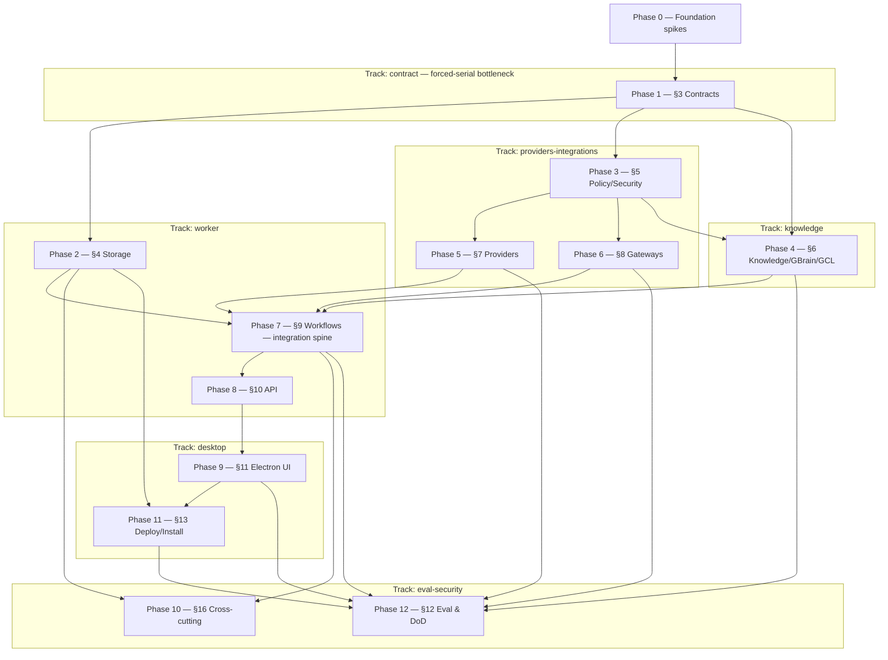

# IMPLEMENTATION_PLAN.md — System of Work Assistant

> **Phase note.** Spec-anchored build plan decomposed from the binding `ARCHITECTURE.md` (production-grade). 13 phases (0–12), 138 tasks across 6 parallel tracks; the §3 contracts phase (Phase 1) is the forced-serial bottleneck and the §9 workflows phase (Phase 7) is the integration spine. Locked decisions live in `docs/planning/DECISIONS.md`; every phase anchors to `ARCHITECTURE.md §` sections — drift surfaces at TDD Step 9. Living sections (Currently-in-progress, Carry-forward, Log, Trims, Decisions-tabled) accrete through real `/tdd` work; the Parallelization plan is authored here.

> **Reading discipline.** Read by section, not whole. Living sections are bounded/pruned at `/orchestrate-end`.

> **Session protocol:**
> - **Session start** — orchestrator `/orchestrate-start`; implementer `/session-start`. Confirm the session target.
> - **Session end** — implementer `/session-end` (TDD + cross-doc audit + Step-9 list + `/preflight`); orchestrator `/orchestrate-end` (reconcile checkboxes, Log, Decisions, Carry-forward, push).

> **Spec-anchor convention.** Each phase header carries `**Spec anchors:**` (the `ARCHITECTURE.md §` it implements), a `**Track:**` tag, and a `**Depends on (phases):**` edge — the source the Parallelization plan renders from. A slice surfacing a behavior the anchors don't cover is a cross-doc invariant flag at Step 9. New mid-build tasks carry `(implements §X; origin: <slice>)` on the heading.

---

## Currently in progress

**Phase 0 — COMPLETE (2026-06-29).** All 6 de-risk spikes (0.1–0.6) run + recorded in `docs/spikes/`; none triggered a no-go. Driven single-operator via two parallel Workflows (6-agent spike fan-out + a 2-agent 0.4 empirical re-run with adversarial verify), not a team. Decision artifacts + `config/{gbrain.pin,providers.defaults.json}` landed. Close-out session doc: `docs/sessions/001-2026-06-29-phase-0-spikes.md`.

**GBrain write-through amendment — DONE (2026-06-29).** Owner approved shipping GBrain **write-through in V1**, fail-closed (reversing the 0.2 read-only deferral). `ARCHITECTURE.md` (§6/§12/§13/§16/Appendix A/§2.5/Spec-Anchor) + this plan (Phase-4 4.6/4.7/4.9 amended + **4.14–4.20 new**; Phase-12 12.7 amended + **12.22/12.23 new**; 11.3/11.5 amended) amended from the design spec `docs/design/gbrain-write-through-divergence.md`. gbrain **0.35.1.0** installed locally for Phase-4. The **9 new + 2 amended contract models** must be frozen in Phase 1.

**Phase 1 — IN PROGRESS (contract freeze DONE 2026-06-30; domain layer remains).** Shared Contracts & Domain (the forced-serial bottleneck). **Task 1.1 DONE** (monorepo + shared primitives, `6f00419`). **Tasks 1.2–1.9 + the full 27-model Appendix-A freeze DONE (`8a42f13`/`512d731`/`4bdedf6`/`bbd2007`):** the JSON-Schema candidate-data gate (1.2, REQ-S-006) + all 27 cross-track seam models (16 base + WriteReceipt/NotebookMapping/HealthItem co-frozen + the 9 NEW write-through/divergence models + amended KnowledgeMutationPlan/HealthItem), each authored **Zod-as-source** (one `.strict()` Zod schema → `z.infer` TS type → generated strict JSON Schema → spec(§)-tagged frozen field-set snapshot) and registered in an ajv-strict registry. **495 tests pass; `pnpm typecheck` clean; consistency critic driftDetected=false** (3 NOTE-level flags carried forward). Built via a **Workflow fan-out** (foundation → 3 model waves → synthesis → adversarial verify); a mid-run API burst stalled 8 wave-1 agents, recovered by a targeted **repair workflow** re-running only the 11 incomplete models (the 16 already-complete + foundation persisted on disk — see session 003). **Remaining Phase-1 tasks (domain layer):** 1.10 canonical-key/idempotency builders → 1.11 universal validators + no-inference (REQ-F-017) → 1.12/1.13 the 6 domain state machines → 1.14 Drizzle schema + repo interfaces → 1.15 seam fixtures. Phase-0 fold-forward decisions **RATIFIED into the contract:** WebSocket → §10 (OQ-002); Hermes hybrid + provider conformance → §7 (OQ-003/007); perf SLOs + caps → §18 (OQ-004/Perf-pass). Contract authoring model locked as **ADR-008 (Zod-as-source)**.

---

## Carry-forward to upcoming briefs

- **Remaining Phase-1 domain layer (1.10–1.15):** key/idempotency builders (1.10), the 5 universal validators + REQ-F-017 no-inference (1.11) — these delegate to the now-frozen `@sow/domain` schema-gate (1.2) + the 27 models — the 6 state machines (1.12/1.13), Drizzle schema + repo interfaces (1.14), and shared seam fixtures (1.15). The contract surface they consume is frozen; brief them against `@sow/contracts` exports + the per-model snapshots.
- **Frozen-contract NOTE flags to resolve at §6/§7/Phase-4 (driftDetected=false; not blockers):** (1) `KnowledgeMutationPlan.signedProvenanceStamp` is modeled `.optional()` because KW writes the HMAC stamp **at the atomic commit** while the plan is KW *input* — confirm at §6 whether the stamp belongs on the plan at all (vs only on committed frontmatter). (2) `GbrainReadGrant.scope` is `z.array(z.literal('read'))` (accepts `[]`/duplicates) vs Appendix A's literal `['read']` — pin cardinality if §7 GbrainServePolicy semantics require exactly-one. (3) schema-version numeric posture differs: `GbrainPin.indexSchemaVersion` is `int().nonnegative()` but `ParityReport.gbrainSchemaVersion` + `GbrainReadGrant.indexSchemaVersion` are open `number()` — unify when a parity/serving consumer compares them.
- **Under-specified sub-shapes frozen provisionally (arch_gaps, refine at §6/Phase-4):** the KW mutation primitives `NoteCreate`/`NotePatch`/`LinkMutation`/`FrontmatterPatch` + `ContextRef`, `SourceRef`, `CanonicalSourceRef`, and the open `proposedContent`/`payload`/`preconditions`/`sanitizedPayload`/`routingHints` records were modeled minimally (open strings/records, no invented closed enums). Their parents' field-sets are frozen, but the nested field-level contracts firm up when §6 KnowledgeWriter + §8 gateways land — treat a nested-shape change there as a cross-track Finding.
- **Appendix-A / Phase-1-acceptance reconciliation (minor doc nit):** the Phase-1 acceptance enumeration listed the 16 base + 9 NEW models but omitted `WriteReceipt`, `NotebookMapping`, and `HealthItem` from the base list though §2.5 + the write-through amendment require them; all three were frozen this round. Fold them into the acceptance enumeration when next editing this section.
- **ESLint not yet configured:** the `lint` script is a `tsc --noEmit` placeholder (root `CLAUDE.md` calls for ESLint). Stand up real ESLint + the `[id=forbidden-patterns]` grep wiring in an early Phase-1/2 slice; until then `/preflight`'s lint step is type-only.
- **(Phase 4) `CanonicalFactDeriver` (task 4.14):** brief it against the real `~/gbrain` source — it must track gbrain's link/timeline/edge derivation closely enough to avoid false-positive divergence floods while staying gbrain-independent; re-validate at every gbrain pin-bump (residual risk in `docs/design/gbrain-write-through-divergence.md` §7).

---

## Deliverable map

<!-- ▼ EXAMPLE BLOCK [id=deliverable-map]: deliverable map — the project's required outputs (one row per phase deliverable). ▼ -->

| Deliverable | Status | Delivered by |
|---|---|---|
| Phase-0 spike reports + go/no-go (Electron pkg, GBrain pin, Hermes surface, provider conformance, stream primitive, perf budgets) | ✅ | Phase 0 |
| Frozen shared contracts + JSON Schemas + Drizzle schema (packages/contracts, domain, db schema) | ❌ | Phase 1 |
| Operational store: SQLite + Postgres adapters passing one repository contract suite; migration backup/rollback | ❌ | Phase 2 |
| Policy/Security/Egress engine: matrix + egress veto + ING-7 admission gate + worker-API session-token auth | ❌ | Phase 3 |
| KnowledgeWriter + GBrain adapter + GCL Visibility Gate + fs-watch reconciliation | ❌ | Phase 4 |
| Provider/Runtime Broker (AgentRuntimePort + ModelProviderPort) + budget caps + conformance harness | ❌ | Phase 5 |
| Connector Gateway + Tool Gateway (external-write envelope) + NotebookLM Drive sync | ❌ | Phase 6 |
| Temporal workflows: meeting-closeout proof spine + 12 other core workflows + Hermes gateway-routing | ❌ | Phase 7 |
| Local app API (tRPC + event stream, authed) | ❌ | Phase 8 |
| Electron desktop app: 9 surfaces + workspace-preset onboarding | ❌ | Phase 9 |
| Observability/redaction + System Health + worker supervision + backup/recovery | ❌ | Phase 10 |
| Install/packaging (unsigned build-from-source) + GBrain pin-upgrade gate + doctor/repair + clean-install | ❌ | Phase 11 |
| Eval & test harness: 1:1 PRD §20.1 suites + EVAL-1 corpora + perf benchmark + DoD certification | ❌ | Phase 12 |

<!-- ▲ END EXAMPLE BLOCK [id=deliverable-map] ▲ -->

---

<!-- ▼ EXAMPLE BLOCK [id=parallelization-plan]: Parallelization plan / Track map — authored by /tasks-gen from ARCHITECTURE.md §2.5 refined by the per-task Depends-on graph; /team-start <track> reads it. ▼ -->

## Parallelization plan (Track map)

> **Team mode.** A *track* is a dependency-isolated region of the `ARCHITECTURE.md` §2.5 DAG. Tracks with no unsatisfied upstream-track dependency run **in parallel**, each in its own git worktree + agent team. Phase 0 (spikes) and Phase 1 (contracts) are pre-fork: **all tracks wait on Phase 1**.

**Phase/track DAG** (nodes = phases; edges = `Depends on (phases)`):

> **Critical path:** Phase 0 → 1 → 3 → 6 → 7 → 8 → 9 → 11 → 12 (9 phases — the serial floor; staff it first). **Forced-serial bottlenecks:** **Phase 1 (§3 contracts)** — every track waits on the frozen contract; and **Phase 7 (§9 workflows)** — the integration spine every feature track (storage, knowledge, providers, gateways) converges into.

**Track map** — `<track>-<area>-<role>` naming per root `CLAUDE.md`:

| Track | Phases | Code area(s) | Worktree (branch) | Agent-team names |
|---|---|---|---|---|
| contract | 1 | `packages/contracts`, `packages/domain` | `../SoW-build-contract` (`track/contract`) | `contract-contracts-orchestrator` / `-implementer` |
| worker | 2, 7, 8 | `packages/db`, `packages/workflows`, `apps/worker` | `../SoW-build-worker` (`track/worker`) | `worker-workflows-orchestrator` / `-implementer` |
| providers-integrations | 3, 5, 6 | `packages/policy`, `packages/providers`, `packages/integrations` | `../SoW-build-provint` (`track/providers-integrations`) | `providers-integrations-policy-orchestrator` / `-implementer` |
| knowledge | 4 | `packages/knowledge` | `../SoW-build-knowledge` (`track/knowledge`) | `knowledge-knowledge-orchestrator` / `-implementer` |
| desktop | 9, 11 | `apps/desktop` | `../SoW-build-desktop` (`track/desktop`) | `desktop-desktop-orchestrator` / `-implementer` |
| eval-security | 10, 12 | `packages/evals` | `../SoW-build-evalsec` (`track/eval-security`) | `eval-security-evals-orchestrator` / `-implementer` |

**Integration / merge order** (DAG topological): 1 (contract — freeze first) → 2 ∥ 3 → 4 ∥ 5 ∥ 6 → 7 (spine) → 8 → 9 → 10 ∥ 11 → 12 (DoD certification last).

**Shared contracts across tracks** (freeze before fork — Appendix-A models crossing a §2.5 edge): `Workspace`, `ProviderMatrix`, `EgressPolicy`, `ToolPolicy`, `Capability`, `ProviderRoute`, `AgentJob`, `KnowledgeMutationPlan`, `ProposedAction`, `ExternalWriteEnvelope`, `SourceEnvelope`, `Approval`, `GclProjection`, `AuditRecord`, `WorkflowRunRef`, `ProviderProfile` — **plus the GBrain write-through/divergence seam models** `SemanticFact`, `FactProvenance`, `SignedProvenanceStamp`, `ParityReport`, `Divergence`, `QuarantineRecord`, `GBrainProposedFact`, `GbrainReadGrant`/`GbrainServePolicy`, `GbrainPin` (9 NEW), and the **amended** `KnowledgeMutationPlan` (+`provenanceOrigin`/`gbrainProposalRef`/`signedProvenanceStamp`) + `HealthItem` (+`sync_lagging`/`rebuild_divergence`/`parityReportRef`/`factIdentity`) — all defined + schema-snapshot-frozen in Phase 1.

> **Write-through seam-freeze note (added by the 2026-06-29 amendment).** The GBrain write-through/divergence layer (Phase-4 tasks 4.14–4.20; spec `docs/design/gbrain-write-through-divergence.md`) crosses the **knowledge / eval-security / providers-integrations / worker** seams, so the 9 new + 2 amended models above **MUST** be authored + JSON-Schema-snapshot-frozen in Phase 1 **before those tracks fork** — an unfrozen seam here is a guaranteed mid-build cross-track Finding. The `HealthItem.sync_lagging` enum value (already emitted by task 4.4 + the 1.13 state machine but previously absent from Appendix A) is closed in this same freeze round.

<!-- ▲ END EXAMPLE BLOCK [id=parallelization-plan] ▲ -->

---

## Phase exit checklist (template — applies to every phase)

Executed row-by-row by `/phase-exit <phase>`:

- [ ] All phase task checkboxes ticked (partial work stays unchecked with a Log note).
- [ ] Acceptance criterion met (`/preflight` clean + manual smoke if runtime behavior).
- [ ] `/preflight` clean (incl. architecture-invariant tests).
- [ ] Cross-doc invariants verified — no model field change without an `ARCHITECTURE.md` edit in the same round.
- [ ] Reachability audit clean per touched area.
- [ ] Arch-drift audit clean over the phase's Spec anchors.
- [ ] Spec coverage: every phase anchor has a tagged test or waiver (`spec-lint tests <phase>`).
- [ ] _(production-grade)_ Dependency audit: `pnpm audit --prod` shows no NEW findings vs the accepted-risk baseline (new findings accepted-risk-recorded in Decisions tabled or escalated as a Finding).
- [ ] _(production-grade)_ Whole-system security review clean for qualifying phases (trust-boundary / security-/invariant-tagged tasks — per `THREAT_MODEL.md`; resolves against `security-reviewer = invariant`).
- [ ] Session doc(s) exist and list every file created/modified.
- [ ] Commits pushed.

---

## Final-submission acceptance criteria (project-level)

- [ ] All PRD §20.1 end-to-end acceptance tests pass against real integrations (no mocks on load-bearing paths) — certified in Phase 12.
- [ ] Meeting-closeout proof spine works end-to-end with zero duplicate external writes on replay.
- [ ] EVAL-1 metrics met: meeting-closeout ≥90% routing accuracy; retrieval ≥90% relevance; WS-7 leakage = 0.
- [ ] SQLite **and** Postgres pass the one repository contract suite (Postgres not a permanent stub).
- [ ] Perf budgets met: dashboard <2s; KW→GBrain ≤60s p95; KW→dashboard ≤10s p95.
- [ ] Clean install succeeds on a fresh Mac on the default runtime without Hermes.

---

## Phase 0 — Foundation spikes (de-risk gates)

**Goal:** Resolve the load-bearing unknowns the architecture names as Phase-0 spikes, each with a recorded go/no-go and a no-go branch, before the contract freezes. Spikes are throwaway experiments, not TDD slices; their output is a recorded decision (pinned versions, chosen primitives, budgets).

**Spec anchors:** `ARCHITECTURE.md §13`, §7, §18, §12.

**Track:** — (pre-fork foundation) · **Depends on (phases):** none.

### 0.1 — Electron shell / packaging spike (OQ-001)
- [x] Validate an **unsigned build-from-source** packaging that spawns + supervises the Node worker, the local Temporal dev-server, and per-workspace GBrain subprocesses; capture hardened-runtime entitlement needs.
- [x] Record go/no-go; no-go ⇒ reopen the Electron shell ADR (ARCHITECTURE.md §14 / DECISIONS ADR-001).
- [x] Files: NEW `docs/spikes/0.1-electron-packaging.md`
- [x] Cross-doc invariant: none
- [x] Depends on: none

### 0.2 — GBrain round-trip + version-pin spike (OQ-006)
- [ ] Prove the §19 round-trip GO conditions: fs-watch audit shows zero non-KnowledgeWriter Markdown mutations; a GBrain index job concurrent with a KnowledgeWriter write loses no update; an injected DB-only fact is flagged by the parity check; Markdown stays syntactically valid + semantically lossless. Pin the known-good GBrain SHA. _(Live proof DEFERRED to Phase 4 — it inherently exercises KnowledgeWriter + the parity/serving layer, which don't exist yet. **REVERSED by the 2026-06-29 write-through amendment:** read-only/index-only is NO LONGER the V1 endpoint — it is the per-workspace **default-until-enabled fallback + kill switch**; **write-through ships ON in V1** behind the fail-closed divergence layer (Phase-4 tasks **4.14–4.20**) with the 4 GO conditions as Phase-12 acceptance gates (**12.7 / 12.22 / 12.23**). `config/gbrain.pin` is re-captured against installed gbrain **0.35.1.0** (3933eb6a; retires the v0.18.2 / `PENDING_LIVE_VALIDATION` sentinel at the enablement gate). Phase-0 outcome retained: methodology harness 13/13 PASS. Spec: `docs/design/gbrain-write-through-divergence.md`; see `docs/sessions/001`.)_
- [x] Record go/no-go; **no-go ⇒ GBrain ships READ-ONLY/index-only** (still satisfies DoD per §6/§14.5).
- [x] Files: NEW `docs/spikes/0.2-gbrain-roundtrip.md`, `config/gbrain.pin` (NEW)
- [x] Cross-doc invariant: none
- [x] Depends on: none

### 0.3 — Hermes adapter surface spike (OQ-007)
- [x] Choose the Hermes integration surface (API server / TUI gateway / Python wrapper / Kanban / hybrid) via a bounded meeting-close mock with schema validation, stop/cancel, logs, controlled tools.
- [x] Record go/no-go; **no-go ⇒ Claude SDK (or another conformant runtime) carries the critical path**; Hermes stays required + DoD-tested but not first-install-gating.
- [x] Files: NEW `docs/spikes/0.3-hermes-surface.md`
- [x] Cross-doc invariant: none
- [x] Depends on: none

### 0.4 — Provider conformance baseline spike (OQ-003)
- [x] Pin exact provider × capability × model pairs and verify structured-output/tool-use fidelity for each enabled provider (Claude/OpenAI/OpenRouter/Ollama/LM Studio); choose default models per capability; record the cost-estimation source + default `maxCostUsd` cap.
- [x] Files: NEW `docs/spikes/0.4-provider-conformance.md`, `config/providers.defaults.json` (NEW)
- [x] Cross-doc invariant: none
- [x] Depends on: none

### 0.5 — Local API streaming primitive spike (OQ-002)
- [x] Decide the worker→renderer push primitive (tRPC subscription over WebSocket vs SSE-style stream); validate reconnection/backpressure under the session-token auth model.
- [x] Files: NEW `docs/spikes/0.5-api-stream.md`
- [x] Cross-doc invariant: none
- [x] Depends on: none

### 0.6 — Perf-budget pass (deferred budgets)
- [x] Set or explicitly defer (with rationale) the non-PRD interactive budgets: meeting-closeout end-to-end p95, Copilot response, approval round-trip, ingress→workflow-start, single-machine concurrency cap, and default per-job `maxCostUsd`. The three PRD budgets (dashboard <2s, KW→GBrain ≤60s p95, KW→dashboard ≤10s p95) remain hard gates regardless.
- [x] Files: NEW `docs/spikes/0.6-perf-budgets.md`
- [x] Cross-doc invariant: none
- [x] Depends on: none

### Acceptance criteria (0)
- [x] All 0.X spikes have a recorded go/no-go + decision artifact in `docs/spikes/`.
- [x] GBrain SHA pinned; stream primitive chosen; provider/model pairs + default caps recorded; Hermes surface chosen or critical-path reassigned.

---

## Phase 1 — Shared Contracts & Domain

**Goal:** Define and freeze the entire shared-contract surface that every other §2.5 track imports: all Appendix-A contract models (the base set **plus the 9 NEW GBrain write-through/divergence seam models** — `SemanticFact`, `FactProvenance`, `SignedProvenanceStamp`, `ParityReport`, `Divergence`, `QuarantineRecord`, `GBrainProposedFact`, `GbrainReadGrant`/`GbrainServePolicy`, `GbrainPin` — with `KnowledgeMutationPlan` + `HealthItem` **amended**; see the §2.5 freeze list) as runtime-safe TypeScript types plus strict JSON Schemas (each with a frozen schema-snapshot), the Drizzle operational-store schema source and repository interfaces, the pure domain layer (the 6 DOMAIN_MODEL state machines, the 5 universal validation rules including the REQ-F-017 no-inference hard-reject, and deterministic canonical-key/idempotency builders), and shared seam fixtures. This is the forced-serial bottleneck: packages/contracts and packages/domain import nothing app- or adapter-side, and a mid-build change to any seam model is a cross-track Finding, so the contracts must be exhaustively pinned and snapshot-frozen before any downstream track forks. EgressPolicy and ToolPolicy (the two newly-defined P0 controls) are specified field-exhaustively here.

**Spec anchors:** ARCHITECTURE.md §3 (primary); §2.5 (DAG + cross-track seam-contract list); Appendix A (model inventory, cross-doc invariants); §5 (EgressPolicy/ToolPolicy semantics, veto rule); §7 (ProviderRoute/budget/conformance fields); §9 + docs/planning/DOMAIN_MODEL.md (the 6 normative state machines); §12 (schema-snapshot/contract-test posture); §16 (typed-result error convention + redaction). REQs: REQ-S-006, REQ-S-001/002/007, REQ-F-002/005/006/012/017, REQ-D-002/003.

**Track:** contract · **Depends on (phases):** 0

### 1.1 — Package scaffold + shared primitives, enums, typed-result envelope, event-name catalog
- [x] Branded/opaque ID types (WorkspaceId, AgentJobId, ActionId, PlanId, SourceId, ApprovalId, WorkflowId, AuditId) prevent cross-assignment at compile time; runtime constructors reject empty/whitespace.
- [x] Shared enums with exact literal membership: WorkspaceType (employer_work|personal_business|personal_life), DataOwner (employer|user|client), VisibilityLevel (isolated|coordination|sanitized|full), ProviderId (claude|openai|openrouter|ollama|lm_studio), egressClass (local|cloud); ProcessorId and ToolId as branded strings (concrete catalogs unspecified upstream — see arch_gaps).
- [x] Typed Result<T,E> envelope with explicit, enumerable failure variants (§16 error-handling convention): no throw-based control flow across subsystem boundaries; every failure carries a typed code.
- [x] Event-name catalog as a const union (workflow status, approval update, System Health, read-model change) — single source of truth for the §10 push stream; renderer-importable and carries no secrets/raw data.
- [x] packages/contracts and packages/domain are pure: import nothing app- or adapter-side (import-direction rule §2.5); a lint/boundary check pins this.
- [x] Files: NEW packages/contracts/package.json, packages/contracts/tsconfig.json, packages/contracts/src/index.ts, packages/contracts/src/primitives/ids.ts, packages/contracts/src/primitives/enums.ts, packages/contracts/src/primitives/result.ts, packages/contracts/src/events/catalog.ts; NEW packages/domain/package.json, packages/domain/tsconfig.json, packages/domain/src/index.ts
- [x] Cross-doc invariant: none
- [x] Depends on: none

### 1.2 — JSON Schema validation gate + schema registry (REQ-S-006)
- [x] A schema registry maps schemaId -> compiled JSON Schema validator; an unknown schemaId is a typed rejection, never a silent pass-through.
- [x] validate(output, schemaId) returns a typed Result: on failure it yields a structured rejection (schemaId + failing JSON paths) and does NOT return the output as usable — enforcing candidate-data-in / validated-out before any downstream use (REQ-S-006, §3 universal rule).
- [x] Strict mode: additional/unknown properties are rejected so provider drift cannot smuggle fields; ajv strict + format assertions pinned.
- [x] Validation is pure, deterministic, and side-effect-free: identical input -> identical verdict; no network/clock.
- [x] Rejection variants are enumerable so the §9 meeting validator can surface a distinct schema_rejected class.
- [x] Files: NEW packages/contracts/src/schema/registry.ts, packages/domain/src/validation/schema-gate.ts
- [x] Cross-doc invariant: none
- [x] Depends on: 1.1
- [x] Implements: REQ-S-006

### 1.3 — EgressPolicy + ToolPolicy contracts (newly-defined P0 controls — exhaustive)
- [x] EgressPolicy fields exactly { workspaceId, allowedProcessors: ProcessorId[], rawContentAllowedProcessors: ProcessorId[], employerRawEgressAcknowledged: boolean, acknowledgedAt? }; conditional pinned: acknowledgedAt is present iff employerRawEgressAcknowledged===true.
- [x] A ProcessorId is any external content recipient (cloud LLM endpoint, OpenRouter, Drive/NotebookLM); local Ollama/LM Studio are NON-egress and never appear as required processors; OpenRouter is its OWN processor id, not an OpenAI-compatible alias (pinned in fixture + schema note, §5 veto rule).
- [x] ToolPolicy fields exactly { mode: read_only|scoped_write, allowedTools: ToolId[], deniedTools: ToolId[], allowsMutating: boolean }; consistency predicate exposed for the §5 admission gate: mode===read_only => allowsMutating===false AND allowedTools contains no mutating tool (a violating ToolPolicy is invalid here, independently of the §5 job-admission denial).
- [x] deniedTools takes precedence over allowedTools on overlap — conflict resolution pinned.
- [x] RED outline must include a spec(§3)-tagged schema-snapshot test for EgressPolicy and for ToolPolicy: field-name set == checked-in snapshot.
- [x] Files: NEW packages/contracts/src/models/egress-policy.ts, packages/contracts/src/models/tool-policy.ts, packages/contracts/schemas/egress-policy.schema.json, packages/contracts/schemas/tool-policy.schema.json, packages/contracts/src/models/__snapshots__/egress-policy.snap, packages/contracts/src/models/__snapshots__/tool-policy.snap
- [x] Cross-doc invariant: NEW — EgressPolicy, ToolPolicy *(seam — RED outline must include the spec-tagged schema-snapshot test)*
- [x] Depends on: 1.1, 1.2
- [x] Implements: REQ-S-002, REQ-S-001

### 1.4 — Capability + ProviderRoute + ProviderProfile contracts
- [x] Capability modeled as a branded capability-id string (config-driven membership, e.g. meeting.close, notebooklm.sync) — open, not a closed enum (see arch_gaps).
- [x] ProviderRoute = { runtime|provider, model, endpoint, egressClass }: discriminated union with exactly one of runtime|provider set (mutual exclusivity pinned); egressClass===local marks a non-egress route (the §5 veto's only legal pick for unacknowledged Employer-Work raw content).
- [x] ProviderProfile fields { provider, endpoint, model, capabilities[], egressClass, costCaps, conformanceStatus } where secrets are Keychain references only — the schema forbids any inline API-key/plaintext-secret field (REQ-S-003).
- [x] conformanceStatus enum (unknown|passing|failing|disabled); a non-passing profile is representable but flagged (matrix-eligibility predicate itself lives in §7).
- [x] RED outline includes a spec(§3)-tagged schema-snapshot test for Capability, ProviderRoute, and ProviderProfile.
- [x] Files: NEW packages/contracts/src/models/capability.ts, packages/contracts/src/models/provider-route.ts, packages/contracts/src/models/provider-profile.ts, packages/contracts/schemas/provider-route.schema.json, packages/contracts/schemas/provider-profile.schema.json, packages/contracts/src/models/__snapshots__/provider-route.snap, packages/contracts/src/models/__snapshots__/provider-profile.snap
- [x] Cross-doc invariant: NEW — Capability, ProviderRoute, ProviderProfile *(seam — RED outline must include the spec-tagged schema-snapshot test)*
- [x] Depends on: 1.1, 1.2

### 1.5 — ProviderMatrix + Workspace contracts (aggregate config)
- [x] ProviderMatrix fields { workspaceId, allowedProviders: ProviderId[], capabilityDefaults: Record<Capability, ProviderRoute>, rawCloudEgressEnabled, localProviderPreference? }; consistency predicate pinned: every provider referenced by capabilityDefaults routes is a subset of allowedProviders.
- [x] Workspace fields { id, name, type, dataOwner, markdownRepoPath, gbrainBrainId, defaultVisibility, egressPolicy, providerMatrix }, embedding the EgressPolicy + ProviderMatrix by value; referential pin: workspace.id === egressPolicy.workspaceId === providerMatrix.workspaceId.
- [x] Safe default pinned: type===employer_work => dataOwner defaults employer AND egress defaults closed (employerRawEgressAcknowledged===false, rawContentAllowedProcessors empty).
- [x] RED outline includes a spec(§3)-tagged schema-snapshot test for ProviderMatrix and Workspace.
- [x] Files: NEW packages/contracts/src/models/provider-matrix.ts, packages/contracts/src/models/workspace.ts, packages/contracts/schemas/provider-matrix.schema.json, packages/contracts/schemas/workspace.schema.json, packages/contracts/src/models/__snapshots__/provider-matrix.snap, packages/contracts/src/models/__snapshots__/workspace.snap
- [x] Cross-doc invariant: NEW — ProviderMatrix, Workspace *(seam — RED outline must include the spec-tagged schema-snapshot test)*
- [x] Depends on: 1.3, 1.4
- [x] Implements: REQ-F-001

### 1.6 — AgentJob contract (incl ContextRef, budgets, embedded policy/route)
- [x] Fields exactly { id, workflowRunId, workspaceId, capability, contextRefs: ContextRef[], outputSchemaId, toolPolicy, providerRoute, maxRuntimeSeconds, maxCostUsd?, idempotencyKey }; ContextRef sub-type defined here.
- [x] Budget pins (COST-1): maxRuntimeSeconds required and positive; maxCostUsd optional but if present positive; idempotencyKey required non-empty (replay key).
- [x] outputSchemaId must resolve in the §3 schema registry — an AgentJob naming an unknown schema id is invalid at construction (referential pin to 1.2).
- [x] toolPolicy and providerRoute are carried by value so the §5 admission gate and §7 egress veto evaluate without extra lookups.
- [x] RED outline includes a spec(§3)-tagged schema-snapshot test for AgentJob.
- [x] Files: NEW packages/contracts/src/models/agent-job.ts, packages/contracts/schemas/agent-job.schema.json, packages/contracts/src/models/__snapshots__/agent-job.snap
- [x] Cross-doc invariant: NEW — AgentJob *(seam — RED outline must include the spec-tagged schema-snapshot test)*
- [x] Depends on: 1.3, 1.4

### 1.7 — KnowledgeMutationPlan + ProposedAction + ExternalWriteEnvelope contracts (write path)
- [x] KnowledgeMutationPlan fields { planId, workspaceId, sourceRefs: SourceRef[], creates: NoteCreate[], patches: NotePatch[], linkMutations: LinkMutation[], frontmatterUpdates: FrontmatterPatch[], externalActionProposals: ProposedAction[], confidence, requiresApproval }; nested NoteCreate/NotePatch/LinkMutation/FrontmatterPatch/SourceRef defined; pinned reject-on-empty: a semantic mutation carries workspaceId AND non-empty sourceRefs (REQ-F-006 / §3 universal rule).
- [x] ProposedAction fields { actionId, targetSystem, canonicalObjectKey, payload, approvalPolicy, idempotencyKey }; targetSystem enum (calendar|todoist|linear|asana|drive|github|telegram); both canonicalObjectKey and idempotencyKey required (universal external-write rule, §3/§8).
- [x] ExternalWriteEnvelope fields { actionId, targetSystem, canonicalObjectKey, idempotencyKey, preconditions, payloadHash, approvalId?, writeReceipt? }; WriteReceipt sub-type defined; linkage pin: envelope.actionId === its ProposedAction.actionId and targetSystem/canonicalObjectKey/idempotencyKey agree.
- [x] payloadHash is a deterministic function of payload (stable across runs) so replay matches the §20.1 replay gate.
- [x] RED outline includes spec(§3)-tagged schema-snapshot tests for KnowledgeMutationPlan, ProposedAction, and ExternalWriteEnvelope.
- [x] Files: NEW packages/contracts/src/models/knowledge-mutation-plan.ts, packages/contracts/src/models/proposed-action.ts, packages/contracts/src/models/external-write-envelope.ts, packages/contracts/schemas/knowledge-mutation-plan.schema.json, packages/contracts/schemas/proposed-action.schema.json, packages/contracts/schemas/external-write-envelope.schema.json, packages/contracts/src/models/__snapshots__/knowledge-mutation-plan.snap, packages/contracts/src/models/__snapshots__/proposed-action.snap, packages/contracts/src/models/__snapshots__/external-write-envelope.snap
- [x] Cross-doc invariant: NEW — KnowledgeMutationPlan, ProposedAction, ExternalWriteEnvelope *(seam — RED outline must include the spec-tagged schema-snapshot test)*
- [x] Depends on: 1.1, 1.2

### 1.8 — SourceEnvelope + GclProjection contracts
- [x] SourceEnvelope fields { sourceId, workspaceId, origin, contentHash, type, sensitivity, routingHints }; workspaceId required (REQ-F-002 scoped-before-durable); contentHash deterministic and used for dedupe (Flow 4 dedupe-hit).
- [x] GclProjection fields { workspaceId, visibilityLevel, projectionType, sanitizedPayload, sourceRefs }; pinned reject-on-missing: every cross-workspace projection MUST declare visibilityLevel AND source workspace (§3 universal rule / §6 Visibility Gate).
- [x] projectionType drives an allowed-field set for sanitizedPayload; the schema forbids raw-content-shaped fields by construction (full leakage enforcement lives in §5/§6, but the shape gate is pinned here).
- [x] RED outline includes spec(§3)-tagged schema-snapshot tests for SourceEnvelope and GclProjection.
- [x] Files: NEW packages/contracts/src/models/source-envelope.ts, packages/contracts/src/models/gcl-projection.ts, packages/contracts/schemas/source-envelope.schema.json, packages/contracts/schemas/gcl-projection.schema.json, packages/contracts/src/models/__snapshots__/source-envelope.snap, packages/contracts/src/models/__snapshots__/gcl-projection.snap
- [x] Cross-doc invariant: NEW — SourceEnvelope, GclProjection *(seam — RED outline must include the spec-tagged schema-snapshot test)*
- [x] Depends on: 1.1, 1.2, 1.5
- [x] Implements: REQ-F-002, REQ-F-005

### 1.9 — Approval + WorkflowRunRef + AuditRecord contracts
- [x] Approval fields { id, actionRef, status, actor, channel, payloadHash, snoozeUntil?, expiresAt? }; status enum exactly pending|approved|edited|rejected|deferred|expired; channel enum (mac|telegram); pinned: snoozeUntil present only when status===deferred.
- [x] WorkflowRunRef fields { workflowId, trigger, state, idempotencyKey, auditRefs }.
- [x] AuditRecord fields { actor, event, refs, payloadHash, beforeSummary, afterSummary, timestamps }; before/after are SUMMARIES, never raw content (redaction-friendly, §16) — the schema has no raw-content field.
- [x] RED outline includes spec(§3)-tagged schema-snapshot tests for Approval, WorkflowRunRef, and AuditRecord.
- [x] Files: NEW packages/contracts/src/models/approval.ts, packages/contracts/src/models/workflow-run-ref.ts, packages/contracts/src/models/audit-record.ts, packages/contracts/schemas/approval.schema.json, packages/contracts/schemas/workflow-run-ref.schema.json, packages/contracts/schemas/audit-record.schema.json, packages/contracts/src/models/__snapshots__/approval.snap, packages/contracts/src/models/__snapshots__/workflow-run-ref.snap, packages/contracts/src/models/__snapshots__/audit-record.snap
- [x] Cross-doc invariant: NEW — Approval, WorkflowRunRef, AuditRecord *(seam — RED outline must include the spec-tagged schema-snapshot test)*
- [x] Depends on: 1.1

### 1.10 — Canonical-object-key + idempotency-key builders (replay-stable)
- [ ] buildCanonicalObjectKey is deterministic over (targetSystem + stable identity inputs): the same logical external object yields the same key across runs and processes (enables the §8 pre-write existence check / match-by-canonical-key); input normalization (trim/case/order-independence where applicable) is documented and pinned.
- [ ] buildIdempotencyKey is deterministic over the operation identity so a replayed workflow step yields the same key — collisions occur only for a genuinely-identical operation (no duplicate external writes, §20.1 replay gate, REQ-NF-006).
- [ ] Builders are pure: NO clock, NO randomness, NO env — pinned (nondeterministic input would break replay).
- [ ] Keys are opaque, URL/storage-safe strings.
- [ ] Files: NEW packages/domain/src/keys/canonical-key.ts, packages/domain/src/keys/idempotency-key.ts
- [ ] Cross-doc invariant: none
- [ ] Depends on: 1.1

### 1.11 — Universal validation rules + no-inference validator (REQ-F-017)
- [ ] The 5 §3 universal rules implemented as pure, composable predicates returning typed rejections: (a) output validates against its JSON Schema (delegates to 1.2); (b) every external write carries canonicalObjectKey + idempotencyKey; (c) every semantic mutation carries workspaceId + non-empty sourceRefs; (d) every cross-workspace projection declares visibilityLevel + source workspace.
- [ ] No-inference rule (REQ-F-017 / MTG-4): an extraction field (task owner, due date) populated WITHOUT a supporting evidence ref is a HARD REJECT — a validator denial, not a model preference; unstated values must be TBD or routed to clarification (a value that is neither TBD nor evidence-backed fails). Operates over an abstract evidence-backed extraction-field shape (concrete meeting.close output schema is §9 — see arch_gaps).
- [ ] Rejections are typed and enumerable so the §9 meeting validator surfaces distinct classes: missing_evidence, inferred_owner_or_date, missing_key, unscoped_mutation, missing_visibility.
- [ ] Validators are pure and deterministic: no network/clock/random.
- [ ] Files: NEW packages/domain/src/validation/universal-rules.ts, packages/domain/src/validation/no-inference.ts
- [ ] Cross-doc invariant: none
- [ ] Depends on: 1.2, 1.7, 1.8, 1.10
- [ ] Implements: REQ-F-017

### 1.12 — Domain state machines: Source, Meeting Closeout, AgentJob
- [ ] Source machine (DOMAIN_MODEL): captured->classified->queued_for_review|processing->proposed->applied|rejected|failed_retryable|failed_terminal; forbidden transitions rejected with a typed error: captured->applied without classification+policy validation, and processing->external_write from the source-processing agent.
- [ ] Meeting Closeout machine: detected->correlated->context_loaded->agent_extracted->validated->knowledge_committed->external_actions_pending|external_actions_applied->summarized, with failure/recovery states (needs_routing_review, provider_failed, schema_rejected, write_conflict, approval_pending, outbox_retry, completed_with_warnings) reachable from their specified points.
- [ ] AgentJob machine: created->admitted->provider_selected->running->schema_validated->accepted|rejected|cancelled_budget|failed_retryable|failed_terminal; cancelled_budget is terminal and reachable from running (COST-1, leaves no committed side effect at the state level).
- [ ] Transition functions are pure and total: an illegal transition returns a typed rejection (never throws); terminal states accept no further transitions (frozen).
- [ ] Files: NEW packages/domain/src/state/source.ts, packages/domain/src/state/meeting-closeout.ts, packages/domain/src/state/agent-job.ts
- [ ] Cross-doc invariant: none
- [ ] Depends on: 1.6

### 1.13 — Domain state machines: Knowledge Mutation, Proposed External Action, Approval
- [ ] Knowledge Mutation machine: planned->validated->conflict_checked->approved_if_required->committed_to_markdown->gbrain_sync_queued->indexed|sync_lagging|parity_defect; committed_to_markdown is the durability point (no transition rolls it back); parity_defect reachable after the sync-queued step. The plan's **`provenanceOrigin`** (human\|meeting_close\|ingestion\|gbrain_proposal\|parity_remediation) discriminates the entry (gbrain_proposal carries `requiresApproval` default-true); `parity_defect` is classified by the §6 **Divergence** taxonomy (db_only\|unstamped HARD-floor \| content_mismatch Markdown-wins \| md_only \| edge_* \| stale_revision) and remediated materialize-or-purge (task 4.18).
- [ ] Proposed External Action machine: proposed->approval_required|auto_allowed->precondition_checked->dispatched->receipt_recorded|retry_queued|rejected|expired; receipt_recorded is terminal-success; retry_queued re-enters dispatched.
- [ ] Approval machine: pending->approved|edited|rejected|deferred|expired; deferred is NON-terminal (deferred->pending|expired) with configurable snooze (default 24h) and expiry (default 7d) parameters; exactly-once semantics pinned: re-applying a terminal transition is an idempotent no-op (REQ-F-012, Mac+Telegram parity).
- [ ] Transition functions are pure and total: typed rejection on illegal transition; terminal states frozen.
- [ ] Files: NEW packages/domain/src/state/knowledge-mutation.ts, packages/domain/src/state/proposed-action.ts, packages/domain/src/state/approval.ts
- [ ] Cross-doc invariant: extended — Approval
- [ ] Depends on: 1.7, 1.9
- [ ] Implements: REQ-F-012

### 1.14 — Drizzle operational-store schema source + repository interface contracts
- [ ] Drizzle table definitions for the operational-store domains (workspace config, event log, audit, approvals, outboxes, connector cursors, provider state, read models, GCL projections) authored dialect-neutrally — no SQLite- or Postgres-only column types that would break the other adapter (concrete adapters, migrations, and the both-dialect repository contract suite are §4 / worker track, REQ-D-003).
- [ ] Column-name parity drift-guard: tables persisting Appendix-A models (Workspace config, Approval, AuditRecord, GclProjection, ProviderProfile, WorkflowRunRef, SourceEnvelope events) have a column set matching the model's field-name set.
- [ ] No plaintext-secret column anywhere — secrets are Keychain references only (REQ-S-003); audit before/after columns are summaries (no raw content, §16).
- [ ] Repository interface contracts (per domain) defined in packages/db so domain depends on interfaces, never a concrete driver (import-direction §2.5, REQ-D-002).
- [ ] Operational-truth domains (event log, audit, approvals, outboxes, connector cursors) expressible as append-only/tombstone; read models marked rebuildable (§4 boundaries).
- [ ] Files: NEW packages/db/package.json, packages/db/tsconfig.json, packages/db/src/schema/index.ts, packages/db/src/schema/workspace-config.ts, packages/db/src/schema/event-log.ts, packages/db/src/schema/audit.ts, packages/db/src/schema/approvals.ts, packages/db/src/schema/outboxes.ts, packages/db/src/schema/connector-cursors.ts, packages/db/src/schema/provider-state.ts, packages/db/src/schema/read-models.ts, packages/db/src/schema/gcl-projections.ts, packages/db/src/repositories/interfaces.ts
- [ ] Cross-doc invariant: extended — Workspace, Approval, AuditRecord, GclProjection, ProviderProfile, WorkflowRunRef, SourceEnvelope
- [ ] Depends on: 1.3, 1.4, 1.5, 1.6, 1.7, 1.8, 1.9
- [ ] Implements: REQ-D-002

### 1.15 — Shared seam contract test fixtures (valid + per-rule invalid)
- [ ] A canonical valid instance plus a set of invalid instances (one per pinned rejection rule) for EVERY Appendix-A contract — the shared seam fixtures every downstream track's RED outlines import.
- [ ] Invalid fixtures cover the pinned rejection rules: read_only ToolPolicy admitting a mutating tool; EgressPolicy acknowledged=true without acknowledgedAt; KnowledgeMutationPlan with empty sourceRefs; ProposedAction missing canonicalObjectKey/idempotencyKey; GclProjection missing visibilityLevel; meeting extraction owner/date without an evidence ref (no-inference); ProviderProfile with an inline secret field; ProviderMatrix route referencing a provider outside allowedProviders.
- [ ] Fixtures are typed (compile against the contracts) and each carries a claimed validity label; a meta-test pins that the claimed label matches the schema-gate verdict from 1.2.
- [ ] Fixtures are deterministic literals (no clock/random) so snapshots and replay tests are stable.
- [ ] Files: NEW packages/contracts/src/fixtures/index.ts, packages/contracts/src/fixtures/valid.ts, packages/contracts/src/fixtures/invalid.ts
- [ ] Cross-doc invariant: none
- [ ] Depends on: 1.3, 1.4, 1.5, 1.6, 1.7, 1.8, 1.9, 1.11

### Acceptance criteria (1)
- [ ] All 1.X task checkboxes ticked.
- [x] All Appendix-A contract models — the base set (Workspace, ProviderMatrix, EgressPolicy, ToolPolicy, Capability, ProviderRoute, ProviderProfile, AgentJob, KnowledgeMutationPlan, ProposedAction, ExternalWriteEnvelope, SourceEnvelope, GclProjection, Approval, AuditRecord, WorkflowRunRef) **plus the 9 NEW write-through/divergence seam models** (SemanticFact, FactProvenance, SignedProvenanceStamp, ParityReport, Divergence, QuarantineRecord, GBrainProposedFact, GbrainReadGrant/GbrainServePolicy, GbrainPin) — are defined as runtime-safe TypeScript types + strict JSON Schemas, each with a green spec(§3/§6)-tagged schema-snapshot test freezing the field-name set; `KnowledgeMutationPlan` (+provenanceOrigin/gbrainProposalRef/signedProvenanceStamp) and `HealthItem` (+sync_lagging/rebuild_divergence/parityReportRef/factIdentity) carry their amended fields in the freeze. **[DONE 2026-06-30: 27 models frozen, schema-snapshot + ajv-registry coverage green; WriteReceipt + NotebookMapping co-frozen.]**
- [x] EgressPolicy and ToolPolicy are field-exhaustive with their P0 invariants pinned: EgressPolicy acknowledged<->acknowledgedAt coupling and OpenRouter-as-own-processor; ToolPolicy read_only=>non-mutating consistency predicate exposed for the §5 admission gate.
- [ ] The 5 universal validation rules plus the REQ-F-017 no-inference hard-reject are implemented as pure, deterministic, typed-rejection validators with enumerable failure classes.
- [ ] All 6 DOMAIN_MODEL state machines (Source, Meeting Closeout, Knowledge Mutation, Proposed External Action, AgentJob, Approval) are pure total transition functions: forbidden transitions return typed rejections, terminal states are frozen, and deferred-Approval is non-terminal with configurable snooze/expiry.
- [ ] Canonical-object-key and idempotency-key builders are pure and deterministic (no clock/random), producing replay-stable keys for the §8 pre-write existence check and §20.1 replay gate.
- [ ] Drizzle operational-store schema source + repository interfaces are authored dialect-neutrally with column-name parity to Appendix A, no plaintext-secret columns, and no raw-content audit fields (concrete adapters/migrations/contract suite deferred to §4).
- [ ] packages/contracts and packages/domain import nothing app- or adapter-side (import-direction §2.5); shared seam fixtures (valid + per-rule invalid, label==schema verdict) exist for every contract; the contract freeze gate is green before any downstream track forks.

---

## Phase 2 — Operational Storage (packages/db)

**Goal:** Build packages/db: the Drizzle schema source, migrations, repository interfaces, and BOTH SQLite (local) and standard Postgres (hosted-compatible) adapters for the app-owned operational store — persisting only the operational domains (event log, audit, approvals, outboxes, connector cursors, provider conformance, GCL projections, dashboard read models, workspace config with Keychain references only) and never semantic truth, Temporal history, GBrain index, or plaintext secrets. Establish the load-bearing invariants first (boundary-of-storage, append-only/immutable operational truth vs rebuildable read models, exactly-once approval transitions), then lifecycle correctness (backup-before-migrate, transactional apply, restore-on-failure rollback, app-version↔schema-version compatibility refusal, DB-unavailable degraded mode), then the single repository CONTRACT suite both adapters must pass (release-blocking on divergence), then hardening (periodic backup/restore, FileVault at-rest posture with SQLCipher explicitly V1.1-deferred).

**Spec anchors:** ARCHITECTURE.md §4 (Operational Storage); §16 (Backup & recovery, error-handling convention, System Health); §13 (Migrations & rollback, install doctor / FileVault prereq); §3 + Appendix A (seam models AuditRecord, ProviderProfile, Approval, GclProjection); §12 (Drizzle migration + repository contract-test posture, DoD-cannot-be-mocks); §2.5 (worker track). REQs: REQ-D-002/003/004/005, REQ-NF-001, REQ-NF-005, REQ-S-003.

**Track:** worker · **Depends on (phases):** 1

### 2.1 — Drizzle operational-store schema source — all domains, dialect-portable, storage-boundary rejections, seam-table snapshots
- [ ] Defines tables covering every §4/DATA_MODEL operational domain: event log (canonical product events, source-envelope records, workflow triggers); audit (actor/event/refs/payloadHash/before-after summaries/timestamps); approvals; outboxes (KnowledgeWriter / Tool-Gateway / connector / GBrain-sync retries); connector state (cursors, sync checkpoints, health, rate-limit); provider state (provider profiles, capability conformance, model availability, cost/runtime defaults); GCL projections; dashboard/project/brief/system-health read models; workspace config (provider matrix, egress policy, repo paths, GBrain brain refs).
- [ ] Storage-boundary invariant (§4 REQ-D-001/004/005): NO table or column persists semantic truth (Markdown owns), Temporal workflow history (Temporal owns), or the GBrain index (GBrain PGLite owns) — these are out-of-bounds for this store.
- [ ] Secrets rule (REQ-S-003): provider API keys and connector credentials are stored as Keychain reference strings only; a column holding plaintext secret material is a contract violation — the schema models references, never secret values.
- [ ] One Drizzle schema source compiles to BOTH SQLite and standard Postgres; no dialect-only column type that breaks the other dialect (portability is a build invariant, REQ-D-003).
- [ ] The persisted column-name set of the AuditRecord and ProviderProfile tables equals the Appendix-A field set for those seam models; deviation is a cross-doc-invariant failure.
- [ ] RED outline must include a schema-snapshot test: persisted column-name set per seam table (AuditRecord, ProviderProfile, Approval, GclProjection) == checked-in snapshot, spec(§4)-tagged.
- [ ] Files: NEW packages/db/src/schema/*.ts (events, audit, approvals, outboxes, connectorState, providerState, gclProjections, readModels, workspaceConfig); NEW packages/db/test/__snapshots__/operational-schema.snap.json
- [ ] Cross-doc invariant: extended — AuditRecord, ProviderProfile, Approval, GclProjection *(seam — RED outline must include the spec-tagged schema-snapshot test)*
- [ ] Depends on: P1 (Appendix-A contract types + canonical-key/ID builders from §3 contracts track)

### 2.2 — Repository interface ports — dialect-agnostic, domain depends on interfaces not drivers
- [ ] Defines one repository interface per operational domain; application/domain code imports these interfaces ONLY and never a concrete DB driver (§4: domain depends on repository interfaces, never a concrete driver).
- [ ] No dialect-specific SQL leaks above the adapter boundary — interface signatures are identical for both adapters (REQ-D-003).
- [ ] Audit interface exposes append/insert and tombstone operations only — no in-place update or hard-delete of an audit row (immutable-operational-truth boundary, §4).
- [ ] Event-log interface exposes append + read; the operational-truth set (events/audit/approvals/outboxes/connector cursors) has no destructive bulk-clear method exposed for rebuild use.
- [ ] Files: NEW packages/db/src/repositories/*.ts (interfaces) ; NEW packages/db/src/repositories/index.ts
- [ ] Cross-doc invariant: none
- [ ] Depends on: 2.1

### 2.3 — SQLite adapter implementation (local default)
- [ ] Implements every repository interface from 2.2 against SQLite via Drizzle.
- [ ] Opens the operational SQLite from an app-data file path (production path is never in-memory; in-memory is test-only) — matches the §13 local-mode default.
- [ ] Honors append-only/tombstone semantics at the driver level (no UPDATE/DELETE path on audit/event rows from the public methods).
- [ ] Files: NEW packages/db/src/adapters/sqlite/*.ts
- [ ] Cross-doc invariant: none
- [ ] Depends on: 2.2

### 2.4 — Postgres adapter implementation (hosted-compatible, NOT a stub)
- [ ] Implements every repository interface from 2.2 against standard Postgres via Drizzle; the adapter is a real working implementation — Postgres is NOT a permanent stub/placeholder and must pass the same contract suite before DoD (REQ-D-003, §12).
- [ ] Uses standard Postgres only — no Supabase-specific features (ADR-003 / DECISIONS: plain Postgres, not Supabase-specific).
- [ ] Honors the same append-only/tombstone/exactly-once contracts as the SQLite adapter.
- [ ] Files: NEW packages/db/src/adapters/postgres/*.ts
- [ ] Cross-doc invariant: none
- [ ] Depends on: 2.2

### 2.5 — Operational-truth invariants — append-only/immutable, read-model rebuildability, exactly-once approval transitions, outbox depth queryable
- [ ] Event log is append-only and audit is immutable; deletion of an audited entity is a tombstone (history preserved, never silently deleted) — attempted in-place mutation/hard-delete is rejected (§4 boundary + DATA_MODEL).
- [ ] Read models are rebuildable from canonical records: a rebuild routine reconstructs every read-model projection; the operational-truth set (event log / audit / approvals / outboxes / connector cursors) is explicitly EXCLUDED from any destructive rebuild and is treated as not-rebuildable (§4 Backup & Recovery boundary).
- [ ] Approval status transition is an atomic compare-and-set so concurrent Mac + Telegram channels yield exactly-once apply (one transition wins; the loser is a typed no-op, not a second apply) — DATA_MODEL 'exactly-once state transitions'.
- [ ] Replaying the identical approval transition is an idempotent no-op (supports §9 'exactly once' across channels).
- [ ] Outbox depth and blocked/failed entries are queryable per outbox kind to feed System Health queue/outbox-depth signals (§16).
- [ ] Files: extended packages/db/src/repositories/approvals.ts; extended packages/db/src/repositories/readModels.ts; NEW packages/db/src/repositories/rebuild.ts; NEW packages/db/src/invariants/operational-truth.ts
- [ ] Cross-doc invariant: extended — Approval, AuditRecord, GclProjection
- [ ] Depends on: 2.2, 2.3

### 2.6 — Migration apply lifecycle — mandatory backup-before-migrate, transactional apply, restore-on-failure, forward-only rollback
- [ ] Backs up the operational DB BEFORE applying ANY migration — the pre-migration backup is mandatory (§4 / §16).
- [ ] Runs migrations transactionally where the engine allows (§4).
- [ ] On partial/failed mid-apply: restores from the pre-migration backup and refuses to start with a typed repair message — never leaves a silent partial-applied state (§4 failure mode).
- [ ] Forward-only is the default (Drizzle): down-migration OR restore-from-backup is the only rollback path; the runner provides that path explicitly rather than silently breaking forward.
- [ ] Migration runner is dialect-aware and applies the same logical migration set to both SQLite and Postgres.
- [ ] Files: NEW packages/db/migrations/*; NEW packages/db/src/migrate/runner.ts; NEW packages/db/src/migrate/backup-before-migrate.ts; NEW packages/db/drizzle.config.ts
- [ ] Cross-doc invariant: none
- [ ] Depends on: 2.1

### 2.7 — App-version ↔ schema-version compatibility check + refusal
- [ ] Records/persists a schema-version marker and checks it against the running app version on startup (§4 / §13).
- [ ] Refuses to run an incompatible app-version↔schema-version pairing with a typed repair message — no silent forward-only break (§4 failure mode).
- [ ] A compatible pairing proceeds; the refusal path surfaces the documented repair step rather than crashing opaquely (§16 error-handling convention).
- [ ] Files: NEW packages/db/src/migrate/version-compat.ts
- [ ] Cross-doc invariant: none
- [ ] Depends on: 2.6

### 2.8 — DB-unavailable degraded mode + distinct System Health item
- [ ] When the operational DB is unavailable the store layer returns a typed failure (not a thrown opaque error) and signals the worker to enter degraded mode (§4 failure mode + §16 error-handling convention — nothing fails silently).
- [ ] Surfaces a distinct, persistent, audit-linked System Health item for the DB-unavailable class (§16 OBS-2), separate from connector/Temporal/Keychain degraded modes.
- [ ] Queues operations where possible rather than dropping them; does not crash-loop on repeated DB-unavailable.
- [ ] Exposes a typed health/availability probe the worker supervisor and System Health surface can poll.
- [ ] Files: NEW packages/db/src/health/db-availability.ts; NEW packages/db/src/health/degraded-mode.ts
- [ ] Cross-doc invariant: none
- [ ] Depends on: 2.2

### 2.9 — Repository CONTRACT suite both adapters must pass (SQLite + Postgres parity; release-blocking)
- [ ] A single parameterized repository contract suite runs against BOTH the SQLite and the Postgres adapter; both must pass before DoD (REQ-D-003, §12).
- [ ] Adapter divergence (SQLite passes, Postgres fails, or vice versa) fails the suite and BLOCKS release (§4 'adapter divergence → release blocked').
- [ ] Covers per-domain behaviors: CRUD round-trips, append-only event log, immutable/tombstone audit, exactly-once approval compare-and-set transitions, outbox enqueue/depth/blocked-query, connector-cursor advance, read-model rebuild reconstructing projections.
- [ ] The Postgres run is real (against a live Postgres) — not skipped or mocked: §12 'DoD cannot be satisfied by mocks' and 'Postgres is not a permanent stub'.
- [ ] Also includes the Drizzle migration apply test (backup-before-migrate, transactional apply, restore-on-failure) on both dialects per §12 'Drizzle migration + repository contract tests on SQLite AND Postgres'.
- [ ] Files: NEW packages/db/test/contract/repository-contract.suite.ts; NEW packages/db/test/contract/sqlite.contract.test.ts; NEW packages/db/test/contract/postgres.contract.test.ts; NEW packages/db/test/contract/migration.contract.test.ts
- [ ] Cross-doc invariant: none
- [ ] Depends on: 2.3, 2.4, 2.5, 2.6

### 2.10 — Periodic operational-DB backup/restore + FileVault at-rest posture (SQLCipher explicitly V1.1-deferred)
- [ ] Provides a periodic local backup of the operational DB with a documented, exercised restore procedure; the operational DB and Temporal persistence are operational truth and are NOT Git-backed (§16 Backup & Recovery).
- [ ] At-rest encryption for the operational store relies on macOS FileVault full-disk encryption; the package records FileVault-enabled as a documented install prerequisite consumed by the §13 install doctor — not re-implemented here.
- [ ] App-level encryption (SQLCipher for the operational store + encrypted Temporal persistence) is explicitly V1.1-deferred (§15) and is NOT implemented in V1 — the task only documents the posture and leaves the seam.
- [ ] Restore-from-backup path produces a consistent operational store and is the documented recovery for the not-rebuildable operational-truth set (§4 / §16).
- [ ] Files: NEW packages/db/src/backup/periodic-backup.ts; NEW packages/db/src/backup/restore.ts; NEW packages/db/docs/at-rest-posture.md
- [ ] Cross-doc invariant: none
- [ ] Depends on: 2.6

### Acceptance criteria (2)
- [ ] All 2.X task checkboxes ticked.
- [ ] Both the SQLite and Postgres adapters pass the SAME repository contract suite, including a real (non-mocked) Postgres run; adapter divergence blocks release (REQ-D-003, §12).
- [ ] Drizzle schema persists only the §4 operational domains; no semantic-truth, Temporal-history, GBrain-index, or plaintext-secret columns exist (secrets are Keychain references only) — enforced by the storage-boundary and schema-snapshot tests (§4, REQ-D-001/004/005, REQ-S-003).
- [ ] Migration apply always backs up first, applies transactionally where supported, and on partial/failed apply restores from the pre-migration backup and refuses to start with a typed repair message (§4 failure mode).
- [ ] Startup refuses an incompatible app-version↔schema-version pairing with a typed repair message; no silent forward-only break (§4/§13).
- [ ] DB-unavailable triggers degraded mode with a distinct, audit-linked System Health item and queues where possible — nothing fails silently (§4/§16).
- [ ] Event log is append-only and audit is immutable/tombstone-only; read models are rebuildable while the operational-truth set is not; approval transitions are exactly-once across Mac+Telegram via atomic compare-and-set (§4, DATA_MODEL).
- [ ] At-rest control is documented as FileVault (install-doctor prerequisite) with SQLCipher explicitly deferred to V1.1; periodic operational-DB backup with an exercised restore exists (§4/§13/§15/§16).

---

## Phase 3 — Policy, Security & Egress (§5)

**Goal:** Build packages/policy as the security-critical decision core that all of §6/§7/§8 sit behind: workspace policy resolution, provider×capability matrix evaluation, EgressPolicy enforcement with the Employer-Work raw-content egress VETO (ack=false ⇒ loopback-local-only or fail-closed; OpenRouter = its own processor), ToolPolicy with the ING-7 untrusted-content job-admission gate, approval policy, and visibility-level enforcement — all expressed as typed, fail-closed, audit-emitting, redaction-safe PolicyDecisions. Also deliver the renderer↔worker auth primitive (per-launch session-token mint/inject/verify + strict Origin/Host allowlist) since loopback binding is explicitly not authentication. Invariants and lifecycle correctness come first; the four hard denials are load-bearing and must be fail-closed by construction.

**Spec anchors:** ARCHITECTURE.md §5 (primary); §2.5 DAG/tracks (Sec→P, Sec→X, Sec→K, Sec→E edges); §3 frozen contracts; §7 broker composition (egress-veto ordering); §16 error-handling/redaction/observability; Appendix A: Workspace, ProviderMatrix, EgressPolicy, ToolPolicy, Capability, ProviderRoute, AgentJob, ProposedAction, ExternalWriteEnvelope, Approval, GclProjection, AuditRecord.

**Track:** providers-integrations · **Depends on (phases):** 1

### 3.1 — Policy foundation: typed PolicyDecision + four-hard-denial taxonomy + denial audit/health/redaction contract
- [ ] Define a typed PolicyDecision<T> result with explicit allow vs deny variants; every deny carries a stable closed-set DenialReason code, a human message, and the refs/hashes needed to build an AuditRecord (§16 typed-result convention — nothing fails silently).
- [ ] Enumerate exactly the four §5 hard-denial reason codes: EMPLOYER_RAW_EGRESS_UNACKNOWLEDGED, DIRECT_CROSS_WORKSPACE_RAW_RETRIEVAL, UNTRUSTED_CONTENT_MUTATING_TOOL (ING-7), WRITE_ADAPTER_OUTSIDE_GATEWAY; the reason set is exhaustive and an unknown/unmapped reason is itself a programming-error reject, never a silent allow.
- [ ] Fail-closed by construction: a deny is non-bypassable by callers, and any missing/unrecognized/malformed policy input resolves to DENY, never allow (default-deny is the contract, not a convention).
- [ ] Each denial maps to (a) an AuditRecord (actor/event/refs/payloadHash/before-after summary) and (b) a distinct, persistent, audit-linked typed System-Health signal class (OBS-2); the decision payload is redaction-safe — it carries refs/hashes/processor-ids/codes only, never raw content, prompts, or credential-shaped strings (§16 redaction).
- [ ] WRITE_ADAPTER_OUTSIDE_GATEWAY is exposed as a declared denial code with a predicate asserting the caller is an authorized write-path (Tool Gateway / KnowledgeWriter); structural enforcement (import-direction §2.5) is the primary mechanism and is documented as such (no invented runtime token).
- [ ] Files: NEW packages/policy/package.json, NEW packages/policy/src/decision.ts, NEW packages/policy/src/denials.ts, NEW packages/policy/src/audit-signal.ts, NEW packages/policy/src/index.ts
- [ ] Cross-doc invariant: none — AuditRecord
- [ ] Depends on: P1 (§3 contracts frozen)
- [ ] Implements: REQ-NF-001

### 3.2 — Workspace policy resolution + visibility levels + direct cross-workspace raw-retrieval denial (hard denial #2)
- [ ] Resolve a workspace's effective policy from Workspace (type, dataOwner, defaultVisibility, egressPolicy, providerMatrix) into one typed view consumed by the matrix/egress/approval steps; resolution is pure and deterministic.
- [ ] Visibility taxonomy is the closed set isolated|coordination|sanitized|full; a GclProjection whose visibilityLevel exceeds the source workspace's defaultVisibility, or falls outside the set, is rejected on validation (the predicate §6 GCL reconcile calls).
- [ ] Hard denial #2: any direct cross-workspace / cross-brain raw retrieval request is denied (DIRECT_CROSS_WORKSPACE_RAW_RETRIEVAL); the ONLY permitted cross-workspace path is a sanitized GclProjection — raw content never crosses by default.
- [ ] Level-3 explicit cross-workspace link (REQ-F-020 / WS-5) is the sole exception and requires a prior recorded owner approval in the GCL identity map; absent that approval the link/raw-cross request is denied, never auto-created.
- [ ] Edge: a projection whose declared sourceWorkspace mismatches its workspaceId, or that omits a declared visibility level/source workspace, is rejected (every projection must declare visibility level + source workspace, §3 universal rule).
- [ ] Files: NEW packages/policy/src/workspace-policy.ts, NEW packages/policy/src/visibility.ts
- [ ] Cross-doc invariant: none — Workspace, GclProjection, ProviderMatrix
- [ ] Depends on: 3.1
- [ ] Implements: REQ-F-001, REQ-F-005, REQ-F-020

### 3.3 — Provider × capability matrix evaluation → ProviderRoute resolution
- [ ] Given an AgentJob (workspaceId, capability) + the workspace ProviderMatrix, resolve the ProviderRoute from capabilityDefaults[capability]; a capability with no configured route is a typed DENY with a distinct reason — there is NO implicit/global fallback route.
- [ ] Only providers in allowedProviders are eligible; a capabilityDefault route pointing at a provider absent from the allowlist is rejected.
- [ ] Resolution is pure and deterministic for a given (matrix, capability): same input → same route; this step performs NO health/availability/budget checks (those are the §7 broker, applied after route resolution and after the egress veto).
- [ ] The resolved route surfaces egressClass + processor identity for the downstream egress veto (3.4): local Ollama/LM Studio routes are marked non-egress; cloud and OpenRouter routes carry their processor id.
- [ ] Edge: a local-class route whose endpoint is outside explicit local-provider config is rejected — no arbitrary provider URL is accepted for routing (pins §5 'local endpoints only through explicit local-provider config').
- [ ] Files: NEW packages/policy/src/provider-matrix.ts
- [ ] Cross-doc invariant: none — ProviderMatrix, Capability, ProviderRoute, AgentJob
- [ ] Depends on: 3.1, 3.2
- [ ] Implements: REQ-S-005

### 3.4 — EgressPolicy enforcement + Employer-Work raw-content egress VETO (hard denial #1)
- [ ] Egress is evaluated AFTER provider selection (3.3) and acts strictly as a VETO over the resolved ProviderRoute: it can only narrow or deny, never widen, the selection (closes the 'matrix can bypass egress' gap, §7 ordering).
- [ ] Processor model: every cloud LLM endpoint, OpenRouter, and Drive/NotebookLM is a distinct ProcessorId; OpenRouter is its OWN processor and is NOT treated as an OpenAI-compatible alias; local Ollama/LM Studio are non-egress (never processors).
- [ ] A route's processor must be in EgressPolicy.allowedProcessors; when the job carries raw content the processor must ADDITIONALLY be in rawContentAllowedProcessors, else deny.
- [ ] Employer-Work raw-egress veto: for an Employer-Work workspace AgentJob carrying raw content with employerRawEgressAcknowledged=false, the ONLY eligible route is a loopback local (non-egress) provider; if no conformant local provider is available the job FAILS CLOSED (deny EMPLOYER_RAW_EGRESS_UNACKNOWLEDGED) — there is NO cloud fallback.
- [ ] Acknowledgment ON (employerRawEgressAcknowledged=true with acknowledgedAt set) lifts the veto only for processors in rawContentAllowedProcessors; toggling OFF re-blocks on the very next job — re-evaluation is per-job and idempotent, with no cached allow.
- [ ] Every egress decision (allow and deny) emits an AuditRecord and exposes allow/deny status for System Health visibility (REQ-S-002); the decision payload carries processor id + refs/hashes only, never raw content (redaction-safe).
- [ ] Edge: a route whose endpoint is a remote/proxied/non-loopback URL presented as 'local' is treated as egress (a processor), closing the tunneled-local-endpoint hole.
- [ ] Files: NEW packages/policy/src/egress.ts, NEW packages/policy/src/processors.ts
- [ ] Cross-doc invariant: none — EgressPolicy, ProviderRoute, AgentJob, Workspace, AuditRecord
- [ ] Depends on: 3.3, 3.1, 3.2
- [ ] Implements: REQ-S-002, REQ-S-005, REQ-F-001

### 3.5 — ToolPolicy evaluation + ING-7 untrusted-content job-admission gate (hard denial #3)
- [ ] The admission predicate runs at job admission (Agent Job created → admitted), BEFORE provider selection / running / egress veto; a rejection here prevents the job from ever reaching a provider or producing any side effect.
- [ ] For any AgentJob whose context is untrusted content, if its ToolPolicy admits a mutating tool (allowsMutating=true, OR allowedTools contains a mutating tool, OR mode='scoped_write'), the job is REJECTED at admission (UNTRUSTED_CONTENT_MUTATING_TOOL, ING-7) — a hard reject, not a silent downgrade.
- [ ] ToolPolicy evaluation is closed and deny-wins: a tool in deniedTools is never admitted even if also in allowedTools; mode='read_only' forces effective allowsMutating=false regardless of declared tools.
- [ ] Untrusted-content classification is an explicit typed input to admission (supplied by the §9 workflow building the job); a job lacking a trust/sensitivity classification is treated as untrusted (fail-closed default).
- [ ] A rejected admission emits an AuditRecord + a distinct typed System-Health item, and guarantees no provider call and no side effect occurred (boundary: admission strictly precedes 3.4 egress veto and §7 budget checks).
- [ ] Files: NEW packages/policy/src/tool-policy.ts, NEW packages/policy/src/admission.ts
- [ ] Cross-doc invariant: none — ToolPolicy, AgentJob, AuditRecord
- [ ] Depends on: 3.1
- [ ] Implements: REQ-S-001

### 3.6 — Approval policy evaluation (requiresApproval predicate + card parameters)
- [ ] Decide requiresApproval for a ProposedAction / ExternalWriteEnvelope from its targetSystem, approvalPolicy, the workspace visibility/egress posture (3.2), and dataOwner; a missing or ambiguous policy defaults to requiresApproval=true (fail-closed — never auto-apply under uncertainty).
- [ ] Shared / invite / external-message / cross-workspace-visible actions ALWAYS require approval; only private, policy-allowed personal actions may be auto-allowed (pins Flow 3 auto-create-private-only and Flow 6).
- [ ] Emit the approval-card parameters §9 needs: required channel(s), visibility level for the card, and the deferred defaults (deferred re-surfaces after a configurable snooze, default 24h; auto-expires after a configurable window, default 7d) — but the predicate does NOT mutate Approval state (the idempotent transition is §9).
- [ ] Pure and deterministic: same (action, resolved workspace policy) → same approval requirement; the decision is redaction-safe (carries payloadHash/refs, never the raw payload).
- [ ] Files: NEW packages/policy/src/approval-policy.ts
- [ ] Cross-doc invariant: none — ProposedAction, ExternalWriteEnvelope, Approval
- [ ] Depends on: 3.1, 3.2
- [ ] Implements: REQ-F-012

### 3.7 — Renderer↔worker auth primitive: per-launch session-token mint/inject/verify + Origin/Host allowlist
- [ ] Electron main mints a per-LAUNCH session token that is high-entropy (not derived from any guessable value), regenerated on every launch, never persisted to disk in plaintext, and never logged (redaction-safe).
- [ ] The token reaches the renderer ONLY via preload (contextIsolation on, no Node integration); it is never placed anywhere another localhost client can read it (no window global, no query string, no world-readable file) — pins 'injected only via preload, never discoverable by other localhost clients'.
- [ ] The worker API requires the token on EVERY tRPC call AND on the WS/SSE event-stream handshake; a missing/wrong/expired token is rejected BEFORE any handler or business logic runs (authentication precedes dispatch and authorization).
- [ ] A strict Origin/Host allowlist rejects cross-origin / DNS-rebinding callers (Host or Origin not in the loopback allowlist ⇒ reject); loopback binding alone is explicitly NOT treated as authentication (REQ-NF-004 is binding, not auth).
- [ ] Token comparison is constant-time (no substring/timing leak); rejection paths emit an auth-failure audit + health signal and never echo the presented token.
- [ ] Token is invalidated on worker restart/relaunch: a stale token minted by a previous launch is rejected (per-launch lifecycle), consistent with worker re-spawn (§16 supervision).
- [ ] Files: NEW packages/policy/src/session-auth.ts (pure verify + Origin/Host allowlist), NEW apps/worker/src/api/auth-guard.ts (tRPC + stream-handshake guard), NEW apps/desktop/main/session-token.ts (mint), NEW apps/desktop/preload/inject-token.ts (inject)
- [ ] Cross-doc invariant: none
- [ ] Depends on: 3.1
- [ ] Implements: REQ-S-004, REQ-NF-004

### Acceptance criteria (3)
- [ ] All 3.X task checkboxes ticked.
- [ ] Every policy decision is a typed PolicyDecision that is allow/deny-explicit, fail-closed on missing/malformed input, and emits an AuditRecord + a distinct typed System-Health signal class; decision payloads are redaction-safe (refs/hashes/codes only, never raw content/prompts/credentials).
- [ ] The four §5 hard denials are enforced and non-bypassable: Employer-Work raw cloud egress with ack=false (loopback-local-only or fail-closed, no cloud fallback), direct cross-workspace raw retrieval (GCL-projection-only except approved Level-3 links), ING-7 untrusted-content jobs declaring mutating tools (rejected at admission), and the declared write-adapter-outside-gateway denial code.
- [ ] Egress is evaluated AFTER provider selection as a pure veto that can only narrow/deny; OpenRouter is its own processor; local Ollama/LM Studio are non-egress; non-loopback 'local' endpoints are treated as egress; acknowledgment ON/OFF re-evaluates per-job with no cached allow.
- [ ] Provider-matrix resolution is deterministic, allowlist-bound, and yields no implicit/global fallback; routes carry egressClass + processor identity for the veto.
- [ ] The worker API rejects every unauthenticated, wrong-token, expired-token, or wrong-Origin/Host caller before any handler runs, with a per-launch token injected only via preload and constant-time verified.
- [ ] All §5 logic lives behind packages/policy (with the auth primitive's mint/inject wiring in apps/desktop and the guard in apps/worker) and consumes the §3-frozen seam models without redefining them; §6/§7/§8 depend on these predicates.

---

## Phase 4 — Knowledge: Markdown, Obsidian, GBrain & GCL

**Goal:** Build the knowledge track of §6: KnowledgeWriter as the provably-sole autonomous semantic Markdown writer (validated KnowledgeMutationPlan apply with human-owned-section preservation, assistant markers/stable IDs, compare-revision precondition, blocking reject-not-redact secret scan, atomic all-or-nothing commit, revision/audit recording, and async-idempotent post-commit GBrain sync), the per-vault fs-watch reconciliation that makes Obsidian Sync/iCloud/git a supported out-of-band writer without silent lost updates, the read/query-only GBrain adapter with parity-quarantine + rebuild-from-Markdown + startup version-pin, and the GCL Visibility Gate (sanitized projections, single cross-workspace read path with no direct cross-brain queries, bidirectional Global-Markdown↔GCL-DB reconcile, and approval-gated cross-workspace links). Consumes frozen §3 contracts and §5 policy; persists via repository interfaces (no concrete driver), keeping Markdown canonical and GBrain derived/rebuildable.

**Spec anchors:** ARCHITECTURE.md §6 (PRIMARY); §3 universal validation rules (schema gate, workspaceId+sourceRefs, visibility+source on projections, no-inference); §2.5 knowledge track + shared-contract freeze; §12 knowledge suites (KnowledgeWriter ownership/merge/secret-scan, KN-7 human-section preservation, out-of-band reconciliation, GBrain parity/rebuild/divergence, perf benchmark); §16 System Health classes + backup/recovery + log redaction; Appendix A (KnowledgeMutationPlan, GclProjection, AuditRecord, WorkflowRunRef, Workspace, Approval, SourceEnvelope)

**Track:** knowledge · **Depends on (phases):** 1, 3

### 4.1 — KnowledgeWriter core: validated-plan apply, atomic all-or-nothing commit, compare-revision precondition, revision/audit recording, sole-writer invariant
- [ ] Accepts ONLY a schema-valid KnowledgeMutationPlan; a plan failing the JSON-Schema gate (REQ-S-006) or missing the universal workspaceId + sourceRefs (§3/REQ-F-006) is rejected before any filesystem touch — no partial write occurs.
- [ ] Sole-writer invariant (REQ-F-006): this package surface is the only code path that mutates a workspace Markdown repo/vault; it exposes no bypass and no raw-write export — any other component attempting a semantic Markdown write must be unable to do so through this contract.
- [ ] Atomic, all-or-nothing across the whole plan (creates/patches/linkMutations/frontmatterUpdates): the entire plan commits at exactly one new revision id or nothing is written; a mid-apply error leaves the working tree at the prior revision.
- [ ] Compare-revision precondition: the apply is computed against an expected base revision id; if the on-disk revision != expected at commit time, the apply fails with a typed write_conflict (Knowledge Mutation state stays pre-commit) — no lost update.
- [ ] On successful commit records exactly one AuditRecord carrying: new revision id, actor, source event ref, workflow run ref (WorkflowRunRef), idempotencyKey, before/after audit summary (§6).
- [ ] Idempotent replay: re-applying a plan with the same idempotencyKey does not double-commit — it returns the already-committed revision without a second write or second AuditRecord.
- [ ] Every failure is a typed variant routed to outbox/System Health, never silent (§16 error-handling): schema_rejected, write_conflict, ownership_violation, secret_found.
- [ ] Files: packages/knowledge/src/knowledge-writer/writer.ts (NEW); packages/knowledge/src/knowledge-writer/revision.ts (NEW); packages/knowledge/src/markdown-vault/atomic-write.ts (NEW)
- [ ] Cross-doc invariant: none — KnowledgeMutationPlan, AuditRecord, WorkflowRunRef, Workspace
- [ ] Depends on: P1 (§3 contracts: KnowledgeMutationPlan, AuditRecord, WorkflowRunRef, repository interfaces)

### 4.2 — Human-owned section preservation + assistant region markers with stable IDs (REQ-F-016 / KN-7 / KN-8)
- [ ] Assistant-generated regions are bounded by explicit start/end markers carrying stable IDs (KN-8); a given logical region keeps the same stable ID across successive re-writes.
- [ ] Content outside assistant markers is human-owned and is never modified by an apply; re-applying an updated plan rewrites ONLY the bounded assistant region(s), leaving human text and unrelated assistant regions byte-stable.
- [ ] A patch whose target range intersects a human-owned region is REJECTED with ownership_violation and audited (REQ-F-016 / KN-7) — reject, do not merge-over or relocate.
- [ ] A plan that attempts to create/expand an assistant region overlapping an existing human-owned region is rejected (no silent absorption of human text into an assistant region).
- [ ] Ownership check runs before the secret scan and before the atomic commit (ordering pinned with 4.1/4.3).
- [ ] Files: packages/knowledge/src/markdown-vault/sections.ts (NEW); packages/knowledge/src/knowledge-writer/ownership.ts (NEW)
- [ ] Cross-doc invariant: none — KnowledgeMutationPlan, AuditRecord
- [ ] Depends on: 4.1

### 4.3 — Blocking pre-commit secret scan (reject, do not redact)
- [ ] A blocking secret scan runs over the fully-rendered post-apply content after the ownership check and immediately before the atomic commit (§6).
- [ ] On any credential-shaped match the ENTIRE commit is rejected with secret_found — the writer never redacts-and-writes and never writes a partial/sanitized file to disk (reject-not-redact is normative).
- [ ] Rejection is recorded as an AuditRecord and surfaces a distinct System Health item; the offending secret value is never emitted to any log sink (must pass through the §16 redaction layer).
- [ ] Scan applies to all plan-produced content including frontmatter and link mutations, not only note body.
- [ ] Files: packages/knowledge/src/knowledge-writer/secret-scan.ts (NEW)
- [ ] Cross-doc invariant: none — AuditRecord
- [ ] Depends on: 4.1, 4.2; P3 (§5/§16 redaction + secret-scan policy)

### 4.4 — Post-commit GBrain sync trigger (async, idempotent, never rolls back the Markdown commit) + sync outbox
- [ ] GBrain sync/re-index is triggered ONLY after the Markdown commit succeeds; it is asynchronous and never rolls back, blocks, or invalidates the committed Markdown (REQ-D-001; DATA_MODEL lifecycle: index is async-after-commit).
- [ ] The trigger enqueues an index job keyed by (workspaceId, revision id); duplicate triggers for the same revision collapse to one effective index — advances Knowledge Mutation state committed_to_markdown → gbrain_sync_queued.
- [ ] A GBrain-sync failure leaves the Markdown commit durably intact, retries via the sync outbox, and surfaces sync_lagging as a distinct System Health item (§16) — commit durability is independent of index success.
- [ ] Sync outbox entries are persisted via repository interface (operational truth, not rebuildable) and drained on wake (LIFE-6 ordering enforced in 4.6).
- [ ] Files: packages/knowledge/src/knowledge-writer/gbrain-sync-trigger.ts (NEW); packages/knowledge/src/knowledge-writer/sync-outbox.ts (NEW)
- [ ] Cross-doc invariant: none — KnowledgeMutationPlan, AuditRecord
- [ ] Depends on: 4.1; P1 (§3 repository interfaces: outbox)

### 4.5 — KnowledgeWriter tombstone/removal commit-point primitive for cross-store deletion (REQ-F-013)
- [ ] Exposes a tombstone/removal operation that removes or tombstones canonical Markdown content as the deletion COMMIT POINT of the §9 saga (Flow 7 step 3), preserving every unaffected human-owned section (no collateral deletion).
- [ ] Tombstone is per-step idempotent: a crash/replay re-drive yields the same end state with no resurrection of removed content and no duplicate tombstone.
- [ ] Records a new revision + AuditRecord and triggers GBrain purge/re-index post-commit via the 4.4 trigger path (purge is async, never rolls back the Markdown tombstone).
- [ ] Scope boundary: ordered cross-store purge orchestration (GBrain → event-store tombstone → read-model/external-ref reconciliation, compensating states) is owned by the §9 deletion workflow (cross-phase); this task provides only the Markdown commit-point primitive.
- [ ] Files: packages/knowledge/src/knowledge-writer/tombstone.ts (NEW)
- [ ] Cross-doc invariant: none — KnowledgeMutationPlan, AuditRecord
- [ ] Depends on: 4.1, 4.2, 4.4

### 4.6 — Per-vault fs-watch reconciliation for out-of-band writers (Obsidian Sync / iCloud / git) incl. conflict-review
- [ ] A per-vault file watcher detects external working-tree changes (Obsidian Sync / iCloud / git pull — a SUPPORTED V1 config) and recomputes the on-disk revision id.
- [ ] A clean external change (no concurrent KnowledgeWriter pending write) advances the base/compare revision so subsequent applies (4.1) precondition against the new revision — external edits are not clobbered.
- [ ] A conflicting concurrent change (KnowledgeWriter pending vs external) produces a conflict-review item in System Health rather than a silent lost update (THREAT_MODEL: 'Manual Obsidian edit lost' → compare-revision + conflict review).
- [ ] **Positive KnowledgeWriter attribution (write-through GO #1 read side; REQ-S-NEW-008):** reconciliation matches each working-tree mutation against a `kw_writer_sig` + write-journal; any mutation that is neither a verified KW write nor a human-owned-REGION edit — **including a NEW assistant-domain file** — becomes a conflict-review item and NEVER auto-advances the base revision (closes the §6 out-of-band hidden-brain hole). A human-REGION edit still clean-advances.
- [ ] Wake/restart ordering (LIFE-6): pending KnowledgeWriter writes are applied BEFORE queued GBrain index jobs are drained; index jobs re-derive from current Markdown by revision id (no stale-revision indexing).
- [ ] Watcher debounces multi-file sync bursts so a single logical external sync resolves to one revision recompute, not per-file churn.
- [ ] Files: packages/knowledge/src/fs-watch/vault-watcher.ts (NEW); packages/knowledge/src/fs-watch/reconcile.ts (NEW)
- [ ] Cross-doc invariant: none — AuditRecord
- [ ] Depends on: 4.1, 4.4

### 4.7 — GBrain adapter: read/query-only MCP capability surface (REQ-F-019 / KN-2) + single-owner connection + startup version-pin check
- [ ] Exposes exactly the V1 capability surface — search, typed graph, timelines, schema-read, health, **contained** synthesis — read/query ONLY at the runtime MCP boundary (REQ-F-019/KN-2). **The runtime surface is the HTTP transport with a read-ONLY OAuth token (`GbrainReadGrant`), NEVER stdio `gbrain serve`** (which has no scope gate and is fully write-capable in gbrain 0.35.1.0); the SoW worker is the sole issuer of GBrain credentials and never hands the runtime a write/admin token. `allowedOps` excludes any store-wide `think`/`put`/mutate op (THREAT_MODEL: GBrain read-only runtime MCP).
- [ ] **ContainedSynthesisGate:** `think`/Copilot synthesis (§9 flow 13) runs ONLY over ServingGate-filtered, Markdown-rehydrated, signature-verified context passed in as input — never the raw PGLite store/embeddings (a free-text generative read cannot be policed by a factIdentity filter, so it is contained structurally).
- [ ] Connects to the single-owner per-workspace GBrain process/sidecar (exactly one process owns each PGLite file, §13); the adapter never opens the PGLite file directly (REQ-D-005 ownership).
- [ ] Startup version-pin check: verifies the running GBrain matches the recorded known-good SHA (OQ-006 / §13); on mismatch it refuses to enable GBrain and surfaces a degraded System Health item — it does not silently run an unpinned binary.
- [ ] GBrain-unavailable is a first-class degraded mode (Flow 1 precondition): adapter reports health, callers degrade rather than fail hard.
- [ ] Files: packages/knowledge/src/gbrain/mcp-read-adapter.ts (NEW); packages/knowledge/src/gbrain/version-pin.ts (NEW)
- [ ] Cross-doc invariant: none
- [ ] Depends on: P1 (§3 contracts/event names)

### 4.8 — GBrain index/sync apply: re-derive from current Markdown by revision id, idempotent
- [ ] Consumes the post-commit index job (4.4); re-derives index content from the CURRENT committed Markdown identified by revision id — GBrain is derived, Markdown is the source (REQ-D-001).
- [ ] Idempotent per (workspaceId, revision id): re-running the same index job yields an identical index state with no duplicate nodes; advances Knowledge Mutation state gbrain_sync_queued → indexed.
- [ ] Persistent index lag surfaces sync_lagging in System Health (§16) and remains retryable via the 4.4 outbox until indexed.
- [ ] Index never writes back into Markdown and never becomes a source of semantic truth (any DB-only fact is handled by 4.9).
- [ ] Files: packages/knowledge/src/gbrain/index-sync.ts (NEW)
- [ ] Cross-doc invariant: none
- [ ] Depends on: 4.4, 4.7

### 4.9 — GBrain parity check + DB-only quarantine + rebuild-from-Markdown
- [ ] Parity check: any DB-only semantic fact (present in GBrain but not derivable from committed Markdown) is a parity DEFECT — it is quarantined, surfaced as a distinct System Health item, and queued as a KnowledgeMutationPlan for the normal write path (no DB-first semantic truth; THREAT_MODEL: hidden GBrain semantic truth).
- [ ] GBrain generative outputs (synthesize / dream / patterns / Minion) reach canonical state ONLY as proposals via the propose-only path (4.18); gbrain in-engine `dream`/`autopilot`/`sync --install-cron` auto-write-and-serve is hard-disabled (4.19). **Write-through ships ON in V1** (reversing the 0.2 read-only deferral) behind the fail-closed divergence layer (4.14–4.20); read-only/index-only is the per-workspace **default-until-enabled fallback + kill switch** (`writeThroughEnabled` default OFF), still DoD-satisfying (§6, REQ-D-001). NOTE: 4.9 is the foundational quarantine primitive; the full bidirectional reconciler + classifier + serving gate live in 4.16/4.17.
- [ ] Rebuild-from-Markdown: a full re-index reconstructs every semantic node from Markdown alone (REQ-D-001) — a rebuilt brain recovers all semantic nodes recoverable from canonical Markdown, proving GBrain is disposable/derived.
- [ ] Quarantined facts never silently re-enter retrieval as authoritative — they are only promoted via an accepted KnowledgeMutationPlan committed by the KnowledgeWriter.
- [ ] Files: packages/knowledge/src/gbrain/parity.ts (NEW); packages/knowledge/src/gbrain/rebuild.ts (NEW)
- [ ] Cross-doc invariant: none — KnowledgeMutationPlan, AuditRecord
- [ ] Depends on: 4.7, 4.8, 4.1

### 4.10 — GCL Visibility Gate: single cross-workspace read path (no direct cross-brain queries) + sanitized visibility-validated projections
- [ ] GCL is the SINGLE cross-workspace read path; agents may not issue direct cross-brain GBrain queries — a cross-brain query attempt is denied (REQ-F-005 / WS-8; one of the four hard denials, §5).
- [ ] Produces sanitized GclProjection records (identity map, busy/free, deadlines, sanitized summaries, priority metadata); raw Employer-Work / raw workspace content is NEVER projected by default (DATA_MODEL: raw workspace content forbidden in GCL).
- [ ] Every projection declares a visibilityLevel and source workspace (§3 universal rule) and is validated against the workspace visibility policy (P3/§5); a projection carrying raw or over-visibility content is a hard reject, not a downgrade-and-store.
- [ ] Projection persistence is via repository interface (GCL DB is the queryable master); no concrete driver dependency in this package.
- [ ] Files: packages/knowledge/src/gcl/visibility-gate.ts (NEW); packages/knowledge/src/gcl/projection.ts (NEW)
- [ ] Cross-doc invariant: none — GclProjection, Workspace
- [ ] Depends on: P1 (§3 GclProjection, repository interfaces); P3 (§5 visibility levels + sanitization policy)

### 4.11 — Bidirectional Global/Coordination-Markdown ↔ GCL-DB reconcile (DB stays authoritative)
- [ ] The GCL DB remains the queryable master; the Global/Coordination Markdown repo is an Obsidian-editable surface (OQ-010 default yes) projected from the DB (inspectable, REQ-UX-002/003).
- [ ] A watcher reconciles owner Markdown edits BACK into the GCL DB (owner-choice bidirectional); reconcile runs visibility-level validation on owner edits — an edit raising content above its allowed visibility is rejected/flagged, never silently admitted.
- [ ] Concurrent DB-vs-Markdown changes produce a review item rather than a silent overwrite (consistent with 4.6 conflict-review semantics); the DB stays authoritative on resolve.
- [ ] Reuses the per-vault watcher infrastructure (4.6) for the global repo; pending DB→Markdown projections and Markdown→DB reconciles are ordered so neither clobbers the other.
- [ ] Files: packages/knowledge/src/gcl/global-markdown-reconcile.ts (NEW)
- [ ] Cross-doc invariant: none — GclProjection
- [ ] Depends on: 4.10, 4.6; P3 (§5 visibility levels)

### 4.12 — User-approved explicit cross-workspace links in the GCL identity map (REQ-F-020 / WS-5, Level-3)
- [ ] Explicit cross-workspace links are user-APPROVED associations recorded in the GCL identity map; they are the ONLY mechanism by which raw content crosses workspaces, and only on explicit approval (REQ-F-020 / WS-5, Level-3).
- [ ] A link without a recorded Approval is rejected — auto-proposed or unapproved links never cross raw content (no implicit raw blending; THREAT_MODEL: cross-workspace exfiltration).
- [ ] Recording a link captures the approval ref, the two workspace endpoints, and the visibility level it unlocks; revocation removes the cross-workspace raw path.
- [ ] Priority P1 (should-ship, REQ-F-020) but the approval gate is hard — an unapproved cross-workspace raw read is denied even when the feature is enabled.
- [ ] Files: packages/knowledge/src/gcl/cross-workspace-links.ts (NEW)
- [ ] Cross-doc invariant: none — Approval, GclProjection
- [ ] Depends on: 4.10; P3 (§5 approval/visibility policy)

### 4.13 — Benchmark: KnowledgeWriter-commit → GBrain-search-visibility (≤60s p95) and → read-model (≤10s p95) sync latency
- [ ] Exactly ONE benchmark instruments the budgeted hot path KnowledgeWriter-commit → GBrain-search-visibility and → dashboard-read-model, recording p95 and asserting ≤60s (GBrain search) and ≤10s (read-model) p95 thresholds (REQ-NF-003 / §12).
- [ ] Matching threshold rows are added to the EVALUATION_CRITERIA acceptance matrix (§12).
- [ ] This is the sole timing assertion for this path — no per-task latency assertions live in 4.1–4.12 (dashboard <2s warm-load is a separate desktop/read-model budget, out of this track).
- [ ] Files: packages/evals/src/benchmarks/knowledge-sync-latency.bench.ts (NEW); docs/planning/EVALUATION_CRITERIA.md (extended)
- [ ] Cross-doc invariant: none
- [ ] Depends on: 4.4, 4.8

### 4.14 — CanonicalFactDeriver (SoW-owned, gbrain-INDEPENDENT Markdown→SemanticFact[] parser) *(implements §6; origin: write-through amendment)*
- [ ] A SoW-owned parser parses vault Markdown @ a pinned revision into normalized `SemanticFact[]` (pages, links/edges, timeline, tags, frontmatter values), each with a content-INDEPENDENT `factIdentity` + a SoW-computed `mdContentSha`. It NEVER asks gbrain what Markdown contains (gbrain is out of its own checker's trust base).
- [ ] `gbrain extract --source fs --dry-run --json` is used ONLY as a corroborating cross-check oracle (disagreement is a divergence to investigate, never a calibration target the parser is tuned toward).
- [ ] Deterministic + revision-keyed: re-deriving the same revision yields an identical `SemanticFact[]` set — the sole trusted "what should exist" set for the allow-set + serving; RED outline includes the schema-snapshot test (`spec(§6)`-tagged).
- [ ] Files: packages/knowledge/src/gbrain/derive/canonical-fact-deriver.ts (NEW)
- [ ] Cross-doc invariant: NEW — SemanticFact, FactProvenance
- [ ] Depends on: P1 (SemanticFact/FactProvenance contracts), 4.1

### 4.15 — SignedProvenanceStamper in KnowledgeWriter (HMAC via SecretsPort) *(implements §6; origin: write-through amendment)*
- [ ] At the KW atomic commit, writes a `SignedProvenanceStamp` into page/region frontmatter: `{kwRevision, originPath, mdContentSha, writerActor:'KnowledgeWriter', sourceEventRef, committedAt, sig}` where `sig = HMAC(workspaceId, factIdentity, originPath, mdContentSha, kwRevision)` via a SecretsPort/Keychain key.
- [ ] The signing key is UNREACHABLE by the generative path, the remediation/DB-write token, and the runtime (key isolation); a verification test proves a copied/forged stamp fails (serve-time content rebinding).
- [ ] Survives `gbrain import` into `pages.frontmatter` JSONB (gbrain strips only `slug:`); key rotation → re-stamp migration / multi-key verify window (§16).
- [ ] Files: packages/knowledge/src/knowledge-writer/provenance-stamp.ts (NEW)
- [ ] Cross-doc invariant: NEW — SignedProvenanceStamp; extended — KnowledgeMutationPlan
- [ ] Depends on: 4.1, 4.14, P1 (SignedProvenanceStamp), SecretsPort (§3/§16)

### 4.16 — ParityReconciler (continuous bidirectional) + DivergenceClassifier *(implements §6/§12; origin: write-through amendment)*
- [ ] A SoW-owned Temporal-scheduled pass (NOT gbrain cron) diffs `CanonicalFactSet` (4.14) vs a read-only `DbProjection` (via the `GbrainReadGrant` HTTP read token) keyed by `factIdentity + mdContentSha`, with a `gbrain import`-into-scratch RebuildOracle as a SECOND corroborating cross-check.
- [ ] Fires on post-commit index / fs-watch change / schedule (LIFE-2 collapse = MAX revision) / on-demand; emits a revision-scoped `ParityReport` with `cleanForServing` + `coverageComplete`.
- [ ] Closed divergence taxonomy: `db_only | unstamped` (HARD severity floor — never auto-downgraded/backfilled on a gbrain-supplied hash) `| content_mismatch` (Markdown-wins resync only) `| md_only` (benign) `| edge_db_only | edge_md_only | stale_revision`.
- [ ] Files: packages/knowledge/src/gbrain/parity/reconciler.ts (NEW); .../divergence-classifier.ts (NEW)
- [ ] Cross-doc invariant: NEW — ParityReport, Divergence
- [ ] Depends on: 4.14, 4.7, P1 (ParityReport/Divergence)

### 4.17 — MarkdownRehydrationServingGate (bytes-from-Markdown, default-deny) + QuarantineLedger *(implements §6; origin: write-through amendment)*
- [ ] The serving gate uses the GBrain DB ONLY for retrieval/ranking/pointers (slug + span + score), NEVER as a byte source; it re-hydrates every candidate fact's bytes from committed Markdown at serve time.
- [ ] DEFAULT-DENY admission: serve only if rehydrated-hash == `CanonicalFactDeriver.mdContentSha` @ current revision AND `SignedProvenanceStamp.sig` verifies AND `factIdentity ∈` current-revision allow-set AND not quarantined; else withhold. Degraded coverage (stale/failed ParityReport, pin mismatch, oracle-build fail) → DIRECT committed-Markdown retrieval only.
- [ ] Allow-set IS `CanonicalFactSet @ current revision` — a SET, monotonic compare-and-set on revisionId (pointer never regresses). QuarantineLedger uses the ABSENCE model keyed on content-independent `factIdentity` (one-byte change → same identity, so purge can't be evaded by re-introduction); old `factIdentity` admissibility retracted atomically at the KW commit.
- [ ] Files: packages/knowledge/src/gbrain/serving/rehydration-gate.ts (NEW); .../quarantine-ledger.ts (NEW)
- [ ] Cross-doc invariant: NEW — QuarantineRecord
- [ ] Depends on: 4.14, 4.15, 4.16

### 4.18 — RemediationRouter (materialize-or-purge, purge-ONLY token) + GenerativeProposalIntake (propose-only) *(implements §6/§7; origin: write-through amendment)*
- [ ] RemediationRouter: `db_only` no-Markdown-counterpart → materialize-via-plan (re-validated through the full pipeline) OR purge via a DELETE/PURGE-ONLY token (never a general put_page/add_link capability, even local ctx.remote=false); `content_mismatch` → resync-FROM-Markdown ONLY (Markdown wins; DB body NEVER materialized); ambiguous → owner review.
- [ ] GenerativeProposalIntake: generative output (a SoW worker ModelProviderPort/AgentJob call over read-only ServingGate-filtered context — NEVER gbrain in-engine synthesize/dream) → `GBrainProposedFact` candidate → JSON-Schema + no-inference validator (REQ-F-017) → `KnowledgeMutationPlan` (provenanceOrigin='gbrain_proposal', requiresApproval default-true) → KnowledgeWriter → Markdown → commit → import/sync.
- [ ] NON-circular evidence: a proposal's evidence MUST cite already-canonical Markdown / a genuinely-ingested SourceEnvelope span; the proposal's own scratch origin is recorded for audit but INADMISSIBLE as support. Any scratch brain is a physically separate PGLite file + vault dir.
- [ ] Files: packages/knowledge/src/gbrain/remediation/router.ts (NEW); .../generative-proposal-intake.ts (NEW)
- [ ] Cross-doc invariant: NEW — GBrainProposedFact; extended — KnowledgeMutationPlan
- [ ] Depends on: 4.16, 4.17, 4.1; P5 (ModelProviderPort/AgentJob)

### 4.19 — GbrainWriteFence + OS-level one-writer lockdown (REQ-S-NEW-008) *(implements §6/§13; origin: write-through amendment)*
- [ ] The SoW worker is the only OS principal with write access to the canonical vault directory (filesystem ACL) AND the sole PGLite advisory-lock holder; the runtime gets only a read-only HTTP `GbrainReadGrant`.
- [ ] EVERY gbrain process (import/sync/extract/oracle/doctor/lint) runs against a READ-ONLY mount / immutable revision snapshot — gbrain physically cannot write canonical `.md` (no `writeBrainPage`/`frontmatter --fix` to the vault); an fs-write during an index job is a hard alarm.
- [ ] A CONTINUOUS scan rejects any stray `stdio serve` / `sync --install-cron` / `autopilot` / `jobs work` bound to a canonical brain; the generative DB-writing cycle is hard-disabled in V1.
- [ ] Files: packages/knowledge/src/gbrain/write-fence.ts (NEW); apps/worker integration (ACL/mount + continuous scan)
- [ ] Cross-doc invariant: NEW — GbrainReadGrant/GbrainServePolicy
- [ ] Depends on: 4.7, P1 (GbrainReadGrant)

### 4.20 — WriteThroughEnableFlag (default OFF) + GbrainPin re-capture + CrashRecoveryReconciler *(implements §6/§13; origin: write-through amendment)*
- [ ] `writeThroughEnabled` (per-workspace, default FALSE = read-only/index-only §6 fallback + kill switch) flips ON only when the four §12 GO conditions pass LIVE against installed 0.35.1.0 + embedding key GREEN + read-token-rejects-write conformance vs the ACTUAL pinned SHA + no cron/autopilot installed (12.22). A dirty/failed `ParityReport` auto-reverts the workspace to Markdown-provenanced-only.
- [ ] Re-captures `config/gbrain.pin` (typed `GbrainPin`) against installed 0.35.1.0 (`gbrain --version` + `gbrain doctor --json` schema_version), retiring the v0.18.2 / `PENDING_LIVE_VALIDATION` sentinel.
- [ ] CrashRecoveryReconciler: on restart the allow-set is rebuilt from `CanonicalFactDeriver(current Markdown)` (gbrain-independent) — a crash never strands a true fact un-served nor resurrects a quarantined one.
- [ ] Files: packages/knowledge/src/gbrain/enablement/write-through-flag.ts (NEW); config/gbrain.pin (re-captured); .../crash-recovery-reconciler.ts (NEW)
- [ ] Cross-doc invariant: NEW — GbrainPin
- [ ] Depends on: 4.16, 4.17, 4.19, P1 (GbrainPin)

### Acceptance criteria (4)
- [ ] All 4.X task checkboxes ticked.
- [ ] KnowledgeWriter is provably the sole autonomous semantic Markdown writer; all four §6 pre-commit gates — plan/schema validity, human-owned-section ownership, blocking secret scan (reject-not-redact), and compare-revision precondition — are enforced with reject (not merge/redact) semantics, are audited, and produce no partial writes.
- [ ] Commits are atomic and all-or-nothing per plan, idempotent by idempotencyKey, and record revision + actor + source event + workflow run + audit summary; failures are typed (schema_rejected/write_conflict/ownership_violation/secret_found) and routed to outbox/System Health, never silent.
- [ ] Out-of-band writers (Obsidian Sync/iCloud/git) are supported: a clean external change advances the base revision and is not clobbered; a conflicting concurrent change yields a conflict-review item with no silent lost update; on wake, pending KnowledgeWriter writes apply before queued GBrain index jobs and index re-derives by revision id.
- [ ] GBrain is read/query-only at the runtime boundary via an HTTP read-only OAuth `GbrainReadGrant` (never stdio serve), connects only via the single-owner sidecar, enforces the `GbrainPin` startup check (refuses the PENDING sentinel / SHA mismatch → degrade), and is rebuildable from Markdown (full re-index recovers all semantic nodes, REQ-D-001).
- [ ] **Write-through is fail-closed:** serving returns NO byte that is not Markdown-rehydrated + signature-verified + in the current-revision allow-set + not quarantined (bytes-from-Markdown; DB = pointer/ranking only); the canonical set is derived by the SoW-owned gbrain-INDEPENDENT parser; generative outputs reach Markdown only as propose-only `GBrainProposedFact`s through KnowledgeWriter (non-circular evidence); DB-only/unstamped facts are quarantined (parity_defect) and remediated materialize-or-purge; OS-level one-writer lockdown (vault ACL + read-only mounts for every gbrain process) makes a gbrain canonical-`.md` write impossible; `writeThroughEnabled` is per-workspace default-OFF and auto-reverts on a dirty ParityReport.
- [ ] GCL is the single cross-workspace read path with direct cross-brain queries denied; projections are sanitized and visibility-validated (raw content rejected, not downgraded); the Global/Coordination Markdown reconciles into the authoritative GCL DB with conflicts → review; raw content crosses workspaces only via approval-recorded identity-map links.
- [ ] One benchmark records KW→GBrain ≤60s p95 and KW→read-model ≤10s p95 and writes the matching EVALUATION_CRITERIA rows.

---

## Phase 5 — Provider & Runtime Broker

**Goal:** Build the two-layer Provider & Runtime Broker that executes governed AgentJobs: a ModelProviderPort (Claude/OpenAI/OpenRouter/Ollama/LM Studio raw schema-validated extraction) and an AgentRuntimePort (Claude Agent SDK + Hermes agentic runtimes), fronted by a Broker that resolves the workspace×capability matrix and applies, in a fixed order, egress veto → provider health/availability → budget caps → schema/tool-policy gate, normalizing every output into a capability schema and emitting only KnowledgeMutationPlan/ProposedAction candidates (no provider output ever calls a write adapter directly). The phase enforces COST-1/2 budget caps (cancel-with-no-partial-side-effect + configurable default cap), boundary log redaction, and a conformance harness whose pass/fail gates matrix eligibility — making meeting.close certifiable only when ≥1 conformant provider/runtime is configured.

**Spec anchors:** ARCHITECTURE.md §7 (primary). Supporting: §2.5 (providers-integrations track + shared-contract freeze list), §3 (AgentJob/ProviderMatrix/ProviderRoute/Capability/ToolPolicy/EgressPolicy/ProviderProfile contracts + universal validation rules), §5 (egress veto, ING-7 admission, matrix obedience), §12 (provider×capability×pinned-model + runtime-adapter conformance suites), §16 (redaction, degraded modes), §13 (Hermes-optional fresh install), Appendix A (model inventory). Planning: DOMAIN_MODEL AgentJob state machine; DATA_MODEL AgentJob/ProviderMatrix sketches + Provider-state domain; THREAT_MODEL worker→provider/local-provider boundaries; EVALUATION_CRITERIA provider-conformance + Hermes/Provider Phase-0 spikes. REQs: REQ-F-014/015, REQ-S-005/006/007 (COST-1/2), REQ-I-001/002/003, REQ-F-019.

**Track:** providers-integrations · **Depends on (phases):** 1, 3

### 5.1 — Two-port contracts: AgentRuntimePort + ModelProviderPort (the layer split)
- [ ] Defines two distinct port interfaces: AgentRuntimePort (agentic runtimes carrying tool-policy/MCP/structured-output/subagent semantics) and ModelProviderPort (raw model providers for schema-validated extraction/synthesis with NO agentic tool loop) — resolving the §7 conflation.
- [ ] Each port exposes: invoke(AgentJob)→typed result, cooperative cancel(), structured-output declaration, and a typed failure surface with explicit variants (no thrown-string failures) per §16 error-handling convention.
- [ ] Pins that 'Claude' is two separate adapters intentionally — a Claude Agent SDK runtime (AgentRuntimePort) vs a Claude model provider (ModelProviderPort); a single adapter MUST NOT satisfy both ports.
- [ ] Port result type carries an isolated logs/diagnostics field (AgentResult.logs) that downstream redaction (5.6) is contractually required to strip before any sink.
- [ ] Ports import only §3 contracts (AgentJob, Capability, ProviderRoute, ToolPolicy, outputSchemaId); zero import of write-adapter packages (knowledge/integrations) — enforced as an architectural import test.
- [ ] Files: NEW packages/providers/src/ports/agent-runtime-port.ts, NEW packages/providers/src/ports/model-provider-port.ts, NEW packages/providers/src/ports/agent-result.ts
- [ ] Cross-doc invariant: none — AgentJob, Capability, ProviderRoute, ToolPolicy
- [ ] Depends on: P1.x (frozen §3 contracts AgentJob/Capability/ProviderRoute/ToolPolicy)

### 5.2 — Broker route resolution + ordered gate pipeline + AgentJob lifecycle state machine
- [ ] Route is resolved SOLELY from ProviderMatrix.capabilityDefaults[capability] for the job's workspace; there is no hard-wired reference runtime — any conformance-passing provider/runtime is routable (matrix-may-route-critical-path, §7).
- [ ] Gates run in EXACTLY this order and reordering is a defect: matrix route → egress veto (5.3) → provider health/model-availability (5.9) → budget caps (5.4) → schema/tool-policy gate (5.5). Egress veto MUST run AFTER provider selection (it is a veto, not a pre-filter).
- [ ] Drives the AgentJob state machine: created → admitted → provider_selected → running → schema_validated → accepted, with branches rejected | cancelled_budget | failed_retryable | failed_terminal; skipping admitted or provider_selected is forbidden.
- [ ] No eligible provider after the gate sequence → fail closed with a typed failure and a distinct System Health item; the Broker NEVER silently falls back to an arbitrary provider/endpoint.
- [ ] Replay-safe: re-driving an AgentJob with the same idempotencyKey after a crash/resume does not re-execute an already-accepted job nor emit duplicate audit/candidate output.
- [ ] Untrusted-content jobs whose ToolPolicy admits a mutating tool are already rejected at §5 admission; the Broker treats an admitted job's ToolPolicy as binding and never relaxes it.
- [ ] Files: NEW packages/providers/src/broker/broker.ts, NEW packages/providers/src/broker/route-resolution.ts, NEW packages/providers/src/broker/agent-job-machine.ts
- [ ] Cross-doc invariant: none — AgentJob, ProviderMatrix, ProviderRoute, Capability, ToolPolicy
- [ ] Depends on: 5.1; P3.x (§5 ProviderMatrix resolution + ING-7 admission gate)

### 5.3 — Egress veto composition (fail-closed, no cloud fallback)
- [ ] Egress policy is evaluated AFTER provider selection and acts as a veto over the matrix's choice (closes the 'matrix can bypass egress' gap).
- [ ] For an Employer-Work AgentJob carrying raw content with employerRawEgressAcknowledged=false, the Broker may select ONLY a loopback local provider (Ollama/LM Studio).
- [ ] If no local provider is available/conformant for that job, the job FAILS CLOSED — there is explicitly no cloud fallback path.
- [ ] OpenRouter is treated as its OWN processor in EgressPolicy (not an OpenAI-compatible alias); routing to OpenRouter for raw Employer-Work content with ack=false is vetoed like any other cloud processor.
- [ ] Local endpoints are admitted only through explicit local-provider config; an arbitrary/unlisted provider URL is rejected for sensitive work.
- [ ] With the workspace egress gate acknowledged (ack=true), cloud providers permitted by the matrix pass the veto.
- [ ] Files: NEW packages/providers/src/broker/egress-veto.ts
- [ ] Cross-doc invariant: none — EgressPolicy, ProviderMatrix, ProviderRoute, AgentJob
- [ ] Depends on: 5.2; P3.x (§5 EgressPolicy evaluation + processor classification)

### 5.4 — Budget-cap enforcement — COST-1/2 cancel-with-no-partial-side-effect + default cap
- [ ] Every AgentJob enforces maxRuntimeSeconds; when set, maxCostUsd is enforced via a running cost meter accumulated/estimated over the job's provider calls.
- [ ] The Broker applies a configurable DEFAULT cap to any LLM-calling job that lacks maxRuntimeSeconds (and the default cost cap) — COST-2; the uncapped case is never silently unbounded.
- [ ] A cap breach cancels the job (transition → cancelled_budget), records an AuditRecord (§16.3), and surfaces a distinct System Health item (OBS-2).
- [ ] Cancellation leaves NO partial uncommitted side effect: because output only becomes a candidate after the schema gate (5.5), a breached job's output is discarded before any KnowledgeWriter/Tool Gateway hand-off — REQ-S-007 acceptance (cancel, no partial side effect).
- [ ] Idempotent on re-drive: a previously cancelled_budget job re-evaluates caps on replay and does not emit duplicate audit/health items for the same idempotencyKey.
- [ ] Default cap VALUE and per-provider pricing source are Phase-0 deliverables (OQ-003/OQ-004); the enforcement logic reads them from config and must not hardcode them.
- [ ] Files: NEW packages/providers/src/broker/budget-enforcer.ts, NEW packages/providers/src/broker/cost-meter.ts
- [ ] Cross-doc invariant: none — AgentJob, AuditRecord
- [ ] Depends on: 5.2

### 5.5 — Schema gate + output normalization + strict side-effect rule
- [ ] Every provider/runtime output is validated against the capability's JSON Schema (AgentJob.outputSchemaId, REQ-S-006) before any downstream use; schema-invalid output → rejected (schema_rejected), no side effect.
- [ ] Output is normalized into the capability schema, then emitted ONLY as KnowledgeMutationPlan / ProposedAction candidates — never applied.
- [ ] Strict side-effect rule is structural: the broker and ALL adapters have zero import of write-adapter packages (KnowledgeWriter, Tool Gateway, Markdown, GBrain) — verified by an architectural import test; provider output reaching a write adapter directly is a release-blocking defect.
- [ ] Tool-policy violation in the output (a read_only job's output implying a mutating action) → rejected, not silently coerced.
- [ ] No-inference is preserved (REQ-F-017): the schema gate does not fabricate task owners/due dates; unstated values pass through as TBD/clarification for the §9 validator to hard-reject — the broker must not coerce them to satisfy the schema.
- [ ] Files: NEW packages/providers/src/broker/schema-gate.ts, NEW packages/providers/src/broker/output-normalizer.ts
- [ ] Cross-doc invariant: none — AgentJob, KnowledgeMutationPlan, ProposedAction
- [ ] Depends on: 5.2; P1.x (§3 capability JSON Schemas + KnowledgeMutationPlan/ProposedAction contracts)

### 5.6 — Provider-boundary log redaction (§16)
- [ ] A mandatory redaction layer strips credential-shaped strings and raw-content fields (provider prompts, raw Employer-Work content, AgentResult.logs) BEFORE any log sink.
- [ ] Prompts and raw payloads are never logged at default level; only correlation/workflow-run IDs and typed status are emitted by default.
- [ ] Redaction is applied at the provider/runtime boundary by both ports' adapters; an adapter that logs a raw prompt/response bypassing the redactor is a defect.
- [ ] Redaction failure (unredactable structured field) fails safe by dropping the field rather than logging it raw.
- [ ] Files: NEW packages/providers/src/redaction/provider-log-redaction.ts
- [ ] Cross-doc invariant: none
- [ ] Depends on: 5.1

### 5.7 — ModelProviderPort adapters — Claude / OpenAI / OpenRouter / Ollama / LM Studio
- [ ] Five adapters implement ModelProviderPort for raw schema-validated extraction/synthesis with NO agentic tool loop (REQ-F-015 / ADR-004).
- [ ] OpenAI-compatible endpoints are NOT assumed behaviorally identical — each adapter is conformance-gated (5.10) per capability×pinned-model before eligibility.
- [ ] OpenRouter is a distinct provider/processor, not an OpenAI alias (consistent with the egress classification in 5.3).
- [ ] Ollama and LM Studio bind loopback and are non-egress; their endpoint comes from explicit local-provider config (allowlist) — an arbitrary URL is rejected for sensitive work.
- [ ] API keys are read from macOS Keychain references only (never .env, never logged via 5.6); a missing/locked key marks the provider degraded (5.9) rather than failing raw.
- [ ] Each adapter supports cooperative cancel and a structured-output request path so the budget enforcer (5.4) and schema gate (5.5) can act.
- [ ] Files: NEW packages/providers/src/model/claude-provider.ts, NEW packages/providers/src/model/openai-provider.ts, NEW packages/providers/src/model/openrouter-provider.ts, NEW packages/providers/src/model/ollama-provider.ts, NEW packages/providers/src/model/lmstudio-provider.ts
- [ ] Cross-doc invariant: none — ProviderRoute, ProviderProfile, AgentJob
- [ ] Depends on: 5.1, 5.5, 5.6

### 5.8 — AgentRuntimePort adapters — ClaudeAgentSdkRuntimeAdapter + HermesRuntimeAdapter
- [ ] Two runtime adapters implement AgentRuntimePort with tool-policy / MCP / structured-output / subagent semantics for AgentJobs that need GBrain MCP access, tool use, and subagents (RT-1).
- [ ] GBrain MCP access at the runtime boundary is READ/QUERY ONLY (REQ-F-019 / KN-2); no write-through — a runtime emits only candidate plans/actions via 5.5, never a direct Markdown/GBrain write.
- [ ] Bounded-job contract holds (Hermes Phase-0 spike DoD): logs, cancel, schema-validated output, and runtime control all function under budget caps (5.4).
- [ ] ToolPolicy is enforced inside the runtime: a read_only job cannot invoke a mutating tool (ties to ING-7 admission, §5); attempting one is a typed failure, not a silent allow.
- [ ] Hermes is required and DoD-tested but NOT required for a baseline fresh install (REQ-I-003 / §13); Claude Agent SDK is a required DoD-tested adapter (REQ-I-002). Hermes adapter surface follows the resolved Phase-0 OQ-007 spike outcome.
- [ ] Hermes-initiated automations still emit only candidates here; the one-writer/no-duplicate-write replay proof itself is a §9/§12 cross-phase test (RT-7).
- [ ] Files: NEW packages/providers/src/runtime/claude-agent-sdk-runtime.ts, NEW packages/providers/src/runtime/hermes-runtime.ts
- [ ] Cross-doc invariant: none — AgentJob, ToolPolicy
- [ ] Depends on: 5.1, 5.5, 5.6

### 5.9 — Provider health / model-availability gate + degraded modes
- [ ] Provider health and pinned-model availability are checked as a broker gate (after egress veto, before budget/dispatch); an unhealthy or model-unavailable provider is INELIGIBLE for that route.
- [ ] Provider unreachable → degraded health signal + distinct System Health item (OBS-2); dependent jobs are held retryable, never silently dropped.
- [ ] Keychain-locked/denied → affected providers marked degraded and dependent jobs held retryable, re-attempted on unlock (LIFE-6 wake hook); the surfacing is wired to §16 (cross-phase).
- [ ] Pinned model absent at the configured endpoint → route ineligible with a typed failure, not a substitute-model fallback.
- [ ] Health/availability status is exposed to the conformance/eligibility layer (5.10) and to System Health read models.
- [ ] Files: NEW packages/providers/src/broker/provider-health.ts, NEW packages/providers/src/broker/model-availability.ts
- [ ] Cross-doc invariant: none — ProviderProfile, ProviderRoute
- [ ] Depends on: 5.2

### 5.10 — Conformance harness (provider×capability×pinned-model + runtime adapters) + matrix-eligibility gate + meeting.close DoD gate
- [ ] Conformance is evaluated per provider × capability × pinned-model pair (ModelProviderPort) AND per runtime adapter for Claude SDK + Hermes (AgentRuntimePort) — REQ-I-001/002/003; conformance is the contract, OpenAI-compatible endpoints are not assumed behaviorally identical.
- [ ] Pinned model/provider pairs are sourced from repo config (OQ-003 / Phase-0), not hardcoded; the harness consumes them.
- [ ] A failing provider×capability×model (or runtime) pair is DISABLED in matrix eligibility — the Broker (5.2/5.9) cannot route to a non-conformant pair; failing local pairs are simply unavailable, not release-blocking.
- [ ] Local providers are an optional zero-egress path, NOT a release gate: a local-provider conformance failure does not block DoD.
- [ ] meeting.close DoD gate: the build certifies the meeting-closeout DoD only if ≥1 conformant provider/runtime is configured for the meeting.close capability in the exercised workspace; the Employer-Work branch additionally requires the egress acknowledgment ON OR a conformant local provider.
- [ ] Defines/persists a ConformanceResult / ProviderProfile conformance-status contract shared cross-track with §4 operational storage; the RED outline MUST include a schema-snapshot test (field-name set == checked-in snapshot, spec(§7)-tagged).
- [ ] Files: NEW packages/evals/src/conformance/provider-conformance.ts, NEW packages/evals/src/conformance/runtime-conformance.ts, NEW packages/evals/src/conformance/matrix-eligibility.ts, NEW packages/evals/fixtures/conformance/snapshots/, NEW packages/contracts/src/provider/conformance-result.ts
- [ ] Cross-doc invariant: NEW — ConformanceResult (proposed Appendix-A addition), ProviderProfile *(seam — RED outline must include the spec-tagged schema-snapshot test)*
- [ ] Depends on: 5.7, 5.8, 5.9

### Acceptance criteria (5)
- [ ] All 5.X task checkboxes ticked.
- [ ] Two ports are cleanly separated — AgentRuntimePort (agentic) vs ModelProviderPort (raw) — with Claude present in both as distinct adapters; neither port's adapter imports a write-adapter package.
- [ ] The Broker applies its gates in the canonical order and the egress veto runs AFTER provider selection, failing closed with no cloud fallback for unacknowledged Employer-Work raw content; OpenRouter is its own processor.
- [ ] AgentJob lifecycle transitions match the normative DOMAIN_MODEL machine (created→admitted→provider_selected→running→schema_validated→accepted plus rejected/cancelled_budget/failed_retryable/failed_terminal); re-drive is idempotent.
- [ ] A budget-cap breach cancels the job (cancelled_budget) with no partial uncommitted side effect, records audit, and surfaces a System Health item; a configurable default cap is applied to uncapped LLM jobs (REQ-S-007/COST-1/2).
- [ ] No provider/runtime output reaches a write adapter directly — every output is JSON-Schema-gated (REQ-S-006) and emitted only as KnowledgeMutationPlan/ProposedAction candidates (structural import test green).
- [ ] Provider prompts, raw Employer-Work content, and AgentResult.logs never reach a log sink at default level (§16 redaction).
- [ ] The conformance harness gates matrix eligibility (failing pairs disabled), local providers are never a release gate, and meeting.close is certifiable only with ≥1 conformant provider/runtime configured; the conformance-status contract carries a spec(§7)-tagged schema-snapshot test.

---

## Phase 6 — Connector & Tool Gateways

**Goal:** Build the providers-integrations external-edge layer: a Connector Gateway that owns ALL external READS (per-connector cursors, bounded-exponential-backoff retry, typed health/reachability, and the connector-unreachable branch — queue inbound, hold outbound, drain in order on reconnect, with no silent drops) for Calendar/Todoist/Linear/Asana/Granola/Drive/GitHub/Telegram-capture/URL+source; a Tool Gateway that is the ONLY external-WRITE path, executing every write behind the external-write envelope (idempotencyKey, canonicalObjectKey, preconditions, mandatory pre-write existence check, payloadHash, approval enforcement, persisted write receipt, replay-safe so a retried/replayed envelope never produces a duplicate external action) plus a write outbox that holds writes through outages and re-drives idempotently; and the NotebookPort notebooklm.sync managed-doc sync that upserts the Drive-backed 00–04 doc pack per notebookMapping through the Tool Gateway and surfaces a re-add/refresh state. Invariant cores (no-silent-drop reads, no-duplicate writes) land before adapter breadth.

**Spec anchors:** ARCHITECTURE.md §8 (Connector & Tool Gateways); §3 (ExternalWriteEnvelope / ProposedAction / SourceEnvelope / Approval contracts + canonical-key/idempotency builders); §5 (fourth hard denial: no write adapter outside Tool Gateway; approval + tool policy); §16 (redaction layer, System Health OBS-2, Keychain-locked degraded mode, LIFE-6 wake/power hooks, error-handling convention); §9 (workflows 8/10/12 are downstream consumers); §15 (NotebookLM direct-API deferred); Appendix A (ExternalWriteEnvelope, ProposedAction, SourceEnvelope, Approval, AuditRecord); PRD §20.1 replay gate; REQ-I-004, REQ-I-005, REQ-F-010, REQ-F-012, REQ-F-014, REQ-NF-006.

**Track:** providers-integrations · **Depends on (phases):** 1, 3

### 6.1 — Connector Gateway core read engine (cursors, backoff, health, unreachable branch)
- [ ] Implements the ConnectorPort read contract: every inbound sync advances a per-connector cursor persisted through the operational-store repository interface (P1); a sync that fails mid-stream NEVER advances the cursor past unprocessed records — no silent drops (§8 / REQ-I-005).
- [ ] Transient connector errors retry with bounded exponential backoff (capped attempt count + max delay); on exhausted retries the connector is marked degraded and emits a distinct, persistent, audit-linked System Health signal (OBS-2), never a silent failure (§16).
- [ ] Connector-unreachable branch: inbound syncs queue/hold and resume; on reconnect the queued backlog drains in order, wired to LIFE-6 wake/power hooks (LIFE-4); a reconnect re-drive is idempotent — replayed records dedupe by content hash / cursor with no double-emit.
- [ ] Credentials resolve via Keychain references through the secrets broker (never plaintext in store or logs); Keychain-locked → connector marked degraded and dependent reads held retryable, re-attempted on unlock (§16).
- [ ] Connector read logs route through the §16 redaction layer: raw fetched content and credential-shaped strings never reach any log sink.
- [ ] Health/reachability is a typed result with explicit variants (reachable | degraded | unreachable) and explicit failure variants; nothing fails silently (§16 error-handling convention).
- [ ] Files: NEW packages/integrations/src/connectors/gateway.ts, packages/integrations/src/connectors/port.ts, packages/integrations/src/connectors/backoff.ts, packages/integrations/src/connectors/health.ts
- [ ] Cross-doc invariant: none — AuditRecord
- [ ] Depends on: P1, P3
- [ ] Implements: REQ-I-005

### 6.2 — Tool Gateway external-write envelope core (no-duplicate-write invariant)
- [ ] Tool Gateway is the ONLY external-write path: target write adapters are invokable solely through the envelope flow; a write attempted outside the gateway is rejected (§5 fourth hard denial).
- [ ] Every external write builds an ExternalWriteEnvelope from the inbound ProposedAction carrying canonicalObjectKey + idempotencyKey + preconditions + payloadHash (§3 / §8).
- [ ] Mandatory pre-write existence check: before any create, match-by-canonicalObjectKey against the target; on hit, reuse the existing object and its receipt instead of creating (vendor create-tools lack native idempotency keys) — no duplicate external write.
- [ ] Replay safety (PRD §20.1 replay gate / RISK-004): a replayed or retried envelope with the same idempotencyKey reuses the stored write receipt or matched object and performs NO second side effect; externally exactly-once.
- [ ] Approval enforcement: an envelope whose ProposedAction requires approval records a pending Approval (canonicalObjectKey, payloadHash, required approval, expiry/visibility) and does NOT dispatch until approved; on approval it applies exactly once, idempotent across Mac/Telegram channels (card/defer/snooze orchestration is §9/§11, not owned here).
- [ ] Preconditions are checked at dispatch; a precondition mismatch routes to a typed retry/conflict state, never a blind overwrite.
- [ ] Every dispatch records an AuditRecord (actor, event, refs, payloadHash, before/after summary) and persists the write receipt; write logs route through the §16 redaction layer (no raw payloads/secrets).
- [ ] Files: NEW packages/integrations/src/tools/gateway.ts, packages/integrations/src/tools/envelope.ts, packages/integrations/src/tools/existence-check.ts, packages/integrations/src/tools/receipt-store.ts
- [ ] Cross-doc invariant: none — ExternalWriteEnvelope, ProposedAction, Approval, AuditRecord
- [ ] Depends on: P1, P3
- [ ] Implements: REQ-F-012, REQ-F-014

### 6.3 — Connector read adapters (V1 set) + SourceEnvelope registration
- [ ] Implement ConnectorPort for the V1 read set: Google Calendar, Todoist, Linear (MCP), Asana (MCP), Granola (MCP), Drive/Docs, GitHub, Telegram capture, and URL/source adapters; each scopes auth to least-privilege read and passes the ConnectorPort conformance contract from 6.1.
- [ ] MCP connectors (Linear/Asana/Granola) are treated as remote vendor services — a network failure routes through the 6.1 unreachable branch, not a local-process error.
- [ ] URL/source and capture adapters register a SourceEnvelope (sourceId, workspaceId, origin, contentHash, type, sensitivity, routingHints) BEFORE extraction; contentHash dedupes re-capture so a dedupe hit is a no-op, not a duplicate source (REQ-F-010 / Flow 4).
- [ ] Granola + Calendar reads feed the meeting-closeout proof spine (Flow 1): emitted canonical source/meeting events carry cursor + workspace hint; low-confidence routing is left for downstream Ingestion-Inbox triage — no owner/date/workspace inference here.
- [ ] Each adapter surfaces reachability/degraded via the 6.1 health signal and drops no records on partial failure.
- [ ] Files: NEW packages/integrations/src/connectors/adapters/calendar.ts, todoist.ts, linear.ts, asana.ts, granola.ts, drive.ts, github.ts, telegram-capture.ts, url-source.ts (all under packages/integrations/src/connectors/adapters/)
- [ ] Cross-doc invariant: none — SourceEnvelope
- [ ] Depends on: 6.1, P1
- [ ] Implements: REQ-F-010, REQ-I-005

### 6.4 — Tool Gateway per-target write adapters
- [ ] Implement target write adapters behind the 6.2 envelope: Calendar (create/update event), Todoist/Linear/Asana (task create/update), Drive/Docs (doc upsert), GitHub (issue/PR/comment), Telegram (send approval cards / brief notifications / failure alerts).
- [ ] Each adapter defines its canonicalObjectKey derivation and a pre-write existence-check query so match-by-canonical-key works per target — the 6.2 no-duplicate invariant holds for every adapter.
- [ ] Each create/update returns a write receipt (external object id/ref) persisted by the gateway; an update against a stale precondition routes to conflict, never overwrite.
- [ ] Telegram send and approval-card writes are idempotent across replay (re-send of the same idempotencyKey does not double-post); Mac/Telegram approval is a single idempotent transition (REQ-F-012; orchestration §9/§11).
- [ ] Each write adapter passes the Tool-Gateway adapter conformance contract; raw payloads and secrets never reach any log sink (redaction §16).
- [ ] Files: NEW packages/integrations/src/tools/adapters/calendar.ts, todoist.ts, linear.ts, asana.ts, drive.ts, github.ts, telegram.ts (all under packages/integrations/src/tools/adapters/)
- [ ] Cross-doc invariant: none — ExternalWriteEnvelope
- [ ] Depends on: 6.2
- [ ] Implements: REQ-F-012, REQ-UX-004

### 6.5 — Write outbox hold-on-outage + replay-safe drain
- [ ] Outbound writes attempted during a connector outage are HELD in the write outbox (persisted via the P1 repository interface) rather than failing or dropping (§8); each held item retains its full ExternalWriteEnvelope (idempotencyKey, canonicalObjectKey, payloadHash).
- [ ] On reconnect/wake the outbox drains with bounded backoff; drain re-drive reuses the envelope existence-check + stored receipt so a replayed held write produces no duplicate external action (replay-safe, PRD §20.1 / REQ-NF-006).
- [ ] Outbox depth and blocked write-throughs surface as a persistent, audit-linked System Health item (OBS-2); held items never silently expire.
- [ ] The drain entry-point is callable by the downstream §9 connector-sync/health and approval workflows; a crash mid-drain re-drives idempotently with no orphaned or double-applied writes.
- [ ] Files: NEW packages/integrations/src/tools/outbox.ts, packages/integrations/src/tools/outbox-drain.ts
- [ ] Cross-doc invariant: none — ExternalWriteEnvelope
- [ ] Depends on: 6.2, P1
- [ ] Implements: REQ-I-005, REQ-NF-006

### 6.6 — NotebookPort + notebooklm.sync Drive-backed managed-doc sync
- [ ] NotebookPort exposes notebooklm.sync: assemble the five managed doc bodies (00 Brief / 01 Decisions / 02 Meeting Digest / 03 Research / 04 Open Questions) from committed Markdown and upsert each to its mapped Drive doc per notebookMapping, routed through the Tool Gateway / 6.4 Drive adapter (REQ-I-004 / NLM-2).
- [ ] Each managed-doc upsert uses a stable canonicalObjectKey (workspace/project × doc-slot) so re-sync updates in place — idempotent, no duplicate Drive docs on replay.
- [ ] Continuous auto-sync of arbitrary docs is NOT performed; when a managed source is missing/unlinked the flow surfaces a 're-add/refresh NotebookLM source' state, not a silent failure.
- [ ] Direct NotebookLM API is out of scope (V1.1 / spike-gated, §15); sync is Drive-backed only.
- [ ] Files: NEW packages/integrations/src/notebook/notebook-port.ts, packages/integrations/src/notebook/notebooklm-sync.ts
- [ ] Cross-doc invariant: none — ExternalWriteEnvelope
- [ ] Depends on: 6.2, 6.4
- [ ] Implements: REQ-I-004

### Acceptance criteria (6)
- [ ] All 6.X task checkboxes ticked.
- [ ] Connector outage/retry: inbound syncs queue, retry with bounded exponential backoff, mark the connector degraded with an audit-linked System Health item, and drain in order on reconnect/wake with no silent drops (§12 connector-outage/retry suite, REQ-I-005).
- [ ] Tool Gateway idempotency/replay: a replayed or retried external-write envelope produces NO duplicate external write; the mandatory pre-write existence check reuses the matched object/receipt (§12 idempotency/replay suite; PRD §20.1 replay gate; RISK-004).
- [ ] Every external write carries canonicalObjectKey + idempotencyKey + payloadHash and records an AuditRecord plus a persisted write receipt; no external write path exists outside the Tool Gateway envelope (§5 fourth denial).
- [ ] Write outbox holds outbound writes through outages and re-drives idempotently (no orphan/double-apply); outbox depth and blocked write-throughs surface in System Health (REQ-NF-006).
- [ ] NotebookLM Drive-backed 00–04 managed-doc upsert is idempotent per notebookMapping and surfaces a re-add/refresh state; no direct NotebookLM API dependency (REQ-I-004).
- [ ] All connector read adapters and Tool-Gateway write adapters pass their conformance contracts; raw fetched/written content and credential-shaped strings never reach any log sink (redaction §16).

---

## Phase 7 — Temporal Workflows & Automation

**Goal:** Build the durable integration spine: a supervised Temporal worker that owns all 13 core product workflows plus the lifecycle invariants that make them survive sleep/restart/crash without duplicating side effects. Lifecycle correctness comes first — a single-active-instance lease (LIFE-1), durable schedules with collapsed catch-up (LIFE-2), idempotent in-flight resume reusing the §8 external-write envelope (LIFE-3 / REQ-NF-006), and clock-jump-safe last-run bookkeeping (LIFE-5) — because every workflow's safety depends on them. Each workflow is a WorkflowRun carrying an idempotencyKey and audit refs, enforces its DOMAIN_MODEL state machine (including forbidden transitions and failure/recovery states), routes all semantic writes through KnowledgeWriter and all external writes through the Tool Gateway, surfaces every failure class as a distinct persistent System Health item, and assigns a workspace before any durable processing. Hermes autonomous automation is permitted but gateway-routed so it can produce no duplicate, ungoverned, or hidden-brain write. Meeting closeout is the proof spine and is sequenced first after the durability foundation.

**Spec anchors:** ARCHITECTURE.md §9 (primary); §2.5 (worker track / DAG); §16 (lifecycle, supervision, observability, time/LIFE-5); §6 (KnowledgeWriter/GCL/GBrain), §8 (Connector/Tool/NotebookPort gateways), §7 (Runtime Broker / AgentJob), §5 (policy/egress/admission), §4 (operational store/outboxes); Appendix A (WorkflowRunRef, Approval, AgentJob, SourceEnvelope, ProposedAction, ExternalWriteEnvelope, KnowledgeMutationPlan, GclProjection); DOMAIN_MODEL.md state machines (Source, Meeting Closeout, Knowledge Mutation, Proposed External Action, Agent Job, Approval); USER_FLOWS.md Flows 1–7; REQUIREMENTS REQ-F-002/007/008/009/010/011/012/013/014/017/018, REQ-NF-006, REQ-S-007.

**Track:** worker · **Depends on (phases):** 2, 4, 5, 6

### 7.1 — Temporal worker bootstrap + single-active-instance lease (LIFE-1)
- [ ] Worker connects to the local Temporal dev server with persistent storage (never in-memory) and registers the workflow task queue; bootstrap is a typed result with explicit failure variants (§16 error-handling).
- [ ] Exactly one active worker instance may own the task queue at a time: a second concurrently-started instance fails to acquire the lease and stays passive rather than processing in parallel (no split-brain).
- [ ] On supervised respawn after crash, the worker RE-ACQUIRES the single-instance lease before resuming dispatch (§16 supervision); a stale lease from the crashed instance does not block the new one beyond its expiry.
- [ ] Temporal-unavailable is a first-class degraded mode: workflow dispatch is blocked, a distinct System Health item is surfaced, and connection retries with bounded backoff (§16) — the worker does not crash-loop.
- [ ] Lease state is persisted in the operational store (P2), not in Temporal history; nothing fails silently.
- [ ] Files: apps/worker/src/temporal/worker.ts (NEW), apps/worker/src/lease/instanceLease.ts (NEW), packages/workflows/src/runtime/taskQueue.ts (NEW)
- [ ] Cross-doc invariant: none — WorkflowRunRef
- [ ] Depends on: P2.* (operational store + repository contract), P-infra Temporal dev server (§13)
- [ ] Implements: REQ-NF-006

### 7.2 — Durable schedules + collapsed catch-up (LIFE-2) + clock-jump-safe bookkeeping (LIFE-5)
- [ ] A durable schedule abstraction registers recurring product workflows (daily brief, weekly/monthly review, connector sync) on Temporal schedules with persisted last-run/next-run bookkeeping in the operational store.
- [ ] On wake after the Mac was asleep across multiple due occurrences, missed runs are collapsed and the workflow runs exactly ONCE within the catch-up window — never once-per-missed-occurrence (LIFE-2).
- [ ] Bookkeeping uses a monotonic clock source where available and survives an NTP/wall-clock correction on wake (forward AND backward jump) without double-firing or starving (LIFE-5 / §16 Configuration & time) — naive wall-clock comparison is rejected as a behavior.
- [ ] Occurrences older than the configurable catch-up window are dropped as missed (recorded, surfaced as a 'missed/late schedule' System Health class), not silently replayed.
- [ ] Schedule registration and last-run advance are idempotent across worker restarts.
- [ ] Files: packages/workflows/src/runtime/schedule.ts (NEW), packages/workflows/src/runtime/catchUpWindow.ts (NEW), packages/workflows/src/runtime/clock.ts (NEW)
- [ ] Cross-doc invariant: none — WorkflowRunRef
- [ ] Depends on: 7.1
- [ ] Implements: REQ-NF-006

### 7.3 — In-flight workflow resume + external-write-envelope reuse (LIFE-3 / REQ-NF-006)
- [ ] An in-flight workflow interrupted by restart/sleep/crash RESUMES from durable Temporal state and completes without re-running already-committed steps (LIFE-3).
- [ ] On resume, every external side effect re-uses the SAME §8 ExternalWriteEnvelope (idempotencyKey + canonicalObjectKey + matched write receipt) so a re-driven step performs NO duplicate external write (the §20.1 replay gate) — proven for create-then-restart-then-resume.
- [ ] On wake, pending KnowledgeWriter writes are applied BEFORE queued GBrain index jobs (§6 ordering); index jobs re-derive from current Markdown by revision id, never roll back a commit.
- [ ] Wake/power hooks (LIFE-6) trigger drain of held outbox work; an activity that crashed mid-flight is retried idempotently, never leaving a partial uncommitted side effect.
- [ ] Resume is a typed recovery path: unrecoverable state surfaces a System Health item with its audit record rather than silently dropping the run.
- [ ] Files: packages/workflows/src/runtime/resume.ts (NEW), packages/workflows/src/runtime/wakeHooks.ts (NEW), packages/workflows/src/activities/envelopeReuse.ts (NEW)
- [ ] Cross-doc invariant: none — ExternalWriteEnvelope, WorkflowRunRef
- [ ] Depends on: 7.1, P6.* (Tool Gateway external-write envelope + receipt store)
- [ ] Implements: REQ-NF-006

### 7.4 — WorkflowRun registry + idempotency/audit linkage (WorkflowRunRef)
- [ ] Every workflow run is recorded as a WorkflowRunRef { workflowId, trigger, state, idempotencyKey, auditRefs }; the state field encodes the run's lifecycle and the trigger enumerates allowed initiators (schedule, connector event, owner action, Hermes automation).
- [ ] A re-submitted trigger carrying an already-seen idempotencyKey resolves to the existing WorkflowRun (no duplicate run started) — the idempotency seam every workflow builds on.
- [ ] Each run links to its audit records (§16.3); a run cannot reach a terminal state without an audit trail.
- [ ] Workspace is bound on the WorkflowRun before any durable processing step executes (REQ-F-002 / WS-2): an unscoped run is rejected at admission.
- [ ] RED outline MUST include a schema-snapshot test pinning the WorkflowRunRef field-name set and the trigger/state enums against the checked-in §3/Appendix-A snapshot (spec §9-tagged).
- [ ] Files: packages/workflows/src/runtime/workflowRun.ts (NEW), packages/workflows/src/runtime/idempotency.ts (NEW)
- [ ] Cross-doc invariant: extended — WorkflowRunRef *(seam — RED outline must include the spec-tagged schema-snapshot test)*
- [ ] Depends on: 7.1, P2.* (operational store), P1.* (§3 contracts freeze)
- [ ] Implements: REQ-F-002

### 7.5 — System Health surfacing workflow (OBS-2 failure classes)
- [ ] Each OBS-2 failure class — connector outage, failed/blocked write-through, budget breach, missed/late schedule, schema rejection — emits a DISTINCT typed System Health item linked to its audit record (§16 / §9.11).
- [ ] A health item is persistent until explicitly resolved or acknowledged; a recurring failure updates the existing item rather than spawning duplicates.
- [ ] Nothing fails silently: any cross-subsystem workflow failure routes to the retry/write outbox and/or a health item (§16 error-handling convention).
- [ ] Health items expose last/next/failed workflow run status, queue/outbox depth, and blocked write-throughs as read-model projections (P2) for §10/§11 to render.
- [ ] This surfacing path is consumed by all later workflow tasks (7.6–7.18) as their failure sink.
- [ ] Files: packages/workflows/src/workflows/systemHealthSurfacing.ts (NEW), packages/workflows/src/activities/healthItem.ts (NEW)
- [ ] Cross-doc invariant: none — AuditRecord
- [ ] Depends on: 7.4, P2.* (read models + outboxes)

### 7.6 — Meeting closeout workflow (proof spine)
- [ ] Implements the full Meeting-Closeout state machine (detected → correlated → context_loaded → agent_extracted → validated → knowledge_committed → external_actions_pending | external_actions_applied → summarized) with failure/recovery states needs_routing_review, provider_failed, schema_rejected, write_conflict, approval_pending, outbox_retry, completed_with_warnings (DOMAIN_MODEL).
- [ ] Correlation low-confidence routes the item to the Ingestion Inbox (needs_routing_review) instead of guessing a workspace/project; workspace is assigned before any durable write (REQ-F-002).
- [ ] The meeting.close AgentJob is submitted to the Broker (P5) with a READ-ONLY ToolPolicy on the untrusted transcript, an output schema id, budget caps, and an idempotencyKey; a job declaring a mutating tool is rejected at admission (ING-7).
- [ ] Validator HARD-REJECTS missing evidence, inferred owners/dates (REQ-F-017 / MTG-4 → TBD or clarification), unsupported claims, ambiguous routing, and schema/tool-policy violations — rejection drives schema_rejected, never a partial commit.
- [ ] Semantic outputs go ONLY through KnowledgeWriter (meeting/project/person/decision/daily/source notes); external proposals/writes ONLY through the Tool Gateway envelope; GBrain re-index runs after the Markdown commit, async and idempotent.
- [ ] Replay/restart mid-pipeline produces no duplicate external write and no duplicate Markdown commit (reuses 7.3 envelope + compare-revision); each failure class surfaces via 7.5.
- [ ] Files: packages/workflows/src/workflows/meetingCloseout.ts (NEW), packages/workflows/src/activities/correlateMeeting.ts (NEW), packages/workflows/src/activities/runAgentJob.ts (NEW), packages/workflows/src/activities/validateClosetout.ts (NEW)
- [ ] Cross-doc invariant: none — AgentJob, KnowledgeMutationPlan, ProposedAction, ExternalWriteEnvelope, WorkflowRunRef
- [ ] Depends on: 7.3, 7.4, 7.5, P5.* (Runtime Broker + schema gate), P6.* (Tool Gateway), P4.* (KnowledgeWriter + GBrain), P3.* (§5 policy/admission gate)
- [ ] Implements: REQ-F-007, REQ-F-017

### 7.7 — Source ingestion workflow
- [ ] Implements the Source state machine (captured → classified → queued_for_review | processing → proposed → applied | rejected | failed_retryable | failed_terminal) starting from a registered SourceEnvelope; the envelope is registered before extraction (data-lifecycle rule).
- [ ] Forbidden transitions are enforced: captured → applied without classification+policy validation is rejected; processing → external_write directly from the source-processing agent is rejected.
- [ ] Router low-confidence parks the SourceEnvelope in the Ingestion Inbox (queued_for_review) rather than auto-routing; sensitivity/workspace bound before durable processing.
- [ ] The source-processing AgentJob runs under a READ-ONLY ToolPolicy and may emit only KnowledgeMutationPlan / ProposedAction (Flow 4); injection detection / unsupported type / dedupe-hit are typed failure states surfaced via 7.5.
- [ ] Approved plans commit through KnowledgeWriter; optional NotebookLM managed-doc sync and GBrain index run after commit, idempotently.
- [ ] Files: packages/workflows/src/workflows/sourceIngestion.ts (NEW), packages/workflows/src/activities/registerSource.ts (NEW), packages/workflows/src/activities/routeSource.ts (NEW)
- [ ] Cross-doc invariant: none — SourceEnvelope, KnowledgeMutationPlan, ProposedAction
- [ ] Depends on: 7.4, 7.5, P5.* (Broker), P6.* (Connector Gateway + Tool/NotebookPort), P4.* (KnowledgeWriter/GBrain)
- [ ] Implements: REQ-F-010

### 7.8 — Ingestion-inbox triage workflow
- [ ] Owner disposition of a parked SourceEnvelope (from Mac or Telegram) can re-classify workspace/project, apply a routing override, and set sensitivity (resolves the ING-4 dead-end).
- [ ] Triage RE-ENTERS the ingestion pipeline (7.7) reusing the SAME idempotencyKey so re-processing is replay-safe and produces no duplicate downstream writes.
- [ ] A disposition is recorded exactly once with an audit ref; a re-submitted identical disposition is a no-op (idempotent).
- [ ] Telegram and Mac dispositions converge on a single state transition (no divergent inbox state across channels).
- [ ] Files: packages/workflows/src/workflows/ingestionTriage.ts (NEW), packages/workflows/src/activities/disposition.ts (NEW)
- [ ] Cross-doc invariant: none — SourceEnvelope
- [ ] Depends on: 7.7
- [ ] Implements: REQ-F-010

### 7.9 — Approval flow workflow incl. deferred-approval snooze/expiry (Approval)
- [ ] Implements the Approval state machine pending → approved | edited | rejected | deferred | expired; Tool Gateway records the pending action (canonical key, payload hash, required approval, expiry/visibility) and a Mac + Telegram card is shown with parity.
- [ ] Apply/record is idempotent and EXACTLY ONCE across Mac and Telegram: a second approve/reject from either channel does not double-apply or double-audit (single idempotent transition).
- [ ] Deferred is NON-TERMINAL (deferred → pending | expired): a deferred item re-surfaces after a configurable snooze (default 24h) via snoozeUntil and auto-expires after a configurable window (default 7d) via expiresAt; an expired approval cannot later be approved.
- [ ] Approved action dispatches through the Tool Gateway envelope (no duplicate external write on replay); rejection/deferral records without side effect; precondition failure / stale card / conflicting approvals are typed failure states surfaced via 7.5.
- [ ] RED outline MUST include a schema-snapshot test pinning the Approval field-name set and the status enum (incl. deferred/expired, snoozeUntil, expiresAt) against the checked-in §3/Appendix-A snapshot (spec §9-tagged).
- [ ] Files: packages/workflows/src/workflows/approvalFlow.ts (NEW), packages/workflows/src/activities/approvalTransition.ts (NEW), packages/workflows/src/runtime/snoozeTimer.ts (NEW)
- [ ] Cross-doc invariant: none — Approval, ProposedAction, ExternalWriteEnvelope *(seam — RED outline must include the spec-tagged schema-snapshot test)*
- [ ] Depends on: 7.3, 7.4, 7.5, P6.* (Tool Gateway)
- [ ] Implements: REQ-F-012

### 7.10 — Daily brief workflow
- [ ] Triggered by the durable schedule or a collapsed wake catch-up (7.2); refreshes connectors, updates sanitized GCL projections, then runs the briefing agent over the GCL global scope plus only in-scope workspace brains (Flow 2).
- [ ] Output is leakage-safe: no raw cross-workspace content reaches the Global/Coordination brief — global context comes only through the GCL Visibility Gate (REQ-F-005/008).
- [ ] Workspace-specific briefs commit via KnowledgeWriter to their workspace repos; the global brief commits to the Global/Coordination Markdown repo + dashboard read model; a Telegram summary with link/status is sent.
- [ ] Stale connector / stale GCL projection / provider failure / write conflict are typed failure states surfaced via 7.5; a missed schedule collapses to one run (LIFE-2).
- [ ] Files: packages/workflows/src/workflows/dailyBrief.ts (NEW), packages/workflows/src/activities/buildGclProjection.ts (NEW)
- [ ] Cross-doc invariant: none — GclProjection, KnowledgeMutationPlan
- [ ] Depends on: 7.2, 7.5, P4.* (GCL/KnowledgeWriter/GBrain), P6.* (Connector + Telegram)
- [ ] Implements: REQ-F-008

### 7.11 — Weekly / monthly review workflow
- [ ] Period-windowed workflow distinct from the daily brief (BRF-1): inputs are the period's meetings/decisions/commitments, project-progress deltas, and recurring-blocker detection over the window.
- [ ] Workspace and global outputs are produced only via the GCL Visibility Gate (no raw cross-workspace blend); same leakage-safety guarantee as the daily brief.
- [ ] Uses LIFE-2 collapsed catch-up semantics on wake; the period window is computed from clock-jump-safe bookkeeping (7.2), not naive wall-clock.
- [ ] Failure classes surface via 7.5; outputs commit through KnowledgeWriter / Global-Coordination repo.
- [ ] Files: packages/workflows/src/workflows/periodReview.ts (NEW), packages/workflows/src/activities/periodWindow.ts (NEW)
- [ ] Cross-doc invariant: none — GclProjection, KnowledgeMutationPlan
- [ ] Depends on: 7.2, 7.5, 7.10, P4.* (GCL/KnowledgeWriter)
- [ ] Implements: REQ-F-008

### 7.12 — Cross-calendar scheduling workflow
- [ ] Reads busy/free across ALL configured availability sources via the GCL (REQ-F-009): an omitted/unreachable calendar source is a typed failure (insufficient availability metadata), never silently treated as free.
- [ ] Proposes windows with GENERIC conflict explanations only — no raw work/event detail leaks into a cross-workspace proposal (Flow 3 security constraint).
- [ ] Auto-creates a private personal event through the Tool Gateway only if workspace policy allows; shared/invite/external-message changes route to the Approval Inbox (7.9) instead of auto-applying.
- [ ] External event creation reuses the envelope (no duplicate event on replay); calendar-connector-unavailable and approval-pending are typed states surfaced via 7.5.
- [ ] Files: packages/workflows/src/workflows/crossCalendarScheduling.ts (NEW), packages/workflows/src/activities/proposeWindows.ts (NEW)
- [ ] Cross-doc invariant: none — GclProjection, ProposedAction, ExternalWriteEnvelope
- [ ] Depends on: 7.9, 7.5, P4.* (GCL), P6.* (Calendar via Tool Gateway)
- [ ] Implements: REQ-F-009

### 7.13 — Project sync workflow
- [ ] Project registry resolves task systems, IMPLEMENTATION_PLAN.md path, aliases, and progress providers (Flow 5).
- [ ] Progress is derived by a DETERMINISTIC parser of checkboxes/status from the plan and/or external PM systems — model-only percentages are forbidden (REQ-F-011 / PRJ-3/4); the agent only synthesizes explanation/blockers/next-actions over deterministic facts.
- [ ] Status commits via KnowledgeWriter to project sections; the dashboard read model updates from the committed Markdown.
- [ ] Missing provider mapping / parse failure / stale external connector / ambiguous status are typed failure states surfaced via 7.5.
- [ ] Files: packages/workflows/src/workflows/projectSync.ts (NEW), packages/workflows/src/activities/deterministicProgress.ts (NEW)
- [ ] Cross-doc invariant: none — KnowledgeMutationPlan
- [ ] Depends on: 7.4, 7.5, P6.* (Connector Gateway PM reads), P4.* (KnowledgeWriter), P5.* (Broker for synthesis)
- [ ] Implements: REQ-F-011

### 7.14 — Cross-store deletion saga (ordered steps + compensation)
- [ ] Validates explicit owner intent, then builds a DETERMINISTIC deletion plan and executes ORDERED, per-step-idempotent steps: Markdown tombstone via KnowledgeWriter (the commit point) → GBrain purge/re-index → event-store tombstone (history preserved, NOT silently deleted) → read-model + external-ref reconciliation (REQ-F-013 / Flow 7).
- [ ] Partial failure drives compensating/retry states surfaced in System Health (7.5); a crash mid-saga re-drives idempotently and leaves no orphaned reference and no resurrected GBrain index entry.
- [ ] Human-owned Markdown sections and derived semantic notes are preserved — automated pruning/deletion never removes a human-owned region (REQ-F-018 / RET-3); retention defaults (raw audio after audited synthesis; other raw after configurable window, default 30d) are honored.
- [ ] Re-running a completed deletion is a no-op; a dangling external ref is reconciled or surfaced, never left silently.
- [ ] Files: packages/workflows/src/workflows/deletionSaga.ts (NEW), packages/workflows/src/activities/deletionPlan.ts (NEW), packages/workflows/src/activities/compensateDeletion.ts (NEW)
- [ ] Cross-doc invariant: none — KnowledgeMutationPlan, AuditRecord
- [ ] Depends on: 7.3, 7.4, 7.5, P4.* (KnowledgeWriter + GBrain purge/re-index), P2.* (event-store tombstone + read models)
- [ ] Implements: REQ-F-013, REQ-F-018

### 7.15 — Connector sync & health workflow
- [ ] Scheduled/wake-triggered poll per connector advances the cursor and emits a health/reachability signal (§8 / Flow 1 preconditions).
- [ ] Connector-unreachable branch (REQ-I-005 / LIFE-4): inbound syncs QUEUE and retry with bounded exponential backoff, the connector is marked degraded in System Health (via 7.5), and there are NO silent drops.
- [ ] On reconnect, held work drains (wired to LIFE-6 wake hooks from 7.3); cursor advance is idempotent so a re-poll does not reprocess already-cursored items.
- [ ] A missed/late scheduled poll collapses to one run on wake (LIFE-2).
- [ ] Files: packages/workflows/src/workflows/connectorSyncHealth.ts (NEW), packages/workflows/src/activities/connectorPoll.ts (NEW)
- [ ] Cross-doc invariant: none — WorkflowRunRef
- [ ] Depends on: 7.2, 7.3, 7.5, P6.* (Connector Gateway cursors/backoff/health)

### 7.16 — NotebookLM managed-doc sync workflow
- [ ] Assembles the managed-doc bodies (00 Brief / 01 Decisions / 02 Meeting Digest / 03 Research / 04 Open Questions) from committed Markdown and idempotently UPSERTS them per notebookMapping through the Tool Gateway / NotebookPort (REQ-I-004 / NLM-2).
- [ ] Upsert is by canonical key (pre-write existence check); a replay/retry reuses the receipt → no duplicate Drive doc.
- [ ] Continuous auto-sync of arbitrary docs is NOT assumed: the workflow surfaces a 're-add/refresh NotebookLM source' state rather than silently failing when the managed source must be re-added.
- [ ] Drive/connector outage holds the upsert in the write outbox and retries on reconnect; failures surface via 7.5.
- [ ] Files: packages/workflows/src/workflows/notebookLmSync.ts (NEW), packages/workflows/src/activities/assembleNotebookDocs.ts (NEW)
- [ ] Cross-doc invariant: none — ExternalWriteEnvelope
- [ ] Depends on: 7.3, 7.5, P6.* (Tool Gateway / NotebookPort), P4.* (Markdown source)

### 7.17 — Copilot Q&A read-path workflow
- [ ] Owner question (Mac/Telegram) resolves to workspace-scoped retrieval, or to the GCL Visibility Gate for a global question — agents may not issue direct cross-brain GBrain queries (REQ-F-005).
- [ ] Synthesis is schema-gated and returns citations; the workflow has NO side effects — it never writes Markdown, never calls a write adapter, and produces only proposals if the owner explicitly asks to act (§9.13).
- [ ] An explicit 'act on this' request is handed off to the approval/Tool-Gateway path (7.9) as a ProposedAction rather than being applied inline — the read path itself stays side-effect-free.
- [ ] Provider/budget failure surfaces via 7.5; a budget breach cancels with no partial side effect (REQ-S-007).
- [ ] Files: packages/workflows/src/workflows/copilotQa.ts (NEW), packages/workflows/src/activities/scopedRetrieval.ts (NEW)
- [ ] Cross-doc invariant: none — GclProjection, AgentJob
- [ ] Depends on: 7.4, 7.5, 7.9, P4.* (GBrain/GCL retrieval), P5.* (Broker + schema gate)

### 7.18 — Hermes autonomous automation gateway-routing
- [ ] Hermes cron/Kanban MAY initiate user-defined automations, but every external side effect is forced through the Tool Gateway envelope and every semantic write through KnowledgeWriter — there is no Hermes-direct Markdown or GBrain write path (REQ-F-014 / RT-7).
- [ ] Hermes is NOT the product-workflow source of truth (Temporal is): a Hermes-initiated automation is recorded as a WorkflowRun with trigger=hermes_automation carrying an idempotencyKey.
- [ ] A REPLAYED Hermes automation produces NO duplicate external action (envelope/canonical-key reuse) and NO direct Markdown/GBrain write — the one-writer + duplicate-write invariants are enforced by the gateways, not by trusting Hermes.
- [ ] An attempted ungoverned write (Hermes calling a write adapter directly, bypassing the gateway) is rejected and surfaced via 7.5 (no hidden-brain write).
- [ ] Files: packages/workflows/src/automation/hermesGateway.ts (NEW), packages/workflows/src/activities/hermesAutomationRun.ts (NEW)
- [ ] Cross-doc invariant: none — ExternalWriteEnvelope, KnowledgeMutationPlan, WorkflowRunRef
- [ ] Depends on: 7.3, 7.4, 7.5, P5.* (HermesRuntimeAdapter), P6.* (Tool Gateway), P4.* (KnowledgeWriter)
- [ ] Implements: REQ-F-014

### 7.19 — Automated retention-pruning scheduled workflow (RET-1)
- [ ] A durable scheduled workflow enforces the configurable retention policy on ASSISTANT-HELD raw capture (voice/audio, OCR intermediates, cached payloads): raw audio is deleted after audited synthesis; other raw payloads are pruned after a configurable window (default 30d) (REQ-F-018 / RET-1 / §16.4).
- [ ] Pruning operates ONLY on assistant-held copies; externally-authoritative sources (Granola transcripts, Calendar events) are kept as links and never re-stored or pruned (§10.1).
- [ ] Any Markdown removal routes through KnowledgeWriter (one-writer) and NEVER deletes human-owned sections or derived semantic notes (RET-3); a prune run is idempotent and audit-logged.
- [ ] A missed prune schedule collapses to one run on wake (LIFE-2); the default prune window is configurable (see Decisions tabled).
- [ ] Files: packages/workflows/src/workflows/retentionPrune.ts (NEW), packages/workflows/src/activities/prunePolicy.ts (NEW)
- [ ] Cross-doc invariant: none — AuditRecord
- [ ] Depends on: 7.2, 7.3, 7.5, P4.* (KnowledgeWriter), P2.* (operational-store raw-capture records)
- [ ] Implements: REQ-F-018

### Acceptance criteria (7)
- [ ] All 7.X task checkboxes ticked.
- [ ] All 13 core workflows are implemented as durable Temporal workflows, each recorded as a WorkflowRun carrying an idempotencyKey and audit refs, with a workspace bound before any durable processing (REQ-F-002).
- [ ] Lifecycle invariants are enforced and proven: single-active-instance lease re-acquired on respawn (LIFE-1), missed scheduled occurrences collapse to exactly one run on wake (LIFE-2), in-flight runs resume idempotently reusing the §8 envelope with no duplicated external side effect (LIFE-3 / REQ-NF-006), and last-run bookkeeping survives clock/NTP jumps without double-firing (LIFE-5).
- [ ] Every workflow enforces its DOMAIN_MODEL state machine including forbidden transitions (e.g. captured→applied without validation, source-agent→external_write) and failure/recovery states.
- [ ] All semantic writes route only through KnowledgeWriter and all external writes only through the Tool Gateway envelope; no workflow or Hermes automation performs a direct Markdown/GBrain/external write.
- [ ] Each failure class (connector outage, blocked write-through, budget breach, missed/late schedule, schema rejection) surfaces a distinct, persistent, audit-linked System Health item; nothing fails silently.
- [ ] Deferred-approval is non-terminal with configurable snooze (default 24h) and expiry (default 7d); approval transitions are exactly-once across Mac and Telegram.
- [ ] Cross-store deletion executes ordered, per-step-idempotent saga steps with compensation, preserves event-store history and human-owned/derived semantic content, and leaves no orphan or resurrected index entry.
- [ ] Briefs/reviews/scheduling/Copilot remain leakage-safe — global context only via the GCL Visibility Gate, never raw cross-workspace retrieval.
- [ ] Seam-model schema-snapshot tests for WorkflowRunRef and Approval match the checked-in §3/Appendix-A snapshots.

---

## Phase 8 — Local App API (§10)

**Goal:** Expose the worker control plane to the Electron renderer as a typed, loopback-only tRPC command/query surface plus a single push stream (WS or SSE per the Phase-0 API spike) carrying workflow status, approval updates, System Health, and read-model changes. Every call and the stream handshake are gated by the §5 per-launch session token and a strict Origin/Host allowlist (anti-DNS-rebinding) before any handler runs; the renderer receives UI-safe projections only — never secrets, Keychain references, raw Employer-Work content, provider prompts, or AgentResult.logs. Approval transitions are exactly-once across Mac/Telegram, and the stream survives reconnect with bounded backpressure.

**Spec anchors:** ARCHITECTURE.md §10 (Local App API); §5 (renderer↔worker session-token auth + Origin/Host allowlist; UI-safe boundary); §2.5 (worker track, import-direction rule, renderer imports only UI-safe client contracts); §16 (error-handling convention, redaction, System Health OBS-2); §9 (Approval state machine, workflows 5/8/11/13); §11 (UI surfaces, Mac+Telegram parity); §18/OQ-002 (Phase-0 API spike: stream primitive + reconnection/backpressure); Appendix A (Approval, GclProjection, WorkflowRunRef, AuditRecord). REQ-F-012, REQ-UX-001/002, REQ-S-002, REQ-NF-002, REQ-NF-004.

**Track:** worker · **Depends on (phases):** 7

### 8.1 — Worker-API auth gate: per-launch session-token verification + Origin/Host allowlist (loopback bind)
- [ ] Every tRPC call AND the push-stream handshake pass through a single transport interceptor that verifies the §5 per-launch session token (constant-time compare) BEFORE any procedure/handler runs; missing or wrong token returns a typed unauthenticated error and the handler is never invoked (§5, §10).
- [ ] Both Origin and Host headers are checked against a strict allowlist; cross-origin, wrong-Host, and DNS-rebinding callers are rejected before any handler (anti-rebind), distinct from the token check (§5).
- [ ] The worker API binds loopback only; a non-loopback bind is a startup failure, not a warning (REQ-NF-004).
- [ ] The session token is never logged (reuses §16 redaction) and never echoed in error bodies or rejection responses; rejection emits an auditable security event that does not leak the expected token (§16).
- [ ] Wires the §5 auth primitive: this task consumes the token minted by Electron main / §5 policy and verifies it; it does not mint or persist the token itself.
- [ ] Files: apps/worker/src/api/auth/sessionAuth.ts (NEW), apps/worker/src/api/auth/originAllowlist.ts (NEW), apps/worker/src/api/auth/loopbackBind.ts (NEW)
- [ ] Cross-doc invariant: none
- [ ] Depends on: none

### 8.2 — tRPC server bootstrap + UI-safe projection / redaction boundary
- [ ] tRPC server mounts on the loopback transport behind the 8.1 interceptor; the request context carries only the authenticated session — no secrets, no Keychain handles (§10, §2.5 import-direction rule).
- [ ] A UI-safe projection boundary maps worker/domain records (Approval, GclProjection, WorkflowRunRef, AuditRecord, dashboard/project/brief/system-health read-models) to UI-safe shapes via an explicit field-name allowlist; secrets, Keychain references, raw Employer-Work content, provider prompts, and AgentResult.logs can never cross (§10, §16).
- [ ] RED outline must include a UI-safe-projection field-allowlist test: the projected field set equals a checked-in allowlist snapshot (spec(§10)-tagged) so no raw/secret field can be silently added later.
- [ ] Every procedure returns a typed result with explicit failure variants (§16 error-handling convention); no untyped throw crosses the API boundary.
- [ ] Global-surface projections return GCL sanitized grouped results only, with drill-down references but never raw cross-workspace content inline (REQ-UX-002, §6).
- [ ] Files: apps/worker/src/api/server.ts (NEW), apps/worker/src/api/projections/uiSafe.ts (NEW), apps/worker/src/api/projections/fieldAllowlist.ts (NEW), packages/contracts/src/api/router.ts (extended), packages/contracts/src/api/events.ts (NEW)
- [ ] Cross-doc invariant: none — Approval, GclProjection, WorkflowRunRef, AuditRecord
- [ ] Depends on: 8.1

### 8.3 — Query procedures: read-model serving (dashboard, workspace, project, inboxes, System Health, Copilot read)
- [ ] Read-only query procedures for Global Today Dashboard, Workspace tabs, Project dashboard, Approval Inbox, Ingestion Inbox, Recent Changes, System Health, and the Copilot read path (REQ-UX-001, §11).
- [ ] The System Health query returns each OBS-2 failure class as a distinct, typed, audit-linked item — connector outage, blocked write-through, budget breach, missed/late schedule, schema rejection — persistent until resolved/acknowledged (§16, workflow 11).
- [ ] Queries serve read-models only and never trigger side effects; the Copilot read path is strictly no-side-effect (workflow 13).
- [ ] Employer-Work egress status is surfaced via the System Health / workspace-settings query (REQ-S-002).
- [ ] Unknown workspace or out-of-scope request returns a typed not-found/forbidden result — never a partial raw leak (§5).
- [ ] Files: apps/worker/src/api/procedures/queries.ts (NEW), apps/worker/src/api/procedures/systemHealth.ts (NEW)
- [ ] Cross-doc invariant: none — GclProjection, WorkflowRunRef, AuditRecord
- [ ] Depends on: 8.2, P7 (read-models + workflow status)

### 8.4 — Command procedures: approval transitions + ingestion-triage disposition (exactly-once / idempotent)
- [ ] Approval command supports approve/edit/reject/defer; each is a single idempotent state transition over pending → approved|edited|rejected|deferred|expired; resubmitting the same decision is a no-op returning the same transition (REQ-F-012, §9 workflow 8, Approval state machine).
- [ ] Mac and Telegram are parity channels: the command path is the same idempotent transition regardless of channel, and a double-apply across both channels yields exactly one state change (REQ-F-012, §11).
- [ ] defer sets snoozeUntil/expiresAt and is non-terminal (deferred → pending|expired); an approve/reject on an already-expired item is a typed rejection with no state change, audited (§9).
- [ ] Ingestion-inbox triage disposition command re-enters the ingestion pipeline reusing the same idempotencyKey (replay-safe), resolving the ING-4 dead-end (workflow 5).
- [ ] Commands dispatch only to Temporal / the Tool Gateway via the worker; the API never writes external systems or Markdown directly, preserving the one-writer / Tool-Gateway invariants (§7, §8).
- [ ] Files: apps/worker/src/api/procedures/commands.ts (NEW), apps/worker/src/api/procedures/approvalCommands.ts (NEW), apps/worker/src/api/procedures/triageCommands.ts (NEW)
- [ ] Cross-doc invariant: none — Approval, ProposedAction, SourceEnvelope
- [ ] Depends on: 8.2, P7 (Approval flow + ingestion-triage workflows)

### 8.5 — Single push stream: authenticated handshake + four event classes
- [ ] A single push stream (WS or SSE, per the Phase-0 API spike OQ-002) carries workflow status, approval updates, System Health, and read-model changes — one stream, four event classes (§10).
- [ ] The stream handshake passes the same 8.1 session-token + Origin/Host allowlist gate; an unauthenticated or wrong-origin/wrong-Host handshake is rejected before any subscription is established (§5, §10).
- [ ] Stream payloads reuse the 8.2 UI-safe projection boundary; no secrets or raw content cross the stream (§10).
- [ ] Each event carries a correlation/workflow-run id (§16) and a monotonic per-stream sequence number for client ordering and resume.
- [ ] Approval-update events are exactly-once and consistent with the 8.4 transition: a replayed/resumed workflow produces no duplicate approval event (REQ-F-012).
- [ ] Files: apps/worker/src/api/stream/pushStream.ts (NEW), apps/worker/src/api/stream/eventClasses.ts (NEW), apps/worker/src/api/stream/handshake.ts (NEW)
- [ ] Cross-doc invariant: none — Approval, WorkflowRunRef
- [ ] Depends on: 8.1, 8.2, 8.4

### 8.6 — Stream reconnection + backpressure semantics
- [ ] On reconnect, the client resumes from its last acknowledged sequence; read-model changes committed during the disconnect are caught up via snapshot-or-replay, with no silently dropped committed change (§10; reconnection semantics pinned by the Phase-0 API spike).
- [ ] Backpressure: the server bounds each connection's outbound buffer; on overflow the policy is explicit — coalesce read-model deltas and/or signal the client to re-sync — never unbounded memory growth and never a silent partial loss that leaves the UI inconsistent (§10).
- [ ] A slow or stalled consumer cannot block other subscribers or the worker event loop (per-connection isolation).
- [ ] Exact buffer bound, heartbeat interval, and resume-window thresholds are taken from the Phase-0 API spike outputs (OQ-002), not hard-coded ad hoc.
- [ ] Files: apps/worker/src/api/stream/backpressure.ts (NEW), apps/worker/src/api/stream/resume.ts (NEW)
- [ ] Cross-doc invariant: none
- [ ] Depends on: 8.5

### 8.7 — Worker-API session-token/Origin auth + UI-safe leakage test suite (§12 named suite)
- [ ] Implements the §12 named 'worker-API session-token/Origin auth tests': reject no-token, wrong-token, valid-token/wrong-Origin, and valid-token/wrong-Host (rebind) on both tRPC calls and the stream handshake — each rejected before any handler runs (§5, §12).
- [ ] UI-safe leakage assertions: no secret, Keychain-reference, raw Employer-Work content, provider-prompt, or AgentResult.logs field appears in any query, command, or stream payload (ties to the 8.2 field-allowlist snapshot).
- [ ] Loopback-only bind is asserted; a non-loopback bind is refused (REQ-NF-004).
- [ ] Approval exactly-once cross-channel is asserted at the API boundary: a Mac+Telegram double-apply collapses to one transition (REQ-F-012).
- [ ] Files: apps/worker/test/api/auth.spec.ts (NEW), apps/worker/test/api/uiSafe.spec.ts (NEW), packages/evals/suites/worker-api-auth/ (NEW)
- [ ] Cross-doc invariant: none
- [ ] Depends on: 8.1, 8.2, 8.3, 8.4, 8.5

### 8.8 — Dashboard warm-load benchmark (<2s) — single discrete hot-path benchmark
- [ ] One benchmark instruments Global Today Dashboard warm-load served through the §10 query path; recorded threshold is dashboard warm-load <2s, added as a row to the EVALUATION_CRITERIA acceptance matrix (REQ-NF-002, §12, §18 hard gate).
- [ ] This is the sole timing gate for the dashboard-serve hot path; no per-procedure latency assertions are added elsewhere (the KW→GBrain and KW→dashboard p95 budgets belong to the knowledge/worker pipeline phases, not here).
- [ ] Files: packages/evals/benchmarks/dashboard-warmload.bench.ts (NEW)
- [ ] Cross-doc invariant: none
- [ ] Depends on: 8.3

### Acceptance criteria (8)
- [ ] All 8.X task checkboxes ticked.
- [ ] No procedure or stream handler executes until the 8.1 interceptor has verified the per-launch session token and the Origin/Host allowlist; no-token, wrong-token, wrong-Origin, and wrong-Host (rebind) callers are all rejected before any handler, on both tRPC and the stream handshake.
- [ ] The worker API binds loopback only and refuses any non-loopback bind (REQ-NF-004).
- [ ] The renderer receives UI-safe projections only; a field-allowlist snapshot test proves no secret, Keychain ref, raw Employer-Work content, provider prompt, or AgentResult.logs field crosses any query, command, or stream payload.
- [ ] Approval approve/edit/reject/defer is a single idempotent transition that is exactly-once across Mac and Telegram; deferred is non-terminal; the API never writes external systems or Markdown directly.
- [ ] The single push stream delivers workflow status, approval updates, System Health (one typed item per OBS-2 failure class), and read-model changes, each with a correlation/workflow-run id and monotonic sequence.
- [ ] The stream survives reconnect with resume-from-last-ack and bounded backpressure (no silent loss, no unbounded growth, no head-of-line block across subscribers), with exact thresholds drawn from the Phase-0 API spike.
- [ ] The §12 worker-API session-token/Origin auth suite and UI-safe leakage suite pass; the dashboard warm-load <2s benchmark is recorded as the single timing gate for the §10 serve path.

---

## Phase 9 — Electron Desktop UI

**Goal:** Build the Electron desktop shell and its nine UI surfaces as an unprivileged consumer of the §10 worker API. The phase first locks the load-bearing security invariants (renderer contextIsolation/no-node-integration, a narrow typed preload bridge, per-launch session-token auth, UI-safe-projection-only data flow), then delivers the surfaces (Global Today Dashboard, Workspace tabs, Project dashboard, Copilot, Ingestion Inbox + triage, Approval Inbox with Mac+Telegram parity, Calendar, Recent Changes, System Health), enforcing the cross-cutting UX invariants: GCL sanitized grouped results with policy-gated drill-down, visible Employer-Work egress status, single idempotent approval transition, and workspace-preset onboarding — closing with the dashboard warm-load benchmark and an adversarial desktop-security hardening pass.

**Spec anchors:** ARCHITECTURE.md §11 (Electron Desktop UI); §10 (Local App API — consumed); §5 (renderer↔worker auth, Electron security); §2.5 (desktop track, import-direction rule); §16 (System Health surfacing, redaction); Appendix A (GclProjection, Approval, SourceEnvelope, EgressPolicy, Workspace); THREAT_MODEL (renderer→preload/main, renderer→loopback worker boundaries); USER_FLOWS Flow 3/5/6/13

**Track:** desktop · **Depends on (phases):** 8

### 9.1 — Electron shell security baseline — main, narrow typed preload bridge, hardened renderer
- [ ] BrowserWindow is created with contextIsolation:true, nodeIntegration:false, sandbox enabled, webSecurity on, no remote module, and a strict CSP; from the renderer, `require`/`process`/Node/Electron internals are unreachable (undefined or throw) (§5 Electron security, REQ-S-004).
- [ ] Preload exposes ONLY a narrow, typed IPC bridge for privileged desktop/lifecycle actions (file picker, open-in-vault, app lifecycle); it exposes NO database, filesystem, secrets, or connector access.
- [ ] The preload-exposed surface is enumerated in a checked-in preload API inventory; an inventory-snapshot test (spec §5/§11) fails if the live surface drifts from the inventory.
- [ ] Navigation to non-app origins and new-window creation are denied by default (will-navigate / setWindowOpenHandler reject).
- [ ] Files: NEW apps/desktop/main/index.ts, apps/desktop/main/window.ts, apps/desktop/preload/index.ts, apps/desktop/preload/api.d.ts, apps/desktop/preload/inventory.json, apps/desktop/renderer/main.tsx
- [ ] Cross-doc invariant: none
- [ ] Depends on: none

### 9.2 — Per-launch session-token mint + preload injection + authenticated worker client
- [ ] Electron main mints a cryptographically-random per-launch session token, generated fresh each launch and never persisted to disk (§5).
- [ ] The token reaches the renderer ONLY via preload injection — not on `window`/global, not embedded in served HTML, and never logged — so other localhost clients cannot discover it.
- [ ] The renderer worker client attaches the session token AND an allowlisted Origin/Host on every tRPC call and on the event-stream handshake (§5/§10).
- [ ] A call with a missing/wrong token or disallowed Origin surfaces a typed auth-failure to the UI and does NOT silently retry against an unauthenticated path.
- [ ] Files: NEW apps/desktop/main/session-token.ts, apps/desktop/renderer/lib/trpc.ts; extended apps/desktop/preload/index.ts
- [ ] Cross-doc invariant: none
- [ ] Depends on: 9.1, P8

### 9.3 — Worker event-stream client + UI-safe renderer store (reconnect, backpressure, worker-down state)
- [ ] A single push-stream subscription (WS or SSE per the §10 API spike) feeds workflow status, approval updates, System Health, and read-model changes into the renderer store.
- [ ] On stream drop the client reconnects with bounded backoff and re-authenticates the handshake with the session token; it never reconnects in a tight loop.
- [ ] A persistent worker-unreachable / worker-down condition surfaces a distinct UI state (not an indefinite silent spinner) and clears on reconnect.
- [ ] The store hydrates only from UI-safe projections delivered over the API; it never holds or persists secrets or unfiltered raw content (§10 boundary, REQ-S-004, §16 redaction).
- [ ] Files: NEW apps/desktop/renderer/lib/event-stream.ts, apps/desktop/renderer/store/index.ts, apps/desktop/renderer/store/projections.ts
- [ ] Cross-doc invariant: none
- [ ] Depends on: 9.2, P8

### 9.4 — Global Today Dashboard + sanitized-global grouped results & policy-gated drill-down
- [ ] The Global Today Dashboard renders ONLY GclProjection sanitized grouped results; it never displays raw cross-workspace content (REQ-UX-002, workspace-leakage threat).
- [ ] Drill-down from a grouped global item opens workspace-scoped raw context ONLY when the projection's visibility level permits; a projection without drill permission exposes no raw-context navigation path.
- [ ] Drill-down fetches raw context through a workspace-scoped query — never a blended cross-brain query.
- [ ] The dashboard renders from the read-model; warm-load latency is asserted only by the dedicated benchmark task (9.13), not here.
- [ ] Files: NEW apps/desktop/renderer/surfaces/global-today/index.tsx, apps/desktop/renderer/lib/drilldown.ts
- [ ] Cross-doc invariant: none — GclProjection
- [ ] Depends on: 9.3

### 9.5 — Workspace tabs + Project dashboard + Recent Changes (workspace-scoped, deterministic progress)
- [ ] Each workspace tab scopes all reads to its workspaceId; switching tabs never blends data across workspaces (no cross-workspace records appear under the wrong tab).
- [ ] The Project dashboard renders deterministic progress, evidence refs, blockers, waiting items, and next actions from the read-model; the UI never computes or displays a model-only/inferred progress percentage (REQ-F-011, Flow 5).
- [ ] Recent Changes lists workspace-scoped committed knowledge mutations / audit-linked changes with links to their audit records; entries are ordered and scoped, never cross-workspace.
- [ ] Files: NEW apps/desktop/renderer/surfaces/workspace/index.tsx, apps/desktop/renderer/surfaces/project/index.tsx, apps/desktop/renderer/surfaces/recent-changes/index.tsx
- [ ] Cross-doc invariant: none
- [ ] Depends on: 9.3, 9.4

### 9.6 — Copilot Q&A surface (read-only, cited, no side effects)
- [ ] A Copilot question triggers a read-only retrieval+synthesis query (workflow 13) and produces NO side effects; answers render with citations.
- [ ] Global Copilot questions route through the GCL Visibility Gate (sanitized); workspace Copilot is scoped to that workspace brain — neither issues a direct cross-brain query.
- [ ] A proposed action appears only when the owner explicitly asks to act; acting then routes through the Approval path (9.8), never a silent write.
- [ ] Files: NEW apps/desktop/renderer/surfaces/copilot/index.tsx
- [ ] Cross-doc invariant: none — GclProjection
- [ ] Depends on: 9.3, 9.4

### 9.7 — Ingestion Inbox + triage-resolution UI (idempotency-key replay-safe re-entry)
- [ ] The inbox lists parked low-confidence SourceEnvelope items with their routing hints and current classification.
- [ ] Triage actions (re-classify workspace/project, apply routing override, set sensitivity) submit a single triage-disposition command; the renderer never re-classifies or mutates locally.
- [ ] Re-entering the ingestion pipeline reuses the SAME idempotency key so the re-run is replay-safe (no duplicate processing); an item leaves the inbox only after confirmed re-entry — no dead-end (workflow 5 / ING-4).
- [ ] A failed triage submission surfaces a typed error and the item remains in the inbox (no silent drop).
- [ ] Files: NEW apps/desktop/renderer/surfaces/ingestion-inbox/index.tsx, apps/desktop/renderer/surfaces/ingestion-inbox/triage.tsx
- [ ] Cross-doc invariant: none — SourceEnvelope
- [ ] Depends on: 9.3

### 9.8 — Approval Inbox (Mac) — single idempotent transition, Mac+Telegram parity, defer/snooze/expire
- [ ] Cards render the Approval read-model status (pending|approved|edited|rejected|deferred|expired); approve/edit/reject/defer submit an idempotent transition command.
- [ ] Acting on an approval already resolved via Telegram (or a stale card) reflects the single existing transition and is rejected client-visibly as already-resolved — never a second apply (REQ-F-012 exactly-once, Mac+Telegram parity).
- [ ] Defer surfaces a snooze (default 24h) and shows the expiry window (default 7d); a deferred item is non-terminal and re-surfaces when it un-snoozes; an expired card offers no apply action.
- [ ] The approval state shown on Mac stays consistent with the state pushed over the event stream (single source of truth).
- [ ] Files: NEW apps/desktop/renderer/surfaces/approval-inbox/index.tsx, apps/desktop/renderer/surfaces/approval-inbox/card.tsx
- [ ] Cross-doc invariant: none — Approval
- [ ] Depends on: 9.3

### 9.9 — Calendar view (busy/free, generic conflict explanations, shared events → approval)
- [ ] Calendar renders busy/free and scheduling proposals with generic conflict explanations only; it never reveals raw cross-workspace event details (Flow 3, REQ-F-009).
- [ ] A proposal that creates a shared/invite/external event routes to the Approval Inbox; a private personal event is auto-created (no approval card) only when policy allows it.
- [ ] Availability is shown across all configured sources via the GCL projection, never by a blended raw calendar read.
- [ ] Files: NEW apps/desktop/renderer/surfaces/calendar/index.tsx
- [ ] Cross-doc invariant: none — GclProjection
- [ ] Depends on: 9.3, 9.8

### 9.10 — System Health surface + Employer-Work egress status & acknowledgment action
- [ ] System Health renders each OBS-2 failure class as a distinct, persistent, audit-linked item: connector outage, blocked write-through, budget breach, missed/late schedule, schema rejection, GBrain sync lag, queue/outbox depth, approval backlog, and worker-down; items persist until resolved/acknowledged (§16).
- [ ] Employer-Work raw-egress acknowledgment status is visible BOTH in System Health and in workspace settings, per workspace, showing acknowledged vs not-acknowledged (REQ-S-002).
- [ ] Toggling the Employer-Work egress acknowledgment is a consequential action requiring explicit confirmation; it submits an EgressPolicy acknowledgment command to the worker — the renderer never flips the policy locally.
- [ ] Each health item links to its audit record; acknowledging an item submits a command and does not delete the underlying audit trace.
- [ ] Files: NEW apps/desktop/renderer/surfaces/system-health/index.tsx, apps/desktop/renderer/surfaces/workspace-settings/egress.tsx
- [ ] Cross-doc invariant: none — EgressPolicy
- [ ] Depends on: 9.3

### 9.11 — Workspace-preset onboarding (Simple/Professional/Founder/Advanced), idempotent scaffold
- [ ] First-run onboarding offers Simple / Professional / Founder / Advanced presets (REQ-UX-005 / WS-6); onboarding shows only on first run and not thereafter.
- [ ] Selecting a preset submits a scaffold command to the worker to create workspaces, repos, and brains; the renderer never creates repos/brains/filesystem state directly (REQ-S-004).
- [ ] The scaffold command is idempotent: re-running onboarding after a partial failure does not duplicate workspaces; a partial scaffold surfaces a typed repair/resume state rather than a half-built silent result.
- [ ] Files: NEW apps/desktop/renderer/surfaces/onboarding/index.tsx, apps/desktop/renderer/surfaces/onboarding/presets.tsx, apps/desktop/main/first-run.ts
- [ ] Cross-doc invariant: none — Workspace
- [ ] Depends on: 9.3, P8

### 9.12 — Obsidian first-class open/reveal integration via preload (path-scoped)
- [ ] Open-in-Obsidian / reveal-in-vault actions for workspace repos and the Global/Coordination repo are invoked through the preload IPC bridge and performed in main (REQ-UX-003).
- [ ] The renderer requests open-by-path through the typed bridge; it never reads or enumerates the vault filesystem itself.
- [ ] An open request for a path outside the configured workspace/global repo roots is rejected by main (no arbitrary path open).
- [ ] Files: NEW apps/desktop/main/open-in-vault.ts; extended apps/desktop/preload/index.ts, apps/desktop/preload/inventory.json
- [ ] Cross-doc invariant: none
- [ ] Depends on: 9.1

### 9.13 — Dashboard warm-load benchmark (<2s, REQ-NF-002)
- [ ] A single benchmark measures Global Today / workspace dashboard warm-load (after local cache warmup) against the <2s budget and records the measured value into the EVALUATION_CRITERIA acceptance matrix (REQ-NF-002, §12).
- [ ] This is the ONLY timing assertion for the dashboard hot path; per-surface tasks carry no latency assertions.
- [ ] Files: NEW apps/desktop/bench/dashboard-warmload.bench.ts
- [ ] Cross-doc invariant: none
- [ ] Depends on: 9.4, 9.5

### 9.14 — Desktop security hardening & adversarial IPC/auth verification
- [ ] Adversarial check: simulated renderer-side XSS cannot invoke any privileged operation beyond the enumerated preload bridge and cannot reach Node/Electron internals (renderer privilege-escalation threat).
- [ ] Worker-API auth is exercised from the desktop client side: calls without the session token or with a disallowed Origin/Host are rejected before any handler runs (DNS-rebinding / cross-origin rejection).
- [ ] The preload API inventory snapshot is enforced (live surface == checked-in inventory); adding any privileged channel must update the inventory (security pin, §5/§12 Electron security/IPC + session-token/Origin suite).
- [ ] No secrets or raw content appear in renderer logs or persisted renderer state (redaction / UI-safe boundary, §16).
- [ ] Files: NEW apps/desktop/test/security/renderer-isolation.spec.ts, apps/desktop/test/security/auth-rejection.spec.ts, apps/desktop/test/security/preload-inventory.snapshot.spec.ts
- [ ] Cross-doc invariant: none
- [ ] Depends on: 9.1, 9.2, 9.3

### Acceptance criteria (9)
- [ ] All 9.X task checkboxes ticked.
- [ ] Renderer runs with contextIsolation on, no Node integration, and a narrow typed preload bridge exposing no DB/FS/secrets/connector access; renderer security review + preload inventory snapshot pass (§5/§12, REQ-S-004).
- [ ] Every renderer→worker tRPC call and the event-stream handshake carry the per-launch session token (preload-injected, never disk-persisted/logged) plus an allowlisted Origin; unauthenticated or wrong-origin callers are rejected before any handler runs (§5).
- [ ] All nine surfaces (Global Today Dashboard, Workspace tabs, Project dashboard, Copilot, Ingestion Inbox + triage, Approval Inbox, Calendar, Recent Changes, System Health) render from UI-safe projections only (REQ-UX-001).
- [ ] Global surfaces show GCL sanitized grouped results with policy/visibility-gated drill-down; no raw cross-workspace content leaks and no blended cross-brain query is issued (REQ-UX-002, WS-7/WS-8).
- [ ] Approval Inbox reflects a single idempotent transition consistent with Telegram, with defer/snooze/expire semantics; no double-apply (REQ-F-012).
- [ ] Ingestion triage re-enters the pipeline reusing the same idempotency key (replay-safe, no dead-end); Project dashboard shows deterministic progress only (no model-only %).
- [ ] Employer-Work egress acknowledgment status is visible in System Health and workspace settings, and toggling it is a confirmed command to the worker (REQ-S-002).
- [ ] Workspace-preset onboarding (Simple/Professional/Founder/Advanced) scaffolds via an idempotent worker command on first run only (REQ-UX-005).
- [ ] Dashboard warm-load <2s benchmark is recorded in the EVALUATION_CRITERIA matrix; it is the sole dashboard timing assertion (REQ-NF-002).

---

## Phase 10 — Cross-cutting concerns (observability, redaction, supervision, degraded modes, backup/recovery, config/time)

**Goal:** Build the production-grade cross-cutting substrate that every subsystem depends on: a non-bypassable structured-logging + mandatory-redaction layer (no secrets, no provider prompts, no raw Employer-Work content, no AgentResult.logs ever reach a sink at default level), a typed System Health surface where each OBS-1/OBS-2 failure class becomes a distinct, persistent, audit-linked item, the worker-supervision lifecycle contract (restart + bounded backoff, crash-loop → worker-down, LIFE-1 lease re-acquire, in-flight recovery via Temporal resume + the §8 envelope), the Temporal-unavailable and Keychain-locked degraded modes, backup/recovery for non-rebuildable operational truth plus vault git-remote doctor checks, and the config/time conventions (secrets only in Keychain; monotonic persisted last-run bookkeeping surviving NTP correction). These are first-class invariants, ordered invariants → lifecycle → tests, not deferred hardening.

**Spec anchors:** ARCHITECTURE.md §16 (Observability/structured-logging/redaction; Worker supervision & lifecycle; Backup & recovery; Configuration & time; Error-handling convention); cross-refs §4 (operational-store boundaries + pre-migration backup), §5 (egress/secrets), §8 (external-write envelope), §9 (workflow 11 System-Health surfacing; LIFE-1/2/3 resume), §13 (install doctor / lease / migrations). OBS-1/OBS-2, LIFE-1/4/5/6, REQ-NF-001/004/006, REQ-S-002/003, REQ-D-002/004. Appendix-A consumed: AuditRecord (§3/§4/§16), WorkflowRunRef, ExternalWriteEnvelope, AgentJob, ProviderProfile.

**Track:** eval-security · **Depends on (phases):** 2, 7

### 10.1 — Mandatory redaction layer + structured logger (non-bypassable security invariant)
- [ ] Structured log records carry correlation ID and workflowRunId (and workspaceId where present) so every line is traceable to a run; logger interface is the SINGLE chokepoint — there is no code path that reaches a sink without first passing redaction.
- [ ] Redaction runs BEFORE any sink and strips (a) credential-shaped strings (API keys, bearer/OAuth tokens, Keychain-shaped secrets) and (b) raw-content fields named by §16: provider prompts, raw Employer-Work content, AgentResult.logs; prompts/raw payloads are NEVER emitted at default level (raw is reachable only behind an explicit non-default debug flag, and Employer-Work raw content stays redacted even then per §5).
- [ ] Fail-safe classification: content fields use an allowlist of known-safe fields (denylist is insufficient) — an unrecognized/unclassifiable field defaults to redacted, never passed through.
- [ ] Redaction also covers thrown Error objects, exception messages, and stack traces (a failure that embeds a prompt or raw content is redacted before logging — closes the unlogged-egress gap).
- [ ] Redacted output is structurally stable (field present, value replaced by a typed marker e.g. [REDACTED:credential]/[REDACTED:raw]) so downstream parsing and tests can assert on shape without seeing secrets.
- [ ] Pure redaction rules live in domain (no I/O), independently unit-testable against a secret-fixture corpus.
- [ ] Files: NEW packages/contracts/src/observability/log-record.ts (LogRecord type, correlation/workflowRunId fields, redaction markers); NEW packages/domain/src/redaction/redact.ts + redaction-rules.ts (pure classifier, allowlist of safe fields, credential-shape detectors); NEW apps/worker/src/observability/logger.ts (single chokepoint sink wiring that always invokes redaction)
- [ ] Cross-doc invariant: none
- [ ] Depends on: none
- [ ] Implements: REQ-S-003 (log-redaction portion: secrets/raw never logged), REQ-S-002 (Employer-Work raw never logged)

### 10.2 — Error-handling convention: typed Result + failure taxonomy + nothing-fails-silently routing
- [ ] Every cross-subsystem operation returns a typed Result with an explicit, enumerated failure-variant taxonomy (e.g. validation_rejected, provider_failed, budget_exceeded, connector_unreachable, write_conflict, schema_rejected, degraded_unavailable) — failures are values, never thrown-and-swallowed.
- [ ] A canonical routing rule maps each failure variant to its destination: retry / write-outbox (operational store, P2) and/or a System Health item (10.3); there is no failure path that neither retries nor surfaces — 'nothing fails silently' is enforced by the routing function, not by convention alone.
- [ ] The failure taxonomy is the shared vocabulary the OBS-2 failure classes (10.3) and degraded modes (10.5) discriminate on — failure-class enum and Result variants are kept in sync.
- [ ] Routing is pure/deterministic (variant → {outbox?, healthClass?, retryable}) and unit-testable without I/O.
- [ ] Files: NEW packages/contracts/src/result/result.ts (Result<T,E> + FailureVariant union); NEW packages/domain/src/error-routing/route-failure.ts (variant → outbox/health/retryable mapping)
- [ ] Cross-doc invariant: none
- [ ] Depends on: none

### 10.3 — System Health surface: typed per-failure-class items, persistent, audit-linked, deduped (OBS-1/OBS-2)
- [ ] Each OBS-2 failure class produces a DISTINCT typed HealthItem: connector outage, failed/blocked write-through, budget breach, missed/late schedule, schema rejection — discriminated, not a single generic item (§16, §9 workflow 11).
- [ ] OBS-1 persistent surfaces are modeled as health/read-model state: connector status, GBrain health, workflow run status (last/next/failed), queue/outbox depth, blocked write-throughs, GBrain sync lag, agent cost, approval backlog.
- [ ] Every HealthItem is AUDIT-LINKED (carries a ref to its AuditRecord) and PERSISTENT until resolved/acknowledged — its acknowledge/resolve state survives worker restart (stored in the operational store; see arch-gap on rebuildable-vs-operational classification — built as durable so user acknowledgement is never lost on read-model rebuild).
- [ ] Idempotent surfacing: a recurring failure of the same class for the same subject (e.g. same connector) does NOT spawn duplicate open items — dedupe by (failureClass, subjectRef); re-occurrence updates lastSeen/occurrenceCount on the existing open item.
- [ ] Lifecycle: open → acknowledged | resolved; resolved is terminal; an item auto-resolves when its underlying condition clears (e.g. connector reconnects, Temporal reconnects) so health reflects truth, not stale alarms.
- [ ] HealthItem and its failure-class enum are a checked-in typed contract consumed by §10 API and §11 UI; the RED outline must include a type-shape test pinning the failure-class discriminant set so cross-track consumers cannot drift (see arch-gap: promote to Appendix A).
- [ ] Files: NEW packages/contracts/src/health/health-item.ts (HealthItem type, FailureClass enum, OBS-1 surface set, lifecycle states); extended packages/db/src/schema (health_items table + migration) and NEW packages/db/src/repositories/health-item-repo.ts; NEW apps/worker/src/health/surface.ts (failure → typed item, dedupe, lifecycle, auto-resolve)
- [ ] Cross-doc invariant: none
- [ ] Depends on: 10.2; P2 (operational store / repository contract suite); P7 (§9 workflow 11 surfacing triggers + workflow run status); consumes AuditRecord (P-contracts)

### 10.4 — Worker supervision contract: restart + bounded backoff, crash-loop → worker-down, lease re-acquire, in-flight recovery
- [ ] Electron main supervises the control-plane worker: on crash it restarts with bounded exponential backoff (configurable, documented default); restarts are logged via 10.1 (redacted).
- [ ] A crash-loop threshold (N restarts within a window, configurable) STOPS the respawn loop and surfaces a distinct 'worker down' System Health item (10.3) + UI state instead of looping forever.
- [ ] On respawn the worker re-acquires the LIFE-1 single-instance lease; if a live instance already holds the lease the new worker does NOT double-run (no two owners of the operational store / GBrain files).
- [ ] In-flight side effects are recovered via Temporal resume (LIFE-3) reusing the §8 external-write envelope so a side effect interrupted by the crash is NOT duplicated on recovery (replay matches the receipt/canonical key → no duplicate external write).
- [ ] Recovery is idempotent and re-drivable across repeated crashes (recovery itself never produces partial uncommitted side effects); failure to recover surfaces a typed health item rather than silently dropping the run.
- [ ] Files: NEW apps/desktop/src/main/supervision/worker-supervisor.ts (spawn, backoff, crash-loop threshold, worker-down state); NEW apps/worker/src/lifecycle/lease.ts (LIFE-1 single-instance lease re-acquire) and NEW apps/worker/src/lifecycle/recovery.ts (Temporal-resume + envelope in-flight recovery)
- [ ] Cross-doc invariant: none
- [ ] Depends on: 10.3; P7 (Temporal workflows / resume + §8 envelope owners)
- [ ] Implements: REQ-NF-006 (restart/sleep survival + idempotent resume)

### 10.5 — Degraded modes: Temporal-unavailable and Keychain-locked as first-class states
- [ ] Temporal-unavailable: BLOCK workflow dispatch (do not silently drop triggers — queue/hold where possible), surface a distinct System Health item (10.3), retry the connection with bounded backoff, and report a typed repair message; auto-clear the item and resume dispatch when Temporal reconnects.
- [ ] Keychain-locked/denied: mark affected providers/connectors (ProviderProfile / connector state) DEGRADED, hold dependent jobs as retryable (not failed_terminal so no work is lost), and re-attempt on unlock — wired to LIFE-6 wake/power hooks.
- [ ] Both are typed degraded states routed through the 10.2 taxonomy and 10.3 surface, not ad-hoc exceptions; neither path discards queued work.
- [ ] Re-attempt-on-unlock / reconnect is idempotent — a held job resumes through the normal admission/envelope path without duplicating side effects.
- [ ] Files: NEW apps/worker/src/lifecycle/degraded/temporal-unavailable.ts (block-dispatch + backoff reconnect + auto-clear); NEW apps/worker/src/lifecycle/degraded/keychain-locked.ts (mark degraded, hold retryable, re-attempt on LIFE-6 unlock)
- [ ] Cross-doc invariant: none
- [ ] Depends on: 10.2, 10.3, 10.4; P7 (Temporal client; provider/connector degraded-state owners)

### 10.6 — Backup & recovery: operational-truth backup + restore, vault git-remote doctor check, Keychain export guidance
- [ ] Non-rebuildable operational truth (event log, audit, approvals, outboxes, connector cursors per §4) plus Temporal persistence are covered by a periodic LOCAL backup with a configurable cadence (documented default) and a tested, documented restore path; remote operational-DB backup is an owner option.
- [ ] Restore recovers all non-rebuildable operational truth; rebuildable read models (incl. dashboard projections) are re-derived after restore rather than backed up redundantly — restore is verified to leave no orphaned/duplicated state.
- [ ] Pre-migration backup is mandatory and is OWNED by §4/P2 (migrate path): this task references and does not duplicate it; on partial/failed migration the restore-from-pre-migration-backup path here is the documented rollback.
- [ ] Vault backup: the install doctor (§13) checks that each workspace Markdown repo AND the Global/Coordination repo has a git remote configured, OR records an explicit local-only acceptance — no silent unbacked vault.
- [ ] Keychain export/restore guidance is documented and the doctor verifies Keychain is reachable (degraded-mode precondition for 10.5).
- [ ] Files: NEW apps/worker/src/backup/operational-backup.ts + restore.ts (cadence, snapshot of non-rebuildable domains, verified restore); extended §13 install doctor (apps/.../doctor) for vault git-remote + Keychain-reachable checks; NEW docs/ops/backup-restore.md (restore + Keychain export/restore guidance)
- [ ] Cross-doc invariant: none
- [ ] Depends on: 10.3; P2 (operational store boundaries + pre-migration backup §4); §13 install doctor

### 10.7 — Configuration & time conventions: secrets-out-of-config guard + monotonic last-run bookkeeping (LIFE-5)
- [ ] Non-secret config lives in .env/config files; a config-load guard REJECTS secret-shaped values in .env/config (fail at load with a typed message) — secrets are Keychain-only (REQ-S-003).
- [ ] Catch-up/scheduling uses PERSISTED last-run bookkeeping (monotonic clock where available), never naive wall-clock comparison, so a missed-occurrence catch-up (LIFE-2, consumed by §9 schedules) stays correct across NTP correction on wake (LIFE-5).
- [ ] Last-run bookkeeping survives restart (persisted in the operational store) and is the single source schedules read for collapsed catch-up; a backward NTP jump does not cause double-fire or skip.
- [ ] Time/clock utility is a pure, injectable abstraction (monotonic + wall-clock separated) so LIFE-5 behavior is unit-testable without real clock manipulation.
- [ ] Files: NEW packages/domain/src/time/last-run.ts (monotonic-aware bookkeeping rule, pure); extended packages/db/src/schema (last_run table + migration) + repo; NEW packages/contracts/src/config/config-schema.ts (non-secret config schema + secret-shape guard)
- [ ] Cross-doc invariant: none
- [ ] Depends on: 10.2; P2 (last-run persistence); P7 (§9 schedules consume bookkeeping)
- [ ] Implements: REQ-S-003 (.env non-secret portion)

### 10.8 — Cross-cutting conformance suites: redaction adversarial corpus + System Health surfacing per failure class
- [ ] Redaction adversarial/secret-fixture suite: asserts NO credential-shaped string and NO raw-content field (provider prompt, raw Employer-Work content, AgentResult.logs) reaches any sink at default level — including via Error/stack-trace paths; verifies the allowlist fail-safe (an unknown field is redacted) and that the debug flag still keeps Employer-Work raw redacted (§12 'secrets written to logs' / THREAT_MODEL secret-fixture tests).
- [ ] System Health surfacing suite (§12 'System Health surfacing per failure class'): each OBS-2 class (connector outage, failed/blocked write-through, budget breach, missed/late schedule, schema rejection) yields its distinct, persistent, audit-linked item; dedupe-by-subject and the open→acknowledged/resolved + auto-resolve lifecycle are exercised; acknowledge state survives a simulated restart.
- [ ] Supervision/degraded suite: crash-loop threshold → worker-down state (no infinite respawn); lease re-acquire enforces single owner; in-flight recovery via Temporal resume + §8 envelope produces NO duplicate external write; Temporal-unavailable holds dispatch and auto-recovers; Keychain-locked holds jobs retryable and resumes on unlock.
- [ ] Backup/restore suite: restore recovers non-rebuildable operational truth and re-derives read models with no orphan/duplicate; vault doctor enforces remote-configured-or-explicit-local-only.
- [ ] Suites are runnable in the eval/security harness and are DoD gates for this phase; these are conformance suites, not unit assertions duplicated per task.
- [ ] Files: NEW packages/evals/src/observability/redaction-corpus.spec.ts + fixtures; NEW packages/evals/src/lifecycle/health-surfacing.spec.ts; NEW packages/evals/src/lifecycle/supervision-degraded.spec.ts; NEW packages/evals/src/lifecycle/backup-restore.spec.ts
- [ ] Cross-doc invariant: none
- [ ] Depends on: 10.1, 10.3, 10.4, 10.5, 10.6

### Acceptance criteria (10)
- [ ] All 10.X task checkboxes ticked.
- [ ] No log sink ever receives a credential-shaped string or a raw-content field (provider prompts, raw Employer-Work content, AgentResult.logs) at default level; redaction is the single non-bypassable chokepoint with an allowlist fail-safe and covers Error/stack-trace paths.
- [ ] Every OBS-2 failure class produces exactly one distinct, persistent, audit-linked System Health item, deduped per subject, with an acknowledge/resolve lifecycle (and auto-resolve) that survives worker restart; OBS-1 surfaces are modeled.
- [ ] A worker crash-loop yields a worker-down state (no infinite respawn); respawn re-acquires the LIFE-1 single-instance lease without double-running, and in-flight side effects recover via Temporal resume + the §8 envelope with no duplicate external write.
- [ ] Temporal-unavailable and Keychain-locked are first-class degraded modes that block/hold (never silently fail), surface typed health items, and auto-recover with bounded backoff / on LIFE-6 unlock without losing queued work.
- [ ] Non-rebuildable operational truth (event log, audit, approvals, outboxes, connector cursors) plus Temporal persistence are covered by periodic local backup with a tested restore; install doctor enforces vault git-remote-or-explicit-local-only and Keychain reachability.
- [ ] Catch-up/scheduling reads persisted monotonic last-run bookkeeping that survives NTP correction on wake (LIFE-5, no double-fire/skip); secrets never appear in .env/config (Keychain-only, enforced at config load).
- [ ] Every cross-subsystem operation returns a typed Result whose failure variants route to retry/outbox and/or a health item — no silent failure path exists.

---

## Phase 11 — Deployment, Install, Rollback & Repair

**Goal:** Stand up the V1 local deployment, install, rollback, and repair path as a production-grade lifecycle: a boot sequence that spawns and loopback-binds the Node worker, a persistent local Temporal dev-server, and single-owner GBrain sidecars per workspace PGLite; a migration runner that backs up before applying, rolls back on failure, and refuses app↔schema mismatches; a GBrain version-pin record with startup verification and a gated pin-upgrade; a Keychain-only secrets bootstrap with a Keychain-locked degraded mode; an install doctor/repair command emitting typed repair steps per prerequisite; an unsigned build-from-source Electron package supervising the three subprocesses; and a clean-install acceptance on the default provider runtime without Hermes.

**Spec anchors:** ARCHITECTURE.md §13 (primary); §4 (migration backup/rollback, FileVault at-rest, REQ-D-005 PGLite ownership); §16 (worker supervision lifecycle, backup/recovery, Keychain-locked degraded mode, LIFE-1/LIFE-6); §7 (DoD: ≥1 conformant provider/runtime, Hermes not first-install gating); §5 (loopback-only + session-token); §12 (clean-install + GBrain parity/compat suite); Appendix A (ProviderProfile, Workspace.egressPolicy); REQ-NF-004/005, REQ-D-005, REQ-S-003, REQ-I-002/003, OQ-001/004/006

**Track:** desktop · **Depends on (phases):** 9, 2

### 11.1 — Local service boot orchestration + loopback binding + single-owner PGLite
- [ ] On boot the worker starts or connects to a LOCAL Temporal dev server configured with persistent SQLite storage via `--db-filename` under app data; an in-memory/ephemeral Temporal configuration is refused with a typed error (never in-memory, §13).
- [ ] The operational store opens SQLite by default under app data (Postgres adapter remains config-selectable per §4, not the default).
- [ ] Exactly one GBrain process owns each workspace PGLite file: a second attempted owner of the same PGLite file is rejected via a single-owner lock/lease (not silently allowed), pinning REQ-D-005.
- [ ] All local services — Temporal dev server, GBrain sidecars, and the worker API — bind loopback (127.0.0.1) only; a binding audit confirms no 0.0.0.0/public bind (REQ-NF-004); the worker API additionally requires the §5 session-token + Origin allowlist (cross-ref, not redefined here).
- [ ] The worker acquires the single-instance lease (LIFE-1) before it begins serving; a second worker instance fails closed rather than racing.
- [ ] Each subprocess start yields a typed startable/failed result feeding a distinct System Health item — no silent start failure; partial boot (e.g. Temporal up, one GBrain sidecar down) degrades that brain, it does not crash the whole worker.
- [ ] Files: apps/worker/src/boot/orchestrator.ts (NEW), apps/worker/src/boot/temporal-devserver.ts (NEW), apps/worker/src/boot/gbrain-sidecar.ts (NEW), apps/worker/src/boot/single-instance-lease.ts (NEW), packages/contracts/src/events/system-health.ts (extended: boot/startable health items)
- [ ] Cross-doc invariant: none
- [ ] Depends on: P9.x (Temporal workflow host), P2.x (operational store open/repository)

### 11.2 — Migration apply / pre-migration backup / rollback + app↔schema compatibility refusal
- [ ] Before applying ANY migration the operational DB is backed up; migration apply proceeds only after the backup succeeds (mandatory pre-migration backup, §4/§16).
- [ ] Migrations apply transactionally where the engine supports it; on a partial/failed mid-apply the runner restores from the pre-migration backup and refuses to start with a typed repair message (no half-migrated startup).
- [ ] A startup app-version ↔ schema-version compatibility check refuses an incompatible pairing with a typed message — no silent forward-only break.
- [ ] The rollback path is explicit: down-migration OR restore-from-backup (Drizzle is forward-only by default); a recorded restore is itself idempotent (re-running after success is a no-op).
- [ ] Migration + backup/rollback logic carries no dialect-specific SQL assumption and is exercised on both SQLite and Postgres adapter paths (REQ-D-003 cross-ref).
- [ ] Files: packages/db/src/migrate/runner.ts (NEW), packages/db/src/migrate/backup.ts (NEW), packages/db/src/migrate/compat-check.ts (NEW), apps/worker/src/boot/orchestrator.ts (extended: gate serving on compat-check)
- [ ] Cross-doc invariant: none
- [ ] Depends on: 11.1, P2.x (Drizzle schema + migrations source)

### 11.3 — GBrain version-pin record + startup verify + gated pin-upgrade
- [ ] The known-good GBrain pin is the typed `GbrainPin` in `config/gbrain.pin` (single source; OQ-006), **re-captured against installed gbrain 0.35.1.0** (`gbrain --version` + `gbrain doctor --json` schema_version), retiring the v0.18.2 / `PENDING_LIVE_VALIDATION` sentinel; no second source overrides it.
- [ ] At GBrain startup the running version is compared to the pin; on mismatch **or the `PENDING` sentinel** the worker degrades that brain to read-only/index-only and raises a distinct System Health item — it does not proceed as if healthy.
- [ ] A pin bump AND flipping `writeThroughEnabled` ON (per-workspace) are gated: only AFTER the §12 four-GO divergence suite + the read-token-rejects-write conformance (12.22) + the fail-closed suite (12.23) are green against the ACTUAL pinned SHA AND a full re-index from Markdown succeeds AND an embedding key is present AND no cron/autopilot is bound — else refused with a typed reason.
- [ ] The gated-upgrade/enablement check is observable (audit/health record of which gate failed), so a refused bump/enable is never silent.
- [ ] Files: packages/knowledge/src/gbrain/version-pin.ts (NEW), packages/knowledge/src/gbrain/startup-verify.ts (NEW), config/gbrain.pin (re-captured, typed `GbrainPin`)
- [ ] Cross-doc invariant: none
- [ ] Depends on: 11.1, P12.x (GBrain compatibility/parity suite — cross-phase, gate input)

### 11.4 — Secrets bootstrap (Keychain-only) + Keychain-locked degraded mode
- [ ] Provider keys and connector credentials are written to / read from macOS Keychain as references; the operational store and `.env`/config hold references and non-secret config only — never plaintext secrets (REQ-S-003).
- [ ] A bootstrap secret-scan rejects any plaintext credential-shaped value found in `.env`/config/operational store (fail the bootstrap, do not silently accept).
- [ ] Keychain locked/denied is a first-class degraded mode: affected providers/connectors are marked degraded, dependent jobs are held retryable, and re-attempted on unlock (LIFE-6) — not a hard crash.
- [ ] Persisted provider configuration stores Keychain references only via ProviderProfile (cross-ref Appendix A; this task does not change ProviderProfile fields).
- [ ] The renderer never receives secret values — secrets are brokered through Electron main only (§5 cross-ref).
- [ ] Files: apps/desktop/src/main/secrets-broker.ts (extended), apps/worker/src/secrets/keychain-adapter.ts (NEW), apps/worker/src/secrets/degraded-mode.ts (NEW), packages/contracts/src/events/system-health.ts (extended: keychain-degraded item)
- [ ] Cross-doc invariant: none
- [ ] Depends on: 11.1

### 11.5 — Install doctor / repair command (typed prerequisite checks)
- [ ] The doctor runs each prerequisite check and returns a typed per-check result carrying an explicit failure variant + repair step: Node/pnpm present, FileVault enabled, Keychain reachable, Temporal startable, GBrain startable, loopback ports free, git remotes configured.
- [ ] FileVault-off, Keychain-unreachable, an occupied loopback port, and a missing git remote each yield a DISTINCT typed repair message — no generic catch-all failure.
- [ ] The git-remote check passes if a remote is configured OR an explicit local-only backup acceptance is recorded (§16 backup-and-recovery contract).
- [ ] The repair command is idempotent: re-running after a prerequisite is fixed reports that check green without side effects.
- [ ] FileVault-enabled is surfaced as the documented at-rest control prerequisite (§4) — its absence is a reported, non-fatal-to-doctor finding, not a silent pass.
- [ ] **Write-through one-writer posture checks (REQ-S-NEW-008):** the doctor verifies the canonical-vault **filesystem ACL** (worker = sole write principal) + the **read-only-mount/immutable-snapshot** posture for gbrain processes, and runs the **continuous stray-process probe** (no `stdio serve` / `sync --install-cron` / `autopilot` / `jobs work` bound to a canonical brain). A mispointed/writable gbrain mount is a DISTINCT typed finding (it re-opens GO #1) — never a silent pass.
- [ ] Files: apps/worker/src/install/doctor.ts (NEW), apps/worker/src/install/checks/*.ts (NEW: filevault, keychain, temporal, gbrain, loopback-ports, git-remotes, node-pnpm, **vault-acl, gbrain-readonly-mount, stray-gbrain-process**), packages/contracts/src/install/doctor-result.ts (NEW typed result)
- [ ] Cross-doc invariant: none
- [ ] Depends on: 11.1, 11.3, 11.4

### 11.6 — Electron unsigned build-from-source packaging (supervises worker + Temporal + GBrain)
- [ ] Produces an UNSIGNED build-from-source Electron package (no notarization) bundling renderer/main/preload plus the spawned Node worker, the Temporal dev-server, and GBrain subprocesses (owner decision, §13).
- [ ] Hardened-runtime entitlements are applied per the Phase-0 packaging spike (OQ-001/OQ-004); packaging must NOT depend on a signing identity (signed+notarized DMG is explicitly V1.1, §15).
- [ ] The packaged app spawns and supervises the three subprocesses via the §16 supervision contract (restart-on-crash + bounded backoff + crash-loop threshold surfacing a 'worker down' state) — wiring to the boot orchestrator of 11.1, not a second boot path.
- [ ] The build is reproducible from source per the documented install path (feeds REQ-NF-005 clean-install).
- [ ] Files: apps/desktop/electron-builder.config.ts (NEW), apps/desktop/build/entitlements.mac.plist (NEW), apps/desktop/src/main/supervisor.ts (NEW: spawn+restart+backoff+crash-loop), scripts/package-local.sh (NEW)
- [ ] Cross-doc invariant: none
- [ ] Depends on: 11.1

### 11.7 — Clean-install acceptance — default runtime, no Hermes
- [ ] Exercises the documented install path end-to-end on a clean environment with the documented prerequisites and succeeds (REQ-NF-005); post-install the boot sequence (11.1) reaches a serving state.
- [ ] Runs on the DEFAULT provider runtime WITHOUT Hermes — Hermes is not required for a baseline fresh install (REQ-I-002/003).
- [ ] Requires at least one conformant provider/runtime configured for the exercised capability per the §7 DoD consequence; install does not falsely certify with zero conformant providers.
- [ ] Post-install the doctor (11.5) reports every prerequisite green, and a binding audit confirms loopback-only exposure (REQ-NF-004).
- [ ] Acceptance covers the migration first-run path (11.2) and GBrain pin verify (11.3) succeeding from a clean state.
- [ ] Files: packages/evals/src/install/clean-install.acceptance.ts (NEW), packages/evals/src/install/fixtures/ (NEW: documented-prereq fixture)
- [ ] Cross-doc invariant: none
- [ ] Depends on: 11.1, 11.2, 11.3, 11.4, 11.5, 11.6

### Acceptance criteria (11)
- [ ] All 11.X task checkboxes ticked.
- [ ] Clean-install acceptance passes on the default provider runtime without Hermes, with ≥1 conformant provider configured (REQ-NF-005, REQ-I-002/003, §7 DoD).
- [ ] Binding audit confirms all local services (worker API, Temporal dev-server, GBrain sidecars) bind loopback only (REQ-NF-004).
- [ ] Temporal dev-server runs with persistent SQLite (`--db-filename`), never in-memory; exactly one process owns each workspace PGLite file (REQ-D-005).
- [ ] Migration runner backs up before apply, restores-from-backup + refuses to start on failed apply, and refuses an incompatible app↔schema pairing with a typed repair message (§4).
- [ ] GBrain version-pin is verified at startup (mismatch → block/degrade + System Health) and pin-upgrade is gated on §12 compat-suite green + full re-index success (§13).
- [ ] Install doctor returns a distinct typed repair step for each failing prerequisite (Node/pnpm, FileVault, Keychain, Temporal/GBrain startable, loopback free, git remotes) and is idempotent.
- [ ] Secrets exist only in Keychain (references in DB/.env); Keychain-locked is a degraded, retryable mode, not a crash (REQ-S-003, LIFE-6).
- [ ] Unsigned build-from-source Electron package supervises worker + Temporal + GBrain subprocesses with no signing-identity dependency (§13/§15).

---

## Phase 12 — Eval & Test Harness

**Goal:** Build the production-grade, contract/eval-heavy test harness that proves every binding invariant of the System of Work Assistant. Every PRD §20.1 acceptance test and §5.4 metric maps 1:1 to a named, versioned suite/fixture (the audit found seven DoD-required suites missing); the harness exercises REAL integrations (DoD cannot be satisfied by mocks). It delivers the EVAL-1 corpora (meeting-closeout ≥20 labeled, retrieval ≥30, leakage ≥15) plus the prompt-injection red-team corpus, the SQLite+Postgres repository/migration contract suite (Postgres is not a permanent stub), provider/runtime/adapter conformance, KnowledgeWriter ownership/secret/human-section/out-of-band-reconcile suites, GBrain parity/rebuild/divergence, Tool Gateway idempotency/replay + connector-outage, the seven added acceptance suites (calendar-conflict, project-progress, retention/deletion purge, budget-cap, Hermes-standalone, egress-ack, system-health-surfacing), the meeting-closeout proof-spine e2e, Electron security/IPC + worker-API auth, Temporal sleep/wake/restart + worker supervision, clean-install, and ONE discrete performance & latency benchmark for the three budgeted hot paths.

**Spec anchors:** ARCHITECTURE.md §12 (primary); supporting §2.5 (DAG/tracks), §3 (contracts/validation rules), §4 (storage failure modes/migration rollback), §5 (egress/tool/auth denials), §6 (KnowledgeWriter/GBrain/GCL), §7 (Broker/budget/conformance), §8 (Tool Gateway/connector outage), §9 (workflows + state machines), §11 (Electron surfaces), §13 (clean-install/doctor/version-pin), §16 (System Health/supervision/backup); Appendix A (all seam models); REQUIREMENTS REQ-T-001..003, REQ-D-003, REQ-I-001..005, REQ-S-002/006/007, REQ-F-011/013/016/017, REQ-NF-002/003/005/006.

**Track:** eval-security · **Depends on (phases):** 4, 5, 6, 7, 9, 11

### 12.1 — EVAL-1 harness core + EVALUATION_CRITERIA 1:1 traceability matrix (foundational invariant)
- [ ] Reproducible eval runner loads versioned corpora by {corpusId, version}, stamps the corpus id+version into every result, and produces deterministic scored output for a fixed run manifest (REQ-T-001 'reproducible eval run').
- [ ] EVALUATION_CRITERIA acceptance matrix records every PRD §20.1 acceptance test and the three pinned latency budgets as rows mapped 1:1 to a named suite/fixture; a meta/coverage test HARD-FAILS if any §20.1 row is unmapped OR any registered suite is orphaned (not referenced by a row).
- [ ] Harness carries a 'real-integration-required' flag per DoD suite so a mock-backed run cannot be reported as DoD-passing (DoD cannot be satisfied by mocks, CONSTRAINTS).
- [ ] Pass thresholds for accuracy/precision suites are read from EVALUATION_CRITERIA (Phase-0-drafted), never hard-coded in suite logic — the harness fails closed if a referenced threshold is missing rather than defaulting silently.
- [ ] Files: packages/evals/harness/runner.ts (NEW), packages/evals/harness/corpus-loader.ts (NEW), packages/evals/harness/criteria-registry.ts (NEW), packages/evals/EVALUATION_CRITERIA.md (NEW), packages/evals/test/coverage-matrix.test.ts (NEW)
- [ ] Cross-doc invariant: none
- [ ] Depends on: none

### 12.2 — EVAL-1 corpora: meeting-closeout (≥20 labeled) + retrieval (≥30)
- [ ] ≥20 labeled meeting transcripts with gold labels for notes/decisions/tasks/owners/dates/evidence-refs; the set INCLUDES no-inference fixtures where owners/due-dates are unstated and the gold label is `TBD` or clarification-routed (REQ-F-017/MTG-4) so the validator hard-reject is measurable.
- [ ] ≥30 retrieval queries with expected results/citations covering workspace-scoped recall and citation correctness.
- [ ] Corpora are versioned and checked in (drafted Phase 0, REQ-T-001); the loader rejects an unversioned or hash-mismatched corpus.
- [ ] Each transcript fixture is tagged with its target workspace + sensitivity so downstream leakage/egress suites can reuse it without re-labeling.
- [ ] Files: packages/evals/corpora/meeting-closeout/*.json (NEW), packages/evals/corpora/retrieval/*.json (NEW), packages/evals/corpora/meeting-closeout/manifest.json (NEW)
- [ ] Cross-doc invariant: none — SourceEnvelope, KnowledgeMutationPlan
- [ ] Depends on: 12.1

### 12.3 — Security corpora: prompt-injection red-team (5 vectors + cross-workspace exfil) + leakage (≥15)
- [ ] Prompt-injection corpus covers all five PRD vectors (transcript, calendar description, web/docs, NotebookLM, Markdown) plus a cross-workspace exfiltration vector.
- [ ] Leakage corpus has ≥15 cases = the five §16.1 vectors plus the cross-workspace disclosure case (the resolved default), and is recorded in EVALUATION_CRITERIA.
- [ ] Each injection fixture declares the side-effect it ATTEMPTS to induce (mutating tool call, external write, cross-brain query) so the suite can assert the attempt was rejected pre-validation rather than merely absent.
- [ ] Corpora are versioned; loader rejects unversioned/hash-mismatched sets.
- [ ] Files: packages/evals/corpora/injection/*.json (NEW), packages/evals/corpora/leakage/*.json (NEW), packages/evals/corpora/injection/manifest.json (NEW)
- [ ] Cross-doc invariant: none — ToolPolicy, GclProjection, EgressPolicy
- [ ] Depends on: 12.1

### 12.4 — SQLite + Postgres repository & migration contract suite (Postgres not a permanent stub)
- [ ] ONE repository contract suite runs against BOTH SQLite and Postgres; a divergence (a case passing on one dialect, failing on the other) BLOCKS release (REQ-D-003, §4).
- [ ] Migration tests assert: a pre-migration backup is taken before any apply; transactional apply where the engine allows; on partial/failed apply the DB restores from the pre-migration backup and the worker refuses to start with a TYPED repair message (not a silent forward-only break).
- [ ] App-version ↔ schema-version compatibility check refuses to run an incompatible pairing; restore-from-backup / down-migration is the exercised rollback path.
- [ ] Suite asserts no dialect-specific SQL leaks into domain code (domain depends only on repository interfaces) and exercises the operational-truth tables (event log/audit/approvals/outboxes/connector cursors) as non-rebuildable.
- [ ] Files: packages/db/test/contract/repository-contract.test.ts (NEW), packages/db/test/contract/migration-rollback.test.ts (NEW), packages/db/test/contract/dialect-matrix.ts (NEW)
- [ ] Cross-doc invariant: none — AuditRecord, Approval, WorkflowRunRef, ProviderProfile, GclProjection
- [ ] Depends on: P4

### 12.5 — Provider conformance + runtime adapter conformance harness
- [ ] Conformance runs per enabled provider × capability × pinned-model pair; a failing pair is disabled/ineligible in the matrix (conformance is the contract; OpenAI-compatible endpoints are NOT assumed behaviorally identical — structured-output fidelity is tested) (§7, REQ-I-001).
- [ ] Runtime-adapter conformance covers Claude Agent SDK and Hermes (REQ-I-002/003); Hermes is DoD-tested but NOT required for baseline fresh install.
- [ ] conformanceStatus is recorded per ProviderProfile; the release gate asserts at least one conformant provider/runtime exists for the `meeting.close` capability in the exercised workspace (DoD consequence, §7).
- [ ] Local providers (Ollama/LM Studio) are exercised as an OPTIONAL zero-egress path, never as a release gate.
- [ ] Files: packages/evals/conformance/provider-conformance.ts (NEW), packages/evals/conformance/runtime-conformance.ts (NEW), packages/evals/conformance/pinned-models.ts (NEW)
- [ ] Cross-doc invariant: none — ProviderProfile, ProviderMatrix, Capability, ProviderRoute, AgentJob
- [ ] Depends on: 12.1, P7

### 12.6 — KnowledgeWriter ownership/merge/secret + human-section + out-of-band-reconcile suite
- [ ] Human-owned section preservation (KN-7): an attempted overwrite of a human-owned region is REJECTED and audited; assistant regions are bounded by explicit start/end markers with stable IDs (KN-8) and merges stay inside the markers.
- [ ] Blocking secret scan runs before commit and REJECTS (does not redact) a plan carrying credential-shaped content; the Markdown commit never lands.
- [ ] Atomic write with compare-revision precondition: a stale base revision fails the write rather than clobbering.
- [ ] Out-of-band-writer reconciliation (Obsidian Sync / iCloud / git pull): a clean external working-tree change advances the base revision; a conflicting concurrent change (KnowledgeWriter vs external) produces a System Health conflict-review item, NOT a silent lost update; pending KnowledgeWriter writes apply before queued GBrain index jobs on wake.
- [ ] GBrain sync/re-index is triggered AFTER the Markdown commit, is async + idempotent, and a sync failure never rolls back the commit.
- [ ] Files: packages/knowledge/test/knowledgewriter-ownership.test.ts (NEW), packages/knowledge/test/secret-scan.test.ts (NEW), packages/knowledge/test/out-of-band-reconcile.test.ts (NEW)
- [ ] Cross-doc invariant: none — KnowledgeMutationPlan, AuditRecord, Workspace
- [ ] Depends on: P6

### 12.7 — GBrain parity / rebuild / divergence suite
- [ ] **The four GO conditions as V1 acceptance gates, against real gbrain 0.35.1.0 + a real embedding key (never a `noEmbed`-degraded index):** **#1 one-writer/no-hidden-brain** (read-only-mounted vault: zero non-KW `.md` mutations; a stray `frontmatter --fix`/`writeBrainPage` at the vault FAILS + raises conflict-review; a NEW assistant-domain out-of-band file → conflict-review, never auto base-revision advance; a human-REGION edit still clean-advances). **#2 no-lost-update** (`gbrain sync` vs an immutable snapshot of revision N while KW commits N+1, triggers OUT OF ORDER → final allow-set == derive(N+1), the N apply a no-op, collapse=MAX, ServingGate withheld during the window). **#3 parity catches DB-only facts** incl. (a) manual `put`, (b) synthesize/dream page, (c) **BORROWED-STAMP** page, (d) **FORGED-content_hash collision** — each → `db_only`/`unstamped` HARD floor, quarantined, served by NEITHER the keyed gate NOR contained-synthesis; (c) fails on signature + serve-time rehydration-hash mismatch, (d) fails because the gbrain-INDEPENDENT deriver doesn't derive it. **#4 round-trip semantic-field lossless** (SoW parser as the reference side; slug-strip/frontmatter-reformat tolerated, byte-level not required; `gbrain lint` clean; doctor frontmatter_integrity + markdown_body_completeness + embeddings GREEN).
- [ ] **Bytes-from-Markdown serve test** (a tampered DB-row body is structurally un-serveable) + the **ContainedSynthesisGate leak test** (a quarantined fact must NOT surface in a contained `think`/Copilot answer) + the **common-mode-malicious-gbrain** case (a uniformly-buggy/hostile gbrain cannot fabricate an allow-set entry or forge a stamp).
- [ ] Asserts the §13 enablement-gate precondition: the four GO conditions green AND a full re-index AND `config/gbrain.pin` promoted out of `PENDING_LIVE_VALIDATION` before a SHA pin bump or `writeThroughEnabled` flip (see 12.22).
- [ ] Files: packages/knowledge/test/gbrain-onewriter.test.ts (NEW), gbrain-concurrency.test.ts (NEW), gbrain-parity.test.ts (NEW), gbrain-rebuild.test.ts (NEW), gbrain-divergence.test.ts (NEW)
- [ ] Cross-doc invariant: none — KnowledgeMutationPlan, Workspace
- [ ] Depends on: P6

### 12.8 — Tool Gateway idempotency/replay + connector outage/retry suite
- [ ] Replay reuses the write receipt / matched object so NO duplicate external write occurs (the §20.1 replay gate); a replayed envelope with the same idempotencyKey + canonicalObjectKey is a no-op-with-receipt.
- [ ] Pre-write existence check (match-by-canonical-key-then-reuse-on-hit) runs before EVERY create — asserted because vendor create-tools lack native idempotency keys (§8).
- [ ] Connector-unreachable behavior (REQ-I-005/LIFE-4): inbound syncs queue and retry with bounded exponential backoff, the connector is marked degraded in System Health, no silent drops, and the queue drains on reconnect.
- [ ] Outbound writes during a connector outage hold in the write outbox and retry on reconnect (no lost/duplicated write across the outage).
- [ ] Files: packages/integrations/test/tool-gateway-replay.test.ts (NEW), packages/integrations/test/connector-outage.test.ts (NEW)
- [ ] Cross-doc invariant: none — ExternalWriteEnvelope, ProposedAction
- [ ] Depends on: P7, P9

### 12.9 — Calendar-conflict / all-availability-sources scheduling safety suite (added §20.1)
- [ ] Scheduling respects ALL configured availability sources across calendars (the doctor-appointment flow avoids conflicts, REQ-F-009).
- [ ] Proposals carry only GENERIC conflict explanations — no raw work/cross-workspace detail leaks through the explanation (GCL Visibility Gate).
- [ ] A private personal event is auto-created only if policy allows; shared/invite/external changes route to the Approval Inbox (not auto-applied).
- [ ] Insufficient-availability-metadata is a typed failure state, not a silent best-guess.
- [ ] Files: packages/evals/suites/calendar-conflict/calendar-conflict.test.ts (NEW)
- [ ] Cross-doc invariant: none — GclProjection, ProposedAction, Approval
- [ ] Depends on: 12.1, P6, P9

### 12.10 — Project-progress deterministic-parser suite (added §20.1, REQ-F-011)
- [ ] Progress percentages are derived DETERMINISTICALLY from IMPLEMENTATION_PLAN.md checkboxes/status and/or external PM systems — the suite hard-fails on any model-only/model-invented percentage.
- [ ] Agent synthesis may explain blockers/next-actions but the numeric progress is owned by the parser, not the model (parser-vs-model separation asserted).
- [ ] Missing provider mapping / parse failure / ambiguous status are typed failure states surfaced, not silently zeroed.
- [ ] Files: packages/evals/suites/project-progress/project-progress.test.ts (NEW)
- [ ] Cross-doc invariant: none — KnowledgeMutationPlan
- [ ] Depends on: 12.1, P9

### 12.11 — Retention / cross-store deletion purge saga suite (added §20.1, REQ-F-013/018)
- [ ] Ordered, per-step-idempotent purge: Markdown tombstone via KnowledgeWriter (commit point) → GBrain purge/re-index → event-store tombstone (history preserved, not silently deleted) → read-model + external-ref reconciliation.
- [ ] Partial failure produces compensating/retry states surfaced in System Health; a crash mid-saga re-drives idempotently with no orphaned reference and no resurrected index entry (Flow 7 failure states).
- [ ] Retention prune-safety (REQ-F-018): automated pruning NEVER deletes human-owned sections or derived semantic notes; documented default windows (raw audio after audited synthesis; other raw payloads after configurable window) are exercised.
- [ ] Deletion requires validated explicit user intent before any tombstone step runs.
- [ ] Files: packages/evals/suites/deletion/deletion-saga.test.ts (NEW), packages/evals/suites/deletion/retention-prune-safety.test.ts (NEW)
- [ ] Cross-doc invariant: none — KnowledgeMutationPlan, AuditRecord, WorkflowRunRef
- [ ] Depends on: 12.1, P6, P9

### 12.12 — Budget-cap COST-1 cancel-with-no-partial-side-effect suite (added §20.1, REQ-S-007)
- [ ] A maxRuntimeSeconds or maxCostUsd breach CANCELS the job, records it in audit, and surfaces a System Health item (OBS-2).
- [ ] Crucially: the cancelled job leaves NO partial uncommitted side effect — no Markdown commit, no external write, no orphaned envelope.
- [ ] The Broker applies a configurable DEFAULT cap to an LLM-calling job that lacks one (COST-2); an uncapped job is never run uncapped.
- [ ] AgentJob terminal state is `cancelled_budget` (distinct from failed_retryable/failed_terminal).
- [ ] Files: packages/evals/suites/budget-cap/budget-cap.test.ts (NEW)
- [ ] Cross-doc invariant: none — AgentJob, AuditRecord
- [ ] Depends on: 12.1, P7

### 12.13 — Hermes standalone-automation gateway-routing replay suite (added §20.1, RT-7)
- [ ] A replayed Hermes cron/Kanban automation produces NO duplicate external action (Tool Gateway idempotency enforced) and NO direct Markdown/GBrain write — every semantic write routes through KnowledgeWriter, every external side effect through Tool Gateway.
- [ ] The suite asserts Hermes is NOT the product-workflow source of truth (Temporal is) — a Hermes-initiated side effect still carries the §8 envelope and KnowledgeWriter plan path.
- [ ] A direct-write attempt by the Hermes automation (bypassing the gateways) is rejected/blocked, not silently allowed.
- [ ] Files: packages/evals/suites/hermes-standalone/hermes-gateway-routing.test.ts (NEW)
- [ ] Cross-doc invariant: none — ExternalWriteEnvelope, KnowledgeMutationPlan, ProposedAction
- [ ] Depends on: 12.1, P6, P7, P9

### 12.14 — Egress-acknowledgment ON/OFF suite (added §20.1, REQ-S-002)
- [ ] OFF (employerRawEgressAcknowledged=false): for an Employer-Work AgentJob carrying raw content the Broker may select ONLY a loopback local provider; if none is available/conformant the job FAILS CLOSED — there is no cloud fallback (the egress veto, evaluated AFTER provider selection).
- [ ] ON: cloud processors are permitted; egress status is visible in System Health and workspace settings.
- [ ] OpenRouter is treated as its OWN processor in EgressPolicy (not an OpenAI-compatible alias); a route via OpenRouter under OFF is blocked.
- [ ] Local Ollama/LM Studio endpoints are non-egress and allowed only via explicit local-provider config (no arbitrary provider URL for sensitive work).
- [ ] Files: packages/evals/suites/egress-ack/egress-veto.test.ts (NEW)
- [ ] Cross-doc invariant: none — EgressPolicy, ProviderMatrix, ProviderRoute, AgentJob
- [ ] Depends on: 12.1, P5, P7

### 12.15 — System Health surfacing per failure class suite (added §20.1, OBS)
- [ ] Each OBS-2 failure class — connector outage, failed/blocked write-through, budget breach, missed/late schedule, schema rejection — produces a DISTINCT typed health item linked to its audit record.
- [ ] Each item is PERSISTENT until resolved/acknowledged (does not auto-clear on transient recovery without resolution).
- [ ] The suite asserts the redaction invariant at the surfacing layer: health items never expose prompts/raw payloads/credential-shaped strings (§16 redaction).
- [ ] Files: packages/evals/suites/system-health/health-surfacing.test.ts (NEW)
- [ ] Cross-doc invariant: none — AuditRecord, WorkflowRunRef
- [ ] Depends on: 12.1, P4, P9

### 12.16 — Meeting-closeout 1:1 acceptance e2e (proof spine) + no-inference validator
- [ ] Full replay exercises the spine: Granola poll → correlate (low confidence → Ingestion Inbox) → `meeting.close` AgentJob with READ-ONLY tool policy on the untrusted transcript → validator → KnowledgeWriter → Tool Gateway → GBrain re-index → dashboard/Telegram/audit/read-models.
- [ ] Validator REJECTS: missing evidence, inferred owners/dates (REQ-F-017 — unstated values must be TBD/clarification, a hard reject), unsupported claims, ambiguous routing, and schema/tool-policy violations.
- [ ] Replay is idempotent end-to-end: a second run produces no duplicate external write and no duplicate Markdown commit.
- [ ] Scored against the ≥20 labeled corpus (12.2) using EVALUATION_CRITERIA thresholds; the run requires at least one conformant provider/runtime for `meeting.close` (and, on the Employer-Work branch, egress-ack ON or a conformant local provider).
- [ ] Files: packages/evals/suites/meeting-closeout/meeting-closeout-e2e.test.ts (NEW), packages/evals/suites/meeting-closeout/no-inference-validator.test.ts (NEW)
- [ ] Cross-doc invariant: none — AgentJob, KnowledgeMutationPlan, ProposedAction, ExternalWriteEnvelope, SourceEnvelope, AuditRecord, WorkflowRunRef
- [ ] Depends on: 12.1, 12.2, 12.5, P6, P7, P9

### 12.17 — Prompt-injection red-team + WS-7 workspace-leakage suites
- [ ] Injection corpus (12.3): untrusted content cannot cause any side effect before validation; the ING-7 admission gate REJECTS at job admission any untrusted-content job whose ToolPolicy admits a mutating tool (REQ-S-001).
- [ ] Leakage corpus ≥15 (12.3): per-workspace GBrain brains + no direct cross-brain queries + GCL-only projections block every cross-workspace disclosure case; an agent attempting a direct cross-brain query is denied.
- [ ] Each fixture's declared exfiltration/mutation attempt is asserted REJECTED, not merely absent (negative-control discipline).
- [ ] Results recorded against the EVALUATION_CRITERIA leakage/injection rows.
- [ ] Files: packages/evals/suites/injection/injection-redteam.test.ts (NEW), packages/evals/suites/leakage/workspace-leakage.test.ts (NEW)
- [ ] Cross-doc invariant: none — ToolPolicy, GclProjection, AgentJob, EgressPolicy
- [ ] Depends on: 12.1, 12.3, P5, P6, P7

### 12.18 — Electron security/IPC + worker-API session-token/Origin auth suite
- [ ] Renderer hardening asserted: contextIsolation on, no Node integration, no direct DB/filesystem/secrets/connector access; preload exposes only a narrow typed IPC surface (inventory checked).
- [ ] Worker API requires the per-launch session token on EVERY tRPC call AND on the WS/SSE event-stream handshake; an unauthenticated or wrong-token caller is rejected BEFORE any handler runs.
- [ ] Strict Origin/Host allowlist rejects cross-origin / DNS-rebinding callers; loopback binding is treated as NOT authentication.
- [ ] Renderer receives UI-safe projections only — a test asserts secrets/unfiltered raw data never cross to the renderer.
- [ ] Files: apps/desktop/test/security/electron-isolation.test.ts (NEW), apps/desktop/test/security/preload-surface.test.ts (NEW), apps/worker/test/auth/session-token-origin.test.ts (NEW)
- [ ] Cross-doc invariant: none — Workspace
- [ ] Depends on: P5, P9, P11

### 12.19 — Temporal sleep/wake/restart + worker-supervision lifecycle suite
- [ ] Durable schedules run missed occurrences ONCE, collapsed, on wake within the catch-up window (LIFE-2); catch-up uses persisted last-run bookkeeping (monotonic where available), not naive wall-clock, surviving NTP correction (LIFE-5).
- [ ] In-flight workflows resume after restart/sleep and reuse the §8 envelope so NO external side effect is duplicated (LIFE-3, REQ-NF-006).
- [ ] Worker supervision: restart-on-crash with bounded backoff; a crash-loop threshold surfaces a 'worker down' System Health/UI state instead of looping; on respawn the worker re-acquires the single-instance lease (LIFE-1).
- [ ] Temporal-unavailable and Keychain-locked are exercised as first-class degraded modes (block/hold/retry-with-backoff + repair message), not crashes.
- [ ] Files: packages/evals/suites/lifecycle/sleep-wake-restart.test.ts (NEW), packages/evals/suites/lifecycle/worker-supervision.test.ts (NEW)
- [ ] Cross-doc invariant: none — WorkflowRunRef, ExternalWriteEnvelope
- [ ] Depends on: P9, P11

### 12.20 — Clean-install acceptance suite (REQ-NF-005)
- [ ] The doctor/repair command checks prerequisites (Node/pnpm, FileVault on, Keychain reachable, Temporal/GBrain startable, loopback ports free, git remotes configured) and reports TYPED repair steps for each missing prerequisite.
- [ ] Clean-install acceptance exercises the documented install path on the DEFAULT provider runtime WITHOUT Hermes (Hermes not required for baseline fresh install, REQ-I-003).
- [ ] All local services bind loopback only (network-binding audit) and the worker API additionally enforces session-token + Origin auth post-install.
- [ ] GBrain version-pin verification at startup: a SHA mismatch blocks/degrades with a System Health item rather than running an unpinned binary (§13).
- [ ] Files: packages/evals/suites/clean-install/clean-install.test.ts (NEW), packages/evals/suites/clean-install/doctor-prereqs.test.ts (NEW)
- [ ] Cross-doc invariant: none — ProviderProfile, Workspace
- [ ] Depends on: 12.1, P9, P11

### 12.21 — Performance & latency benchmark (single discrete budgeted-hot-path benchmark)
- [ ] ONE benchmark instruments the three budgeted hot paths: dashboard warm-load <2s, KnowledgeWriter→GBrain search-visibility ≤60s p95, KnowledgeWriter→dashboard read-model visibility ≤10s p95 (REQ-NF-002/003).
- [ ] Timing lives ONLY here — no per-slice/per-suite timing assertions are added to the functional suites above.
- [ ] Recorded thresholds add matching rows to the EVALUATION_CRITERIA acceptance matrix; a regression past a budget fails the benchmark.
- [ ] Measured against real KnowledgeWriter→GBrain→read-model integrations on warmed local cache (not mocks).
- [ ] Files: packages/evals/perf/latency-budgets.bench.ts (NEW), packages/evals/perf/dashboard-warmload.bench.ts (NEW)
- [ ] Cross-doc invariant: none — KnowledgeMutationPlan
- [ ] Depends on: 12.1, P4, P6, P9, P11

### 12.22 — Write-through enablement gate suite *(implements §12/§13; origin: write-through amendment)*
- [ ] The issued `GbrainReadGrant` read token REJECTS every `scope:'write'` op (`put_page`/`add_link`/`add_tag`/`delete_page`/`restore_page`/`purge_deleted_pages`/…) against the ACTUAL pinned gbrain SHA (HTTP OAuth scope-lattice conformance — stdio serve is never the runtime surface).
- [ ] No `dream`/`autopilot`/`sync --install-cron`/`jobs work` is bound to a canonical brain; doctor `embeddings`/`embedding_provider` is GREEN (parity never runs against a noEmbed-degraded index).
- [ ] `writeThroughEnabled` stays FALSE until all four GO conditions (12.7) are green AND `config/gbrain.pin` is promoted out of `PENDING_LIVE_VALIDATION`; the enablement flip + a dirty-ParityReport auto-revert are asserted.
- [ ] Files: packages/evals/test/gbrain-enablement-gate.test.ts (NEW)
- [ ] Cross-doc invariant: none — GbrainReadGrant, GbrainPin
- [ ] Depends on: 12.7, 4.19, 4.20

### 12.23 — Divergence / serving fail-closed suite *(implements §12; origin: write-through amendment)*
- [ ] Monotonic apply / out-of-order drain: a lower-revision index apply is a no-op (pointer never regresses); trigger collapse = MAX revision.
- [ ] Crash-recovery: the allow-set is rebuilt from the gbrain-INDEPENDENT `CanonicalFactDeriver(current Markdown)` — no true fact stranded, no quarantined fact resurrected.
- [ ] Quarantine-as-absence non-resurrection after a one-byte change (content-independent `factIdentity`); `content_mismatch` resolves Markdown-wins (no DB-content laundering into Markdown); signature forgery/copy rejected; reconciler-failure / `coverageComplete=false` degrades to Markdown-provenanced-only serving (never serves the last-known DB set).
- [ ] Files: packages/evals/test/gbrain-failclosed.test.ts (NEW)
- [ ] Cross-doc invariant: none — ParityReport, QuarantineRecord, Divergence
- [ ] Depends on: 4.16, 4.17, 4.20

### Acceptance criteria (12)
- [ ] All 12.X task checkboxes ticked.
- [ ] Every PRD §20.1 acceptance test and the three pinned latency budgets map 1:1 to a named suite/fixture; the coverage meta-test fails on any unmapped §20.1 row or any orphan suite (12.1).
- [ ] The repository/migration contract suite is green on BOTH SQLite and Postgres; a dialect divergence blocks release (Postgres is not a permanent stub) (12.4).
- [ ] All seven added §20.1 suites are present and green: calendar-conflict, project-progress, retention/deletion purge, budget-cap, Hermes-standalone, egress-ack, system-health-surfacing (12.9–12.15).
- [ ] EVAL-1 corpora meet minimum sizes and are versioned: meeting-closeout ≥20 labeled (incl. no-inference/TBD cases), retrieval ≥30, leakage ≥15; prompt-injection covers the 5 PRD vectors + cross-workspace exfil (12.2, 12.3).
- [ ] Provider × capability × pinned-model and Claude-SDK/Hermes runtime conformance pass; at least one conformant provider/runtime exists for meeting.close (12.5).
- [ ] KnowledgeWriter (ownership/secret/human-section/out-of-band reconcile), GBrain parity/rebuild/divergence, and Tool Gateway idempotency/replay + connector-outage suites are green (12.6–12.8).
- [ ] Meeting-closeout proof-spine e2e is idempotent with the no-inference validator hard-reject; injection + leakage red-team suites reject all declared attempts (12.16, 12.17).
- [ ] Electron security/IPC + worker-API session-token/Origin auth, Temporal sleep/wake/restart + supervision, and clean-install-without-Hermes acceptance are green (12.18–12.20).
- [ ] The single performance benchmark records and meets dashboard <2s, KW→GBrain ≤60s p95, KW→dashboard ≤10s p95, with no timing assertions leaking into functional suites (12.21).
- [ ] DoD suites are exercised against real integrations — a mock-backed run cannot be reported as DoD-passing.

---

## Trims / Nice-to-Haves Catalog

_(Empty at project start.)_

---

## Decisions tabled

- **Schema-snapshot coverage scope** *(start-narrow exception — RESOLVED at the contract layer 2026-06-30; see Log).* Phase 1 ultimately shipped spec-tagged schema-snapshot tests for **all 27 Appendix-A seam models** (not just the 11 write-through seam models), so the contract-model coverage is now complete, not narrow. The residual decision survives only for **downstream-phase artifacts** (e.g. Phase-2 db column-name snapshots, eval fixtures) — those still decide their own snapshot scope off accumulated `/phase-exit` verdicts.
- **Config-default deferrals (set at Phase 0 / config, not contract changes):** LIFE-2 catch-up window duration, LIFE-1 lease TTL/heartbeat + fencing-token location, crash-loop threshold, operational-DB/Temporal backup cadence, default `maxCostUsd`, per-preset composition (what Simple/Professional/Founder/Advanced each scaffold). Built configurable with documented defaults; confirm intended defaults during the relevant phase. _(Phase 0 0.1/0.6 now set concrete defaults: crash-loop = 5 crashes/60s → terminal "down"; backoff min200/max30000/×2; `maxCostUsd` global 0.50 + per-capability rows; concurrency 4 cloud / 1 local AgentJobs. In `config/providers.defaults.json` + `docs/spikes/0.6`.)_
- **Phase 0 spike validations deferred (recorded 2026-06-29; not fabricated):**
  - **GBrain live 4-condition round-trip validation → deferred to Phase 12** (tasks 12.7 / 12.22 / 12.23) — it is the enablement gate that flips per-workspace `writeThroughEnabled` ON (gbrain 0.35.1.0 installed; `config/gbrain.pin` re-captured, sha `3933eb6a`). The write-through *decision* itself is **resolved** (see Log 2026-06-30 + `docs/planning/DECISIONS.md` ADR-007); only the live proof is deferred.
  - **Local-provider conformance (Ollama / LM Studio)** → deferred by operator to reduce machine overhead. Both stay `conformanceStatus: unknown` (broker treats unknown as matrix-ineligible). Still architecturally required as the §5 Employer-Work zero-egress route — validate before any local egress path ships.
  - **Native-key provider conformance (Anthropic, OpenAI direct)** → no `ANTHROPIC_API_KEY`/`OPENAI_API_KEY` present. Claude validated via OpenRouter routing only; the native `claude-agent-sdk` runtime conformance stays a Phase-5 gate. OpenRouter routes `deepseek/deepseek-v4-pro` + `anthropic/claude-haiku-4.5` are **live-verified passing**.
  - **OpenAI / OpenRouter per-token pricing** → `costEstimation.pricing` left null-with-cited-source; operator fills. Anthropic pricing authoritative.
  - **Signed + notarized DMG build (hardened runtime entitlements live)** → V1.1 (§15). Unsigned build-from-source proven for V1; entitlements plist proven valid against `--options runtime`.

---

## Log

- **2026-06-29 — Phase 0 (Foundation spikes) complete.** All 6 spikes recorded in `docs/spikes/0.1–0.6`; none a no-go. Verdicts: 0.1 Electron packaging **GO** (unsigned `electron-builder` `.app` + in-app supervisor restart/backoff/crash-loop validated; `disable-library-validation` load-bearing entitlement; ADR-001 stands); 0.2 GBrain **GO-with-conditions** (read-only/index-only V1 posture; methodology harness 13/13; SHA sentinel pending Phase 4); 0.3 Hermes **GO-with-conditions** (live: hybrid one-shot CLI + Kanban; real meeting-close mock passed; empty-`-t`→full-toolset caveat); 0.4 provider conformance **GO-with-conditions** (live: OpenRouter `deepseek/deepseek-v4-pro` + `anthropic/claude-haiku-4.5` both PASS structured-output + tool-use, adversarially verified; locals/native-keys deferred); 0.5 streaming **GO-with-conditions** (live: **WebSocket** over SSE, both lossless; WS wins on loopback auth/secrets-in-logs); 0.6 perf budgets **GO** (3 PRD hard gates + 6 SLOs + cost/concurrency defaults set, enforcement deferred to measured Phase 7/12). New config: `config/gbrain.pin`, `config/providers.defaults.json`. Run single-operator via 2 Workflows (6-agent fan-out + 2-agent 0.4 re-run). Close-out doc: `docs/sessions/001-2026-06-29-phase-0-spikes.md`.
- **2026-06-29 — GBrain write-through amendment (owner-approved).** Reversed the 0.2 read-only/index-only deferral: GBrain **write-through ships ON in V1**, fail-closed, behind a divergence/parity layer (basis: reconciler-first + rebuild-equivalence + HMAC provenance; designed via an 8-agent ground→design→adversarial-critique→synthesis Workflow against real gbrain 0.35.1.0). Core invariant added: **serve bytes from Markdown (DB = pointer/ranking index only) + derive the canonical set with a SoW-owned gbrain-independent parser**; 3 safety legs (bytes-from-Markdown serving, gbrain-independent allow-set + unforgeable HMAC stamp, OS-level one-writer lockdown); generative features (synthesize/dream/patterns/Minions) survive as a propose-only source; `writeThroughEnabled` per-workspace default-OFF (read-only fallback retained). Amended `ARCHITECTURE.md` §6/§12/§13/§16/Appendix A/§2.5/Spec-Anchor (+9 new contract models, +2 amended) and this plan (Phase-4 4.6/4.7/4.9 + **4.14–4.20**; Phase-12 12.7 + **12.22/12.23**; 11.3/11.5; Phase-1 freeze list). Spec: `docs/design/gbrain-write-through-divergence.md`. gbrain 0.35.1.0 installed locally.
- **2026-06-29 — Tasks-gen contract pins resolved** (moved from Decisions-tabled). `AgentJob.trustLevel`/`carriesRawContent`, typed `HealthItem` + OBS-2 taxonomy, `WriteReceipt`, `NotebookMapping`, `SecretsPort` — pinned in `ARCHITECTURE.md` (§3/§5/§16/Appendix A) + the §2.5 seam-freeze list at the tasks-gen gate; affected tasks (3.x/6.x/10.x) build against the frozen contract.
- **2026-06-30 — Phase-0 fold-forward + orchestrate-end reconciliation.** WebSocket→§10 (OQ-002), Hermes hybrid + provider conformance→§7 (OQ-003/007), perf SLOs→§18 (OQ-004/Perf-pass) ratified into `ARCHITECTURE.md`; Hermes empty-toolset lesson → `packages/providers/LESSONS.md` §1. Locked decisions synced to `docs/planning/DECISIONS.md` (ADR-007 write-through + WS/Hermes summary rows) and `EVALUATION_CRITERIA.md` (GBrain rows). Commits af1eea4 (Phase-0 close-out), cf8ada9 (write-through amendment), cb8ad14 (fold-forward), 6f00419 (Phase-1 task 1.1), 319232f (session-002 doc) — all pushed.
- **2026-06-30 — Phase 1 started.** Task 1.1 complete (monorepo bootstrap + shared primitives, TDD-green; `@sow/contracts` + `@sow/domain`). 14 tasks remain; next is the contract-model Workflow fan-out (1.2–1.9 + the 11 write-through seam models).
- **2026-06-30 — Phase 1 contract freeze COMPLETE (tasks 1.2–1.9 + full 27-model Appendix-A freeze).** The JSON-Schema candidate-data gate (1.2, REQ-S-006) + all 27 cross-track seam models frozen: 16 base + `WriteReceipt`/`NotebookMapping`/`HealthItem` co-frozen + the 9 NEW write-through/divergence models + amended `KnowledgeMutationPlan`/`HealthItem`. **Authoring locked as ADR-008 (Zod-as-source):** one `.strict()` Zod schema per model → `z.infer` TS type → generated strict JSON Schema (`zod-to-json-schema`, `additionalProperties:false`) → spec(§)-tagged frozen field-set snapshot; all schemas registered + compiled in an ajv-strict registry (`registry-all.test.ts` proves REQ-S-006 covers every model). **495 tests pass; `pnpm typecheck` clean; consistency-critic driftDetected=false** (3 NOTE-level flags + sub-shape arch_gaps carried forward to §6/§7/Phase-4 — see Carry-forward). Field-sets verified against `ARCHITECTURE.md` Appendix A. Built via a single-operator **Workflow fan-out** (foundation A1/A2/A3 → 3 dependency-ordered model waves → synthesis/wiring → adversarial consistency-critic + verify); **a mid-run API burst stalled 8 wave-1 agents** (blocking the wave-1 barrier) — diagnosed via filesystem-completeness + agent-transcript staleness, stopped, and recovered by a **targeted repair Workflow** that re-ran ONLY the 11 incomplete models (foundation + the 16 complete models persisted on disk). Deps added: `ajv`, `ajv-formats`, `zod-to-json-schema`. Commits `8a42f13` (1.2 gate + harness), `512d731` (16 base models), `4bdedf6` (11 write-through models), `bbd2007` (barrel + registry coverage). Remaining Phase-1 = the domain layer (1.10–1.15). Close-out doc: `docs/sessions/003-2026-06-30-phase1-contract-freeze.md`.
