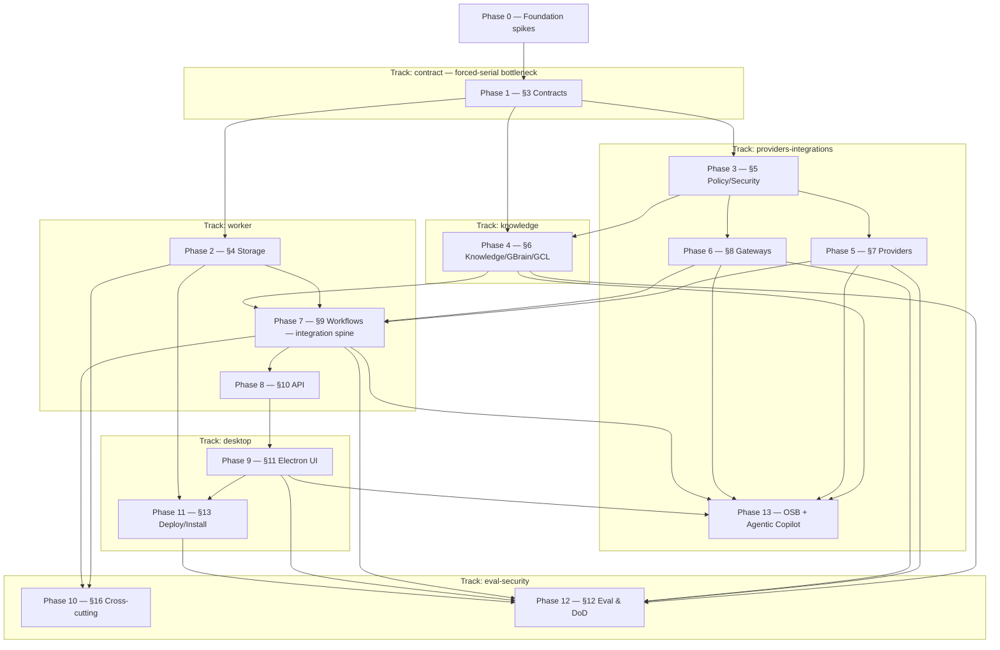

# IMPLEMENTATION_PLAN.md — System of Work Assistant

> **Phase note.** Spec-anchored build plan decomposed from the binding `ARCHITECTURE.md` (production-grade). 14 phases (0–13), ~164 first-class tasks (counted as `### N.M` headings) across 6 parallel tracks (Phase 13 = Obsidian-Second-Brain inheritance **+ the Agentic Copilot arc** — §13.10 skill catalog + §13.11 Phase-C/§9.6-real machinery, promoted from Log-only 2026-07-06); the §3 contracts phase (Phase 1) is the forced-serial bottleneck and the §9 workflows phase (Phase 7) is the integration spine. Locked decisions live in `docs/planning/DECISIONS.md`; every phase anchors to `ARCHITECTURE.md §` sections — drift surfaces at TDD Step 9. Living sections (Currently-in-progress, Carry-forward, Log, Trims, Decisions-tabled) accrete through real `/tdd` work; the Parallelization plan is authored here.

> **Reading discipline.** Read by section, not whole. Living sections are bounded/pruned at `/orchestrate-end`.

> **Session protocol:**
> - **Session start** — orchestrator `/orchestrate-start`; implementer `/session-start`. Confirm the session target.
> - **Session end** — implementer `/session-end` (TDD + cross-doc audit + Step-9 list + `/preflight`); orchestrator `/orchestrate-end` (reconcile checkboxes, Log, Decisions, Carry-forward, push).

> **Spec-anchor convention.** Each phase header carries `**Spec anchors:**` (the `ARCHITECTURE.md §` it implements), a `**Track:**` tag, and a `**Depends on (phases):**` edge — the source the Parallelization plan renders from. A slice surfacing a behavior the anchors don't cover is a cross-doc invariant flag at Step 9. New mid-build tasks carry `(implements §X; origin: <slice>)` on the heading.

---

## Currently in progress

**◆ ROUND 3 2026-07-09 (team `session-f2673cd5`) — frontmatter marker-safety; the region-marker safety arc is COMPLETE.** `be229cd` task #7 extends `neutralizeRegionMarkers` to model-derived frontmatter values (a `neutralizeFrontmatterValue` dispatcher; slug neutralized, `projectId` kept raw for gate-1) — a marker-valued field can no longer form a spurious `parseSections` region / fail-closed `checkOwnership` rejection. Drains the round-2 frontmatter carry-forward finding. Adversarially reviewed SHIP, 31/31 green. NEXT (a fresh orchestrator+implementer cycle is recommended — orch 56% climbing): the higher-value Rank-2 §9.7 ingestion read-model+UiSafe-contract (advances Phase 9), or a Phase-11 deterministic core (VERIFY what's already built first — 11.3/11.5 cores were largely pre-built). Deferred-HITL ledger UNCHANGED.

**◆ ROUND 2 2026-07-09 (team `session-f2673cd5`, fresh 1M implementer) — 2 more slices, HEAD `3daa0c8`.** Phase 11.3 write-through enablement-refusal gate (`c4467ee` `decideWriteThroughEnablement` — the deterministic one-time FLIP-PRECONDITION core, dormant; DISTINCT from the runtime auto-revert `evaluateEnablementGate`; reuses the already-built `checkVersionPin`/`pinValidatedForEnablement`) + region-marker neutralization (`3daa0c8` — a shared fixpoint escape at both region composers' inner builders closes a latent boundary-forgery vector; Step-8 caught+fixed a MEDIUM ReDoS). Both adversarially reviewed SHIP, repo-wide 31/31 green. NEW carry-forward finding: `checkOwnership`-over-frontmatter marker-valued field (pre-existing, fail-closed-SAFE). 5h rate-limit 80% at round close ⇒ a fresh cycle is recommended before heavy work. Deferred-HITL ledger UNCHANGED (nothing acted on). Detail: Log 2026-07-09 Round-2 + `docs/sessions/053-…`.

**◆ SESSION 2026-07-09 (team `session-f2673cd5`, orchestrator+implementer autonomous) — gate-4 serving side CLOSED + Phase 11 OPENED + meeting create-vs-patch parity. 4 slices, all adversarially reviewed SHIP, repo-wide 31/31 green throughout.** Slice HEAD `1627ac2` (+ session doc `3126980` + this round's doc commit). **`180c748` G1e-2** — the worker-side `createServingContextLoader` behind boot's DORMANT `servingOracleFactory` seam (interim degraded oracle stays SELECTED default) ⇒ **the gate-4 WRITER→SERVING build is complete + dormant**. **`e21536c`** — the propose-path governance conformance battery (runbook §3 assertions 1–4 green; 5 = deferred real-egress `it.todo`). **`fc1960d`** — the install-doctor check-engine core ⇒ **Phase 11 OPENED** (deterministic, dormant; real probes + repair command = bucket B). **`1627ac2`** — meetingOutputs create-vs-patch (re-sync clobber closed, projectSync-W1 parity). **All remaining Copilot-propose go-live gates are HITL/owner-gated (deferred — ledger in the Log + runbook §1).** Next: Phase 11.3 pin-verify deterministic core (fresh 1M implementer cycling in; current one at 67%). Full detail: Log 2026-07-09 + `docs/sessions/052-…` + `docs/runbooks/copilot-propose-go-live.md`.

**◆ CONSOLIDATION — single track (2026-07-09).** The 6-track worktree parallelization is **retired for the endgame** — the build now runs single-operator on `main` (the integration point every track FF'd into). The `../SoW-build-evalsec` worktree is 146 commits behind `main` with **zero unmerged commits** (safe to remove); the eval-security track's remaining territory (the propose-path governance eval in `packages/evals`) is done **here**, not on a separate worktree. **The remaining §13.10a Copilot semantic-write go-live arc is finished on this track:** the write-bridge is WIRED END-TO-END + DORMANT (session 051, HEAD `ed34092` — a trusted answer → `copilot.propose_knowledge` → pending §9.8 card → head-at-commit KnowledgeWriter commit). **Hardening residuals — ALL 3 DONE (2026-07-09), each adversarially reviewed SHIP (general-purpose Agent, no crit/high/med), repo-wide green:** WS-8 path-within-workspace **containment** in the executor — every create/patch target must sit directly inside `projects/<workspaceId>/` (derived from the `projectNotePath` authority), the sole per-workspace containment on the dispatch side since the vault join only blocks whole-vault escape (`82adaa2`) · **approvalId folded into the semantic commit audit trail** — the `commit` dep is now a per-approval factory so the authorizing §9.8 approval threads into `sourceEventRef` → AuditRecord + CommittedRevision (`ef88820`) · **approve→dispatch reconciler** — `reconcileApprovedSemanticMutations` re-drives the idempotent semantic dispatch for every approved-but-uncommitted card (recovers a crash between the approval CAS and the commit), wired **fire-and-forget** at boot so recovery never gates serving (`2cc5d41`). What remains to flip it live: **(1) gate 4** — the real `admitForServing`-backed serving oracle (worker, `apps/worker/src/api/procedures/copilotProvenanceStamp.ts`; replaces `createInterimDegradedServingOracle`; 5 named preconditions in that file's header; security-review-gated) — the single gate that lets `deriveCopilotContentTrust` ever return `trusted`; **(2)** the propose-path **governance eval** (`packages/evals`). Then the flag stays OFF until real vendor I/O (a running `gbrain serve --http` + KnowledgeWriter-authored corpora to stamp). **Full remaining-project picture:** the Deliverable map below + `docs/runbooks/copilot-propose-go-live.md` (the authoritative go-live gate list) + memory `sow-kmp-bridge-finish`.

**Phase 0 — COMPLETE (2026-06-29).** All 6 de-risk spikes (0.1–0.6) run + recorded in `docs/spikes/`; none triggered a no-go. Driven single-operator via two parallel Workflows (6-agent spike fan-out + a 2-agent 0.4 empirical re-run with adversarial verify), not a team. Decision artifacts + `config/{gbrain.pin,providers.defaults.json}` landed. Close-out session doc: `docs/sessions/001-2026-06-29-phase-0-spikes.md`.

**GBrain write-through amendment — DONE (2026-06-29).** Owner approved shipping GBrain **write-through in V1**, fail-closed (reversing the 0.2 read-only deferral). `ARCHITECTURE.md` (§6/§12/§13/§16/Appendix A/§2.5/Spec-Anchor) + this plan (Phase-4 4.6/4.7/4.9 amended + **4.14–4.20 new**; Phase-12 12.7 amended + **12.22/12.23 new**; 11.3/11.5 amended) amended from the design spec `docs/design/gbrain-write-through-divergence.md`. gbrain **0.35.1.0** installed locally for Phase-4. The **9 new + 2 amended contract models** must be frozen in Phase 1.

**Phase 1 — COMPLETE (2026-06-30).** Shared Contracts & Domain — the forced-serial bottleneck — done; the parallel tracks may now fork. **All tasks 1.1–1.15 green.** (1.1 monorepo + primitives `6f00419`; 1.2–1.9 + the full **27-model Appendix-A freeze** `8a42f13`/`512d731`/`4bdedf6`/`bbd2007`, Zod-as-source = `.strict()` Zod → `z.infer` type → generated strict JSON Schema → spec(§)-tagged frozen field-set snapshot, ajv-strict registry covers all; **1.10** key builders + **1.11** the 5 universal validators + REQ-F-017 no-inference `e373cdd`; **1.12/1.13** the 6 pure state machines over `defineMachine` `d143480`; **1.14** the new `@sow/db` Drizzle schema source + pure repo interfaces + column-parity drift-guard `5e713aa`/`9abedc8`; **1.15** shared seam fixtures + barrel wiring `a039e86`.) **Full Phase-1 gate green: 45 test files / 728 tests; `pnpm typecheck` clean across @sow/contracts + @sow/domain + @sow/db; `pnpm audit --prod` clean (drizzle-orm bumped to ^0.45.2).** Built via two single-operator **Workflow fan-outs** (contract freeze, then the domain layer) with adversarial consistency-critic + verify each; driftless apart from the reconciled items below. Authoring locked as **ADR-008 (Zod-as-source)**; db single-dialect-source as **ADR-009**. Phase-0 fold-forward (WebSocket §10 / Hermes §7 / perf §18) ratified. **Open Phase-1 FINDING (carried to §5/§7/§9):** the ajv `validate()` gate is structural-only — the candidate-data gate (safety rule 2) MUST compose ajv + the model's Zod parse + the §3 universal rules; no consumer may treat `validate()` as the whole gate. **`/phase-exit 1`: CLEAR** (certified checklist + verdict above the Phase-2 header).

**Phase 2 — COMPLETE (2026-06-30).** Operational Storage (`@sow/db`) built + certified. All 2.1–2.10 + acceptance (2) green: sqlite-core + pg-core schema (identical column sets), SQLite (better-sqlite3) + Postgres (PGLite = in-process real PG16; `pg` for prod) adapters both passing ONE repository contract suite (REQ-D-003), operational-truth invariants (append-only/immutable/exactly-once CAS/rebuildable), dialect-aware migration lifecycle (backup→fail→restore→typed repair), version-compat refusal, degraded-mode + HealthItem, backup/restore + FileVault posture. **985 tests + 2 gated Docker-pg todos; typecheck clean; `pnpm audit --prod` clean.** Two Workflow fan-outs (impl, then a parity repair adding the pg migration/backup engine + dual-dialect lifecycle tests + reconciling approval-CAS to ok-on-replay). Owner chose **PGLite + optional Docker-pg gate** (`SOW_PG_DOCKER=1`); **ADR-009 now COMPLETED**; storage ports went async for PGLite. **`/phase-exit 2`: CLEAR.** Handoff: `docs/sessions/004-2026-06-30-phase2-operational-storage.md`.

**Phase 3 — COMPLETE (2026-07-01).** Policy, Security & Egress (`@sow/policy`) built + certified. All 3.1–3.7 + acceptance (3): typed **PolicyDecision** core + the four §5 **hard denials** (EMPLOYER_RAW_EGRESS_UNACKNOWLEDGED egress veto · DIRECT_CROSS_WORKSPACE_RAW_RETRIEVAL · ING-7 UNTRUSTED_CONTENT_MUTATING_TOOL admission · WRITE_ADAPTER_OUTSIDE_GATEWAY), deterministic allowlist-bound provider-matrix resolution, fail-closed approval predicate (auto-allow private-personal `calendar` only), and the pure renderer↔worker **session-auth** primitive (per-launch mint · constant-time verify · Origin/Host allowlist). All decisions PURE, fail-closed, audit-emitting (clock-free AuditSignal), redaction-safe. **173 tests; typecheck clean; `pnpm audit --prod` clean; repo-wide 1158 tests green.** Built via ONE Workflow fan-out (foundation → wave1 → wave2 → synthesis → **6-lens adversarial verify**). The verify pass found **5 real findings — 1 CRITICAL** (an `extractHost` userinfo-before-path confusion that let `http://evil.com/@127.0.0.1` spoof loopback → **Employer-Work egress veto bypass**) + 4 MED — **all fixed with regression tests** encoding each bypass (`test/adversarial-regressions.test.ts`); commit `bc18914`. The **candidate-data gate composition FINDING is DISCHARGED for §5**: `admitCandidateJob` composes ajv `validate()` + `AgentJobSchema.parse` (the `.refine` layer ajv drops) + the ING-7 predicate, with a biconditional test (LESSONS §3). **OWNER-APPROVED DEFERMENT (2026-07-01):** task 3.7 `apps/worker`+`apps/desktop` session-auth wiring → **Phase 7/9** (those app shells are unscaffolded); only the pure primitive ships now. **`/phase-exit 3`: CLEAR** (both reviewer sub-agents CLEAR — `docs/audits/phase3-{arch-drift,security}.md`). Handoff: `docs/sessions/005-2026-07-01-phase3-policy-security-egress.md`. **Phases 1–3 CERTIFIED — fork Phase 4/5/6 concurrently (all gate on 1+3, now satisfied; no edges between them; run 2-at-a-time for rate-limit headroom).**

**Phases 4 + 5 — BUILT + verified, NOT yet formally certified (2026-07-01).** Both forked as concurrent Workflows against the frozen `@sow/policy`. **Phase 5 (§7 broker, `@sow/providers`, commit `ac9f9b8`)** — two ports + fixed-order gate pipeline (admission→resolve→egress-veto→health→budget→schema→normalize→emit-candidate) + transport-mocked adapters + conformance harness (`packages/evals`) + `ConformanceResult` contract. 232 tests. Adversarial verify found **2 findings (HIGH+MED, same root cause: the veto/budget bound the matrix route but adapters executed `job.providerRoute`) — FIXED + regression-tested** (the vetted route is threaded as the effective job route). **Phase 4 (§6 knowledge, `@sow/knowledge`, commit `aecb8f1`)** — KnowledgeWriter sole-writer + human-section preservation + secret scan + fs-watch reconcile + GBrain read-adapter/parity + GCL Visibility Gate + the **write-through/divergence layer (7 invariants)**. 341 tests. Adversarial verify: the safety-critical **serving/quarantine lens is CLEAR** (bytes-from-Markdown, forged-stamp rejection, quarantine-non-resurrection hold); **4 open findings (3 MED + 1 LOW) — NOT yet fixed** (see Carry-forward). **Repo-wide 1781 tests green; typecheck clean; committed + pushed.** Handoff: `docs/sessions/006-2026-07-01-phase4-5-knowledge-broker.md`.

**UPDATE (2026-07-01, same session):** the **4 Phase-4 findings are ALL FIXED + regression-tested** (commit `84c3c7e`; repo-wide **1790** green) — incl. finding #3 as a frozen-contract change (the `GclProjection` raw-content gate is now key-name-independent; Appendix A + cross-doc table updated, snapshot unchanged) and #4 secure-by-default gates. **`/phase-exit 4`: CLEAR + `/phase-exit 5`: CLEAR** — all 4 reviewer sub-agents CLEAR (`docs/audits/phase{4,5}-{arch-drift,security}.md`); Phase-4 security's 1 medium auditability finding (literal NUL separators) FIXED (`944c76f`). **PHASES 0–5 now CERTIFIED.** **Phase 6 (§8 Connector & Tool Gateways) is the next session's work** (owner will run it fresh) — critical path 3→6→7.

### `/phase-exit 4` — materialized checklist (2026-07-01)
- [x] All 4.1–4.20 tasks built; the 4 adversarial-verify findings FIXED + regression-tested (`84c3c7e`).
- [x] `/preflight` — `@sow/knowledge` 346 tests + repo-wide 1790 green; typecheck clean; audit clean.
- [x] Cross-doc invariants — the `GclProjection` refine tightening is recorded (Appendix A + `contracts/CLAUDE.md`); generated schema + field-set snapshot UNCHANGED (refines aren't emitted; snapshot test green).
- [x] Spec coverage — every module `spec(§6)`-tagged; the write-through 7 invariants + the 4 fixes pinned by tests.
- [x] Adversarial verify — serving/quarantine lens CLEAR at build; 4 findings fixed.
- [x] Reachability — judgment-waived (no production consumer of `@sow/knowledge` until §9 workflows/Phase 7).
- [x] Arch-drift + security reviewer sub-agents — **both CLEAR** (`docs/audits/phase4-{arch-drift,security}.md`). Arch-drift: 13 anchors, **0 DRIFT / 0 STALE-DOC / 0 AMBIGUOUS** (the write-through 7 invariants + all 4 fixes confirmed). Security: safety rules 1/2/4/7 all PASS, all 4 fixes independently re-derived as closed, no new critical/high; **1 medium auditability finding (literal NUL separators → binary files) FIXED** (`944c76f`).
- **Verdict: CLEAR** (2026-07-01).

### `/phase-exit 5` — materialized checklist (2026-07-01)
- [x] All 5.1–5.10 tasks built; the 2 adversarial-verify findings FIXED + regression-tested (`ac9f9b8`).
- [x] `/preflight` — `@sow/providers` 232 tests + repo-wide 1790 green; typecheck clean; audit clean.
- [x] Cross-doc invariants — new `ConformanceResult` contract (Zod-as-source, snapshot frozen); no frozen-model field change.
- [x] Spec coverage — every module `spec(§7)`-tagged; the ordered gate pipeline + strict side-effect rule + the veto-binds-execution fix pinned by tests.
- [x] Adversarial verify — budget-candidate-gate lens CLEAR; the 2 route-binding findings fixed.
- [x] Reachability — judgment-waived (no production consumer until §9 workflows/Phase 7); real provider conformance is the key-gated eval path.
- [x] Arch-drift + security reviewer sub-agents — **both CLEAR** (`docs/audits/phase5-{arch-drift,security}.md`). Arch-drift: 5 anchors / 15 statements, **0 DRIFT / 1 STALE-DOC** (`FailureClass` missing `provider_routing_unavailable` — named-constant arch_gap, carry-forward) **/ 1 AMBIGUOUS** (broker-vs-§9 budget-breach health-item attachment). Security: strict-side-effect + rule 5/6/7 + COST-1/2 all PASS, both route-binding fixes re-derived as closed, no new critical/high (2 low → carry-forward). *(Phase-5 security run 1 hit a transient API error; the retry landed CLEAR.)*
- **Verdict: CLEAR** (2026-07-01).

**Phase 6 — COMPLETE + CERTIFIED (2026-07-01).** Connector & Tool Gateways (`@sow/integrations`) built via a single-operator Workflow fan-out (foundation → invariant cores 6.2/6.1 → adapters+outbox 6.4/6.3/6.5 → NotebookPort 6.6 → synthesis → 3-lens adversarial verify). Connector Gateway (cursors/backoff/health/no-silent-drop) + Tool Gateway (the external-write envelope: candidate-gate → approval-before-dispatch → mandatory pre-write existence check → **atomic reserve** → create → receipt+audit; conflict/unreachable typed; the ONLY external-write path) + 9 read + 7 write adapters + SourceEnvelope register + write outbox (hold-through-outage + replay-safe drain) + NotebookPort (Drive-backed 00–04 upsert). **The adversarial-verify pass found 3 real findings (1 HIGH + 2 MED) — all FIXED + regression-tested:** (1) HIGH — `dispatchExternalWrite` was check-then-create with no atomic reservation, so two interleaved dispatches on the same object each fired `adapter.create` (duplicate external write under a second scheduler, §2.5); fixed by a `ReceiptStore.reserve`/`release` object-identity claim between the existence check and create (only the reservation winner creates); (2) MED — gateway redaction missed Google `AIza…` keys + URL/query-param secrets (+ AWS/GCS SigV4 `X-Amz-*` from the security review's L-1); broadened; (3) MED — the hold-through-outage path had no production caller; `notebooklm.sync` now enqueues a held Drive write via `holdWrite`. **Package 150 tests; repo-wide 1941 green + 2 todo; typecheck clean (8/8); `pnpm audit --prod` clean.** **`/phase-exit 6`: CLEAR** (both reviewer sub-agents CLEAR — `docs/audits/phase6-{arch-drift,security}.md`). **PHASES 0–6 CERTIFIED — Phase 7 (§9 Temporal Workflows, the integration spine) is next (critical path 3→6→7).**

### `/phase-exit 6` — materialized checklist (2026-07-01)
- [x] All 6.1–6.6 tasks + acceptance built; the 3 adversarial-verify findings FIXED + regression-tested.
- [x] `/preflight` — `@sow/integrations` 150 tests + repo-wide 1941 green + 2 todo; typecheck clean (8/8 packages); `pnpm audit --prod` clean; lint = `tsc` placeholder; `format:check` waived (no prettier).
- [x] `spec-lint tests 6` PASS — §8/§3/§5/§9/§16/§20.1 covered (§20.1 tagged on `tool-gateway-race.test.ts`); §15 waived (direct NotebookLM API out of scope, Drive-backed only).
- [x] Cross-doc invariants — no frozen-model field change (the `ReceiptStore` reserve/release is a gateway-owned port, not a frozen contract; `NotebookSyncResult.heldForRetry` is package-local). `contracts/CLAUDE.md` ExternalWriteEnvelope note tightened to name `approvalId?` (Appendix A already had it).
- [x] Adversarial verify — 3-lens skeptic pass; the no-duplicate-write HIGH + 2 MED all fixed; each pinned by a regression test (`tool-gateway-race`, `gateway-redaction-credentials`, `notebook-sync` hold-through-outage).
- [x] Reachability — judgment-waived (no production consumer of `@sow/integrations` until §9 workflows/Phase 7 wire the gateways; the barrel exports the seam for that wiring).
- [x] Arch-drift + security reviewer sub-agents — **both CLEAR** (`docs/audits/phase6-{arch-drift,security}.md`). Arch-drift: 9 anchors, **0 DRIFT / 2 STALE-DOC / 1 AMBIGUOUS** (STALE-DOC: Appendix-A already carries `approvalId?` + `GatewayHealthSignal.severity` open string; AMBIGUOUS: per-target `canonicalObjectKey` identity — both carry-forward). Security: safety rules 3/7 + no-silent-drop + hold-through-outage PASS, all 3 fixes re-derived closed, no new critical/high; **1 LOW (AWS SigV4 signed-URL params) FIXED this round**.
- **Verdict: CLEAR** (2026-07-01).

**Phase 7 — COMPLETE + CERTIFIED (2026-07-02).** §9 Temporal Workflows & Automation — the integration spine (`@sow/workflows` + `@sow/worker`, + a Phase-2 `@sow/db` ApprovalRepository amendment). Built as a SEQUENCE of Workflow fan-outs (foundation → proof spine → workflows A → workflows B), each a PURE, replay-safe orchestration driver over the @sow/domain state machines + injected activity ports (sandbox-safe: no @temporalio/node:crypto/Date.now in drivers; activities wire the real adapters; live-Temporal tests gated behind `SOW_TEMPORAL`). Durability foundation (7.1–7.5: LIFE-1 fenced single-active lease · LIFE-2 collapsed catch-up · LIFE-3 resume + §8 envelope reuse · LIFE-5 clock-jump-safe · WorkflowRun registry/idempotency · OBS-2 System Health surfacing) + all 13 workflows (7.6 meeting-closeout proof spine, 7.7 source ingestion, 7.8 inbox triage, 7.9 approval flow, 7.10 daily brief, 7.11 weekly/monthly, 7.12 cross-calendar, 7.13 project sync, 7.14 deletion saga, 7.15 connector sync/health, 7.16 NotebookLM sync, 7.17 Copilot Q&A read-path, 7.18 Hermes gateway-routing). **The adversarial-verify passes earned their keep at EVERY wave — a CRITICAL + multiple HIGH, all FIXED + regression-tested + re-verified CLEAR:** foundation 9 (incl. a CRITICAL LIFE-5 monotonic-across-restart + HIGH lease-fencing / resume-idempotency-key / idempotency-race); 7.6 CRITICAL (the no-inference gate validated the extraction but committed a caller-supplied plan — fixed by DERIVING outputs from validated data) + HIGH workspace-binding; 7.7–7.12 2 HIGH + 1 MED (approval exactly-once via surfacing the @sow/db CAS apply-vs-noop kind; cross-calendar leakage-guard-on-a-decoy-field → guard the dispatched payload); 7.13–7.18 1 HIGH (deletion-saga content-blind idempotency keys — fixed over two cycles to fold each deleted region's LIVE-content hash). **`/phase-exit 7`: CLEAR** (both reviewer sub-agents CLEAR — `docs/audits/phase7-{arch-drift,security}.md`). **PHASES 0–7 CERTIFIED — the integration spine is done; Phase 8 (§10 Local App API, worker track) ∥ Phase 10 (cross-cutting, eval-security) now reopen.**

### `/phase-exit 7` — materialized checklist (2026-07-02)
- [x] All 7.1–7.18 tasks + acceptance built; every wave's adversarial-verify findings FIXED + regression-tested + re-verified CLEAR.
- [x] `/preflight` — `@sow/workflows` 438 + `@sow/worker` 13 (1 `SOW_TEMPORAL`-gated skip) + `@sow/db` 275 (both dialects); repo-wide 2392 green + 2 todo; typecheck clean (10/10); `pnpm audit --prod` clean (a NEW moderate `protobufjs` advisory from the Temporal deps FIXED via a `pnpm-workspace.yaml` override to `^7.6.3`); lint = `tsc` placeholder; `format:check` waived (no prettier).
- [x] `spec-lint tests 7` PASS — §9/§16/§6/§8/§7/§5/§4 covered; §2.5 waived (architectural DAG / import-direction — structural, not a §9 unit test).
- [x] Cross-doc invariants — no FROZEN @sow/contracts field change. The Phase-2 `@sow/db` `ApprovalRepository.applyTransition` return was widened to `ApprovalTransitionOutcome { approval, applied }` (a @sow/db-internal repo contract — both dialect adapters + the Phase-2 contract tests updated + re-run green; NOT a frozen Appendix-A seam). WorkflowRun trigger/state taxonomies are @sow/workflows-local (the frozen WorkflowRunRef field-set is unchanged + snapshot-pinned).
- [x] Adversarial verify — per-wave 3-lens skeptic passes + an independent re-verify on every fix; all CLEAR.
- [x] Reachability — judgment-WAIVED: `@sow/workflows` drivers/activities have no production Temporal entrypoint yet (the thin @temporalio workflow wrappers + real-adapter worker wiring are the deferred worker-wiring wave); the drivers are consumed by their tests + the barrel. Re-run when the worker wiring lands.
- [x] Arch-drift + security reviewer sub-agents — **both CLEAR** (`docs/audits/phase7-{arch-drift,security}.md`). Arch-drift: 9 anchors, **0 DRIFT / 2 STALE-DOC (doc-annotation notes) / 0 AMBIGUOUS**; all LIFE invariants + all 18 tasks + every fix confirmed in code. Security: **0 critical/high/medium**, 7/7 invariant passes PASS, all fixed findings independently re-derived closed, 2 LOW (heuristic leakage-allowlist + redact error `cause` in the log sink) → Phase-10 carry-forward.
- **Verdict: CLEAR** (2026-07-02).

**WORKER-WIRING wave (proof spine) — DONE (2026-07-02).** The deferred Phase-7 worker-wiring, scoped to a **proof spine** after a finding: only **3 of 13 drivers are fully wireable today** (meeting-closeout, approval-flow, ingestion-triage); the other 10 depend on **40 fake-only ports** that belong to their natural phases (agent-runners/synthesizers → eval/Phase 12; read-model/dashboard/notify → Phase 8/9; deterministic remainder → follow-on). Owner-confirmed proof-spine scope (see memory `worker-wiring-scope`). **Delivered:** WW-1 (`d755c7b`) DB cross-process no-dup-write — `write_receipts.reserve` (safety rule 3) + `workflowRunRefs.idempotencyKey` UNIQUE closing `resolveRun`'s race, dual-dialect; WW-2/3 (`11d7e6b`) the real `meetingOutputsProjection` + the `apps/worker` composition root (real KnowledgeWriter/Broker/Tool-Gateway/policy/db, deterministic vendor stubs at marked injection points) + thin `@temporalio/workflow` wrappers + `Worker.create` wired into `bootstrapWorker` + a `SOW_TEMPORAL`-gated integration test. **Adversarial verify earned its keep again — 2 HIGH, both fixed + regression-pinned + re-verified:** WW-1 a non-injective reserve placeholder key (→ nullable placeholder); WW-2/3 a path-traversal via the model-controlled meeting title raw-interpolated into `note.path` escaping the workspace vault (→ title slug + `createFsVault` containment guard, defense-in-depth). **Gates: repo-wide 2447 pass / 5 gated skip / 2 todo; typecheck 10/10; `pnpm audit --prod` clean; `SOW_TEMPORAL=1` live 4/4** (happy-path commit + idempotency + approval exactly-once + triage replay). Phase-7 reachability waiver **partially discharged** (the 3 wired drivers now have a live production Temporal entrypoint; the 10 deferred remain unreachable-by-design). Handoff: `docs/sessions/009-2026-07-02-worker-wiring-proof-spine.md`. **Phase 8 (§10) ∥ Phase 10 (cross-cutting) now the active fork.**

### Worker-wiring phase-exit — materialized checklist (2026-07-02)
- [x] Proof spine built + adversarially verified (WW-1 3-lens, WW-2/3 3-lens); both HIGHs fixed + regression-pinned + re-verified.
- [x] `/preflight` — repo-wide **2448 pass / 5 gated skip / 2 todo**; typecheck **10/10**; `pnpm audit --prod` clean; **`SOW_TEMPORAL=1` live 4/4**.
- [x] Reachability — **Phase-7 waiver DISCHARGED** (`docs/audits/worker-wiring-reachability.md`): production entrypoint traced (`bootstrapWorker → onConnected → Worker.create → 3 wrappers → drivers`); **3/3 wired drivers + 15 activity factories reachable**; the 10 deferred drivers + their fake-only ports explicitly phase-attributed (no silent cap); `SOW_TEMPORAL` 4/4.
- [x] Arch-drift auditor — **CLEAR** (`docs/audits/worker-wiring-arch-drift.md`): 5 anchors (§8/§4/§6/§9/§16), **0 DRIFT**; 1 STALE-DOC (`write_receipts` absent from the `OperationalDomain` rebuild-guard union) **FIXED** (`c06975d` — classified `operational_truth` + test); 1 NOTE (in-sandbox WorkflowRunRef stub — exactly-once delivered by the activity layer; carry-forward).
- [x] Security auditor — **CLEAR** (`docs/audits/worker-wiring-security.md`): **0 new critical/high**; both prior HIGHs (WW-1 injective key, WW-2/3 path traversal) independently re-derived as closed; no other model-controlled value escapes into a path; approval fail-closed; KnowledgeWriter real gates intact; stub transports don't reach durable-write gates + are `SOW_TEMPORAL`/injection-marker gated. Findings NOTE/STALE-DOC (tracked carry-forwards) only.
- **Verdict: CLEAR** (2026-07-02). Proof spine certified; the 3 wired §9 drivers run live on real Temporal.

**Phase 8 (§10 Local App API) + Phase 10 (§16 cross-cutting) — COMPLETE + CERTIFIED (2026-07-02).** Forked as concurrent Workflows (worker ∥ eval-security) via the *freeze-then-fork* pattern: Wave 0 froze the one net-new cross-fork contract (`FailureVariant`) + `LogRecord`/markers + the tRPC event/UI-safe surface + config-schema (`a2f09f7`); then Round 1 (8A `745573f` ∥ 10A `9fd682a`) + Round 2 (8B `cd3a5da` ∥ 10B `2a54480`), each round 2 concurrent Workflows. **Phase 8:** the loopback tRPC + single WS push-stream API — per-launch session-token + Origin/Host auth interceptor (constant-time, anti-DNS-rebind, loopback-only), UI-safe projection field-allowlist boundary (WS-8/§10), read-model queries + System-Health + egress-status, approve/edit/reject/defer commands (exactly-once cross-channel via `decideApprovalCas`), `tracked()`/`lastEventId` stream with fail-closed over-horizon resync, §12 auth/leakage suites + the <2s dashboard benchmark; the Lesson-4 URL-authority isolator **converged to a single vetted `@sow/policy` source**. **Phase 10:** the non-bypassable redaction+logger, `routeFailure` nothing-fails-silently taxonomy, the 3 persistent operational-truth tables (`health_items`/`schedule_bookkeeping`/`instance_leases`, landing the Phase-7 in-memory port fakes), the System-Health surface (dedupe/lifecycle/auto-resolve/persistent), worker supervision (crash-loop→worker_down, LIFE-1 re-acquire, LIFE-3+§8 recovery = no dup write), Temporal-unavailable + Keychain-locked degraded modes, operational-truth backup/restore + vault doctor, config secret-shape guard + LIFE-5 last-run, and the cross-cutting conformance suites. **Adversarial verify earned its keep — the redaction target was REFUTED (a real HIGH: short single-line raw Employer-Work content / opaque secrets passed a length-heuristic, then a purely-syntactic token gate) and fixed at root over two iterations + a surgical id-suffix fix to CLEAR; the stream over-horizon MEDIUM (resync logic bypassed by the wire path) + the degraded-drain MEDIUM (throw/lose held jobs) both fixed + re-verified.** **Gates: repo-wide 2973 pass / 5 gated skip / 2 todo; typecheck 10/10; `pnpm audit --prod` clean.** **`/phase-exit 8`: CLEAR + `/phase-exit 10`: CLEAR** (all 6 auditors CLEAR — `docs/audits/phase{8,10}-{arch-drift,security,reachability}.md`). Handoff: `docs/sessions/010-2026-07-02-phase8-phase10-local-api-crosscutting.md`. **PHASES 0–8 + 10 CERTIFIED.** **The Phase-8/10 APP-SHELL WIRING wave is ✅ DONE (2026-07-02, `d44f5d8`) — the §10 API runs live on a real loopback HTTP+WS transport behind auth (SOW_API=1 7/7) + the persistent §16 stores are swapped into the composition; the reachability waiver is DISCHARGED for the mounted paths.** Next: **Phase 9 (Electron Desktop UI, desktop track)** — the nine UI surfaces over the now-live §10 API + the Electron-main supervisor spawn + the session-token mint/inject + the renderer WS handshake.

### `/phase-exit 8` — materialized checklist (2026-07-02)
- [x] All 8.1–8.8 tasks + acceptance built; the two adversarial-verify findings (stream over-horizon MEDIUM, egressStatus LOW) FIXED + re-verified.
- [x] `/preflight` — repo-wide **2973 pass / 5 gated skip / 2 todo**; typecheck **10/10**; `pnpm audit --prod` clean.
- [x] Cross-doc invariants — no FROZEN Appendix-A field change. New INTERNAL contracts (`api/events` StreamEvent + `api/ui-safe` UI_SAFE_ALLOWLIST) are @sow/contracts-owned, non-seam (no snapshot ceremony). The @sow/policy `extractAuthority`/`isLoopbackHost` are new PUBLIC exports (the converged single-source URL-authority isolator).
- [x] Adversarial verify — auth HOLDS; UI-safe leakage HOLDS (independently re-derived by the phase-exit security auditor).
- [x] Reachability — **CLEAR** (`docs/audits/phase8-reachability.md`): 0 genuinely dead exports; the API mount surface (`createApiServer`/`createPushStream`/routers/interceptor) is UNREACHABLE-BY-DESIGN/deferred to the app-shell wiring wave (Phase 9 loopback mount + renderer), the SAME waiver Phase 7 used; the contract-layer `api/ui-safe`+`api/events` are production-reachable via the stream publisher.
- [x] Arch-drift + security + reachability auditors — **all CLEAR** (`docs/audits/phase8-{arch-drift,security,reachability}.md`). Arch-drift: 5 anchors, **0 DRIFT / 0 STALE-DOC / 0 AMBIGUOUS**. Security: 0 new critical/high/med; both prior HOLDS re-derived; the URL-authority convergence preserves behavior byte-for-byte.
- **Verdict: CLEAR** (2026-07-02).

### `/phase-exit 10` — materialized checklist (2026-07-02)
- [x] All 10.1–10.8 tasks + acceptance built; the redaction HIGH (2 iterations + a surgical id-suffix fix) + the degraded-drain MEDIUM FIXED + independently re-verified CLEAR.
- [x] `/preflight` — repo-wide **2973 pass / 5 gated skip / 2 todo**; typecheck **10/10**; `pnpm audit --prod` clean. `@sow/db` repository-contract suite 136/136 on BOTH dialects (the 3 new operational-truth tables).
- [x] Cross-doc invariants — no FROZEN Appendix-A field change. New INTERNAL contracts (`FailureVariant`, `LogRecord`+markers, `config-schema`) are non-seam @sow/contracts. The 3 new `@sow/db` tables are classified `operational_truth` in the rebuild-guard union + tested.
- [x] Adversarial verify — redaction REFUTED→FIXED→HOLDS (per-field frozen-enum/id/number/ISO validation, no shape pass-path; `providerId` enum-validated before the id rule); recovery/degraded HOLDS (no-dup-write via the durable reserve + CAS).
- [x] Reachability — **CLEAR** (`docs/audits/phase10-reachability.md`): ~44 symbols production-reachable (the domain redaction API via the worker logger + providers boundary; `routeFailure` via both degraded controllers; the 3 new `@sow/db` repos on the repo bundles; backup domains + supervision backoff via production orchestrators); the top-level mount factories (`createLogger`/`createHealthSurface`/supervision/backup entry) UNREACHABLE-BY-DESIGN/deferred to the app-shell wiring wave (Phase 9/11 boot), per the waiver.
- [x] Arch-drift + security + reachability auditors — **all CLEAR** (`docs/audits/phase10-{arch-drift,security,reachability}.md`). Arch-drift: 9 anchors, **0 DRIFT / 2 STALE-DOC (doc-annotation gaps: §16 prose failure-class list omits `worker_down` [Appendix A authoritative]; §16 backup names QuarantineLedger/ParityReports that live in @sow/knowledge Phase-4 territory) / 0 AMBIGUOUS**. Security: redaction independently re-derived HOLDS across all 4 vectors incl. the `providerId` fix; createLogger is the single non-bypassable chokepoint; **2 LOW → carry-forward** (the lease-fencing token minted-but-unthreaded [no-dup-write already guaranteed by the §8 reserve+CAS]; the documented accepted redaction residual — a secret caller-mislabeled under a genuine system-generated id field).
- **Verdict: CLEAR** (2026-07-02).

---

**Phase 9 — IN PROGRESS (2026-07-03): security foundation + the LIVE-WORKER TRANSPORT SEAM done; surface data-wiring + 9.5–9.14 + packaging remain.** Session 012 locked the UI/UX design (macOS Liquid Glass; `docs/design/ui-ux/`) + built 9.1–9.3 (hardened shell + narrow preload bridge + snapshot drift-guard · per-launch session-token mint/inject + authed client · event-stream client + UI-safe store) + a running Today over a dev seed (9.4a). **Session 013 replaced the seed with a REAL spawned worker:** the app runs `@sow/worker` as a supervised `child_process.fork` child (SYSTEM node, `--conditions=sow-built`), the renderer subscribes live over tRPC-WS, and the locked Today renders with a green **Live** pill (owner-confirmed). **12 commits `d7c81af`…`135bd58`:** worker §5 independent Origin+Host allowlisting (dropped the same-origin `Origin==Host` cross-check; security-reviewer 0 findings) · strict single-origin CORS (real-socket proven) · `app://` privileged scheme + traversal-safe resolver · optional `proofSpineParams` → Temporal-degraded first-render boot · **the `@sow` BUILD SYSTEM (D2/D3, `a2e3109`): 9 packages build structure-preserving to `dist` + a `sow-built` export condition + a child-only ESM resolve-loader** (so the bundler-authored source-TS packages run as built JS in the child WITHOUT breaking `@sow/contracts`' `import.meta.url` schema loading — bundling was proven to break it) · supervisor spawn + `worker:getConnection` preload channel · renderer live transport + hydrate · persistence under userData + turbo-cached `build:sow`. **Gate: worker 316/17-skip + desktop 66 + contracts 587; all typecheck clean; tree clean; LOCAL-only (no remote).** **HONEST BOUNDARY — transport seam only:** just 3 Today sections are store-driven (connection pill · Waiting-on-you · System-health, all empty over the degraded/empty read-model); Daily-brief/schedule/recent-activity/nav-counts are STATIC mockup chrome. **Session 014 discharged carry-forward (a): degraded-health surfacing** — System Health now shows "Worker down · error · Open" on the Temporal-degraded first render (was a false "All systems healthy"). Root cause: two disconnected health stores — the degraded controller's surface was in-memory while the `systemHealth` query reads the persistent `health_items` table. Fix (4 commits `41f0a93`…`9bccdd6`): `createPersistentHealthSurfaceStore` bridges the surface onto the persistent bare `HealthItemStore` (repo owns the OBS-2 dedupe/`occurrenceCount`/`lastSeen` — no `@sow/db` change), `reportInitialConnect` drives `onConnectionLost` on a degraded connect (+WARN on a persist fault), and the worker-host awaits it before announcing ready. Worker gate 316→**325**; security-review **0 findings**. **Session 015 delivered §9.4 (Global Today) end-to-end** — the WS-8 sanitized-global read path: `UiSafeGclProjection` + `query.global` UI-safe + the server-enforced `globalDrillDown` (security-reviewed clean) + the Global scope switcher on the unified Today rendering grouped GCL with a policy-gated drill affordance (6 commits `93e44a9`…`4cb75f0`; built as Global-scope-on-Today per the locked design, not a separate page). Plumbing-over-empty until ingestion. **Session 016 added §9.5 slice 1** (scope-aware reads — the switcher re-queries per scope, no blend on the pull path). **No formal `/phase-exit 9` yet** (9.1–9.3 substantially met with nuances; 9.4 DONE; 9.5 in progress; 9.6–9.14 remain). Findings + full handoffs: `docs/sessions/013-…-live-worker.md` + `014-…-degraded-health-surfacing.md` + `015-…-phase9-4-global-today.md` + `016-…-session-end-handoff.md` (session-end). **Session 017** closed the §9.5 push-path (workspace-scope ISOLATION + LIVENESS on `read_model.change`; `39132ea`/`db4b559`). **Session 018** delivered DATA-UNLOCK D1 (a dev-provisioner turns local Markdown into REAL workspace read-model data via the deterministic checkbox parser + fail-closed registry — `6ae8036`) + a Fable design fan-out for the 3 remaining targets. **Session 019** built §9.5 surfaces: ③ Recent Changes DONE + ② Project-dashboard DATA path DONE (8 slices `4246f66`…`271ff00`, all security-reviewed 0-critical/high) — **BUT ② is INCOMPLETE: the dedicated Projects PAGE the locked design §4.5 requires was wrongly interim-shipped as a Today section (a unilateral scope cut the owner rejected 2026-07-04).** **Session 021 FIXED the scope cut: the dedicated Projects PAGE + the renderer routing/AppShell foundation SHIPPED** (R1 route store `c1f585d` · R2 AppShell extraction — §9.4 scope switcher/drill-down moved VERBATIM, security-review CONFIRMED behavior-preserving · R3 dedicated Projects page `f86d2d0`, list→detail, REQ-F-011 server-percent, WS-8 empty-under-Global, route≠scope). The AppShell + `Route` model now also **unblock the 9.6–9.14 dedicated pages** (mount by adding a Route variant + a NavLink + a surface). All slices security-reviewed clean (0 critical/high). The §4.5 managed doc-pack (00–04) is a SURFACED owner deferment (blocked on a Drive connector + doc-pack read-model). **HEAD `f86d2d0` (local; round push at `/orchestrate-end`).** Repo-wide `turbo lint typecheck test` 42/42 green; desktop 111/111. Handoffs: `017-…-push-path-scope-isolation-and-liveness.md` · `018-…-data-unlock-d1-and-surfaces-design.md` · `019-…-projects-and-recent-changes-surfaces.md` (+ its ⚠️ CORRECTION) · `020-…-RESUME-dedicated-projects-page.md` (EXECUTED) · `021-…-dedicated-projects-page.md`. **Session 022** built the §4.5 managed doc pack (00–04) end-to-end (DP-1 contract `241e048` · DP-2 worker writer+slot-uniqueness `a729520` · DP-3 UI `ce62c38`; all-unlinked pre-connector, security-reviewed clean) + a **JSX-render UI test harness** (jsdom + @testing-library/react second tier, LESSONS §4; 13 render tests incl. the §9.4 switcher dismissal — proving R2's verbatim-extraction claim) `d1667c8`. **HEAD `d1667c8`** (doc-pack + harness commits LOCAL until this round's push). Repo-wide 31/31; desktop 127. **NEXT (owner "b-d"): b = 9.6 Copilot Q&A (needs a retrieval+LLM+citation backend — eval-tested), c = real recent_changes/project projectors** — both backend-heavy, scoped as focused sessions (Carry-forward). Handoff: `022-…-docpack-and-ui-test-harness.md`. **Session 025 delivered §9.6 Copilot Q&A END-TO-END (8 slices `761f312`…`08cbf6e`, 16 subagent reviews 0-crit/high):** built per the LOCKED design as the expandable RIGHT SIDEBAR (owner-confirmed via AskUserQuestion, NOT a nav page — corrected the handoff). B (page shell): B1 rail→sidebar expand/collapse chrome + B2 chat panel (iMessage bubbles · citation chips · proposal→Approvals row · read-only reminder · a new `resolveWorkspaceId` ASK-direction fail-closed gate). A (backend): A1 `UiSafeCopilotAnswer`/`UiSafeCitation` leakage-gate contract (opaque citationId, single-line-bounded blocks, chunk-smuggle caps) · A2 workspace-scoped retrieval (fail-closed `enforceRetrievalScope` + interim fixture) · A3 governed synthesis (egress veto REUSES the broker's `vetoJobEgress` + forces carriesRawContent; stub cites-not-echoes) · A4 `query.copilotAsk` + the candidate-data gate (`toUiSafeCopilotAnswer`) · A5 page wiring (`createAskCopilot`, fail-closed `{ok:false}`, live composer) · A6 governance-conformance eval (19-case leakage battery, model-prose eval DEFERRED). **The real model path (GBrain retrieval + real LLM synthesis + `guardCopilotEgress` at route selection with authoritative Workspace posture + model eval + question cap) is the pinned DEFERRED follow-up.** **HEAD `08cbf6e`** (LOCAL until this round's push). Repo-wide 31/31; desktop 149 · worker 387 · contracts 629 · evals 148. Handoff: `025-2026-07-04-copilot-qa-end-to-end.md`. **Session 027 mounted §9.8 the Approval Inbox (Mac) as a page (5 slices `770f2f0`…`eca2660`, 6 subagent reviews 0-crit/high):** the backend already existed (state machine + `approvalCommands` + `query.approvalInbox` + `UiSafeApproval`) — this added the routable `Approvals` surface (pending Approve/Reject/Defer cards + a display-only Snoozed section per the `deferred→pending|expired` machine) + `createApprovalDecision` client glue (fixed `mac` channel; re-validates every worker record via `UiSafeApprovalSchema.safeParse`) + a cold-load `hydrateApprovalInbox` fan-out + the dynamic nav badge, and fixed a real leak: `command.decideApproval` now returns a UI-safe projection (was leaking the raw `Approval`'s `actor`/`payloadHash` to the renderer). GLOBAL inbox by design (Approval has no `workspaceId` — carry-forward 129 a-3; UI-safe so cross-scope-safe). **This UNBLOCKS §9.6 Copilot's deferred propose→Approvals flow.** Follow-up: enrich `UiSafeApproval` (targetSystem + sanitized summary + workspaceId) for richer, workspace-filterable cards; the `edit` payload editor; an explicit "already resolved" message. **HEAD `eca2660`** (round push at this close-out). Repo-wide 31/31; desktop 169 · worker 391 · contracts 629 · evals 148. Handoff: `027-2026-07-04-approvals-page.md`.

## Carry-forward to upcoming briefs

- **[b: 9.6 Copilot Q&A — ✅ DONE end-to-end (session 025, 2026-07-04, `761f312`…`08cbf6e`, 8 slices).** Built per the LOCKED design as the expandable RIGHT SIDEBAR (owner-confirmed via AskUserQuestion — NOT a nav page; corrected the handoff's framing). Full path: `Copilot` composer → `App.onAskCopilot` → `live.askCopilot` → `query.copilotAsk` → retrieve (WS-8 fail-closed) → governed synthesis (egress veto reused from `vetoJobEgress`) → candidate-data gate (`UiSafeCopilotAnswer`) → cited answer turn. Contract A1 (leakage-gate seam), retrieval A2, synthesis+egress A3, procedure+gate A4, page-wiring A5, governance-conformance eval A6 (19-case leakage battery). 16 subagent reviews, 0 critical/high. **The real model path (GBrain retrieval + real LLM synthesis + `guardCopilotEgress` wired at route selection with the authoritative Workspace posture + the model-prose eval + a question-length cap) is the DEFERRED follow-up** — pinned in code (A3/A4 EGRESS NOTE) + Trims. Detail: `docs/sessions/025-2026-07-04-copilot-qa-end-to-end.md`. **UPDATE (sessions 028/030): the egress-governance + real-synthesis portions are now DELIVERED** — `guardCopilotEgress`/`decideCopilotEgress` wired at route selection + the visible Employer-Work notice (P1, `56e9731`…`27aa649`), and real Claude-subscription synthesis behind the `copilotRealModel` flag (P2.3/P2.4, `47d57cb`/`03a144a`). **STILL deferred: real GBrain retrieval (P3), the model-prose eval (P2.5 — open corpus/real-call design Qs for the owner), the authoritative per-workspace `WorkspaceConfigRepository` posture (the flag-driven consent posture is interim), and the question-length cap.**_
- **[PARTIAL — c: recent_changes INTERIM built; audit-driven + project-sync DEFERRED] (origin: 2026-07-04 owner "b-d").** Session 023 (`0dc8d4a`) built the unblocked INTERIM: the dev-provisioner writes a real workspace-scoped recent_changes row per project sync (Today's Recent activity now shows real data), + a shared `collapseToSummaryLine` normalizer (write/read gate can't drift). **UPDATE 2026-07-06 (owner picked "audit-driven" over the EventLog source): the audit-driven recent_changes DETERMINISTIC CORE is now BUILT (Arc R, `66c3bde`→`534c7ed`, dual-reviewer clean).** The `workspaceId` arch_gap is CLOSED — R1 added an optional `AuditRecord.workspaceId` (frozen-contract round), R2 the audit DB column + `AuditQuery` filter (both dialects + `0002` migration), R3 populates it at the KnowledgeWriter commit + tombstone audits, R4 is the pure WS-8-fail-closed + Lesson-§5-redacted `projectRecentChanges` projector (`apps/worker/src/api/projections/recentChanges.ts`, 13 tests). **⏳ R5 (always-on wiring, replacing the dev seed) stays Temporal-gated + DEFERRED** (audit rows are generated only inside Temporal flows). The real **project-sync projector** (Projects dashboard) is Arc P — the typed Project model, §13.5, NEXT (see memory `sow-dashboard-real-producers` + the plan). Session 023 built the earlier interim (dev-provisioner + `collapseToSummaryLine`, which R4 reuses).
- **[FOLLOW-UP — the §4.5 doc-pack LIVE path] (origin: 2026-07-04 DP-3).** The doc-pack CORE is BUILT (DP-1 contract `241e048` · DP-2 worker writer+slot-uniqueness `a729520` · DP-3 UI `ce62c38`) — all-unlinked pre-connector. The LIVE path (a Drive-backed doc-pack projector writing real link/sync state + the re-add/refresh worker action) lands with a **Drive connector**. Overlaps c.
- **[FOLLOW-UP — a11y: Projects list ARIA-APG] (origin: 2026-07-04 §9.5 R3).** The Projects `role="listbox"` lacks arrow-key roving focus — matches the existing ScopeSwitcher, so a codebase-wide a11y pass, not a regression. _(The UI test-harness follow-up is RESOLVED — session 022 `d1667c8` added the jsdom + @testing-library/react second tier; 13 render tests incl. the §9.4 switcher dismissal.)_
- **§9.5 items resolved since the session-013 PHASE-9 bullet below:** (h) STREAM-path scope-filter — **✅ DONE session 017** (`applyStreamEvent` scope-isolates `read_model.change` + `createScopeRefresher` liveness; `39132ea`/`db4b559`). (b-partial) static Today sections → live — Recent activity now wired to `query.recentChanges` (session 019); Daily brief / schedule / nav counts / egress pill still static. Real GCL data — dev-provisioner (D1, session 018) now yields real workspace-scoped read-model data.
- _(Carry-forward is over its ~7-item working-set cap — a standing multi-phase backlog condition inherited from prior rounds, not drained this correction round.)_
- **PHASE-9 carry-forward (session 013, 2026-07-03; (a) discharged session 014) — the live-worker seam is in; surface data-wiring + packaging remain:** (a) **degraded-health surfacing — ✅ DONE (session 014, 2026-07-03, `41f0a93`…`9bccdd6`).** `createPersistentHealthSurfaceStore` bridges the degraded controller's `HealthSurface` onto the persistent `health_items` table the systemHealth query reads (repo owns the 4-arg `put` dedupe/bookkeeping — no `@sow/db` change; placeholder occurrenceCount/lastSeen traced safe, security-review 0 findings); `reportInitialConnect` drives `onConnectionLost` on a degraded connect (+WARN on persist fault) and the worker-host awaits it before ready. System Health shows "Worker down" on the Temporal-degraded first render. Detail: `docs/sessions/014-2026-07-03-degraded-health-surfacing.md`. (b) **static Today sections → live** — Daily brief / Today's schedule / Recent activity / Approvals+Inbox nav counts are hard-coded `static illustrative content` in `Today.tsx` (9.4a design-fidelity port); each needs a real read-model source (schedule←Calendar, activity←audit log, brief←generator, counts←inboxes) + (for several) a worker read-model projector. (c) **§9.4 proper** — the Global Today's GclProjection sanitized grouped results + policy-gated drill-down (the sanitized-global read path exercising the GCL visibility gate) is NOT built; what ships is the transport + a `UiSafeDashboardCard` list. (d) **hydrate unverified-with-data** — `startLive` runs `query.dashboard` + `systemHealth.items` on connect (empty read-model today); verify it surfaces real cards/health + that the cross-origin HTTP query's CORS preflight succeeds once data exists. (e) **full AppRouter typing** — the renderer client is typed against `AnyTRPCRouter` (subscription/query/`globalDrillDown` paths are `(client as any)`); needs `@sow/worker` to emit an `AppRouter` `.d.ts` (worker-track). (h) **STREAM-path scope-filter (§9.5, session 016)** — the PULL/query path is scope-correct (`hydrateScope` clears+re-queries), but a `read_model.change` STREAM event still upserts regardless of the active scope (`UiSafeDashboardCard` carries no `workspaceId` to filter on) — a cross-scope blend once card stream events flow. Fix: add `workspaceId` to the card contract OR scope the stream per subscription server-side. Doesn't manifest over the empty read-model. (f) **PACKAGING (deferred by design)** — swap `child_process.fork`(system node)→`utilityProcess`(Electron ABI) + `@electron/rebuild` for `better-sqlite3` + ship the built `@sow` dist + the `app://` prod paths + a real `productName`; the current spawn is dev-correct only. (g) preload bridge is minimal (`app:getVersion`/`session:getToken`/`worker:getConnection`) — §9.1's file-picker/open-in-vault privileged actions unbuilt. Full detail: `docs/sessions/013-2026-07-03-phase9-4b-live-worker.md`.
- **PHASE-4 PRE-CERTIFICATION BLOCKERS — ✅ ALL RESOLVED (2026-07-01, commit `84c3c7e`, regression-tested; repo-wide 1790 green).** Detail retained below for the audit trail:
  1. **MED (fs-watch lost-update)** `src/fs-watch/reconcile.ts:~207` — an out-of-band ROLLBACK of a KW note to any *prior* KW-committed byte-state is misattributed as a fresh `kw_write` and clean-advances the base revision, silently losing the newer content (no conflict-review). Fix: only the CURRENT expected KW write signature counts as a KW write; a rollback to a *different* prior state is an out-of-band change → conflict-review.
  2. **MED (GCL Level-3 link expiry)** `src/gcl/cross-workspace-links.ts:~130` — the raw-cross-workspace link ignores the owner `Approval.expiresAt` (+ post-record status change), so a time-boxed Level-3 grant authorizes raw Employer-Work→Personal crossing indefinitely. Fix: check the Approval is currently valid (not expired, status still `approved`) before authorizing.
  3. **MED (GclProjection raw-content denylist)** — the raw-content refine on `GclProjectionSchema` (Phase-1 frozen contract, `packages/contracts/src/models/gcl-projection.ts`) is a 3-key DENYLIST (`rawcontent`/`body`/`content`), so verbatim raw content under any other key passes `admitProjection`+`serveProjection`. Fix is a **contract-level change** (needs Appendix A + schema + snapshot in one round + a design call: positive-allowlist or a stronger sanitization guarantee).
  4. **LOW (KnowledgeWriter fail-open defaults)** `src/knowledge-writer/writer.ts:152-165` — `deps.ownershipCheck`/`deps.secretScan` default to pass-through no-ops (`ownershipPass`/`secretScanPass`), so an uninjected caller gets NO ownership/secret enforcement (fail-OPEN). No production caller yet. Fix: default to the REAL `enforceHumanOwnership` (4.2) + secret scan (4.3), or fail-CLOSED when uninjected.
  - Also: **Phase-5 `localConfig` (Phase-3 carry-forward) applies to the broker** — `route-resolution.ts` passes `localConfig?` through to `@sow/policy resolveRoute`; the broker's caller (Phase 7) must supply it.
- **PHASE-5 carry-forward (from `/phase-exit 5`, non-blocking):** (a) add `provider_routing_unavailable` to the OBS-2 `FailureClass` taxonomy (ARCHITECTURE Appendix A HealthItem row + §16 + `health-item.ts` + snapshot) — the broker uses `NO_ELIGIBLE_PROVIDER_HEALTH_CLASS` as a named-constant arch_gap (joins `policy_denial`/`egress_status`/`db_unavailable`). (b) §7-vs-§9 boundary: whether the broker attaches a `BrokerHealthItem` on a budget breach or §9 workflow-11 assembles it — pin at the Phase-7 gate. (c) low: a worker-track wiring-slice regression that the injected `ProviderRunner` builds `ProviderRequest.route` from the broker's vetted `route`.
- **PHASE-6 carry-forward (from `/phase-exit 6`, non-blocking) — gateway seams → Phase 7 wiring:** (a) `ReceiptStore.reserve`/`release` (the no-duplicate-write reservation) is atomic IN-PROCESS (single-threaded check-and-set on `(targetSystem, canonicalObjectKey)`); the Phase-7 DB-backed store MUST implement `reserve` via a unique-constraint insert for CROSS-PROCESS safety (multiple workers), and decide whether ReceiptStore gets its own `@sow/db` table or reuses the outbox `writeReceipt`. (b) the Tool Gateway takes an INJECTED `requireApproval` verdict + `recordPendingApproval`/`isApproved` ports — the §9 workflow wiring binds `@sow/policy requiresApproval(action, resolvedWorkspacePolicy)` (unwrap `PolicyAllow`) + the Approval store. (c) per-target `canonicalObjectKey` identity (`IdentityDeriver`) + the connector `ConnectorTransport` / tool `AdapterTransport` seams are placeholder injection points for real vendor SDKs — pin at wiring. (d) `GatewayHealthSignal` (open `severity`, default `warn`) → the §9/Phase-7 System-Health materializer owns the persisted `HealthItem` + closed severity taxonomy. (e) `outbox_blocked`/`write_through_blocked` reuses the `write_through_failed` FailureClass — joins the OBS-2 named-constant cluster (`db_unavailable`/`policy_denial`/`egress_status`/`provider_routing_unavailable`) that a single frozen-contract round could pin as distinct members.
- **PHASE-7 carry-forward (from `/phase-exit 7`, non-blocking) — the WORKER-WIRING wave + Phase-10 items:** (a) **worker-wiring wave — PROOF-SPINE DONE (2026-07-02, `d755c7b`+`11d7e6b`; session 009).** The 3 fully-wireable drivers (meeting-closeout, approval-flow, ingestion-triage) now RUN live on a real Temporal worker (`bootstrapWorker → Worker.create → @temporalio wrappers → pure drivers`; `SOW_TEMPORAL=1` 4/4). DELIVERED (subsumed from the Phase-6 gateway-seams bullet): the DB-backed `ReceiptStore.reserve` unique-constraint insert for cross-process no-dup-write, the `@sow/policy requiresApproval` + Approval-store binding into the Tool Gateway, and the §7-broker `localConfig` (Phase-3/5). **STILL DEFERRED:** (a-i) the other 10 drivers' **40 fake-only activity ports** — agent-runners/synthesizers → eval/Phase 12; read-model/dashboard/notify → Phase 8/9; deterministic remainder (validators/commits/build-projections/connector-refresh) → a follow-on wave once its sibling agent-runner exists; (a-ii) real `ConnectorTransport`/`AdapterTransport`/provider/gbrain-index **vendor SDK transports** (the proof spine uses deterministic stubs at marked `REAL-SDK INJECTION POINT`s); (a-iii) the `apps/worker` renderer↔worker **session-auth wiring → Phase 8.1** (build the guard with the tRPC door, not before it); (a-iv) make the `@sow/contracts`/`@sow/domain` **barrels workflow-safe** (they `export *` a `node:fs`/`node:crypto` module into the Temporal sandbox — provably never called there, currently neutralized via a bundler module-replacement plugin; a barrel-first / fs-free split removes the plugin); (a-v) **sole-writer path containment** — the vault-escape guard shipped in `apps/worker createFsVault`, but the architecturally-central place is `@sow/knowledge` (the sole writer) rejecting any plan path escaping the workspace root (Phase-4/10 hardening; the running system is already safe via the two shipped layers); (a-vi) the wrappers use an **in-sandbox stub `WorkflowRunRefRepository`** (`sandboxRunRepo`: `getByIdempotencyKey` always `not_found`, pass-through `create`) — run-level exactly-once is currently delivered by the ACTIVITY layer (KnowledgeWriter commit idempotent-replay + the DB-backed write-receipt reserve), not the run registry; promote to a `proxyActivities`-backed run repo when the run-registry must be a durable cross-execution fact (arch-drift NOTE, non-blocking). (b) `ProvenanceOrigin` has no `project_sync` (7.13 stamps `ingestion`) or deletion-specific (7.14 stamps `human`) member — if §6 wants distinct provenance, that is a frozen-contract round (`@sow/contracts` shared-enums + Appendix A + snapshot). (c) Phase-7 security LOWs → Phase 10: the cross-calendar leakage detector is heuristic (Phase-10 could allowlist calendar-payload keys); the redaction/log sink must redact a surfaced error `cause` (drivers currently expose only `.code`). (d) `HealthItem` PERSISTENCE (the `health_items` table + repo) — **✅ RESOLVED in Phase 10.3** (2026-07-02): `health_items` + `schedule_bookkeeping` + `instance_leases` tables + dual-dialect repos landed (operational-truth, backup-covered). (c-partial) redaction of a surfaced error `cause` — **✅ RESOLVED in Phase 10.1** (`redactError` gates `.code` through the per-field classifier); the heuristic cross-calendar leakage allowlist remains open (Phase-10+ hardening).
- **PHASE-8 + PHASE-10 carry-forward (from `/phase-exit 8`+`/phase-exit 10`, non-blocking) — the APP-SHELL WIRING wave + hardening:** **(a) The Phase-8/10 app-shell wiring wave — ✅ DONE (2026-07-02, `d44f5d8`).** The §10 API now RUNS on a real loopback HTTP+WS transport: `createApiServer` composes the query/command/systemHealth/stream routers into `appRouter`; `api/mount.ts` `startApiServer` stands up `createHTTPServer`+`applyWSSHandler` on one `127.0.0.1` port behind the SAME `makeAuthInterceptor` pre-handler on both paths (WS token off the first-message connectionParams) + `assertLoopbackBind`; `boot.ts` `bootWorker` composes `assembleBackends`+`startApiServer`+`createLogger`+the Temporal-unavailable degraded controller+the proof-spine register hook. The persistent `@sow/db` `{healthItems,scheduleBookkeeping,instanceLeases}` stores are SWAPPED into the live composition (proof-spine health sink now persists to sqlite; `store-adapters.ts` fail-closed on a real DbError); `api/adapters/{readModel,commands}` bind the 8.3/8.4 ports to the real @sow/db repos. **SOW_API=1 live round-trip 7/7** (wrong-token + DNS-rebind rejected pre-handler on HTTP AND WS; UI-safe empty read-model; stream resume; non-loopback refused); adversarial verify: mounted-auth HOLDS + store-swap HOLDS (no-dup-write + §10.3 dedupe + WS-8 preserved). **This DISCHARGES the Phase-8/10 reachability waiver for the mounted paths.** **New LOW carry-forward (from the wiring verify):** (a-1) converge `mount.ts` `makeWsContext`'s inline token/Origin extraction onto the audited `runStreamHandshake` (drift risk; live-tested correct today); (a-2) the read-model query `input` (workspaceId) rides the GET URL query-string (token is header-only) → POST sensitive inputs or add access-log redaction; (a-3) `approvalInbox`/`ingestionInbox` return GLOBAL pending approvals (the frozen `Approval` has no `workspaceId`; workspace-scoping needs the `actionRef`→workspace read-model join — UI-safe today, no raw leak) . **(b)** the Electron-main worker-supervisor SPAWN (feeds `decideRestart` its crash ledger, sleeps `supervisionBackoffMs`, calls `reacquireLease` then `recoverRun` on respawn) + the mint/inject session-token + the renderer WS handshake → **Phase 9** (apps/desktop). **(c)** the backup CRON scheduler (the `operational-backup` service is built; a periodic trigger is deployment/Phase-11). **(d) LOW (security audit):** the LIFE-1 lease FENCING token (`isFencedStale`) is minted but threaded to no side-effect target — wire the generation into the §8 envelope + a target-side check when a durable cross-execution fence is wanted; **no-dup-write is already guaranteed** by the §8 durable reserve (unique-key insert) + CAS + single-owner re-acquire, so this is defense-in-depth for a narrow woken-paused-holder window. **(e) accepted redaction residual (documented + pinned):** a secret a CALLER mislabels under a genuine system-generated id-named field (`correlationId`/`*Id`/`*Ref`) passes the id-charset gate — an accepted §16 boundary (IDs are explicitly loggable + built by the id-builders, never from raw content; secrets resolve only through SecretsPort). **(f) doc STALE-DOC (arch-drift):** §16 prose OBS-2 list omits `worker_down` (Appendix A authoritative); §16 backup names `QuarantineLedger`/`ParityReport`s that live in `@sow/knowledge` (Phase-4) — add to the backup manifest when that persistence ships. **(g)** register the 3 §12 worker-api-auth suites + the 4 §16 conformance suites in the `/eval` harness eval-class table; add the dashboard-warm-load-<2s row to `docs/planning/EVALUATION_CRITERIA.md` (bench: `packages/evals/src/benchmarks/dashboard-warmload.bench.ts`). **(h)** the `FailureVariant`→`FailureClass` routing collapses `validation_rejected`+`schema_rejected`→`schema_rejection` and maps `degraded_unavailable`→`worker_down` (nearest frozen members); pin distinct members in a frozen-contract round if §16 wants them separate.
- **Phases 1–3 COMPLETE + certified; Phase 4/5 BUILT (pending certification); Phase 6 next.** (all gate on 1+3, satisfied; no edges between them — see the DAG). Recommend forking them 2-at-a-time (rate-limit-conservative), each against the frozen `@sow/policy`.
- **(Phase 3 → §9) candidate-data gate composition — FULLY DISCHARGED (§5/§7/§8/§9).** Phase 3's `admitCandidateJob` (`packages/policy/src/admission.ts`) is the reference composition: ajv `validate()` + `AgentJobSchema.parse` (the `.refine` layer ajv drops) + the ING-7 predicate (LESSONS §3). Reused by Phase 5 (§7 broker), Phase 6 (§8 gateways: `admitProposedAction`/`admitExternalWriteEnvelope` + `registerSource`), and **Phase 7 (§9 meeting validator, `activities/validateCloseout.ts`: `validateNoInference` + the schema gate)**. No open consumer remains — never ajv `validate()` alone.
- **(Phase 3 → contract) `policy_denial` OBS-2 health class:** `AuditSignal.healthSignalClass` uses the named constant `POLICY_DENIAL_HEALTH_CLASS`='policy_denial' (+ egress.ts's `EGRESS_STATUS_HEALTH_CLASS`='egress_status') because the frozen `FailureClass` enum names neither. One-line swap if §16 wants distinct policy/egress health items — add the members to ARCHITECTURE Appendix A + §16 + `health-item.ts` + snapshot (same pattern as `db_unavailable`).
- **(Phase 3 → §8/§9 arch_gap) approval-policy auto-allow surface + candidate-settable `approvalPolicy`:** `requiresApproval` auto-allows ONLY the spec-named `calendar` surface (§9 Flow 6) under `approvalPolicy==='auto_private'` + user-owned + isolated. The `approvalPolicy` taxonomy is an open string (deferred upstream) and a genuine shared/private action flag is missing on `ProposedAction`; when §8/§9 pin them, the auto-allow must key off workspace policy + an explicit shared/private classification, not a candidate-settable string alone, and the eligible-target set may widen.
- **(Phase 3 → Phase 7 broker contract) `resolveRoute` `localConfig` must be supplied by the broker.** The §5 "local endpoints only through explicit local-provider config" rule is enforced only when `localConfig` is passed (it's optional; `processorOfRoute`'s loopback proof already blocks arbitrary/remote URLs, so no §5 security regression). The Phase-7 broker MUST always supply `localConfig` to `resolveRoute` (or document why not) — flagged AMBIGUOUS by the Phase-3 arch-drift audit.
- **(Phase 3 → hardening, defense-in-depth) wire `isRedactionSafe` into the AuditSignal emit path.** The guard is test-verified + redaction-safe by construction (host-only refs), but `buildAuditSignal` does not itself call `assertRedactionSafe` — a `[low]` from the Phase-3 security audit. Wire it (or the decision constructors) as belt-and-suspenders when convenient.
- **(Phase 3 → Phase 7/9, OWNER-APPROVED DEFERMENT 2026-07-01) session-auth apps/* wiring:** the pure `session-auth.ts` primitive ships in `@sow/policy`; the renderer↔worker WIRING lands when the app shells exist — `apps/worker/src/api/auth-guard.ts` (tRPC + stream-handshake guard) → **Phase 7**, `apps/desktop/main/session-token.ts` (mint) + `apps/desktop/preload/inject-token.ts` (inject) → **Phase 9**.
- **(Phase 2 → contract) Add a `db_unavailable` member to the OBS-2 `HealthItem.failureClass` enum** (origin: 2026-06-30 Phase 2): degraded-mode reuses `worker_down`, abstracted behind `DB_UNAVAILABLE_FAILURE_CLASS` for a one-line swap. Frozen-contract edit: ARCHITECTURE Appendix A + §16 + `packages/contracts/src/models/health-item.ts` + its snapshot + registry.
- **(Phase 2 → OWNER-APPROVED deferment → Phase 10) HealthItem persistence:** HealthItems are operational truth (§16) but currently in-memory only (degraded-mode); the `health_items` table + repo + backup land in **Phase 10** (observability/System Health), cohesively with System Health surfacing + backup/recovery. (origin + approved: 2026-06-30 Phase 2.)
- **(Phase 2 security hardening — defer-class, `docs/audits/phase2-security.md`):** bound `audit.query` reads (unbounded `.all()`-then-slice); make `appendAuditRef` atomic; add an allow-list assertion for the digest table-name interpolation; ensure driver `cause`/`message` pass §16 redaction before any log sink; drop the test-only `POSTGRES_PASSWORD=sow` docker literal.
- **HIGH-PRIORITY FINDING — candidate-data gate composition (safety rule 2; origin: 2026-06-30 Phase 1; §5 DISCHARGED 2026-07-01 via `admitCandidateJob`, see the discharged entry above; STILL OPEN for §7 broker + §9 meeting validator):** the 1.2 ajv `validate()` gate is **structural-only** — Zod `.refine` cross-field invariants are NOT in the generated JSON Schema, so ajv alone admits e.g. a `read_only` ToolPolicy with `allowsMutating:true` (ING-7/safety rule 6), an unsourced `KnowledgeMutationPlan` (REQ-F-006), an egress-ack without `acknowledgedAt` (safety rule 5), or a `ParityReport` `cleanForServing` with a HARD divergence (§12 fail-closed). The candidate-data gate MUST compose **ajv + the model's Zod parse + the §3 universal rules** (the 1.11 validators + the §5/§6/§7 predicates). No §9 meeting validator / §5 admission gate / §7 broker may treat `validate()` as the whole gate. (Surfaced + pinned by the 1.15 fixtures meta-test, which uses the full ajv+Zod biconditional.)
- **Frozen-contract NOTE flags to resolve at §6/§7/Phase-4 (driftDetected=false; not blockers):** (1) `KnowledgeMutationPlan.signedProvenanceStamp` is modeled `.optional()` because KW writes the HMAC stamp **at the atomic commit** while the plan is KW *input* — confirm at §6 whether the stamp belongs on the plan at all (vs only on committed frontmatter). (2) `GbrainReadGrant.scope` is `z.array(z.literal('read'))` (accepts `[]`/duplicates) vs Appendix A's literal `['read']` — pin cardinality if §7 GbrainServePolicy semantics require exactly-one. (3) schema-version numeric posture differs: `GbrainPin.indexSchemaVersion` is `int().nonnegative()` but `ParityReport.gbrainSchemaVersion` + `GbrainReadGrant.indexSchemaVersion` are open `number()` — unify when a parity/serving consumer compares them.
- **Under-specified sub-shapes frozen provisionally (arch_gaps, refine at §6/Phase-4):** the KW mutation primitives `NoteCreate`/`NotePatch`/`LinkMutation`/`FrontmatterPatch` + `ContextRef`, `SourceRef`, `CanonicalSourceRef`, and the open `proposedContent`/`payload`/`preconditions`/`sanitizedPayload`/`routingHints` records were modeled minimally (open strings/records, no invented closed enums). Their parents' field-sets are frozen, but the nested field-level contracts firm up when §6 KnowledgeWriter + §8 gateways land — treat a nested-shape change there as a cross-track Finding.- **ESLint not yet configured:** the `lint` script is a `tsc --noEmit` placeholder (root `CLAUDE.md` calls for ESLint). Stand up real ESLint + the `[id=forbidden-patterns]` grep wiring in an early Phase-1/2 slice; until then `/preflight`'s lint step is type-only.
- **(Phase 4) `CanonicalFactDeriver` (task 4.14):** brief it against the real `~/gbrain` source — it must track gbrain's link/timeline/edge derivation closely enough to avoid false-positive divergence floods while staying gbrain-independent; re-validate at every gbrain pin-bump (residual risk in `docs/design/gbrain-write-through-divergence.md` §7).
- **(origin: 2026-07-09 team `session-f2673cd5`) Phase-11 continuation + this round's non-HITL follow-ups:** (a) **Phase 11.3 pin-verify deterministic core = NEXT** — version-compare→degrade + the AND-composed enablement-refusal predicate; **VERIFY** what `packages/knowledge/src/gbrain/version-pin.ts` (`checkVersionPin`) + `write-through-flag.ts` (`pinValidatedForEnablement`) already provide BEFORE authoring (scope only the non-built core; the pin RE-CAPTURE + `writeThroughEnabled` flip stay gated/HITL). (b) **marker-neutralization hardening** (cross-cutting LOW): `composeMeetingRegionBody` AND projectSync's `composeRegionBody` share a fail-closed marker-string-in-content quirk — a graceful degrade-not-fail hardening for a future slice (inherited from projectSync; meeting-only fix would break parity). (c) **Rank-2 §9.7 Ingestion Inbox needs a read-model+UI-safe-contract slice FIRST** — the triage command/workflow EXIST (`disposeTriageCommand`/`runIngestionTriage`) but there is no `query.ingestionInbox` / `UiSafeIngestion*` contract / desktop surface, so it is NOT a clean §9.8-mirror single slice.
- **(origin: 2026-07-10, from the region-marker Step-9 review) `checkOwnership`-over-frontmatter marker forgery follow-up:** `enforceHumanOwnership`/`checkOwnership` runs `parseSections` over the FULL note INCLUDING frontmatter; model-derived frontmatter copies (meeting title/decisions/attendees, project title) are YAML-quoted via `serializeScalar`, which does NOT strip `<!--`, so a marker-valued field stays a literal `<!-- kw:region:… -->` substring in the quoted YAML ⇒ `parseSections` can see a spurious frontmatter region ⇒ parse error ⇒ **fail-closed write rejection**. PRE-EXISTING + fail-closed-SAFE (no corruption, no boundary forgery) — the region-marker slice's threat model logically extends here. ✅ **RESOLVED (`be229cd`, task #7):** `neutralizeFrontmatterValue` (delegates to `neutralizeRegionMarkers`) now neutralizes the model-derived frontmatter values (5 meeting fields + project title/slug; `projectId` kept raw for gate-1) at both composition sites — a marker-valued field can no longer form a spurious `parseSections` region. Region-marker safety arc (bodies + frontmatter) COMPLETE.

---

## Deliverable map

<!-- ▼ EXAMPLE BLOCK [id=deliverable-map]: deliverable map — the project's required outputs (one row per phase deliverable). ▼ -->

| Deliverable | Status | Delivered by |
|---|---|---|
| Phase-0 spike reports + go/no-go (Electron pkg, GBrain pin, Hermes surface, provider conformance, stream primitive, perf budgets) | ✅ | Phase 0 |
| Frozen shared contracts + JSON Schemas + Drizzle schema (packages/contracts, domain, db schema) | ✅ | Phase 1 |
| Operational store: SQLite + Postgres adapters passing one repository contract suite; migration backup/rollback | ✅ | Phase 2 |
| Policy/Security/Egress engine: matrix + egress veto + ING-7 admission gate + worker-API session-token auth | ✅ (session-auth primitive; apps/* wiring → Ph 7/9) | Phase 3 |
| KnowledgeWriter + GBrain adapter + GCL Visibility Gate + fs-watch reconciliation | ✅ | Phase 4 |
| Provider/Runtime Broker (AgentRuntimePort + ModelProviderPort) + budget caps + conformance harness | ✅ | Phase 5 |
| Connector Gateway + Tool Gateway (external-write envelope) + NotebookLM Drive sync | ✅ | Phase 6 |
| Temporal workflows: meeting-closeout proof spine + 12 other core workflows + Hermes gateway-routing | ✅ | Phase 7 |
| Local app API (tRPC + event stream, authed) | ✅ built + certified (mount deferred to app-shell wave) | Phase 8 |
| Electron desktop app: 9 surfaces + workspace-preset onboarding | ⏳ partial — several surfaces BUILT (§9.4 Today · §9.5 Projects · §9.6 Copilot sidebar · §9.8 Approvals); full set + onboarding pending the Phase-9 audit (task #41) | Phase 9 |
| Observability/redaction + System Health + worker supervision + backup/recovery | ✅ built + certified (composition wiring deferred to app-shell wave) | Phase 10 |
| Install/packaging (unsigned build-from-source) + GBrain pin-upgrade gate + doctor/repair + clean-install | ❌ | Phase 11 |
| Eval & test harness: 1:1 PRD §20.1 suites + EVAL-1 corpora + perf benchmark + DoD certification | ❌ | Phase 12 |
| OSB inheritance: source extractors (YouTube/podcast/web/file) + governed capture (git/telegram) + local retrieval + read-only vault MCP + typed Project model + tiered-autonomy synthesis + workspace-gated NotebookLM + osb-pin/eval-gate | ❌ (proposal; emit-only youtube/capture prototypes `aaa5f3f`) | Phase 13 (§13.1–13.9) |
| Agentic Copilot & Skill Catalog: real cloud model path + agentic runtime + propose→Approvals + tool/skill catalog + provenance oracle | ⏳ partial — real cloud read path LIVE behind flags; C1–C5.4b + §9.6-real + Tier-1 skill catalog DONE (DORMANT); propose structurally OFF; go-live gates open | Phase 13 (§13.10/§13.11) |

<!-- ▲ END EXAMPLE BLOCK [id=deliverable-map] ▲ -->

---

<!-- ▼ EXAMPLE BLOCK [id=parallelization-plan]: Parallelization plan / Track map — authored by /tasks-gen from ARCHITECTURE.md §2.5 refined by the per-task Depends-on graph; /team-start <track> reads it. ▼ -->

## Parallelization plan (Track map)

> **Team mode.** A *track* is a dependency-isolated region of the `ARCHITECTURE.md` §2.5 DAG. Tracks with no unsatisfied upstream-track dependency run **in parallel**, each in its own git worktree + agent team. Phase 0 (spikes) and Phase 1 (contracts) are pre-fork: **all tracks wait on Phase 1**.

**Phase/track DAG** (nodes = phases; edges = `Depends on (phases)`):

> **Critical path:** Phase 0 → 1 → 3 → 6 → 7 → 8 → 9 → 11 → 12 (9 phases — the serial floor; staff it first). **Forced-serial bottlenecks:** **Phase 1 (§3 contracts)** — every track waits on the frozen contract; and **Phase 7 (§9 workflows)** — the integration spine every feature track (storage, knowledge, providers, gateways) converges into.

**Track map** — `<track>-<area>-<role>` naming per root `CLAUDE.md`:

| Track | Phases | Code area(s) | Worktree (branch) | Agent-team names |
|---|---|---|---|---|
| contract | 1 | `packages/contracts`, `packages/domain` | `../SoW-build-contract` (`track/contract`) | `contract-contracts-orchestrator` / `-implementer` |
| worker | 2, 7, 8, 13 | `packages/db`, `packages/workflows`, `apps/worker` | `../SoW-build-worker` (`track/worker`) | `worker-workflows-orchestrator` / `-implementer` |
| providers-integrations | 3, 5, 6, 13 | `packages/policy`, `packages/providers`, `packages/integrations` | `../SoW-build-provint` (`track/providers-integrations`) | `providers-integrations-policy-orchestrator` / `-implementer` |
| knowledge | 4, 13 | `packages/knowledge` | `../SoW-build-knowledge` (`track/knowledge`) | `knowledge-knowledge-orchestrator` / `-implementer` |
| desktop | 9, 11 | `apps/desktop` | `../SoW-build-desktop` (`track/desktop`) | `desktop-desktop-orchestrator` / `-implementer` |
| eval-security | 10, 12, 13 | `packages/evals` | `../SoW-build-evalsec` (`track/eval-security`) | `eval-security-evals-orchestrator` / `-implementer` |

**Integration / merge order** (DAG topological): 1 (contract — freeze first) → 2 ∥ 3 → 4 ∥ 5 ∥ 6 → 7 (spine) → 8 → 9 → 10 ∥ 11 → 12 (DoD certification last); **13 (OSB inheritance + Agentic Copilot arc)** attaches after 9 (+4/5/6/7) — cross-track: **worker** (primary for the §13.11 Copilot machinery + §13.10 catalog wiring) + providers-integrations (OSB extractors; §13.10 catalog/policy + §13.11 runtime) + knowledge (§13.3/13.8 + the serving oracle) + eval-security (§13.11 P2.5 + the C6 governance eval) + contract (§13.5 Project frozen-contract round).

**Shared contracts across tracks** (freeze before fork — Appendix-A models crossing a §2.5 edge): `Workspace`, `ProviderMatrix`, `EgressPolicy`, `ToolPolicy`, `Capability`, `ProviderRoute`, `AgentJob`, `KnowledgeMutationPlan`, `ProposedAction`, `ExternalWriteEnvelope`, `SourceEnvelope`, `Approval`, `GclProjection`, `AuditRecord`, `WorkflowRunRef`, `ProviderProfile` — **plus the GBrain write-through/divergence seam models** `SemanticFact`, `FactProvenance`, `SignedProvenanceStamp`, `ParityReport`, `Divergence`, `QuarantineRecord`, `GBrainProposedFact`, `GbrainReadGrant`/`GbrainServePolicy`, `GbrainPin` (9 NEW), and the **amended** `KnowledgeMutationPlan` (+`provenanceOrigin`/`gbrainProposalRef`/`signedProvenanceStamp`) + `HealthItem` (+`sync_lagging`/`rebuild_divergence`/`parityReportRef`/`factIdentity`) — all defined + schema-snapshot-frozen in Phase 1.

> **Write-through seam-freeze note (added by the 2026-06-29 amendment).** The GBrain write-through/divergence layer (Phase-4 tasks 4.14–4.20; spec `docs/design/gbrain-write-through-divergence.md`) crosses the **knowledge / eval-security / providers-integrations / worker** seams, so the 9 new + 2 amended models above **MUST** be authored + JSON-Schema-snapshot-frozen in Phase 1 **before those tracks fork** — an unfrozen seam here is a guaranteed mid-build cross-track Finding. The `HealthItem.sync_lagging` enum value (already emitted by task 4.4 + the 1.13 state machine but previously absent from Appendix A) is closed in this same freeze round.

<!-- ▲ END EXAMPLE BLOCK [id=parallelization-plan] ▲ -->

---

## Phase exit checklist (template — applies to every phase)

Executed row-by-row by `/phase-exit <phase>`:

- [ ] All phase task checkboxes ticked (partial work stays unchecked with a Log note).
- [ ] Acceptance criterion met (`/preflight` clean + manual smoke if runtime behavior).
- [ ] `/preflight` clean (incl. architecture-invariant tests).
- [ ] Cross-doc invariants verified — no model field change without an `ARCHITECTURE.md` edit in the same round.
- [ ] Reachability audit clean per touched area.
- [ ] Arch-drift audit clean over the phase's Spec anchors.
- [ ] Spec coverage: every phase anchor has a tagged test or waiver (`spec-lint tests <phase>`).
- [ ] _(production-grade)_ Dependency audit: `pnpm audit --prod` shows no NEW findings vs the accepted-risk baseline (new findings accepted-risk-recorded in Decisions tabled or escalated as a Finding).
- [ ] _(production-grade)_ Whole-system security review clean for qualifying phases (trust-boundary / security-/invariant-tagged tasks — per `THREAT_MODEL.md`; resolves against `security-reviewer = invariant`).
- [ ] Session doc(s) exist and list every file created/modified.
- [ ] Commits pushed.

---

## Final-submission acceptance criteria (project-level)

- [ ] All PRD §20.1 end-to-end acceptance tests pass against real integrations (no mocks on load-bearing paths) — certified in Phase 12.
- [ ] Meeting-closeout proof spine works end-to-end with zero duplicate external writes on replay.
- [ ] EVAL-1 metrics met: meeting-closeout ≥90% routing accuracy; retrieval ≥90% relevance; WS-7 leakage = 0.
- [ ] SQLite **and** Postgres pass the one repository contract suite (Postgres not a permanent stub).
- [ ] Perf budgets met: dashboard <2s; KW→GBrain ≤60s p95; KW→dashboard ≤10s p95.
- [ ] Clean install succeeds on a fresh Mac on the default runtime without Hermes.

---

## Phase 0 — Foundation spikes (de-risk gates)

**Goal:** Resolve the load-bearing unknowns the architecture names as Phase-0 spikes, each with a recorded go/no-go and a no-go branch, before the contract freezes. Spikes are throwaway experiments, not TDD slices; their output is a recorded decision (pinned versions, chosen primitives, budgets).

**Spec anchors:** `ARCHITECTURE.md §13`, §7, §18, §12.

**Track:** — (pre-fork foundation) · **Depends on (phases):** none.

### 0.1 — Electron shell / packaging spike (OQ-001)
- [x] Validate an **unsigned build-from-source** packaging that spawns + supervises the Node worker, the local Temporal dev-server, and per-workspace GBrain subprocesses; capture hardened-runtime entitlement needs.
- [x] Record go/no-go; no-go ⇒ reopen the Electron shell ADR (ARCHITECTURE.md §14 / DECISIONS ADR-001).
- [x] Files: NEW `docs/spikes/0.1-electron-packaging.md`
- [x] Cross-doc invariant: none
- [x] Depends on: none

### 0.2 — GBrain round-trip + version-pin spike (OQ-006)
- [ ] Prove the §19 round-trip GO conditions: fs-watch audit shows zero non-KnowledgeWriter Markdown mutations; a GBrain index job concurrent with a KnowledgeWriter write loses no update; an injected DB-only fact is flagged by the parity check; Markdown stays syntactically valid + semantically lossless. Pin the known-good GBrain SHA. _(Live proof DEFERRED to Phase 4 — it inherently exercises KnowledgeWriter + the parity/serving layer, which don't exist yet. **REVERSED by the 2026-06-29 write-through amendment:** read-only/index-only is NO LONGER the V1 endpoint — it is the per-workspace **default-until-enabled fallback + kill switch**; **write-through ships ON in V1** behind the fail-closed divergence layer (Phase-4 tasks **4.14–4.20**) with the 4 GO conditions as Phase-12 acceptance gates (**12.7 / 12.22 / 12.23**). `config/gbrain.pin` is re-captured against installed gbrain **0.35.1.0** (3933eb6a; retires the v0.18.2 / `PENDING_LIVE_VALIDATION` sentinel at the enablement gate). Phase-0 outcome retained: methodology harness 13/13 PASS. Spec: `docs/design/gbrain-write-through-divergence.md`; see `docs/sessions/001`.)_
- [x] Record go/no-go; **no-go ⇒ GBrain ships READ-ONLY/index-only** (still satisfies DoD per §6/§14.5).
- [x] Files: NEW `docs/spikes/0.2-gbrain-roundtrip.md`, `config/gbrain.pin` (NEW)
- [x] Cross-doc invariant: none
- [x] Depends on: none

### 0.3 — Hermes adapter surface spike (OQ-007)
- [x] Choose the Hermes integration surface (API server / TUI gateway / Python wrapper / Kanban / hybrid) via a bounded meeting-close mock with schema validation, stop/cancel, logs, controlled tools.
- [x] Record go/no-go; **no-go ⇒ Claude SDK (or another conformant runtime) carries the critical path**; Hermes stays required + DoD-tested but not first-install-gating.
- [x] Files: NEW `docs/spikes/0.3-hermes-surface.md`
- [x] Cross-doc invariant: none
- [x] Depends on: none

### 0.4 — Provider conformance baseline spike (OQ-003)
- [x] Pin exact provider × capability × model pairs and verify structured-output/tool-use fidelity for each enabled provider (Claude/OpenAI/OpenRouter/Ollama/LM Studio); choose default models per capability; record the cost-estimation source + default `maxCostUsd` cap.
- [x] Files: NEW `docs/spikes/0.4-provider-conformance.md`, `config/providers.defaults.json` (NEW)
- [x] Cross-doc invariant: none
- [x] Depends on: none

### 0.5 — Local API streaming primitive spike (OQ-002)
- [x] Decide the worker→renderer push primitive (tRPC subscription over WebSocket vs SSE-style stream); validate reconnection/backpressure under the session-token auth model.
- [x] Files: NEW `docs/spikes/0.5-api-stream.md`
- [x] Cross-doc invariant: none
- [x] Depends on: none

### 0.6 — Perf-budget pass (deferred budgets)
- [x] Set or explicitly defer (with rationale) the non-PRD interactive budgets: meeting-closeout end-to-end p95, Copilot response, approval round-trip, ingress→workflow-start, single-machine concurrency cap, and default per-job `maxCostUsd`. The three PRD budgets (dashboard <2s, KW→GBrain ≤60s p95, KW→dashboard ≤10s p95) remain hard gates regardless.
- [x] Files: NEW `docs/spikes/0.6-perf-budgets.md`
- [x] Cross-doc invariant: none
- [x] Depends on: none

### Acceptance criteria (0)
- [x] All 0.X spikes have a recorded go/no-go + decision artifact in `docs/spikes/`.
- [x] GBrain SHA pinned; stream primitive chosen; provider/model pairs + default caps recorded; Hermes surface chosen or critical-path reassigned.

---

## Phase 1 — Shared Contracts & Domain

**Goal:** Define and freeze the entire shared-contract surface that every other §2.5 track imports: all Appendix-A contract models (the base set **plus the 9 NEW GBrain write-through/divergence seam models** — `SemanticFact`, `FactProvenance`, `SignedProvenanceStamp`, `ParityReport`, `Divergence`, `QuarantineRecord`, `GBrainProposedFact`, `GbrainReadGrant`/`GbrainServePolicy`, `GbrainPin` — with `KnowledgeMutationPlan` + `HealthItem` **amended**; see the §2.5 freeze list) as runtime-safe TypeScript types plus strict JSON Schemas (each with a frozen schema-snapshot), the Drizzle operational-store schema source and repository interfaces, the pure domain layer (the 6 DOMAIN_MODEL state machines, the 5 universal validation rules including the REQ-F-017 no-inference hard-reject, and deterministic canonical-key/idempotency builders), and shared seam fixtures. This is the forced-serial bottleneck: packages/contracts and packages/domain import nothing app- or adapter-side, and a mid-build change to any seam model is a cross-track Finding, so the contracts must be exhaustively pinned and snapshot-frozen before any downstream track forks. EgressPolicy and ToolPolicy (the two newly-defined P0 controls) are specified field-exhaustively here.

**Spec anchors:** ARCHITECTURE.md §3 (primary); §2.5 (non-TDD: import-direction enforced by the pure-package structure; boundary lint test deferred to ESLint setup); Appendix A (model inventory, cross-doc invariants); §5 (covered-by: EgressPolicy/ToolPolicy model + invariant tests under §3; veto/admission behavior is §5/Phase-5); §7 (covered-by: ProviderRoute/ProviderProfile/AgentJob field+budget tests under §3; broker behavior is §7/Phase-5); §9 + docs/planning/DOMAIN_MODEL.md (the 6 normative state machines); §12 (covered-by: the spec(§3/§6)-tagged schema-snapshot suite + registry-all.test.ts); §16 (typed-result error convention + redaction). REQs: REQ-S-006, REQ-S-001/002/007, REQ-F-002/005/006/012/017, REQ-D-002/003.

**Track:** contract · **Depends on (phases):** 0

### 1.1 — Package scaffold + shared primitives, enums, typed-result envelope, event-name catalog
- [x] Branded/opaque ID types (WorkspaceId, AgentJobId, ActionId, PlanId, SourceId, ApprovalId, WorkflowId, AuditId) prevent cross-assignment at compile time; runtime constructors reject empty/whitespace.
- [x] Shared enums with exact literal membership: WorkspaceType (employer_work|personal_business|personal_life), DataOwner (employer|user|client), VisibilityLevel (isolated|coordination|sanitized|full), ProviderId (claude|openai|openrouter|ollama|lm_studio), egressClass (local|cloud); ProcessorId and ToolId as branded strings (concrete catalogs unspecified upstream — see arch_gaps).
- [x] Typed Result<T,E> envelope with explicit, enumerable failure variants (§16 error-handling convention): no throw-based control flow across subsystem boundaries; every failure carries a typed code.
- [x] Event-name catalog as a const union (workflow status, approval update, System Health, read-model change) — single source of truth for the §10 push stream; renderer-importable and carries no secrets/raw data.
- [x] packages/contracts and packages/domain are pure: import nothing app- or adapter-side (import-direction rule §2.5); a lint/boundary check pins this.
- [x] Files: NEW packages/contracts/package.json, packages/contracts/tsconfig.json, packages/contracts/src/index.ts, packages/contracts/src/primitives/ids.ts, packages/contracts/src/primitives/enums.ts, packages/contracts/src/primitives/result.ts, packages/contracts/src/events/catalog.ts; NEW packages/domain/package.json, packages/domain/tsconfig.json, packages/domain/src/index.ts
- [x] Cross-doc invariant: none
- [x] Depends on: none

### 1.2 — JSON Schema validation gate + schema registry (REQ-S-006)
- [x] A schema registry maps schemaId -> compiled JSON Schema validator; an unknown schemaId is a typed rejection, never a silent pass-through.
- [x] validate(output, schemaId) returns a typed Result: on failure it yields a structured rejection (schemaId + failing JSON paths) and does NOT return the output as usable — enforcing candidate-data-in / validated-out before any downstream use (REQ-S-006, §3 universal rule).
- [x] Strict mode: additional/unknown properties are rejected so provider drift cannot smuggle fields; ajv strict + format assertions pinned.
- [x] Validation is pure, deterministic, and side-effect-free: identical input -> identical verdict; no network/clock.
- [x] Rejection variants are enumerable so the §9 meeting validator can surface a distinct schema_rejected class.
- [x] Files: NEW packages/contracts/src/schema/registry.ts, packages/domain/src/validation/schema-gate.ts
- [x] Cross-doc invariant: none
- [x] Depends on: 1.1
- [x] Implements: REQ-S-006

### 1.3 — EgressPolicy + ToolPolicy contracts (newly-defined P0 controls — exhaustive)
- [x] EgressPolicy fields exactly { workspaceId, allowedProcessors: ProcessorId[], rawContentAllowedProcessors: ProcessorId[], employerRawEgressAcknowledged: boolean, acknowledgedAt? }; conditional pinned: acknowledgedAt is present iff employerRawEgressAcknowledged===true.
- [x] A ProcessorId is any external content recipient (cloud LLM endpoint, OpenRouter, Drive/NotebookLM); local Ollama/LM Studio are NON-egress and never appear as required processors; OpenRouter is its OWN processor id, not an OpenAI-compatible alias (pinned in fixture + schema note, §5 veto rule).
- [x] ToolPolicy fields exactly { mode: read_only|scoped_write, allowedTools: ToolId[], deniedTools: ToolId[], allowsMutating: boolean }; consistency predicate exposed for the §5 admission gate: mode===read_only => allowsMutating===false AND allowedTools contains no mutating tool (a violating ToolPolicy is invalid here, independently of the §5 job-admission denial).
- [x] deniedTools takes precedence over allowedTools on overlap — conflict resolution pinned.
- [x] RED outline must include a spec(§3)-tagged schema-snapshot test for EgressPolicy and for ToolPolicy: field-name set == checked-in snapshot.
- [x] Files: NEW packages/contracts/src/models/egress-policy.ts, packages/contracts/src/models/tool-policy.ts, packages/contracts/schemas/egress-policy.schema.json, packages/contracts/schemas/tool-policy.schema.json, packages/contracts/src/models/__snapshots__/egress-policy.snap, packages/contracts/src/models/__snapshots__/tool-policy.snap
- [x] Cross-doc invariant: NEW — EgressPolicy, ToolPolicy *(seam — RED outline must include the spec-tagged schema-snapshot test)*
- [x] Depends on: 1.1, 1.2
- [x] Implements: REQ-S-002, REQ-S-001

### 1.4 — Capability + ProviderRoute + ProviderProfile contracts
- [x] Capability modeled as a branded capability-id string (config-driven membership, e.g. meeting.close, notebooklm.sync) — open, not a closed enum (see arch_gaps).
- [x] ProviderRoute = { runtime|provider, model, endpoint, egressClass }: discriminated union with exactly one of runtime|provider set (mutual exclusivity pinned); egressClass===local marks a non-egress route (the §5 veto's only legal pick for unacknowledged Employer-Work raw content).
- [x] ProviderProfile fields { provider, endpoint, model, capabilities[], egressClass, costCaps, conformanceStatus } where secrets are Keychain references only — the schema forbids any inline API-key/plaintext-secret field (REQ-S-003).
- [x] conformanceStatus enum (unknown|passing|failing|disabled); a non-passing profile is representable but flagged (matrix-eligibility predicate itself lives in §7).
- [x] RED outline includes a spec(§3)-tagged schema-snapshot test for Capability, ProviderRoute, and ProviderProfile.
- [x] Files: NEW packages/contracts/src/models/capability.ts, packages/contracts/src/models/provider-route.ts, packages/contracts/src/models/provider-profile.ts, packages/contracts/schemas/provider-route.schema.json, packages/contracts/schemas/provider-profile.schema.json, packages/contracts/src/models/__snapshots__/provider-route.snap, packages/contracts/src/models/__snapshots__/provider-profile.snap
- [x] Cross-doc invariant: NEW — Capability, ProviderRoute, ProviderProfile *(seam — RED outline must include the spec-tagged schema-snapshot test)*
- [x] Depends on: 1.1, 1.2

### 1.5 — ProviderMatrix + Workspace contracts (aggregate config)
- [x] ProviderMatrix fields { workspaceId, allowedProviders: ProviderId[], capabilityDefaults: Record<Capability, ProviderRoute>, rawCloudEgressEnabled, localProviderPreference? }; consistency predicate pinned: every provider referenced by capabilityDefaults routes is a subset of allowedProviders.
- [x] Workspace fields { id, name, type, dataOwner, markdownRepoPath, gbrainBrainId, defaultVisibility, egressPolicy, providerMatrix }, embedding the EgressPolicy + ProviderMatrix by value; referential pin: workspace.id === egressPolicy.workspaceId === providerMatrix.workspaceId.
- [x] Safe default pinned: type===employer_work => dataOwner defaults employer AND egress defaults closed (employerRawEgressAcknowledged===false, rawContentAllowedProcessors empty).
- [x] RED outline includes a spec(§3)-tagged schema-snapshot test for ProviderMatrix and Workspace.
- [x] Files: NEW packages/contracts/src/models/provider-matrix.ts, packages/contracts/src/models/workspace.ts, packages/contracts/schemas/provider-matrix.schema.json, packages/contracts/schemas/workspace.schema.json, packages/contracts/src/models/__snapshots__/provider-matrix.snap, packages/contracts/src/models/__snapshots__/workspace.snap
- [x] Cross-doc invariant: NEW — ProviderMatrix, Workspace *(seam — RED outline must include the spec-tagged schema-snapshot test)*
- [x] Depends on: 1.3, 1.4
- [x] Implements: REQ-F-001

### 1.6 — AgentJob contract (incl ContextRef, budgets, embedded policy/route)
- [x] Fields exactly { id, workflowRunId, workspaceId, capability, contextRefs: ContextRef[], outputSchemaId, toolPolicy, providerRoute, maxRuntimeSeconds, maxCostUsd?, idempotencyKey }; ContextRef sub-type defined here.
- [x] Budget pins (COST-1): maxRuntimeSeconds required and positive; maxCostUsd optional but if present positive; idempotencyKey required non-empty (replay key).
- [x] outputSchemaId must resolve in the §3 schema registry — an AgentJob naming an unknown schema id is invalid at construction (referential pin to 1.2).
- [x] toolPolicy and providerRoute are carried by value so the §5 admission gate and §7 egress veto evaluate without extra lookups.
- [x] RED outline includes a spec(§3)-tagged schema-snapshot test for AgentJob.
- [x] Files: NEW packages/contracts/src/models/agent-job.ts, packages/contracts/schemas/agent-job.schema.json, packages/contracts/src/models/__snapshots__/agent-job.snap
- [x] Cross-doc invariant: NEW — AgentJob *(seam — RED outline must include the spec-tagged schema-snapshot test)*
- [x] Depends on: 1.3, 1.4

### 1.7 — KnowledgeMutationPlan + ProposedAction + ExternalWriteEnvelope contracts (write path)
- [x] KnowledgeMutationPlan fields { planId, workspaceId, sourceRefs: SourceRef[], creates: NoteCreate[], patches: NotePatch[], linkMutations: LinkMutation[], frontmatterUpdates: FrontmatterPatch[], externalActionProposals: ProposedAction[], confidence, requiresApproval }; nested NoteCreate/NotePatch/LinkMutation/FrontmatterPatch/SourceRef defined; pinned reject-on-empty: a semantic mutation carries workspaceId AND non-empty sourceRefs (REQ-F-006 / §3 universal rule).
- [x] ProposedAction fields { actionId, targetSystem, canonicalObjectKey, payload, approvalPolicy, idempotencyKey }; targetSystem enum (calendar|todoist|linear|asana|drive|github|telegram); both canonicalObjectKey and idempotencyKey required (universal external-write rule, §3/§8).
- [x] ExternalWriteEnvelope fields { actionId, targetSystem, canonicalObjectKey, idempotencyKey, preconditions, payloadHash, approvalId?, writeReceipt? }; WriteReceipt sub-type defined; linkage pin: envelope.actionId === its ProposedAction.actionId and targetSystem/canonicalObjectKey/idempotencyKey agree.
- [x] payloadHash is a deterministic function of payload (stable across runs) so replay matches the §20.1 replay gate.
- [x] RED outline includes spec(§3)-tagged schema-snapshot tests for KnowledgeMutationPlan, ProposedAction, and ExternalWriteEnvelope.
- [x] Files: NEW packages/contracts/src/models/knowledge-mutation-plan.ts, packages/contracts/src/models/proposed-action.ts, packages/contracts/src/models/external-write-envelope.ts, packages/contracts/schemas/knowledge-mutation-plan.schema.json, packages/contracts/schemas/proposed-action.schema.json, packages/contracts/schemas/external-write-envelope.schema.json, packages/contracts/src/models/__snapshots__/knowledge-mutation-plan.snap, packages/contracts/src/models/__snapshots__/proposed-action.snap, packages/contracts/src/models/__snapshots__/external-write-envelope.snap
- [x] Cross-doc invariant: NEW — KnowledgeMutationPlan, ProposedAction, ExternalWriteEnvelope *(seam — RED outline must include the spec-tagged schema-snapshot test)*
- [x] Depends on: 1.1, 1.2

### 1.8 — SourceEnvelope + GclProjection contracts
- [x] SourceEnvelope fields { sourceId, workspaceId, origin, contentHash, type, sensitivity, routingHints }; workspaceId required (REQ-F-002 scoped-before-durable); contentHash deterministic and used for dedupe (Flow 4 dedupe-hit).
- [x] GclProjection fields { workspaceId, visibilityLevel, projectionType, sanitizedPayload, sourceRefs }; pinned reject-on-missing: every cross-workspace projection MUST declare visibilityLevel AND source workspace (§3 universal rule / §6 Visibility Gate).
- [x] projectionType drives an allowed-field set for sanitizedPayload; the schema forbids raw-content-shaped fields by construction (full leakage enforcement lives in §5/§6, but the shape gate is pinned here).
- [x] RED outline includes spec(§3)-tagged schema-snapshot tests for SourceEnvelope and GclProjection.
- [x] Files: NEW packages/contracts/src/models/source-envelope.ts, packages/contracts/src/models/gcl-projection.ts, packages/contracts/schemas/source-envelope.schema.json, packages/contracts/schemas/gcl-projection.schema.json, packages/contracts/src/models/__snapshots__/source-envelope.snap, packages/contracts/src/models/__snapshots__/gcl-projection.snap
- [x] Cross-doc invariant: NEW — SourceEnvelope, GclProjection *(seam — RED outline must include the spec-tagged schema-snapshot test)*
- [x] Depends on: 1.1, 1.2, 1.5
- [x] Implements: REQ-F-002, REQ-F-005

### 1.9 — Approval + WorkflowRunRef + AuditRecord contracts
- [x] Approval fields { id, actionRef, status, actor, channel, payloadHash, snoozeUntil?, expiresAt? }; status enum exactly pending|approved|edited|rejected|deferred|expired; channel enum (mac|telegram); pinned: snoozeUntil present only when status===deferred.
- [x] WorkflowRunRef fields { workflowId, trigger, state, idempotencyKey, auditRefs }.
- [x] AuditRecord fields { actor, event, refs, payloadHash, beforeSummary, afterSummary, timestamps }; before/after are SUMMARIES, never raw content (redaction-friendly, §16) — the schema has no raw-content field.
- [x] RED outline includes spec(§3)-tagged schema-snapshot tests for Approval, WorkflowRunRef, and AuditRecord.
- [x] Files: NEW packages/contracts/src/models/approval.ts, packages/contracts/src/models/workflow-run-ref.ts, packages/contracts/src/models/audit-record.ts, packages/contracts/schemas/approval.schema.json, packages/contracts/schemas/workflow-run-ref.schema.json, packages/contracts/schemas/audit-record.schema.json, packages/contracts/src/models/__snapshots__/approval.snap, packages/contracts/src/models/__snapshots__/workflow-run-ref.snap, packages/contracts/src/models/__snapshots__/audit-record.snap
- [x] Cross-doc invariant: NEW — Approval, WorkflowRunRef, AuditRecord *(seam — RED outline must include the spec-tagged schema-snapshot test)*
- [x] Depends on: 1.1

### 1.10 — Canonical-object-key + idempotency-key builders (replay-stable)
- [x] buildCanonicalObjectKey is deterministic over (targetSystem + stable identity inputs): the same logical external object yields the same key across runs and processes (enables the §8 pre-write existence check / match-by-canonical-key); input normalization (trim/case/order-independence where applicable) is documented and pinned.
- [x] buildIdempotencyKey is deterministic over the operation identity so a replayed workflow step yields the same key — collisions occur only for a genuinely-identical operation (no duplicate external writes, §20.1 replay gate, REQ-NF-006).
- [x] Builders are pure: NO clock, NO randomness, NO env — pinned (nondeterministic input would break replay).
- [x] Keys are opaque, URL/storage-safe strings.
- [x] Files: NEW packages/domain/src/keys/canonical-key.ts, packages/domain/src/keys/idempotency-key.ts
- [x] Cross-doc invariant: none
- [x] Depends on: 1.1

### 1.11 — Universal validation rules + no-inference validator (REQ-F-017)
- [x] The 5 §3 universal rules implemented as pure, composable predicates returning typed rejections: (a) output validates against its JSON Schema (delegates to 1.2); (b) every external write carries canonicalObjectKey + idempotencyKey; (c) every semantic mutation carries workspaceId + non-empty sourceRefs; (d) every cross-workspace projection declares visibilityLevel + source workspace.
- [x] No-inference rule (REQ-F-017 / MTG-4): an extraction field (task owner, due date) populated WITHOUT a supporting evidence ref is a HARD REJECT — a validator denial, not a model preference; unstated values must be TBD or routed to clarification (a value that is neither TBD nor evidence-backed fails). Operates over an abstract evidence-backed extraction-field shape (concrete meeting.close output schema is §9 — see arch_gaps).
- [x] Rejections are typed and enumerable so the §9 meeting validator surfaces distinct classes: missing_evidence, inferred_owner_or_date, missing_key, unscoped_mutation, missing_visibility.
- [x] Validators are pure and deterministic: no network/clock/random.
- [x] Files: NEW packages/domain/src/validation/universal-rules.ts, packages/domain/src/validation/no-inference.ts
- [x] Cross-doc invariant: none
- [x] Depends on: 1.2, 1.7, 1.8, 1.10
- [x] Implements: REQ-F-017

### 1.12 — Domain state machines: Source, Meeting Closeout, AgentJob
- [x] Source machine (DOMAIN_MODEL): captured->classified->queued_for_review|processing->proposed->applied|rejected|failed_retryable|failed_terminal; forbidden transitions rejected with a typed error: captured->applied without classification+policy validation, and processing->external_write from the source-processing agent.
- [x] Meeting Closeout machine: detected->correlated->context_loaded->agent_extracted->validated->knowledge_committed->external_actions_pending|external_actions_applied->summarized, with failure/recovery states (needs_routing_review, provider_failed, schema_rejected, write_conflict, approval_pending, outbox_retry, completed_with_warnings) reachable from their specified points.
- [x] AgentJob machine: created->admitted->provider_selected->running->schema_validated->accepted|rejected|cancelled_budget|failed_retryable|failed_terminal; cancelled_budget is terminal and reachable from running (COST-1, leaves no committed side effect at the state level).
- [x] Transition functions are pure and total: an illegal transition returns a typed rejection (never throws); terminal states accept no further transitions (frozen).
- [x] Files: NEW packages/domain/src/state/source.ts, packages/domain/src/state/meeting-closeout.ts, packages/domain/src/state/agent-job.ts
- [x] Cross-doc invariant: none
- [x] Depends on: 1.6

### 1.13 — Domain state machines: Knowledge Mutation, Proposed External Action, Approval
- [x] Knowledge Mutation machine: planned->validated->conflict_checked->approved_if_required->committed_to_markdown->gbrain_sync_queued->indexed|sync_lagging|parity_defect; committed_to_markdown is the durability point (no transition rolls it back); parity_defect reachable after the sync-queued step. The plan's **`provenanceOrigin`** (human\|meeting_close\|ingestion\|gbrain_proposal\|parity_remediation) discriminates the entry (gbrain_proposal carries `requiresApproval` default-true); `parity_defect` is classified by the §6 **Divergence** taxonomy (db_only\|unstamped HARD-floor \| content_mismatch Markdown-wins \| md_only \| edge_* \| stale_revision) and remediated materialize-or-purge (task 4.18).
- [x] Proposed External Action machine: proposed->approval_required|auto_allowed->precondition_checked->dispatched->receipt_recorded|retry_queued|rejected|expired; receipt_recorded is terminal-success; retry_queued re-enters dispatched.
- [x] Approval machine: pending->approved|edited|rejected|deferred|expired; deferred is NON-terminal (deferred->pending|expired) with configurable snooze (default 24h) and expiry (default 7d) parameters; exactly-once semantics pinned: re-applying a terminal transition is an idempotent no-op (REQ-F-012, Mac+Telegram parity).
- [x] Transition functions are pure and total: typed rejection on illegal transition; terminal states frozen.
- [x] Files: NEW packages/domain/src/state/knowledge-mutation.ts, packages/domain/src/state/proposed-action.ts, packages/domain/src/state/approval.ts
- [x] Cross-doc invariant: extended — Approval
- [x] Depends on: 1.7, 1.9
- [x] Implements: REQ-F-012

### 1.14 — Drizzle operational-store schema source + repository interface contracts
- [x] Drizzle table definitions for the operational-store domains (workspace config, event log, audit, approvals, outboxes, connector cursors, provider state, read models, GCL projections) authored dialect-neutrally — no SQLite- or Postgres-only column types that would break the other adapter (concrete adapters, migrations, and the both-dialect repository contract suite are §4 / worker track, REQ-D-003).
- [x] Column-name parity drift-guard: tables persisting Appendix-A models (Workspace config, Approval, AuditRecord, GclProjection, ProviderProfile, WorkflowRunRef) have a column set matching the model's field-name set. **[RECONCILED 2026-06-30: `SourceEnvelope` is persisted as event-log *payloads* (per `DATA_MODEL.md` "Event log | …source envelopes…"), not a flat config row, so it is intentionally NOT a flat-parity-checked table; the 6 flat models above are parity-guarded by `packages/db/test/schema/column-parity.test.ts`. A future hardening: make the parity test fail if a named model is silently dropped from its cases.]**
- [x] No plaintext-secret column anywhere — secrets are Keychain references only (REQ-S-003); audit before/after columns are summaries (no raw content, §16).
- [x] Repository interface contracts (per domain) defined in packages/db so domain depends on interfaces, never a concrete driver (import-direction §2.5, REQ-D-002).
- [x] Operational-truth domains (event log, audit, approvals, outboxes, connector cursors) expressible as append-only/tombstone; read models marked rebuildable (§4 boundaries).
- [x] Files: NEW packages/db/package.json, packages/db/tsconfig.json, packages/db/src/schema/index.ts, packages/db/src/schema/workspace-config.ts, packages/db/src/schema/event-log.ts, packages/db/src/schema/audit.ts, packages/db/src/schema/approvals.ts, packages/db/src/schema/outboxes.ts, packages/db/src/schema/connector-cursors.ts, packages/db/src/schema/provider-state.ts, packages/db/src/schema/read-models.ts, packages/db/src/schema/gcl-projections.ts, packages/db/src/repositories/interfaces.ts
- [x] Cross-doc invariant: extended — Workspace, Approval, AuditRecord, GclProjection, ProviderProfile, WorkflowRunRef, SourceEnvelope
- [x] Depends on: 1.3, 1.4, 1.5, 1.6, 1.7, 1.8, 1.9
- [x] Implements: REQ-D-002

### 1.15 — Shared seam contract test fixtures (valid + per-rule invalid)
- [x] A canonical valid instance plus a set of invalid instances (one per pinned rejection rule) for EVERY Appendix-A contract — the shared seam fixtures every downstream track's RED outlines import.
- [x] Invalid fixtures cover the pinned rejection rules: read_only ToolPolicy admitting a mutating tool; EgressPolicy acknowledged=true without acknowledgedAt; KnowledgeMutationPlan with empty sourceRefs; ProposedAction missing canonicalObjectKey/idempotencyKey; GclProjection missing visibilityLevel; meeting extraction owner/date without an evidence ref (no-inference); ProviderProfile with an inline secret field; ProviderMatrix route referencing a provider outside allowedProviders.
- [x] Fixtures are typed (compile against the contracts) and each carries a claimed validity label; a meta-test pins that the claimed label matches the schema-gate verdict from 1.2.
- [x] Fixtures are deterministic literals (no clock/random) so snapshots and replay tests are stable.
- [x] Files: NEW packages/contracts/src/fixtures/index.ts, packages/contracts/src/fixtures/valid.ts, packages/contracts/src/fixtures/invalid.ts
- [x] Cross-doc invariant: none
- [x] Depends on: 1.3, 1.4, 1.5, 1.6, 1.7, 1.8, 1.9, 1.11

### Acceptance criteria (1)
- [x] All 1.X task checkboxes ticked.
- [x] All Appendix-A contract models — the base set (Workspace, ProviderMatrix, EgressPolicy, ToolPolicy, Capability, ProviderRoute, ProviderProfile, AgentJob, KnowledgeMutationPlan, ProposedAction, ExternalWriteEnvelope, SourceEnvelope, GclProjection, Approval, AuditRecord, WorkflowRunRef) **plus the 9 NEW write-through/divergence seam models** (SemanticFact, FactProvenance, SignedProvenanceStamp, ParityReport, Divergence, QuarantineRecord, GBrainProposedFact, GbrainReadGrant/GbrainServePolicy, GbrainPin) — are defined as runtime-safe TypeScript types + strict JSON Schemas, each with a green spec(§3/§6)-tagged schema-snapshot test freezing the field-name set; `KnowledgeMutationPlan` (+provenanceOrigin/gbrainProposalRef/signedProvenanceStamp) and `HealthItem` (+sync_lagging/rebuild_divergence/parityReportRef/factIdentity) carry their amended fields in the freeze. **[DONE 2026-06-30: 27 models frozen, schema-snapshot + ajv-registry coverage green; WriteReceipt + NotebookMapping co-frozen.]**
- [x] EgressPolicy and ToolPolicy are field-exhaustive with their P0 invariants pinned: EgressPolicy acknowledged<->acknowledgedAt coupling and OpenRouter-as-own-processor; ToolPolicy read_only=>non-mutating consistency predicate exposed for the §5 admission gate.
- [x] The 5 universal validation rules plus the REQ-F-017 no-inference hard-reject are implemented as pure, deterministic, typed-rejection validators with enumerable failure classes.
- [x] All 6 DOMAIN_MODEL state machines (Source, Meeting Closeout, Knowledge Mutation, Proposed External Action, AgentJob, Approval) are pure total transition functions: forbidden transitions return typed rejections, terminal states are frozen, and deferred-Approval is non-terminal with configurable snooze/expiry.
- [x] Canonical-object-key and idempotency-key builders are pure and deterministic (no clock/random), producing replay-stable keys for the §8 pre-write existence check and §20.1 replay gate.
- [x] Drizzle operational-store schema source + repository interfaces are authored dialect-neutrally with column-name parity to Appendix A, no plaintext-secret columns, and no raw-content audit fields (concrete adapters/migrations/contract suite deferred to §4).
- [x] packages/contracts and packages/domain import nothing app- or adapter-side (import-direction §2.5); shared seam fixtures (valid + per-rule invalid, label==schema verdict) exist for every contract; the contract freeze gate is green before any downstream track forks.

### Phase 1 exit checklist — `/phase-exit 1` → **CLEAR** (2026-06-30)

- [x] All phase task checkboxes ticked — 1.1–1.15 + acceptance criteria (1) all `[x]`.
- [x] Acceptance criterion met — pure contracts/domain (no runtime smoke); 45 files / 728 tests + typecheck green.
- [x] `/preflight` clean — install ✓ · lint (tsc placeholder) ✓ · typecheck ✓ · test ✓; **`format:check` WAIVED** — no prettier configured (ESLint/format tooling is a carry-forward).
- [x] Cross-doc invariants verified — `ARCHITECTURE.md` untouched this session (no model field change); SourceEnvelope flat-parity reconciled in 1.14.
- [x] Reachability audit — **judgment-WAIVED**: foundational contract phase has no production entry points yet (apps/worker land Phase 2+); exports are barrel-wired + test-covered (synthesis orphan-check clean). Re-run `reachability-auditor` once a consuming app exists.
- [x] Arch-drift audit — `arch-drift-auditor` **CLEAR**: 0 DRIFT, 1 STALE-DOC (fixed — DOMAIN_MODEL.md §Approval `deferred` edges), 5 AMBIGUOUS arch_gaps (flagged in code; pin at §9/Phase-7). Report: `docs/audits/phase1-arch-drift.md`.
- [x] Spec coverage — `scripts/spec-lint.sh tests 1` **PASS** (§3/§6/§9/§16 tagged; §2.5/§5/§7/§12 waived with rationale on the Spec-anchors line).
- [x] Dependency audit — `pnpm audit --prod` clean (drizzle-orm `^0.36`→`^0.45.2`, GHSA-gpj5-g38j-94v9).
- [x] Whole-system security review — `security-reviewer` **CLEAR**: 7/7 invariant passes; 1 medium non-blocking (gate-composition — Lesson 3 + carry-forward); secrets clean. Report: `docs/audits/phase1-security.md`.
- [x] Session doc(s) exist — `docs/sessions/003-…` (Parts 1 + 2) cover all Phase-1 slices.
- [x] Commits pushed — verified (branch not ahead of origin/main).

> **Verdict: CLEAR.** Phase 1 (the forced-serial contract+domain bottleneck) is certified — the parallel tracks (Phase 2/3/5/6) may now fork. 5 AMBIGUOUS state-machine arch_gaps + the gate-composition Finding carry to §5/§7/§9/Phase-4/7 (Carry-forward).

---

## Phase 2 — Operational Storage (packages/db)

**Goal:** Build packages/db: the Drizzle schema source, migrations, repository interfaces, and BOTH SQLite (local) and standard Postgres (hosted-compatible) adapters for the app-owned operational store — persisting only the operational domains (event log, audit, approvals, outboxes, connector cursors, provider conformance, GCL projections, dashboard read models, workspace config with Keychain references only) and never semantic truth, Temporal history, GBrain index, or plaintext secrets. Establish the load-bearing invariants first (boundary-of-storage, append-only/immutable operational truth vs rebuildable read models, exactly-once approval transitions), then lifecycle correctness (backup-before-migrate, transactional apply, restore-on-failure rollback, app-version↔schema-version compatibility refusal, DB-unavailable degraded mode), then the single repository CONTRACT suite both adapters must pass (release-blocking on divergence), then hardening (periodic backup/restore, FileVault at-rest posture with SQLCipher explicitly V1.1-deferred).

**Spec anchors:** ARCHITECTURE.md §4 (Operational Storage); §16 (Backup & recovery, error-handling convention, System Health); §13 (Migrations & rollback, install doctor / FileVault prereq); §3 + Appendix A (seam models AuditRecord, ProviderProfile, Approval, GclProjection); §12 (Drizzle migration + repository contract-test posture, DoD-cannot-be-mocks); §2.5 (non-TDD: worker-track DAG boundary; @sow/db is pure schema + adapters, import-direction holds). REQs: REQ-D-002/003/004/005, REQ-NF-001, REQ-NF-005, REQ-S-003.

**Track:** worker · **Depends on (phases):** 1

### 2.1 — Drizzle operational-store schema source — all domains, dialect-portable, storage-boundary rejections, seam-table snapshots
- [x] Defines tables covering every §4/DATA_MODEL operational domain: event log (canonical product events, source-envelope records, workflow triggers); audit (actor/event/refs/payloadHash/before-after summaries/timestamps); approvals; outboxes (KnowledgeWriter / Tool-Gateway / connector / GBrain-sync retries); connector state (cursors, sync checkpoints, health, rate-limit); provider state (provider profiles, capability conformance, model availability, cost/runtime defaults); GCL projections; dashboard/project/brief/system-health read models; workspace config (provider matrix, egress policy, repo paths, GBrain brain refs).
- [x] Storage-boundary invariant (§4 REQ-D-001/004/005): NO table or column persists semantic truth (Markdown owns), Temporal workflow history (Temporal owns), or the GBrain index (GBrain PGLite owns) — these are out-of-bounds for this store.
- [x] Secrets rule (REQ-S-003): provider API keys and connector credentials are stored as Keychain reference strings only; a column holding plaintext secret material is a contract violation — the schema models references, never secret values.
- [x] One Drizzle schema source compiles to BOTH SQLite and standard Postgres; no dialect-only column type that breaks the other dialect (portability is a build invariant, REQ-D-003).
- [x] The persisted column-name set of the AuditRecord and ProviderProfile tables equals the Appendix-A field set for those seam models; deviation is a cross-doc-invariant failure.
- [x] RED outline must include a schema-snapshot test: persisted column-name set per seam table (AuditRecord, ProviderProfile, Approval, GclProjection) == checked-in snapshot, spec(§4)-tagged.
- [x] Files: NEW packages/db/src/schema/*.ts (events, audit, approvals, outboxes, connectorState, providerState, gclProjections, readModels, workspaceConfig); NEW packages/db/test/__snapshots__/operational-schema.snap.json
- [x] Cross-doc invariant: extended — AuditRecord, ProviderProfile, Approval, GclProjection *(seam — RED outline must include the spec-tagged schema-snapshot test)*
- [x] Depends on: P1 (Appendix-A contract types + canonical-key/ID builders from §3 contracts track)

### 2.2 — Repository interface ports — dialect-agnostic, domain depends on interfaces not drivers
- [x] Defines one repository interface per operational domain; application/domain code imports these interfaces ONLY and never a concrete DB driver (§4: domain depends on repository interfaces, never a concrete driver).
- [x] No dialect-specific SQL leaks above the adapter boundary — interface signatures are identical for both adapters (REQ-D-003).
- [x] Audit interface exposes append/insert and tombstone operations only — no in-place update or hard-delete of an audit row (immutable-operational-truth boundary, §4).
- [x] Event-log interface exposes append + read; the operational-truth set (events/audit/approvals/outboxes/connector cursors) has no destructive bulk-clear method exposed for rebuild use.
- [x] Files: NEW packages/db/src/repositories/*.ts (interfaces) ; NEW packages/db/src/repositories/index.ts
- [x] Cross-doc invariant: none
- [x] Depends on: 2.1

### 2.3 — SQLite adapter implementation (local default)
- [x] Implements every repository interface from 2.2 against SQLite via Drizzle.
- [x] Opens the operational SQLite from an app-data file path (production path is never in-memory; in-memory is test-only) — matches the §13 local-mode default.
- [x] Honors append-only/tombstone semantics at the driver level (no UPDATE/DELETE path on audit/event rows from the public methods).
- [x] Files: NEW packages/db/src/adapters/sqlite/*.ts
- [x] Cross-doc invariant: none
- [x] Depends on: 2.2

### 2.4 — Postgres adapter implementation (hosted-compatible, NOT a stub)
- [x] Implements every repository interface from 2.2 against standard Postgres via Drizzle; the adapter is a real working implementation — Postgres is NOT a permanent stub/placeholder and must pass the same contract suite before DoD (REQ-D-003, §12).
- [x] Uses standard Postgres only — no Supabase-specific features (ADR-003 / DECISIONS: plain Postgres, not Supabase-specific).
- [x] Honors the same append-only/tombstone/exactly-once contracts as the SQLite adapter.
- [x] Files: NEW packages/db/src/adapters/postgres/*.ts
- [x] Cross-doc invariant: none
- [x] Depends on: 2.2

### 2.5 — Operational-truth invariants — append-only/immutable, read-model rebuildability, exactly-once approval transitions, outbox depth queryable
- [x] Event log is append-only and audit is immutable; deletion of an audited entity is a tombstone (history preserved, never silently deleted) — attempted in-place mutation/hard-delete is rejected (§4 boundary + DATA_MODEL).
- [x] Read models are rebuildable from canonical records: a rebuild routine reconstructs every read-model projection; the operational-truth set (event log / audit / approvals / outboxes / connector cursors) is explicitly EXCLUDED from any destructive rebuild and is treated as not-rebuildable (§4 Backup & Recovery boundary).
- [x] Approval status transition is an atomic compare-and-set so concurrent Mac + Telegram channels yield exactly-once apply (one transition wins; the loser is a typed no-op, not a second apply) — DATA_MODEL 'exactly-once state transitions'.
- [x] Replaying the identical approval transition is an idempotent no-op (supports §9 'exactly once' across channels).
- [x] Outbox depth and blocked/failed entries are queryable per outbox kind to feed System Health queue/outbox-depth signals (§16).
- [x] Files: extended packages/db/src/repositories/approvals.ts; extended packages/db/src/repositories/readModels.ts; NEW packages/db/src/repositories/rebuild.ts; NEW packages/db/src/invariants/operational-truth.ts
- [x] Cross-doc invariant: extended — Approval, AuditRecord, GclProjection
- [x] Depends on: 2.2, 2.3

### 2.6 — Migration apply lifecycle — mandatory backup-before-migrate, transactional apply, restore-on-failure, forward-only rollback
- [x] Backs up the operational DB BEFORE applying ANY migration — the pre-migration backup is mandatory (§4 / §16).
- [x] Runs migrations transactionally where the engine allows (§4).
- [x] On partial/failed mid-apply: restores from the pre-migration backup and refuses to start with a typed repair message — never leaves a silent partial-applied state (§4 failure mode).
- [x] Forward-only is the default (Drizzle): down-migration OR restore-from-backup is the only rollback path; the runner provides that path explicitly rather than silently breaking forward.
- [x] Migration runner is dialect-aware and applies the same logical migration set to both SQLite and Postgres.
- [x] Files: NEW packages/db/migrations/*; NEW packages/db/src/migrate/runner.ts; NEW packages/db/src/migrate/backup-before-migrate.ts; NEW packages/db/drizzle.config.ts
- [x] Cross-doc invariant: none
- [x] Depends on: 2.1

### 2.7 — App-version ↔ schema-version compatibility check + refusal
- [x] Records/persists a schema-version marker and checks it against the running app version on startup (§4 / §13).
- [x] Refuses to run an incompatible app-version↔schema-version pairing with a typed repair message — no silent forward-only break (§4 failure mode).
- [x] A compatible pairing proceeds; the refusal path surfaces the documented repair step rather than crashing opaquely (§16 error-handling convention).
- [x] Files: NEW packages/db/src/migrate/version-compat.ts
- [x] Cross-doc invariant: none
- [x] Depends on: 2.6

### 2.8 — DB-unavailable degraded mode + distinct System Health item
- [x] When the operational DB is unavailable the store layer returns a typed failure (not a thrown opaque error) and signals the worker to enter degraded mode (§4 failure mode + §16 error-handling convention — nothing fails silently).
- [x] Surfaces a distinct, persistent, audit-linked System Health item for the DB-unavailable class (§16 OBS-2), separate from connector/Temporal/Keychain degraded modes.
- [x] Queues operations where possible rather than dropping them; does not crash-loop on repeated DB-unavailable.
- [x] Exposes a typed health/availability probe the worker supervisor and System Health surface can poll.
- [x] Files: NEW packages/db/src/health/db-availability.ts; NEW packages/db/src/health/degraded-mode.ts
- [x] Cross-doc invariant: none
- [x] Depends on: 2.2

### 2.9 — Repository CONTRACT suite both adapters must pass (SQLite + Postgres parity; release-blocking)
- [x] A single parameterized repository contract suite runs against BOTH the SQLite and the Postgres adapter; both must pass before DoD (REQ-D-003, §12).
- [x] Adapter divergence (SQLite passes, Postgres fails, or vice versa) fails the suite and BLOCKS release (§4 'adapter divergence → release blocked').
- [x] Covers per-domain behaviors: CRUD round-trips, append-only event log, immutable/tombstone audit, exactly-once approval compare-and-set transitions, outbox enqueue/depth/blocked-query, connector-cursor advance, read-model rebuild reconstructing projections.
- [x] The Postgres run is real (against a live Postgres) — not skipped or mocked: §12 'DoD cannot be satisfied by mocks' and 'Postgres is not a permanent stub'.
- [x] Also includes the Drizzle migration apply test (backup-before-migrate, transactional apply, restore-on-failure) on both dialects per §12 'Drizzle migration + repository contract tests on SQLite AND Postgres'.
- [x] Files: NEW packages/db/test/contract/repository-contract.suite.ts; NEW packages/db/test/contract/sqlite.contract.test.ts; NEW packages/db/test/contract/postgres.contract.test.ts; NEW packages/db/test/contract/migration.contract.test.ts
- [x] Cross-doc invariant: none
- [x] Depends on: 2.3, 2.4, 2.5, 2.6

### 2.10 — Periodic operational-DB backup/restore + FileVault at-rest posture (SQLCipher explicitly V1.1-deferred)
- [x] Provides a periodic local backup of the operational DB with a documented, exercised restore procedure; the operational DB and Temporal persistence are operational truth and are NOT Git-backed (§16 Backup & Recovery).
- [x] At-rest encryption for the operational store relies on macOS FileVault full-disk encryption; the package records FileVault-enabled as a documented install prerequisite consumed by the §13 install doctor — not re-implemented here.
- [x] App-level encryption (SQLCipher for the operational store + encrypted Temporal persistence) is explicitly V1.1-deferred (§15) and is NOT implemented in V1 — the task only documents the posture and leaves the seam.
- [x] Restore-from-backup path produces a consistent operational store and is the documented recovery for the not-rebuildable operational-truth set (§4 / §16).
- [x] Files: NEW packages/db/src/backup/periodic-backup.ts; NEW packages/db/src/backup/restore.ts; NEW packages/db/docs/at-rest-posture.md
- [x] Cross-doc invariant: none
- [x] Depends on: 2.6

### Acceptance criteria (2)
- [x] All 2.X task checkboxes ticked.
- [x] Both the SQLite and Postgres adapters pass the SAME repository contract suite, including a real (non-mocked) Postgres run; adapter divergence blocks release (REQ-D-003, §12).
- [x] Drizzle schema persists only the §4 operational domains; no semantic-truth, Temporal-history, GBrain-index, or plaintext-secret columns exist (secrets are Keychain references only) — enforced by the storage-boundary and schema-snapshot tests (§4, REQ-D-001/004/005, REQ-S-003).
- [x] Migration apply always backs up first, applies transactionally where supported, and on partial/failed apply restores from the pre-migration backup and refuses to start with a typed repair message (§4 failure mode).
- [x] Startup refuses an incompatible app-version↔schema-version pairing with a typed repair message; no silent forward-only break (§4/§13).
- [x] DB-unavailable triggers degraded mode with a distinct, audit-linked System Health item and queues where possible — nothing fails silently (§4/§16).
- [x] Event log is append-only and audit is immutable/tombstone-only; read models are rebuildable while the operational-truth set is not; approval transitions are exactly-once across Mac+Telegram via atomic compare-and-set (§4, DATA_MODEL).
- [x] At-rest control is documented as FileVault (install-doctor prerequisite) with SQLCipher explicitly deferred to V1.1; periodic operational-DB backup with an exercised restore exists (§4/§13/§15/§16).

### Phase 2 exit checklist — `/phase-exit 2` → **CLEAR** (2026-06-30)

- [x] All 2.1–2.10 task checkboxes + acceptance criteria (2) ticked.
- [x] Acceptance / `/preflight` — 985 tests + 2 gated Docker-pg todos + typecheck (3 pkgs) green; lint (tsc placeholder) ✓; `format:check` WAIVED (no prettier).
- [x] Cross-doc invariants verified — no frozen model field change (pg mirror uses the same field sets); the `db_unavailable` enum gap + HealthItem-persistence gap are recorded, not silent.
- [x] Reachability — **judgment-WAIVED**: no production consumer of `@sow/db` yet (the worker lands Phase 7+). Re-run then.
- [x] Arch-drift audit — `arch-drift-auditor` **CLEAR** (no unrecorded §4/§12/§13 drift; both adapters real PGLite; column parity matches Appendix A). 1 recorded §16 DRIFT (HealthItem persistence) → **deferment owner-APPROVED → Phase 10**; 1 STALE-DOC (`db_unavailable`, carry-forward). Report: `docs/audits/phase2-arch-drift.md`.
- [x] Spec coverage — `scripts/spec-lint.sh tests 2` **PASS** (§4/§12/§13/§16/§3 tagged; §2.5 waived).
- [x] Dependency audit — `pnpm audit --prod` clean.
- [x] Whole-system security review — `security-reviewer` **CLEAR** (0 critical/high; no secret/semantic columns, no CAS double-apply, no injection, migration/backup fail-closed; 3 low + 2 info hardening items → Carry-forward). Report: `docs/audits/phase2-security.md`.
- [x] Session doc — `docs/sessions/004-…` covers all Phase-2 slices + the resume prompt.
- [x] Commits pushed — verified.

> **Verdict: CLEAR.** Phase 2 certified. One §16 scope item (HealthItem persistence) is an **owner-approved deferment to Phase 10**. Phases 1–2 done ⇒ Phase 3/4/5/6 may fork.

---

## Phase 3 — Policy, Security & Egress (§5)

**Goal:** Build packages/policy as the security-critical decision core that all of §6/§7/§8 sit behind: workspace policy resolution, provider×capability matrix evaluation, EgressPolicy enforcement with the Employer-Work raw-content egress VETO (ack=false ⇒ loopback-local-only or fail-closed; OpenRouter = its own processor), ToolPolicy with the ING-7 untrusted-content job-admission gate, approval policy, and visibility-level enforcement — all expressed as typed, fail-closed, audit-emitting, redaction-safe PolicyDecisions. Also deliver the renderer↔worker auth primitive (per-launch session-token mint/inject/verify + strict Origin/Host allowlist) since loopback binding is explicitly not authentication. Invariants and lifecycle correctness come first; the four hard denials are load-bearing and must be fail-closed by construction.

**Spec anchors:** ARCHITECTURE.md §5 (primary); §2.5 DAG/tracks (Sec→P, Sec→X, Sec→K, Sec→E edges); §3 frozen contracts; §7 broker composition (egress-veto ordering); §16 error-handling/redaction/observability; Appendix A: Workspace, ProviderMatrix, EgressPolicy, ToolPolicy, Capability, ProviderRoute, AgentJob, ProposedAction, ExternalWriteEnvelope, Approval, GclProjection, AuditRecord.

**Track:** providers-integrations · **Depends on (phases):** 1

### 3.1 — Policy foundation: typed PolicyDecision + four-hard-denial taxonomy + denial audit/health/redaction contract
- [x] Define a typed PolicyDecision<T> result with explicit allow vs deny variants; every deny carries a stable closed-set DenialReason code, a human message, and the refs/hashes needed to build an AuditRecord (§16 typed-result convention — nothing fails silently).
- [x] Enumerate exactly the four §5 hard-denial reason codes: EMPLOYER_RAW_EGRESS_UNACKNOWLEDGED, DIRECT_CROSS_WORKSPACE_RAW_RETRIEVAL, UNTRUSTED_CONTENT_MUTATING_TOOL (ING-7), WRITE_ADAPTER_OUTSIDE_GATEWAY; the reason set is exhaustive and an unknown/unmapped reason is itself a programming-error reject, never a silent allow.
- [x] Fail-closed by construction: a deny is non-bypassable by callers, and any missing/unrecognized/malformed policy input resolves to DENY, never allow (default-deny is the contract, not a convention).
- [x] Each denial maps to (a) an AuditRecord (actor/event/refs/payloadHash/before-after summary) and (b) a distinct, persistent, audit-linked typed System-Health signal class (OBS-2); the decision payload is redaction-safe — it carries refs/hashes/processor-ids/codes only, never raw content, prompts, or credential-shaped strings (§16 redaction).
- [x] WRITE_ADAPTER_OUTSIDE_GATEWAY is exposed as a declared denial code with a predicate asserting the caller is an authorized write-path (Tool Gateway / KnowledgeWriter); structural enforcement (import-direction §2.5) is the primary mechanism and is documented as such (no invented runtime token).
- [x] Files: NEW packages/policy/package.json, NEW packages/policy/src/decision.ts, NEW packages/policy/src/denials.ts, NEW packages/policy/src/audit-signal.ts, NEW packages/policy/src/index.ts
- [x] Cross-doc invariant: none — AuditRecord
- [x] Depends on: P1 (§3 contracts frozen)
- [x] Implements: REQ-NF-001

### 3.2 — Workspace policy resolution + visibility levels + direct cross-workspace raw-retrieval denial (hard denial #2)
- [x] Resolve a workspace's effective policy from Workspace (type, dataOwner, defaultVisibility, egressPolicy, providerMatrix) into one typed view consumed by the matrix/egress/approval steps; resolution is pure and deterministic.
- [x] Visibility taxonomy is the closed set isolated|coordination|sanitized|full; a GclProjection whose visibilityLevel exceeds the source workspace's defaultVisibility, or falls outside the set, is rejected on validation (the predicate §6 GCL reconcile calls).
- [x] Hard denial #2: any direct cross-workspace / cross-brain raw retrieval request is denied (DIRECT_CROSS_WORKSPACE_RAW_RETRIEVAL); the ONLY permitted cross-workspace path is a sanitized GclProjection — raw content never crosses by default.
- [x] Level-3 explicit cross-workspace link (REQ-F-020 / WS-5) is the sole exception and requires a prior recorded owner approval in the GCL identity map; absent that approval the link/raw-cross request is denied, never auto-created.
- [x] Edge: a projection whose declared sourceWorkspace mismatches its workspaceId, or that omits a declared visibility level/source workspace, is rejected (every projection must declare visibility level + source workspace, §3 universal rule).
- [x] Files: NEW packages/policy/src/workspace-policy.ts, NEW packages/policy/src/visibility.ts
- [x] Cross-doc invariant: none — Workspace, GclProjection, ProviderMatrix
- [x] Depends on: 3.1
- [x] Implements: REQ-F-001, REQ-F-005, REQ-F-020

### 3.3 — Provider × capability matrix evaluation → ProviderRoute resolution
- [x] Given an AgentJob (workspaceId, capability) + the workspace ProviderMatrix, resolve the ProviderRoute from capabilityDefaults[capability]; a capability with no configured route is a typed DENY with a distinct reason — there is NO implicit/global fallback route.
- [x] Only providers in allowedProviders are eligible; a capabilityDefault route pointing at a provider absent from the allowlist is rejected.
- [x] Resolution is pure and deterministic for a given (matrix, capability): same input → same route; this step performs NO health/availability/budget checks (those are the §7 broker, applied after route resolution and after the egress veto).
- [x] The resolved route surfaces egressClass + processor identity for the downstream egress veto (3.4): local Ollama/LM Studio routes are marked non-egress; cloud and OpenRouter routes carry their processor id.
- [x] Edge: a local-class route whose endpoint is outside explicit local-provider config is rejected — no arbitrary provider URL is accepted for routing (pins §5 'local endpoints only through explicit local-provider config').
- [x] Files: NEW packages/policy/src/provider-matrix.ts
- [x] Cross-doc invariant: none — ProviderMatrix, Capability, ProviderRoute, AgentJob
- [x] Depends on: 3.1, 3.2
- [x] Implements: REQ-S-005

### 3.4 — EgressPolicy enforcement + Employer-Work raw-content egress VETO (hard denial #1)
- [x] Egress is evaluated AFTER provider selection (3.3) and acts strictly as a VETO over the resolved ProviderRoute: it can only narrow or deny, never widen, the selection (closes the 'matrix can bypass egress' gap, §7 ordering).
- [x] Processor model: every cloud LLM endpoint, OpenRouter, and Drive/NotebookLM is a distinct ProcessorId; OpenRouter is its OWN processor and is NOT treated as an OpenAI-compatible alias; local Ollama/LM Studio are non-egress (never processors).
- [x] A route's processor must be in EgressPolicy.allowedProcessors; when the job carries raw content the processor must ADDITIONALLY be in rawContentAllowedProcessors, else deny.
- [x] Employer-Work raw-egress veto: for an Employer-Work workspace AgentJob carrying raw content with employerRawEgressAcknowledged=false, the ONLY eligible route is a loopback local (non-egress) provider; if no conformant local provider is available the job FAILS CLOSED (deny EMPLOYER_RAW_EGRESS_UNACKNOWLEDGED) — there is NO cloud fallback.
- [x] Acknowledgment ON (employerRawEgressAcknowledged=true with acknowledgedAt set) lifts the veto only for processors in rawContentAllowedProcessors; toggling OFF re-blocks on the very next job — re-evaluation is per-job and idempotent, with no cached allow.
- [x] Every egress decision (allow and deny) emits an AuditRecord and exposes allow/deny status for System Health visibility (REQ-S-002); the decision payload carries processor id + refs/hashes only, never raw content (redaction-safe).
- [x] Edge: a route whose endpoint is a remote/proxied/non-loopback URL presented as 'local' is treated as egress (a processor), closing the tunneled-local-endpoint hole.
- [x] Files: NEW packages/policy/src/egress.ts, NEW packages/policy/src/processors.ts
- [x] Cross-doc invariant: none — EgressPolicy, ProviderRoute, AgentJob, Workspace, AuditRecord
- [x] Depends on: 3.3, 3.1, 3.2
- [x] Implements: REQ-S-002, REQ-S-005, REQ-F-001

### 3.5 — ToolPolicy evaluation + ING-7 untrusted-content job-admission gate (hard denial #3)
- [x] The admission predicate runs at job admission (Agent Job created → admitted), BEFORE provider selection / running / egress veto; a rejection here prevents the job from ever reaching a provider or producing any side effect.
- [x] For any AgentJob whose context is untrusted content, if its ToolPolicy admits a mutating tool (allowsMutating=true, OR allowedTools contains a mutating tool, OR mode='scoped_write'), the job is REJECTED at admission (UNTRUSTED_CONTENT_MUTATING_TOOL, ING-7) — a hard reject, not a silent downgrade.
- [x] ToolPolicy evaluation is closed and deny-wins: a tool in deniedTools is never admitted even if also in allowedTools; mode='read_only' forces effective allowsMutating=false regardless of declared tools.
- [x] Untrusted-content classification is an explicit typed input to admission (supplied by the §9 workflow building the job); a job lacking a trust/sensitivity classification is treated as untrusted (fail-closed default).
- [x] A rejected admission emits an AuditRecord + a distinct typed System-Health item, and guarantees no provider call and no side effect occurred (boundary: admission strictly precedes 3.4 egress veto and §7 budget checks).
- [x] Files: NEW packages/policy/src/tool-policy.ts, NEW packages/policy/src/admission.ts
- [x] Cross-doc invariant: none — ToolPolicy, AgentJob, AuditRecord
- [x] Depends on: 3.1
- [x] Implements: REQ-S-001

### 3.6 — Approval policy evaluation (requiresApproval predicate + card parameters)
- [x] Decide requiresApproval for a ProposedAction / ExternalWriteEnvelope from its targetSystem, approvalPolicy, the workspace visibility/egress posture (3.2), and dataOwner; a missing or ambiguous policy defaults to requiresApproval=true (fail-closed — never auto-apply under uncertainty).
- [x] Shared / invite / external-message / cross-workspace-visible actions ALWAYS require approval; only private, policy-allowed personal actions may be auto-allowed (pins Flow 3 auto-create-private-only and Flow 6).
- [x] Emit the approval-card parameters §9 needs: required channel(s), visibility level for the card, and the deferred defaults (deferred re-surfaces after a configurable snooze, default 24h; auto-expires after a configurable window, default 7d) — but the predicate does NOT mutate Approval state (the idempotent transition is §9).
- [x] Pure and deterministic: same (action, resolved workspace policy) → same approval requirement; the decision is redaction-safe (carries payloadHash/refs, never the raw payload).
- [x] Files: NEW packages/policy/src/approval-policy.ts
- [x] Cross-doc invariant: none — ProposedAction, ExternalWriteEnvelope, Approval
- [x] Depends on: 3.1, 3.2
- [x] Implements: REQ-F-012

### 3.7 — Renderer↔worker auth primitive: per-launch session-token mint/inject/verify + Origin/Host allowlist
- [x] Electron main mints a per-LAUNCH session token that is high-entropy (not derived from any guessable value), regenerated on every launch, never persisted to disk in plaintext, and never logged (redaction-safe).
- [x] The token reaches the renderer ONLY via preload (contextIsolation on, no Node integration); it is never placed anywhere another localhost client can read it (no window global, no query string, no world-readable file) — pins 'injected only via preload, never discoverable by other localhost clients'.
- [x] The worker API requires the token on EVERY tRPC call AND on the WS/SSE event-stream handshake; a missing/wrong/expired token is rejected BEFORE any handler or business logic runs (authentication precedes dispatch and authorization).
- [x] A strict Origin/Host allowlist rejects cross-origin / DNS-rebinding callers (Host or Origin not in the loopback allowlist ⇒ reject); loopback binding alone is explicitly NOT treated as authentication (REQ-NF-004 is binding, not auth).
- [x] Token comparison is constant-time (no substring/timing leak); rejection paths emit an auth-failure audit + health signal and never echo the presented token.
- [x] Token is invalidated on worker restart/relaunch: a stale token minted by a previous launch is rejected (per-launch lifecycle), consistent with worker re-spawn (§16 supervision).
- [x] Files: NEW packages/policy/src/session-auth.ts (pure verify + Origin/Host allowlist), NEW apps/worker/src/api/auth-guard.ts (tRPC + stream-handshake guard), NEW apps/desktop/main/session-token.ts (mint), NEW apps/desktop/preload/inject-token.ts (inject)
- [x] Cross-doc invariant: none
- [x] Depends on: 3.1
- [x] Implements: REQ-S-004, REQ-NF-004

### Acceptance criteria (3)
- [x] All 3.X task checkboxes ticked. *(3.1–3.7 delivered; 3.7 apps/* wiring owner-approved-deferred → Phase 7/9.)*
- [x] Every policy decision is a typed PolicyDecision that is allow/deny-explicit, fail-closed on missing/malformed input, and emits an AuditRecord + a distinct typed System-Health signal class; decision payloads are redaction-safe (refs/hashes/codes only, never raw content/prompts/credentials). *(clock-free AuditSignal → toAuditRecordInput; host-only endpoint refs + URL-userinfo redaction guard.)*
- [x] The four §5 hard denials are enforced and non-bypassable: Employer-Work raw cloud egress with ack=false (loopback-local-only or fail-closed, no cloud fallback), direct cross-workspace raw retrieval (GCL-projection-only except approved Level-3 links), ING-7 untrusted-content jobs declaring mutating tools (rejected at admission), and the declared write-adapter-outside-gateway denial code. *(loopback-spoof bypass found by adversarial verify + fixed with regression tests.)*
- [x] Egress is evaluated AFTER provider selection as a pure veto that can only narrow/deny; OpenRouter is its own processor; local Ollama/LM Studio are non-egress; non-loopback 'local' endpoints are treated as egress; acknowledgment ON/OFF re-evaluates per-job with no cached allow.
- [x] Provider-matrix resolution is deterministic, allowlist-bound, and yields no implicit/global fallback; routes carry egressClass + processor identity for the veto. *(prototype-member capability fail-open fixed via Object.hasOwn.)*
- [x] The worker API rejects every unauthenticated, wrong-token, expired-token, or wrong-Origin/Host caller before any handler runs, with a per-launch token injected only via preload and constant-time verified. *(pure primitive `session-auth.ts`: mint/verify/Origin-Host allowlist; the apps/* handler+preload WIRING is the owner-approved Phase 7/9 deferment.)*
- [x] All §5 logic lives behind packages/policy and consumes the §3-frozen seam models without redefining them; §6/§7/§8 depend on these predicates. *(apps/desktop mint/inject + apps/worker guard deferred to Ph 9/7 with the app shells.)*

### `/phase-exit 3` — materialized checklist (2026-07-01)
- [x] All 3.1–3.7 task checkboxes + acceptance (3) ticked (3.7 apps/* wiring = recorded deferment).
- [x] `/preflight` — `@sow/policy` 173 tests + repo-wide 1158 tests green; typecheck clean (contracts/domain/db/policy); lint = `tsc` placeholder (ESLint still a carry-forward); `format:check` waived (no prettier).
- [x] Cross-doc invariants — no frozen model field change (policy consumes the §3 seam models by value; the `policy_denial`/`egress_status` health classes are recorded carry-forwards, not silent enum edits).
- [x] Spec coverage — every module test tagged `spec(§5)`; the four hard denials + gate-composition biconditional pinned by tests.
- [x] Dependency audit — `pnpm audit --prod` clean.
- [x] Adversarial verify (6 lenses) — 5 real findings (1 CRITICAL egress-veto bypass + 4 MED) all fixed + regression-tested (`bc18914`).
- [x] Reachability — judgment-waived (no production consumer of `@sow/policy` yet; §7 broker lands Phase 5, §9 workflows Phase 7). Re-run when a consumer exists.
- [x] Arch-drift + security reviewer sub-agents — **both CLEAR** (`docs/audits/phase3-{arch-drift,security}.md`). Arch-drift: 6 anchors / 30 statements, 0 DRIFT / 0 STALE-DOC / 1 AMBIGUOUS (`resolveRoute` `localConfig` optional — no security regression, routes to the Phase-7 broker contract). Security: safety rules 4/5/6/7 all PASS, all 5 prior fixes independently re-derived as closed, no new critical/high (1 low defense-in-depth → carry-forward).
- [x] Session doc (`docs/sessions/005-…`) + commits.
- **Verdict: CLEAR** (2026-07-01).

---

## Phase 4 — Knowledge: Markdown, Obsidian, GBrain & GCL

**Goal:** Build the knowledge track of §6: KnowledgeWriter as the provably-sole autonomous semantic Markdown writer (validated KnowledgeMutationPlan apply with human-owned-section preservation, assistant markers/stable IDs, compare-revision precondition, blocking reject-not-redact secret scan, atomic all-or-nothing commit, revision/audit recording, and async-idempotent post-commit GBrain sync), the per-vault fs-watch reconciliation that makes Obsidian Sync/iCloud/git a supported out-of-band writer without silent lost updates, the read/query-only GBrain adapter with parity-quarantine + rebuild-from-Markdown + startup version-pin, and the GCL Visibility Gate (sanitized projections, single cross-workspace read path with no direct cross-brain queries, bidirectional Global-Markdown↔GCL-DB reconcile, and approval-gated cross-workspace links). Consumes frozen §3 contracts and §5 policy; persists via repository interfaces (no concrete driver), keeping Markdown canonical and GBrain derived/rebuildable.

**Spec anchors:** ARCHITECTURE.md §6 (PRIMARY); §3 universal validation rules (schema gate, workspaceId+sourceRefs, visibility+source on projections, no-inference); §2.5 knowledge track + shared-contract freeze; §12 knowledge suites (KnowledgeWriter ownership/merge/secret-scan, KN-7 human-section preservation, out-of-band reconciliation, GBrain parity/rebuild/divergence, perf benchmark); §16 System Health classes + backup/recovery + log redaction; Appendix A (KnowledgeMutationPlan, GclProjection, AuditRecord, WorkflowRunRef, Workspace, Approval, SourceEnvelope)

**Track:** knowledge · **Depends on (phases):** 1, 3

### 4.1 — KnowledgeWriter core: validated-plan apply, atomic all-or-nothing commit, compare-revision precondition, revision/audit recording, sole-writer invariant
- [x] Accepts ONLY a schema-valid KnowledgeMutationPlan; a plan failing the JSON-Schema gate (REQ-S-006) or missing the universal workspaceId + sourceRefs (§3/REQ-F-006) is rejected before any filesystem touch — no partial write occurs.
- [x] Sole-writer invariant (REQ-F-006): this package surface is the only code path that mutates a workspace Markdown repo/vault; it exposes no bypass and no raw-write export — any other component attempting a semantic Markdown write must be unable to do so through this contract.
- [x] Atomic, all-or-nothing across the whole plan (creates/patches/linkMutations/frontmatterUpdates): the entire plan commits at exactly one new revision id or nothing is written; a mid-apply error leaves the working tree at the prior revision.
- [x] Compare-revision precondition: the apply is computed against an expected base revision id; if the on-disk revision != expected at commit time, the apply fails with a typed write_conflict (Knowledge Mutation state stays pre-commit) — no lost update.
- [x] On successful commit records exactly one AuditRecord carrying: new revision id, actor, source event ref, workflow run ref (WorkflowRunRef), idempotencyKey, before/after audit summary (§6).
- [x] Idempotent replay: re-applying a plan with the same idempotencyKey does not double-commit — it returns the already-committed revision without a second write or second AuditRecord.
- [x] Every failure is a typed variant routed to outbox/System Health, never silent (§16 error-handling): schema_rejected, write_conflict, ownership_violation, secret_found.
- [x] Files: packages/knowledge/src/knowledge-writer/writer.ts (NEW); packages/knowledge/src/knowledge-writer/revision.ts (NEW); packages/knowledge/src/markdown-vault/atomic-write.ts (NEW)
- [x] Cross-doc invariant: none — KnowledgeMutationPlan, AuditRecord, WorkflowRunRef, Workspace
- [x] Depends on: P1 (§3 contracts: KnowledgeMutationPlan, AuditRecord, WorkflowRunRef, repository interfaces)

### 4.2 — Human-owned section preservation + assistant region markers with stable IDs (REQ-F-016 / KN-7 / KN-8)
- [x] Assistant-generated regions are bounded by explicit start/end markers carrying stable IDs (KN-8); a given logical region keeps the same stable ID across successive re-writes.
- [x] Content outside assistant markers is human-owned and is never modified by an apply; re-applying an updated plan rewrites ONLY the bounded assistant region(s), leaving human text and unrelated assistant regions byte-stable.
- [x] A patch whose target range intersects a human-owned region is REJECTED with ownership_violation and audited (REQ-F-016 / KN-7) — reject, do not merge-over or relocate.
- [x] A plan that attempts to create/expand an assistant region overlapping an existing human-owned region is rejected (no silent absorption of human text into an assistant region).
- [x] Ownership check runs before the secret scan and before the atomic commit (ordering pinned with 4.1/4.3).
- [x] Files: packages/knowledge/src/markdown-vault/sections.ts (NEW); packages/knowledge/src/knowledge-writer/ownership.ts (NEW)
- [x] Cross-doc invariant: none — KnowledgeMutationPlan, AuditRecord
- [x] Depends on: 4.1

### 4.3 — Blocking pre-commit secret scan (reject, do not redact)
- [x] A blocking secret scan runs over the fully-rendered post-apply content after the ownership check and immediately before the atomic commit (§6).
- [x] On any credential-shaped match the ENTIRE commit is rejected with secret_found — the writer never redacts-and-writes and never writes a partial/sanitized file to disk (reject-not-redact is normative).
- [x] Rejection is recorded as an AuditRecord and surfaces a distinct System Health item; the offending secret value is never emitted to any log sink (must pass through the §16 redaction layer).
- [x] Scan applies to all plan-produced content including frontmatter and link mutations, not only note body.
- [x] Files: packages/knowledge/src/knowledge-writer/secret-scan.ts (NEW)
- [x] Cross-doc invariant: none — AuditRecord
- [x] Depends on: 4.1, 4.2; P3 (§5/§16 redaction + secret-scan policy)

### 4.4 — Post-commit GBrain sync trigger (async, idempotent, never rolls back the Markdown commit) + sync outbox
- [x] GBrain sync/re-index is triggered ONLY after the Markdown commit succeeds; it is asynchronous and never rolls back, blocks, or invalidates the committed Markdown (REQ-D-001; DATA_MODEL lifecycle: index is async-after-commit).
- [x] The trigger enqueues an index job keyed by (workspaceId, revision id); duplicate triggers for the same revision collapse to one effective index — advances Knowledge Mutation state committed_to_markdown → gbrain_sync_queued.
- [x] A GBrain-sync failure leaves the Markdown commit durably intact, retries via the sync outbox, and surfaces sync_lagging as a distinct System Health item (§16) — commit durability is independent of index success.
- [x] Sync outbox entries are persisted via repository interface (operational truth, not rebuildable) and drained on wake (LIFE-6 ordering enforced in 4.6).
- [x] Files: packages/knowledge/src/knowledge-writer/gbrain-sync-trigger.ts (NEW); packages/knowledge/src/knowledge-writer/sync-outbox.ts (NEW)
- [x] Cross-doc invariant: none — KnowledgeMutationPlan, AuditRecord
- [x] Depends on: 4.1; P1 (§3 repository interfaces: outbox)

### 4.5 — KnowledgeWriter tombstone/removal commit-point primitive for cross-store deletion (REQ-F-013)
- [x] Exposes a tombstone/removal operation that removes or tombstones canonical Markdown content as the deletion COMMIT POINT of the §9 saga (Flow 7 step 3), preserving every unaffected human-owned section (no collateral deletion).
- [x] Tombstone is per-step idempotent: a crash/replay re-drive yields the same end state with no resurrection of removed content and no duplicate tombstone.
- [x] Records a new revision + AuditRecord and triggers GBrain purge/re-index post-commit via the 4.4 trigger path (purge is async, never rolls back the Markdown tombstone).
- [x] Scope boundary: ordered cross-store purge orchestration (GBrain → event-store tombstone → read-model/external-ref reconciliation, compensating states) is owned by the §9 deletion workflow (cross-phase); this task provides only the Markdown commit-point primitive.
- [x] Files: packages/knowledge/src/knowledge-writer/tombstone.ts (NEW)
- [x] Cross-doc invariant: none — KnowledgeMutationPlan, AuditRecord
- [x] Depends on: 4.1, 4.2, 4.4

### 4.6 — Per-vault fs-watch reconciliation for out-of-band writers (Obsidian Sync / iCloud / git) incl. conflict-review
- [x] A per-vault file watcher detects external working-tree changes (Obsidian Sync / iCloud / git pull — a SUPPORTED V1 config) and recomputes the on-disk revision id.
- [x] A clean external change (no concurrent KnowledgeWriter pending write) advances the base/compare revision so subsequent applies (4.1) precondition against the new revision — external edits are not clobbered.
- [x] A conflicting concurrent change (KnowledgeWriter pending vs external) produces a conflict-review item in System Health rather than a silent lost update (THREAT_MODEL: 'Manual Obsidian edit lost' → compare-revision + conflict review).
- [x] **Positive KnowledgeWriter attribution (write-through GO #1 read side; REQ-S-NEW-008):** reconciliation matches each working-tree mutation against a `kw_writer_sig` + write-journal; any mutation that is neither a verified KW write nor a human-owned-REGION edit — **including a NEW assistant-domain file** — becomes a conflict-review item and NEVER auto-advances the base revision (closes the §6 out-of-band hidden-brain hole). A human-REGION edit still clean-advances.
- [x] Wake/restart ordering (LIFE-6): pending KnowledgeWriter writes are applied BEFORE queued GBrain index jobs are drained; index jobs re-derive from current Markdown by revision id (no stale-revision indexing).
- [x] Watcher debounces multi-file sync bursts so a single logical external sync resolves to one revision recompute, not per-file churn.
- [x] Files: packages/knowledge/src/fs-watch/vault-watcher.ts (NEW); packages/knowledge/src/fs-watch/reconcile.ts (NEW)
- [x] Cross-doc invariant: none — AuditRecord
- [x] Depends on: 4.1, 4.4

### 4.7 — GBrain adapter: read/query-only MCP capability surface (REQ-F-019 / KN-2) + single-owner connection + startup version-pin check
- [x] Exposes exactly the V1 capability surface — search, typed graph, timelines, schema-read, health, **contained** synthesis — read/query ONLY at the runtime MCP boundary (REQ-F-019/KN-2). **The runtime surface is the HTTP transport with a read-ONLY OAuth token (`GbrainReadGrant`), NEVER stdio `gbrain serve`** (which has no scope gate and is fully write-capable in gbrain 0.35.1.0); the SoW worker is the sole issuer of GBrain credentials and never hands the runtime a write/admin token. `allowedOps` excludes any store-wide `think`/`put`/mutate op (THREAT_MODEL: GBrain read-only runtime MCP).
- [x] **ContainedSynthesisGate:** `think`/Copilot synthesis (§9 flow 13) runs ONLY over ServingGate-filtered, Markdown-rehydrated, signature-verified context passed in as input — never the raw PGLite store/embeddings (a free-text generative read cannot be policed by a factIdentity filter, so it is contained structurally).
- [x] Connects to the single-owner per-workspace GBrain process/sidecar (exactly one process owns each PGLite file, §13); the adapter never opens the PGLite file directly (REQ-D-005 ownership).
- [x] Startup version-pin check: verifies the running GBrain matches the recorded known-good SHA (OQ-006 / §13); on mismatch it refuses to enable GBrain and surfaces a degraded System Health item — it does not silently run an unpinned binary.
- [x] GBrain-unavailable is a first-class degraded mode (Flow 1 precondition): adapter reports health, callers degrade rather than fail hard.
- [x] Files: packages/knowledge/src/gbrain/mcp-read-adapter.ts (NEW); packages/knowledge/src/gbrain/version-pin.ts (NEW)
- [x] Cross-doc invariant: none
- [x] Depends on: P1 (§3 contracts/event names)

### 4.8 — GBrain index/sync apply: re-derive from current Markdown by revision id, idempotent
- [x] Consumes the post-commit index job (4.4); re-derives index content from the CURRENT committed Markdown identified by revision id — GBrain is derived, Markdown is the source (REQ-D-001).
- [x] Idempotent per (workspaceId, revision id): re-running the same index job yields an identical index state with no duplicate nodes; advances Knowledge Mutation state gbrain_sync_queued → indexed.
- [x] Persistent index lag surfaces sync_lagging in System Health (§16) and remains retryable via the 4.4 outbox until indexed.
- [x] Index never writes back into Markdown and never becomes a source of semantic truth (any DB-only fact is handled by 4.9).
- [x] Files: packages/knowledge/src/gbrain/index-sync.ts (NEW)
- [x] Cross-doc invariant: none
- [x] Depends on: 4.4, 4.7

### 4.9 — GBrain parity check + DB-only quarantine + rebuild-from-Markdown
- [x] Parity check: any DB-only semantic fact (present in GBrain but not derivable from committed Markdown) is a parity DEFECT — it is quarantined, surfaced as a distinct System Health item, and queued as a KnowledgeMutationPlan for the normal write path (no DB-first semantic truth; THREAT_MODEL: hidden GBrain semantic truth).
- [x] GBrain generative outputs (synthesize / dream / patterns / Minion) reach canonical state ONLY as proposals via the propose-only path (4.18); gbrain in-engine `dream`/`autopilot`/`sync --install-cron` auto-write-and-serve is hard-disabled (4.19). **Write-through ships ON in V1** (reversing the 0.2 read-only deferral) behind the fail-closed divergence layer (4.14–4.20); read-only/index-only is the per-workspace **default-until-enabled fallback + kill switch** (`writeThroughEnabled` default OFF), still DoD-satisfying (§6, REQ-D-001). NOTE: 4.9 is the foundational quarantine primitive; the full bidirectional reconciler + classifier + serving gate live in 4.16/4.17.
- [x] Rebuild-from-Markdown: a full re-index reconstructs every semantic node from Markdown alone (REQ-D-001) — a rebuilt brain recovers all semantic nodes recoverable from canonical Markdown, proving GBrain is disposable/derived.
- [x] Quarantined facts never silently re-enter retrieval as authoritative — they are only promoted via an accepted KnowledgeMutationPlan committed by the KnowledgeWriter.
- [x] Files: packages/knowledge/src/gbrain/parity.ts (NEW); packages/knowledge/src/gbrain/rebuild.ts (NEW)
- [x] Cross-doc invariant: none — KnowledgeMutationPlan, AuditRecord
- [x] Depends on: 4.7, 4.8, 4.1

### 4.10 — GCL Visibility Gate: single cross-workspace read path (no direct cross-brain queries) + sanitized visibility-validated projections
- [x] GCL is the SINGLE cross-workspace read path; agents may not issue direct cross-brain GBrain queries — a cross-brain query attempt is denied (REQ-F-005 / WS-8; one of the four hard denials, §5).
- [x] Produces sanitized GclProjection records (identity map, busy/free, deadlines, sanitized summaries, priority metadata); raw Employer-Work / raw workspace content is NEVER projected by default (DATA_MODEL: raw workspace content forbidden in GCL).
- [x] Every projection declares a visibilityLevel and source workspace (§3 universal rule) and is validated against the workspace visibility policy (P3/§5); a projection carrying raw or over-visibility content is a hard reject, not a downgrade-and-store.
- [x] Projection persistence is via repository interface (GCL DB is the queryable master); no concrete driver dependency in this package.
- [x] Files: packages/knowledge/src/gcl/visibility-gate.ts (NEW); packages/knowledge/src/gcl/projection.ts (NEW)
- [x] Cross-doc invariant: none — GclProjection, Workspace
- [x] Depends on: P1 (§3 GclProjection, repository interfaces); P3 (§5 visibility levels + sanitization policy)

### 4.11 — Bidirectional Global/Coordination-Markdown ↔ GCL-DB reconcile (DB stays authoritative)
- [x] The GCL DB remains the queryable master; the Global/Coordination Markdown repo is an Obsidian-editable surface (OQ-010 default yes) projected from the DB (inspectable, REQ-UX-002/003).
- [x] A watcher reconciles owner Markdown edits BACK into the GCL DB (owner-choice bidirectional); reconcile runs visibility-level validation on owner edits — an edit raising content above its allowed visibility is rejected/flagged, never silently admitted.
- [x] Concurrent DB-vs-Markdown changes produce a review item rather than a silent overwrite (consistent with 4.6 conflict-review semantics); the DB stays authoritative on resolve.
- [x] Reuses the per-vault watcher infrastructure (4.6) for the global repo; pending DB→Markdown projections and Markdown→DB reconciles are ordered so neither clobbers the other.
- [x] Files: packages/knowledge/src/gcl/global-markdown-reconcile.ts (NEW)
- [x] Cross-doc invariant: none — GclProjection
- [x] Depends on: 4.10, 4.6; P3 (§5 visibility levels)

### 4.12 — User-approved explicit cross-workspace links in the GCL identity map (REQ-F-020 / WS-5, Level-3)
- [x] Explicit cross-workspace links are user-APPROVED associations recorded in the GCL identity map; they are the ONLY mechanism by which raw content crosses workspaces, and only on explicit approval (REQ-F-020 / WS-5, Level-3).
- [x] A link without a recorded Approval is rejected — auto-proposed or unapproved links never cross raw content (no implicit raw blending; THREAT_MODEL: cross-workspace exfiltration).
- [x] Recording a link captures the approval ref, the two workspace endpoints, and the visibility level it unlocks; revocation removes the cross-workspace raw path.
- [x] Priority P1 (should-ship, REQ-F-020) but the approval gate is hard — an unapproved cross-workspace raw read is denied even when the feature is enabled.
- [x] Files: packages/knowledge/src/gcl/cross-workspace-links.ts (NEW)
- [x] Cross-doc invariant: none — Approval, GclProjection
- [x] Depends on: 4.10; P3 (§5 approval/visibility policy)

### 4.13 — Benchmark: KnowledgeWriter-commit → GBrain-search-visibility (≤60s p95) and → read-model (≤10s p95) sync latency
- [x] Exactly ONE benchmark instruments the budgeted hot path KnowledgeWriter-commit → GBrain-search-visibility and → dashboard-read-model, recording p95 and asserting ≤60s (GBrain search) and ≤10s (read-model) p95 thresholds (REQ-NF-003 / §12).
- [x] Matching threshold rows are added to the EVALUATION_CRITERIA acceptance matrix (§12).
- [x] This is the sole timing assertion for this path — no per-task latency assertions live in 4.1–4.12 (dashboard <2s warm-load is a separate desktop/read-model budget, out of this track).
- [x] Files: packages/evals/src/benchmarks/knowledge-sync-latency.bench.ts (NEW); docs/planning/EVALUATION_CRITERIA.md (extended)
- [x] Cross-doc invariant: none
- [x] Depends on: 4.4, 4.8

### 4.14 — CanonicalFactDeriver (SoW-owned, gbrain-INDEPENDENT Markdown→SemanticFact[] parser) *(implements §6; origin: write-through amendment)*
- [x] A SoW-owned parser parses vault Markdown @ a pinned revision into normalized `SemanticFact[]` (pages, links/edges, timeline, tags, frontmatter values), each with a content-INDEPENDENT `factIdentity` + a SoW-computed `mdContentSha`. It NEVER asks gbrain what Markdown contains (gbrain is out of its own checker's trust base).
- [x] `gbrain extract --source fs --dry-run --json` is used ONLY as a corroborating cross-check oracle (disagreement is a divergence to investigate, never a calibration target the parser is tuned toward).
- [x] Deterministic + revision-keyed: re-deriving the same revision yields an identical `SemanticFact[]` set — the sole trusted "what should exist" set for the allow-set + serving; RED outline includes the schema-snapshot test (`spec(§6)`-tagged).
- [x] Files: packages/knowledge/src/gbrain/derive/canonical-fact-deriver.ts (NEW)
- [x] Cross-doc invariant: NEW — SemanticFact, FactProvenance
- [x] Depends on: P1 (SemanticFact/FactProvenance contracts), 4.1

### 4.15 — SignedProvenanceStamper in KnowledgeWriter (HMAC via SecretsPort) *(implements §6; origin: write-through amendment)*
- [x] At the KW atomic commit, writes a `SignedProvenanceStamp` into page/region frontmatter: `{kwRevision, originPath, mdContentSha, writerActor:'KnowledgeWriter', sourceEventRef, committedAt, sig}` where `sig = HMAC(workspaceId, factIdentity, originPath, mdContentSha, kwRevision)` via a SecretsPort/Keychain key.
- [x] The signing key is UNREACHABLE by the generative path, the remediation/DB-write token, and the runtime (key isolation); a verification test proves a copied/forged stamp fails (serve-time content rebinding).
- [x] Survives `gbrain import` into `pages.frontmatter` JSONB (gbrain strips only `slug:`); key rotation → re-stamp migration / multi-key verify window (§16).
- [x] Files: packages/knowledge/src/knowledge-writer/provenance-stamp.ts (NEW)
- [x] Cross-doc invariant: NEW — SignedProvenanceStamp; extended — KnowledgeMutationPlan
- [x] Depends on: 4.1, 4.14, P1 (SignedProvenanceStamp), SecretsPort (§3/§16)

### 4.16 — ParityReconciler (continuous bidirectional) + DivergenceClassifier *(implements §6/§12; origin: write-through amendment)*
- [x] A SoW-owned Temporal-scheduled pass (NOT gbrain cron) diffs `CanonicalFactSet` (4.14) vs a read-only `DbProjection` (via the `GbrainReadGrant` HTTP read token) keyed by `factIdentity + mdContentSha`, with a `gbrain import`-into-scratch RebuildOracle as a SECOND corroborating cross-check.
- [x] Fires on post-commit index / fs-watch change / schedule (LIFE-2 collapse = MAX revision) / on-demand; emits a revision-scoped `ParityReport` with `cleanForServing` + `coverageComplete`.
- [x] Closed divergence taxonomy: `db_only | unstamped` (HARD severity floor — never auto-downgraded/backfilled on a gbrain-supplied hash) `| content_mismatch` (Markdown-wins resync only) `| md_only` (benign) `| edge_db_only | edge_md_only | stale_revision`.
- [x] Files: packages/knowledge/src/gbrain/parity/reconciler.ts (NEW); .../divergence-classifier.ts (NEW)
- [x] Cross-doc invariant: NEW — ParityReport, Divergence
- [x] Depends on: 4.14, 4.7, P1 (ParityReport/Divergence)

### 4.17 — MarkdownRehydrationServingGate (bytes-from-Markdown, default-deny) + QuarantineLedger *(implements §6; origin: write-through amendment)*
- [x] The serving gate uses the GBrain DB ONLY for retrieval/ranking/pointers (slug + span + score), NEVER as a byte source; it re-hydrates every candidate fact's bytes from committed Markdown at serve time.
- [x] DEFAULT-DENY admission: serve only if rehydrated-hash == `CanonicalFactDeriver.mdContentSha` @ current revision AND `SignedProvenanceStamp.sig` verifies AND `factIdentity ∈` current-revision allow-set AND not quarantined; else withhold. Degraded coverage (stale/failed ParityReport, pin mismatch, oracle-build fail) → DIRECT committed-Markdown retrieval only.
- [x] Allow-set IS `CanonicalFactSet @ current revision` — a SET, monotonic compare-and-set on revisionId (pointer never regresses). QuarantineLedger uses the ABSENCE model keyed on content-independent `factIdentity` (one-byte change → same identity, so purge can't be evaded by re-introduction); old `factIdentity` admissibility retracted atomically at the KW commit.
- [x] Files: packages/knowledge/src/gbrain/serving/rehydration-gate.ts (NEW); .../quarantine-ledger.ts (NEW)
- [x] Cross-doc invariant: NEW — QuarantineRecord
- [x] Depends on: 4.14, 4.15, 4.16

### 4.18 — RemediationRouter (materialize-or-purge, purge-ONLY token) + GenerativeProposalIntake (propose-only) *(implements §6/§7; origin: write-through amendment)*
- [x] RemediationRouter: `db_only` no-Markdown-counterpart → materialize-via-plan (re-validated through the full pipeline) OR purge via a DELETE/PURGE-ONLY token (never a general put_page/add_link capability, even local ctx.remote=false); `content_mismatch` → resync-FROM-Markdown ONLY (Markdown wins; DB body NEVER materialized); ambiguous → owner review.
- [x] GenerativeProposalIntake: generative output (a SoW worker ModelProviderPort/AgentJob call over read-only ServingGate-filtered context — NEVER gbrain in-engine synthesize/dream) → `GBrainProposedFact` candidate → JSON-Schema + no-inference validator (REQ-F-017) → `KnowledgeMutationPlan` (provenanceOrigin='gbrain_proposal', requiresApproval default-true) → KnowledgeWriter → Markdown → commit → import/sync.
- [x] NON-circular evidence: a proposal's evidence MUST cite already-canonical Markdown / a genuinely-ingested SourceEnvelope span; the proposal's own scratch origin is recorded for audit but INADMISSIBLE as support. Any scratch brain is a physically separate PGLite file + vault dir.
- [x] Files: packages/knowledge/src/gbrain/remediation/router.ts (NEW); .../generative-proposal-intake.ts (NEW)
- [x] Cross-doc invariant: NEW — GBrainProposedFact; extended — KnowledgeMutationPlan
- [x] Depends on: 4.16, 4.17, 4.1; P5 (ModelProviderPort/AgentJob)

### 4.19 — GbrainWriteFence + OS-level one-writer lockdown (REQ-S-NEW-008) *(implements §6/§13; origin: write-through amendment)*
- [ ] The SoW worker is the only OS principal with write access to the canonical vault directory (filesystem ACL) AND the sole PGLite advisory-lock holder; the runtime gets only a read-only HTTP `GbrainReadGrant`.
- [ ] EVERY gbrain process (import/sync/extract/oracle/doctor/lint) runs against a READ-ONLY mount / immutable revision snapshot — gbrain physically cannot write canonical `.md` (no `writeBrainPage`/`frontmatter --fix` to the vault); an fs-write during an index job is a hard alarm.
- [ ] A CONTINUOUS scan rejects any stray `stdio serve` / `sync --install-cron` / `autopilot` / `jobs work` bound to a canonical brain; the generative DB-writing cycle is hard-disabled in V1.
- [ ] Files: packages/knowledge/src/gbrain/write-fence.ts (NEW); apps/worker integration (ACL/mount + continuous scan)
- [ ] Cross-doc invariant: NEW — GbrainReadGrant/GbrainServePolicy
- [ ] Depends on: 4.7, P1 (GbrainReadGrant)

### 4.20 — WriteThroughEnableFlag (default OFF) + GbrainPin re-capture + CrashRecoveryReconciler *(implements §6/§13; origin: write-through amendment)*
- [x] `writeThroughEnabled` (per-workspace, default FALSE = read-only/index-only §6 fallback + kill switch) flips ON only when the four §12 GO conditions pass LIVE against installed 0.35.1.0 + embedding key GREEN + read-token-rejects-write conformance vs the ACTUAL pinned SHA + no cron/autopilot installed (12.22). A dirty/failed `ParityReport` auto-reverts the workspace to Markdown-provenanced-only.
- [x] Re-captures `config/gbrain.pin` (typed `GbrainPin`) against installed 0.35.1.0 (`gbrain --version` + `gbrain doctor --json` schema_version), retiring the v0.18.2 / `PENDING_LIVE_VALIDATION` sentinel.
- [x] CrashRecoveryReconciler: on restart the allow-set is rebuilt from `CanonicalFactDeriver(current Markdown)` (gbrain-independent) — a crash never strands a true fact un-served nor resurrects a quarantined one.
- [x] Files: packages/knowledge/src/gbrain/enablement/write-through-flag.ts (NEW); config/gbrain.pin (re-captured); .../crash-recovery-reconciler.ts (NEW)
- [x] Cross-doc invariant: NEW — GbrainPin
- [x] Depends on: 4.16, 4.17, 4.19, P1 (GbrainPin)

### Acceptance criteria (4)
- [ ] All 4.X task checkboxes ticked.
- [x] KnowledgeWriter is provably the sole autonomous semantic Markdown writer; all four §6 pre-commit gates — plan/schema validity, human-owned-section ownership, blocking secret scan (reject-not-redact), and compare-revision precondition — are enforced with reject (not merge/redact) semantics, are audited, and produce no partial writes.
- [x] Commits are atomic and all-or-nothing per plan, idempotent by idempotencyKey, and record revision + actor + source event + workflow run + audit summary; failures are typed (schema_rejected/write_conflict/ownership_violation/secret_found) and routed to outbox/System Health, never silent.
- [x] Out-of-band writers (Obsidian Sync/iCloud/git) are supported: a clean external change advances the base revision and is not clobbered; a conflicting concurrent change yields a conflict-review item with no silent lost update; on wake, pending KnowledgeWriter writes apply before queued GBrain index jobs and index re-derives by revision id.
- [x] GBrain is read/query-only at the runtime boundary via an HTTP read-only OAuth `GbrainReadGrant` (never stdio serve), connects only via the single-owner sidecar, enforces the `GbrainPin` startup check (refuses the PENDING sentinel / SHA mismatch → degrade), and is rebuildable from Markdown (full re-index recovers all semantic nodes, REQ-D-001).
- [x] **Write-through is fail-closed:** serving returns NO byte that is not Markdown-rehydrated + signature-verified + in the current-revision allow-set + not quarantined (bytes-from-Markdown; DB = pointer/ranking only); the canonical set is derived by the SoW-owned gbrain-INDEPENDENT parser; generative outputs reach Markdown only as propose-only `GBrainProposedFact`s through KnowledgeWriter (non-circular evidence); DB-only/unstamped facts are quarantined (parity_defect) and remediated materialize-or-purge; OS-level one-writer lockdown (vault ACL + read-only mounts for every gbrain process) makes a gbrain canonical-`.md` write impossible; `writeThroughEnabled` is per-workspace default-OFF and auto-reverts on a dirty ParityReport.
- [x] GCL is the single cross-workspace read path with direct cross-brain queries denied; projections are sanitized and visibility-validated (raw content rejected, not downgraded); the Global/Coordination Markdown reconciles into the authoritative GCL DB with conflicts → review; raw content crosses workspaces only via approval-recorded identity-map links.
- [x] One benchmark records KW→GBrain ≤60s p95 and KW→read-model ≤10s p95 and writes the matching EVALUATION_CRITERIA rows.

---

## Phase 5 — Provider & Runtime Broker

**Goal:** Build the two-layer Provider & Runtime Broker that executes governed AgentJobs: a ModelProviderPort (Claude/OpenAI/OpenRouter/Ollama/LM Studio raw schema-validated extraction) and an AgentRuntimePort (Claude Agent SDK + Hermes agentic runtimes), fronted by a Broker that resolves the workspace×capability matrix and applies, in a fixed order, egress veto → provider health/availability → budget caps → schema/tool-policy gate, normalizing every output into a capability schema and emitting only KnowledgeMutationPlan/ProposedAction candidates (no provider output ever calls a write adapter directly). The phase enforces COST-1/2 budget caps (cancel-with-no-partial-side-effect + configurable default cap), boundary log redaction, and a conformance harness whose pass/fail gates matrix eligibility — making meeting.close certifiable only when ≥1 conformant provider/runtime is configured.

**Spec anchors:** ARCHITECTURE.md §7 (primary). Supporting: §2.5 (providers-integrations track + shared-contract freeze list), §3 (AgentJob/ProviderMatrix/ProviderRoute/Capability/ToolPolicy/EgressPolicy/ProviderProfile contracts + universal validation rules), §5 (egress veto, ING-7 admission, matrix obedience), §12 (provider×capability×pinned-model + runtime-adapter conformance suites), §16 (redaction, degraded modes), §13 (Hermes-optional fresh install), Appendix A (model inventory). Planning: DOMAIN_MODEL AgentJob state machine; DATA_MODEL AgentJob/ProviderMatrix sketches + Provider-state domain; THREAT_MODEL worker→provider/local-provider boundaries; EVALUATION_CRITERIA provider-conformance + Hermes/Provider Phase-0 spikes. REQs: REQ-F-014/015, REQ-S-005/006/007 (COST-1/2), REQ-I-001/002/003, REQ-F-019.

**Track:** providers-integrations · **Depends on (phases):** 1, 3

### 5.1 — Two-port contracts: AgentRuntimePort + ModelProviderPort (the layer split)
- [x] Defines two distinct port interfaces: AgentRuntimePort (agentic runtimes carrying tool-policy/MCP/structured-output/subagent semantics) and ModelProviderPort (raw model providers for schema-validated extraction/synthesis with NO agentic tool loop) — resolving the §7 conflation.
- [x] Each port exposes: invoke(AgentJob)→typed result, cooperative cancel(), structured-output declaration, and a typed failure surface with explicit variants (no thrown-string failures) per §16 error-handling convention.
- [x] Pins that 'Claude' is two separate adapters intentionally — a Claude Agent SDK runtime (AgentRuntimePort) vs a Claude model provider (ModelProviderPort); a single adapter MUST NOT satisfy both ports.
- [x] Port result type carries an isolated logs/diagnostics field (AgentResult.logs) that downstream redaction (5.6) is contractually required to strip before any sink.
- [x] Ports import only §3 contracts (AgentJob, Capability, ProviderRoute, ToolPolicy, outputSchemaId); zero import of write-adapter packages (knowledge/integrations) — enforced as an architectural import test.
- [x] Files: NEW packages/providers/src/ports/agent-runtime-port.ts, NEW packages/providers/src/ports/model-provider-port.ts, NEW packages/providers/src/ports/agent-result.ts
- [x] Cross-doc invariant: none — AgentJob, Capability, ProviderRoute, ToolPolicy
- [x] Depends on: P1.x (frozen §3 contracts AgentJob/Capability/ProviderRoute/ToolPolicy)

### 5.2 — Broker route resolution + ordered gate pipeline + AgentJob lifecycle state machine
- [x] Route is resolved SOLELY from ProviderMatrix.capabilityDefaults[capability] for the job's workspace; there is no hard-wired reference runtime — any conformance-passing provider/runtime is routable (matrix-may-route-critical-path, §7).
- [x] Gates run in EXACTLY this order and reordering is a defect: matrix route → egress veto (5.3) → provider health/model-availability (5.9) → budget caps (5.4) → schema/tool-policy gate (5.5). Egress veto MUST run AFTER provider selection (it is a veto, not a pre-filter).
- [x] Drives the AgentJob state machine: created → admitted → provider_selected → running → schema_validated → accepted, with branches rejected | cancelled_budget | failed_retryable | failed_terminal; skipping admitted or provider_selected is forbidden.
- [x] No eligible provider after the gate sequence → fail closed with a typed failure and a distinct System Health item; the Broker NEVER silently falls back to an arbitrary provider/endpoint.
- [x] Replay-safe: re-driving an AgentJob with the same idempotencyKey after a crash/resume does not re-execute an already-accepted job nor emit duplicate audit/candidate output.
- [x] Untrusted-content jobs whose ToolPolicy admits a mutating tool are already rejected at §5 admission; the Broker treats an admitted job's ToolPolicy as binding and never relaxes it.
- [x] Files: NEW packages/providers/src/broker/broker.ts, NEW packages/providers/src/broker/route-resolution.ts, NEW packages/providers/src/broker/agent-job-machine.ts
- [x] Cross-doc invariant: none — AgentJob, ProviderMatrix, ProviderRoute, Capability, ToolPolicy
- [x] Depends on: 5.1; P3.x (§5 ProviderMatrix resolution + ING-7 admission gate)

### 5.3 — Egress veto composition (fail-closed, no cloud fallback)
- [x] Egress policy is evaluated AFTER provider selection and acts as a veto over the matrix's choice (closes the 'matrix can bypass egress' gap).
- [x] For an Employer-Work AgentJob carrying raw content with employerRawEgressAcknowledged=false, the Broker may select ONLY a loopback local provider (Ollama/LM Studio).
- [x] If no local provider is available/conformant for that job, the job FAILS CLOSED — there is explicitly no cloud fallback path.
- [x] OpenRouter is treated as its OWN processor in EgressPolicy (not an OpenAI-compatible alias); routing to OpenRouter for raw Employer-Work content with ack=false is vetoed like any other cloud processor.
- [x] Local endpoints are admitted only through explicit local-provider config; an arbitrary/unlisted provider URL is rejected for sensitive work.
- [x] With the workspace egress gate acknowledged (ack=true), cloud providers permitted by the matrix pass the veto.
- [x] Files: NEW packages/providers/src/broker/egress-veto.ts
- [x] Cross-doc invariant: none — EgressPolicy, ProviderMatrix, ProviderRoute, AgentJob
- [x] Depends on: 5.2; P3.x (§5 EgressPolicy evaluation + processor classification)

### 5.4 — Budget-cap enforcement — COST-1/2 cancel-with-no-partial-side-effect + default cap
- [x] Every AgentJob enforces maxRuntimeSeconds; when set, maxCostUsd is enforced via a running cost meter accumulated/estimated over the job's provider calls.
- [x] The Broker applies a configurable DEFAULT cap to any LLM-calling job that lacks maxRuntimeSeconds (and the default cost cap) — COST-2; the uncapped case is never silently unbounded.
- [x] A cap breach cancels the job (transition → cancelled_budget), records an AuditRecord (§16.3), and surfaces a distinct System Health item (OBS-2).
- [x] Cancellation leaves NO partial uncommitted side effect: because output only becomes a candidate after the schema gate (5.5), a breached job's output is discarded before any KnowledgeWriter/Tool Gateway hand-off — REQ-S-007 acceptance (cancel, no partial side effect).
- [x] Idempotent on re-drive: a previously cancelled_budget job re-evaluates caps on replay and does not emit duplicate audit/health items for the same idempotencyKey.
- [x] Default cap VALUE and per-provider pricing source are Phase-0 deliverables (OQ-003/OQ-004); the enforcement logic reads them from config and must not hardcode them.
- [x] Files: NEW packages/providers/src/broker/budget-enforcer.ts, NEW packages/providers/src/broker/cost-meter.ts
- [x] Cross-doc invariant: none — AgentJob, AuditRecord
- [x] Depends on: 5.2

### 5.5 — Schema gate + output normalization + strict side-effect rule
- [x] Every provider/runtime output is validated against the capability's JSON Schema (AgentJob.outputSchemaId, REQ-S-006) before any downstream use; schema-invalid output → rejected (schema_rejected), no side effect.
- [x] Output is normalized into the capability schema, then emitted ONLY as KnowledgeMutationPlan / ProposedAction candidates — never applied.
- [x] Strict side-effect rule is structural: the broker and ALL adapters have zero import of write-adapter packages (KnowledgeWriter, Tool Gateway, Markdown, GBrain) — verified by an architectural import test; provider output reaching a write adapter directly is a release-blocking defect.
- [x] Tool-policy violation in the output (a read_only job's output implying a mutating action) → rejected, not silently coerced.
- [x] No-inference is preserved (REQ-F-017): the schema gate does not fabricate task owners/due dates; unstated values pass through as TBD/clarification for the §9 validator to hard-reject — the broker must not coerce them to satisfy the schema.
- [x] Files: NEW packages/providers/src/broker/schema-gate.ts, NEW packages/providers/src/broker/output-normalizer.ts
- [x] Cross-doc invariant: none — AgentJob, KnowledgeMutationPlan, ProposedAction
- [x] Depends on: 5.2; P1.x (§3 capability JSON Schemas + KnowledgeMutationPlan/ProposedAction contracts)

### 5.6 — Provider-boundary log redaction (§16)
- [x] A mandatory redaction layer strips credential-shaped strings and raw-content fields (provider prompts, raw Employer-Work content, AgentResult.logs) BEFORE any log sink.
- [x] Prompts and raw payloads are never logged at default level; only correlation/workflow-run IDs and typed status are emitted by default.
- [x] Redaction is applied at the provider/runtime boundary by both ports' adapters; an adapter that logs a raw prompt/response bypassing the redactor is a defect.
- [x] Redaction failure (unredactable structured field) fails safe by dropping the field rather than logging it raw.
- [x] Files: NEW packages/providers/src/redaction/provider-log-redaction.ts
- [x] Cross-doc invariant: none
- [x] Depends on: 5.1

### 5.7 — ModelProviderPort adapters — Claude / OpenAI / OpenRouter / Ollama / LM Studio
- [x] Five adapters implement ModelProviderPort for raw schema-validated extraction/synthesis with NO agentic tool loop (REQ-F-015 / ADR-004).
- [x] OpenAI-compatible endpoints are NOT assumed behaviorally identical — each adapter is conformance-gated (5.10) per capability×pinned-model before eligibility.
- [x] OpenRouter is a distinct provider/processor, not an OpenAI alias (consistent with the egress classification in 5.3).
- [x] Ollama and LM Studio bind loopback and are non-egress; their endpoint comes from explicit local-provider config (allowlist) — an arbitrary URL is rejected for sensitive work.
- [x] API keys are read from macOS Keychain references only (never .env, never logged via 5.6); a missing/locked key marks the provider degraded (5.9) rather than failing raw.
- [x] Each adapter supports cooperative cancel and a structured-output request path so the budget enforcer (5.4) and schema gate (5.5) can act.
- [x] Files: NEW packages/providers/src/model/claude-provider.ts, NEW packages/providers/src/model/openai-provider.ts, NEW packages/providers/src/model/openrouter-provider.ts, NEW packages/providers/src/model/ollama-provider.ts, NEW packages/providers/src/model/lmstudio-provider.ts
- [x] Cross-doc invariant: none — ProviderRoute, ProviderProfile, AgentJob
- [x] Depends on: 5.1, 5.5, 5.6

### 5.8 — AgentRuntimePort adapters — ClaudeAgentSdkRuntimeAdapter + HermesRuntimeAdapter
- [x] Two runtime adapters implement AgentRuntimePort with tool-policy / MCP / structured-output / subagent semantics for AgentJobs that need GBrain MCP access, tool use, and subagents (RT-1).
- [x] GBrain MCP access at the runtime boundary is READ/QUERY ONLY (REQ-F-019 / KN-2); no write-through — a runtime emits only candidate plans/actions via 5.5, never a direct Markdown/GBrain write.
- [x] Bounded-job contract holds (Hermes Phase-0 spike DoD): logs, cancel, schema-validated output, and runtime control all function under budget caps (5.4).
- [x] ToolPolicy is enforced inside the runtime: a read_only job cannot invoke a mutating tool (ties to ING-7 admission, §5); attempting one is a typed failure, not a silent allow.
- [x] Hermes is required and DoD-tested but NOT required for a baseline fresh install (REQ-I-003 / §13); Claude Agent SDK is a required DoD-tested adapter (REQ-I-002). Hermes adapter surface follows the resolved Phase-0 OQ-007 spike outcome.
- [x] Hermes-initiated automations still emit only candidates here; the one-writer/no-duplicate-write replay proof itself is a §9/§12 cross-phase test (RT-7).
- [x] Files: NEW packages/providers/src/runtime/claude-agent-sdk-runtime.ts, NEW packages/providers/src/runtime/hermes-runtime.ts
- [x] Cross-doc invariant: none — AgentJob, ToolPolicy
- [x] Depends on: 5.1, 5.5, 5.6

### 5.9 — Provider health / model-availability gate + degraded modes
- [x] Provider health and pinned-model availability are checked as a broker gate (after egress veto, before budget/dispatch); an unhealthy or model-unavailable provider is INELIGIBLE for that route.
- [x] Provider unreachable → degraded health signal + distinct System Health item (OBS-2); dependent jobs are held retryable, never silently dropped.
- [x] Keychain-locked/denied → affected providers marked degraded and dependent jobs held retryable, re-attempted on unlock (LIFE-6 wake hook); the surfacing is wired to §16 (cross-phase).
- [x] Pinned model absent at the configured endpoint → route ineligible with a typed failure, not a substitute-model fallback.
- [x] Health/availability status is exposed to the conformance/eligibility layer (5.10) and to System Health read models.
- [x] Files: NEW packages/providers/src/broker/provider-health.ts, NEW packages/providers/src/broker/model-availability.ts
- [x] Cross-doc invariant: none — ProviderProfile, ProviderRoute
- [x] Depends on: 5.2

### 5.10 — Conformance harness (provider×capability×pinned-model + runtime adapters) + matrix-eligibility gate + meeting.close DoD gate
- [x] Conformance is evaluated per provider × capability × pinned-model pair (ModelProviderPort) AND per runtime adapter for Claude SDK + Hermes (AgentRuntimePort) — REQ-I-001/002/003; conformance is the contract, OpenAI-compatible endpoints are not assumed behaviorally identical.
- [x] Pinned model/provider pairs are sourced from repo config (OQ-003 / Phase-0), not hardcoded; the harness consumes them.
- [x] A failing provider×capability×model (or runtime) pair is DISABLED in matrix eligibility — the Broker (5.2/5.9) cannot route to a non-conformant pair; failing local pairs are simply unavailable, not release-blocking.
- [x] Local providers are an optional zero-egress path, NOT a release gate: a local-provider conformance failure does not block DoD.
- [x] meeting.close DoD gate: the build certifies the meeting-closeout DoD only if ≥1 conformant provider/runtime is configured for the meeting.close capability in the exercised workspace; the Employer-Work branch additionally requires the egress acknowledgment ON OR a conformant local provider.
- [x] Defines/persists a ConformanceResult / ProviderProfile conformance-status contract shared cross-track with §4 operational storage; the RED outline MUST include a schema-snapshot test (field-name set == checked-in snapshot, spec(§7)-tagged).
- [x] Files: NEW packages/evals/src/conformance/provider-conformance.ts, NEW packages/evals/src/conformance/runtime-conformance.ts, NEW packages/evals/src/conformance/matrix-eligibility.ts, NEW packages/evals/fixtures/conformance/snapshots/, NEW packages/contracts/src/provider/conformance-result.ts
- [x] Cross-doc invariant: NEW — ConformanceResult (proposed Appendix-A addition), ProviderProfile *(seam — RED outline must include the spec-tagged schema-snapshot test)*
- [x] Depends on: 5.7, 5.8, 5.9

### Acceptance criteria (5)
- [x] All 5.X task checkboxes ticked.
- [x] Two ports are cleanly separated — AgentRuntimePort (agentic) vs ModelProviderPort (raw) — with Claude present in both as distinct adapters; neither port's adapter imports a write-adapter package.
- [x] The Broker applies its gates in the canonical order and the egress veto runs AFTER provider selection, failing closed with no cloud fallback for unacknowledged Employer-Work raw content; OpenRouter is its own processor.
- [x] AgentJob lifecycle transitions match the normative DOMAIN_MODEL machine (created→admitted→provider_selected→running→schema_validated→accepted plus rejected/cancelled_budget/failed_retryable/failed_terminal); re-drive is idempotent.
- [x] A budget-cap breach cancels the job (cancelled_budget) with no partial uncommitted side effect, records audit, and surfaces a System Health item; a configurable default cap is applied to uncapped LLM jobs (REQ-S-007/COST-1/2).
- [x] No provider/runtime output reaches a write adapter directly — every output is JSON-Schema-gated (REQ-S-006) and emitted only as KnowledgeMutationPlan/ProposedAction candidates (structural import test green).
- [x] Provider prompts, raw Employer-Work content, and AgentResult.logs never reach a log sink at default level (§16 redaction).
- [x] The conformance harness gates matrix eligibility (failing pairs disabled), local providers are never a release gate, and meeting.close is certifiable only with ≥1 conformant provider/runtime configured; the conformance-status contract carries a spec(§7)-tagged schema-snapshot test.

---

## Phase 6 — Connector & Tool Gateways

**Goal:** Build the providers-integrations external-edge layer: a Connector Gateway that owns ALL external READS (per-connector cursors, bounded-exponential-backoff retry, typed health/reachability, and the connector-unreachable branch — queue inbound, hold outbound, drain in order on reconnect, with no silent drops) for Calendar/Todoist/Linear/Asana/Granola/Drive/GitHub/Telegram-capture/URL+source; a Tool Gateway that is the ONLY external-WRITE path, executing every write behind the external-write envelope (idempotencyKey, canonicalObjectKey, preconditions, mandatory pre-write existence check, payloadHash, approval enforcement, persisted write receipt, replay-safe so a retried/replayed envelope never produces a duplicate external action) plus a write outbox that holds writes through outages and re-drives idempotently; and the NotebookPort notebooklm.sync managed-doc sync that upserts the Drive-backed 00–04 doc pack per notebookMapping through the Tool Gateway and surfaces a re-add/refresh state. Invariant cores (no-silent-drop reads, no-duplicate writes) land before adapter breadth.

**Spec anchors:** ARCHITECTURE.md §8 (Connector & Tool Gateways); §3 (ExternalWriteEnvelope / ProposedAction / SourceEnvelope / Approval contracts + canonical-key/idempotency builders); §5 (fourth hard denial: no write adapter outside Tool Gateway; approval + tool policy); §16 (redaction layer, System Health OBS-2, Keychain-locked degraded mode, LIFE-6 wake/power hooks, error-handling convention); §9 (workflows 8/10/12 are downstream consumers); §15 (non-TDD: direct NotebookLM API is out of scope, V1.1 spike-gated; this phase is Drive-backed only); Appendix A (ExternalWriteEnvelope, ProposedAction, SourceEnvelope, Approval, AuditRecord); PRD §20.1 replay gate *(covered-by: `packages/integrations/test/tool-gateway-race.test.ts` spec(§20.1) + tool-gateway/outbox-drain replay tests)*; REQ-I-004, REQ-I-005, REQ-F-010, REQ-F-012, REQ-F-014, REQ-NF-006.

**Track:** providers-integrations · **Depends on (phases):** 1, 3

### 6.1 — Connector Gateway core read engine (cursors, backoff, health, unreachable branch)
- [x] Implements the ConnectorPort read contract: every inbound sync advances a per-connector cursor persisted through the operational-store repository interface (P1); a sync that fails mid-stream NEVER advances the cursor past unprocessed records — no silent drops (§8 / REQ-I-005).
- [x] Transient connector errors retry with bounded exponential backoff (capped attempt count + max delay); on exhausted retries the connector is marked degraded and emits a distinct, persistent, audit-linked System Health signal (OBS-2), never a silent failure (§16).
- [x] Connector-unreachable branch: inbound syncs queue/hold and resume; on reconnect the queued backlog drains in order, wired to LIFE-6 wake/power hooks (LIFE-4); a reconnect re-drive is idempotent — replayed records dedupe by content hash / cursor with no double-emit.
- [x] Credentials resolve via Keychain references through the secrets broker (never plaintext in store or logs); Keychain-locked → connector marked degraded and dependent reads held retryable, re-attempted on unlock (§16).
- [x] Connector read logs route through the §16 redaction layer: raw fetched content and credential-shaped strings never reach any log sink.
- [x] Health/reachability is a typed result with explicit variants (reachable | degraded | unreachable) and explicit failure variants; nothing fails silently (§16 error-handling convention).
- [x] Files: NEW packages/integrations/src/connectors/gateway.ts, packages/integrations/src/connectors/port.ts, packages/integrations/src/connectors/backoff.ts, packages/integrations/src/connectors/health.ts
- [x] Cross-doc invariant: none — AuditRecord
- [x] Depends on: P1, P3
- [x] Implements: REQ-I-005

### 6.2 — Tool Gateway external-write envelope core (no-duplicate-write invariant)
- [x] Tool Gateway is the ONLY external-write path: target write adapters are invokable solely through the envelope flow; a write attempted outside the gateway is rejected (§5 fourth hard denial).
- [x] Every external write builds an ExternalWriteEnvelope from the inbound ProposedAction carrying canonicalObjectKey + idempotencyKey + preconditions + payloadHash (§3 / §8).
- [x] Mandatory pre-write existence check: before any create, match-by-canonicalObjectKey against the target; on hit, reuse the existing object and its receipt instead of creating (vendor create-tools lack native idempotency keys) — no duplicate external write.
- [x] Replay safety (PRD §20.1 replay gate / RISK-004): a replayed or retried envelope with the same idempotencyKey reuses the stored write receipt or matched object and performs NO second side effect; externally exactly-once.
- [x] Approval enforcement: an envelope whose ProposedAction requires approval records a pending Approval (canonicalObjectKey, payloadHash, required approval, expiry/visibility) and does NOT dispatch until approved; on approval it applies exactly once, idempotent across Mac/Telegram channels (card/defer/snooze orchestration is §9/§11, not owned here).
- [x] Preconditions are checked at dispatch; a precondition mismatch routes to a typed retry/conflict state, never a blind overwrite.
- [x] Every dispatch records an AuditRecord (actor, event, refs, payloadHash, before/after summary) and persists the write receipt; write logs route through the §16 redaction layer (no raw payloads/secrets).
- [x] Files: NEW packages/integrations/src/tools/gateway.ts, packages/integrations/src/tools/envelope.ts, packages/integrations/src/tools/existence-check.ts, packages/integrations/src/tools/receipt-store.ts
- [x] Cross-doc invariant: none — ExternalWriteEnvelope, ProposedAction, Approval, AuditRecord
- [x] Depends on: P1, P3
- [x] Implements: REQ-F-012, REQ-F-014

### 6.3 — Connector read adapters (V1 set) + SourceEnvelope registration
- [x] Implement ConnectorPort for the V1 read set: Google Calendar, Todoist, Linear (MCP), Asana (MCP), Granola (MCP), Drive/Docs, GitHub, Telegram capture, and URL/source adapters; each scopes auth to least-privilege read and passes the ConnectorPort conformance contract from 6.1.
- [x] MCP connectors (Linear/Asana/Granola) are treated as remote vendor services — a network failure routes through the 6.1 unreachable branch, not a local-process error.
- [x] URL/source and capture adapters register a SourceEnvelope (sourceId, workspaceId, origin, contentHash, type, sensitivity, routingHints) BEFORE extraction; contentHash dedupes re-capture so a dedupe hit is a no-op, not a duplicate source (REQ-F-010 / Flow 4).
- [x] Granola + Calendar reads feed the meeting-closeout proof spine (Flow 1): emitted canonical source/meeting events carry cursor + workspace hint; low-confidence routing is left for downstream Ingestion-Inbox triage — no owner/date/workspace inference here.
- [x] Each adapter surfaces reachability/degraded via the 6.1 health signal and drops no records on partial failure.
- [x] Files: NEW packages/integrations/src/connectors/adapters/calendar.ts, todoist.ts, linear.ts, asana.ts, granola.ts, drive.ts, github.ts, telegram-capture.ts, url-source.ts (all under packages/integrations/src/connectors/adapters/)
- [x] Cross-doc invariant: none — SourceEnvelope
- [x] Depends on: 6.1, P1
- [x] Implements: REQ-F-010, REQ-I-005

### 6.4 — Tool Gateway per-target write adapters
- [x] Implement target write adapters behind the 6.2 envelope: Calendar (create/update event), Todoist/Linear/Asana (task create/update), Drive/Docs (doc upsert), GitHub (issue/PR/comment), Telegram (send approval cards / brief notifications / failure alerts).
- [x] Each adapter defines its canonicalObjectKey derivation and a pre-write existence-check query so match-by-canonical-key works per target — the 6.2 no-duplicate invariant holds for every adapter.
- [x] Each create/update returns a write receipt (external object id/ref) persisted by the gateway; an update against a stale precondition routes to conflict, never overwrite.
- [x] Telegram send and approval-card writes are idempotent across replay (re-send of the same idempotencyKey does not double-post); Mac/Telegram approval is a single idempotent transition (REQ-F-012; orchestration §9/§11).
- [x] Each write adapter passes the Tool-Gateway adapter conformance contract; raw payloads and secrets never reach any log sink (redaction §16).
- [x] Files: NEW packages/integrations/src/tools/adapters/calendar.ts, todoist.ts, linear.ts, asana.ts, drive.ts, github.ts, telegram.ts (all under packages/integrations/src/tools/adapters/)
- [x] Cross-doc invariant: none — ExternalWriteEnvelope
- [x] Depends on: 6.2
- [x] Implements: REQ-F-012, REQ-UX-004

### 6.5 — Write outbox hold-on-outage + replay-safe drain
- [x] Outbound writes attempted during a connector outage are HELD in the write outbox (persisted via the P1 repository interface) rather than failing or dropping (§8); each held item retains its full ExternalWriteEnvelope (idempotencyKey, canonicalObjectKey, payloadHash).
- [x] On reconnect/wake the outbox drains with bounded backoff; drain re-drive reuses the envelope existence-check + stored receipt so a replayed held write produces no duplicate external action (replay-safe, PRD §20.1 / REQ-NF-006).
- [x] Outbox depth and blocked write-throughs surface as a persistent, audit-linked System Health item (OBS-2); held items never silently expire.
- [x] The drain entry-point is callable by the downstream §9 connector-sync/health and approval workflows; a crash mid-drain re-drives idempotently with no orphaned or double-applied writes.
- [x] Files: NEW packages/integrations/src/tools/outbox.ts, packages/integrations/src/tools/outbox-drain.ts
- [x] Cross-doc invariant: none — ExternalWriteEnvelope
- [x] Depends on: 6.2, P1
- [x] Implements: REQ-I-005, REQ-NF-006

### 6.6 — NotebookPort + notebooklm.sync Drive-backed managed-doc sync
- [x] NotebookPort exposes notebooklm.sync: assemble the five managed doc bodies (00 Brief / 01 Decisions / 02 Meeting Digest / 03 Research / 04 Open Questions) from committed Markdown and upsert each to its mapped Drive doc per notebookMapping, routed through the Tool Gateway / 6.4 Drive adapter (REQ-I-004 / NLM-2).
- [x] Each managed-doc upsert uses a stable canonicalObjectKey (workspace/project × doc-slot) so re-sync updates in place — idempotent, no duplicate Drive docs on replay.
- [x] Continuous auto-sync of arbitrary docs is NOT performed; when a managed source is missing/unlinked the flow surfaces a 're-add/refresh NotebookLM source' state, not a silent failure.
- [x] Direct NotebookLM API is out of scope (V1.1 / spike-gated, §15); sync is Drive-backed only.
- [x] Files: NEW packages/integrations/src/notebook/notebook-port.ts, packages/integrations/src/notebook/notebooklm-sync.ts
- [x] Cross-doc invariant: none — ExternalWriteEnvelope
- [x] Depends on: 6.2, 6.4
- [x] Implements: REQ-I-004

### Acceptance criteria (6)
- [x] All 6.X task checkboxes ticked.
- [x] Connector outage/retry: inbound syncs queue, retry with bounded exponential backoff, mark the connector degraded with an audit-linked System Health item, and drain in order on reconnect/wake with no silent drops (§12 connector-outage/retry suite, REQ-I-005).
- [x] Tool Gateway idempotency/replay: a replayed or retried external-write envelope produces NO duplicate external write; the mandatory pre-write existence check reuses the matched object/receipt (§12 idempotency/replay suite; PRD §20.1 replay gate; RISK-004).
- [x] Every external write carries canonicalObjectKey + idempotencyKey + payloadHash and records an AuditRecord plus a persisted write receipt; no external write path exists outside the Tool Gateway envelope (§5 fourth denial).
- [x] Write outbox holds outbound writes through outages and re-drives idempotently (no orphan/double-apply); outbox depth and blocked write-throughs surface in System Health (REQ-NF-006).
- [x] NotebookLM Drive-backed 00–04 managed-doc upsert is idempotent per notebookMapping and surfaces a re-add/refresh state; no direct NotebookLM API dependency (REQ-I-004).
- [x] All connector read adapters and Tool-Gateway write adapters pass their conformance contracts; raw fetched/written content and credential-shaped strings never reach any log sink (redaction §16).

---

## Phase 7 — Temporal Workflows & Automation

**Goal:** Build the durable integration spine: a supervised Temporal worker that owns all 13 core product workflows plus the lifecycle invariants that make them survive sleep/restart/crash without duplicating side effects. Lifecycle correctness comes first — a single-active-instance lease (LIFE-1), durable schedules with collapsed catch-up (LIFE-2), idempotent in-flight resume reusing the §8 external-write envelope (LIFE-3 / REQ-NF-006), and clock-jump-safe last-run bookkeeping (LIFE-5) — because every workflow's safety depends on them. Each workflow is a WorkflowRun carrying an idempotencyKey and audit refs, enforces its DOMAIN_MODEL state machine (including forbidden transitions and failure/recovery states), routes all semantic writes through KnowledgeWriter and all external writes through the Tool Gateway, surfaces every failure class as a distinct persistent System Health item, and assigns a workspace before any durable processing. Hermes autonomous automation is permitted but gateway-routed so it can produce no duplicate, ungoverned, or hidden-brain write. Meeting closeout is the proof spine and is sequenced first after the durability foundation.

**Spec anchors:** ARCHITECTURE.md §9 (primary); §2.5 (non-TDD: worker-track DAG / import-direction boundary; enforced structurally by the package layering, not a §9 unit test); §16 (lifecycle, supervision, observability, time/LIFE-5); §6 (KnowledgeWriter/GCL/GBrain), §8 (Connector/Tool/NotebookPort gateways), §7 (Runtime Broker / AgentJob), §5 (policy/egress/admission), §4 (operational store/outboxes); Appendix A (WorkflowRunRef, Approval, AgentJob, SourceEnvelope, ProposedAction, ExternalWriteEnvelope, KnowledgeMutationPlan, GclProjection); DOMAIN_MODEL.md state machines (Source, Meeting Closeout, Knowledge Mutation, Proposed External Action, Agent Job, Approval); USER_FLOWS.md Flows 1–7; REQUIREMENTS REQ-F-002/007/008/009/010/011/012/013/014/017/018, REQ-NF-006, REQ-S-007.

**Track:** worker · **Depends on (phases):** 2, 4, 5, 6

### 7.1 — Temporal worker bootstrap + single-active-instance lease (LIFE-1)
- [x] Worker connects to the local Temporal dev server with persistent storage (never in-memory) and registers the workflow task queue; bootstrap is a typed result with explicit failure variants (§16 error-handling).
- [x] Exactly one active worker instance may own the task queue at a time: a second concurrently-started instance fails to acquire the lease and stays passive rather than processing in parallel (no split-brain).
- [x] On supervised respawn after crash, the worker RE-ACQUIRES the single-instance lease before resuming dispatch (§16 supervision); a stale lease from the crashed instance does not block the new one beyond its expiry.
- [x] Temporal-unavailable is a first-class degraded mode: workflow dispatch is blocked, a distinct System Health item is surfaced, and connection retries with bounded backoff (§16) — the worker does not crash-loop.
- [x] Lease state is persisted in the operational store (P2), not in Temporal history; nothing fails silently.
- [x] Files: apps/worker/src/temporal/worker.ts (NEW), apps/worker/src/lease/instanceLease.ts (NEW), packages/workflows/src/runtime/taskQueue.ts (NEW)
- [x] Cross-doc invariant: none — WorkflowRunRef
- [x] Depends on: P2.* (operational store + repository contract), P-infra Temporal dev server (§13)
- [x] Implements: REQ-NF-006

### 7.2 — Durable schedules + collapsed catch-up (LIFE-2) + clock-jump-safe bookkeeping (LIFE-5)
- [x] A durable schedule abstraction registers recurring product workflows (daily brief, weekly/monthly review, connector sync) on Temporal schedules with persisted last-run/next-run bookkeeping in the operational store.
- [x] On wake after the Mac was asleep across multiple due occurrences, missed runs are collapsed and the workflow runs exactly ONCE within the catch-up window — never once-per-missed-occurrence (LIFE-2).
- [x] Bookkeeping uses a monotonic clock source where available and survives an NTP/wall-clock correction on wake (forward AND backward jump) without double-firing or starving (LIFE-5 / §16 Configuration & time) — naive wall-clock comparison is rejected as a behavior.
- [x] Occurrences older than the configurable catch-up window are dropped as missed (recorded, surfaced as a 'missed/late schedule' System Health class), not silently replayed.
- [x] Schedule registration and last-run advance are idempotent across worker restarts.
- [x] Files: packages/workflows/src/runtime/schedule.ts (NEW), packages/workflows/src/runtime/catchUpWindow.ts (NEW), packages/workflows/src/runtime/clock.ts (NEW)
- [x] Cross-doc invariant: none — WorkflowRunRef
- [x] Depends on: 7.1
- [x] Implements: REQ-NF-006

### 7.3 — In-flight workflow resume + external-write-envelope reuse (LIFE-3 / REQ-NF-006)
- [x] An in-flight workflow interrupted by restart/sleep/crash RESUMES from durable Temporal state and completes without re-running already-committed steps (LIFE-3).
- [x] On resume, every external side effect re-uses the SAME §8 ExternalWriteEnvelope (idempotencyKey + canonicalObjectKey + matched write receipt) so a re-driven step performs NO duplicate external write (the §20.1 replay gate) — proven for create-then-restart-then-resume.
- [x] On wake, pending KnowledgeWriter writes are applied BEFORE queued GBrain index jobs (§6 ordering); index jobs re-derive from current Markdown by revision id, never roll back a commit.
- [x] Wake/power hooks (LIFE-6) trigger drain of held outbox work; an activity that crashed mid-flight is retried idempotently, never leaving a partial uncommitted side effect.
- [x] Resume is a typed recovery path: unrecoverable state surfaces a System Health item with its audit record rather than silently dropping the run.
- [x] Files: packages/workflows/src/runtime/resume.ts (NEW), packages/workflows/src/runtime/wakeHooks.ts (NEW), packages/workflows/src/activities/envelopeReuse.ts (NEW)
- [x] Cross-doc invariant: none — ExternalWriteEnvelope, WorkflowRunRef
- [x] Depends on: 7.1, P6.* (Tool Gateway external-write envelope + receipt store)
- [x] Implements: REQ-NF-006

### 7.4 — WorkflowRun registry + idempotency/audit linkage (WorkflowRunRef)
- [x] Every workflow run is recorded as a WorkflowRunRef { workflowId, trigger, state, idempotencyKey, auditRefs }; the state field encodes the run's lifecycle and the trigger enumerates allowed initiators (schedule, connector event, owner action, Hermes automation).
- [x] A re-submitted trigger carrying an already-seen idempotencyKey resolves to the existing WorkflowRun (no duplicate run started) — the idempotency seam every workflow builds on.
- [x] Each run links to its audit records (§16.3); a run cannot reach a terminal state without an audit trail.
- [x] Workspace is bound on the WorkflowRun before any durable processing step executes (REQ-F-002 / WS-2): an unscoped run is rejected at admission.
- [x] RED outline MUST include a schema-snapshot test pinning the WorkflowRunRef field-name set and the trigger/state enums against the checked-in §3/Appendix-A snapshot (spec §9-tagged).
- [x] Files: packages/workflows/src/runtime/workflowRun.ts (NEW), packages/workflows/src/runtime/idempotency.ts (NEW)
- [x] Cross-doc invariant: extended — WorkflowRunRef *(seam — RED outline must include the spec-tagged schema-snapshot test)*
- [x] Depends on: 7.1, P2.* (operational store), P1.* (§3 contracts freeze)
- [x] Implements: REQ-F-002

### 7.5 — System Health surfacing workflow (OBS-2 failure classes)
- [x] Each OBS-2 failure class — connector outage, failed/blocked write-through, budget breach, missed/late schedule, schema rejection — emits a DISTINCT typed System Health item linked to its audit record (§16 / §9.11).
- [x] A health item is persistent until explicitly resolved or acknowledged; a recurring failure updates the existing item rather than spawning duplicates.
- [x] Nothing fails silently: any cross-subsystem workflow failure routes to the retry/write outbox and/or a health item (§16 error-handling convention).
- [x] Health items expose last/next/failed workflow run status, queue/outbox depth, and blocked write-throughs as read-model projections (P2) for §10/§11 to render.
- [x] This surfacing path is consumed by all later workflow tasks (7.6–7.18) as their failure sink.
- [x] Files: packages/workflows/src/workflows/systemHealthSurfacing.ts (NEW), packages/workflows/src/activities/healthItem.ts (NEW)
- [x] Cross-doc invariant: none — AuditRecord
- [x] Depends on: 7.4, P2.* (read models + outboxes)

### 7.6 — Meeting closeout workflow (proof spine)
- [x] Implements the full Meeting-Closeout state machine (detected → correlated → context_loaded → agent_extracted → validated → knowledge_committed → external_actions_pending | external_actions_applied → summarized) with failure/recovery states needs_routing_review, provider_failed, schema_rejected, write_conflict, approval_pending, outbox_retry, completed_with_warnings (DOMAIN_MODEL).
- [x] Correlation low-confidence routes the item to the Ingestion Inbox (needs_routing_review) instead of guessing a workspace/project; workspace is assigned before any durable write (REQ-F-002).
- [x] The meeting.close AgentJob is submitted to the Broker (P5) with a READ-ONLY ToolPolicy on the untrusted transcript, an output schema id, budget caps, and an idempotencyKey; a job declaring a mutating tool is rejected at admission (ING-7).
- [x] Validator HARD-REJECTS missing evidence, inferred owners/dates (REQ-F-017 / MTG-4 → TBD or clarification), unsupported claims, ambiguous routing, and schema/tool-policy violations — rejection drives schema_rejected, never a partial commit.
- [x] Semantic outputs go ONLY through KnowledgeWriter (meeting/project/person/decision/daily/source notes); external proposals/writes ONLY through the Tool Gateway envelope; GBrain re-index runs after the Markdown commit, async and idempotent.
- [x] Replay/restart mid-pipeline produces no duplicate external write and no duplicate Markdown commit (reuses 7.3 envelope + compare-revision); each failure class surfaces via 7.5.
- [x] Files: packages/workflows/src/workflows/meetingCloseout.ts (NEW), packages/workflows/src/activities/correlateMeeting.ts (NEW), packages/workflows/src/activities/runAgentJob.ts (NEW), packages/workflows/src/activities/validateClosetout.ts (NEW)
- [x] Cross-doc invariant: none — AgentJob, KnowledgeMutationPlan, ProposedAction, ExternalWriteEnvelope, WorkflowRunRef
- [x] Depends on: 7.3, 7.4, 7.5, P5.* (Runtime Broker + schema gate), P6.* (Tool Gateway), P4.* (KnowledgeWriter + GBrain), P3.* (§5 policy/admission gate)
- [x] Implements: REQ-F-007, REQ-F-017

### 7.7 — Source ingestion workflow
- [x] Implements the Source state machine (captured → classified → queued_for_review | processing → proposed → applied | rejected | failed_retryable | failed_terminal) starting from a registered SourceEnvelope; the envelope is registered before extraction (data-lifecycle rule).
- [x] Forbidden transitions are enforced: captured → applied without classification+policy validation is rejected; processing → external_write directly from the source-processing agent is rejected.
- [x] Router low-confidence parks the SourceEnvelope in the Ingestion Inbox (queued_for_review) rather than auto-routing; sensitivity/workspace bound before durable processing.
- [x] The source-processing AgentJob runs under a READ-ONLY ToolPolicy and may emit only KnowledgeMutationPlan / ProposedAction (Flow 4); injection detection / unsupported type / dedupe-hit are typed failure states surfaced via 7.5.
- [x] Approved plans commit through KnowledgeWriter; optional NotebookLM managed-doc sync and GBrain index run after commit, idempotently.
- [x] Files: packages/workflows/src/workflows/sourceIngestion.ts (NEW), packages/workflows/src/activities/registerSource.ts (NEW), packages/workflows/src/activities/routeSource.ts (NEW)
- [x] Cross-doc invariant: none — SourceEnvelope, KnowledgeMutationPlan, ProposedAction
- [x] Depends on: 7.4, 7.5, P5.* (Broker), P6.* (Connector Gateway + Tool/NotebookPort), P4.* (KnowledgeWriter/GBrain)
- [x] Implements: REQ-F-010

### 7.8 — Ingestion-inbox triage workflow
- [x] Owner disposition of a parked SourceEnvelope (from Mac or Telegram) can re-classify workspace/project, apply a routing override, and set sensitivity (resolves the ING-4 dead-end).
- [x] Triage RE-ENTERS the ingestion pipeline (7.7) reusing the SAME idempotencyKey so re-processing is replay-safe and produces no duplicate downstream writes.
- [x] A disposition is recorded exactly once with an audit ref; a re-submitted identical disposition is a no-op (idempotent).
- [x] Telegram and Mac dispositions converge on a single state transition (no divergent inbox state across channels).
- [x] Files: packages/workflows/src/workflows/ingestionTriage.ts (NEW), packages/workflows/src/activities/disposition.ts (NEW)
- [x] Cross-doc invariant: none — SourceEnvelope
- [x] Depends on: 7.7
- [x] Implements: REQ-F-010

### 7.9 — Approval flow workflow incl. deferred-approval snooze/expiry (Approval)
- [x] Implements the Approval state machine pending → approved | edited | rejected | deferred | expired; Tool Gateway records the pending action (canonical key, payload hash, required approval, expiry/visibility) and a Mac + Telegram card is shown with parity.
- [x] Apply/record is idempotent and EXACTLY ONCE across Mac and Telegram: a second approve/reject from either channel does not double-apply or double-audit (single idempotent transition).
- [x] Deferred is NON-TERMINAL (deferred → pending | expired): a deferred item re-surfaces after a configurable snooze (default 24h) via snoozeUntil and auto-expires after a configurable window (default 7d) via expiresAt; an expired approval cannot later be approved.
- [x] Approved action dispatches through the Tool Gateway envelope (no duplicate external write on replay); rejection/deferral records without side effect; precondition failure / stale card / conflicting approvals are typed failure states surfaced via 7.5.
- [x] RED outline MUST include a schema-snapshot test pinning the Approval field-name set and the status enum (incl. deferred/expired, snoozeUntil, expiresAt) against the checked-in §3/Appendix-A snapshot (spec §9-tagged).
- [x] Files: packages/workflows/src/workflows/approvalFlow.ts (NEW), packages/workflows/src/activities/approvalTransition.ts (NEW), packages/workflows/src/runtime/snoozeTimer.ts (NEW)
- [x] Cross-doc invariant: none — Approval, ProposedAction, ExternalWriteEnvelope *(seam — RED outline must include the spec-tagged schema-snapshot test)*
- [x] Depends on: 7.3, 7.4, 7.5, P6.* (Tool Gateway)
- [x] Implements: REQ-F-012

### 7.10 — Daily brief workflow
- [x] Triggered by the durable schedule or a collapsed wake catch-up (7.2); refreshes connectors, updates sanitized GCL projections, then runs the briefing agent over the GCL global scope plus only in-scope workspace brains (Flow 2).
- [x] Output is leakage-safe: no raw cross-workspace content reaches the Global/Coordination brief — global context comes only through the GCL Visibility Gate (REQ-F-005/008).
- [x] Workspace-specific briefs commit via KnowledgeWriter to their workspace repos; the global brief commits to the Global/Coordination Markdown repo + dashboard read model; a Telegram summary with link/status is sent.
- [x] Stale connector / stale GCL projection / provider failure / write conflict are typed failure states surfaced via 7.5; a missed schedule collapses to one run (LIFE-2).
- [x] Files: packages/workflows/src/workflows/dailyBrief.ts (NEW), packages/workflows/src/activities/buildGclProjection.ts (NEW)
- [x] Cross-doc invariant: none — GclProjection, KnowledgeMutationPlan
- [x] Depends on: 7.2, 7.5, P4.* (GCL/KnowledgeWriter/GBrain), P6.* (Connector + Telegram)
- [x] Implements: REQ-F-008

### 7.11 — Weekly / monthly review workflow
- [x] Period-windowed workflow distinct from the daily brief (BRF-1): inputs are the period's meetings/decisions/commitments, project-progress deltas, and recurring-blocker detection over the window.
- [x] Workspace and global outputs are produced only via the GCL Visibility Gate (no raw cross-workspace blend); same leakage-safety guarantee as the daily brief.
- [x] Uses LIFE-2 collapsed catch-up semantics on wake; the period window is computed from clock-jump-safe bookkeeping (7.2), not naive wall-clock.
- [x] Failure classes surface via 7.5; outputs commit through KnowledgeWriter / Global-Coordination repo.
- [x] Files: packages/workflows/src/workflows/periodReview.ts (NEW), packages/workflows/src/activities/periodWindow.ts (NEW)
- [x] Cross-doc invariant: none — GclProjection, KnowledgeMutationPlan
- [x] Depends on: 7.2, 7.5, 7.10, P4.* (GCL/KnowledgeWriter)
- [x] Implements: REQ-F-008

### 7.12 — Cross-calendar scheduling workflow
- [x] Reads busy/free across ALL configured availability sources via the GCL (REQ-F-009): an omitted/unreachable calendar source is a typed failure (insufficient availability metadata), never silently treated as free.
- [x] Proposes windows with GENERIC conflict explanations only — no raw work/event detail leaks into a cross-workspace proposal (Flow 3 security constraint).
- [x] Auto-creates a private personal event through the Tool Gateway only if workspace policy allows; shared/invite/external-message changes route to the Approval Inbox (7.9) instead of auto-applying.
- [x] External event creation reuses the envelope (no duplicate event on replay); calendar-connector-unavailable and approval-pending are typed states surfaced via 7.5.
- [x] Files: packages/workflows/src/workflows/crossCalendarScheduling.ts (NEW), packages/workflows/src/activities/proposeWindows.ts (NEW)
- [x] Cross-doc invariant: none — GclProjection, ProposedAction, ExternalWriteEnvelope
- [x] Depends on: 7.9, 7.5, P4.* (GCL), P6.* (Calendar via Tool Gateway)
- [x] Implements: REQ-F-009

### 7.13 — Project sync workflow
- [x] Project registry resolves task systems, IMPLEMENTATION_PLAN.md path, aliases, and progress providers (Flow 5).
- [x] Progress is derived by a DETERMINISTIC parser of checkboxes/status from the plan and/or external PM systems — model-only percentages are forbidden (REQ-F-011 / PRJ-3/4); the agent only synthesizes explanation/blockers/next-actions over deterministic facts.
- [x] Status commits via KnowledgeWriter to project sections; the dashboard read model updates from the committed Markdown.
- [x] Missing provider mapping / parse failure / stale external connector / ambiguous status are typed failure states surfaced via 7.5.
- [x] Files: packages/workflows/src/workflows/projectSync.ts (NEW), packages/workflows/src/activities/deterministicProgress.ts (NEW)
- [x] Cross-doc invariant: none — KnowledgeMutationPlan
- [x] Depends on: 7.4, 7.5, P6.* (Connector Gateway PM reads), P4.* (KnowledgeWriter), P5.* (Broker for synthesis)
- [x] Implements: REQ-F-011

### 7.14 — Cross-store deletion saga (ordered steps + compensation)
- [x] Validates explicit owner intent, then builds a DETERMINISTIC deletion plan and executes ORDERED, per-step-idempotent steps: Markdown tombstone via KnowledgeWriter (the commit point) → GBrain purge/re-index → event-store tombstone (history preserved, NOT silently deleted) → read-model + external-ref reconciliation (REQ-F-013 / Flow 7).
- [x] Partial failure drives compensating/retry states surfaced in System Health (7.5); a crash mid-saga re-drives idempotently and leaves no orphaned reference and no resurrected GBrain index entry.
- [x] Human-owned Markdown sections and derived semantic notes are preserved — automated pruning/deletion never removes a human-owned region (REQ-F-018 / RET-3); retention defaults (raw audio after audited synthesis; other raw after configurable window, default 30d) are honored.
- [x] Re-running a completed deletion is a no-op; a dangling external ref is reconciled or surfaced, never left silently.
- [x] Files: packages/workflows/src/workflows/deletionSaga.ts (NEW), packages/workflows/src/activities/deletionPlan.ts (NEW), packages/workflows/src/activities/compensateDeletion.ts (NEW)
- [x] Cross-doc invariant: none — KnowledgeMutationPlan, AuditRecord
- [x] Depends on: 7.3, 7.4, 7.5, P4.* (KnowledgeWriter + GBrain purge/re-index), P2.* (event-store tombstone + read models)
- [x] Implements: REQ-F-013, REQ-F-018

### 7.15 — Connector sync & health workflow
- [x] Scheduled/wake-triggered poll per connector advances the cursor and emits a health/reachability signal (§8 / Flow 1 preconditions).
- [x] Connector-unreachable branch (REQ-I-005 / LIFE-4): inbound syncs QUEUE and retry with bounded exponential backoff, the connector is marked degraded in System Health (via 7.5), and there are NO silent drops.
- [x] On reconnect, held work drains (wired to LIFE-6 wake hooks from 7.3); cursor advance is idempotent so a re-poll does not reprocess already-cursored items.
- [x] A missed/late scheduled poll collapses to one run on wake (LIFE-2).
- [x] Files: packages/workflows/src/workflows/connectorSyncHealth.ts (NEW), packages/workflows/src/activities/connectorPoll.ts (NEW)
- [x] Cross-doc invariant: none — WorkflowRunRef
- [x] Depends on: 7.2, 7.3, 7.5, P6.* (Connector Gateway cursors/backoff/health)

### 7.16 — NotebookLM managed-doc sync workflow
- [x] Assembles the managed-doc bodies (00 Brief / 01 Decisions / 02 Meeting Digest / 03 Research / 04 Open Questions) from committed Markdown and idempotently UPSERTS them per notebookMapping through the Tool Gateway / NotebookPort (REQ-I-004 / NLM-2).
- [x] Upsert is by canonical key (pre-write existence check); a replay/retry reuses the receipt → no duplicate Drive doc.
- [x] Continuous auto-sync of arbitrary docs is NOT assumed: the workflow surfaces a 're-add/refresh NotebookLM source' state rather than silently failing when the managed source must be re-added.
- [x] Drive/connector outage holds the upsert in the write outbox and retries on reconnect; failures surface via 7.5.
- [x] Files: packages/workflows/src/workflows/notebookLmSync.ts (NEW), packages/workflows/src/activities/assembleNotebookDocs.ts (NEW)
- [x] Cross-doc invariant: none — ExternalWriteEnvelope
- [x] Depends on: 7.3, 7.5, P6.* (Tool Gateway / NotebookPort), P4.* (Markdown source)

### 7.17 — Copilot Q&A read-path workflow
- [x] Owner question (Mac/Telegram) resolves to workspace-scoped retrieval, or to the GCL Visibility Gate for a global question — agents may not issue direct cross-brain GBrain queries (REQ-F-005).
- [x] Synthesis is schema-gated and returns citations; the workflow has NO side effects — it never writes Markdown, never calls a write adapter, and produces only proposals if the owner explicitly asks to act (§9.13).
- [x] An explicit 'act on this' request is handed off to the approval/Tool-Gateway path (7.9) as a ProposedAction rather than being applied inline — the read path itself stays side-effect-free.
- [x] Provider/budget failure surfaces via 7.5; a budget breach cancels with no partial side effect (REQ-S-007).
- [x] Files: packages/workflows/src/workflows/copilotQa.ts (NEW), packages/workflows/src/activities/scopedRetrieval.ts (NEW)
- [x] Cross-doc invariant: none — GclProjection, AgentJob
- [x] Depends on: 7.4, 7.5, 7.9, P4.* (GBrain/GCL retrieval), P5.* (Broker + schema gate)

### 7.18 — Hermes autonomous automation gateway-routing
- [x] Hermes cron/Kanban MAY initiate user-defined automations, but every external side effect is forced through the Tool Gateway envelope and every semantic write through KnowledgeWriter — there is no Hermes-direct Markdown or GBrain write path (REQ-F-014 / RT-7).
- [x] Hermes is NOT the product-workflow source of truth (Temporal is): a Hermes-initiated automation is recorded as a WorkflowRun with trigger=hermes_automation carrying an idempotencyKey.
- [x] A REPLAYED Hermes automation produces NO duplicate external action (envelope/canonical-key reuse) and NO direct Markdown/GBrain write — the one-writer + duplicate-write invariants are enforced by the gateways, not by trusting Hermes.
- [x] An attempted ungoverned write (Hermes calling a write adapter directly, bypassing the gateway) is rejected and surfaced via 7.5 (no hidden-brain write).
- [x] Files: packages/workflows/src/automation/hermesGateway.ts (NEW), packages/workflows/src/activities/hermesAutomationRun.ts (NEW)
- [x] Cross-doc invariant: none — ExternalWriteEnvelope, KnowledgeMutationPlan, WorkflowRunRef
- [x] Depends on: 7.3, 7.4, 7.5, P5.* (HermesRuntimeAdapter), P6.* (Tool Gateway), P4.* (KnowledgeWriter)
- [x] Implements: REQ-F-014

### 7.19 — Automated retention-pruning scheduled workflow (RET-1)
- [x] A durable scheduled workflow enforces the configurable retention policy on ASSISTANT-HELD raw capture (voice/audio, OCR intermediates, cached payloads): raw audio is deleted after audited synthesis; other raw payloads are pruned after a configurable window (default 30d) (REQ-F-018 / RET-1 / §16.4).
- [x] Pruning operates ONLY on assistant-held copies; externally-authoritative sources (Granola transcripts, Calendar events) are kept as links and never re-stored or pruned (§10.1).
- [x] Any Markdown removal routes through KnowledgeWriter (one-writer) and NEVER deletes human-owned sections or derived semantic notes (RET-3); a prune run is idempotent and audit-logged.
- [x] A missed prune schedule collapses to one run on wake (LIFE-2); the default prune window is configurable (see Decisions tabled).
- [x] Files: packages/workflows/src/workflows/retentionPrune.ts (NEW), packages/workflows/src/activities/prunePolicy.ts (NEW)
- [x] Cross-doc invariant: none — AuditRecord
- [x] Depends on: 7.2, 7.3, 7.5, P4.* (KnowledgeWriter), P2.* (operational-store raw-capture records)
- [x] Implements: REQ-F-018

### Acceptance criteria (7)
- [x] All 7.X task checkboxes ticked.
- [x] All 13 core workflows are implemented as durable Temporal workflows, each recorded as a WorkflowRun carrying an idempotencyKey and audit refs, with a workspace bound before any durable processing (REQ-F-002).
- [x] Lifecycle invariants are enforced and proven: single-active-instance lease re-acquired on respawn (LIFE-1), missed scheduled occurrences collapse to exactly one run on wake (LIFE-2), in-flight runs resume idempotently reusing the §8 envelope with no duplicated external side effect (LIFE-3 / REQ-NF-006), and last-run bookkeeping survives clock/NTP jumps without double-firing (LIFE-5).
- [x] Every workflow enforces its DOMAIN_MODEL state machine including forbidden transitions (e.g. captured→applied without validation, source-agent→external_write) and failure/recovery states.
- [x] All semantic writes route only through KnowledgeWriter and all external writes only through the Tool Gateway envelope; no workflow or Hermes automation performs a direct Markdown/GBrain/external write.
- [x] Each failure class (connector outage, blocked write-through, budget breach, missed/late schedule, schema rejection) surfaces a distinct, persistent, audit-linked System Health item; nothing fails silently.
- [x] Deferred-approval is non-terminal with configurable snooze (default 24h) and expiry (default 7d); approval transitions are exactly-once across Mac and Telegram.
- [x] Cross-store deletion executes ordered, per-step-idempotent saga steps with compensation, preserves event-store history and human-owned/derived semantic content, and leaves no orphan or resurrected index entry.
- [x] Briefs/reviews/scheduling/Copilot remain leakage-safe — global context only via the GCL Visibility Gate, never raw cross-workspace retrieval.
- [x] Seam-model schema-snapshot tests for WorkflowRunRef and Approval match the checked-in §3/Appendix-A snapshots.

---

## Phase 8 — Local App API (§10)

**Goal:** Expose the worker control plane to the Electron renderer as a typed, loopback-only tRPC command/query surface plus a single push stream (WS or SSE per the Phase-0 API spike) carrying workflow status, approval updates, System Health, and read-model changes. Every call and the stream handshake are gated by the §5 per-launch session token and a strict Origin/Host allowlist (anti-DNS-rebinding) before any handler runs; the renderer receives UI-safe projections only — never secrets, Keychain references, raw Employer-Work content, provider prompts, or AgentResult.logs. Approval transitions are exactly-once across Mac/Telegram, and the stream survives reconnect with bounded backpressure.

**Spec anchors:** ARCHITECTURE.md §10 (Local App API); §5 (renderer↔worker session-token auth + Origin/Host allowlist; UI-safe boundary); §2.5 (worker track, import-direction rule, renderer imports only UI-safe client contracts); §16 (error-handling convention, redaction, System Health OBS-2); §9 (Approval state machine, workflows 5/8/11/13); §11 (UI surfaces, Mac+Telegram parity); §18/OQ-002 (Phase-0 API spike: stream primitive + reconnection/backpressure); Appendix A (Approval, GclProjection, WorkflowRunRef, AuditRecord). REQ-F-012, REQ-UX-001/002, REQ-S-002, REQ-NF-002, REQ-NF-004.

**Track:** worker · **Depends on (phases):** 7

### 8.1 — Worker-API auth gate: per-launch session-token verification + Origin/Host allowlist (loopback bind)
- [x] Every tRPC call AND the push-stream handshake pass through a single transport interceptor that verifies the §5 per-launch session token (constant-time compare) BEFORE any procedure/handler runs; missing or wrong token returns a typed unauthenticated error and the handler is never invoked (§5, §10).
- [x] Both Origin and Host headers are checked against a strict allowlist; cross-origin, wrong-Host, and DNS-rebinding callers are rejected before any handler (anti-rebind), distinct from the token check (§5).
- [x] The worker API binds loopback only; a non-loopback bind is a startup failure, not a warning (REQ-NF-004).
- [x] The session token is never logged (reuses §16 redaction) and never echoed in error bodies or rejection responses; rejection emits an auditable security event that does not leak the expected token (§16).
- [x] Wires the §5 auth primitive: this task consumes the token minted by Electron main / §5 policy and verifies it; it does not mint or persist the token itself.
- [x] Files: apps/worker/src/api/auth/sessionAuth.ts (NEW), apps/worker/src/api/auth/originAllowlist.ts (NEW), apps/worker/src/api/auth/loopbackBind.ts (NEW)
- [x] Cross-doc invariant: none
- [x] Depends on: none

### 8.2 — tRPC server bootstrap + UI-safe projection / redaction boundary
- [x] tRPC server mounts on the loopback transport behind the 8.1 interceptor; the request context carries only the authenticated session — no secrets, no Keychain handles (§10, §2.5 import-direction rule).
- [x] A UI-safe projection boundary maps worker/domain records (Approval, GclProjection, WorkflowRunRef, AuditRecord, dashboard/project/brief/system-health read-models) to UI-safe shapes via an explicit field-name allowlist; secrets, Keychain references, raw Employer-Work content, provider prompts, and AgentResult.logs can never cross (§10, §16).
- [x] RED outline must include a UI-safe-projection field-allowlist test: the projected field set equals a checked-in allowlist snapshot (spec(§10)-tagged) so no raw/secret field can be silently added later.
- [x] Every procedure returns a typed result with explicit failure variants (§16 error-handling convention); no untyped throw crosses the API boundary.
- [x] Global-surface projections return GCL sanitized grouped results only, with drill-down references but never raw cross-workspace content inline (REQ-UX-002, §6).
- [x] Files: apps/worker/src/api/server.ts (NEW), apps/worker/src/api/projections/uiSafe.ts (NEW), apps/worker/src/api/projections/fieldAllowlist.ts (NEW), packages/contracts/src/api/router.ts (extended), packages/contracts/src/api/events.ts (NEW)
- [x] Cross-doc invariant: none — Approval, GclProjection, WorkflowRunRef, AuditRecord
- [x] Depends on: 8.1

### 8.3 — Query procedures: read-model serving (dashboard, workspace, project, inboxes, System Health, Copilot read)
- [x] Read-only query procedures for Global Today Dashboard, Workspace tabs, Project dashboard, Approval Inbox, Ingestion Inbox, Recent Changes, System Health, and the Copilot read path (REQ-UX-001, §11).
- [x] The System Health query returns each OBS-2 failure class as a distinct, typed, audit-linked item — connector outage, blocked write-through, budget breach, missed/late schedule, schema rejection — persistent until resolved/acknowledged (§16, workflow 11).
- [x] Queries serve read-models only and never trigger side effects; the Copilot read path is strictly no-side-effect (workflow 13).
- [x] Employer-Work egress status is surfaced via the System Health / workspace-settings query (REQ-S-002).
- [x] Unknown workspace or out-of-scope request returns a typed not-found/forbidden result — never a partial raw leak (§5).
- [x] Files: apps/worker/src/api/procedures/queries.ts (NEW), apps/worker/src/api/procedures/systemHealth.ts (NEW)
- [x] Cross-doc invariant: none — GclProjection, WorkflowRunRef, AuditRecord
- [x] Depends on: 8.2, P7 (read-models + workflow status)

### 8.4 — Command procedures: approval transitions + ingestion-triage disposition (exactly-once / idempotent)
- [x] Approval command supports approve/edit/reject/defer; each is a single idempotent state transition over pending → approved|edited|rejected|deferred|expired; resubmitting the same decision is a no-op returning the same transition (REQ-F-012, §9 workflow 8, Approval state machine).
- [x] Mac and Telegram are parity channels: the command path is the same idempotent transition regardless of channel, and a double-apply across both channels yields exactly one state change (REQ-F-012, §11).
- [x] defer sets snoozeUntil/expiresAt and is non-terminal (deferred → pending|expired); an approve/reject on an already-expired item is a typed rejection with no state change, audited (§9).
- [x] Ingestion-inbox triage disposition command re-enters the ingestion pipeline reusing the same idempotencyKey (replay-safe), resolving the ING-4 dead-end (workflow 5).
- [x] Commands dispatch only to Temporal / the Tool Gateway via the worker; the API never writes external systems or Markdown directly, preserving the one-writer / Tool-Gateway invariants (§7, §8).
- [x] Files: apps/worker/src/api/procedures/commands.ts (NEW), apps/worker/src/api/procedures/approvalCommands.ts (NEW), apps/worker/src/api/procedures/triageCommands.ts (NEW)
- [x] Cross-doc invariant: none — Approval, ProposedAction, SourceEnvelope
- [x] Depends on: 8.2, P7 (Approval flow + ingestion-triage workflows)

### 8.5 — Single push stream: authenticated handshake + four event classes
- [x] A single push stream (WS or SSE, per the Phase-0 API spike OQ-002) carries workflow status, approval updates, System Health, and read-model changes — one stream, four event classes (§10).
- [x] The stream handshake passes the same 8.1 session-token + Origin/Host allowlist gate; an unauthenticated or wrong-origin/wrong-Host handshake is rejected before any subscription is established (§5, §10).
- [x] Stream payloads reuse the 8.2 UI-safe projection boundary; no secrets or raw content cross the stream (§10).
- [x] Each event carries a correlation/workflow-run id (§16) and a monotonic per-stream sequence number for client ordering and resume.
- [x] Approval-update events are exactly-once and consistent with the 8.4 transition: a replayed/resumed workflow produces no duplicate approval event (REQ-F-012).
- [x] Files: apps/worker/src/api/stream/pushStream.ts (NEW), apps/worker/src/api/stream/eventClasses.ts (NEW), apps/worker/src/api/stream/handshake.ts (NEW)
- [x] Cross-doc invariant: none — Approval, WorkflowRunRef
- [x] Depends on: 8.1, 8.2, 8.4

### 8.6 — Stream reconnection + backpressure semantics
- [x] On reconnect, the client resumes from its last acknowledged sequence; read-model changes committed during the disconnect are caught up via snapshot-or-replay, with no silently dropped committed change (§10; reconnection semantics pinned by the Phase-0 API spike).
- [x] Backpressure: the server bounds each connection's outbound buffer; on overflow the policy is explicit — coalesce read-model deltas and/or signal the client to re-sync — never unbounded memory growth and never a silent partial loss that leaves the UI inconsistent (§10).
- [x] A slow or stalled consumer cannot block other subscribers or the worker event loop (per-connection isolation).
- [x] Exact buffer bound, heartbeat interval, and resume-window thresholds are taken from the Phase-0 API spike outputs (OQ-002), not hard-coded ad hoc.
- [x] Files: apps/worker/src/api/stream/backpressure.ts (NEW), apps/worker/src/api/stream/resume.ts (NEW)
- [x] Cross-doc invariant: none
- [x] Depends on: 8.5

### 8.7 — Worker-API session-token/Origin auth + UI-safe leakage test suite (§12 named suite)
- [x] Implements the §12 named 'worker-API session-token/Origin auth tests': reject no-token, wrong-token, valid-token/wrong-Origin, and valid-token/wrong-Host (rebind) on both tRPC calls and the stream handshake — each rejected before any handler runs (§5, §12).
- [x] UI-safe leakage assertions: no secret, Keychain-reference, raw Employer-Work content, provider-prompt, or AgentResult.logs field appears in any query, command, or stream payload (ties to the 8.2 field-allowlist snapshot).
- [x] Loopback-only bind is asserted; a non-loopback bind is refused (REQ-NF-004).
- [x] Approval exactly-once cross-channel is asserted at the API boundary: a Mac+Telegram double-apply collapses to one transition (REQ-F-012).
- [x] Files: apps/worker/test/api/auth.spec.ts (NEW), apps/worker/test/api/uiSafe.spec.ts (NEW), packages/evals/suites/worker-api-auth/ (NEW)
- [x] Cross-doc invariant: none
- [x] Depends on: 8.1, 8.2, 8.3, 8.4, 8.5

### 8.8 — Dashboard warm-load benchmark (<2s) — single discrete hot-path benchmark
- [x] One benchmark instruments Global Today Dashboard warm-load served through the §10 query path; recorded threshold is dashboard warm-load <2s, added as a row to the EVALUATION_CRITERIA acceptance matrix (REQ-NF-002, §12, §18 hard gate).
- [x] This is the sole timing gate for the dashboard-serve hot path; no per-procedure latency assertions are added elsewhere (the KW→GBrain and KW→dashboard p95 budgets belong to the knowledge/worker pipeline phases, not here).
- [x] Files: packages/evals/benchmarks/dashboard-warmload.bench.ts (NEW)
- [x] Cross-doc invariant: none
- [x] Depends on: 8.3

### Acceptance criteria (8)
- [x] All 8.X task checkboxes ticked.
- [x] No procedure or stream handler executes until the 8.1 interceptor has verified the per-launch session token and the Origin/Host allowlist; no-token, wrong-token, wrong-Origin, and wrong-Host (rebind) callers are all rejected before any handler, on both tRPC and the stream handshake.
- [x] The worker API binds loopback only and refuses any non-loopback bind (REQ-NF-004).
- [x] The renderer receives UI-safe projections only; a field-allowlist snapshot test proves no secret, Keychain ref, raw Employer-Work content, provider prompt, or AgentResult.logs field crosses any query, command, or stream payload.
- [x] Approval approve/edit/reject/defer is a single idempotent transition that is exactly-once across Mac and Telegram; deferred is non-terminal; the API never writes external systems or Markdown directly.
- [x] The single push stream delivers workflow status, approval updates, System Health (one typed item per OBS-2 failure class), and read-model changes, each with a correlation/workflow-run id and monotonic sequence.
- [x] The stream survives reconnect with resume-from-last-ack and bounded backpressure (no silent loss, no unbounded growth, no head-of-line block across subscribers), with exact thresholds drawn from the Phase-0 API spike.
- [x] The §12 worker-API session-token/Origin auth suite and UI-safe leakage suite pass; the dashboard warm-load <2s benchmark is recorded as the single timing gate for the §10 serve path.

---

## Phase 9 — Electron Desktop UI

**Goal:** Build the Electron desktop shell and its nine UI surfaces as an unprivileged consumer of the §10 worker API. The phase first locks the load-bearing security invariants (renderer contextIsolation/no-node-integration, a narrow typed preload bridge, per-launch session-token auth, UI-safe-projection-only data flow), then delivers the surfaces (Global Today Dashboard, Workspace tabs, Project dashboard, Copilot, Ingestion Inbox + triage, Approval Inbox with Mac+Telegram parity, Calendar, Recent Changes, System Health), enforcing the cross-cutting UX invariants: GCL sanitized grouped results with policy-gated drill-down, visible Employer-Work egress status, single idempotent approval transition, and workspace-preset onboarding — closing with the dashboard warm-load benchmark and an adversarial desktop-security hardening pass.

**Spec anchors:** ARCHITECTURE.md §11 (Electron Desktop UI); §10 (Local App API — consumed); §5 (renderer↔worker auth, Electron security); §2.5 (desktop track, import-direction rule); §16 (System Health surfacing, redaction); Appendix A (GclProjection, Approval, SourceEnvelope, EgressPolicy, Workspace); THREAT_MODEL (renderer→preload/main, renderer→loopback worker boundaries); USER_FLOWS Flow 3/5/6/13

**Track:** desktop · **Depends on (phases):** 8

### 9.1 — Electron shell security baseline — main, narrow typed preload bridge, hardened renderer
- [x] BrowserWindow is created with contextIsolation:true, nodeIntegration:false, sandbox enabled, webSecurity on, no remote module, and a strict CSP; from the renderer, `require`/`process`/Node/Electron internals are unreachable (undefined or throw) (§5 Electron security, REQ-S-004).
- [x] Preload exposes ONLY a narrow, typed IPC bridge for privileged desktop/lifecycle actions (file picker, open-in-vault, app lifecycle); it exposes NO database, filesystem, secrets, or connector access.
- [x] The preload-exposed surface is enumerated in a checked-in preload API inventory; an inventory-snapshot test (spec §5/§11) fails if the live surface drifts from the inventory.
- [x] Navigation to non-app origins and new-window creation are denied by default (will-navigate / setWindowOpenHandler reject).
- [x] Files: NEW apps/desktop/main/index.ts, apps/desktop/main/window.ts, apps/desktop/preload/index.ts, apps/desktop/preload/api.d.ts, apps/desktop/preload/inventory.json, apps/desktop/renderer/main.tsx
- [x] Cross-doc invariant: none
- [x] Depends on: none

### 9.2 — Per-launch session-token mint + preload injection + authenticated worker client
- [x] Electron main mints a cryptographically-random per-launch session token, generated fresh each launch and never persisted to disk (§5).
- [x] The token reaches the renderer ONLY via preload injection — not on `window`/global, not embedded in served HTML, and never logged — so other localhost clients cannot discover it.
- [x] The renderer worker client attaches the session token AND an allowlisted Origin/Host on every tRPC call and on the event-stream handshake (§5/§10).
- [x] A call with a missing/wrong token or disallowed Origin surfaces a typed auth-failure to the UI and does NOT silently retry against an unauthenticated path.
- [x] Files: NEW apps/desktop/main/session-token.ts, apps/desktop/renderer/lib/trpc.ts; extended apps/desktop/preload/index.ts
- [x] Cross-doc invariant: none
- [x] Depends on: 9.1, P8

### 9.3 — Worker event-stream client + UI-safe renderer store (reconnect, backpressure, worker-down state)
- [x] A single push-stream subscription (WS or SSE per the §10 API spike) feeds workflow status, approval updates, System Health, and read-model changes into the renderer store.
- [x] On stream drop the client reconnects with bounded backoff and re-authenticates the handshake with the session token; it never reconnects in a tight loop.
- [x] A persistent worker-unreachable / worker-down condition surfaces a distinct UI state (not an indefinite silent spinner) and clears on reconnect.
- [x] The store hydrates only from UI-safe projections delivered over the API; it never holds or persists secrets or unfiltered raw content (§10 boundary, REQ-S-004, §16 redaction).
- [x] Files: NEW apps/desktop/renderer/lib/event-stream.ts, apps/desktop/renderer/store/index.ts, apps/desktop/renderer/store/projections.ts
- [x] Cross-doc invariant: none
- [x] Depends on: 9.2, P8

### 9.4 — Global Today Dashboard + sanitized-global grouped results & policy-gated drill-down
**✅ DONE (session 015, 2026-07-03, 6 commits `93e44a9`…`4cb75f0`, LOCAL).** RECONCILIATION: built as the **Global scope on the unified Today** (owner-approved — honors the locked design's single scoped Today over the plan's pre-lock separate `global-today/` page; merges §9.4 Global + §9.5 workspace-tabs into one scoped surface). Plumbing-over-empty until ingestion populates `global_surface` (no seed, by design). Backend security-reviewed clean.
- [x] The Global Today Dashboard renders ONLY GclProjection sanitized grouped results; it never displays raw cross-workspace content (REQ-UX-002, workspace-leakage threat). — `UiSafeGclProjection` (drops raw `sanitizedPayload`/`sourceRefs`); `query.global` now UI-safe (was raw); `GlobalGroups` renders grouped-by-workspace.
- [x] Drill-down from a grouped global item opens workspace-scoped raw context ONLY when the projection's visibility level permits; a projection without drill permission exposes no raw-context navigation path. — affordance shown IFF `item.drillable`; worker `permitsRawDrillDown` (full-only) enforces server-side.
- [x] Drill-down fetches raw context through a workspace-scoped query — never a blended cross-brain query. — `globalDrillDown` → `workspaceCards(workspaceId)` (single-workspace); adversarially security-reviewed (5 isolation properties, 0 findings).
- [x] The dashboard renders from the read-model; warm-load latency is asserted only by the dedicated benchmark task (9.13), not here. — hydrates `query.global`; no latency assertion here.
- [x] Files: NEW apps/desktop/renderer/lib/drilldown.ts + store/scope.ts; extended Today.tsx/App.tsx/store; worker `api/procedures/queries.ts` (`globalDrillDown`) + `projections/uiSafe.ts`; policy `visibility.ts`; contracts `api/ui-safe.ts`. *(NOT `surfaces/global-today/index.tsx` — reconciled to the unified Today per the locked design.)*
- [x] Cross-doc invariant: none — GclProjection (added `UiSafeGclProjection`, an additive API contract, not a frozen seam edit)
- [x] Depends on: 9.3 ✓
- Follow-ups: real GCL data (buildGclProjection on ingested content); §9.5 per-workspace scope rendering; full AppRouter `.d.ts` typing. Full handoff: `docs/sessions/015-2026-07-03-phase9-4-global-today.md`.

### 9.5 — Workspace tabs + Project dashboard + Recent Changes (workspace-scoped, deterministic progress)
**IN PROGRESS — ③ Recent Changes DONE; ② Project dashboard DONE (dedicated Projects PAGE + routing/AppShell foundation shipped session 021, `c1f585d`…`f86d2d0`; the Today-section scope cut is removed; managed doc-pack 00–04 deferred to owner).** Scope-aware reads DONE (PULL slice-1 session 016 `9568616`; PUSH path session 017 `39132ea`+`db4b559`); ③ Recent Changes DONE session 019 (`4246f66`/`6beee0e`/`4b89e6e`); ② Project-dashboard DATA path DONE session 019 (`5ca5a89`/`dca7089`/`009bc31`) but the surface must become a dedicated PAGE (locked design §4.5) — session 019 wrongly interim-shipped it as a Today section (`271ff00`); the routing/AppShell foundation (also unblocks 9.6-9.14) is the **#1 next task** (`docs/sessions/020-…` resume handoff). All shipped slices security-reviewed clean. Scope switcher (built in §9.4) is fully scope-correct on BOTH read paths: the PULL path re-queries the scope-appropriate read-model clearing-first with a stale-scope guard (`hydrateScope`/`replaceCards`); the PUSH path (session 017) is scope-ISOLATED (`applyStreamEvent` folds a read_model.change into `cards` ONLY in Global; a workspace scope suppresses the card — UiSafeDashboardCard has no workspaceId — advancing only the resume cursor) and scope-LIVE (`createScopeRefresher` re-hydrates the workspace scope's cards via query.workspace on each push). `isWorkspaceScope` fails CLOSED on an unknown scope (defense-in-depth). Both slices security-reviewed clean (could not refute isolation under any interleaving). **Remaining:** the 2 dedicated SURFACES (Project dashboard w/ deterministic progress, Recent Changes) — each needs a NEW frozen UI-safe contract + a new worker read-model that do NOT exist today; per the §9.4 owner-approval precedent the new contract SHAPE is a load-bearing owner decision (see `docs/sessions/017-…`). **Owner (2026-07-04) approved building all three (Project dashboard · Recent Changes · data-unlock).** DATA-UNLOCK D1 DONE (session 018 `6ae8036`): a dev-provisioner (`composition/provisionDev.ts`, BootConfig.devProvision, OFF by default) turns local Markdown into REAL workspace-scoped read-model rows via the deterministic checkbox parser + fail-closed registry — so a workspace scope now shows real deterministic-progress cards (NOT a seed; security-reviewed). Sequence: D2 (gated global surface) → ② Project dashboard (+ routing foundation) → ③ Recent Changes. Build-ready designs: `docs/sessions/018-…`.
- [x] Each workspace tab scopes all reads to its workspaceId; switching tabs never blends data across workspaces (no cross-workspace records appear under the wrong tab). — PULL path (`hydrateScope`, session 016) + PUSH path (`applyStreamEvent` scope-gated fold, session 017 `39132ea`) both scope-correct; workspace-scope liveness restored by `createScopeRefresher` (`db4b559`). Adversarially security-reviewed (isolation could not be refuted).
- [x] The Project dashboard renders deterministic progress, evidence refs, blockers, waiting items, and next actions from the read-model; the UI never computes or displays a model-only/inferred progress percentage (REQ-F-011, Flow 5). — **DONE (session 021): the DATA path (session 019 — `UiSafeProjectDashboard`/`UiSafeProjectProgress` contract `5ca5a89` + `query.projectList` w/ worker-side REQ-F-011 re-derivation `dca7089` + dev-provisioner writer `009bc31`) is now surfaced on a DEDICATED Projects PAGE (locked design §4.5), reached via a hand-rolled routing/AppShell foundation. R1 route store `c1f585d` · R2 AppShell extraction (scope switcher/drill-down moved VERBATIM, security-review CONFIRMED behavior-preserving) `c379f84` · R3 dedicated Projects page (list→detail; REQ-F-011 displays the SERVER percent; WS-8 empty-under-Global; route≠scope) `f86d2d0`. The Today `ProjectsSection` scope cut is REMOVED. Security-reviewed clean (all invariants CONFIRMED, 0 findings). DEFERRED (owner deferment surfaced, awaiting decision): the §4.5 managed doc pack (00 Brief…04 Open Questions) + re-add/refresh — blocked on a Drive connector + doc-pack read-model that don't exist yet. See `docs/sessions/021-…`.)**
- [ ] Recent Changes lists workspace-scoped committed knowledge mutations / audit-linked changes with links to their audit records; entries are ordered and scoped, never cross-workspace. — **partial (audit 2026-07-06): the scoped/ordered list IS done; the named navigable "links to their audit records" affordance is NOT built (a worker-mediated follow-up keyed by the opaque changeId).** DONE session 019: NEW `UiSafeRecentChange` contract (`4246f66`) + `query.recentChanges` (workspace-scoped, re-validated, DESC-by-instant, capped) (`6beee0e`) + Today's "Recent activity" list wired scope-aware (`4b89e6e`). Folded into Today (not a dedicated page) per the locked design. Empty until a real audit-record projector runs (deferred, no seed); the audit-drill (link to the audit record) is a worker-mediated follow-up keyed by the opaque changeId.
- [x] Files: DONE — contracts `api/ui-safe.ts` (2 shapes) · worker `procedures/queries.ts` + `adapters/readModel.ts` (`recent_changes`/`project_dashboards` keys) + `composition/provisionDev.ts` (writer) · desktop `store/*` · `lib/live.ts` · `surfaces/today/Today.tsx` (RecentActivity + ProjectsSection) · evals fake-port fixes. (NOT dedicated surface files — folded into Today; the dedicated Projects page is the deferred routing follow-up.)
- [x] Cross-doc invariant: none — `UiSafe*` projections are not Appendix-A seam models (the allowlist is their source of truth); no schema-snapshot / ARCHITECTURE coordination needed.
- [x] Depends on: 9.3, 9.4

### 9.6 — Copilot Q&A surface (read-only, cited, no side effects)
- [x] A Copilot question triggers a read-only retrieval+synthesis query and produces NO side effects; answers render with citations. _(session 025, `761f312`…`08cbf6e`; `query.copilotAsk` → retrieve → synthesize → candidate-data gate → cited answer turn; egress-veto reused from `vetoJobEgress`. The REAL model is DEFERRED — interim fixture retrieval + stub synthesis over the app's stubs; the model-prose eval + real GBrain retrieval + wiring `guardCopilotEgress` at route selection are the pinned follow-up.)_
- [ ] Global Copilot questions route through the GCL Visibility Gate (sanitized); workspace Copilot is scoped to that workspace brain — neither issues a direct cross-brain query. _(partial: workspace Copilot IS workspace-scoped + fail-closed (WS-8: `resolveWorkspaceId` + worker `enforceRetrievalScope`), and NEITHER path issues a cross-brain query — but Global-Copilot-VIA-GCL is not built; under Global the composer shows a fail-closed "pick a workspace" state, not a sanitized-global ask. The GCL-gated Global Copilot is deferred.)_
- [ ] A proposed action appears only when the owner explicitly asks to act; acting then routes through the Approval path (9.8), never a silent write. _(partial: the read-only posture + the proposal-action row ("Review in Approvals", disabled) + the persistent read-only reminder are BUILT and no silent-write path exists — but the LIVE propose→Approvals flow needs the 9.8 Approvals page + real synthesis emitting a proposal; deferred with 9.8.)_
- [ ] Files: NEW apps/desktop/renderer/surfaces/copilot/Copilot.tsx (+ lib/copilot-ask.ts; worker api/procedures/copilot.ts; contracts api/ui-safe.ts additions; evals test/conformance/copilot-governance.test.ts)
- [ ] Cross-doc invariant: none — GclProjection (UiSafeCopilotAnswer/UiSafeCitation are UI-safe projections, not Appendix-A seam models)
- [ ] Depends on: 9.3, 9.4

### 9.7 — Ingestion Inbox + triage-resolution UI (idempotency-key replay-safe re-entry)
- [ ] The inbox lists parked low-confidence SourceEnvelope items with their routing hints and current classification.
- [ ] Triage actions (re-classify workspace/project, apply routing override, set sensitivity) submit a single triage-disposition command; the renderer never re-classifies or mutates locally.
- [ ] Re-entering the ingestion pipeline reuses the SAME idempotency key so the re-run is replay-safe (no duplicate processing); an item leaves the inbox only after confirmed re-entry — no dead-end (workflow 5 / ING-4).
- [ ] A failed triage submission surfaces a typed error and the item remains in the inbox (no silent drop).
- [ ] Files: NEW apps/desktop/renderer/surfaces/ingestion-inbox/index.tsx, apps/desktop/renderer/surfaces/ingestion-inbox/triage.tsx
- [ ] Cross-doc invariant: none — SourceEnvelope
- [ ] Depends on: 9.3

### 9.8 — Approval Inbox (Mac) — single idempotent transition, Mac+Telegram parity, defer/snooze/expire
> **SUBSTANTIALLY DONE (session 027, 2026-07-04, `770f2f0`…`eca2660`, 5 slices, 6 subagent reviews 0-crit/high).** Mounted as a routable page on the AppShell/Route foundation; the backend (state machine + `approvalCommands` + `query.approvalInbox` + `UiSafeApproval`) already existed — this session added the page + client glue + the S2 renderer-boundary fix. Global inbox by design (Approval has no workspaceId — plan carry-forward 129 a-3; UI-safe, no raw leak). Detail: `docs/sessions/027-2026-07-04-approvals-page.md`.
- [x] Cards render the Approval read-model status; approve/reject/defer submit an idempotent transition command. (audit 2026-07-06: the 3 verbs are wired + reachable via the idempotent CAS; the separate `edit` verb + an explicit "already resolved" message are deferred follow-ups. PENDING cards render + Approve/Reject/Defer submit `command.decideApproval`; DEFERRED renders display-only in a Snoozed section; terminal statuses drop from the inbox (resolved). `edit` decision DEFERRED — needs a payload editor.)
- [ ] Acting on an approval already resolved via Telegram (or a stale card) reflects the single existing transition and is rejected — never a second apply. (partial: exactly-once / never-a-2nd-apply is DONE server-side via the CAS + tested S2 (cross-channel no-op); a stale-card decision folds to a safe no-op / drops on the authoritative-record fold — an EXPLICIT client-visible "already resolved" message is a follow-up.)
- [x] Defer surfaces a snooze (default 24h) and expiry (default 7d), non-terminal, re-surfaces on un-snooze; an expired card offers no apply action. — server stamps 24h/7d (S2 tested); the Snoozed section shows the re-surface date; expired items offer no action (drop from the inbox). _(card does not yet print the 7d expiry window explicitly — minor follow-up.)_
- [x] The approval state shown on Mac stays consistent with the state pushed over the event stream (single source of truth). — the store `approvals` Map is fed by the `approval.update` stream + the cold-load `hydrateApprovalInbox` fan-out + each decision's authoritative post-CAS record.
- [ ] Files: ACTUAL — NEW apps/desktop/renderer/surfaces/approvals/Approvals.tsx, renderer/lib/approval-decision.ts; MOD renderer/{App,chrome/AppShell,lib/live,store/{route,projections},dev/seed}.tsx/ts + worker api/procedures/commands.ts (UI-safe return) + styles.css. (single-file surface, not the index/card split originally sketched.)
- [x] Cross-doc invariant: none — Approval unchanged (the new `UiSafeApprovalDecisionResult` is a worker-local API return type, not an Appendix-A seam).
- [ ] Depends on: 9.3
- [ ] Follow-up (documented): enrich `UiSafeApproval` with `targetSystem` + a sanitized action summary + `workspaceId` (needs an actionRef→ProposedAction read-model join) so cards are richer AND workspace-filterable; the explicit `edit` payload editor; an explicit "already resolved" client message.

### 9.9 — Calendar view (busy/free, generic conflict explanations, shared events → approval)
- [ ] Calendar renders busy/free and scheduling proposals with generic conflict explanations only; it never reveals raw cross-workspace event details (Flow 3, REQ-F-009).
- [ ] A proposal that creates a shared/invite/external event routes to the Approval Inbox; a private personal event is auto-created (no approval card) only when policy allows it.
- [ ] Availability is shown across all configured sources via the GCL projection, never by a blended raw calendar read.
- [ ] Files: NEW apps/desktop/renderer/surfaces/calendar/index.tsx
- [ ] Cross-doc invariant: none — GclProjection
- [ ] Depends on: 9.3, 9.8

### 9.10 — System Health surface + Employer-Work egress status & acknowledgment action
- [ ] System Health renders each OBS-2 failure class as a distinct, persistent, audit-linked item: connector outage, blocked write-through, budget breach, missed/late schedule, schema rejection, GBrain sync lag, queue/outbox depth, approval backlog, and worker-down; items persist until resolved/acknowledged (§16).
- [ ] Employer-Work raw-egress acknowledgment status is visible BOTH in System Health and in workspace settings, per workspace, showing acknowledged vs not-acknowledged (REQ-S-002).
- [ ] Toggling the Employer-Work egress acknowledgment is a consequential action requiring explicit confirmation; it submits an EgressPolicy acknowledgment command to the worker — the renderer never flips the policy locally.
- [ ] Each health item links to its audit record; acknowledging an item submits a command and does not delete the underlying audit trace.
- [ ] Files: NEW apps/desktop/renderer/surfaces/system-health/index.tsx, apps/desktop/renderer/surfaces/workspace-settings/egress.tsx
- [ ] Cross-doc invariant: none — EgressPolicy
- [ ] Depends on: 9.3

### 9.11 — Workspace-preset onboarding (Simple/Professional/Founder/Advanced), idempotent scaffold
- [ ] First-run onboarding offers Simple / Professional / Founder / Advanced presets (REQ-UX-005 / WS-6); onboarding shows only on first run and not thereafter.
- [ ] Selecting a preset submits a scaffold command to the worker to create workspaces, repos, and brains; the renderer never creates repos/brains/filesystem state directly (REQ-S-004).
- [ ] The scaffold command is idempotent: re-running onboarding after a partial failure does not duplicate workspaces; a partial scaffold surfaces a typed repair/resume state rather than a half-built silent result.
- [ ] Files: NEW apps/desktop/renderer/surfaces/onboarding/index.tsx, apps/desktop/renderer/surfaces/onboarding/presets.tsx, apps/desktop/main/first-run.ts
- [ ] Cross-doc invariant: none — Workspace
- [ ] Depends on: 9.3, P8

### 9.12 — Obsidian first-class open/reveal integration via preload (path-scoped)
- [ ] Open-in-Obsidian / reveal-in-vault actions for workspace repos and the Global/Coordination repo are invoked through the preload IPC bridge and performed in main (REQ-UX-003).
- [ ] The renderer requests open-by-path through the typed bridge; it never reads or enumerates the vault filesystem itself.
- [ ] An open request for a path outside the configured workspace/global repo roots is rejected by main (no arbitrary path open).
- [ ] Files: NEW apps/desktop/main/open-in-vault.ts; extended apps/desktop/preload/index.ts, apps/desktop/preload/inventory.json
- [ ] Cross-doc invariant: none
- [ ] Depends on: 9.1

### 9.13 — Dashboard warm-load benchmark (<2s, REQ-NF-002)
- [x] A single benchmark measures Global Today / workspace dashboard warm-load (after local cache warmup) against the <2s budget and records the measured value into the EVALUATION_CRITERIA acceptance matrix (REQ-NF-002, §12).
- [x] This is the ONLY timing assertion for the dashboard hot path; per-surface tasks carry no latency assertions.
- [x] Files: `packages/evals/src/benchmarks/dashboard-warmload.bench.ts` (built on the eval-security track as "task 8.8"; the named `apps/desktop/bench/` path was never used — audit 2026-07-06)
- [x] Cross-doc invariant: none
- [x] Depends on: 9.4, 9.5

### 9.14 — Desktop security hardening & adversarial IPC/auth verification
- [ ] Adversarial check: simulated renderer-side XSS cannot invoke any privileged operation beyond the enumerated preload bridge and cannot reach Node/Electron internals (renderer privilege-escalation threat).
- [ ] Worker-API auth is exercised from the desktop client side: calls without the session token or with a disallowed Origin/Host are rejected before any handler runs (DNS-rebinding / cross-origin rejection).
- [x] The preload API inventory snapshot is enforced (live surface == checked-in inventory); adding any privileged channel must update the inventory (security pin, §5/§12 Electron security/IPC + session-token/Origin suite). — **DONE (audit 2026-07-06): `apps/desktop/test/security/preload-inventory.snapshot.test.ts` walks the live bridge == `inventory.json` + forbidden-channel + single-token-channel guards.**
- [ ] No secrets or raw content appear in renderer logs or persisted renderer state (redaction / UI-safe boundary, §16).
- [ ] Files: NEW apps/desktop/test/security/renderer-isolation.spec.ts, apps/desktop/test/security/auth-rejection.spec.ts, apps/desktop/test/security/preload-inventory.snapshot.spec.ts
- [ ] Cross-doc invariant: none
- [ ] Depends on: 9.1, 9.2, 9.3

### Acceptance criteria (9)
- [ ] All 9.X task checkboxes ticked.
- [ ] Renderer runs with contextIsolation on, no Node integration, and a narrow typed preload bridge exposing no DB/FS/secrets/connector access; renderer security review + preload inventory snapshot pass (§5/§12, REQ-S-004).
- [ ] Every renderer→worker tRPC call and the event-stream handshake carry the per-launch session token (preload-injected, never disk-persisted/logged) plus an allowlisted Origin; unauthenticated or wrong-origin callers are rejected before any handler runs (§5).
- [ ] All nine surfaces (Global Today Dashboard, Workspace tabs, Project dashboard, Copilot, Ingestion Inbox + triage, Approval Inbox, Calendar, Recent Changes, System Health) render from UI-safe projections only (REQ-UX-001).
- [ ] Global surfaces show GCL sanitized grouped results with policy/visibility-gated drill-down; no raw cross-workspace content leaks and no blended cross-brain query is issued (REQ-UX-002, WS-7/WS-8).
- [ ] Approval Inbox reflects a single idempotent transition consistent with Telegram, with defer/snooze/expire semantics; no double-apply (REQ-F-012).
- [ ] Ingestion triage re-enters the pipeline reusing the same idempotency key (replay-safe, no dead-end); Project dashboard shows deterministic progress only (no model-only %).
- [ ] Employer-Work egress acknowledgment status is visible in System Health and workspace settings, and toggling it is a confirmed command to the worker (REQ-S-002).
- [ ] Workspace-preset onboarding (Simple/Professional/Founder/Advanced) scaffolds via an idempotent worker command on first run only (REQ-UX-005).
- [ ] Dashboard warm-load <2s benchmark is recorded in the EVALUATION_CRITERIA matrix; it is the sole dashboard timing assertion (REQ-NF-002).

---

## Phase 10 — Cross-cutting concerns (observability, redaction, supervision, degraded modes, backup/recovery, config/time)

**Goal:** Build the production-grade cross-cutting substrate that every subsystem depends on: a non-bypassable structured-logging + mandatory-redaction layer (no secrets, no provider prompts, no raw Employer-Work content, no AgentResult.logs ever reach a sink at default level), a typed System Health surface where each OBS-1/OBS-2 failure class becomes a distinct, persistent, audit-linked item, the worker-supervision lifecycle contract (restart + bounded backoff, crash-loop → worker-down, LIFE-1 lease re-acquire, in-flight recovery via Temporal resume + the §8 envelope), the Temporal-unavailable and Keychain-locked degraded modes, backup/recovery for non-rebuildable operational truth plus vault git-remote doctor checks, and the config/time conventions (secrets only in Keychain; monotonic persisted last-run bookkeeping surviving NTP correction). These are first-class invariants, ordered invariants → lifecycle → tests, not deferred hardening.

**Spec anchors:** ARCHITECTURE.md §16 (Observability/structured-logging/redaction; Worker supervision & lifecycle; Backup & recovery; Configuration & time; Error-handling convention); cross-refs §4 (operational-store boundaries + pre-migration backup), §5 (egress/secrets), §8 (external-write envelope), §9 (workflow 11 System-Health surfacing; LIFE-1/2/3 resume), §13 (install doctor / lease / migrations). OBS-1/OBS-2, LIFE-1/4/5/6, REQ-NF-001/004/006, REQ-S-002/003, REQ-D-002/004. Appendix-A consumed: AuditRecord (§3/§4/§16), WorkflowRunRef, ExternalWriteEnvelope, AgentJob, ProviderProfile.

**Track:** eval-security · **Depends on (phases):** 2, 7

### 10.1 — Mandatory redaction layer + structured logger (non-bypassable security invariant)
- [x] Structured log records carry correlation ID and workflowRunId (and workspaceId where present) so every line is traceable to a run; logger interface is the SINGLE chokepoint — there is no code path that reaches a sink without first passing redaction.
- [x] Redaction runs BEFORE any sink and strips (a) credential-shaped strings (API keys, bearer/OAuth tokens, Keychain-shaped secrets) and (b) raw-content fields named by §16: provider prompts, raw Employer-Work content, AgentResult.logs; prompts/raw payloads are NEVER emitted at default level (raw is reachable only behind an explicit non-default debug flag, and Employer-Work raw content stays redacted even then per §5).
- [x] Fail-safe classification: content fields use an allowlist of known-safe fields (denylist is insufficient) — an unrecognized/unclassifiable field defaults to redacted, never passed through.
- [x] Redaction also covers thrown Error objects, exception messages, and stack traces (a failure that embeds a prompt or raw content is redacted before logging — closes the unlogged-egress gap).
- [x] Redacted output is structurally stable (field present, value replaced by a typed marker e.g. [REDACTED:credential]/[REDACTED:raw]) so downstream parsing and tests can assert on shape without seeing secrets.
- [x] Pure redaction rules live in domain (no I/O), independently unit-testable against a secret-fixture corpus.
- [x] Files: NEW packages/contracts/src/observability/log-record.ts (LogRecord type, correlation/workflowRunId fields, redaction markers); NEW packages/domain/src/redaction/redact.ts + redaction-rules.ts (pure classifier, allowlist of safe fields, credential-shape detectors); NEW apps/worker/src/observability/logger.ts (single chokepoint sink wiring that always invokes redaction)
- [x] Cross-doc invariant: none
- [x] Depends on: none
- [x] Implements: REQ-S-003 (log-redaction portion: secrets/raw never logged), REQ-S-002 (Employer-Work raw never logged)

### 10.2 — Error-handling convention: typed Result + failure taxonomy + nothing-fails-silently routing
- [x] Every cross-subsystem operation returns a typed Result with an explicit, enumerated failure-variant taxonomy (e.g. validation_rejected, provider_failed, budget_exceeded, connector_unreachable, write_conflict, schema_rejected, degraded_unavailable) — failures are values, never thrown-and-swallowed.
- [x] A canonical routing rule maps each failure variant to its destination: retry / write-outbox (operational store, P2) and/or a System Health item (10.3); there is no failure path that neither retries nor surfaces — 'nothing fails silently' is enforced by the routing function, not by convention alone.
- [x] The failure taxonomy is the shared vocabulary the OBS-2 failure classes (10.3) and degraded modes (10.5) discriminate on — failure-class enum and Result variants are kept in sync.
- [x] Routing is pure/deterministic (variant → {outbox?, healthClass?, retryable}) and unit-testable without I/O.
- [x] Files: NEW packages/contracts/src/result/result.ts (Result<T,E> + FailureVariant union); NEW packages/domain/src/error-routing/route-failure.ts (variant → outbox/health/retryable mapping)
- [x] Cross-doc invariant: none
- [x] Depends on: none

### 10.3 — System Health surface: typed per-failure-class items, persistent, audit-linked, deduped (OBS-1/OBS-2)
- [x] Each OBS-2 failure class produces a DISTINCT typed HealthItem: connector outage, failed/blocked write-through, budget breach, missed/late schedule, schema rejection — discriminated, not a single generic item (§16, §9 workflow 11).
- [x] OBS-1 persistent surfaces are modeled as health/read-model state: connector status, GBrain health, workflow run status (last/next/failed), queue/outbox depth, blocked write-throughs, GBrain sync lag, agent cost, approval backlog.
- [x] Every HealthItem is AUDIT-LINKED (carries a ref to its AuditRecord) and PERSISTENT until resolved/acknowledged — its acknowledge/resolve state survives worker restart (stored in the operational store; see arch-gap on rebuildable-vs-operational classification — built as durable so user acknowledgement is never lost on read-model rebuild).
- [x] Idempotent surfacing: a recurring failure of the same class for the same subject (e.g. same connector) does NOT spawn duplicate open items — dedupe by (failureClass, subjectRef); re-occurrence updates lastSeen/occurrenceCount on the existing open item.
- [x] Lifecycle: open → acknowledged | resolved; resolved is terminal; an item auto-resolves when its underlying condition clears (e.g. connector reconnects, Temporal reconnects) so health reflects truth, not stale alarms.
- [x] HealthItem and its failure-class enum are a checked-in typed contract consumed by §10 API and §11 UI; the RED outline must include a type-shape test pinning the failure-class discriminant set so cross-track consumers cannot drift (see arch-gap: promote to Appendix A).
- [x] Files: NEW packages/contracts/src/health/health-item.ts (HealthItem type, FailureClass enum, OBS-1 surface set, lifecycle states); extended packages/db/src/schema (health_items table + migration) and NEW packages/db/src/repositories/health-item-repo.ts; NEW apps/worker/src/health/surface.ts (failure → typed item, dedupe, lifecycle, auto-resolve)
- [x] Cross-doc invariant: none
- [x] Depends on: 10.2; P2 (operational store / repository contract suite); P7 (§9 workflow 11 surfacing triggers + workflow run status); consumes AuditRecord (P-contracts)

### 10.4 — Worker supervision contract: restart + bounded backoff, crash-loop → worker-down, lease re-acquire, in-flight recovery
- [x] Electron main supervises the control-plane worker: on crash it restarts with bounded exponential backoff (configurable, documented default); restarts are logged via 10.1 (redacted).
- [ ] A crash-loop threshold (N restarts within a window, configurable) STOPS the respawn loop and surfaces a distinct 'worker down' System Health item (10.3) + UI state instead of looping forever.
- [ ] On respawn the worker re-acquires the LIFE-1 single-instance lease; if a live instance already holds the lease the new worker does NOT double-run (no two owners of the operational store / GBrain files).
- [ ] In-flight side effects are recovered via Temporal resume (LIFE-3) reusing the §8 external-write envelope so a side effect interrupted by the crash is NOT duplicated on recovery (replay matches the receipt/canonical key → no duplicate external write).
- [ ] Recovery is idempotent and re-drivable across repeated crashes (recovery itself never produces partial uncommitted side effects); failure to recover surfaces a typed health item rather than silently dropping the run.
- [x] Files: NEW apps/desktop/src/main/supervision/worker-supervisor.ts (spawn, backoff, crash-loop threshold, worker-down state); NEW apps/worker/src/lifecycle/lease.ts (LIFE-1 single-instance lease re-acquire) and NEW apps/worker/src/lifecycle/recovery.ts (Temporal-resume + envelope in-flight recovery)
- [x] Cross-doc invariant: none
- [x] Depends on: 10.3; P7 (Temporal workflows / resume + §8 envelope owners)
- [ ] Implements: REQ-NF-006 (restart/sleep survival + idempotent resume) — **partial (audit 2026-07-06): restart-survival IS wired (supervisor backoff + fork); the idempotent-resume half (`recoverRun`) has no production caller (evals-only).**

### 10.5 — Degraded modes: Temporal-unavailable and Keychain-locked as first-class states
- [ ] Temporal-unavailable: BLOCK workflow dispatch (do not silently drop triggers — queue/hold where possible), surface a distinct System Health item (10.3), retry the connection with bounded backoff, and report a typed repair message; auto-clear the item and resume dispatch when Temporal reconnects.
- [ ] Keychain-locked/denied: mark affected providers/connectors (ProviderProfile / connector state) DEGRADED, hold dependent jobs as retryable (not failed_terminal so no work is lost), and re-attempt on unlock — wired to LIFE-6 wake/power hooks.
- [ ] Both are typed degraded states routed through the 10.2 taxonomy and 10.3 surface, not ad-hoc exceptions; neither path discards queued work.
- [ ] Re-attempt-on-unlock / reconnect is idempotent — a held job resumes through the normal admission/envelope path without duplicating side effects.
- [x] Files: NEW apps/worker/src/lifecycle/degraded/temporal-unavailable.ts (block-dispatch + backoff reconnect + auto-clear); NEW apps/worker/src/lifecycle/degraded/keychain-locked.ts (mark degraded, hold retryable, re-attempt on LIFE-6 unlock)
- [x] Cross-doc invariant: none
- [x] Depends on: 10.2, 10.3, 10.4; P7 (Temporal client; provider/connector degraded-state owners)

### 10.6 — Backup & recovery: operational-truth backup + restore, vault git-remote doctor check, Keychain export guidance
- [x] Non-rebuildable operational truth (event log, audit, approvals, outboxes, connector cursors per §4) plus Temporal persistence are covered by a periodic LOCAL backup with a configurable cadence (documented default) and a tested, documented restore path; remote operational-DB backup is an owner option.
- [x] Restore recovers all non-rebuildable operational truth; rebuildable read models (incl. dashboard projections) are re-derived after restore rather than backed up redundantly — restore is verified to leave no orphaned/duplicated state.
- [x] Pre-migration backup is mandatory and is OWNED by §4/P2 (migrate path): this task references and does not duplicate it; on partial/failed migration the restore-from-pre-migration-backup path here is the documented rollback.
- [ ] Vault backup: the install doctor (§13) checks that each workspace Markdown repo AND the Global/Coordination repo has a git remote configured, OR records an explicit local-only acceptance — no silent unbacked vault. — **un-ticked (audit 2026-07-06): `runVaultRemoteDoctor` is built + tested but explicitly does NOT wire into worker bootstrap, and no §13 install doctor exists to invoke it.**
- [x] Keychain export/restore guidance is documented and the doctor verifies Keychain is reachable (degraded-mode precondition for 10.5).
- [x] Files: NEW apps/worker/src/backup/operational-backup.ts + restore.ts (cadence, snapshot of non-rebuildable domains, verified restore); extended §13 install doctor (apps/.../doctor) for vault git-remote + Keychain-reachable checks; NEW docs/ops/backup-restore.md (restore + Keychain export/restore guidance) — **audit 2026-07-06: `operational-backup.ts`/`restore.ts`/`backup-restore.md` exist; the "install doctor" is a STANDALONE `apps/worker/src/backup/doctor.ts` (UNWIRED — no §13 install doctor invokes it; no periodic backup runs in prod, `backupService` is undefined at `worker-host/index.ts`). Restore ALGORITHM is real+tested; the periodic/doctor halves are unwired.**
- [x] Cross-doc invariant: none
- [x] Depends on: 10.3; P2 (operational store boundaries + pre-migration backup §4); §13 install doctor

### 10.7 — Configuration & time conventions: secrets-out-of-config guard + monotonic last-run bookkeeping (LIFE-5)
- [ ] Non-secret config lives in .env/config files; a config-load guard REJECTS secret-shaped values in .env/config (fail at load with a typed message) — secrets are Keychain-only (REQ-S-003). — **un-ticked (audit 2026-07-06): `secretShapeGuard`/`loadConfig` are built + tested but `loadConfig` has ZERO production callers (worker config arrives via IPC `WorkerHostConfig`, not .env) — the guard never runs.**
- [x] Catch-up/scheduling uses PERSISTED last-run bookkeeping (monotonic clock where available), never naive wall-clock comparison, so a missed-occurrence catch-up (LIFE-2, consumed by §9 schedules) stays correct across NTP correction on wake (LIFE-5).
- [x] Last-run bookkeeping survives restart (persisted in the operational store) and is the single source schedules read for collapsed catch-up; a backward NTP jump does not cause double-fire or skip.
- [x] Time/clock utility is a pure, injectable abstraction (monotonic + wall-clock separated) so LIFE-5 behavior is unit-testable without real clock manipulation.
- [x] Files: NEW packages/domain/src/time/last-run.ts (monotonic-aware bookkeeping rule, pure); extended packages/db/src/schema (last_run table + migration) + repo; NEW packages/contracts/src/config/config-schema.ts (non-secret config schema + secret-shape guard) — **audit 2026-07-06: real paths are `packages/workflows/src/runtime/clock.ts` + `apps/worker/src/lifecycle/last-run.ts` (NOT `packages/domain/src/time/`); the table is `schedule_bookkeeping` (NOT `last_run`); `config-schema.ts` exists but `loadConfig` has no prod caller (the config-load guard is unwired). The last-run/LIFE-5 half IS wired; the config-guard half is not.**
- [x] Cross-doc invariant: none
- [x] Depends on: 10.2; P2 (last-run persistence); P7 (§9 schedules consume bookkeeping)
- [x] Implements: REQ-S-003 (.env non-secret portion)

### 10.8 — Cross-cutting conformance suites: redaction adversarial corpus + System Health surfacing per failure class
- [x] Redaction adversarial/secret-fixture suite: asserts NO credential-shaped string and NO raw-content field (provider prompt, raw Employer-Work content, AgentResult.logs) reaches any sink at default level — including via Error/stack-trace paths; verifies the allowlist fail-safe (an unknown field is redacted) and that the debug flag still keeps Employer-Work raw redacted (§12 'secrets written to logs' / THREAT_MODEL secret-fixture tests).
- [x] System Health surfacing suite (§12 'System Health surfacing per failure class'): each OBS-2 class (connector outage, failed/blocked write-through, budget breach, missed/late schedule, schema rejection) yields its distinct, persistent, audit-linked item; dedupe-by-subject and the open→acknowledged/resolved + auto-resolve lifecycle are exercised; acknowledge state survives a simulated restart.
- [x] Supervision/degraded suite: crash-loop threshold → worker-down state (no infinite respawn); lease re-acquire enforces single owner; in-flight recovery via Temporal resume + §8 envelope produces NO duplicate external write; Temporal-unavailable holds dispatch and auto-recovers; Keychain-locked holds jobs retryable and resumes on unlock.
- [x] Backup/restore suite: restore recovers non-rebuildable operational truth and re-derives read models with no orphan/duplicate; vault doctor enforces remote-configured-or-explicit-local-only.
- [x] Suites are runnable in the eval/security harness and are DoD gates for this phase; these are conformance suites, not unit assertions duplicated per task.
- [x] Files: NEW packages/evals/src/observability/redaction-corpus.spec.ts + fixtures; NEW packages/evals/src/lifecycle/health-surfacing.spec.ts; NEW packages/evals/src/lifecycle/supervision-degraded.spec.ts; NEW packages/evals/src/lifecycle/backup-restore.spec.ts — **audit 2026-07-06: the 4 suites exist + PASS over real production imports at `packages/evals/test/**` (not the named `src/*.spec.ts`) but are NOT registered in the `/eval` DoD-gate class table (carry-forward 129g) — they run via vitest, not the named `/eval` runner. NOTE the §10.8 'DoD gates' claim is therefore only partially met.**
- [x] Cross-doc invariant: none
- [x] Depends on: 10.1, 10.3, 10.4, 10.5, 10.6

### Acceptance criteria (10)
- [ ] All 10.X task checkboxes ticked. — **(audit 2026-07-06: several §10.4/§10.5/§10.6/§10.7 boxes un-ticked as tested-but-unwired; re-check via a Phase-10 `/phase-exit` once their production drivers land.)**
- [x] No log sink ever receives a credential-shaped string or a raw-content field (provider prompts, raw Employer-Work content, AgentResult.logs) at default level; redaction is the single non-bypassable chokepoint with an allowlist fail-safe and covers Error/stack-trace paths.
- [x] Every OBS-2 failure class produces exactly one distinct, persistent, audit-linked System Health item, deduped per subject, with an acknowledge/resolve lifecycle (and auto-resolve) that survives worker restart; OBS-1 surfaces are modeled.
- [ ] A worker crash-loop yields a worker-down state (no infinite respawn); respawn re-acquires the LIFE-1 single-instance lease without double-running, and in-flight side effects recover via Temporal resume + the §8 envelope with no duplicate external write.
- [ ] Temporal-unavailable and Keychain-locked are first-class degraded modes that block/hold (never silently fail), surface typed health items, and auto-recover with bounded backoff / on LIFE-6 unlock without losing queued work.
- [ ] Non-rebuildable operational truth (event log, audit, approvals, outboxes, connector cursors) plus Temporal persistence are covered by periodic local backup with a tested restore; install doctor enforces vault git-remote-or-explicit-local-only and Keychain reachability.
- [ ] Catch-up/scheduling reads persisted monotonic last-run bookkeeping that survives NTP correction on wake (LIFE-5, no double-fire/skip); secrets never appear in .env/config (Keychain-only, enforced at config load).
- [x] Every cross-subsystem operation returns a typed Result whose failure variants route to retry/outbox and/or a health item — no silent failure path exists.

---

## Phase 11 — Deployment, Install, Rollback & Repair

**Goal:** Stand up the V1 local deployment, install, rollback, and repair path as a production-grade lifecycle: a boot sequence that spawns and loopback-binds the Node worker, a persistent local Temporal dev-server, and single-owner GBrain sidecars per workspace PGLite; a migration runner that backs up before applying, rolls back on failure, and refuses app↔schema mismatches; a GBrain version-pin record with startup verification and a gated pin-upgrade; a Keychain-only secrets bootstrap with a Keychain-locked degraded mode; an install doctor/repair command emitting typed repair steps per prerequisite; an unsigned build-from-source Electron package supervising the three subprocesses; and a clean-install acceptance on the default provider runtime without Hermes.

**Spec anchors:** ARCHITECTURE.md §13 (primary); §4 (migration backup/rollback, FileVault at-rest, REQ-D-005 PGLite ownership); §16 (worker supervision lifecycle, backup/recovery, Keychain-locked degraded mode, LIFE-1/LIFE-6); §7 (DoD: ≥1 conformant provider/runtime, Hermes not first-install gating); §5 (loopback-only + session-token); §12 (clean-install + GBrain parity/compat suite); Appendix A (ProviderProfile, Workspace.egressPolicy); REQ-NF-004/005, REQ-D-005, REQ-S-003, REQ-I-002/003, OQ-001/004/006

**Track:** desktop · **Depends on (phases):** 9, 2

### 11.1 — Local service boot orchestration + loopback binding + single-owner PGLite
- [ ] On boot the worker starts or connects to a LOCAL Temporal dev server configured with persistent SQLite storage via `--db-filename` under app data; an in-memory/ephemeral Temporal configuration is refused with a typed error (never in-memory, §13).
- [ ] The operational store opens SQLite by default under app data (Postgres adapter remains config-selectable per §4, not the default).
- [ ] Exactly one GBrain process owns each workspace PGLite file: a second attempted owner of the same PGLite file is rejected via a single-owner lock/lease (not silently allowed), pinning REQ-D-005.
- [ ] All local services — Temporal dev server, GBrain sidecars, and the worker API — bind loopback (127.0.0.1) only; a binding audit confirms no 0.0.0.0/public bind (REQ-NF-004); the worker API additionally requires the §5 session-token + Origin allowlist (cross-ref, not redefined here).
- [ ] The worker acquires the single-instance lease (LIFE-1) before it begins serving; a second worker instance fails closed rather than racing.
- [ ] Each subprocess start yields a typed startable/failed result feeding a distinct System Health item — no silent start failure; partial boot (e.g. Temporal up, one GBrain sidecar down) degrades that brain, it does not crash the whole worker.
- [ ] Files: apps/worker/src/boot/orchestrator.ts (NEW), apps/worker/src/boot/temporal-devserver.ts (NEW), apps/worker/src/boot/gbrain-sidecar.ts (NEW), apps/worker/src/boot/single-instance-lease.ts (NEW), packages/contracts/src/events/system-health.ts (extended: boot/startable health items)
- [ ] Cross-doc invariant: none
- [ ] Depends on: P9.x (Temporal workflow host), P2.x (operational store open/repository)

### 11.2 — Migration apply / pre-migration backup / rollback + app↔schema compatibility refusal
- [ ] Before applying ANY migration the operational DB is backed up; migration apply proceeds only after the backup succeeds (mandatory pre-migration backup, §4/§16).
- [ ] Migrations apply transactionally where the engine supports it; on a partial/failed mid-apply the runner restores from the pre-migration backup and refuses to start with a typed repair message (no half-migrated startup).
- [ ] A startup app-version ↔ schema-version compatibility check refuses an incompatible pairing with a typed message — no silent forward-only break.
- [ ] The rollback path is explicit: down-migration OR restore-from-backup (Drizzle is forward-only by default); a recorded restore is itself idempotent (re-running after success is a no-op).
- [ ] Migration + backup/rollback logic carries no dialect-specific SQL assumption and is exercised on both SQLite and Postgres adapter paths (REQ-D-003 cross-ref).
- [ ] Files: packages/db/src/migrate/runner.ts (NEW), packages/db/src/migrate/backup.ts (NEW), packages/db/src/migrate/compat-check.ts (NEW), apps/worker/src/boot/orchestrator.ts (extended: gate serving on compat-check)
- [ ] Cross-doc invariant: none
- [ ] Depends on: 11.1, P2.x (Drizzle schema + migrations source)

### 11.3 — GBrain version-pin record + startup verify + gated pin-upgrade
> **(partial, 2026-07-09 `c4467ee`): the deterministic FLIP-PRECONDITION gate landed — `decideWriteThroughEnablement` (`packages/knowledge/src/gbrain/enablement/decide-enablement.ts`): a pure fail-closed AND over 6 injected legs (pin-validated · divergence-clean · conformance-green · reindex-complete · embedding-key-present · no-stray-writer), distinct refusal per leg, `enabled` IFF every leg satisfied; REUSES the already-built `checkVersionPin` + `pinValidatedForEnablement` (the version-compare→degrade core was already built). DISTINCT from the runtime auto-revert `evaluateEnablementGate` (see the §13 two-gate note). REMAINING (bucket B / HITL): the real leg PRODUCERS + the `writeThroughEnabled` per-workspace FLIP + the `config/gbrain.pin` re-capture against gbrain 0.35.1.0.)**
- [ ] The known-good GBrain pin is the typed `GbrainPin` in `config/gbrain.pin` (single source; OQ-006), **re-captured against installed gbrain 0.35.1.0** (`gbrain --version` + `gbrain doctor --json` schema_version), retiring the v0.18.2 / `PENDING_LIVE_VALIDATION` sentinel; no second source overrides it.
- [ ] At GBrain startup the running version is compared to the pin; on mismatch **or the `PENDING` sentinel** the worker degrades that brain to read-only/index-only and raises a distinct System Health item — it does not proceed as if healthy.
- [ ] A pin bump AND flipping `writeThroughEnabled` ON (per-workspace) are gated: only AFTER the §12 four-GO divergence suite + the read-token-rejects-write conformance (12.22) + the fail-closed suite (12.23) are green against the ACTUAL pinned SHA AND a full re-index from Markdown succeeds AND an embedding key is present AND no cron/autopilot is bound — else refused with a typed reason.
- [ ] The gated-upgrade/enablement check is observable (audit/health record of which gate failed), so a refused bump/enable is never silent.
- [ ] Files: packages/knowledge/src/gbrain/version-pin.ts (NEW), packages/knowledge/src/gbrain/startup-verify.ts (NEW), config/gbrain.pin (re-captured, typed `GbrainPin`)
- [ ] Cross-doc invariant: none
- [ ] Depends on: 11.1, P12.x (GBrain compatibility/parity suite — cross-phase, gate input)

### 11.4 — Secrets bootstrap (Keychain-only) + Keychain-locked degraded mode
- [ ] Provider keys and connector credentials are written to / read from macOS Keychain as references; the operational store and `.env`/config hold references and non-secret config only — never plaintext secrets (REQ-S-003).
- [ ] A bootstrap secret-scan rejects any plaintext credential-shaped value found in `.env`/config/operational store (fail the bootstrap, do not silently accept).
- [ ] Keychain locked/denied is a first-class degraded mode: affected providers/connectors are marked degraded, dependent jobs are held retryable, and re-attempted on unlock (LIFE-6) — not a hard crash.
- [ ] Persisted provider configuration stores Keychain references only via ProviderProfile (cross-ref Appendix A; this task does not change ProviderProfile fields).
- [ ] The renderer never receives secret values — secrets are brokered through Electron main only (§5 cross-ref).
- [ ] Files: apps/desktop/src/main/secrets-broker.ts (extended), apps/worker/src/secrets/keychain-adapter.ts (NEW), apps/worker/src/secrets/degraded-mode.ts (NEW), packages/contracts/src/events/system-health.ts (extended: keychain-degraded item)
- [ ] Cross-doc invariant: none
- [ ] Depends on: 11.1

### 11.5 — Install doctor / repair command (typed prerequisite checks)
> **(partial, 2026-07-09 `fc1960d`): the DETERMINISTIC check-engine core landed — pure `runDoctor(ProbeSnapshot)→DoctorReport` + per-check diagnosers (distinct repair per variant) + the SAFETY one-writer posture checks (vault-acl/readonly-mount/stray-process, fail-closed to `finding`, redaction-safe by construction), in `apps/worker/src/install/` + `packages/contracts/src/install/doctor-result.ts` (non-seam local result). REMAINING (bucket B, deps 11.1/11.6): the real OS/boot probe COLLECTORS that PRODUCE the snapshot + the CLI/boot repair command that CALLS `runDoctor`. Adversarially reviewed SHIP.)**
- [ ] The doctor runs each prerequisite check and returns a typed per-check result carrying an explicit failure variant + repair step: Node/pnpm present, FileVault enabled, Keychain reachable, Temporal startable, GBrain startable, loopback ports free, git remotes configured.
- [ ] FileVault-off, Keychain-unreachable, an occupied loopback port, and a missing git remote each yield a DISTINCT typed repair message — no generic catch-all failure.
- [ ] The git-remote check passes if a remote is configured OR an explicit local-only backup acceptance is recorded (§16 backup-and-recovery contract).
- [ ] The repair command is idempotent: re-running after a prerequisite is fixed reports that check green without side effects.
- [ ] FileVault-enabled is surfaced as the documented at-rest control prerequisite (§4) — its absence is a reported, non-fatal-to-doctor finding, not a silent pass.
- [ ] **Write-through one-writer posture checks (REQ-S-NEW-008):** the doctor verifies the canonical-vault **filesystem ACL** (worker = sole write principal) + the **read-only-mount/immutable-snapshot** posture for gbrain processes, and runs the **continuous stray-process probe** (no `stdio serve` / `sync --install-cron` / `autopilot` / `jobs work` bound to a canonical brain). A mispointed/writable gbrain mount is a DISTINCT typed finding (it re-opens GO #1) — never a silent pass.
- [ ] Files: apps/worker/src/install/doctor.ts (NEW), apps/worker/src/install/checks/*.ts (NEW: filevault, keychain, temporal, gbrain, loopback-ports, git-remotes, node-pnpm, **vault-acl, gbrain-readonly-mount, stray-gbrain-process**), packages/contracts/src/install/doctor-result.ts (NEW typed result)
- [ ] Cross-doc invariant: none
- [ ] Depends on: 11.1, 11.3, 11.4

### 11.6 — Electron unsigned build-from-source packaging (supervises worker + Temporal + GBrain)
- [ ] Produces an UNSIGNED build-from-source Electron package (no notarization) bundling renderer/main/preload plus the spawned Node worker, the Temporal dev-server, and GBrain subprocesses (owner decision, §13).
- [ ] Hardened-runtime entitlements are applied per the Phase-0 packaging spike (OQ-001/OQ-004); packaging must NOT depend on a signing identity (signed+notarized DMG is explicitly V1.1, §15).
- [ ] The packaged app spawns and supervises the three subprocesses via the §16 supervision contract (restart-on-crash + bounded backoff + crash-loop threshold surfacing a 'worker down' state) — wiring to the boot orchestrator of 11.1, not a second boot path.
- [ ] The build is reproducible from source per the documented install path (feeds REQ-NF-005 clean-install).
- [ ] Files: apps/desktop/electron-builder.config.ts (NEW), apps/desktop/build/entitlements.mac.plist (NEW), apps/desktop/src/main/supervisor.ts (NEW: spawn+restart+backoff+crash-loop), scripts/package-local.sh (NEW)
- [ ] Cross-doc invariant: none
- [ ] Depends on: 11.1

### 11.7 — Clean-install acceptance — default runtime, no Hermes
- [ ] Exercises the documented install path end-to-end on a clean environment with the documented prerequisites and succeeds (REQ-NF-005); post-install the boot sequence (11.1) reaches a serving state.
- [ ] Runs on the DEFAULT provider runtime WITHOUT Hermes — Hermes is not required for a baseline fresh install (REQ-I-002/003).
- [ ] Requires at least one conformant provider/runtime configured for the exercised capability per the §7 DoD consequence; install does not falsely certify with zero conformant providers.
- [ ] Post-install the doctor (11.5) reports every prerequisite green, and a binding audit confirms loopback-only exposure (REQ-NF-004).
- [ ] Acceptance covers the migration first-run path (11.2) and GBrain pin verify (11.3) succeeding from a clean state.
- [ ] Files: packages/evals/src/install/clean-install.acceptance.ts (NEW), packages/evals/src/install/fixtures/ (NEW: documented-prereq fixture)
- [ ] Cross-doc invariant: none
- [ ] Depends on: 11.1, 11.2, 11.3, 11.4, 11.5, 11.6

### Acceptance criteria (11)
- [ ] All 11.X task checkboxes ticked.
- [ ] Clean-install acceptance passes on the default provider runtime without Hermes, with ≥1 conformant provider configured (REQ-NF-005, REQ-I-002/003, §7 DoD).
- [ ] Binding audit confirms all local services (worker API, Temporal dev-server, GBrain sidecars) bind loopback only (REQ-NF-004).
- [ ] Temporal dev-server runs with persistent SQLite (`--db-filename`), never in-memory; exactly one process owns each workspace PGLite file (REQ-D-005).
- [ ] Migration runner backs up before apply, restores-from-backup + refuses to start on failed apply, and refuses an incompatible app↔schema pairing with a typed repair message (§4).
- [ ] GBrain version-pin is verified at startup (mismatch → block/degrade + System Health) and pin-upgrade is gated on §12 compat-suite green + full re-index success (§13).
- [ ] Install doctor returns a distinct typed repair step for each failing prerequisite (Node/pnpm, FileVault, Keychain, Temporal/GBrain startable, loopback free, git remotes) and is idempotent.
- [ ] Secrets exist only in Keychain (references in DB/.env); Keychain-locked is a degraded, retryable mode, not a crash (REQ-S-003, LIFE-6).
- [ ] Unsigned build-from-source Electron package supervises worker + Temporal + GBrain subprocesses with no signing-identity dependency (§13/§15).

---

## Phase 12 — Eval & Test Harness

**Goal:** Build the production-grade, contract/eval-heavy test harness that proves every binding invariant of the System of Work Assistant. Every PRD §20.1 acceptance test and §5.4 metric maps 1:1 to a named, versioned suite/fixture (the audit found seven DoD-required suites missing); the harness exercises REAL integrations (DoD cannot be satisfied by mocks). It delivers the EVAL-1 corpora (meeting-closeout ≥20 labeled, retrieval ≥30, leakage ≥15) plus the prompt-injection red-team corpus, the SQLite+Postgres repository/migration contract suite (Postgres is not a permanent stub), provider/runtime/adapter conformance, KnowledgeWriter ownership/secret/human-section/out-of-band-reconcile suites, GBrain parity/rebuild/divergence, Tool Gateway idempotency/replay + connector-outage, the seven added acceptance suites (calendar-conflict, project-progress, retention/deletion purge, budget-cap, Hermes-standalone, egress-ack, system-health-surfacing), the meeting-closeout proof-spine e2e, Electron security/IPC + worker-API auth, Temporal sleep/wake/restart + worker supervision, clean-install, and ONE discrete performance & latency benchmark for the three budgeted hot paths.

**Spec anchors:** ARCHITECTURE.md §12 (primary); supporting §2.5 (DAG/tracks), §3 (contracts/validation rules), §4 (storage failure modes/migration rollback), §5 (egress/tool/auth denials), §6 (KnowledgeWriter/GBrain/GCL), §7 (Broker/budget/conformance), §8 (Tool Gateway/connector outage), §9 (workflows + state machines), §11 (Electron surfaces), §13 (clean-install/doctor/version-pin), §16 (System Health/supervision/backup); Appendix A (all seam models); REQUIREMENTS REQ-T-001..003, REQ-D-003, REQ-I-001..005, REQ-S-002/006/007, REQ-F-011/013/016/017, REQ-NF-002/003/005/006.

**Track:** eval-security · **Depends on (phases):** 4, 5, 6, 7, 9, 11

### 12.1 — EVAL-1 harness core + EVALUATION_CRITERIA 1:1 traceability matrix (foundational invariant)
- [x] Reproducible eval runner loads versioned corpora by {corpusId, version}, stamps the corpus id+version into every result, and produces deterministic scored output for a fixed run manifest (REQ-T-001 'reproducible eval run').
- [x] EVALUATION_CRITERIA acceptance matrix records every PRD §20.1 acceptance test and the three pinned latency budgets as rows mapped 1:1 to a named suite/fixture; a meta/coverage test HARD-FAILS if any §20.1 row is unmapped OR any registered suite is orphaned (not referenced by a row).
- [x] Harness carries a 'real-integration-required' flag per DoD suite so a mock-backed run cannot be reported as DoD-passing (DoD cannot be satisfied by mocks, CONSTRAINTS).
- [x] Pass thresholds for accuracy/precision suites are read from EVALUATION_CRITERIA (Phase-0-drafted), never hard-coded in suite logic — the harness fails closed if a referenced threshold is missing rather than defaulting silently.
- [x] Files: packages/evals/harness/runner.ts (NEW), packages/evals/harness/corpus-loader.ts (NEW), packages/evals/harness/criteria-registry.ts (NEW), packages/evals/EVALUATION_CRITERIA.md (NEW), packages/evals/test/coverage-matrix.test.ts (NEW)
- [x] Cross-doc invariant: none
- [x] Depends on: none

### 12.2 — EVAL-1 corpora: meeting-closeout (≥20 labeled) + retrieval (≥30)
- [x] ≥20 labeled meeting transcripts with gold labels for notes/decisions/tasks/owners/dates/evidence-refs; the set INCLUDES no-inference fixtures where owners/due-dates are unstated and the gold label is `TBD` or clarification-routed (REQ-F-017/MTG-4) so the validator hard-reject is measurable.
- [x] ≥30 retrieval queries with expected results/citations covering workspace-scoped recall and citation correctness.
- [x] Corpora are versioned and checked in (drafted Phase 0, REQ-T-001); the loader rejects an unversioned or hash-mismatched corpus.
- [x] Each transcript fixture is tagged with its target workspace + sensitivity so downstream leakage/egress suites can reuse it without re-labeling.
- [x] Files: packages/evals/corpora/meeting-closeout/*.json (NEW), packages/evals/corpora/retrieval/*.json (NEW), packages/evals/corpora/meeting-closeout/manifest.json (NEW)
- [x] Cross-doc invariant: none — SourceEnvelope, KnowledgeMutationPlan
- [x] Depends on: 12.1

### 12.3 — Security corpora: prompt-injection red-team (5 vectors + cross-workspace exfil) + leakage (≥15)
- [x] Prompt-injection corpus covers all five PRD vectors (transcript, calendar description, web/docs, NotebookLM, Markdown) plus a cross-workspace exfiltration vector.
- [x] Leakage corpus has ≥15 cases = the five §16.1 vectors plus the cross-workspace disclosure case (the resolved default), and is recorded in EVALUATION_CRITERIA.
- [x] Each injection fixture declares the side-effect it ATTEMPTS to induce (mutating tool call, external write, cross-brain query) so the suite can assert the attempt was rejected pre-validation rather than merely absent.
- [x] Corpora are versioned; loader rejects unversioned/hash-mismatched sets.
- [x] Files: packages/evals/corpora/injection/*.json (NEW), packages/evals/corpora/leakage/*.json (NEW), packages/evals/corpora/injection/manifest.json (NEW)
- [x] Cross-doc invariant: none — ToolPolicy, GclProjection, EgressPolicy
- [x] Depends on: 12.1

### 12.4 — SQLite + Postgres repository & migration contract suite (Postgres not a permanent stub)
- [x] ONE repository contract suite runs against BOTH SQLite and Postgres; a divergence (a case passing on one dialect, failing on the other) BLOCKS release (REQ-D-003, §4).
- [x] Migration tests assert: a pre-migration backup is taken before any apply; transactional apply where the engine allows; on partial/failed apply the DB restores from the pre-migration backup and the worker refuses to start with a TYPED repair message (not a silent forward-only break).
- [x] App-version ↔ schema-version compatibility check refuses to run an incompatible pairing; restore-from-backup / down-migration is the exercised rollback path.
- [x] Suite asserts no dialect-specific SQL leaks into domain code (domain depends only on repository interfaces) and exercises the operational-truth tables (event log/audit/approvals/outboxes/connector cursors) as non-rebuildable.
- [x] Files: packages/db/test/contract/repository-contract.test.ts (NEW), packages/db/test/contract/migration-rollback.test.ts (NEW), packages/db/test/contract/dialect-matrix.ts (NEW)
- [x] Cross-doc invariant: none — AuditRecord, Approval, WorkflowRunRef, ProviderProfile, GclProjection
- [x] Depends on: P4

### 12.5 — Provider conformance + runtime adapter conformance harness
- [x] Conformance runs per enabled provider × capability × pinned-model pair; a failing pair is disabled/ineligible in the matrix (conformance is the contract; OpenAI-compatible endpoints are NOT assumed behaviorally identical — structured-output fidelity is tested) (§7, REQ-I-001).
- [x] Runtime-adapter conformance covers Claude Agent SDK and Hermes (REQ-I-002/003); Hermes is DoD-tested but NOT required for baseline fresh install.
- [x] conformanceStatus is recorded per ProviderProfile; the release gate asserts at least one conformant provider/runtime exists for the `meeting.close` capability in the exercised workspace (DoD consequence, §7).
- [x] Local providers (Ollama/LM Studio) are exercised as an OPTIONAL zero-egress path, never as a release gate.
- [x] Files: packages/evals/conformance/provider-conformance.ts (NEW), packages/evals/conformance/runtime-conformance.ts (NEW), packages/evals/conformance/pinned-models.ts (NEW)
- [x] Cross-doc invariant: none — ProviderProfile, ProviderMatrix, Capability, ProviderRoute, AgentJob
- [x] Depends on: 12.1, P7

### 12.6 — KnowledgeWriter ownership/merge/secret + human-section + out-of-band-reconcile suite
- [x] Human-owned section preservation (KN-7): an attempted overwrite of a human-owned region is REJECTED and audited; assistant regions are bounded by explicit start/end markers with stable IDs (KN-8) and merges stay inside the markers.
- [x] Blocking secret scan runs before commit and REJECTS (does not redact) a plan carrying credential-shaped content; the Markdown commit never lands.
- [x] Atomic write with compare-revision precondition: a stale base revision fails the write rather than clobbering.
- [x] Out-of-band-writer reconciliation (Obsidian Sync / iCloud / git pull): a clean external working-tree change advances the base revision; a conflicting concurrent change (KnowledgeWriter vs external) produces a System Health conflict-review item, NOT a silent lost update; pending KnowledgeWriter writes apply before queued GBrain index jobs on wake.
- [x] GBrain sync/re-index is triggered AFTER the Markdown commit, is async + idempotent, and a sync failure never rolls back the commit.
- [x] Files: packages/knowledge/test/knowledgewriter-ownership.test.ts (NEW), packages/knowledge/test/secret-scan.test.ts (NEW), packages/knowledge/test/out-of-band-reconcile.test.ts (NEW)
- [x] Cross-doc invariant: none — KnowledgeMutationPlan, AuditRecord, Workspace
- [x] Depends on: P6

### 12.7 — GBrain parity / rebuild / divergence suite
- [ ] **The four GO conditions as V1 acceptance gates, against real gbrain 0.35.1.0 + a real embedding key (never a `noEmbed`-degraded index):** **#1 one-writer/no-hidden-brain** (read-only-mounted vault: zero non-KW `.md` mutations; a stray `frontmatter --fix`/`writeBrainPage` at the vault FAILS + raises conflict-review; a NEW assistant-domain out-of-band file → conflict-review, never auto base-revision advance; a human-REGION edit still clean-advances). **#2 no-lost-update** (`gbrain sync` vs an immutable snapshot of revision N while KW commits N+1, triggers OUT OF ORDER → final allow-set == derive(N+1), the N apply a no-op, collapse=MAX, ServingGate withheld during the window). **#3 parity catches DB-only facts** incl. (a) manual `put`, (b) synthesize/dream page, (c) **BORROWED-STAMP** page, (d) **FORGED-content_hash collision** — each → `db_only`/`unstamped` HARD floor, quarantined, served by NEITHER the keyed gate NOR contained-synthesis; (c) fails on signature + serve-time rehydration-hash mismatch, (d) fails because the gbrain-INDEPENDENT deriver doesn't derive it. **#4 round-trip semantic-field lossless** (SoW parser as the reference side; slug-strip/frontmatter-reformat tolerated, byte-level not required; `gbrain lint` clean; doctor frontmatter_integrity + markdown_body_completeness + embeddings GREEN).
- [ ] **Bytes-from-Markdown serve test** (a tampered DB-row body is structurally un-serveable) + the **ContainedSynthesisGate leak test** (a quarantined fact must NOT surface in a contained `think`/Copilot answer) + the **common-mode-malicious-gbrain** case (a uniformly-buggy/hostile gbrain cannot fabricate an allow-set entry or forge a stamp).
- [ ] Asserts the §13 enablement-gate precondition: the four GO conditions green AND a full re-index AND `config/gbrain.pin` promoted out of `PENDING_LIVE_VALIDATION` before a SHA pin bump or `writeThroughEnabled` flip (see 12.22).
- [ ] Files: packages/knowledge/test/gbrain-onewriter.test.ts (NEW), gbrain-concurrency.test.ts (NEW), gbrain-parity.test.ts (NEW), gbrain-rebuild.test.ts (NEW), gbrain-divergence.test.ts (NEW)
- [ ] Cross-doc invariant: none — KnowledgeMutationPlan, Workspace
- [ ] Depends on: P6

### 12.8 — Tool Gateway idempotency/replay + connector outage/retry suite
- [x] Replay reuses the write receipt / matched object so NO duplicate external write occurs (the §20.1 replay gate); a replayed envelope with the same idempotencyKey + canonicalObjectKey is a no-op-with-receipt.
- [x] Pre-write existence check (match-by-canonical-key-then-reuse-on-hit) runs before EVERY create — asserted because vendor create-tools lack native idempotency keys (§8).
- [x] Connector-unreachable behavior (REQ-I-005/LIFE-4): inbound syncs queue and retry with bounded exponential backoff, the connector is marked degraded in System Health, no silent drops, and the queue drains on reconnect.
- [x] Outbound writes during a connector outage hold in the write outbox and retry on reconnect (no lost/duplicated write across the outage).
- [x] Files: packages/integrations/test/tool-gateway-replay.test.ts (NEW), packages/integrations/test/connector-outage.test.ts (NEW)
- [x] Cross-doc invariant: none — ExternalWriteEnvelope, ProposedAction
- [x] Depends on: P7, P9

### 12.9 — Calendar-conflict / all-availability-sources scheduling safety suite (added §20.1)
- [x] Scheduling respects ALL configured availability sources across calendars (the doctor-appointment flow avoids conflicts, REQ-F-009).
- [x] Proposals carry only GENERIC conflict explanations — no raw work/cross-workspace detail leaks through the explanation (GCL Visibility Gate).
- [x] A private personal event is auto-created only if policy allows; shared/invite/external changes route to the Approval Inbox (not auto-applied).
- [x] Insufficient-availability-metadata is a typed failure state, not a silent best-guess.
- [x] Files: packages/evals/suites/calendar-conflict/calendar-conflict.test.ts (NEW)
- [x] Cross-doc invariant: none — GclProjection, ProposedAction, Approval
- [x] Depends on: 12.1, P6, P9

### 12.10 — Project-progress deterministic-parser suite (added §20.1, REQ-F-011)
- [x] Progress percentages are derived DETERMINISTICALLY from IMPLEMENTATION_PLAN.md checkboxes/status and/or external PM systems — the suite hard-fails on any model-only/model-invented percentage.
- [x] Agent synthesis may explain blockers/next-actions but the numeric progress is owned by the parser, not the model (parser-vs-model separation asserted).
- [x] Missing provider mapping / parse failure / ambiguous status are typed failure states surfaced, not silently zeroed.
- [x] Files: packages/evals/suites/project-progress/project-progress.test.ts (NEW)
- [x] Cross-doc invariant: none — KnowledgeMutationPlan
- [x] Depends on: 12.1, P9

### 12.11 — Retention / cross-store deletion purge saga suite (added §20.1, REQ-F-013/018)
- [x] Ordered, per-step-idempotent purge: Markdown tombstone via KnowledgeWriter (commit point) → GBrain purge/re-index → event-store tombstone (history preserved, not silently deleted) → read-model + external-ref reconciliation.
- [x] Partial failure produces compensating/retry states surfaced in System Health; a crash mid-saga re-drives idempotently with no orphaned reference and no resurrected index entry (Flow 7 failure states).
- [x] Retention prune-safety (REQ-F-018): automated pruning NEVER deletes human-owned sections or derived semantic notes; documented default windows (raw audio after audited synthesis; other raw payloads after configurable window) are exercised.
- [x] Deletion requires validated explicit user intent before any tombstone step runs.
- [x] Files: packages/evals/suites/deletion/deletion-saga.test.ts (NEW), packages/evals/suites/deletion/retention-prune-safety.test.ts (NEW)
- [x] Cross-doc invariant: none — KnowledgeMutationPlan, AuditRecord, WorkflowRunRef
- [x] Depends on: 12.1, P6, P9

### 12.12 — Budget-cap COST-1 cancel-with-no-partial-side-effect suite (added §20.1, REQ-S-007)
- [x] A maxRuntimeSeconds or maxCostUsd breach CANCELS the job, records it in audit, and surfaces a System Health item (OBS-2).
- [x] Crucially: the cancelled job leaves NO partial uncommitted side effect — no Markdown commit, no external write, no orphaned envelope.
- [x] The Broker applies a configurable DEFAULT cap to an LLM-calling job that lacks one (COST-2); an uncapped job is never run uncapped.
- [x] AgentJob terminal state is `cancelled_budget` (distinct from failed_retryable/failed_terminal).
- [x] Files: packages/evals/suites/budget-cap/budget-cap.test.ts (NEW)
- [x] Cross-doc invariant: none — AgentJob, AuditRecord
- [x] Depends on: 12.1, P7

### 12.13 — Hermes standalone-automation gateway-routing replay suite (added §20.1, RT-7)
- [x] A replayed Hermes cron/Kanban automation produces NO duplicate external action (Tool Gateway idempotency enforced) and NO direct Markdown/GBrain write — every semantic write routes through KnowledgeWriter, every external side effect through Tool Gateway.
- [x] The suite asserts Hermes is NOT the product-workflow source of truth (Temporal is) — a Hermes-initiated side effect still carries the §8 envelope and KnowledgeWriter plan path.
- [x] A direct-write attempt by the Hermes automation (bypassing the gateways) is rejected/blocked, not silently allowed.
- [x] Files: packages/evals/suites/hermes-standalone/hermes-gateway-routing.test.ts (NEW)
- [x] Cross-doc invariant: none — ExternalWriteEnvelope, KnowledgeMutationPlan, ProposedAction
- [x] Depends on: 12.1, P6, P7, P9

### 12.14 — Egress-acknowledgment ON/OFF suite (added §20.1, REQ-S-002)
- [x] OFF (employerRawEgressAcknowledged=false): for an Employer-Work AgentJob carrying raw content the Broker may select ONLY a loopback local provider; if none is available/conformant the job FAILS CLOSED — there is no cloud fallback (the egress veto, evaluated AFTER provider selection).
- [x] ON: cloud processors are permitted; egress status is visible in System Health and workspace settings.
- [x] OpenRouter is treated as its OWN processor in EgressPolicy (not an OpenAI-compatible alias); a route via OpenRouter under OFF is blocked.
- [x] Local Ollama/LM Studio endpoints are non-egress and allowed only via explicit local-provider config (no arbitrary provider URL for sensitive work).
- [x] Files: packages/evals/suites/egress-ack/egress-veto.test.ts (NEW)
- [x] Cross-doc invariant: none — EgressPolicy, ProviderMatrix, ProviderRoute, AgentJob
- [x] Depends on: 12.1, P5, P7

### 12.15 — System Health surfacing per failure class suite (added §20.1, OBS)
- [x] Each OBS-2 failure class — connector outage, failed/blocked write-through, budget breach, missed/late schedule, schema rejection — produces a DISTINCT typed health item linked to its audit record.
- [x] Each item is PERSISTENT until resolved/acknowledged (does not auto-clear on transient recovery without resolution).
- [x] The suite asserts the redaction invariant at the surfacing layer: health items never expose prompts/raw payloads/credential-shaped strings (§16 redaction).
- [x] Files: packages/evals/suites/system-health/health-surfacing.test.ts (NEW)
- [x] Cross-doc invariant: none — AuditRecord, WorkflowRunRef
- [x] Depends on: 12.1, P4, P9

### 12.16 — Meeting-closeout 1:1 acceptance e2e (proof spine) + no-inference validator
- [ ] Full replay exercises the spine: Granola poll → correlate (low confidence → Ingestion Inbox) → `meeting.close` AgentJob with READ-ONLY tool policy on the untrusted transcript → validator → KnowledgeWriter → Tool Gateway → GBrain re-index → dashboard/Telegram/audit/read-models.
- [ ] Validator REJECTS: missing evidence, inferred owners/dates (REQ-F-017 — unstated values must be TBD/clarification, a hard reject), unsupported claims, ambiguous routing, and schema/tool-policy violations.
- [ ] Replay is idempotent end-to-end: a second run produces no duplicate external write and no duplicate Markdown commit.
- [ ] Scored against the ≥20 labeled corpus (12.2) using EVALUATION_CRITERIA thresholds; the run requires at least one conformant provider/runtime for `meeting.close` (and, on the Employer-Work branch, egress-ack ON or a conformant local provider).
- [ ] Files: packages/evals/suites/meeting-closeout/meeting-closeout-e2e.test.ts (NEW), packages/evals/suites/meeting-closeout/no-inference-validator.test.ts (NEW)
- [ ] Cross-doc invariant: none — AgentJob, KnowledgeMutationPlan, ProposedAction, ExternalWriteEnvelope, SourceEnvelope, AuditRecord, WorkflowRunRef
- [ ] Depends on: 12.1, 12.2, 12.5, P6, P7, P9

### 12.17 — Prompt-injection red-team + WS-7 workspace-leakage suites
- [x] Injection corpus (12.3): untrusted content cannot cause any side effect before validation; the ING-7 admission gate REJECTS at job admission any untrusted-content job whose ToolPolicy admits a mutating tool (REQ-S-001).
- [x] Leakage corpus ≥15 (12.3): per-workspace GBrain brains + no direct cross-brain queries + GCL-only projections block every cross-workspace disclosure case; an agent attempting a direct cross-brain query is denied.
- [x] Each fixture's declared exfiltration/mutation attempt is asserted REJECTED, not merely absent (negative-control discipline).
- [x] Results recorded against the EVALUATION_CRITERIA leakage/injection rows.
- [x] Files: packages/evals/suites/injection/injection-redteam.test.ts (NEW), packages/evals/suites/leakage/workspace-leakage.test.ts (NEW)
- [x] Cross-doc invariant: none — ToolPolicy, GclProjection, AgentJob, EgressPolicy
- [x] Depends on: 12.1, 12.3, P5, P6, P7

### 12.18 — Electron security/IPC + worker-API session-token/Origin auth suite
- [ ] Renderer hardening asserted: contextIsolation on, no Node integration, no direct DB/filesystem/secrets/connector access; preload exposes only a narrow typed IPC surface (inventory checked).
- [ ] Worker API requires the per-launch session token on EVERY tRPC call AND on the WS/SSE event-stream handshake; an unauthenticated or wrong-token caller is rejected BEFORE any handler runs.
- [ ] Strict Origin/Host allowlist rejects cross-origin / DNS-rebinding callers; loopback binding is treated as NOT authentication.
- [ ] Renderer receives UI-safe projections only — a test asserts secrets/unfiltered raw data never cross to the renderer.
- [ ] Files: apps/desktop/test/security/electron-isolation.test.ts (NEW), apps/desktop/test/security/preload-surface.test.ts (NEW), apps/worker/test/auth/session-token-origin.test.ts (NEW)
- [ ] Cross-doc invariant: none — Workspace
- [ ] Depends on: P5, P9, P11

### 12.19 — Temporal sleep/wake/restart + worker-supervision lifecycle suite
- [x] Durable schedules run missed occurrences ONCE, collapsed, on wake within the catch-up window (LIFE-2); catch-up uses persisted last-run bookkeeping (monotonic where available), not naive wall-clock, surviving NTP correction (LIFE-5).
- [x] In-flight workflows resume after restart/sleep and reuse the §8 envelope so NO external side effect is duplicated (LIFE-3, REQ-NF-006).
- [x] Worker supervision: restart-on-crash with bounded backoff; a crash-loop threshold surfaces a 'worker down' System Health/UI state instead of looping; on respawn the worker re-acquires the single-instance lease (LIFE-1).
- [x] Temporal-unavailable and Keychain-locked are exercised as first-class degraded modes (block/hold/retry-with-backoff + repair message), not crashes.
- [x] Files: packages/evals/suites/lifecycle/sleep-wake-restart.test.ts (NEW), packages/evals/suites/lifecycle/worker-supervision.test.ts (NEW)
- [x] Cross-doc invariant: none — WorkflowRunRef, ExternalWriteEnvelope
- [x] Depends on: P9, P11

### 12.20 — Clean-install acceptance suite (REQ-NF-005)
- [ ] The doctor/repair command checks prerequisites (Node/pnpm, FileVault on, Keychain reachable, Temporal/GBrain startable, loopback ports free, git remotes configured) and reports TYPED repair steps for each missing prerequisite.
- [ ] Clean-install acceptance exercises the documented install path on the DEFAULT provider runtime WITHOUT Hermes (Hermes not required for baseline fresh install, REQ-I-003).
- [ ] All local services bind loopback only (network-binding audit) and the worker API additionally enforces session-token + Origin auth post-install.
- [ ] GBrain version-pin verification at startup: a SHA mismatch blocks/degrades with a System Health item rather than running an unpinned binary (§13).
- [ ] Files: packages/evals/suites/clean-install/clean-install.test.ts (NEW), packages/evals/suites/clean-install/doctor-prereqs.test.ts (NEW)
- [ ] Cross-doc invariant: none — ProviderProfile, Workspace
- [ ] Depends on: 12.1, P9, P11

### 12.21 — Performance & latency benchmark (single discrete budgeted-hot-path benchmark)
- [x] ONE benchmark instruments the three budgeted hot paths: dashboard warm-load <2s, KnowledgeWriter→GBrain search-visibility ≤60s p95, KnowledgeWriter→dashboard read-model visibility ≤10s p95 (REQ-NF-002/003).
- [x] Timing lives ONLY here — no per-slice/per-suite timing assertions are added to the functional suites above.
- [x] Recorded thresholds add matching rows to the EVALUATION_CRITERIA acceptance matrix; a regression past a budget fails the benchmark.
- [ ] Measured against real KnowledgeWriter→GBrain→read-model integrations on warmed local cache (not mocks).
- [ ] Files: packages/evals/perf/latency-budgets.bench.ts (NEW), packages/evals/perf/dashboard-warmload.bench.ts (NEW)
- [x] Cross-doc invariant: none — KnowledgeMutationPlan
- [x] Depends on: 12.1, P4, P6, P9, P11

### 12.22 — Write-through enablement gate suite *(implements §12/§13; origin: write-through amendment)*
- [ ] The issued `GbrainReadGrant` read token REJECTS every `scope:'write'` op (`put_page`/`add_link`/`add_tag`/`delete_page`/`restore_page`/`purge_deleted_pages`/…) against the ACTUAL pinned gbrain SHA (HTTP OAuth scope-lattice conformance — stdio serve is never the runtime surface).
- [ ] No `dream`/`autopilot`/`sync --install-cron`/`jobs work` is bound to a canonical brain; doctor `embeddings`/`embedding_provider` is GREEN (parity never runs against a noEmbed-degraded index).
- [ ] `writeThroughEnabled` stays FALSE until all four GO conditions (12.7) are green AND `config/gbrain.pin` is promoted out of `PENDING_LIVE_VALIDATION`; the enablement flip + a dirty-ParityReport auto-revert are asserted.
- [ ] Files: packages/evals/test/gbrain-enablement-gate.test.ts (NEW)
- [ ] Cross-doc invariant: none — GbrainReadGrant, GbrainPin
- [ ] Depends on: 12.7, 4.19, 4.20

### 12.23 — Divergence / serving fail-closed suite *(implements §12; origin: write-through amendment)*
- [x] Monotonic apply / out-of-order drain: a lower-revision index apply is a no-op (pointer never regresses); trigger collapse = MAX revision.
- [x] Crash-recovery: the allow-set is rebuilt from the gbrain-INDEPENDENT `CanonicalFactDeriver(current Markdown)` — no true fact stranded, no quarantined fact resurrected.
- [x] Quarantine-as-absence non-resurrection after a one-byte change (content-independent `factIdentity`); `content_mismatch` resolves Markdown-wins (no DB-content laundering into Markdown); signature forgery/copy rejected; reconciler-failure / `coverageComplete=false` degrades to Markdown-provenanced-only serving (never serves the last-known DB set).
- [x] Files: packages/evals/test/gbrain-failclosed.test.ts (NEW)
- [x] Cross-doc invariant: none — ParityReport, QuarantineRecord, Divergence
- [x] Depends on: 4.16, 4.17, 4.20

### Acceptance criteria (12)
- [ ] All 12.X task checkboxes ticked.
- [ ] Every PRD §20.1 acceptance test and the three pinned latency budgets map 1:1 to a named suite/fixture; the coverage meta-test fails on any unmapped §20.1 row or any orphan suite (12.1).
- [ ] The repository/migration contract suite is green on BOTH SQLite and Postgres; a dialect divergence blocks release (Postgres is not a permanent stub) (12.4).
- [ ] All seven added §20.1 suites are present and green: calendar-conflict, project-progress, retention/deletion purge, budget-cap, Hermes-standalone, egress-ack, system-health-surfacing (12.9–12.15).
- [ ] EVAL-1 corpora meet minimum sizes and are versioned: meeting-closeout ≥20 labeled (incl. no-inference/TBD cases), retrieval ≥30, leakage ≥15; prompt-injection covers the 5 PRD vectors + cross-workspace exfil (12.2, 12.3).
- [ ] Provider × capability × pinned-model and Claude-SDK/Hermes runtime conformance pass; at least one conformant provider/runtime exists for meeting.close (12.5).
- [ ] KnowledgeWriter (ownership/secret/human-section/out-of-band reconcile), GBrain parity/rebuild/divergence, and Tool Gateway idempotency/replay + connector-outage suites are green (12.6–12.8).
- [ ] Meeting-closeout proof-spine e2e is idempotent with the no-inference validator hard-reject; injection + leakage red-team suites reject all declared attempts (12.16, 12.17).
- [ ] Electron security/IPC + worker-API session-token/Origin auth, Temporal sleep/wake/restart + supervision, and clean-install-without-Hermes acceptance are green (12.18–12.20).
- [ ] The single performance benchmark records and meets dashboard <2s, KW→GBrain ≤60s p95, KW→dashboard ≤10s p95, with no timing assertions leaking into functional suites (12.21).
- [ ] DoD suites are exercised against real integrations — a mock-backed run cannot be reported as DoD-passing.

---

## Phase 13 — Source Extractors & Knowledge Ingestion (Obsidian Second Brain inheritance)

**Goal:** Inherit `obsidian-second-brain`'s fetch/analyze capabilities under SoW governance — YouTube/podcast/web/file source extractors, local semantic retrieval, a read-only vault MCP connector, a typed Project model + state machine, governed "capture as I work" (git + telegram triggers), tiered-autonomy living-vault synthesis, and workspace-gated NotebookLM grounding — plus a version-pin + 3-part eval-gate so SoW stays current as obsidian-second-brain (and gbrain) grow. **The one governing rule:** inherit extractors/analyzers as `SourceIngestionPort` adapters that emit CANDIDATE DATA and never write; route model calls through `ModelProviderPort` + the egress veto; every mutation flows candidate-gate → `KnowledgeMutationPlan` → `KnowledgeWriter` (sole writer) → Approval Inbox. Full design: `docs/planning/PHASE-13-PROPOSAL-osb-inheritance.md` + `docs/planning/osb-integration-architecture.md`. **This phase also houses the Agentic Copilot arc:** §13.10 (the Copilot Skill Catalog — exposing the gbrain/osb capability surface as governed skills; canonical catalog `docs/planning/copilot-skill-catalog.md`) + §13.11 (the Phase-C C1–C5.4b + §9.6-real machinery — agentic runtime, tool catalog, content-trust, propose→Approvals, provenance oracle), both riding this phase's KnowledgeWriter / candidate-gate / egress-veto rails.

**Spec anchors:** `ARCHITECTURE.md` §6 (KnowledgeWriter/GBrain/GCL, candidate-data gate), §5 (egress veto, ModelProviderPort), §8 (SourceIngestionPort/Connector Gateway, Tool Gateway envelope), §7 (AgentRuntimePort, ING-7 admission), §12/§13 (pin + eval-gate); PRD `ING-2`/`ING-3` (P1 source adapters, YouTube first-to-ship, §20.1 DoD), `REQ-F-011` (Project), `REQ-F-005`/`WS-8` (GCL); `OQ-011`. Owner decisions 2026-07-04: §13.8 tiered autonomy revises "generative = propose-only"; §13.9 NotebookLM workspace-gated (NOT rejected).
**Track:** worker (§13.10/§13.11 Copilot machinery) · providers-integrations (primary for OSB extractors; §13.10 catalog/policy + §13.11 runtime) · knowledge (§13.3/§13.8 + the serving oracle) · eval-security (§13.11 P2.5 + the C6 governance eval) · contract (§13.5) · **Depends on (phases):** 7, 6, 5, 4, 1, 9
> Order within phase: **13.1 → 13.2 ∥ 13.3 ∥ 13.4 → 13.5 → 13.6 → 13.7 ∥ 13.8 ∥ 13.9.** Slots in AFTER the Phase-9 §9.5 Project-dashboard slice; §13.5 is a frozen-contract round that UNBLOCKS that surface — coordinate with the desktop track, do not race.
> **Desktop-track UI follow-ups** (Phase 13 = engine; the desktop track renders). Most Phase-13 UI folds into already-designed §9.x surfaces (see each task's `UI surface` note). Three GENUINELY-NEW affordances to build when their host surface is ready — filed here so they're not lost: **(1)** the §13.8 **auto-tier digest-receipt with per-line undo** (no Phase-9 equivalent — Recent activity / Settings→Audit are read-only); **(2)** an **"add a source" quick-capture input** (paste URL / drop file) — a pre-existing design gap, needed for §13.2; **(3)** an **autonomy-tier toggle** (auto vs propose, per workspace) in Settings → Workspaces. All consume Phase-13 read-models/APIs; none expand Phase-13 backend scope. §13.4/§13.7 are headless.

### 13.1 — Anti-corruption layer + osb version-pin + 3-part eval-gate (do FIRST)
- [ ] `config/osb.pin` records the upstream release tag (`v0.11.1`) + a content-SHA of the vendored subtree (the artifact has zero git tags — pin release + subtree hash); a bump is a deliberate act, never silent.
- [ ] Only vault-agnostic libs are vendored under `vendor/osb/` — no osb commands, no osb writers; SoW depends on the internal `SourceIngestionPort`, never osb's command surface (anti-corruption layer).
- [ ] A version bump must PASS 3 gates before it lands: (a) write-path conformance — grep-guard + boundary test proving no vendored path reaches a vault write; (b) egress-leakage eval — no adapter reaches a cloud endpoint under employer-work ack-OFF; (c) retrieval eval reusing osb's `retrieval_eval.py` case format (no ranking regression vs the recorded bar).
- [ ] Files: `config/osb.pin` (NEW) · `vendor/osb/` (NEW, vault-agnostic libs) · `packages/evals/src/osb/{conformance,egress-leakage,retrieval}.ts` (NEW)
- [ ] Cross-doc invariant: none (mirrors the `config/gbrain.pin` pin pattern + Hermes-pin re-validation precedent, LESSON providers#1)
- [ ] Depends on: P12 (eval-harness pattern), P5 (ModelProviderPort for the egress-leakage eval)

### 13.2 — Source extractor adapters (emit-only): YouTube / podcast / web / file
- [ ] Each adapter shells to the pinned vendored Python in an added `--emit-json`/`--no-save` mode (the `vault.write_note` tail stripped) and maps the result to a candidate `SourceEnvelope`; EMIT-ONLY (never writes); passes `registerSource()` (ajv+Zod, workspaceId required, Flow-4 dedupe); a fault is a typed `Result` err, never a throw.
- [ ] The summarize/transcription step (Grok/Perplexity/Whisper) is a `ModelProviderPort` call the egress veto can fail closed; YouTube `--visual` frames + local Whisper stay zero-egress; transcript/article content is untrusted → extraction agent runs read-only (ING-7).
- [ ] YouTube is delivered (OQ-011 first-to-ship) — closes the §20.1 DoD "≥1 YouTube-or-podcast adapter operational or a deferral ticket" gap.
- [ ] Files: `packages/integrations/src/connectors/adapters/{youtube-source,podcast-source,web-research,file-source}.ts` (`youtube-source.ts` prototype committed `aaa5f3f`) · `vendor/osb/*.py` (patched `--emit-json`)
- [ ] Cross-doc invariant: none (`SourceEnvelope.type` is an open string — `youtube_video`/`podcast`/`web_article`/`file` need no frozen-contract change)
- [ ] Depends on: 13.1, P6 (registerSource / Connector Gateway), P5 (ModelProviderPort + egress veto)
- [ ] UI surface (desktop track renders; this task = engine): **Inbox** (ingestion triage, §9.7) — extracted items become triage rows. Net-new affordance: an **"add a source"** input (paste URL / drop file).

### 13.3 — Local retrieval + eval harness (GBrain-aligned)
- [ ] osb's local semantic search (Ollama `mxbai-embed-large`, RRF fusion) is wrapped behind `ModelProviderPort(Ollama/LM Studio)` as GBrain's local-zero-egress retrieval path.
- [ ] The embedding index lives OUTSIDE the canonical Markdown tree (a rebuildable artifact — GBrain's derived/read-only posture); default backend is local; the `openai` cloud embed backend is denied for employer-work.
- [ ] `retrieval_eval.py` is ported into `packages/evals` as the pin re-validation bar (§13.1c) — recorded bar: hybrid recall@10 ≥ ~0.91 on realistic queries.
- [ ] Files: `packages/knowledge/src/gbrain/local-embed.ts` (NEW) · `packages/evals/src/retrieval/` (NEW)
- [ ] Cross-doc invariant: none
- [ ] Depends on: 13.1, P4 (GBrain adapter/index), P5 (ModelProviderPort)
- [ ] UI surface: **⌘K palette** + **Copilot** sidebar (§9.6) + **Knowledge** browser — retrieval is the engine under these existing surfaces; opt. a semantic-vs-keyword mode in ⌘K.

### 13.4 — Read-only vault MCP connector (per workspace)
- [ ] The vault MCP connector registers ONLY the read tools (`obsidian_search`/`read_note`/`backlinks`/`vault_health`/`validate_note`); the 3 write tools are NOT registered — no MCP path can write Markdown (KN-4/KN-9).
- [ ] One server process per workspace vault (isolation); reads flow through the Connector Gateway.
- [ ] Files: `packages/integrations/src/connectors/adapters/obsidian-vault-mcp.ts` (NEW)
- [ ] Cross-doc invariant: none
- [ ] Depends on: 13.1, P6 (Connector Gateway)
- [ ] UI surface: none (headless read port) — at most a read-only status row in **Settings → Connectors**.

### 13.5 — Typed Project model + state machine (FROZEN-CONTRACT round) — G8
**✅ P1+P2+P3a+P3b+P3c DONE (2026-07-06→07, `517659c` P1 seam + `1ddbf10` P2 machine + `63a8d0b` P3a builder + `7ba1892` P3b update port + `ccaebf5`/`49334c4` P3c ValidateNarrativePort). All three landable concrete ports built. The P3c schema-gate-redundancy question was RESOLVED by investigation (security-reviewer-verified): the ajv+Zod schema half IS redundant (broker `createSchemaGate` owns it upstream on the raw output), the no-inference half is NOT (owned at ValidateNarrativePort over `draft.fields`, the committed representation) — so the port = real no-inference + brand + a default-off injectable narrative-schema hook. ⚠ go-live gate: assert the (future) real synthesize is broker-dispatched + wire a narrative-draft schema on the hook. P3d (`f919565`) closed the provenance arch_gap. **P3e DONE (`0ca8dd0` threading + `30bcfbf` projection + `05df188` hardening) — the CONCRETE `SyncOutputsProjection`, design-verified via a survey→design→adversarial-verify workflow that caught 3 safety MAJORs (WS-8 slug-as-path traversal, REQ-F-011 note percent, no-inference render dup), all fixed + dual-reviewer re-verified HELD (0 crit/high/med).** Threaded `ProjectIdentity`+`updatedAt` through build/project (extended `ProjectRegistryEntry`); the projection builds the `{workspaceId, dashboard}` envelope (reusing `buildProjectDashboardPayload`) + a committed project-status note (path rooted at workspaceId not the slug; percent re-derived; prose via the shared `renderProseLines`; `kw:region:project-status`); field-key convention `blockers.N`/`waitingItems.N`/`nextActions.N`+`explanation`. **So every concrete port + projection for Arc P now EXISTS + is tested.** P3-remainder = COMPOSITION WIRING (wire the concrete projection + validate + update ports into the projectSync activity/driver, replacing the fakes) + the driver create-vs-patch re-run split (named follow-up) + P4 (Temporal activation). See memory `sow-dashboard-real-producers`.**
- [x] A typed `Project` seam model is added (Appendix A) with osb's frontmatter schema + bi-temporal timeline (event-time vs transaction-time; status appended, never overwritten), plus JSON Schema + spec-tagged schema-snapshot. **[P1 `517659c`]**
- [x] A 7th domain state machine (Project) enforces transitions (idea→planning→active→…); a `project_capture` member is added to `ProvenanceOrigin`. **[P2 machine `1ddbf10` + P1 enum `517659c`; also added `project_sync`]**
- [x] FROZEN-CONTRACT ROUND: `ARCHITECTURE.md` Appendix A + the schema-snapshot are edited in the SAME round (contract-track/orchestrator territory); UNBLOCKS the Phase-9 §9.5 Project dashboard — **coordinate with the desktop track, do not race.** **[P1 — solo owns all roles]**
- [x] Files: `packages/contracts/src/models/project.ts` (+schema+snapshot+test) · `packages/domain/src/state/project.ts` (NEW) · `packages/contracts/src/models/shared-enums.ts` (extended) · `ARCHITECTURE.md` Appendix A (row) · this file's shared-contracts list
- [x] Cross-doc invariant: **Project (NEW Appendix-A seam model) + ProvenanceOrigin extension** — `ARCHITECTURE.md` Appendix A + §6 + schema-snapshot, same round
- [ ] Depends on: 1 (contract-freeze pattern), P4 (KnowledgeWriter consumes Project mutations) — **P3/P4 open**
- [ ] UI surface: **Projects** page (§9.5, BUILT) — the typed state machine makes the existing progress/status/blockers honest; opt. a lifecycle-state chip. **[the projectSync→UiSafeProjectDashboard seam is P3; live population is P4/Temporal]**

### 13.6 — Governed "capture as I work" write-through source (git + telegram) — G4
- [ ] A `capture-source` adapter maps a capture (git coding-session OR telegram mobile) → candidate `SourceEnvelope` through `registerSource()`; emit-only, never writes. (Prototype committed `aaa5f3f`.)
- [ ] Git captures are trusted (`routingHints.trustLevel='trusted'`, deterministic — may auto-apply per §13.8); telegram captures are untrusted (`trustLevel='untrusted'` → downstream ING-7 read-only) and sender-allowlisted (fail-closed on an unknown sender).
- [ ] Triggers ship in trust order: (1) git commit-hook/scheduled (deterministic, no egress); (2) session-end/PostCompact hook POSTing to the worker loopback API; (3) explicit `/capture`; (4) telegram bot (reuses the built `telegram-capture` connector; ING-7 + sender allowlist + size/rate limits). Symmetric with the Telegram approval channel.
- [ ] Extraction runs via `ModelProviderPort` + egress veto (employer-repo session ⇒ local model or fail closed); output is candidate → `KnowledgeMutationPlan` → `KnowledgeWriter` → Approval Inbox (propose-only default, tiered auto per §13.8). NO autonomous unattended writer.
- [ ] Files: `packages/integrations/src/connectors/adapters/capture-source.ts` (committed `aaa5f3f`) · `vendor/osb/{architect_scan,mine_commit_decisions}.py` wrappers · `apps/worker` capture-trigger ingress + repo→workspace map (NEW) · reuses `ingestionTriage` workflow
- [ ] Cross-doc invariant: none (`coding_session`/`telegram_capture` are open `SourceEnvelope.type` values; trust via routingHints → AgentJob.trustLevel)
- [ ] Depends on: 13.1, 13.5 (Project-scoped captures), P6 (registerSource / telegram-capture connector), P7 (ingestionTriage), P5 (egress veto)
- [ ] UI surface: **Approval Inbox** (§9.8) for proposed notes · **Today** Recent activity for committed captures · per-trigger enable/allowlist in **Settings**.

### 13.7 — Adopt governance-hardening primitives
- [ ] Block-provenance distillation `(src: Bn)` + segregated-inference strengthen the candidate gate / no-inference validator (a claim with no traceable source is dropped).
- [ ] osb's `@generated`/`@user` sentinel-marker vocabulary is adopted for KnowledgeWriter's marker-bounded human-section preservation (Obsidian-compat).
- [ ] Files: `packages/domain/src/validation/` (extended) · `packages/knowledge/src/knowledge-writer/` (extended: sentinel markers)
- [ ] Cross-doc invariant: none
- [ ] Depends on: 13.2/13.6 (candidate producers to harden)
- [ ] UI surface: none (headless defense-in-depth) — effects show only indirectly via **System Health** rejection rows.

### 13.8 — Living-vault autonomous synthesis (TIERED AUTONOMY) — OWNER DECISION 2026-07-04
- [ ] Revises "generative = propose-only" → tiered autonomy: additive/derived writes (new synthesis notes, links, backlinks, timelines, `@generated`-region refreshes) AUTO-apply; edits to a human-relevant claim + external side effects PROPOSE. Autonomy is safe by confinement (can't touch `@user` regions) + attribution + reversibility, all through KnowledgeWriter (never a 2nd writer).
- [ ] Anti-clutter: a synthesis run posts ONE digest receipt (counts + [review] [undo batch]) with one-action batch-undo (KnowledgeWriter revisions); confident reconciliations auto-apply, only ambiguous conflicts queue.
- [ ] The synthesizing model obeys the workspace egress veto (employer-work ack-OFF ⇒ local model).
- [ ] **The dream-cycle loop (how gbrain's read-only-ness reconciles with autonomous "keep it organized"):** the writer is RELOCATED, not removed. Each run is three separated phases — **SENSE** (gbrain READ: `find_contradictions/find_orphans/find_anomalies/get_recent_salience` + dedup candidates — the §13.10b analysis surface) → **REASON** (a governed `ModelProviderPort` call over ServingGate-filtered context, egress-veto'd) → **EFFECT** (every change is a `KnowledgeMutationPlan` → **KnowledgeWriter** writes canonical Markdown → gbrain RE-INDEXES from the updated Markdown via fs-watch/parity). gbrain never writes; the DB never diverges (a DB-only fact is a parity defect, quarantined — GO#3, line 1879); Markdown stays canonical + every change is visible in Obsidian and batch-undoable. Contradiction handling splits by tier: SURFACING is a read (safe); resolving a stale `@generated` summary auto-applies; resolving between two HUMAN claims PROPOSES (never osb's silent auto-resolve).
- [ ] **On-request variant (a Copilot skill, not just scheduled):** the same SENSE→REASON→EFFECT planner is invocable on demand ("synthesize / build links / reconcile / organize X now") via the §13.10a Copilot→KMP path, in addition to the scheduled activity. Both share the §13.10b analysis surface + the tiered-autonomy rule.
- [ ] Files: `packages/knowledge/src/synthesis/` (NEW: confined synthesis planner → KnowledgeMutationPlans) · `apps/worker` scheduled synthesis activity (NEW)
- [ ] Cross-doc invariant: **`ARCHITECTURE.md` §6 "generative = propose-only" stance revised** to "generative = confined-auto, propose for human-truth edits" (owner-approved; orchestrator edits §6 note same round)
- [ ] Depends on: P4 (KnowledgeWriter + GBrain), 13.3 (retrieval feeds synthesis)
- [ ] UI surface: 'propose' tier → **Approvals** (§9.8); 'auto' tier → a **NEW digest-receipt-with-undo** (no Phase-9 equivalent); tier toggle in **Settings → Workspaces**. ← the one net-new UI object.

### 13.9 — NotebookLM cloud grounding (WORKSPACE-GATED) — OWNER DECISION 2026-07-04
- [ ] NotebookLM is NOT rejected — workspace-gated: `personal_business`/`personal_life` work freely; `employer_work` works with the per-workspace egress acknowledgment ON (explicit, logged), and FAILS CLOSED with it OFF.
- [ ] The upload is scoped to the CURRENT workspace's notes only (isolation; GCL still forbids raw cross-workspace content in one call) and goes through the Tool Gateway envelope (idempotency + receipt; ephemeral store force-deleted after); the returned grounded synthesis is candidate → gate → KnowledgeWriter.
- [ ] An employer-work invocation with ack-OFF fails closed (proven by the egress-leakage eval); a personal-workspace invocation succeeds; the upload never includes another workspace's notes.
- [ ] Files: `packages/integrations/src/tools/adapters/notebooklm-ground.ts` (NEW; Gemini File Search as a `ModelProviderPort` cloud processor behind the Tool Gateway)
- [ ] Cross-doc invariant: none (uses existing `EgressPolicy` ack + Tool Gateway envelope)
- [ ] Depends on: 13.1, P6 (Tool Gateway), P5 (ModelProviderPort + egress veto)
- [ ] UI surface: **Projects doc-pack** (00–04, already BUILT — DP-1/2/3 `241e048`/`a729520`/`ce62c38`; Phase 13 + a Drive adapter feed its LIVE path, discharging the §4.5 doc-pack carry-forward) + egress-ack in **Settings → Workspaces** + toolbar egress pill.

### 13.10 — Copilot Skill Catalog (C6): expose capabilities as GOVERNED skills — OWNER DECISION 2026-07-05 ("all of them")

**Goal:** Phase 13.1–13.9 builds the engine room (extractors, retrieval, Project model, provenance) but adds **ZERO** entries to the Copilot tool catalog (`packages/policy/src/copilot-tool-catalog.ts` — today only 6 gbrain reads + `vault.read` + `copilot.propose_action`). §13.10 IS the catalog: expose the upstream capability surface (gbrain 55 skills / 76 tools + osb 44 commands) as governed Copilot skills, by **governance class**, on the already-built rails (KnowledgeWriter sole writer, Tool-Gateway envelope, propose→§9.8, WS-8, ING-7, egress veto). The Copilot gap is an **exposure/catalog gap, not a machinery gap**. Owner: "I want all the skills," sequenced by class (2026-07-05). **Canonical full catalog + gap analysis (durable, in-repo): `docs/planning/copilot-skill-catalog.md`** — every skill by governance class, its machinery, and live BUILD STATUS; this §13.10 is the task tracker, that doc is the reference. (Also mirrored as the skill-catalog artifact + memory `sow-copilot-skill-catalog`.)

**Governing rule:** every skill enters via the tool catalog classified by mutation. Read-only skills are ING-7-safe / WS-8-scoped / no-approval. Every WRITE skill is propose-only — **semantic** writes route Copilot→`KnowledgeMutationPlan`→§9.8 (the Copilot NEVER writes Markdown; KnowledgeWriter is the sole writer); **external** writes route Copilot→Tool-Gateway envelope→§9.8 + egress veto. Untrusted-content skills (web/YouTube/X/podcast) run ING-7 read-only.

**Spec anchors:** `ARCHITECTURE.md` §7 (AgentRuntimePort, ING-7 admission, ToolPolicy), §6 (KnowledgeWriter/candidate-gate), §5 (egress veto), §8 (Tool Gateway envelope), §10 (Copilot §9.6); root `CLAUDE.md` safety rules 1/2/4/5/6. **Track:** providers-integrations · knowledge · worker. **Depends on:** C1–C5.4b (the propose machinery + provenance seam, DONE), 13.3 (retrieval engine), 13.4 (vault reads), 13.5 (Project model), 13.8 (dream-cycle synthesis).

Sequenced by governance class (every write human-gated ⇒ this is wiring order, not a safety gate):
- [ ] **Tier 0 — expose-now.** (partial: live gbrain read transport confirmed ON + `VOYAGE_API_KEY` present, owner 2026-07-05. STILL: bind a concrete `vault.read` handler — folded into the vault-MCP slice below; ship the think-style cited Q&A with explicit "what the brain does NOT yet know", REQ-F-017.) Read-only + synthesis, zero new governance.
- [x] **Tier 1 — catalog-extend read-only (the biggest gap — in NEITHER code nor 13.1–13.9).** ✅ **gbrain-read portion DONE** (b186d82 `find_contradictions/find_anomalies/find_orphans` · 9c0ba53 `find_experts` + `takes_list/search/scorecard/calibration` + `code_def/refs/callers/callees/flow/blast` · 24174a3 `get_recent_salience`). All verified pure reads vs the live gbrain MCP; both reviewers clean per slice; DORMANT (copilotAgentMode OFF). EXCLUSIONS (pinned by negative tests): `code_traversal_cache_clear` (D8-destructive), `get_recent_transcripts` (LOCAL-ONLY — rejects remote MCP/http callers). ✅ **`list_skills/get_skill` DONE** (`bf994e6`/`bdf4170`/`d693e32` — skill self-introspection via its own `mcp__skills__*` server + the new `workspace-agnostic` scoping class; see 13.10d below). **REMAINING (partial):** 13.4's 4 more vault read tools (`obsidian_search/read_note/backlinks/vault_health/validate_note`) — need the Obsidian vault path wired; NOT gbrain-catalog adds.
- [ ] **Tier 2 — synthesis skills** (candidate-data gate + egress veto, no side effect): daily briefing (bound to §9.4 Today), strategic-reading / concept-synthesis / idea-lineage, cross-modal second-model review, brain-augmented web research (inherit osb's 10 key-less source adapters as candidate-data-in; cloud upgrade veto-gated per workspace, fail-closed for Employer-Work).
- [ ] **Tier 3 — ingest-trigger skills** (registerSource→KnowledgeWriter; untrusted→ING-7 tool-strip): catalog "summarize & register this YouTube/URL/podcast/file" + "/capture this decision" + X `x_read/x_pulse` over the emit-only 13.2/13.6 extractors; wire YouTube's real transport; build the missing podcast + article/RSS adapters.
- [ ] **Tier 4 — semantic-write skills** (propose-only). **PRECONDITION 13.10a** (the missing bridge). Then the filing/taxonomy proposal-builder (brain-taxonomist shape → a KMP), on-request synthesis/link/reconcile (see 13.8 note), and Project/task state proposals (needs 13.5). Precondition: the C5.4b **real** `admitForServing`-backed serving oracle (go-live gate).
- [ ] **Tier 5 — external-action skills** (highest risk, last): wire the built-but-OFF write adapters (Calendar/Todoist/Linear/Drive/GitHub/Telegram) + NotebookLM (13.9) behind `copilot.propose_action`→Tool-Gateway→§9.8 + egress veto. Reuses the fully-built-but-OFF propose machinery (`copilotProposeMode`). Gated on the C5.4 go-live work.
- [~] **13.10a — the Copilot→`KnowledgeMutationPlan` propose path (the missing bridge — SHARPEST GAP).** 🔶 **BRIDGE BUILT END-TO-END + DORMANT (session 049); only the live runner-wiring (G3/G4) + the go-live gates remain.** Today `copilot.propose_action` only builds an *external-write* `ProposedAction`; there is NO path for the Copilot to propose a Markdown/vault edit. Design: model supplies intent → server derives a validated `KnowledgeMutationPlan` → routes to §9.8 → KnowledgeWriter commits on approval. Unblocks the ENTIRE semantic-write class AND the 13.8 dream-cycle propose tier. **DONE:** (Slice A `dd2915b`) the frozen round `ProvenanceOrigin += "copilot_propose"`; (Slice B `d38a319`) the PURE `deriveCopilotProjectKnowledgePlan` (`apps/worker/src/api/procedures/copilotProposeKnowledge.ts`) — untrusted typed project intent → a validated, human-gated KMP for the project note (strict shape-guard; WS-8 path via the shared `projectNotePath`; create-vs-patch; NO percent [REQ-F-011]; `provenanceOrigin:copilot_propose`; `requiresApproval:true`; `sourceRefs≥1`; re-validated through the candidate-data gate; DERIVES ONLY). Dual-reviewer security CLEAR. **BRIDGE NOW BUILT END-TO-END (sessions 048–049, all dual/adversarially-reviewed, repo-wide 31/31):** (C `715766b`) the Approval frozen round (`subjectKind`/`planRef`, biconditional refine); (D `e1e83f3`) the pending-KMP operational store (dual-dialect + migration 0004); (E `2718f35`) the KMP-propose sink→§9.8 Approvals (`createApprovalsKnowledgeProposeSink`); (F `11faf76`) the on-approval→KnowledgeWriter executor (`apps/worker/src/api/procedures/semanticMutationDispatch.ts` — the SEMANTIC branch of the approval dispatcher: fetch-by-planRef, idempotency LIFE-3, FG-1 WS-8, FG-2 TOCTOU vs the FROZEN `payloadHash`, candidate-gate re-validate, commit via `CommitKnowledgePort`, mark row committed/rejected; never-throws, redaction-safe); (G1 `d6a1983`) the `copilot.propose_knowledge` tool + propose path (`copilotProposeKnowledgeTool.ts`); (G2 `09218b6`) the ING-7 catalog entry (`COPILOT_PROPOSE_KNOWLEDGE_TOOL` mutating) + a DECOUPLED knowledge-propose grant; (H `de8ca9e`) the desktop semantic-mutation Approvals card (`UiSafeApproval.subjectKind` surfaced + `Approvals.tsx` branch). **The bridge is fully built + DORMANT.** **REMAINING = the live wiring + the go-live gates:** G3 the providers SDK-MCP adapter (`createCopilotProposeKnowledgeMcpServer`, eval-gated) + G4 the runner/boot flag `copilotProposeKnowledge` (mirrors `copilotProposeMode`; the runner MUST server-bind `workspaceId` + resolve `noteExists` at call time). **Go-live gates:** (1) ✅ **DONE (`1cfa1f4` KMP `expectedProjectId?` frozen round + `09ca3c7` derive-stamp + executor-verify)** — slug-collision guard: the executor reads each write TARGET's frontmatter `projectId` (WS-8-scoped `readNoteProjectId` port) and rejects a NotePatch whose target ≠ `plan.expectedProjectId` AND a NoteCreate whose target path already exists (renderCreate overwrites); fail-closed. Adversarial review folded the create-clobber vector + the reader↔gate-2 quoting contract. ⚠ residuals: the concrete `readNoteProjectId` impl (must return the UNESCAPED raw scalar) is dormant/go-live; a small gate-read↔writer-read TOCTOU window is documented. (2) ✅ **DONE `3011749`** — YAML-safe frontmatter serialization (KnowledgeWriter `serializeScalar` quotes+escapes unsafe/coercible string values incl. all C0/C1 control chars; the create `title` path routed through it; adversarial review folded 2 MEDs [digit-leading type-coercion + raw control chars]); (3) ✅ **DONE (`b7e677e`)** — FG-2 persisted-form hashing: the sink now hashes the round-tripped (persisted) plan so the executor's re-hash of the read-back blob always matches, even for a future producer emitting a schema-legal present-`undefined` value (no-op today; fail-closed either way); (4) the C5.4b real serving oracle. Built files: `copilotProposeKnowledge.ts` · `copilotProposeKnowledgeSink.ts` · `semanticMutationDispatch.ts` · `copilotProposeKnowledgeTool.ts` · `packages/policy/src/copilot-tool-catalog.ts` · `ui-safe.ts`/`uiSafe.ts`/`Approvals.tsx` (all DONE); G3/G4 NEW.
- [x] **13.10b — the gbrain analysis surface in the catalog** ✅ **CATALOG DONE** (the Tier-1 gbrain reads above, 15 tools = 14 analysis reads + `get_recent_salience`; `packages/policy/src/copilot-tool-catalog.ts`). SHARED by both the Copilot skills AND the 13.8 dream cycle (which SENSES via these reads). One catalog, two consumers — the "shared with the dream cycle" half activates when 13.8 is built.
- [ ] **13.10c — Gmail/email connector** (OWNER DECISION 2026-07-05 "yes"; absent from BOTH code and Phase 13). A least-privilege read-scoped ingestion connector (email → candidate `SourceEnvelope` → registerSource → KnowledgeWriter); gbrain's archive-crawler pattern partially informs it. Untrusted content → ING-7 read-only. Files: `packages/integrations/src/connectors/adapters/gmail-source.ts` (NEW).
- [~] **13.10d — the vault MCP connector (13.4) — the rest of the Tier-1 read surface.** 🔶 **PARTIAL — `vault.read` DONE (`75cf6a8` providers MCP + `f7feb95` worker, boot flag `copilotVaultRead` OFF):** stood up the read-only vault MCP (`createCopilotVaultMcpServer` → `mcp__vault__read`, coexists w/ the gbrain proxy under a distinct key), the SYMLINK-SAFE `handleCopilotVaultReadCall` (3-layer: lexical WS-8+traversal → realpath containment + REAL-path re-attribution → size-capped read; fail-closed, never-throws), wired into `createClaudeAgentCopilotRunner.mcpServers` (served+scoped+non-propose only; partial config skips vault) + boot flag. Dual-reviewer: a symlink-escape CRITICAL (both traversal guards were purely LEXICAL; fs follows symlinks) found + fixed in-slice (realpath re-attribution) + RE-VERIFIED CLOSED; 2 mediums (stat-before-buffer size cap; layout-premise doc) closed. 17 vault tests (incl. tmpdir fs-seam integration) + 2 runner-wiring; repo-wide 31/31. ✅ **`list_skills/get_skill` DONE (skill self-introspection, `bf994e6` policy + `bdf4170` worker + `d693e32` providers/wiring, boot flag `copilotSkillIntrospection` OFF):** the C6 skill-catalog-over-MCP pattern. Skill-A cataloged `skills.list`/`skills.get` in `COPILOT_READ_TOOLS` + a NEW 4th `CopilotToolScopingClass` `"workspace-agnostic"` (distinct from arg-scopable/unscopable — the tools read the STATIC catalog, touch NO workspace data, so nothing to scope + no leak possible; `copilotScopedReadToolIds` keeps them on ANY brain). Skill-B `handleCopilotSkillIntrospect` (list→`COPILOT_READ_TOOLS` metadata, get→one read-skill or `{skill:null}`; NEVER enumerates the write-proposing tool — reads `COPILOT_READ_TOOLS`, not the combined `CATALOG`; never-throws, fail-closed). Skill-C `createCopilotSkillsMcpServer` (`mcp__skills__list`+`mcp__skills__get`, thin 2-op wrapper, DAG-clean) + runner/boot wiring (served & !propose scoped branch only; single factory dep, no partial-config). Dual-reviewer clean: security 0 crit/high/med (propose tool never revealed via list or get); 1 by-design low (list advertises the full read catalog — descriptors carry no workspace data, real grant gate unchanged). **REMAINING:** 13.4's `obsidian_search/backlinks/vault_health/validate_note` (more vault ops — needs the Obsidian vault path wired).
- [ ] **⚠ 13.10 GO-LIVE GATES (before flipping `copilotAgentMode`; the catalog is DORMANT until ALL clear). Status tracked in `docs/runbooks/copilot-propose-go-live.md` §13.10.** (a) **⏳ DESIGN DONE + SC1 LANDED — WS-8 combined-brain partitioning (the hard blocker).** Design in `docs/planning/ws8-workspace-scoping.md` (survey→3-designs→judge→4 adversarial verifiers, session 042): ONE shared pure `decideHitScope`/`attributeSlug` core reused at P1 (live retrieval filter) + P2 (dormant gbrain-proxy MCP); data-attribution substrate + arg-pinning defense-in-depth; default-OFF, fail-closed; descriptor split-ready (optional `sourceId`/`brainId`) but does NOT bake in the 3-brain split. **SC1 + SC2 + SC3 DONE (session 042, `a0870bb` + `369a3b1` + `8092d80`), dual-reviewer clean — the P1 unit is COMPLETE + default-OFF.** SC1 = the pure scope core (`packages/policy/src/copilot-workspace-scope.ts`: `attributeSlug`/`attributeHit`/`decideHitScope` + `WorkspaceScopeRegistry` + `LegacyContentPolicy`). SC2 = the P1 scope filter over the raw gbrain hits (`createWorkspaceScopeFilter` + `scopeFilter?` on `createGbrainSubprocessRetrieval`; both transports flow through it). SC3 = boot wiring (`buildInterimCopilotScopeRegistry` + `gbrainWorkspaceScope?` on `buildCopilotDeps` + `BootConfig.copilotWorkspaceScoping`/`copilotLegacyContentPolicy`, default OFF). **P1 FLIPPED LIVE (owner-directed, `12ea650`)** — worker-host sets `copilotWorkspaceScoping: true` + `copilotLegacyContentPolicy: {assign, personal-business}`; served=personal-business ⇒ INERT on today's single-workspace brain (all hits kept), enforcement live for future prefixed/multi-workspace content. ⚠ the `{assign}` bridge holds only while the brain is single-workspace-unprefixed. **BUILD-ORDER DECIDED = RUNTIME-FIRST** (owner delegated the call; a session-042 survey found ingest-attribution INERT today — the KW→gbrain reindex is a stub + the Copilot reads a separately hand-seeded unprefixed brain, so ingest attribution is the assign-bridge EXIT, not a prerequisite). **Legacy posture = `{assign, personal-business}`** (owner). **SC4 DONE (`2795a7d`, dual-reviewer clean)** — the P2 catalog narrowing (`COPILOT_TOOL_SCOPING` frozen classification + `copilotScopedReadToolIds(brainPartitioned)` denies the unscopable whole-brain tools — find_experts/anomalies/orphans, takes_*, code_* — on a non-partitioned brain; dormant behind `copilotAgentMode`). **SC5a DONE (`ef369f6`, dual-reviewer clean)** — the P2 arg policer `policeGbrainToolArgs` (deny widening [neutralized] / foreign seed / unknown-mutating / unscopable-on-non-partitioned; force scope args; `packages/policy/src/copilot-arg-policy.ts`; dormant). **SC5b DONE (`fffd78d`, dual-reviewer clean)** — the P2 result redactor `redactGbrainToolResult` (`packages/policy/src/copilot-result-redaction.ts`; dormant): parses the gbrain MCP `{content:[{text:JSON}]}` envelope, drops foreign hits by per-hit slug (reuses SC1 `decideHitScope`), folds A2 (traverse_graph node+edge filter + strip edge `context`) + A3 (find_contradictions fail-closed far-side) + A4 (strip `resolution_command`/title, keep severity/axis/confidence); malformed⇒DROP-ALL. Both load-bearing review MEDIUMs fixed in-slice: F1 (non-array `links` was fail-OPEN → neutralized to `[]`) + F3 (unscopable op DROPS-ALL on a non-partitioned brain via `copilotToolScopingClass`, an independent last-line guard mirroring SC5a M2). ⚠ **F2 CARRY-FORWARD → gate (c) eval:** per-op FIELD allow-listing of kept hits/nodes (nested foreign refs under non-`links` keys) needs gbrain's pinned per-op result schema; documented in-code, not reachable today. **SC6 DECIDED-OUT** (SDK conformance verified: `canUseTool` supports `updatedInput` but PostToolUse result-replacement is UNCONFIRMED ⇒ the in-process proxy is the primary path; SC6 canUseTool arg-policing deferred as redundant defense-in-depth). **SC7 DONE (dual-reviewer clean, dormant):** SC7a `d8fc89d` (`apps/worker/.../copilotGbrainProxy.ts` — `handleCopilotGbrainToolCall`, SC5a→exec→SC5b, structural never-throws) + SC7b `2c330b5` (`packages/providers/.../copilot-gbrain-proxy-mcp.ts` — `createCopilotGbrainProxyMcpServer`, one tool per scoped read op under server `gbrain`, replaces the http entry; thin/unparsed-forwarding; 22 tests). Insight (documented in-code): the SDK zod-strips undeclared model args upstream, so the per-op shapes double as a positive arg allow-list (SC5a widening-deny = defense-in-depth on the wired path). **SC8 DONE (3 sub-slices, dual-reviewer clean — security 0 crit/high/med):** SC8a `e9b577e` (`copilotGbrainHttp.ts` — `createGbrainMcpToolCallExec`, a generic MCP-over-HTTP call returning the RAW envelope; shared `postMcpRequest` extracted, query exec rewired) · SC8b `27aa0c0` (`copilotAgentSynthesis.ts` — the runner's proxy branch REPLACES the raw http gbrain server under the same `gbrain` map key, drives `allowedTools` from `COPILOT_GBRAIN_PROXY_MCP_NAMES`, mints no token; a partial proxy config FAILS CLOSED) · SC8c `6b47192` (`boot.ts` — builds scope+exec+`createCopilotGbrainProxyMcpServer` behind `copilotWorkspaceScoping`+`copilotAgentMode`, dormant). MAP-KEY CONTRACT verified HOLDS (mutually-exclusive branches; test asserts the raw http entry absent + no-token + scoped allow-list). The runtime WS-8 tool path is now fully built (SC5a+SC5b+SC7+SC8), all dormant. **SC9 REASSESSED-OUT (mis-targeted; do NOT build as spec'd):** an agentic job's `toolPolicy.allowedTools` is `copilotReadToolIds()` = the FULL read catalog INCLUDING unscopable tools (the ING-7 mutating-classification surface, NOT the exposure set), so "reject a job whose policy lists an unscopable tool" would reject EVERY agentic job. The unscopable vector is correctly defended at the SDK-exposure layer at 4 points already (SC4 narrows the read set · SC8b's fixed 5-op `COPILOT_GBRAIN_PROXY_MCP_NAMES` · SC5a arg-deny · SC5b result-drop-all). **`copilotAgentMode` is FLIPPED LIVE (`35b8ad4`, owner-instructed):** Copilot synthesis is now the tool-enabled agent (Sonnet 5 may call gbrain READ tools mid-answer), routed ONLY through the scoped proxy. WS-8-safe today (single-workspace brain ⇒ scoping + F2 inert); fails closed if `serve --http` unreachable; reversible. Repo-wide 31/31. **Option A (app-managed serve + unify transport) BUILT** (owner-picked — makes the agentic tools functional by having the app own ONE `gbrain serve --http` both transports share, resolving the PGlite DB-lock contention): SS1 supervisor `e029115` (`gbrainServeSupervisor.ts`, dual-reviewer clean; spawn/ready/restart/dispose over injected seams) + SS2 (already the `copilotGbrainTransport:"http"` boot flag) + SS3 `7554086` (`worker-host` starts the supervisor, sets `copilotGbrainHttpUrl`+transport on ready, disposes on shutdown/boot-failure; bootWorker unchanged). **`MANAGE_GBRAIN_SERVE` ships DEFAULT OFF** — an OWNER runtime step enables it AFTER verifying serve becomes ready + binds loopback (`lsof -iTCP:8899 -sTCP:LISTEN` → 127.0.0.1; gbrain has no `--host` flag — the SS1 bind residual). **✅ MULTI-SERVED DONE (Option A, single-brain, `daab098`+`73592be`+`31adae0`, security-reviewer CLEAR for WS-8, repo-wide 31/31):** the retrieval + agentic runner now gate on registry membership (`descriptorFor`), NOT a fixed served id — ANY registered workspace reads the ONE brain scoped PER-REQUEST to its own slug prefix (`createMultiServedGbrainRetrieval` + the runner's `gbrainProxyScopeFor` resolver, wired in `buildCopilotDeps`+`boot`); an unregistered workspace → fixture fallback / tool-less (fail closed, no brain read). LIVE on boot (worker-host `copilotWorkspaceScoping:true` + `{assign,personal-business}`) — each of the 3 well-known workspaces reads the brain scoped to itself (only personal-business has content today, so others read filtered-to-empty). WS-8 now holds by SCOPE FILTERING (not by construction), so F2/A1 are REACHABLE for any workspace with real combined-brain content — INERT today. **✅ F2 STRUCTURAL field-fidelity CLOSED at runtime (`0e6b000`, `allowItemFields` in the SC5b redactor — schema-agnostic, dissolved the pinned-schema blocker; security-reviewer CLEAR). OWNER ACCEPTED employer-work in the combined brain (2026-07-06, "separate brains later") — save it PREFIXED. Cross-workspace SURFACING scoped out; accepted residuals of one shared brain: A1 (body-quote) + A1-employer-text-egressing-under-a-personal-cloud-ask-without-the-employer-notice (employer-work egresses to Claude cloud WITH a notice via cloudCopilotPosture). Option B (per-workspace brains) removes both, deferred.** ✅ **STRUCTURAL separation CERTIFIED end-to-end** (`2601b69`, `apps/worker/test/integration/copilot-ws8-separation.test.ts`): one brain, 3 workspaces + legacy, both read paths (P1 answerCopilotQuestion + P2 agentic proxy), every direction, exact-set + foreign-marker assertions. The catalog-wide gate-(c) governance eval in `packages/evals` (eval-security) would extend it to every cataloged read op. **Multi-workspace WS-8 hardening (inert today): F2 field-fidelity → gate-(c) eval; A1 body-embedded → ingest-time.** The full ingest-exit (de-stub KW→gbrain + re-seed from KnowledgeWriter + per-workspace source partitioning) is the durable WS-8 enabler (knowledge-track + owner-run migration). **⚠ RESULT-LEAKAGE FINDING (A1, load-bearing, owner-facing):** slug attribution scopes the CONTAINER, not CONTENTS — body-embedded foreign content is NOT stopped by any runtime post-filter; full WS-8 ("0 raw foreign content") needs ingest-time attribution + per-workspace source partitioning. Verifier also folded A2 (traverse_graph edge/target filtering) + A3 (find_contradictions fail-closed far-side) + A4 (strip `resolution_command` server-side, the UI-safe gate is shape-only) into the SC5 requirements. The whole enumerate-aggregator group (find_experts/anomalies/orphans, takes_scorecard/calibration) is DENIED on a non-partitioned brain (SC4). (b) **✅ VERIFIED (session 042) — `serve --http` op scoping** — probed live vs gbrain v0.35.1: `serve --http` advertises 63 tools but enforces per-op scope (read/write/admin) at INVOCATION; scope is client-asserted at DCR REGISTRATION (`createGbrainDcrTokenProvider` correctly pins `scope=read`). The frozen `GbrainReadGrant.allowedOps` enum is a **SoW-side Path-1 gate only** — gbrain never sees it, and Path-2 (the agentic MCP allow-list) bypasses it → **no frozen-enum growth is required** for the analysis reads (its truthing is a separate OPTIONAL Appendix-A change, not a blocker). (c) **✅ NOTED (session 042) — C6 governance eval** (`packages/evals` = eval-security track, coordinate) — the 5-point read-path eval contract is spelled out in the go-live runbook §13.10 gate (c): WS-8 no-cross-workspace-leakage per cataloged read (query-scope AND result-content), UI-safe gate strips `find_contradictions.resolution_command`, dormant-until-scoped, fail-safe on unknown tools. WS-8 assertions firm up once gate (a) lands. (d) **✅ DONE (session 042, `245e4fd`) — phantom-name cleanup** — renamed `gbrain.graph`→`traverse_graph`, `gbrain.timeline`→`get_timeline`; pruned `schema_read`/`contained_synthesis` (no live tool) + `health` (admin-scoped ⇒ unreachable to the read client). Servable-under-read-scope is now a catalog precondition; fail-safe preserved.
- [ ] Files: `packages/policy/src/copilot-tool-catalog.ts` (extended, per tier) · `apps/worker/src/api/procedures/copilot*.ts` (tool handlers + `copilotProposeKnowledge.ts`) · `packages/integrations/src/connectors/adapters/gmail-source.ts` (NEW) · per-skill tool handlers.
- [ ] Cross-doc invariant: none for read/synthesis skills (catalog additions, not seam models). 13.10a may touch the propose surface — flag at Step 9 if a contract field changes.
- [ ] UI surface: the **Copilot right sidebar** (§9.6, BUILT) hosts every skill; ingest-triggers also surface in the **Inbox** (§9.7); semantic-write/external proposals land in **Approvals** (§9.8); the dream-cycle digest lands in the **13.8 digest-receipt-with-undo**.

### 13.11 — The Agentic Copilot arc (Phase-C C1–C5.4b + §9.6-real) — BUILT, DORMANT

**Spec anchors:** `ARCHITECTURE.md` §5 (Copilot tool catalog + catalog-aware ING-7), §6 (Copilot gbrain retrieval transports + serving-oracle seam), §7 (AgentRuntimePort containment + agentic runner), §8 (Copilot propose→Tool-Gateway/§9), §9 workflow #13 (Copilot Q&A pipeline), §10 (`UiSafeCopilotAnswer`), §11 (Copilot sidebar), §13 (enablement ladder). **Track:** worker (primary) · providers-integrations · policy · knowledge · eval-security. **Depends on:** P7 (§9 agent-job admission), P5 (§7 runtime), P9 (§9.6 sidebar). **Status: DELIVERED but DORMANT** — all `copilot*` boot flags default OFF; propose is structurally OFF pending the real serving oracle (§13.10 go-live gates).

> _Canonical promotion of Log-only work: the Phase-C / §9.6-real arc was recorded only in the Log + memory `sow-copilot-real-model-direction`; these are its first-class tasks so the plan — not just the Log — is canonical. §13.10 (skill catalog) sits on top of this machinery._

- [x] **C1 — Copilot tool catalog** (`packages/policy/src/copilot-tool-catalog.ts`): `COPILOT_READ_TOOLS` + `COPILOT_PROPOSE_TOOL`; `isMutatingCopilotTool` fail-safe classifier (unknown ⇒ mutating); `copilotReadOnlyPolicyIsPure`. `88b0f7d`.
- [x] **C2 — concrete agent runtime/transport** (`packages/providers/src/runtime/claude-agent-sdk-{runtime,transport}.ts`): real SDK `query()` with `canUseTool` **deny-by-default** containment (banked lesson: `tools:[]` is a no-op). `bee9d8e`.
- [x] **C3 — agentic Copilot synthesis** (`apps/worker/.../copilotAgentSynthesis.ts`): `createAgentRuntimeCopilotSynthesis` + `createClaudeAgentCopilotRunner` — servedWorkspaceId-bound (non-served workspaces run tool-less, the WS-8 fix). `a5e62dd`.
- [x] **C4 — ING-7 admission wiring** (`admitCopilotAgentJob`): the only catalog-aware ING-7 layer; activates C1. `dac4f95`.
- [x] **C5.1 — content-derived trust** (`deriveCopilotContentTrust` + `resolveCopilotAgentCapability`): trusted IFF every retrieved source is `knowledge_writer`-provenanced. `7c1e9ff`.
- [x] **C5.2 — propose derivation → §9.8** (`copilotPropose.ts`: `deriveCopilotProposedAction` server-derived keys · `routeCopilotProposal` · `handleCopilotProposeToolCall`). `2d3988b` / `add9ae1` / `e530032`.
- [x] **C5.3 — propose wired live** (providers `createCopilotProposeMcpServer` `0be926a` · `createApprovalsProposeSink` w/ payloadHash-divergence TOCTOU reject `28a78e9` · runner grant `41dd26b` · boot flag `1d14524`).
- [x] **C5.4a — real content-trust + seed-only propose surface** (gbrain read tools stripped on a propose job — the build-time-trust TOCTOU closure). `3c64052`.
- [x] **C5.4b — provenance-stamping serving-oracle seam** (`copilotProvenanceStamp.ts`: `createProvenanceStampingRetrieval` + `CopilotServingOracle`/`Verdict` + `createInterimDegradedServingOracle`). `d170c3b`.
- [x] **§9.6-real P1 — Copilot egress governance** (`guardCopilotEgress`/`decideCopilotEgress`/`WorkspacePosture` + `UiSafeCopilotAnswer.egressProcessor` + the Employer-Work consent-notice banner). `27aa649`.
- [x] **§9.6-real P2 — real Claude-subscription synthesis** (`createClaudeCopilotSynthesis` + `buildCopilotDeps`; P2.4b flipped LIVE — Claude Sonnet 5 + the 1M-context beta). `03a144a` / `185b16d`.
- [x] **§9.6-real P2.5 — Copilot model-prose eval** (`gradeCopilotAnswer` + a golden corpus, `packages/evals`). `9c84074`.
- [x] **§9.6-real P3.1 — deterministic gbrain retrieval adapter** (`createGbrainCopilotRetrieval` over the read-only `GbrainReadAdapter`, WS-8 fail-closed) + the subprocess/http transports (`72ab50c` + http-grant `dd4398b`/`452e359`). **P3-live BLOCKED** on a populated/embedded brain + per-workspace grants.
- [ ] **Enablement ladder — the five default-OFF boot flags** (`apps/worker/src/boot.ts`): `copilotRealModel` → `copilotGbrainRetrieval` (+`copilotGbrainTransport` subprocess|http, the http-grant = the PGLite one-writer fix) → `copilotAgentMode` → `copilotProposeMode` → `copilotProvenanceStamping`. Go-live is a deliberate, security-review-gated flip; propose waits on the **real `admitForServing`-backed serving oracle** (a §13.10 task) + the §13.10 WS-8/enum/eval go-live gates.
- [ ] Cross-doc invariant: **none new** — the arc's only frozen change is `Approval.workspaceId` (already Appendix-A); `UiSafeCopilotAnswer`/`egressProcessor` is a UI-safe projection; the rest are worker-internal (ARCHITECTURE.md §2.5 cross-seam note + Appendix A). The one anticipated FUTURE frozen change is adding `KnowledgeMutationPlan.provenanceOrigin = copilot_propose` when 13.10a lands. _(NOTE: growing/truthing `GbrainReadGrant.allowedOps` is NO LONGER a required go-live change — session-042 gate (b) verification confirmed that enum is a SoW-side Path-1 gate gbrain never sees, and the agentic Path-2 allow-list bypasses it; its truthing is an OPTIONAL cleanup, not a blocker.)_
- [ ] UI surface: the **Copilot right sidebar** (§9.6) — the read path is LIVE over interim stubs; the real cloud/agent/propose/provenance modes are dormant behind the flags.

### Acceptance criteria (13)
- [ ] All 13.X task checkboxes ticked.
- [ ] Every source-extractor + capture adapter is EMIT-ONLY — a boundary test + grep-guard prove no Phase-13 path reaches a vault write; all mutations route through KnowledgeWriter (13.1a, 13.2, 13.6).
- [ ] The egress-leakage eval passes: no Phase-13 adapter reaches a cloud endpoint under employer-work ack-OFF; NotebookLM + cloud summarizers fail closed there (13.1b, 13.2, 13.9).
- [ ] `config/osb.pin` exists and a version bump runs the 3-part gate before landing (13.1).
- [ ] The typed Project model + state machine + schema-snapshot are frozen (Appendix A same round); the §9.5 Project-dashboard contract dependency is satisfied (13.5).
- [ ] YouTube (+ ≥1 other) source adapter is operational, closing the §20.1 DoD gap (13.2).
- [ ] Tiered-autonomy synthesis: additive writes auto-apply with a digest+undo; a `@user` region is provably never overwritten (13.8).
- [ ] All Phase-13 model calls route through `ModelProviderPort` (no hardcoded vendor endpoint); no direct osb writer or command surface is imported (anti-corruption layer).

---

## Trims / Nice-to-Haves Catalog

- **The REAL Copilot model path — ✅ RESOLVED 2026-07-06 → promoted to first-class tasks in §13.11** (originally deferred from §9.6, session 025). Status of the five follow-ups: (2) real governed LLM synthesis **DONE + LIVE** (§13.11 P2, Sonnet-5 1M); (3) model-prose EVAL **DONE** (§13.11 P2.5); (5) propose→Approvals **BUILT** (C5.2/C5.3, dormant); (1) GBrain retrieval **deterministic adapter DONE**, P3-live blocked on a populated brain; (4) Global-Copilot-via-GCL **still open**. Retained here for the come-back guidance only. Original note:
  - §9.6 shipped end-to-end over the app's stubs (interim fixture retrieval + a canned stub synthesis). The real path is a FOLLOW-UP: (1) **real GBrain/GCL retrieval** (needs a passage-serving read-model — none exists yet); (2) **real governed LLM synthesis** through AgentRuntimePort/ModelProviderPort, which MUST call `guardCopilotEgress` at route selection with the **authoritative Workspace record's posture** (type + egress policy resolved by workspaceId, NEVER client input) and bound the `question` length in the synthesis path (both pinned in `apps/worker/src/api/procedures/copilot.ts` — the A3/A4 EGRESS NOTE + review flags); (3) the **model-prose EVAL** (retrieval grounding + citation correctness quality) against a real provider + a labeled corpus (PRD §20.1 / EVAL-1 floors) — documented in `packages/evals/test/conformance/copilot-governance.test.ts`; (4) **Global-Copilot-via-GCL** (today Global fail-closes to "pick a workspace"); (5) the **live propose→Approvals** flow (needs the 9.8 Approvals page + synthesis emitting a proposal). Come-back guidance: the governance (WS-8 / egress veto / candidate-data gate / read-only) is ALREADY built + tested — the follow-up swaps the interim retrieval/synthesis adapters behind the existing ports and wires the deferred egress guard; no contract change needed for the answer shape.

---

## Decisions tabled

- **Schema-snapshot coverage scope** *(start-narrow exception — RESOLVED at the contract layer 2026-06-30; see Log).* Phase 1 ultimately shipped spec-tagged schema-snapshot tests for **all 27 Appendix-A seam models** (not just the 11 write-through seam models), so the contract-model coverage is now complete, not narrow. The residual decision survives only for **downstream-phase artifacts** (e.g. Phase-2 db column-name snapshots, eval fixtures) — those still decide their own snapshot scope off accumulated `/phase-exit` verdicts.
- **Config-default deferrals (set at Phase 0 / config, not contract changes):** LIFE-2 catch-up window duration, LIFE-1 lease TTL/heartbeat + fencing-token location, crash-loop threshold, operational-DB/Temporal backup cadence, default `maxCostUsd`, per-preset composition (what Simple/Professional/Founder/Advanced each scaffold). Built configurable with documented defaults; confirm intended defaults during the relevant phase. _(Phase 0 0.1/0.6 now set concrete defaults: crash-loop = 5 crashes/60s → terminal "down"; backoff min200/max30000/×2; `maxCostUsd` global 0.50 + per-capability rows; concurrency 4 cloud / 1 local AgentJobs. In `config/providers.defaults.json` + `docs/spikes/0.6`.)_
- **Phase 0 spike validations deferred (recorded 2026-06-29; not fabricated):**
  - **GBrain live 4-condition round-trip validation → deferred to Phase 12** (tasks 12.7 / 12.22 / 12.23) — it is the enablement gate that flips per-workspace `writeThroughEnabled` ON (gbrain 0.35.1.0 installed; `config/gbrain.pin` re-captured, sha `3933eb6a`). The write-through *decision* itself is **resolved** (see Log 2026-06-30 + `docs/planning/DECISIONS.md` ADR-007); only the live proof is deferred.
  - **Local-provider conformance (Ollama / LM Studio)** → deferred by operator to reduce machine overhead. Both stay `conformanceStatus: unknown` (broker treats unknown as matrix-ineligible). Still architecturally required as the §5 Employer-Work zero-egress route — validate before any local egress path ships.
  - **Native-key provider conformance (Anthropic, OpenAI direct)** → no `ANTHROPIC_API_KEY`/`OPENAI_API_KEY` present. Claude validated via OpenRouter routing only; the native `claude-agent-sdk` runtime conformance stays a Phase-5 gate. OpenRouter routes `deepseek/deepseek-v4-pro` + `anthropic/claude-haiku-4.5` are **live-verified passing**.
  - **OpenAI / OpenRouter per-token pricing** → `costEstimation.pricing` left null-with-cited-source; operator fills. Anthropic pricing authoritative.
  - **Signed + notarized DMG build (hardened runtime entitlements live)** → V1.1 (§15). Unsigned build-from-source proven for V1; entitlements plist proven valid against `--options runtime`.

---

## Log

- **2026-06-29 — Phase 0 (Foundation spikes) complete.** All 6 spikes recorded in `docs/spikes/0.1–0.6`; none a no-go. Verdicts: 0.1 Electron packaging **GO** (unsigned `electron-builder` `.app` + in-app supervisor restart/backoff/crash-loop validated; `disable-library-validation` load-bearing entitlement; ADR-001 stands); 0.2 GBrain **GO-with-conditions** (read-only/index-only V1 posture; methodology harness 13/13; SHA sentinel pending Phase 4); 0.3 Hermes **GO-with-conditions** (live: hybrid one-shot CLI + Kanban; real meeting-close mock passed; empty-`-t`→full-toolset caveat); 0.4 provider conformance **GO-with-conditions** (live: OpenRouter `deepseek/deepseek-v4-pro` + `anthropic/claude-haiku-4.5` both PASS structured-output + tool-use, adversarially verified; locals/native-keys deferred); 0.5 streaming **GO-with-conditions** (live: **WebSocket** over SSE, both lossless; WS wins on loopback auth/secrets-in-logs); 0.6 perf budgets **GO** (3 PRD hard gates + 6 SLOs + cost/concurrency defaults set, enforcement deferred to measured Phase 7/12). New config: `config/gbrain.pin`, `config/providers.defaults.json`. Run single-operator via 2 Workflows (6-agent fan-out + 2-agent 0.4 re-run). Close-out doc: `docs/sessions/001-2026-06-29-phase-0-spikes.md`.
- **2026-06-29 — GBrain write-through amendment (owner-approved).** Reversed the 0.2 read-only/index-only deferral: GBrain **write-through ships ON in V1**, fail-closed, behind a divergence/parity layer (basis: reconciler-first + rebuild-equivalence + HMAC provenance; designed via an 8-agent ground→design→adversarial-critique→synthesis Workflow against real gbrain 0.35.1.0). Core invariant added: **serve bytes from Markdown (DB = pointer/ranking index only) + derive the canonical set with a SoW-owned gbrain-independent parser**; 3 safety legs (bytes-from-Markdown serving, gbrain-independent allow-set + unforgeable HMAC stamp, OS-level one-writer lockdown); generative features (synthesize/dream/patterns/Minions) survive as a propose-only source; `writeThroughEnabled` per-workspace default-OFF (read-only fallback retained). Amended `ARCHITECTURE.md` §6/§12/§13/§16/Appendix A/§2.5/Spec-Anchor (+9 new contract models, +2 amended) and this plan (Phase-4 4.6/4.7/4.9 + **4.14–4.20**; Phase-12 12.7 + **12.22/12.23**; 11.3/11.5; Phase-1 freeze list). Spec: `docs/design/gbrain-write-through-divergence.md`. gbrain 0.35.1.0 installed locally.
- **2026-06-29 — Tasks-gen contract pins resolved** (moved from Decisions-tabled). `AgentJob.trustLevel`/`carriesRawContent`, typed `HealthItem` + OBS-2 taxonomy, `WriteReceipt`, `NotebookMapping`, `SecretsPort` — pinned in `ARCHITECTURE.md` (§3/§5/§16/Appendix A) + the §2.5 seam-freeze list at the tasks-gen gate; affected tasks (3.x/6.x/10.x) build against the frozen contract.
- **2026-06-30 — Phase-0 fold-forward + orchestrate-end reconciliation.** WebSocket→§10 (OQ-002), Hermes hybrid + provider conformance→§7 (OQ-003/007), perf SLOs→§18 (OQ-004/Perf-pass) ratified into `ARCHITECTURE.md`; Hermes empty-toolset lesson → `packages/providers/LESSONS.md` §1. Locked decisions synced to `docs/planning/DECISIONS.md` (ADR-007 write-through + WS/Hermes summary rows) and `EVALUATION_CRITERIA.md` (GBrain rows). Commits af1eea4 (Phase-0 close-out), cf8ada9 (write-through amendment), cb8ad14 (fold-forward), 6f00419 (Phase-1 task 1.1), 319232f (session-002 doc) — all pushed.
- **2026-06-30 — Phase 1 started.** Task 1.1 complete (monorepo bootstrap + shared primitives, TDD-green; `@sow/contracts` + `@sow/domain`). 14 tasks remain; next is the contract-model Workflow fan-out (1.2–1.9 + the 11 write-through seam models).
- **2026-06-30 — Phase 1 contract freeze COMPLETE (tasks 1.2–1.9 + full 27-model Appendix-A freeze).** The JSON-Schema candidate-data gate (1.2, REQ-S-006) + all 27 cross-track seam models frozen: 16 base + `WriteReceipt`/`NotebookMapping`/`HealthItem` co-frozen + the 9 NEW write-through/divergence models + amended `KnowledgeMutationPlan`/`HealthItem`. **Authoring locked as ADR-008 (Zod-as-source):** one `.strict()` Zod schema per model → `z.infer` TS type → generated strict JSON Schema (`zod-to-json-schema`, `additionalProperties:false`) → spec(§)-tagged frozen field-set snapshot; all schemas registered + compiled in an ajv-strict registry (`registry-all.test.ts` proves REQ-S-006 covers every model). **495 tests pass; `pnpm typecheck` clean; consistency-critic driftDetected=false** (3 NOTE-level flags + sub-shape arch_gaps carried forward to §6/§7/Phase-4 — see Carry-forward). Field-sets verified against `ARCHITECTURE.md` Appendix A. Built via a single-operator **Workflow fan-out** (foundation A1/A2/A3 → 3 dependency-ordered model waves → synthesis/wiring → adversarial consistency-critic + verify); **a mid-run API burst stalled 8 wave-1 agents** (blocking the wave-1 barrier) — diagnosed via filesystem-completeness + agent-transcript staleness, stopped, and recovered by a **targeted repair Workflow** that re-ran ONLY the 11 incomplete models (foundation + the 16 complete models persisted on disk). Deps added: `ajv`, `ajv-formats`, `zod-to-json-schema`. Commits `8a42f13` (1.2 gate + harness), `512d731` (16 base models), `4bdedf6` (11 write-through models), `bbd2007` (barrel + registry coverage). Remaining Phase-1 = the domain layer (1.10–1.15). Close-out doc: `docs/sessions/003-2026-06-30-phase1-contract-freeze.md`.
- **2026-06-30 — Phase 1 COMPLETE (domain layer 1.10–1.15 landed; all 1.1–1.15 green).** Second single-operator **Workflow fan-out** (foundation `defineMachine` → 9-unit wave → fixtures → synthesis → adversarial verify; no burst this run): **1.10** pure replay-stable key builders (sha256-hex, order-independent, url/fs-safe); **1.11** the 5 §3 universal validators + REQ-F-017 no-inference (enumerable codes: schema_violation/missing_key/unscoped_mutation/missing_visibility/inferred_owner_or_date/missing_evidence); **1.12/1.13** the 6 DOMAIN_MODEL state machines as pure total transition functions over a shared `defineMachine` (typed `Result` rejections, frozen terminals, Approval idempotent-terminal-reentry for REQ-F-012); **1.14** new `@sow/db` — dialect-portable sqlite-core Drizzle schema source (9 domains) + pure repo interfaces + column-name parity drift-guard (6 flat models); **1.15** valid + per-rule-invalid seam fixtures for all 27 models + a label==gate-verdict meta-test. **45 test files / 728 tests green; `pnpm typecheck` clean (3 packages); `pnpm audit --prod` clean (drizzle-orm `^0.36`→`^0.45.2`, GHSA-gpj5-g38j-94v9).** Consistency-critic: 1 warn (SourceEnvelope flat-parity — RECONCILED: it persists as event-log payloads) + 1 note (Source retry edge comment relabeled // arch_gap). Decisions: **ADR-009** (db single-dialect-source, pg mirror → Phase 2). **HIGH-PRIORITY FINDING:** the ajv `validate()` gate is structural-only — the candidate-data gate must compose ajv + Zod parse + the §3 universal rules (see Carry-forward). Commits `d143480` (state machines), `e373cdd` (keys+validators), `5e713aa`+`9abedc8` (db), `a039e86` (fixtures+barrels). Close-out: `docs/sessions/003-…` Part 2. **Phase 1 is the forced-serial bottleneck — the parallel tracks may now fork (Phase 2+).**
- **2026-06-30 — `/phase-exit 1`: CLEAR.** Formal gate executed row-by-row (materialized checklist above the Phase-2 header). `spec-lint tests 1` PASS (§9 tests tagged; §2.5/§5/§7/§12 waived on the anchors line); `pnpm audit --prod` clean; `/preflight` green except `format:check` (waived — no prettier). Reviewer sub-agents dispatched in parallel → **`arch-drift-auditor` CLEAR** (0 drift; 1 STALE-DOC fixed in DOMAIN_MODEL.md §Approval; 5 ambiguous state-machine arch_gaps flagged for §9/Phase-7) + **`security-reviewer` CLEAR** (7/7 invariant passes; gate-composition the sole non-blocking finding); reachability judgment-waived (no production entry point until Phase 2+). Reports: `docs/audits/phase1-{arch-drift,security}.md`. Carry-forward Step-5.5 triaged (1 deleted, 6 kept, under cap). **Phase 1 CERTIFIED — Phase 2 may fork.**
- **2026-06-30 — Phase 2 COMPLETE (Operational Storage, `@sow/db`).** Two Workflow fan-outs: the impl (pg-core mirror + both adapters + operational-truth invariants + migration lifecycle + version-compat + degraded-mode + the both-dialect contract suite + backup/restore, all green) then a **parity repair** (a phase-exit critic caught a blocker: migration/backup were SQLite-only + false "pg parity exercised" comments; and a warn: dead invariants module + divergent approval-CAS). The repair added a **Postgres migration + backup engine** (`pg-engine.ts`/`pg-ops.ts`; PGLite `dumpDataDir`/`loadDataDir`), **parameterized the migration-lifecycle + backup/restore tests over BOTH dialects** (SQLite + in-process real PG16 via PGLite), **wired the operational-truth invariants module into both adapters**, and reconciled **approval-CAS to ok-on-replay** (idempotent no-op on a true replay; conflict on a stale different-target CAS — matching the Approval domain machine + REQ-F-012). Owner decision: **PGLite as the "real Postgres" for the contract suite + an optional `postgres:16` Docker gate** (`SOW_PG_DOCKER=1`, skipped by default); **ADR-009 (single-dialect source) COMPLETED**; storage ports went **async** (PGLite is async). Notable process note: the repair's R1 agent stalled on all retries, but R3 self-recovered by building the pg engine itself. **985 tests + 2 gated Docker todos green; typecheck clean; audit clean.** Carry-forward: add a `db_unavailable` OBS-2 `failureClass` (degraded-mode reuses `worker_down`). Commits `48a7260`→`78c3267`. Close-out: `docs/sessions/004-…`.
- **2026-06-30 — `/phase-exit 2`: CLEAR.** `spec-lint tests 2` PASS (§4/§12/§13/§16/§3 tagged; §2.5 waived); `pnpm audit --prod` clean; `/preflight` green except `format:check` (waived). Reviewer sub-agents: **`arch-drift-auditor` CLEAR** (no unrecorded §4/§12/§13 drift; both adapters real PGLite; column parity matches Appendix A) + **`security-reviewer` CLEAR** (no secret/semantic columns, no CAS double-apply, no injection; 3 low + 2 info hardening → carry-forward). Reachability judgment-waived (no `@sow/db` consumer until the worker, Phase 7+). Reports: `docs/audits/phase2-{arch-drift,security}.md`. **One §16 finding — HealthItems are operational truth but persisted in-memory only — surfaced as a deferment; owner-APPROVED → Phase 10.** **Phases 1–2 CERTIFIED — Phase 3/4/5/6 may fork.**
- **2026-07-01 — Phase 3 COMPLETE (Policy, Security & Egress, `@sow/policy`).** ONE single-operator **Workflow fan-out** (foundation 3.1 → wave-1 {3.2 workspace/visibility, 3.5 tool-policy/ING-7 admission, 3.7 session-auth} → wave-2 {3.3→3.4 matrix-resolve→egress-veto chain, 3.6 approval-policy} → synthesis barrel+full-suite → **6-lens adversarial verify**). Delivered the typed **PolicyDecision** core + the four §5 **hard denials**, deterministic allowlist-bound provider-matrix resolution, fail-closed approval predicate, and the pure session-auth primitive — all PURE, fail-closed, audit-emitting (clock-free `AuditSignal` → `toAuditRecordInput`), redaction-safe. **Candidate-data gate composition FINDING DISCHARGED for §5**: `admitCandidateJob` = ajv `validate()` + `AgentJobSchema.parse` (the `.refine` layer ajv drops) + ING-7, biconditional-tested (LESSONS §3). No burst/stall this run (14 agents clean). The **verify pass earned its keep — 5 real findings, 1 CRITICAL**: an `extractHost` userinfo-before-path confusion (`http://evil.com/@127.0.0.1` spoofing loopback) that **bypassed the Employer-Work egress veto (safety rule 5)** — plus 4 MED (endpoint-cred leak into audit refs, approval-policy auto-allowing all-but-telegram external writes, `resolveRoute` prototype-member fail-open, `processorOfRoute` null-hardening). **All fixed with regression tests** encoding each bypass (`test/adversarial-regressions.test.ts`); the fix isolates the URL authority before userinfo stripping, uses host-only audit refs + a URL-userinfo redaction pattern, inverts approval auto-allow to a `{calendar}` allow-list, and `Object.hasOwn`-guards route resolution. **173 tests; typecheck clean (contracts/domain/db/policy); `pnpm audit --prod` clean; repo-wide 1158 green.** **OWNER-APPROVED DEFERMENT:** task 3.7 `apps/*` session-auth wiring → Phase 7/9 (unscaffolded app shells). Carry-forward: `policy_denial`/`egress_status` OBS-2 health classes; approval-policy taxonomy + candidate-settable `approvalPolicy` (§8/§9); gate-composition still open for §7/§9. Commit `bc18914`. Close-out: `docs/sessions/005-2026-07-01-phase3-policy-security-egress.md`.
- **2026-07-01 — `/phase-exit 3`: CLEAR.** `/preflight` green (173 policy + 1158 repo-wide tests; typecheck clean; `pnpm audit --prod` clean; lint = `tsc` placeholder, `format:check` waived). Reviewer sub-agents: **`arch-drift-auditor` CLEAR** (6 anchors / 30 statements, 0 DRIFT / 0 STALE-DOC / 1 AMBIGUOUS = `localConfig` optional → Phase-7 broker contract, no security regression) + **`security-reviewer` CLEAR** (safety rules 4/5/6/7 all PASS; all 5 adversarial-verify fixes independently re-derived as closed; no new critical/high; 1 low defense-in-depth → carry-forward). Reachability judgment-waived (no `@sow/policy` consumer until §7 broker/Phase 5 + §9 workflows/Phase 7). Reports: `docs/audits/phase3-{arch-drift,security}.md`. **Phases 1–3 CERTIFIED — Phase 4/5/6 may fork (2-at-a-time for rate-limit headroom).**
- **2026-07-01 — Phases 4 + 5 BUILT (two concurrent Workflows) then CERTIFIED (same session).** **Phase 4 (§6 knowledge, `@sow/knowledge`, `aecb8f1`)** — KnowledgeWriter sole-writer + human-section preservation + secret scan + fs-watch reconcile + GBrain read-adapter/parity + GCL Visibility Gate + the **write-through/divergence layer (7 invariants)**; 341 tests. Adversarial verify (3 lenses): serving/quarantine CLEAR; **4 findings (3 MED + 1 LOW) all FIXED + regression-tested** (`84c3c7e`) — fs-watch rollback lost-update, GCL Level-3 link expiry, the `GclProjection` raw-content gate made KEY-NAME-INDEPENDENT (frozen-contract change: Appendix A + cross-doc table updated, snapshot unchanged), KnowledgeWriter secure-by-default gates. **Phase 5 (§7 broker, `@sow/providers`, `ac9f9b8`)** — two ports + fixed-order gate pipeline + transport-mocked adapters + conformance harness + `ConformanceResult` contract; 232 tests. Adversarial verify (2 lenses): **2 findings (HIGH+MED, same root cause: the veto/budget bound the matrix route but adapters executed `job.providerRoute`) FIXED + regression-tested** (the vetted route threaded as the effective job route). Repo-wide **1790** green; typecheck clean; audit clean.
- **2026-07-01 — `/phase-exit 4`: CLEAR + `/phase-exit 5`: CLEAR.** All 4 reviewer sub-agents CLEAR (`docs/audits/phase{4,5}-{arch-drift,security}.md`). **Phase 4** — arch-drift 13 anchors 0/0/0 (write-through 7 invariants + 4 fixes confirmed); security safety rules 1/2/4/7 PASS, 4 fixes re-derived closed, **1 medium auditability finding (literal NUL separators → binary files) FIXED** (`944c76f`, swapped for `String.fromCharCode(0)`, behavior-preserving). **Phase 5** — arch-drift 5 anchors 0 DRIFT / 1 STALE-DOC (`provider_routing_unavailable` FailureClass → carry-forward) / 1 AMBIGUOUS (broker-vs-§9 budget-health); security strict-side-effect + rule 5/6/7 + COST-1/2 PASS, both route-binding fixes re-derived closed (2 low → carry-forward; Phase-5 security run 1 hit a transient API error, retry landed CLEAR). Reachability judgment-waived (no consumer until §9/Phase 7). **PHASES 0–5 CERTIFIED — Phase 6 (§8 Gateways) is next (critical path 3→6→7).** Close-out: `docs/sessions/006-2026-07-01-phase4-5-knowledge-broker.md`.
- **2026-07-01 — Phase 6 COMPLETE + `/phase-exit 6`: CLEAR (§8 Connector & Tool Gateways, `@sow/integrations`).** New package built via ONE single-operator Workflow fan-out (foundation shared modules → invariant cores {6.2 Tool-Gateway envelope, 6.1 Connector-Gateway read engine} → {6.4 tool write adapters, 6.3 connector read adapters + SourceEnvelope register, 6.5 write outbox} → 6.6 NotebookPort → synthesis → 3-lens adversarial verify). Connector Gateway (cursor advances ONLY after the consumer succeeds = no silent drop; bounded-exponential backoff; typed reachability; auth-locked held; reconnect contentHash dedupe) + the Tool Gateway as the ONLY external-write path (the envelope: candidate-gate `admitExternalWriteEnvelope` [ajv+Zod+§3+linkage] → approval-before-dispatch → mandatory pre-write existence check [replay→prior-receipt→live probe] → **atomic reserve** → create → receipt+AuditRecord [payloadHash/refs/summaries only] + redacted log; conflict/unreachable/rejected typed, never a blind overwrite/silent drop) + 9 read + 7 write transport-mocked adapters + write outbox (hold-through-outage = non-terminal, never expires; replay-safe drain re-drives via the SAME pipeline) + NotebookPort (Drive-backed 00–04 upsert, stable per-slot canonical key, reattach state). Candidate-data gate composition DISCHARGED for §8 (LESSONS §3). **The 3-lens adversarial verify EARNED ITS KEEP AGAIN — 3 real findings, 1 HIGH:** `dispatchExternalWrite` was check-then-create with no atomic reservation → two interleaved dispatches on the same object each fired `adapter.create` (a DUPLICATE EXTERNAL WRITE under a second scheduler — the exact §2.5/§20.1 guarantee). **All 3 fixed + regression-tested** (`tool-gateway-race.test.ts` interleaved → exactly one create; `gateway-redaction-credentials.test.ts` Google/URL-param/AWS-SigV4; `notebook-sync.test.ts` hold-through-outage). The reservation is keyed on object identity `(targetSystem, canonicalObjectKey)`, so it also closes the distinct-idempotencyKey-same-object case. **Package 150 tests; repo-wide 1941 green + 2 todo; typecheck clean (8/8); `pnpm audit --prod` clean; `spec-lint tests 6` PASS.** Both reviewer sub-agents CLEAR (`docs/audits/phase6-{arch-drift,security}.md`): arch-drift 9 anchors **0 DRIFT / 2 STALE-DOC / 1 AMBIGUOUS** (doc-tightened or carry-forward); security **0 critical/high**, all 3 fixes re-derived closed, 1 LOW (AWS SigV4 signed-URL params) FIXED this round. Reachability judgment-waived (no consumer until §9/Phase 7 wires the gateways). Close-out: `docs/sessions/007-2026-07-01-phase6-gateways.md`. **PHASES 0–6 CERTIFIED — Phase 7 (§9 Temporal Workflows / integration spine) is the sole next phase; the DAG necks down here (8 ∥ 10 reopen only after 7 certifies).**
- **2026-07-02 — Phase 7 COMPLETE + `/phase-exit 7`: CLEAR (§9 Temporal Workflows & Automation — the integration spine).** New `@sow/workflows` + `@sow/worker` packages (Temporal 1.19.0), + a Phase-2 `@sow/db` `ApprovalRepository` amendment. Built as a SEQUENCE of single-operator Workflow fan-outs (foundation → proof spine → workflows A → workflows B), each a PURE, replay-safe orchestration driver over the @sow/domain state machines + injected activity ports (two-layer + sandbox-safe: drivers import no @temporalio/node:crypto + call no Date.now; activities wire the real gateway/KnowledgeWriter/Broker adapters; live-Temporal tests gated behind `SOW_TEMPORAL`, default-skipped — the thin @temporalio wrappers + real-adapter worker wiring are a deferred wave). Delivered the durability foundation (7.1–7.5: LIFE-1 fenced single-active lease · LIFE-2 collapsed catch-up · LIFE-3 resume + §8 envelope reuse · LIFE-5 clock-jump-safe monotonic-epoch-guarded · WorkflowRun registry/idempotency · OBS-2 System Health surfacing) + all 13 workflows (7.6 meeting-closeout proof spine → 7.18 Hermes gateway-routing). **Adversarial verify EARNED ITS KEEP AT EVERY WAVE — 1 CRITICAL + 8 HIGH across the phase, ALL fixed + regression-tested + independently re-verified CLEAR:** foundation 9 findings (CRITICAL clock monotonic-across-restart starve/double-fire; HIGH lease-fencing / resume-idempotency-key / non-atomic resolveRun); 7.6 CRITICAL (no-inference gate validated the extraction but committed a caller-supplied plan — fixed by deriving all outputs from validated data via BuildOutputsPort) + HIGH workspace-binding; 7.7–7.12 2 HIGH+1 MED (approval exactly-once via surfacing the @sow/db CAS apply-vs-idempotent-noop kind atomically; cross-calendar leakage guard ran on a decoy field → moved to the actually-dispatched payload); 7.13–7.18 1 HIGH over 2 cycles (deletion-saga per-step idempotency keys were content-blind → fold each deleted region's LIVE-content hash so a re-materialized subject re-tombstones + re-purges, no resurrection). Recurring bug-class caught+prevented: *a guard that reads a field/flag that is not what actually flows to the side effect.* **`@sow/workflows` 438 tests + `@sow/worker` 13 (+1 gated) + `@sow/db` 275 (both dialects); repo-wide 2392 green + 2 todo; typecheck 10/10; `pnpm audit --prod` clean (fixed a NEW moderate `protobufjs` transitive from the Temporal deps via a `pnpm-workspace.yaml` override to `^7.6.3`); `spec-lint tests 7` PASS.** Both reviewer sub-agents CLEAR (`docs/audits/phase7-{arch-drift,security}.md`): arch-drift 9 anchors 0 DRIFT / 2 STALE-DOC (doc notes) / 0 AMBIGUOUS; security 0 critical/high/medium, 7/7 invariant passes PASS, 2 LOW → Phase-10 (heuristic leakage-allowlist for calendar payloads; redact error `cause` in the log sink). Reachability judgment-waived (no production Temporal entrypoint until the worker-wiring wave). Commits `9a61db5` (foundation) · `7fed14c` (7.6) · `ba893c2` (7.7–7.12) · `ea2a342` (7.13–7.18) + close-out. Close-out: `docs/sessions/008-2026-07-02-phase7-workflows.md`. **PHASES 0–7 CERTIFIED — the integration spine is done. Phase 8 (§10 Local App API, worker track) ∥ Phase 10 (cross-cutting, eval-security) now reopen (the DAG widens again after the Phase-7 bottleneck).**
- **2026-07-04 — §9.5 surfaces round (sessions 017–019) + a scope-cut CORRECTION.** Push-path workspace ISOLATION + LIVENESS on `read_model.change` (017, `39132ea`/`db4b559`); DATA-UNLOCK D1 — a dev-provisioner turns local Markdown into REAL workspace read-model data via the deterministic checkbox parser + fail-closed registry (018, `6ae8036`) + a Fable design fan-out for the 3 remaining targets; **③ Recent Changes DONE** + **② Project-dashboard DATA path DONE** (019, 8 slices `4246f66`…`271ff00`, all security-reviewed 0-critical/high; + an `@sow/evals` fake-port fix `e2aea09` caught by the repo-wide gate). Decisions made: `UiSafe*` projections are NOT Appendix-A seam models (allowlist is their source of truth, no ARCHITECTURE coordination); the REQ-F-011 cross-field progress check lives worker-side (contracts can't import `computePercent`; an object `.refine` breaks the freeze test's `.shape`). **Scope shift / CORRECTION:** ② was interim-shipped as a Today `ProjectsSection` with the dedicated Projects PAGE (locked design §4.5) + the renderer routing/AppShell foundation **DEFERRED — a UNILATERAL SCOPE CUT the OWNER REJECTED (2026-07-04).** ②'s checkbox reverted to `[ ]` (partial: data path done, page missing). **Next session target: build the DEDICATED Projects PAGE + the routing/AppShell foundation** (also unblocks the 9.6–9.14 dedicated pages) — full plan + resume prompt in `docs/sessions/020-2026-07-04-RESUME-dedicated-projects-page.md`. New blockers: none. HEAD `b53c518`, pushed origin/main; repo-wide `turbo lint typecheck test` 42/42 green. Reference: implementer session docs `017/018/019-2026-07-0{3,4}-…`.
- **2026-07-04 — §9.5 the scope-cut FIX: dedicated Projects PAGE + renderer routing/AppShell foundation SHIPPED (session 021).** Executed the 020 resume handoff. **R1** hand-rolled route store (`Route` union + pure `navigate` reducer; route INDEPENDENT of scope; frozen `DEFAULT_ROUTE`; test-first) `c1f585d`. **R2** extracted the persistent shell into `chrome/AppShell` — the §9.4 scope switcher (ARIA listbox + dismissal) + WS-8 Global gate + worker-enforced drill-down moved **VERBATIM**; `App` now mounts the active surface as `{children}`; the left-rail Today/Projects items became routable `NavLink`s (scope-preserving). **Security-review CONFIRMED all 4 invariants preserved, 0 general findings** `c379f84`. **R3** the dedicated Projects PAGE (`surfaces/projects/`) — master list → detail with deterministic progress (REQ-F-011: DISPLAYS the SERVER `percentComplete`, never a UI computation), blockers/waiting/next/evidence; WS-8 two empty states (Global "Select a workspace" gated on `scope==="global"`, vs a workspace's empty-until-data); selection via `route.projectId` (window-free `resolveSelectedProject`, test-first); removed the Today `ProjectsSection` + dead CSS. **Security-review CONFIRMED all 5 invariants, 0 findings** `f86d2d0`. Decisions made: hand-rolled routing (no router lib); route≠scope (SCOPE gates DATA, ROUTE selects SURFACE); R2 kept a pure behavior-preserving extraction (stub for the projects route) so the security-sensitive shell move could be reviewed in isolation before R3. Scope shifts: **② now COMPLETE** (the scope cut is corrected + reverted-checkbox re-ticked). New follow-ups (Carry-forward): the §4.5 managed doc-pack 00–04 is a **surfaced owner deferment** (blocked on a Drive connector + doc-pack read-model — asked via `AskUserQuestion`, owner away, proceeded with core, re-askable — NOT a silent cut); a Phase-9 JSX-render test harness + a listbox a11y pass are flagged follow-ups. The AppShell + `Route` model **unblock the 9.6–9.14 dedicated pages**. Next session target: owner direction (doc-pack decision · 9.6 Copilot / next surface · real projectors). Reference: implementer session doc `021-2026-07-04-dedicated-projects-page.md`.
- **2026-07-04 — Phase 13 (Obsidian Second Brain inheritance) FOLDED INTO THE PLAN (proposal).** Added Phase 13 (§13.1–13.9) + registered it: header count (14 phases / 147 tasks), Deliverable map, Phase/track DAG (`P13`, edges from 4/5/6/9), Track map (providers-integrations primary; cross-track knowledge §13.3/13.8, contract §13.5). Governing rule: inherit osb extractors/analyzers as `SourceIngestionPort` adapters that emit CANDIDATE DATA → `registerSource` gate → `KnowledgeMutationPlan` → `KnowledgeWriter`; NEVER an osb writer. Owner decisions folded in: §13.8 tiered-autonomy synthesis (revises "generative = propose-only" → confined-auto for additive/`@generated` writes, propose for human-truth edits, digest + batch-undo) and §13.9 workspace-gated NotebookLM (NOT rejected; employer-work needs egress-ack ON, else fail closed). Two governed emit-only source-adapter PROTOTYPES already committed (`aaa5f3f`): `youtube-source` (G1) + `capture-source` (G4: git-trusted + telegram-untrusted/sender-allowlisted/ING-7), both proven through the real `registerSource` gate (165 integration tests green, typecheck clean). **Additive only — no impact on the in-flight Phase-9 desktop/dashboard work:** touches no existing phase/task, no `apps/desktop`, no `apps/worker`; §13.5 (typed Project model) is a FUTURE frozen-contract round that UNBLOCKS the §9.5 dashboard, flagged coordinate-don't-race. Design: `docs/planning/PHASE-13-PROPOSAL-osb-inheritance.md` + `docs/planning/osb-integration-architecture.md`.
- **2026-07-04 — §4.5 managed doc pack (00–04) + a JSX-render UI test harness (session 022).** Discharged the owner's "build the doc pack now" deferment. **DP-1** (`241e048`) `UiSafeManagedDoc {slot,title,linkState,syncState}` + `docPack` on `UiSafeProjectDashboard` — link/sync STATE + slot enum only (drops Drive doc/folder ids + url/path; leakage gate CONFIRMED), frozen the normal way. **DP-2** (`a729520`) dev-provisioner writes the real 5-slot pack (shared `MANAGED_DOC_SLOTS`), all unlinked/unknown — honest pre-connector state; `sanitizeProjectDashboards` enforces slot UNIQUENESS worker-side (fail-closed), the invariant the pure contract couldn't. **DP-3** (`ce62c38`) the "Managed docs" section in the Projects detail — `resolveDocPack` overlays the read-model onto the 5 canonical slots (window-free, LESSONS §3); the re-add/refresh affordance is honestly DISABLED until a Drive connector. **Harness** (`d1667c8`) a SECOND jsdom test tier (LESSONS §4) alongside the DOM-less node tier — 13 render tests incl. the §9.4 scope-switcher dismissal (PROVING R2's verbatim-extraction claim), the R2 routing, and the Projects page states. Decisions: doc pack rides the dashboard (no extra query); MANAGED_DOC_SLOTS is the single source of truth; UI always shows the full 5-slot pack; render tests are a second tier, never a loosened node tier. Scope shifts: the doc-pack deferment is discharged (CORE built; the Drive-backed LIVE path deferred to a connector); the UI-test-harness follow-up is RESOLVED. New blockers: none. **b (9.6 Copilot Q&A) + c (real projectors) are NOT built** — backend-heavy (retrieval+LLM+citations; audit-record projectors), scoped as focused sessions (Carry-forward). 5 subagent reviews, 0 critical/high. Repo-wide 31/31; desktop 127; contracts 51/51. New desktop LESSON §4 (two-tier jsdom harness). Reference: implementer session doc `022-2026-07-04-docpack-and-ui-test-harness.md`.
- **2026-07-04 — c: interim workspace-scoped recent_changes projector + a shared summary normalizer (session 023, `0dc8d4a`).** Scoping c surfaced a BROKEN PREMISE (finding): recent_changes has no writer, its source (audit records) has no `workspaceId` (arch_gap) + is written only inside Temporal activities (app boots degraded), and the real project projector IS the `projectSync` Temporal workflow — all gated on Temporal + an audit-scoping decision. Surfaced 3 options to the owner (interim / add-workspaceId-to-audit / bring-up-Temporal); owner away → built the recommended unblocked INTERIM: the dev-provisioner writes a real workspace-scoped recent_changes row per project sync (`buildSyncRecentChange` + `upsertRecentChangeRow`), so Today's Recent activity shows real data. Both reviewers caught a real defect (the write-side single-line collapse missed U+0085/NEL + the 1024 cap → one bad row would blank the whole recent-changes list); FIXED in-slice with a SHARED `collapseToSummaryLine` in @sow/contracts, co-located with the read gate so they can't drift (charCode-based, TDD over the full newline family). Decisions: interim over inventing an audit workspace-tagging convention; a shared normalizer over an inline collapse. Scope shifts: c is PARTIAL (interim done; audit-driven + project-sync deferred to Temporal + an owner decision). **b (9.6 Copilot Q&A) NOT built** — retrieval + governed-LLM + citation subsystem (eval-tested), a focused session. Repo-wide 31/31; contracts 52/52. Reference: session doc `023-2026-07-04-interim-recent-changes-projector.md`.
- **2026-07-04 — §9.6 Copilot Q&A built END-TO-END (session 025, `761f312`…`08cbf6e`, 8 slices).** Discharged Carry-forward item **b** (the last "b-d" headline). **Load-bearing course-correction FIRST:** the session-024 resume prompt framed Copilot as a routable PAGE, but the LOCKED design says "Copilot = right sidebar, NOT a nav page" (4 places); surfaced via `AskUserQuestion`, owner chose the sidebar; reverted the speculative route/NavLink work. **B (page shell, desktop):** B1 rail→sidebar expand/collapse chrome (AppShell `copilotOpen`, disclosure focus mgmt) + B2 chat panel (iMessage bubbles · mono citation chips · proposal→Approvals row · read-only reminder · a NEW `resolveWorkspaceId` ASK-direction fail-closed gate — distinct from `isWorkspaceScope`, which fails closed only for the push-fold direction). **A (backend):** A1 `UiSafeCopilotAnswer`/`UiSafeCitation` leakage-gate contract (opaque citationId rejects path/URL; single-line-bounded answer blocks + citations; chunk-smuggle caps; frozen the normal way; redact-by-type handoff pinned) · A2 workspace-scoped retrieval (fail-closed `enforceRetrievalScope` + `Object.hasOwn` interim fixture; real GBrain deferred) · A3 governed synthesis (`guardCopilotEgress` REUSES the broker's certified `vetoJobEgress` + FORCES carriesRawContent; stub cites-not-echoes) · A4 `query.copilotAsk` + the candidate-data gate `toUiSafeCopilotAnswer` (discharges A1's citation-title obligation; `QueryRouterDeps`/`ApiServerDeps` gain `copilot`; evals cross-package consumers threaded — the port-interface gotcha) · A5 page wiring (`createAskCopilot` folds err→`{ok:false}`; live composer; robust submit) · A6 governance-conformance eval (19-case leakage battery ≥15 floor; WS-8 + egress + read-only). **16 subagent reviews, 0 critical/high; every medium/high-in-test fixed IN-SLICE** (notably: reuse `vetoJobEgress` for the narrow-only guard; a green-on-failure test trap; the stuck-pending robustness gap). Decisions made: right-sidebar per lock; reuse the broker egress composition; the procedure owns the redaction/validation boundary; interim-over-stubs honestly (egress guard deferred to the real adapter, truthfully — the interim is local/no-egress). Scope shifts: §9.6 behavioral checkbox 1 ticked; 2+3 PARTIAL (Global-Copilot-via-GCL deferred; live propose→Approvals needs 9.8). New blockers: none. **The REAL model path (GBrain retrieval + real LLM synthesis + `guardCopilotEgress` at route selection with the authoritative Workspace posture + the model-prose eval + a question-length cap) is the pinned DEFERRED follow-up** (Trims + A3/A4 EGRESS NOTE). Next-session target: the real Copilot model path OR the next 9.x surface. Repo-wide `turbo typecheck test` 31/31; desktop 149 · worker 387 · contracts 629 · evals 148. Reference: implementer session doc `025-2026-07-04-copilot-qa-end-to-end.md`.
- **2026-07-04 — §9.8 Approval Inbox (Mac) built as a page-mount (session 027, `770f2f0`…`eca2660`, 5 slices).** The backend already existed (the `approvalMachine` state machine + `approvalCommands` idempotent-transition + `query.approvalInbox` + the `UiSafeApproval` contract) — this session mounted the PAGE on the AppShell/Route foundation + fixed one renderer-boundary leak. **S1** (desktop) the `approvals` Route variant + `hydrateApprovals` global-inbox reducer (the store already held the `approvals` Map + the `approval.update` stream reducer). **S2** (worker, security-touching) `command.decideApproval` previously returned the RAW `Approval` (actor + payloadHash) to the renderer — projected it through the already-frozen `toUiSafeApproval` (new `UiSafeApprovalDecisionResult`); the `.strict` boundary confirmed; the stale `@sow/evals` cast retargeted (the cross-package gotcha, caught by the repo-wide gate). **S3** (desktop) `createApprovalDecision` client glue (fixed `mac` channel; err/transport fold; **re-validates each worker record via `UiSafeApprovalSchema.safeParse` — defense-in-depth mirroring the stream path**) + a cold-load `hydrateApprovalInbox` fan-out over the workspace scopes (WS-8-safe: the inbox carries no raw content) + dev-seed samples. **S4** (desktop) the `Approvals` surface — PENDING action cards (Approve/Reject/Defer) + a DISPLAY-ONLY Snoozed section (the state machine only allows `deferred→pending|expired`) + terminal items drop out + empty/disabled-offline states. **S5** (desktop) mounted it: the static Approvals nav item → a routable `NavLink` with a DYNAMIC pending-count badge; App renders the surface + folds each decision's authoritative post-CAS record. **6 subagent reviews (security ×2 + code-quality ×4), 0 critical/high; every medium/low fixed in-slice** (notably: S2's UI-safe return projection; S3's `.strict` re-validation of both new worker-response paths; S5's REACTIVE `hasLiveWorker` gate replacing `connection==="live"` so the dev-seed no longer renders enabled-but-no-op buttons). Decisions made: GLOBAL inbox by design (Approval has no `workspaceId` — plan carry-forward 129 a-3; UI-safe so cross-scope is safe by construction); the renderer re-validates worker responses on ALL ingress paths (stream + cold-load + decision); `edit` decision + explicit "already resolved" messaging deferred. Scope shifts: §9.8 SUBSTANTIALLY done (2 DoD items ticked; 2 partial — see the task block). New blockers: none. **Follow-up (documented): enrich `UiSafeApproval` with `targetSystem` + a sanitized action summary + `workspaceId` (needs an actionRef→ProposedAction read-model join) so cards are richer AND workspace-filterable.** Owner steer captured for the NEXT track (real Copilot, memory `sow-copilot-real-model-direction`): a NON-LOCAL cloud model is fine incl. Employer-Work WITH A VISIBLE NOTICE (not fail-closed) + Copilot wants tool/skill access → governed-agent (ToolPolicy/ING-7/propose→Approvals, which §9.8 now unblocks). Repo-wide `turbo typecheck test` 31/31; desktop 169 · worker 391 · contracts 629 · evals 148. Reference: implementer session doc `027-2026-07-04-approvals-page.md`.
- **2026-07-04 — §9.6-real Phase 1: the real Copilot's EGRESS GOVERNANCE + Employer-Work notice (session 028, `56e9731`…`27aa649`, 4 slices, pushed origin/main).** Owner picked the deferred real Copilot model path — scope: **full real path · Claude · full scoped-write tools** — and clarified the tooling (memory `sow-copilot-real-model-direction`): **Claude SUBSCRIPTION via the Agent SDK runtime** (not an API key; consolidates synthesis + tools into one agentic runtime), GBrain ready (`/setup-gbrain` + Voyage key), **API connectors** through the Tool Gateway + propose→Approvals, **per-workspace Google accounts** (work/personal → per-workspace SecretsPort creds). Phase 1 built the governance the notice rides on: **P1.1** `UiSafeCopilotAnswer.egressProcessor?` (the notice carrier; UI-safe recipe + leakage test) · **P1.2a** `decideCopilotEgress` (pure; runs the fail-closed veto then classifies the ALLOWED route with the TRUSTED `processorOfRoute` — NOT `egressClass`, which would miss tunneled-local egress; emits the notice iff employer-work + egressing route) + the `WorkspacePosture`/resolver/selector ports + interim fail-closed factories · **P1.2b** wired into `answerCopilotQuestion` (AUTHORITATIVE posture resolved by workspaceId server-side, veto BEFORE synthesis, `egressProcessor` threaded through the strict-schema gate; CopilotDeps + all 9 construction sites + boot's interim resolver; **security M-1 discharged**) · **P1.3** the visible notice BANNER in the Copilot sidebar. A 5-agent parallel discovery **Workflow** produced the P1.2 build spec (ultracode). **6 subagent reviews (2 ADVERSARIAL security), 0 crit/high;** in-slice fixes: branded `egressProcessor` as ProcessorId; boot defaults unrecognized ids to most-restrictive `employer_work`; the M-1 test is a real resolver-keyed spy. Decisions: `processorOfRoute !== null` is the leak-safe egress predicate (pinned by a tunneled-local test); narrow posture struct; interim local route (no `copilot.answer` ProviderMatrix route yet — arch gap); the notice is server-derived + unforgeable (candidate never spread). Scope: **§9.6 real model path is now Phase-1-of-5 done** (P2 real Claude synthesis · P3 GBrain retrieval · P4 tools · P5 eval remain). **Next (P2) NEEDS the owner's one-time subscription-auth setup**; the real synthesis adapter MUST consume `decision.route` + select a cloud route so the notice fires (carry-forward). New blockers: P2 gated on subscription auth. Repo-wide 31/31 (worker 424 · contracts 630 · desktop 172 · evals 148). HEAD `27aa649`. Reference: session doc `028-2026-07-04-real-copilot-P1-egress-governance.md`.
- **2026-07-05 — §9.6-real Phase 2 (P2.3 + P2.4): the real Copilot synthesis adapter + live cloud wiring (session 030, `47d57cb`…`03a144a`, 2 slices; P2.1 `7a96b7e` + P2.2 `8e39265`/`6e6104d` — the Claude-subscription completion transport — preceded via the RESUME handoff 029).** Subscription auth is FRICTIONLESS (the machine's authed `claude` session; the SDK auto-uses it; owner accepted the ToS gray-area for personal use) — the P1 "gated on subscription auth" blocker is moot. **P2.3 (`47d57cb`):** `createClaudeCopilotSynthesis` — the real `CopilotSynthesisPort` over the P2.2 completion client. Governed system prompt (grounded-only, cite-by-citationId, no-invention/REQ-F-017) + citationId-tagged user prompt + `{answer,citations}` JSON schema. **Grounding enforced in CODE** (`mapCompletionToCandidate` reconciles the model's citations against the retrieved set — hallucinated ids DROPPED, AUTHORITATIVE retrieved title wins over the model's echo, deduped, order preserved). `foldCompletionError` **redaction-safe by construction** (drops the SDK-origin message; carries only the enum kind + a stable UPPER_SNAKE cause code + retryable — discharges the P2.2 §16 carry-forward). **Fail-closed route guard** (rule-5 D-in-D): the always-cloud client serves ONLY a Claude PROVIDER route (`"provider" in route && route.provider==="claude"`), else typed-err before egress — so a wiring slip can't silently egress AND the notice can't name a processor the content never reached. Binds to the veto-cleared `route.model`; never re-selects (discharges the P1.2b carry-forward). **P2.4 (`03a144a`):** live wiring behind `BootConfig.copilotRealModel` (OFF by default) + `copilotModel` override. ON ⇒ `createClaudeCloudRouteSelector` (Claude cloud provider route) + `cloudCopilotPosture` (the interim CONSENT posture — claude allowlisted for raw content + `employerRawEgressAcknowledged` for employer-work, **structurally cannot emit ack-off**, so a silent-egress shape is unrepresentable) + `buildCopilotDeps` (the whole real-vs-interim branch in one UNIT-TESTED place; the SDK client is built ONLY on the real path). OFF path byte-equivalent to the prior interim. **4 subagent reviews (2 security), 0 crit/high; two P2.3 + two P2.4 mediums fixed in-slice** (P2.3: the Claude-route guard, block/source length-mismatch pinned; P2.4: the boot branch now has `buildCopilotDeps` coverage, the model is config-threadable). **Security review traced the full flag-ON employer path → ALLOW-with-notice; CLEAN.** Decisions: the abandoned `{runtime:"claude-agent-sdk"}` route SUPERSEDED by a Claude PROVIDER route (the P2.3 guard enforces it); the `copilotRealModel` flag IS the interim consent gesture until the authoritative `WorkspaceConfigRepository` posture lands. Scope: **§9.6 real path now 4-of-5** (P2.5 model eval remains; then P3 GBrain retrieval, P4 tools). To activate: set `copilotRealModel: true` where BootConfig is assembled (Electron main) — verify `DEFAULT_CLAUDE_COPILOT_MODEL="claude-opus-4-8"` against the current model catalog first. New blockers: none (P2.5 has open corpus/real-call design Qs for the owner). 45 TDD tests; repo-wide 31/31 (worker 451 · contracts 630 · desktop 172 · providers 239 · evals 398). HEAD `03a144a`. Reference: session doc `030-2026-07-05-real-copilot-P2.3-P2.4.md`.
- **2026-07-05 — §9.6-real: flag flip (Sonnet 5 1M) + GBrain retrieval adapter + model eval (session 031, `185b16d`·`72ab50c`·`9c84074`, 3 slices; 5 subagent reviews).** **P2.4b (`185b16d`):** turned the real Copilot cloud path LIVE — `apps/desktop/worker-host` sets `copilotRealModel: true` + `copilotModel: "claude-sonnet-5"`, defaulted to Claude Sonnet 5 + the **1M-context beta** (`context-1m-2025-08-07`, threaded as a `CompletionRequest.betas` → SDK `query({options:{betas}})`; `BootConfig.copilotBetas` passthrough). An Employer-Work ask now egresses to Anthropic via the ambient local `claude` login WITH the notice. Security review CLEAN (the flip activates the P2.4-reviewed governance path; betas/model inert; nothing egresses at boot). **P3.1 (`72ab50c`):** `createGbrainCopilotRetrieval` — the DETERMINISTIC `CopilotRetrievalPort` over the read-only workspace-scoped `GbrainReadAdapter` (@sow/knowledge). WS-8 fail-closed (unknown → `WORKSPACE_NOT_FOUND`; mis-keyed/foreign → `RETRIEVAL_SCOPE_MISMATCH`); maps gbrain search → `RetrievedContext` with ALIGNED block↔source pairs (fixes the P2.3 pairing carry-forward); opaque `gbrain:<id>` citationIds (no `path`); response capped at limit; fail-closed on transport fault/malformed. 12 tests; security CLEAN. **NOT wired — P3-live is BLOCKED** on: a concrete `GbrainReadClient` transport (real gbrain HTTP serving; the endpoint isn't in the grant), per-workspace grant provisioning (none exist), the gbrain read-surface gate (`config/gbrain.pin` shows **PENDING_PHASE12**), and a populated/embedded brain (live `get_health`: 4 pages, **0 embeddings**). **P2.5 (`9c84074`):** the Copilot SYNTHESIS eval (grounding + citation correctness) in `packages/evals` — fills the gap `copilot-governance.test.ts` defers. `gradeCopilotAnswer` (5 axes incl. `contentPresent` — the correctness axis that closes the "cites right but says nothing/false passes" hole a review caught) + a 14-case synthetic golden corpus + a GATED real tier (`SOW_COPILOT_REAL_EVAL=1`). 28 tests + 14 gated. Reviews: code-quality found + I fixed 2 HIGHs (grader soundness) in slice. Scope: **§9.6 real path P2 COMPLETE (P2.1–P2.5); P3 = deterministic adapter done, P3-live deferred (external gbrain blockers); P4 tools next.** New blockers: P3-live (owner/deployment input). Repo-wide 31/31 (evals 426). ⚠ CONCURRENCY: the `../SoW-build-evalsec` (track/eval-security) session committed Phase-12 plan reconciliation (`826f14e`,`a809758`) to shared history interleaved with this round — no file collision (they edit plan checkboxes, this round edits code) but plan-ownership coordination is advisable. HEAD `9c84074`. Reference: session doc `031-2026-07-05-real-copilot-flag-flip-gbrain-eval.md`.
- **2026-07-05 — Phase-C "do all 3" round (owner: do all 3, use workflows): blocker 1 (§9.8 approvals scoping) + blocker 2 (C5.4b provenance-stamping seam) DONE; blocker 3 (C6 skills) owner-gated.** _(Phase-C Copilot agent arc — sessions 032–040 — is tracked in memory `sow-copilot-real-model-direction` + the go-live runbook; this entry frames the two go-live blockers this round cleared.)_ **Blocker 1 — §9.8 approvals inbox workspace-scoping (session 039, `f57a5a5`, 41 files):** added a REQUIRED branded `workspaceId` to the **frozen `Approval` seam** (Zod + `schemas/approval.schema.json` + `__snapshots__/approval.snap` + `ARCHITECTURE.md` Appendix A + the cross-doc table) + `ApprovalRepository.listByStatusAndWorkspace` + an additive dual-dialect migration `0001` (+ `CURRENT_SCHEMA_VERSION` 1→2). All 4 server-authoritative write sites carry the scope; `readModel.pendingApprovals` is now scoped; the renderer's global inbox is PRESERVED (fans the 3 known scopes, unions — now WS-8-safe disjoint partitions, zero renderer change). Cross-workspace read leak CLOSED end-to-end; migration backward-safe (sentinel default). Designed + adversarially verified via workflow (4 corrections folded); security-reviewed clean (0 crit/high). 3 deferred lows (the worker forbidden-#4 boot version-guard is UNWIRED — wire before the next NON-additive migration). **Blocker 2 — C5.4b provenance-stamping seam (session 040, `d170c3b`, 5 files):** `createProvenanceStampingRetrieval` — a fail-closed `CopilotRetrievalPort` decorator that stamps a source `provenance:"knowledge_writer"` (⇒ `deriveCopilotContentTrust` trusted ⇒ propose-eligible) ONLY when a `CopilotServingOracle` admits its citationId under an explicit gated verdict; a blanket stamp would re-open the ING-7 bypass C4 cannot catch. Always derives provenance from the verdict (an inner adapter can't self-stamp); subset-or-fail-closed on a foreign id (TOCTOU); strict discriminated-union mode read; whole-body no-throw. Boot wires the INTERIM (always-degraded) oracle behind `copilotProvenanceStamping` (OFF), so nothing is stamped today ⇒ propose stays structurally OFF (the C5.4a pattern). The **real `admitForServing`-backed oracle** (HMAC stamp re-verify over a Markdown-re-derived tuple) is the remaining go-live gate, deferred behind five named preconditions (module header + runbook §1). Designed + adversarially verified via workflow `wf_5cbbed96-9d9` (4 ship-now corrections folded); both reviewers clean (0 crit/high/med; 3 lows folded). No frozen-contract change (`SourceProvenance` pre-existed). Scope shifts: the two propose go-live blockers are cleared; the go-live runbook (`docs/runbooks/copilot-propose-go-live.md`) reflects both DONE + the real-oracle preconditions. New blockers: **C6 skills (blocker 3) needs an owner decision — which skills + skill-I/O governance.** Repo-wide `turbo typecheck test` 31/31. HEAD `d170c3b` + this round's doc commit. Reference: session docs `039`, `040`.
- **2026-07-06 — C6 SCOPED + §13.10 Copilot Skill Catalog opened + Tier-1 gbrain-read surface BUILT (blocker 3 resolved into a plan + build).** Owner "I want all the skills" (2026-07-05) → a 6-agent gbrain+osb skill-catalog review (`wf_093b9eb5-8f1`, memory `sow-copilot-skill-catalog` + artifact) established the decisive read: **the gap is EXPOSURE/CATALOG, not machinery** — the Copilot was cataloged with 8 tools; Phase 13.1–13.9 adds ZERO catalog entries. Amended the plan: **NEW §13.10** (Copilot Skill Catalog, Tier 0–5 by governance class) + **13.10a** the missing Copilot→KnowledgeMutationPlan propose path + **13.10b** the analysis surface + **13.10c** Gmail connector + **§13.8** dream-cycle SENSE→REASON→EFFECT loop (`b310eac`). **BUILT this round — Tier-1 gbrain-read surface (13.10b), 3 slices, all workflow-designed / adversarially verified / dual-reviewer-clean, DORMANT behind `copilotAgentMode` (OFF):** `b186d82` find_contradictions/anomalies/orphans (`wf_6ff86546-b81`, 3 verifiers; drift-lock is a fail-CLOSED read-op allowlist); `9c0ba53` find_experts + takes×4 + code×6 (code_flow/blast `mutating:false` = benign traversal-memoization cache; `code_traversal_cache_clear` EXCLUDED as D8-destructive); `24174a3` get_recent_salience (`get_recent_transcripts` EXCLUDED — local-only). 14 analysis reads cataloged, all verified pure-read vs the live gbrain MCP; additive (no adapter/grant/enum/runner/boot edit — auto-flow catalog→ING-7→`copilotGbrainReadToolMcpNames()`→canUseTool, seed-only propose strip preserved). **Decisions:** additive catalog-add pattern proven; the analysis tools extend ONLY the agentic surface (live Copilot is tool-less, unaffected). **Scope shifts:** 13.10b catalog DONE; Tier-1 gbrain-read portion DONE; Tier-1 REMAINDER = the vault-MCP connector (13.10d — vault.read + list_skills + the 13.4 vault reads, a distinct runner-wiring slice). **New blockers (13.10 GO-LIVE GATES, documented in §13.10 — the catalog stays DORMANT until cleared):** (a) WS-8 combined-brain per-workspace partitioning (analysis tools enumerate the whole brain; code source_id/all_sources model-suppliable); (b) `serve --http` allowedOps enum scoping verification; (c) the C6 governance eval (eval-security track); (d) phantom-name cleanup of the pre-existing gbrain.graph/timeline/… ids. Repo-wide `turbo typecheck test` 31/31. HEAD `24174a3`. Reference: memory `sow-copilot-skill-catalog`.
- **2026-07-06 — CANONICAL-DOC PASS (ARCH + PLAN) + Phase 9/10 audit reconciliation.** Owner: "keep the implementation plan canonical … update the architecture doc … + an in-depth sanity check that everything unchecked is actually not done and everything checked is done." Delivered in three ground-truth-survey-driven passes (`wf_10b1e27b-1b2` for the docs, `wf_70a115f3-d38` for the audit): **(1) Skill-catalog doc** (`417121c`) — the full gap analysis promoted from a claude.ai artifact + memory to a durable in-repo `docs/planning/copilot-skill-catalog.md`. **(2) ARCHITECTURE.md canonical pass** (`8054cf2`, 19 edits) — the whole Phase-C Copilot machinery woven into §5 (catalog + ING-7), §6 (retrieval transports + serving oracle), §7 (runtime containment + agentic runner), §8 (propose wiring), §9 #13 (pipeline rewrite) + #8 (scoped inbox), §10/§11/§13/§15 + Appendix A; risk-guarded (no invented frozen contracts, all DORMANT, sidebar-not-page). **(3) IMPLEMENTATION_PLAN canonical pass** (`22a5aa8`) — **NEW §13.11** promotes the Log-only Phase-C arc (C1–C5.4b + §9.6-real P1–P3.1) to first-class `[x]` tasks; header count/deliverable-map/DAG/track-map/merge-order reconciled; structural call **Option B** (arc under Phase 13, not a new Phase 14 — §13.10 was already referenced everywhere). **(4) Phase 9/10 audit + reconcile** — a 9-agent per-checkbox verification (176 boxes) found drift both ways: **TICKED 24** (the entire §9.1–§9.3 Electron shell/session-token/event-stream spine was built + prod-reachable but ALL unchecked — pure doc-lag; + §9.8 cards, §9.13 warm-load, §9.14 preload-snapshot); **UN-TICKED 16** (the §10.4/§10.5/§10.6/§10.7 supervision / degraded-modes / backup-doctor / config-guard cluster + its §10 acceptance boxes + §9.5 audit-links — all **tested-but-unwired**: algorithms pass conformance but have NO production caller); + **4 Files-path fixes** (§9.13/§10.6/§10.7/§10.8 built at cross-track paths, not the named ones). **CAUTION:** the un-ticked §10 acceptance/phase-level boxes must NOT be re-checked on task-level evidence — that needs a clean Phase-10 `/phase-exit` once the production drivers land (supervisor crash-loop guard, lease-at-startup, a `recoverRun` caller, Temporal reconnect loop, Keychain-unlock hook, periodic-backup CRON, a `loadConfig` call site). **DEFERRED owner-calls (~8, left unchecked pending the owner's judgment):** §9.14 XSS/desktop-side-auth/renderer-log adversarial tests (structurally hardened but the named tests are absent); §9.2 non-distinct auth-failure UI; §9.10 System Health folded into Today vs the named surface; §10.6 periodic-backup (machinery built, CRON intentionally Phase-11-deferred); §10.6 Keychain-doctor documented-but-unwired; §9.8 "Approval unchanged" note is now stale (gained `workspaceId`). Reference: audit `wf_70a115f3-d38`.

### 2026-07-09 — Gate-4 serving side CLOSED + Phase 11 OPENED + meeting create-vs-patch parity (team `session-f2673cd5`, autonomous)

- **4 slices landed, all adversarially reviewed SHIP, repo-wide 31/31 green throughout.** `180c748` **G1e-2** — worker-side `createServingContextLoader` (`apps/worker/src/api/procedures/servingContextLoader.ts`): assembles the `WorkspaceServingContext` the real gate-4 oracle consumes (allow-set via `deriveCanonicalFacts` + `createVaultRehydrate` + `createQuarantineLedger` + fail-closed 4-leg `ServingCoverage` DERIVED from real ParityReport+pin/oracle legs [head-revision-bound, never hardcodes green] + ServingDeps signing-key + INJECTIVE page-fact-only `resolveCitation`); wired behind boot's `servingOracleFactory` seam as a DORMANT constructible factory, `createInterimDegradedServingOracle` stays the SELECTED default ⇒ **the gate-4 WRITER→SERVING build is complete + dormant.** `e21536c` **propose-path governance eval** — deterministic egress-free conformance battery (`packages/evals/test/conformance/copilot-propose-governance.test.ts`, runbook §3 assertions 1–4; assertion 5 real-`query()` = documented `it.todo`, deferred real-egress); non-vacuous by deletion/inversion. `fc1960d` **install-doctor check-engine (Phase 11 OPENED)** — pure `runDoctor(ProbeSnapshot)→DoctorReport` + diagnosers + safety one-writer posture checks (fail-closed, redaction-safe by construction); NEW `packages/contracts/src/install/doctor-result.ts` (non-seam local result); real probes + repair command deferred (bucket B) — see 11.5 partial note. `1627ac2` **meetingOutputs create-vs-patch** — projectSync-W1 parity (`9288bcd`): a re-close at an existing path emits a region `NotePatch` not a clobbering `NoteCreate`; whole-body-as-region, single WS-8-scoped `meetingNotePath` authority, fail-closed no-commit on probe error; driver + KMP unchanged.
- Decisions made: gate-4 propose-arc BUILD complete + dormant — every remaining propose gate is HITL/owner-gated. Phase 11 pulled forward out-of-DAG (the deterministic doctor core has no hard Phase-9 dependency). meetingOutputs whole-body-as-region (§6/KN-7-sound). Single-commit for both dormant multi-file SAFETY slices (G1e-2, doctor) where a 2-commit split needed an error-prone revert-dance and nothing unrelated was bundled.
- Scope shifts: none (all additive / hardening; no phase re-scoped).
- New blockers / open questions: none non-gated. **DEFERRED-HITL ledger (owner review — do NOT act):** (1) flip `copilotProposeMode`/`copilotProposeKnowledge` live; (2) select the real loader-backed serving oracle as boot default (needs KW-authored corpora + green governance eval + security review); (3) real Employer-Work→cloud model / real API-egress; (4) precondition-1 `CopilotServingVerdict` content-integrity contract slice (owner-gated frozen-contract). Full gate list: `docs/runbooks/copilot-propose-go-live.md` §1.
- Cross-doc invariant: NONE this round (no frozen Appendix-A field changed; `install/doctor-result.ts` is a non-seam local result — barrel export only; snapshot/registry untouched).
- Security: one benign prompt-injection attempt hit two research subagents (off-topic "you MUST include these sources"); correctly neutralized, nothing tainted. No safety Findings.
- Next session target: Phase 11.3 GBrain pin-verify deterministic core (version-compare→degrade + AND-composed enablement-refusal predicate; VERIFY what `checkVersionPin`/`pinValidatedForEnablement` already provide before authoring — scope only the non-built core; the pin RE-CAPTURE + `writeThroughEnabled` flip stay HITL). A fresh 1M implementer cycles in (current one at 67%).
- Reference: implementer session doc `052-2026-07-09-gate4-serving-phase11-doctor-meeting-createpatch.md`; go-live runbook `copilot-propose-go-live.md` §1/§3.

### 2026-07-09 — Round 2: Phase-11 write-through enablement gate + region-marker neutralization (team `session-f2673cd5`, fresh 1M implementer)

- **2 slices, both adversarially reviewed SHIP, repo-wide 31/31 green.** `c4467ee` **Phase 11.3** — `decideWriteThroughEnablement`: the deterministic one-time FLIP-PRECONDITION gate (pure fail-closed AND over 6 INJECTED leg results, distinct refusal per leg, `enabled` IFF every leg explicitly satisfied); reuses the already-built `checkVersionPin`/`pinValidatedForEnablement`. `3daa0c8` **region-marker neutralization** — one shared `neutralizeRegionMarkers` (fixpoint escape) applied at BOTH inner-body builders (the single source feeding create + the re-close patch newBody) + the projectSync H1 title; closes a latent region-boundary-forgery vector (content-embedded `kw:region` markers) — post-neutralization no substring is matchable by `applyRegionPatch`'s exact `indexOf` or `parseSections`/`MARKER_RE`.
- Decisions made: `decideWriteThroughEnablement` is DISTINCT from the runtime auto-revert `evaluateEnablementGate` (9 all-required §12-GO legs, no parity) — two intentional gates for two moments (flip-precondition vs runtime), documented in the file header + a §13 arch-note; shared legs consume the same upstream booleans (no drift). Region neutralization applied at the INNER builders (not the wrappers) so create + patch stay byte-parity. Step-8 caught + FIXED a MEDIUM ReDoS (quadratic `\s*/?\s*` → linear `[\s/]*`; 300K-input fuzz, 0 survivors).
- Scope shifts: none (all deterministic / hardening; no phase re-scoped).
- New blockers: none non-gated. **NEW carry-forward FINDING (out-of-slice, PRE-EXISTING + fail-closed-SAFE):** `checkOwnership` runs `parseSections` over the FULL note incl. frontmatter; a marker-valued model-derived frontmatter field survives `serializeScalar` (YAML-quote doesn't strip `<!--`) ⇒ a spurious frontmatter region ⇒ parse error ⇒ fail-closed write rejection. Follow-up: neutralize the frontmatter copies OR make `serializeScalar` marker-safe. **Deferred-HITL ledger UNCHANGED** (nothing acted on).
- Cross-doc invariant: NONE (both slices local `@sow/*` types / pure string hardening; no snapshot/registry/Appendix-A).
- Pending doc touches (deferred to a later round's routing, low-priority accuracy): a §6 region-neutralization arch-note (no clean prose hook — captured in the lesson + this Log); brief-005 verification-note + brief-006 file-attribution premise corrections (both corrected in this round commit).
- Next session target: continue Phase-11 non-HITL deterministic cores OR the Rank-2 §9.7 ingestion read-model+UiSafe-contract slice (advances Phase 9). 5h rate-limit 80% at round close — a fresh cycle recommended before heavy work.
- Reference: implementer round-2 session doc `docs/sessions/053-…`.

### 2026-07-09 — Round 3: frontmatter marker-safety (region-marker safety arc COMPLETE) (team `session-f2673cd5`)

- **1 slice, adversarially reviewed SHIP, repo-wide 31/31 green.** `be229cd` **frontmatter marker-safety** — a thin `neutralizeFrontmatterValue` dispatcher (`noteSlug.ts`, delegates to the shipped `neutralizeRegionMarkers`; string / recursive-array / passthrough) neutralizes the model-derived frontmatter values both projections compose (meeting title/attendees/decisions/owner/dueDate; project title+slug) so a marker-valued field can't inject a spurious region into `parseSections` (which `checkOwnership` scans whole-note incl. frontmatter). Sound across both serialize branches (YAML-scalar + JSON-array): a neutralized `<\!--` can only GAIN backslashes on serialization, never re-forge `<!--`. `projectId` kept RAW (gate-1 verbatim `readNoteProjectId`↔`expectedProjectId` compare); `slug` neutralized (a marker-slug would forge a `duplicate_region_id` with the body's own id — the sharpest variant, Step-8-caught).
- Decisions made: consolidated at the clean arc-completion milestone (region-marker safety = region bodies + frontmatter now COMPLETE) rather than start the bigger Rank-2 arc mid-climb (orch 56%). **Process correction:** the "5h rate-limit 82%" cited at the round-2 close was an UNVERIFIED misread — `/context-check` is the canonical CONTEXT-only source; report ONLY the verbatim context figure, never an invented resource metric.
- Scope shifts: none. Cross-doc invariant: NONE (pure `@sow/workflows` string hardening; reuses the shipped helper; no snapshot/registry/Appendix-A).
- Carry-forward: the round-2 `(origin: 2026-07-10)` frontmatter finding is DRAINED (resolved by this slice).
- Deferred-HITL ledger: UNCHANGED (nothing acted on); all flips remain human-gated.
- Next session target: Rank-2 §9.7 ingestion read-model+UiSafe-contract (advances Phase 9, user-facing) OR a Phase-11 deterministic core (VERIFY already-built first). Fresh orchestrator+implementer cycle recommended.
- Reference: implementer round-3 session doc `docs/sessions/054-…`.
