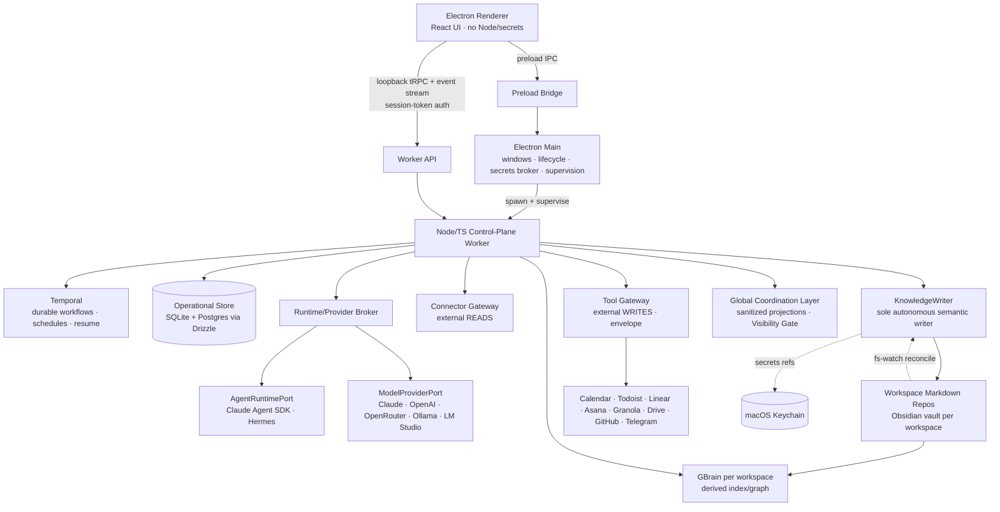

# System of Work Assistant

> **A Mac-first, local-first, self-hosted personal operating system** for coordinating employer work, side projects, and personal life — built as a *governed local control plane* over Obsidian-compatible Markdown.
>
> **Architecture posture:** *candidate-data-in, validated-and-policed-out; Markdown is the only canonical semantic truth and KnowledgeWriter is its only autonomous writer.*

<p align="center">
  <em>Status: early build — foundation phases landing.</em><br>
  <strong>Phase 0–1 complete</strong> (shared contracts + pure domain layer, 728 tests green at the Phase-1 gate) ·
  <strong>Phase 2 in progress</strong> (operational storage) · 13 phases total.<br>
  Not yet runnable as an end-user app. Node 22 · TypeScript (strict) · pnpm + Turbo monorepo.
</p>

---

## What it is

The System of Work Assistant is a single-owner, self-hosted control plane that closes meetings into notes/decisions/tasks, runs daily/weekly briefs, routes source ingestion, schedules across calendars, drives approvals (Mac + Telegram), answers questions over your own knowledge, and keeps connectors healthy — **without ever surrendering ownership of your data**.

It is **not** a chatbot and **not** an all-powerful agent. Every model output and agent result is treated as *candidate data* that must pass strict schema validation and policy checks before it can touch your Markdown or any external system. Durable knowledge lives in **per-workspace Obsidian-compatible Markdown Git repos** — human-readable, version-controlled, and yours. GBrain (a per-workspace index/graph) is **derived and rebuildable**, never an independent source of truth.

Work is partitioned into three trust-isolated workspaces — **Employer Work · Personal Business · Personal Life** — plus a sanitized **Global Coordination Layer (GCL)** that is the *only* path information crosses a workspace boundary.

## Core principles (load-bearing safety invariants)

1. **One writer / no hidden brain** — `KnowledgeWriter` is the only autonomous writer of canonical Markdown. A DB-only "fact" is a defect, quarantined — never served as truth.
2. **Candidate-data gate** — model/provider/agent output is candidate data until it passes a strict JSON-Schema gate + validators. No side effect happens before validation. Extraction never invents owners or dates (emit `TBD` or route to clarification).
3. **External-write envelope** — every external side effect flows through the Tool Gateway with an idempotency key + canonical object key + pre-write existence check + write receipt. Replay reuses the receipt ⇒ zero duplicate writes.
4. **Workspace isolation** — no raw cross-workspace retrieval. The GCL Visibility Gate is the single sanctioned cross-workspace read path.
5. **Employer-Work egress veto** — raw Employer-Work content with the egress acknowledgment OFF may go only to a local zero-egress provider, else the job fails closed. No silent cloud fallback.
6. **Untrusted-content tool-stripping** — any agent consuming imported/untrusted content runs read-only; a job declaring mutating tools is rejected at admission.
7. **Secrets** — resolved only through the macOS Keychain (`SecretsPort`); never written to Markdown, logs, or the renderer.

## Architecture



The desktop shell is **Electron**: an unprivileged React renderer, a thin **main** process (windows, lifecycle, secrets brokering, worker supervision), and a dedicated **Node/TypeScript control-plane worker** that owns durable workflows, policy, connectors, provider routing, the GBrain adapter, the operational store, outboxes, and read models. The renderer reaches the worker via **preload IPC** (privileged actions) and a **loopback tRPC API + event stream** authenticated by a per-launch session token (loopback binding is not authentication).

| Subsystem | Responsibility |
|---|---|
| **Shared Contracts & Domain** | Typed contracts, JSON-Schema gates, pure rules, the 6 state machines, validators, key builders |
| **Operational Storage** | App-owned state (event log, audit, approvals, outboxes, cursors, read models) — SQLite + Postgres via Drizzle |
| **Policy, Security & Egress** | Workspace policy, the provider×capability matrix, egress/tool policy, the four hard denials, worker-API auth |
| **Knowledge (Markdown · GBrain · GCL)** | KnowledgeWriter, vault rules + fs-watch reconciliation, the GBrain write-through/divergence layer, GCL Visibility Gate |
| **Provider & Runtime Broker** | `AgentRuntimePort` + `ModelProviderPort` behind a conformance-gated workspace×capability matrix |
| **Connector & Tool Gateways** | External reads (Connector Gateway) + the only external-write path (Tool Gateway envelope) |
| **Temporal Workflows** | Durable product workflows, retries, approval waits, schedules, sleep/wake resume |
| **Local App API + Desktop UI** | tRPC + WebSocket event stream; Electron surfaces (dashboard, inboxes, Copilot, System Health) |
| **Eval & Test Harness** | EVAL-1, conformance, leakage/injection suites, the GBrain divergence/parity gate |

Full contract: **[`ARCHITECTURE.md`](./ARCHITECTURE.md)** (loaded on demand by `§` anchor). The subsystem dependency DAG + parallel build tracks are in its **§2.5**.

## Tech stack

| Layer | Choice |
|---|---|
| Runtime | Node 22 LTS + TypeScript 5.x (`strict`) |
| Monorepo / build | pnpm workspaces + Turbo |
| Desktop | Electron + React + Vite |
| Workflows | Temporal (TypeScript SDK) |
| Storage | Drizzle ORM — SQLite (local) + Postgres (hosted-compatible) from day one |
| Local API | tRPC (commands/queries) + WebSocket (event stream) |
| Runtimes / providers | Claude Agent SDK · Hermes · Claude / OpenAI / OpenRouter / Ollama / LM Studio |
| Knowledge | Obsidian-compatible Markdown (canonical) + GBrain (derived index/graph) |
| Validation | Zod + JSON Schema (ajv, strict) |
| Tests | Vitest (+ a dedicated eval/conformance harness) |
| Secrets | macOS Keychain via `SecretsPort` |

## Monorepo layout

```text
apps/
  desktop/        Electron renderer · main · preload            (planned — Phase 9)
  worker/         Node/TS control-plane worker                  (planned — Phase 7+)
packages/
  contracts/      types · JSON Schemas · snapshots · events     ✅ built (Phase 1)
  domain/         pure rules · 6 state machines · validators · key builders   ✅ built (Phase 1)
  db/             Drizzle schema · SQLite + Postgres adapters · migrations     🛠 in progress (Phase 2)
  policy/         workspace · egress · tool · approval · matrix  (planned — Phase 3)
  knowledge/      KnowledgeWriter · GBrain write-through · GCL    (planned — Phase 4)
  providers/      AgentRuntimePort · ModelProviderPort           (planned — Phase 5)
  integrations/   Connector Gateway · Tool Gateway               (planned — Phase 6)
  evals/          EVAL-1 · conformance · leakage suites          (planned — Phase 12)
docs/
  planning/       requirements · decisions (ADRs) · domain + data models · threat model
  sessions/       chronological build session handoffs
  audits/         phase-exit auditor reports
  design/         design specs (e.g. GBrain write-through/divergence)
ARCHITECTURE.md   binding architecture contract (Appendix A = the model inventory)
IMPLEMENTATION_PLAN.md   spec-anchored phase/task tracker (13 phases, 0–12)
```

**Built so far:** `@sow/contracts` freezes all 27 cross-track contract models (each authored Zod-as-source → `z.infer` type → generated strict JSON Schema → frozen field-set snapshot, all registered in an ajv-strict gate); `@sow/domain` adds the 5 universal validators + the no-inference rule, the 6 pure state machines, and replay-stable key builders; `@sow/db` is landing the dual-dialect Drizzle schema, adapters, migrations, and the both-dialect repository contract suite.

## Getting started

> The app is not yet runnable end-to-end — these are the developer workflow commands for the parts that are built.

**Prerequisites:** macOS · Node ≥ 22 · pnpm 11.5 (`corepack enable`).

```bash
git clone git@github.com:SiWarlock/AI-System-Of-Work-Assistant-Agent.git
cd SoW-build
pnpm install

pnpm test         # Vitest across the workspace
pnpm typecheck    # tsc --noEmit across packages (Turbo)
pnpm lint         # static checks (ESLint config being stood up; currently tsc-backed)
```

Scope a single package while iterating:

```bash
pnpm --filter @sow/contracts test
node_modules/.bin/vitest run packages/db/test/contract/repository-contract.test.ts
```

The operational store's both-dialect repository suite runs against **SQLite** (better-sqlite3) and an **in-process real Postgres 16** (PGLite) by default; set `SOW_PG_DOCKER=1` to additionally exercise a `postgres:16` Docker container.

## Roadmap

Sequenced behind a shared-contract freeze (Phase 1, the forced-serial bottleneck); meeting-closeout is the primary proof spine. Phases 2/3/5/6 parallelize once contracts are frozen.

| Phase | Area | Status |
|---|---|---|
| 0 | Foundation spikes (Electron · GBrain · Hermes · providers · streaming · perf) | ✅ complete |
| 1 | Shared Contracts & Domain | ✅ complete (certified, `/phase-exit 1` CLEAR) |
| 2 | Operational Storage (SQLite + Postgres) | 🛠 in progress |
| 3 | Policy, Security & Egress | ⏳ planned |
| 4 | Knowledge: Markdown · GBrain write-through · GCL | ⏳ planned |
| 5 | Provider & Runtime Broker | ⏳ planned |
| 6 | Connector & Tool Gateways | ⏳ planned |
| 7 | Temporal Workflows & Automation | ⏳ planned |
| 8 | Local App API | ⏳ planned |
| 9 | Electron Desktop UI | ⏳ planned |
| 10 | Cross-cutting (observability · redaction · supervision · backup) | ⏳ planned |
| 11 | Deployment, Install, Rollback & Repair | ⏳ planned |
| 12 | Eval & Test Harness | ⏳ planned |

Per-task detail + current state: **[`IMPLEMENTATION_PLAN.md`](./IMPLEMENTATION_PLAN.md)**.

## How this is built

This codebase is built **test-first** and **spec-anchored**: every phase references the `ARCHITECTURE.md §` sections it implements, every deterministic unit gets a failing test before its implementation, and every contract model is frozen with a checked-in schema + field-set snapshot so a silent field change fails the build. LLM/provider-driven behavior is covered by an eval harness rather than unit tests.

Development is driven through **Claude Code** as a single-operator orchestration: parallel sub-agent **workflows** fan out the independent units of a phase (one agent per model/adapter/state-machine), a synthesis stage reconciles shared shapes, and an adversarial review stage (`arch-drift-auditor` + `security-reviewer` + a consistency critic) gates each phase exit. Decisions are recorded as ADRs in [`docs/planning/DECISIONS.md`](./docs/planning/DECISIONS.md); each session leaves a handoff in [`docs/sessions/`](./docs/sessions/) and each phase exit an audit report in [`docs/audits/`](./docs/audits/).

## Documentation map

| Doc | What |
|---|---|
| [`ARCHITECTURE.md`](./ARCHITECTURE.md) | Binding architecture contract; Appendix A = the model inventory |
| [`IMPLEMENTATION_PLAN.md`](./IMPLEMENTATION_PLAN.md) | Spec-anchored phase/task tracker + decision log |
| [`docs/planning/`](./docs/planning/) | Requirements · ADRs · domain/data models · threat model · evaluation criteria |
| [`docs/design/`](./docs/design/) | Design specs (e.g. the GBrain write-through & divergence/parity layer) |
| [`docs/sessions/`](./docs/sessions/) · [`docs/audits/`](./docs/audits/) | Build-session handoffs · phase-exit auditor reports |
| [`CLAUDE.md`](./CLAUDE.md) | Project conventions + the 7 key safety rules (build-agent guide) |

## Conventions

- **Strict typing everywhere** — every package is TypeScript `strict`; runtime validation (Zod + ajv) at every boundary.
- **Commits** — [Conventional Commits](https://www.conventionalcommits.org/); explicit staging (never `git add -A`); a phase is pushed only at its close-out.
- **TDD** for deterministic code; the eval harness for model-driven behavior.
- The seven **key safety rules** are non-negotiable invariants, not guidelines — see [`CLAUDE.md`](./CLAUDE.md).

## Status & license

Early-stage personal/self-hosted project under active construction. V1 targets an **unsigned build-from-source** install for technically capable users; a signed + notarized DMG and a hosted/always-on control plane are V1.1.

**License:** not yet finalized (intended permissive open-source for source installs). Until a `LICENSE` file is added, all rights reserved by the author.
