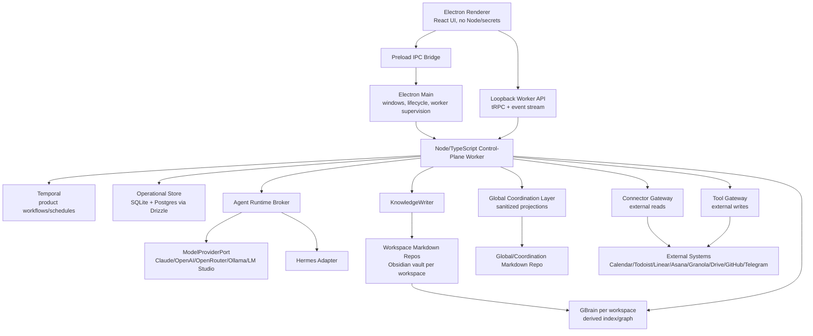
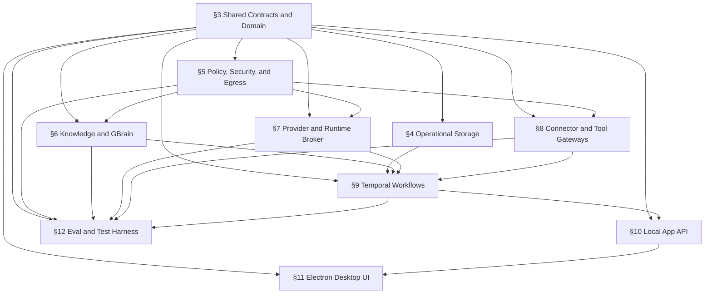

# System of Work Assistant Architecture Draft

Status: first-draft architecture spec for adversarial finalization.
Audience: project owner, `/arch-finalize`, `/tasks-gen`, future technical reviewers.
Build posture: production-grade.
Source PRD: `system_of_work_assistant_prd_v0_3.md`.
Planning mode: Expanded.

This is not the finalized root `ARCHITECTURE.md`. Claude Code should read this plus all companion planning docs, perform a second-pass gap audit, confirm load-bearing edits with the owner, then produce the binding root `ARCHITECTURE.md`.

## §1 - Executive Summary

The System of Work Assistant is a Mac-first, local-first, self-hosted personal operating system for a single technical owner/operator. It coordinates employer work, personal business, and personal life across external tools while preserving user-owned Obsidian-compatible Markdown as canonical semantic memory.

The architecture is a governed local control plane, not a chatbot and not an all-powerful agent. Product workflows are durable Temporal workflows. Semantic knowledge changes flow only through KnowledgeWriter into workspace Markdown repos. External side effects flow only through Tool Gateway. GBrain is required for retrieval/graph/health, but each workspace has its own GBrain brain and GBrain remains derived from Markdown. Cross-workspace global views use a Global Coordination Layer (GCL) containing sanitized projections, not raw blended retrieval.

The desktop shell is Electron. The renderer is unprivileged. Electron main owns windows, preload IPC, app lifecycle, and control-plane worker supervision. A dedicated Node/TypeScript worker owns workflows, policies, connectors, provider routing, storage, GBrain adapter, tRPC API, outboxes, and read models. The operational store has SQLite and standard Postgres adapters from day one through Drizzle. Model providers are routed through ModelProviderPort with Claude, OpenAI, OpenRouter, Ollama, and LM Studio support, gated by workspace/capability policy and strict JSON Schema validation.

Meeting closeout is the primary proof spine. Full PRD V1 remains in scope, but build sequencing starts with shared contracts, storage, workflow durability, provider conformance, GBrain parity, and the meeting closeout path before broadening to the rest of V1.

## §1A - Goals and Non-Goals

Goals:

- Preserve semantic memory in Obsidian-compatible Markdown Git repos.
- Keep raw workspace data isolated by default.
- Provide a useful global coordination surface without raw leakage.
- Close meetings into notes, decisions, tasks, calendar proposals, people/project updates, dashboard state, and audit.
- Support daily/weekly/monthly briefs, project dashboards, task routing, calendar coordination, source ingestion, NotebookLM managed-doc sync, approvals, and system health.
- Support multi-provider model routing with strict schema gates.
- Support local-first V1 and hosted-compatible operational storage.

Non-goals:

- No SaaS multi-tenant product in V1.
- No V1 app accounts beyond the single owner/operator.
- No raw global search across all workspaces by default.
- No direct runtime/GBrain/external MCP writes into Markdown.
- No direct external side effects from agents or Hermes automations.
- No NotebookLM direct API dependency in V1.
- No final `IMPLEMENTATION_PLAN.md` from this draft stage.

## §2 - System Overview



End-to-end invariant: model/provider outputs and agent results are candidate data only. They cannot affect Markdown or external systems until schema validation and policy checks pass.

## §2.5 - Subsystem Dependency DAG and Parallelization Seams

Import-direction rule: `apps -> application services -> contracts/domain -> infrastructure adapters`; infrastructure implements contracts but domain/contracts import no app or adapter code. Renderer imports only UI-safe client contracts and never imports worker internals.



Parallelization seams after contract freeze:

- Track `contracts`: shared types, schemas, workspace/capability/provider matrix, Drizzle schema contracts, test fixtures.
- Track `worker`: operational storage, Temporal workflows, outboxes, read models, tRPC API.
- Track `knowledge`: KnowledgeWriter, Markdown repo/vault rules, GBrain adapter, GCL projections.
- Track `providers-integrations`: ModelProviderPort, Claude/OpenAI/OpenRouter/Ollama/LM Studio adapters, Hermes, Connector Gateway, Tool Gateway.
- Track `desktop`: Electron shell, preload IPC, React UI, dashboard/inboxes/views.
- Track `eval-security`: EVAL-1 harness, leakage/prompt-injection suite, provider conformance, security gates.

Shared contracts across seams:

- `Workspace`, `ProviderMatrix`, `AgentJob`, `ToolPolicy`, `KnowledgeMutationPlan`, `ProposedAction`, `ExternalWriteEnvelope`, `Approval`, `SourceEnvelope`, `GclProjection`, `AuditRecord`, `WorkflowRunRef`.

## §3 - Shared Contracts and Domain

Responsibilities:

- Define cross-package TypeScript contracts.
- Define JSON Schemas used for provider/runtime outputs.
- Define Drizzle schema source for operational DBs.
- Define stable IDs, canonical object keys, idempotency keys, source refs, and audit refs.

Required contract packages:

- `packages/contracts`: runtime-safe types, JSON Schemas, tRPC router types, event names.
- `packages/domain`: pure domain rules, state machines, validation helpers, canonical key builders.
- `packages/db`: Drizzle schema, migrations, repository interfaces, SQLite/Postgres implementations.

Validation rules:

- Every model output crossing into application services must validate against a JSON Schema.
- Every external write must carry canonical object key and idempotency key.
- Every semantic mutation must carry workspaceId and sourceRefs.
- Every cross-workspace projection must declare visibility level and source workspace.

## §4 - Operational Storage

Responsibilities:

- Persist app-owned operational state: events, audit, approvals, outboxes, connector cursors, provider conformance, GCL projections, read models.
- Support SQLite local mode and standard Postgres hosted-compatible mode from day one.
- Use Drizzle migrations and repository contract tests for both adapters.

Boundaries:

- Does not store semantic truth; Markdown does.
- Does not store Temporal workflow history; Temporal does.
- Does not store GBrain index data; GBrain does.
- Does not store secrets; Keychain does.

Failure modes:

- DB unavailable: app enters degraded mode, surfaces System Health, queues where possible.
- Migration mismatch: startup blocks worker and reports repair instructions.
- Adapter divergence: contract test fails; release blocked.

## §5 - Policy, Security, and Egress

Responsibilities:

- Enforce workspace policy, provider matrix, egress policy, tool policy, approval policy, and visibility levels.
- Deny Employer Work raw cloud egress unless workspace settings gate is enabled.
- Deny direct raw cross-workspace retrieval.
- Deny untrusted-content agent jobs that declare mutating tools.

Electron security:

- Renderer has no Node integration, no direct DB/filesystem/secrets/connectors.
- Preload exposes a narrow typed IPC API for privileged desktop/lifecycle actions.
- Worker API binds loopback only and exposes typed commands/queries/events.

Provider security:

- Cloud providers are external processors and must be named in workspace egress policy.
- OpenRouter is treated as its own processor, not merely an OpenAI-compatible endpoint.
- Ollama/LM Studio local endpoints are allowed only through explicit local provider config.

## §6 - Knowledge, Markdown, Obsidian, GBrain, and GCL

Responsibilities:

- Preserve Obsidian-compatible Markdown as canonical semantic truth.
- Maintain one workspace repo/vault per workspace.
- Maintain one GBrain brain per workspace.
- Maintain a sanitized Global/Coordination Markdown repo for global briefs/reviews.
- Use GCL DB projections as source for global coordination UX.

KnowledgeWriter rules:

- Accepts only validated KnowledgeMutationPlans.
- Preserves human-owned sections.
- Writes atomically with compare-revision preconditions.
- Runs secret scan and ownership validation before commit.
- Records revisions, actor, source event, workflow run, idempotency key, and audit summary.
- Triggers GBrain sync/re-index after Markdown commit.

GBrain rules:

- Runtime-exposed GBrain MCP/tools are read/query/graph/timeline/schema-read/health only.
- GBrain write-through/dream/Minion semantic outputs must become KnowledgeMutationPlans before Markdown.
- GBrain DB-only facts are parity defects.
- If write-through containment fails, V1 ships GBrain read-only/index-only and still satisfies DoD.

GCL rules:

- Stores identity map, busy/free metadata, deadlines, sanitized summaries, and priority metadata.
- Does not store raw Employer Work or raw workspace content by default.
- Global UI shows grouped sanitized results and drills into one workspace context when authorized.

## §7 - Provider and Runtime Broker

Responsibilities:

- Accept AgentJobs from workflows.
- Enforce provider/capability/workspace matrix.
- Select runtime/provider/model.
- Enforce egress, cost, runtime, tool policy, schema, and retry constraints.
- Normalize outputs into capability schemas.

Providers:

- Claude via Claude Agent SDK remains reference/critical-path cloud runtime unless finalization changes it.
- OpenAI adapter supports OpenAI API structured-output/tool-capable workflows after conformance.
- OpenRouter adapter supports hosted model routing but must be tested independently.
- Ollama and LM Studio adapters support local optional zero-egress paths.
- Hermes adapter supports bounded jobs and autonomous cron/Kanban through gateways.

Strict side-effect rule:

- Provider output -> schema gate -> validator -> KnowledgeMutationPlan/ProposedAction -> KnowledgeWriter/Tool Gateway.
- No provider output can call write adapters directly.

## §8 - Connector and Tool Gateways

Connector Gateway:

- Owns outbound reads/syncs, connector auth scoping, cursors, retry/backoff, and health.
- Covers Calendar, Todoist, Linear, Asana, Granola, Drive/Docs, GitHub, Telegram capture, URL/source adapters.

Tool Gateway:

- Owns all external writes.
- Enforces approval policy, idempotency key, canonical object key, preconditions, pre-write existence check, payload hash, and write receipt.
- Supports replay without duplicates.

Notebook:

- V1 uses Drive-backed managed docs for NotebookLM source packs.
- NotebookLM direct API remains V1.1/spike-gated.

## §9 - Temporal Workflows and Automation

Responsibilities:

- Own product workflows, retries, approval waits, schedules, and resume behavior.
- Durable schedules run missed occurrences once collapsed on wake within catch-up window.
- In-flight workflows resume after restart/sleep and reuse side-effect envelopes.

Core workflows:

- Meeting closeout.
- Daily/weekly/monthly brief.
- Source ingestion.
- Project sync.
- Cross-calendar scheduling.
- Approval flow.
- Retention/deletion.
- Connector sync and health.

Hermes:

- Hermes cron/Kanban may initiate user-defined automations.
- Side effects still route through Tool Gateway and KnowledgeWriter.
- Temporal remains source of truth for product workflows.

## §10 - Local App API

Responsibilities:

- Expose typed local worker commands/queries/status streams to Electron.
- Use tRPC for TypeScript-native commands and queries.
- Use WS/SSE-style event stream for workflow status, approval updates, System Health, read-model changes.

Boundaries:

- Worker API is loopback-only.
- Renderer receives UI-safe projections, not secrets or unfiltered raw data.
- Privileged app lifecycle and file picker operations remain through preload IPC/main.

## §11 - Electron Desktop UI

Surfaces:

- Global Today Dashboard.
- Workspace tabs.
- Project dashboard.
- Copilot.
- Ingestion Inbox.
- Approval Inbox.
- Calendar view.
- Recent Changes.
- System Health.

UX rules:

- Global surfaces use GCL sanitized grouped results.
- Drill-down opens workspace-scoped raw context according to policy.
- Employer Work egress status is visible in System Health and workspace settings.
- Approval state is consistent across Mac and Telegram.

## §12 - Eval and Test Harness

Test posture: contract/eval-heavy.

Required suites:

- Drizzle migration/repository contract tests on SQLite and Postgres.
- Provider conformance tests for every enabled provider/capability/model.
- Runtime adapter conformance for Claude SDK and Hermes.
- KnowledgeWriter Markdown ownership/merge/secret tests.
- GBrain parity/rebuild/divergence tests.
- Tool Gateway idempotency/replay tests.
- Connector outage/retry tests.
- Prompt-injection red-team corpus.
- WS-7 workspace leakage suite.
- EVAL-1 meeting closeout and retrieval benchmarks.
- Electron security/IPC tests.
- Temporal sleep/wake/restart tests.
- Clean install test.

## §13 - Deployment and Install Strategy

V1 local:

- Electron app starts thin main process and supervises control-plane worker.
- Worker starts/connects to local Temporal dev server with persistent storage.
- Worker opens app operational SQLite in local mode by default.
- GBrain runs as single-owner local process/sidecar per workspace brain.
- External connectors use user-configured credentials stored in Keychain.
- All local services bind loopback only.

Hosted-compatible:

- Operational store supports standard Postgres adapter from day one.
- Hosted always-on control plane remains V1.1 behind existing workflow host, event ingress, and instance lease adapters.
- Supabase can host Postgres later but is not part of the architecture contract.

## §14 - Alternatives Considered

- Tauri vs Electron: Electron chosen for TypeScript-first control plane and lower bridge friction.
- Monorepo subdirs vs repo/vault per workspace: per-workspace chosen for privacy and Obsidian alignment.
- Source-scoped personal GBrain vs brain per workspace: brain per workspace chosen for stronger isolation.
- SQLite-only vs dual SQLite/Postgres: dual chosen for hosted-compatible storage discipline.
- Global raw search vs GCL projections: GCL projections chosen for privacy.
- Cloud-only models vs cloud + local: cloud + local chosen for flexibility, with local optional and conformance-gated.

## §15 - Scope Boundaries and Deferred Work

Deferred to V1.1+:

- Hosted always-on control plane while Mac sleeps.
- NotebookLM direct API adapter if supported.
- Supabase-specific Auth/Realtime/Storage/Edge Functions.
- 1Password/pluggable secret providers.
- Gmail/Slack.
- Advanced OCR/PDF beyond V1 source adapter commitments.
- Aggregate workspace/global spend caps with auto-pause.
- Deeper retention/pruning policy controls.
- Multi-user/team mode.

Not deferred:

- Idempotency, approvals, audit, provider schema validation, prompt-injection defense, workspace isolation, secrets handling, error paths, retry/outbox, System Health, GBrain parity, and install reproducibility.

## §16 - Architecture Gap Audit Targets for `/arch-finalize`

`/arch-finalize` must specifically check:

1. Every PRD Tauri reference is reconciled with the user-confirmed Electron decision.
2. Every cross-workspace flow routes through GCL, not raw multi-brain search.
3. Provider matrix integrates with egress policy and strict schema gates.
4. SQLite/Postgres dual support has a real testable contract.
5. NotebookLM direct API remains non-blocking.
6. Hermes autonomy cannot bypass gateways.
7. Obsidian human-owned sections are preserved.
8. Final DoD cannot be satisfied by mocks.

## §17 - Repo Scaffold

Recommended repo shape:

```text
apps/
  desktop/        Electron renderer, main, preload
  worker/         control-plane worker runtime
packages/
  contracts/      shared types, JSON Schemas, tRPC router types
  domain/         pure domain rules and state machines
  db/             Drizzle schema, migrations, repos, SQLite/Postgres adapters
  workflows/      Temporal workflow definitions and activities
  policy/         workspace, egress, approval, provider matrix logic
  knowledge/      KnowledgeWriter, Markdown repo adapter, GBrain/GCL adapters
  integrations/   Connector Gateway and Tool Gateway adapters
  providers/      ModelProviderPort adapters
  ui/             shared UI primitives if needed
  evals/          EVAL-1 harness, fixtures, conformance suites
docs/
  planning/       this rough-draft package
```

Tooling:

- pnpm workspaces.
- Turbo task orchestration.
- TypeScript strict mode.
- Drizzle migrations.
- JSON Schema validation.
- Contract tests across package boundaries.

## §18 - Spec Anchor Index

| Requirement | Implemented by § | Summary |
|---|---|---|
| REQ-F-001..005 | §3, §5, §6, §10, §11 | Workspace, Markdown, GBrain, GCL boundaries |
| REQ-F-006 | §6 | KnowledgeWriter one-writer invariant |
| REQ-F-007 | §9 | Meeting closeout spine |
| REQ-F-008..013 | §6, §8, §9, §10, §11 | Briefs, scheduling, ingestion, project sync, approvals, deletion |
| REQ-F-014 | §7, §8, §9 | Hermes gateway routing |
| REQ-F-015 | §7 | ModelProviderPort |
| REQ-D-001..005 | §4, §6 | Storage/source-of-truth model |
| REQ-S-001..006 | §5, §7, §8, §12 | Security, egress, schema gates |
| REQ-I-001..005 | §7, §8, §9, §12 | Providers and connectors |
| REQ-T-001..003 | §12 | Test/eval posture |

## Appendix A - Model / Contract Inventory

| Model | Section | Fields (summary) |
|---|---|---|
| Workspace | §3, §6 | id, name, type, dataOwner, repo path, gbrainBrainId, egressPolicy, providerMatrix |
| ProviderMatrix | §5, §7 | workspaceId, allowedProviders, capability defaults, egress flags |
| AgentJob | §7, §9 | workflowRunId, workspaceId, capability, contextRefs, schema, toolPolicy, providerRoute, budgets, idempotency |
| KnowledgeMutationPlan | §6, §7 | workspaceId, sourceRefs, creates, patches, links, frontmatter, proposed actions, confidence |
| ExternalWriteEnvelope | §8 | targetSystem, canonicalObjectKey, idempotencyKey, preconditions, payloadHash, receipt |
| SourceEnvelope | §8, §9 | sourceId, workspaceId, origin, contentHash, type, sensitivity, routing hints |
| GclProjection | §5, §6, §11 | workspaceId, visibility, projection type, sanitized payload, source refs |
| Approval | §8, §10, §11 | actionRef, status, channel, actor, payload hash |
| AuditRecord | §4, §8, §12 | actor, event, refs, payload hash, before/after summary |

